.. _bake_editor_panel:

Bake Editor Panel
===================

Introduction
--------------

**To access this panel, you must be in the Main Panel and press the Bake Editor button** Here is the section of the Main
Panel :ref:`bake_editor_button`

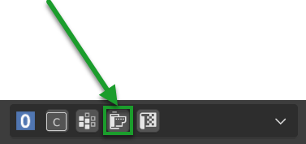

|

.. warning::
        In Blender 3.6.0 there is an Blender Crash during the Bake, please update Blender to 3.6.1 or higher!
        I tried to do a bugfix, but it doesn't depend on me in that version 3.6.0 there is a Bug

.. important::
        - The Bake Editor Panel remains in Beta phase as it is still under development, there are still some cases in which
          the Bake will not work correctly, although they are very few.
        - The bake is a fairly slow and heavy process, this tool has been designed to facilitate the Bake process,
          which normally in Blender is a much more complex and long process and requires a lot of experience and time.

.. hint::
        **What is the Bake?**

        The Bake is a process that is normally used to merge into a single material (Textures) so that it can be exported
        to a game engine.

        **Do you have to use the bake to export an object with material to a game engine?**

        Actually no, in fact I personally do not recommend it. The best practice (Where possible) would be to export the object
        and then in the game engine hook up the textures correctly in the material of the game engine.
        There are many different techniques and many different approaches, so there is no fixed rule, but in general
        it is always better to avoid the bake, unless it is strictly necessary.

        **Why is it sometimes better to avoid the bake?**

        From my point of view, it is a problem of file size, I'll give you an example:

        Suppose you have 1 house, 1 wall, 1 floor in a game, and on them there is the same material (For example cement)
        if you wanted to bake these 3 objects, you would have 3 different bakes, and therefore 3 different textures, while
        if you exported the 3 objects with the original material, you would only have 1 texture, and therefore a much smaller file.
        in addition, the bake makes a unique texture for each object, so this would also require a large resolution,
        because the cooked texture, in most cases, has no continuity! It is wrapped all over the object.

------------------------------------------------------------------------------------------------------------------------

Basic Usage
-------------

At the end of the process, you will have chosen a destination path, you will find a new folder, containing all your
baked textures and your model saved as Fbx (If you have chosen to export the Fbx), ready to import into another file or
another software

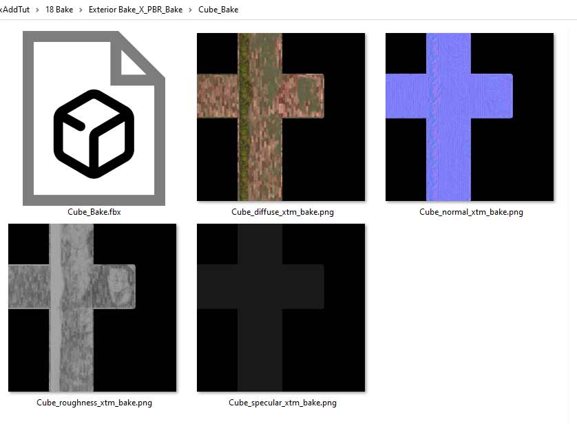

------------------------------------------------------------------------------------------------------------------------

Bake Modes
-----------

The bake editor panel has 3 different **Bake Mode**, depending on which mode you choose, the panel will take on a
slightly different appearance in the **Lighting** section

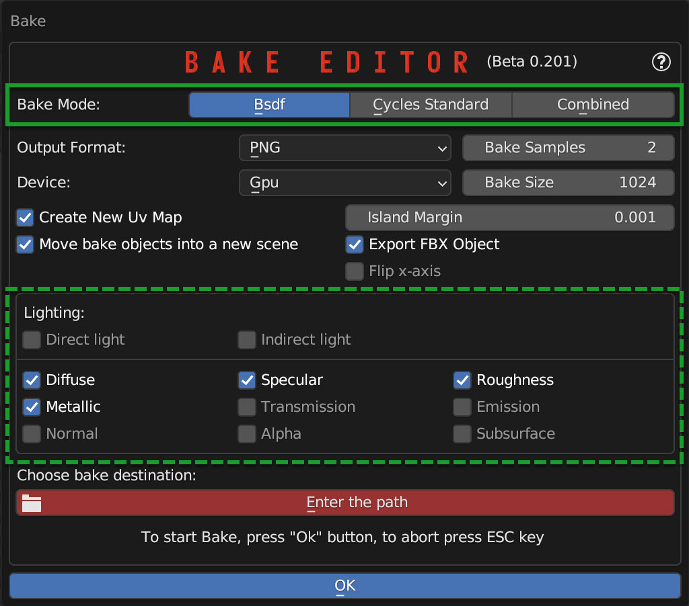

------------------------------------------------------------------------------------------------------------------------

Output Format
--------------

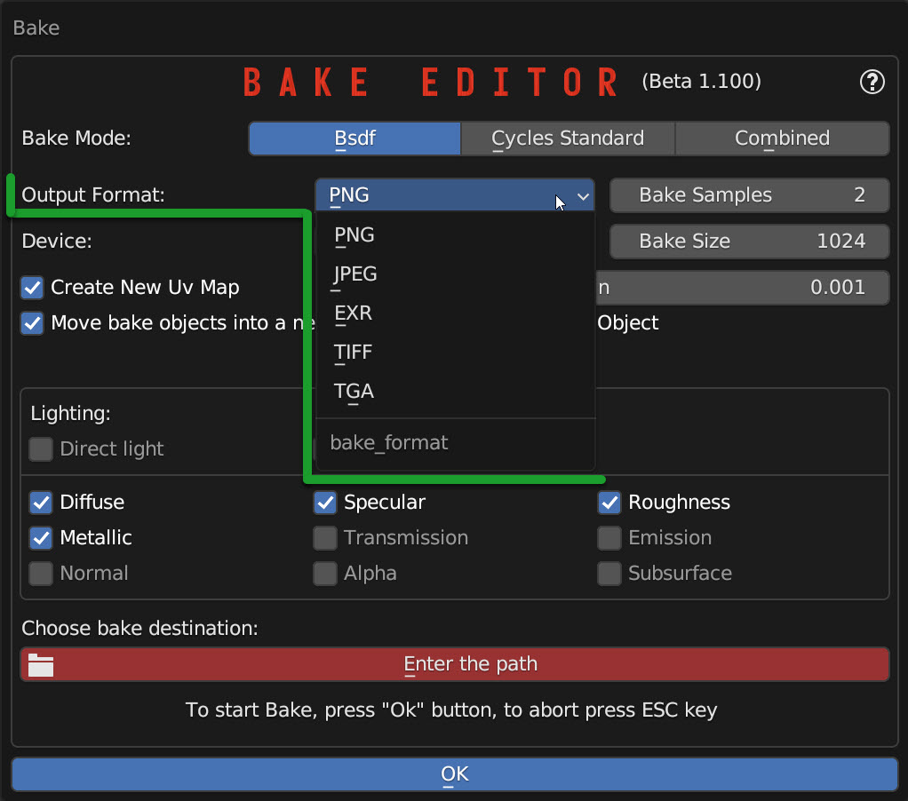

|

Qui puoi scegliere il formato di output della texture, puoi scegliere tra:

**(PNG, JPEG, EXR, TIFF, TGA)**

------------------------------------------------------------------------------------------------------------------------

Bake Device
------------

.. image:: _static/_images/bake_panel/bake_editor_device.jpg
    :align: center
    :width: 600
    :alt: Bake Editor Device 01

|

Here you can choose with which device to do the Bake, you can choose between **CPU** and **GPU**

**GPU:**

- This is the fastest way to do the Bake! In fact, it will be the graphics card that will render the material.
  Keep in mind, however, if you have a GPU with relatively little RAM, you may have memory problems during the Bake,
  so in most cases, if during the Bake process the addon should encounter an error, it will pass
  silently and automatically in CPU mode and will try to render again.

**CPU:**

- In this way the Bake will be much slower, but you should not have memory problems if your computer is equipped
  with at least 16GB of RAM.

These 2 indications are for information purposes only and in principle, outside there are the latest generation graphics
cards that go much faster than a CPU, but there may be some cases where this rule is not necessarily valid.

------------------------------------------------------------------------------------------------------------------------

Bake Samples
-------------

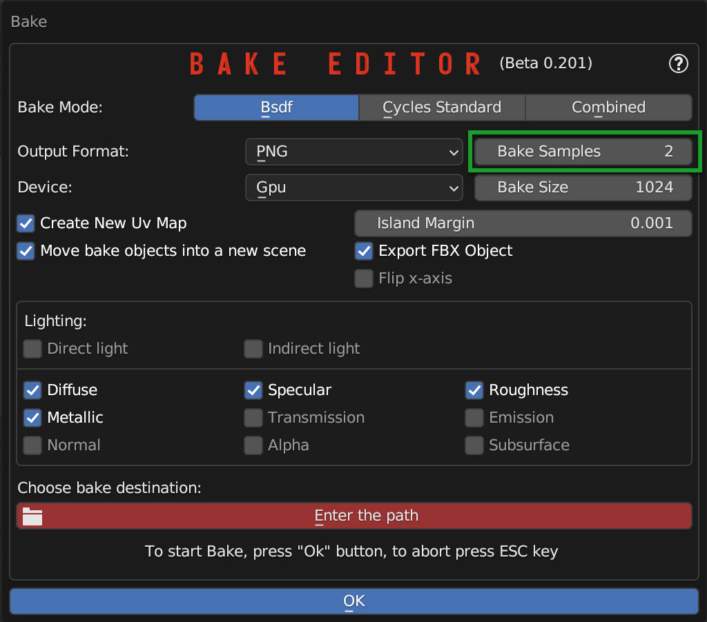

|

The samples are the number of times the Bake will render the material, the higher the number of samples, the more the
Bake will be precise, but also slower. This rule is almost the same as that of a normal rendering.

------------------------------------------------------------------------------------------------------------------------

Bake Size
----------

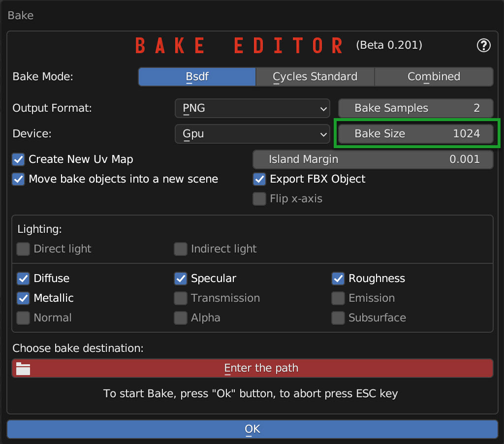

|

Here you decide the resolution of the texture that will be created, the higher the resolution, the more detailed the
texture will be, but be careful, the higher the resolution, the slower and heavier the Bake will be, in addition it will

------------------------------------------------------------------------------------------------------------------------

Create new UV Map
------------------

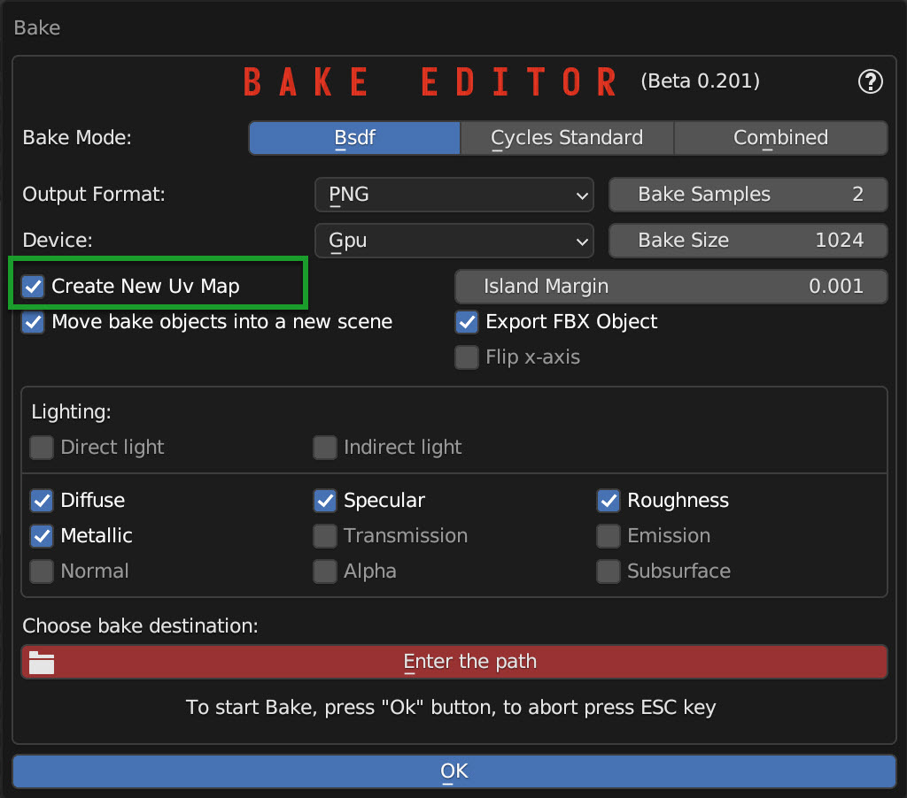

|

If active, the addon will create a Smart projection on a new UV Map, this UV Map will be used for the Bake, so
I recommend you leave this box active.

------------------------------------------------------------------------------------------------------------------------

Island Margin
--------------

.. image:: _static/_images/bake_panel/bake_island_margin.jpg
    :align: center
    :width: 600
    :alt: Bake Editor Island Margin

|

This value is used to create a margin between the islands, this margin is used to avoid the problem of bleeding,
which is a problem that occurs when the Bake is done, and the texture is not perfectly aligned with the UV Map,
so there is a small space between the islands, and this space is filled with the color of the adjacent island.

------------------------------------------------------------------------------------------------------------------------

Move Bake object in a new scene
--------------------------------

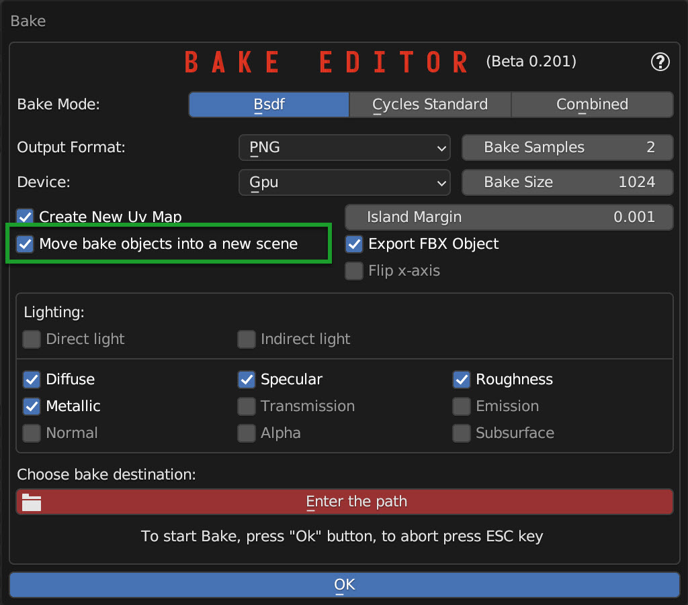

|

.. note::
        The Bake of Extreme PBR always creates New objects that are a copy of the original object, this is to avoid
        ruining the original object.

So here you can decide whether to move the Bake objects to a new scene, in this way you will not have the Bake objects
in the original scene, but in a new scene. A new scene will be created where only the Bake objects will be present,
and the original scene will remain unchanged.

At the end of the Bake, in the main panel, if this option is active, a button will be displayed to return to the
original scene and delete the Bake scene.

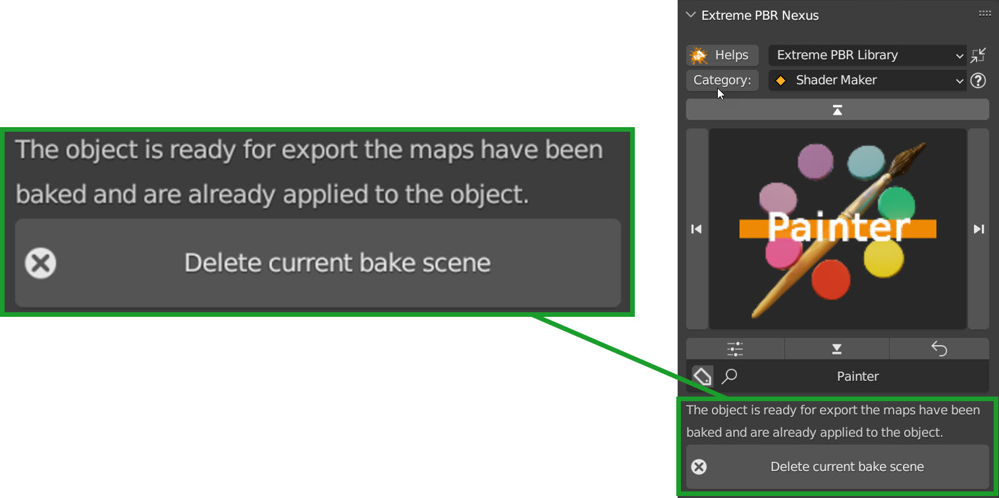

|

.. important::
        Make sure you don't work in the bake scene, otherwise you could lose the work done in that particular scene.

|

In the Blend file a new scene is created, containing a copy of the model with a new simple PBR Material and a new UV Layout.

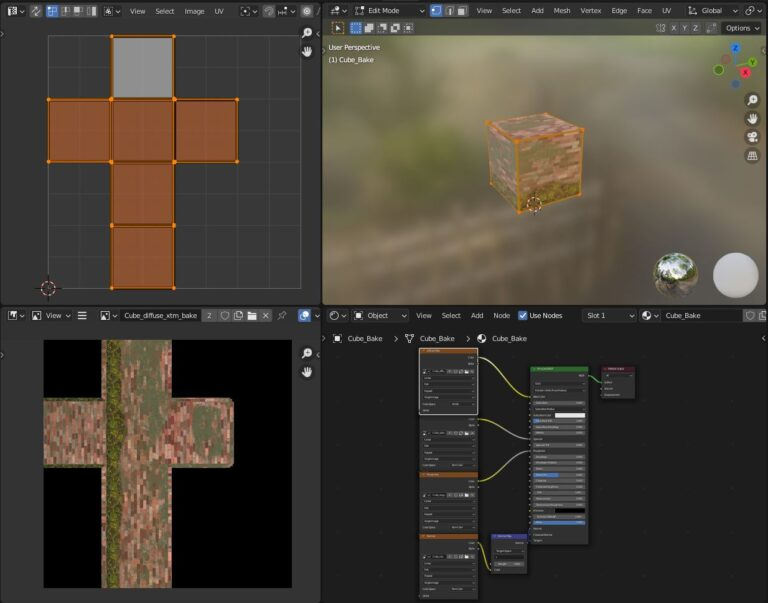

------------------------------------------------------------------------------------------------------------------------

Export FBX object
------------------

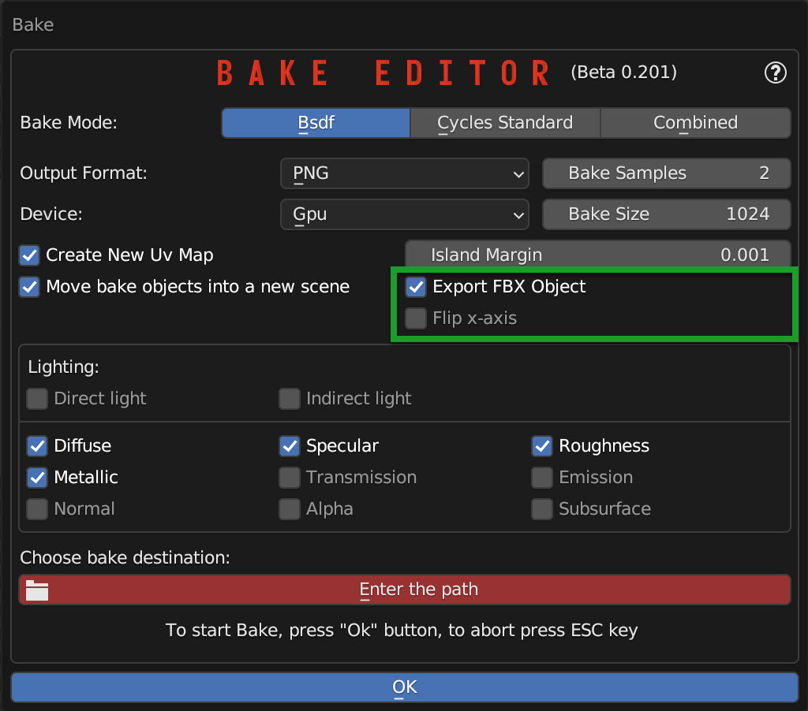

|

If active, at the end of the Bake, an FBX of the original object will be exported, this FBX will contain the original
object with the textures in the same folder.

------------------------------------------------------------------------------------------------------------------------

Flip X Axis
*************

Engines like Unreal and Unity 3D, have Global X-Y-Z axes different from Blender, so the X axis is usually reversed.
If you check this box, the addon will try to invert your model on the X axis. For any problem,
if you encounter any problems, please uncheck this box.

.. note::
      This function is a bit experimental, there may be cases where the result is not what you expected.
      Pay attention when you use this function, and always check the final result if it is what you expect.

------------------------------------------------------------------------------------------------------------------------

Lighting
--------------

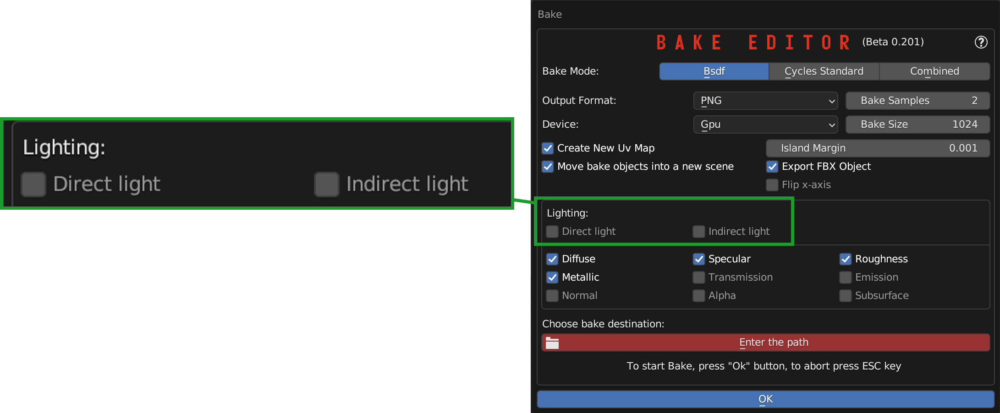

Direct Light
****************

If active, it adds direct light to the Bake, so if you have a light source in your scene, this will be added to the Bake.
The object will be illuminated by direct light.

Indirect Light
****************

If active, it adds indirect light to the Bake, so if you have a light source in your scene, and for example it bounces
on a floor or a wall, this light will contribute to illuminate the object, so the object will be illuminated by
indirect lights even in the bake.

.. note::
      Is possible to leave both options inactive, in this way the light of the scene will not affect the Bake,
      but pay attention, this can only be done in **COMBINED** bake mode, in fact this mode requires that one of the
      2 options is active, otherwise the Bake will not even start.

**Here is an example:**

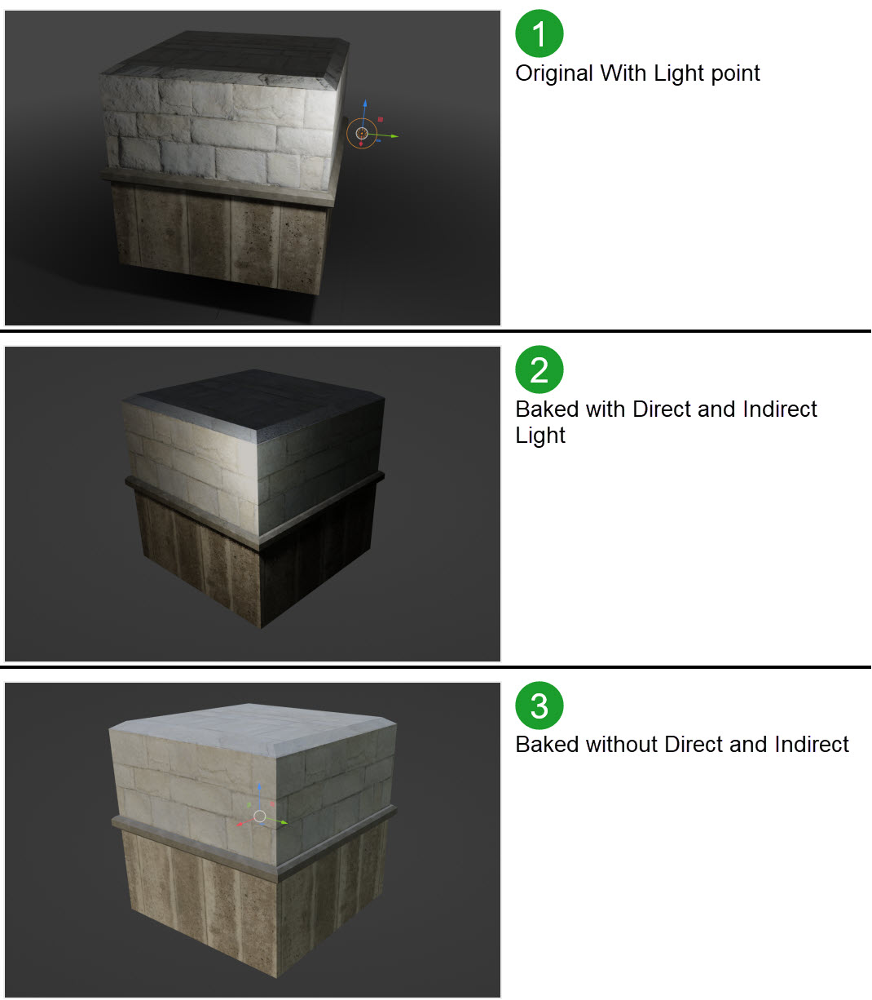

|

As can be seen from this example above, the final material (ie Bake) is very different depending on whether you choose
to activate or not the direct and indirect light.

------------------------------------------------------------------------------------------------------------------------

Bake maps BSDF mode
---------------------

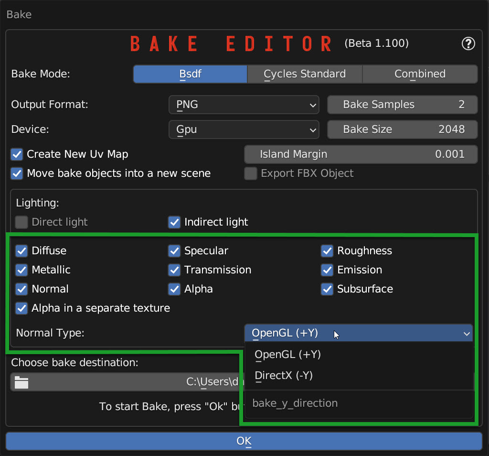

|

.. note::
        The bake in BSDF mode works in accordance with the Principled BSDF node, so during this process, all the maps
        that have been selected for the bake, will be temporarily inserted into the **Base Color** socket of the Principled BSDF node.
        **This Bake mode is only possible if the BSDF node is present and connected to the Material Output node**

        .. image:: _static/_images/bake_panel/principled_bsdf_node.jpg
            :align: center
            :width: 200
            :alt: Principled BSDF Node

|

**Below is a description of each option in the Bake Maps BSDF Mode:**

**Diffuse**
   - If active, the Bake will create a Diffuse texture, ie everything that is inserted in the BSDF node in the **Base Color** input
     will be baked into a Diffuse texture.

**Specular**
    - If active, the Bake will create a Specular texture, ie everything that is inserted in the BSDF node in the **Specular** input
      will be connect in the **Base Color** socket and then baked into a Specular texture.

**Roughness**
    - If active, the Bake will create a Roughness texture, ie everything that is inserted in the BSDF node in the **Roughness** input
      will be connect in the **Base Color** socket and then baked into a Roughness texture.

**Metallic**
    - If active, the Bake will create a Metallic texture, ie everything that is inserted in the BSDF node in the **Metallic** input
      will be connect in the **Base Color** socket and then baked into a Metallic texture.

**Transmission**
    - If active, the Bake will create a Transmission texture, ie everything that is inserted in the BSDF node in the **Transmission** input
      will be baked connect in the **Base Color** socket and then baked into a Transmission texture.

**Emission**
    - If active, the Bake will create an Emission texture, ie everything that is inserted in the BSDF node in the **Emision** input
      will be connect in the **Base Color** socket and then baked into an Emission texture.

**Normal**
    - If active, the Bake will create a Normal texture, ie everything that is inserted in the BSDF node in the **Normal** input
      will be connect in the **Base Color** socket and then baked into a Normal texture.

**Alpha**
    - If active, the Bake will create an Alpha texture, ie everything that is inserted in the BSDF node in the **Alpha** input
      will be baked connect in the **Base Color** socket and then baked into an Alpha texture.

**Subsurface**
    - If active, the Bake will create a Subsurface texture, ie everything that is inserted in the BSDF node in the **Subsurface** input
      will be connect in the **Base Color** socket and then baked into a Subsurface texture.

**Alpha in separate texture**
    - If active:
        The Bake will create an Alpha texture, ie everything that is inserted in the BSDF node in the **Alpha** input
        will be connect in the **Base Color** socket and then baked into an Alpha texture.
    - If inactive:
        The Bake will create an Alpha texture and if the **Diffuse** item is active, a texture with the Alpha channel included in the Diffuse map will be created.

**Normal type**
    (Works in accordance with the **Normal** item if active)
     - **OpenGL (+Y):**
        The Bake will create a Normal texture with the Y channel inverted, this is necessary for some game engines like Unity 3D.
     - **DirectX (-Y):**
        The Bake will create a Normal texture with the Y channel not inverted, this is necessary for some game engines like Unreal Engine.

------------------------------------------------------------------------------------------------------------------------

Bake maps Cycles Standard mode
-------------------------------

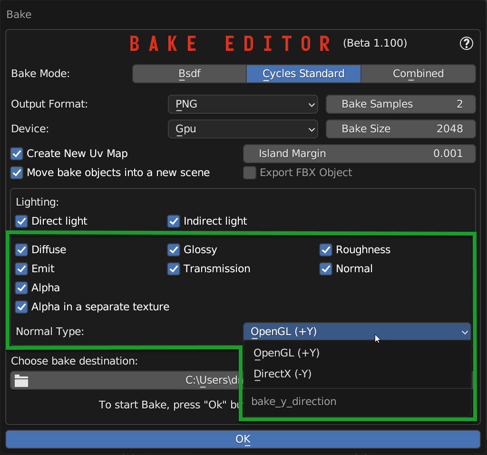

|

This Bake mode uses Blender's standard Bake mode, does not require a Principled BSDF node,
and uses the options already present in blender as in this example:

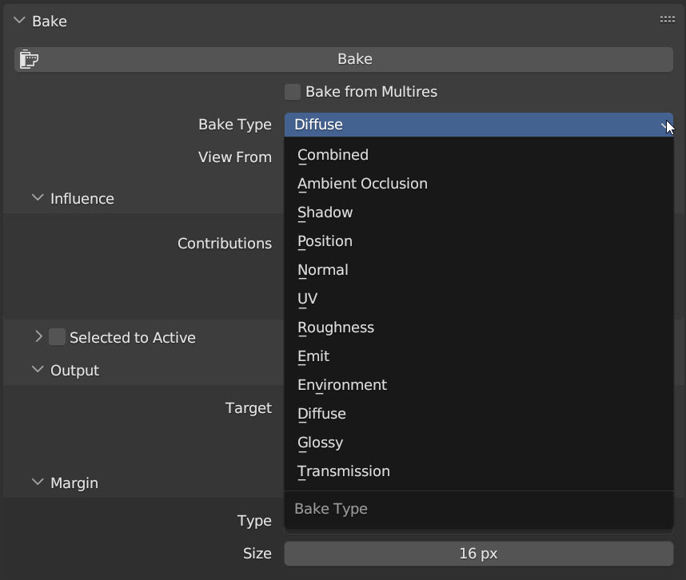

|

So for each map selected for the Bake, Extreme PBR will set the options and perform the bake.

**Below is a description of each option in the Bake Maps Cycles Standard Mode:**

**Diffuse**
   - If active, the Blender Bake will be set to **Diffuse** and execute the Bake. So it will create and export a Diffuse texture.

**Glossy**
    - If active, the Blender Bake will be set to **Glossy** and execute the Bake. So it will create and export a Glossy texture.

**Roughness**
    - If active, the Blender Bake will be set to **Roughness** and execute the Bake. So it will create and export a Roughness texture.

**Emit**
    - If active, the Blender Bake will be set to **Emit** and execute the Bake. So it will create and export a Emit texture.

**Transmission**
    - If active, the Blender Bake will be set to **Transmission** and execute the Bake. So it will create and export a Transmission texture.

**Normal**
    - If active, the Blender Bake will be set to **Normal** and execute the Bake. So it will create and export a Normal texture.

**Alpha**
    - If active, the Blender Bake will be set to **Alpha** and execute the Bake. So it will create and export a Alpha texture.

**Alpha in a separate texture**
    - If active:
        the Blender Bake will be set to **Alpha** and execute the Bake. So it will create and export a Alpha texture.
    - If inactive:
        the Blender Bake will be set to **Diffuse** and execute the Bake. So it will create and export a Diffuse texture with the Alpha channel included.

**Normal type**
    (Works in accordance with the **Normal** item if active)
     - **OpenGL (+Y):**
        the Blender Bake will be set to **Normal** and execute the Bake. So it will create and export a Normal texture with the Y channel inverted, this is necessary for some game engines like Unity 3D.
     - **DirectX (-Y):**
        the Blender Bake will be set to **Normal** and execute the Bake. So it will create and export a Normal texture with the Y channel not inverted, this is necessary for some game engines like Unreal Engine.

------------------------------------------------------------------------------------------------------------------------

Bake Maps Combined mode
------------------------

.. important::
        This mode necessarily needs to have activated at least one of the 2 options **Direct Light** or **Indirect Light**,
        otherwise the Bake will not even start.

|

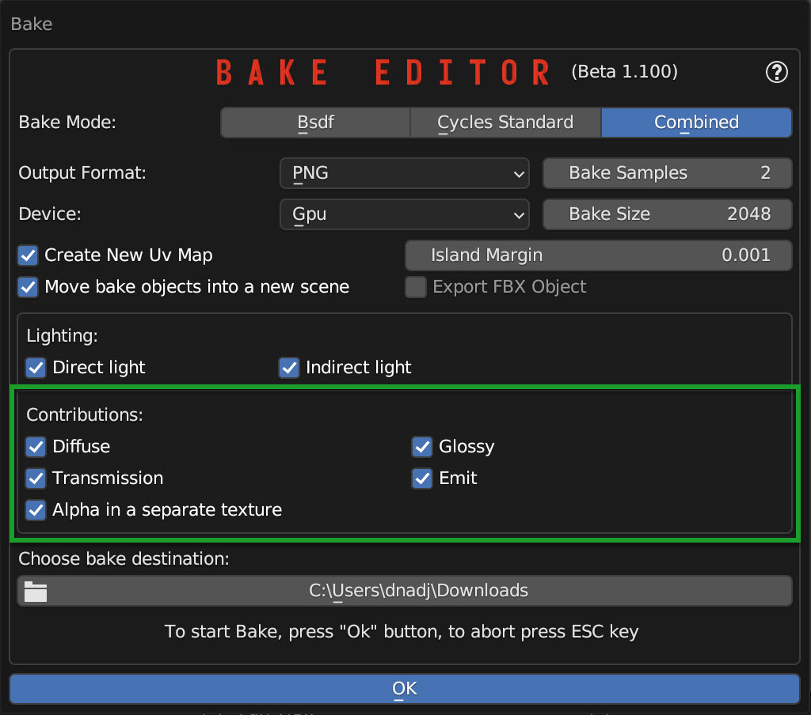

|

This type of Bake is practically the reproduction of the one already present in Blender as follows in the image:

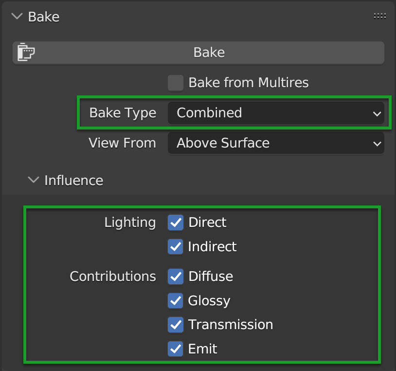

|

.. hint::
    Do not be fooled by this introduction, this tool is very complex and does not limit itself to reproducing that of
    Blender, but rather to prepare all the necessary nodes, select them, bake them and save them in the format you choose.
    A very long and tedious process in Blender at the moment

So as already anticipated, one of the two options **Direct Light** or **Indirect Light** must be active, in this way
the Bake will start and create a **Combined** texture.

**Below is a description of each option in the Bake Maps Combined Mode:**

**Diffuse**
   - If active, the Blender Bake will be set to **Diffuse** and execute the Bake. So this step will be included in the
     resulting single texture, (So the diffuse map)

**Glossy**
    - If active, the Blender Bake will be set to **Glossy** and execute the Bake. So this step will be included in the
      resulting single texture, (So the diffuse map)

**Transmission**
    - If active, the Blender Bake will be set to **Transmission** and execute the Bake. So this step will be included in
      the resulting single texture, (So the diffuse map)

**Emit**
    - If active, the Blender Bake will be set to **Emit** and execute the Bake. So this step will be included in the
      resulting single texture, (So the diffuse map)

**Alpha in separate texture**
    - If active and the material has an Alpha map, the bake will create a separate Alpha texture, otherwise the Alpha
      will be included in the Diffuse texture in the Alpha channel.

------------------------------------------------------------------------------------------------------------------------

Choose Bake Destination
------------------------

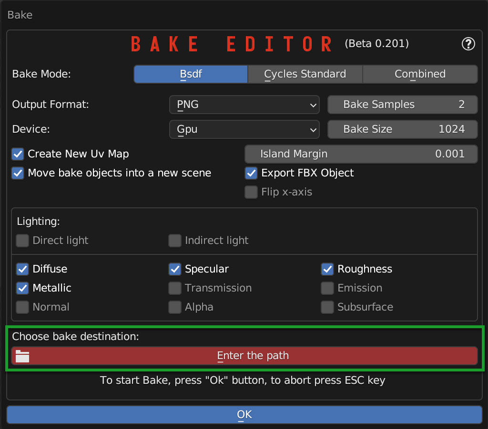

|

This button opens a file browser, where you can choose the destination folder of the Bake

.. note::
        In the folder chosen as the destination (Only if the Bake has been started), a folder with the name of the
        current project will be created, inside of it the necessary files will be created, Images and in case you have
        chosen to export an FBX, also the FBX.
        **Each object will be contained in a folder with the name of the object itself**

