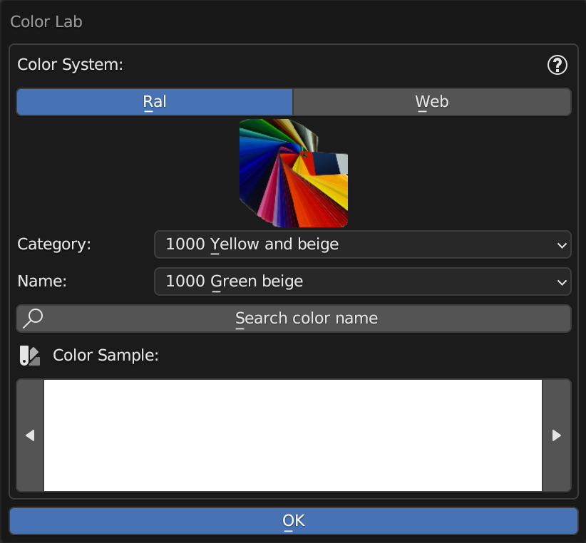
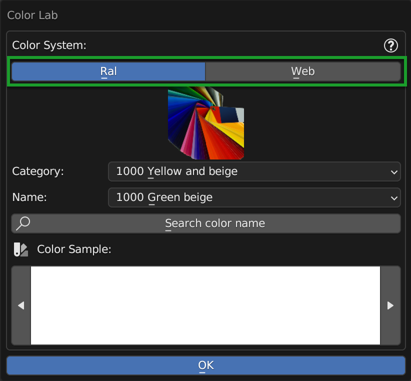
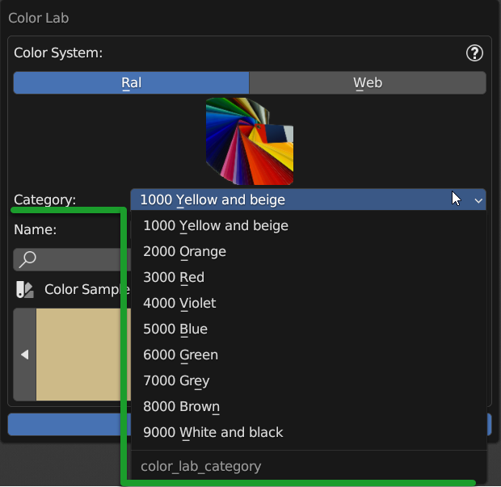
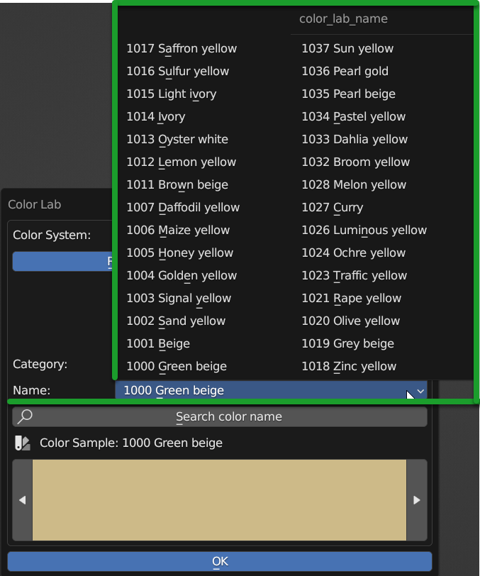
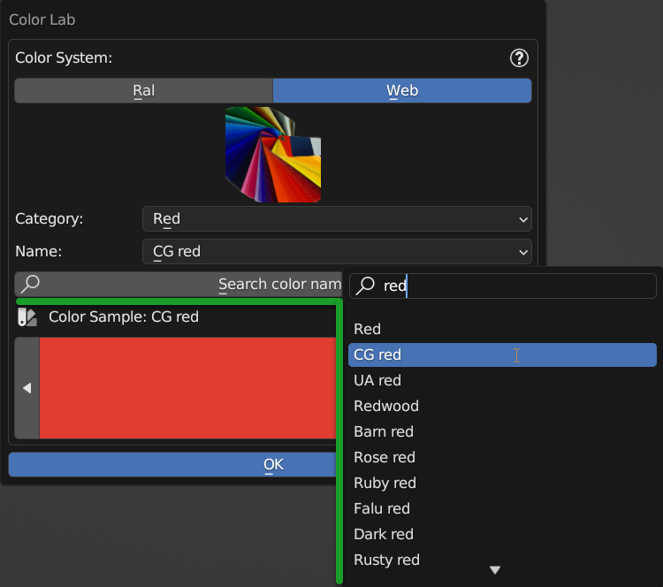
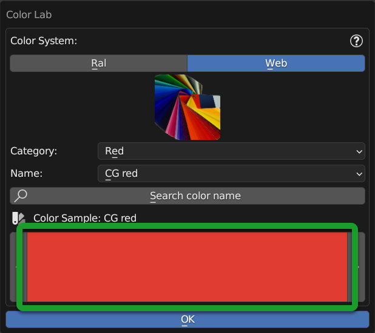
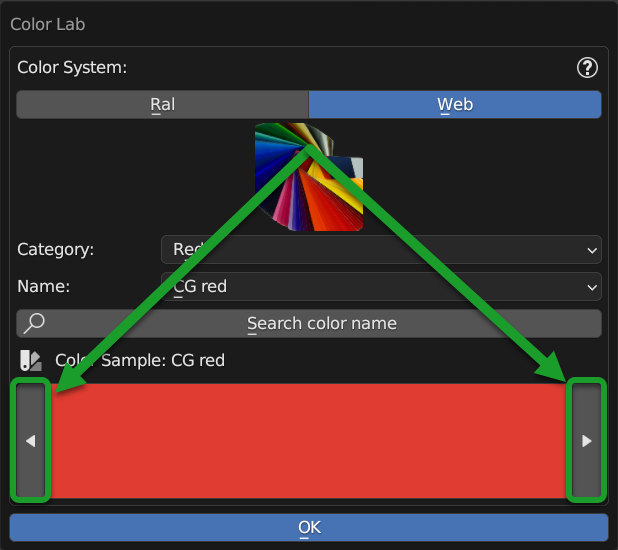

.. _color_lab:

Color Lab
============

This Panel can be called from the Material Editor Panel here is the section of the :ref:`color_lab_button`

|

Color Lab Panel allows according to the RGB color property that resides next to the various interfaces of the material management
of Extreme PBR, to set the color from a list of predefined and named colors.

.. hint::
        Once you have found the color you are looking for, press the ok button, and the color will be applied to the
        property from which you called the panel.

------------------------------------------------------------------------------------------------------------------------

Color System
-------------

|

This selector, allows you, at the moment, to choose between 2 color systems:

- **Ral**
    - Acronym for "Reichs-Ausschuß für Lieferbedingungen und Gütesicherung", is a color system developed in
      Germany in 1927 to standardize paint colors. The system consists of 213 colors, each of which
      is identified by a 4-digit code.

- *Web**
    - A collection of 960 colors from the web with the corresponding names.

------------------------------------------------------------------------------------------------------------------------

Category
---------

|

Here you will see the list of categories corresponding to the selected color system.

------------------------------------------------------------------------------------------------------------------------

Name
-----

|

From this drop-down menu, you can have the complete list of the names of the colors present in the selected category.

------------------------------------------------------------------------------------------------------------------------

Search color name
------------------

|

By pressing this button a search menu will appear where you can enter the name of the color you want to search for.

.. note::
        This search menu analyzes all color systems and all categories, so you can search for a color
        in any color system and in any category.+

------------------------------------------------------------------------------------------------------------------------

Preview Color
--------------

|

This is the preview of the selected color, it can also be edited manually, but the header with the exact color name will be lost.

------------------------------------------------------------------------------------------------------------------------

Previous Next Color
---------------------

|

These 2 buttons allow you to switch from one color to another within the selected category and not beyond.
Useful for browsing colors and seeing in the preview which color it actually is.

