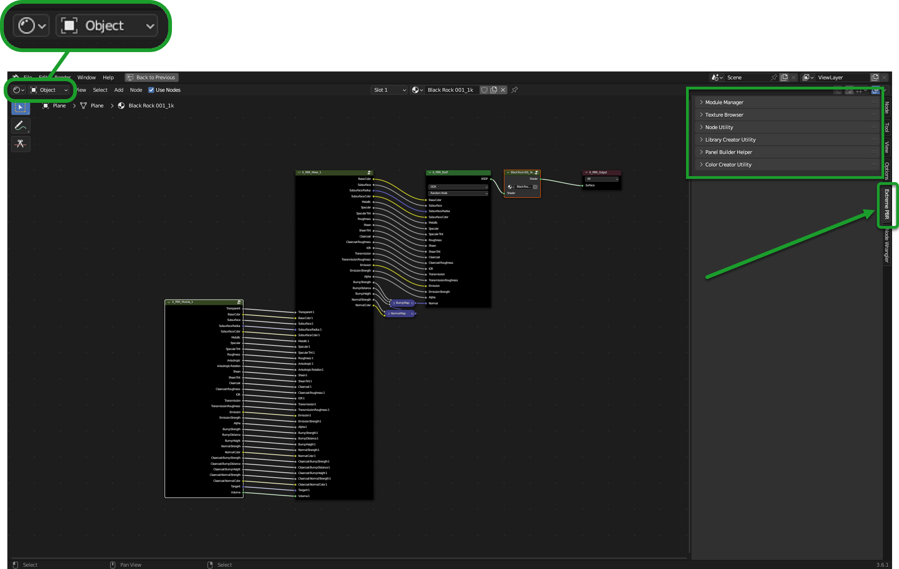
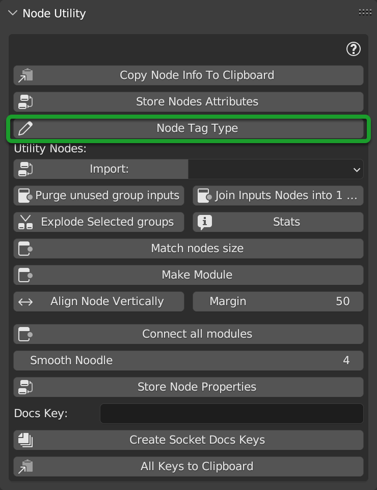

.. _creator_utility:

===================
Creator Utility
===================

Introduction
===========================

.. attention::
    Attention, you should use this section only if you are interested in creating Materials to sell, or to create your
    own personal library. It is not recommended for use by end users, as it may damage the Extreme PBR Base library
    In order to display the creator utility, activate the option described here: :ref:`pr_show_creator_utility` from
    the preferences panel of Extreme PBR in the options tab: :ref:`pr_options_tab`
    The creator utility will be shown in the Blender node interface once activated

This section is to facilitate the creation of a custom library of Extreme PBR, you can also sell this package as an additional library for Extreme PBR.

This section is dedicated to the **Creator Utility** the creator utility is a tool with which the libraries were created
of Extreme PBR, so it is a delicate tool that could damage the main libraries of Extreme PBR.

Make sure you only use it if you want to create specific libraries for Extreme PBR.

.. note::
    In order to access the creator utility, activate the option described here: :ref:`pr_show_creator_utility` from
    the preferences panel of Extreme PBR in the options tab: :ref:`pr_options_tab`
    The creator utility will be shown in the Blender node interface once activated

------------------------------------------------------------------------------------------------------------------------

Module Manager Panel
===========================

|

ADD Empty Module
---------------------------

This Operator creates a material with a Basic module of Extreme PBR inside from which you can start working on your material.
This is done to facilitate the work of creating your library to be published.

Once you have added an “Empty Module”, in the Shader Editor, you will have a standard Extreme PBR module available to work on.

.. image:: _static/_images/creator_utility/cu_create_empty_module.webp
    :align: center
    :width: 100%
    :alt: Creator Utility Create Empty Module

------------------------------------------------------------------------------------------------------------------------

Add Empty FX
---------------------------

This Operator creates a material with a Basic FX Module of Extreme PBR inside from which you can start working on your
material. This is done to facilitate the work of creating your library to be published.

Once you have added an “Empty Fx”, in the Shader Editor, you will have a standard Extreme PBR module available to work on.

------------------------------------------------------------------------------------------------------------------------

Remove
---------------------------

.. image:: _static/_images/creator_utility/cu_remove.webp
    :align: center
    :width: 50%
    :alt: Creator Utility Remove

This button, is the equivalent of the one present in the main interface of Extreme PBR, is used to remove the active
material, that is the one currently selected in the material list.

------------------------------------------------------------------------------------------------------------------------

Texture Browser
===========================

TODO: The section is under construction 🚀

------------------------------------------------------------------------------------------------------------------------

Node Utility
===========================

A quick look at the open “Node Utility” menu panel.

.. note::
        This panel will only be shown if a material is active or selected.

.. image:: _static/_images/creator_utility/cu_node_utility_panel.webp
    :align: center
    :width: 400
    :alt: Creator Utility Node Utility Panel

------------------------------------------------------------------------------------------------------------------------

Copy Node Info To Clipboard
-------------------------------

|

.. note::
        You must be inside the group node on which you want to copy the information.

This button allows you to copy the information of the group node you are working on, it will copy the name of the node
and the various descriptions of the sockets, and in the clipboard it will create the documentation of the node, provided
that a description has been assigned to the sockets of interest. To see how to assign a description to the sockets, go
to the section here: TODO socket description reference The section is under construction 🚀

------------------------------------------------------------------------------------------------------------------------

Store node attributes
-------------------------------

.. image:: _static/_images/creator_utility/cu_store_node_attributes.webp
    :align: center
    :width: 400
    :alt: Creator Utility Store Node Attributes

|

This button stores the information of all types of nodes in all the child nodes of the active node tree, this is used
to store and if in the future there are changes in the Extreme PBR nodes, to be able to restore the "Unknown" nodes
with the correct nodes, as in the future, the nodes could be no longer recognized, or vice versa, if you go from a
version of Blender with new nodes, and you go back to an old version of Blender where such nodes did not exist, through
the button described here :ref:`pr_op_adjust_all_material_node_tree` you can adjust the materials that contain such
unrecognized nodes.

------------------------------------------------------------------------------------------------------------------------

Node Tag Type
---------------------------

|

Once this button is pressed, a popup will appear:

|

.. attention::
        This button works ONLY in this case:
            - Being inside an active material created with Extreme PBR.
            - Be inside an Extreme PBR Module, or FX Module.
            - Have a node selected and active.
            - Once this button is pressed, a popup will appear

From the Popup Panel it is possible to assign the TAG to the selected Texture Type node (Choose the tag and press OK).

.. note::
    It is not necessary to use TAGs to create new Material Modules, but it is useful if you want to keep the operation
    of Essential Functions of the standard Extreme PBR Texture-based materials.

This Nodes example is a classic Texture Based Material from Extreme PBR with related TAGs:

|

To Remove the TAG, press the empty button from the popup panel and Press Ok:

------------------------------------------------------------------------------------------------------------------------

Library Creator Utility
===========================

TODO The section is under construction 🚀

------------------------------------------------------------------------------------------------------------------------

Panel Builder Helper
===========================

TODO The section is under construction 🚀

------------------------------------------------------------------------------------------------------------------------

Color Creator Utility
===========================

TODO The section is under construction 🚀

