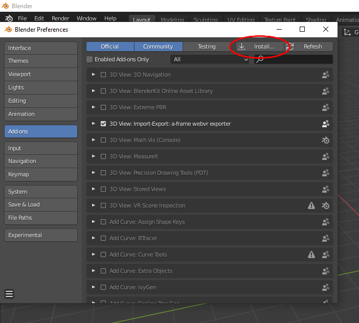
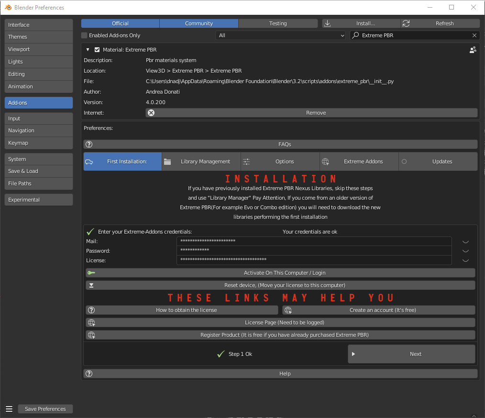
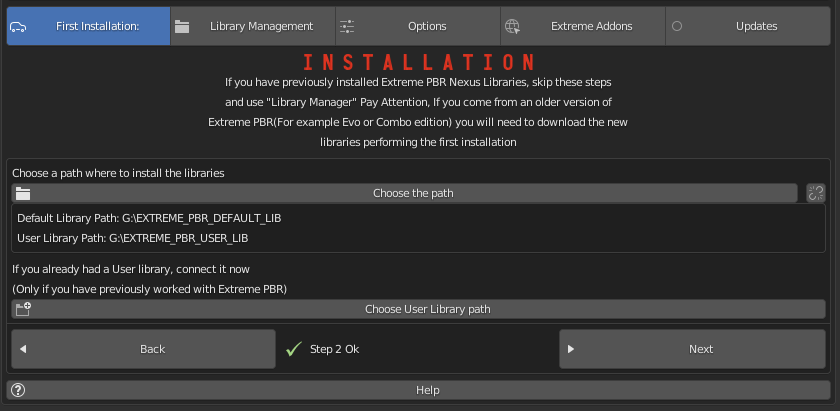
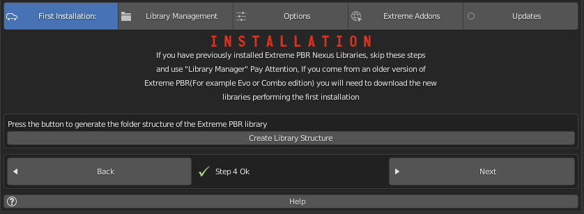
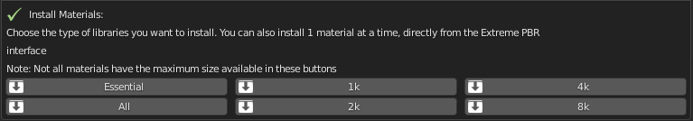
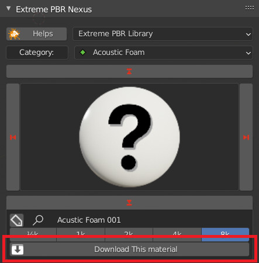
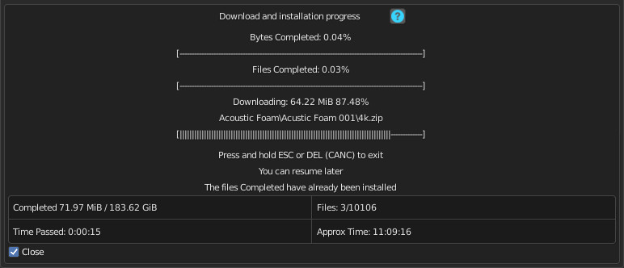

==============================
Installation v 4.1.100 and up
==============================

.. tip::
        To check which version of Extreme PBR you are using, and therefore be sure which guide to follow, you can check
        the version of the addon in 2 ways:
        - Via ``edit > preferences > addons`` and looking for the addon in the list by typing ``Extreme PBR`` in the search bar
        - If you have already installed the addon, you can access the preferences, by clicking on the button :ref:`mp_open_options`

        So the version is indicated in 2 places in the preferences window like this:

        .. image:: _static/_images/installation/see_version.webp
            :align: center
            :width: 600
            :alt: See version

.. _install_addon_41100:

Instal the addon
==================

The first step is to install the addon in Blender. Below are instructions for installing the addon

.. important::
        If you have a version lower than ``4.1.100`` (For example ``4.0.2##``) you can update the addon to version ``4.1.100``
        following these steps below.

.. _mac_safari_zip:

Download the files
---------------------

.. Tip::
        You can download the ``.exapack`` files little by little and install only 1 volume at a time, it doesn't matter the order.
        I suggest you to download first the ``XTRPbr_05k_Vol_001.exapack`` and the ``XTRPbr_Procedural_Vol_001.exapack`` packages.
        You can install the others at any time. The addon recognizes what has already been installed and what not.
        This will allow you to try Extreme PBR while the other files are downloaded

In your product page, you can find various files, the main ones for the installation are the following:

- ``extreme_pbr_v4####.zip`` is the addon for blender, this is the first element to download and install

  .. image:: _static/_images/installation/addon_zipped_01.webp
      :align: center
      :width: 400
      :alt: Addon zipped 01

|

- ``XTRPbr_##_Vol_#.exapack`` are the files of the library. and they are divided with increasing number.
  Example of downloaded .exapack files on the computer, below in the image:

  .. image:: _static/_images/installation/exapack_files_on_computer_01.webp
      :align: center
      :width: 400
      :alt: Exapack files on computer

|

The ``.exapack`` files are installed by the addon, they do not need to be installed manually! After installing the
Extreme PBR addon, it will manage your exapack packages and install them. (You will see in the following steps)

.. Note:: **For Mac users:** it often happens that Safari Browser is set to decompress .zip files, make sure this does not happen,
          otherwise the .zip file will no longer be a .zip file and you will not be able to install the addon as follows.

          Just go to the Safari menu bar at the top left and click on Safari>Preferences, then remove the check mark from
          "Open safe files after download" in the "General" window. Done, if in the future you download zipped files with safari,
          they will no longer be unzipped.

------------------------------------------------------------------------------------------------------------------------

Install Into Blender
---------------------

Now, download the addon and install it in Blender, the procedure is as follows:

1) Download the addon (Remember that you must be logged in to the site where you purchased the addon):

    - If you purchased on Blendermarket you can find the addon here:

       - https://blendermarket.com/account/orders

    - If you purchased on Gumroad you can find the addon here:

       - https://app.gumroad.com/library

    - Addon name Example: **extreme_pbr_v41100** (The number can be different, it depends on the version you are downloading)

.. Important:: The addon file must remain in zip format! Do not unzip the file, otherwise you will not be able to install it correctly.
              This note is especially for Mac users. If you do not know how to prevent Safari from decompressing zip files, take a look here :ref:`mac_safari_zip`

2) Once the addon is downloaded, open Blender and go to:

   ``Edit > Preferences > Add-ons > Install``

.. image:: _static/_images/installation/install_addon_in_blender_01.webp
    :align: center
    :width: 800
    :alt: Install addon in Blender

|

3) Select the downloaded file (**extreme_pbr_v41100.zip** <-- !This name is only an example!) and click on "Install Addon" (The name of the file can be different from version to version)

.. image:: _static/_images/installation/install_addon_zip_blender_01.webp
    :align: center
    :width: 800
    :alt: Install addon zip in Blender

|

4) If everything went well, the addon is in the list of installed addons, you can also search for it by typing "Extreme PBR"
   Mark the checkbox to activate it.

.. image:: _static/_images/installation/install_addon_zip_blender_02.webp
    :align: center
    :width: 800
    :alt: Install addon zip in Blender 2

------------------------------------------------------------------------------------------------------------------------

.. _install_library_41100:

Install The library
=======================

- If you have installed the addon correctly, now you can proceed with the installation of the library.

.. note::
        If you are a user coming from a old version of **Extreme PBR Nexus*** you can update the list of packages
        from this menu, by pressing the **Try compile Exapack** button, this based on the materials you already had installed
        will compile the list of files by comparing with the packages available online, and will allow you to download only
        the packages you need. In fact, once compiled, you will have those online on the left, and those on the right

        .. image:: _static/_images/installation/try_compile_exapack.webp
            :align: center
            :width: 400
            :alt: Try compile Exapack 01

Step 1
--------

Download the file XTRPbr_1k_vol_1.exapack, this is the package containing the 1k resolution files,
it is also the smallest package in terms of Size, so it is easy and fast. You can download the others at any time.
**You can download all the .exapack files and run everything at once if you wish**

------------------------------------------------------------------------------------------------------------------------

Step 2
--------

When you have finished downloading the **exapack** files you want to install, go to the Extreme PBR Preferences window
and go to the **Install Libraries** (TAB) section and press the "Default Library" button you see in the following image
in red.

.. Tip:: If you do not see the Extreme PBR Welcome panel, you can open it by pressing the "N" key on the keyboard.

When you press this button, a file browser will open, you will have to choose a location on your computer where the
root folder of the entire **Default Library** will be created

.. Warning:: 1. Do not choose the path in the path where blender installs the addons!
             2. Avoid choosing paths on LAN connected disks, resources may not be reachable
             3. If you are also installing the expansion.exapack, these will be installed in another root folder, in the same location where the **Default Library** is located
             4. It is not recommended to use an external Hard Disk connected via USB (Unless it is an external SSD disk)

------------------------------------------------------------------------------------------------------------------------

Step 3
---------

Now the situation should look like this, where the **"Choose Exapacks"** button appears.

.. image:: _static/_images/installation/choose_exapacks_ready.webp
    :align: center
    :width: 800
    :alt: Choose Exapacks ready

|

Press the **"Choose Exapacks"** button and select the **.exapack** files you just downloaded. You can choose them all,
just make sure to select them within the File Browser. **(The files not selected will be ignored)**
Then press the button in the file browser window **Choose Exapacks** to confirm

.. image:: _static/_images/installation/browse_exapack_to_install_01.webp
    :align: center
    :width: 800
    :alt: Browse exapack to install 01

------------------------------------------------------------------------------------------------------------------------

Step 4
----------

Now you should have the list of exapack files selected, in list, ready to be installed, you will just have to press the
**"Install From Exapack Files"** button to proceed with the installation. As follows in this image:

.. Note:: The exapack files are deleted once installed by the addon, this is for space issues
          if you want to keep them (Not Recommended) check the **"Keep Exapack After Install"** box and the files will be kept on the disk.
          But be careful, this means that you will have the weight of the library almost X2

.. image:: _static/_images/installation/install_from_exapack_files.webp
    :align: center
    :width: 800
    :alt: Install from exapack files

During the installation process of the .exapack packages, the interface will show the progress of the installed packages
You can also stop the process whenever you want (Just press the button (X) next to the big status bar) in this case,
the installed packages will remain installed.

.. Important:: **I want to emphasize:** All installed packages will remain installed, even if the installation process is interrupted.
               If the installation is resumed, the installation process will resume from where it was interrupted,
               because the addon recognizes the already installed files and skips them.

.. Note:: The installation speed depends a lot on the type of disk in use, I have done various tests, and the installation on
          SSD is very fast. I do not recommend the use of an external Mechanical Hard Disk connected via USB only for time issues,
          I noticed that these disks are very slow for this process. But if you do not have time problems and you have patience,
          you can decide to use it.

------------------------------------------------------------------------------------------------------------------------

Step 5
----------

When you have completed the entire (or even just in part) installation, the addon will be ready to be used.

.. Image:: _static/_images/installation/addon_ready_01.webp
    :align: center
    :width: 600
    :alt: Addon ready 01

.. Note:: The 1k, 2k, 4k, 8k, 16k versions are present in the complete edition. Some versions may not contain all the resolution versions.
          If you want to upgrade to the full version, you only pay the difference

------------------------------------------------------------------------------------------------------------------------

At the end of this process, on your computer, in the indicated path, 2 folders will have been created (3 if you also installed the HDRMAPS expansion)

- **HDRI_MAKER_DEFAULT_LIBRARY** (This folder contains all the files of the Extreme PBR libraries)
- **HDRI_MAKER_USER_LIBRARY** (This folder is an empty folder, and will be used in case you want to save your personal HDRi)

If you also installed the HDRMAPS expansion, then a third folder will also be created and will be named after the expansion.

To manipulate the paths to the libraries, it is enough to go to the Extreme PBR settings and go to the **Libraries** (TAB) section

For more information on this section you can find the chapter :ref:`pr_libraries`

.. image:: _static/_images/installation/libraries_manipulation_01.webp
    :align: center
    :width: 600
    :alt: Libraries manipulation 01

------------------------------------------------------------------------------------------------------------------------

About Exapack
================

As for the libraries, from version 3.0.100 onwards, they will be distributed in the form of exapack packages.
All new packages will be in the form of numbered volumes Here is an example of nomenclature

Default Library
-----------------------

- **XTRPbr_1k_vol_1.exapack**: Contains files from 1k, previews, and data files
- **XTRPbr_2k_vol_1.exapack**: Contains files from 2k, previews, and data files
- **XTRPbr_4k_vol_1.exapack**: Contains files from 4k, previews, and data files
- **XTRPbr_8k_vol_1.exapack**: Contains files from 8k, previews, and data files
- **XTRPbr_16k_vol_1.exapack**: Contains files from 16k, previews, and data files

The packages are consecutive, Vol_1, Vol_2, Vol_3, I tried to limit as much as possible the size of the packages,
so that their maximum is around 2GB (Some can reach 2.5GB).
This limit to avoid download and installation problems, since those who have a slower connection, could
encounter timeout problems.

.. Note:: The large size packages like 8k and 16k will have more volumes, because they are much larger.
          The small size packages like 1k and 2k will have less volumes, because they are much smaller.

------------------------------------------------------------------------------------------------------------------------

The **.exapack** files are installed by the addon, they do not need to be installed manually! After installing the
Extreme PBR addon, it will manage your exapack packages and install them. (You will see in the following steps)

.. important::
        **For Mac users:** it often happens that Safari Browser is set to decompress .zip files, make sure this does not happen,
        otherwise the .zip file will no longer be a .zip file and you will not be able to install the addon as follows.

        Just go to the Safari menu bar at the top left and click on Safari>Preferences, then remove the check mark from
        "Open safe files after download" in the "General" window. Done, if in the future you download zipped files with safari,
        they will no longer be unzipped.

------------------------------------------------------------------------------------------------------------------------

.. _install_addon_402##:

=============================
Installation (Older Version)
=============================

.. tip::
        To check which version of Extreme PBR you are using, and therefore be sure which guide to follow, you can check
        the version of the addon in 2 ways:
        - Via ``edit > preferences > addons`` and looking for the addon in the list by typing ``Extreme PBR`` in the search bar
        - If you have already installed the addon, you can access the preferences, by clicking on the button :ref:`mp_open_options`

        So the version is indicated in 2 places in the preferences window like this:

        .. image:: _static/_images/installation/see_version.webp
            :align: center
            :width: 600
            :alt: See version

.. important::
        The new version of Extreme PBR Nexus 4.1.100 has a new installation system described here :ref:`install_addon_41100`
        and here the installation of the libraries :ref:`install_library_41100` If you need to connect to our
        server to download the materials you can still do it, but you will have to activate the checkbox
        **I Have an Account on Extreme Addons** from the **Preferences** menu described here: :ref:`pr_op_i_have_an_account_on_extreme_addons`

How to install video tutorials
================================

To make it easier here is the video tutorial for the installation of Extreme PBR Nexus

Install (Only from version 4.0.200 and up)
-------------------------------------------

.. raw:: html

        <iframe width="560" height="315" src="https://www.youtube.com/embed/YtqJbMsp2XU" title="YouTube video player"
        frameborder="0" allow="accelerometer; autoplay; clipboard-write; encrypted-media; gyroscope; picture-in-picture;
        web-share" allowfullscreen></iframe>

------------------------------------------------------------------------------------------------------------------------

.. Note:: If you have previously installed a version of Extreme PBR prior to the Nexus edition (Extreme PBR / Extreme PBR Combo / Extreme PBR Evo)
          You have to uninstall, if you have projects that reference those material libraries, we recommend that you keep them on your computer.

------------------------------------------------------------------------------------------------------------------------

Unistall the old version
==========================

(Only If you have previously installed a version of Extreme PBR prior to the Nexus edition)

1. Search your Old Extreme PBR from Blender addons
2. Expand The Extreme PBR Preferences Menu
3. Press Remove
4. Restart Blender

.. image:: _static/_images/installation/unistall_example_panel.png
      :align: center
      :width: 800
      :alt: Unistall example panel

------------------------------------------------------------------------------------------------------------------------

Install the addon
==================

Once you have purchased Extreme PBR from Gumroad or Blendermarket download the addon (From orderpage) “extreme_pbr.zip” don’t unzip it!

.. Warning:: Make sure you have downloaded the file in “.zip” format If you are a Macintosh user and are using Safari,
             be aware that safari automatically decompresses .zip files So take 1 minute more time, and use Mozilla Firefox, or Google Chrome to download your zip files

**Orderpage:**
    - BlenderMarket: https://blendermarket.com/account/orders
    - Gumroad: https://app.gumroad.com/library

Once downloaded go to: Edit -> Preferences

.. image:: _static/_images/installation/preferences_dropdown_01.jpg
      :align: center
      :width: 600
      :alt: Preferences dropdown

Selecting Preferences will open a window.
On the left click on ADD-ON

.. image:: _static/_images/installation/addon_list_01.jpg
      :align: center
      :width: 600
      :alt: Addon list

Click on the INSTALL button located on the toolbar at the top.
Select the previously downloaded “extreme_pbr.zip” (Don’t unzip the file!)

If all went well, you will find Extreme PBR on the addon list:

.. image:: _static/_images/installation/extreme_pbr_into_addon_list_01.jpg
      :align: center
      :width: 600
      :alt: Addon list

To activate, click on the checkbox to the left of the addon name

.. image:: _static/_images/installation/activate_addon_01.jpg
      :align: center
      :width: 600
      :alt: Activate addon

------------------------------------------------------------------------------------------------------------------------

Configuration
-------------

This panel has been updated from Extreme PBR Nexus version 4.0.200, and is slightly different from previous versions,
make sure you have installed version 4.0.200 or higher

------------------------------------------------------------------------------------------------------------------------

.. _installation_step_1:

Step 1 (Addon Activation)
**************************

.. Attention::

            If you have already purchased the product on Blendermarket, or on Gumroad, you will only need to create a new account at https://extreme-addons.com/

            If you already have a registered account, you just need to be logged in on the website https://extreme-addons.com/

            .. image:: _static/_images/installation/login_singup_extreme_addons_01.jpg
                  :align: center
                  :width: 700
                  :alt: Login / SingUp extreme addons

**Now, on step 1, let’s enter credentials to activate the addon**

- Mail/Password:
    - The email and password are those with which you registered on www.Extreme-Addons.com

- License:
    - To obtain the product license, check here how: https://docs.extreme-addons.com/manual/how-to-register-your-product-on-extreme-addons/
    - If you already have a license, you just need to access extreme-addons website, in this page there is your license,
      remember that you must be logged in with your credentials to see it: Your license page:
      https://extreme-addons.com/my-account/ea-license/

.. image:: _static/_images/installation/login_license_extreme_pbr.png
        :align: center
        :width: 800
        :alt: Login / License extreme pbr

.. Tip:: In case of problems, make sure you have not copied and pasted the license with “Whitespace” sometimes it happens that copy paste also copies whitespace.

.. Warning:: **Please note that the Mail and Password are the ones you used to login on Extreme-Addons website**

**Activate On This Computer**
You will have to press the “Activate on this computer” button, this also allows you to check if the credentials are correct.

**Move your license to this computer**
In case you want to move the license to another computer, you will have to press this button.
This takes you to your extreme-addons page to reset the license on your profile: https://extreme-addons.com/my-account/ea-license/

------------------------------------------------------------------------------------------------------------------------

Step 2 (Choose Path)
**********************

Now click on the Choose the path button and select the folder where we want to install the Extreme PBR Library.

In this step, if (ONLY IF) you already had an Extreme PBR “User Library” / “User Lib” previously installed on your computer.
(If you had a previous version of Extreme PBR and saved your materials, you can indicate the path.

.. Note:: Remember, Extreme PBR libraries are very large, so to fully install the library, it will require almost 100 GiB
          of free space on the HardDisk you indicated. It is recommended that you install the libraries in a path that is not subject to path changes.

------------------------------------------------------------------------------------------------------------------------

Step 3 (Get Material List)
***************************

This step is for obtaining the online material list. This gets a log of all files that can be downloaded.

.. image:: _static/_images/installation/installation_interface_step_03.png
        :align: center
        :width: 800
        :alt: Installation interface step 03

------------------------------------------------------------------------------------------------------------------------

Step 4 (Create Library Structure)
***********************************

We press the Create Library structure button to create all the information that the addon needs to run on your Hard Disk. This may take some time.

This button essentially creates a “Skeleton” library on your computer. From that skeleton library, materials can be downloaded online, at any time.
This process can take a few minutes.

------------------------------------------------------------------------------------------------------------------------

Step 5 (Install Material)
***************************

**In this Step, you can decide WHAT & IF you want to install**

Personally I suggest installing “ESSENTIAL” first, this downloads all the small packages needed to make the addon work. ESSENTIAL, download the files (Material Previews, Json, Texture 512×512 and all the procedural material)
Remember that many gigs are downloaded at the beginning. And that you can always download in high definition, just the materials you need from the appropriate panel, so you can save time.

.. Note:: You can postpone this step for later as well. You can also install the materials individually, from the Extreme PBR panel.

            - **Essential (1GB +/-):**
                - Download and Install only necessary files + Texture at 512×512 px + All Procedural Materials
            - **1k Button (4GB +/-):**
                - Download and Install only the 1k Material (If essential files have not been installed, it will also install essential files)

            - **2k Button (14GB +/-):**
                - Download and Install only the 2k Material (If essential files have not been installed, it will also install essential files)

            - **4k Button (45 GB +/-):**
                - Download and Install only the 4k Material (If essential files have not been installed, it will also install essential files)

            - **8K button (124GB +/-):**
                - Download and Install the 8k Material + Any materials 5/6/7k (If essential files have not been installed, it will also install essential files)

            - **All (188GB +/-):**
                - Download and Install all the complete library –> (Essential/1k/2k/4k/8k)

------------------------------------------------------------------------------------------------------------------------

Installation Time Issues:
**************************

**Problems with VPN / Proxy:**
If you are using a VPN or Proxy and the download is slow, please Exclude extreme-addons.com from it, or temporarily disable the Proxy or VPN

**The installation times:**

It vary according to the internet speed and that of the computer in use, so during this step if you will install the libraries,
keep in mind that the download time is not a speed test, it would be wrong to think this, as during this process, they are also installed materials.
We did this in order to cancel the installation process, and pick up where you left off. So all downloaded materials will remain as such,
the installation process can be resumed at a later time.

------------------------------------------------------------------------------------------------------------------------

Download single Material
-------------------------

This button is used to proceed with the installation of the single materials.
In the example the material selector is set to 8k, so you can choose whether to shoot only that dimension or all the others (1 / 2k, 2k, 4k)
If you have a similar situation, it means that you have not completed the complete installation process (And you can continue not to)
So if you are interested in installing the material, press “Install Single Material”

**Once “Install single material” is pressed, a popup menu appears:**

.. image:: _static/_images/installation/download_this_material_popup_panel_01.jpg
        :align: center
        :width: 800
        :alt: Download this material popup panel

- Current Options:
    - Download only the material in the current version (8k In this example)

- Full Version:
    - Download all material version (in this case 1/2k, 1k, 2k, 4k, 8k)

- Options ( Bottom right button ):
    - Open the “Install Material” menu (If you want to do the complete installation of the entire library, and not the single material.)

------------------------------------------------------------------------------------------------------------------------

Progress Bar(s)
---------------

Progress bars will be shown during the installation process.
You will be able to stop the installation when you want,
the material packs already downloaded are installed, so they will remain installed even when you cancel this process.

------------------------------------------------------------------------------------------------------------------------

Installation Time Issues:
**************************

**Problems with VPN / Proxy:**
If you are using a VPN or Proxy and the download is slow, please Exclude extreme-addons.com from it, or temporarily disable the Proxy or VPN

**The installation times:**

It vary according to the internet speed and that of the computer in use, so during this step if you will install the libraries,
keep in mind that the download time is not a speed test, it would be wrong to think this, as during this process, +
they are also installed materials. We did this in order to cancel the installation process, and pick up where you left off.
So all downloaded materials will remain as such, the installation process can be resumed at a later time.

.. hint::
        If you encounter these problems, we have provided an alternative download system from version ``4.1.100`` via
        file.exapack. Here is the reference for installation via .exapack file :ref:`install_library_41100`

------------------------------------------------------------------------------------------------------------------------

.. _move_license_to_another_computer:

Move license to another Computer
--------------------------------

To Move the license to another computer, do the following steps:

1. Log in to https://extreme-addons.com/

2. Go to your License Page: https://extreme-addons.com/my-account/ea-license/

3. Click on “Reset Device” (If “Reset device” is not present, it means that this step is not necessary.)

.. image:: _static/_images/installation/reset_device_web_01.jpg
        :align: center
        :width: 800
        :alt: Reset device web 01

4. Go into Blender and open addon Preferences with “Options” button into addon interface

5. Press “Extreme Addons” Tab Enter your Email / Password that you used to register at Extreme-Addons.com,
and enter the license of your addon that you will always find on the License page
and press “Activate on this computer”. If everything is right, the key icon on that button turns green.

.. image:: _static/_images/installation/extreme_pbr_menu_activate_license.jpg
        :align: center
        :width: 800
        :alt: Extreme PBR Menu Activate License

------------------------------------------------------------------------------------------------------------------------

Migrate On Other Computer/Blender Version
-----------------------------------------

To migrate to another computer:
Install Extreme PBR on the other computer, Follow this guide from :ref:`installation_step_1`, you just need to install the single addon without the libraries.

If you had already installed the libraries on computer n1, You can move libraries via an External Hard Drive, It will be sufficient to move the 2 main folders of the Extreme PBR libraries EXTREME_PBR_DEFAULT_LIB and EXTREME_PBR_USER_LIB to computer n2

At this point you will only have to indicate the path in Library Manager:

.. image:: _static/_images/installation/extreme_pbr_menu_library_manager_01.jpg
        :align: center
        :width: 800
        :alt: Extreme PBR Menu Library Manager

------------------------------------------------------------------------------------------------------------------------

Activate on another computer
----------------------------

If you want to activate Extreme PBR on computer n2, you will need to move the license to computer n2

Here is the section to activate the license on another computer: :ref:`move_license_to_another_computer`

