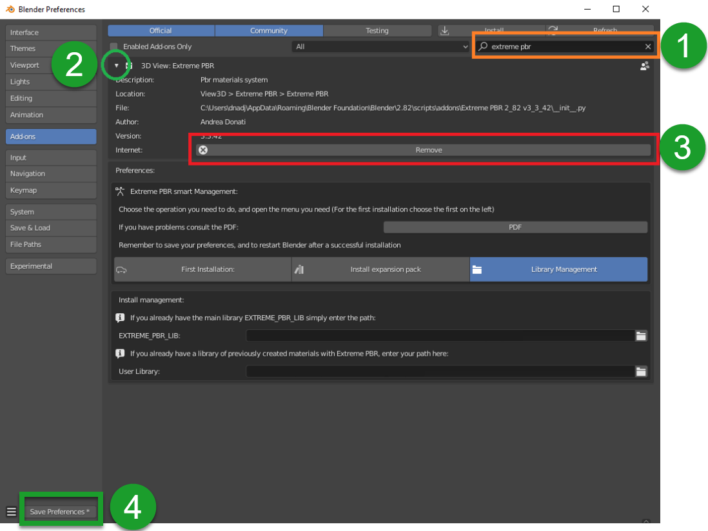
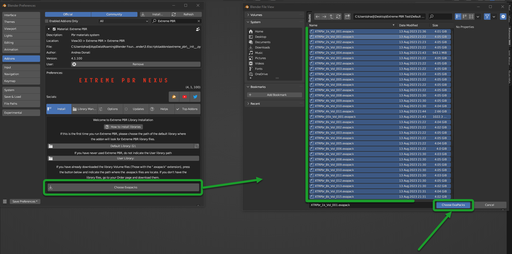

.. _new_installation:

===================================
New Installation (4.1.100 and up)
===================================

.. important::
        If you are coming from a version prior to 4.1.100 of Extreme PBR and want to update the addon, you **do not need** to
        download the libraries again just update the addon to the latest version and reconnect the libraries! You can
        synchronize your libraries with the exapack packages without having to download them👍  In order to synchronize
        your libraries with the exapack packages check this chapter :ref:`try_compile_exapack`

.. admonition:: Video Tutorial
    :class: youtube

        .. raw:: html

            <iframe width="560" height="315" src="https://www.youtube.com/embed/C-QZ7f0DS5k" title="YouTube video player"
            frameborder="0" allow="accelerometer; autoplay; clipboard-write; encrypted-media; gyroscope; picture-in-picture;
            web-share" allowfullscreen></iframe>

.. tip::
        To check which version of Extreme PBR you are using, and therefore be sure which guide to follow, you can check
        the version of the addon in 2 ways:
        - Via ``edit > preferences > addons`` and looking for the addon in the list by typing ``Extreme PBR`` in the search bar
        - If you have already installed the addon, you can access the preferences, by clicking on the button :ref:`mp_open_options`

        So the version is indicated in 2 places in the preferences window like this:

        .. image:: _static/_images/installation/see_version.webp
            :align: center
            :width: 600
            :alt: See version

------------------------------------------------------------------------------------------------------------------------

Uninstall the old version
==========================

(Only If you have previously installed a version of Extreme PBR prior to the Nexus edition)

1. Search your Old Extreme PBR from Blender addons
2. Expand The Extreme PBR Preferences Menu
3. Press Remove
4. Restart Blender

|

.. important::
        It may be necessary to restart as said in point 4 to be sure that the new modules do not conflict with those of
        the previous version.

------------------------------------------------------------------------------------------------------------------------

.. _install_addon_41100:

Instal the addon
==================

The first step is to install the addon in Blender. Below are instructions for installing the addon

.. important::
        If you have a version lower than ``4.1.100`` (For example ``4.0.2##``) you can update the addon to version ``4.1.100``
        following these steps below.

.. _mac_safari_zip:

Download the files
---------------------

.. Tip::
        You can download the ``.exapack`` files little by little and install only 1 volume at a time, it doesn't matter the order.
        I suggest you to download first the ``XTRPbr_05k_Vol_001.exapack`` and the ``XTRPbr_Procedural_Vol_001.exapack`` packages.
        You can install the others at any time. The addon recognizes what has already been installed and what not.
        This will allow you to try Extreme PBR while the other files are downloaded

In your product page, you can find various files, the main ones for the installation are the following:

- ``extreme_pbr_v4####.zip`` is the addon for blender, this is the first element to download and install

  .. image:: _static/_images/installation/addon_zipped_01.webp
      :align: center
      :width: 400
      :alt: Addon zipped 01

|

- ``XTRPbr_##_Vol_#.exapack`` are the files of the library. and they are divided with increasing number.
  Example of downloaded .exapack files on the computer, below in the image:

  .. image:: _static/_images/installation/exapack_files_on_computer_01.webp
      :align: center
      :width: 400
      :alt: Exapack files on computer

|

The ``.exapack`` files are installed by the addon, they do not need to be installed manually! After installing the
Extreme PBR addon, it will manage your exapack packages and install them. (You will see in the following steps)

.. Note:: **For Mac users:** it often happens that Safari Browser is set to decompress .zip files, make sure this does not happen,
          otherwise the .zip file will no longer be a .zip file and you will not be able to install the addon as follows.

          Just go to the Safari menu bar at the top left and click on Safari>Preferences, then remove the check mark from
          "Open safe files after download" in the "General" window. Done, if in the future you download zipped files with safari,
          they will no longer be unzipped.

------------------------------------------------------------------------------------------------------------------------

Install Into Blender
---------------------

Now, download the addon and install it in Blender, the procedure is as follows:

1) Download the addon (Remember that you must be logged in to the site where you purchased the addon):

    - If you purchased on Blendermarket you can find the addon here:

       - https://blendermarket.com/account/orders

    - If you purchased on Gumroad you can find the addon here:

       - https://app.gumroad.com/library

    - Addon name Example: **extreme_pbr_v41100** (The number can be different, it depends on the version you are downloading)

.. Important:: The addon file must remain in zip format! Do not unzip the file, otherwise you will not be able to install it correctly.
              This note is especially for Mac users. If you do not know how to prevent Safari from decompressing zip files, take a look here :ref:`mac_safari_zip`

2) Once the addon is downloaded, open Blender and go to:

   ``Edit > Preferences > Add-ons > Install``

.. image:: _static/_images/installation/install_addon_in_blender_01.webp
    :align: center
    :width: 800
    :alt: Install addon in Blender

|

3) Select the downloaded file (**extreme_pbr_v41100.zip** <-- !This name is only an example!) and click on "Install Addon" (The name of the file can be different from version to version)

|

4) If everything went well, the addon is in the list of installed addons, you can also search for it by typing "Extreme PBR"
   Mark the checkbox to activate it.

.. image:: _static/_images/installation/install_addon_zip_blender_02.webp
    :align: center
    :width: 800
    :alt: Install addon zip in Blender 2

------------------------------------------------------------------------------------------------------------------------

.. _install_library_41100:

Install The library
=======================

- If you have installed the addon correctly, now you can proceed with the installation of the library.

.. note::
        If you are a user coming from a old version of **Extreme PBR Nexus*** you can update the list of packages
        from this menu, by pressing the **Try compile Exapack** button, this based on the materials you already had installed
        will compile the list of files by comparing with the packages available online, and will allow you to download only
        the packages you need. In fact, once compiled, you will have those online on the left, and those on the right

        .. image:: _static/_images/installation/try_compile_exapack.webp
            :align: center
            :width: 400
            :alt: Try compile Exapack 01

Step 1
--------

Download the file XTRPbr_05k_vol_1.exapack, this is the package containing the ½k resolution files,
it is also the smallest package in terms of Size, so it is easy and fast. You can download the others at any time.
**You can download all the .exapack files and run everything at once if you wish**

------------------------------------------------------------------------------------------------------------------------

Step 2
--------

When you have finished downloading the **exapack** files you want to install, go to the Extreme PBR Preferences window
and go to the **Install Libraries** (TAB) section and press the "Default Library" button you see in the following image
in red.

.. Tip:: If you do not see the Extreme PBR Welcome panel, you can open it by pressing the "N" key on the keyboard.

.. image:: _static/_images/installation/go_to_install_libraries_01.webp
    :align: center
    :width: 600
    :alt: Go to install libraries 01

When you press this button, a file browser will open, you will have to choose a location on your computer where the
root folder of the entire **Default Library** will be created

.. Warning:: 1. Do not choose the path in the path where blender installs the addons!
             2. Avoid choosing paths on LAN connected disks, resources may not be reachable
             3. If you are also installing the expansion.exapack, these will be installed in another root folder, in the same location where the **Default Library** is located
             4. It is not recommended to use an external Hard Disk connected via USB (Unless it is an external SSD disk)

------------------------------------------------------------------------------------------------------------------------

Step 3
---------

Now the situation should look like this, where the **"Choose Exapacks"** button appears.

.. image:: _static/_images/installation/choose_exapacks_ready.webp
    :align: center
    :width: 800
    :alt: Choose Exapacks ready

|

Press the **"Choose Exapacks"** button and select the **.exapack** files you just downloaded. You can choose them all,
just make sure to select them within the File Browser. **(The files not selected will be ignored)**
Then press the button in the file browser window **Choose Exapacks** to confirm

------------------------------------------------------------------------------------------------------------------------

Step 4
----------

Now you should have the list of exapack files selected, in list, ready to be installed, you will just have to press the
**"Install From Exapack Files"** button to proceed with the installation. As follows in this image:

.. Note:: The exapack files are deleted once installed by the addon, this is for space issues
          if you want to keep them (Not Recommended) check the **"Keep Exapack After Install"** box and the files will be kept on the disk.
          But be careful, this means that you will have the weight of the library almost X2

|

.. attention::
        For some reason, it could happen that the .exapack file is corrupted. The addon recognizes corrupted files and
        reports them in red. Download the file again, in the meantime you can remove it from the list and proceed anyway
        to the installation, you can also install it later using this same procedure.

        .. image:: _static/_images/installation/broken_exapack_file.webp
            :align: center
            :width: 800
            :alt: Broken exapack file 02

During the installation process of the .exapack packages, the interface will show the progress of the installed packages
You can also stop the process whenever you want (Just press the button (X) next to the big status bar) in this case,
the installed packages will remain installed.

.. Important:: **I want to emphasize:** All installed packages will remain installed, even if the installation process is interrupted.
               If the installation is resumed, the installation process will resume from where it was interrupted,
               because the addon recognizes the already installed files and skips them.

.. image:: _static/_images/installation/exapack_installation_progress.webp
    :align: center
    :width: 800
    :alt: Exapack installation progress

.. note:: The installation speed depends a lot on the type of disk in use, I have done various tests, and the installation on
          SSD is very fast. I do not recommend the use of an external Mechanical Hard Disk connected via USB only for time issues,
          I noticed that these disks are very slow for this process. But if you do not have time problems and you have patience,
          you can decide to use it.

------------------------------------------------------------------------------------------------------------------------

Step 5
----------

When you have completed the entire (or even just in part) installation, the addon will be ready to be used.

.. Image:: _static/_images/installation/addon_ready_01.webp
    :align: center
    :width: 600
    :alt: Addon ready 01

.. Note:: The  ½k, 1k, 2k, 4k, 8k versions are present in the complete edition. Some versions may not contain all the resolution versions.
          If you want to upgrade to the full version, you only pay the difference

------------------------------------------------------------------------------------------------------------------------

At the end of this process, on your computer, in the indicated path, 2 folders will have been created (3 if you also installed the HDRMAPS expansion)

- **HDRI_MAKER_DEFAULT_LIBRARY** (This folder contains all the files of the Extreme PBR libraries)
- **HDRI_MAKER_USER_LIBRARY** (This folder is an empty folder, and will be used in case you want to save your personal HDRi)

If you also installed the HDRMAPS expansion, then a third folder will also be created and will be named after the expansion.

To manipulate the paths to the libraries, it is enough to go to the Extreme PBR settings and go to the **Libraries** (TAB) section

For more information on this section you can find the chapter :ref:`pr_libraries`

------------------------------------------------------------------------------------------------------------------------

Remove Exapack From Installer
------------------------------

These buttons allow you to remove the .exapack files so that you do not have to install them in case you have
added a file by mistake or do not want to install a particular file.

------------------------------------------------------------------------------------------------------------------------

About Exapack
================

As for the libraries, from version 3.0.100 onwards, they will be distributed in the form of exapack packages.
All new packages will be in the form of numbered volumes Here is an example of nomenclature

Default Library
-----------------------

- **XTRPbr_05k_vol_1.exapack**: Contains files from ½k, previews, and data files
- **XTRPbr_1k_vol_1.exapack**: Contains files from 1k, previews, and data files
- **XTRPbr_2k_vol_1.exapack**: Contains files from 2k, previews, and data files
- **XTRPbr_4k_vol_1.exapack**: Contains files from 4k, previews, and data files
- **XTRPbr_8k_vol_1.exapack**: Contains files from 8k, previews, and data files
- **XTRPbr_Procedural_Vol_1.exapack**: Contains procedural files, previews, and data files

The packages are consecutive, Vol_1, Vol_2, Vol_3, I tried to limit as much as possible the size of the packages,
so that their maximum is around 4GB (Some can reach 4.3GB).
This limit to avoid download and installation problems, since those who have a slower connection, could
encounter timeout problems.

.. Note::
        The large size packages like 4k, 8k will have more volumes, because they are much larger.
        The small size packages like ½k, 1k, 2k  will have fewer volumes, because they are much smaller.

------------------------------------------------------------------------------------------------------------------------

The **.exapack** files are installed by the addon, they do not need to be installed manually! After installing the
Extreme PBR addon, it will manage your exapack packages and install them. (You will see in the following steps)

.. important::
        **For Mac users:** it often happens that Safari Browser is set to decompress .zip files, make sure this does not happen,
        otherwise the .zip file will no longer be a .zip file and you will not be able to install the addon as follows.

        Just go to the Safari menu bar at the top left and click on Safari>Preferences, then remove the check mark from
        "Open safe files after download" in the "General" window. Done, if in the future you download zipped files with safari,
        they will no longer be unzipped.

------------------------------------------------------------------------------------------------------------------------

========================
Update Only The addon
========================

.. important::

        In order to update the addon, it is **not necessary to download the libraries again!** If you had already downloaded
        and installed them previously as explained here :ref:`install_library_41100` simply follow these steps below to
        update the addon to the latest version.

**Unistall the old version**

    (Only If you have previously installed a version of Extreme PBR prior to the Nexus edition)

    1. Search your Old Extreme PBR from Blender addons
    2. Expand The Extreme PBR Preferences Menu
    3. Press Remove
    4. Restart Blender (Recommended!)

    .. image:: _static/_images/installation/uninstall_example_panel.png
          :align: center
          :width: 800
          :alt: Uninstall example panel

    |

    .. important::
            It may be necessary to restart as said in point 4 to be sure that the new modules do not conflict with those of
            the previous version.

**Download the addon file**

    In your product page, you can find various files, the main ones for the installation are the following:

    - ``extreme_pbr_v4####.zip`` is the addon for blender, this is the first element to download and install

      .. image:: _static/_images/installation/addon_zipped_01.webp
          :align: center
          :width: 400
          :alt: Addon zipped 01

    |

    .. Note:: **For Mac users:** it often happens that Safari Browser is set to decompress .zip files, make sure this does not happen,
              otherwise the .zip file will no longer be a .zip file and you will not be able to install the addon as follows.

              Just go to the Safari menu bar at the top left and click on Safari>Preferences, then remove the check mark from
              "Open safe files after download" in the "General" window. Done, if in the future you download zipped files with safari,
              they will no longer be unzipped.

    Now, download the addon and install it in Blender, the procedure is as follows:

    1) Download the addon (Remember that you must be logged in to the site where you purchased the addon):

        - If you purchased on Blendermarket you can find the addon here:

           - https://blendermarket.com/account/orders

        - If you purchased on Gumroad you can find the addon here:

           - https://app.gumroad.com/library

        - Addon name Example: **extreme_pbr_v41100** (The number can be different, it depends on the version you are downloading)

    .. Important:: The addon file must remain in zip format! Do not unzip the file, otherwise you will not be able to install it correctly.
                  This note is especially for Mac users. If you do not know how to prevent Safari from decompressing zip files, take a look here :ref:`mac_safari_zip`

    2) Once the addon is downloaded, open Blender and go to:

       ``Edit > Preferences > Add-ons > Install``

    .. image:: _static/_images/installation/install_addon_in_blender_01.webp
        :align: center
        :width: 800
        :alt: Install addon in Blender

    |

    3) Select the downloaded file (**extreme_pbr_v41100.zip** <-- !This name is only an example!) and click on "Install Addon" (The name of the file can be different from version to version)

    .. image:: _static/_images/installation/install_addon_zip_blender_01.webp
        :align: center
        :width: 800
        :alt: Install addon zip in Blender

    |

    4) If everything went well, the addon is in the list of installed addons, you can also search for it by typing "Extreme PBR"
       Mark the checkbox to activate it.

    .. image:: _static/_images/installation/install_addon_zip_blender_02.webp
        :align: center
        :width: 800
        :alt: Install addon zip in Blender 2

    |

    5) Try to Relink Libraries in automatic with the button **Try to re-link all paths automatically** available from version
       4.1.110 onwards, this if the addon has already been installed correctly previously, should automatically relink
       the paths to the Extreme PBR libraries (Including any expansions) If this does not work, go to the next step.

    .. image:: _static/_images/installation/auto_relink_libraries.webp
        :align: center
        :width: 800
        :alt: Auto relink libraries

    |

    6) If the previous step failed, go to the **Libraries** tab and refer to this section that explains how
       the connection to the library paths works :ref:`pr_libraries`

    .. image:: _static/_images/preferences/pr_library_management_panel.webp
        :align: center
        :width: 600
        :alt: Pr library management panel

