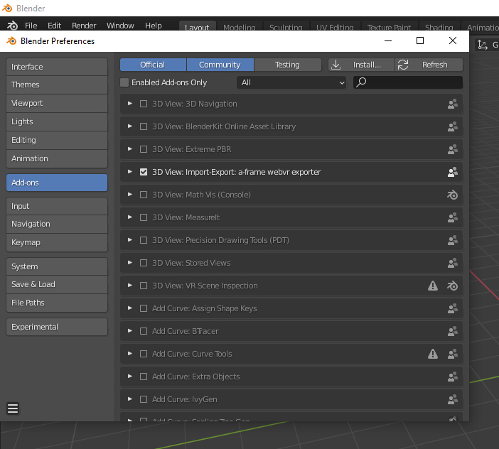
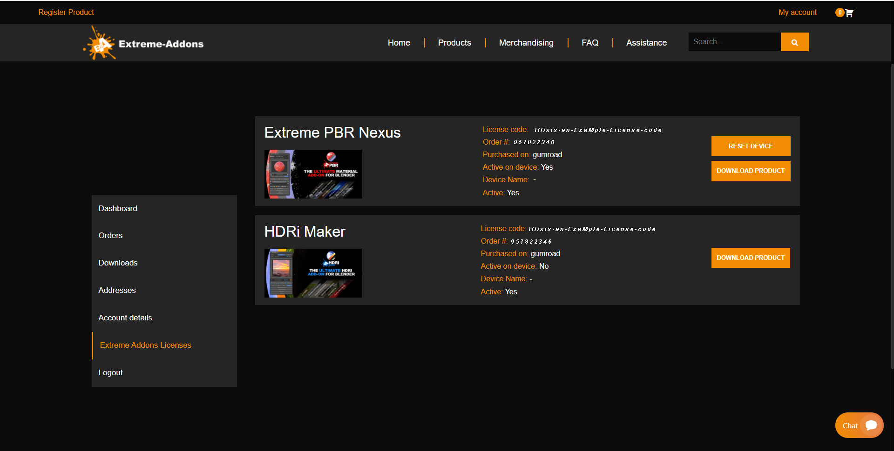
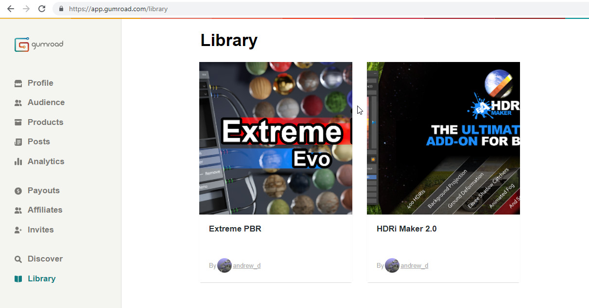
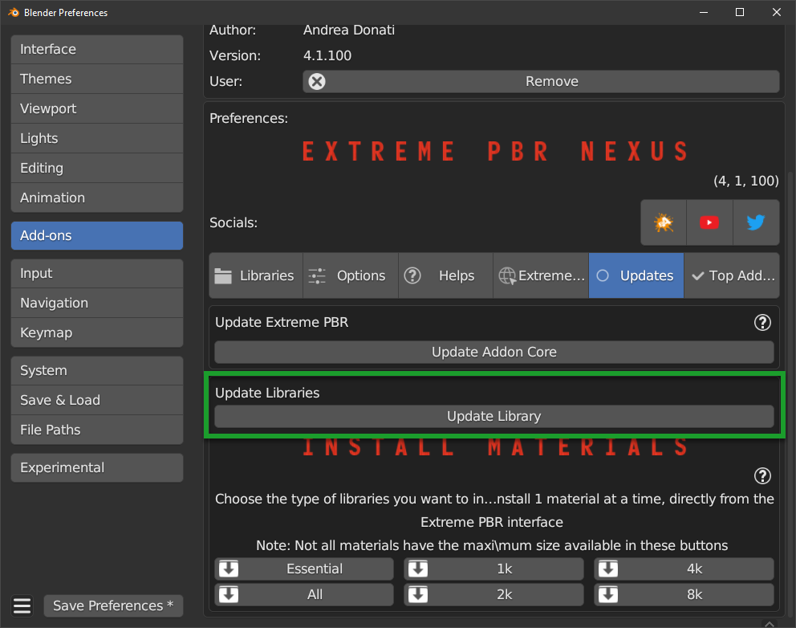

.. _install_addon_402##:

========================================
Old Installation/Extreme Addons Account
========================================

.. tip::
        To check which version of Extreme PBR you are using, and therefore be sure which guide to follow, you can check
        the version of the addon in 2 ways:
        - Via ``edit > preferences > addons`` and looking for the addon in the list by typing ``Extreme PBR`` in the search bar
        - If you have already installed the addon, you can access the preferences, by clicking on the button :ref:`mp_open_options`

        So the version is indicated in 2 places in the preferences window like this:

        .. image:: _static/_images/installation/see_version.webp
            :align: center
            :width: 600
            :alt: See version

.. important::
        The new version of Extreme PBR Nexus 4.1.100 has a new installation system described here :ref:`install_addon_41100`
        and here the installation of the libraries :ref:`install_library_41100` If you need to connect to our
        server to download the materials you can still do it, but you will have to activate the checkbox
        **I Have an Account on Extreme Addons** from the **Preferences** menu described here: :ref:`pr_op_i_have_an_account_on_extreme_addons`

        .. image:: _static/_images/installation/i_have_an_account_on_extreme_addons_focus.webp
            :align: center
            :width: 800
            :alt: I have an account on extreme addons focus

------------------------------------------------------------------------------------------------------------------------

How to install video tutorials
================================

To make it easier here is the video tutorial for the installation of Extreme PBR Nexus

Install (Only from version 4.0.200 and up)
-------------------------------------------

.. raw:: html

        <iframe width="560" height="315" src="https://www.youtube.com/embed/YtqJbMsp2XU" title="YouTube video player"
        frameborder="0" allow="accelerometer; autoplay; clipboard-write; encrypted-media; gyroscope; picture-in-picture;
        web-share" allowfullscreen></iframe>

------------------------------------------------------------------------------------------------------------------------

.. Note:: If you have previously installed a version of Extreme PBR prior to the Nexus edition (Extreme PBR / Extreme PBR Combo / Extreme PBR Evo)
          You have to uninstall, if you have projects that reference those material libraries, we recommend that you keep them on your computer.

------------------------------------------------------------------------------------------------------------------------

Uninstall the old version
==========================

(Only If you have previously installed a version of Extreme PBR prior to the Nexus edition)

1. Search your Old Extreme PBR from Blender addons
2. Expand The Extreme PBR Preferences Menu
3. Press Remove
4. Restart Blender

.. image:: _static/_images/installation/uninstall_example_panel.png
      :align: center
      :width: 800
      :alt: Uninstall example panel

|

.. important::
        It may be necessary to restart as said in point 4 to be sure that the new modules do not conflict with those of
        the previous version.

------------------------------------------------------------------------------------------------------------------------

Install the addon
==================

Once you have purchased Extreme PBR from Gumroad or Blendermarket download the addon (From orderpage) “extreme_pbr.zip” don’t unzip it!

.. Warning:: Make sure you have downloaded the file in “.zip” format If you are a Macintosh user and are using Safari,
             be aware that safari automatically decompresses .zip files So take 1 minute more time, and use Mozilla Firefox, or Google Chrome to download your zip files

**Orderpage:**
    - BlenderMarket: https://blendermarket.com/account/orders
    - Gumroad: https://app.gumroad.com/library

Once downloaded go to: Edit -> Preferences

Selecting Preferences will open a window.
On the left click on ADD-ON

Click on the INSTALL button located on the toolbar at the top.
Select the previously downloaded “extreme_pbr.zip” (Don’t unzip the file!)

.. image:: _static/_images/installation/install_button_01.jpg
      :align: center
      :width: 600
      :alt: Install addon

If all went well, you will find Extreme PBR on the addon list:

.. image:: _static/_images/installation/extreme_pbr_into_addon_list_01.jpg
      :align: center
      :width: 600
      :alt: Addon list

To activate, click on the checkbox to the left of the addon name

.. image:: _static/_images/installation/activate_addon_01.jpg
      :align: center
      :width: 600
      :alt: Activate addon

------------------------------------------------------------------------------------------------------------------------

Configuration
-------------

This panel has been updated from Extreme PBR Nexus version 4.0.200, and is slightly different from previous versions,
make sure you have installed version 4.0.200 or higher

.. image:: _static/_images/installation/installation_interface_step_01.png
      :align: center
      :width: 600
      :alt: Installation interface step 01

------------------------------------------------------------------------------------------------------------------------

.. _installation_step_1:

Step 1 (Addon Activation)
**************************

.. Attention::

            If you have already purchased the product on Blendermarket, or on Gumroad, you will only need to create a new account at https://extreme-addons.com/

            If you already have a registered account, you just need to be logged in on the website https://extreme-addons.com/

            .. image:: _static/_images/installation/login_singup_extreme_addons_01.jpg
                  :align: center
                  :width: 700
                  :alt: Login / SingUp extreme addons

**Now, on step 1, let’s enter credentials to activate the addon**

- Mail/Password:
    - The email and password are those with which you registered on www.Extreme-Addons.com

- License:
    - To obtain the product license, check here how: :ref:`how_to_get_license`
    - If you already have a license, you just need to access extreme-addons website, in this page there is your license,
      remember that you must be logged in with your credentials to see it: Your license page:
      https://extreme-addons.com/my-account/ea-license/

.. image:: _static/_images/installation/login_license_extreme_pbr.png
        :align: center
        :width: 800
        :alt: Login / License extreme pbr

|

.. Tip:: In case of problems, make sure you have not copied and pasted the license with “Whitespace” sometimes it happens that copy paste also copies whitespace.

.. Warning:: **Please note that the Mail and Password are the ones you used to login on Extreme-Addons website**

**Activate On This Computer**
You will have to press the “Activate on this computer” button, this also allows you to check if the credentials are correct.

**Move your license to this computer**
In case you want to move the license to another computer, you will have to press this button.
This takes you to your extreme-addons page to reset the license on your profile: https://extreme-addons.com/my-account/ea-license/

------------------------------------------------------------------------------------------------------------------------

Step 2 (Choose Path)
**********************

Now click on the Choose the path button and select the folder where we want to install the Extreme PBR Library.

In this step, if (ONLY IF) you already had an Extreme PBR “User Library” / “User Lib” previously installed on your computer.
(If you had a previous version of Extreme PBR and saved your materials, you can indicate the path.

.. Note:: Remember, Extreme PBR libraries are very large, so to fully install the library, it will require almost 100 GiB
          of free space on the HardDisk you indicated. It is recommended that you install the libraries in a path that is not subject to path changes.

.. image:: _static/_images/installation/installation_interface_step_02.png
        :align: center
        :width: 800
        :alt: Installation interface step 02

------------------------------------------------------------------------------------------------------------------------

Step 3 (Get Material List)
***************************

This step is for obtaining the online material list. This gets a log of all files that can be downloaded.

------------------------------------------------------------------------------------------------------------------------

Step 4 (Create Library Structure)
***********************************

We press the Create Library structure button to create all the information that the addon needs to run on your Hard Disk. This may take some time.

This button essentially creates a “Skeleton” library on your computer. From that skeleton library, materials can be downloaded online, at any time.
This process can take a few minutes.

.. image:: _static/_images/installation/installation_interface_step_04.png
        :align: center
        :width: 800
        :alt: Installation interface step 04

------------------------------------------------------------------------------------------------------------------------

.. _old_installation_step_5:

Step 5 (Install Material)
***************************

**In this Step, you can decide WHAT & IF you want to install**

Personally I suggest installing “ESSENTIAL” first, this downloads all the small packages needed to make the addon work. ESSENTIAL, download the files (Material Previews, Json, Texture 512×512 and all the procedural material)
Remember that many gigs are downloaded at the beginning. And that you can always download in high definition, just the materials you need from the appropriate panel, so you can save time.

.. image:: _static/_images/installation/installation_interface_step_05.jpg
        :align: center
        :width: 800
        :alt: Installation interface step 05

.. Note:: You can postpone this step for later as well. You can also install the materials individually, from the Extreme PBR panel.

            - **Essential (1GB +/-):**
                - Download and Install only necessary files + Texture at 512×512 px + All Procedural Materials
            - **1k Button (4GB +/-):**
                - Download and Install only the 1k Material (If essential files have not been installed, it will also install essential files)

            - **2k Button (14GB +/-):**
                - Download and Install only the 2k Material (If essential files have not been installed, it will also install essential files)

            - **4k Button (45 GB +/-):**
                - Download and Install only the 4k Material (If essential files have not been installed, it will also install essential files)

            - **8K button (124GB +/-):**
                - Download and Install the 8k Material + Any materials 5/6/7k (If essential files have not been installed, it will also install essential files)

            - **All (188GB +/-):**
                - Download and Install all the complete library –> (Essential/1k/2k/4k/8k)

------------------------------------------------------------------------------------------------------------------------

Installation Time Issues:
**************************

**Problems with VPN / Proxy:**
If you are using a VPN or Proxy and the download is slow, please Exclude extreme-addons.com from it, or temporarily disable the Proxy or VPN

**The installation times:**

It vary according to the internet speed and that of the computer in use, so during this step if you will install the libraries,
keep in mind that the download time is not a speed test, it would be wrong to think this, as during this process, they are also installed materials.
We did this in order to cancel the installation process, and pick up where you left off. So all downloaded materials will remain as such,
the installation process can be resumed at a later time.

------------------------------------------------------------------------------------------------------------------------

Download single Material
-------------------------

This button is used to proceed with the installation of the single materials.
In the example the material selector is set to 8k, so you can choose whether to shoot only that dimension or all the others (1 / 2k, 2k, 4k)
If you have a similar situation, it means that you have not completed the complete installation process (And you can continue not to)
So if you are interested in installing the material, press “Install Single Material”

.. image:: _static/_images/installation/download_this_material_01.jpg
        :align: center
        :width: 300
        :alt: Download this material 01

**Once “Install single material” is pressed, a popup menu appears:**

.. image:: _static/_images/installation/download_this_material_popup_panel_01.jpg
        :align: center
        :width: 800
        :alt: Download this material popup panel

- Current Options:
    - Download only the material in the current version (8k In this example)

- Full Version:
    - Download all material version (in this case 1/2k, 1k, 2k, 4k, 8k)

- Options ( Bottom right button ):
    - Open the “Install Material” menu (If you want to do the complete installation of the entire library, and not the single material.)

------------------------------------------------------------------------------------------------------------------------

Progress Bar(s)
---------------

Progress bars will be shown during the installation process.
You will be able to stop the installation when you want,
the material packs already downloaded are installed, so they will remain installed even when you cancel this process.

.. image:: _static/_images/installation/installation_progress_01.jpg
        :align: center
        :width: 800
        :alt: Installation progress 01

------------------------------------------------------------------------------------------------------------------------

Installation Time Issues:
**************************

**Problems with VPN / Proxy:**
If you are using a VPN or Proxy and the download is slow, please Exclude extreme-addons.com from it, or temporarily disable the Proxy or VPN

**The installation times:**

It vary according to the internet speed and that of the computer in use, so during this step if you will install the libraries,
keep in mind that the download time is not a speed test, it would be wrong to think this, as during this process, +
they are also installed materials. We did this in order to cancel the installation process, and pick up where you left off.
So all downloaded materials will remain as such, the installation process can be resumed at a later time.

.. hint::
        If you encounter these problems, we have provided an alternative download system from version ``4.1.100`` via
        file.exapack. Here is the reference for installation via .exapack file :ref:`install_library_41100`

------------------------------------------------------------------------------------------------------------------------

.. _move_license_to_another_computer:

Move license to another Computer
--------------------------------

To Move the license to another computer, do the following steps:

1. Log in to https://extreme-addons.com/

2. Go to your License Page: https://extreme-addons.com/my-account/ea-license/

3. Click on “Reset Device” (If “Reset device” is not present, it means that this step is not necessary.)

.. image:: _static/_images/installation/reset_device_web_01.jpg
        :align: center
        :width: 800
        :alt: Reset device web 01

4. Go into Blender and open addon Preferences with “Options” button into addon interface

5. Press “Extreme Addons” Tab Enter your Email / Password that you used to register at Extreme-Addons.com,
and enter the license of your addon that you will always find on the License page
and press “Activate on this computer”. If everything is right, the key icon on that button turns green.

.. image:: _static/_images/installation/extreme_pbr_menu_activate_license.jpg
        :align: center
        :width: 800
        :alt: Extreme PBR Menu Activate License

------------------------------------------------------------------------------------------------------------------------

Migrate On Other Computer/Blender Version
-----------------------------------------

To migrate to another computer:
Install Extreme PBR on the other computer, Follow this guide from :ref:`installation_step_1`, you just need to install the single addon without the libraries.

If you had already installed the libraries on computer n1, You can move libraries via an External Hard Drive, It will be sufficient to move the 2 main folders of the Extreme PBR libraries EXTREME_PBR_DEFAULT_LIB and EXTREME_PBR_USER_LIB to computer n2

At this point you will only have to indicate the path in Library Manager:

.. image:: _static/_images/installation/extreme_pbr_menu_library_manager_01.jpg
        :align: center
        :width: 800
        :alt: Extreme PBR Menu Library Manager

------------------------------------------------------------------------------------------------------------------------

Activate on another computer
----------------------------

If you want to activate Extreme PBR on computer n2, you will need to move the license to computer n2

Here is the section to activate the license on another computer: :ref:`move_license_to_another_computer`

------------------------------------------------------------------------------------------------------------------------

.. _how_to_get_license:

How to get License (Only for up to 4.0.207)
--------------------------------------------

.. important::
        The new version of Extreme PBR Nexus 4.1.100 no longer needs a license, so it is not necessary.

Product bought on Blendermarket
*************************************

1. Go to Your Blendermarket Order Page: https://blendermarket.com/account/orders
2. Now in the order list you will need to find the ID of your order. Keep that in mind.

.. image:: _static/_images/installation/id_product_order_page_blendermarket.png
        :align: center
        :width: 600
        :alt: Id product order page blendermarket

|

3. (Skip this step if the previous one made it possible for you to get your Order ID)
    You can also find your ID in an alternative way By checking your mailbox, at the time of purchase you will have received an email with the receipt of your order (For a correct view of the email we suggest you avoid the Windows 10 mail service) Then search your email for “Your Receipt Blendermarket”
    You will find in your email the Extreme PBR purchase receipt, where at the bottom is your ID
    ( This is an example of a “Blendermarket Receipt”)

.. image:: _static/_images/installation/blendermarket_receipt.png
        :align: center
        :width: 600
        :alt: Blendermarket receipt

4. Now go to “Register Product” Page: https://extreme-addons.com/register-product/
    - Select “Blendermarket” (1)
    - Select Select the product you need to register from the drop-down menu (2)
    - Enter your order id in the box (3)
    - Enter Enter the email with which you bought on Blendermarket. (Attention, the email may be different from the one you registered with on Extreme-Addons.comSo here you will have to enter in effect the email with which you have your account on Blendermarket (4)
    - Press “Get License” (5)

.. image:: _static/_images/installation/register_product_page.jpg
        :align: center
        :width: 800
        :alt: Register product page

|

5. If the procedure has been completed successfully, your product should now be shown like this on the page https://extreme-addons.com/my-account/ea-license/

------------------------------------------------------------------------------------------------------------------------

Product bought on Gumroad
*************************************

1. Go to Your Gumroad Library https://app.gumroad.com/library
2. Choose the product you need to register from your Gumroad Library, for example “Extreme PBR”

3. At the bottom of the Product Content, you will find a license key as in this photo, Keep in mind or copy this license
   Copy everything, even the dashes between one sequence and another.

.. note::
        You can also find the license code in the email you received at the time of purchase.

.. image:: _static/_images/installation/license_key_gumroad_example.jpg
        :align: center
        :width: 800
        :alt: License key gumroad example

|

4. Now go to “Register Product” Page: https://extreme-addons.com/register-product/
    - Select “GumRoad” (1)
    - Select Select the product you need to register from the drop-down menu (2)
    - Enter your license key in the box (3)
    - Enter Enter the email with which you bought on Gumroad. (Attention, the email may be different from the one you registered with on Extreme-Addons.com So here you will have to enter in effect the email with which you have your account on Gumroad (4)
    - Press “Get License” (5)

.. image:: _static/_images/installation/register_product_page.jpg
        :align: center
        :width: 800
        :alt: Register product page

|

5. If the procedure has been completed successfully, your product should now be shown like this on the page https://extreme-addons.com/my-account/ea-license/:

------------------------------------------------------------------------------------------------------------------------

Updates Tab
------------

.. note::
    In order to see this TAB, make sure to check the checkbox “I Have an Account on Extreme Addons” in the “Preferences” section of the addon
    Reference here: :ref:`pr_op_i_have_an_account_on_extreme_addons`

As mentioned in the note, this is the old menu to access the Extreme Addons compartment if you already have an account on Extreme-Addons.com

.. image:: _static/_images/preferences/old_updates_tab_menu.webp
        :align: center
        :width: 600
        :alt: Extreme PBR Menu Updates Tab

------------------------------------------------------------------------------------------------------------------------

Update Core
*************

This button is used to update the addon to the latest version available on the server.

.. note::
        Need the addon activation described here: :ref:`installation_step_1`

.. image:: _static/_images/preferences/old_update_core.webp
        :align: center
        :width: 600
        :alt: Old Update core

|

Please Restart Blender After Update!

------------------------------------------------------------------------------------------------------------------------

Update Library
***************

By this button, you can update the library on your computer, it will build the missing categories or materials
(Only the structure) so that you can download only the materials you are interested in.

------------------------------------------------------------------------------------------------------------------------

Install materials
********************

This section is identical to the one described here: :ref:`old_installation_step_5`

