Main Panel
===========================

The main panel of Extreme PBR Nexus from version 4.1.100, if you have an older version, you can update it by following
this guide: TODO: Inserire link alla guida di aggiornamento

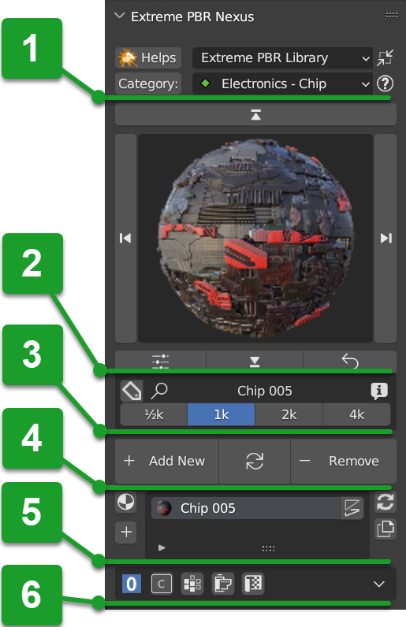

+--+-------------------------------------+-+
|  |  1. :ref:`libraries_selector`       | |
|  |  2. :ref:`mp_material_browser`      | |
|  |  3. :ref:`tag_search_size_selector` | |
|  |  4. :ref:`add_remove_buttons`       | |
|  |  5. :ref:`material_list`            | |
|  |  6. :ref:`box_utility`              | |
+--+-------------------------------------+-+
|  | |main_panel|                        | |
+--+-------------------------------------+-+

------------------------------------------------------------------------------------------------------------------------

.. _libraries_selector:

Libraries selector
------------------

This area is used to choose the library, the category (of the library) and the category search via the text field.

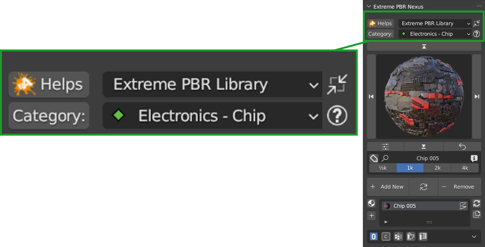

------------------------------------------------------------------------------------------------------------------------

Helps Button
************

This button opens the Help section in the addon preferences window. This is useful to find more information
on how to use the addon

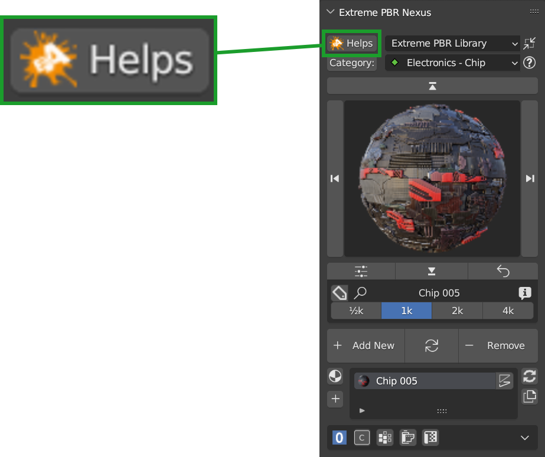

------------------------------------------------------------------------------------------------------------------------

Library Selector (Drop-down menu)
*********************************

This allows you to select the background library you want to use. All libraries added via
"Libraries" in the addon preferences menu will be displayed in this drop-down menu.
By default this Drop-down menu, contains the "Default" library, which is the library that comes with the addon.
and the "User" library, which is the library where you can add your saved backgrounds.

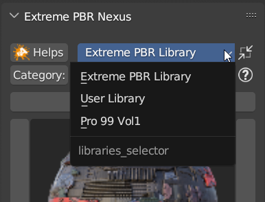

------------------------------------------------------------------------------------------------------------------------

.. _minimize_button:

Minimize Button
***************

.. image:: _static/_images/main_panel/minimize_main_panel_01.png
    :align: center
    :width: 800
    :alt: Minimize Button

|

This button allows you to minimize the main panel, to have more space in the 3D view.

------------------------------------------------------------------------------------------------------------------------

Search Category
***************

.. image:: _static/_images/main_panel/search_category_botton_01.png
    :align: right
    :width: 600
    :alt: Search Category

|

This Button allows you to search for a category without opening the drop-down menu.

.. note::
        The categories are relative to the selected library, at the moment the categories contained in a non-selected library will not be displayed

------------------------------------------------------------------------------------------------------------------------

Category Selector (Drop-down Menu)
************************************

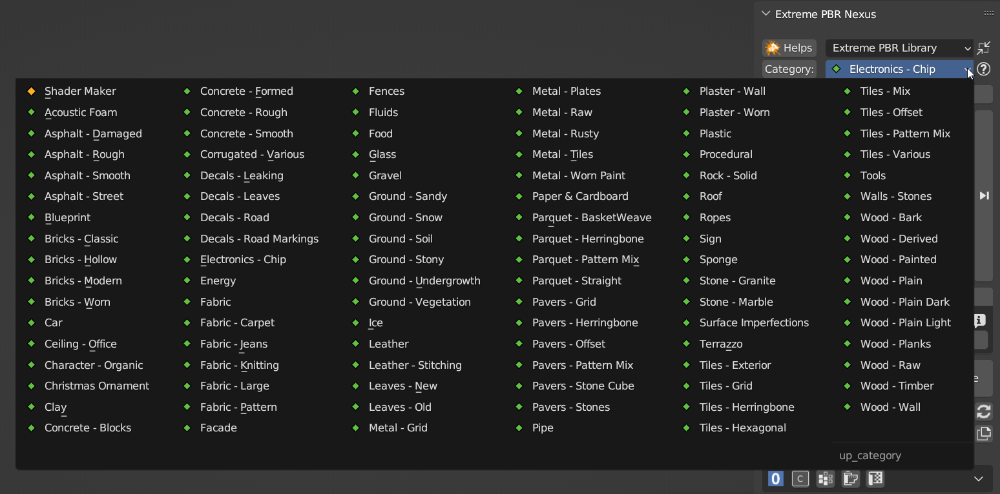

|

This allows you to select the category (Each library will have its own category)

------------------------------------------------------------------------------------------------------------------------

.. _mp_material_browser:

Material Browser
-------------------

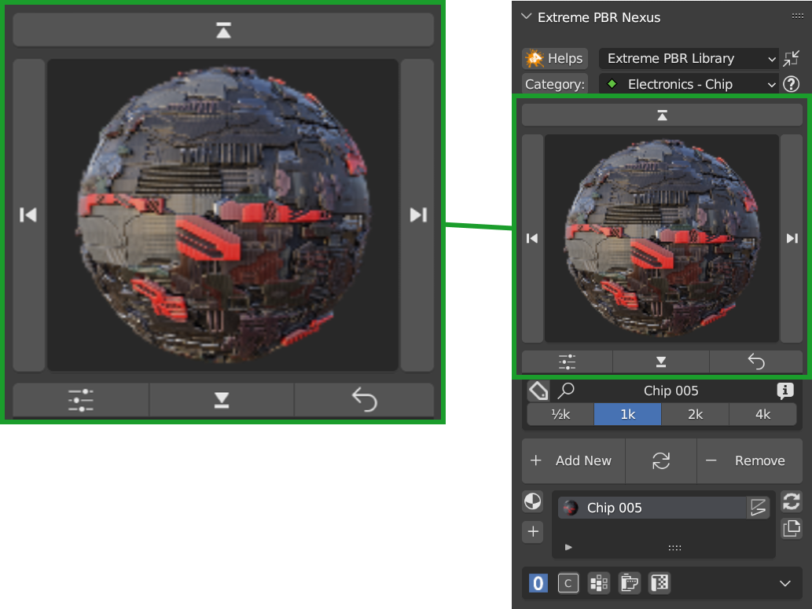

|

This section is dedicated to displaying the material previews.

------------------------------------------------------------------------------------------------------------------------

Preview Popup
*************

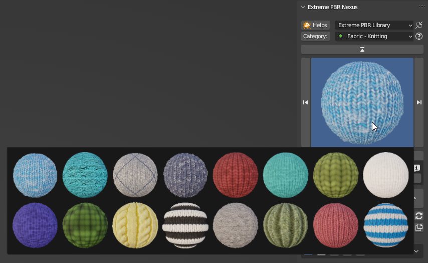

|

This allows you to select the background (Each library will have its own background), a pop-up window will appear
with the list of preview backgrounds

------------------------------------------------------------------------------------------------------------------------

Up/Down Arrow
**************

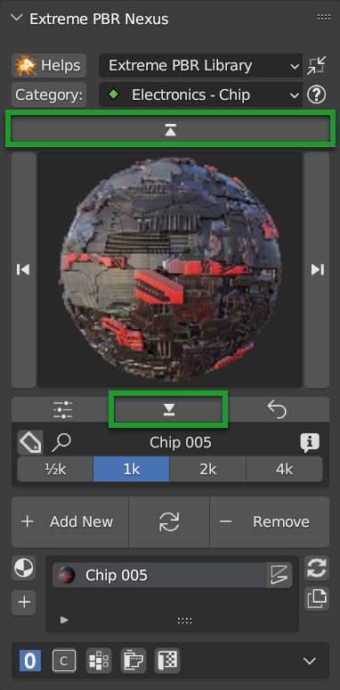

|

These two buttons allow you to switch to the previous or next category.

------------------------------------------------------------------------------------------------------------------------

Left/Right Arrow
*****************

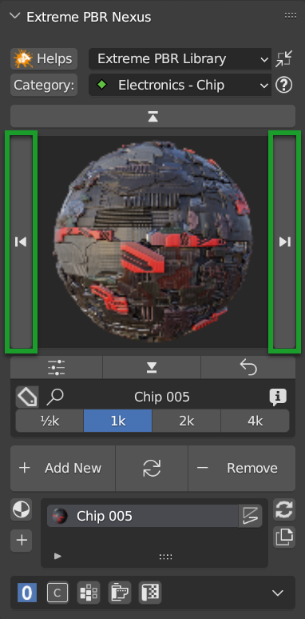

|

These two buttons allow you to switch to the previous or next material in the current category.

------------------------------------------------------------------------------------------------------------------------

Open Options
**************

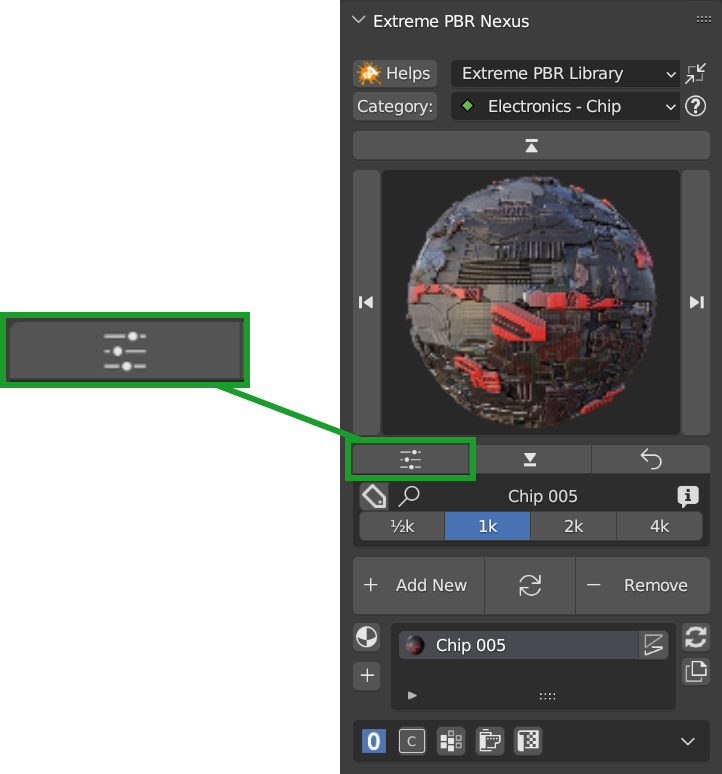

|

This button will open the Extreme PBR preferences exactly in the Options section

------------------------------------------------------------------------------------------------------------------------

Reload Preview Icons
*********************

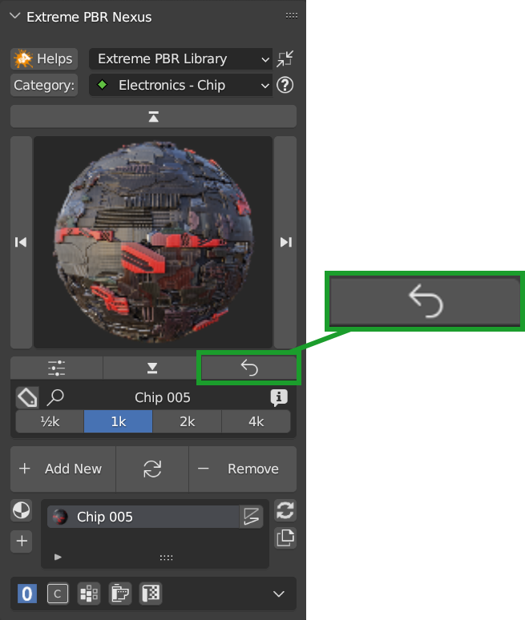

|

It may happen that the material icons are not loaded correctly, this button allows you to reload the material icons.
in addition, it also reloads the interface icons

------------------------------------------------------------------------------------------------------------------------

.. _tag_search_size_selector:

Tag Search Size Selector
------------------------

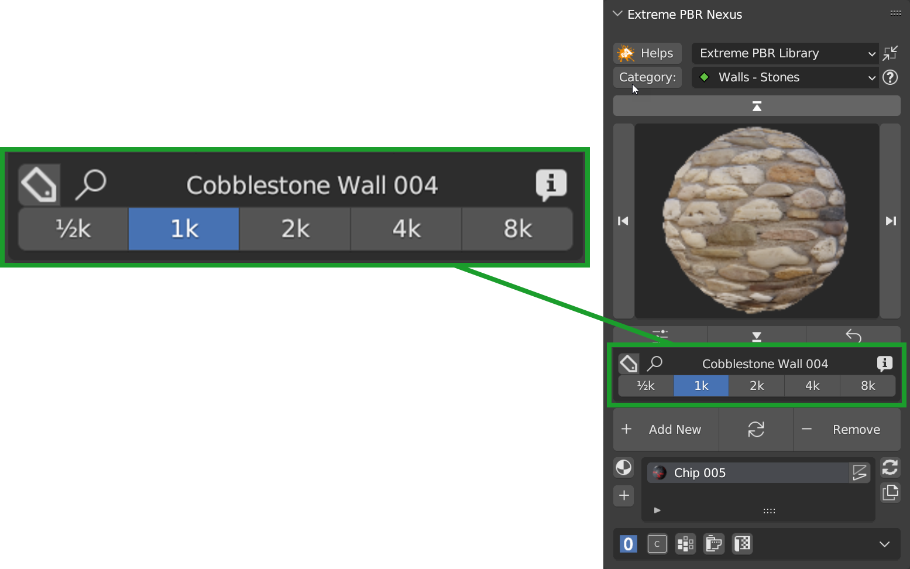

|

This small menu in the box, allows you to Select the size / version of the material (If there is an alternative)
Contains The search for tag / background name and information on the background currently in the preview.

------------------------------------------------------------------------------------------------------------------------

Search for tag
**************

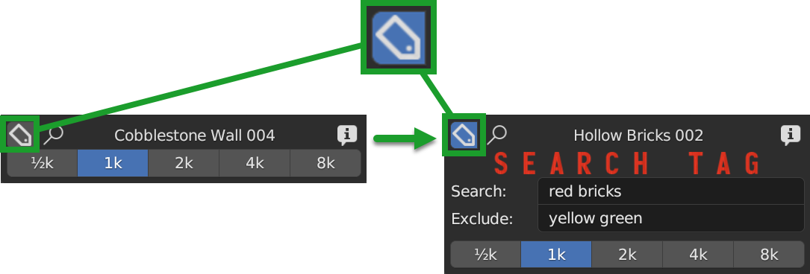

|

This allows you to search for a background by typing the name of the tag
- In the upper field, you can enter the name of the tag you want to include in the search
- In the lower field, you can enter the name of the tag you want to exclude from the search

Keep the tags separated with a space if you want to include more than one tag in the search.

In this way, the categories and the previews will be filtered according to the tags entered.

------------------------------------------------------------------------------------------------------------------------

Search Background by entering text
**********************************

This allows you to search for a background by typing the name of the background (It work with the tag Restrictions if you need)

.. note::
    This function will search for all the materials in the selected library, it will exclude the non-selected libraries, so make sure
    to search in the right library via the "Libraries selector" drop-down menu

|

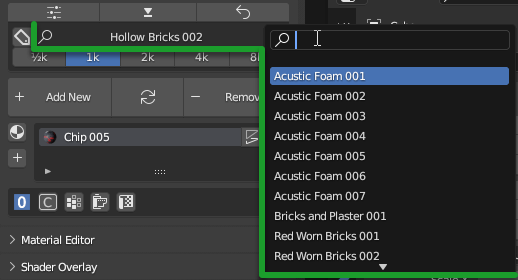

------------------------------------------------------------------------------------------------------------------------

.. _info_and_tag:

Info & Tag
**********

This button will open a dialog window with information about the background currently in preview.
inside there will be information about the author, the license.
There will also be the tags that have been assigned to the material, they can also be modified from here.

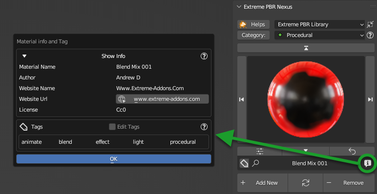

------------------------------------------------------------------------------------------------------------------------

Show info
#############

By pressing the arrow-shaped button, the section will be shown or hidden where there is information
on the material in preview (If existing)

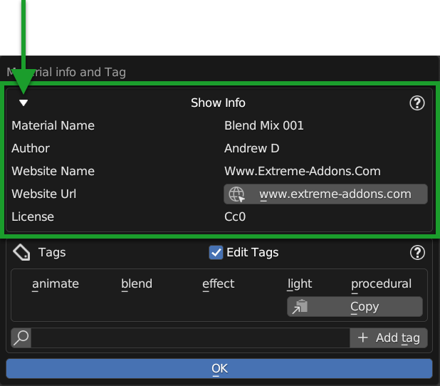

------------------------------------------------------------------------------------------------------------------------

Edit Tags
#########

In the info & Tag panel you can edit the tags assigned to the background.
To do this, just click on the **Edit Tags** button and enter the desired tags.
You can also delete existing tags, just press on them, and a dialog box will be displayed
that will ask you if you want to delete the tag.
This tag will then be useful for searching for material by tag.

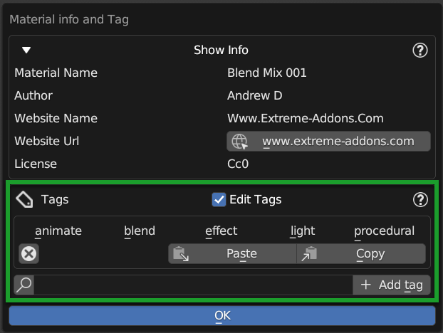

|

.. Note::
    - Tags can only be edited if you have checked the "Edit Tags" box

------------------------------------------------------------------------------------------------------------------------

Material Version Selector
*************************

- If in the library there are different versions of the same material, this selection allows you to choose which version to load

  **This will only take effect when loading the material, it will not affect the material already loaded in the scene**

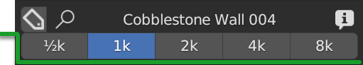

|

.. note::
    - The versions of the materials will be shown only if they are greater than 1, if for example a material has only one version, this will not be shown
      because it would not make sense to select a version if there is only one.

------------------------------------------------------------------------------------------------------------------------

.. _add_remove_buttons:

Add Replace Remove Buttons
---------------------------

- Add (From the preview) / Replace active material / Remove active Material buttons

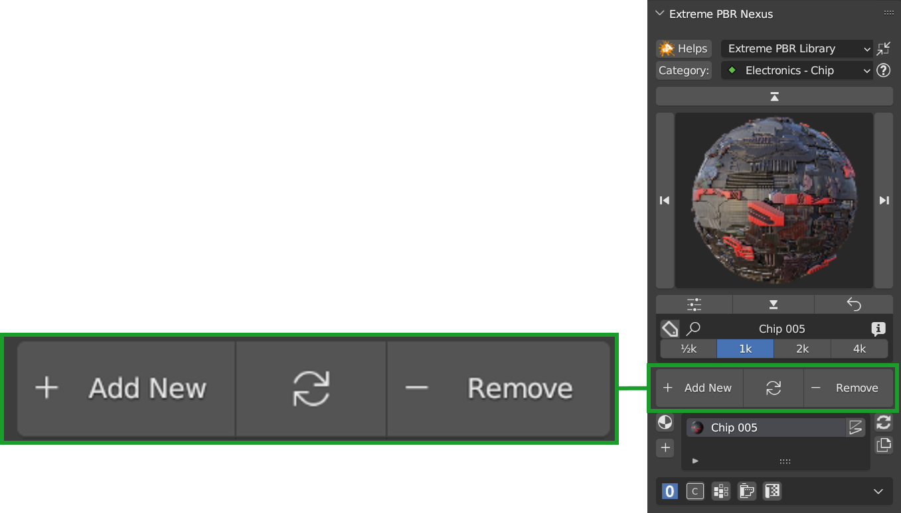

|

- In Edit Mode, other buttons will be added

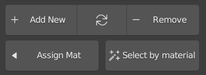

------------------------------------------------------------------------------------------------------------------------

.. _mp_add_new:

Add New
********

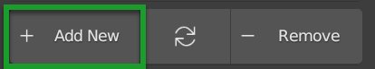

|

- **Object Mode**
    - This button loads the materials and applies them to the selected object, if no object is selected, this will have no effect.

- **Edit Mode**
    - If you are in Edit mode and have a face of the selected object selected, the material will be applied only to that face if there are already 1 or more materials on the object.

.. note::
    This button will always add a new material to the list of materials of the selected object, if you want to replace
    the active material, use the **Replace** button described below

------------------------------------------------------------------------------------------------------------------------

Replace
**********

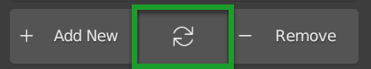

|

- **Object Mode**
    - **This button will be visible only if there is one or more materials on the selected object**
      replaces the active material (From the material list: :ref:`material_list`) with the material in preview, if no material is selected, this will have no effect.

- **Edit Mode**
    - If you are in Edit mode and have a face of the selected object selected, the material will be applied only to that face if there are already 1 or more materials on the object.

|

- **If there is some displacement active in this material, it will be removed before applying the new material**

.. important::
      If the material you want to replace is present on more objects in the scene, you can replace the material on all objects
      by activating the **Replace All** option, the button will take on a different color to indicate that this option is active.

      .. image:: _static/_images/main_panel/replace_all_01.png
          :align: center
          :width: 400
          :alt: Replace All 01

------------------------------------------------------------------------------------------------------------------------

Remove
*******

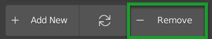

|

- This button removes the selected material from the material list.
- **If there is some displacement active in this material, it will be removed before applying the new material**

------------------------------------------------------------------------------------------------------------------------

Assign Mat
***********

**This button will be visible only in edit mode**, so you can select the faces of the object and assign the active material
in the Material List explained here: :ref:`material_list`

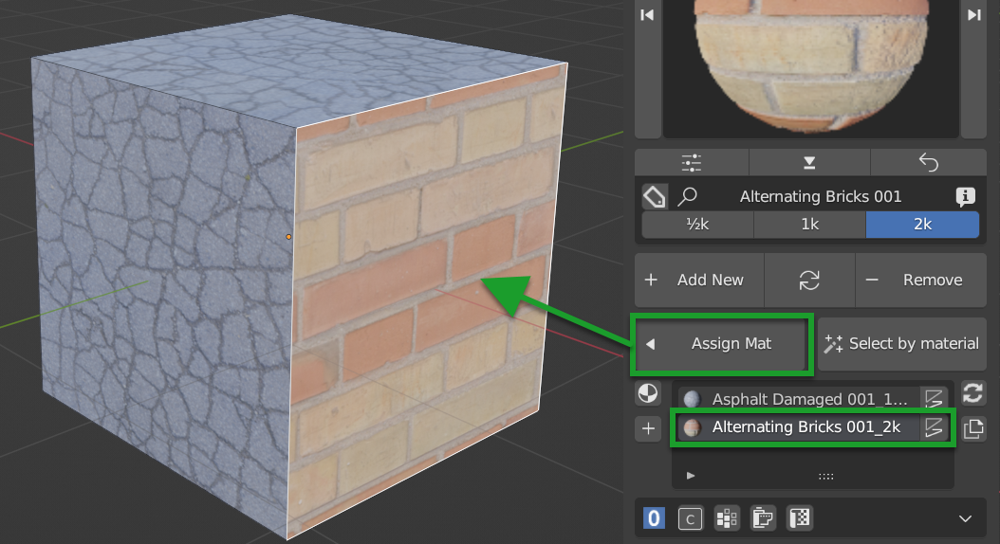

------------------------------------------------------------------------------------------------------------------------

Select By material
******************

**This button will be visible only in edit mode**, so you can select the faces of the object and assign the active material
if the material selected in the material list is not present on any face of the object, this button will have no effect.

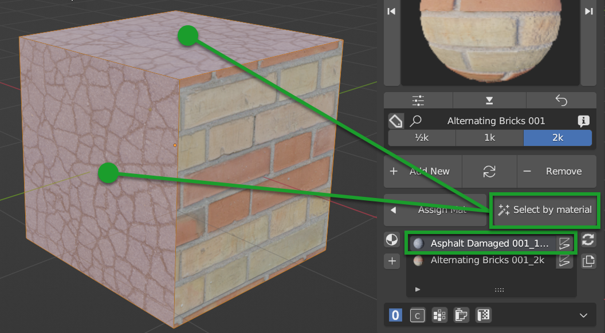

------------------------------------------------------------------------------------------------------------------------

.. _material_list:

Material List Section
-----------------------

In this section there are the materials that have been added to the selected object.
These materials can be added via the **Add** or **Replace** button.
The materials can be removed via the **Remove** button or replaced via the **Replace** button.
There are also other buttons that we will see below.

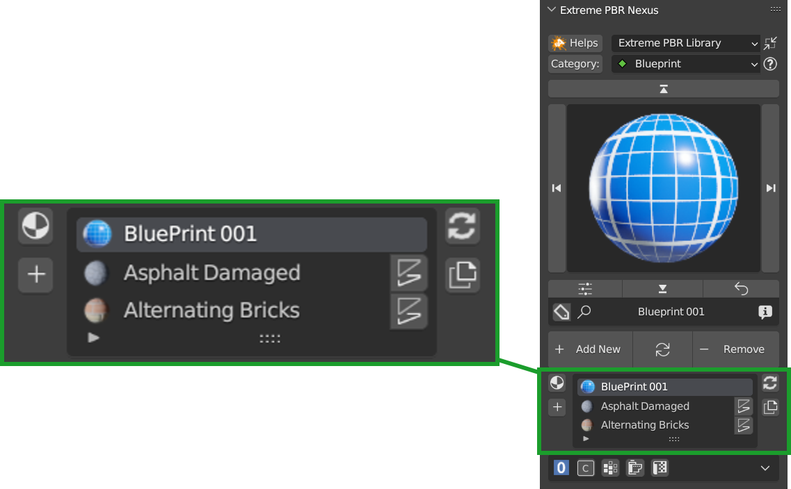

------------------------------------------------------------------------------------------------------------------------

Active Material
****************

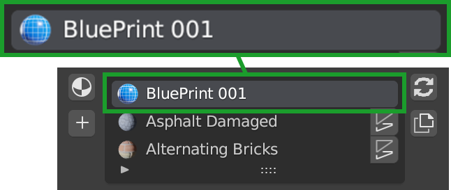

|

This is the active material, you can select it directly with the mouse cursor, just click on it.

With double click of the mouse you can also rename the active material

------------------------------------------------------------------------------------------------------------------------

.. _displace_on_off:

Displace On/Off
****************

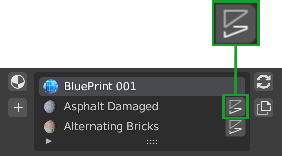

|

This button activates or deactivates the displacement.
If the displacement is active, the button will be blue, if it is inactive, the button will be gray.

Once activated, a further interface dedicated to displacement will appear which we can see in this section:
TODO: Mettere collegamento a displacement

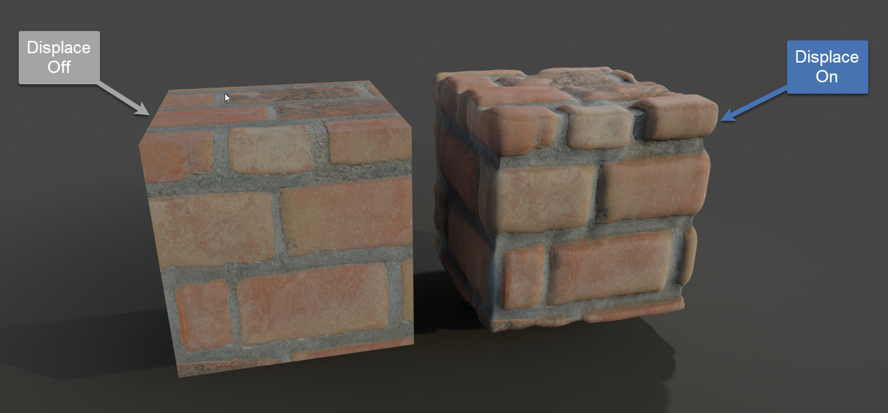

|

.. important::
        This button will be present only if the material has a Bump / Displacement map
        if it is not present, it means that there is no Bump / Displacement map in the material.

.. tip::
        If the same identical material is also present on other objects, the displacement will also be activated on the other objects.
        If you want to avoid this, you can make the material unique by copying it via the **Duplicate Material** button described
        in this paragraph: :ref:`duplicate_material`

------------------------------------------------------------------------------------------------------------------------

Search and Replace
******************

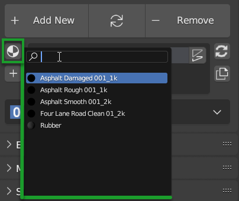

|

As soon as you press the button, a small drop-down menu will appear, then you will have the possibility to search in the list
of materials present in the current project **bpy.data.materials** and **replace** the active material with the material found.

------------------------------------------------------------------------------------------------------------------------

Search and Add
***************

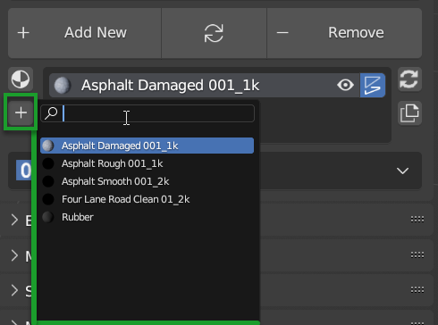

|

As soon as you press the button, a small drop-down menu will appear, then you will have the possibility to search in the list
of materials present in the current project **bpy.data.materials** and **add** the material found to the list of materials of the selected object.

|

**Edit Mode Features:**
    - If you are in edit mode and have some faces selected, the material will be applied to those faces, otherwise it will only be added to the material list

------------------------------------------------------------------------------------------------------------------------

.. _duplicate_material:

Duplicate Material
*******************

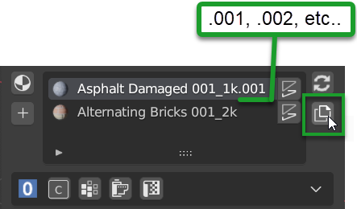

|

This button allows you to duplicate the active material in the material list, this will make it independent if it is present
on other objects. A suffix will be added to the name of the material, it will be numeric and will grow with each duplication.
You can replace the name of the material with the one you prefer, just double click on the name of the material from
the material list and enter the desired name.
This function also duplicates the groups or images contained in the material nodes, in short, it makes everything independent.

------------------------------------------------------------------------------------------------------------------------

.. _box_utility:

Box Utility
-----------

This box contains some very useful functions of Extreme PBR, the buttons in this box may vary depending on the context you are in,
for example, if you have selected an object or not.

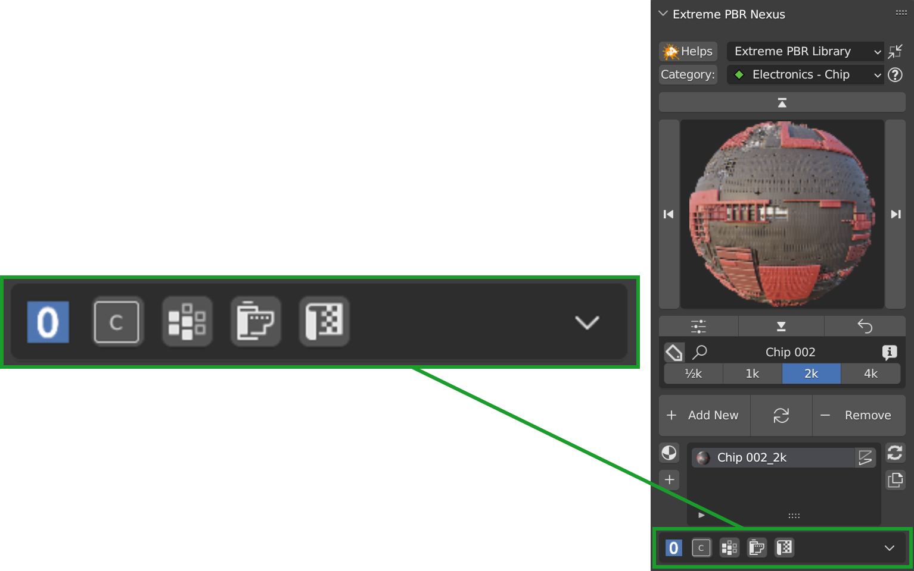

|

.. note::
        The box will not be visible if the Minimize mode is activated, check here: :ref:`minimize_button` for more information

------------------------------------------------------------------------------------------------------------------------

Smart Shade Smooth
******************

.. image:: _static/_images/main_panel/smart_shade_smooth_button.jpg
    :align: center
    :width: 400
    :alt: Smart Shade Smooth Button

|

Works only on an active object of type **Mesh**

This button is used to adjust the **Shade Smooth** and **Auto Smooth** in 3 steps, here are the steps:

**Step 0:**
  - **Shade Smooth** deactivated / **Auto Smooth** deactivated, the object has a sharp appearance

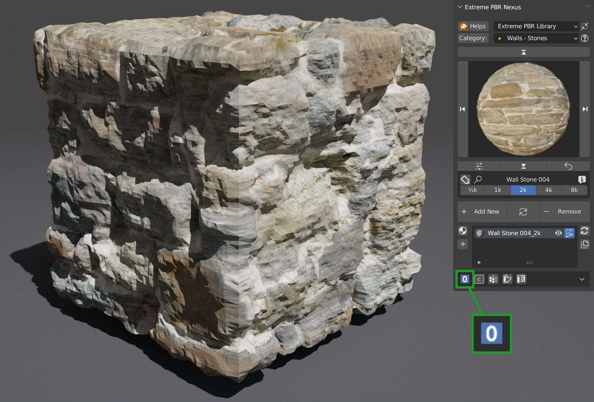

|

**Step 1:**
  - **Shade Smooth** activated / **Auto Smooth** activated, the object appears to be more rounded, angles equal
    to or greater than 45 ° will not be rounded

.. image:: _static/_images/main_panel/smooth_step_001.jpg
    :align: center
    :width: 800
    :alt: Smooth Step 001

|

**Step 2:**
  - **Shade Smooth** activated / **Auto Smooth** deactivated, the object appears to be completely rounded,
    all angles are rounded

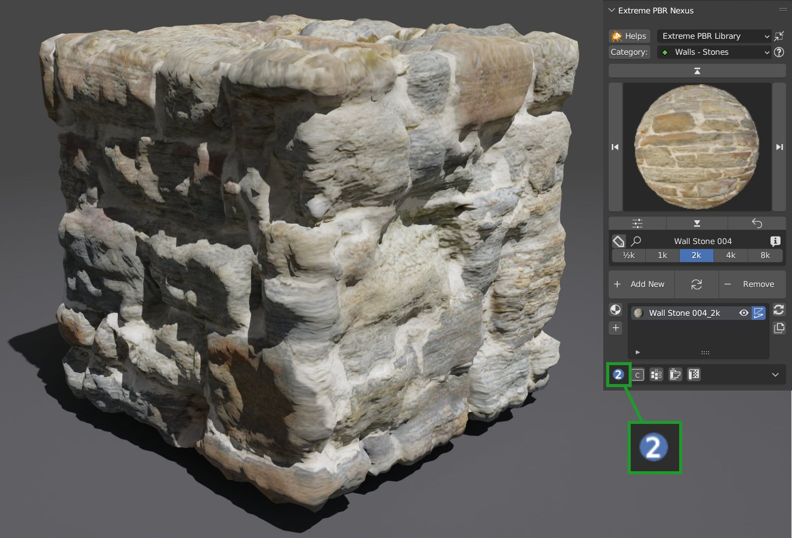

|

.. note::
      There are some cases where the object may already have the Shade Smooth while the indicator marks for example step 0,
      as soon as the button is pressed, this will resynchronize the steps again in accordance with the state of the object.

------------------------------------------------------------------------------------------------------------------------

Copy Material (Smart)
**********************

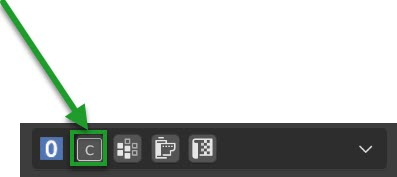

|

This button allows you to copy all the materials and the displacement from the active object, directly to the selected objects.

**Here is an example, to better understand:**

- In order to obtain this situation, make sure to hold down the SHIFT button and select the objects you want to copy,
  the last object you select will be the active object, so make sure it is the one that contains the materials you want to copy.

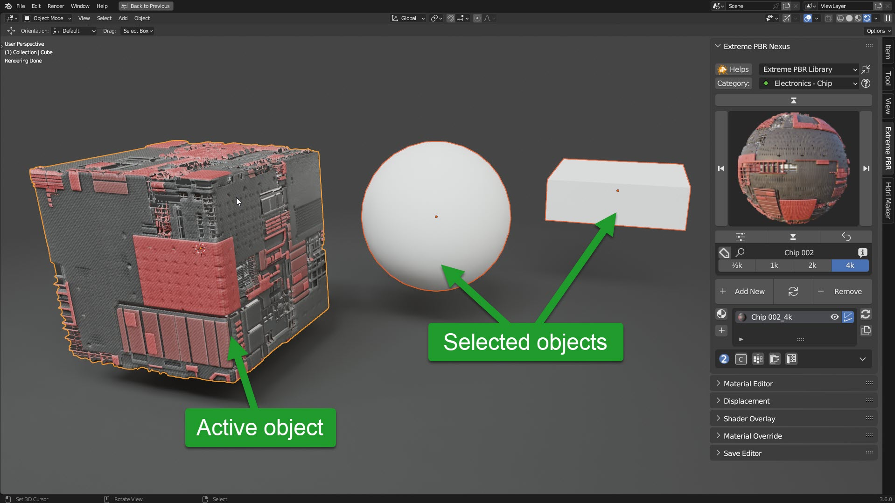

|

- Once you have selected the objects, press the **Copy Material** button, this will copy all the materials
  and the displacement from the active object, directly to the selected objects.

.. image:: _static/_images/main_panel/smart_copy_step_02.jpg
    :align: center
    :width: 800
    :alt: Smart Copy Step 02

------------------------------------------------------------------------------------------------------------------------

.. _smart_vertex_groups_button:

Smart Vertex Groups
*********************

.. note::
        This button is useful only if you have 2 or more materials on the same object and you are using the corresponding displacement of each material.
        the displacements must be of type **Modifier** because if the Displacment is of type **Microdisplacement** this will be useless.
        |
        **For more information on how to use displacement, see this section:** TODO: Refer to the displacement section

|

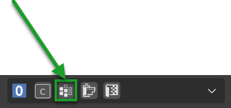

|

Here is how an object with 2 materials and 2 displacements, one for each material, is presented, thanks to this button
the faces with the corresponding materials will be assigned to the respective vertex groups, in this way you can use the
correct displacement for each material.

**Note how both materials in the list have the displacement active:**

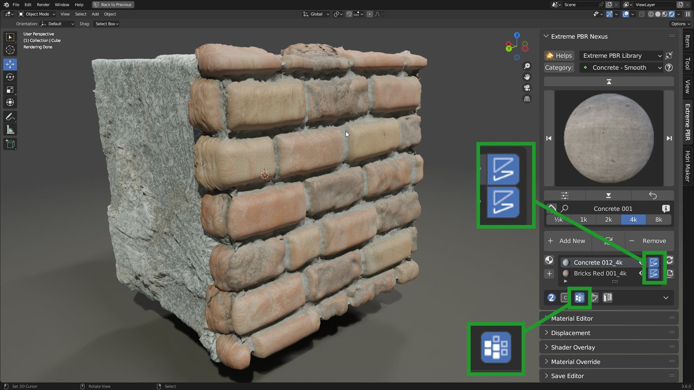

|

Here's how I prepared the object for this example, I divided the faces into more so that the division between the two materials
is a little less sharp, so I added some edges to "Accompany" the displacement between the two materials.

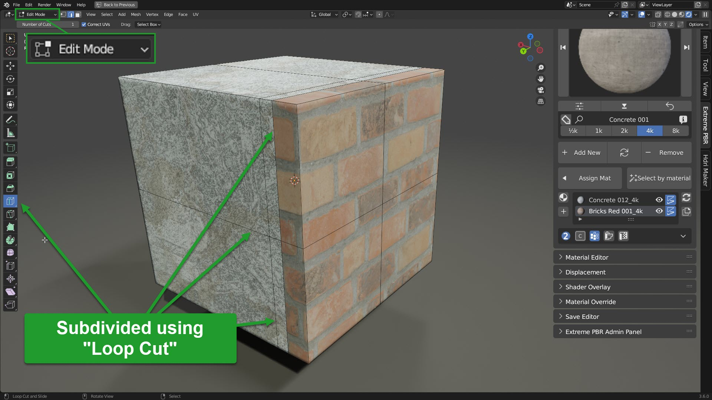

------------------------------------------------------------------------------------------------------------------------

.. _bake_editor_button:

Bake Editor Button
*******************

.. image:: _static/_images/main_panel/bake_editor_button_01.png
    :align: center
    :width: 400
    :alt: Bake Editor Button 01

|

This button allows you to access the Bake Editor Panel, which allows you to bake the materials present on the object

The Bake Editor section is explained in this section: :ref:`bake_editor_panel`

------------------------------------------------------------------------------------------------------------------------

.. _mapping_editor_button:

Mapping Editor Button
**********************

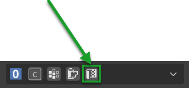

This button allows you to access the Mapping Editor panel, which allows you to edit the UV mapping of the active object.
You can find the section dedicated to the Mapping Editor here: :ref:`mapping_editor_panel`

------------------------------------------------------------------------------------------------------------------------

Box Utility Dropdown Menu
*************************

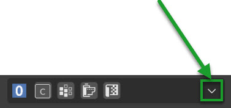

|

From this button, you can access the drop-down menu, which contains other useful functions.

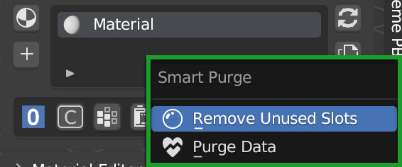

|

Remove unused slots
##########################

Remove the materials from the object if they are not applied to any face

Purge Data
##########################

Purge the project data (Orphan Data) from Materials no longer used, images no longer used, etc ...

This button is the equivalent of the "Purge" button present in Blender in Orphan data:

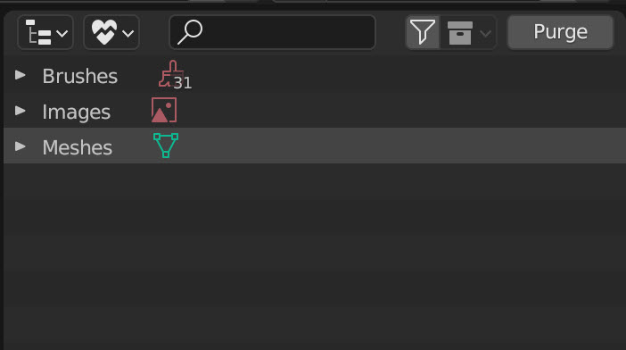

