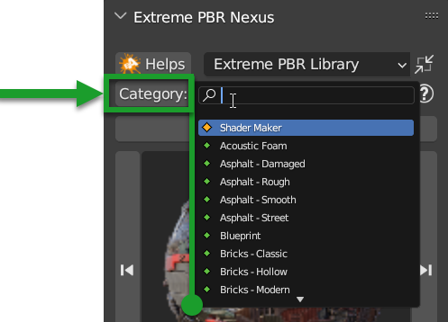

Main Panel
===========================

The main panel of Extreme PBR Nexus from version 4.1.100, if you have an older version, you can update it by following
this guide: :ref:`new_installation`

.. |main_panel| image:: _static/_images/main_panel/main_panel_01.png
                    :width: 400
                    :alt: Main Panel 01

+--+-------------------------------------+-+
|  |  1. :ref:`libraries_selector`       | |
|  |  2. :ref:`mp_material_browser`      | |
|  |  3. :ref:`tag_search_size_selector` | |
|  |  4. :ref:`add_remove_buttons`       | |
|  |  5. :ref:`material_list`            | |
|  |  6. :ref:`box_utility`              | |
+--+-------------------------------------+-+
|  | |main_panel|                        | |
+--+-------------------------------------+-+

------------------------------------------------------------------------------------------------------------------------

.. _libraries_selector:

Libraries selector
------------------

This area is used to choose the library, the category (of the library) and the category search via the text field.

.. image:: _static/_images/main_panel/main_panel_magnify_library_selector_01.png
    :align: center
    :width: 800
    :alt: Libraries selector

------------------------------------------------------------------------------------------------------------------------

Helps Button
************

This button opens the Help section in the addon preferences window. This is useful to find more information
on how to use the addon

------------------------------------------------------------------------------------------------------------------------

.. _mp_library_selector:

Library Selector (Drop-down menu)
*********************************

This allows you to select the material library you want to use. All libraries added via
"Libraries" in the addon preferences menu will be displayed in this drop-down menu.
By default this Drop-down menu, contains the "Default" library, which is the library that comes with the addon.
and the "User" library, which is the library where you can add your saved materials.

.. image:: _static/_images/main_panel/libraries_selector_popup_01.png
    :align: center
    :width: 400
    :alt: Libraries selector

------------------------------------------------------------------------------------------------------------------------

.. _minimize_button:

Minimize Button
***************

.. image:: _static/_images/main_panel/minimize_main_panel_01.png
    :align: center
    :width: 800
    :alt: Minimize Button

|

This button allows you to minimize the main panel, to have more space in the 3D view.

------------------------------------------------------------------------------------------------------------------------

Search Category
***************

|

This Button allows you to search for a category without opening the drop-down menu.

.. note::
        The categories are relative to the selected library, at the moment the categories contained in a non-selected library will not be displayed

------------------------------------------------------------------------------------------------------------------------

Category Selector (Drop-down Menu)
************************************

.. image:: _static/_images/main_panel/category_popup_01.png
    :align: center
    :width: 800
    :alt: Category Selector

|

This allows you to select the category (Each library will have its own category)

------------------------------------------------------------------------------------------------------------------------

.. _mp_material_browser:

Material Browser
-------------------

.. image:: _static/_images/main_panel/material_browser_01.png
    :align: center
    :width: 800
    :alt: Material Browser

|

This section is dedicated to displaying the material previews.

------------------------------------------------------------------------------------------------------------------------

.. _mp_material_browser_popup:

Preview Popup
*************

|

This allows you to select the material (Each library will have its own material), a pop-up window will appear
with the list of preview materials

------------------------------------------------------------------------------------------------------------------------

Up/Down Arrow
**************

|

These two buttons allow you to switch to the previous or next category.

------------------------------------------------------------------------------------------------------------------------

Left/Right Arrow
*****************

.. image:: _static/_images/main_panel/scroll_left_right_material_01.png
    :align: center
    :width: 200
    :alt: Left/Right Arrow

|

These two buttons allow you to switch to the previous or next material in the current category.

------------------------------------------------------------------------------------------------------------------------

.. _mp_open_options:

Open Options
**************

.. image:: _static/_images/main_panel/open_options_button_01.png
    :align: center
    :width: 400
    :alt: Open Options

|

This button will open the Extreme PBR preferences exactly in the Options section

------------------------------------------------------------------------------------------------------------------------

.. _mp_reload_preview_icons:

Reload Preview Icons
*********************

.. image:: _static/_images/main_panel/reload_preview_icons_01.png
    :align: center
    :width: 400
    :alt: Reload Preview Icons

|

It may happen that the material icons are not loaded correctly, this button allows you to reload the material icons.
in addition, it also reloads the interface icons

------------------------------------------------------------------------------------------------------------------------

.. _tag_search_size_selector:

Tag Search Size Selector
------------------------

|

This small menu in the box, allows you to Select the size / version of the material (If there is an alternative)
Contains The search for tag / material name and information on the material currently in the preview.

------------------------------------------------------------------------------------------------------------------------

Search for tag
**************

.. image:: _static/_images/main_panel/tag_search_menu_button_01.png
    :align: center
    :width: 800
    :alt: Search for tag

|

This allows you to search for a material by typing the name of the tag
- In the upper field, you can enter the name of the tag you want to include in the search
- In the lower field, you can enter the name of the tag you want to exclude from the search

Keep the tags separated with a space if you want to include more than one tag in the search.

In this way, the categories and the previews will be filtered according to the tags entered.

------------------------------------------------------------------------------------------------------------------------

Search Material by entering text
**********************************

This allows you to search for a material by typing the name of the material (It work with the tag Restrictions if you need)

.. note::
    This function will search for all the materials in the selected library, it will exclude the non-selected libraries, so make sure
    to search in the right library via the "Libraries selector" drop-down menu

|

------------------------------------------------------------------------------------------------------------------------

.. _info_and_tag:

Info & Tag
**********

This button will open a dialog window with information about the material currently in preview.
inside there will be information about the author, the license.
There will also be the tags that have been assigned to the material, they can also be modified from here.

.. image:: _static/_images/main_panel/info_tag_panel_popup_01.png
    :align: center
    :width: 600
    :alt: Info Tag Panel Popup 01

------------------------------------------------------------------------------------------------------------------------

Show info
#############

By pressing the arrow-shaped button, the section will be shown or hidden where there is information
on the material in preview (If existing)

.. image:: _static/_images/main_panel/show_info_panel_01.png
    :align: center
    :width: 600
    :alt: Show info panel 01

------------------------------------------------------------------------------------------------------------------------

Edit Tags
#########

In the info & Tag panel you can edit the tags assigned to the material.
To do this, just click on the **Edit Tags** button and enter the desired tags.
You can also delete existing tags, just press on them, and a dialog box will be displayed
that will ask you if you want to delete the tag.
This tag will then be useful for searching for material by tag.

.. image:: _static/_images/main_panel/edit_tags_01.png
    :align: center
    :width: 600
    :alt: Edit Tags 01

|

.. Note::
    - Tags can only be edited if you have checked the "Edit Tags" box

------------------------------------------------------------------------------------------------------------------------

Material Version Selector
*************************

- If in the library there are different versions of the same material, this selection allows you to choose which version to load

  **This will only take effect when loading the material, it will not affect the material already loaded in the scene**

.. image:: _static/_images/main_panel/material_version_selector_01.png
    :align: center
    :width: 400
    :alt: Material Version Selector 01

|

.. note::
    - The versions of the materials will be shown only if they are greater than 1, if for example a material has only one version, this will not be shown
      because it would not make sense to select a version if there is only one.

------------------------------------------------------------------------------------------------------------------------

.. _add_remove_buttons:

Add Replace Remove Buttons
---------------------------

- Add (From the preview) / Replace active material / Remove active Material buttons

.. image:: _static/_images/main_panel/add_replace_remove_01.png
    :align: center
    :width: 800
    :alt:  Add Replace Remove Buttons 01

|

- In Edit Mode, other buttons will be added

.. image:: _static/_images/main_panel/add_replace_remove_edit_mode_01.png
    :align: center
    :width: 400
    :alt: Add Replace Remove Buttons Edit Mode 01

------------------------------------------------------------------------------------------------------------------------

.. _mp_add_new:

Add New
********

.. tip::
        **Only from Extreme PBR Nexus version 4.1.120**

        - Press **ALT** before clicking the button to add a Basic material (Principled BSDF + Node Output)
        - Press **Shift** before clicking the button in order to use it exactly as Shader Maker described here: :ref:`shader_maker`

        - If you have many objects selected in addition to the active object, the material will be added to all the selected objects
          provided that the selected objects do not have any material on them.

|

- **Object Mode**
    - This button loads the materials and applies them to the selected object, if no object is selected, this will have no effect.

- **Edit Mode**
    - If you are in Edit mode and have a face of the selected object selected, the material will be applied only to that face if there are already 1 or more materials on the object.

.. note::
    This button will always add a new material to the list of materials of the selected object, if you want to replace
    the active material, use the **Replace** button described below

------------------------------------------------------------------------------------------------------------------------

Replace
**********

.. tip::
        **Only from Extreme PBR Nexus version 4.1.120**

        - If you are replacing for example the Asphalt 001 1k Material with Asphalt 001 2k, Extreme PBR recognizes that the material is the same
          and only replaces the textures inside it, keeping the values of the Material Editor settings unchanged.

        - If you want to replace the same material that is present on multiple objects, you will simply have to select all the objects
          Extreme PBR checks if the active material on the active object is present on these objects, if it is present it will replace every time it encounters the material.
          This replaces the **Replace All** button that was present in previous versions.

        - Press **ALT** before clicking the button to add a Basic material (Principled BSDF + Node Output)
        - Press **Shift** before clicking the button in order to use it exactly as Shader Maker described here: :ref:`shader_maker`

|

- **Object Mode**
    - **This button will be visible only if there is one or more materials on the selected object**
      replaces the active material (From the material list: :ref:`material_list`) with the material in preview, if no material is selected, this will have no effect.

- **Edit Mode**
    - If you are in Edit mode and have a face of the selected object selected, the material will be applied only to that face if there are already 1 or more materials on the object.

|

- **If there is some displacement active in this material, it will be removed before applying the new material**

.. admonition:: Deprecated
    :class: deprecated

    The **Replace All** button has been removed, as it is now possible to replace the same material on multiple
    selected objects, by selecting all the objects or only the objects to which you want to replace the material in question.

    .. image:: _static/_images/main_panel/replace_all_01.png
        :align: center
        :width: 400
        :alt: Replace All 01

------------------------------------------------------------------------------------------------------------------------

Remove
*******

.. image:: _static/_images/main_panel/remove_01.png
    :align: center
    :width: 400
    :alt: Remove

|

- This button removes the selected material from the material list.
- **If there is some displacement active in this material, it will be removed before applying the new material**

.. tip::
    - **By pressing Shift + Remove button** you will remove all the materials from the selected objects (If you do it by mistake, press CTRL + Z to undo the operation)

------------------------------------------------------------------------------------------------------------------------

Assign Mat
***********

**This button will be visible only in edit mode**, so you can select the faces of the object and assign the active material
in the Material List explained here: :ref:`material_list`

.. image:: _static/_images/main_panel/assign_mat_example_01.png
    :align: center
    :width: 800
    :alt: Assign Mat example 01

------------------------------------------------------------------------------------------------------------------------

Select By material
******************

**This button will be visible only in edit mode**, so you can select the faces of the object and assign the active material
if the material selected in the material list is not present on any face of the object, this button will have no effect.

.. image:: _static/_images/main_panel/select_by_material_example_01.png
    :align: center
    :width: 800
    :alt: Select By material example 01

------------------------------------------------------------------------------------------------------------------------

.. _material_list:

Material List Section
-----------------------

In this section there are the materials that have been added to the selected object.
These materials can be added via the **Add** or **Replace** button.
The materials can be removed via the **Remove** button or replaced via the **Replace** button.
There are also other buttons that we will see below.

------------------------------------------------------------------------------------------------------------------------

Active Material
****************

|

This is the active material, you can select it directly with the mouse cursor, just click on it.

With double click of the mouse you can also rename the active material

------------------------------------------------------------------------------------------------------------------------

Set Preview from material
****************************

.. note::
        This button will work only for materials applied with Extreme PBR Nexus version 4.1.120 or higher,
        because in previous versions there was no value stored in the material.

**Only from Extreme PBR Nexus version 4.1.120**

By clicking on the icon of the desired material, (Provided you read the note above) the material will be set
in the Extreme PBR preview panel, the Library Selector, the Category Selector, the Material Browser
and also the version of the material used will be automatically set.

------------------------------------------------------------------------------------------------------------------------

.. _displace_on_off:

Displace On/Off
****************

.. image:: _static/_images/main_panel/displace_on_off_button_01.png
    :align: center
    :width: 400
    :alt: Displace On/Off 01

|

This button activates or deactivates the displacement.
If the displacement is active, the button will be blue, if it is inactive, the button will be gray.

Once activated, a further interface dedicated to displacement will appear which we can see in this section:
:ref:`displacement`

.. image:: _static/_images/main_panel/displace_on_off_3d_example_01.png
    :align: center
    :width: 800
    :alt: Displace On/Off 3D Example 01

|

.. important::
        This button will be present only if the material has a Bump / Displacement map
        if it is not present, it means that there is no Bump / Displacement map in the material.

.. tip::
        If the same identical material is also present on other objects, the displacement will also be activated on the other objects.
        If you want to avoid this, you can make the material unique by copying it via the **Duplicate Material** button described
        in this paragraph: :ref:`duplicate_material`

------------------------------------------------------------------------------------------------------------------------

Hide Displace
**************

|

If you activate this button with an eye icon, the displacement will be hidden but not deleted, this allows you to see
the object without displacement while keeping the displacement settings unchanged.

------------------------------------------------------------------------------------------------------------------------

Search and Replace
******************

|

As soon as you press the button, a small drop-down menu will appear, then you will have the possibility to search in the list
of materials present in the current project **bpy.data.materials** and **replace** the active material with the material found.

------------------------------------------------------------------------------------------------------------------------

Search and Add
***************

.. image:: _static/_images/main_panel/search_and_add_data_materials_01.png
    :align: center
    :width: 400
    :alt: Search and Add Data Materials 01

|

As soon as you press the button, a small drop-down menu will appear, then you will have the possibility to search in the list
of materials present in the current project **bpy.data.materials** and **add** the material found to the list of materials of the selected object.

|

**Edit Mode Features:**
    - If you are in edit mode and have some faces selected, the material will be applied to those faces, otherwise it will only be added to the material list

------------------------------------------------------------------------------------------------------------------------

.. _duplicate_material:

Duplicate Material
*******************

.. image:: _static/_images/main_panel/duplicate_material_01.png
    :align: center
    :width: 400
    :alt: Duplicate Material 01

|

This button allows you to duplicate the active material in the material list, this will make it independent if it is present
on other objects. A suffix will be added to the name of the material, it will be numeric and will grow with each duplication.
You can replace the name of the material with the one you prefer, just double click on the name of the material from
the material list and enter the desired name.
This function also duplicates the groups or images contained in the material nodes, in short, it makes everything independent.

------------------------------------------------------------------------------------------------------------------------

.. _box_utility:

Box Utility
-----------

This box contains some very useful functions of Extreme PBR, the buttons in this box may vary depending on the context you are in,
for example, if you have selected an object or not.

|

.. note::
        The box will not be visible if the Minimize mode is activated, check here: :ref:`minimize_button` for more information

------------------------------------------------------------------------------------------------------------------------

Smart Shade Smooth
******************

.. note::
        Please Update to Extreme PBR Nexus version 4.1.120 or higher to use this feature with popover panel

|

The functions present in this panel, allow you to modify more objects at the same time!

- Type of Objects valid for Smart Shade Smooth:
    **(MESH, CURVE, SURFACE, FONT)**

If the selected objects are mixed and some are not of these (Type Camera, Empty, etc ...) they will be ignored.

Shade Smooth
#############

- **Until Blender 4.0**
    **If activated** the selected objects will be put in Shade Smooth mode, so they will have a smoother appearance.
    Up to this version of Blender 4.0 if there are marked Sharp Edges they will be ignored.
- **From Blender 4.1 onwards**
    **If activated** the selected objects will be put in Shade Smooth mode, so they will have a smoother appearance.
    From this version of Blender 4.1 onwards if there are marked Sharp Edges they will be respected.

**Example with Shade Smooth Off:**

The object is not smooth, the edges are sharp

|

**Example with Shade Smooth On:**

The object is smooth, the edges are smooth (If there are no marked Sharp Edges)

|

Auto Smooth
#############

.. note::
        From Blender 4.1 onwards, the auto smooth will make use of the "Smooth by Angle" modifier (Geometry Node) and no longer of the native Auto Smooth of Blender
        since it has been deprecated.

- **Until Blender 4.0**
    **If activated**, the selected objects will have Auto Smooth activated, so the marked Sharp edges will be respected,
    plus you can adjust the Auto Smooth angle between 0 and 180 degrees, by default it is 30 degrees.
    This function will automatically activate the native Auto Smooth of Blender on all selected objects (Only up to Blender 4.0)

    **If deactivated**, the Auto Smooth will be deactivated on the selected objects.

- **From Blender 4.1 onwards**
    **If activated**, the new "Smooth by Angle" modifier (Geometry Node) will be activated on the selected objects
    with which you can then decide whether to respect the marked Sharp edges or not, plus you can adjust the Auto
    Smooth angle between 0 and 180 degrees, by default it is 30 degrees. (If a "Smooth by Angle" modifier is already present, it will be ignored)

    **If deactivated**, all "Smooth by Angle" modifiers present on the selected objects will be removed.

**Example with Auto Smooth Off:**

All the edges are smooth (If there are no marked Sharp Edges)

|

**Example with Auto Smooth On:**

Maximum face angle for smooth edges in this example is 30 degrees, so all the edges with an angle greater than 30 degrees will be sharp,
You can adjust the angle from the panel that will appear after activating the Auto Smooth.

|

Auto smooth Angle
##################

This button allows you to adjust the Auto Smooth angle, the angle can be adjusted between 0 and 180 degrees, by default it is 30 degrees.
This button will be visible only if the Auto Smooth is activated.

**In this example the angle is set to 90 degrees, so all the edges with an angle greater than 90 degrees will be sharp,
the others will be smooth**

|

Ignore Sharpness
##################

.. note::
        This button is only available from Blender 4.1 onwards (Extreme PBR automatically detects the Blender version)

If your object has marked sharp edges and you want to ignore them, you can activate this button, in this way the marked
sharp edges will be ignored and the object will be smooth.

**Example of mark sharp edges:**

As you can see in the follow image, the edges are marked as sharp (Blue edges)

|

**Example with Ignore Sharpness off: The angle is 180 in order to see the effect better:**

.. image:: _static/_images/main_panel/mark_sharp_example_02.webp
    :align: center
    :width: 800
    :alt: Mark Sharp Example 02

|

**Example with Ignore Sharpness on: The angle is 180 in order to see the effect better:**

|

Apply Modifier
################

.. note::
        This button is only available from Blender 4.1 onwards (Extreme PBR automatically detects the Blender version)

.. warning::
        If you apply this modifier with the "Ignore Sharpness" option off, the edges that are not smooth will be set as sharp,
        If you already have edges marked as sharp, these will be respected, but you may have additional edges marked as sharp after applying the modifier.
        It is recommended to perform this operation only if strictly necessary (For example to export the object to another software)

This button allows you to apply the "Smooth by Angle" modifier (Geometry Node) to the selected objects

|

.. tip::
        You can use this button to apply the modifier to all selected objects, a function will be executed that will
        recognize if there is a "Smooth by Angle" modifier and will apply it, otherwise the object will be ignored.

Set By Default
################

By pressing this button, the settings will be set as default, every time you apply a material with Extreme PBR to your
object, these settings will be applied. (This features not work for the Asset Browser drag and drop)

As you can see, if the "Set By Default" button is activated, below it you will see the settings that will be used when
applying a material with Extreme PBR to your object.

|

Remove Default
################

By pressing this button, the settings will be removed as default, no default settings will be applied when applying a
material with Extreme PBR to your objects.

------------------------------------------------------------------------------------------------------------------------

Copy Material (Smart)
**********************

.. image:: _static/_images/main_panel/copy_material_smart_button_01.jpg
    :align: center
    :width: 400
    :alt: Copy Material (Smart) Button 01

|

This button allows you to copy all the materials and the displacement from the active object, directly to the selected objects.

**Here is an example, to better understand:**

- In order to obtain this situation, make sure to hold down the SHIFT button and select the objects you want to copy,
  the last object you select will be the active object, so make sure it is the one that contains the materials you want to copy.

|

- Once you have selected the objects, press the **Copy Material** button, this will copy all the materials
  and the displacement from the active object, directly to the selected objects.

.. image:: _static/_images/main_panel/smart_copy_step_02.jpg
    :align: center
    :width: 800
    :alt: Smart Copy Step 02

------------------------------------------------------------------------------------------------------------------------

.. _smart_vertex_groups_button:

Smart Vertex Groups
*********************

.. note::
        This button is useful only if you have 2 or more materials on the same object and you are using the corresponding displacement of each material.
        the displacements must be of type **Modifier** because if the Displacement is of type **Microdisplacement** this will be useless.
        |
        **For more information on how to use displacement, see this section:** :ref:`displacement`

|

.. image:: _static/_images/main_panel/smart_vertex_groups_button_01.png
    :align: center
    :width: 400
    :alt: Smart Vertex Groups Button 01

|

Here is how an object with 2 materials and 2 displacements, one for each material, is presented, thanks to this button
the faces with the corresponding materials will be assigned to the respective vertex groups, in this way you can use the
correct displacement for each material.

**Note how both materials in the list have the displacement active:**

.. image:: _static/_images/main_panel/double_displacement_same_object_01.jpg
    :align: center
    :width: 800
    :alt: Double Displacement Same Object 01

|

Here's how I prepared the object for this example, I divided the faces into more so that the division between the two materials
is a little less sharp, so I added some edges to "Accompany" the displacement between the two materials.

------------------------------------------------------------------------------------------------------------------------

.. _bake_editor_button:

Bake Editor Button
*******************

.. image:: _static/_images/main_panel/bake_editor_button_01.png
    :align: center
    :width: 400
    :alt: Bake Editor Button 01

|

This button allows you to access the Bake Editor Panel, which allows you to bake the materials present on the object

The Bake Editor section is explained in this section: :ref:`bake_editor_panel`

------------------------------------------------------------------------------------------------------------------------

.. _mapping_editor_button:

Mapping Editor Button
**********************

.. image:: _static/_images/main_panel/mapping_editor_button_01.png
    :align: center
    :width: 400
    :alt: Mapping Editor Button 01

This button allows you to access the Mapping Editor panel, which allows you to edit the UV mapping of the active object.
You can find the section dedicated to the Mapping Editor here: :ref:`mapping_editor_panel`

------------------------------------------------------------------------------------------------------------------------

Box Utility Dropdown Menu
*************************

|

From this button, you can access the drop-down menu, which contains other useful functions.

Remove unused slots
##########################

Remove the materials from the object if they are not applied to any face

Purge Data
##########################

Purge the project data (Orphan Data) from Materials no longer used, images no longer used, etc ...

This button is the equivalent of the "Purge" button present in Blender in Orphan data:

.. image:: _static/_images/main_panel/purge_orphan_data_standard.jpg
    :align: center
    :width: 400
    :alt: Purge Orphan Data Standard

|

Show Material Preview
##########################

If active, it shows the material previews in the material slots, it is disabled by default to save resources, since
the material previews are updated as soon as they are modified, so if you are working from the Material Editor on the properties
of the material these will be updated often, slightly slowing down the interface, leave it disabled to save resources.

------------------------------------------------------------------------------------------------------------------------

Docs Helper
------------

The Docs Helper button allows you to access the Extreme PBR documentation, in this way you can find
the reference via the button. A popup will open with the link to the documentation.

.. note::
        This button is repeated in the interface on several panels, this is because the user can access the documentation
        in a faster way, the button can take various forms and variants depending on the context in which you are.

.. image:: _static/_images/undocumented/online_manual.png
      :align: center
      :width: 600
      :alt: online manual

