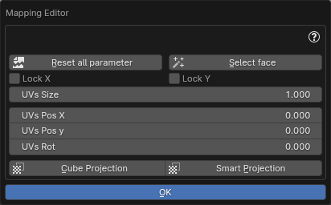
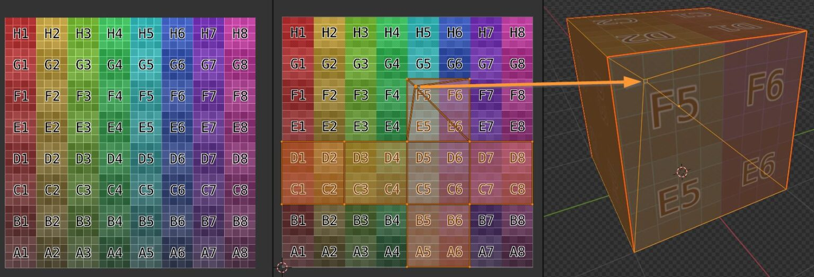
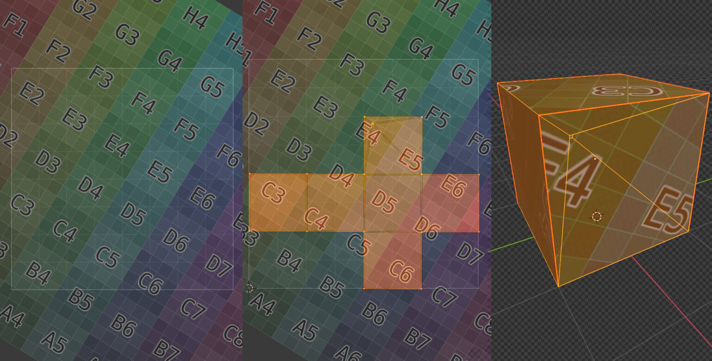
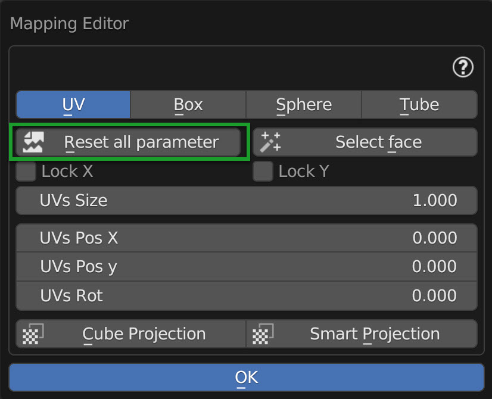
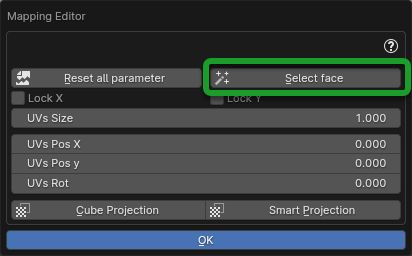
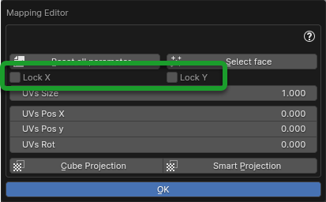
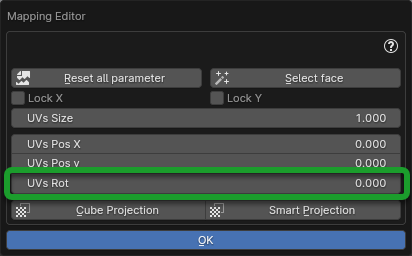
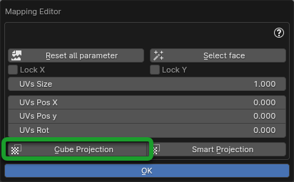
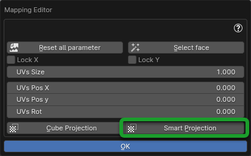

.. _mapping_editor_panel:

Mapping Editor
================

|

Through this panel you can edit the UV mapping, you can also manipulate the UV mapping if the material does not come
from Extreme PBR, but make sure that the material is UV Mapped Based.

If you have applied the material with Extreme PBR, make sure you are in UV mode from the Material editor panel (All
materials in the Extreme PBR library based on Textures, have a preset UV mapping)

.. image:: _static/_images/mapping_editor/coordinate_type_uv_01.webp
    :align: center
    :width: 500
    :alt: Coordinate Type UV 01

|

.. note::
    In order to access the **Mapping Editor** panel you must be in the **Main Panel** and press the button with the symbol
    of the Texture. Here the **Main Panel** section: :ref:`mapping_editor_button`

    .. image:: _static/_images/main_panel/mapping_editor_button_01.png
        :align: center
        :width: 400
        :alt: Mapping Editor Button 01

Mapping editor is a tool to manipulate UV mapping without necessarily having to use the Blender UV editor.
This tool was built to **Scale**, **Move** and **Rotate** UV maps on the fly without having to enter
in the UV editor. Clearly it is not a substitute for the UV editor, but it contains the most used functions, especially in the field
of architecture.

.. important::
        This tool has nothing to do with **Scale** **Rotate** or **Location** of the material, this tool is
        able to translate the UV coordinates present on the object. This is necessary especially if you are using the displacement
        in **Modifier** mode to also move the displacement coordinates. The displacement section can be found here: :ref:`displacement`

------------------------------------------------------------------------------------------------------------------------

Brief introduction
--------------------

There are two ways in which you can manipulate mapping:

In this example a texture is placed into the Square Texture space (left), an UV Map of the object lays on top (Center)
and a correspondence is set between faces of the object and colors of the texture (right)

|

.. _mapping_method_01:

Method 01
************

The first method is to move, rotate and scale the Map, so to vary the correspondence between Texture space and Map.

.. image:: _static/_images/mapping_editor/uv_mapping_example_02.jpg
    :align: center
    :width: 800
    :alt: UV Mapping Example 02

|

Method 02
************

The second method is to move, rotate and scale the Texture: so to vary the correspondence between Texture image and Texture space.

|

Using the Mapping Editor lets you use the :ref:`mapping_method_01`: **manipulating the correspondence between Texture space and Map**

------------------------------------------------------------------------------------------------------------------------

Reset All Parameter
---------------------

|

It resets all the mapping parameters, bringing them back to the default values, but only in the panel, it will have no effect
on the object.

------------------------------------------------------------------------------------------------------------------------

Select Face
------------

|

Select the face / faces of the active object, based on the material selected in the material list. Here the section on
material list: :ref:`material_list`

------------------------------------------------------------------------------------------------------------------------

Lock X/Y
----------

|

If the checkbox on one of the two axes is active, it will lock the scale of the corresponding axis, so you can
scale only along the other axis during the UVS Size operation described below

------------------------------------------------------------------------------------------------------------------------

UVS Size
----------

.. image:: _static/_images/mapping_editor/uv_size_01.webp
    :align: center
    :width: 400
    :alt: UV Size 01

|

This resizes the UV map, if you increase the value, the UV map enlarges, if you decrease the value, the UV map decreases.

------------------------------------------------------------------------------------------------------------------------

UVs Pos X/Y
------------

.. image:: _static/_images/mapping_editor/uvs_pos_x_y_01.webp
    :align: center
    :width: 400
    :alt: UVs Pos X Y 01

|

These two sliders are used to translate the UV map on its X and Y axes depending on the slider you are using.

------------------------------------------------------------------------------------------------------------------------

UVs Rot
--------

|

This slider is used to rotate the UV map.

------------------------------------------------------------------------------------------------------------------------

Cube Projection
----------------

|

This button allows you to make a cubic mapping on the fly. Useful to re-project a UV mapping when you modify the geometry
of the object.

------------------------------------------------------------------------------------------------------------------------

Smart Projection
-----------------

|

This button allows you to make a smart mapping on the fly. Useful to re-project a UV mapping when you modify the geometry
