Material List
=============

This is the complete list of materials contained in the Default Library of Extreme PBR.Here you can search for the materials you are interested in order to find the .exapack files that contain that material.

.. tip:: To search for the material you are interested in, you can search in the sidebar at the top left, or press `Ctrl + F` and type the name of the material you are looking for.

|

Acoustic Foam (Category)
------------------------

Acustic Foam 001
****************

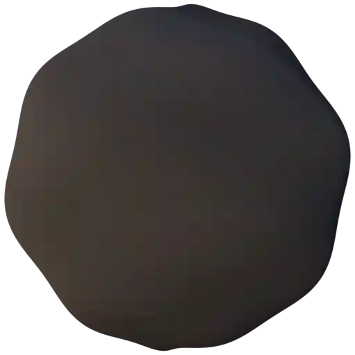

|

**This material is contained in the following Exapacks:**

    - XTRPbr_05k_Vol_001

    - XTRPbr_1k_Vol_001

    - XTRPbr_2k_Vol_001

    - XTRPbr_4k_Vol_008

    - XTRPbr_8k_Vol_021

------------------------------------------------------------------------------------------------------------------------

Acustic Foam 002
****************

.. image:: _static/_images/material_list/acoustic_foam/acustic_foam_002/acustic_foam_002.webp
    :width: 30%
    :align: center
    :alt: Acustic Foam 002

|

**This material is contained in the following Exapacks:**

    - XTRPbr_05k_Vol_001

    - XTRPbr_1k_Vol_001

    - XTRPbr_2k_Vol_001

    - XTRPbr_4k_Vol_008

    - XTRPbr_8k_Vol_021

------------------------------------------------------------------------------------------------------------------------

Acustic Foam 003
****************

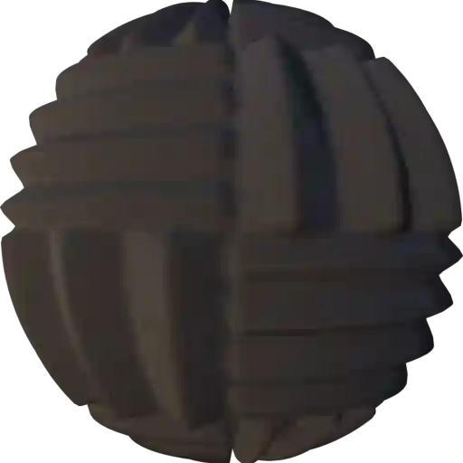

|

**This material is contained in the following Exapacks:**

    - XTRPbr_05k_Vol_001

    - XTRPbr_1k_Vol_001

    - XTRPbr_2k_Vol_001

    - XTRPbr_4k_Vol_008

    - XTRPbr_8k_Vol_021

------------------------------------------------------------------------------------------------------------------------

Acustic Foam 004
****************

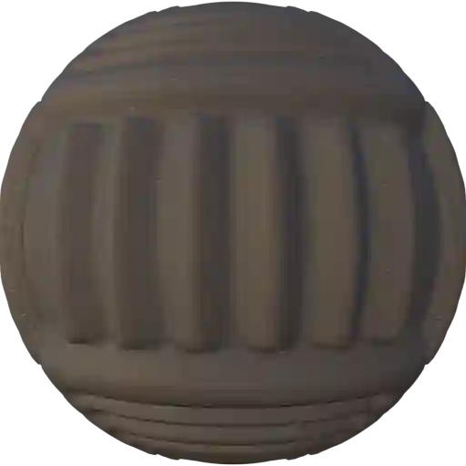

|

**This material is contained in the following Exapacks:**

    - XTRPbr_05k_Vol_001

    - XTRPbr_1k_Vol_001

    - XTRPbr_2k_Vol_001

    - XTRPbr_4k_Vol_008

------------------------------------------------------------------------------------------------------------------------

Acustic Foam 005
****************

.. image:: _static/_images/material_list/acoustic_foam/acustic_foam_005/acustic_foam_005.webp
    :width: 30%
    :align: center
    :alt: Acustic Foam 005

|

**This material is contained in the following Exapacks:**

    - XTRPbr_05k_Vol_001

    - XTRPbr_1k_Vol_001

    - XTRPbr_2k_Vol_001

    - XTRPbr_4k_Vol_008

------------------------------------------------------------------------------------------------------------------------

Acustic Foam 006
****************

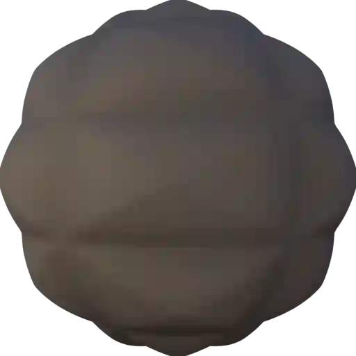

|

**This material is contained in the following Exapacks:**

    - XTRPbr_05k_Vol_001

    - XTRPbr_1k_Vol_001

    - XTRPbr_2k_Vol_001

    - XTRPbr_4k_Vol_008

------------------------------------------------------------------------------------------------------------------------

Acustic Foam 007
****************

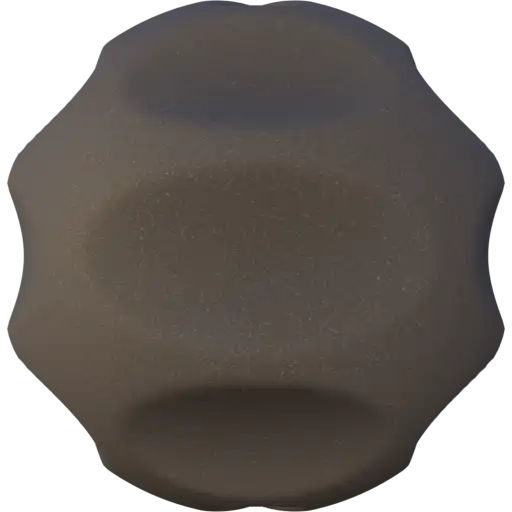

|

**This material is contained in the following Exapacks:**

    - XTRPbr_05k_Vol_001

    - XTRPbr_1k_Vol_001

    - XTRPbr_2k_Vol_001

    - XTRPbr_4k_Vol_008

------------------------------------------------------------------------------------------------------------------------

Asphalt - Damaged (Category)
----------------------------

Asphalt Damaged 001
*******************

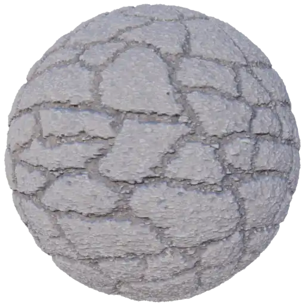

|

**This material is contained in the following Exapacks:**

    - XTRPbr_05k_Vol_001

    - XTRPbr_1k_Vol_001

    - XTRPbr_2k_Vol_001

    - XTRPbr_4k_Vol_008

    - XTRPbr_8k_Vol_021

------------------------------------------------------------------------------------------------------------------------

Asphalt Damaged 002
*******************

.. image:: _static/_images/material_list/asphalt_damaged/asphalt_damaged_002/asphalt_damaged_002.webp
    :width: 30%
    :align: center
    :alt: Asphalt Damaged 002

|

**This material is contained in the following Exapacks:**

    - XTRPbr_05k_Vol_001

    - XTRPbr_1k_Vol_001

    - XTRPbr_2k_Vol_001

    - XTRPbr_4k_Vol_008

    - XTRPbr_8k_Vol_021

------------------------------------------------------------------------------------------------------------------------

Asphalt Damaged 003
*******************

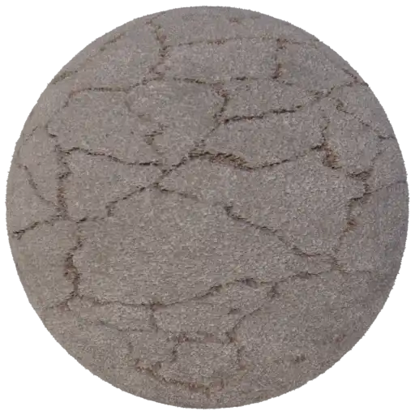

|

**This material is contained in the following Exapacks:**

    - XTRPbr_05k_Vol_001

    - XTRPbr_1k_Vol_001

    - XTRPbr_2k_Vol_001

    - XTRPbr_4k_Vol_008

------------------------------------------------------------------------------------------------------------------------

Asphalt Damaged 004
*******************

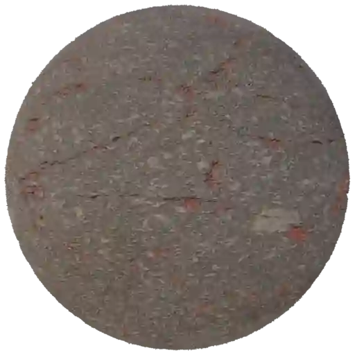

|

**This material is contained in the following Exapacks:**

    - XTRPbr_05k_Vol_001

    - XTRPbr_1k_Vol_001

    - XTRPbr_2k_Vol_001

    - XTRPbr_4k_Vol_008

------------------------------------------------------------------------------------------------------------------------

Asphalt Damaged 005
*******************

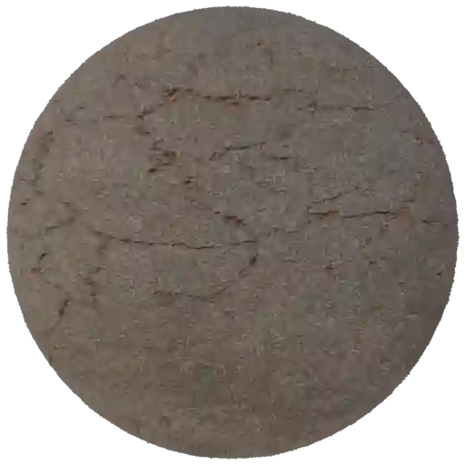

|

**This material is contained in the following Exapacks:**

    - XTRPbr_05k_Vol_001

    - XTRPbr_1k_Vol_001

    - XTRPbr_2k_Vol_001

    - XTRPbr_4k_Vol_008

------------------------------------------------------------------------------------------------------------------------

Asphalt Damaged 006
*******************

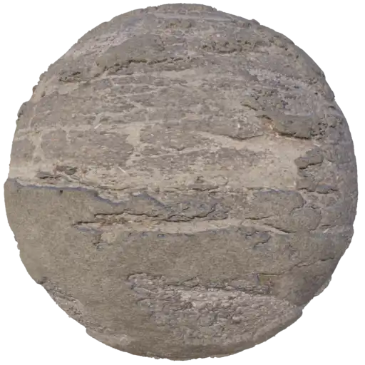

|

**This material is contained in the following Exapacks:**

    - XTRPbr_05k_Vol_001

    - XTRPbr_1k_Vol_001

    - XTRPbr_2k_Vol_001

    - XTRPbr_4k_Vol_008

    - XTRPbr_8k_Vol_021

------------------------------------------------------------------------------------------------------------------------

Asphalt Damaged 007
*******************

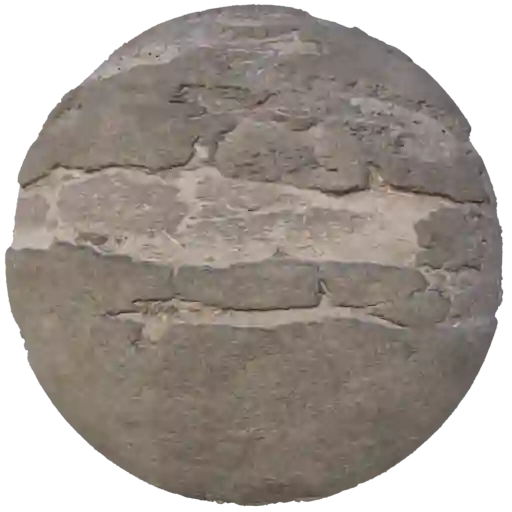

|

**This material is contained in the following Exapacks:**

    - XTRPbr_05k_Vol_001

    - XTRPbr_1k_Vol_001

    - XTRPbr_2k_Vol_001

    - XTRPbr_4k_Vol_008

    - XTRPbr_8k_Vol_021

------------------------------------------------------------------------------------------------------------------------

Asphalt Damaged 008
*******************

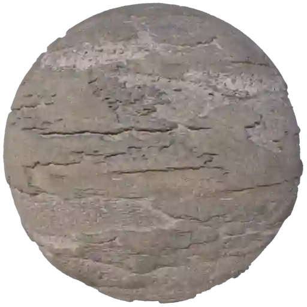

|

**This material is contained in the following Exapacks:**

    - XTRPbr_05k_Vol_001

    - XTRPbr_1k_Vol_001

    - XTRPbr_2k_Vol_001

    - XTRPbr_4k_Vol_008

    - XTRPbr_8k_Vol_021

------------------------------------------------------------------------------------------------------------------------

Asphalt Damaged 009
*******************

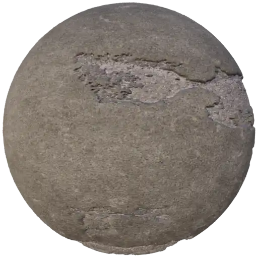

|

**This material is contained in the following Exapacks:**

    - XTRPbr_05k_Vol_001

    - XTRPbr_1k_Vol_001

    - XTRPbr_2k_Vol_001

    - XTRPbr_4k_Vol_008

    - XTRPbr_8k_Vol_021

------------------------------------------------------------------------------------------------------------------------

Asphalt - Rough (Category)
--------------------------

Asphalt Rough 001
*****************

.. image:: _static/_images/material_list/asphalt_rough/asphalt_rough_001/asphalt_rough_001.webp
    :width: 30%
    :align: center
    :alt: Asphalt Rough 001

|

**This material is contained in the following Exapacks:**

    - XTRPbr_05k_Vol_001

    - XTRPbr_1k_Vol_001

    - XTRPbr_2k_Vol_001

    - XTRPbr_4k_Vol_008

    - XTRPbr_8k_Vol_021

------------------------------------------------------------------------------------------------------------------------

Asphalt Rough 002
*****************

.. image:: _static/_images/material_list/asphalt_rough/asphalt_rough_002/asphalt_rough_002.webp
    :width: 30%
    :align: center
    :alt: Asphalt Rough 002

|

**This material is contained in the following Exapacks:**

    - XTRPbr_05k_Vol_001

    - XTRPbr_1k_Vol_001

    - XTRPbr_2k_Vol_001

    - XTRPbr_4k_Vol_008

    - XTRPbr_8k_Vol_021

------------------------------------------------------------------------------------------------------------------------

Asphalt Rough 003
*****************

.. image:: _static/_images/material_list/asphalt_rough/asphalt_rough_003/asphalt_rough_003.webp
    :width: 30%
    :align: center
    :alt: Asphalt Rough 003

|

**This material is contained in the following Exapacks:**

    - XTRPbr_05k_Vol_001

    - XTRPbr_1k_Vol_001

    - XTRPbr_2k_Vol_001

    - XTRPbr_4k_Vol_008

    - XTRPbr_8k_Vol_021

------------------------------------------------------------------------------------------------------------------------

Asphalt Rough 004
*****************

.. image:: _static/_images/material_list/asphalt_rough/asphalt_rough_004/asphalt_rough_004.webp
    :width: 30%
    :align: center
    :alt: Asphalt Rough 004

|

**This material is contained in the following Exapacks:**

    - XTRPbr_05k_Vol_001

    - XTRPbr_1k_Vol_001

    - XTRPbr_2k_Vol_001

    - XTRPbr_4k_Vol_008

    - XTRPbr_8k_Vol_021

------------------------------------------------------------------------------------------------------------------------

Asphalt Rough 005
*****************

.. image:: _static/_images/material_list/asphalt_rough/asphalt_rough_005/asphalt_rough_005.webp
    :width: 30%
    :align: center
    :alt: Asphalt Rough 005

|

**This material is contained in the following Exapacks:**

    - XTRPbr_05k_Vol_001

    - XTRPbr_1k_Vol_001

    - XTRPbr_2k_Vol_001

    - XTRPbr_4k_Vol_008

    - XTRPbr_8k_Vol_021

------------------------------------------------------------------------------------------------------------------------

Asphalt Rough 006
*****************

.. image:: _static/_images/material_list/asphalt_rough/asphalt_rough_006/asphalt_rough_006.webp
    :width: 30%
    :align: center
    :alt: Asphalt Rough 006

|

**This material is contained in the following Exapacks:**

    - XTRPbr_05k_Vol_001

    - XTRPbr_1k_Vol_001

    - XTRPbr_2k_Vol_001

    - XTRPbr_4k_Vol_008

------------------------------------------------------------------------------------------------------------------------

Asphalt Rough 008
*****************

.. image:: _static/_images/material_list/asphalt_rough/asphalt_rough_008/asphalt_rough_008.webp
    :width: 30%
    :align: center
    :alt: Asphalt Rough 008

|

**This material is contained in the following Exapacks:**

    - XTRPbr_05k_Vol_001

    - XTRPbr_1k_Vol_001

    - XTRPbr_2k_Vol_001

    - XTRPbr_4k_Vol_008

------------------------------------------------------------------------------------------------------------------------

Asphalt Rough 009
*****************

.. image:: _static/_images/material_list/asphalt_rough/asphalt_rough_009/asphalt_rough_009.webp
    :width: 30%
    :align: center
    :alt: Asphalt Rough 009

|

**This material is contained in the following Exapacks:**

    - XTRPbr_05k_Vol_001

    - XTRPbr_1k_Vol_001

    - XTRPbr_2k_Vol_001

    - XTRPbr_4k_Vol_008

------------------------------------------------------------------------------------------------------------------------

Asphalt - Smooth (Category)
---------------------------

Asphalt Smooth 001
******************

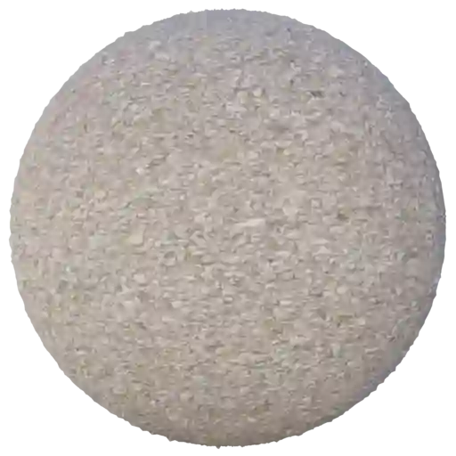

|

**This material is contained in the following Exapacks:**

    - XTRPbr_05k_Vol_001

    - XTRPbr_1k_Vol_001

    - XTRPbr_2k_Vol_001

    - XTRPbr_4k_Vol_008

    - XTRPbr_8k_Vol_021

------------------------------------------------------------------------------------------------------------------------

Asphalt Smooth 002
******************

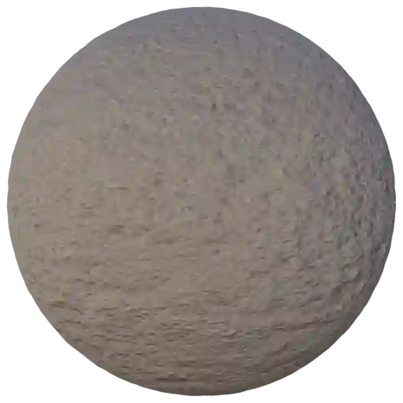

|

**This material is contained in the following Exapacks:**

    - XTRPbr_05k_Vol_001

    - XTRPbr_1k_Vol_001

    - XTRPbr_2k_Vol_001

    - XTRPbr_4k_Vol_008

    - XTRPbr_8k_Vol_021

------------------------------------------------------------------------------------------------------------------------

Asphalt Smooth 003
******************

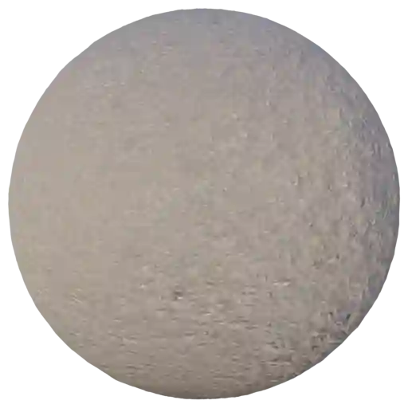

|

**This material is contained in the following Exapacks:**

    - XTRPbr_05k_Vol_001

    - XTRPbr_1k_Vol_001

    - XTRPbr_2k_Vol_001

    - XTRPbr_4k_Vol_008

    - XTRPbr_8k_Vol_021

------------------------------------------------------------------------------------------------------------------------

Asphalt Smooth 004
******************

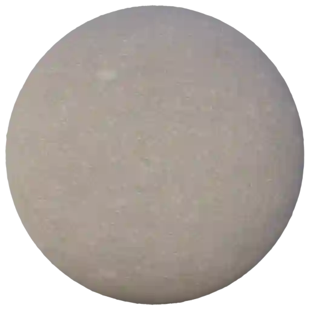

|

**This material is contained in the following Exapacks:**

    - XTRPbr_05k_Vol_001

    - XTRPbr_1k_Vol_001

    - XTRPbr_2k_Vol_001

    - XTRPbr_4k_Vol_008

------------------------------------------------------------------------------------------------------------------------

Asphalt Smooth 005
******************

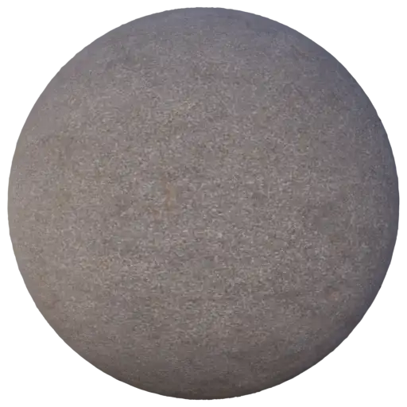

|

**This material is contained in the following Exapacks:**

    - XTRPbr_05k_Vol_001

    - XTRPbr_1k_Vol_001

    - XTRPbr_2k_Vol_001

    - XTRPbr_4k_Vol_008

------------------------------------------------------------------------------------------------------------------------

Asphalt Smooth 006
******************

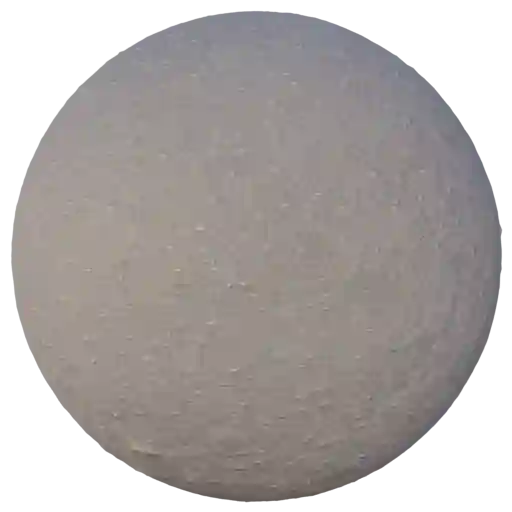

|

**This material is contained in the following Exapacks:**

    - XTRPbr_05k_Vol_001

    - XTRPbr_1k_Vol_001

    - XTRPbr_2k_Vol_001

    - XTRPbr_4k_Vol_008

    - XTRPbr_8k_Vol_021

------------------------------------------------------------------------------------------------------------------------

Asphalt Smooth 007
******************

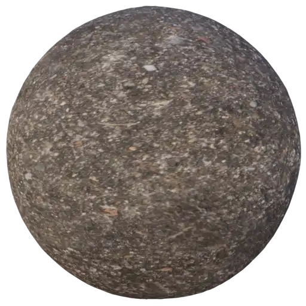

|

**This material is contained in the following Exapacks:**

    - XTRPbr_05k_Vol_001

    - XTRPbr_1k_Vol_001

    - XTRPbr_2k_Vol_001

------------------------------------------------------------------------------------------------------------------------

Asphalt Smooth 008
******************

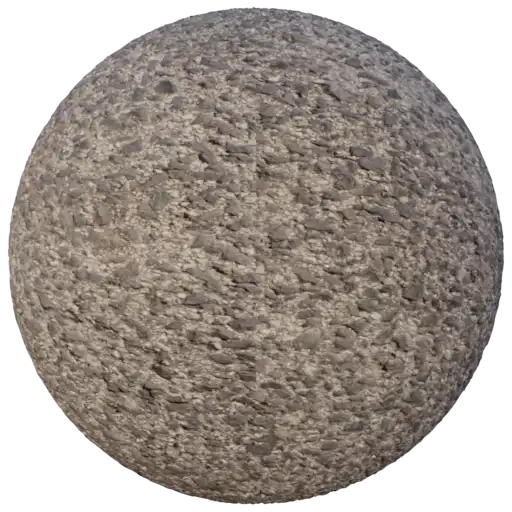

|

**This material is contained in the following Exapacks:**

    - XTRPbr_05k_Vol_001

    - XTRPbr_1k_Vol_001

    - XTRPbr_2k_Vol_001

    - XTRPbr_4k_Vol_008

------------------------------------------------------------------------------------------------------------------------

Asphalt Smooth 009
******************

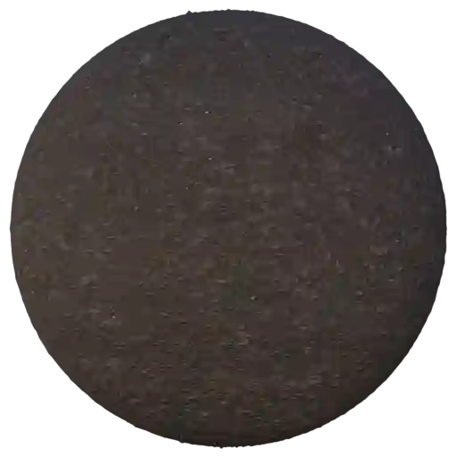

|

**This material is contained in the following Exapacks:**

    - XTRPbr_05k_Vol_001

    - XTRPbr_1k_Vol_001

    - XTRPbr_2k_Vol_001

    - XTRPbr_4k_Vol_008

------------------------------------------------------------------------------------------------------------------------

Asphalt Smooth 010
******************

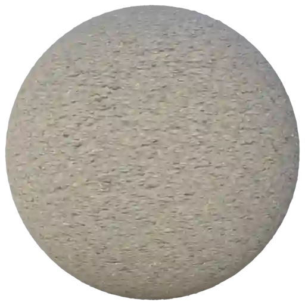

|

**This material is contained in the following Exapacks:**

    - XTRPbr_05k_Vol_001

    - XTRPbr_1k_Vol_001

    - XTRPbr_2k_Vol_001

    - XTRPbr_4k_Vol_008

------------------------------------------------------------------------------------------------------------------------

Asphalt - Street (Category)
---------------------------

Four Lane Road Clean 01
***********************

|

**This material is contained in the following Exapacks:**

    - XTRPbr_05k_Vol_001

    - XTRPbr_1k_Vol_001

    - XTRPbr_2k_Vol_001

    - XTRPbr_4k_Vol_008

------------------------------------------------------------------------------------------------------------------------

Four Lane Road Cracks 01
************************

.. image:: _static/_images/material_list/asphalt_street/four_lane_road_cracks_01/four_lane_road_cracks_01.webp
    :width: 30%
    :align: center
    :alt: Four Lane Road Cracks 01

|

**This material is contained in the following Exapacks:**

    - XTRPbr_05k_Vol_001

    - XTRPbr_1k_Vol_001

    - XTRPbr_2k_Vol_001

    - XTRPbr_4k_Vol_008

------------------------------------------------------------------------------------------------------------------------

Four Lane Road Patches 01
*************************

|

**This material is contained in the following Exapacks:**

    - XTRPbr_05k_Vol_001

    - XTRPbr_1k_Vol_001

    - XTRPbr_2k_Vol_001

    - XTRPbr_4k_Vol_008

------------------------------------------------------------------------------------------------------------------------

Four Lane Road Patches 02
*************************

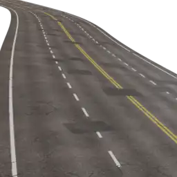

|

**This material is contained in the following Exapacks:**

    - XTRPbr_05k_Vol_001

    - XTRPbr_1k_Vol_001

    - XTRPbr_2k_Vol_001

    - XTRPbr_4k_Vol_008

------------------------------------------------------------------------------------------------------------------------

Four Lane Road Wet 01
*********************

|

**This material is contained in the following Exapacks:**

    - XTRPbr_05k_Vol_001

    - XTRPbr_1k_Vol_001

    - XTRPbr_2k_Vol_001

    - XTRPbr_4k_Vol_008

------------------------------------------------------------------------------------------------------------------------

Four Lane Road Wet 02
*********************

|

**This material is contained in the following Exapacks:**

    - XTRPbr_05k_Vol_001

    - XTRPbr_1k_Vol_001

    - XTRPbr_2k_Vol_001

    - XTRPbr_4k_Vol_008

------------------------------------------------------------------------------------------------------------------------

Highway Road Clean 01
*********************

|

**This material is contained in the following Exapacks:**

    - XTRPbr_05k_Vol_001

    - XTRPbr_1k_Vol_001

    - XTRPbr_2k_Vol_001

    - XTRPbr_4k_Vol_008

------------------------------------------------------------------------------------------------------------------------

Highway Road Cracks 01
**********************

|

**This material is contained in the following Exapacks:**

    - XTRPbr_05k_Vol_001

    - XTRPbr_1k_Vol_001

    - XTRPbr_2k_Vol_001

    - XTRPbr_4k_Vol_008

------------------------------------------------------------------------------------------------------------------------

Highway Road Patches 01
***********************

|

**This material is contained in the following Exapacks:**

    - XTRPbr_05k_Vol_001

    - XTRPbr_1k_Vol_001

    - XTRPbr_2k_Vol_001

    - XTRPbr_4k_Vol_008

------------------------------------------------------------------------------------------------------------------------

Highway Road Patches 02
***********************

|

**This material is contained in the following Exapacks:**

    - XTRPbr_05k_Vol_001

    - XTRPbr_1k_Vol_001

    - XTRPbr_2k_Vol_001

    - XTRPbr_4k_Vol_008

------------------------------------------------------------------------------------------------------------------------

Highway Road Wet 01
*******************

|

**This material is contained in the following Exapacks:**

    - XTRPbr_05k_Vol_001

    - XTRPbr_1k_Vol_001

    - XTRPbr_2k_Vol_001

    - XTRPbr_4k_Vol_008

------------------------------------------------------------------------------------------------------------------------

Highway Road Wet 02
*******************

|

**This material is contained in the following Exapacks:**

    - XTRPbr_05k_Vol_001

    - XTRPbr_1k_Vol_001

    - XTRPbr_2k_Vol_001

    - XTRPbr_4k_Vol_008

------------------------------------------------------------------------------------------------------------------------

Single Lane Road Clean 01
*************************

.. image:: _static/_images/material_list/asphalt_street/single_lane_road_clean_01/single_lane_road_clean_01.webp
    :width: 30%
    :align: center
    :alt: Single Lane Road Clean 01

|

**This material is contained in the following Exapacks:**

    - XTRPbr_05k_Vol_001

    - XTRPbr_1k_Vol_001

    - XTRPbr_2k_Vol_001

    - XTRPbr_4k_Vol_008

------------------------------------------------------------------------------------------------------------------------

Single Lane Road Cracks 01
**************************

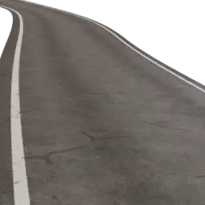

|

**This material is contained in the following Exapacks:**

    - XTRPbr_05k_Vol_001

    - XTRPbr_1k_Vol_001

    - XTRPbr_2k_Vol_001

    - XTRPbr_4k_Vol_008

------------------------------------------------------------------------------------------------------------------------

Single Lane Road Patches 01
***************************

|

**This material is contained in the following Exapacks:**

    - XTRPbr_05k_Vol_001

    - XTRPbr_1k_Vol_001

    - XTRPbr_2k_Vol_001

    - XTRPbr_4k_Vol_008

------------------------------------------------------------------------------------------------------------------------

Single Lane Road Patches 02
***************************

|

**This material is contained in the following Exapacks:**

    - XTRPbr_05k_Vol_001

    - XTRPbr_1k_Vol_001

    - XTRPbr_2k_Vol_001

    - XTRPbr_4k_Vol_008

------------------------------------------------------------------------------------------------------------------------

Single Lane Road Wet 01
***********************

|

**This material is contained in the following Exapacks:**

    - XTRPbr_05k_Vol_001

    - XTRPbr_1k_Vol_001

    - XTRPbr_2k_Vol_001

    - XTRPbr_4k_Vol_008

------------------------------------------------------------------------------------------------------------------------

Single Lane Road Wet 02
***********************

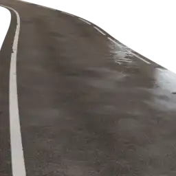

|

**This material is contained in the following Exapacks:**

    - XTRPbr_05k_Vol_001

    - XTRPbr_1k_Vol_001

    - XTRPbr_2k_Vol_001

    - XTRPbr_4k_Vol_008

------------------------------------------------------------------------------------------------------------------------

Three Lane Road Clean 01
************************

|

**This material is contained in the following Exapacks:**

    - XTRPbr_05k_Vol_001

    - XTRPbr_1k_Vol_001

    - XTRPbr_2k_Vol_001

    - XTRPbr_4k_Vol_008

------------------------------------------------------------------------------------------------------------------------

Three Lane Road Cracks 01
*************************

|

**This material is contained in the following Exapacks:**

    - XTRPbr_05k_Vol_001

    - XTRPbr_1k_Vol_001

    - XTRPbr_2k_Vol_001

    - XTRPbr_4k_Vol_008

------------------------------------------------------------------------------------------------------------------------

Three Lane Road Patches 01
**************************

.. image:: _static/_images/material_list/asphalt_street/three_lane_road_patches_01/three_lane_road_patches_01.webp
    :width: 30%
    :align: center
    :alt: Three Lane Road Patches 01

|

**This material is contained in the following Exapacks:**

    - XTRPbr_05k_Vol_001

    - XTRPbr_1k_Vol_001

    - XTRPbr_2k_Vol_001

    - XTRPbr_4k_Vol_008

------------------------------------------------------------------------------------------------------------------------

Three Lane Road Patches 02
**************************

|

**This material is contained in the following Exapacks:**

    - XTRPbr_05k_Vol_001

    - XTRPbr_1k_Vol_001

    - XTRPbr_2k_Vol_001

    - XTRPbr_4k_Vol_008

------------------------------------------------------------------------------------------------------------------------

Three Lane Road Wet 01
**********************

|

**This material is contained in the following Exapacks:**

    - XTRPbr_05k_Vol_001

    - XTRPbr_1k_Vol_001

    - XTRPbr_2k_Vol_001

    - XTRPbr_4k_Vol_008

------------------------------------------------------------------------------------------------------------------------

Three Lane Road Wet 02
**********************

|

**This material is contained in the following Exapacks:**

    - XTRPbr_05k_Vol_001

    - XTRPbr_1k_Vol_001

    - XTRPbr_2k_Vol_001

    - XTRPbr_4k_Vol_008

------------------------------------------------------------------------------------------------------------------------

Two Lane Dashed Line Road 01
****************************

.. image:: _static/_images/material_list/asphalt_street/two_lane_dashed_line_road_01/two_lane_dashed_line_road_01.webp
    :width: 30%
    :align: center
    :alt: Two Lane Dashed Line Road 01

|

**This material is contained in the following Exapacks:**

    - XTRPbr_05k_Vol_001

    - XTRPbr_1k_Vol_001

    - XTRPbr_2k_Vol_001

    - XTRPbr_4k_Vol_008

    - XTRPbr_8k_Vol_021

------------------------------------------------------------------------------------------------------------------------

Two Lane Road Clean 01
**********************

.. image:: _static/_images/material_list/asphalt_street/two_lane_road_clean_01/two_lane_road_clean_01.webp
    :width: 30%
    :align: center
    :alt: Two Lane Road Clean 01

|

**This material is contained in the following Exapacks:**

    - XTRPbr_05k_Vol_001

    - XTRPbr_1k_Vol_001

    - XTRPbr_2k_Vol_001

    - XTRPbr_4k_Vol_008

------------------------------------------------------------------------------------------------------------------------

Two Lane Road Cracks 01
***********************

|

**This material is contained in the following Exapacks:**

    - XTRPbr_05k_Vol_001

    - XTRPbr_1k_Vol_001

    - XTRPbr_2k_Vol_001

    - XTRPbr_4k_Vol_008

------------------------------------------------------------------------------------------------------------------------

Two Lane Road Patches 01
************************

|

**This material is contained in the following Exapacks:**

    - XTRPbr_05k_Vol_001

    - XTRPbr_1k_Vol_001

    - XTRPbr_2k_Vol_001

    - XTRPbr_4k_Vol_008

------------------------------------------------------------------------------------------------------------------------

Two Lane Road Patches 02
************************

.. image:: _static/_images/material_list/asphalt_street/two_lane_road_patches_02/two_lane_road_patches_02.webp
    :width: 30%
    :align: center
    :alt: Two Lane Road Patches 02

|

**This material is contained in the following Exapacks:**

    - XTRPbr_05k_Vol_001

    - XTRPbr_1k_Vol_001

    - XTRPbr_2k_Vol_001

    - XTRPbr_4k_Vol_008

------------------------------------------------------------------------------------------------------------------------

Two Lane Road Wet 01
********************

|

**This material is contained in the following Exapacks:**

    - XTRPbr_05k_Vol_001

    - XTRPbr_1k_Vol_001

    - XTRPbr_2k_Vol_001

    - XTRPbr_4k_Vol_008

------------------------------------------------------------------------------------------------------------------------

Two Lane Road Wet 02
********************

|

**This material is contained in the following Exapacks:**

    - XTRPbr_05k_Vol_001

    - XTRPbr_1k_Vol_001

    - XTRPbr_2k_Vol_001

    - XTRPbr_4k_Vol_008

------------------------------------------------------------------------------------------------------------------------

Two Lane Solid Line Road Clean 01
*********************************

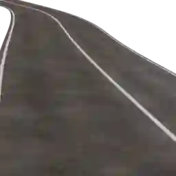

|

**This material is contained in the following Exapacks:**

    - XTRPbr_05k_Vol_001

    - XTRPbr_1k_Vol_001

    - XTRPbr_2k_Vol_001

    - XTRPbr_4k_Vol_008

------------------------------------------------------------------------------------------------------------------------

Two Lane Solid Line Road Clean 02
*********************************

|

**This material is contained in the following Exapacks:**

    - XTRPbr_05k_Vol_001

    - XTRPbr_1k_Vol_001

    - XTRPbr_2k_Vol_001

    - XTRPbr_4k_Vol_008

------------------------------------------------------------------------------------------------------------------------

Two Lane Solid Line Road Clean 03
*********************************

.. image:: _static/_images/material_list/asphalt_street/two_lane_solid_line_road_clean_03/two_lane_solid_line_road_clean_03.webp
    :width: 30%
    :align: center
    :alt: Two Lane Solid Line Road Clean 03

|

**This material is contained in the following Exapacks:**

    - XTRPbr_05k_Vol_001

    - XTRPbr_1k_Vol_001

    - XTRPbr_2k_Vol_001

    - XTRPbr_4k_Vol_008

    - XTRPbr_8k_Vol_021

------------------------------------------------------------------------------------------------------------------------

Two Lane Solid Line Road Cracks 01
**********************************

|

**This material is contained in the following Exapacks:**

    - XTRPbr_05k_Vol_001

    - XTRPbr_1k_Vol_001

    - XTRPbr_2k_Vol_001

    - XTRPbr_4k_Vol_008

------------------------------------------------------------------------------------------------------------------------

Two Lane Solid Line Road Patches 01
***********************************

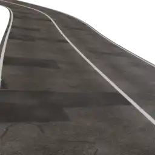

|

**This material is contained in the following Exapacks:**

    - XTRPbr_05k_Vol_001

    - XTRPbr_1k_Vol_001

    - XTRPbr_2k_Vol_001

    - XTRPbr_4k_Vol_008

------------------------------------------------------------------------------------------------------------------------

Two Lane Solid Line Road Patches 02
***********************************

|

**This material is contained in the following Exapacks:**

    - XTRPbr_05k_Vol_001

    - XTRPbr_1k_Vol_001

    - XTRPbr_2k_Vol_001

    - XTRPbr_4k_Vol_008

------------------------------------------------------------------------------------------------------------------------

Two Lane Solid Line Road Wet 01
*******************************

.. image:: _static/_images/material_list/asphalt_street/two_lane_solid_line_road_wet_01/two_lane_solid_line_road_wet_01.webp
    :width: 30%
    :align: center
    :alt: Two Lane Solid Line Road Wet 01

|

**This material is contained in the following Exapacks:**

    - XTRPbr_05k_Vol_001

    - XTRPbr_1k_Vol_001

    - XTRPbr_2k_Vol_001

    - XTRPbr_4k_Vol_008

------------------------------------------------------------------------------------------------------------------------

Two Lane Solid Line Road Wet 02
*******************************

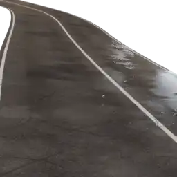

|

**This material is contained in the following Exapacks:**

    - XTRPbr_05k_Vol_001

    - XTRPbr_1k_Vol_001

    - XTRPbr_2k_Vol_001

    - XTRPbr_4k_Vol_008

------------------------------------------------------------------------------------------------------------------------

Blueprint (Category)
--------------------

Blueprint 001
*************

.. image:: _static/_images/material_list/blueprint/blueprint_001/blueprint_001.webp
    :width: 30%
    :align: center
    :alt: Blueprint 001

|

**This material is contained in the following Exapacks:**

    - XTRPbr_Procedural_Vol_001

------------------------------------------------------------------------------------------------------------------------

Blueprint 002
*************

.. image:: _static/_images/material_list/blueprint/blueprint_002/blueprint_002.webp
    :width: 30%
    :align: center
    :alt: Blueprint 002

|

**This material is contained in the following Exapacks:**

    - XTRPbr_Procedural_Vol_001

------------------------------------------------------------------------------------------------------------------------

Bricks - Classic (Category)
---------------------------

Alternating Bricks 001
**********************

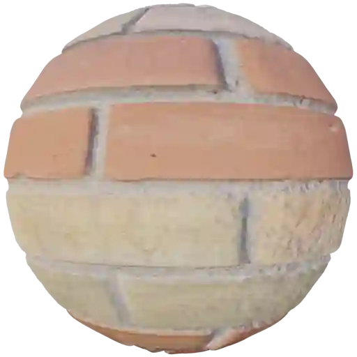

|

**This material is contained in the following Exapacks:**

    - XTRPbr_05k_Vol_001

    - XTRPbr_1k_Vol_001

    - XTRPbr_2k_Vol_001

------------------------------------------------------------------------------------------------------------------------

Bricks Red 001
**************

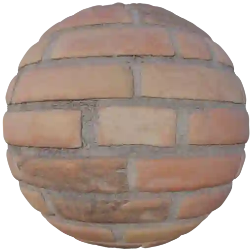

|

**This material is contained in the following Exapacks:**

    - XTRPbr_05k_Vol_001

    - XTRPbr_1k_Vol_001

    - XTRPbr_2k_Vol_001

    - XTRPbr_4k_Vol_008

    - XTRPbr_8k_Vol_021

------------------------------------------------------------------------------------------------------------------------

Bricks Red 002
**************

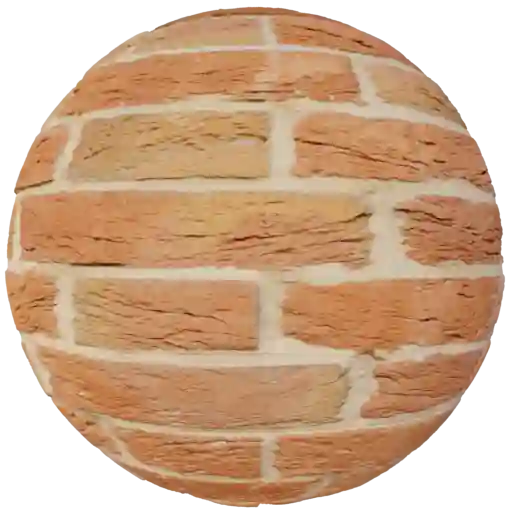

|

**This material is contained in the following Exapacks:**

    - XTRPbr_05k_Vol_001

    - XTRPbr_1k_Vol_001

    - XTRPbr_2k_Vol_001

    - XTRPbr_4k_Vol_008

    - XTRPbr_8k_Vol_021

------------------------------------------------------------------------------------------------------------------------

Bricks Red 003
**************

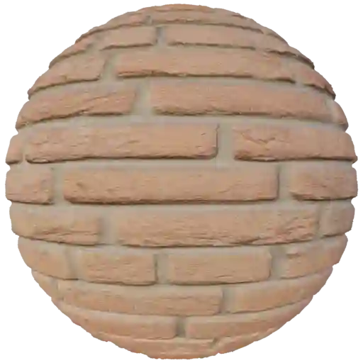

|

**This material is contained in the following Exapacks:**

    - XTRPbr_05k_Vol_001

    - XTRPbr_1k_Vol_001

    - XTRPbr_2k_Vol_001

    - XTRPbr_4k_Vol_008

    - XTRPbr_8k_Vol_021

------------------------------------------------------------------------------------------------------------------------

Bricks Red 004
**************

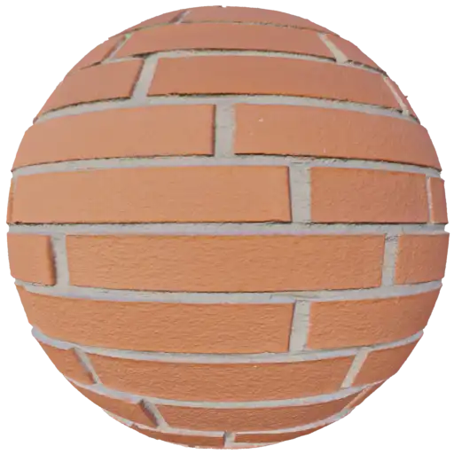

|

**This material is contained in the following Exapacks:**

    - XTRPbr_05k_Vol_001

    - XTRPbr_1k_Vol_001

    - XTRPbr_2k_Vol_001

    - XTRPbr_4k_Vol_008

    - XTRPbr_8k_Vol_021

------------------------------------------------------------------------------------------------------------------------

Bricks Red 005
**************

|

**This material is contained in the following Exapacks:**

    - XTRPbr_05k_Vol_001

    - XTRPbr_1k_Vol_001

    - XTRPbr_2k_Vol_001

    - XTRPbr_4k_Vol_008

    - XTRPbr_8k_Vol_021

------------------------------------------------------------------------------------------------------------------------

Bricks Red 006
**************

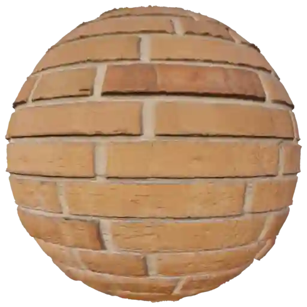

|

**This material is contained in the following Exapacks:**

    - XTRPbr_05k_Vol_001

    - XTRPbr_1k_Vol_001

    - XTRPbr_2k_Vol_001

    - XTRPbr_4k_Vol_008

    - XTRPbr_8k_Vol_021

------------------------------------------------------------------------------------------------------------------------

Bricks Red 007
**************

.. image:: _static/_images/material_list/bricks_classic/bricks_red_007/bricks_red_007.webp
    :width: 30%
    :align: center
    :alt: Bricks Red 007

|

**This material is contained in the following Exapacks:**

    - XTRPbr_05k_Vol_001

    - XTRPbr_1k_Vol_001

    - XTRPbr_2k_Vol_001

    - XTRPbr_4k_Vol_008

    - XTRPbr_8k_Vol_021

------------------------------------------------------------------------------------------------------------------------

Bricks Red 008
**************

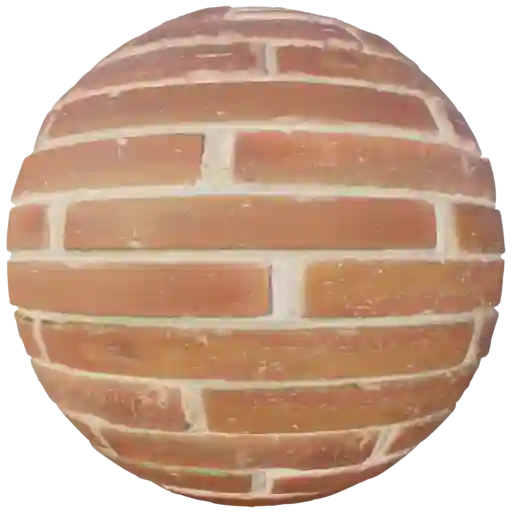

|

**This material is contained in the following Exapacks:**

    - XTRPbr_05k_Vol_001

    - XTRPbr_1k_Vol_001

    - XTRPbr_2k_Vol_001

    - XTRPbr_4k_Vol_008

    - XTRPbr_8k_Vol_021

------------------------------------------------------------------------------------------------------------------------

Bricks Red 009
**************

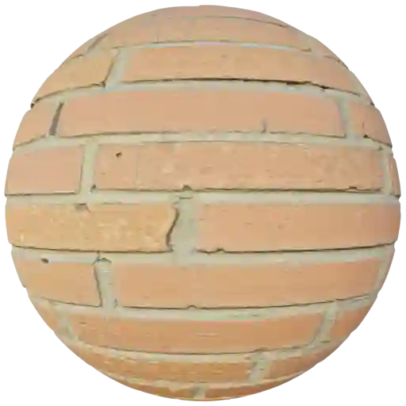

|

**This material is contained in the following Exapacks:**

    - XTRPbr_05k_Vol_001

    - XTRPbr_1k_Vol_001

    - XTRPbr_2k_Vol_001

    - XTRPbr_4k_Vol_008

    - XTRPbr_8k_Vol_021

------------------------------------------------------------------------------------------------------------------------

Bricks Red 010
**************

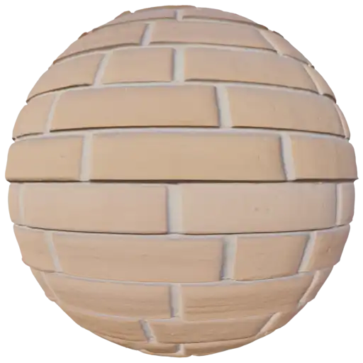

|

**This material is contained in the following Exapacks:**

    - XTRPbr_05k_Vol_001

    - XTRPbr_1k_Vol_001

    - XTRPbr_2k_Vol_001

    - XTRPbr_4k_Vol_008

    - XTRPbr_8k_Vol_021

------------------------------------------------------------------------------------------------------------------------

Bricks Red 011
**************

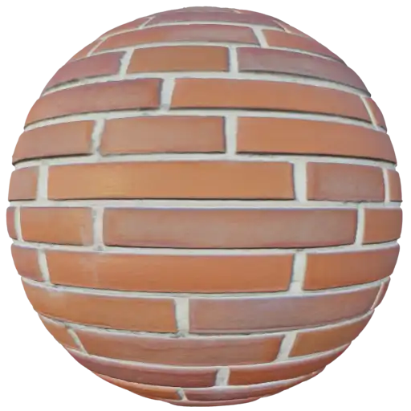

|

**This material is contained in the following Exapacks:**

    - XTRPbr_05k_Vol_001

    - XTRPbr_1k_Vol_001

    - XTRPbr_2k_Vol_001

    - XTRPbr_4k_Vol_008

    - XTRPbr_8k_Vol_021

------------------------------------------------------------------------------------------------------------------------

Bricks Red 012
**************

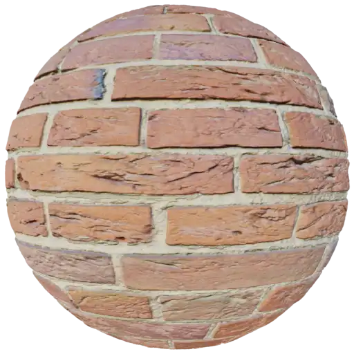

|

**This material is contained in the following Exapacks:**

    - XTRPbr_05k_Vol_001

    - XTRPbr_1k_Vol_001

    - XTRPbr_2k_Vol_001

    - XTRPbr_4k_Vol_008

    - XTRPbr_8k_Vol_016

------------------------------------------------------------------------------------------------------------------------

Bricks Red 013
**************

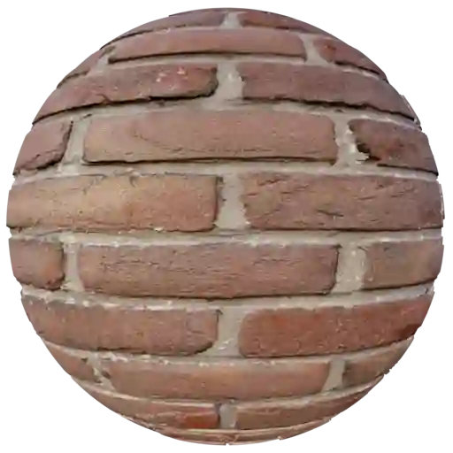

|

**This material is contained in the following Exapacks:**

    - XTRPbr_05k_Vol_001

    - XTRPbr_1k_Vol_001

    - XTRPbr_2k_Vol_001

    - XTRPbr_4k_Vol_008

    - XTRPbr_8k_Vol_016

------------------------------------------------------------------------------------------------------------------------

Bricks Red 014
**************

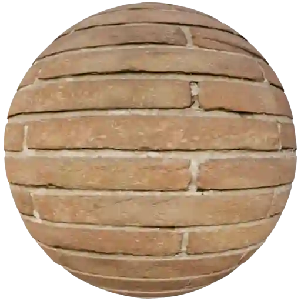

|

**This material is contained in the following Exapacks:**

    - XTRPbr_05k_Vol_001

    - XTRPbr_1k_Vol_001

    - XTRPbr_2k_Vol_001

    - XTRPbr_4k_Vol_008

    - XTRPbr_8k_Vol_016

------------------------------------------------------------------------------------------------------------------------

Bricks Red 015
**************

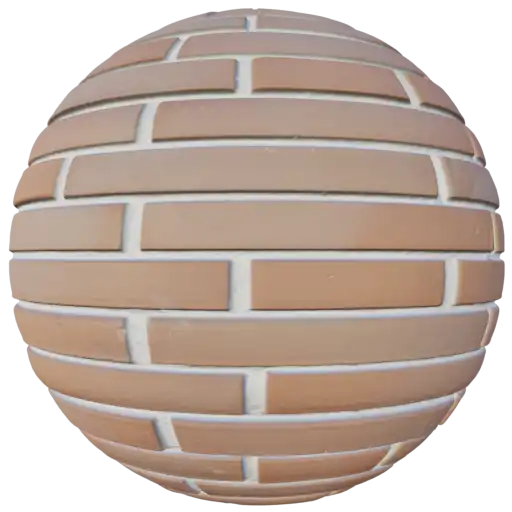

|

**This material is contained in the following Exapacks:**

    - XTRPbr_05k_Vol_001

    - XTRPbr_1k_Vol_001

    - XTRPbr_2k_Vol_001

    - XTRPbr_4k_Vol_008

    - XTRPbr_8k_Vol_016

------------------------------------------------------------------------------------------------------------------------

Bricks Red 016
**************

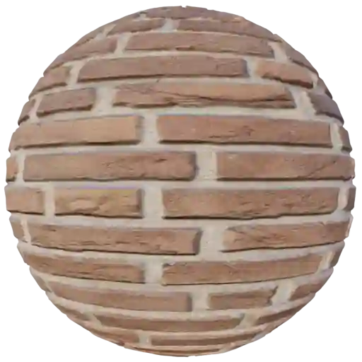

|

**This material is contained in the following Exapacks:**

    - XTRPbr_05k_Vol_001

    - XTRPbr_1k_Vol_001

    - XTRPbr_2k_Vol_001

    - XTRPbr_4k_Vol_008

    - XTRPbr_8k_Vol_016

------------------------------------------------------------------------------------------------------------------------

Bricks Red 017
**************

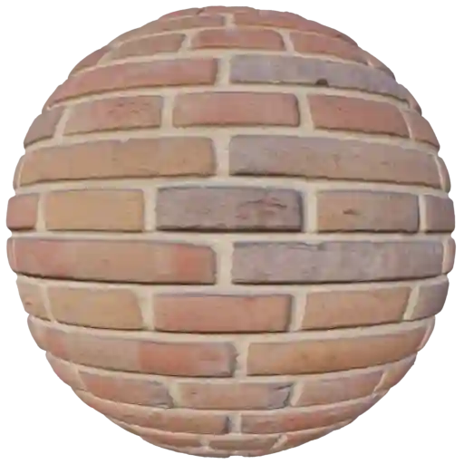

|

**This material is contained in the following Exapacks:**

    - XTRPbr_05k_Vol_001

    - XTRPbr_1k_Vol_001

    - XTRPbr_2k_Vol_001

    - XTRPbr_4k_Vol_008

    - XTRPbr_8k_Vol_016

------------------------------------------------------------------------------------------------------------------------

Bricks Red 018
**************

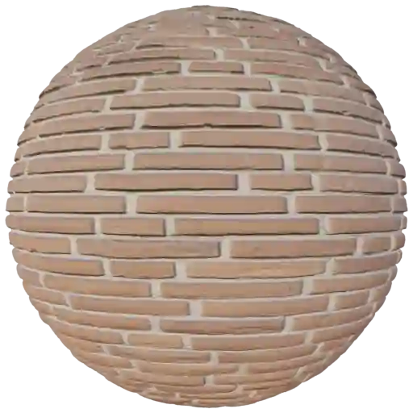

|

**This material is contained in the following Exapacks:**

    - XTRPbr_05k_Vol_001

    - XTRPbr_1k_Vol_001

    - XTRPbr_2k_Vol_001

    - XTRPbr_4k_Vol_008

    - XTRPbr_8k_Vol_016

------------------------------------------------------------------------------------------------------------------------

Bricks Red 019
**************

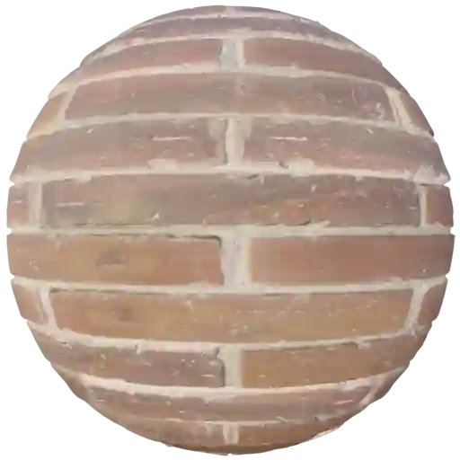

|

**This material is contained in the following Exapacks:**

    - XTRPbr_05k_Vol_001

    - XTRPbr_1k_Vol_001

    - XTRPbr_2k_Vol_001

    - XTRPbr_4k_Vol_008

    - XTRPbr_8k_Vol_016

------------------------------------------------------------------------------------------------------------------------

Bricks Red 020
**************

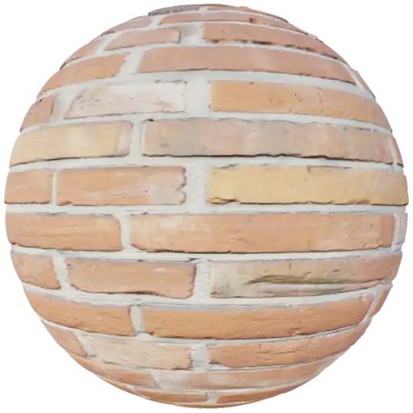

|

**This material is contained in the following Exapacks:**

    - XTRPbr_05k_Vol_001

    - XTRPbr_1k_Vol_001

    - XTRPbr_2k_Vol_001

    - XTRPbr_4k_Vol_008

    - XTRPbr_8k_Vol_016

------------------------------------------------------------------------------------------------------------------------

Bricks Red 021
**************

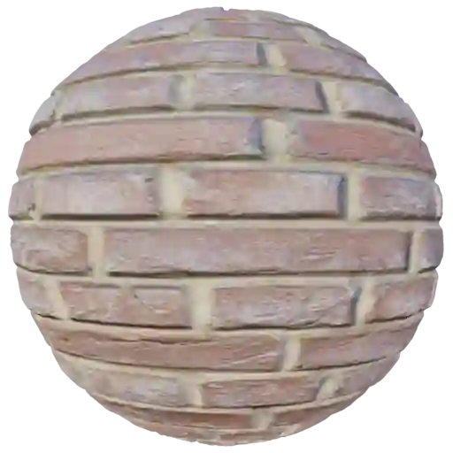

|

**This material is contained in the following Exapacks:**

    - XTRPbr_05k_Vol_001

    - XTRPbr_1k_Vol_001

    - XTRPbr_2k_Vol_001

    - XTRPbr_4k_Vol_008

    - XTRPbr_8k_Vol_016

------------------------------------------------------------------------------------------------------------------------

Bricks Red 022
**************

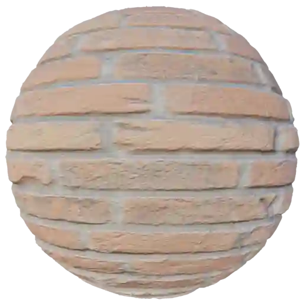

|

**This material is contained in the following Exapacks:**

    - XTRPbr_05k_Vol_001

    - XTRPbr_1k_Vol_001

    - XTRPbr_2k_Vol_001

    - XTRPbr_4k_Vol_008

    - XTRPbr_8k_Vol_016

------------------------------------------------------------------------------------------------------------------------

Bricks Red 023
**************

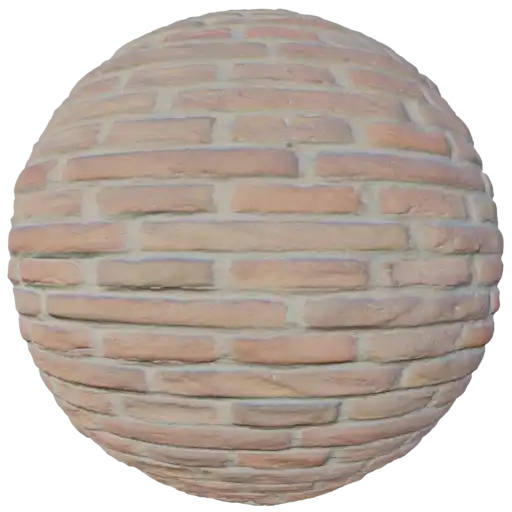

|

**This material is contained in the following Exapacks:**

    - XTRPbr_05k_Vol_001

    - XTRPbr_1k_Vol_001

    - XTRPbr_2k_Vol_001

    - XTRPbr_4k_Vol_008

    - XTRPbr_8k_Vol_016

------------------------------------------------------------------------------------------------------------------------

Bricks Red 024
**************

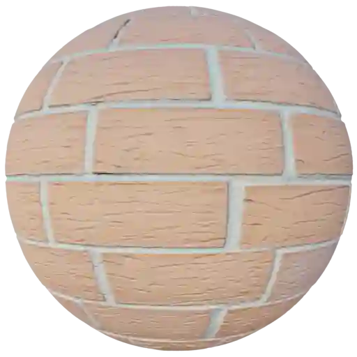

|

**This material is contained in the following Exapacks:**

    - XTRPbr_05k_Vol_001

    - XTRPbr_1k_Vol_001

    - XTRPbr_2k_Vol_001

    - XTRPbr_4k_Vol_008

    - XTRPbr_8k_Vol_016

------------------------------------------------------------------------------------------------------------------------

Bricks Red 025
**************

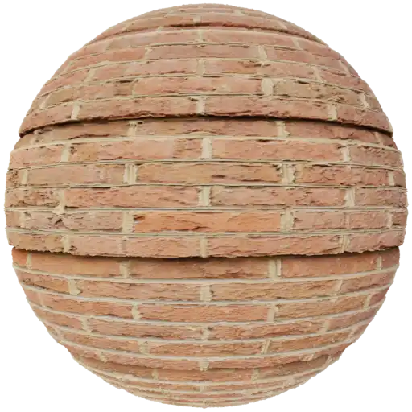

|

**This material is contained in the following Exapacks:**

    - XTRPbr_05k_Vol_001

    - XTRPbr_1k_Vol_001

    - XTRPbr_2k_Vol_001

    - XTRPbr_4k_Vol_008

------------------------------------------------------------------------------------------------------------------------

Bricks Red 026
**************

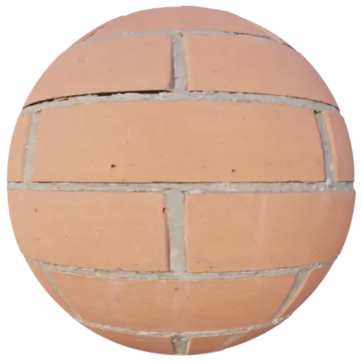

|

**This material is contained in the following Exapacks:**

    - XTRPbr_05k_Vol_001

    - XTRPbr_1k_Vol_001

    - XTRPbr_2k_Vol_001

    - XTRPbr_4k_Vol_008

    - XTRPbr_8k_Vol_016

------------------------------------------------------------------------------------------------------------------------

Bricks Red 027
**************

.. image:: _static/_images/material_list/bricks_classic/bricks_red_027/bricks_red_027.webp
    :width: 30%
    :align: center
    :alt: Bricks Red 027

|

**This material is contained in the following Exapacks:**

    - XTRPbr_05k_Vol_001

    - XTRPbr_1k_Vol_001

    - XTRPbr_2k_Vol_001

    - XTRPbr_4k_Vol_008

    - XTRPbr_8k_Vol_016

------------------------------------------------------------------------------------------------------------------------

Bricks Red 028
**************

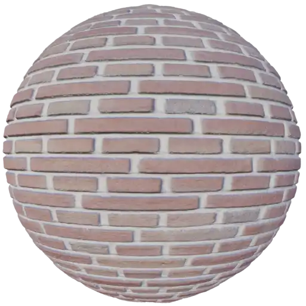

|

**This material is contained in the following Exapacks:**

    - XTRPbr_05k_Vol_001

    - XTRPbr_1k_Vol_001

    - XTRPbr_2k_Vol_001

    - XTRPbr_4k_Vol_008

    - XTRPbr_8k_Vol_016

------------------------------------------------------------------------------------------------------------------------

Bricks Red 029
**************

.. image:: _static/_images/material_list/bricks_classic/bricks_red_029/bricks_red_029.webp
    :width: 30%
    :align: center
    :alt: Bricks Red 029

|

**This material is contained in the following Exapacks:**

    - XTRPbr_05k_Vol_001

    - XTRPbr_1k_Vol_001

    - XTRPbr_2k_Vol_001

    - XTRPbr_4k_Vol_008

    - XTRPbr_8k_Vol_016

------------------------------------------------------------------------------------------------------------------------

Bricks Red 030
**************

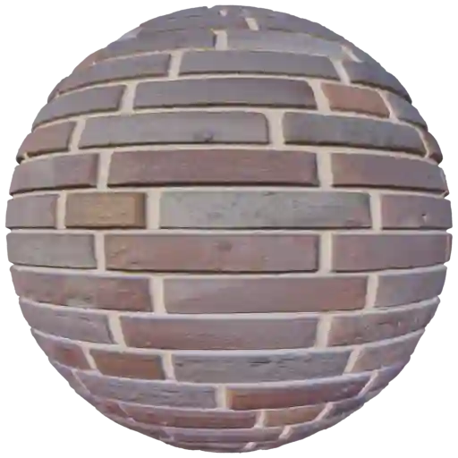

|

**This material is contained in the following Exapacks:**

    - XTRPbr_05k_Vol_001

    - XTRPbr_1k_Vol_001

    - XTRPbr_2k_Vol_001

    - XTRPbr_4k_Vol_008

    - XTRPbr_8k_Vol_016

------------------------------------------------------------------------------------------------------------------------

Grey Bricks 001
***************

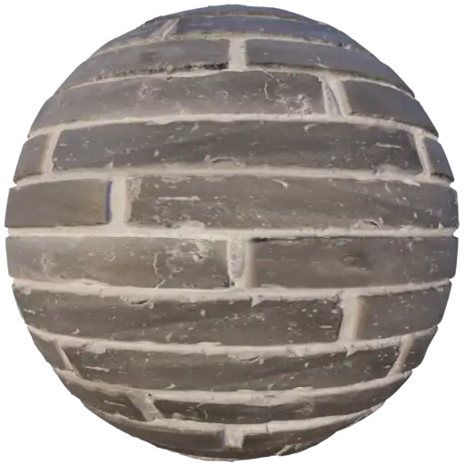

|

**This material is contained in the following Exapacks:**

    - XTRPbr_05k_Vol_001

    - XTRPbr_1k_Vol_001

    - XTRPbr_2k_Vol_001

    - XTRPbr_4k_Vol_008

    - XTRPbr_8k_Vol_016

------------------------------------------------------------------------------------------------------------------------

Grey Bricks 002
***************

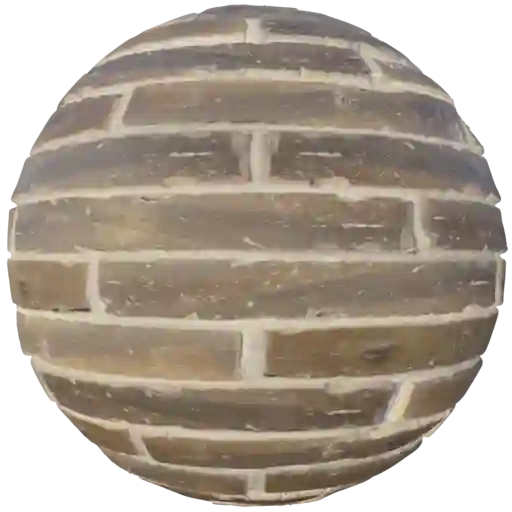

|

**This material is contained in the following Exapacks:**

    - XTRPbr_05k_Vol_001

    - XTRPbr_1k_Vol_001

    - XTRPbr_2k_Vol_001

    - XTRPbr_4k_Vol_008

    - XTRPbr_8k_Vol_016

------------------------------------------------------------------------------------------------------------------------

Grey Bricks 003
***************

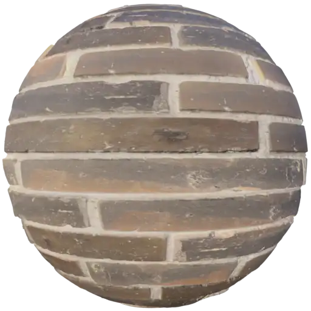

|

**This material is contained in the following Exapacks:**

    - XTRPbr_05k_Vol_001

    - XTRPbr_1k_Vol_001

    - XTRPbr_2k_Vol_001

    - XTRPbr_4k_Vol_008

    - XTRPbr_8k_Vol_016

------------------------------------------------------------------------------------------------------------------------

Grey Bricks 004
***************

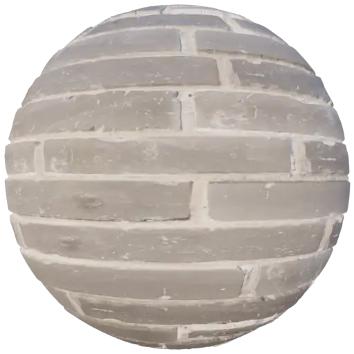

|

**This material is contained in the following Exapacks:**

    - XTRPbr_05k_Vol_001

    - XTRPbr_1k_Vol_001

    - XTRPbr_2k_Vol_001

    - XTRPbr_4k_Vol_008

    - XTRPbr_8k_Vol_016

------------------------------------------------------------------------------------------------------------------------

Grey Bricks 005
***************

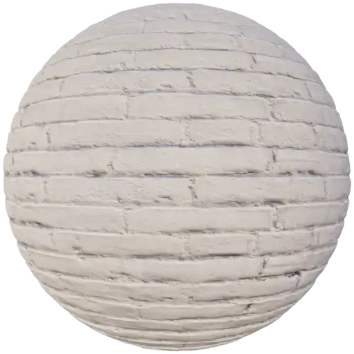

|

**This material is contained in the following Exapacks:**

    - XTRPbr_05k_Vol_001

    - XTRPbr_1k_Vol_001

    - XTRPbr_2k_Vol_001

    - XTRPbr_4k_Vol_008

------------------------------------------------------------------------------------------------------------------------

Grey Bricks 006
***************

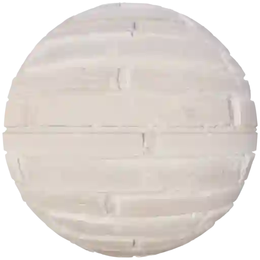

|

**This material is contained in the following Exapacks:**

    - XTRPbr_05k_Vol_001

    - XTRPbr_1k_Vol_001

    - XTRPbr_2k_Vol_001

    - XTRPbr_4k_Vol_008

    - XTRPbr_8k_Vol_016

------------------------------------------------------------------------------------------------------------------------

Grey Bricks 007
***************

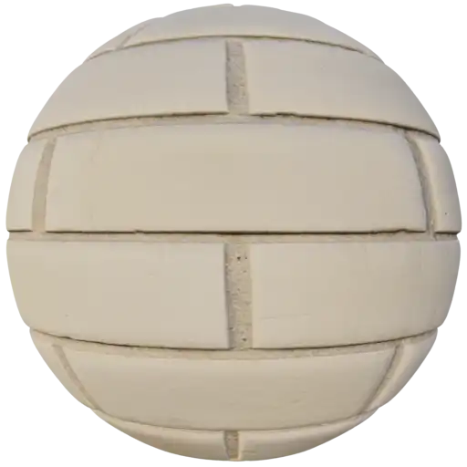

|

**This material is contained in the following Exapacks:**

    - XTRPbr_05k_Vol_001

    - XTRPbr_1k_Vol_001

    - XTRPbr_2k_Vol_001

    - XTRPbr_4k_Vol_008

    - XTRPbr_8k_Vol_016

------------------------------------------------------------------------------------------------------------------------

Light Red Bricks 001
********************

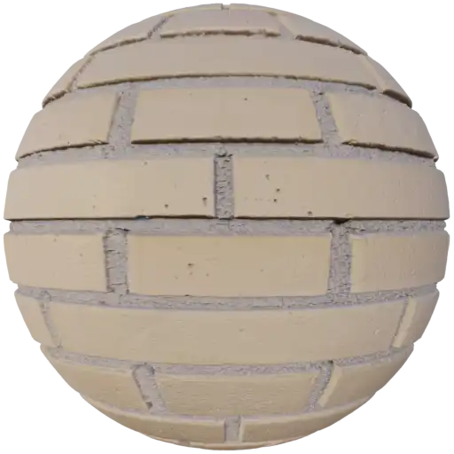

|

**This material is contained in the following Exapacks:**

    - XTRPbr_05k_Vol_001

    - XTRPbr_1k_Vol_001

    - XTRPbr_2k_Vol_001

    - XTRPbr_4k_Vol_008

------------------------------------------------------------------------------------------------------------------------

Light Red Bricks 002
********************

.. image:: _static/_images/material_list/bricks_classic/light_red_bricks_002/light_red_bricks_002.webp
    :width: 30%
    :align: center
    :alt: Light Red Bricks 002

|

**This material is contained in the following Exapacks:**

    - XTRPbr_05k_Vol_001

    - XTRPbr_1k_Vol_001

    - XTRPbr_2k_Vol_001

    - XTRPbr_4k_Vol_008

    - XTRPbr_8k_Vol_016

------------------------------------------------------------------------------------------------------------------------

Stack Bond Bricks 001
*********************

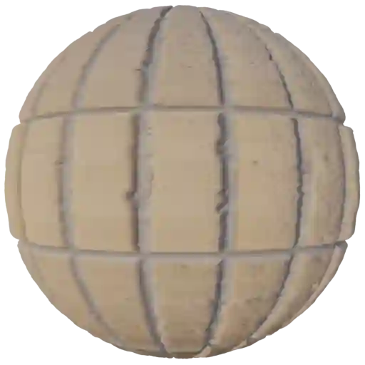

|

**This material is contained in the following Exapacks:**

    - XTRPbr_05k_Vol_001

    - XTRPbr_1k_Vol_001

    - XTRPbr_2k_Vol_001

    - XTRPbr_4k_Vol_008

------------------------------------------------------------------------------------------------------------------------

Yellow Bricks 001
*****************

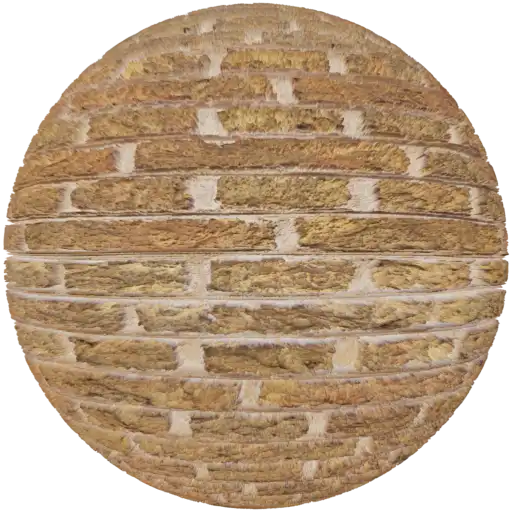

|

**This material is contained in the following Exapacks:**

    - XTRPbr_05k_Vol_001

    - XTRPbr_1k_Vol_001

    - XTRPbr_2k_Vol_001

    - XTRPbr_4k_Vol_008

    - XTRPbr_8k_Vol_016

    - XTRPbr_8k_Vol_023

------------------------------------------------------------------------------------------------------------------------

Bricks - Hollow (Category)
--------------------------

Hollow Bricks 001
*****************

.. image:: _static/_images/material_list/bricks_hollow/hollow_bricks_001/hollow_bricks_001.webp
    :width: 30%
    :align: center
    :alt: Hollow Bricks 001

|

**This material is contained in the following Exapacks:**

    - XTRPbr_05k_Vol_001

    - XTRPbr_1k_Vol_001

    - XTRPbr_2k_Vol_001

    - XTRPbr_4k_Vol_008

    - XTRPbr_8k_Vol_023

------------------------------------------------------------------------------------------------------------------------

Hollow Bricks 002
*****************

.. image:: _static/_images/material_list/bricks_hollow/hollow_bricks_002/hollow_bricks_002.webp
    :width: 30%
    :align: center
    :alt: Hollow Bricks 002

|

**This material is contained in the following Exapacks:**

    - XTRPbr_05k_Vol_001

    - XTRPbr_1k_Vol_001

    - XTRPbr_2k_Vol_001

    - XTRPbr_4k_Vol_008

    - XTRPbr_8k_Vol_023

------------------------------------------------------------------------------------------------------------------------

Hollow Bricks 003
*****************

.. image:: _static/_images/material_list/bricks_hollow/hollow_bricks_003/hollow_bricks_003.webp
    :width: 30%
    :align: center
    :alt: Hollow Bricks 003

|

**This material is contained in the following Exapacks:**

    - XTRPbr_05k_Vol_001

    - XTRPbr_1k_Vol_001

    - XTRPbr_2k_Vol_001

    - XTRPbr_4k_Vol_008

    - XTRPbr_8k_Vol_023

------------------------------------------------------------------------------------------------------------------------

Hollow Bricks 004
*****************

.. image:: _static/_images/material_list/bricks_hollow/hollow_bricks_004/hollow_bricks_004.webp
    :width: 30%
    :align: center
    :alt: Hollow Bricks 004

|

**This material is contained in the following Exapacks:**

    - XTRPbr_05k_Vol_001

    - XTRPbr_1k_Vol_001

    - XTRPbr_2k_Vol_001

    - XTRPbr_4k_Vol_008

    - XTRPbr_8k_Vol_023

------------------------------------------------------------------------------------------------------------------------

Hollow Bricks 005
*****************

.. image:: _static/_images/material_list/bricks_hollow/hollow_bricks_005/hollow_bricks_005.webp
    :width: 30%
    :align: center
    :alt: Hollow Bricks 005

|

**This material is contained in the following Exapacks:**

    - XTRPbr_05k_Vol_001

    - XTRPbr_1k_Vol_001

    - XTRPbr_2k_Vol_001

    - XTRPbr_4k_Vol_008

    - XTRPbr_8k_Vol_023

------------------------------------------------------------------------------------------------------------------------

Hollow Bricks 006
*****************

.. image:: _static/_images/material_list/bricks_hollow/hollow_bricks_006/hollow_bricks_006.webp
    :width: 30%
    :align: center
    :alt: Hollow Bricks 006

|

**This material is contained in the following Exapacks:**

    - XTRPbr_05k_Vol_001

    - XTRPbr_1k_Vol_001

    - XTRPbr_2k_Vol_001

    - XTRPbr_4k_Vol_008

    - XTRPbr_8k_Vol_023

------------------------------------------------------------------------------------------------------------------------

Hollow Bricks 007
*****************

.. image:: _static/_images/material_list/bricks_hollow/hollow_bricks_007/hollow_bricks_007.webp
    :width: 30%
    :align: center
    :alt: Hollow Bricks 007

|

**This material is contained in the following Exapacks:**

    - XTRPbr_05k_Vol_001

    - XTRPbr_1k_Vol_001

    - XTRPbr_2k_Vol_001

    - XTRPbr_4k_Vol_008

    - XTRPbr_8k_Vol_023

------------------------------------------------------------------------------------------------------------------------

Hollow Bricks 008
*****************

.. image:: _static/_images/material_list/bricks_hollow/hollow_bricks_008/hollow_bricks_008.webp
    :width: 30%
    :align: center
    :alt: Hollow Bricks 008

|

**This material is contained in the following Exapacks:**

    - XTRPbr_05k_Vol_001

    - XTRPbr_1k_Vol_001

    - XTRPbr_2k_Vol_001

    - XTRPbr_4k_Vol_008

    - XTRPbr_8k_Vol_023

------------------------------------------------------------------------------------------------------------------------

Hollow Bricks 009
*****************

.. image:: _static/_images/material_list/bricks_hollow/hollow_bricks_009/hollow_bricks_009.webp
    :width: 30%
    :align: center
    :alt: Hollow Bricks 009

|

**This material is contained in the following Exapacks:**

    - XTRPbr_05k_Vol_001

    - XTRPbr_1k_Vol_001

    - XTRPbr_2k_Vol_001

    - XTRPbr_4k_Vol_008

    - XTRPbr_8k_Vol_023

------------------------------------------------------------------------------------------------------------------------

Hollow Bricks 010
*****************

.. image:: _static/_images/material_list/bricks_hollow/hollow_bricks_010/hollow_bricks_010.webp
    :width: 30%
    :align: center
    :alt: Hollow Bricks 010

|

**This material is contained in the following Exapacks:**

    - XTRPbr_05k_Vol_001

    - XTRPbr_1k_Vol_001

    - XTRPbr_2k_Vol_001

    - XTRPbr_4k_Vol_008

    - XTRPbr_8k_Vol_023

------------------------------------------------------------------------------------------------------------------------

Hollow Bricks 011
*****************

.. image:: _static/_images/material_list/bricks_hollow/hollow_bricks_011/hollow_bricks_011.webp
    :width: 30%
    :align: center
    :alt: Hollow Bricks 011

|

**This material is contained in the following Exapacks:**

    - XTRPbr_05k_Vol_001

    - XTRPbr_1k_Vol_001

    - XTRPbr_2k_Vol_001

    - XTRPbr_4k_Vol_008

    - XTRPbr_8k_Vol_023

------------------------------------------------------------------------------------------------------------------------

Hollow Bricks 012
*****************

.. image:: _static/_images/material_list/bricks_hollow/hollow_bricks_012/hollow_bricks_012.webp
    :width: 30%
    :align: center
    :alt: Hollow Bricks 012

|

**This material is contained in the following Exapacks:**

    - XTRPbr_05k_Vol_001

    - XTRPbr_1k_Vol_001

    - XTRPbr_2k_Vol_001

    - XTRPbr_4k_Vol_008

    - XTRPbr_8k_Vol_023

------------------------------------------------------------------------------------------------------------------------

Bricks - Modern (Category)
--------------------------

Modern Beige Bricks 001
***********************

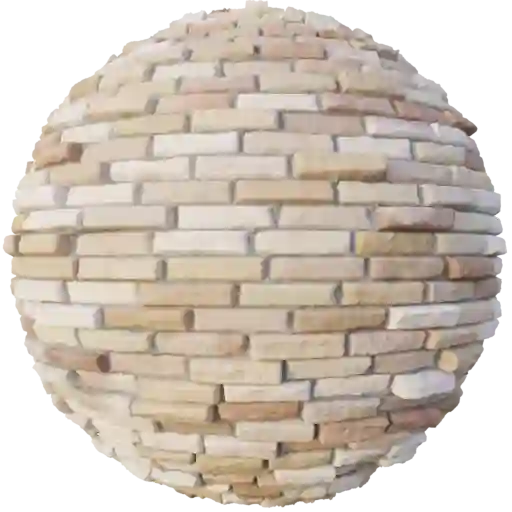

|

**This material is contained in the following Exapacks:**

    - XTRPbr_05k_Vol_001

    - XTRPbr_1k_Vol_001

    - XTRPbr_2k_Vol_001

    - XTRPbr_4k_Vol_008

    - XTRPbr_8k_Vol_023

------------------------------------------------------------------------------------------------------------------------

Modern Green Bricks 001
***********************

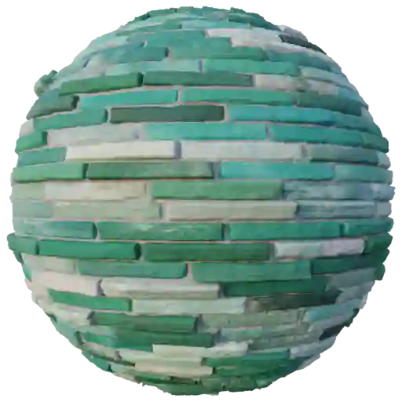

|

**This material is contained in the following Exapacks:**

    - XTRPbr_05k_Vol_001

    - XTRPbr_1k_Vol_001

    - XTRPbr_2k_Vol_001

    - XTRPbr_4k_Vol_008

    - XTRPbr_8k_Vol_023

------------------------------------------------------------------------------------------------------------------------

Modern Green Bricks 002
***********************

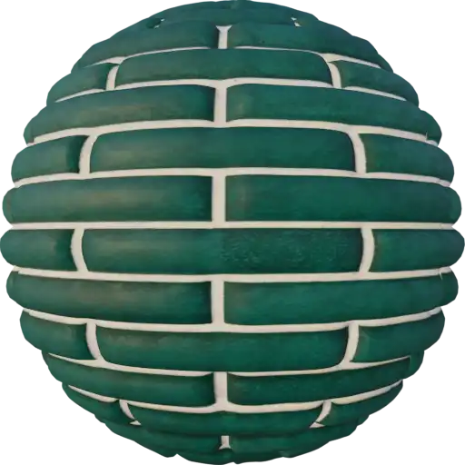

|

**This material is contained in the following Exapacks:**

    - XTRPbr_05k_Vol_001

    - XTRPbr_1k_Vol_001

    - XTRPbr_2k_Vol_001

    - XTRPbr_4k_Vol_008

------------------------------------------------------------------------------------------------------------------------

Modern Green Bricks 003
***********************

.. image:: _static/_images/material_list/bricks_modern/modern_green_bricks_003/modern_green_bricks_003.webp
    :width: 30%
    :align: center
    :alt: Modern Green Bricks 003

|

**This material is contained in the following Exapacks:**

    - XTRPbr_05k_Vol_001

    - XTRPbr_1k_Vol_001

    - XTRPbr_2k_Vol_001

    - XTRPbr_4k_Vol_008

------------------------------------------------------------------------------------------------------------------------

Modern Grey Bricks 001
**********************

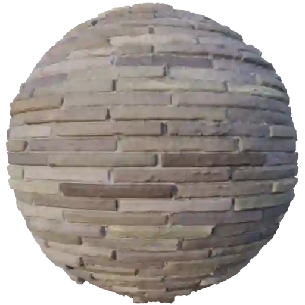

|

**This material is contained in the following Exapacks:**

    - XTRPbr_05k_Vol_001

    - XTRPbr_1k_Vol_001

    - XTRPbr_2k_Vol_001

    - XTRPbr_4k_Vol_008

    - XTRPbr_8k_Vol_023

------------------------------------------------------------------------------------------------------------------------

Modern Grey Bricks 002
**********************

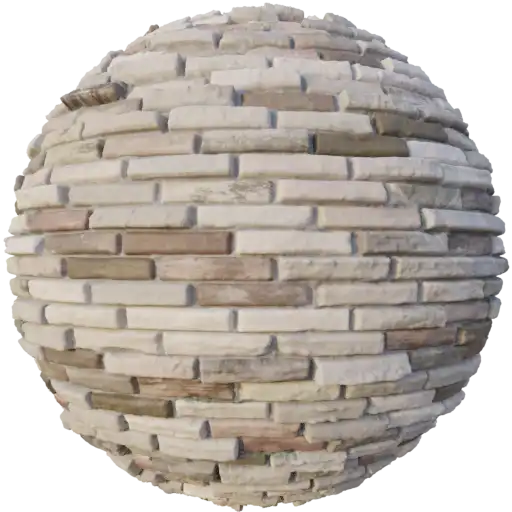

|

**This material is contained in the following Exapacks:**

    - XTRPbr_05k_Vol_001

    - XTRPbr_1k_Vol_001

    - XTRPbr_2k_Vol_001

    - XTRPbr_4k_Vol_008

    - XTRPbr_8k_Vol_023

------------------------------------------------------------------------------------------------------------------------

Modern Grey Bricks 003
**********************

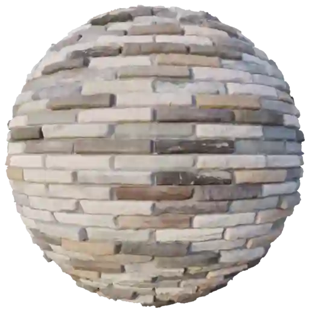

|

**This material is contained in the following Exapacks:**

    - XTRPbr_05k_Vol_001

    - XTRPbr_1k_Vol_001

    - XTRPbr_2k_Vol_001

    - XTRPbr_4k_Vol_008

    - XTRPbr_8k_Vol_023

------------------------------------------------------------------------------------------------------------------------

Modern Red Bricks 001
*********************

.. image:: _static/_images/material_list/bricks_modern/modern_red_bricks_001/modern_red_bricks_001.webp
    :width: 30%
    :align: center
    :alt: Modern Red Bricks 001

|

**This material is contained in the following Exapacks:**

    - XTRPbr_05k_Vol_001

    - XTRPbr_1k_Vol_001

    - XTRPbr_2k_Vol_001

    - XTRPbr_4k_Vol_008

    - XTRPbr_8k_Vol_023

------------------------------------------------------------------------------------------------------------------------

Modern Red Bricks 002
*********************

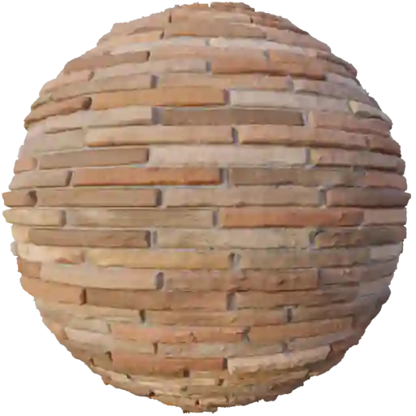

|

**This material is contained in the following Exapacks:**

    - XTRPbr_05k_Vol_001

    - XTRPbr_1k_Vol_001

    - XTRPbr_2k_Vol_001

    - XTRPbr_4k_Vol_008

    - XTRPbr_8k_Vol_023

------------------------------------------------------------------------------------------------------------------------

Modern Red Bricks 003
*********************

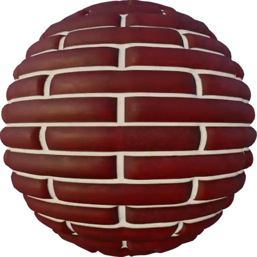

|

**This material is contained in the following Exapacks:**

    - XTRPbr_05k_Vol_001

    - XTRPbr_1k_Vol_001

    - XTRPbr_2k_Vol_001

    - XTRPbr_4k_Vol_008

------------------------------------------------------------------------------------------------------------------------

Bricks - Worn (Category)
------------------------

Bricks And Plaster 001
**********************

.. image:: _static/_images/material_list/bricks_worn/bricks_and_plaster_001/bricks_and_plaster_001.webp
    :width: 30%
    :align: center
    :alt: Bricks And Plaster 001

|

**This material is contained in the following Exapacks:**

    - XTRPbr_05k_Vol_001

    - XTRPbr_1k_Vol_001

    - XTRPbr_2k_Vol_001

    - XTRPbr_4k_Vol_008

    - XTRPbr_8k_Vol_023

------------------------------------------------------------------------------------------------------------------------

Red Worn Bricks 001
*******************

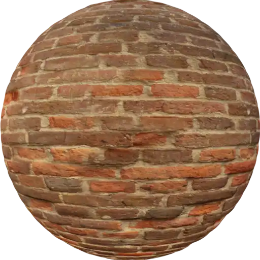

|

**This material is contained in the following Exapacks:**

    - XTRPbr_05k_Vol_001

    - XTRPbr_1k_Vol_001

    - XTRPbr_2k_Vol_001

    - XTRPbr_4k_Vol_003

    - XTRPbr_4k_Vol_008

    - XTRPbr_8k_Vol_023

------------------------------------------------------------------------------------------------------------------------

Red Worn Bricks 002
*******************

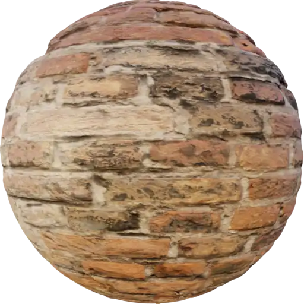

|

**This material is contained in the following Exapacks:**

    - XTRPbr_05k_Vol_001

    - XTRPbr_1k_Vol_001

    - XTRPbr_2k_Vol_001

    - XTRPbr_4k_Vol_003

    - XTRPbr_8k_Vol_023

------------------------------------------------------------------------------------------------------------------------

Red Worn Bricks 003
*******************

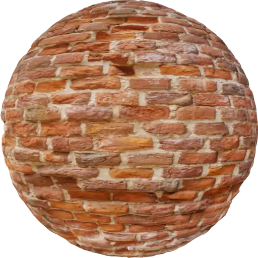

|

**This material is contained in the following Exapacks:**

    - XTRPbr_05k_Vol_001

    - XTRPbr_1k_Vol_001

    - XTRPbr_2k_Vol_001

    - XTRPbr_4k_Vol_003

    - XTRPbr_8k_Vol_013

    - XTRPbr_8k_Vol_023

------------------------------------------------------------------------------------------------------------------------

Red Worn Bricks 004
*******************

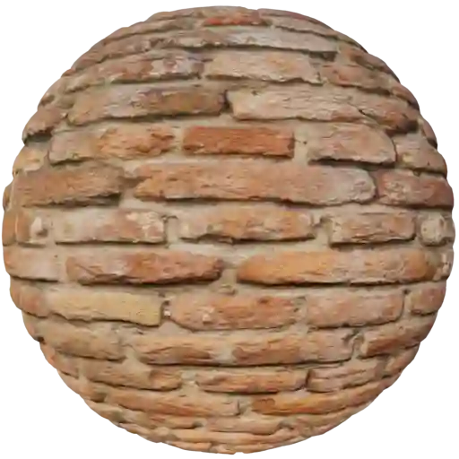

|

**This material is contained in the following Exapacks:**

    - XTRPbr_05k_Vol_001

    - XTRPbr_1k_Vol_001

    - XTRPbr_2k_Vol_001

    - XTRPbr_4k_Vol_003

    - XTRPbr_8k_Vol_013

------------------------------------------------------------------------------------------------------------------------

Red Worn Bricks 005
*******************

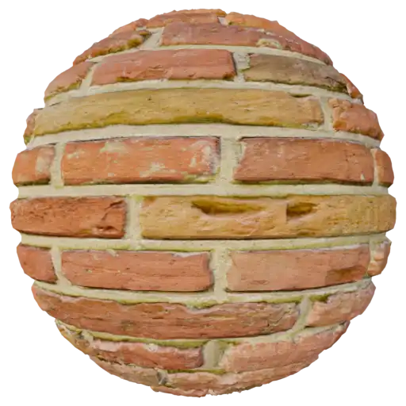

|

**This material is contained in the following Exapacks:**

    - XTRPbr_05k_Vol_001

    - XTRPbr_1k_Vol_001

    - XTRPbr_2k_Vol_001

    - XTRPbr_4k_Vol_003

------------------------------------------------------------------------------------------------------------------------

Red Worn Bricks 006
*******************

.. image:: _static/_images/material_list/bricks_worn/red_worn_bricks_006/red_worn_bricks_006.webp
    :width: 30%
    :align: center
    :alt: Red Worn Bricks 006

|

**This material is contained in the following Exapacks:**

    - XTRPbr_05k_Vol_001

    - XTRPbr_1k_Vol_001

    - XTRPbr_2k_Vol_001

    - XTRPbr_4k_Vol_003

    - XTRPbr_8k_Vol_013

------------------------------------------------------------------------------------------------------------------------

Red Worn Bricks 007
*******************

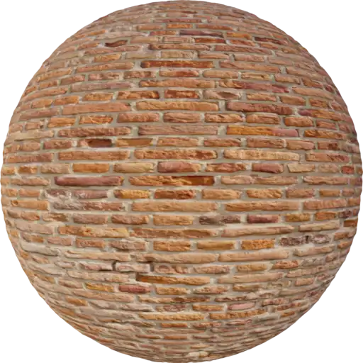

|

**This material is contained in the following Exapacks:**

    - XTRPbr_05k_Vol_001

    - XTRPbr_1k_Vol_001

    - XTRPbr_2k_Vol_001

    - XTRPbr_4k_Vol_003

    - XTRPbr_8k_Vol_013

------------------------------------------------------------------------------------------------------------------------

Red Worn Bricks 008
*******************

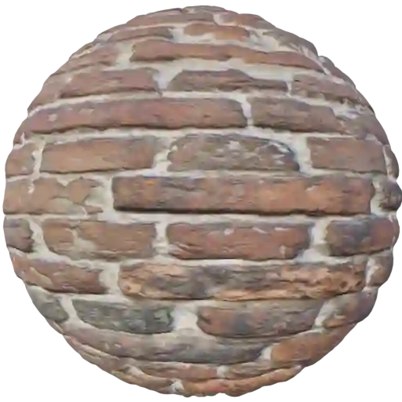

|

**This material is contained in the following Exapacks:**

    - XTRPbr_05k_Vol_001

    - XTRPbr_1k_Vol_001

    - XTRPbr_2k_Vol_001

    - XTRPbr_4k_Vol_003

    - XTRPbr_8k_Vol_013

------------------------------------------------------------------------------------------------------------------------

Red Worn Bricks 009
*******************

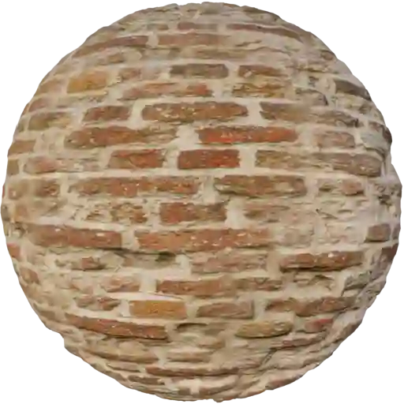

|

**This material is contained in the following Exapacks:**

    - XTRPbr_05k_Vol_001

    - XTRPbr_1k_Vol_001

    - XTRPbr_2k_Vol_001

    - XTRPbr_4k_Vol_003

    - XTRPbr_8k_Vol_013

------------------------------------------------------------------------------------------------------------------------

Red Worn Bricks 010
*******************

.. image:: _static/_images/material_list/bricks_worn/red_worn_bricks_010/red_worn_bricks_010.webp
    :width: 30%
    :align: center
    :alt: Red Worn Bricks 010

|

**This material is contained in the following Exapacks:**

    - XTRPbr_05k_Vol_001

    - XTRPbr_1k_Vol_001

    - XTRPbr_2k_Vol_001

    - XTRPbr_4k_Vol_003

    - XTRPbr_8k_Vol_013

------------------------------------------------------------------------------------------------------------------------

Red Worn Bricks 011
*******************

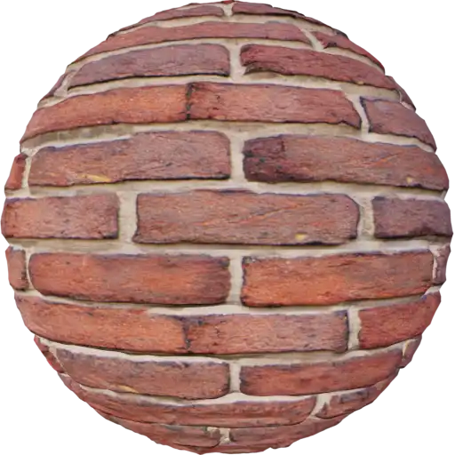

|

**This material is contained in the following Exapacks:**

    - XTRPbr_05k_Vol_001

    - XTRPbr_1k_Vol_001

    - XTRPbr_2k_Vol_001

    - XTRPbr_4k_Vol_003

------------------------------------------------------------------------------------------------------------------------

Red Worn Bricks 012
*******************

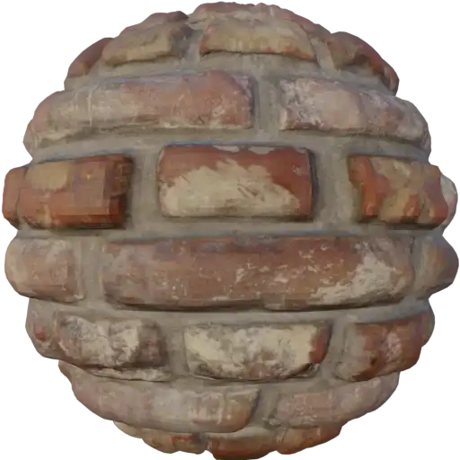

|

**This material is contained in the following Exapacks:**

    - XTRPbr_05k_Vol_001

    - XTRPbr_1k_Vol_001

    - XTRPbr_2k_Vol_001

    - XTRPbr_4k_Vol_003

    - XTRPbr_8k_Vol_013

------------------------------------------------------------------------------------------------------------------------

Red Worn Bricks 013
*******************

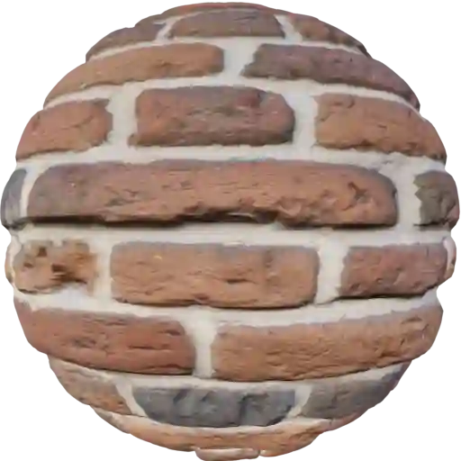

|

**This material is contained in the following Exapacks:**

    - XTRPbr_05k_Vol_001

    - XTRPbr_1k_Vol_001

    - XTRPbr_2k_Vol_001

    - XTRPbr_4k_Vol_003

    - XTRPbr_8k_Vol_013

------------------------------------------------------------------------------------------------------------------------

Red Worn Bricks 014
*******************

.. image:: _static/_images/material_list/bricks_worn/red_worn_bricks_014/red_worn_bricks_014.webp
    :width: 30%
    :align: center
    :alt: Red Worn Bricks 014

|

**This material is contained in the following Exapacks:**

    - XTRPbr_05k_Vol_001

    - XTRPbr_1k_Vol_001

    - XTRPbr_2k_Vol_001

    - XTRPbr_4k_Vol_003

------------------------------------------------------------------------------------------------------------------------

Red Worn Bricks 015
*******************

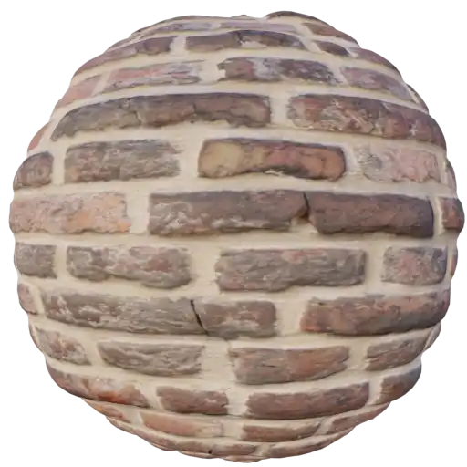

|

**This material is contained in the following Exapacks:**

    - XTRPbr_05k_Vol_001

    - XTRPbr_1k_Vol_001

    - XTRPbr_2k_Vol_001

    - XTRPbr_4k_Vol_003

    - XTRPbr_8k_Vol_013

------------------------------------------------------------------------------------------------------------------------

Red Worn Bricks 016
*******************

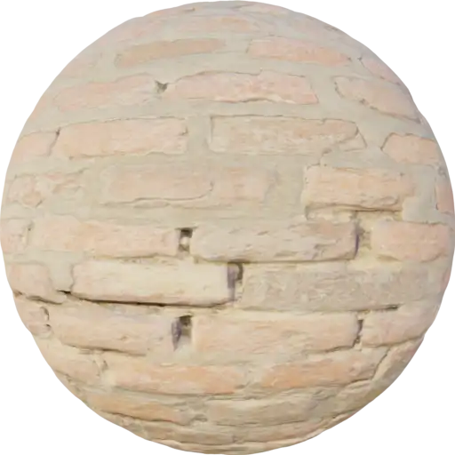

|

**This material is contained in the following Exapacks:**

    - XTRPbr_05k_Vol_001

    - XTRPbr_1k_Vol_001

    - XTRPbr_2k_Vol_001

    - XTRPbr_4k_Vol_003

    - XTRPbr_8k_Vol_013

------------------------------------------------------------------------------------------------------------------------

Red Worn Bricks 017
*******************

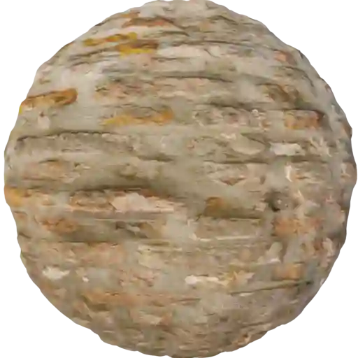

|

**This material is contained in the following Exapacks:**

    - XTRPbr_05k_Vol_001

    - XTRPbr_1k_Vol_001

    - XTRPbr_2k_Vol_001

    - XTRPbr_4k_Vol_003

    - XTRPbr_8k_Vol_013

------------------------------------------------------------------------------------------------------------------------

Red Worn Bricks 018
*******************

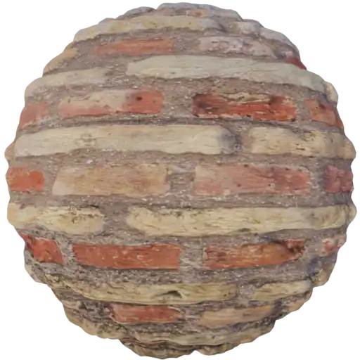

|

**This material is contained in the following Exapacks:**

    - XTRPbr_05k_Vol_001

    - XTRPbr_1k_Vol_001

    - XTRPbr_2k_Vol_001

------------------------------------------------------------------------------------------------------------------------

Red Worn Bricks 019
*******************

.. image:: _static/_images/material_list/bricks_worn/red_worn_bricks_019/red_worn_bricks_019.webp
    :width: 30%
    :align: center
    :alt: Red Worn Bricks 019

|

**This material is contained in the following Exapacks:**

    - XTRPbr_05k_Vol_001

    - XTRPbr_1k_Vol_001

    - XTRPbr_2k_Vol_001

    - XTRPbr_4k_Vol_003

    - XTRPbr_8k_Vol_013

------------------------------------------------------------------------------------------------------------------------

Red Worn Bricks 020
*******************

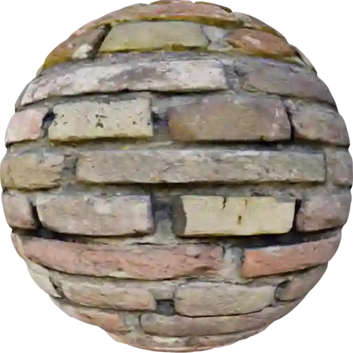

|

**This material is contained in the following Exapacks:**

    - XTRPbr_05k_Vol_001

    - XTRPbr_1k_Vol_001

    - XTRPbr_2k_Vol_001

    - XTRPbr_4k_Vol_003

    - XTRPbr_8k_Vol_013

------------------------------------------------------------------------------------------------------------------------

Yellow Worn Bricks 001
**********************

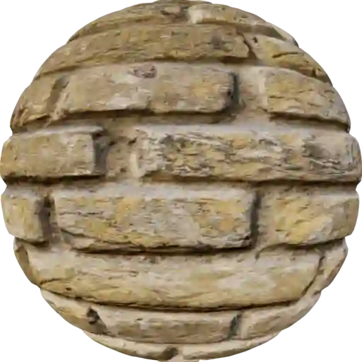

|

**This material is contained in the following Exapacks:**

    - XTRPbr_05k_Vol_001

    - XTRPbr_1k_Vol_001

    - XTRPbr_2k_Vol_001

    - XTRPbr_4k_Vol_003

    - XTRPbr_8k_Vol_013

------------------------------------------------------------------------------------------------------------------------

Yellow Worn Bricks 002
**********************

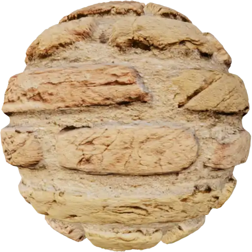

|

**This material is contained in the following Exapacks:**

    - XTRPbr_05k_Vol_001

    - XTRPbr_1k_Vol_001

    - XTRPbr_2k_Vol_001

    - XTRPbr_4k_Vol_003

------------------------------------------------------------------------------------------------------------------------

Car (Category)
--------------

Car Paint 001
*************

.. image:: _static/_images/material_list/car/car_paint_001/car_paint_001.webp
    :width: 30%
    :align: center
    :alt: Car Paint 001

|

**This material is contained in the following Exapacks:**

    - XTRPbr_Procedural_Vol_001

------------------------------------------------------------------------------------------------------------------------

Rubber Tires Basic 001
**********************

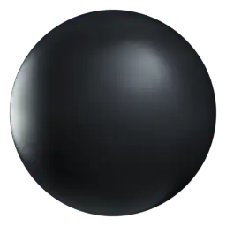

|

**This material is contained in the following Exapacks:**

    - XTRPbr_Procedural_Vol_001

------------------------------------------------------------------------------------------------------------------------

Ceiling - Office (Category)
---------------------------

False Ceiling 01
****************

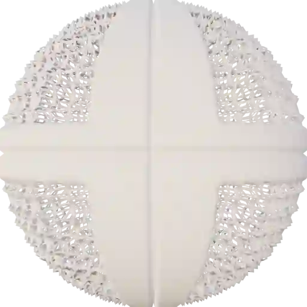

|

**This material is contained in the following Exapacks:**

    - XTRPbr_05k_Vol_001

    - XTRPbr_1k_Vol_001

    - XTRPbr_2k_Vol_001

    - XTRPbr_4k_Vol_003

------------------------------------------------------------------------------------------------------------------------

Office Ceiling 001
******************

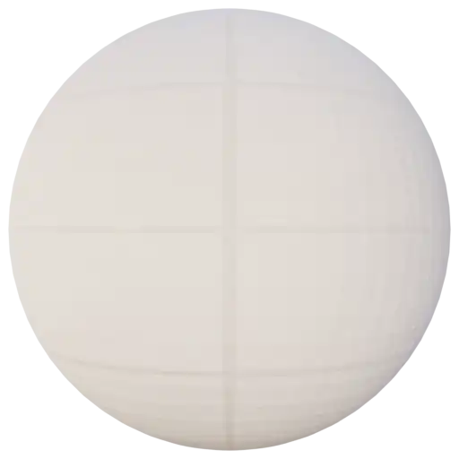

|

**This material is contained in the following Exapacks:**

    - XTRPbr_05k_Vol_001

    - XTRPbr_1k_Vol_001

    - XTRPbr_2k_Vol_001

    - XTRPbr_4k_Vol_003

    - XTRPbr_8k_Vol_013

------------------------------------------------------------------------------------------------------------------------

Office Ceiling 002
******************

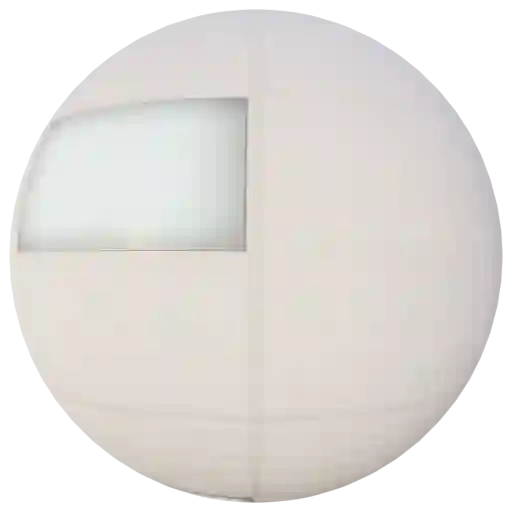

|

**This material is contained in the following Exapacks:**

    - XTRPbr_05k_Vol_001

    - XTRPbr_1k_Vol_001

    - XTRPbr_2k_Vol_001

    - XTRPbr_4k_Vol_003

    - XTRPbr_8k_Vol_013

------------------------------------------------------------------------------------------------------------------------

Office Ceiling 003
******************

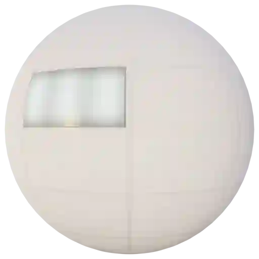

|

**This material is contained in the following Exapacks:**

    - XTRPbr_05k_Vol_001

    - XTRPbr_1k_Vol_001

    - XTRPbr_2k_Vol_001

    - XTRPbr_4k_Vol_003

    - XTRPbr_8k_Vol_013

------------------------------------------------------------------------------------------------------------------------

Office Ceiling 004
******************

|

**This material is contained in the following Exapacks:**

    - XTRPbr_05k_Vol_001

    - XTRPbr_1k_Vol_001

    - XTRPbr_2k_Vol_001

    - XTRPbr_4k_Vol_003

    - XTRPbr_8k_Vol_013

------------------------------------------------------------------------------------------------------------------------

Office Ceiling 005
******************

|

**This material is contained in the following Exapacks:**

    - XTRPbr_05k_Vol_001

    - XTRPbr_1k_Vol_001

    - XTRPbr_2k_Vol_001

    - XTRPbr_4k_Vol_003

    - XTRPbr_8k_Vol_013

------------------------------------------------------------------------------------------------------------------------

Office Ceiling 006
******************

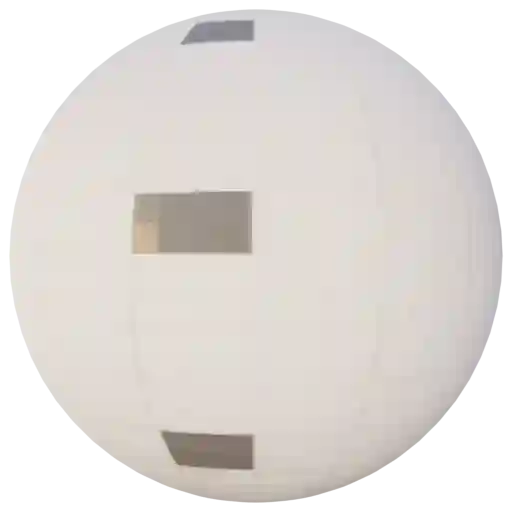

|

**This material is contained in the following Exapacks:**

    - XTRPbr_05k_Vol_001

    - XTRPbr_1k_Vol_001

    - XTRPbr_2k_Vol_001

    - XTRPbr_4k_Vol_003

    - XTRPbr_8k_Vol_013

------------------------------------------------------------------------------------------------------------------------

Character - Organic (Category)
------------------------------

Human Skin 001
**************

.. image:: _static/_images/material_list/character_organic/human_skin_001/human_skin_001.webp
    :width: 30%
    :align: center
    :alt: Human Skin 001

|

**This material is contained in the following Exapacks:**

    - XTRPbr_05k_Vol_001

    - XTRPbr_1k_Vol_001

    - XTRPbr_2k_Vol_001

    - XTRPbr_4k_Vol_003

------------------------------------------------------------------------------------------------------------------------

Human Skin 002
**************

.. image:: _static/_images/material_list/character_organic/human_skin_002/human_skin_002.webp
    :width: 30%
    :align: center
    :alt: Human Skin 002

|

**This material is contained in the following Exapacks:**

    - XTRPbr_05k_Vol_001

    - XTRPbr_1k_Vol_001

    - XTRPbr_2k_Vol_001

    - XTRPbr_4k_Vol_003

------------------------------------------------------------------------------------------------------------------------

Human Skin 003
**************

.. image:: _static/_images/material_list/character_organic/human_skin_003/human_skin_003.webp
    :width: 30%
    :align: center
    :alt: Human Skin 003

|

**This material is contained in the following Exapacks:**

    - XTRPbr_05k_Vol_001

    - XTRPbr_1k_Vol_001

    - XTRPbr_2k_Vol_001

    - XTRPbr_4k_Vol_003

------------------------------------------------------------------------------------------------------------------------

Human Skin 004
**************

.. image:: _static/_images/material_list/character_organic/human_skin_004/human_skin_004.webp
    :width: 30%
    :align: center
    :alt: Human Skin 004

|

**This material is contained in the following Exapacks:**

    - XTRPbr_05k_Vol_001

    - XTRPbr_1k_Vol_001

    - XTRPbr_2k_Vol_001

    - XTRPbr_4k_Vol_003

------------------------------------------------------------------------------------------------------------------------

Human Skin 005
**************

.. image:: _static/_images/material_list/character_organic/human_skin_005/human_skin_005.webp
    :width: 30%
    :align: center
    :alt: Human Skin 005

|

**This material is contained in the following Exapacks:**

    - XTRPbr_05k_Vol_001

    - XTRPbr_1k_Vol_001

    - XTRPbr_2k_Vol_001

    - XTRPbr_4k_Vol_003

------------------------------------------------------------------------------------------------------------------------

Human Skin 006
**************

.. image:: _static/_images/material_list/character_organic/human_skin_006/human_skin_006.webp
    :width: 30%
    :align: center
    :alt: Human Skin 006

|

**This material is contained in the following Exapacks:**

    - XTRPbr_05k_Vol_001

    - XTRPbr_1k_Vol_001

    - XTRPbr_2k_Vol_001

    - XTRPbr_4k_Vol_003

------------------------------------------------------------------------------------------------------------------------

Christmas Ornament (Category)
-----------------------------

Christmas Ornament 001
**********************

|

**This material is contained in the following Exapacks:**

    - XTRPbr_05k_Vol_001

    - XTRPbr_1k_Vol_001

    - XTRPbr_2k_Vol_001

    - XTRPbr_4k_Vol_003

    - XTRPbr_8k_Vol_013

------------------------------------------------------------------------------------------------------------------------

Christmas Ornament 003
**********************

|

**This material is contained in the following Exapacks:**

    - XTRPbr_05k_Vol_001

    - XTRPbr_1k_Vol_001

    - XTRPbr_2k_Vol_001

    - XTRPbr_4k_Vol_003

    - XTRPbr_8k_Vol_013

------------------------------------------------------------------------------------------------------------------------

Christmas Ornament 004
**********************

.. image:: _static/_images/material_list/christmas_ornament/christmas_ornament_004/christmas_ornament_004.webp
    :width: 30%
    :align: center
    :alt: Christmas Ornament 004

|

**This material is contained in the following Exapacks:**

    - XTRPbr_05k_Vol_001

    - XTRPbr_1k_Vol_001

    - XTRPbr_2k_Vol_001

    - XTRPbr_4k_Vol_003

    - XTRPbr_8k_Vol_013

------------------------------------------------------------------------------------------------------------------------

Christmas Ornament 005
**********************

|

**This material is contained in the following Exapacks:**

    - XTRPbr_05k_Vol_001

    - XTRPbr_1k_Vol_001

    - XTRPbr_2k_Vol_001

    - XTRPbr_4k_Vol_003

    - XTRPbr_8k_Vol_013

------------------------------------------------------------------------------------------------------------------------

Christmas Ornament 006
**********************

.. image:: _static/_images/material_list/christmas_ornament/christmas_ornament_006/christmas_ornament_006.webp
    :width: 30%
    :align: center
    :alt: Christmas Ornament 006

|

**This material is contained in the following Exapacks:**

    - XTRPbr_05k_Vol_001

    - XTRPbr_1k_Vol_001

    - XTRPbr_2k_Vol_001

    - XTRPbr_4k_Vol_003

    - XTRPbr_8k_Vol_013

------------------------------------------------------------------------------------------------------------------------

Christmas Ornament 007
**********************

|

**This material is contained in the following Exapacks:**

    - XTRPbr_05k_Vol_001

    - XTRPbr_1k_Vol_001

    - XTRPbr_2k_Vol_001

    - XTRPbr_4k_Vol_003

    - XTRPbr_8k_Vol_013

------------------------------------------------------------------------------------------------------------------------

Christmas Ornament 008
**********************

|

**This material is contained in the following Exapacks:**

    - XTRPbr_05k_Vol_001

    - XTRPbr_1k_Vol_001

    - XTRPbr_2k_Vol_001

    - XTRPbr_4k_Vol_003

    - XTRPbr_8k_Vol_013

------------------------------------------------------------------------------------------------------------------------

Clay (Category)
---------------

Clay 001
********

|

**This material is contained in the following Exapacks:**

    - XTRPbr_05k_Vol_001

    - XTRPbr_1k_Vol_001

    - XTRPbr_2k_Vol_001

    - XTRPbr_4k_Vol_003

    - XTRPbr_8k_Vol_013

------------------------------------------------------------------------------------------------------------------------

Clay 002
********

|

**This material is contained in the following Exapacks:**

    - XTRPbr_05k_Vol_001

    - XTRPbr_1k_Vol_001

    - XTRPbr_2k_Vol_001

    - XTRPbr_4k_Vol_003

    - XTRPbr_8k_Vol_013

------------------------------------------------------------------------------------------------------------------------

Clay 003
********

|

**This material is contained in the following Exapacks:**

    - XTRPbr_05k_Vol_001

    - XTRPbr_1k_Vol_001

    - XTRPbr_2k_Vol_001

    - XTRPbr_4k_Vol_003

    - XTRPbr_8k_Vol_013

------------------------------------------------------------------------------------------------------------------------

Clay 004
********

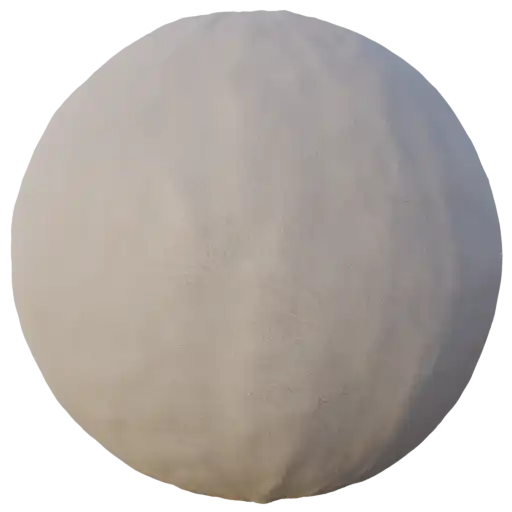

|

**This material is contained in the following Exapacks:**

    - XTRPbr_05k_Vol_001

    - XTRPbr_1k_Vol_001

    - XTRPbr_2k_Vol_001

    - XTRPbr_4k_Vol_003

    - XTRPbr_8k_Vol_013

------------------------------------------------------------------------------------------------------------------------

Concrete - Blocks (Category)
----------------------------

Concrete Blocks 001
*******************

.. image:: _static/_images/material_list/concrete_blocks/concrete_blocks_001/concrete_blocks_001.webp
    :width: 30%
    :align: center
    :alt: Concrete Blocks 001

|

**This material is contained in the following Exapacks:**

    - XTRPbr_05k_Vol_001

    - XTRPbr_1k_Vol_001

    - XTRPbr_2k_Vol_001

    - XTRPbr_4k_Vol_003

    - XTRPbr_8k_Vol_013

------------------------------------------------------------------------------------------------------------------------

Concrete Blocks 002
*******************

.. image:: _static/_images/material_list/concrete_blocks/concrete_blocks_002/concrete_blocks_002.webp
    :width: 30%
    :align: center
    :alt: Concrete Blocks 002

|

**This material is contained in the following Exapacks:**

    - XTRPbr_05k_Vol_001

    - XTRPbr_1k_Vol_001

    - XTRPbr_2k_Vol_001

    - XTRPbr_4k_Vol_003

    - XTRPbr_8k_Vol_013

------------------------------------------------------------------------------------------------------------------------

Concrete Blocks 003
*******************

.. image:: _static/_images/material_list/concrete_blocks/concrete_blocks_003/concrete_blocks_003.webp
    :width: 30%
    :align: center
    :alt: Concrete Blocks 003

|

**This material is contained in the following Exapacks:**

    - XTRPbr_05k_Vol_001

    - XTRPbr_1k_Vol_001

    - XTRPbr_2k_Vol_001

    - XTRPbr_4k_Vol_003

    - XTRPbr_8k_Vol_017

------------------------------------------------------------------------------------------------------------------------

Concrete Blocks 004
*******************

.. image:: _static/_images/material_list/concrete_blocks/concrete_blocks_004/concrete_blocks_004.webp
    :width: 30%
    :align: center
    :alt: Concrete Blocks 004

|

**This material is contained in the following Exapacks:**

    - XTRPbr_05k_Vol_001

    - XTRPbr_1k_Vol_001

    - XTRPbr_2k_Vol_001

    - XTRPbr_4k_Vol_003

    - XTRPbr_8k_Vol_017

------------------------------------------------------------------------------------------------------------------------

Concrete - Formed (Category)
----------------------------

Concrete Formed 001
*******************

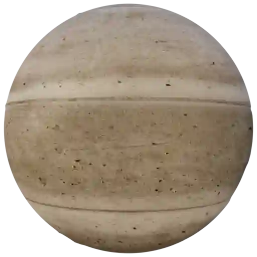

|

**This material is contained in the following Exapacks:**

    - XTRPbr_05k_Vol_001

    - XTRPbr_1k_Vol_001

    - XTRPbr_2k_Vol_001

    - XTRPbr_4k_Vol_003

    - XTRPbr_8k_Vol_017

------------------------------------------------------------------------------------------------------------------------

Concrete Formed 002
*******************

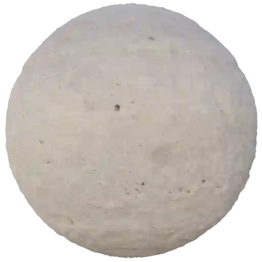

|

**This material is contained in the following Exapacks:**

    - XTRPbr_05k_Vol_001

    - XTRPbr_1k_Vol_001

    - XTRPbr_2k_Vol_001

    - XTRPbr_4k_Vol_003

------------------------------------------------------------------------------------------------------------------------

Concrete Formed 003
*******************

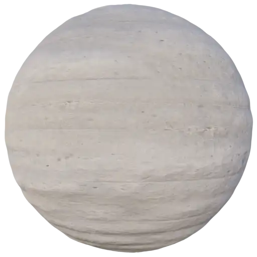

|

**This material is contained in the following Exapacks:**

    - XTRPbr_05k_Vol_001

    - XTRPbr_1k_Vol_001

    - XTRPbr_2k_Vol_001

    - XTRPbr_4k_Vol_003

    - XTRPbr_8k_Vol_017

------------------------------------------------------------------------------------------------------------------------

Concrete Formed 004
*******************

.. image:: _static/_images/material_list/concrete_formed/concrete_formed_004/concrete_formed_004.webp
    :width: 30%
    :align: center
    :alt: Concrete Formed 004

|

**This material is contained in the following Exapacks:**

    - XTRPbr_05k_Vol_001

    - XTRPbr_1k_Vol_001

    - XTRPbr_2k_Vol_001

    - XTRPbr_4k_Vol_003

    - XTRPbr_8k_Vol_017

------------------------------------------------------------------------------------------------------------------------

Concrete Formed 005
*******************

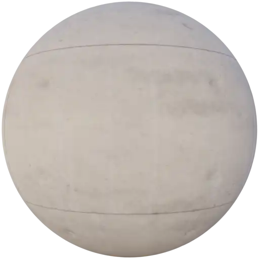

|

**This material is contained in the following Exapacks:**

    - XTRPbr_05k_Vol_001

    - XTRPbr_1k_Vol_001

    - XTRPbr_2k_Vol_001

    - XTRPbr_4k_Vol_003

    - XTRPbr_8k_Vol_017

------------------------------------------------------------------------------------------------------------------------

Concrete Formed 006
*******************

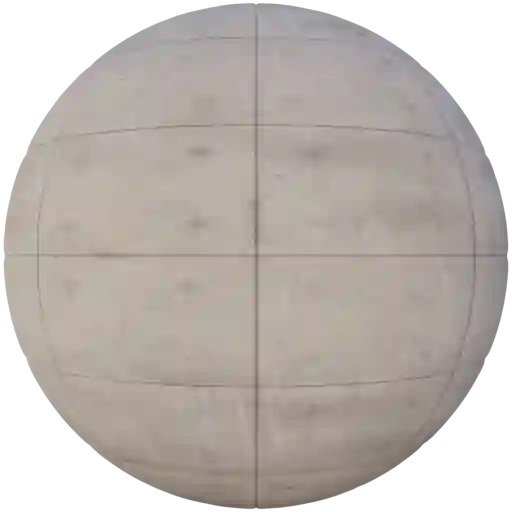

|

**This material is contained in the following Exapacks:**

    - XTRPbr_05k_Vol_001

    - XTRPbr_1k_Vol_001

    - XTRPbr_2k_Vol_001

    - XTRPbr_4k_Vol_003

    - XTRPbr_8k_Vol_017

------------------------------------------------------------------------------------------------------------------------

Concrete Formed 007
*******************

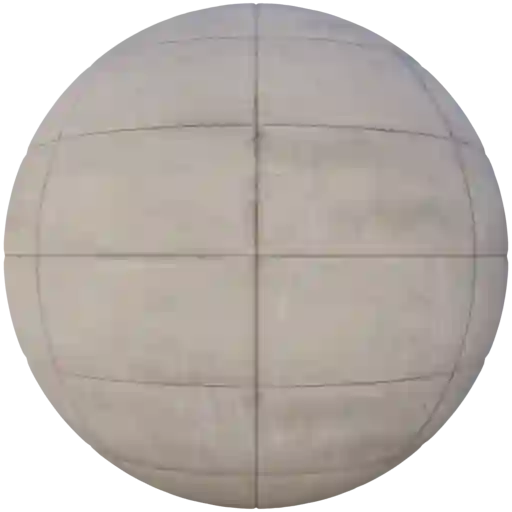

|

**This material is contained in the following Exapacks:**

    - XTRPbr_05k_Vol_001

    - XTRPbr_1k_Vol_001

    - XTRPbr_2k_Vol_001

    - XTRPbr_4k_Vol_003

    - XTRPbr_8k_Vol_017

------------------------------------------------------------------------------------------------------------------------

Concrete Formed 008
*******************

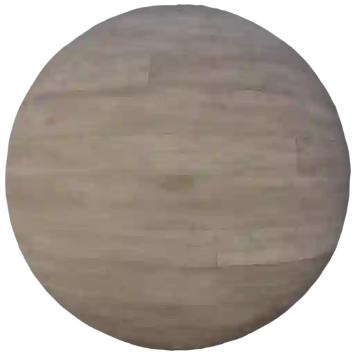

|

**This material is contained in the following Exapacks:**

    - XTRPbr_05k_Vol_001

    - XTRPbr_1k_Vol_001

    - XTRPbr_2k_Vol_001

    - XTRPbr_4k_Vol_003

    - XTRPbr_8k_Vol_017

------------------------------------------------------------------------------------------------------------------------

Concrete Formed 009
*******************

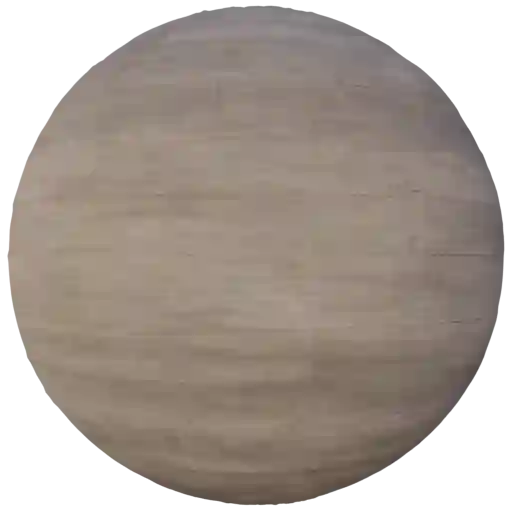

|

**This material is contained in the following Exapacks:**

    - XTRPbr_05k_Vol_001

    - XTRPbr_1k_Vol_001

    - XTRPbr_2k_Vol_001

    - XTRPbr_4k_Vol_003

    - XTRPbr_8k_Vol_017

------------------------------------------------------------------------------------------------------------------------

Concrete Formed 010
*******************

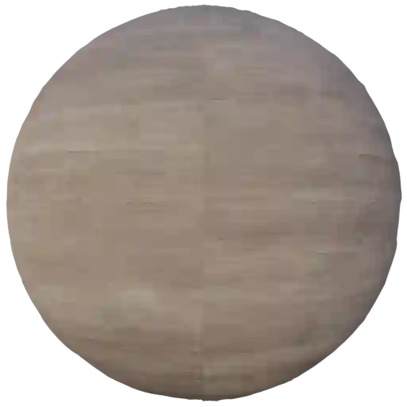

|

**This material is contained in the following Exapacks:**

    - XTRPbr_05k_Vol_001

    - XTRPbr_1k_Vol_001

    - XTRPbr_2k_Vol_001

    - XTRPbr_4k_Vol_003

    - XTRPbr_8k_Vol_017

------------------------------------------------------------------------------------------------------------------------

Concrete Formed 011
*******************

.. image:: _static/_images/material_list/concrete_formed/concrete_formed_011/concrete_formed_011.webp
    :width: 30%
    :align: center
    :alt: Concrete Formed 011

|

**This material is contained in the following Exapacks:**

    - XTRPbr_05k_Vol_001

    - XTRPbr_1k_Vol_001

    - XTRPbr_2k_Vol_001

    - XTRPbr_4k_Vol_003

    - XTRPbr_8k_Vol_017

------------------------------------------------------------------------------------------------------------------------

Concrete Formed 012
*******************

.. image:: _static/_images/material_list/concrete_formed/concrete_formed_012/concrete_formed_012.webp
    :width: 30%
    :align: center
    :alt: Concrete Formed 012

|

**This material is contained in the following Exapacks:**

    - XTRPbr_05k_Vol_001

    - XTRPbr_1k_Vol_001

    - XTRPbr_2k_Vol_001

    - XTRPbr_4k_Vol_003

    - XTRPbr_8k_Vol_017

------------------------------------------------------------------------------------------------------------------------

Concrete Formed 013
*******************

.. image:: _static/_images/material_list/concrete_formed/concrete_formed_013/concrete_formed_013.webp
    :width: 30%
    :align: center
    :alt: Concrete Formed 013

|

**This material is contained in the following Exapacks:**

    - XTRPbr_05k_Vol_001

    - XTRPbr_1k_Vol_001

    - XTRPbr_2k_Vol_001

    - XTRPbr_4k_Vol_003

------------------------------------------------------------------------------------------------------------------------

Concrete Formed 014
*******************

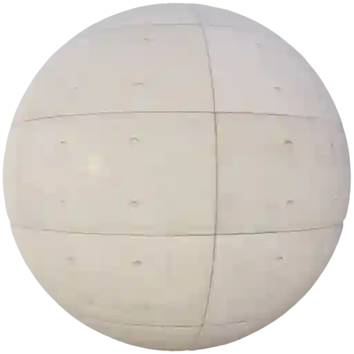

|

**This material is contained in the following Exapacks:**

    - XTRPbr_05k_Vol_001

    - XTRPbr_1k_Vol_001

    - XTRPbr_2k_Vol_001

    - XTRPbr_4k_Vol_003

------------------------------------------------------------------------------------------------------------------------

Concrete Formed 015
*******************

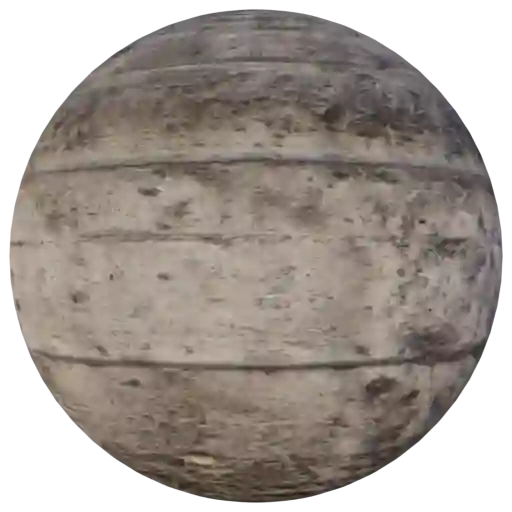

|

**This material is contained in the following Exapacks:**

    - XTRPbr_05k_Vol_001

    - XTRPbr_1k_Vol_001

    - XTRPbr_2k_Vol_001

    - XTRPbr_4k_Vol_003

------------------------------------------------------------------------------------------------------------------------

Concrete Formed 016
*******************

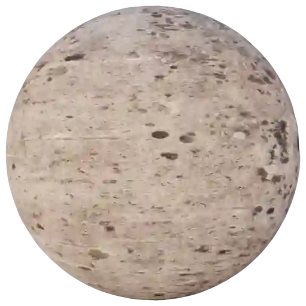

|

**This material is contained in the following Exapacks:**

    - XTRPbr_05k_Vol_001

    - XTRPbr_1k_Vol_001

    - XTRPbr_2k_Vol_001

    - XTRPbr_4k_Vol_003

------------------------------------------------------------------------------------------------------------------------

Concrete - Rough (Category)
---------------------------

Concrete Rough 001
******************

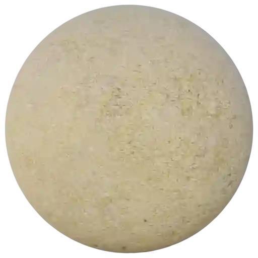

|

**This material is contained in the following Exapacks:**

    - XTRPbr_05k_Vol_001

    - XTRPbr_1k_Vol_001

    - XTRPbr_2k_Vol_001

------------------------------------------------------------------------------------------------------------------------

Concrete Rough 002
******************

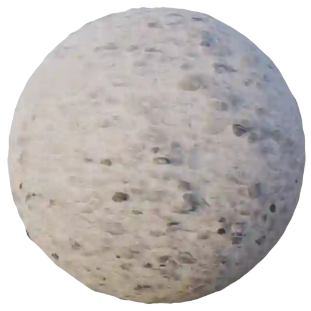

|

**This material is contained in the following Exapacks:**

    - XTRPbr_05k_Vol_001

    - XTRPbr_1k_Vol_001

    - XTRPbr_2k_Vol_001

    - XTRPbr_4k_Vol_003

    - XTRPbr_8k_Vol_017

------------------------------------------------------------------------------------------------------------------------

Concrete Rough 003
******************

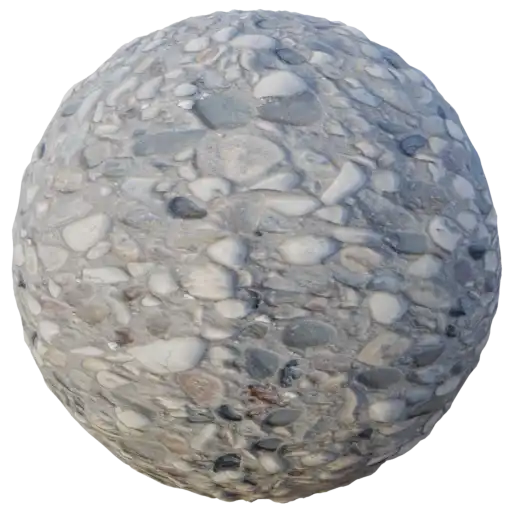

|

**This material is contained in the following Exapacks:**

    - XTRPbr_05k_Vol_001

    - XTRPbr_1k_Vol_001

    - XTRPbr_2k_Vol_001

    - XTRPbr_4k_Vol_003

    - XTRPbr_8k_Vol_017

------------------------------------------------------------------------------------------------------------------------

Concrete Rough 004
******************

.. image:: _static/_images/material_list/concrete_rough/concrete_rough_004/concrete_rough_004.webp
    :width: 30%
    :align: center
    :alt: Concrete Rough 004

|

**This material is contained in the following Exapacks:**

    - XTRPbr_05k_Vol_001

    - XTRPbr_1k_Vol_001

    - XTRPbr_2k_Vol_001

    - XTRPbr_4k_Vol_003

    - XTRPbr_8k_Vol_017

------------------------------------------------------------------------------------------------------------------------

Concrete Rough 005
******************

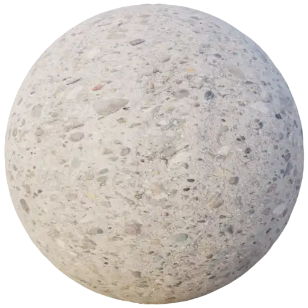

|

**This material is contained in the following Exapacks:**

    - XTRPbr_05k_Vol_001

    - XTRPbr_1k_Vol_001

    - XTRPbr_2k_Vol_001

    - XTRPbr_4k_Vol_003

    - XTRPbr_8k_Vol_017

------------------------------------------------------------------------------------------------------------------------

Concrete Rough 006
******************

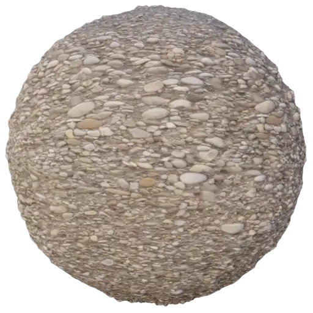

|

**This material is contained in the following Exapacks:**

    - XTRPbr_05k_Vol_001

    - XTRPbr_1k_Vol_001

    - XTRPbr_2k_Vol_001

    - XTRPbr_4k_Vol_003

------------------------------------------------------------------------------------------------------------------------

Concrete Rough 007
******************

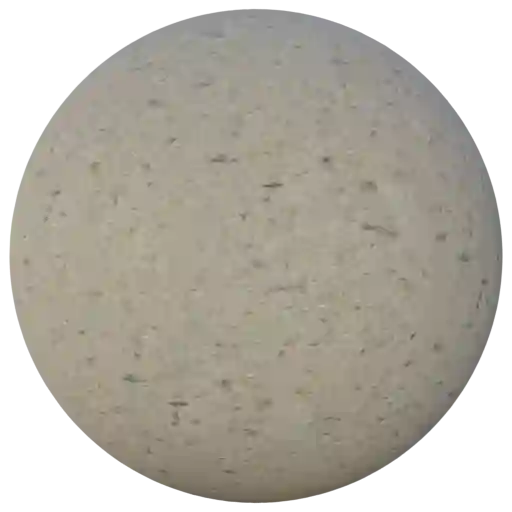

|

**This material is contained in the following Exapacks:**

    - XTRPbr_05k_Vol_001

    - XTRPbr_1k_Vol_001

    - XTRPbr_2k_Vol_001

    - XTRPbr_4k_Vol_003

------------------------------------------------------------------------------------------------------------------------

Concrete Rough 008
******************

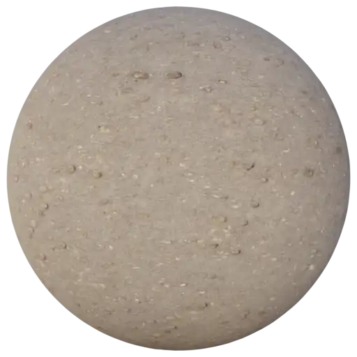

|

**This material is contained in the following Exapacks:**

    - XTRPbr_05k_Vol_001

    - XTRPbr_1k_Vol_001

    - XTRPbr_2k_Vol_001

    - XTRPbr_4k_Vol_003

------------------------------------------------------------------------------------------------------------------------

Concrete Rough 009
******************

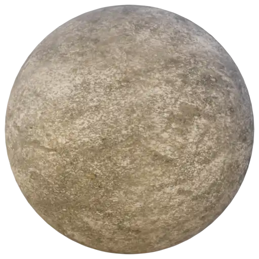

|

**This material is contained in the following Exapacks:**

    - XTRPbr_05k_Vol_001

    - XTRPbr_1k_Vol_001

    - XTRPbr_2k_Vol_001

    - XTRPbr_4k_Vol_003

    - XTRPbr_8k_Vol_017

------------------------------------------------------------------------------------------------------------------------

Concrete Rough 010
******************

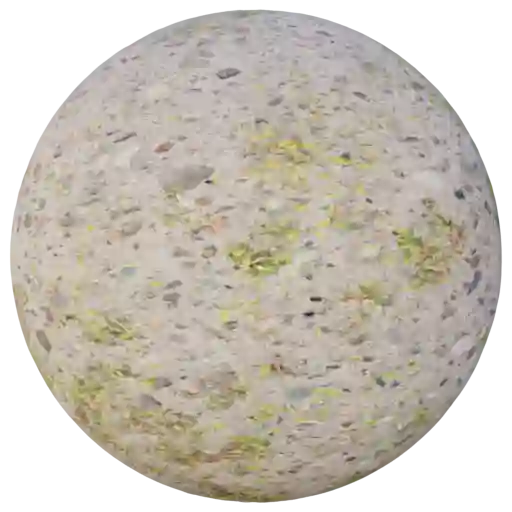

|

**This material is contained in the following Exapacks:**

    - XTRPbr_05k_Vol_001

    - XTRPbr_1k_Vol_001

    - XTRPbr_2k_Vol_001

    - XTRPbr_4k_Vol_003

    - XTRPbr_8k_Vol_017

------------------------------------------------------------------------------------------------------------------------

Concrete Rough 011
******************

.. image:: _static/_images/material_list/concrete_rough/concrete_rough_011/concrete_rough_011.webp
    :width: 30%
    :align: center
    :alt: Concrete Rough 011

|

**This material is contained in the following Exapacks:**

    - XTRPbr_05k_Vol_001

    - XTRPbr_1k_Vol_001

    - XTRPbr_2k_Vol_001

    - XTRPbr_4k_Vol_003

------------------------------------------------------------------------------------------------------------------------

Concrete Rough 012
******************

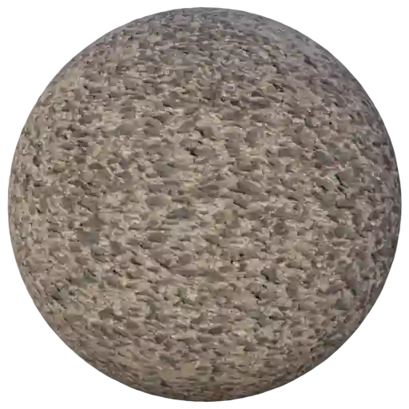

|

**This material is contained in the following Exapacks:**

    - XTRPbr_05k_Vol_001

    - XTRPbr_1k_Vol_001

    - XTRPbr_2k_Vol_001

    - XTRPbr_4k_Vol_003

------------------------------------------------------------------------------------------------------------------------

Concrete Rough 013
******************

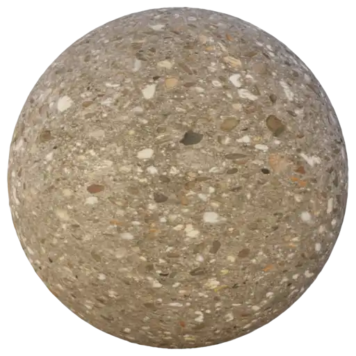

|

**This material is contained in the following Exapacks:**

    - XTRPbr_05k_Vol_001

    - XTRPbr_1k_Vol_001

    - XTRPbr_2k_Vol_001

    - XTRPbr_4k_Vol_003

    - XTRPbr_8k_Vol_017

------------------------------------------------------------------------------------------------------------------------

Concrete Rough 014
******************

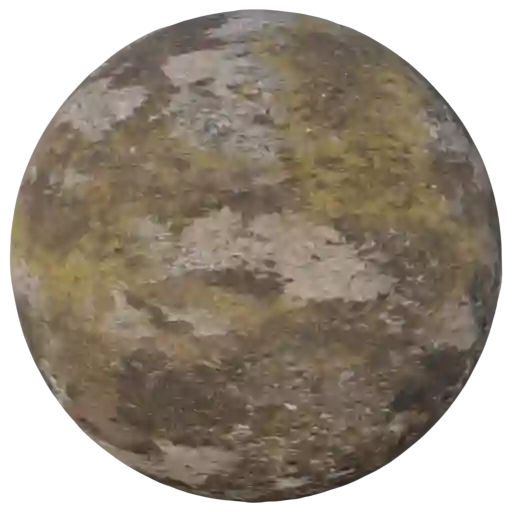

|

**This material is contained in the following Exapacks:**

    - XTRPbr_05k_Vol_001

    - XTRPbr_1k_Vol_001

    - XTRPbr_2k_Vol_001

    - XTRPbr_4k_Vol_003

------------------------------------------------------------------------------------------------------------------------

Concrete Rough 015
******************

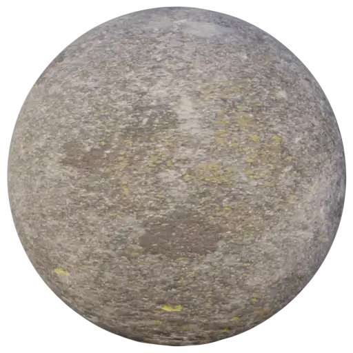

|

**This material is contained in the following Exapacks:**

    - XTRPbr_05k_Vol_001

    - XTRPbr_1k_Vol_001

    - XTRPbr_2k_Vol_001

------------------------------------------------------------------------------------------------------------------------

Concrete Rough 016
******************

.. image:: _static/_images/material_list/concrete_rough/concrete_rough_016/concrete_rough_016.webp
    :width: 30%
    :align: center
    :alt: Concrete Rough 016

|

**This material is contained in the following Exapacks:**

    - XTRPbr_05k_Vol_001

    - XTRPbr_1k_Vol_001

    - XTRPbr_2k_Vol_001

    - XTRPbr_4k_Vol_003

    - XTRPbr_8k_Vol_017

------------------------------------------------------------------------------------------------------------------------

Concrete - Smooth (Category)
----------------------------

Concrete 001
************

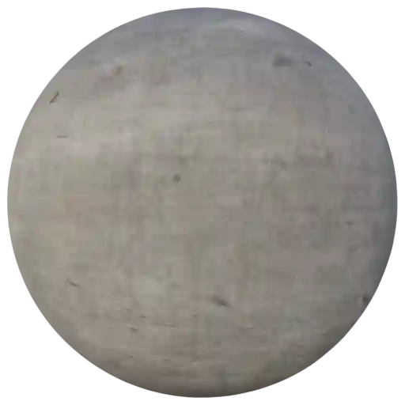

|

**This material is contained in the following Exapacks:**

    - XTRPbr_05k_Vol_001

    - XTRPbr_1k_Vol_001

    - XTRPbr_2k_Vol_001

    - XTRPbr_4k_Vol_003

    - XTRPbr_8k_Vol_017

------------------------------------------------------------------------------------------------------------------------

Concrete 002
************

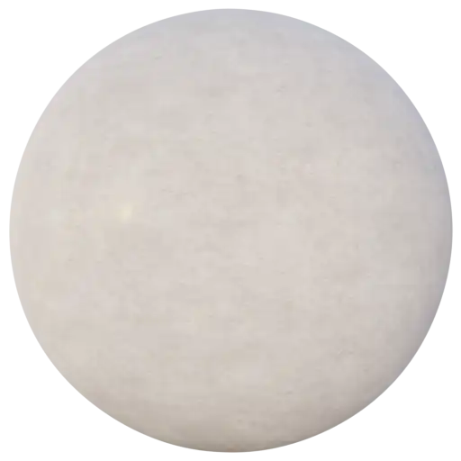

|

**This material is contained in the following Exapacks:**

    - XTRPbr_05k_Vol_001

    - XTRPbr_1k_Vol_001

    - XTRPbr_2k_Vol_001

    - XTRPbr_4k_Vol_003

------------------------------------------------------------------------------------------------------------------------

Concrete 003
************

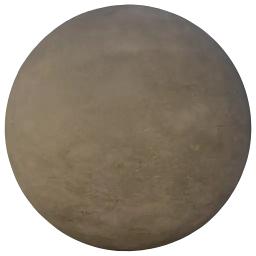

|

**This material is contained in the following Exapacks:**

    - XTRPbr_05k_Vol_001

    - XTRPbr_1k_Vol_001

    - XTRPbr_2k_Vol_001

    - XTRPbr_4k_Vol_003

    - XTRPbr_8k_Vol_017

------------------------------------------------------------------------------------------------------------------------

Concrete 004
************

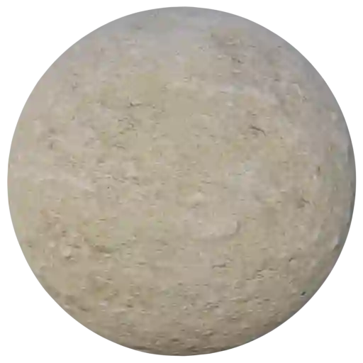

|

**This material is contained in the following Exapacks:**

    - XTRPbr_05k_Vol_001

    - XTRPbr_1k_Vol_001

    - XTRPbr_2k_Vol_001

    - XTRPbr_4k_Vol_003

    - XTRPbr_8k_Vol_017

------------------------------------------------------------------------------------------------------------------------

Concrete 005
************

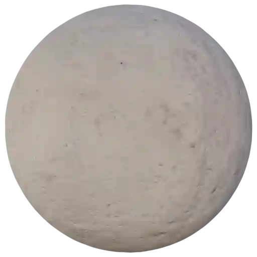

|

**This material is contained in the following Exapacks:**

    - XTRPbr_05k_Vol_001

    - XTRPbr_1k_Vol_001

    - XTRPbr_2k_Vol_001

    - XTRPbr_4k_Vol_003

    - XTRPbr_8k_Vol_017

------------------------------------------------------------------------------------------------------------------------

Concrete 006
************

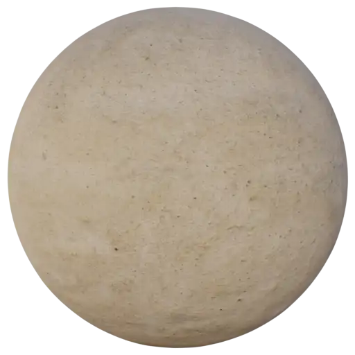

|

**This material is contained in the following Exapacks:**

    - XTRPbr_05k_Vol_001

    - XTRPbr_1k_Vol_001

    - XTRPbr_2k_Vol_001

    - XTRPbr_4k_Vol_003

    - XTRPbr_8k_Vol_017

------------------------------------------------------------------------------------------------------------------------

Concrete 007
************

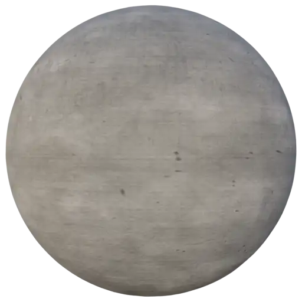

|

**This material is contained in the following Exapacks:**

    - XTRPbr_05k_Vol_001

    - XTRPbr_1k_Vol_001

    - XTRPbr_2k_Vol_001

    - XTRPbr_4k_Vol_003

    - XTRPbr_8k_Vol_017

------------------------------------------------------------------------------------------------------------------------

Concrete 008
************

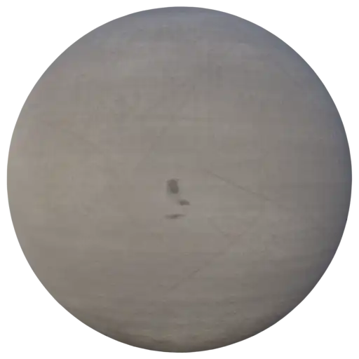

|

**This material is contained in the following Exapacks:**

    - XTRPbr_05k_Vol_001

    - XTRPbr_1k_Vol_001

    - XTRPbr_2k_Vol_001

    - XTRPbr_4k_Vol_003

    - XTRPbr_8k_Vol_017

------------------------------------------------------------------------------------------------------------------------

Concrete 009
************

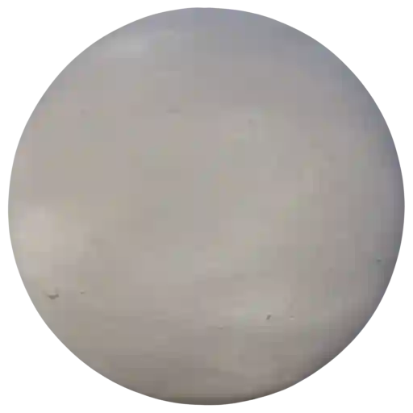

|

**This material is contained in the following Exapacks:**

    - XTRPbr_05k_Vol_001

    - XTRPbr_1k_Vol_001

    - XTRPbr_2k_Vol_001

    - XTRPbr_4k_Vol_003

    - XTRPbr_8k_Vol_017

------------------------------------------------------------------------------------------------------------------------

Concrete 010
************

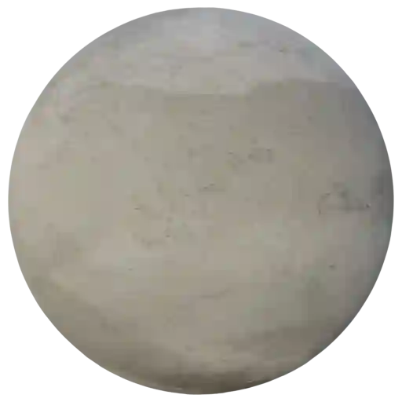

|

**This material is contained in the following Exapacks:**

    - XTRPbr_05k_Vol_001

    - XTRPbr_1k_Vol_001

    - XTRPbr_2k_Vol_001

    - XTRPbr_4k_Vol_003

    - XTRPbr_8k_Vol_017

------------------------------------------------------------------------------------------------------------------------

Concrete 011
************

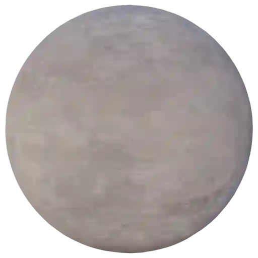

|

**This material is contained in the following Exapacks:**

    - XTRPbr_05k_Vol_001

    - XTRPbr_1k_Vol_001

    - XTRPbr_2k_Vol_001

    - XTRPbr_4k_Vol_003

    - XTRPbr_8k_Vol_001

------------------------------------------------------------------------------------------------------------------------

Concrete 012
************

.. image:: _static/_images/material_list/concrete_smooth/concrete_012/concrete_012.webp
    :width: 30%
    :align: center
    :alt: Concrete 012

|

**This material is contained in the following Exapacks:**

    - XTRPbr_05k_Vol_001

    - XTRPbr_1k_Vol_001

    - XTRPbr_2k_Vol_001

    - XTRPbr_4k_Vol_003

    - XTRPbr_8k_Vol_001

------------------------------------------------------------------------------------------------------------------------

Concrete 013
************

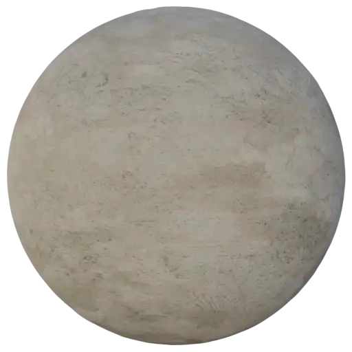

|

**This material is contained in the following Exapacks:**

    - XTRPbr_05k_Vol_001

    - XTRPbr_1k_Vol_001

    - XTRPbr_2k_Vol_001

    - XTRPbr_4k_Vol_003

    - XTRPbr_8k_Vol_001

------------------------------------------------------------------------------------------------------------------------

Concrete 014
************

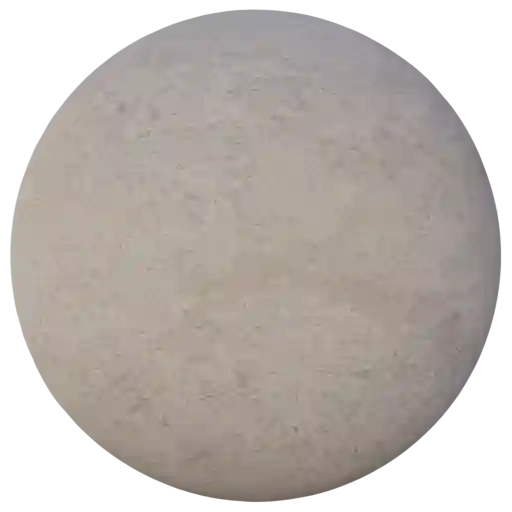

|

**This material is contained in the following Exapacks:**

    - XTRPbr_05k_Vol_001

    - XTRPbr_1k_Vol_001

    - XTRPbr_2k_Vol_001

    - XTRPbr_4k_Vol_003

    - XTRPbr_8k_Vol_001

------------------------------------------------------------------------------------------------------------------------

Concrete 015
************

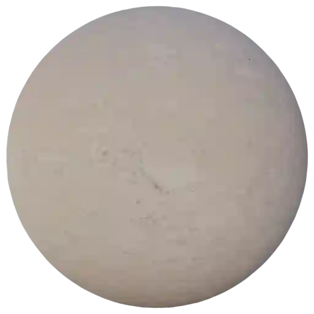

|

**This material is contained in the following Exapacks:**

    - XTRPbr_05k_Vol_001

    - XTRPbr_1k_Vol_001

    - XTRPbr_2k_Vol_001

    - XTRPbr_4k_Vol_003

    - XTRPbr_8k_Vol_001

------------------------------------------------------------------------------------------------------------------------

Concrete 016
************

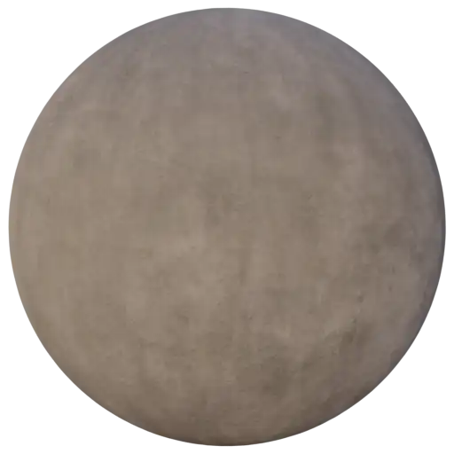

|

**This material is contained in the following Exapacks:**

    - XTRPbr_05k_Vol_001

    - XTRPbr_1k_Vol_001

    - XTRPbr_2k_Vol_001

    - XTRPbr_4k_Vol_003

    - XTRPbr_8k_Vol_001

------------------------------------------------------------------------------------------------------------------------

Concrete 017
************

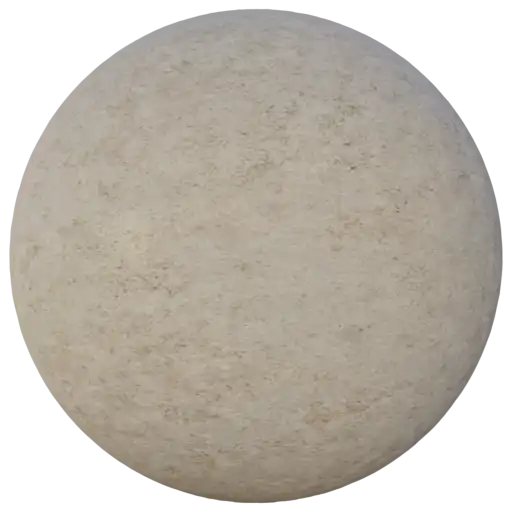

|

**This material is contained in the following Exapacks:**

    - XTRPbr_05k_Vol_001

    - XTRPbr_1k_Vol_001

    - XTRPbr_2k_Vol_001

    - XTRPbr_4k_Vol_003

------------------------------------------------------------------------------------------------------------------------

Concrete 018
************

.. image:: _static/_images/material_list/concrete_smooth/concrete_018/concrete_018.webp
    :width: 30%
    :align: center
    :alt: Concrete 018

|

**This material is contained in the following Exapacks:**

    - XTRPbr_05k_Vol_001

    - XTRPbr_1k_Vol_001

    - XTRPbr_2k_Vol_001

    - XTRPbr_4k_Vol_003

    - XTRPbr_8k_Vol_001

------------------------------------------------------------------------------------------------------------------------

Concrete 019
************

.. image:: _static/_images/material_list/concrete_smooth/concrete_019/concrete_019.webp
    :width: 30%
    :align: center
    :alt: Concrete 019

|

**This material is contained in the following Exapacks:**

    - XTRPbr_05k_Vol_001

    - XTRPbr_1k_Vol_001

    - XTRPbr_2k_Vol_001

------------------------------------------------------------------------------------------------------------------------

Concrete 020
************

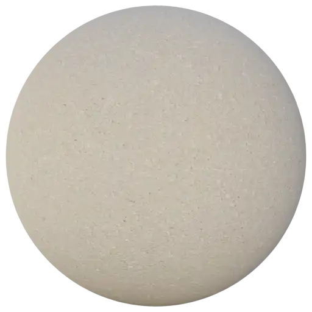

|

**This material is contained in the following Exapacks:**

    - XTRPbr_05k_Vol_001

    - XTRPbr_1k_Vol_001

    - XTRPbr_2k_Vol_001

    - XTRPbr_4k_Vol_003

------------------------------------------------------------------------------------------------------------------------

Concrete 021
************

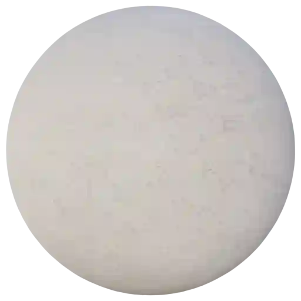

|

**This material is contained in the following Exapacks:**

    - XTRPbr_05k_Vol_001

    - XTRPbr_1k_Vol_001

    - XTRPbr_2k_Vol_001

    - XTRPbr_4k_Vol_003

------------------------------------------------------------------------------------------------------------------------

Concrete 022
************

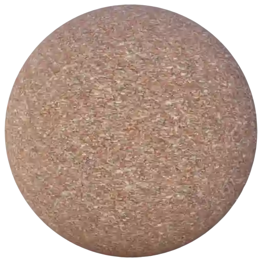

|

**This material is contained in the following Exapacks:**

    - XTRPbr_05k_Vol_001

    - XTRPbr_1k_Vol_001

    - XTRPbr_2k_Vol_001

    - XTRPbr_4k_Vol_003

------------------------------------------------------------------------------------------------------------------------

Concrete 023
************

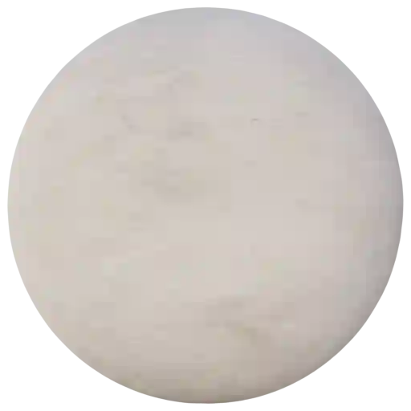

|

**This material is contained in the following Exapacks:**

    - XTRPbr_05k_Vol_001

    - XTRPbr_1k_Vol_001

    - XTRPbr_2k_Vol_001

    - XTRPbr_4k_Vol_003

------------------------------------------------------------------------------------------------------------------------

Concrete 024
************

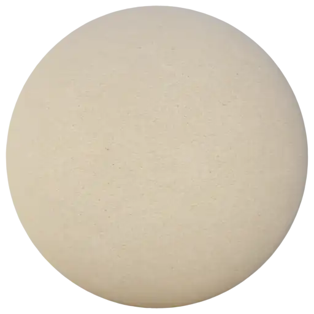

|

**This material is contained in the following Exapacks:**

    - XTRPbr_05k_Vol_001

    - XTRPbr_1k_Vol_001

    - XTRPbr_2k_Vol_001

    - XTRPbr_4k_Vol_003

------------------------------------------------------------------------------------------------------------------------

Concrete 025
************

|

**This material is contained in the following Exapacks:**

    - XTRPbr_05k_Vol_001

    - XTRPbr_1k_Vol_001

    - XTRPbr_2k_Vol_001

    - XTRPbr_4k_Vol_003

------------------------------------------------------------------------------------------------------------------------

Concrete Grunge Wall 01
***********************

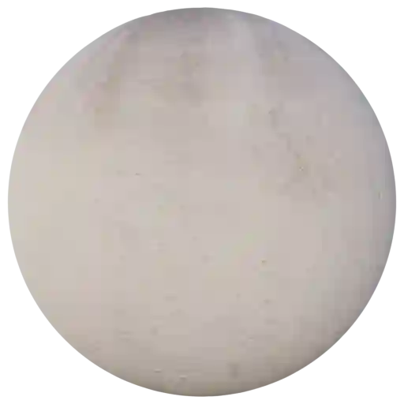

|

**This material is contained in the following Exapacks:**

    - XTRPbr_05k_Vol_001

    - XTRPbr_1k_Vol_001

    - XTRPbr_2k_Vol_001

------------------------------------------------------------------------------------------------------------------------

Corrugated - Various (Category)
-------------------------------

Corrugated Metal 001
********************

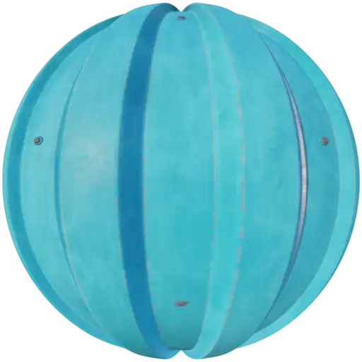

|

**This material is contained in the following Exapacks:**

    - XTRPbr_05k_Vol_001

    - XTRPbr_1k_Vol_001

    - XTRPbr_2k_Vol_001

    - XTRPbr_4k_Vol_003

    - XTRPbr_8k_Vol_001

------------------------------------------------------------------------------------------------------------------------

Corrugated Metal 002
********************

|

**This material is contained in the following Exapacks:**

    - XTRPbr_05k_Vol_001

    - XTRPbr_1k_Vol_001

    - XTRPbr_2k_Vol_001

    - XTRPbr_4k_Vol_003

    - XTRPbr_8k_Vol_001

------------------------------------------------------------------------------------------------------------------------

Corrugated Metal 003
********************

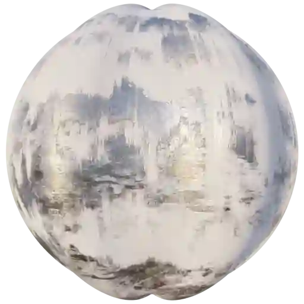

|

**This material is contained in the following Exapacks:**

    - XTRPbr_05k_Vol_001

    - XTRPbr_1k_Vol_001

    - XTRPbr_2k_Vol_001

    - XTRPbr_4k_Vol_003

    - XTRPbr_8k_Vol_001

------------------------------------------------------------------------------------------------------------------------

Corrugated Metal 004
********************

.. image:: _static/_images/material_list/corrugated_various/corrugated_metal_004/corrugated_metal_004.webp
    :width: 30%
    :align: center
    :alt: Corrugated Metal 004

|

**This material is contained in the following Exapacks:**

    - XTRPbr_05k_Vol_001

    - XTRPbr_1k_Vol_001

    - XTRPbr_2k_Vol_001

    - XTRPbr_4k_Vol_003

    - XTRPbr_8k_Vol_001

------------------------------------------------------------------------------------------------------------------------

Corrugated Metal 005
********************

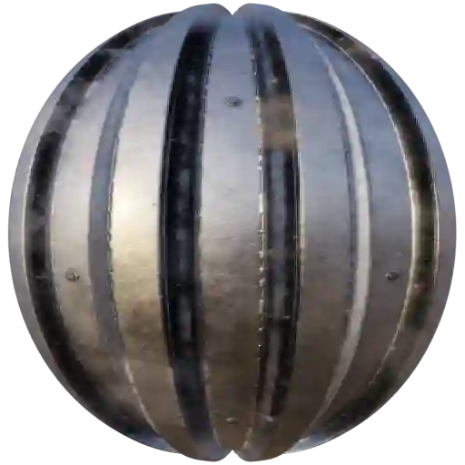

|

**This material is contained in the following Exapacks:**

    - XTRPbr_05k_Vol_001

    - XTRPbr_1k_Vol_001

    - XTRPbr_2k_Vol_001

    - XTRPbr_4k_Vol_003

    - XTRPbr_8k_Vol_001

------------------------------------------------------------------------------------------------------------------------

Corrugated Metal 006
********************

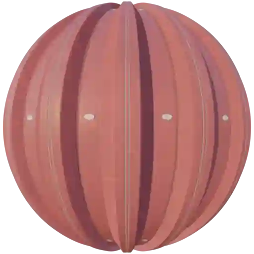

|

**This material is contained in the following Exapacks:**

    - XTRPbr_05k_Vol_001

    - XTRPbr_1k_Vol_001

    - XTRPbr_2k_Vol_001

------------------------------------------------------------------------------------------------------------------------

Corrugated Metal 007
********************

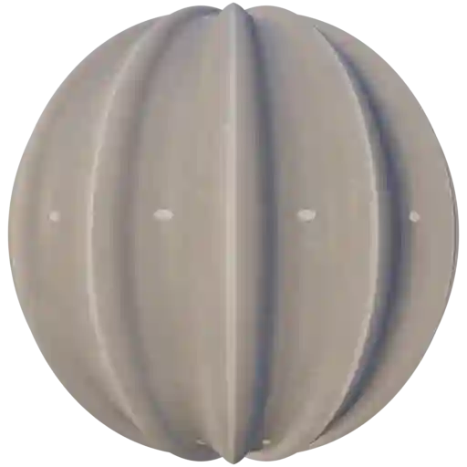

|

**This material is contained in the following Exapacks:**

    - XTRPbr_05k_Vol_001

    - XTRPbr_1k_Vol_001

    - XTRPbr_2k_Vol_001

------------------------------------------------------------------------------------------------------------------------

Corrugated Metal 008
********************

|

**This material is contained in the following Exapacks:**

    - XTRPbr_05k_Vol_001

    - XTRPbr_1k_Vol_001

    - XTRPbr_2k_Vol_001

    - XTRPbr_4k_Vol_003

    - XTRPbr_8k_Vol_001

------------------------------------------------------------------------------------------------------------------------

Corrugated Metal 009
********************

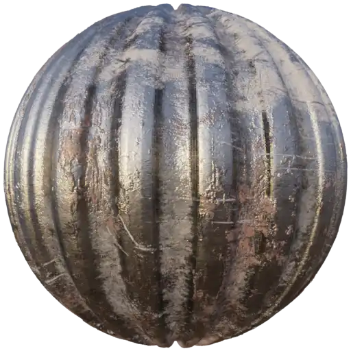

|

**This material is contained in the following Exapacks:**

    - XTRPbr_05k_Vol_001

    - XTRPbr_1k_Vol_001

    - XTRPbr_2k_Vol_001

    - XTRPbr_4k_Vol_003

------------------------------------------------------------------------------------------------------------------------

Corrugated Metal 010
********************

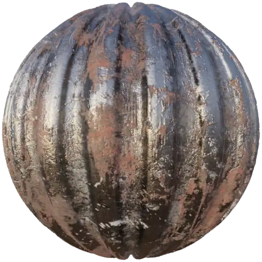

|

**This material is contained in the following Exapacks:**

    - XTRPbr_05k_Vol_001

    - XTRPbr_1k_Vol_001

    - XTRPbr_2k_Vol_001

    - XTRPbr_4k_Vol_003

------------------------------------------------------------------------------------------------------------------------

Metal Striped 001
*****************

|

**This material is contained in the following Exapacks:**

    - XTRPbr_05k_Vol_001

    - XTRPbr_1k_Vol_001

    - XTRPbr_2k_Vol_001

    - XTRPbr_4k_Vol_003

------------------------------------------------------------------------------------------------------------------------

Decals - Leaking (Category)
---------------------------

Leaking 001
***********

.. image:: _static/_images/material_list/decals_leaking/leaking_001/leaking_001.webp
    :width: 30%
    :align: center
    :alt: Leaking 001

|

**This material is contained in the following Exapacks:**

    - XTRPbr_05k_Vol_001

    - XTRPbr_1k_Vol_001

    - XTRPbr_2k_Vol_001

    - XTRPbr_4k_Vol_003

    - XTRPbr_8k_Vol_001

------------------------------------------------------------------------------------------------------------------------

Leaking 002
***********

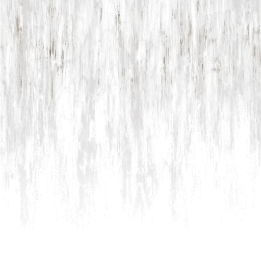

|

**This material is contained in the following Exapacks:**

    - XTRPbr_05k_Vol_001

    - XTRPbr_1k_Vol_001

    - XTRPbr_2k_Vol_001

    - XTRPbr_4k_Vol_003

    - XTRPbr_8k_Vol_001

------------------------------------------------------------------------------------------------------------------------

Leaking 003
***********

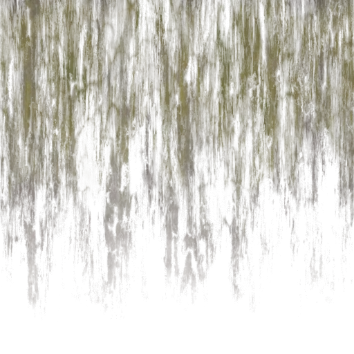

|

**This material is contained in the following Exapacks:**

    - XTRPbr_05k_Vol_001

    - XTRPbr_1k_Vol_001

    - XTRPbr_2k_Vol_001

    - XTRPbr_4k_Vol_003

    - XTRPbr_8k_Vol_001

------------------------------------------------------------------------------------------------------------------------

Leaking 004
***********

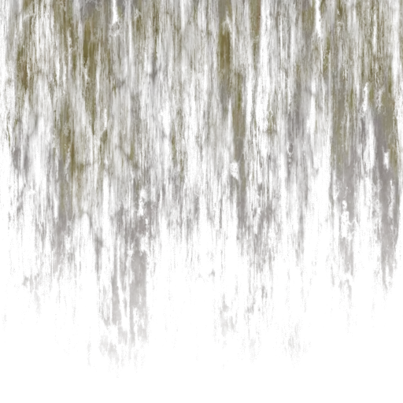

|

**This material is contained in the following Exapacks:**

    - XTRPbr_05k_Vol_001

    - XTRPbr_1k_Vol_001

    - XTRPbr_2k_Vol_001

    - XTRPbr_4k_Vol_003

    - XTRPbr_8k_Vol_001

------------------------------------------------------------------------------------------------------------------------

Leaking 005
***********

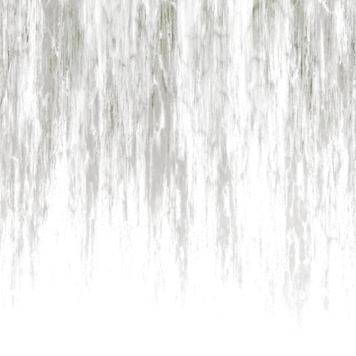

|

**This material is contained in the following Exapacks:**

    - XTRPbr_05k_Vol_001

    - XTRPbr_1k_Vol_001

    - XTRPbr_2k_Vol_001

    - XTRPbr_4k_Vol_003

    - XTRPbr_8k_Vol_001

------------------------------------------------------------------------------------------------------------------------

Leaking 006
***********

|

**This material is contained in the following Exapacks:**

    - XTRPbr_05k_Vol_001

    - XTRPbr_1k_Vol_001

    - XTRPbr_2k_Vol_001

    - XTRPbr_4k_Vol_003

    - XTRPbr_8k_Vol_001

------------------------------------------------------------------------------------------------------------------------

Decals - Leaves (Category)
--------------------------

Decal Leaves 001
****************

.. image:: _static/_images/material_list/decals_leaves/decal_leaves_001/decal_leaves_001.webp
    :width: 30%
    :align: center
    :alt: Decal Leaves 001

|

**This material is contained in the following Exapacks:**

    - XTRPbr_05k_Vol_001

    - XTRPbr_1k_Vol_001

    - XTRPbr_2k_Vol_001

    - XTRPbr_4k_Vol_003

    - XTRPbr_8k_Vol_001

------------------------------------------------------------------------------------------------------------------------

Decal Leaves 002
****************

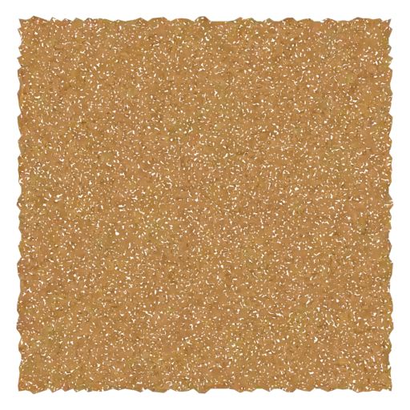

|

**This material is contained in the following Exapacks:**

    - XTRPbr_05k_Vol_001

    - XTRPbr_1k_Vol_001

    - XTRPbr_2k_Vol_001

    - XTRPbr_4k_Vol_003

------------------------------------------------------------------------------------------------------------------------

Decal Leaves 003
****************

.. image:: _static/_images/material_list/decals_leaves/decal_leaves_003/decal_leaves_003.webp
    :width: 30%
    :align: center
    :alt: Decal Leaves 003

|

**This material is contained in the following Exapacks:**

    - XTRPbr_05k_Vol_001

    - XTRPbr_1k_Vol_001

    - XTRPbr_2k_Vol_001

    - XTRPbr_4k_Vol_003

    - XTRPbr_8k_Vol_001

------------------------------------------------------------------------------------------------------------------------

Decal Leaves 004
****************

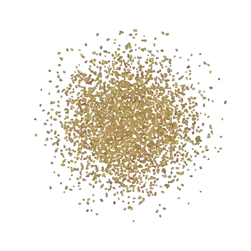

|

**This material is contained in the following Exapacks:**

    - XTRPbr_05k_Vol_001

    - XTRPbr_1k_Vol_001

    - XTRPbr_2k_Vol_001

    - XTRPbr_4k_Vol_003

    - XTRPbr_8k_Vol_001

------------------------------------------------------------------------------------------------------------------------

Decal Leaves 005
****************

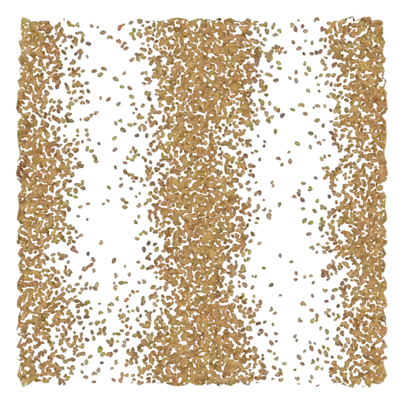

|

**This material is contained in the following Exapacks:**

    - XTRPbr_05k_Vol_001

    - XTRPbr_1k_Vol_001

    - XTRPbr_2k_Vol_001

    - XTRPbr_4k_Vol_003

    - XTRPbr_8k_Vol_001

------------------------------------------------------------------------------------------------------------------------

Decal Leaves 006
****************

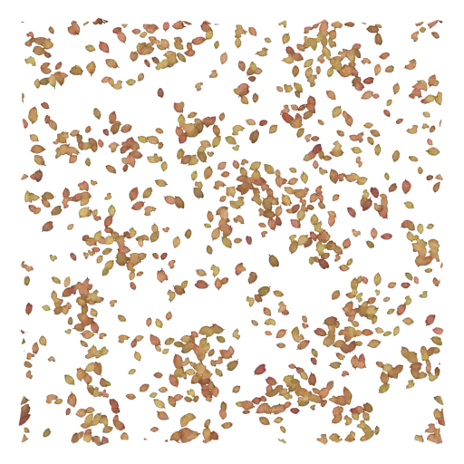

|

**This material is contained in the following Exapacks:**

    - XTRPbr_05k_Vol_001

    - XTRPbr_1k_Vol_001

    - XTRPbr_2k_Vol_001

    - XTRPbr_4k_Vol_003

    - XTRPbr_8k_Vol_001

------------------------------------------------------------------------------------------------------------------------

Decal Leaves 007
****************

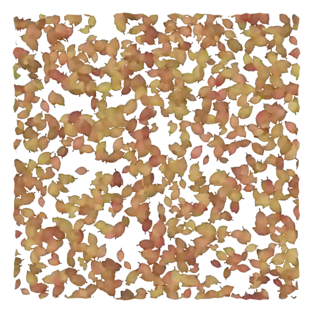

|

**This material is contained in the following Exapacks:**

    - XTRPbr_05k_Vol_001

    - XTRPbr_1k_Vol_001

    - XTRPbr_2k_Vol_001

    - XTRPbr_4k_Vol_003

    - XTRPbr_8k_Vol_001

------------------------------------------------------------------------------------------------------------------------

Decals - Road (Category)
------------------------

Asphalt Patch 01
****************

.. image:: _static/_images/material_list/decals_road/asphalt_patch_01/asphalt_patch_01.webp
    :width: 30%
    :align: center
    :alt: Asphalt Patch 01

|

**This material is contained in the following Exapacks:**

    - XTRPbr_05k_Vol_001

    - XTRPbr_1k_Vol_001

    - XTRPbr_2k_Vol_001

    - XTRPbr_4k_Vol_003

------------------------------------------------------------------------------------------------------------------------

Asphalt Patch 02
****************

.. image:: _static/_images/material_list/decals_road/asphalt_patch_02/asphalt_patch_02.webp
    :width: 30%
    :align: center
    :alt: Asphalt Patch 02

|

**This material is contained in the following Exapacks:**

    - XTRPbr_05k_Vol_001

    - XTRPbr_1k_Vol_001

    - XTRPbr_2k_Vol_001

    - XTRPbr_4k_Vol_003

------------------------------------------------------------------------------------------------------------------------

Asphalt Patch 03
****************

.. image:: _static/_images/material_list/decals_road/asphalt_patch_03/asphalt_patch_03.webp
    :width: 30%
    :align: center
    :alt: Asphalt Patch 03

|

**This material is contained in the following Exapacks:**

    - XTRPbr_05k_Vol_001

    - XTRPbr_1k_Vol_001

    - XTRPbr_2k_Vol_001

    - XTRPbr_4k_Vol_003

------------------------------------------------------------------------------------------------------------------------

Asphalt Patch 04
****************

.. image:: _static/_images/material_list/decals_road/asphalt_patch_04/asphalt_patch_04.webp
    :width: 30%
    :align: center
    :alt: Asphalt Patch 04

|

**This material is contained in the following Exapacks:**

    - XTRPbr_05k_Vol_001

    - XTRPbr_1k_Vol_001

    - XTRPbr_2k_Vol_001

    - XTRPbr_4k_Vol_003

------------------------------------------------------------------------------------------------------------------------

Asphalt Patch 05
****************

.. image:: _static/_images/material_list/decals_road/asphalt_patch_05/asphalt_patch_05.webp
    :width: 30%
    :align: center
    :alt: Asphalt Patch 05

|

**This material is contained in the following Exapacks:**

    - XTRPbr_05k_Vol_001

    - XTRPbr_1k_Vol_001

    - XTRPbr_2k_Vol_001

    - XTRPbr_4k_Vol_003

------------------------------------------------------------------------------------------------------------------------

Asphalt Patch 06
****************

.. image:: _static/_images/material_list/decals_road/asphalt_patch_06/asphalt_patch_06.webp
    :width: 30%
    :align: center
    :alt: Asphalt Patch 06

|

**This material is contained in the following Exapacks:**

    - XTRPbr_05k_Vol_001

    - XTRPbr_1k_Vol_001

    - XTRPbr_2k_Vol_001

    - XTRPbr_4k_Vol_003

------------------------------------------------------------------------------------------------------------------------

Asphalt Patch 07
****************

.. image:: _static/_images/material_list/decals_road/asphalt_patch_07/asphalt_patch_07.webp
    :width: 30%
    :align: center
    :alt: Asphalt Patch 07

|

**This material is contained in the following Exapacks:**

    - XTRPbr_05k_Vol_001

    - XTRPbr_1k_Vol_001

    - XTRPbr_2k_Vol_001

    - XTRPbr_4k_Vol_003

------------------------------------------------------------------------------------------------------------------------

Manhole 001
***********

.. image:: _static/_images/material_list/decals_road/manhole_001/manhole_001.webp
    :width: 30%
    :align: center
    :alt: Manhole 001

|

**This material is contained in the following Exapacks:**

    - XTRPbr_05k_Vol_001

    - XTRPbr_1k_Vol_001

    - XTRPbr_2k_Vol_001

    - XTRPbr_4k_Vol_003

------------------------------------------------------------------------------------------------------------------------

Manhole 002
***********

.. image:: _static/_images/material_list/decals_road/manhole_002/manhole_002.webp
    :width: 30%
    :align: center
    :alt: Manhole 002

|

**This material is contained in the following Exapacks:**

    - XTRPbr_05k_Vol_001

    - XTRPbr_1k_Vol_001

    - XTRPbr_2k_Vol_001

    - XTRPbr_4k_Vol_003

    - XTRPbr_8k_Vol_001

------------------------------------------------------------------------------------------------------------------------

Manhole 003
***********

.. image:: _static/_images/material_list/decals_road/manhole_003/manhole_003.webp
    :width: 30%
    :align: center
    :alt: Manhole 003

|

**This material is contained in the following Exapacks:**

    - XTRPbr_05k_Vol_001

    - XTRPbr_1k_Vol_001

    - XTRPbr_2k_Vol_001

    - XTRPbr_4k_Vol_003

    - XTRPbr_8k_Vol_001

------------------------------------------------------------------------------------------------------------------------

Manhole 004
***********

.. image:: _static/_images/material_list/decals_road/manhole_004/manhole_004.webp
    :width: 30%
    :align: center
    :alt: Manhole 004

|

**This material is contained in the following Exapacks:**

    - XTRPbr_05k_Vol_001

    - XTRPbr_1k_Vol_001

    - XTRPbr_2k_Vol_001

    - XTRPbr_4k_Vol_003

    - XTRPbr_8k_Vol_001

------------------------------------------------------------------------------------------------------------------------

Manhole 005
***********

.. image:: _static/_images/material_list/decals_road/manhole_005/manhole_005.webp
    :width: 30%
    :align: center
    :alt: Manhole 005

|

**This material is contained in the following Exapacks:**

    - XTRPbr_05k_Vol_001

    - XTRPbr_1k_Vol_001

    - XTRPbr_2k_Vol_001

    - XTRPbr_4k_Vol_003

    - XTRPbr_8k_Vol_001

------------------------------------------------------------------------------------------------------------------------

Manhole 006
***********

.. image:: _static/_images/material_list/decals_road/manhole_006/manhole_006.webp
    :width: 30%
    :align: center
    :alt: Manhole 006

|

**This material is contained in the following Exapacks:**

    - XTRPbr_05k_Vol_001

    - XTRPbr_1k_Vol_001

    - XTRPbr_2k_Vol_001

    - XTRPbr_4k_Vol_003

    - XTRPbr_8k_Vol_001

------------------------------------------------------------------------------------------------------------------------

Decals - Road Markings (Category)
---------------------------------

Markings Arrows 001
*******************

|

**This material is contained in the following Exapacks:**

    - XTRPbr_05k_Vol_001

    - XTRPbr_1k_Vol_001

    - XTRPbr_2k_Vol_001

    - XTRPbr_4k_Vol_003

    - XTRPbr_8k_Vol_001

------------------------------------------------------------------------------------------------------------------------

Markings Arrows 002
*******************

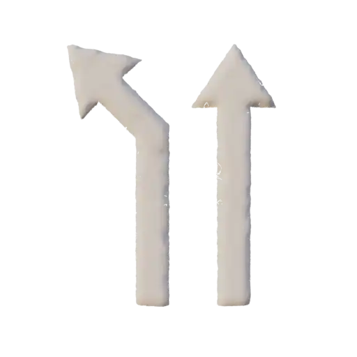

|

**This material is contained in the following Exapacks:**

    - XTRPbr_05k_Vol_001

    - XTRPbr_1k_Vol_001

    - XTRPbr_2k_Vol_001

    - XTRPbr_4k_Vol_003

------------------------------------------------------------------------------------------------------------------------

Markings Arrows 003
*******************

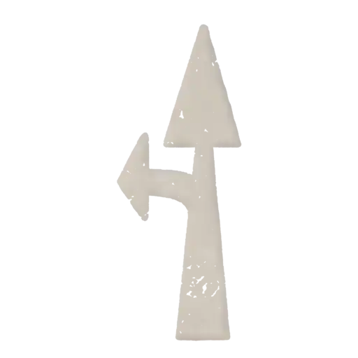

|

**This material is contained in the following Exapacks:**

    - XTRPbr_05k_Vol_001

    - XTRPbr_1k_Vol_001

    - XTRPbr_2k_Vol_001

    - XTRPbr_4k_Vol_003

    - XTRPbr_8k_Vol_001

------------------------------------------------------------------------------------------------------------------------

Markings Arrows 004
*******************

.. image:: _static/_images/material_list/decals_road_markings/markings_arrows_004/markings_arrows_004.webp
    :width: 30%
    :align: center
    :alt: Markings Arrows 004

|

**This material is contained in the following Exapacks:**

    - XTRPbr_05k_Vol_001

    - XTRPbr_1k_Vol_001

    - XTRPbr_2k_Vol_001

    - XTRPbr_4k_Vol_003

    - XTRPbr_8k_Vol_001

------------------------------------------------------------------------------------------------------------------------

Markings Pedestrian 01
**********************

|

**This material is contained in the following Exapacks:**

    - XTRPbr_05k_Vol_001

    - XTRPbr_1k_Vol_001

    - XTRPbr_2k_Vol_001

    - XTRPbr_4k_Vol_003

    - XTRPbr_8k_Vol_001

------------------------------------------------------------------------------------------------------------------------

Markings Pedestrian Crossing 01
*******************************

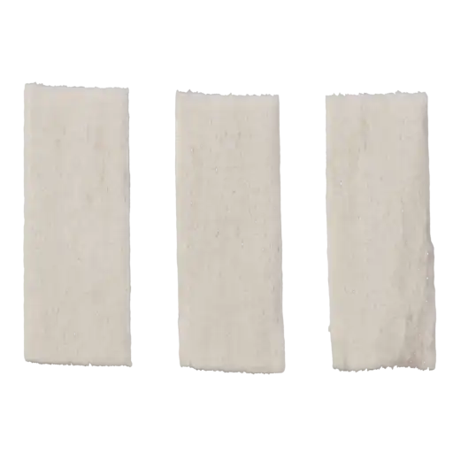

|

**This material is contained in the following Exapacks:**

    - XTRPbr_05k_Vol_001

    - XTRPbr_1k_Vol_001

    - XTRPbr_2k_Vol_001

    - XTRPbr_4k_Vol_003

------------------------------------------------------------------------------------------------------------------------

Markings Pedestrian Crossing 02
*******************************

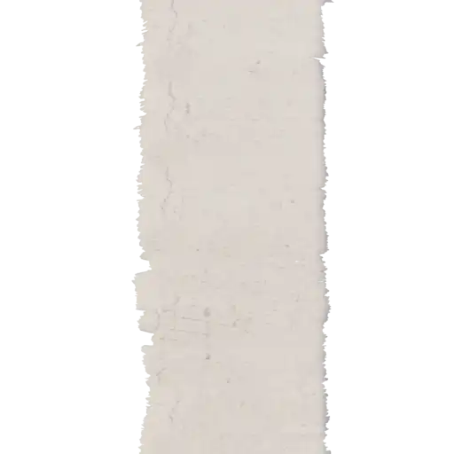

|

**This material is contained in the following Exapacks:**

    - XTRPbr_05k_Vol_001

    - XTRPbr_1k_Vol_001

    - XTRPbr_2k_Vol_001

    - XTRPbr_4k_Vol_003

    - XTRPbr_8k_Vol_001

------------------------------------------------------------------------------------------------------------------------

Markings Pedestrian Crossing 03
*******************************

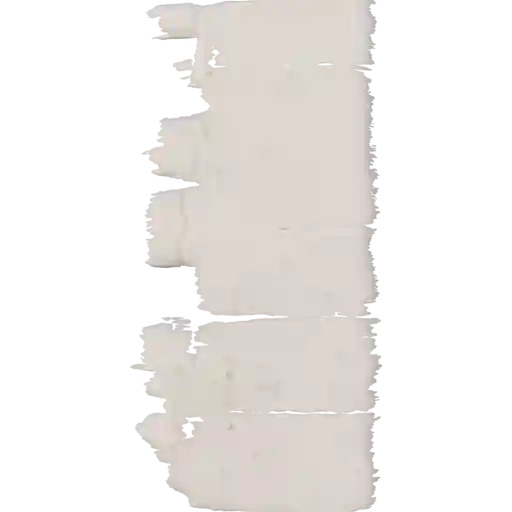

|

**This material is contained in the following Exapacks:**

    - XTRPbr_05k_Vol_001

    - XTRPbr_1k_Vol_001

    - XTRPbr_2k_Vol_001

    - XTRPbr_4k_Vol_003

    - XTRPbr_8k_Vol_001

------------------------------------------------------------------------------------------------------------------------

Markings Text 001
*****************

|

**This material is contained in the following Exapacks:**

    - XTRPbr_05k_Vol_001

    - XTRPbr_1k_Vol_001

    - XTRPbr_2k_Vol_001

    - XTRPbr_4k_Vol_003

------------------------------------------------------------------------------------------------------------------------

Markings Text 002
*****************

|

**This material is contained in the following Exapacks:**

    - XTRPbr_05k_Vol_001

    - XTRPbr_1k_Vol_001

    - XTRPbr_2k_Vol_001

    - XTRPbr_4k_Vol_003

------------------------------------------------------------------------------------------------------------------------

Markings Vehicles 001
*********************

|

**This material is contained in the following Exapacks:**

    - XTRPbr_05k_Vol_001

    - XTRPbr_1k_Vol_001

    - XTRPbr_2k_Vol_001

    - XTRPbr_4k_Vol_003

    - XTRPbr_8k_Vol_001

------------------------------------------------------------------------------------------------------------------------

Markings Vehicles 002
*********************

|

**This material is contained in the following Exapacks:**

    - XTRPbr_05k_Vol_001

    - XTRPbr_1k_Vol_001

    - XTRPbr_2k_Vol_001

    - XTRPbr_4k_Vol_003

    - XTRPbr_8k_Vol_001

------------------------------------------------------------------------------------------------------------------------

Markings Vehicles 003
*********************

.. image:: _static/_images/material_list/decals_road_markings/markings_vehicles_003/markings_vehicles_003.webp
    :width: 30%
    :align: center
    :alt: Markings Vehicles 003

|

**This material is contained in the following Exapacks:**

    - XTRPbr_05k_Vol_001

    - XTRPbr_1k_Vol_001

    - XTRPbr_2k_Vol_001

    - XTRPbr_4k_Vol_003

------------------------------------------------------------------------------------------------------------------------

Markings Vehicles 004
*********************

|

**This material is contained in the following Exapacks:**

    - XTRPbr_05k_Vol_001

    - XTRPbr_1k_Vol_001

    - XTRPbr_2k_Vol_001

    - XTRPbr_4k_Vol_003

    - XTRPbr_8k_Vol_001

------------------------------------------------------------------------------------------------------------------------

Markings Vehicles 005
*********************

|

**This material is contained in the following Exapacks:**

    - XTRPbr_05k_Vol_001

    - XTRPbr_1k_Vol_001

    - XTRPbr_2k_Vol_001

    - XTRPbr_4k_Vol_003

    - XTRPbr_8k_Vol_001

------------------------------------------------------------------------------------------------------------------------

Markings Wheelchair 01
**********************

|

**This material is contained in the following Exapacks:**

    - XTRPbr_05k_Vol_001

    - XTRPbr_1k_Vol_001

    - XTRPbr_2k_Vol_001

    - XTRPbr_4k_Vol_003

------------------------------------------------------------------------------------------------------------------------

Markings Yield Line 01
**********************

|

**This material is contained in the following Exapacks:**

    - XTRPbr_05k_Vol_001

    - XTRPbr_1k_Vol_001

    - XTRPbr_2k_Vol_001

    - XTRPbr_4k_Vol_003

------------------------------------------------------------------------------------------------------------------------

Road Lines 001
**************

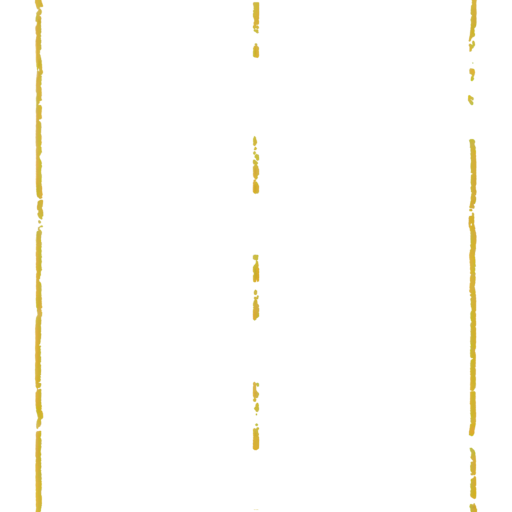

|

**This material is contained in the following Exapacks:**

    - XTRPbr_05k_Vol_001

    - XTRPbr_1k_Vol_001

    - XTRPbr_2k_Vol_001

    - XTRPbr_4k_Vol_003

    - XTRPbr_8k_Vol_001

------------------------------------------------------------------------------------------------------------------------

Road Lines 002
**************

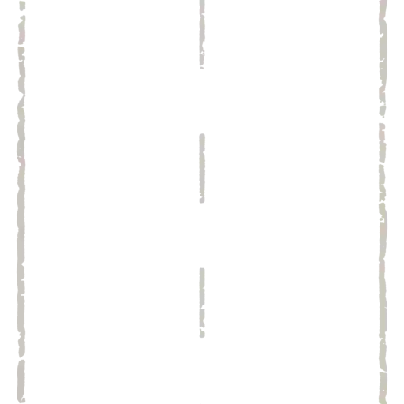

|

**This material is contained in the following Exapacks:**

    - XTRPbr_05k_Vol_001

    - XTRPbr_1k_Vol_001

    - XTRPbr_2k_Vol_001

    - XTRPbr_4k_Vol_003

    - XTRPbr_8k_Vol_001

------------------------------------------------------------------------------------------------------------------------

Road Lines 003
**************

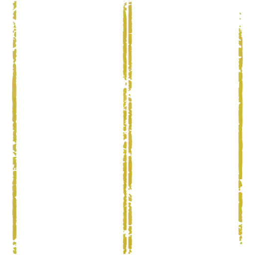

|

**This material is contained in the following Exapacks:**

    - XTRPbr_05k_Vol_001

    - XTRPbr_1k_Vol_001

    - XTRPbr_2k_Vol_001

    - XTRPbr_4k_Vol_003

    - XTRPbr_8k_Vol_001

------------------------------------------------------------------------------------------------------------------------

Road Lines 004
**************

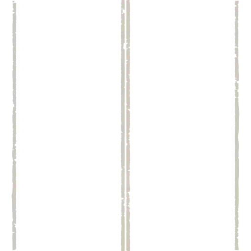

|

**This material is contained in the following Exapacks:**

    - XTRPbr_05k_Vol_001

    - XTRPbr_1k_Vol_001

    - XTRPbr_2k_Vol_001

    - XTRPbr_4k_Vol_003

    - XTRPbr_8k_Vol_001

------------------------------------------------------------------------------------------------------------------------

Road Lines 005
**************

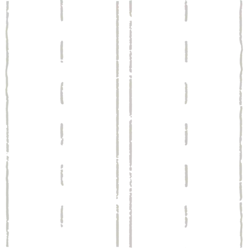

|

**This material is contained in the following Exapacks:**

    - XTRPbr_05k_Vol_001

    - XTRPbr_1k_Vol_001

    - XTRPbr_2k_Vol_001

    - XTRPbr_4k_Vol_003

    - XTRPbr_8k_Vol_001

------------------------------------------------------------------------------------------------------------------------

Road Lines 006
**************

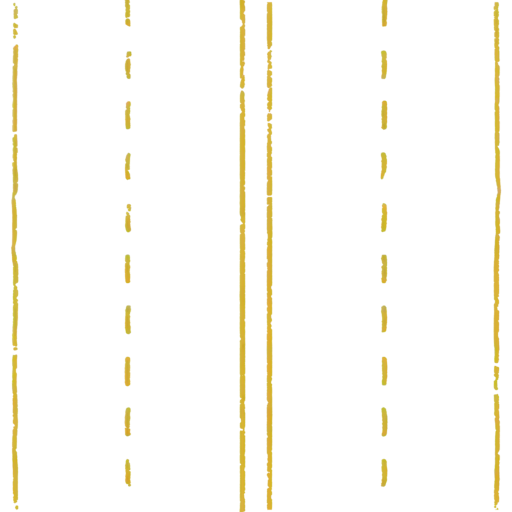

|

**This material is contained in the following Exapacks:**

    - XTRPbr_05k_Vol_001

    - XTRPbr_1k_Vol_001

    - XTRPbr_2k_Vol_001

    - XTRPbr_4k_Vol_003

    - XTRPbr_8k_Vol_001

------------------------------------------------------------------------------------------------------------------------

Electronics - Chip (Category)
-----------------------------

Chip 001
********

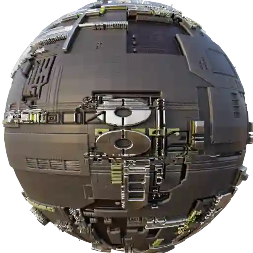

|

**This material is contained in the following Exapacks:**

    - XTRPbr_05k_Vol_001

    - XTRPbr_1k_Vol_001

    - XTRPbr_2k_Vol_001

    - XTRPbr_4k_Vol_001

------------------------------------------------------------------------------------------------------------------------

Chip 002
********

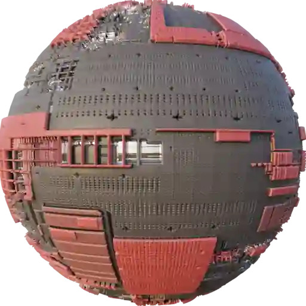

|

**This material is contained in the following Exapacks:**

    - XTRPbr_05k_Vol_001

    - XTRPbr_1k_Vol_001

    - XTRPbr_2k_Vol_001

    - XTRPbr_4k_Vol_001

------------------------------------------------------------------------------------------------------------------------

Chip 003
********

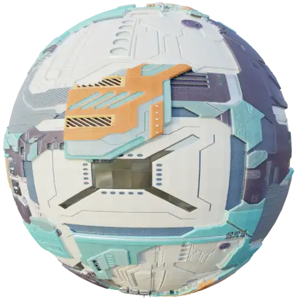

|

**This material is contained in the following Exapacks:**

    - XTRPbr_05k_Vol_001

    - XTRPbr_1k_Vol_001

    - XTRPbr_2k_Vol_001

    - XTRPbr_4k_Vol_001

------------------------------------------------------------------------------------------------------------------------

Chip 004
********

.. image:: _static/_images/material_list/electronics_chip/chip_004/chip_004.webp
    :width: 30%
    :align: center
    :alt: Chip 004

|

**This material is contained in the following Exapacks:**

    - XTRPbr_05k_Vol_001

    - XTRPbr_1k_Vol_001

    - XTRPbr_2k_Vol_001

    - XTRPbr_4k_Vol_001

------------------------------------------------------------------------------------------------------------------------

Chip 005
********

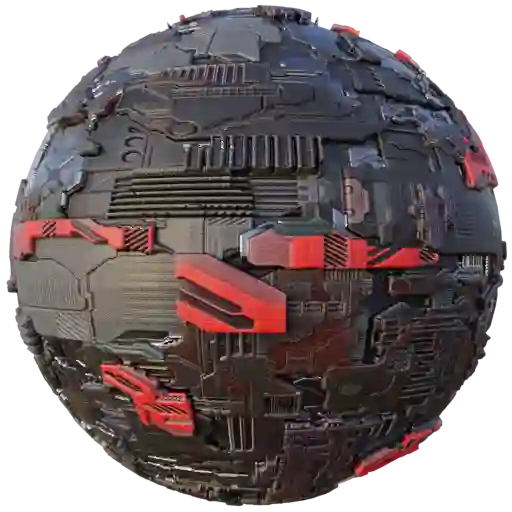

|

**This material is contained in the following Exapacks:**

    - XTRPbr_05k_Vol_001

    - XTRPbr_1k_Vol_001

    - XTRPbr_2k_Vol_001

    - XTRPbr_4k_Vol_001

------------------------------------------------------------------------------------------------------------------------

Chip 006
********

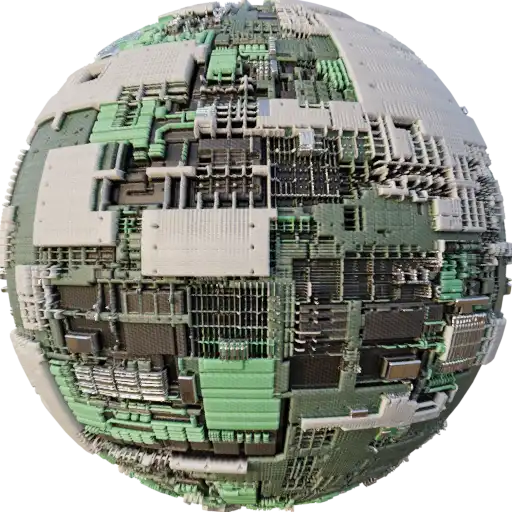

|

**This material is contained in the following Exapacks:**

    - XTRPbr_05k_Vol_001

    - XTRPbr_1k_Vol_001

    - XTRPbr_2k_Vol_001

    - XTRPbr_4k_Vol_001

------------------------------------------------------------------------------------------------------------------------

Chip 007
********

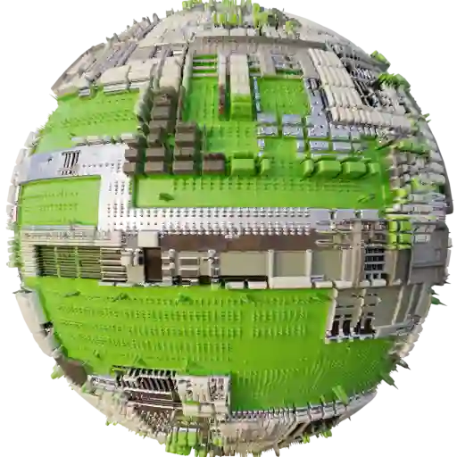

|

**This material is contained in the following Exapacks:**

    - XTRPbr_05k_Vol_001

    - XTRPbr_1k_Vol_001

    - XTRPbr_2k_Vol_001

    - XTRPbr_4k_Vol_001

------------------------------------------------------------------------------------------------------------------------

Energy (Category)
-----------------

Solar Panel 001
***************

|

**This material is contained in the following Exapacks:**

    - XTRPbr_05k_Vol_001

    - XTRPbr_1k_Vol_001

    - XTRPbr_2k_Vol_001

    - XTRPbr_4k_Vol_001

    - XTRPbr_8k_Vol_001

------------------------------------------------------------------------------------------------------------------------

Solar Panel 002
***************

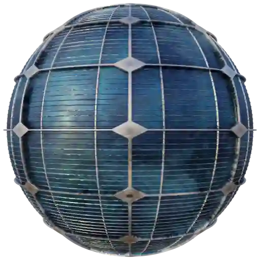

|

**This material is contained in the following Exapacks:**

    - XTRPbr_05k_Vol_001

    - XTRPbr_1k_Vol_001

    - XTRPbr_2k_Vol_001

    - XTRPbr_4k_Vol_001

    - XTRPbr_8k_Vol_001

------------------------------------------------------------------------------------------------------------------------

Solar Panel 003
***************

.. image:: _static/_images/material_list/energy/solar_panel_003/solar_panel_003.webp
    :width: 30%
    :align: center
    :alt: Solar Panel 003

|

**This material is contained in the following Exapacks:**

    - XTRPbr_05k_Vol_001

    - XTRPbr_1k_Vol_001

    - XTRPbr_2k_Vol_001

    - XTRPbr_4k_Vol_001

    - XTRPbr_8k_Vol_001

------------------------------------------------------------------------------------------------------------------------

Solar Panel 004
***************

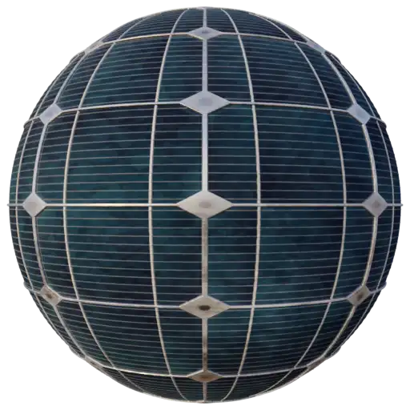

|

**This material is contained in the following Exapacks:**

    - XTRPbr_05k_Vol_001

    - XTRPbr_1k_Vol_001

    - XTRPbr_2k_Vol_001

    - XTRPbr_4k_Vol_001

    - XTRPbr_8k_Vol_001

------------------------------------------------------------------------------------------------------------------------

Fabric (Category)
-----------------

Beige Fabric 001
****************

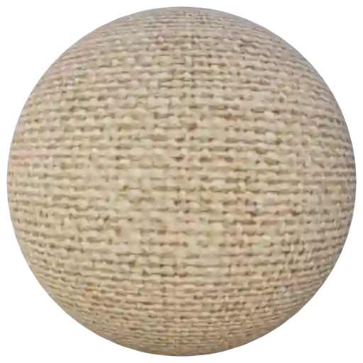

|

**This material is contained in the following Exapacks:**

    - XTRPbr_05k_Vol_001

    - XTRPbr_1k_Vol_001

    - XTRPbr_2k_Vol_001

------------------------------------------------------------------------------------------------------------------------

Beige Fabric 002
****************

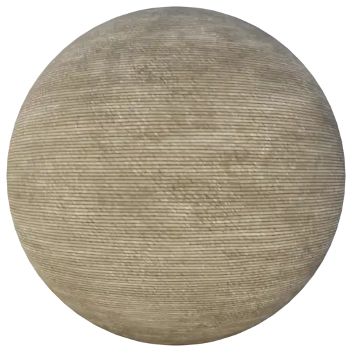

|

**This material is contained in the following Exapacks:**

    - XTRPbr_05k_Vol_001

    - XTRPbr_1k_Vol_001

    - XTRPbr_2k_Vol_001

    - XTRPbr_4k_Vol_001

    - XTRPbr_8k_Vol_001

------------------------------------------------------------------------------------------------------------------------

Blue Frabric 001
****************

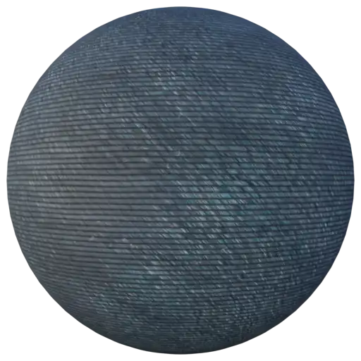

|

**This material is contained in the following Exapacks:**

    - XTRPbr_05k_Vol_001

    - XTRPbr_1k_Vol_001

    - XTRPbr_2k_Vol_001

    - XTRPbr_4k_Vol_001

    - XTRPbr_8k_Vol_001

------------------------------------------------------------------------------------------------------------------------

Blue Frabric 002
****************

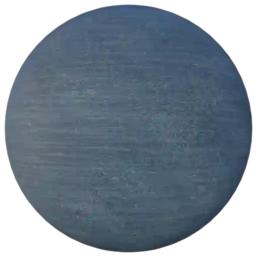

|

**This material is contained in the following Exapacks:**

    - XTRPbr_05k_Vol_001

    - XTRPbr_1k_Vol_001

    - XTRPbr_2k_Vol_001

    - XTRPbr_4k_Vol_001

    - XTRPbr_8k_Vol_030

------------------------------------------------------------------------------------------------------------------------

Blue Frabric 003
****************

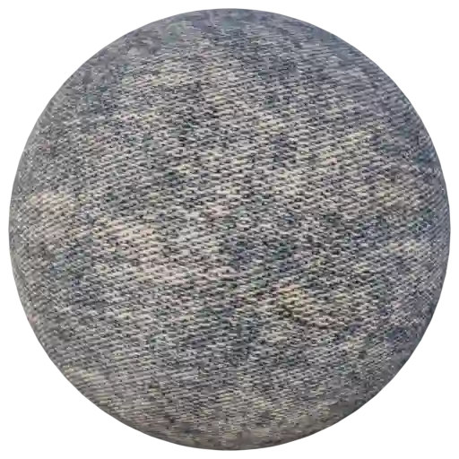

|

**This material is contained in the following Exapacks:**

    - XTRPbr_05k_Vol_001

    - XTRPbr_1k_Vol_001

    - XTRPbr_2k_Vol_001

    - XTRPbr_4k_Vol_001

------------------------------------------------------------------------------------------------------------------------

Blue Frabric 004
****************

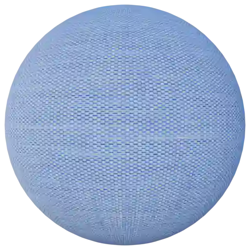

|

**This material is contained in the following Exapacks:**

    - XTRPbr_05k_Vol_001

    - XTRPbr_1k_Vol_001

    - XTRPbr_2k_Vol_001

    - XTRPbr_4k_Vol_001

    - XTRPbr_8k_Vol_030

------------------------------------------------------------------------------------------------------------------------

Blue Frabric 005
****************

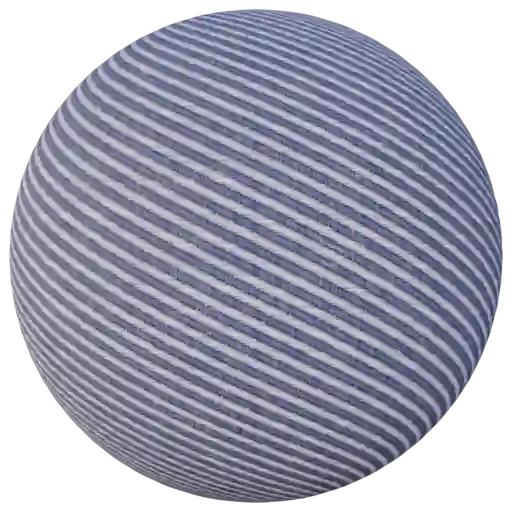

|

**This material is contained in the following Exapacks:**

    - XTRPbr_05k_Vol_001

    - XTRPbr_1k_Vol_001

    - XTRPbr_2k_Vol_001

    - XTRPbr_4k_Vol_001

------------------------------------------------------------------------------------------------------------------------

Blue Frabric 006
****************

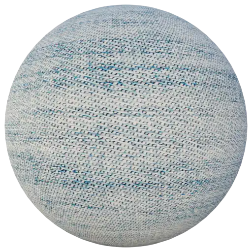

|

**This material is contained in the following Exapacks:**

    - XTRPbr_05k_Vol_001

    - XTRPbr_1k_Vol_001

    - XTRPbr_2k_Vol_001

    - XTRPbr_4k_Vol_001

------------------------------------------------------------------------------------------------------------------------

Blue Rag 01
***********

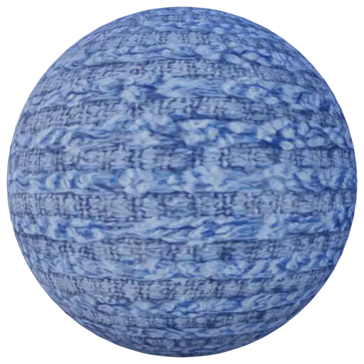

|

**This material is contained in the following Exapacks:**

    - XTRPbr_05k_Vol_001

    - XTRPbr_1k_Vol_001

    - XTRPbr_2k_Vol_001

    - XTRPbr_4k_Vol_001

------------------------------------------------------------------------------------------------------------------------

Brown Fabric 001
****************

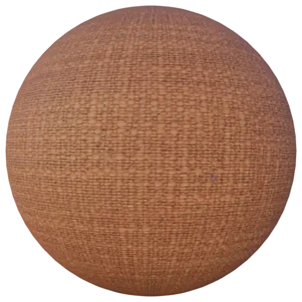

|

**This material is contained in the following Exapacks:**

    - XTRPbr_05k_Vol_001

    - XTRPbr_1k_Vol_001

    - XTRPbr_2k_Vol_001

    - XTRPbr_4k_Vol_001

------------------------------------------------------------------------------------------------------------------------

Brown Fabric 002
****************

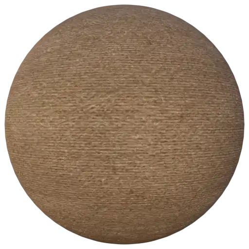

|

**This material is contained in the following Exapacks:**

    - XTRPbr_05k_Vol_001

    - XTRPbr_1k_Vol_001

    - XTRPbr_2k_Vol_001

    - XTRPbr_4k_Vol_001

------------------------------------------------------------------------------------------------------------------------

Brown Fabric 003
****************

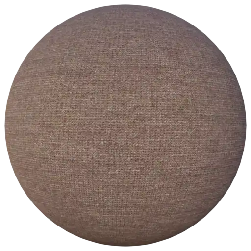

|

**This material is contained in the following Exapacks:**

    - XTRPbr_05k_Vol_001

    - XTRPbr_1k_Vol_001

    - XTRPbr_2k_Vol_001

    - XTRPbr_4k_Vol_001

------------------------------------------------------------------------------------------------------------------------

Brown Fabric 004
****************

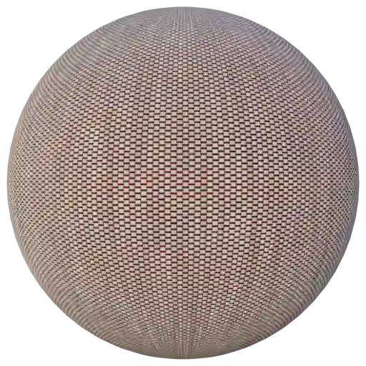

|

**This material is contained in the following Exapacks:**

    - XTRPbr_05k_Vol_001

    - XTRPbr_1k_Vol_001

    - XTRPbr_2k_Vol_001

    - XTRPbr_4k_Vol_001

    - XTRPbr_8k_Vol_030

------------------------------------------------------------------------------------------------------------------------

Dark Fabric 001
***************

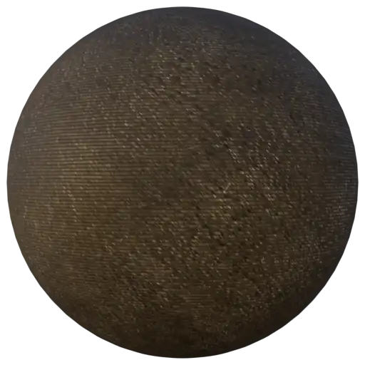

|

**This material is contained in the following Exapacks:**

    - XTRPbr_05k_Vol_001

    - XTRPbr_1k_Vol_001

    - XTRPbr_2k_Vol_001

    - XTRPbr_4k_Vol_001

    - XTRPbr_8k_Vol_030

------------------------------------------------------------------------------------------------------------------------

Dark Fabric 002
***************

.. image:: _static/_images/material_list/fabric/dark_fabric_002/dark_fabric_002.webp
    :width: 30%
    :align: center
    :alt: Dark Fabric 002

|

**This material is contained in the following Exapacks:**

    - XTRPbr_05k_Vol_001

    - XTRPbr_1k_Vol_001

    - XTRPbr_2k_Vol_001

    - XTRPbr_4k_Vol_001

    - XTRPbr_8k_Vol_030

------------------------------------------------------------------------------------------------------------------------

Dark Fabric 003
***************

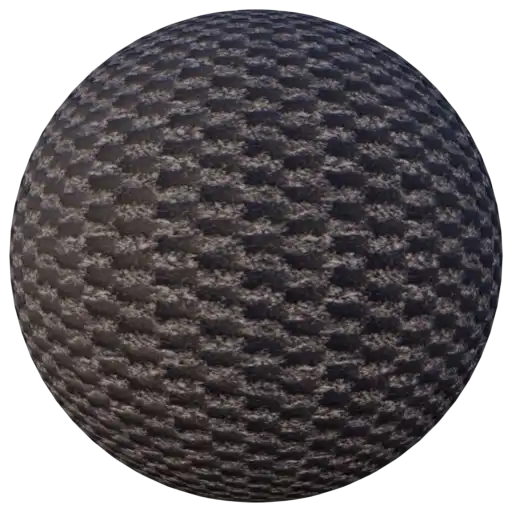

|

**This material is contained in the following Exapacks:**

    - XTRPbr_05k_Vol_001

    - XTRPbr_1k_Vol_001

    - XTRPbr_2k_Vol_001

    - XTRPbr_4k_Vol_001

------------------------------------------------------------------------------------------------------------------------

Dark Fabric 004
***************

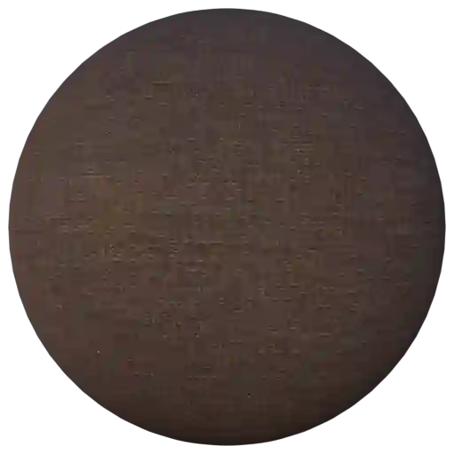

|

**This material is contained in the following Exapacks:**

    - XTRPbr_05k_Vol_001

    - XTRPbr_1k_Vol_001

    - XTRPbr_2k_Vol_001

    - XTRPbr_4k_Vol_001

------------------------------------------------------------------------------------------------------------------------

Green Fabric 001
****************

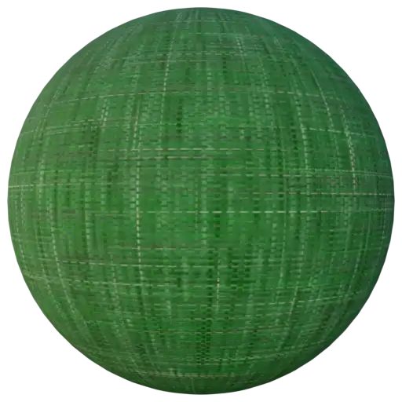

|

**This material is contained in the following Exapacks:**

    - XTRPbr_05k_Vol_001

    - XTRPbr_1k_Vol_001

    - XTRPbr_2k_Vol_001

    - XTRPbr_4k_Vol_001

    - XTRPbr_8k_Vol_030

------------------------------------------------------------------------------------------------------------------------

Green Fabric 002
****************

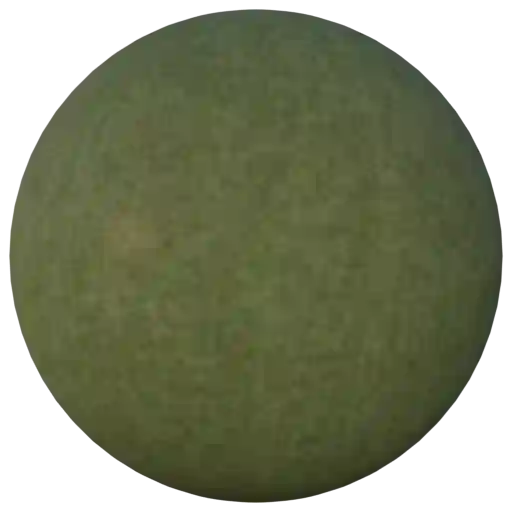

|

**This material is contained in the following Exapacks:**

    - XTRPbr_05k_Vol_001

    - XTRPbr_1k_Vol_001

    - XTRPbr_2k_Vol_001

    - XTRPbr_4k_Vol_001

------------------------------------------------------------------------------------------------------------------------

Green Fabric 003
****************

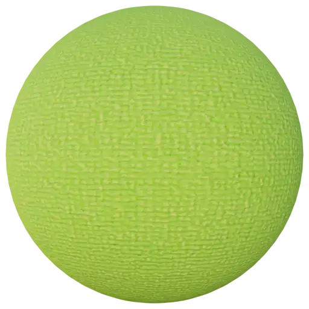

|

**This material is contained in the following Exapacks:**

    - XTRPbr_05k_Vol_001

    - XTRPbr_1k_Vol_001

    - XTRPbr_2k_Vol_001

    - XTRPbr_4k_Vol_001

    - XTRPbr_8k_Vol_030

------------------------------------------------------------------------------------------------------------------------

Green Fabric 004
****************

.. image:: _static/_images/material_list/fabric/green_fabric_004/green_fabric_004.webp
    :width: 30%
    :align: center
    :alt: Green Fabric 004

|

**This material is contained in the following Exapacks:**

    - XTRPbr_05k_Vol_001

    - XTRPbr_1k_Vol_001

    - XTRPbr_2k_Vol_001

------------------------------------------------------------------------------------------------------------------------

Grey Fabric 001
***************

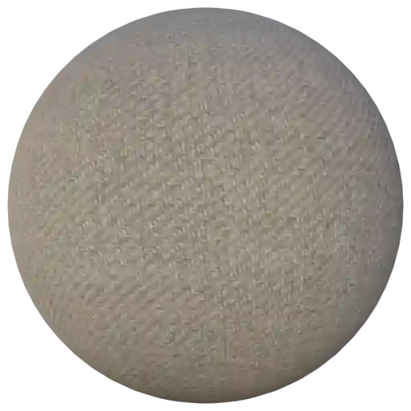

|

**This material is contained in the following Exapacks:**

    - XTRPbr_05k_Vol_001

    - XTRPbr_1k_Vol_001

    - XTRPbr_2k_Vol_001

    - XTRPbr_4k_Vol_001

------------------------------------------------------------------------------------------------------------------------

Grey Fabric 002
***************

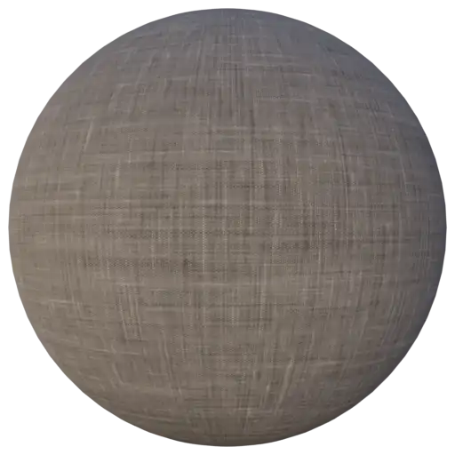

|

**This material is contained in the following Exapacks:**

    - XTRPbr_05k_Vol_001

    - XTRPbr_1k_Vol_001

    - XTRPbr_2k_Vol_001

    - XTRPbr_4k_Vol_001

    - XTRPbr_8k_Vol_030

------------------------------------------------------------------------------------------------------------------------

Grey Fabric 003
***************

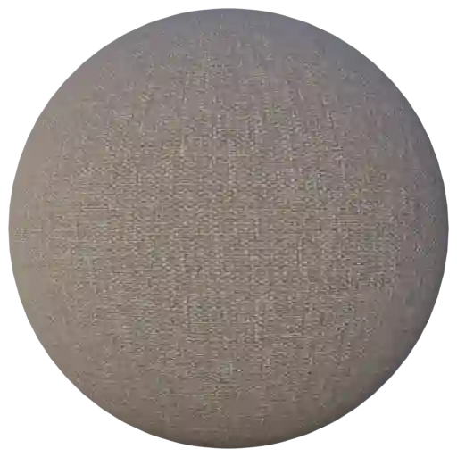

|

**This material is contained in the following Exapacks:**

    - XTRPbr_05k_Vol_001

    - XTRPbr_1k_Vol_001

    - XTRPbr_2k_Vol_001

    - XTRPbr_4k_Vol_001

------------------------------------------------------------------------------------------------------------------------

Grey Fabric 004
***************

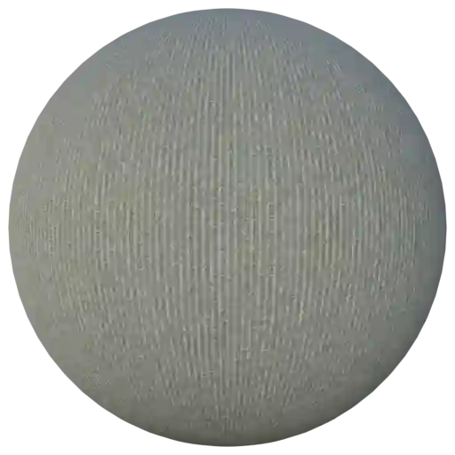

|

**This material is contained in the following Exapacks:**

    - XTRPbr_05k_Vol_001

    - XTRPbr_1k_Vol_001

    - XTRPbr_2k_Vol_001

    - XTRPbr_4k_Vol_001

------------------------------------------------------------------------------------------------------------------------

Grey Fabric 005
***************

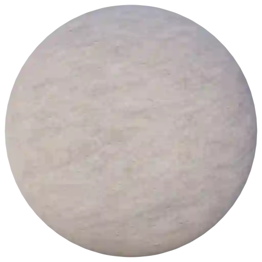

|

**This material is contained in the following Exapacks:**

    - XTRPbr_05k_Vol_001

    - XTRPbr_1k_Vol_001

    - XTRPbr_2k_Vol_001

    - XTRPbr_4k_Vol_001

    - XTRPbr_8k_Vol_030

------------------------------------------------------------------------------------------------------------------------

Grey Fabric 006
***************

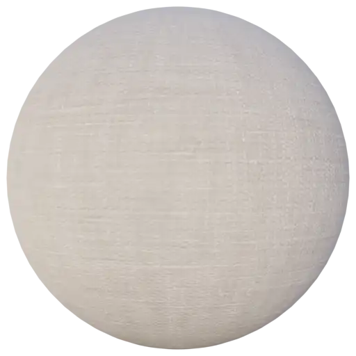

|

**This material is contained in the following Exapacks:**

    - XTRPbr_05k_Vol_001

    - XTRPbr_1k_Vol_001

    - XTRPbr_2k_Vol_001

    - XTRPbr_4k_Vol_001

    - XTRPbr_8k_Vol_030

------------------------------------------------------------------------------------------------------------------------

Grey Fabric 007
***************

.. image:: _static/_images/material_list/fabric/grey_fabric_007/grey_fabric_007.webp
    :width: 30%
    :align: center
    :alt: Grey Fabric 007

|

**This material is contained in the following Exapacks:**

    - XTRPbr_05k_Vol_001

    - XTRPbr_1k_Vol_001

    - XTRPbr_2k_Vol_001

    - XTRPbr_4k_Vol_001

------------------------------------------------------------------------------------------------------------------------

Grey Fabric 008
***************

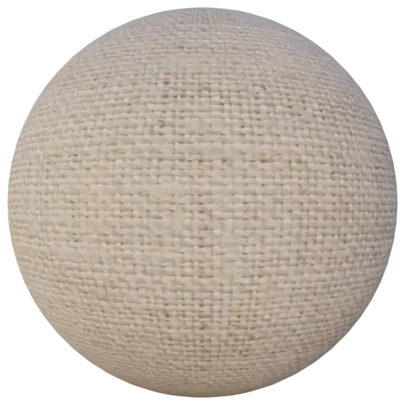

|

**This material is contained in the following Exapacks:**

    - XTRPbr_05k_Vol_001

    - XTRPbr_1k_Vol_001

    - XTRPbr_2k_Vol_001

    - XTRPbr_4k_Vol_001

------------------------------------------------------------------------------------------------------------------------

Grey Rag 01
***********

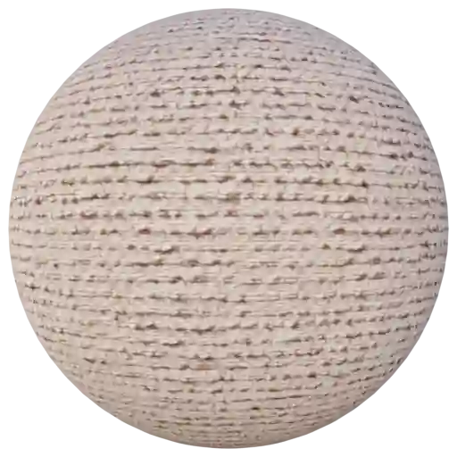

|

**This material is contained in the following Exapacks:**

    - XTRPbr_05k_Vol_001

    - XTRPbr_1k_Vol_001

    - XTRPbr_2k_Vol_001

    - XTRPbr_4k_Vol_001

------------------------------------------------------------------------------------------------------------------------

Merino Wool 01
**************

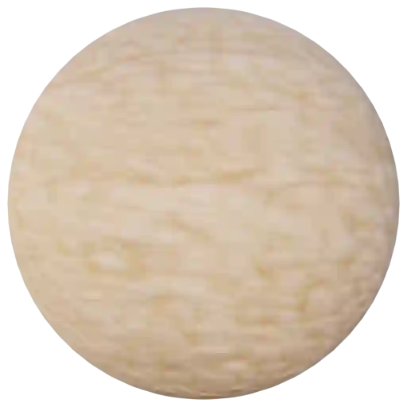

|

**This material is contained in the following Exapacks:**

    - XTRPbr_05k_Vol_001

    - XTRPbr_1k_Vol_001

    - XTRPbr_2k_Vol_001

    - XTRPbr_4k_Vol_001

------------------------------------------------------------------------------------------------------------------------

Orange Fabric 001
*****************

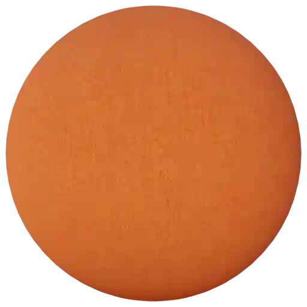

|

**This material is contained in the following Exapacks:**

    - XTRPbr_05k_Vol_001

    - XTRPbr_1k_Vol_001

    - XTRPbr_2k_Vol_001

    - XTRPbr_4k_Vol_001

------------------------------------------------------------------------------------------------------------------------

Paint Felt 01
*************

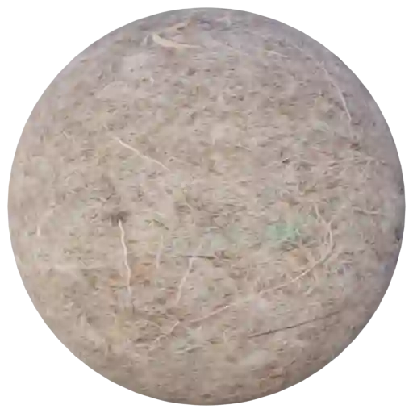

|

**This material is contained in the following Exapacks:**

    - XTRPbr_05k_Vol_001

    - XTRPbr_1k_Vol_001

    - XTRPbr_2k_Vol_001

    - XTRPbr_4k_Vol_001

    - XTRPbr_8k_Vol_030

------------------------------------------------------------------------------------------------------------------------

Red Fabric 002
**************

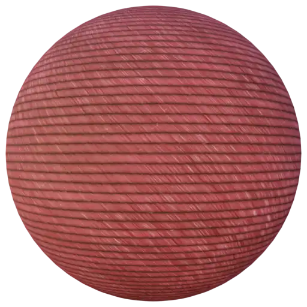

|

**This material is contained in the following Exapacks:**

    - XTRPbr_05k_Vol_001

    - XTRPbr_1k_Vol_001

    - XTRPbr_2k_Vol_001

    - XTRPbr_4k_Vol_001

    - XTRPbr_8k_Vol_030

------------------------------------------------------------------------------------------------------------------------

Red Fabric 005
**************

|

**This material is contained in the following Exapacks:**

    - XTRPbr_05k_Vol_001

    - XTRPbr_1k_Vol_001

    - XTRPbr_2k_Vol_001

    - XTRPbr_4k_Vol_001

------------------------------------------------------------------------------------------------------------------------

Red Fabric 006
**************

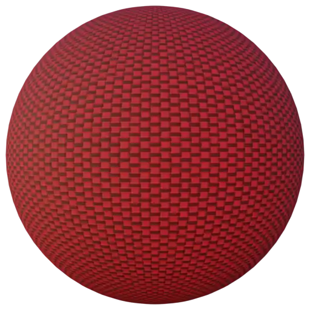

|

**This material is contained in the following Exapacks:**

    - XTRPbr_05k_Vol_001

    - XTRPbr_1k_Vol_001

    - XTRPbr_2k_Vol_001

    - XTRPbr_4k_Vol_001

------------------------------------------------------------------------------------------------------------------------

Red Fabric 007
**************

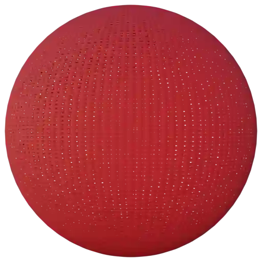

|

**This material is contained in the following Exapacks:**

    - XTRPbr_05k_Vol_001

    - XTRPbr_1k_Vol_001

    - XTRPbr_2k_Vol_001

    - XTRPbr_4k_Vol_001

------------------------------------------------------------------------------------------------------------------------

Red Fabric 008
**************

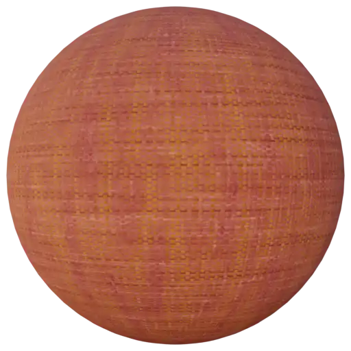

|

**This material is contained in the following Exapacks:**

    - XTRPbr_05k_Vol_001

    - XTRPbr_1k_Vol_001

    - XTRPbr_2k_Vol_001

    - XTRPbr_4k_Vol_001

    - XTRPbr_8k_Vol_030

------------------------------------------------------------------------------------------------------------------------

Red Fabric 009
**************

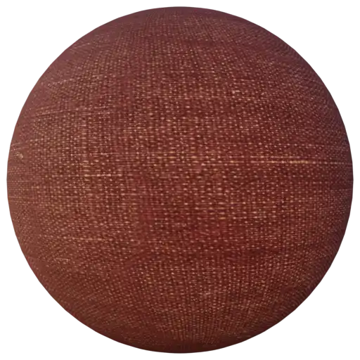

|

**This material is contained in the following Exapacks:**

    - XTRPbr_05k_Vol_001

    - XTRPbr_1k_Vol_001

    - XTRPbr_2k_Vol_001

    - XTRPbr_4k_Vol_001

    - XTRPbr_8k_Vol_030

------------------------------------------------------------------------------------------------------------------------

Red Fabric 010
**************

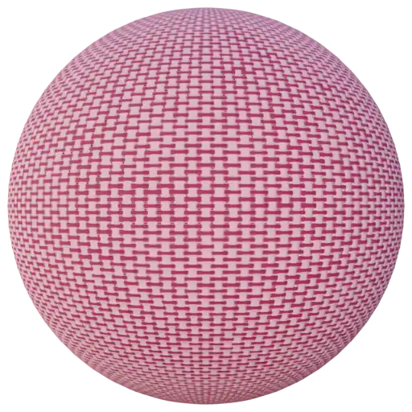

|

**This material is contained in the following Exapacks:**

    - XTRPbr_05k_Vol_001

    - XTRPbr_1k_Vol_001

    - XTRPbr_2k_Vol_001

    - XTRPbr_4k_Vol_001

------------------------------------------------------------------------------------------------------------------------

Red Fabric 011
**************

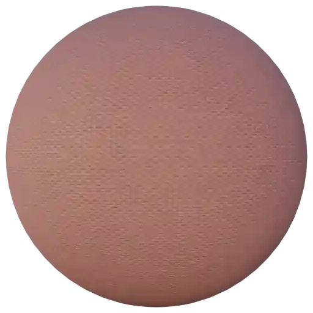

|

**This material is contained in the following Exapacks:**

    - XTRPbr_05k_Vol_001

    - XTRPbr_1k_Vol_001

    - XTRPbr_2k_Vol_001

    - XTRPbr_4k_Vol_001

------------------------------------------------------------------------------------------------------------------------

Red Fabric 012
**************

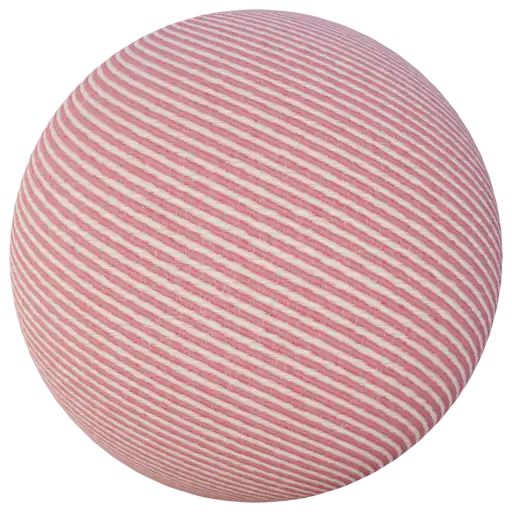

|

**This material is contained in the following Exapacks:**

    - XTRPbr_05k_Vol_001

    - XTRPbr_1k_Vol_001

    - XTRPbr_2k_Vol_001

    - XTRPbr_4k_Vol_001

------------------------------------------------------------------------------------------------------------------------

White Frabric 001
*****************

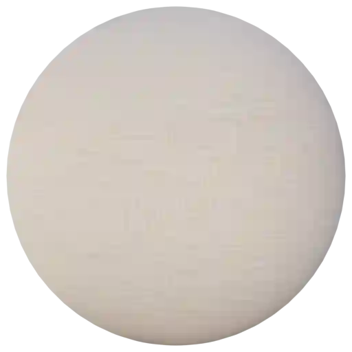

|

**This material is contained in the following Exapacks:**

    - XTRPbr_05k_Vol_001

    - XTRPbr_1k_Vol_001

    - XTRPbr_2k_Vol_001

    - XTRPbr_4k_Vol_001

    - XTRPbr_8k_Vol_030

------------------------------------------------------------------------------------------------------------------------

White Frabric 002
*****************

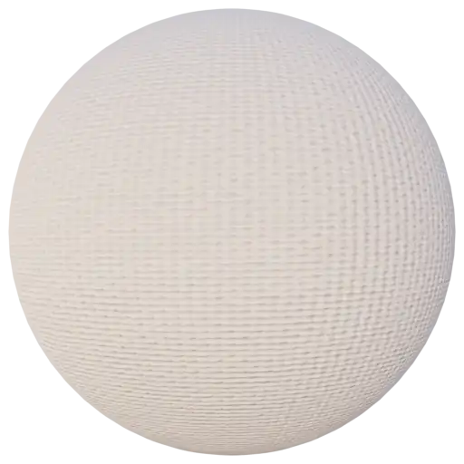

|

**This material is contained in the following Exapacks:**

    - XTRPbr_05k_Vol_001

    - XTRPbr_1k_Vol_001

    - XTRPbr_2k_Vol_001

    - XTRPbr_4k_Vol_001

------------------------------------------------------------------------------------------------------------------------

White Frabric 003
*****************

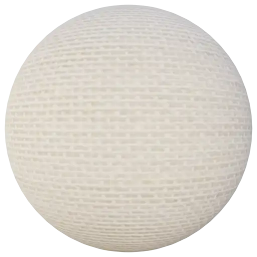

|

**This material is contained in the following Exapacks:**

    - XTRPbr_05k_Vol_001

    - XTRPbr_1k_Vol_001

    - XTRPbr_2k_Vol_001

    - XTRPbr_4k_Vol_001

------------------------------------------------------------------------------------------------------------------------

White Frabric 004
*****************

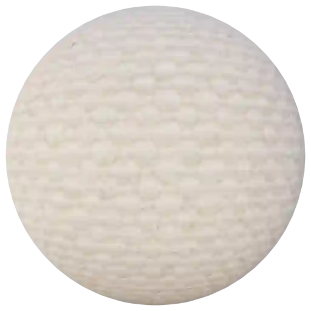

|

**This material is contained in the following Exapacks:**

    - XTRPbr_05k_Vol_001

    - XTRPbr_1k_Vol_001

    - XTRPbr_2k_Vol_001

------------------------------------------------------------------------------------------------------------------------

White Rag 01
************

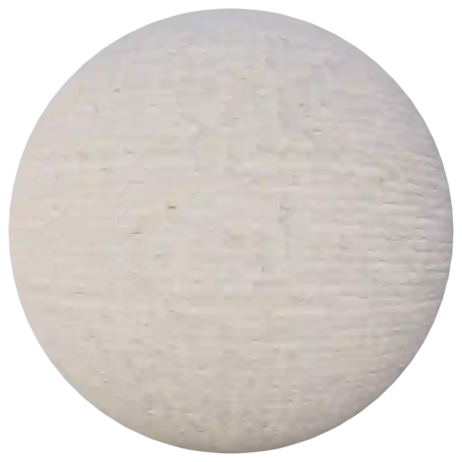

|

**This material is contained in the following Exapacks:**

    - XTRPbr_05k_Vol_001

    - XTRPbr_1k_Vol_001

    - XTRPbr_2k_Vol_001

    - XTRPbr_4k_Vol_001

    - XTRPbr_8k_Vol_030

------------------------------------------------------------------------------------------------------------------------

Yellow Fabric 001
*****************

.. image:: _static/_images/material_list/fabric/yellow_fabric_001/yellow_fabric_001.webp
    :width: 30%
    :align: center
    :alt: Yellow Fabric 001

|

**This material is contained in the following Exapacks:**

    - XTRPbr_05k_Vol_001

    - XTRPbr_1k_Vol_001

    - XTRPbr_2k_Vol_001

    - XTRPbr_4k_Vol_001

    - XTRPbr_8k_Vol_030

------------------------------------------------------------------------------------------------------------------------

Fabric - Carpet (Category)
--------------------------

Carpet 001
**********

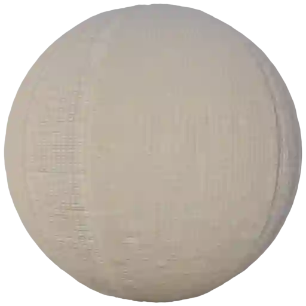

|

**This material is contained in the following Exapacks:**

    - XTRPbr_05k_Vol_001

    - XTRPbr_1k_Vol_001

    - XTRPbr_2k_Vol_001

    - XTRPbr_4k_Vol_001

    - XTRPbr_8k_Vol_030

------------------------------------------------------------------------------------------------------------------------

Carpet 002
**********

.. image:: _static/_images/material_list/fabric_carpet/carpet_002/carpet_002.webp
    :width: 30%
    :align: center
    :alt: Carpet 002

|

**This material is contained in the following Exapacks:**

    - XTRPbr_05k_Vol_001

    - XTRPbr_1k_Vol_001

    - XTRPbr_2k_Vol_001

    - XTRPbr_4k_Vol_001

    - XTRPbr_8k_Vol_030

------------------------------------------------------------------------------------------------------------------------

Carpet 003
**********

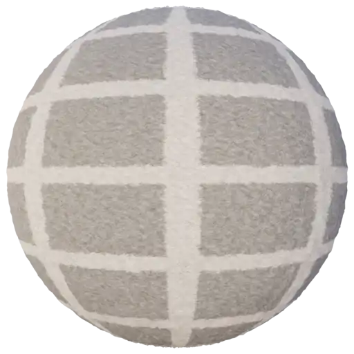

|

**This material is contained in the following Exapacks:**

    - XTRPbr_05k_Vol_001

    - XTRPbr_1k_Vol_001

    - XTRPbr_2k_Vol_001

    - XTRPbr_4k_Vol_001

    - XTRPbr_8k_Vol_030

------------------------------------------------------------------------------------------------------------------------

Carpet 004
**********

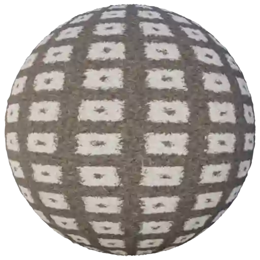

|

**This material is contained in the following Exapacks:**

    - XTRPbr_05k_Vol_001

    - XTRPbr_1k_Vol_001

    - XTRPbr_2k_Vol_001

    - XTRPbr_4k_Vol_001

    - XTRPbr_8k_Vol_030

------------------------------------------------------------------------------------------------------------------------

Carpet 005
**********

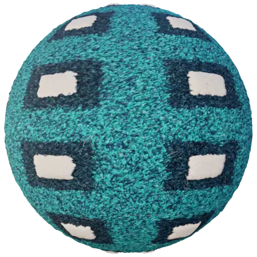

|

**This material is contained in the following Exapacks:**

    - XTRPbr_05k_Vol_001

    - XTRPbr_1k_Vol_001

    - XTRPbr_2k_Vol_001

    - XTRPbr_4k_Vol_001

    - XTRPbr_8k_Vol_030

------------------------------------------------------------------------------------------------------------------------

Carpet 006
**********

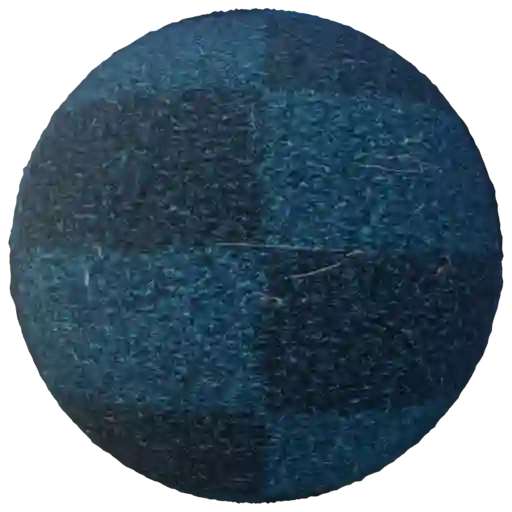

|

**This material is contained in the following Exapacks:**

    - XTRPbr_05k_Vol_001

    - XTRPbr_1k_Vol_001

    - XTRPbr_2k_Vol_001

    - XTRPbr_4k_Vol_001

    - XTRPbr_8k_Vol_030

------------------------------------------------------------------------------------------------------------------------

Carpet 008
**********

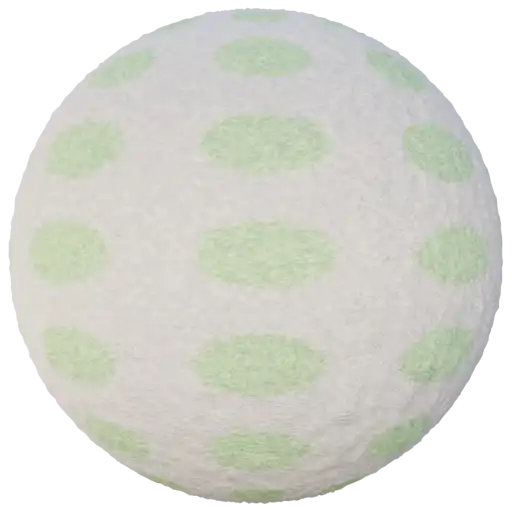

|

**This material is contained in the following Exapacks:**

    - XTRPbr_05k_Vol_001

    - XTRPbr_1k_Vol_001

    - XTRPbr_2k_Vol_001

    - XTRPbr_4k_Vol_001

    - XTRPbr_8k_Vol_030

------------------------------------------------------------------------------------------------------------------------

Carpet 009
**********

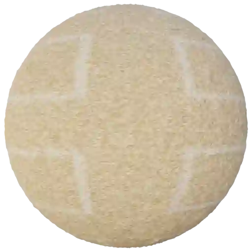

|

**This material is contained in the following Exapacks:**

    - XTRPbr_05k_Vol_001

    - XTRPbr_1k_Vol_001

    - XTRPbr_2k_Vol_001

    - XTRPbr_4k_Vol_001

    - XTRPbr_8k_Vol_030

------------------------------------------------------------------------------------------------------------------------

Carpet 010
**********

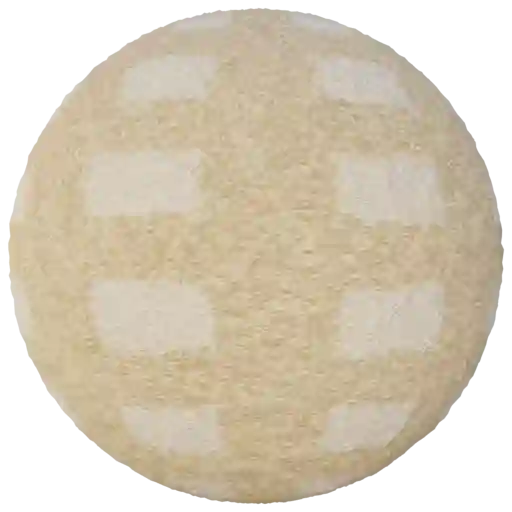

|

**This material is contained in the following Exapacks:**

    - XTRPbr_05k_Vol_001

    - XTRPbr_1k_Vol_001

    - XTRPbr_2k_Vol_001

    - XTRPbr_4k_Vol_001

    - XTRPbr_8k_Vol_030

------------------------------------------------------------------------------------------------------------------------

Carpet 011
**********

|

**This material is contained in the following Exapacks:**

    - XTRPbr_05k_Vol_001

    - XTRPbr_1k_Vol_001

    - XTRPbr_2k_Vol_001

    - XTRPbr_4k_Vol_001

    - XTRPbr_8k_Vol_030

------------------------------------------------------------------------------------------------------------------------

Carpet 012
**********

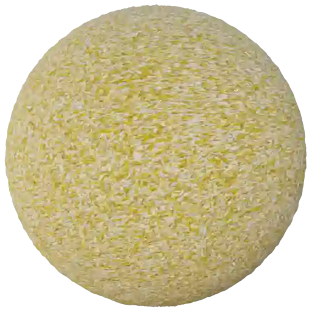

|

**This material is contained in the following Exapacks:**

    - XTRPbr_05k_Vol_001

    - XTRPbr_1k_Vol_001

    - XTRPbr_2k_Vol_001

    - XTRPbr_4k_Vol_001

    - XTRPbr_8k_Vol_030

------------------------------------------------------------------------------------------------------------------------

Carpet 013
**********

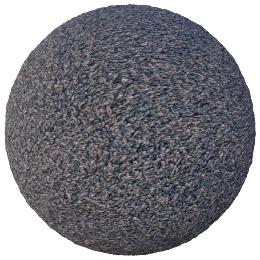

|

**This material is contained in the following Exapacks:**

    - XTRPbr_05k_Vol_001

    - XTRPbr_1k_Vol_001

    - XTRPbr_2k_Vol_001

    - XTRPbr_4k_Vol_001

    - XTRPbr_8k_Vol_030

------------------------------------------------------------------------------------------------------------------------

Carpet 014
**********

.. image:: _static/_images/material_list/fabric_carpet/carpet_014/carpet_014.webp
    :width: 30%
    :align: center
    :alt: Carpet 014

|

**This material is contained in the following Exapacks:**

    - XTRPbr_05k_Vol_001

    - XTRPbr_1k_Vol_001

    - XTRPbr_2k_Vol_001

    - XTRPbr_4k_Vol_001

    - XTRPbr_8k_Vol_020

------------------------------------------------------------------------------------------------------------------------

Carpet 015
**********

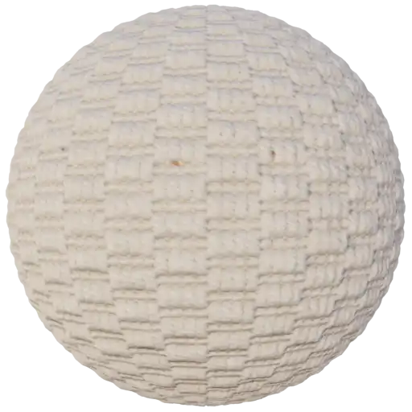

|

**This material is contained in the following Exapacks:**

    - XTRPbr_05k_Vol_001

    - XTRPbr_1k_Vol_001

    - XTRPbr_2k_Vol_001

    - XTRPbr_4k_Vol_001

    - XTRPbr_8k_Vol_020

------------------------------------------------------------------------------------------------------------------------

Carpet 016
**********

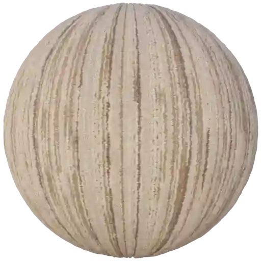

|

**This material is contained in the following Exapacks:**

    - XTRPbr_05k_Vol_001

    - XTRPbr_1k_Vol_001

    - XTRPbr_2k_Vol_001

    - XTRPbr_4k_Vol_001

------------------------------------------------------------------------------------------------------------------------

Carpet 017
**********

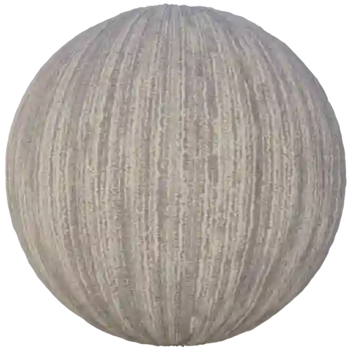

|

**This material is contained in the following Exapacks:**

    - XTRPbr_05k_Vol_001

    - XTRPbr_1k_Vol_001

    - XTRPbr_2k_Vol_001

    - XTRPbr_4k_Vol_001

------------------------------------------------------------------------------------------------------------------------

Carpet 018
**********

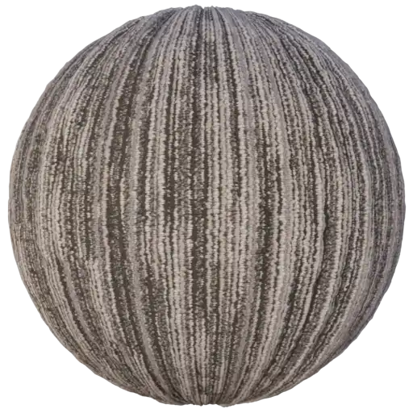

|

**This material is contained in the following Exapacks:**

    - XTRPbr_05k_Vol_001

    - XTRPbr_1k_Vol_001

    - XTRPbr_2k_Vol_001

    - XTRPbr_4k_Vol_001

------------------------------------------------------------------------------------------------------------------------

Carpet 019
**********

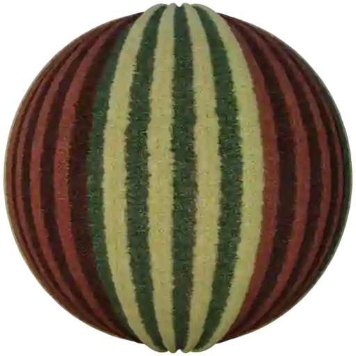

|

**This material is contained in the following Exapacks:**

    - XTRPbr_05k_Vol_001

    - XTRPbr_1k_Vol_001

    - XTRPbr_2k_Vol_001

    - XTRPbr_4k_Vol_001

------------------------------------------------------------------------------------------------------------------------

Carpet 020
**********

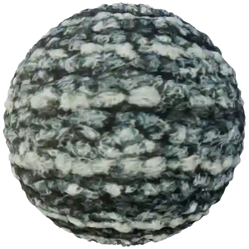

|

**This material is contained in the following Exapacks:**

    - XTRPbr_05k_Vol_001

    - XTRPbr_1k_Vol_001

    - XTRPbr_2k_Vol_001

    - XTRPbr_4k_Vol_001

------------------------------------------------------------------------------------------------------------------------

Casino Carpet 001
*****************

|

**This material is contained in the following Exapacks:**

    - XTRPbr_05k_Vol_001

    - XTRPbr_1k_Vol_001

    - XTRPbr_2k_Vol_001

    - XTRPbr_4k_Vol_001

------------------------------------------------------------------------------------------------------------------------

Casino Carpet 002
*****************

|

**This material is contained in the following Exapacks:**

    - XTRPbr_05k_Vol_001

    - XTRPbr_1k_Vol_001

    - XTRPbr_2k_Vol_001

    - XTRPbr_4k_Vol_001

------------------------------------------------------------------------------------------------------------------------

Casino Carpet 003
*****************

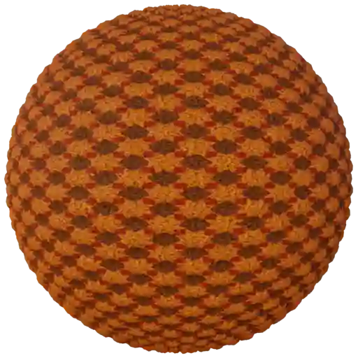

|

**This material is contained in the following Exapacks:**

    - XTRPbr_05k_Vol_001

    - XTRPbr_1k_Vol_001

    - XTRPbr_2k_Vol_001

    - XTRPbr_4k_Vol_001

------------------------------------------------------------------------------------------------------------------------

Casino Carpet 004
*****************

|

**This material is contained in the following Exapacks:**

    - XTRPbr_05k_Vol_001

    - XTRPbr_1k_Vol_001

    - XTRPbr_2k_Vol_001

    - XTRPbr_4k_Vol_001

------------------------------------------------------------------------------------------------------------------------

Fabric - Jeans (Category)
-------------------------

Jeans 001
*********

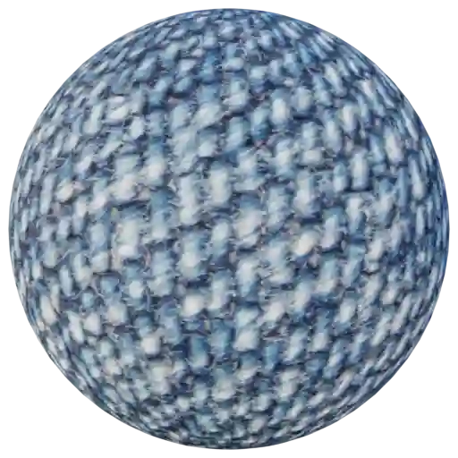

|

**This material is contained in the following Exapacks:**

    - XTRPbr_05k_Vol_001

    - XTRPbr_1k_Vol_001

    - XTRPbr_2k_Vol_001

------------------------------------------------------------------------------------------------------------------------

Jeans 002
*********

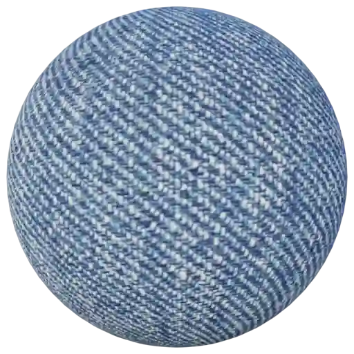

|

**This material is contained in the following Exapacks:**

    - XTRPbr_05k_Vol_001

    - XTRPbr_1k_Vol_001

    - XTRPbr_2k_Vol_001

    - XTRPbr_4k_Vol_001

------------------------------------------------------------------------------------------------------------------------

Jeans 003
*********

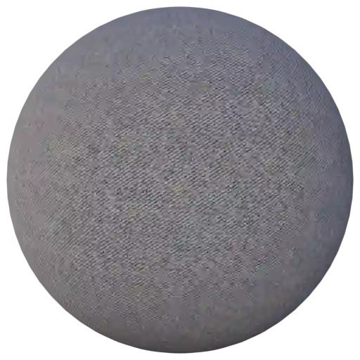

|

**This material is contained in the following Exapacks:**

    - XTRPbr_05k_Vol_001

    - XTRPbr_1k_Vol_001

    - XTRPbr_2k_Vol_001

    - XTRPbr_4k_Vol_001

------------------------------------------------------------------------------------------------------------------------

Jeans 004
*********

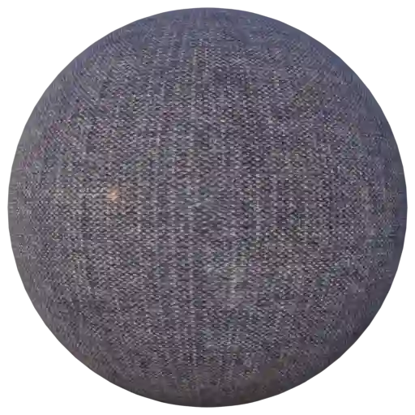

|

**This material is contained in the following Exapacks:**

    - XTRPbr_05k_Vol_001

    - XTRPbr_1k_Vol_001

    - XTRPbr_2k_Vol_001

    - XTRPbr_4k_Vol_001

------------------------------------------------------------------------------------------------------------------------

Jeans 005
*********

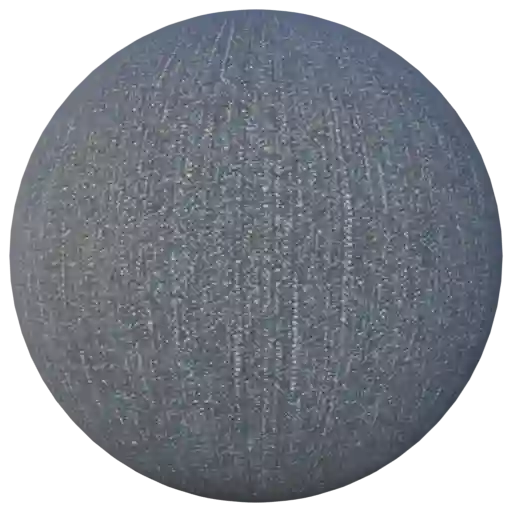

|

**This material is contained in the following Exapacks:**

    - XTRPbr_05k_Vol_001

    - XTRPbr_1k_Vol_001

    - XTRPbr_2k_Vol_001

    - XTRPbr_4k_Vol_001

------------------------------------------------------------------------------------------------------------------------

Jeans 006
*********

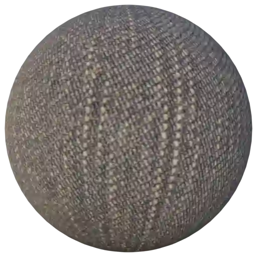

|

**This material is contained in the following Exapacks:**

    - XTRPbr_05k_Vol_001

    - XTRPbr_1k_Vol_001

    - XTRPbr_2k_Vol_001

------------------------------------------------------------------------------------------------------------------------

Jeans 007
*********

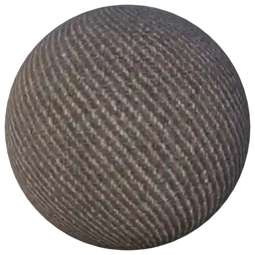

|

**This material is contained in the following Exapacks:**

    - XTRPbr_05k_Vol_001

    - XTRPbr_1k_Vol_001

    - XTRPbr_2k_Vol_001

------------------------------------------------------------------------------------------------------------------------

Jeans 008
*********

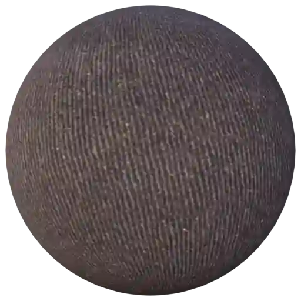

|

**This material is contained in the following Exapacks:**

    - XTRPbr_05k_Vol_001

    - XTRPbr_1k_Vol_001

    - XTRPbr_2k_Vol_001

------------------------------------------------------------------------------------------------------------------------

Jeans 009
*********

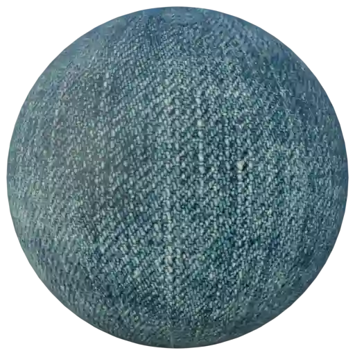

|

**This material is contained in the following Exapacks:**

    - XTRPbr_05k_Vol_001

    - XTRPbr_1k_Vol_001

    - XTRPbr_2k_Vol_001

    - XTRPbr_4k_Vol_001

    - XTRPbr_8k_Vol_020

------------------------------------------------------------------------------------------------------------------------

Jeans 010
*********

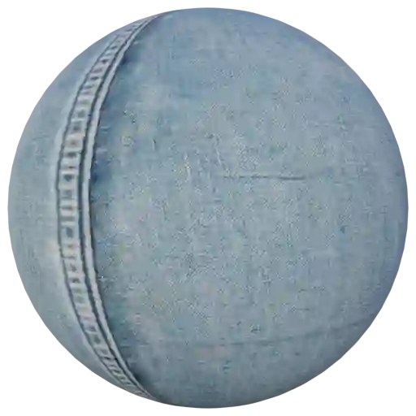

|

**This material is contained in the following Exapacks:**

    - XTRPbr_05k_Vol_001

    - XTRPbr_1k_Vol_001

    - XTRPbr_2k_Vol_001

    - XTRPbr_4k_Vol_001

    - XTRPbr_8k_Vol_020

------------------------------------------------------------------------------------------------------------------------

Fabric - Knitting (Category)
----------------------------

Blue_Cotton_02
**************

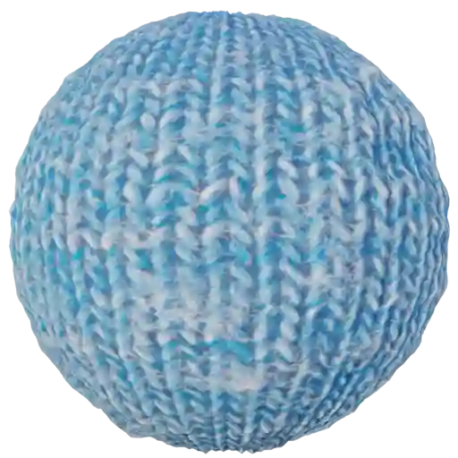

|

**This material is contained in the following Exapacks:**

    - XTRPbr_05k_Vol_001

    - XTRPbr_1k_Vol_001

    - XTRPbr_2k_Vol_001

------------------------------------------------------------------------------------------------------------------------

Blue_Knitted
************

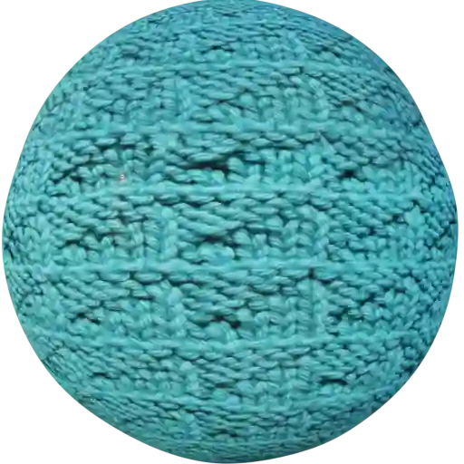

|

**This material is contained in the following Exapacks:**

    - XTRPbr_05k_Vol_001

    - XTRPbr_1k_Vol_001

    - XTRPbr_2k_Vol_001

    - XTRPbr_4k_Vol_001

------------------------------------------------------------------------------------------------------------------------

Cloth_4
*******

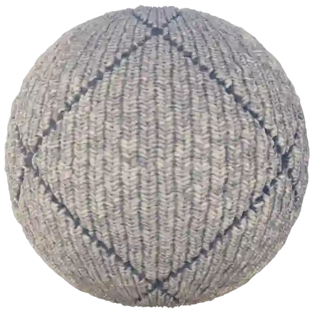

|

**This material is contained in the following Exapacks:**

    - XTRPbr_05k_Vol_001

    - XTRPbr_1k_Vol_001

    - XTRPbr_2k_Vol_001

    - XTRPbr_4k_Vol_001

------------------------------------------------------------------------------------------------------------------------

Fabric Knitting 001
*******************

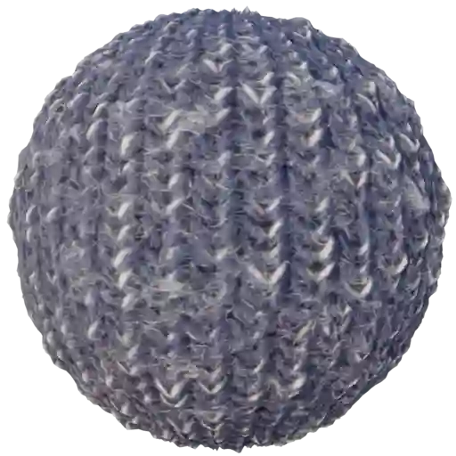

|

**This material is contained in the following Exapacks:**

    - XTRPbr_05k_Vol_001

    - XTRPbr_1k_Vol_001

    - XTRPbr_2k_Vol_001

------------------------------------------------------------------------------------------------------------------------

Fabric Knitting 002
*******************

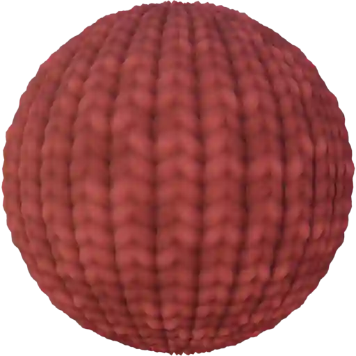

|

**This material is contained in the following Exapacks:**

    - XTRPbr_05k_Vol_001

    - XTRPbr_1k_Vol_001

    - XTRPbr_2k_Vol_001

    - XTRPbr_4k_Vol_001

    - XTRPbr_8k_Vol_020

------------------------------------------------------------------------------------------------------------------------

Fabric Knitting 003
*******************

.. image:: _static/_images/material_list/fabric_knitting/fabric_knitting_003/fabric_knitting_003.webp
    :width: 30%
    :align: center
    :alt: Fabric Knitting 003

|

**This material is contained in the following Exapacks:**

    - XTRPbr_05k_Vol_001

    - XTRPbr_1k_Vol_001

    - XTRPbr_2k_Vol_001

    - XTRPbr_4k_Vol_001

    - XTRPbr_8k_Vol_020

------------------------------------------------------------------------------------------------------------------------

Fabric Knitting 004
*******************

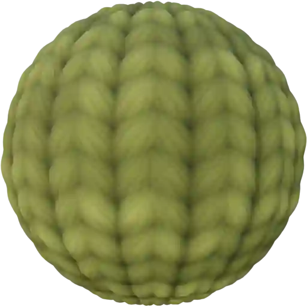

|

**This material is contained in the following Exapacks:**

    - XTRPbr_05k_Vol_001

    - XTRPbr_1k_Vol_001

    - XTRPbr_2k_Vol_001

    - XTRPbr_4k_Vol_001

    - XTRPbr_8k_Vol_020

------------------------------------------------------------------------------------------------------------------------

Fabric Knitting 005
*******************

.. image:: _static/_images/material_list/fabric_knitting/fabric_knitting_005/fabric_knitting_005.webp
    :width: 30%
    :align: center
    :alt: Fabric Knitting 005

|

**This material is contained in the following Exapacks:**

    - XTRPbr_05k_Vol_001

    - XTRPbr_1k_Vol_001

    - XTRPbr_2k_Vol_001

    - XTRPbr_4k_Vol_001

    - XTRPbr_8k_Vol_020

------------------------------------------------------------------------------------------------------------------------

Fabric Knitting 006
*******************

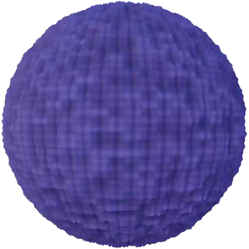

|

**This material is contained in the following Exapacks:**

    - XTRPbr_05k_Vol_001

    - XTRPbr_1k_Vol_001

    - XTRPbr_2k_Vol_001

    - XTRPbr_4k_Vol_001

    - XTRPbr_8k_Vol_020

------------------------------------------------------------------------------------------------------------------------

Fabric Knitting 007
*******************

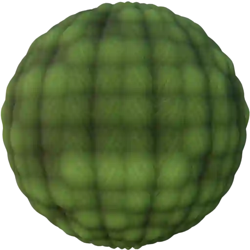

|

**This material is contained in the following Exapacks:**

    - XTRPbr_05k_Vol_001

    - XTRPbr_1k_Vol_001

    - XTRPbr_2k_Vol_001

    - XTRPbr_4k_Vol_001

    - XTRPbr_8k_Vol_020

------------------------------------------------------------------------------------------------------------------------

Fabric Knitting 008
*******************

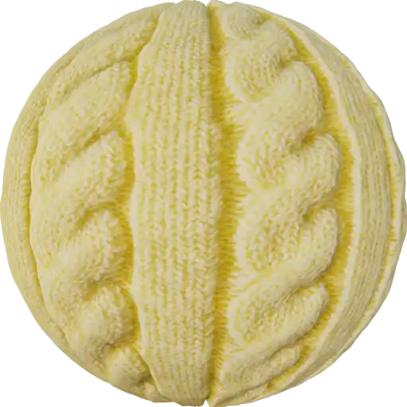

|

**This material is contained in the following Exapacks:**

    - XTRPbr_05k_Vol_001

    - XTRPbr_1k_Vol_001

    - XTRPbr_2k_Vol_001

    - XTRPbr_4k_Vol_001

------------------------------------------------------------------------------------------------------------------------

Fabric Knitting 009
*******************

.. image:: _static/_images/material_list/fabric_knitting/fabric_knitting_009/fabric_knitting_009.webp
    :width: 30%
    :align: center
    :alt: Fabric Knitting 009

|

**This material is contained in the following Exapacks:**

    - XTRPbr_05k_Vol_001

    - XTRPbr_1k_Vol_001

    - XTRPbr_2k_Vol_001

    - XTRPbr_4k_Vol_001

------------------------------------------------------------------------------------------------------------------------

Fabric Knitting 010
*******************

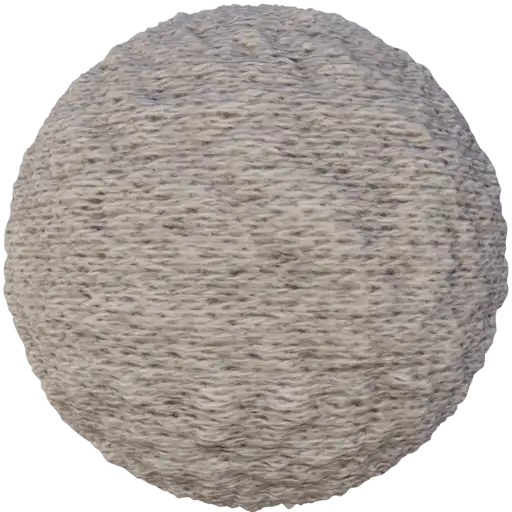

|

**This material is contained in the following Exapacks:**

    - XTRPbr_05k_Vol_001

    - XTRPbr_1k_Vol_001

    - XTRPbr_2k_Vol_001

------------------------------------------------------------------------------------------------------------------------

Fabric Knitting 011
*******************

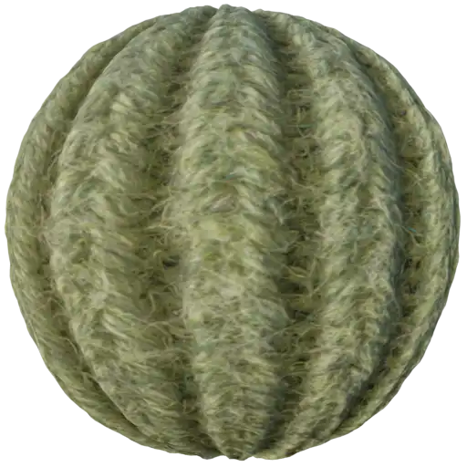

|

**This material is contained in the following Exapacks:**

    - XTRPbr_05k_Vol_001

    - XTRPbr_1k_Vol_001

    - XTRPbr_2k_Vol_001

    - XTRPbr_4k_Vol_001

------------------------------------------------------------------------------------------------------------------------

Fabric Knitting 012
*******************

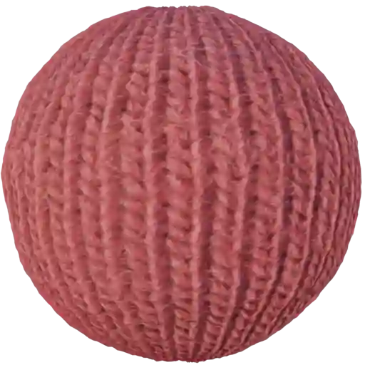

|

**This material is contained in the following Exapacks:**

    - XTRPbr_05k_Vol_001

    - XTRPbr_1k_Vol_001

    - XTRPbr_2k_Vol_001

------------------------------------------------------------------------------------------------------------------------

Fabric Knitting 013
*******************

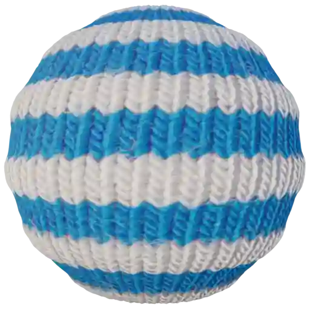

|

**This material is contained in the following Exapacks:**

    - XTRPbr_05k_Vol_001

    - XTRPbr_1k_Vol_001

    - XTRPbr_2k_Vol_001

------------------------------------------------------------------------------------------------------------------------

Fabric - Large (Category)
-------------------------

Carbon Fiber 01
***************

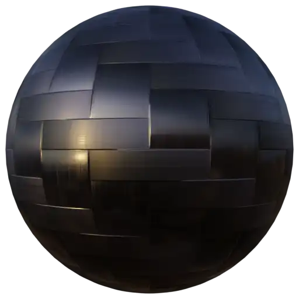

|

**This material is contained in the following Exapacks:**

    - XTRPbr_05k_Vol_001

    - XTRPbr_1k_Vol_001

    - XTRPbr_2k_Vol_001

    - XTRPbr_4k_Vol_001

------------------------------------------------------------------------------------------------------------------------

Carbon Fiber 02
***************

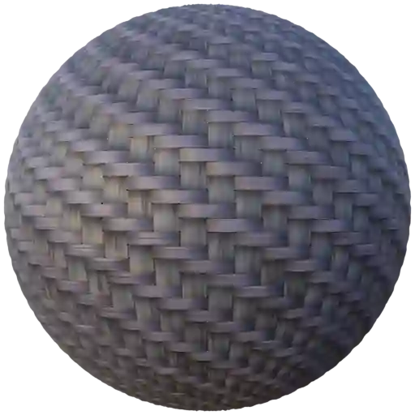

|

**This material is contained in the following Exapacks:**

    - XTRPbr_05k_Vol_001

    - XTRPbr_1k_Vol_001

    - XTRPbr_2k_Vol_001

    - XTRPbr_4k_Vol_001

    - XTRPbr_8k_Vol_020

------------------------------------------------------------------------------------------------------------------------

Chainmail 001
*************

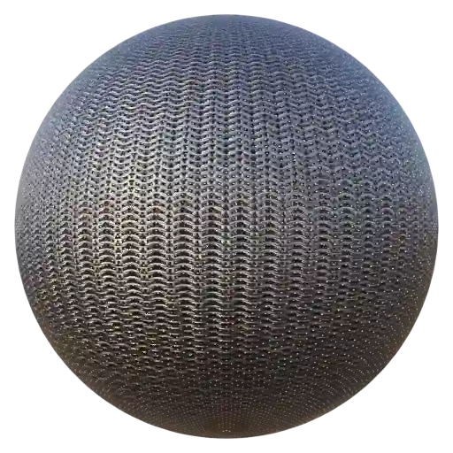

|

**This material is contained in the following Exapacks:**

    - XTRPbr_05k_Vol_001

    - XTRPbr_1k_Vol_001

    - XTRPbr_2k_Vol_001

    - XTRPbr_4k_Vol_001

    - XTRPbr_8k_Vol_020

------------------------------------------------------------------------------------------------------------------------

Chainmail 002
*************

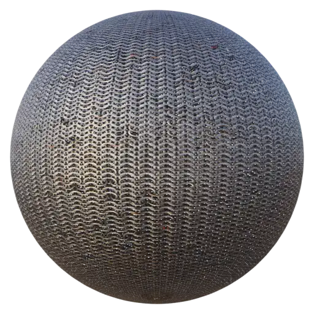

|

**This material is contained in the following Exapacks:**

    - XTRPbr_05k_Vol_001

    - XTRPbr_1k_Vol_001

    - XTRPbr_2k_Vol_001

    - XTRPbr_4k_Vol_001

    - XTRPbr_8k_Vol_020

------------------------------------------------------------------------------------------------------------------------

Chainmail 003
*************

.. image:: _static/_images/material_list/fabric_large/chainmail_003/chainmail_003.webp
    :width: 30%
    :align: center
    :alt: Chainmail 003

|

**This material is contained in the following Exapacks:**

    - XTRPbr_05k_Vol_001

    - XTRPbr_1k_Vol_001

    - XTRPbr_2k_Vol_001

    - XTRPbr_4k_Vol_001

    - XTRPbr_8k_Vol_020

------------------------------------------------------------------------------------------------------------------------

Chainmail 004
*************

.. image:: _static/_images/material_list/fabric_large/chainmail_004/chainmail_004.webp
    :width: 30%
    :align: center
    :alt: Chainmail 004

|

**This material is contained in the following Exapacks:**

    - XTRPbr_05k_Vol_001

    - XTRPbr_1k_Vol_001

    - XTRPbr_2k_Vol_001

    - XTRPbr_4k_Vol_001

    - XTRPbr_8k_Vol_020

------------------------------------------------------------------------------------------------------------------------

Fabric Net 001
**************

.. image:: _static/_images/material_list/fabric_large/fabric_net_001/fabric_net_001.webp
    :width: 30%
    :align: center
    :alt: Fabric Net 001

|

**This material is contained in the following Exapacks:**

    - XTRPbr_05k_Vol_001

    - XTRPbr_1k_Vol_001

    - XTRPbr_2k_Vol_001

    - XTRPbr_4k_Vol_001

------------------------------------------------------------------------------------------------------------------------

Fabric Net 002
**************

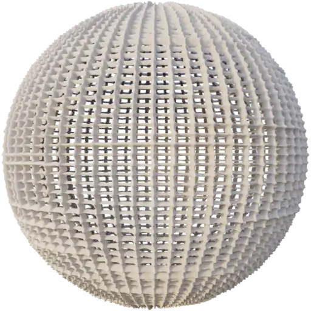

|

**This material is contained in the following Exapacks:**

    - XTRPbr_05k_Vol_001

    - XTRPbr_1k_Vol_001

    - XTRPbr_2k_Vol_001

    - XTRPbr_4k_Vol_001

------------------------------------------------------------------------------------------------------------------------

Fabric Tulle 001
****************

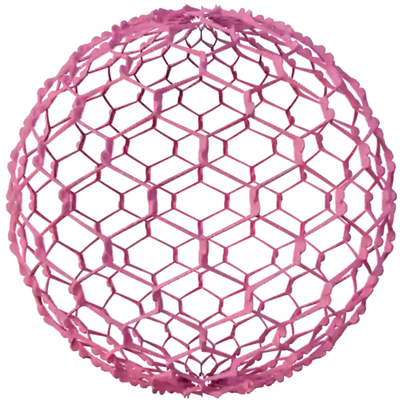

|

**This material is contained in the following Exapacks:**

    - XTRPbr_05k_Vol_001

    - XTRPbr_1k_Vol_001

    - XTRPbr_2k_Vol_001

    - XTRPbr_4k_Vol_001

------------------------------------------------------------------------------------------------------------------------

Wicker 001
**********

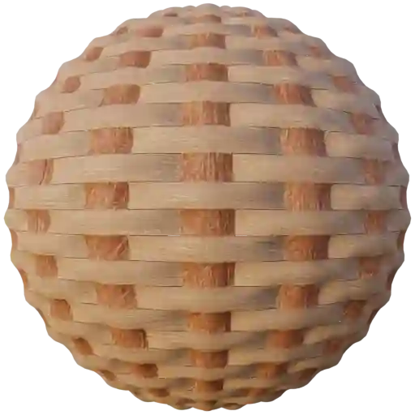

|

**This material is contained in the following Exapacks:**

    - XTRPbr_05k_Vol_001

    - XTRPbr_1k_Vol_001

    - XTRPbr_2k_Vol_001

    - XTRPbr_4k_Vol_001

    - XTRPbr_8k_Vol_020

------------------------------------------------------------------------------------------------------------------------

Wicker 002
**********

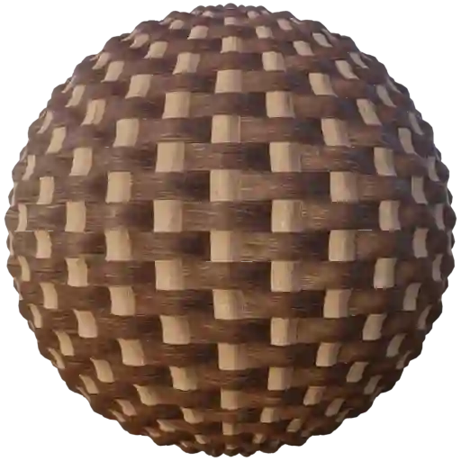

|

**This material is contained in the following Exapacks:**

    - XTRPbr_05k_Vol_001

    - XTRPbr_1k_Vol_001

    - XTRPbr_2k_Vol_001

    - XTRPbr_4k_Vol_001

    - XTRPbr_8k_Vol_020

------------------------------------------------------------------------------------------------------------------------

Wicker 003
**********

|

**This material is contained in the following Exapacks:**

    - XTRPbr_05k_Vol_001

    - XTRPbr_1k_Vol_001

    - XTRPbr_2k_Vol_001

    - XTRPbr_4k_Vol_001

    - XTRPbr_8k_Vol_020

------------------------------------------------------------------------------------------------------------------------

Wicker 004
**********

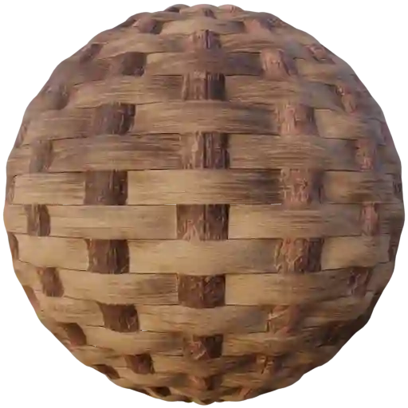

|

**This material is contained in the following Exapacks:**

    - XTRPbr_05k_Vol_001

    - XTRPbr_1k_Vol_001

    - XTRPbr_2k_Vol_001

    - XTRPbr_4k_Vol_001

    - XTRPbr_8k_Vol_020

------------------------------------------------------------------------------------------------------------------------

Wicker 005
**********

.. image:: _static/_images/material_list/fabric_large/wicker_005/wicker_005.webp
    :width: 30%
    :align: center
    :alt: Wicker 005

|

**This material is contained in the following Exapacks:**

    - XTRPbr_05k_Vol_001

    - XTRPbr_1k_Vol_001

    - XTRPbr_2k_Vol_001

    - XTRPbr_4k_Vol_001

    - XTRPbr_8k_Vol_020

------------------------------------------------------------------------------------------------------------------------

Wicker 006
**********

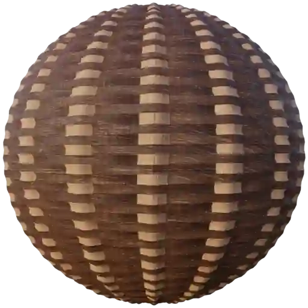

|

**This material is contained in the following Exapacks:**

    - XTRPbr_05k_Vol_001

    - XTRPbr_1k_Vol_001

    - XTRPbr_2k_Vol_001

    - XTRPbr_4k_Vol_001

    - XTRPbr_8k_Vol_020

------------------------------------------------------------------------------------------------------------------------

Wicker 007
**********

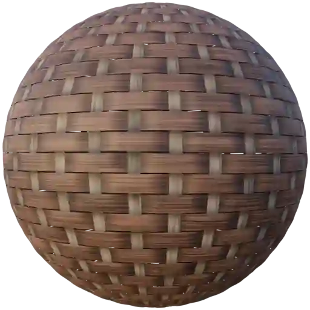

|

**This material is contained in the following Exapacks:**

    - XTRPbr_05k_Vol_001

    - XTRPbr_1k_Vol_001

    - XTRPbr_2k_Vol_001

    - XTRPbr_4k_Vol_001

    - XTRPbr_8k_Vol_020

------------------------------------------------------------------------------------------------------------------------

Wicker 008
**********

.. image:: _static/_images/material_list/fabric_large/wicker_008/wicker_008.webp
    :width: 30%
    :align: center
    :alt: Wicker 008

|

**This material is contained in the following Exapacks:**

    - XTRPbr_05k_Vol_001

    - XTRPbr_1k_Vol_001

    - XTRPbr_2k_Vol_001

    - XTRPbr_4k_Vol_001

------------------------------------------------------------------------------------------------------------------------

Wicker 009
**********

.. image:: _static/_images/material_list/fabric_large/wicker_009/wicker_009.webp
    :width: 30%
    :align: center
    :alt: Wicker 009

|

**This material is contained in the following Exapacks:**

    - XTRPbr_05k_Vol_001

    - XTRPbr_1k_Vol_001

    - XTRPbr_2k_Vol_001

    - XTRPbr_4k_Vol_001

    - XTRPbr_8k_Vol_020

------------------------------------------------------------------------------------------------------------------------

Wicker 010
**********

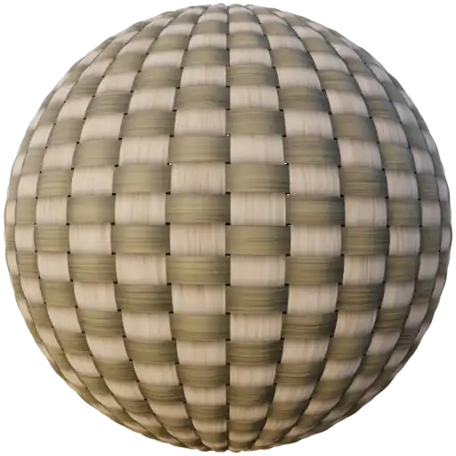

|

**This material is contained in the following Exapacks:**

    - XTRPbr_05k_Vol_001

    - XTRPbr_1k_Vol_001

    - XTRPbr_2k_Vol_001

    - XTRPbr_4k_Vol_001

    - XTRPbr_8k_Vol_020

------------------------------------------------------------------------------------------------------------------------

Wide Knit Fabric 001
********************

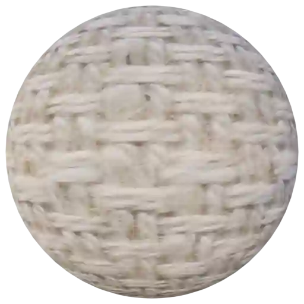

|

**This material is contained in the following Exapacks:**

    - XTRPbr_05k_Vol_001

    - XTRPbr_1k_Vol_001

    - XTRPbr_2k_Vol_001

    - XTRPbr_4k_Vol_001

------------------------------------------------------------------------------------------------------------------------

Wide Knit Fabric 002
********************

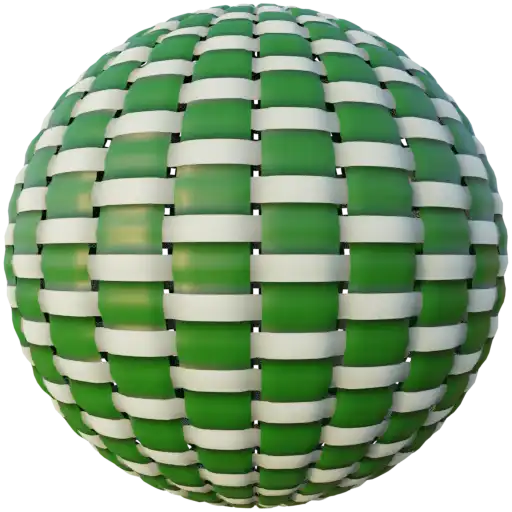

|

**This material is contained in the following Exapacks:**

    - XTRPbr_05k_Vol_001

    - XTRPbr_1k_Vol_001

    - XTRPbr_2k_Vol_001

    - XTRPbr_4k_Vol_001

    - XTRPbr_8k_Vol_020

------------------------------------------------------------------------------------------------------------------------

Wide Knit Fabric 003
********************

.. image:: _static/_images/material_list/fabric_large/wide_knit_fabric_003/wide_knit_fabric_003.webp
    :width: 30%
    :align: center
    :alt: Wide Knit Fabric 003

|

**This material is contained in the following Exapacks:**

    - XTRPbr_05k_Vol_001

    - XTRPbr_1k_Vol_001

    - XTRPbr_2k_Vol_001

    - XTRPbr_4k_Vol_001

    - XTRPbr_8k_Vol_020

------------------------------------------------------------------------------------------------------------------------

Fabric - Pattern (Category)
---------------------------

Camouflage 001
**************

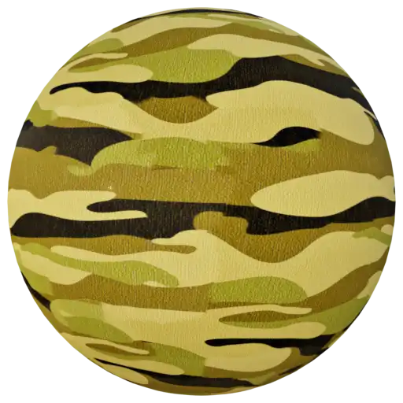

|

**This material is contained in the following Exapacks:**

    - XTRPbr_05k_Vol_001

    - XTRPbr_1k_Vol_001

    - XTRPbr_2k_Vol_001

    - XTRPbr_4k_Vol_001

------------------------------------------------------------------------------------------------------------------------

Camouflage 002
**************

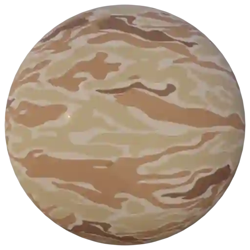

|

**This material is contained in the following Exapacks:**

    - XTRPbr_05k_Vol_001

    - XTRPbr_1k_Vol_001

    - XTRPbr_2k_Vol_001

    - XTRPbr_4k_Vol_001

------------------------------------------------------------------------------------------------------------------------

Fabric Checkered 001
********************

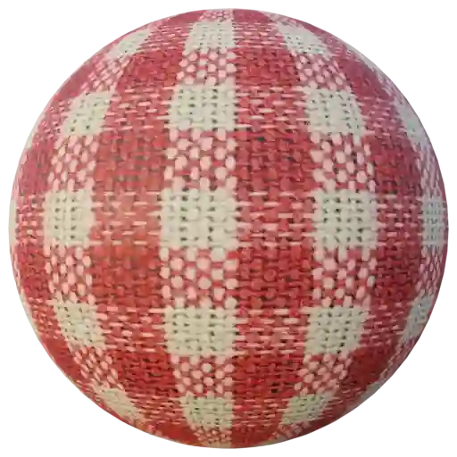

|

**This material is contained in the following Exapacks:**

    - XTRPbr_05k_Vol_001

    - XTRPbr_1k_Vol_001

    - XTRPbr_2k_Vol_001

    - XTRPbr_4k_Vol_001

    - XTRPbr_8k_Vol_020

------------------------------------------------------------------------------------------------------------------------

Fabric Checkered 002
********************

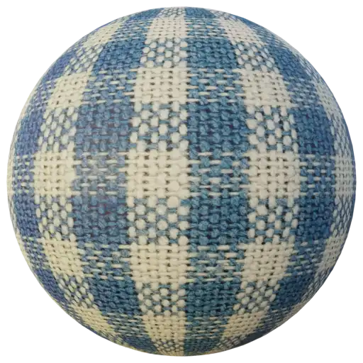

|

**This material is contained in the following Exapacks:**

    - XTRPbr_05k_Vol_001

    - XTRPbr_1k_Vol_001

    - XTRPbr_2k_Vol_001

    - XTRPbr_4k_Vol_001

    - XTRPbr_8k_Vol_020

------------------------------------------------------------------------------------------------------------------------

Fabric Checkered 003
********************

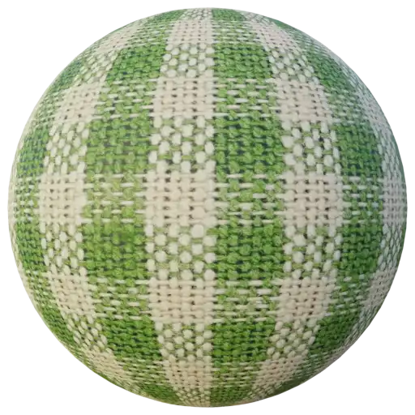

|

**This material is contained in the following Exapacks:**

    - XTRPbr_05k_Vol_001

    - XTRPbr_1k_Vol_001

    - XTRPbr_2k_Vol_001

    - XTRPbr_4k_Vol_001

    - XTRPbr_8k_Vol_020

------------------------------------------------------------------------------------------------------------------------

Fabric Pattern 001
******************

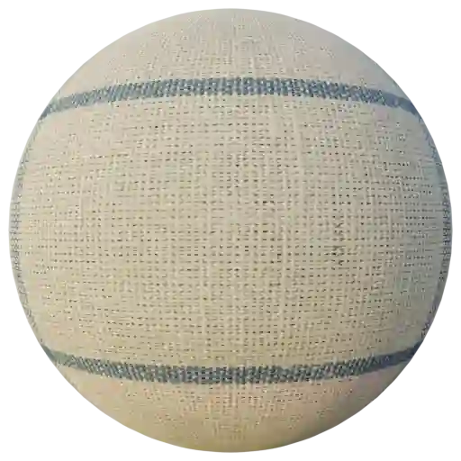

|

**This material is contained in the following Exapacks:**

    - XTRPbr_05k_Vol_001

    - XTRPbr_1k_Vol_001

    - XTRPbr_2k_Vol_001

    - XTRPbr_4k_Vol_001

    - XTRPbr_8k_Vol_020

------------------------------------------------------------------------------------------------------------------------

Fabric Pattern 002
******************

|

**This material is contained in the following Exapacks:**

    - XTRPbr_05k_Vol_001

    - XTRPbr_1k_Vol_001

    - XTRPbr_2k_Vol_001

    - XTRPbr_4k_Vol_001

    - XTRPbr_8k_Vol_020

------------------------------------------------------------------------------------------------------------------------

Fabric Pattern 003
******************

|

**This material is contained in the following Exapacks:**

    - XTRPbr_05k_Vol_001

    - XTRPbr_1k_Vol_001

    - XTRPbr_2k_Vol_001

    - XTRPbr_4k_Vol_001

    - XTRPbr_8k_Vol_020

------------------------------------------------------------------------------------------------------------------------

Fabric007
*********

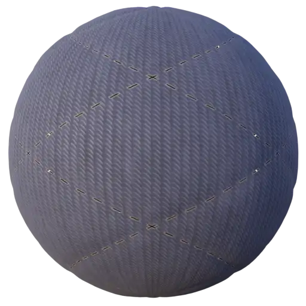

|

**This material is contained in the following Exapacks:**

    - XTRPbr_05k_Vol_001

    - XTRPbr_1k_Vol_001

    - XTRPbr_2k_Vol_001

    - XTRPbr_4k_Vol_001

------------------------------------------------------------------------------------------------------------------------

Fabric008
*********

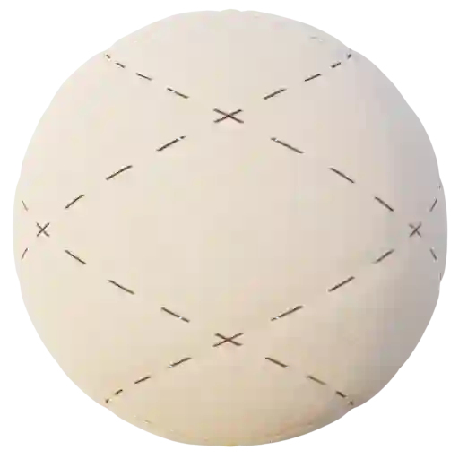

|

**This material is contained in the following Exapacks:**

    - XTRPbr_05k_Vol_001

    - XTRPbr_1k_Vol_001

    - XTRPbr_2k_Vol_001

    - XTRPbr_4k_Vol_001

------------------------------------------------------------------------------------------------------------------------

Fabric009
*********

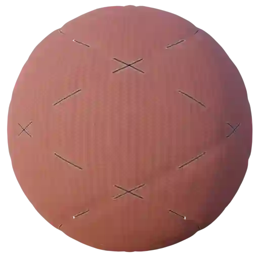

|

**This material is contained in the following Exapacks:**

    - XTRPbr_05k_Vol_001

    - XTRPbr_1k_Vol_001

    - XTRPbr_2k_Vol_001

    - XTRPbr_4k_Vol_001

------------------------------------------------------------------------------------------------------------------------

Fabric024
*********

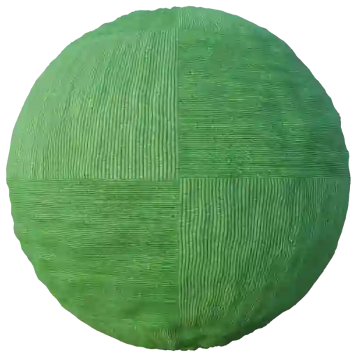

|

**This material is contained in the following Exapacks:**

    - XTRPbr_05k_Vol_001

    - XTRPbr_1k_Vol_001

    - XTRPbr_2k_Vol_001

    - XTRPbr_4k_Vol_001

    - XTRPbr_8k_Vol_020

------------------------------------------------------------------------------------------------------------------------

Fabric025
*********

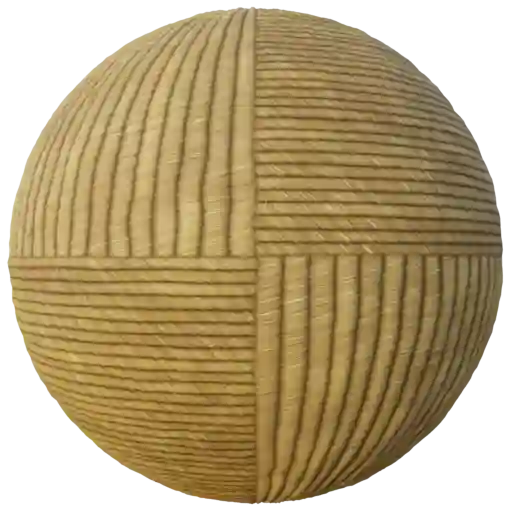

|

**This material is contained in the following Exapacks:**

    - XTRPbr_05k_Vol_001

    - XTRPbr_1k_Vol_001

    - XTRPbr_2k_Vol_001

    - XTRPbr_4k_Vol_001

    - XTRPbr_8k_Vol_020

------------------------------------------------------------------------------------------------------------------------

Fabric027
*********

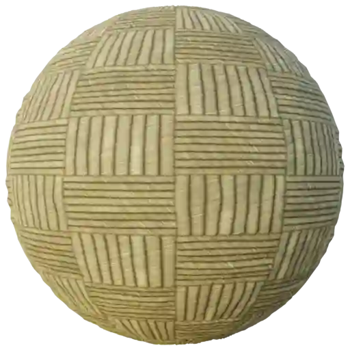

|

**This material is contained in the following Exapacks:**

    - XTRPbr_05k_Vol_001

    - XTRPbr_1k_Vol_001

    - XTRPbr_2k_Vol_001

    - XTRPbr_4k_Vol_001

    - XTRPbr_8k_Vol_020

------------------------------------------------------------------------------------------------------------------------

Fabric046
*********

.. image:: _static/_images/material_list/fabric_pattern/fabric046/fabric046.webp
    :width: 30%
    :align: center
    :alt: Fabric046

|

**This material is contained in the following Exapacks:**

    - XTRPbr_05k_Vol_001

    - XTRPbr_1k_Vol_001

    - XTRPbr_2k_Vol_001

    - XTRPbr_4k_Vol_001

    - XTRPbr_4k_Vol_006

    - XTRPbr_8k_Vol_020

------------------------------------------------------------------------------------------------------------------------

Fabric047
*********

|

**This material is contained in the following Exapacks:**

    - XTRPbr_05k_Vol_001

    - XTRPbr_1k_Vol_001

    - XTRPbr_2k_Vol_001

    - XTRPbr_4k_Vol_006

    - XTRPbr_8k_Vol_020

------------------------------------------------------------------------------------------------------------------------

Fabric048
*********

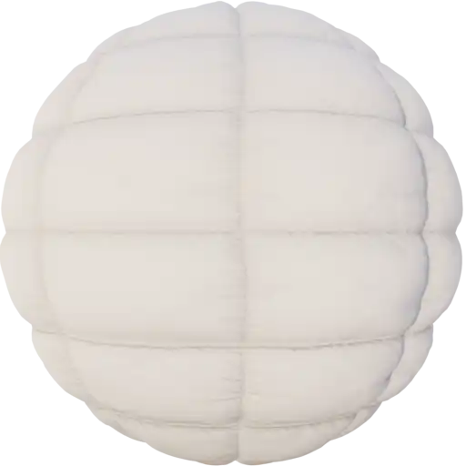

|

**This material is contained in the following Exapacks:**

    - XTRPbr_05k_Vol_001

    - XTRPbr_1k_Vol_001

    - XTRPbr_2k_Vol_001

    - XTRPbr_4k_Vol_006

    - XTRPbr_8k_Vol_002

    - XTRPbr_8k_Vol_020

------------------------------------------------------------------------------------------------------------------------

Fabric049
*********

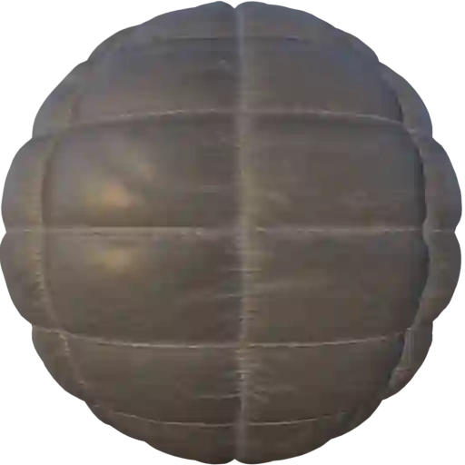

|

**This material is contained in the following Exapacks:**

    - XTRPbr_05k_Vol_001

    - XTRPbr_1k_Vol_001

    - XTRPbr_2k_Vol_001

    - XTRPbr_4k_Vol_006

    - XTRPbr_8k_Vol_002

------------------------------------------------------------------------------------------------------------------------

Fabric_Plastic
**************

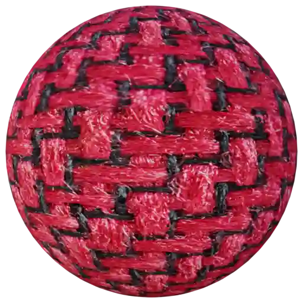

|

**This material is contained in the following Exapacks:**

    - XTRPbr_05k_Vol_001

    - XTRPbr_1k_Vol_001

    - XTRPbr_2k_Vol_001

    - XTRPbr_4k_Vol_006

------------------------------------------------------------------------------------------------------------------------

Facade (Category)
-----------------

Windows Facade 001
******************

.. image:: _static/_images/material_list/facade/windows_facade_001/windows_facade_001.webp
    :width: 30%
    :align: center
    :alt: Windows Facade 001

|

**This material is contained in the following Exapacks:**

    - XTRPbr_05k_Vol_001

    - XTRPbr_1k_Vol_001

    - XTRPbr_2k_Vol_001

    - XTRPbr_4k_Vol_006

------------------------------------------------------------------------------------------------------------------------

Windows Facade 002
******************

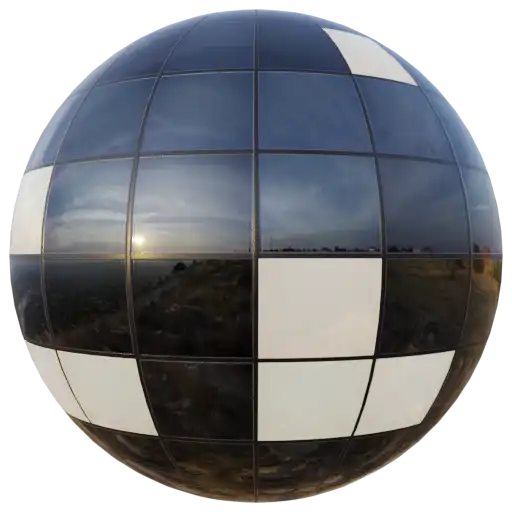

|

**This material is contained in the following Exapacks:**

    - XTRPbr_05k_Vol_001

    - XTRPbr_1k_Vol_001

    - XTRPbr_2k_Vol_001

    - XTRPbr_4k_Vol_006

------------------------------------------------------------------------------------------------------------------------

Windows Facade 003
******************

.. image:: _static/_images/material_list/facade/windows_facade_003/windows_facade_003.webp
    :width: 30%
    :align: center
    :alt: Windows Facade 003

|

**This material is contained in the following Exapacks:**

    - XTRPbr_05k_Vol_001

    - XTRPbr_1k_Vol_001

    - XTRPbr_2k_Vol_001

    - XTRPbr_4k_Vol_006

------------------------------------------------------------------------------------------------------------------------

Windows Facade 004
******************

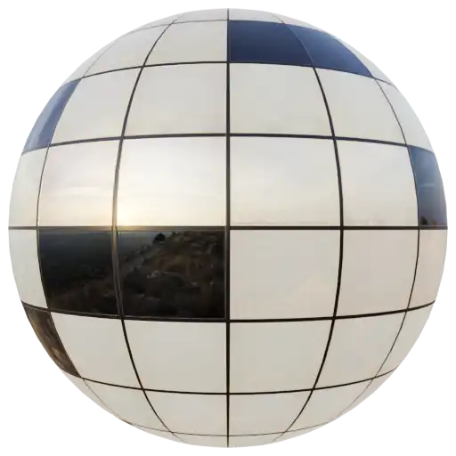

|

**This material is contained in the following Exapacks:**

    - XTRPbr_05k_Vol_001

    - XTRPbr_1k_Vol_001

    - XTRPbr_2k_Vol_001

    - XTRPbr_4k_Vol_006

------------------------------------------------------------------------------------------------------------------------

Windows Facade 005
******************

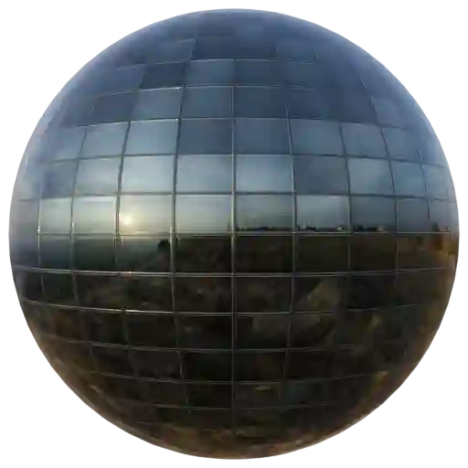

|

**This material is contained in the following Exapacks:**

    - XTRPbr_05k_Vol_001

    - XTRPbr_1k_Vol_001

    - XTRPbr_2k_Vol_001

    - XTRPbr_4k_Vol_006

------------------------------------------------------------------------------------------------------------------------

Windows Facade 006
******************

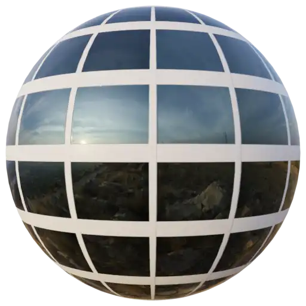

|

**This material is contained in the following Exapacks:**

    - XTRPbr_05k_Vol_001

    - XTRPbr_1k_Vol_001

    - XTRPbr_2k_Vol_001

    - XTRPbr_4k_Vol_006

------------------------------------------------------------------------------------------------------------------------

Windows Facade 007
******************

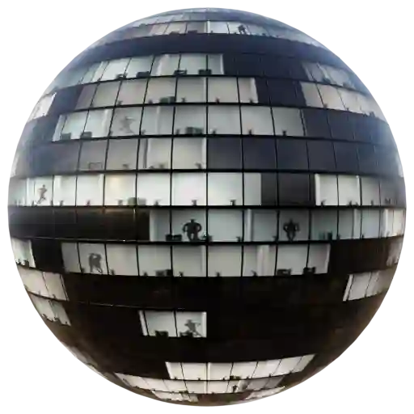

|

**This material is contained in the following Exapacks:**

    - XTRPbr_05k_Vol_001

    - XTRPbr_1k_Vol_001

    - XTRPbr_2k_Vol_001

    - XTRPbr_4k_Vol_006

    - XTRPbr_8k_Vol_002

------------------------------------------------------------------------------------------------------------------------

Windows Facade 008
******************

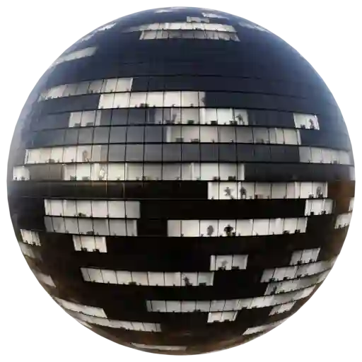

|

**This material is contained in the following Exapacks:**

    - XTRPbr_05k_Vol_001

    - XTRPbr_1k_Vol_001

    - XTRPbr_2k_Vol_001

    - XTRPbr_4k_Vol_006

    - XTRPbr_8k_Vol_002

------------------------------------------------------------------------------------------------------------------------

Windows Facade 009
******************

.. image:: _static/_images/material_list/facade/windows_facade_009/windows_facade_009.webp
    :width: 30%
    :align: center
    :alt: Windows Facade 009

|

**This material is contained in the following Exapacks:**

    - XTRPbr_05k_Vol_001

    - XTRPbr_1k_Vol_001

    - XTRPbr_2k_Vol_001

    - XTRPbr_4k_Vol_006

    - XTRPbr_8k_Vol_002

------------------------------------------------------------------------------------------------------------------------

Windows Facade 010
******************

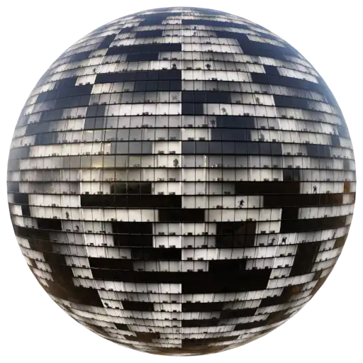

|

**This material is contained in the following Exapacks:**

    - XTRPbr_05k_Vol_001

    - XTRPbr_1k_Vol_001

    - XTRPbr_2k_Vol_001

    - XTRPbr_4k_Vol_006

    - XTRPbr_8k_Vol_002

------------------------------------------------------------------------------------------------------------------------

Windows Facade 011
******************

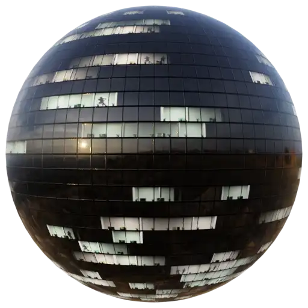

|

**This material is contained in the following Exapacks:**

    - XTRPbr_05k_Vol_001

    - XTRPbr_1k_Vol_001

    - XTRPbr_2k_Vol_001

    - XTRPbr_4k_Vol_006

    - XTRPbr_8k_Vol_002

------------------------------------------------------------------------------------------------------------------------

Windows Facade 012
******************

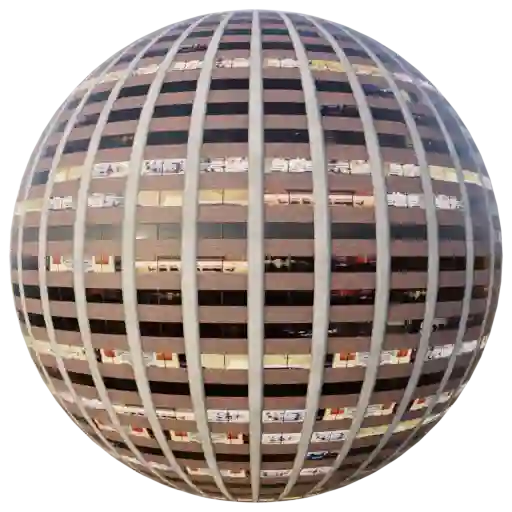

|

**This material is contained in the following Exapacks:**

    - XTRPbr_05k_Vol_001

    - XTRPbr_1k_Vol_001

    - XTRPbr_2k_Vol_001

    - XTRPbr_4k_Vol_006

    - XTRPbr_8k_Vol_002

------------------------------------------------------------------------------------------------------------------------

Windows Facade 013
******************

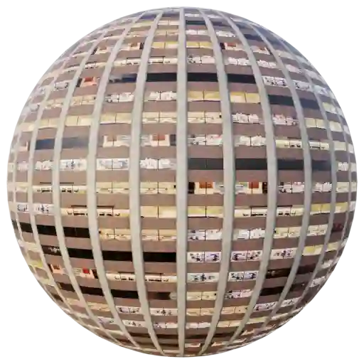

|

**This material is contained in the following Exapacks:**

    - XTRPbr_05k_Vol_001

    - XTRPbr_1k_Vol_001

    - XTRPbr_2k_Vol_001

    - XTRPbr_4k_Vol_006

    - XTRPbr_8k_Vol_002

------------------------------------------------------------------------------------------------------------------------

Windows Facade 014
******************

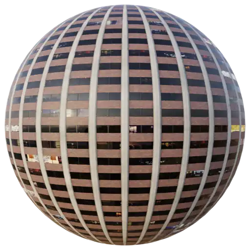

|

**This material is contained in the following Exapacks:**

    - XTRPbr_05k_Vol_001

    - XTRPbr_1k_Vol_001

    - XTRPbr_2k_Vol_001

    - XTRPbr_4k_Vol_006

    - XTRPbr_8k_Vol_002

------------------------------------------------------------------------------------------------------------------------

Windows Facade 015
******************

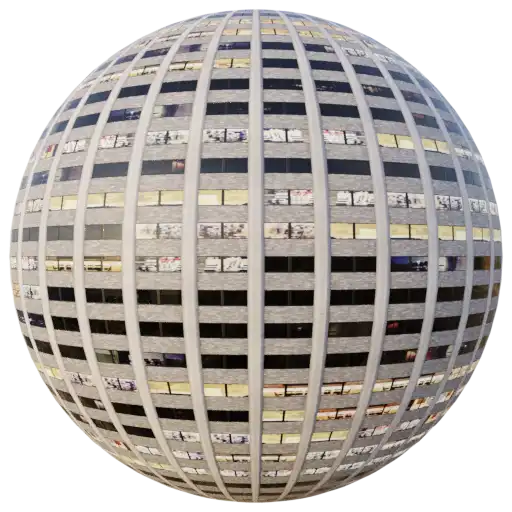

|

**This material is contained in the following Exapacks:**

    - XTRPbr_05k_Vol_001

    - XTRPbr_1k_Vol_001

    - XTRPbr_2k_Vol_001

    - XTRPbr_4k_Vol_006

    - XTRPbr_8k_Vol_002

------------------------------------------------------------------------------------------------------------------------

Windows Facade 016
******************

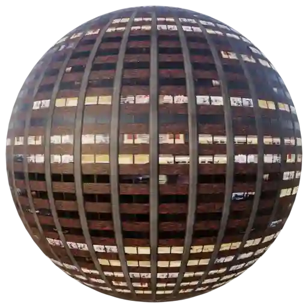

|

**This material is contained in the following Exapacks:**

    - XTRPbr_05k_Vol_001

    - XTRPbr_1k_Vol_001

    - XTRPbr_2k_Vol_001

    - XTRPbr_4k_Vol_006

    - XTRPbr_8k_Vol_002

------------------------------------------------------------------------------------------------------------------------

Windows Facade 017
******************

|

**This material is contained in the following Exapacks:**

    - XTRPbr_05k_Vol_001

    - XTRPbr_1k_Vol_001

    - XTRPbr_2k_Vol_001

    - XTRPbr_4k_Vol_006

    - XTRPbr_8k_Vol_002

------------------------------------------------------------------------------------------------------------------------

Fences (Category)
-----------------

Fencer Wire 001
***************

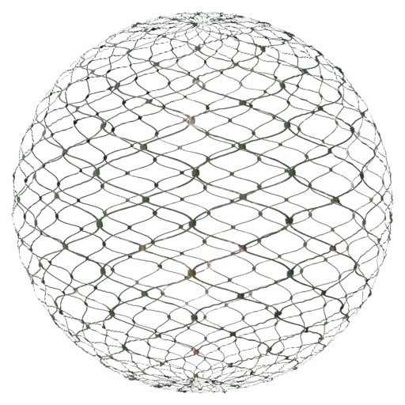

|

**This material is contained in the following Exapacks:**

    - XTRPbr_05k_Vol_001

    - XTRPbr_1k_Vol_001

    - XTRPbr_2k_Vol_001

    - XTRPbr_4k_Vol_006

    - XTRPbr_8k_Vol_002

------------------------------------------------------------------------------------------------------------------------

Fencer Wire 002
***************

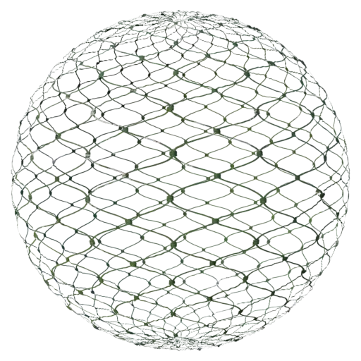

|

**This material is contained in the following Exapacks:**

    - XTRPbr_05k_Vol_001

    - XTRPbr_1k_Vol_001

    - XTRPbr_2k_Vol_001

    - XTRPbr_4k_Vol_006

    - XTRPbr_8k_Vol_002

------------------------------------------------------------------------------------------------------------------------

Fencer Wire 003
***************

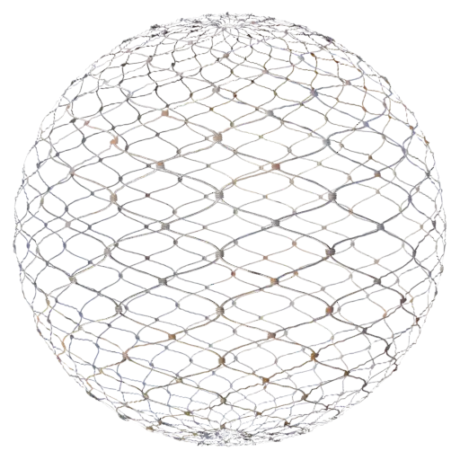

|

**This material is contained in the following Exapacks:**

    - XTRPbr_05k_Vol_001

    - XTRPbr_1k_Vol_001

    - XTRPbr_2k_Vol_001

    - XTRPbr_4k_Vol_006

    - XTRPbr_8k_Vol_002

------------------------------------------------------------------------------------------------------------------------

Fencer Wire 004
***************

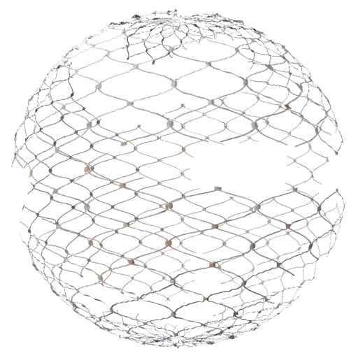

|

**This material is contained in the following Exapacks:**

    - XTRPbr_05k_Vol_001

    - XTRPbr_1k_Vol_001

    - XTRPbr_2k_Vol_001

    - XTRPbr_4k_Vol_006

    - XTRPbr_8k_Vol_002

------------------------------------------------------------------------------------------------------------------------

Fencer Wire 005
***************

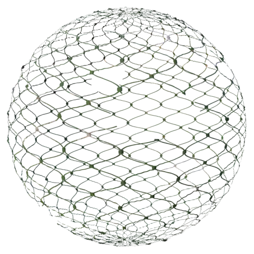

|

**This material is contained in the following Exapacks:**

    - XTRPbr_05k_Vol_001

    - XTRPbr_1k_Vol_001

    - XTRPbr_2k_Vol_001

    - XTRPbr_4k_Vol_006

    - XTRPbr_8k_Vol_002

------------------------------------------------------------------------------------------------------------------------

Fencer Wire 006
***************

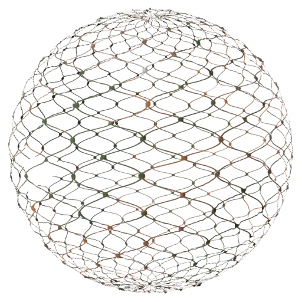

|

**This material is contained in the following Exapacks:**

    - XTRPbr_05k_Vol_001

    - XTRPbr_1k_Vol_001

    - XTRPbr_2k_Vol_001

    - XTRPbr_4k_Vol_006

    - XTRPbr_8k_Vol_002

------------------------------------------------------------------------------------------------------------------------

Fencer Wire 007
***************

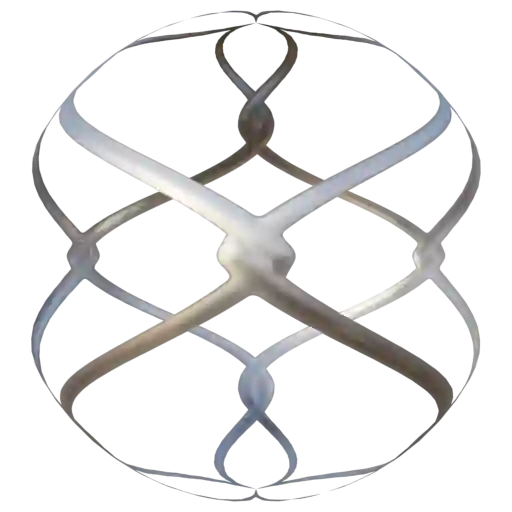

|

**This material is contained in the following Exapacks:**

    - XTRPbr_05k_Vol_001

    - XTRPbr_1k_Vol_001

    - XTRPbr_2k_Vol_001

    - XTRPbr_4k_Vol_006

------------------------------------------------------------------------------------------------------------------------

Wood Fence 001
**************

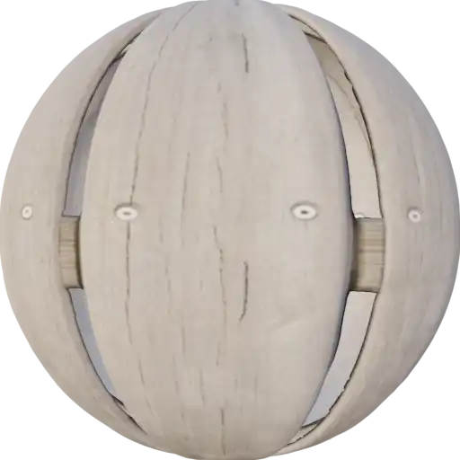

|

**This material is contained in the following Exapacks:**

    - XTRPbr_05k_Vol_001

    - XTRPbr_1k_Vol_001

    - XTRPbr_2k_Vol_001

    - XTRPbr_4k_Vol_006

------------------------------------------------------------------------------------------------------------------------

Fluids (Category)
-----------------

Basic Water
***********

|

**This material is contained in the following Exapacks:**

    - XTRPbr_Procedural_Vol_001

------------------------------------------------------------------------------------------------------------------------

Food (Category)
---------------

Candy 001
*********

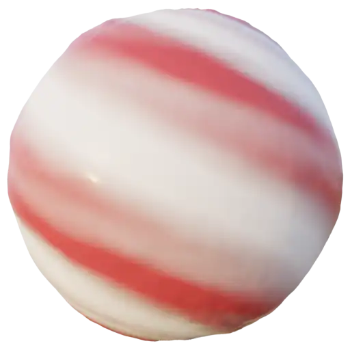

|

**This material is contained in the following Exapacks:**

    - XTRPbr_05k_Vol_001

    - XTRPbr_1k_Vol_001

    - XTRPbr_2k_Vol_001

    - XTRPbr_4k_Vol_006

    - XTRPbr_8k_Vol_002

------------------------------------------------------------------------------------------------------------------------

Candy 002
*********

|

**This material is contained in the following Exapacks:**

    - XTRPbr_05k_Vol_001

    - XTRPbr_1k_Vol_001

    - XTRPbr_2k_Vol_001

    - XTRPbr_4k_Vol_006

    - XTRPbr_8k_Vol_002

------------------------------------------------------------------------------------------------------------------------

Candy 003
*********

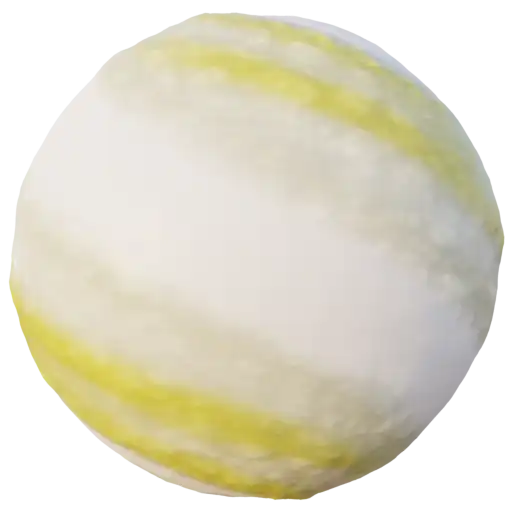

|

**This material is contained in the following Exapacks:**

    - XTRPbr_05k_Vol_001

    - XTRPbr_1k_Vol_001

    - XTRPbr_2k_Vol_001

    - XTRPbr_4k_Vol_006

    - XTRPbr_8k_Vol_002

------------------------------------------------------------------------------------------------------------------------

Cold Cuts 01
************

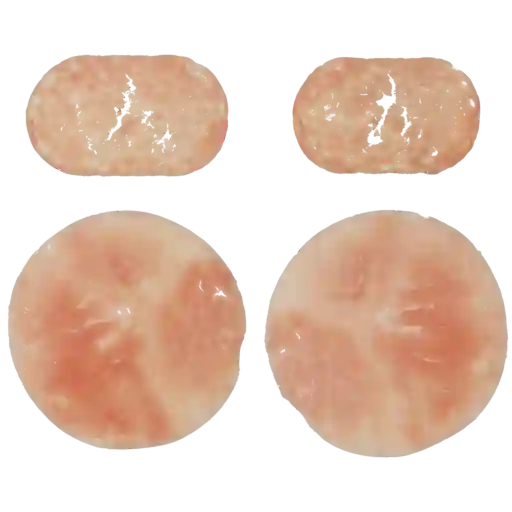

|

**This material is contained in the following Exapacks:**

    - XTRPbr_05k_Vol_001

    - XTRPbr_1k_Vol_001

    - XTRPbr_2k_Vol_001

    - XTRPbr_4k_Vol_006

    - XTRPbr_8k_Vol_002

------------------------------------------------------------------------------------------------------------------------

Corn Flakes 01
**************

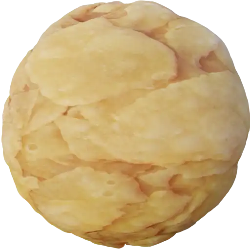

|

**This material is contained in the following Exapacks:**

    - XTRPbr_05k_Vol_001

    - XTRPbr_1k_Vol_001

    - XTRPbr_2k_Vol_001

------------------------------------------------------------------------------------------------------------------------

Mixed Seeds 01
**************

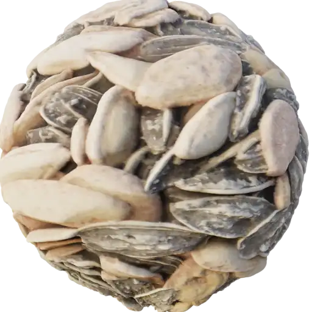

|

**This material is contained in the following Exapacks:**

    - XTRPbr_05k_Vol_001

    - XTRPbr_1k_Vol_001

    - XTRPbr_2k_Vol_001

------------------------------------------------------------------------------------------------------------------------

Oat Pops 01
***********

|

**This material is contained in the following Exapacks:**

    - XTRPbr_05k_Vol_001

    - XTRPbr_1k_Vol_001

    - XTRPbr_2k_Vol_001

------------------------------------------------------------------------------------------------------------------------

Pumpkin Seeds 01
****************

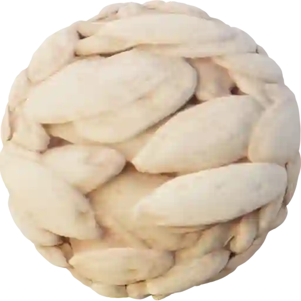

|

**This material is contained in the following Exapacks:**

    - XTRPbr_05k_Vol_001

    - XTRPbr_1k_Vol_001

    - XTRPbr_2k_Vol_001

------------------------------------------------------------------------------------------------------------------------

Raisins 01
**********

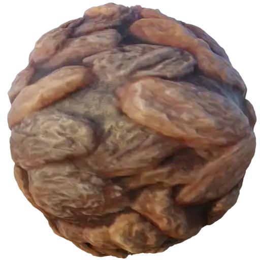

|

**This material is contained in the following Exapacks:**

    - XTRPbr_05k_Vol_001

    - XTRPbr_1k_Vol_001

    - XTRPbr_2k_Vol_001

------------------------------------------------------------------------------------------------------------------------

Sunflower Seeds 01
******************

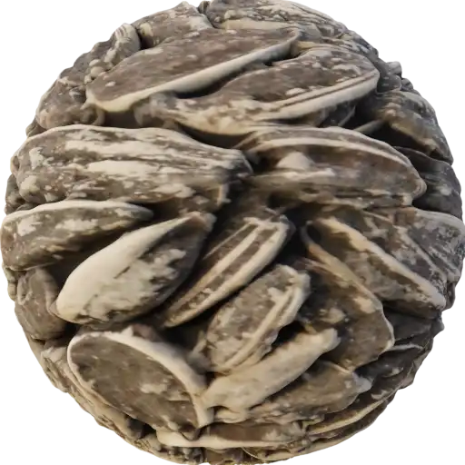

|

**This material is contained in the following Exapacks:**

    - XTRPbr_05k_Vol_001

    - XTRPbr_1k_Vol_001

    - XTRPbr_2k_Vol_001

------------------------------------------------------------------------------------------------------------------------

Glass (Category)
----------------

Glass 001
*********

.. image:: _static/_images/material_list/glass/glass_001/glass_001.webp
    :width: 30%
    :align: center
    :alt: Glass 001

|

**This material is contained in the following Exapacks:**

    - XTRPbr_Procedural_Vol_001

------------------------------------------------------------------------------------------------------------------------

Gravel (Category)
-----------------

Gravel Coarse 001
*****************

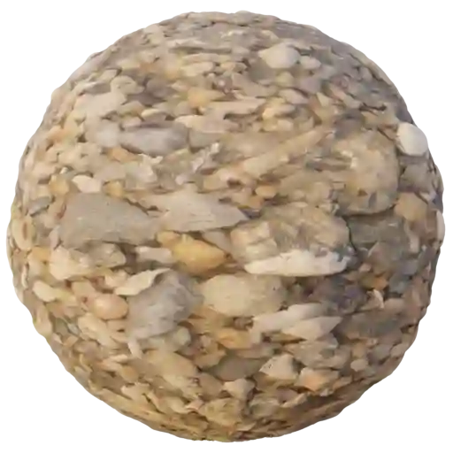

|

**This material is contained in the following Exapacks:**

    - XTRPbr_05k_Vol_001

    - XTRPbr_1k_Vol_001

    - XTRPbr_2k_Vol_001

------------------------------------------------------------------------------------------------------------------------

Gravel Coarse 002
*****************

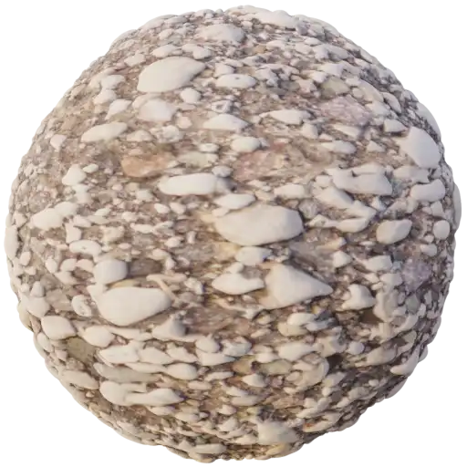

|

**This material is contained in the following Exapacks:**

    - XTRPbr_05k_Vol_001

    - XTRPbr_1k_Vol_001

    - XTRPbr_2k_Vol_001

------------------------------------------------------------------------------------------------------------------------

Gravel Coarse 003
*****************

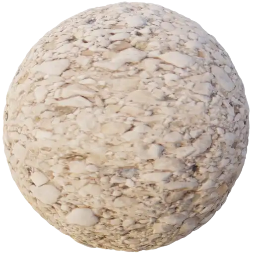

|

**This material is contained in the following Exapacks:**

    - XTRPbr_05k_Vol_001

    - XTRPbr_1k_Vol_001

    - XTRPbr_2k_Vol_001

------------------------------------------------------------------------------------------------------------------------

Gravel Coarse 004
*****************

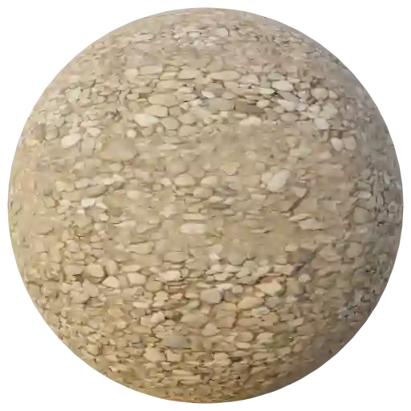

|

**This material is contained in the following Exapacks:**

    - XTRPbr_05k_Vol_001

    - XTRPbr_1k_Vol_001

    - XTRPbr_2k_Vol_001

    - XTRPbr_4k_Vol_006

    - XTRPbr_8k_Vol_002

------------------------------------------------------------------------------------------------------------------------

Gravel Coarse 005
*****************

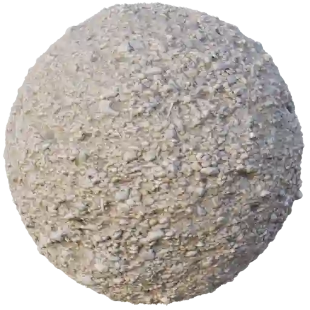

|

**This material is contained in the following Exapacks:**

    - XTRPbr_05k_Vol_001

    - XTRPbr_1k_Vol_001

    - XTRPbr_2k_Vol_001

    - XTRPbr_4k_Vol_006

    - XTRPbr_8k_Vol_002

------------------------------------------------------------------------------------------------------------------------

Gravel Coarse 006
*****************

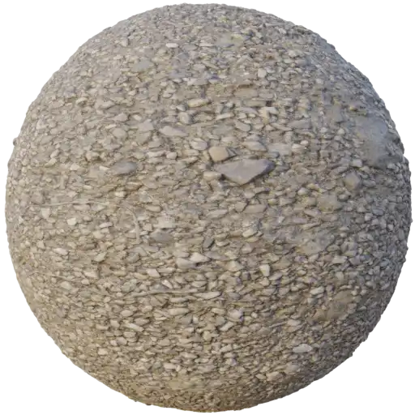

|

**This material is contained in the following Exapacks:**

    - XTRPbr_05k_Vol_001

    - XTRPbr_1k_Vol_001

    - XTRPbr_2k_Vol_001

    - XTRPbr_4k_Vol_006

    - XTRPbr_8k_Vol_002

------------------------------------------------------------------------------------------------------------------------

Gravel Coarse 007
*****************

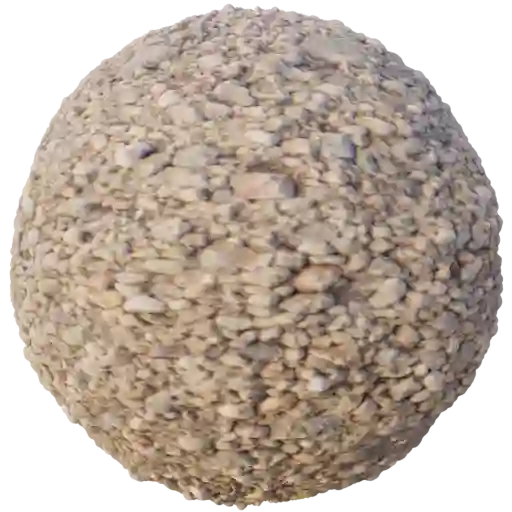

|

**This material is contained in the following Exapacks:**

    - XTRPbr_05k_Vol_001

    - XTRPbr_1k_Vol_001

    - XTRPbr_2k_Vol_001

------------------------------------------------------------------------------------------------------------------------

Gravel Coarse 008
*****************

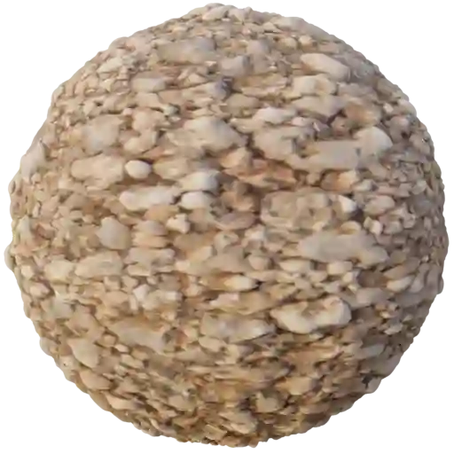

|

**This material is contained in the following Exapacks:**

    - XTRPbr_05k_Vol_001

    - XTRPbr_1k_Vol_001

    - XTRPbr_2k_Vol_001

------------------------------------------------------------------------------------------------------------------------

Gravel Coarse 009
*****************

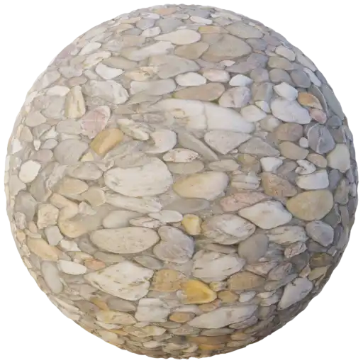

|

**This material is contained in the following Exapacks:**

    - XTRPbr_05k_Vol_001

    - XTRPbr_1k_Vol_001

    - XTRPbr_2k_Vol_001

    - XTRPbr_4k_Vol_006

    - XTRPbr_8k_Vol_002

------------------------------------------------------------------------------------------------------------------------

Gravel Coarse 010
*****************

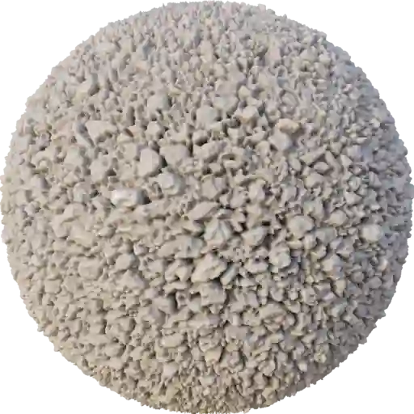

|

**This material is contained in the following Exapacks:**

    - XTRPbr_05k_Vol_001

    - XTRPbr_1k_Vol_001

    - XTRPbr_2k_Vol_001

    - XTRPbr_4k_Vol_006

------------------------------------------------------------------------------------------------------------------------

Gravel Coarse 011
*****************

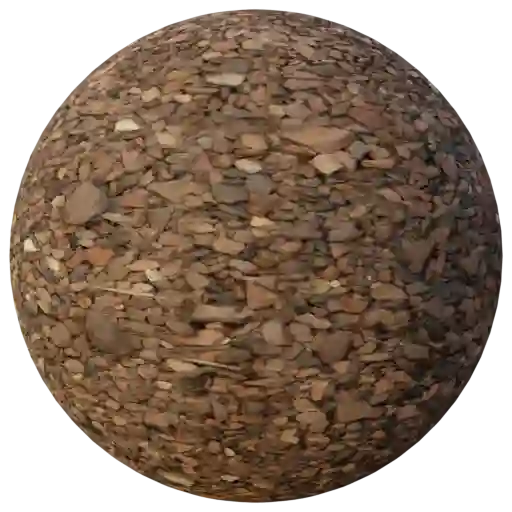

|

**This material is contained in the following Exapacks:**

    - XTRPbr_05k_Vol_001

    - XTRPbr_1k_Vol_001

    - XTRPbr_2k_Vol_001

    - XTRPbr_2k_Vol_003

    - XTRPbr_4k_Vol_006

    - XTRPbr_8k_Vol_002

------------------------------------------------------------------------------------------------------------------------

Gravel Coarse 012
*****************

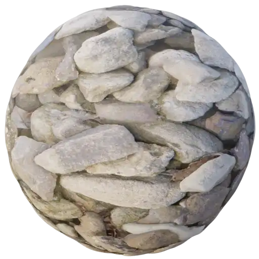

|

**This material is contained in the following Exapacks:**

    - XTRPbr_05k_Vol_001

    - XTRPbr_1k_Vol_001

    - XTRPbr_2k_Vol_003

    - XTRPbr_4k_Vol_006

    - XTRPbr_8k_Vol_002

------------------------------------------------------------------------------------------------------------------------

Gravel Coarse 013
*****************

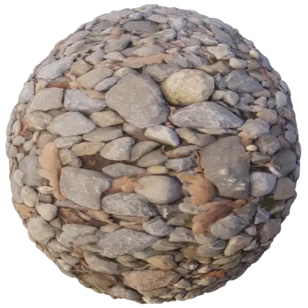

|

**This material is contained in the following Exapacks:**

    - XTRPbr_05k_Vol_001

    - XTRPbr_1k_Vol_001

    - XTRPbr_2k_Vol_003

    - XTRPbr_4k_Vol_006

------------------------------------------------------------------------------------------------------------------------

Gravel Coarse 014
*****************

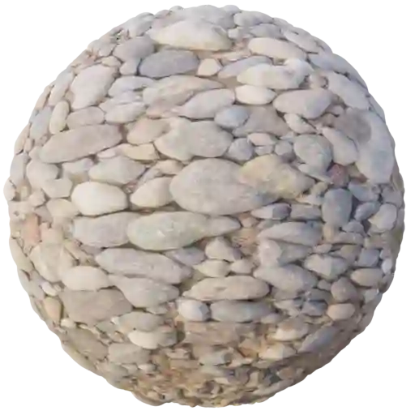

|

**This material is contained in the following Exapacks:**

    - XTRPbr_05k_Vol_001

    - XTRPbr_1k_Vol_001

    - XTRPbr_2k_Vol_003

------------------------------------------------------------------------------------------------------------------------

Gravel Coarse 015
*****************

.. image:: _static/_images/material_list/gravel/gravel_coarse_015/gravel_coarse_015.webp
    :width: 30%
    :align: center
    :alt: Gravel Coarse 015

|

**This material is contained in the following Exapacks:**

    - XTRPbr_05k_Vol_001

    - XTRPbr_1k_Vol_001

    - XTRPbr_2k_Vol_003

    - XTRPbr_4k_Vol_006

    - XTRPbr_8k_Vol_002

------------------------------------------------------------------------------------------------------------------------

Gravel Coarse 016
*****************

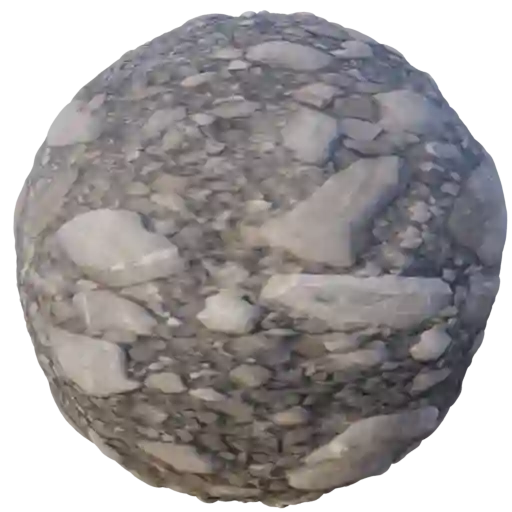

|

**This material is contained in the following Exapacks:**

    - XTRPbr_05k_Vol_001

    - XTRPbr_1k_Vol_001

    - XTRPbr_2k_Vol_003

------------------------------------------------------------------------------------------------------------------------

Gravel Coarse 017
*****************

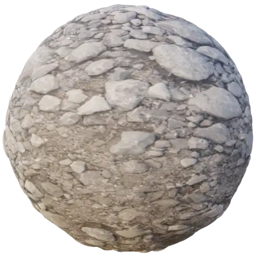

|

**This material is contained in the following Exapacks:**

    - XTRPbr_05k_Vol_001

    - XTRPbr_1k_Vol_001

    - XTRPbr_2k_Vol_003

------------------------------------------------------------------------------------------------------------------------

Gravel Coarse 018
*****************

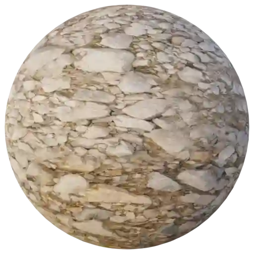

|

**This material is contained in the following Exapacks:**

    - XTRPbr_05k_Vol_001

    - XTRPbr_1k_Vol_001

    - XTRPbr_2k_Vol_003

    - XTRPbr_4k_Vol_006

    - XTRPbr_8k_Vol_002

------------------------------------------------------------------------------------------------------------------------

Gravel Fine 001
***************

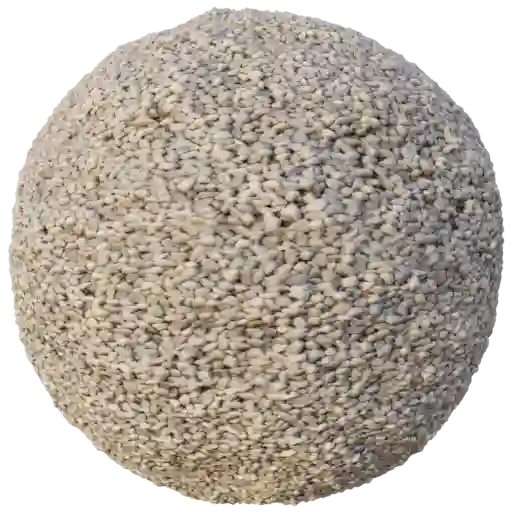

|

**This material is contained in the following Exapacks:**

    - XTRPbr_05k_Vol_001

    - XTRPbr_1k_Vol_001

    - XTRPbr_2k_Vol_003

    - XTRPbr_4k_Vol_006

    - XTRPbr_8k_Vol_002

------------------------------------------------------------------------------------------------------------------------

Gravel Fine 002
***************

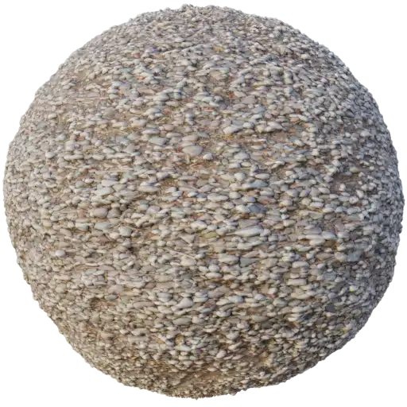

|

**This material is contained in the following Exapacks:**

    - XTRPbr_05k_Vol_001

    - XTRPbr_1k_Vol_001

    - XTRPbr_2k_Vol_003

    - XTRPbr_4k_Vol_006

    - XTRPbr_8k_Vol_002

------------------------------------------------------------------------------------------------------------------------

Gravel Fine 003
***************

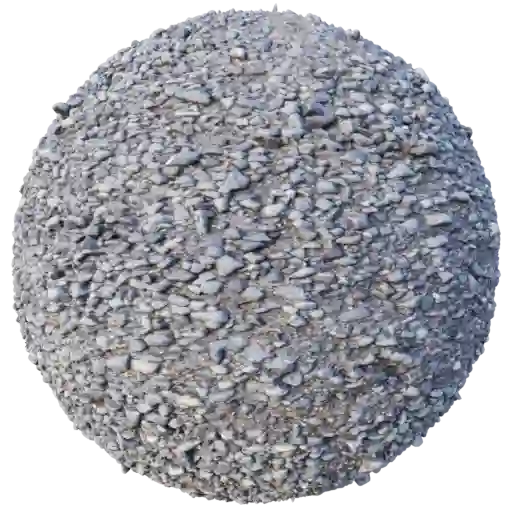

|

**This material is contained in the following Exapacks:**

    - XTRPbr_05k_Vol_001

    - XTRPbr_1k_Vol_001

    - XTRPbr_2k_Vol_003

    - XTRPbr_4k_Vol_006

    - XTRPbr_8k_Vol_002

------------------------------------------------------------------------------------------------------------------------

Gravel Fine 004
***************

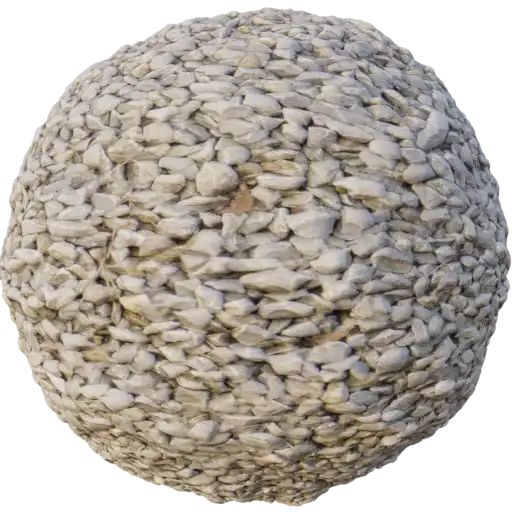

|

**This material is contained in the following Exapacks:**

    - XTRPbr_05k_Vol_001

    - XTRPbr_1k_Vol_001

    - XTRPbr_2k_Vol_003

    - XTRPbr_4k_Vol_006

    - XTRPbr_8k_Vol_002

------------------------------------------------------------------------------------------------------------------------

Gravel Fine 005
***************

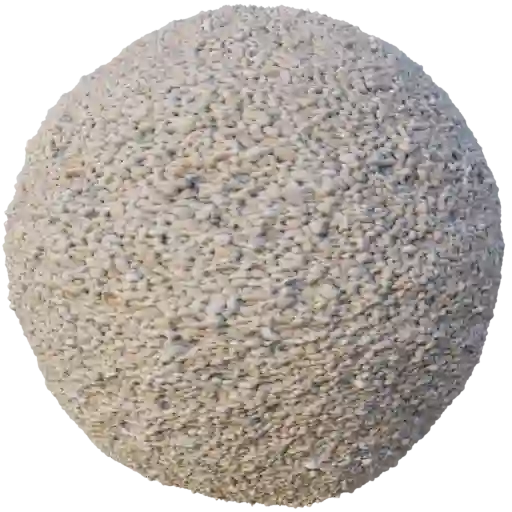

|

**This material is contained in the following Exapacks:**

    - XTRPbr_05k_Vol_001

    - XTRPbr_1k_Vol_001

    - XTRPbr_2k_Vol_003

    - XTRPbr_4k_Vol_006

    - XTRPbr_8k_Vol_002

------------------------------------------------------------------------------------------------------------------------

Gravel Fine 006
***************

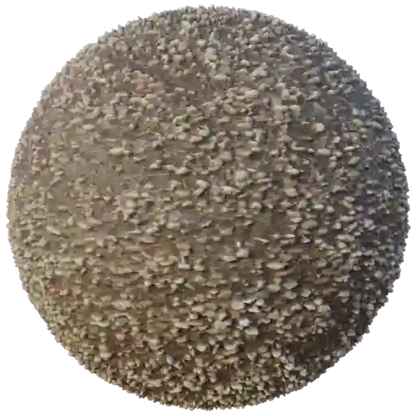

|

**This material is contained in the following Exapacks:**

    - XTRPbr_05k_Vol_001

    - XTRPbr_1k_Vol_001

    - XTRPbr_2k_Vol_003

    - XTRPbr_4k_Vol_006

    - XTRPbr_8k_Vol_002

------------------------------------------------------------------------------------------------------------------------

Gravel Fine 007
***************

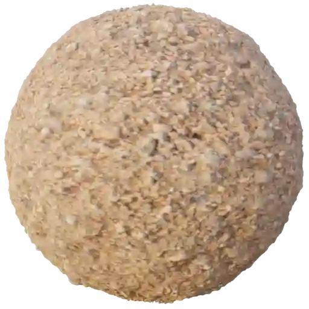

|

**This material is contained in the following Exapacks:**

    - XTRPbr_05k_Vol_001

    - XTRPbr_1k_Vol_001

    - XTRPbr_2k_Vol_003

------------------------------------------------------------------------------------------------------------------------

Gravel Fine 008
***************

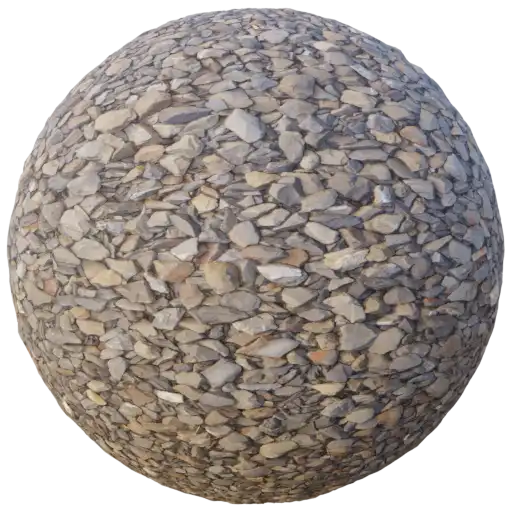

|

**This material is contained in the following Exapacks:**

    - XTRPbr_05k_Vol_001

    - XTRPbr_1k_Vol_001

    - XTRPbr_2k_Vol_003

    - XTRPbr_4k_Vol_006

    - XTRPbr_8k_Vol_002

    - XTRPbr_8k_Vol_027

------------------------------------------------------------------------------------------------------------------------

Gravel Fine 009
***************

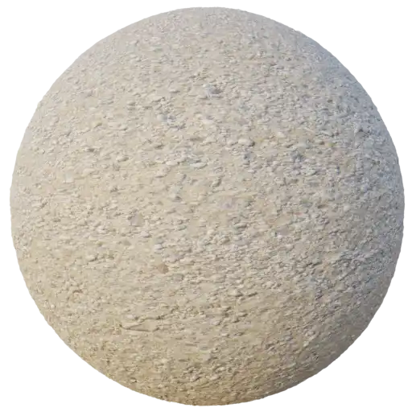

|

**This material is contained in the following Exapacks:**

    - XTRPbr_05k_Vol_001

    - XTRPbr_1k_Vol_001

    - XTRPbr_2k_Vol_003

    - XTRPbr_4k_Vol_006

    - XTRPbr_8k_Vol_027

------------------------------------------------------------------------------------------------------------------------

Gravel Fine 010
***************

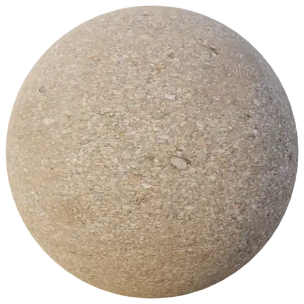

|

**This material is contained in the following Exapacks:**

    - XTRPbr_05k_Vol_001

    - XTRPbr_1k_Vol_001

    - XTRPbr_2k_Vol_003

    - XTRPbr_4k_Vol_006

    - XTRPbr_8k_Vol_027

------------------------------------------------------------------------------------------------------------------------

Gravel Fine 011
***************

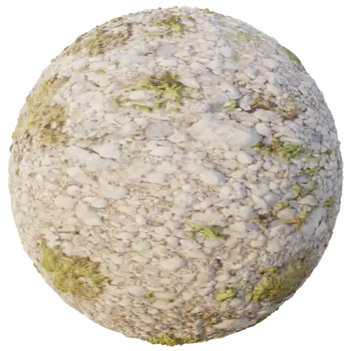

|

**This material is contained in the following Exapacks:**

    - XTRPbr_05k_Vol_001

    - XTRPbr_1k_Vol_001

    - XTRPbr_2k_Vol_003

------------------------------------------------------------------------------------------------------------------------

Ground - Sandy (Category)
-------------------------

Sand Coarse 001
***************

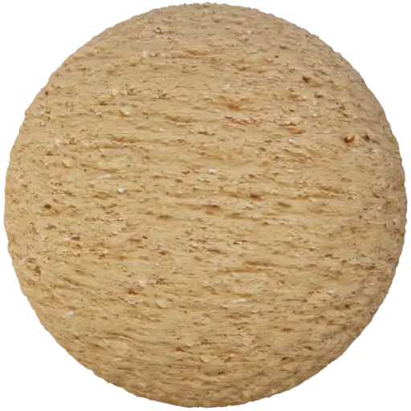

|

**This material is contained in the following Exapacks:**

    - XTRPbr_05k_Vol_001

    - XTRPbr_1k_Vol_001

    - XTRPbr_2k_Vol_003

    - XTRPbr_4k_Vol_006

------------------------------------------------------------------------------------------------------------------------

Sand Coarse 002
***************

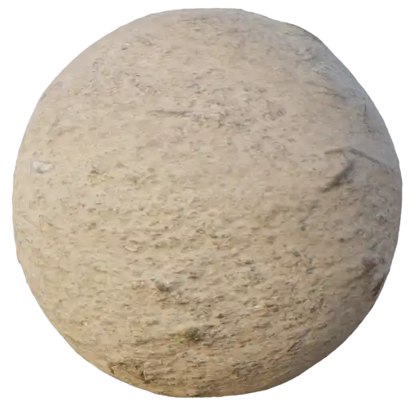

|

**This material is contained in the following Exapacks:**

    - XTRPbr_05k_Vol_001

    - XTRPbr_1k_Vol_001

    - XTRPbr_2k_Vol_003

    - XTRPbr_4k_Vol_006

    - XTRPbr_8k_Vol_027

------------------------------------------------------------------------------------------------------------------------

Sand Coarse 003
***************

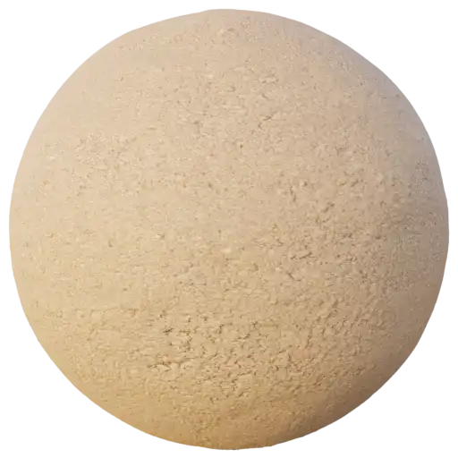

|

**This material is contained in the following Exapacks:**

    - XTRPbr_05k_Vol_001

    - XTRPbr_1k_Vol_001

    - XTRPbr_2k_Vol_003

    - XTRPbr_4k_Vol_006

    - XTRPbr_8k_Vol_027

------------------------------------------------------------------------------------------------------------------------

Sand Coarse 004
***************

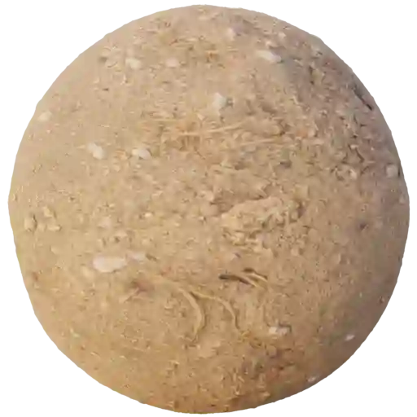

|

**This material is contained in the following Exapacks:**

    - XTRPbr_05k_Vol_001

    - XTRPbr_1k_Vol_001

    - XTRPbr_2k_Vol_003

------------------------------------------------------------------------------------------------------------------------

Sand Fine 001
*************

.. image:: _static/_images/material_list/ground_sandy/sand_fine_001/sand_fine_001.webp
    :width: 30%
    :align: center
    :alt: Sand Fine 001

|

**This material is contained in the following Exapacks:**

    - XTRPbr_05k_Vol_001

    - XTRPbr_1k_Vol_001

    - XTRPbr_2k_Vol_003

    - XTRPbr_4k_Vol_006

    - XTRPbr_8k_Vol_027

------------------------------------------------------------------------------------------------------------------------

Sand Fine 002
*************

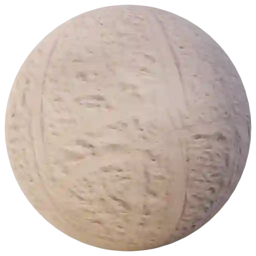

|

**This material is contained in the following Exapacks:**

    - XTRPbr_05k_Vol_001

    - XTRPbr_1k_Vol_001

    - XTRPbr_2k_Vol_003

    - XTRPbr_4k_Vol_006

    - XTRPbr_8k_Vol_027

------------------------------------------------------------------------------------------------------------------------

Sand Fine 003
*************

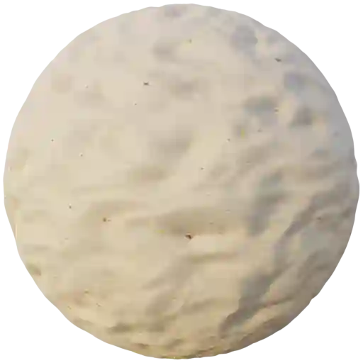

|

**This material is contained in the following Exapacks:**

    - XTRPbr_05k_Vol_001

    - XTRPbr_1k_Vol_001

    - XTRPbr_2k_Vol_003

    - XTRPbr_4k_Vol_006

    - XTRPbr_8k_Vol_027

------------------------------------------------------------------------------------------------------------------------

Sand Fine 004
*************

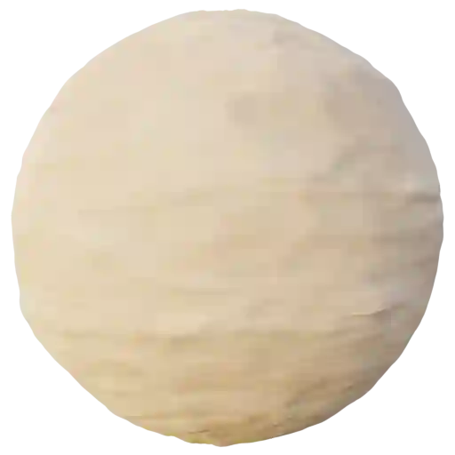

|

**This material is contained in the following Exapacks:**

    - XTRPbr_05k_Vol_001

    - XTRPbr_1k_Vol_001

    - XTRPbr_2k_Vol_003

    - XTRPbr_4k_Vol_006

    - XTRPbr_8k_Vol_027

------------------------------------------------------------------------------------------------------------------------

Sand Fine 005
*************

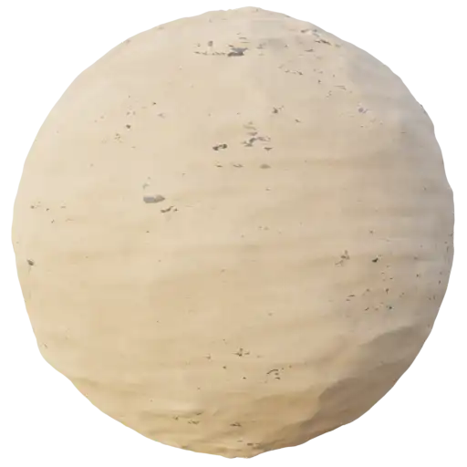

|

**This material is contained in the following Exapacks:**

    - XTRPbr_05k_Vol_001

    - XTRPbr_1k_Vol_001

    - XTRPbr_2k_Vol_003

    - XTRPbr_4k_Vol_006

    - XTRPbr_8k_Vol_027

------------------------------------------------------------------------------------------------------------------------

Sand Fine 006
*************

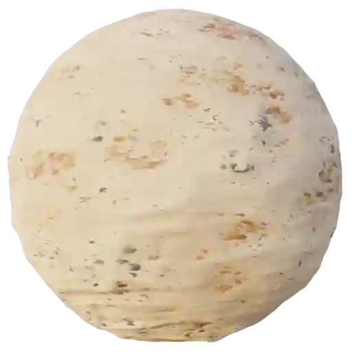

|

**This material is contained in the following Exapacks:**

    - XTRPbr_05k_Vol_001

    - XTRPbr_1k_Vol_001

    - XTRPbr_2k_Vol_003

    - XTRPbr_4k_Vol_006

    - XTRPbr_8k_Vol_027

------------------------------------------------------------------------------------------------------------------------

Sand Fine 007
*************

.. image:: _static/_images/material_list/ground_sandy/sand_fine_007/sand_fine_007.webp
    :width: 30%
    :align: center
    :alt: Sand Fine 007

|

**This material is contained in the following Exapacks:**

    - XTRPbr_05k_Vol_001

    - XTRPbr_1k_Vol_001

    - XTRPbr_2k_Vol_003

    - XTRPbr_4k_Vol_006

    - XTRPbr_8k_Vol_027

------------------------------------------------------------------------------------------------------------------------

Ground - Snow (Category)
------------------------

Snow 001
********

|

**This material is contained in the following Exapacks:**

    - XTRPbr_05k_Vol_001

    - XTRPbr_1k_Vol_001

    - XTRPbr_2k_Vol_003

    - XTRPbr_4k_Vol_006

    - XTRPbr_8k_Vol_027

------------------------------------------------------------------------------------------------------------------------

Snow 002
********

|

**This material is contained in the following Exapacks:**

    - XTRPbr_05k_Vol_001

    - XTRPbr_1k_Vol_001

    - XTRPbr_2k_Vol_003

    - XTRPbr_4k_Vol_006

    - XTRPbr_8k_Vol_027

------------------------------------------------------------------------------------------------------------------------

Snow 003
********

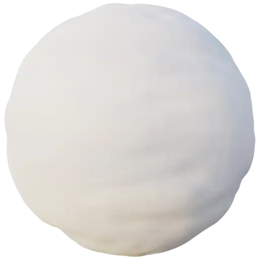

|

**This material is contained in the following Exapacks:**

    - XTRPbr_05k_Vol_001

    - XTRPbr_1k_Vol_001

    - XTRPbr_2k_Vol_003

    - XTRPbr_4k_Vol_006

    - XTRPbr_8k_Vol_027

------------------------------------------------------------------------------------------------------------------------

Snow 004
********

|

**This material is contained in the following Exapacks:**

    - XTRPbr_05k_Vol_001

    - XTRPbr_1k_Vol_001

    - XTRPbr_2k_Vol_003

    - XTRPbr_4k_Vol_006

    - XTRPbr_8k_Vol_027

------------------------------------------------------------------------------------------------------------------------

Snow 005
********

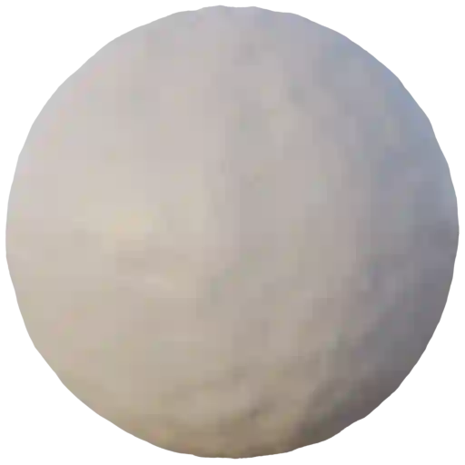

|

**This material is contained in the following Exapacks:**

    - XTRPbr_05k_Vol_001

    - XTRPbr_1k_Vol_001

    - XTRPbr_2k_Vol_003

    - XTRPbr_4k_Vol_006

    - XTRPbr_8k_Vol_027

------------------------------------------------------------------------------------------------------------------------

Snow 006
********

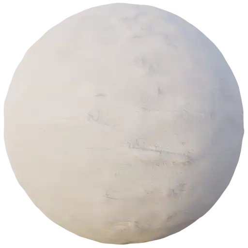

|

**This material is contained in the following Exapacks:**

    - XTRPbr_05k_Vol_001

    - XTRPbr_1k_Vol_001

    - XTRPbr_2k_Vol_003

    - XTRPbr_4k_Vol_006

    - XTRPbr_8k_Vol_027

------------------------------------------------------------------------------------------------------------------------

Snow 007
********

.. image:: _static/_images/material_list/ground_snow/snow_007/snow_007.webp
    :width: 30%
    :align: center
    :alt: Snow 007

|

**This material is contained in the following Exapacks:**

    - XTRPbr_05k_Vol_001

    - XTRPbr_1k_Vol_001

    - XTRPbr_2k_Vol_003

    - XTRPbr_4k_Vol_006

    - XTRPbr_8k_Vol_027

------------------------------------------------------------------------------------------------------------------------

Snow 008
********

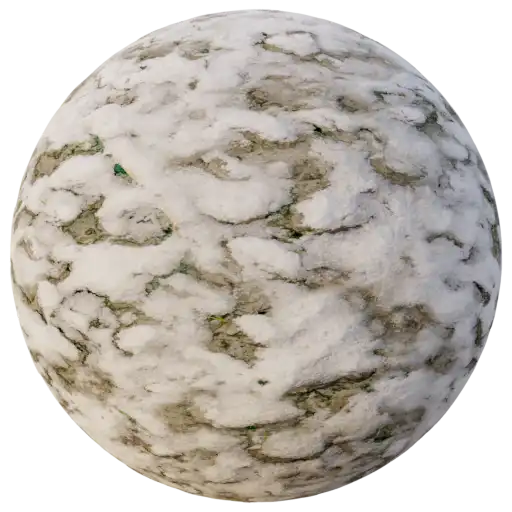

|

**This material is contained in the following Exapacks:**

    - XTRPbr_05k_Vol_001

    - XTRPbr_1k_Vol_001

    - XTRPbr_2k_Vol_003

    - XTRPbr_4k_Vol_006

    - XTRPbr_8k_Vol_027

------------------------------------------------------------------------------------------------------------------------

Snow 009
********

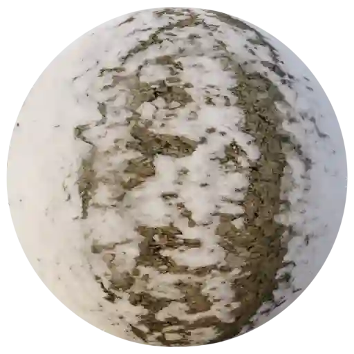

|

**This material is contained in the following Exapacks:**

    - XTRPbr_05k_Vol_001

    - XTRPbr_1k_Vol_001

    - XTRPbr_2k_Vol_003

    - XTRPbr_4k_Vol_006

    - XTRPbr_8k_Vol_027

------------------------------------------------------------------------------------------------------------------------

Snow 010
********

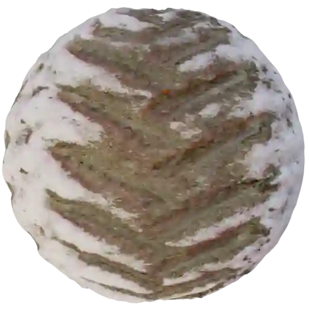

|

**This material is contained in the following Exapacks:**

    - XTRPbr_05k_Vol_001

    - XTRPbr_1k_Vol_001

    - XTRPbr_2k_Vol_003

    - XTRPbr_4k_Vol_006

    - XTRPbr_8k_Vol_027

------------------------------------------------------------------------------------------------------------------------

Ground - Soil (Category)
------------------------

Burned Soil 01
**************

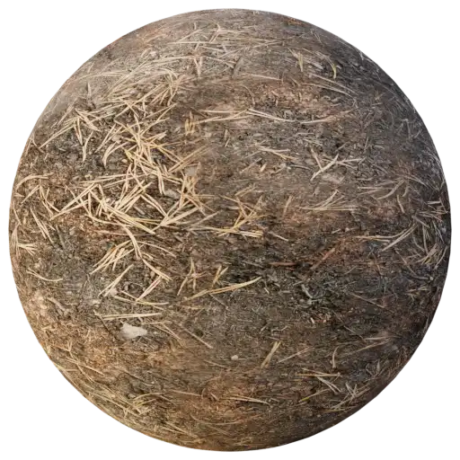

|

**This material is contained in the following Exapacks:**

    - XTRPbr_05k_Vol_001

    - XTRPbr_1k_Vol_001

    - XTRPbr_2k_Vol_003

    - XTRPbr_4k_Vol_006

    - XTRPbr_8k_Vol_027

------------------------------------------------------------------------------------------------------------------------

Dry Soil 001
************

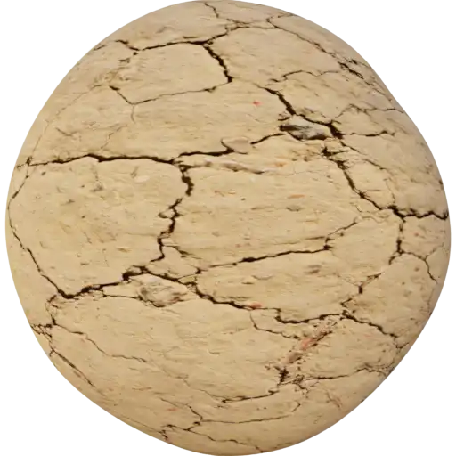

|

**This material is contained in the following Exapacks:**

    - XTRPbr_05k_Vol_001

    - XTRPbr_1k_Vol_001

    - XTRPbr_2k_Vol_003

    - XTRPbr_4k_Vol_006

------------------------------------------------------------------------------------------------------------------------

Dry Soil 002
************

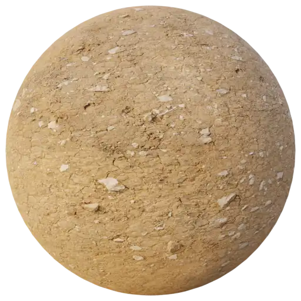

|

**This material is contained in the following Exapacks:**

    - XTRPbr_05k_Vol_001

    - XTRPbr_1k_Vol_001

    - XTRPbr_2k_Vol_003

    - XTRPbr_4k_Vol_006

    - XTRPbr_8k_Vol_027

------------------------------------------------------------------------------------------------------------------------

Dry Soil 003
************

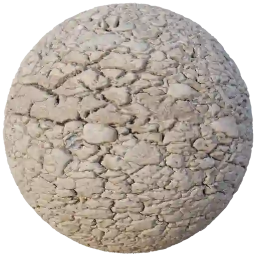

|

**This material is contained in the following Exapacks:**

    - XTRPbr_05k_Vol_001

    - XTRPbr_1k_Vol_001

    - XTRPbr_2k_Vol_003

    - XTRPbr_4k_Vol_006

    - XTRPbr_8k_Vol_027

------------------------------------------------------------------------------------------------------------------------

Dry Soil 004
************

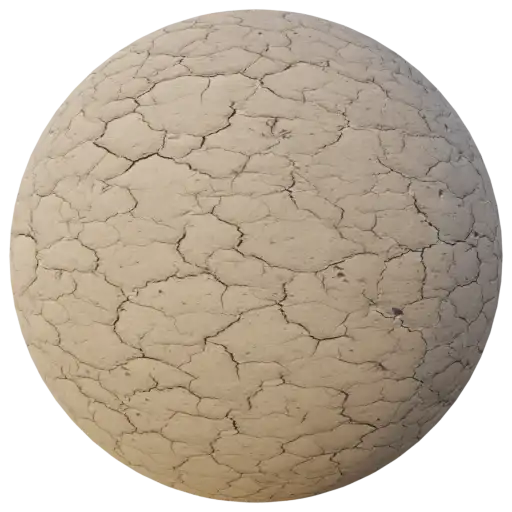

|

**This material is contained in the following Exapacks:**

    - XTRPbr_05k_Vol_001

    - XTRPbr_1k_Vol_001

    - XTRPbr_2k_Vol_003

    - XTRPbr_4k_Vol_006

    - XTRPbr_8k_Vol_027

------------------------------------------------------------------------------------------------------------------------

Dry Soil 005
************

.. image:: _static/_images/material_list/ground_soil/dry_soil_005/dry_soil_005.webp
    :width: 30%
    :align: center
    :alt: Dry Soil 005

|

**This material is contained in the following Exapacks:**

    - XTRPbr_05k_Vol_001

    - XTRPbr_1k_Vol_001

    - XTRPbr_2k_Vol_003

    - XTRPbr_4k_Vol_006

------------------------------------------------------------------------------------------------------------------------

Dry Soil 006
************

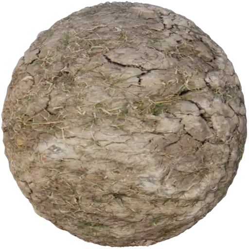

|

**This material is contained in the following Exapacks:**

    - XTRPbr_05k_Vol_001

    - XTRPbr_1k_Vol_001

    - XTRPbr_2k_Vol_003

    - XTRPbr_4k_Vol_006

------------------------------------------------------------------------------------------------------------------------

Soil 001
********

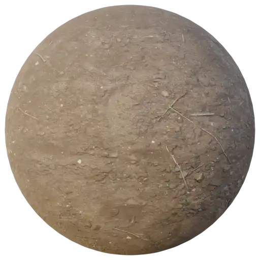

|

**This material is contained in the following Exapacks:**

    - XTRPbr_05k_Vol_001

    - XTRPbr_1k_Vol_001

    - XTRPbr_2k_Vol_003

    - XTRPbr_4k_Vol_006

    - XTRPbr_8k_Vol_028

------------------------------------------------------------------------------------------------------------------------

Soil 002
********

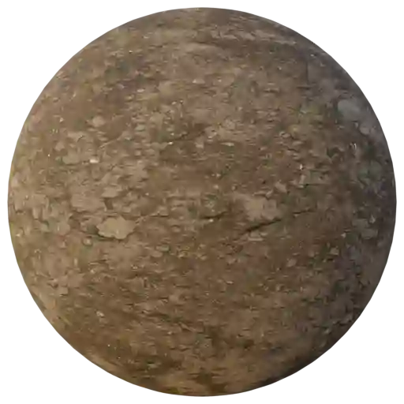

|

**This material is contained in the following Exapacks:**

    - XTRPbr_05k_Vol_001

    - XTRPbr_1k_Vol_001

    - XTRPbr_2k_Vol_003

    - XTRPbr_4k_Vol_006

    - XTRPbr_8k_Vol_028

------------------------------------------------------------------------------------------------------------------------

Soil 003
********

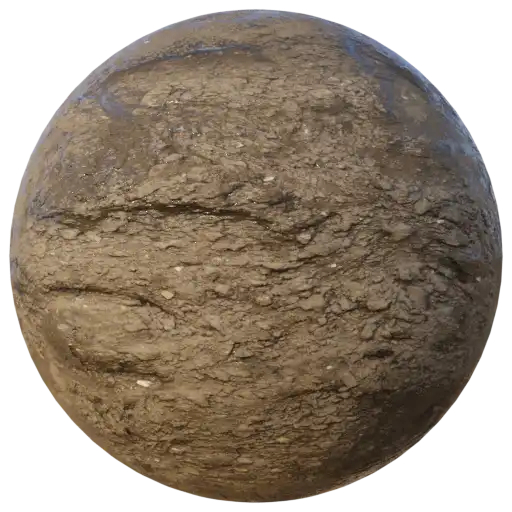

|

**This material is contained in the following Exapacks:**

    - XTRPbr_05k_Vol_001

    - XTRPbr_1k_Vol_001

    - XTRPbr_2k_Vol_003

    - XTRPbr_4k_Vol_006

    - XTRPbr_8k_Vol_028

------------------------------------------------------------------------------------------------------------------------

Soil 004
********

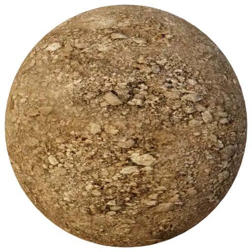

|

**This material is contained in the following Exapacks:**

    - XTRPbr_05k_Vol_001

    - XTRPbr_1k_Vol_001

    - XTRPbr_2k_Vol_003

    - XTRPbr_4k_Vol_006

    - XTRPbr_8k_Vol_028

------------------------------------------------------------------------------------------------------------------------

Soil 005
********

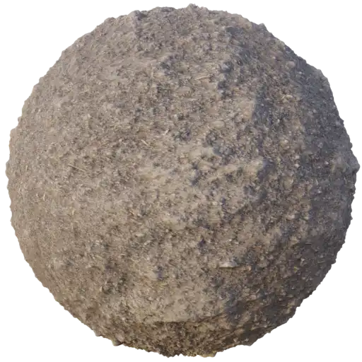

|

**This material is contained in the following Exapacks:**

    - XTRPbr_05k_Vol_001

    - XTRPbr_1k_Vol_001

    - XTRPbr_2k_Vol_003

    - XTRPbr_4k_Vol_006

------------------------------------------------------------------------------------------------------------------------

Soil 006
********

.. image:: _static/_images/material_list/ground_soil/soil_006/soil_006.webp
    :width: 30%
    :align: center
    :alt: Soil 006

|

**This material is contained in the following Exapacks:**

    - XTRPbr_05k_Vol_001

    - XTRPbr_1k_Vol_001

    - XTRPbr_2k_Vol_003

    - XTRPbr_4k_Vol_006

    - XTRPbr_8k_Vol_028

------------------------------------------------------------------------------------------------------------------------

Soil 007
********

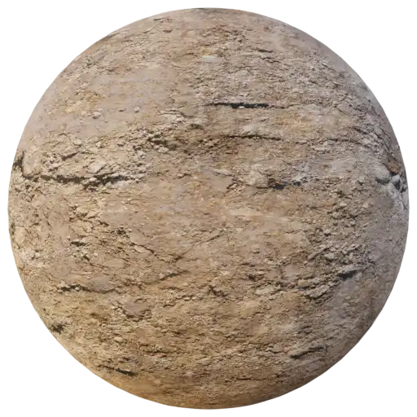

|

**This material is contained in the following Exapacks:**

    - XTRPbr_05k_Vol_001

    - XTRPbr_1k_Vol_001

    - XTRPbr_2k_Vol_003

    - XTRPbr_4k_Vol_006

    - XTRPbr_8k_Vol_028

------------------------------------------------------------------------------------------------------------------------

Soil 008
********

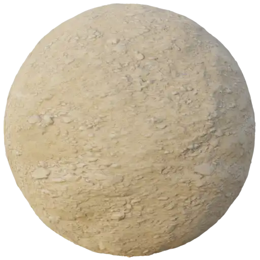

|

**This material is contained in the following Exapacks:**

    - XTRPbr_05k_Vol_001

    - XTRPbr_1k_Vol_001

    - XTRPbr_2k_Vol_003

    - XTRPbr_4k_Vol_006

    - XTRPbr_8k_Vol_028

------------------------------------------------------------------------------------------------------------------------

Soil 009
********

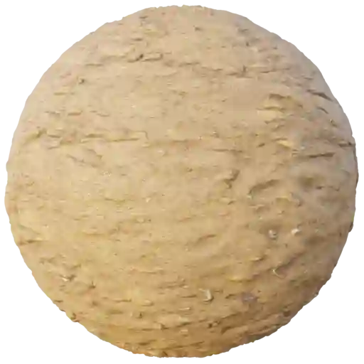

|

**This material is contained in the following Exapacks:**

    - XTRPbr_05k_Vol_001

    - XTRPbr_1k_Vol_001

    - XTRPbr_2k_Vol_003

    - XTRPbr_4k_Vol_006

    - XTRPbr_8k_Vol_028

------------------------------------------------------------------------------------------------------------------------

Soil 010
********

.. image:: _static/_images/material_list/ground_soil/soil_010/soil_010.webp
    :width: 30%
    :align: center
    :alt: Soil 010

|

**This material is contained in the following Exapacks:**

    - XTRPbr_05k_Vol_001

    - XTRPbr_1k_Vol_001

    - XTRPbr_2k_Vol_003

    - XTRPbr_4k_Vol_006

    - XTRPbr_8k_Vol_028

------------------------------------------------------------------------------------------------------------------------

Soil 011
********

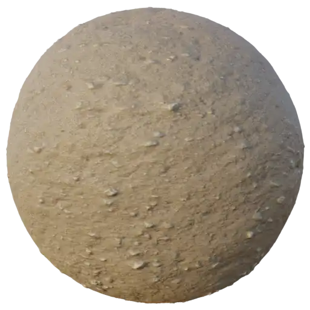

|

**This material is contained in the following Exapacks:**

    - XTRPbr_05k_Vol_001

    - XTRPbr_1k_Vol_001

    - XTRPbr_2k_Vol_003

    - XTRPbr_4k_Vol_006

    - XTRPbr_8k_Vol_028

------------------------------------------------------------------------------------------------------------------------

Soil 012
********

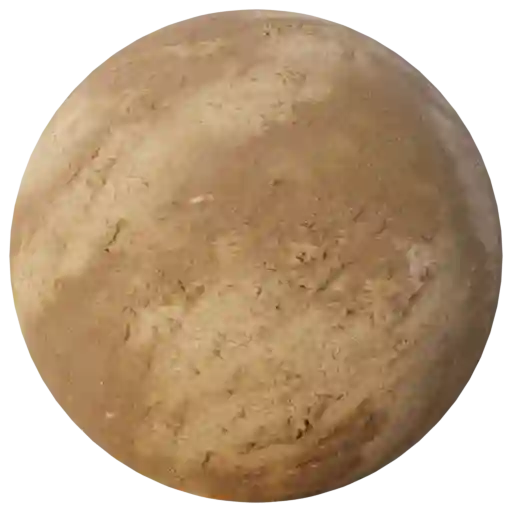

|

**This material is contained in the following Exapacks:**

    - XTRPbr_05k_Vol_001

    - XTRPbr_1k_Vol_001

    - XTRPbr_2k_Vol_003

    - XTRPbr_4k_Vol_006

    - XTRPbr_8k_Vol_028

------------------------------------------------------------------------------------------------------------------------

Soil 013
********

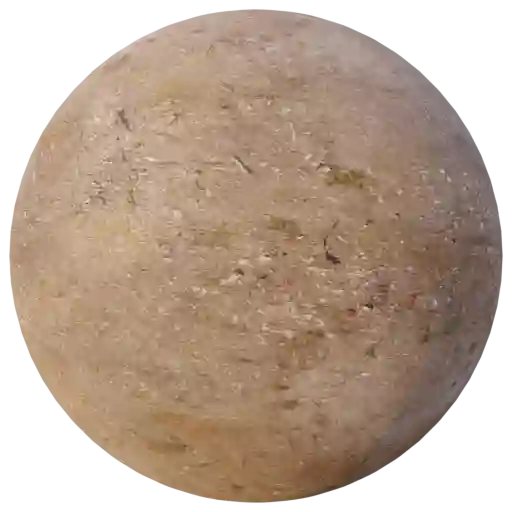

|

**This material is contained in the following Exapacks:**

    - XTRPbr_05k_Vol_001

    - XTRPbr_1k_Vol_001

    - XTRPbr_2k_Vol_003

    - XTRPbr_4k_Vol_006

    - XTRPbr_8k_Vol_028

------------------------------------------------------------------------------------------------------------------------

Soil 014
********

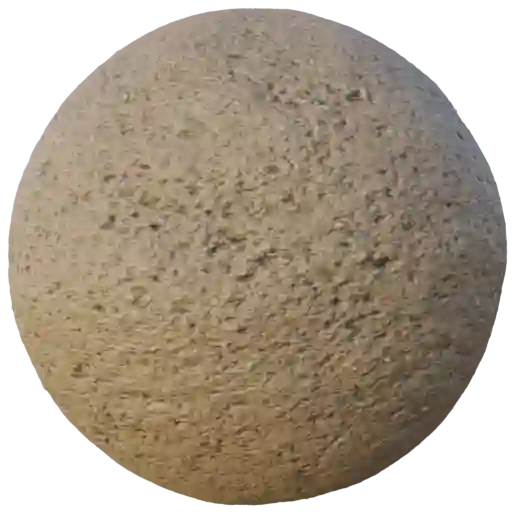

|

**This material is contained in the following Exapacks:**

    - XTRPbr_05k_Vol_001

    - XTRPbr_1k_Vol_001

    - XTRPbr_2k_Vol_003

    - XTRPbr_4k_Vol_006

    - XTRPbr_8k_Vol_028

------------------------------------------------------------------------------------------------------------------------

Soil 015
********

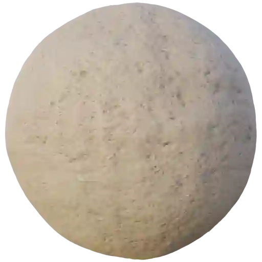

|

**This material is contained in the following Exapacks:**

    - XTRPbr_05k_Vol_001

    - XTRPbr_1k_Vol_001

    - XTRPbr_2k_Vol_003

    - XTRPbr_4k_Vol_006

    - XTRPbr_8k_Vol_028

------------------------------------------------------------------------------------------------------------------------

Soil 016
********

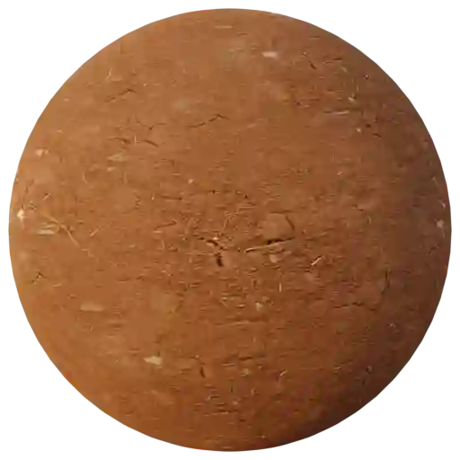

|

**This material is contained in the following Exapacks:**

    - XTRPbr_05k_Vol_001

    - XTRPbr_1k_Vol_001

    - XTRPbr_2k_Vol_003

    - XTRPbr_4k_Vol_006

    - XTRPbr_8k_Vol_028

------------------------------------------------------------------------------------------------------------------------

Soil 017
********

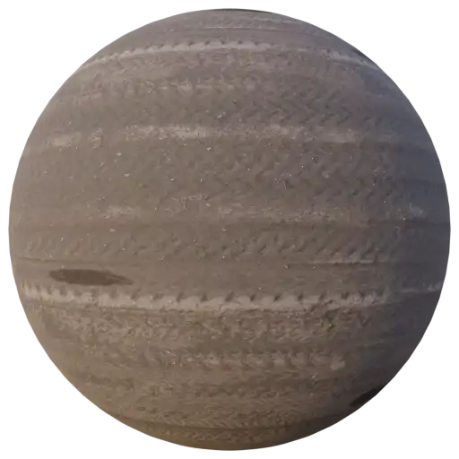

|

**This material is contained in the following Exapacks:**

    - XTRPbr_05k_Vol_001

    - XTRPbr_1k_Vol_001

    - XTRPbr_2k_Vol_003

    - XTRPbr_4k_Vol_006

    - XTRPbr_8k_Vol_028

------------------------------------------------------------------------------------------------------------------------

Soil 018
********

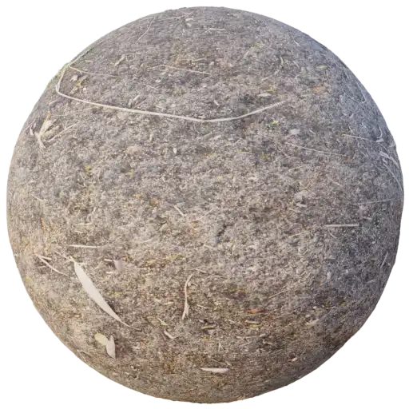

|

**This material is contained in the following Exapacks:**

    - XTRPbr_05k_Vol_001

    - XTRPbr_1k_Vol_001

    - XTRPbr_2k_Vol_003

    - XTRPbr_4k_Vol_006

    - XTRPbr_8k_Vol_028

------------------------------------------------------------------------------------------------------------------------

Soil 019
********

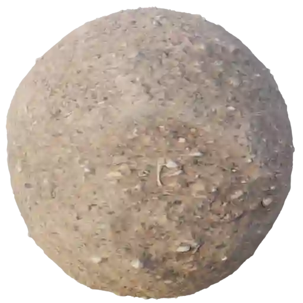

|

**This material is contained in the following Exapacks:**

    - XTRPbr_05k_Vol_001

    - XTRPbr_1k_Vol_001

    - XTRPbr_2k_Vol_003

------------------------------------------------------------------------------------------------------------------------

Soil 020
********

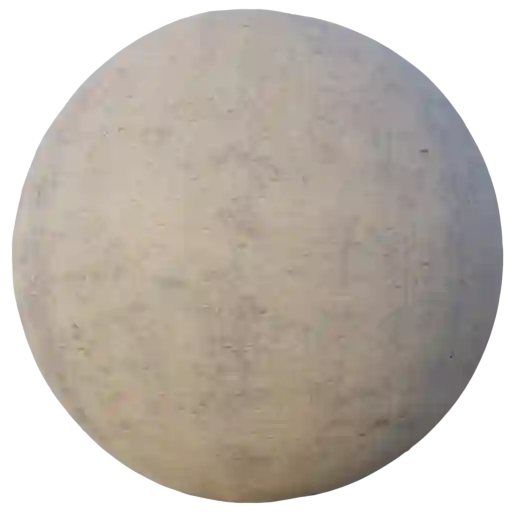

|

**This material is contained in the following Exapacks:**

    - XTRPbr_05k_Vol_001

    - XTRPbr_1k_Vol_001

    - XTRPbr_2k_Vol_003

    - XTRPbr_4k_Vol_006

    - XTRPbr_8k_Vol_028

------------------------------------------------------------------------------------------------------------------------

Wood Snips Ground 01
********************

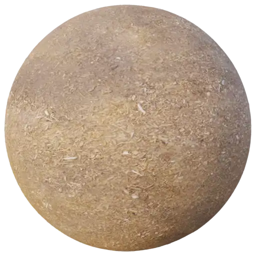

|

**This material is contained in the following Exapacks:**

    - XTRPbr_05k_Vol_001

    - XTRPbr_1k_Vol_001

    - XTRPbr_2k_Vol_003

    - XTRPbr_4k_Vol_006

    - XTRPbr_8k_Vol_028

------------------------------------------------------------------------------------------------------------------------

Ground - Stony (Category)
-------------------------

Stony Ground 001
****************

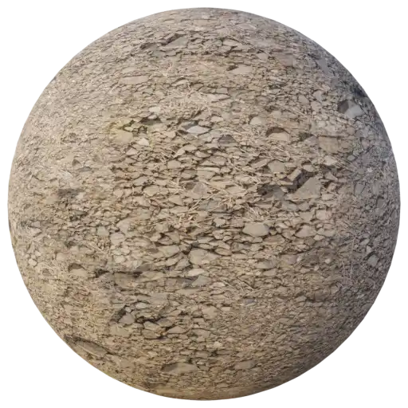

|

**This material is contained in the following Exapacks:**

    - XTRPbr_05k_Vol_001

    - XTRPbr_1k_Vol_001

    - XTRPbr_2k_Vol_003

    - XTRPbr_4k_Vol_006

    - XTRPbr_8k_Vol_028

------------------------------------------------------------------------------------------------------------------------

Stony Ground 002
****************

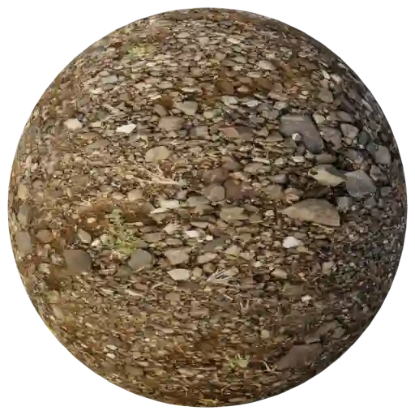

|

**This material is contained in the following Exapacks:**

    - XTRPbr_05k_Vol_001

    - XTRPbr_1k_Vol_001

    - XTRPbr_2k_Vol_003

    - XTRPbr_4k_Vol_006

    - XTRPbr_8k_Vol_028

------------------------------------------------------------------------------------------------------------------------

Stony Ground 003
****************

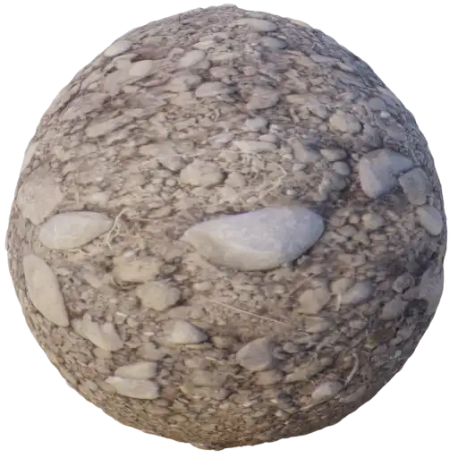

|

**This material is contained in the following Exapacks:**

    - XTRPbr_05k_Vol_001

    - XTRPbr_1k_Vol_001

    - XTRPbr_2k_Vol_003

------------------------------------------------------------------------------------------------------------------------

Stony Ground 004
****************

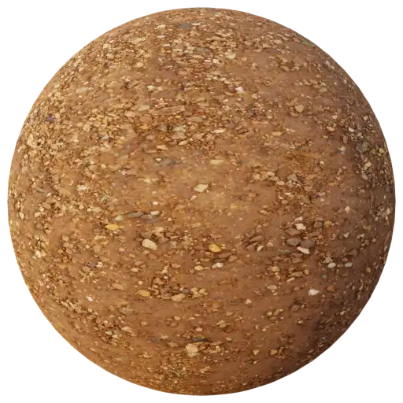

|

**This material is contained in the following Exapacks:**

    - XTRPbr_05k_Vol_001

    - XTRPbr_1k_Vol_001

    - XTRPbr_2k_Vol_003

    - XTRPbr_4k_Vol_006

    - XTRPbr_8k_Vol_028

------------------------------------------------------------------------------------------------------------------------

Stony Ground 005
****************

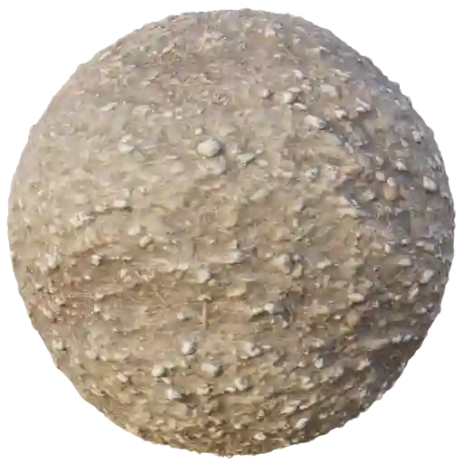

|

**This material is contained in the following Exapacks:**

    - XTRPbr_05k_Vol_001

    - XTRPbr_1k_Vol_001

    - XTRPbr_2k_Vol_003

    - XTRPbr_4k_Vol_006

    - XTRPbr_8k_Vol_028

------------------------------------------------------------------------------------------------------------------------

Stony Ground 006
****************

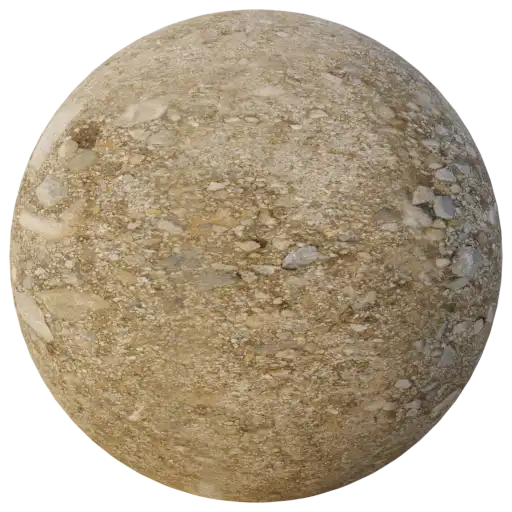

|

**This material is contained in the following Exapacks:**

    - XTRPbr_05k_Vol_001

    - XTRPbr_1k_Vol_001

    - XTRPbr_2k_Vol_003

    - XTRPbr_4k_Vol_006

    - XTRPbr_8k_Vol_028

------------------------------------------------------------------------------------------------------------------------

Stony Ground 007
****************

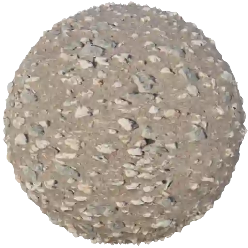

|

**This material is contained in the following Exapacks:**

    - XTRPbr_05k_Vol_001

    - XTRPbr_1k_Vol_001

    - XTRPbr_2k_Vol_003

    - XTRPbr_4k_Vol_006

------------------------------------------------------------------------------------------------------------------------

Stony Ground 008
****************

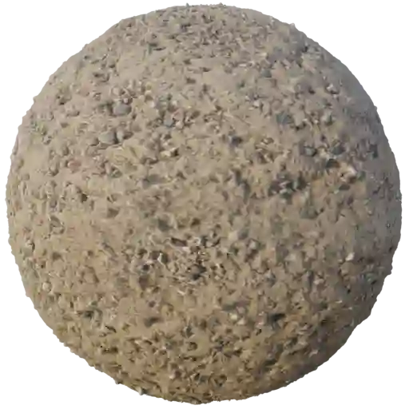

|

**This material is contained in the following Exapacks:**

    - XTRPbr_05k_Vol_001

    - XTRPbr_1k_Vol_001

    - XTRPbr_2k_Vol_003

------------------------------------------------------------------------------------------------------------------------

Stony Ground 009
****************

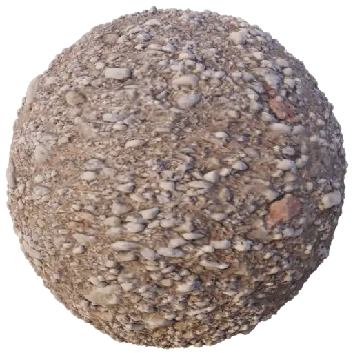

|

**This material is contained in the following Exapacks:**

    - XTRPbr_05k_Vol_001

    - XTRPbr_1k_Vol_001

    - XTRPbr_2k_Vol_003

    - XTRPbr_4k_Vol_006

------------------------------------------------------------------------------------------------------------------------

Stony Ground 010
****************

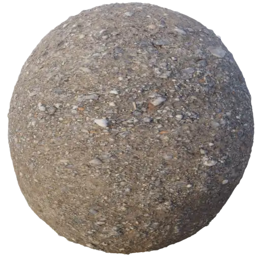

|

**This material is contained in the following Exapacks:**

    - XTRPbr_05k_Vol_001

    - XTRPbr_1k_Vol_001

    - XTRPbr_2k_Vol_003

    - XTRPbr_4k_Vol_006

------------------------------------------------------------------------------------------------------------------------

Stony Ground 011
****************

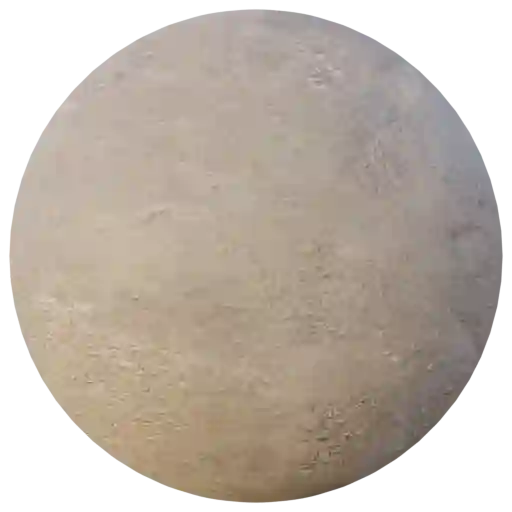

|

**This material is contained in the following Exapacks:**

    - XTRPbr_05k_Vol_001

    - XTRPbr_1k_Vol_001

    - XTRPbr_2k_Vol_003

    - XTRPbr_4k_Vol_006

    - XTRPbr_8k_Vol_028

------------------------------------------------------------------------------------------------------------------------

Stony Ground 012
****************

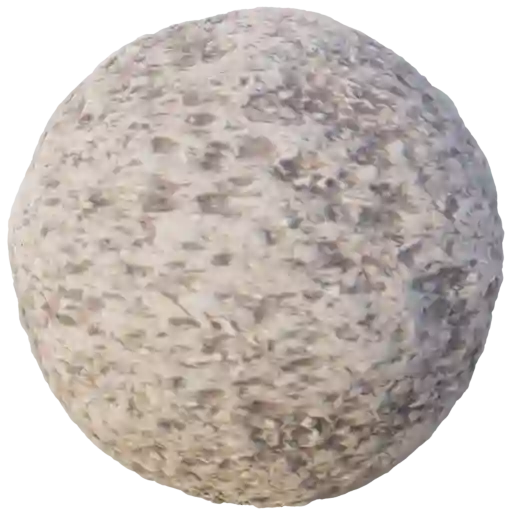

|

**This material is contained in the following Exapacks:**

    - XTRPbr_05k_Vol_001

    - XTRPbr_1k_Vol_001

    - XTRPbr_2k_Vol_003

------------------------------------------------------------------------------------------------------------------------

Stony Ground 013
****************

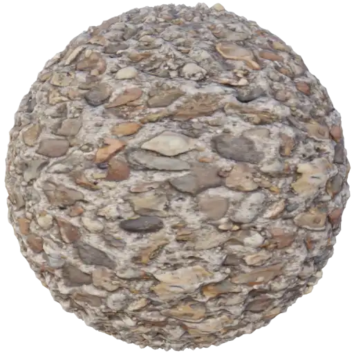

|

**This material is contained in the following Exapacks:**

    - XTRPbr_05k_Vol_001

    - XTRPbr_1k_Vol_001

    - XTRPbr_2k_Vol_003

    - XTRPbr_4k_Vol_006

------------------------------------------------------------------------------------------------------------------------

Stony Ground 014
****************

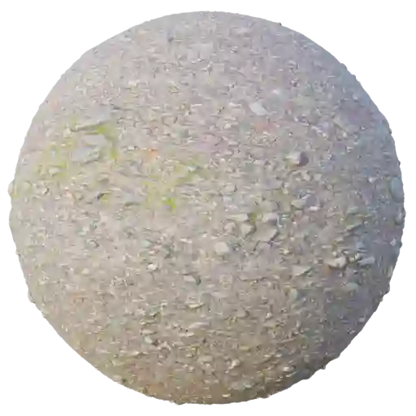

|

**This material is contained in the following Exapacks:**

    - XTRPbr_05k_Vol_001

    - XTRPbr_1k_Vol_001

    - XTRPbr_2k_Vol_003

    - XTRPbr_4k_Vol_006

    - XTRPbr_8k_Vol_028

------------------------------------------------------------------------------------------------------------------------

Stony Ground 015
****************

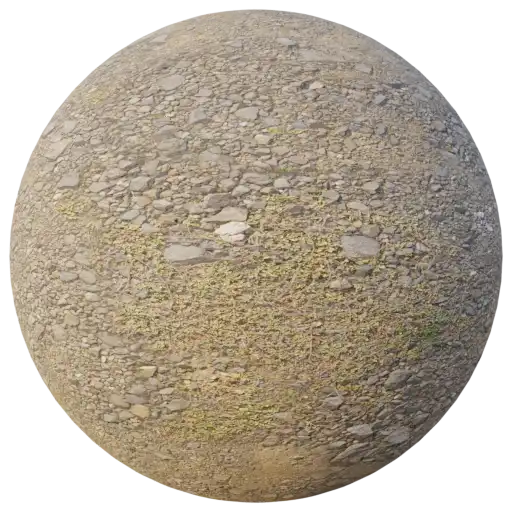

|

**This material is contained in the following Exapacks:**

    - XTRPbr_05k_Vol_001

    - XTRPbr_1k_Vol_001

    - XTRPbr_2k_Vol_003

    - XTRPbr_4k_Vol_006

    - XTRPbr_8k_Vol_025

    - XTRPbr_8k_Vol_028

------------------------------------------------------------------------------------------------------------------------

Stony Ground 016
****************

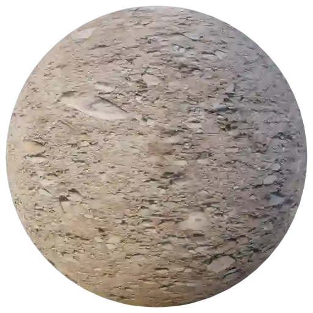

|

**This material is contained in the following Exapacks:**

    - XTRPbr_05k_Vol_001

    - XTRPbr_1k_Vol_001

    - XTRPbr_2k_Vol_003

    - XTRPbr_4k_Vol_006

    - XTRPbr_8k_Vol_025

------------------------------------------------------------------------------------------------------------------------

Stony Ground 017
****************

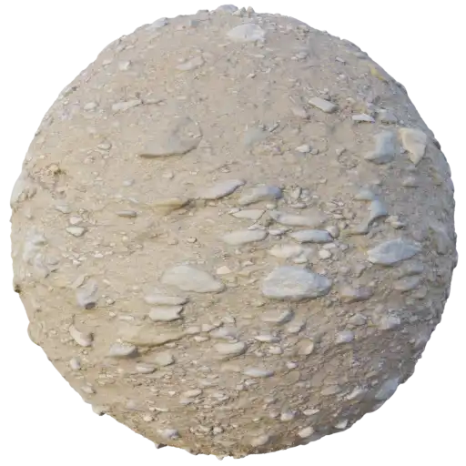

|

**This material is contained in the following Exapacks:**

    - XTRPbr_05k_Vol_001

    - XTRPbr_1k_Vol_001

    - XTRPbr_2k_Vol_003

    - XTRPbr_4k_Vol_006

    - XTRPbr_8k_Vol_025

------------------------------------------------------------------------------------------------------------------------

Stony Ground 018
****************

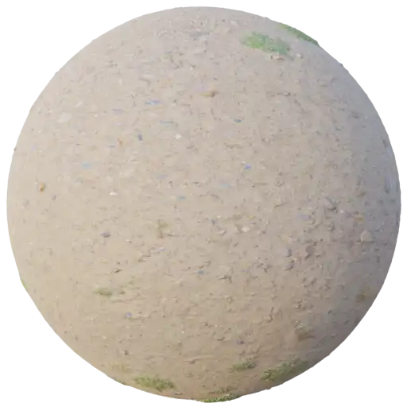

|

**This material is contained in the following Exapacks:**

    - XTRPbr_05k_Vol_001

    - XTRPbr_1k_Vol_001

    - XTRPbr_2k_Vol_003

    - XTRPbr_4k_Vol_006

    - XTRPbr_8k_Vol_025

------------------------------------------------------------------------------------------------------------------------

Stony Ground 019
****************

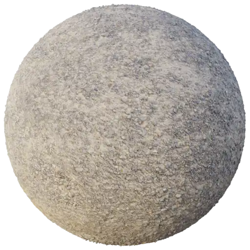

|

**This material is contained in the following Exapacks:**

    - XTRPbr_05k_Vol_001

    - XTRPbr_1k_Vol_001

    - XTRPbr_2k_Vol_003

    - XTRPbr_4k_Vol_006

    - XTRPbr_8k_Vol_025

------------------------------------------------------------------------------------------------------------------------

Stony Ground 020
****************

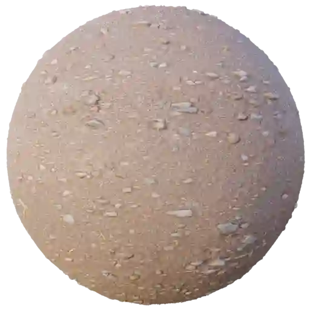

|

**This material is contained in the following Exapacks:**

    - XTRPbr_05k_Vol_001

    - XTRPbr_1k_Vol_001

    - XTRPbr_2k_Vol_003

    - XTRPbr_4k_Vol_006

    - XTRPbr_8k_Vol_025

------------------------------------------------------------------------------------------------------------------------

Stony Ground 021
****************

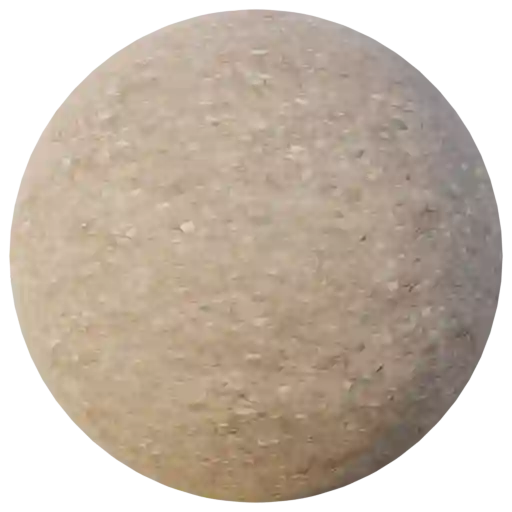

|

**This material is contained in the following Exapacks:**

    - XTRPbr_05k_Vol_001

    - XTRPbr_1k_Vol_001

    - XTRPbr_2k_Vol_003

    - XTRPbr_4k_Vol_006

    - XTRPbr_8k_Vol_025

------------------------------------------------------------------------------------------------------------------------

Stony Ground 022
****************

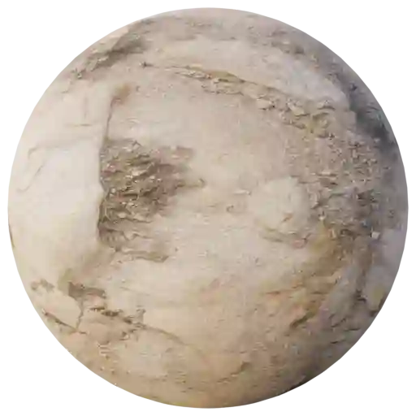

|

**This material is contained in the following Exapacks:**

    - XTRPbr_05k_Vol_001

    - XTRPbr_1k_Vol_001

    - XTRPbr_2k_Vol_003

    - XTRPbr_4k_Vol_006

    - XTRPbr_8k_Vol_025

------------------------------------------------------------------------------------------------------------------------

Stony Ground 023
****************

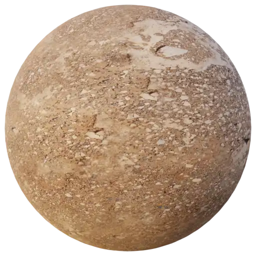

|

**This material is contained in the following Exapacks:**

    - XTRPbr_05k_Vol_001

    - XTRPbr_1k_Vol_001

    - XTRPbr_2k_Vol_003

    - XTRPbr_4k_Vol_006

    - XTRPbr_4k_Vol_007

    - XTRPbr_8k_Vol_025

------------------------------------------------------------------------------------------------------------------------

Stony Ground 024
****************

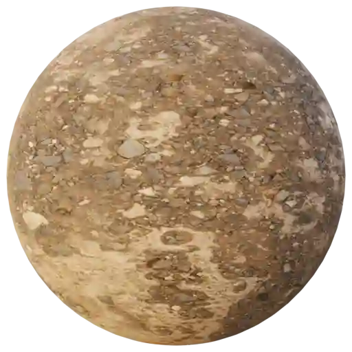

|

**This material is contained in the following Exapacks:**

    - XTRPbr_05k_Vol_001

    - XTRPbr_1k_Vol_001

    - XTRPbr_2k_Vol_003

    - XTRPbr_4k_Vol_007

    - XTRPbr_8k_Vol_025

------------------------------------------------------------------------------------------------------------------------

Stony Ground 025
****************

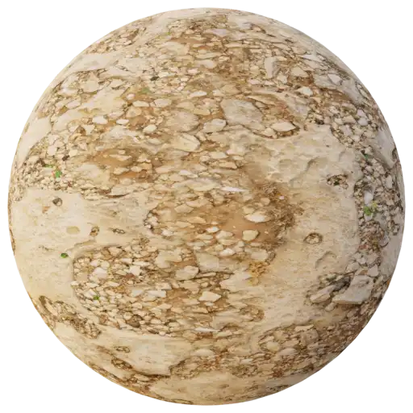

|

**This material is contained in the following Exapacks:**

    - XTRPbr_05k_Vol_001

    - XTRPbr_1k_Vol_001

    - XTRPbr_2k_Vol_003

    - XTRPbr_4k_Vol_007

    - XTRPbr_8k_Vol_025

------------------------------------------------------------------------------------------------------------------------

Stony Ground 026
****************

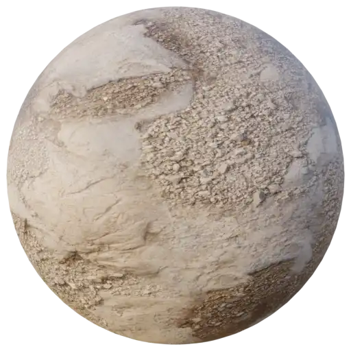

|

**This material is contained in the following Exapacks:**

    - XTRPbr_05k_Vol_001

    - XTRPbr_1k_Vol_001

    - XTRPbr_2k_Vol_003

    - XTRPbr_4k_Vol_007

    - XTRPbr_8k_Vol_025

------------------------------------------------------------------------------------------------------------------------

Stony Ground 027
****************

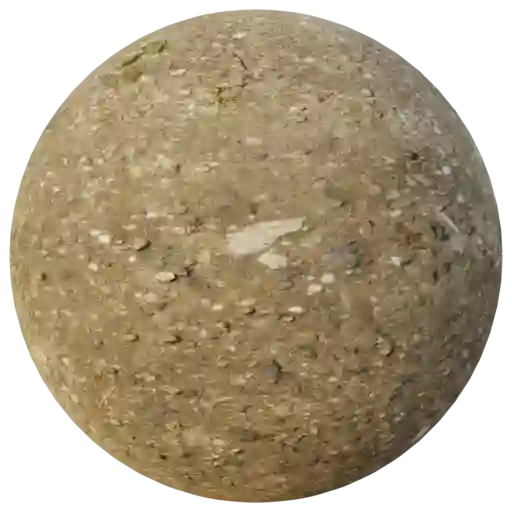

|

**This material is contained in the following Exapacks:**

    - XTRPbr_05k_Vol_001

    - XTRPbr_1k_Vol_001

    - XTRPbr_2k_Vol_003

    - XTRPbr_4k_Vol_007

    - XTRPbr_8k_Vol_025

------------------------------------------------------------------------------------------------------------------------

Stony Ground 028
****************

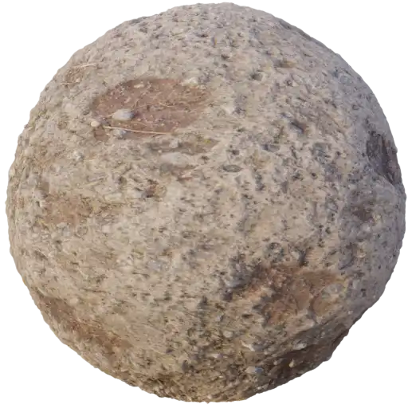

|

**This material is contained in the following Exapacks:**

    - XTRPbr_05k_Vol_001

    - XTRPbr_1k_Vol_001

    - XTRPbr_2k_Vol_003

    - XTRPbr_4k_Vol_007

------------------------------------------------------------------------------------------------------------------------

Stony Ground 029
****************

.. image:: _static/_images/material_list/ground_stony/stony_ground_029/stony_ground_029.webp
    :width: 30%
    :align: center
    :alt: Stony Ground 029

|

**This material is contained in the following Exapacks:**

    - XTRPbr_05k_Vol_001

    - XTRPbr_1k_Vol_001

    - XTRPbr_2k_Vol_003

    - XTRPbr_4k_Vol_007

    - XTRPbr_8k_Vol_025

------------------------------------------------------------------------------------------------------------------------

Stony Ground 030
****************

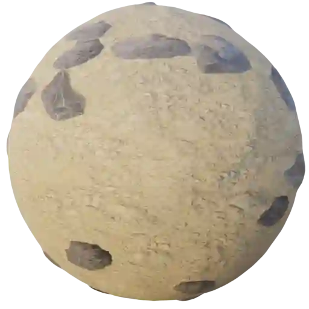

|

**This material is contained in the following Exapacks:**

    - XTRPbr_05k_Vol_001

    - XTRPbr_1k_Vol_001

    - XTRPbr_2k_Vol_003

    - XTRPbr_4k_Vol_007

    - XTRPbr_8k_Vol_025

------------------------------------------------------------------------------------------------------------------------

Stony Ground 031
****************

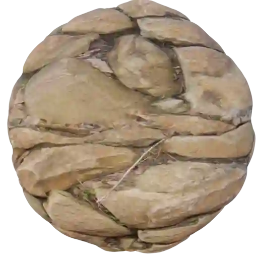

|

**This material is contained in the following Exapacks:**

    - XTRPbr_05k_Vol_001

    - XTRPbr_1k_Vol_001

    - XTRPbr_2k_Vol_003

    - XTRPbr_4k_Vol_007

    - XTRPbr_8k_Vol_025

------------------------------------------------------------------------------------------------------------------------

Stony Path 001
**************

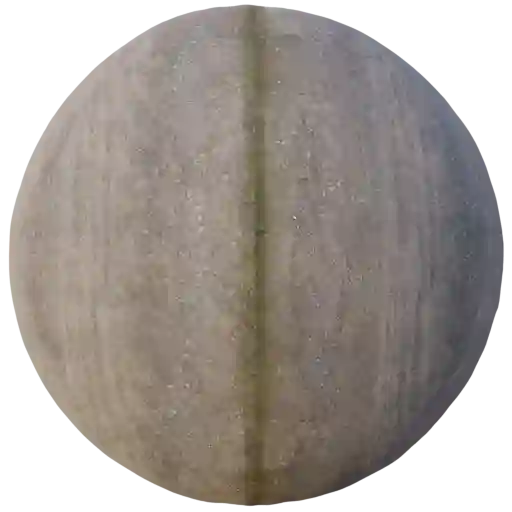

|

**This material is contained in the following Exapacks:**

    - XTRPbr_05k_Vol_001

    - XTRPbr_1k_Vol_001

    - XTRPbr_2k_Vol_003

    - XTRPbr_4k_Vol_007

------------------------------------------------------------------------------------------------------------------------

Ground - Undergrowth (Category)
-------------------------------

Ground Undergrowth 001
**********************

.. image:: _static/_images/material_list/ground_undergrowth/ground_undergrowth_001/ground_undergrowth_001.webp
    :width: 30%
    :align: center
    :alt: Ground Undergrowth 001

|

**This material is contained in the following Exapacks:**

    - XTRPbr_05k_Vol_001

    - XTRPbr_1k_Vol_001

    - XTRPbr_2k_Vol_003

    - XTRPbr_4k_Vol_007

------------------------------------------------------------------------------------------------------------------------

Ground Undergrowth 002
**********************

.. image:: _static/_images/material_list/ground_undergrowth/ground_undergrowth_002/ground_undergrowth_002.webp
    :width: 30%
    :align: center
    :alt: Ground Undergrowth 002

|

**This material is contained in the following Exapacks:**

    - XTRPbr_05k_Vol_001

    - XTRPbr_1k_Vol_001

    - XTRPbr_2k_Vol_003

    - XTRPbr_4k_Vol_007

    - XTRPbr_8k_Vol_025

------------------------------------------------------------------------------------------------------------------------

Ground Undergrowth 003
**********************

.. image:: _static/_images/material_list/ground_undergrowth/ground_undergrowth_003/ground_undergrowth_003.webp
    :width: 30%
    :align: center
    :alt: Ground Undergrowth 003

|

**This material is contained in the following Exapacks:**

    - XTRPbr_05k_Vol_001

    - XTRPbr_1k_Vol_001

    - XTRPbr_2k_Vol_003

    - XTRPbr_4k_Vol_007

    - XTRPbr_8k_Vol_025

------------------------------------------------------------------------------------------------------------------------

Ground Undergrowth 004
**********************

.. image:: _static/_images/material_list/ground_undergrowth/ground_undergrowth_004/ground_undergrowth_004.webp
    :width: 30%
    :align: center
    :alt: Ground Undergrowth 004

|

**This material is contained in the following Exapacks:**

    - XTRPbr_05k_Vol_001

    - XTRPbr_1k_Vol_001

    - XTRPbr_2k_Vol_003

    - XTRPbr_4k_Vol_007

    - XTRPbr_8k_Vol_025

------------------------------------------------------------------------------------------------------------------------

Ground Undergrowth 005
**********************

.. image:: _static/_images/material_list/ground_undergrowth/ground_undergrowth_005/ground_undergrowth_005.webp
    :width: 30%
    :align: center
    :alt: Ground Undergrowth 005

|

**This material is contained in the following Exapacks:**

    - XTRPbr_05k_Vol_001

    - XTRPbr_1k_Vol_001

    - XTRPbr_2k_Vol_003

    - XTRPbr_4k_Vol_007

    - XTRPbr_8k_Vol_025

------------------------------------------------------------------------------------------------------------------------

Ground Undergrowth 006
**********************

.. image:: _static/_images/material_list/ground_undergrowth/ground_undergrowth_006/ground_undergrowth_006.webp
    :width: 30%
    :align: center
    :alt: Ground Undergrowth 006

|

**This material is contained in the following Exapacks:**

    - XTRPbr_05k_Vol_001

    - XTRPbr_1k_Vol_001

    - XTRPbr_2k_Vol_003

    - XTRPbr_4k_Vol_007

------------------------------------------------------------------------------------------------------------------------

Ground Undergrowth 007
**********************

.. image:: _static/_images/material_list/ground_undergrowth/ground_undergrowth_007/ground_undergrowth_007.webp
    :width: 30%
    :align: center
    :alt: Ground Undergrowth 007

|

**This material is contained in the following Exapacks:**

    - XTRPbr_05k_Vol_001

    - XTRPbr_1k_Vol_001

    - XTRPbr_2k_Vol_003

    - XTRPbr_4k_Vol_007

    - XTRPbr_8k_Vol_025

------------------------------------------------------------------------------------------------------------------------

Ground Undergrowth 008
**********************

.. image:: _static/_images/material_list/ground_undergrowth/ground_undergrowth_008/ground_undergrowth_008.webp
    :width: 30%
    :align: center
    :alt: Ground Undergrowth 008

|

**This material is contained in the following Exapacks:**

    - XTRPbr_05k_Vol_001

    - XTRPbr_1k_Vol_001

    - XTRPbr_2k_Vol_003

    - XTRPbr_4k_Vol_007

    - XTRPbr_8k_Vol_025

------------------------------------------------------------------------------------------------------------------------

Ground Undergrowth 009
**********************

.. image:: _static/_images/material_list/ground_undergrowth/ground_undergrowth_009/ground_undergrowth_009.webp
    :width: 30%
    :align: center
    :alt: Ground Undergrowth 009

|

**This material is contained in the following Exapacks:**

    - XTRPbr_05k_Vol_001

    - XTRPbr_1k_Vol_001

    - XTRPbr_2k_Vol_003

    - XTRPbr_4k_Vol_007

    - XTRPbr_8k_Vol_025

------------------------------------------------------------------------------------------------------------------------

Ground Undergrowth 010
**********************

.. image:: _static/_images/material_list/ground_undergrowth/ground_undergrowth_010/ground_undergrowth_010.webp
    :width: 30%
    :align: center
    :alt: Ground Undergrowth 010

|

**This material is contained in the following Exapacks:**

    - XTRPbr_05k_Vol_001

    - XTRPbr_1k_Vol_001

    - XTRPbr_2k_Vol_003

    - XTRPbr_4k_Vol_007

------------------------------------------------------------------------------------------------------------------------

Ground Undergrowth 011
**********************

.. image:: _static/_images/material_list/ground_undergrowth/ground_undergrowth_011/ground_undergrowth_011.webp
    :width: 30%
    :align: center
    :alt: Ground Undergrowth 011

|

**This material is contained in the following Exapacks:**

    - XTRPbr_05k_Vol_001

    - XTRPbr_1k_Vol_001

    - XTRPbr_2k_Vol_003

    - XTRPbr_4k_Vol_007

    - XTRPbr_8k_Vol_025

------------------------------------------------------------------------------------------------------------------------

Ground Undergrowth 012
**********************

.. image:: _static/_images/material_list/ground_undergrowth/ground_undergrowth_012/ground_undergrowth_012.webp
    :width: 30%
    :align: center
    :alt: Ground Undergrowth 012

|

**This material is contained in the following Exapacks:**

    - XTRPbr_05k_Vol_001

    - XTRPbr_1k_Vol_001

    - XTRPbr_2k_Vol_003

    - XTRPbr_4k_Vol_007

    - XTRPbr_8k_Vol_025

------------------------------------------------------------------------------------------------------------------------

Ground Undergrowth 013
**********************

.. image:: _static/_images/material_list/ground_undergrowth/ground_undergrowth_013/ground_undergrowth_013.webp
    :width: 30%
    :align: center
    :alt: Ground Undergrowth 013

|

**This material is contained in the following Exapacks:**

    - XTRPbr_05k_Vol_001

    - XTRPbr_1k_Vol_001

    - XTRPbr_2k_Vol_003

    - XTRPbr_4k_Vol_007

    - XTRPbr_8k_Vol_022

    - XTRPbr_8k_Vol_025

------------------------------------------------------------------------------------------------------------------------

Ground Undergrowth 014
**********************

.. image:: _static/_images/material_list/ground_undergrowth/ground_undergrowth_014/ground_undergrowth_014.webp
    :width: 30%
    :align: center
    :alt: Ground Undergrowth 014

|

**This material is contained in the following Exapacks:**

    - XTRPbr_05k_Vol_001

    - XTRPbr_1k_Vol_001

    - XTRPbr_2k_Vol_003

    - XTRPbr_4k_Vol_007

    - XTRPbr_8k_Vol_022

------------------------------------------------------------------------------------------------------------------------

Ground Undergrowth 015
**********************

.. image:: _static/_images/material_list/ground_undergrowth/ground_undergrowth_015/ground_undergrowth_015.webp
    :width: 30%
    :align: center
    :alt: Ground Undergrowth 015

|

**This material is contained in the following Exapacks:**

    - XTRPbr_05k_Vol_001

    - XTRPbr_1k_Vol_001

    - XTRPbr_2k_Vol_003

    - XTRPbr_4k_Vol_007

    - XTRPbr_8k_Vol_022

------------------------------------------------------------------------------------------------------------------------

Ground Undergrowth 016
**********************

.. image:: _static/_images/material_list/ground_undergrowth/ground_undergrowth_016/ground_undergrowth_016.webp
    :width: 30%
    :align: center
    :alt: Ground Undergrowth 016

|

**This material is contained in the following Exapacks:**

    - XTRPbr_05k_Vol_001

    - XTRPbr_1k_Vol_001

    - XTRPbr_2k_Vol_003

    - XTRPbr_4k_Vol_007

    - XTRPbr_8k_Vol_022

------------------------------------------------------------------------------------------------------------------------

Ground Undergrowth 017
**********************

.. image:: _static/_images/material_list/ground_undergrowth/ground_undergrowth_017/ground_undergrowth_017.webp
    :width: 30%
    :align: center
    :alt: Ground Undergrowth 017

|

**This material is contained in the following Exapacks:**

    - XTRPbr_05k_Vol_001

    - XTRPbr_1k_Vol_001

    - XTRPbr_2k_Vol_003

    - XTRPbr_4k_Vol_007

    - XTRPbr_8k_Vol_022

------------------------------------------------------------------------------------------------------------------------

Ground Undergrowth 018
**********************

.. image:: _static/_images/material_list/ground_undergrowth/ground_undergrowth_018/ground_undergrowth_018.webp
    :width: 30%
    :align: center
    :alt: Ground Undergrowth 018

|

**This material is contained in the following Exapacks:**

    - XTRPbr_05k_Vol_001

    - XTRPbr_1k_Vol_001

    - XTRPbr_2k_Vol_003

    - XTRPbr_4k_Vol_007

    - XTRPbr_8k_Vol_022

------------------------------------------------------------------------------------------------------------------------

Ground Undergrowth 019
**********************

.. image:: _static/_images/material_list/ground_undergrowth/ground_undergrowth_019/ground_undergrowth_019.webp
    :width: 30%
    :align: center
    :alt: Ground Undergrowth 019

|

**This material is contained in the following Exapacks:**

    - XTRPbr_05k_Vol_001

    - XTRPbr_1k_Vol_001

    - XTRPbr_2k_Vol_003

    - XTRPbr_4k_Vol_007

    - XTRPbr_8k_Vol_022

------------------------------------------------------------------------------------------------------------------------

Ground Undergrowth 020
**********************

.. image:: _static/_images/material_list/ground_undergrowth/ground_undergrowth_020/ground_undergrowth_020.webp
    :width: 30%
    :align: center
    :alt: Ground Undergrowth 020

|

**This material is contained in the following Exapacks:**

    - XTRPbr_05k_Vol_001

    - XTRPbr_1k_Vol_001

    - XTRPbr_2k_Vol_003

    - XTRPbr_4k_Vol_007

    - XTRPbr_8k_Vol_022

------------------------------------------------------------------------------------------------------------------------

Ground Undergrowth 021
**********************

.. image:: _static/_images/material_list/ground_undergrowth/ground_undergrowth_021/ground_undergrowth_021.webp
    :width: 30%
    :align: center
    :alt: Ground Undergrowth 021

|

**This material is contained in the following Exapacks:**

    - XTRPbr_05k_Vol_001

    - XTRPbr_1k_Vol_001

    - XTRPbr_2k_Vol_003

    - XTRPbr_4k_Vol_007

    - XTRPbr_8k_Vol_022

------------------------------------------------------------------------------------------------------------------------

Ground - Vegetation (Category)
------------------------------

Aerial Grass Rock 01
********************

.. image:: _static/_images/material_list/ground_vegetation/aerial_grass_rock_01/aerial_grass_rock_01.webp
    :width: 30%
    :align: center
    :alt: Aerial Grass Rock 01

|

**This material is contained in the following Exapacks:**

    - XTRPbr_05k_Vol_001

    - XTRPbr_1k_Vol_001

    - XTRPbr_2k_Vol_003

    - XTRPbr_4k_Vol_007

    - XTRPbr_8k_Vol_022

------------------------------------------------------------------------------------------------------------------------

Fake Grass 001
**************

.. image:: _static/_images/material_list/ground_vegetation/fake_grass_001/fake_grass_001.webp
    :width: 30%
    :align: center
    :alt: Fake Grass 001

|

**This material is contained in the following Exapacks:**

    - XTRPbr_05k_Vol_001

    - XTRPbr_1k_Vol_001

    - XTRPbr_2k_Vol_003

    - XTRPbr_4k_Vol_007

    - XTRPbr_8k_Vol_022

------------------------------------------------------------------------------------------------------------------------

Fake Grass 002
**************

.. image:: _static/_images/material_list/ground_vegetation/fake_grass_002/fake_grass_002.webp
    :width: 30%
    :align: center
    :alt: Fake Grass 002

|

**This material is contained in the following Exapacks:**

    - XTRPbr_05k_Vol_001

    - XTRPbr_1k_Vol_001

    - XTRPbr_2k_Vol_003

    - XTRPbr_4k_Vol_007

    - XTRPbr_8k_Vol_022

------------------------------------------------------------------------------------------------------------------------

Fake Grass 003
**************

.. image:: _static/_images/material_list/ground_vegetation/fake_grass_003/fake_grass_003.webp
    :width: 30%
    :align: center
    :alt: Fake Grass 003

|

**This material is contained in the following Exapacks:**

    - XTRPbr_05k_Vol_001

    - XTRPbr_1k_Vol_001

    - XTRPbr_2k_Vol_003

    - XTRPbr_4k_Vol_007

    - XTRPbr_8k_Vol_022

------------------------------------------------------------------------------------------------------------------------

Fake Grass 004
**************

.. image:: _static/_images/material_list/ground_vegetation/fake_grass_004/fake_grass_004.webp
    :width: 30%
    :align: center
    :alt: Fake Grass 004

|

**This material is contained in the following Exapacks:**

    - XTRPbr_05k_Vol_001

    - XTRPbr_1k_Vol_001

    - XTRPbr_2k_Vol_003

    - XTRPbr_4k_Vol_007

    - XTRPbr_8k_Vol_022

------------------------------------------------------------------------------------------------------------------------

Fake Moss 001
*************

.. image:: _static/_images/material_list/ground_vegetation/fake_moss_001/fake_moss_001.webp
    :width: 30%
    :align: center
    :alt: Fake Moss 001

|

**This material is contained in the following Exapacks:**

    - XTRPbr_05k_Vol_001

    - XTRPbr_1k_Vol_001

    - XTRPbr_2k_Vol_003

    - XTRPbr_4k_Vol_007

    - XTRPbr_8k_Vol_022

------------------------------------------------------------------------------------------------------------------------

Fake Moss 002
*************

.. image:: _static/_images/material_list/ground_vegetation/fake_moss_002/fake_moss_002.webp
    :width: 30%
    :align: center
    :alt: Fake Moss 002

|

**This material is contained in the following Exapacks:**

    - XTRPbr_05k_Vol_001

    - XTRPbr_1k_Vol_001

    - XTRPbr_2k_Vol_003

    - XTRPbr_4k_Vol_007

    - XTRPbr_8k_Vol_022

------------------------------------------------------------------------------------------------------------------------

Fake Moss 003
*************

.. image:: _static/_images/material_list/ground_vegetation/fake_moss_003/fake_moss_003.webp
    :width: 30%
    :align: center
    :alt: Fake Moss 003

|

**This material is contained in the following Exapacks:**

    - XTRPbr_05k_Vol_001

    - XTRPbr_1k_Vol_001

    - XTRPbr_2k_Vol_003

    - XTRPbr_4k_Vol_007

    - XTRPbr_8k_Vol_022

------------------------------------------------------------------------------------------------------------------------

Grass 001
*********

.. image:: _static/_images/material_list/ground_vegetation/grass_001/grass_001.webp
    :width: 30%
    :align: center
    :alt: Grass 001

|

**This material is contained in the following Exapacks:**

    - XTRPbr_05k_Vol_001

    - XTRPbr_1k_Vol_001

    - XTRPbr_2k_Vol_003

------------------------------------------------------------------------------------------------------------------------

Grass 002
*********

.. image:: _static/_images/material_list/ground_vegetation/grass_002/grass_002.webp
    :width: 30%
    :align: center
    :alt: Grass 002

|

**This material is contained in the following Exapacks:**

    - XTRPbr_05k_Vol_001

    - XTRPbr_1k_Vol_001

    - XTRPbr_2k_Vol_003

    - XTRPbr_4k_Vol_007

    - XTRPbr_8k_Vol_022

------------------------------------------------------------------------------------------------------------------------

Grass 003
*********

.. image:: _static/_images/material_list/ground_vegetation/grass_003/grass_003.webp
    :width: 30%
    :align: center
    :alt: Grass 003

|

**This material is contained in the following Exapacks:**

    - XTRPbr_05k_Vol_001

    - XTRPbr_1k_Vol_001

    - XTRPbr_2k_Vol_003

    - XTRPbr_4k_Vol_007

    - XTRPbr_8k_Vol_008

    - XTRPbr_8k_Vol_022

------------------------------------------------------------------------------------------------------------------------

Grass 004
*********

.. image:: _static/_images/material_list/ground_vegetation/grass_004/grass_004.webp
    :width: 30%
    :align: center
    :alt: Grass 004

|

**This material is contained in the following Exapacks:**

    - XTRPbr_05k_Vol_001

    - XTRPbr_1k_Vol_001

    - XTRPbr_2k_Vol_003

    - XTRPbr_4k_Vol_007

    - XTRPbr_8k_Vol_008

------------------------------------------------------------------------------------------------------------------------

Grass 005
*********

.. image:: _static/_images/material_list/ground_vegetation/grass_005/grass_005.webp
    :width: 30%
    :align: center
    :alt: Grass 005

|

**This material is contained in the following Exapacks:**

    - XTRPbr_05k_Vol_001

    - XTRPbr_1k_Vol_001

    - XTRPbr_2k_Vol_003

    - XTRPbr_4k_Vol_007

    - XTRPbr_8k_Vol_008

------------------------------------------------------------------------------------------------------------------------

Grass Tufts 01
**************

.. image:: _static/_images/material_list/ground_vegetation/grass_tufts_01/grass_tufts_01.webp
    :width: 30%
    :align: center
    :alt: Grass Tufts 01

|

**This material is contained in the following Exapacks:**

    - XTRPbr_05k_Vol_001

    - XTRPbr_1k_Vol_001

    - XTRPbr_2k_Vol_003

    - XTRPbr_4k_Vol_007

    - XTRPbr_8k_Vol_008

------------------------------------------------------------------------------------------------------------------------

Ground Vegetation 001
*********************

.. image:: _static/_images/material_list/ground_vegetation/ground_vegetation_001/ground_vegetation_001.webp
    :width: 30%
    :align: center
    :alt: Ground Vegetation 001

|

**This material is contained in the following Exapacks:**

    - XTRPbr_05k_Vol_001

    - XTRPbr_1k_Vol_001

    - XTRPbr_2k_Vol_003

    - XTRPbr_4k_Vol_007

    - XTRPbr_8k_Vol_008

------------------------------------------------------------------------------------------------------------------------

Moss 001
********

.. image:: _static/_images/material_list/ground_vegetation/moss_001/moss_001.webp
    :width: 30%
    :align: center
    :alt: Moss 001

|

**This material is contained in the following Exapacks:**

    - XTRPbr_05k_Vol_001

    - XTRPbr_1k_Vol_001

    - XTRPbr_2k_Vol_003

    - XTRPbr_4k_Vol_007

    - XTRPbr_8k_Vol_008

------------------------------------------------------------------------------------------------------------------------

Moss 002
********

.. image:: _static/_images/material_list/ground_vegetation/moss_002/moss_002.webp
    :width: 30%
    :align: center
    :alt: Moss 002

|

**This material is contained in the following Exapacks:**

    - XTRPbr_05k_Vol_001

    - XTRPbr_1k_Vol_001

    - XTRPbr_2k_Vol_003

------------------------------------------------------------------------------------------------------------------------

Soil Leaves 01
**************

.. image:: _static/_images/material_list/ground_vegetation/soil_leaves_01/soil_leaves_01.webp
    :width: 30%
    :align: center
    :alt: Soil Leaves 01

|

**This material is contained in the following Exapacks:**

    - XTRPbr_05k_Vol_001

    - XTRPbr_1k_Vol_001

    - XTRPbr_2k_Vol_003

    - XTRPbr_4k_Vol_007

    - XTRPbr_8k_Vol_008

------------------------------------------------------------------------------------------------------------------------

Ice (Category)
--------------

Ice001
******

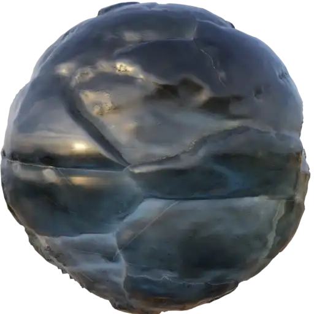

|

**This material is contained in the following Exapacks:**

    - XTRPbr_05k_Vol_001

    - XTRPbr_1k_Vol_001

    - XTRPbr_2k_Vol_003

    - XTRPbr_4k_Vol_007

------------------------------------------------------------------------------------------------------------------------

Ice002
******

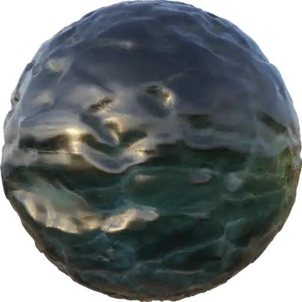

|

**This material is contained in the following Exapacks:**

    - XTRPbr_05k_Vol_001

    - XTRPbr_1k_Vol_001

    - XTRPbr_2k_Vol_003

    - XTRPbr_4k_Vol_007

------------------------------------------------------------------------------------------------------------------------

Ice003
******

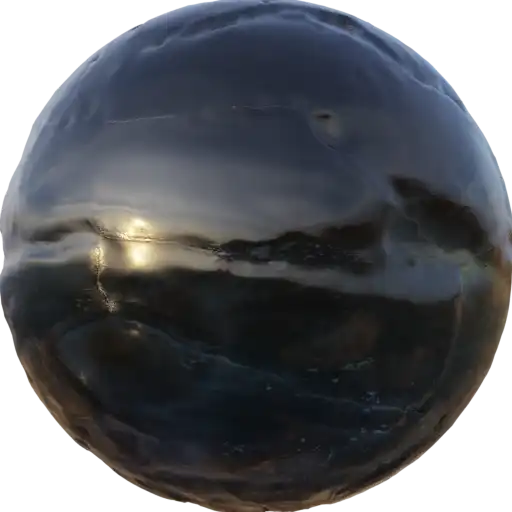

|

**This material is contained in the following Exapacks:**

    - XTRPbr_05k_Vol_001

    - XTRPbr_1k_Vol_001

    - XTRPbr_2k_Vol_003

    - XTRPbr_4k_Vol_007

------------------------------------------------------------------------------------------------------------------------

Ice004
******

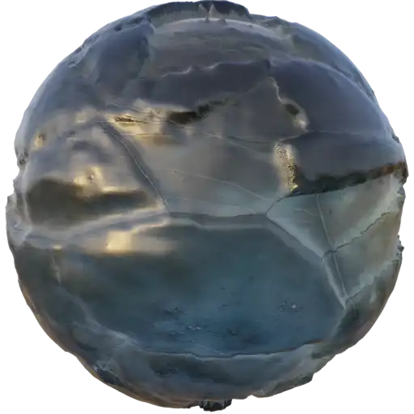

|

**This material is contained in the following Exapacks:**

    - XTRPbr_05k_Vol_001

    - XTRPbr_1k_Vol_001

    - XTRPbr_2k_Vol_003

    - XTRPbr_4k_Vol_007

------------------------------------------------------------------------------------------------------------------------

Leather (Category)
------------------

Leather Black 001
*****************

.. image:: _static/_images/material_list/leather/leather_black_001/leather_black_001.webp
    :width: 30%
    :align: center
    :alt: Leather Black 001

|

**This material is contained in the following Exapacks:**

    - XTRPbr_05k_Vol_001

    - XTRPbr_1k_Vol_001

    - XTRPbr_2k_Vol_003

    - XTRPbr_4k_Vol_007

------------------------------------------------------------------------------------------------------------------------

Leather Black 002
*****************

.. image:: _static/_images/material_list/leather/leather_black_002/leather_black_002.webp
    :width: 30%
    :align: center
    :alt: Leather Black 002

|

**This material is contained in the following Exapacks:**

    - XTRPbr_05k_Vol_001

    - XTRPbr_1k_Vol_001

    - XTRPbr_2k_Vol_003

    - XTRPbr_4k_Vol_007

------------------------------------------------------------------------------------------------------------------------

Leather Black 003
*****************

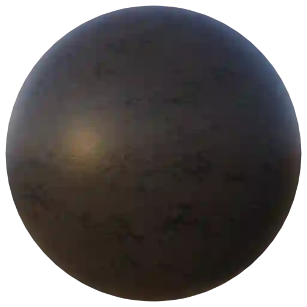

|

**This material is contained in the following Exapacks:**

    - XTRPbr_05k_Vol_001

    - XTRPbr_1k_Vol_001

    - XTRPbr_2k_Vol_003

    - XTRPbr_4k_Vol_007

    - XTRPbr_8k_Vol_008

------------------------------------------------------------------------------------------------------------------------

Leather Black 004
*****************

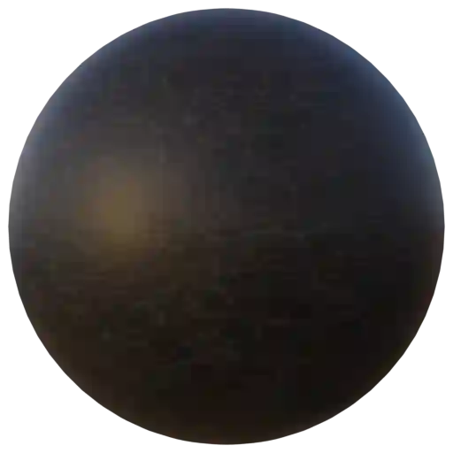

|

**This material is contained in the following Exapacks:**

    - XTRPbr_05k_Vol_001

    - XTRPbr_1k_Vol_001

    - XTRPbr_2k_Vol_003

    - XTRPbr_4k_Vol_007

    - XTRPbr_8k_Vol_008

------------------------------------------------------------------------------------------------------------------------

Leather Black 005
*****************

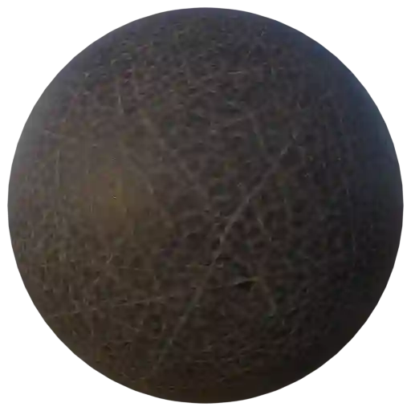

|

**This material is contained in the following Exapacks:**

    - XTRPbr_05k_Vol_001

    - XTRPbr_1k_Vol_001

    - XTRPbr_2k_Vol_003

    - XTRPbr_4k_Vol_007

    - XTRPbr_8k_Vol_008

------------------------------------------------------------------------------------------------------------------------

Leather Black 006
*****************

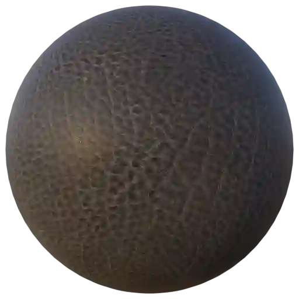

|

**This material is contained in the following Exapacks:**

    - XTRPbr_05k_Vol_001

    - XTRPbr_1k_Vol_001

    - XTRPbr_2k_Vol_003

    - XTRPbr_4k_Vol_007

    - XTRPbr_8k_Vol_008

------------------------------------------------------------------------------------------------------------------------

Leather Black 007
*****************

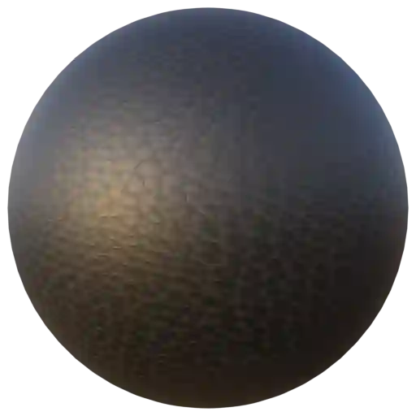

|

**This material is contained in the following Exapacks:**

    - XTRPbr_05k_Vol_001

    - XTRPbr_1k_Vol_001

    - XTRPbr_2k_Vol_003

    - XTRPbr_4k_Vol_007

------------------------------------------------------------------------------------------------------------------------

Leather Brown 001
*****************

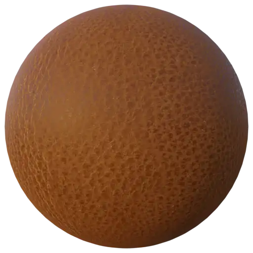

|

**This material is contained in the following Exapacks:**

    - XTRPbr_05k_Vol_001

    - XTRPbr_1k_Vol_001

    - XTRPbr_2k_Vol_003

    - XTRPbr_4k_Vol_007

    - XTRPbr_8k_Vol_008

------------------------------------------------------------------------------------------------------------------------

Leather Brown 002
*****************

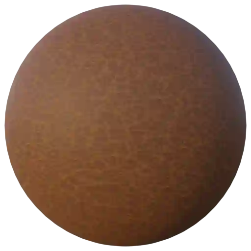

|

**This material is contained in the following Exapacks:**

    - XTRPbr_05k_Vol_001

    - XTRPbr_1k_Vol_001

    - XTRPbr_2k_Vol_003

    - XTRPbr_4k_Vol_007

------------------------------------------------------------------------------------------------------------------------

Leather Brown 003
*****************

|

**This material is contained in the following Exapacks:**

    - XTRPbr_05k_Vol_001

    - XTRPbr_1k_Vol_001

    - XTRPbr_2k_Vol_003

    - XTRPbr_4k_Vol_007

------------------------------------------------------------------------------------------------------------------------

Leather Brown 004
*****************

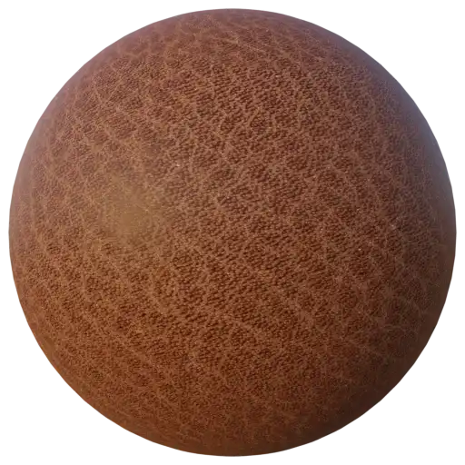

|

**This material is contained in the following Exapacks:**

    - XTRPbr_05k_Vol_001

    - XTRPbr_1k_Vol_001

    - XTRPbr_2k_Vol_003

    - XTRPbr_4k_Vol_007

    - XTRPbr_8k_Vol_008

------------------------------------------------------------------------------------------------------------------------

Leather Brown 005
*****************

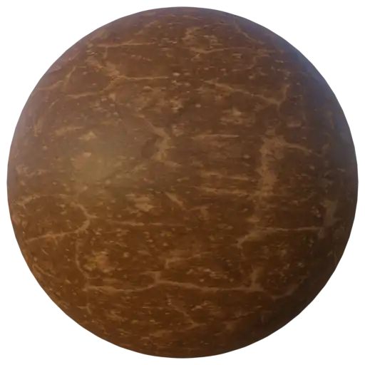

|

**This material is contained in the following Exapacks:**

    - XTRPbr_05k_Vol_001

    - XTRPbr_1k_Vol_001

    - XTRPbr_2k_Vol_003

    - XTRPbr_4k_Vol_007

------------------------------------------------------------------------------------------------------------------------

Leather Brown 006
*****************

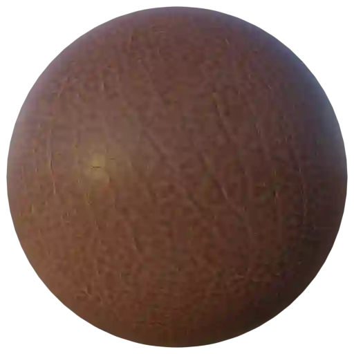

|

**This material is contained in the following Exapacks:**

    - XTRPbr_05k_Vol_001

    - XTRPbr_1k_Vol_001

    - XTRPbr_2k_Vol_003

    - XTRPbr_4k_Vol_007

    - XTRPbr_8k_Vol_008

------------------------------------------------------------------------------------------------------------------------

Leather Brown 007
*****************

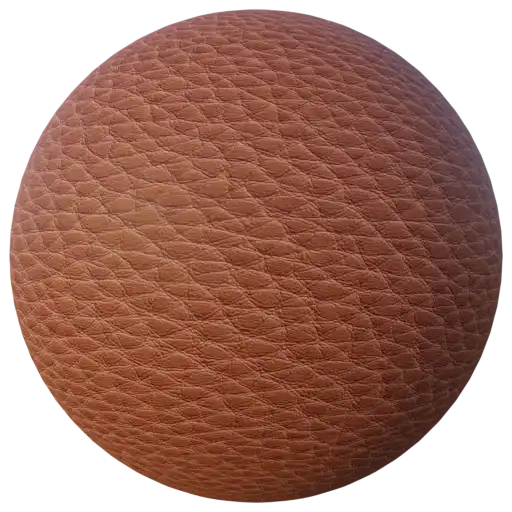

|

**This material is contained in the following Exapacks:**

    - XTRPbr_05k_Vol_001

    - XTRPbr_1k_Vol_001

    - XTRPbr_2k_Vol_003

    - XTRPbr_4k_Vol_007

------------------------------------------------------------------------------------------------------------------------

Leather Brown 008
*****************

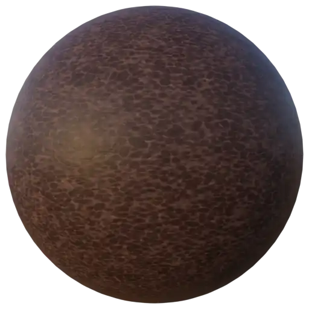

|

**This material is contained in the following Exapacks:**

    - XTRPbr_05k_Vol_001

    - XTRPbr_1k_Vol_001

    - XTRPbr_2k_Vol_003

    - XTRPbr_4k_Vol_007

    - XTRPbr_8k_Vol_008

------------------------------------------------------------------------------------------------------------------------

Leather Brown 009
*****************

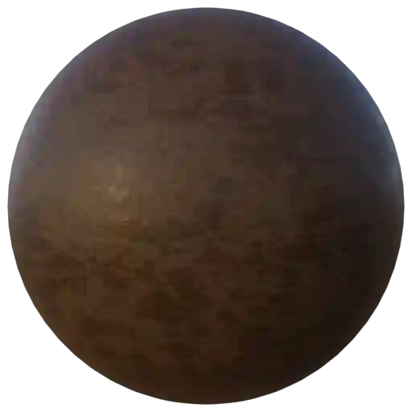

|

**This material is contained in the following Exapacks:**

    - XTRPbr_05k_Vol_001

    - XTRPbr_1k_Vol_001

    - XTRPbr_2k_Vol_003

    - XTRPbr_4k_Vol_007

------------------------------------------------------------------------------------------------------------------------

Leather Brown 010
*****************

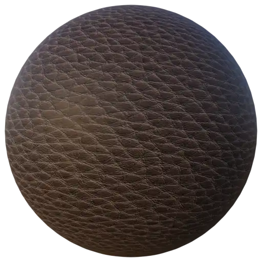

|

**This material is contained in the following Exapacks:**

    - XTRPbr_05k_Vol_001

    - XTRPbr_1k_Vol_001

    - XTRPbr_2k_Vol_003

    - XTRPbr_4k_Vol_007

------------------------------------------------------------------------------------------------------------------------

Leather Brown 011
*****************

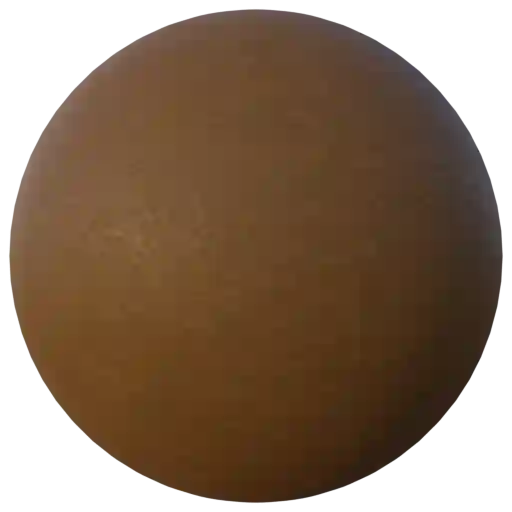

|

**This material is contained in the following Exapacks:**

    - XTRPbr_05k_Vol_001

    - XTRPbr_1k_Vol_001

    - XTRPbr_2k_Vol_003

    - XTRPbr_4k_Vol_007

    - XTRPbr_8k_Vol_008

------------------------------------------------------------------------------------------------------------------------

Leather Brown 012
*****************

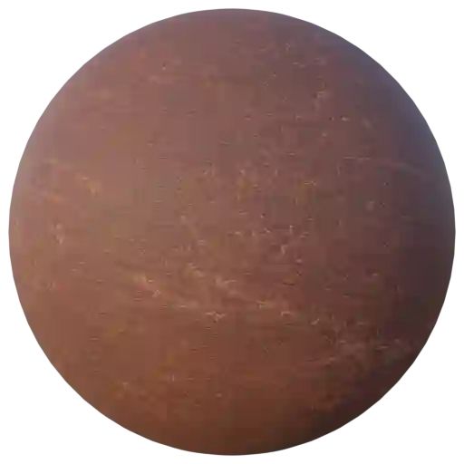

|

**This material is contained in the following Exapacks:**

    - XTRPbr_05k_Vol_001

    - XTRPbr_1k_Vol_001

    - XTRPbr_2k_Vol_003

    - XTRPbr_4k_Vol_007

    - XTRPbr_8k_Vol_008

------------------------------------------------------------------------------------------------------------------------

Leather Brown 013
*****************

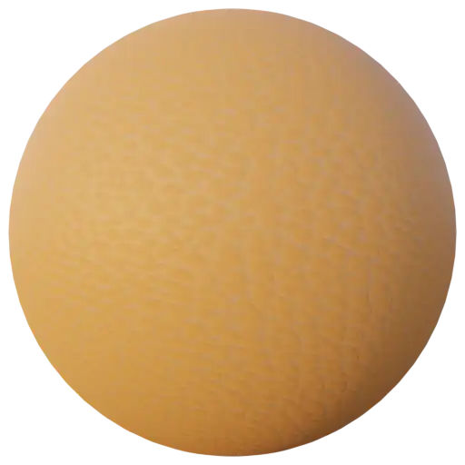

|

**This material is contained in the following Exapacks:**

    - XTRPbr_05k_Vol_001

    - XTRPbr_1k_Vol_001

    - XTRPbr_2k_Vol_003

    - XTRPbr_4k_Vol_007

------------------------------------------------------------------------------------------------------------------------

Leather Brown 014
*****************

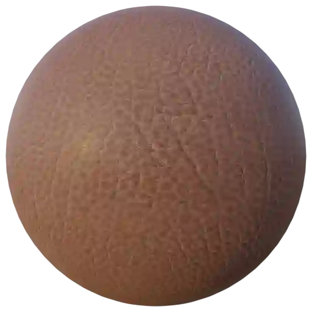

|

**This material is contained in the following Exapacks:**

    - XTRPbr_05k_Vol_001

    - XTRPbr_1k_Vol_001

    - XTRPbr_2k_Vol_003

    - XTRPbr_4k_Vol_007

    - XTRPbr_8k_Vol_008

------------------------------------------------------------------------------------------------------------------------

Leather Brown 015
*****************

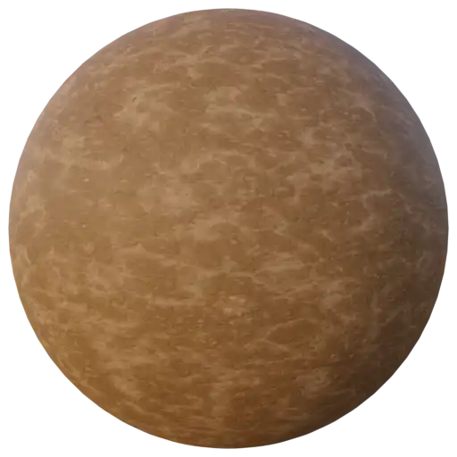

|

**This material is contained in the following Exapacks:**

    - XTRPbr_05k_Vol_001

    - XTRPbr_1k_Vol_001

    - XTRPbr_2k_Vol_003

    - XTRPbr_4k_Vol_007

------------------------------------------------------------------------------------------------------------------------

Leather Brown 016
*****************

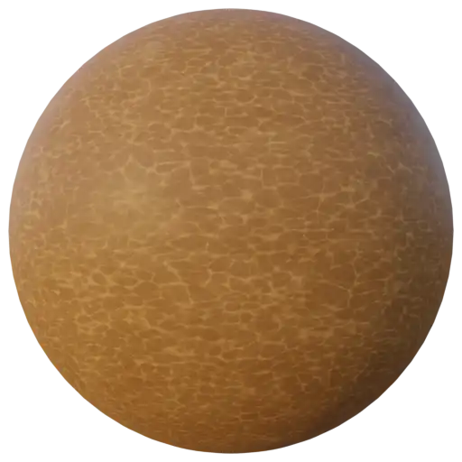

|

**This material is contained in the following Exapacks:**

    - XTRPbr_05k_Vol_001

    - XTRPbr_1k_Vol_001

    - XTRPbr_2k_Vol_003

    - XTRPbr_4k_Vol_007

    - XTRPbr_8k_Vol_008

------------------------------------------------------------------------------------------------------------------------

Leather Brown 019
*****************

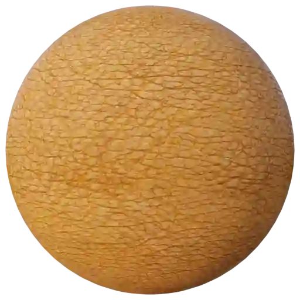

|

**This material is contained in the following Exapacks:**

    - XTRPbr_05k_Vol_001

    - XTRPbr_1k_Vol_001

    - XTRPbr_2k_Vol_003

    - XTRPbr_4k_Vol_007

------------------------------------------------------------------------------------------------------------------------

Leather Brown 020
*****************

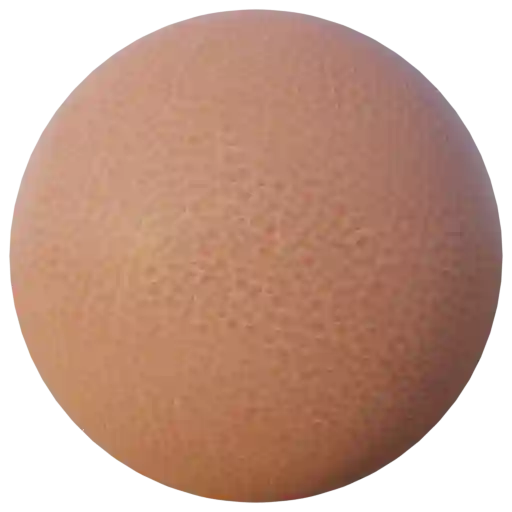

|

**This material is contained in the following Exapacks:**

    - XTRPbr_05k_Vol_001

    - XTRPbr_1k_Vol_001

    - XTRPbr_2k_Vol_003

    - XTRPbr_4k_Vol_007

    - XTRPbr_8k_Vol_008

------------------------------------------------------------------------------------------------------------------------

Leather Brown 022
*****************

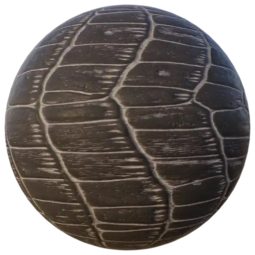

|

**This material is contained in the following Exapacks:**

    - XTRPbr_05k_Vol_001

    - XTRPbr_1k_Vol_001

    - XTRPbr_2k_Vol_003

    - XTRPbr_4k_Vol_007

------------------------------------------------------------------------------------------------------------------------

Leather Green 001
*****************

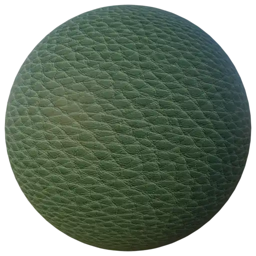

|

**This material is contained in the following Exapacks:**

    - XTRPbr_05k_Vol_001

    - XTRPbr_1k_Vol_001

    - XTRPbr_2k_Vol_003

    - XTRPbr_4k_Vol_007

------------------------------------------------------------------------------------------------------------------------

Leather Red 001
***************

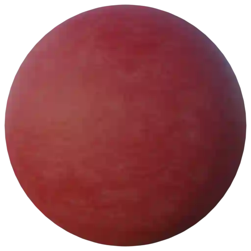

|

**This material is contained in the following Exapacks:**

    - XTRPbr_05k_Vol_001

    - XTRPbr_1k_Vol_001

    - XTRPbr_2k_Vol_003

    - XTRPbr_4k_Vol_007

------------------------------------------------------------------------------------------------------------------------

Leather Red 002
***************

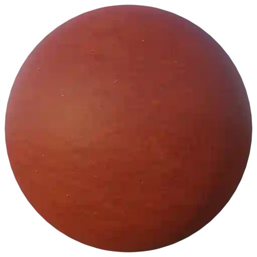

|

**This material is contained in the following Exapacks:**

    - XTRPbr_05k_Vol_001

    - XTRPbr_1k_Vol_001

    - XTRPbr_2k_Vol_003

    - XTRPbr_4k_Vol_007

    - XTRPbr_8k_Vol_008

------------------------------------------------------------------------------------------------------------------------

Leather Red 003
***************

|

**This material is contained in the following Exapacks:**

    - XTRPbr_05k_Vol_001

    - XTRPbr_1k_Vol_001

    - XTRPbr_2k_Vol_003

    - XTRPbr_4k_Vol_007

------------------------------------------------------------------------------------------------------------------------

Leather Red 004
***************

|

**This material is contained in the following Exapacks:**

    - XTRPbr_05k_Vol_001

    - XTRPbr_1k_Vol_001

    - XTRPbr_2k_Vol_003

    - XTRPbr_4k_Vol_007

    - XTRPbr_8k_Vol_008

------------------------------------------------------------------------------------------------------------------------

Leather Red 005
***************

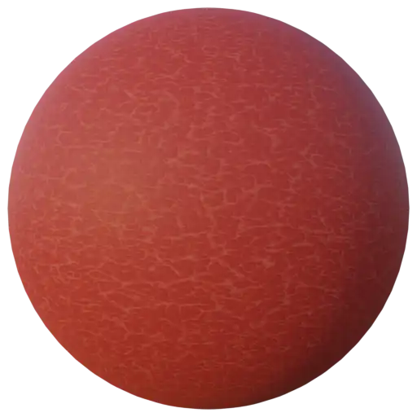

|

**This material is contained in the following Exapacks:**

    - XTRPbr_05k_Vol_001

    - XTRPbr_1k_Vol_001

    - XTRPbr_2k_Vol_003

    - XTRPbr_4k_Vol_007

------------------------------------------------------------------------------------------------------------------------

Leather Red 006
***************

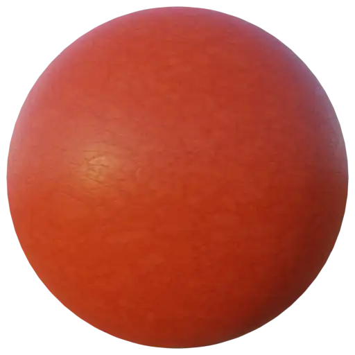

|

**This material is contained in the following Exapacks:**

    - XTRPbr_05k_Vol_001

    - XTRPbr_1k_Vol_001

    - XTRPbr_2k_Vol_003

    - XTRPbr_4k_Vol_007

    - XTRPbr_8k_Vol_008

------------------------------------------------------------------------------------------------------------------------

Leather White 001
*****************

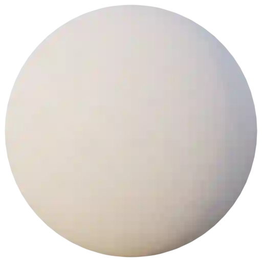

|

**This material is contained in the following Exapacks:**

    - XTRPbr_05k_Vol_001

    - XTRPbr_1k_Vol_001

    - XTRPbr_2k_Vol_003

    - XTRPbr_4k_Vol_007

    - XTRPbr_8k_Vol_008

------------------------------------------------------------------------------------------------------------------------

Leather - Stitching (Category)
------------------------------

Leather Perforated 001
**********************

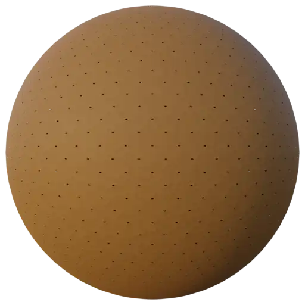

|

**This material is contained in the following Exapacks:**

    - XTRPbr_05k_Vol_001

    - XTRPbr_1k_Vol_001

    - XTRPbr_2k_Vol_003

    - XTRPbr_4k_Vol_007

    - XTRPbr_8k_Vol_008

------------------------------------------------------------------------------------------------------------------------

Leather Perforated 002
**********************

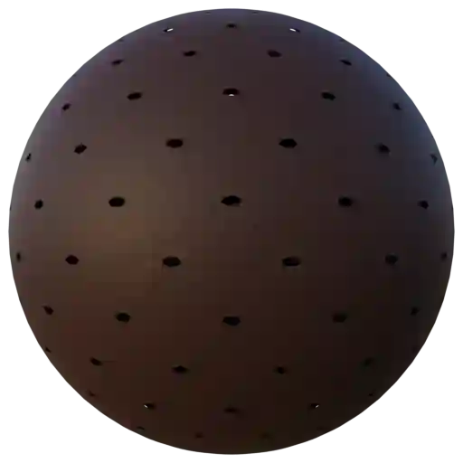

|

**This material is contained in the following Exapacks:**

    - XTRPbr_05k_Vol_001

    - XTRPbr_1k_Vol_001

    - XTRPbr_2k_Vol_003

    - XTRPbr_4k_Vol_007

    - XTRPbr_8k_Vol_008

------------------------------------------------------------------------------------------------------------------------

Leather Perforated 003
**********************

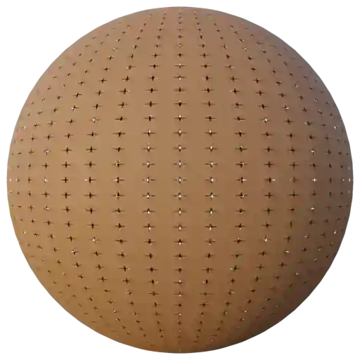

|

**This material is contained in the following Exapacks:**

    - XTRPbr_05k_Vol_001

    - XTRPbr_1k_Vol_001

    - XTRPbr_2k_Vol_003

    - XTRPbr_4k_Vol_007

    - XTRPbr_8k_Vol_008

------------------------------------------------------------------------------------------------------------------------

Leather Perforated 004
**********************

.. image:: _static/_images/material_list/leather_stitching/leather_perforated_004/leather_perforated_004.webp
    :width: 30%
    :align: center
    :alt: Leather Perforated 004

|

**This material is contained in the following Exapacks:**

    - XTRPbr_05k_Vol_001

    - XTRPbr_1k_Vol_001

    - XTRPbr_2k_Vol_003

    - XTRPbr_4k_Vol_007

    - XTRPbr_8k_Vol_008

------------------------------------------------------------------------------------------------------------------------

Leather Perforated 005
**********************

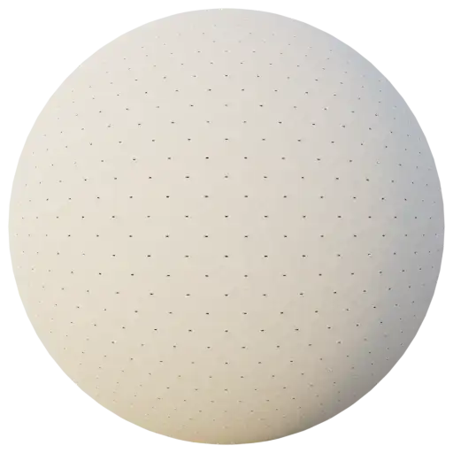

|

**This material is contained in the following Exapacks:**

    - XTRPbr_05k_Vol_001

    - XTRPbr_1k_Vol_001

    - XTRPbr_2k_Vol_003

    - XTRPbr_4k_Vol_007

    - XTRPbr_8k_Vol_008

------------------------------------------------------------------------------------------------------------------------

Leather Stitched 001
********************

.. image:: _static/_images/material_list/leather_stitching/leather_stitched_001/leather_stitched_001.webp
    :width: 30%
    :align: center
    :alt: Leather Stitched 001

|

**This material is contained in the following Exapacks:**

    - XTRPbr_05k_Vol_001

    - XTRPbr_1k_Vol_001

    - XTRPbr_2k_Vol_003

    - XTRPbr_4k_Vol_007

    - XTRPbr_8k_Vol_008

------------------------------------------------------------------------------------------------------------------------

Leather Stitched 002
********************

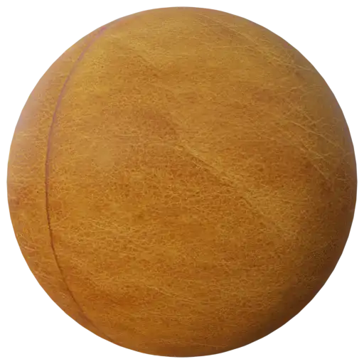

|

**This material is contained in the following Exapacks:**

    - XTRPbr_05k_Vol_001

    - XTRPbr_1k_Vol_001

    - XTRPbr_2k_Vol_003

    - XTRPbr_4k_Vol_007

    - XTRPbr_8k_Vol_008

------------------------------------------------------------------------------------------------------------------------

Leather Tufted 001
******************

.. image:: _static/_images/material_list/leather_stitching/leather_tufted_001/leather_tufted_001.webp
    :width: 30%
    :align: center
    :alt: Leather Tufted 001

|

**This material is contained in the following Exapacks:**

    - XTRPbr_05k_Vol_001

    - XTRPbr_1k_Vol_001

    - XTRPbr_2k_Vol_003

    - XTRPbr_4k_Vol_007

    - XTRPbr_8k_Vol_008

------------------------------------------------------------------------------------------------------------------------

Leather Tufted 002
******************

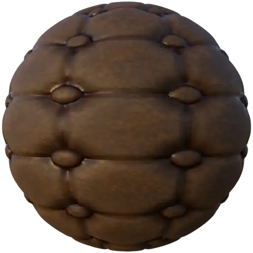

|

**This material is contained in the following Exapacks:**

    - XTRPbr_05k_Vol_001

    - XTRPbr_1k_Vol_001

    - XTRPbr_2k_Vol_003

    - XTRPbr_4k_Vol_007

    - XTRPbr_8k_Vol_008

------------------------------------------------------------------------------------------------------------------------

Leather Tufted 003
******************

|

**This material is contained in the following Exapacks:**

    - XTRPbr_05k_Vol_001

    - XTRPbr_1k_Vol_001

    - XTRPbr_2k_Vol_003

    - XTRPbr_4k_Vol_007

    - XTRPbr_8k_Vol_008

------------------------------------------------------------------------------------------------------------------------

Leather Tufted 005
******************

|

**This material is contained in the following Exapacks:**

    - XTRPbr_05k_Vol_001

    - XTRPbr_1k_Vol_001

    - XTRPbr_2k_Vol_003

    - XTRPbr_4k_Vol_007

    - XTRPbr_8k_Vol_008

------------------------------------------------------------------------------------------------------------------------

Leather Tufted 006
******************

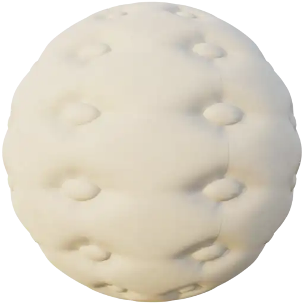

|

**This material is contained in the following Exapacks:**

    - XTRPbr_05k_Vol_001

    - XTRPbr_1k_Vol_001

    - XTRPbr_2k_Vol_003

    - XTRPbr_4k_Vol_007

    - XTRPbr_8k_Vol_008

------------------------------------------------------------------------------------------------------------------------

Leaves - New (Category)
-----------------------

Green Leaf 001
**************

|

**This material is contained in the following Exapacks:**

    - XTRPbr_05k_Vol_001

    - XTRPbr_1k_Vol_001

    - XTRPbr_2k_Vol_003

------------------------------------------------------------------------------------------------------------------------

Green Leaf 002
**************

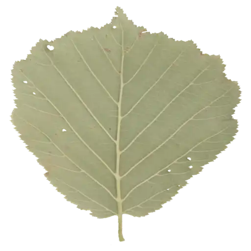

|

**This material is contained in the following Exapacks:**

    - XTRPbr_05k_Vol_001

    - XTRPbr_1k_Vol_001

    - XTRPbr_2k_Vol_003

    - XTRPbr_4k_Vol_007

------------------------------------------------------------------------------------------------------------------------

Green Leaf 003
**************

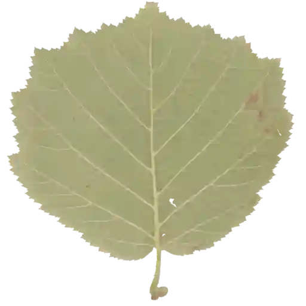

|

**This material is contained in the following Exapacks:**

    - XTRPbr_05k_Vol_001

    - XTRPbr_1k_Vol_001

    - XTRPbr_2k_Vol_003

    - XTRPbr_4k_Vol_007

------------------------------------------------------------------------------------------------------------------------

Green Leaf 004
**************

|

**This material is contained in the following Exapacks:**

    - XTRPbr_05k_Vol_001

    - XTRPbr_1k_Vol_001

    - XTRPbr_2k_Vol_003

    - XTRPbr_4k_Vol_007

------------------------------------------------------------------------------------------------------------------------

Green Leaf 005
**************

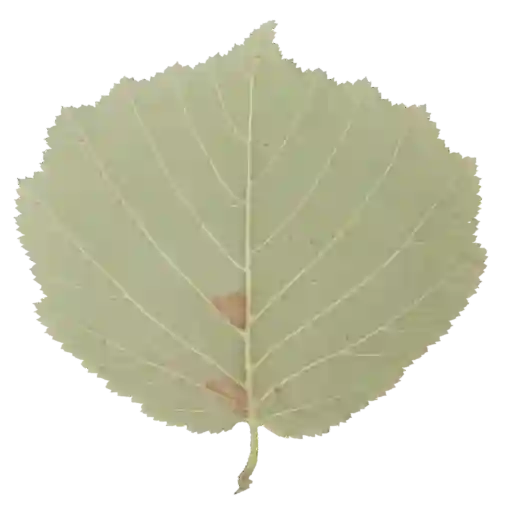

|

**This material is contained in the following Exapacks:**

    - XTRPbr_05k_Vol_001

    - XTRPbr_1k_Vol_001

    - XTRPbr_2k_Vol_003

    - XTRPbr_4k_Vol_007

------------------------------------------------------------------------------------------------------------------------

Green Leaf 006
**************

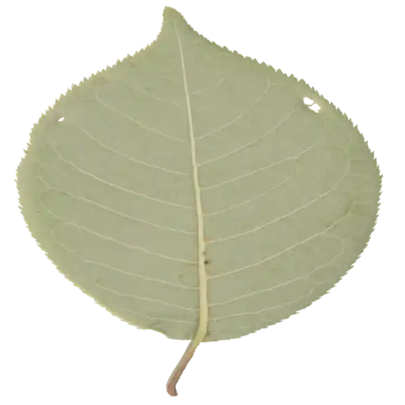

|

**This material is contained in the following Exapacks:**

    - XTRPbr_05k_Vol_001

    - XTRPbr_1k_Vol_001

    - XTRPbr_2k_Vol_003

    - XTRPbr_4k_Vol_007

------------------------------------------------------------------------------------------------------------------------

Green Leaf 007
**************

|

**This material is contained in the following Exapacks:**

    - XTRPbr_05k_Vol_001

    - XTRPbr_1k_Vol_001

    - XTRPbr_2k_Vol_003

    - XTRPbr_4k_Vol_007

------------------------------------------------------------------------------------------------------------------------

Green Leaf 008
**************

|

**This material is contained in the following Exapacks:**

    - XTRPbr_05k_Vol_001

    - XTRPbr_1k_Vol_001

    - XTRPbr_2k_Vol_003

    - XTRPbr_4k_Vol_007

------------------------------------------------------------------------------------------------------------------------

Green Leaf 009
**************

|

**This material is contained in the following Exapacks:**

    - XTRPbr_05k_Vol_001

    - XTRPbr_1k_Vol_001

    - XTRPbr_2k_Vol_003

    - XTRPbr_4k_Vol_007

------------------------------------------------------------------------------------------------------------------------

Green Leaf 010
**************

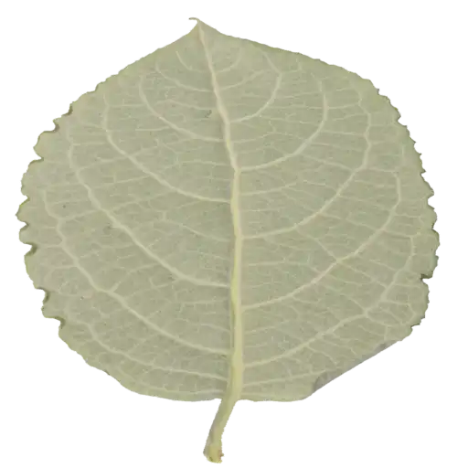

|

**This material is contained in the following Exapacks:**

    - XTRPbr_05k_Vol_001

    - XTRPbr_1k_Vol_001

    - XTRPbr_2k_Vol_003

    - XTRPbr_4k_Vol_007

------------------------------------------------------------------------------------------------------------------------

Green Leaf 011
**************

|

**This material is contained in the following Exapacks:**

    - XTRPbr_05k_Vol_001

    - XTRPbr_1k_Vol_001

    - XTRPbr_2k_Vol_003

------------------------------------------------------------------------------------------------------------------------

Green Leaf 012
**************

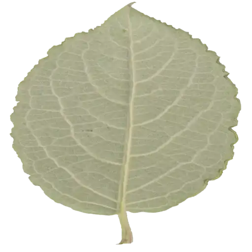

|

**This material is contained in the following Exapacks:**

    - XTRPbr_05k_Vol_001

    - XTRPbr_1k_Vol_001

    - XTRPbr_2k_Vol_003

    - XTRPbr_4k_Vol_007

------------------------------------------------------------------------------------------------------------------------

Oak Leaf 001
************

|

**This material is contained in the following Exapacks:**

    - XTRPbr_05k_Vol_001

    - XTRPbr_1k_Vol_001

    - XTRPbr_2k_Vol_003

------------------------------------------------------------------------------------------------------------------------

Oak Leaf 002
************

|

**This material is contained in the following Exapacks:**

    - XTRPbr_05k_Vol_001

    - XTRPbr_1k_Vol_001

    - XTRPbr_2k_Vol_003

    - XTRPbr_4k_Vol_007

------------------------------------------------------------------------------------------------------------------------

Oak Leaf 003
************

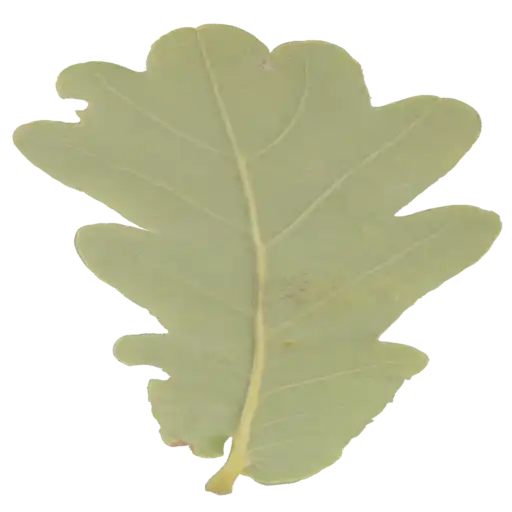

|

**This material is contained in the following Exapacks:**

    - XTRPbr_05k_Vol_001

    - XTRPbr_1k_Vol_001

    - XTRPbr_2k_Vol_003

    - XTRPbr_4k_Vol_007

------------------------------------------------------------------------------------------------------------------------

Oak Leaf 004
************

|

**This material is contained in the following Exapacks:**

    - XTRPbr_05k_Vol_001

    - XTRPbr_1k_Vol_001

    - XTRPbr_2k_Vol_003

    - XTRPbr_4k_Vol_007

------------------------------------------------------------------------------------------------------------------------

Oak Leaf 005
************

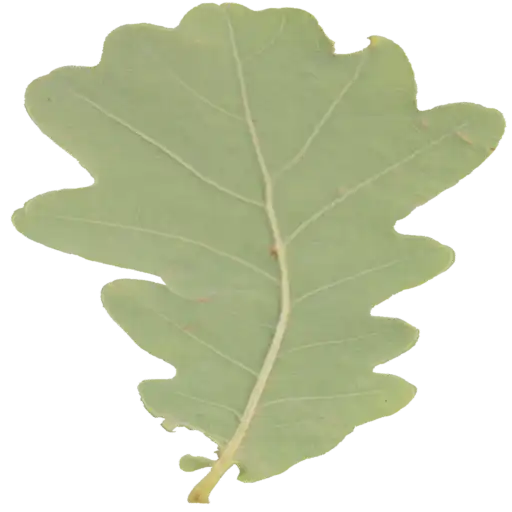

|

**This material is contained in the following Exapacks:**

    - XTRPbr_05k_Vol_001

    - XTRPbr_1k_Vol_001

    - XTRPbr_2k_Vol_003

------------------------------------------------------------------------------------------------------------------------

Oak Leaf 006
************

|

**This material is contained in the following Exapacks:**

    - XTRPbr_05k_Vol_001

    - XTRPbr_1k_Vol_001

    - XTRPbr_2k_Vol_003

------------------------------------------------------------------------------------------------------------------------

Leaves - Old (Category)
-----------------------

Autumn Leaf 001
***************

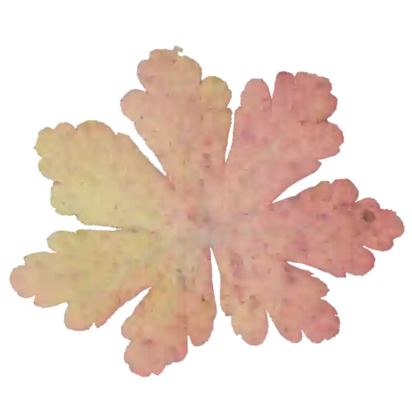

|

**This material is contained in the following Exapacks:**

    - XTRPbr_05k_Vol_001

    - XTRPbr_1k_Vol_001

    - XTRPbr_2k_Vol_003

------------------------------------------------------------------------------------------------------------------------

Autumn Leaf 002
***************

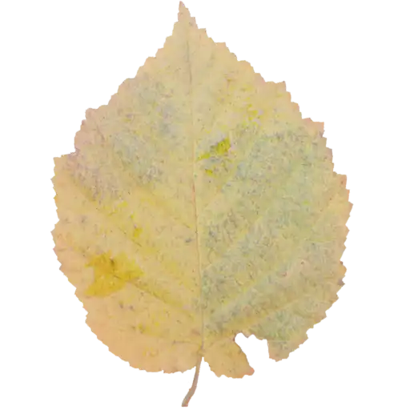

|

**This material is contained in the following Exapacks:**

    - XTRPbr_05k_Vol_001

    - XTRPbr_1k_Vol_001

    - XTRPbr_2k_Vol_003

------------------------------------------------------------------------------------------------------------------------

Autumn Leaf 003
***************

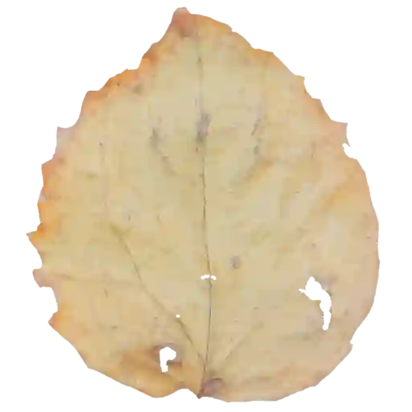

|

**This material is contained in the following Exapacks:**

    - XTRPbr_05k_Vol_001

    - XTRPbr_1k_Vol_001

    - XTRPbr_2k_Vol_003

------------------------------------------------------------------------------------------------------------------------

Autumn Leaf 004
***************

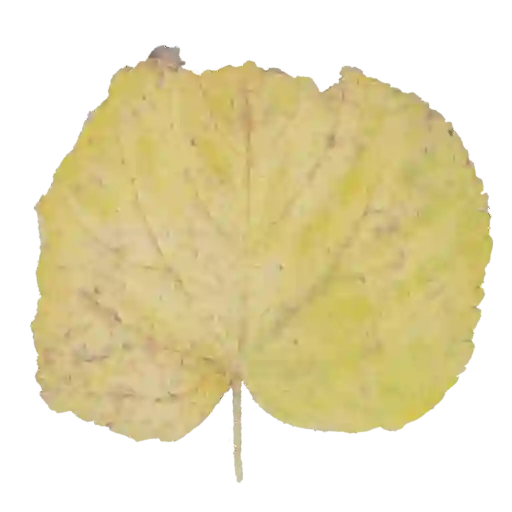

|

**This material is contained in the following Exapacks:**

    - XTRPbr_05k_Vol_001

    - XTRPbr_1k_Vol_001

    - XTRPbr_2k_Vol_003

------------------------------------------------------------------------------------------------------------------------

Autumn Leaf 005
***************

|

**This material is contained in the following Exapacks:**

    - XTRPbr_05k_Vol_001

    - XTRPbr_1k_Vol_001

    - XTRPbr_2k_Vol_003

------------------------------------------------------------------------------------------------------------------------

Autumn Leaf 006
***************

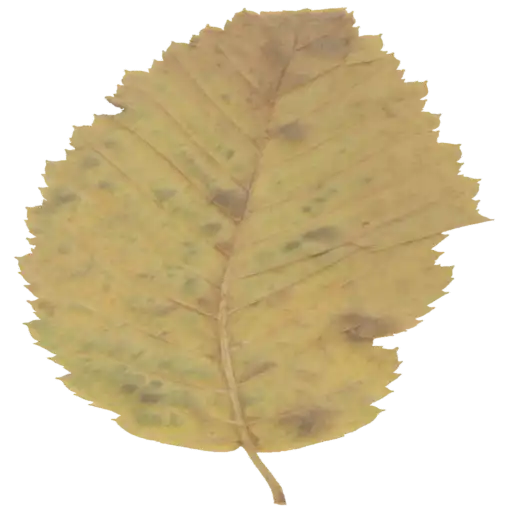

|

**This material is contained in the following Exapacks:**

    - XTRPbr_05k_Vol_001

    - XTRPbr_1k_Vol_001

    - XTRPbr_2k_Vol_003

------------------------------------------------------------------------------------------------------------------------

Autumn Leaf 007
***************

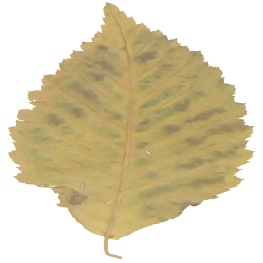

|

**This material is contained in the following Exapacks:**

    - XTRPbr_05k_Vol_001

    - XTRPbr_1k_Vol_001

    - XTRPbr_2k_Vol_003

------------------------------------------------------------------------------------------------------------------------

Autumn Leaf 008
***************

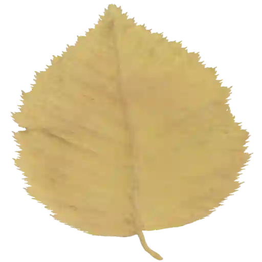

|

**This material is contained in the following Exapacks:**

    - XTRPbr_05k_Vol_001

    - XTRPbr_1k_Vol_001

    - XTRPbr_2k_Vol_003

------------------------------------------------------------------------------------------------------------------------

Autumn Leaf 009
***************

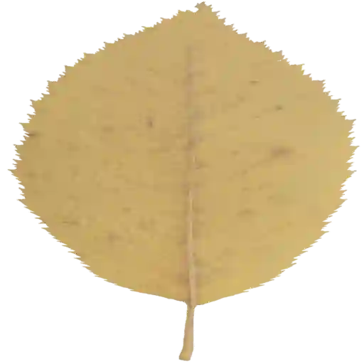

|

**This material is contained in the following Exapacks:**

    - XTRPbr_05k_Vol_001

    - XTRPbr_1k_Vol_001

    - XTRPbr_2k_Vol_003

------------------------------------------------------------------------------------------------------------------------

Autumn Leaf 010
***************

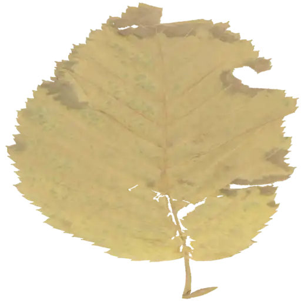

|

**This material is contained in the following Exapacks:**

    - XTRPbr_05k_Vol_001

    - XTRPbr_1k_Vol_001

    - XTRPbr_2k_Vol_003

------------------------------------------------------------------------------------------------------------------------

Autumn Leaf 011
***************

|

**This material is contained in the following Exapacks:**

    - XTRPbr_05k_Vol_001

    - XTRPbr_1k_Vol_001

    - XTRPbr_2k_Vol_003

------------------------------------------------------------------------------------------------------------------------

Autumn Leaf 012
***************

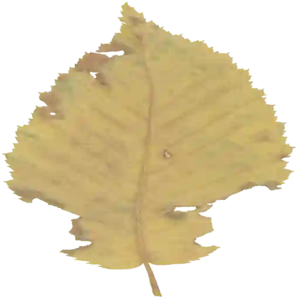

|

**This material is contained in the following Exapacks:**

    - XTRPbr_05k_Vol_001

    - XTRPbr_1k_Vol_001

    - XTRPbr_2k_Vol_003

------------------------------------------------------------------------------------------------------------------------

Autumn Leaf 013
***************

.. image:: _static/_images/material_list/leaves_old/autumn_leaf_013/autumn_leaf_013.webp
    :width: 30%
    :align: center
    :alt: Autumn Leaf 013

|

**This material is contained in the following Exapacks:**

    - XTRPbr_05k_Vol_001

    - XTRPbr_1k_Vol_001

    - XTRPbr_2k_Vol_003

------------------------------------------------------------------------------------------------------------------------

Autumn Leaf 014
***************

|

**This material is contained in the following Exapacks:**

    - XTRPbr_05k_Vol_001

    - XTRPbr_1k_Vol_001

    - XTRPbr_2k_Vol_003

------------------------------------------------------------------------------------------------------------------------

Autumn Leaf 015
***************

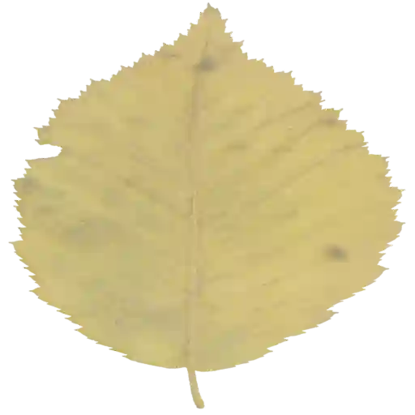

|

**This material is contained in the following Exapacks:**

    - XTRPbr_05k_Vol_001

    - XTRPbr_1k_Vol_001

    - XTRPbr_2k_Vol_003

------------------------------------------------------------------------------------------------------------------------

Autumn Leaf 016
***************

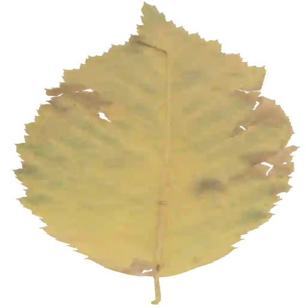

|

**This material is contained in the following Exapacks:**

    - XTRPbr_05k_Vol_001

    - XTRPbr_1k_Vol_001

    - XTRPbr_2k_Vol_003

------------------------------------------------------------------------------------------------------------------------

Autumn Leaf 017
***************

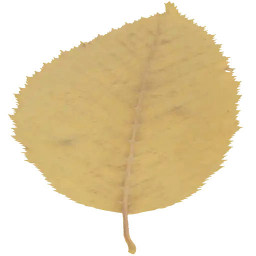

|

**This material is contained in the following Exapacks:**

    - XTRPbr_05k_Vol_001

    - XTRPbr_1k_Vol_001

    - XTRPbr_2k_Vol_003

------------------------------------------------------------------------------------------------------------------------

Autumn Leaf 018
***************

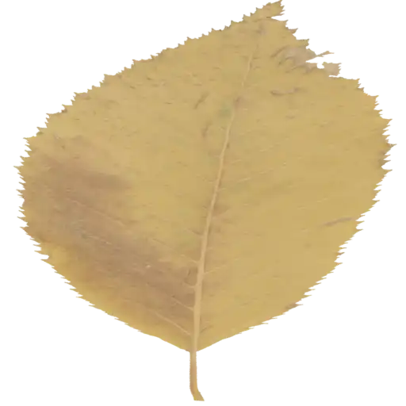

|

**This material is contained in the following Exapacks:**

    - XTRPbr_05k_Vol_001

    - XTRPbr_1k_Vol_001

    - XTRPbr_2k_Vol_003

    - XTRPbr_4k_Vol_007

------------------------------------------------------------------------------------------------------------------------

Autumn Leaf 019
***************

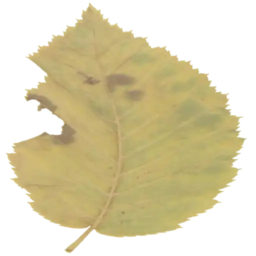

|

**This material is contained in the following Exapacks:**

    - XTRPbr_05k_Vol_001

    - XTRPbr_1k_Vol_001

    - XTRPbr_2k_Vol_003

------------------------------------------------------------------------------------------------------------------------

Autumn Leaf 020
***************

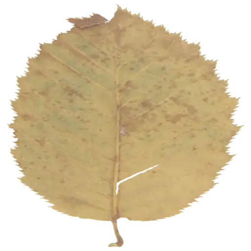

|

**This material is contained in the following Exapacks:**

    - XTRPbr_05k_Vol_001

    - XTRPbr_1k_Vol_001

    - XTRPbr_2k_Vol_003

------------------------------------------------------------------------------------------------------------------------

Autumn Leaf 021
***************

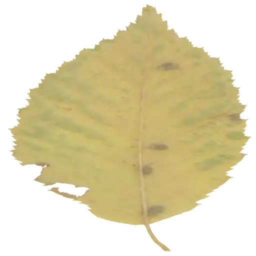

|

**This material is contained in the following Exapacks:**

    - XTRPbr_05k_Vol_001

    - XTRPbr_1k_Vol_001

    - XTRPbr_2k_Vol_003

------------------------------------------------------------------------------------------------------------------------

Autumn Leaf 022
***************

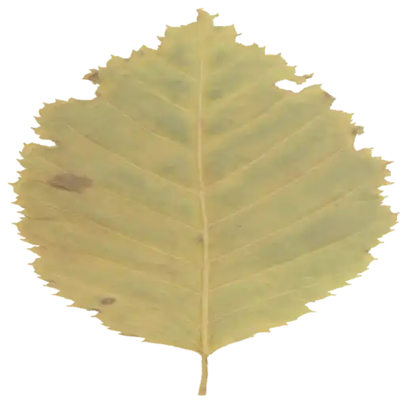

|

**This material is contained in the following Exapacks:**

    - XTRPbr_05k_Vol_001

    - XTRPbr_1k_Vol_001

    - XTRPbr_2k_Vol_003

------------------------------------------------------------------------------------------------------------------------

Autumn Leaf 023
***************

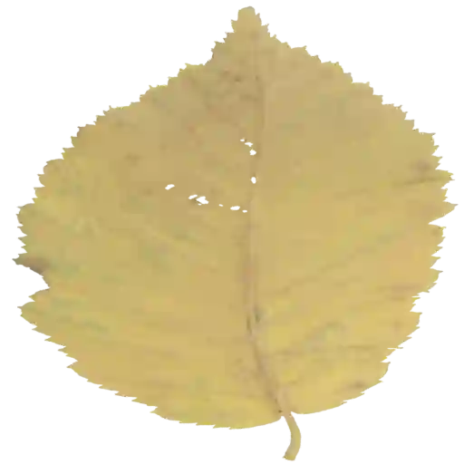

|

**This material is contained in the following Exapacks:**

    - XTRPbr_05k_Vol_001

    - XTRPbr_1k_Vol_001

    - XTRPbr_2k_Vol_003

------------------------------------------------------------------------------------------------------------------------

Autumn Leaf 024
***************

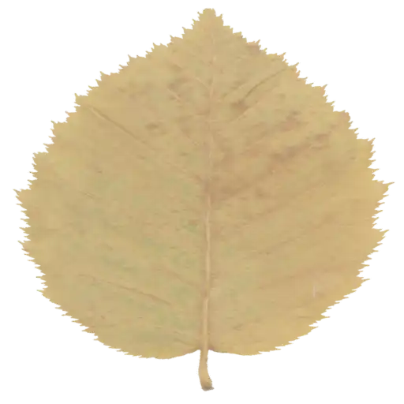

|

**This material is contained in the following Exapacks:**

    - XTRPbr_05k_Vol_001

    - XTRPbr_1k_Vol_001

    - XTRPbr_2k_Vol_003

------------------------------------------------------------------------------------------------------------------------

Autumn Leaf 025
***************

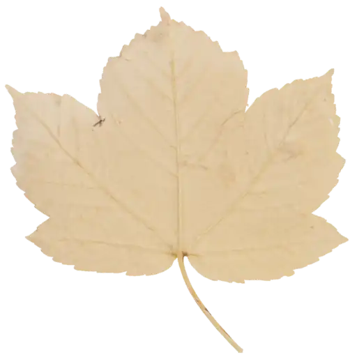

|

**This material is contained in the following Exapacks:**

    - XTRPbr_05k_Vol_001

    - XTRPbr_1k_Vol_001

    - XTRPbr_2k_Vol_003

------------------------------------------------------------------------------------------------------------------------

Autumn Leaf 026
***************

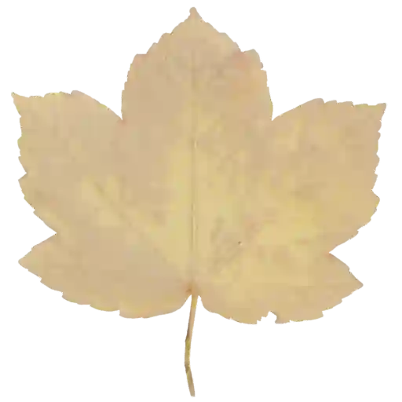

|

**This material is contained in the following Exapacks:**

    - XTRPbr_05k_Vol_001

    - XTRPbr_1k_Vol_001

    - XTRPbr_2k_Vol_003

------------------------------------------------------------------------------------------------------------------------

Autumn Leaf 027
***************

.. image:: _static/_images/material_list/leaves_old/autumn_leaf_027/autumn_leaf_027.webp
    :width: 30%
    :align: center
    :alt: Autumn Leaf 027

|

**This material is contained in the following Exapacks:**

    - XTRPbr_05k_Vol_001

    - XTRPbr_1k_Vol_001

    - XTRPbr_2k_Vol_003

------------------------------------------------------------------------------------------------------------------------

Autumn Leaf 028
***************

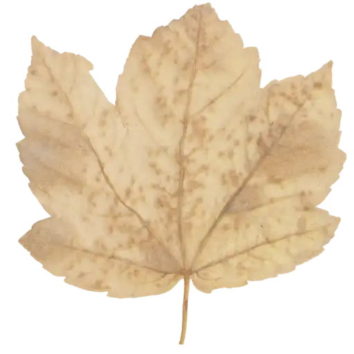

|

**This material is contained in the following Exapacks:**

    - XTRPbr_05k_Vol_001

    - XTRPbr_1k_Vol_001

    - XTRPbr_2k_Vol_003

------------------------------------------------------------------------------------------------------------------------

Autumn Leaf 029
***************

|

**This material is contained in the following Exapacks:**

    - XTRPbr_05k_Vol_001

    - XTRPbr_1k_Vol_001

    - XTRPbr_2k_Vol_003

------------------------------------------------------------------------------------------------------------------------

Autumn Leaf 030
***************

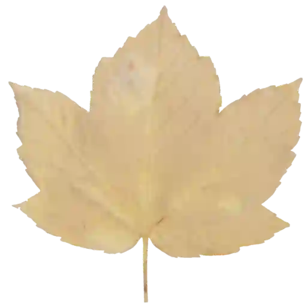

|

**This material is contained in the following Exapacks:**

    - XTRPbr_05k_Vol_001

    - XTRPbr_1k_Vol_001

    - XTRPbr_2k_Vol_003

------------------------------------------------------------------------------------------------------------------------

Autumn Leaf 031
***************

.. image:: _static/_images/material_list/leaves_old/autumn_leaf_031/autumn_leaf_031.webp
    :width: 30%
    :align: center
    :alt: Autumn Leaf 031

|

**This material is contained in the following Exapacks:**

    - XTRPbr_05k_Vol_001

    - XTRPbr_1k_Vol_001

    - XTRPbr_2k_Vol_003

------------------------------------------------------------------------------------------------------------------------

Metal - Grid (Category)
-----------------------

Metal Walkway 001
*****************

.. image:: _static/_images/material_list/metal_grid/metal_walkway_001/metal_walkway_001.webp
    :width: 30%
    :align: center
    :alt: Metal Walkway 001

|

**This material is contained in the following Exapacks:**

    - XTRPbr_05k_Vol_001

    - XTRPbr_1k_Vol_001

    - XTRPbr_2k_Vol_003

    - XTRPbr_4k_Vol_007

------------------------------------------------------------------------------------------------------------------------

Metal Walkway 002
*****************

.. image:: _static/_images/material_list/metal_grid/metal_walkway_002/metal_walkway_002.webp
    :width: 30%
    :align: center
    :alt: Metal Walkway 002

|

**This material is contained in the following Exapacks:**

    - XTRPbr_05k_Vol_001

    - XTRPbr_1k_Vol_001

    - XTRPbr_2k_Vol_003

    - XTRPbr_4k_Vol_007

------------------------------------------------------------------------------------------------------------------------

Metal Walkway 003
*****************

.. image:: _static/_images/material_list/metal_grid/metal_walkway_003/metal_walkway_003.webp
    :width: 30%
    :align: center
    :alt: Metal Walkway 003

|

**This material is contained in the following Exapacks:**

    - XTRPbr_05k_Vol_001

    - XTRPbr_1k_Vol_001

    - XTRPbr_2k_Vol_003

    - XTRPbr_4k_Vol_007

------------------------------------------------------------------------------------------------------------------------

Metal Walkway 004
*****************

.. image:: _static/_images/material_list/metal_grid/metal_walkway_004/metal_walkway_004.webp
    :width: 30%
    :align: center
    :alt: Metal Walkway 004

|

**This material is contained in the following Exapacks:**

    - XTRPbr_05k_Vol_001

    - XTRPbr_1k_Vol_001

    - XTRPbr_2k_Vol_003

    - XTRPbr_4k_Vol_007

------------------------------------------------------------------------------------------------------------------------

Metal Walkway 005
*****************

.. image:: _static/_images/material_list/metal_grid/metal_walkway_005/metal_walkway_005.webp
    :width: 30%
    :align: center
    :alt: Metal Walkway 005

|

**This material is contained in the following Exapacks:**

    - XTRPbr_05k_Vol_001

    - XTRPbr_1k_Vol_001

    - XTRPbr_2k_Vol_003

    - XTRPbr_4k_Vol_007

------------------------------------------------------------------------------------------------------------------------

Metal Walkway 006
*****************

.. image:: _static/_images/material_list/metal_grid/metal_walkway_006/metal_walkway_006.webp
    :width: 30%
    :align: center
    :alt: Metal Walkway 006

|

**This material is contained in the following Exapacks:**

    - XTRPbr_05k_Vol_001

    - XTRPbr_1k_Vol_001

    - XTRPbr_2k_Vol_003

    - XTRPbr_4k_Vol_007

------------------------------------------------------------------------------------------------------------------------

Metal Walkway 007
*****************

.. image:: _static/_images/material_list/metal_grid/metal_walkway_007/metal_walkway_007.webp
    :width: 30%
    :align: center
    :alt: Metal Walkway 007

|

**This material is contained in the following Exapacks:**

    - XTRPbr_05k_Vol_001

    - XTRPbr_1k_Vol_001

    - XTRPbr_2k_Vol_003

    - XTRPbr_4k_Vol_007

------------------------------------------------------------------------------------------------------------------------

Metal Walkway 008
*****************

.. image:: _static/_images/material_list/metal_grid/metal_walkway_008/metal_walkway_008.webp
    :width: 30%
    :align: center
    :alt: Metal Walkway 008

|

**This material is contained in the following Exapacks:**

    - XTRPbr_05k_Vol_001

    - XTRPbr_1k_Vol_001

    - XTRPbr_2k_Vol_003

    - XTRPbr_4k_Vol_007

------------------------------------------------------------------------------------------------------------------------

Metal Walkway 009
*****************

.. image:: _static/_images/material_list/metal_grid/metal_walkway_009/metal_walkway_009.webp
    :width: 30%
    :align: center
    :alt: Metal Walkway 009

|

**This material is contained in the following Exapacks:**

    - XTRPbr_05k_Vol_001

    - XTRPbr_1k_Vol_001

    - XTRPbr_2k_Vol_003

    - XTRPbr_4k_Vol_007

------------------------------------------------------------------------------------------------------------------------

Metal Walkway 010
*****************

.. image:: _static/_images/material_list/metal_grid/metal_walkway_010/metal_walkway_010.webp
    :width: 30%
    :align: center
    :alt: Metal Walkway 010

|

**This material is contained in the following Exapacks:**

    - XTRPbr_05k_Vol_001

    - XTRPbr_1k_Vol_001

    - XTRPbr_2k_Vol_003

    - XTRPbr_4k_Vol_007

    - XTRPbr_8k_Vol_008

------------------------------------------------------------------------------------------------------------------------

Metal Walkway 011
*****************

.. image:: _static/_images/material_list/metal_grid/metal_walkway_011/metal_walkway_011.webp
    :width: 30%
    :align: center
    :alt: Metal Walkway 011

|

**This material is contained in the following Exapacks:**

    - XTRPbr_05k_Vol_001

    - XTRPbr_1k_Vol_001

    - XTRPbr_2k_Vol_003

    - XTRPbr_4k_Vol_007

    - XTRPbr_8k_Vol_008

------------------------------------------------------------------------------------------------------------------------

Metal Walkway 012
*****************

.. image:: _static/_images/material_list/metal_grid/metal_walkway_012/metal_walkway_012.webp
    :width: 30%
    :align: center
    :alt: Metal Walkway 012

|

**This material is contained in the following Exapacks:**

    - XTRPbr_05k_Vol_001

    - XTRPbr_1k_Vol_001

    - XTRPbr_2k_Vol_003

    - XTRPbr_4k_Vol_007

    - XTRPbr_8k_Vol_007

    - XTRPbr_8k_Vol_008

------------------------------------------------------------------------------------------------------------------------

Metal Walkway 013
*****************

.. image:: _static/_images/material_list/metal_grid/metal_walkway_013/metal_walkway_013.webp
    :width: 30%
    :align: center
    :alt: Metal Walkway 013

|

**This material is contained in the following Exapacks:**

    - XTRPbr_05k_Vol_001

    - XTRPbr_1k_Vol_001

    - XTRPbr_2k_Vol_003

    - XTRPbr_4k_Vol_007

    - XTRPbr_8k_Vol_007

------------------------------------------------------------------------------------------------------------------------

Sheet Metal Grid 001
********************

.. image:: _static/_images/material_list/metal_grid/sheet_metal_grid_001/sheet_metal_grid_001.webp
    :width: 30%
    :align: center
    :alt: Sheet Metal Grid 001

|

**This material is contained in the following Exapacks:**

    - XTRPbr_05k_Vol_001

    - XTRPbr_1k_Vol_001

    - XTRPbr_2k_Vol_003

    - XTRPbr_4k_Vol_007

    - XTRPbr_8k_Vol_007

------------------------------------------------------------------------------------------------------------------------

Sheet Metal Grid 002
********************

.. image:: _static/_images/material_list/metal_grid/sheet_metal_grid_002/sheet_metal_grid_002.webp
    :width: 30%
    :align: center
    :alt: Sheet Metal Grid 002

|

**This material is contained in the following Exapacks:**

    - XTRPbr_05k_Vol_001

    - XTRPbr_1k_Vol_001

    - XTRPbr_2k_Vol_003

    - XTRPbr_4k_Vol_007

    - XTRPbr_8k_Vol_007

------------------------------------------------------------------------------------------------------------------------

Sheet Metal Grid 003
********************

.. image:: _static/_images/material_list/metal_grid/sheet_metal_grid_003/sheet_metal_grid_003.webp
    :width: 30%
    :align: center
    :alt: Sheet Metal Grid 003

|

**This material is contained in the following Exapacks:**

    - XTRPbr_05k_Vol_001

    - XTRPbr_1k_Vol_001

    - XTRPbr_2k_Vol_003

    - XTRPbr_4k_Vol_007

    - XTRPbr_8k_Vol_007

------------------------------------------------------------------------------------------------------------------------

Sheet Metal Grid 004
********************

.. image:: _static/_images/material_list/metal_grid/sheet_metal_grid_004/sheet_metal_grid_004.webp
    :width: 30%
    :align: center
    :alt: Sheet Metal Grid 004

|

**This material is contained in the following Exapacks:**

    - XTRPbr_05k_Vol_001

    - XTRPbr_1k_Vol_001

    - XTRPbr_2k_Vol_003

    - XTRPbr_4k_Vol_007

    - XTRPbr_8k_Vol_007

------------------------------------------------------------------------------------------------------------------------

Sheet Metal Grid 005
********************

.. image:: _static/_images/material_list/metal_grid/sheet_metal_grid_005/sheet_metal_grid_005.webp
    :width: 30%
    :align: center
    :alt: Sheet Metal Grid 005

|

**This material is contained in the following Exapacks:**

    - XTRPbr_05k_Vol_001

    - XTRPbr_1k_Vol_001

    - XTRPbr_2k_Vol_003

------------------------------------------------------------------------------------------------------------------------

Sheet Metal Grid 006
********************

.. image:: _static/_images/material_list/metal_grid/sheet_metal_grid_006/sheet_metal_grid_006.webp
    :width: 30%
    :align: center
    :alt: Sheet Metal Grid 006

|

**This material is contained in the following Exapacks:**

    - XTRPbr_05k_Vol_001

    - XTRPbr_1k_Vol_001

    - XTRPbr_2k_Vol_003

    - XTRPbr_4k_Vol_007

------------------------------------------------------------------------------------------------------------------------

Metal - Plates (Category)
-------------------------

Circles Plate Metal 001
***********************

.. image:: _static/_images/material_list/metal_plates/circles_plate_metal_001/circles_plate_metal_001.webp
    :width: 30%
    :align: center
    :alt: Circles Plate Metal 001

|

**This material is contained in the following Exapacks:**

    - XTRPbr_05k_Vol_001

    - XTRPbr_1k_Vol_001

    - XTRPbr_2k_Vol_003

    - XTRPbr_4k_Vol_007

------------------------------------------------------------------------------------------------------------------------

Diamond Plate 001
*****************

.. image:: _static/_images/material_list/metal_plates/diamond_plate_001/diamond_plate_001.webp
    :width: 30%
    :align: center
    :alt: Diamond Plate 001

|

**This material is contained in the following Exapacks:**

    - XTRPbr_05k_Vol_001

    - XTRPbr_1k_Vol_001

    - XTRPbr_2k_Vol_003

    - XTRPbr_4k_Vol_005

    - XTRPbr_4k_Vol_007

------------------------------------------------------------------------------------------------------------------------

Diamond Plate 002
*****************

.. image:: _static/_images/material_list/metal_plates/diamond_plate_002/diamond_plate_002.webp
    :width: 30%
    :align: center
    :alt: Diamond Plate 002

|

**This material is contained in the following Exapacks:**

    - XTRPbr_05k_Vol_001

    - XTRPbr_1k_Vol_001

    - XTRPbr_2k_Vol_003

    - XTRPbr_4k_Vol_005

------------------------------------------------------------------------------------------------------------------------

Diamond Plate 003
*****************

.. image:: _static/_images/material_list/metal_plates/diamond_plate_003/diamond_plate_003.webp
    :width: 30%
    :align: center
    :alt: Diamond Plate 003

|

**This material is contained in the following Exapacks:**

    - XTRPbr_05k_Vol_001

    - XTRPbr_1k_Vol_001

    - XTRPbr_2k_Vol_003

    - XTRPbr_4k_Vol_005

------------------------------------------------------------------------------------------------------------------------

Diamond Plate 004
*****************

.. image:: _static/_images/material_list/metal_plates/diamond_plate_004/diamond_plate_004.webp
    :width: 30%
    :align: center
    :alt: Diamond Plate 004

|

**This material is contained in the following Exapacks:**

    - XTRPbr_05k_Vol_001

    - XTRPbr_1k_Vol_001

    - XTRPbr_2k_Vol_003

    - XTRPbr_4k_Vol_005

------------------------------------------------------------------------------------------------------------------------

Diamond Plate 005
*****************

.. image:: _static/_images/material_list/metal_plates/diamond_plate_005/diamond_plate_005.webp
    :width: 30%
    :align: center
    :alt: Diamond Plate 005

|

**This material is contained in the following Exapacks:**

    - XTRPbr_05k_Vol_001

    - XTRPbr_1k_Vol_001

    - XTRPbr_2k_Vol_003

    - XTRPbr_4k_Vol_005

------------------------------------------------------------------------------------------------------------------------

Diamond Plate 006
*****************

.. image:: _static/_images/material_list/metal_plates/diamond_plate_006/diamond_plate_006.webp
    :width: 30%
    :align: center
    :alt: Diamond Plate 006

|

**This material is contained in the following Exapacks:**

    - XTRPbr_05k_Vol_001

    - XTRPbr_1k_Vol_001

    - XTRPbr_2k_Vol_003

    - XTRPbr_4k_Vol_005

------------------------------------------------------------------------------------------------------------------------

Diamond Plate 007
*****************

.. image:: _static/_images/material_list/metal_plates/diamond_plate_007/diamond_plate_007.webp
    :width: 30%
    :align: center
    :alt: Diamond Plate 007

|

**This material is contained in the following Exapacks:**

    - XTRPbr_05k_Vol_001

    - XTRPbr_1k_Vol_001

    - XTRPbr_2k_Vol_003

    - XTRPbr_4k_Vol_005

------------------------------------------------------------------------------------------------------------------------

Diamond Plate 008
*****************

.. image:: _static/_images/material_list/metal_plates/diamond_plate_008/diamond_plate_008.webp
    :width: 30%
    :align: center
    :alt: Diamond Plate 008

|

**This material is contained in the following Exapacks:**

    - XTRPbr_05k_Vol_001

    - XTRPbr_1k_Vol_001

    - XTRPbr_2k_Vol_003

    - XTRPbr_4k_Vol_005

------------------------------------------------------------------------------------------------------------------------

Diamond Plate 009
*****************

.. image:: _static/_images/material_list/metal_plates/diamond_plate_009/diamond_plate_009.webp
    :width: 30%
    :align: center
    :alt: Diamond Plate 009

|

**This material is contained in the following Exapacks:**

    - XTRPbr_05k_Vol_001

    - XTRPbr_1k_Vol_001

    - XTRPbr_2k_Vol_003

    - XTRPbr_4k_Vol_005

------------------------------------------------------------------------------------------------------------------------

Diamond Plate 010
*****************

.. image:: _static/_images/material_list/metal_plates/diamond_plate_010/diamond_plate_010.webp
    :width: 30%
    :align: center
    :alt: Diamond Plate 010

|

**This material is contained in the following Exapacks:**

    - XTRPbr_05k_Vol_001

    - XTRPbr_1k_Vol_001

    - XTRPbr_2k_Vol_003

    - XTRPbr_4k_Vol_005

------------------------------------------------------------------------------------------------------------------------

Diamond Plate 011
*****************

.. image:: _static/_images/material_list/metal_plates/diamond_plate_011/diamond_plate_011.webp
    :width: 30%
    :align: center
    :alt: Diamond Plate 011

|

**This material is contained in the following Exapacks:**

    - XTRPbr_05k_Vol_001

    - XTRPbr_1k_Vol_001

    - XTRPbr_2k_Vol_003

    - XTRPbr_4k_Vol_005

    - XTRPbr_8k_Vol_007

------------------------------------------------------------------------------------------------------------------------

Diamond Plate 012
*****************

.. image:: _static/_images/material_list/metal_plates/diamond_plate_012/diamond_plate_012.webp
    :width: 30%
    :align: center
    :alt: Diamond Plate 012

|

**This material is contained in the following Exapacks:**

    - XTRPbr_05k_Vol_001

    - XTRPbr_1k_Vol_001

    - XTRPbr_2k_Vol_003

    - XTRPbr_4k_Vol_005

------------------------------------------------------------------------------------------------------------------------

Diamond Plate 013
*****************

.. image:: _static/_images/material_list/metal_plates/diamond_plate_013/diamond_plate_013.webp
    :width: 30%
    :align: center
    :alt: Diamond Plate 013

|

**This material is contained in the following Exapacks:**

    - XTRPbr_05k_Vol_001

    - XTRPbr_1k_Vol_001

    - XTRPbr_2k_Vol_003

    - XTRPbr_4k_Vol_005

------------------------------------------------------------------------------------------------------------------------

Diamond Plate 014
*****************

.. image:: _static/_images/material_list/metal_plates/diamond_plate_014/diamond_plate_014.webp
    :width: 30%
    :align: center
    :alt: Diamond Plate 014

|

**This material is contained in the following Exapacks:**

    - XTRPbr_05k_Vol_001

    - XTRPbr_1k_Vol_001

    - XTRPbr_2k_Vol_003

    - XTRPbr_4k_Vol_005

    - XTRPbr_8k_Vol_007

------------------------------------------------------------------------------------------------------------------------

Diamond Plate 015
*****************

.. image:: _static/_images/material_list/metal_plates/diamond_plate_015/diamond_plate_015.webp
    :width: 30%
    :align: center
    :alt: Diamond Plate 015

|

**This material is contained in the following Exapacks:**

    - XTRPbr_05k_Vol_001

    - XTRPbr_1k_Vol_001

    - XTRPbr_2k_Vol_003

    - XTRPbr_4k_Vol_005

------------------------------------------------------------------------------------------------------------------------

Metal Plates 001
****************

.. image:: _static/_images/material_list/metal_plates/metal_plates_001/metal_plates_001.webp
    :width: 30%
    :align: center
    :alt: Metal Plates 001

|

**This material is contained in the following Exapacks:**

    - XTRPbr_05k_Vol_001

    - XTRPbr_1k_Vol_001

    - XTRPbr_2k_Vol_003

    - XTRPbr_4k_Vol_005

------------------------------------------------------------------------------------------------------------------------

Metal Plates 002
****************

.. image:: _static/_images/material_list/metal_plates/metal_plates_002/metal_plates_002.webp
    :width: 30%
    :align: center
    :alt: Metal Plates 002

|

**This material is contained in the following Exapacks:**

    - XTRPbr_05k_Vol_001

    - XTRPbr_1k_Vol_001

    - XTRPbr_2k_Vol_003

    - XTRPbr_4k_Vol_005

------------------------------------------------------------------------------------------------------------------------

Metal Plates 003
****************

.. image:: _static/_images/material_list/metal_plates/metal_plates_003/metal_plates_003.webp
    :width: 30%
    :align: center
    :alt: Metal Plates 003

|

**This material is contained in the following Exapacks:**

    - XTRPbr_05k_Vol_001

    - XTRPbr_1k_Vol_001

    - XTRPbr_2k_Vol_003

    - XTRPbr_4k_Vol_005

------------------------------------------------------------------------------------------------------------------------

Metal Plates 004
****************

.. image:: _static/_images/material_list/metal_plates/metal_plates_004/metal_plates_004.webp
    :width: 30%
    :align: center
    :alt: Metal Plates 004

|

**This material is contained in the following Exapacks:**

    - XTRPbr_05k_Vol_001

    - XTRPbr_1k_Vol_001

    - XTRPbr_2k_Vol_003

    - XTRPbr_4k_Vol_005

------------------------------------------------------------------------------------------------------------------------

Metal Plates 005
****************

.. image:: _static/_images/material_list/metal_plates/metal_plates_005/metal_plates_005.webp
    :width: 30%
    :align: center
    :alt: Metal Plates 005

|

**This material is contained in the following Exapacks:**

    - XTRPbr_05k_Vol_001

    - XTRPbr_1k_Vol_001

    - XTRPbr_2k_Vol_003

    - XTRPbr_4k_Vol_005

------------------------------------------------------------------------------------------------------------------------

Metal Plates 006
****************

.. image:: _static/_images/material_list/metal_plates/metal_plates_006/metal_plates_006.webp
    :width: 30%
    :align: center
    :alt: Metal Plates 006

|

**This material is contained in the following Exapacks:**

    - XTRPbr_05k_Vol_001

    - XTRPbr_1k_Vol_001

    - XTRPbr_2k_Vol_003

    - XTRPbr_4k_Vol_005

------------------------------------------------------------------------------------------------------------------------

Metal Plates 007
****************

.. image:: _static/_images/material_list/metal_plates/metal_plates_007/metal_plates_007.webp
    :width: 30%
    :align: center
    :alt: Metal Plates 007

|

**This material is contained in the following Exapacks:**

    - XTRPbr_05k_Vol_001

    - XTRPbr_1k_Vol_001

    - XTRPbr_2k_Vol_003

    - XTRPbr_4k_Vol_005

------------------------------------------------------------------------------------------------------------------------

Metal Plates 008
****************

.. image:: _static/_images/material_list/metal_plates/metal_plates_008/metal_plates_008.webp
    :width: 30%
    :align: center
    :alt: Metal Plates 008

|

**This material is contained in the following Exapacks:**

    - XTRPbr_05k_Vol_001

    - XTRPbr_1k_Vol_001

    - XTRPbr_2k_Vol_003

    - XTRPbr_4k_Vol_005

------------------------------------------------------------------------------------------------------------------------

Square Plate Metal 001
**********************

.. image:: _static/_images/material_list/metal_plates/square_plate_metal_001/square_plate_metal_001.webp
    :width: 30%
    :align: center
    :alt: Square Plate Metal 001

|

**This material is contained in the following Exapacks:**

    - XTRPbr_05k_Vol_001

    - XTRPbr_1k_Vol_001

    - XTRPbr_2k_Vol_003

    - XTRPbr_4k_Vol_005

------------------------------------------------------------------------------------------------------------------------

Metal - Raw (Category)
----------------------

Aluminum 01
***********

|

**This material is contained in the following Exapacks:**

    - XTRPbr_05k_Vol_001

    - XTRPbr_1k_Vol_001

    - XTRPbr_2k_Vol_003

    - XTRPbr_4k_Vol_005

    - XTRPbr_8k_Vol_007

------------------------------------------------------------------------------------------------------------------------

Battered Metal 01
*****************

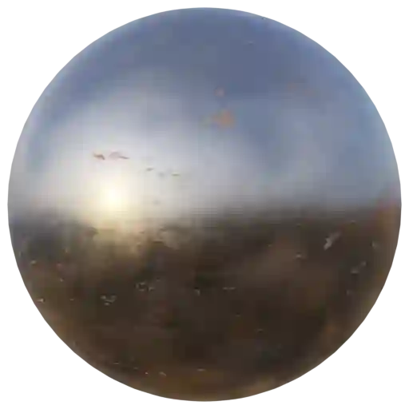

|

**This material is contained in the following Exapacks:**

    - XTRPbr_05k_Vol_001

    - XTRPbr_1k_Vol_001

    - XTRPbr_2k_Vol_003

    - XTRPbr_4k_Vol_005

------------------------------------------------------------------------------------------------------------------------

Battered Metal 02
*****************

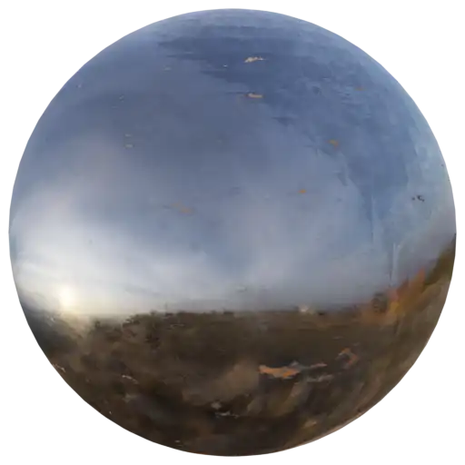

|

**This material is contained in the following Exapacks:**

    - XTRPbr_05k_Vol_001

    - XTRPbr_1k_Vol_001

    - XTRPbr_2k_Vol_003

    - XTRPbr_4k_Vol_005

------------------------------------------------------------------------------------------------------------------------

Bronze 01
*********

|

**This material is contained in the following Exapacks:**

    - XTRPbr_05k_Vol_001

    - XTRPbr_1k_Vol_001

    - XTRPbr_2k_Vol_003

    - XTRPbr_4k_Vol_005

------------------------------------------------------------------------------------------------------------------------

Bronze 02
*********

|

**This material is contained in the following Exapacks:**

    - XTRPbr_05k_Vol_001

    - XTRPbr_1k_Vol_001

    - XTRPbr_2k_Vol_003

    - XTRPbr_4k_Vol_005

------------------------------------------------------------------------------------------------------------------------

Bronze 03
*********

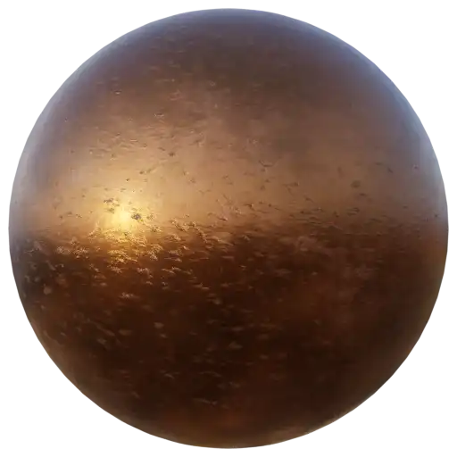

|

**This material is contained in the following Exapacks:**

    - XTRPbr_05k_Vol_001

    - XTRPbr_1k_Vol_001

    - XTRPbr_2k_Vol_003

    - XTRPbr_4k_Vol_005

------------------------------------------------------------------------------------------------------------------------

Bronze 04
*********

|

**This material is contained in the following Exapacks:**

    - XTRPbr_05k_Vol_001

    - XTRPbr_1k_Vol_001

    - XTRPbr_2k_Vol_003

    - XTRPbr_4k_Vol_005

------------------------------------------------------------------------------------------------------------------------

Brushed Gold 01
***************

.. image:: _static/_images/material_list/metal_raw/brushed_gold_01/brushed_gold_01.webp
    :width: 30%
    :align: center
    :alt: Brushed Gold 01

|

**This material is contained in the following Exapacks:**

    - XTRPbr_05k_Vol_001

    - XTRPbr_1k_Vol_001

    - XTRPbr_2k_Vol_003

    - XTRPbr_4k_Vol_005

------------------------------------------------------------------------------------------------------------------------

Brushed Gold 02
***************

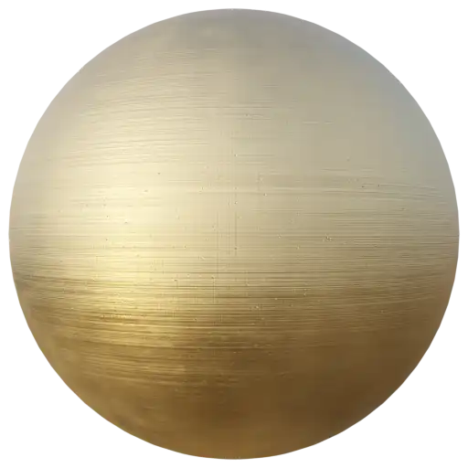

|

**This material is contained in the following Exapacks:**

    - XTRPbr_05k_Vol_001

    - XTRPbr_1k_Vol_001

    - XTRPbr_2k_Vol_003

    - XTRPbr_4k_Vol_005

------------------------------------------------------------------------------------------------------------------------

Brushed Iron 01
***************

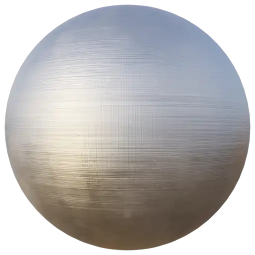

|

**This material is contained in the following Exapacks:**

    - XTRPbr_05k_Vol_001

    - XTRPbr_1k_Vol_001

    - XTRPbr_2k_Vol_003

    - XTRPbr_4k_Vol_005

------------------------------------------------------------------------------------------------------------------------

Brushed Iron 02
***************

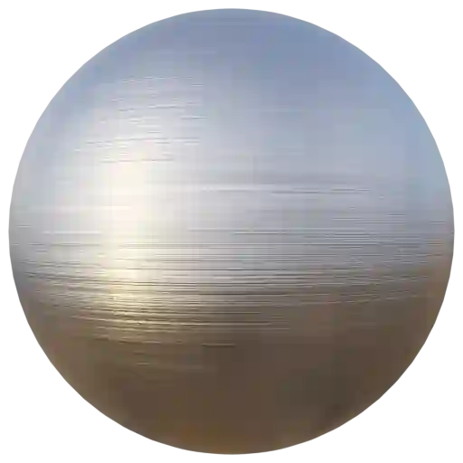

|

**This material is contained in the following Exapacks:**

    - XTRPbr_05k_Vol_001

    - XTRPbr_1k_Vol_001

    - XTRPbr_2k_Vol_003

    - XTRPbr_4k_Vol_005

------------------------------------------------------------------------------------------------------------------------

Brushed Iron 03
***************

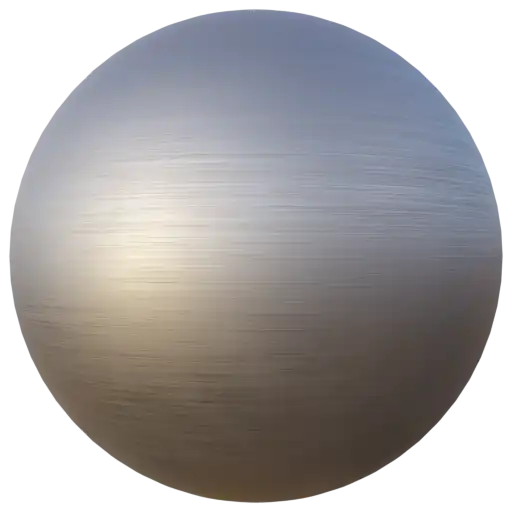

|

**This material is contained in the following Exapacks:**

    - XTRPbr_05k_Vol_001

    - XTRPbr_1k_Vol_001

    - XTRPbr_2k_Vol_003

    - XTRPbr_4k_Vol_005

    - XTRPbr_8k_Vol_007

------------------------------------------------------------------------------------------------------------------------

Brushed Iron 04
***************

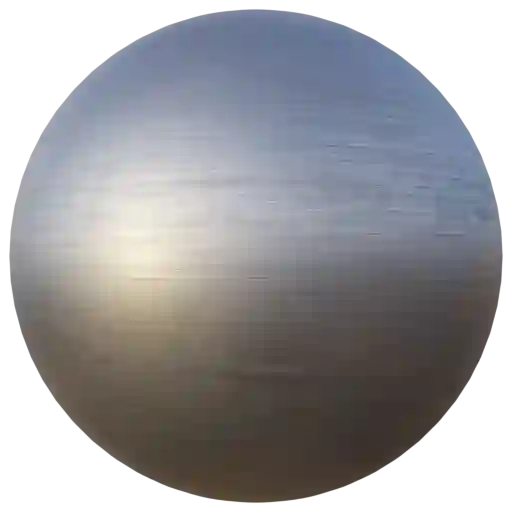

|

**This material is contained in the following Exapacks:**

    - XTRPbr_05k_Vol_001

    - XTRPbr_1k_Vol_001

    - XTRPbr_2k_Vol_003

    - XTRPbr_4k_Vol_005

    - XTRPbr_8k_Vol_007

------------------------------------------------------------------------------------------------------------------------

Burnished Metal 001
*******************

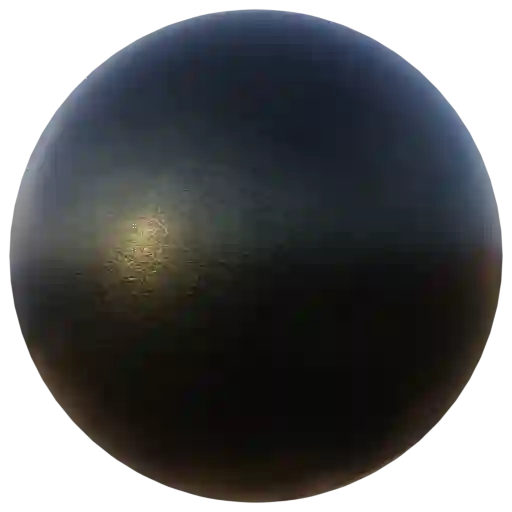

|

**This material is contained in the following Exapacks:**

    - XTRPbr_05k_Vol_001

    - XTRPbr_1k_Vol_001

    - XTRPbr_2k_Vol_003

    - XTRPbr_4k_Vol_005

    - XTRPbr_8k_Vol_007

------------------------------------------------------------------------------------------------------------------------

Burnished Metal 002
*******************

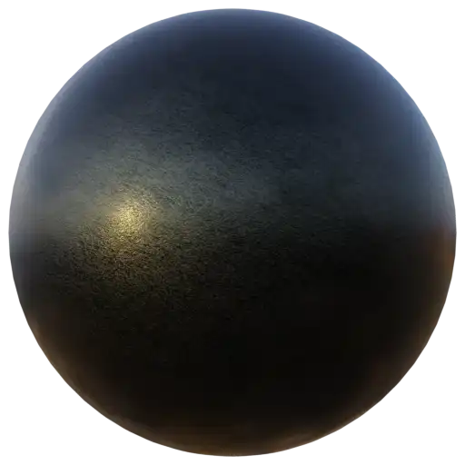

|

**This material is contained in the following Exapacks:**

    - XTRPbr_05k_Vol_001

    - XTRPbr_1k_Vol_001

    - XTRPbr_2k_Vol_003

    - XTRPbr_4k_Vol_005

    - XTRPbr_8k_Vol_007

------------------------------------------------------------------------------------------------------------------------

Burnished Metal 003
*******************

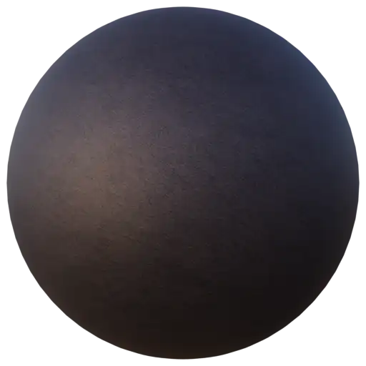

|

**This material is contained in the following Exapacks:**

    - XTRPbr_05k_Vol_001

    - XTRPbr_1k_Vol_001

    - XTRPbr_2k_Vol_003

    - XTRPbr_4k_Vol_005

    - XTRPbr_8k_Vol_007

------------------------------------------------------------------------------------------------------------------------

Burnished Metal 004
*******************

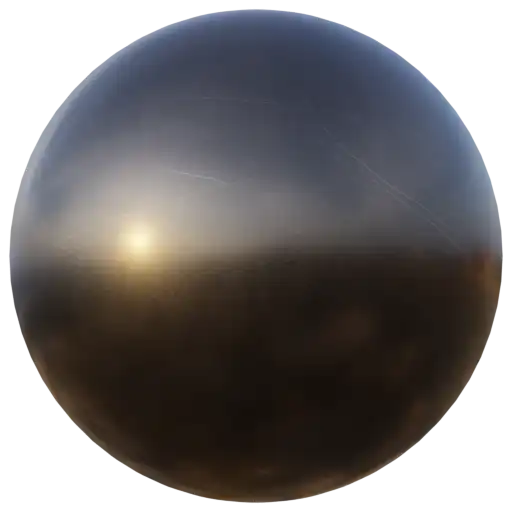

|

**This material is contained in the following Exapacks:**

    - XTRPbr_05k_Vol_001

    - XTRPbr_1k_Vol_001

    - XTRPbr_2k_Vol_003

    - XTRPbr_4k_Vol_005

    - XTRPbr_8k_Vol_007

------------------------------------------------------------------------------------------------------------------------

Burnished Metal 005
*******************

|

**This material is contained in the following Exapacks:**

    - XTRPbr_05k_Vol_001

    - XTRPbr_1k_Vol_001

    - XTRPbr_2k_Vol_003

    - XTRPbr_4k_Vol_005

    - XTRPbr_8k_Vol_007

------------------------------------------------------------------------------------------------------------------------

Burnished Metal 006
*******************

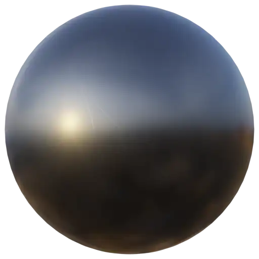

|

**This material is contained in the following Exapacks:**

    - XTRPbr_05k_Vol_001

    - XTRPbr_1k_Vol_001

    - XTRPbr_2k_Vol_003

    - XTRPbr_4k_Vol_005

    - XTRPbr_8k_Vol_007

------------------------------------------------------------------------------------------------------------------------

Burnished Metal 007
*******************

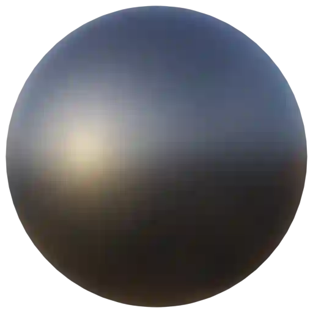

|

**This material is contained in the following Exapacks:**

    - XTRPbr_05k_Vol_001

    - XTRPbr_1k_Vol_001

    - XTRPbr_2k_Vol_003

    - XTRPbr_4k_Vol_005

    - XTRPbr_8k_Vol_007

------------------------------------------------------------------------------------------------------------------------

Copper 01
*********

.. image:: _static/_images/material_list/metal_raw/copper_01/copper_01.webp
    :width: 30%
    :align: center
    :alt: Copper 01

|

**This material is contained in the following Exapacks:**

    - XTRPbr_05k_Vol_001

    - XTRPbr_1k_Vol_001

    - XTRPbr_2k_Vol_003

    - XTRPbr_4k_Vol_005

    - XTRPbr_8k_Vol_007

------------------------------------------------------------------------------------------------------------------------

Galvanized Steel 001
********************

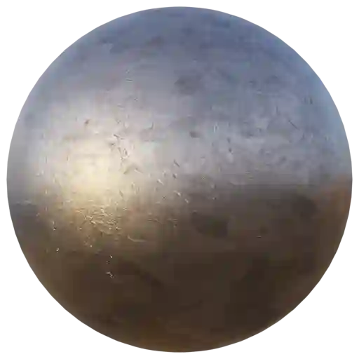

|

**This material is contained in the following Exapacks:**

    - XTRPbr_05k_Vol_001

    - XTRPbr_1k_Vol_001

    - XTRPbr_2k_Vol_003

    - XTRPbr_4k_Vol_005

------------------------------------------------------------------------------------------------------------------------

Galvanized Steel 002
********************

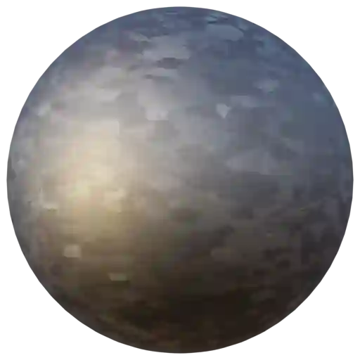

|

**This material is contained in the following Exapacks:**

    - XTRPbr_05k_Vol_001

    - XTRPbr_1k_Vol_001

    - XTRPbr_2k_Vol_003

    - XTRPbr_4k_Vol_005

    - XTRPbr_8k_Vol_007

------------------------------------------------------------------------------------------------------------------------

Galvanized Steel 003
********************

|

**This material is contained in the following Exapacks:**

    - XTRPbr_05k_Vol_001

    - XTRPbr_1k_Vol_001

    - XTRPbr_2k_Vol_003

    - XTRPbr_4k_Vol_005

------------------------------------------------------------------------------------------------------------------------

Gold Dirty 01
*************

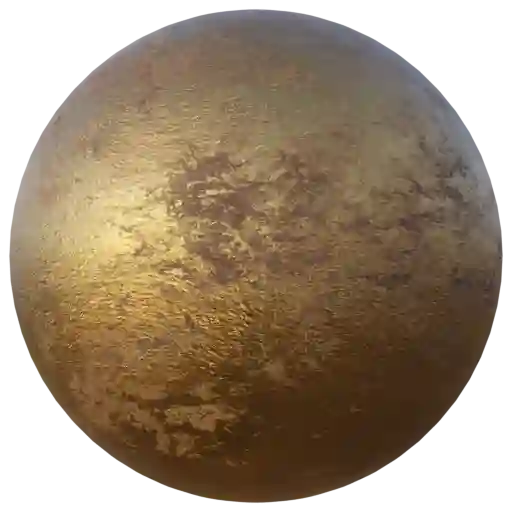

|

**This material is contained in the following Exapacks:**

    - XTRPbr_05k_Vol_001

    - XTRPbr_1k_Vol_001

    - XTRPbr_2k_Vol_003

    - XTRPbr_4k_Vol_005

------------------------------------------------------------------------------------------------------------------------

Golden Metal 001
****************

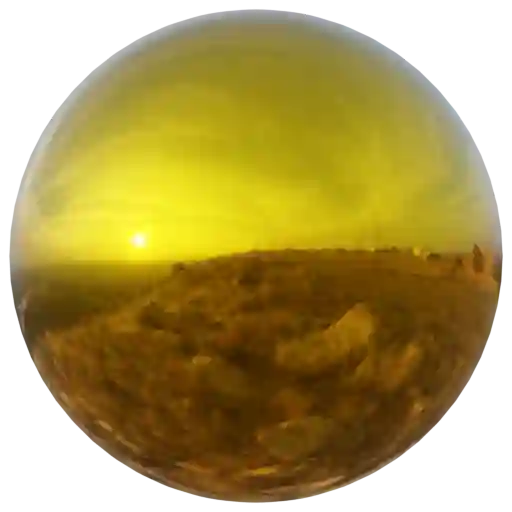

|

**This material is contained in the following Exapacks:**

    - XTRPbr_05k_Vol_001

    - XTRPbr_1k_Vol_001

    - XTRPbr_2k_Vol_003

    - XTRPbr_4k_Vol_005

    - XTRPbr_8k_Vol_007

------------------------------------------------------------------------------------------------------------------------

Golden Metal 002
****************

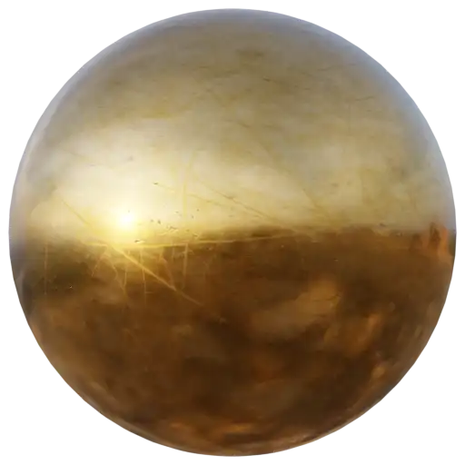

|

**This material is contained in the following Exapacks:**

    - XTRPbr_05k_Vol_001

    - XTRPbr_1k_Vol_001

    - XTRPbr_2k_Vol_003

    - XTRPbr_4k_Vol_005

------------------------------------------------------------------------------------------------------------------------

Golden Metal 003
****************

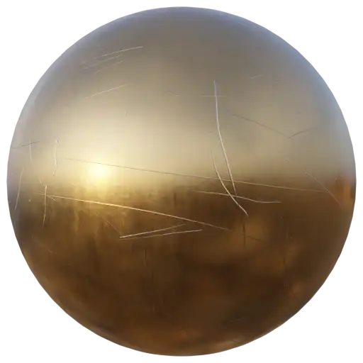

|

**This material is contained in the following Exapacks:**

    - XTRPbr_05k_Vol_001

    - XTRPbr_1k_Vol_001

    - XTRPbr_2k_Vol_003

    - XTRPbr_4k_Vol_005

------------------------------------------------------------------------------------------------------------------------

Grunge Metal 001
****************

.. image:: _static/_images/material_list/metal_raw/grunge_metal_001/grunge_metal_001.webp
    :width: 30%
    :align: center
    :alt: Grunge Metal 001

|

**This material is contained in the following Exapacks:**

    - XTRPbr_05k_Vol_001

    - XTRPbr_1k_Vol_001

    - XTRPbr_2k_Vol_003

    - XTRPbr_4k_Vol_005

------------------------------------------------------------------------------------------------------------------------

Grunge Metal 002
****************

|

**This material is contained in the following Exapacks:**

    - XTRPbr_05k_Vol_001

    - XTRPbr_1k_Vol_001

    - XTRPbr_2k_Vol_003

    - XTRPbr_4k_Vol_005

    - XTRPbr_8k_Vol_007

------------------------------------------------------------------------------------------------------------------------

Grunge Metal 003
****************

|

**This material is contained in the following Exapacks:**

    - XTRPbr_05k_Vol_001

    - XTRPbr_1k_Vol_001

    - XTRPbr_2k_Vol_003

    - XTRPbr_4k_Vol_005

    - XTRPbr_8k_Vol_007

------------------------------------------------------------------------------------------------------------------------

Grunge Metal 004
****************

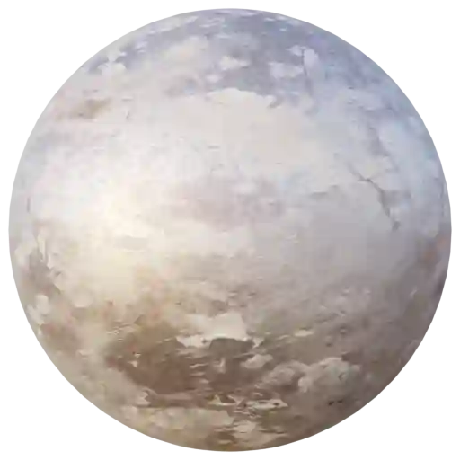

|

**This material is contained in the following Exapacks:**

    - XTRPbr_05k_Vol_001

    - XTRPbr_1k_Vol_001

    - XTRPbr_2k_Vol_003

    - XTRPbr_4k_Vol_005

    - XTRPbr_8k_Vol_007

------------------------------------------------------------------------------------------------------------------------

Grunge Metal 005
****************

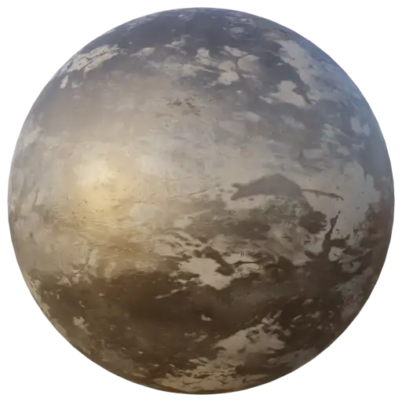

|

**This material is contained in the following Exapacks:**

    - XTRPbr_05k_Vol_001

    - XTRPbr_1k_Vol_001

    - XTRPbr_2k_Vol_003

    - XTRPbr_4k_Vol_005

    - XTRPbr_8k_Vol_007

------------------------------------------------------------------------------------------------------------------------

Grunge Metal 006
****************

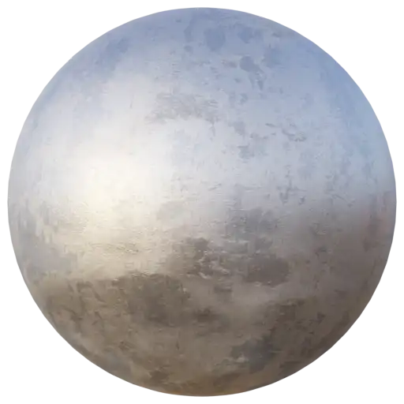

|

**This material is contained in the following Exapacks:**

    - XTRPbr_05k_Vol_001

    - XTRPbr_1k_Vol_001

    - XTRPbr_2k_Vol_003

    - XTRPbr_4k_Vol_005

    - XTRPbr_8k_Vol_007

------------------------------------------------------------------------------------------------------------------------

Metal 001
*********

.. image:: _static/_images/material_list/metal_raw/metal_001/metal_001.webp
    :width: 30%
    :align: center
    :alt: Metal 001

|

**This material is contained in the following Exapacks:**

    - XTRPbr_05k_Vol_001

    - XTRPbr_1k_Vol_001

    - XTRPbr_2k_Vol_003

    - XTRPbr_4k_Vol_005

------------------------------------------------------------------------------------------------------------------------

Metal 002
*********

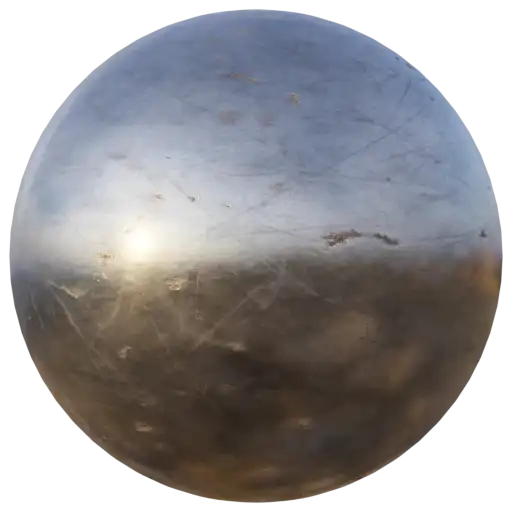

|

**This material is contained in the following Exapacks:**

    - XTRPbr_05k_Vol_001

    - XTRPbr_1k_Vol_001

    - XTRPbr_2k_Vol_003

    - XTRPbr_4k_Vol_005

------------------------------------------------------------------------------------------------------------------------

Metal 003
*********

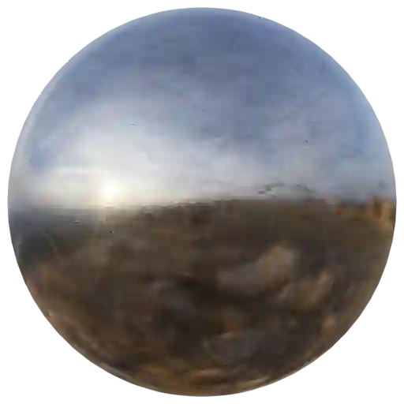

|

**This material is contained in the following Exapacks:**

    - XTRPbr_05k_Vol_001

    - XTRPbr_1k_Vol_001

    - XTRPbr_2k_Vol_003

    - XTRPbr_4k_Vol_005

------------------------------------------------------------------------------------------------------------------------

Metal 004
*********

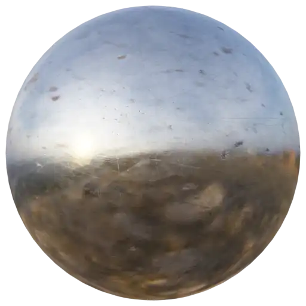

|

**This material is contained in the following Exapacks:**

    - XTRPbr_05k_Vol_001

    - XTRPbr_1k_Vol_001

    - XTRPbr_2k_Vol_003

    - XTRPbr_4k_Vol_005

------------------------------------------------------------------------------------------------------------------------

Metal 005
*********

|

**This material is contained in the following Exapacks:**

    - XTRPbr_05k_Vol_001

    - XTRPbr_1k_Vol_001

    - XTRPbr_2k_Vol_003

    - XTRPbr_4k_Vol_005

    - XTRPbr_8k_Vol_007

------------------------------------------------------------------------------------------------------------------------

Metal 006
*********

|

**This material is contained in the following Exapacks:**

    - XTRPbr_05k_Vol_001

    - XTRPbr_1k_Vol_001

    - XTRPbr_2k_Vol_003

    - XTRPbr_4k_Vol_005

    - XTRPbr_8k_Vol_007

------------------------------------------------------------------------------------------------------------------------

Metal 007
*********

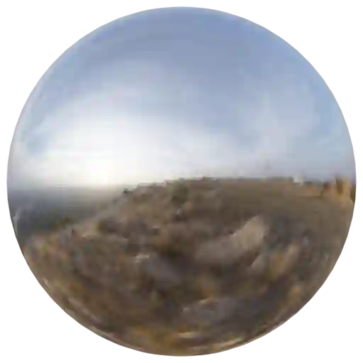

|

**This material is contained in the following Exapacks:**

    - XTRPbr_05k_Vol_001

    - XTRPbr_1k_Vol_001

    - XTRPbr_2k_Vol_003

    - XTRPbr_4k_Vol_005

    - XTRPbr_8k_Vol_007

------------------------------------------------------------------------------------------------------------------------

Old Iron 01
***********

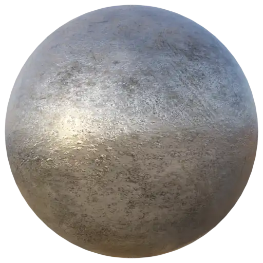

|

**This material is contained in the following Exapacks:**

    - XTRPbr_05k_Vol_001

    - XTRPbr_1k_Vol_001

    - XTRPbr_2k_Vol_003

    - XTRPbr_4k_Vol_005

------------------------------------------------------------------------------------------------------------------------

Silver 01
*********

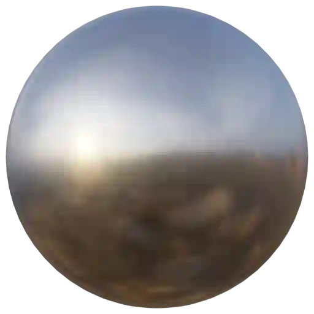

|

**This material is contained in the following Exapacks:**

    - XTRPbr_05k_Vol_001

    - XTRPbr_1k_Vol_001

    - XTRPbr_2k_Vol_003

    - XTRPbr_4k_Vol_005

------------------------------------------------------------------------------------------------------------------------

Metal - Rusty (Category)
------------------------

Metal Rusty 001
***************

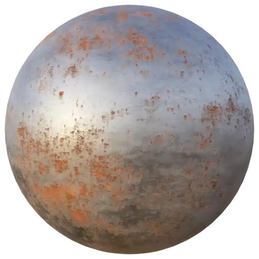

|

**This material is contained in the following Exapacks:**

    - XTRPbr_05k_Vol_001

    - XTRPbr_1k_Vol_001

    - XTRPbr_2k_Vol_003

    - XTRPbr_4k_Vol_005

    - XTRPbr_8k_Vol_007

------------------------------------------------------------------------------------------------------------------------

Metal Rusty 002
***************

.. image:: _static/_images/material_list/metal_rusty/metal_rusty_002/metal_rusty_002.webp
    :width: 30%
    :align: center
    :alt: Metal Rusty 002

|

**This material is contained in the following Exapacks:**

    - XTRPbr_05k_Vol_001

    - XTRPbr_1k_Vol_001

    - XTRPbr_2k_Vol_003

    - XTRPbr_4k_Vol_005

    - XTRPbr_8k_Vol_007

------------------------------------------------------------------------------------------------------------------------

Metal Rusty 003
***************

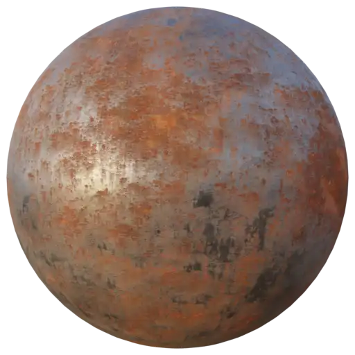

|

**This material is contained in the following Exapacks:**

    - XTRPbr_05k_Vol_001

    - XTRPbr_1k_Vol_001

    - XTRPbr_2k_Vol_003

    - XTRPbr_4k_Vol_005

    - XTRPbr_8k_Vol_007

------------------------------------------------------------------------------------------------------------------------

Metal Rusty 004
***************

|

**This material is contained in the following Exapacks:**

    - XTRPbr_05k_Vol_001

    - XTRPbr_1k_Vol_001

    - XTRPbr_2k_Vol_003

    - XTRPbr_4k_Vol_005

    - XTRPbr_8k_Vol_007

    - XTRPbr_8k_Vol_015

------------------------------------------------------------------------------------------------------------------------

Metal Rusty 005
***************

.. image:: _static/_images/material_list/metal_rusty/metal_rusty_005/metal_rusty_005.webp
    :width: 30%
    :align: center
    :alt: Metal Rusty 005

|

**This material is contained in the following Exapacks:**

    - XTRPbr_05k_Vol_001

    - XTRPbr_1k_Vol_001

    - XTRPbr_2k_Vol_003

    - XTRPbr_4k_Vol_005

    - XTRPbr_8k_Vol_015

------------------------------------------------------------------------------------------------------------------------

Metal Rusty 006
***************

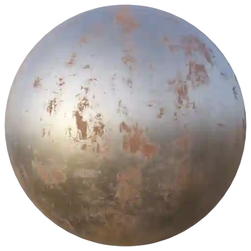

|

**This material is contained in the following Exapacks:**

    - XTRPbr_05k_Vol_001

    - XTRPbr_1k_Vol_001

    - XTRPbr_2k_Vol_003

    - XTRPbr_4k_Vol_005

------------------------------------------------------------------------------------------------------------------------

Metal Rusty 007
***************

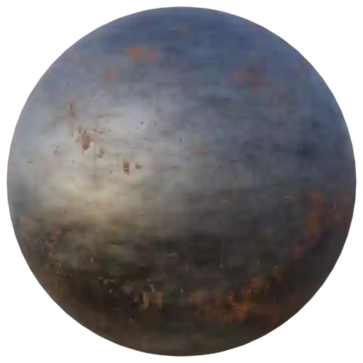

|

**This material is contained in the following Exapacks:**

    - XTRPbr_05k_Vol_001

    - XTRPbr_1k_Vol_001

    - XTRPbr_2k_Vol_003

    - XTRPbr_4k_Vol_005

    - XTRPbr_8k_Vol_015

------------------------------------------------------------------------------------------------------------------------

Metal Rusty 008
***************

.. image:: _static/_images/material_list/metal_rusty/metal_rusty_008/metal_rusty_008.webp
    :width: 30%
    :align: center
    :alt: Metal Rusty 008

|

**This material is contained in the following Exapacks:**

    - XTRPbr_05k_Vol_001

    - XTRPbr_1k_Vol_001

    - XTRPbr_2k_Vol_003

    - XTRPbr_4k_Vol_005

    - XTRPbr_8k_Vol_015

------------------------------------------------------------------------------------------------------------------------

Metal Rusty 009
***************

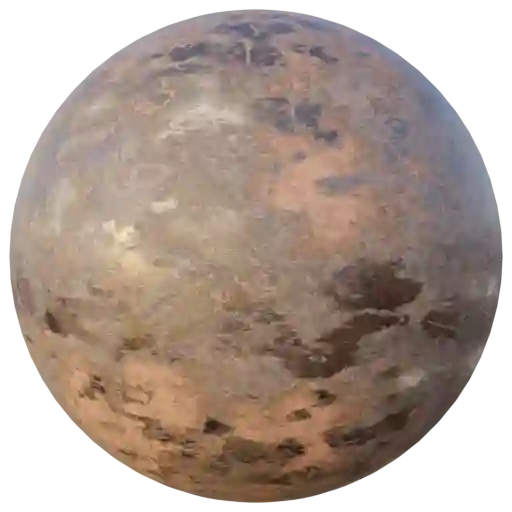

|

**This material is contained in the following Exapacks:**

    - XTRPbr_05k_Vol_001

    - XTRPbr_1k_Vol_001

    - XTRPbr_2k_Vol_003

    - XTRPbr_4k_Vol_005

    - XTRPbr_8k_Vol_015

------------------------------------------------------------------------------------------------------------------------

Rust 001
********

|

**This material is contained in the following Exapacks:**

    - XTRPbr_05k_Vol_001

    - XTRPbr_1k_Vol_001

    - XTRPbr_2k_Vol_003

    - XTRPbr_4k_Vol_005

    - XTRPbr_8k_Vol_015

------------------------------------------------------------------------------------------------------------------------

Rust 002
********

|

**This material is contained in the following Exapacks:**

    - XTRPbr_05k_Vol_001

    - XTRPbr_1k_Vol_001

    - XTRPbr_2k_Vol_003

    - XTRPbr_4k_Vol_005

    - XTRPbr_8k_Vol_015

------------------------------------------------------------------------------------------------------------------------

Rust 003
********

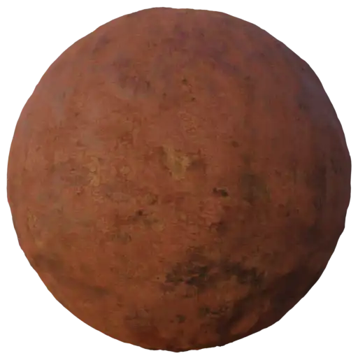

|

**This material is contained in the following Exapacks:**

    - XTRPbr_05k_Vol_001

    - XTRPbr_1k_Vol_001

    - XTRPbr_2k_Vol_003

    - XTRPbr_4k_Vol_005

    - XTRPbr_8k_Vol_015

------------------------------------------------------------------------------------------------------------------------

Rust 004
********

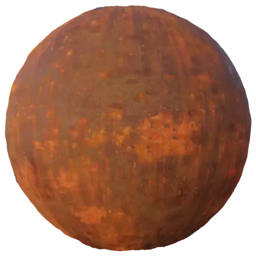

|

**This material is contained in the following Exapacks:**

    - XTRPbr_05k_Vol_001

    - XTRPbr_1k_Vol_001

    - XTRPbr_2k_Vol_003

    - XTRPbr_4k_Vol_005

    - XTRPbr_8k_Vol_015

------------------------------------------------------------------------------------------------------------------------

Rust 005
********

|

**This material is contained in the following Exapacks:**

    - XTRPbr_05k_Vol_001

    - XTRPbr_1k_Vol_001

    - XTRPbr_2k_Vol_003

    - XTRPbr_4k_Vol_005

    - XTRPbr_8k_Vol_015

------------------------------------------------------------------------------------------------------------------------

Shutter Rusty 01
****************

.. image:: _static/_images/material_list/metal_rusty/shutter_rusty_01/shutter_rusty_01.webp
    :width: 30%
    :align: center
    :alt: Shutter Rusty 01

|

**This material is contained in the following Exapacks:**

    - XTRPbr_05k_Vol_001

    - XTRPbr_1k_Vol_001

    - XTRPbr_2k_Vol_003

    - XTRPbr_4k_Vol_005

    - XTRPbr_8k_Vol_015

------------------------------------------------------------------------------------------------------------------------

Metal - Tiles (Category)
------------------------

Black Metal Tiles 001
*********************

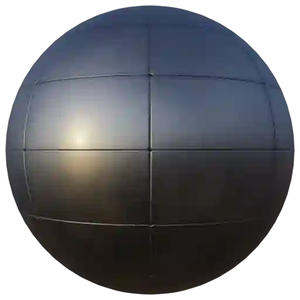

|

**This material is contained in the following Exapacks:**

    - XTRPbr_05k_Vol_001

    - XTRPbr_1k_Vol_001

    - XTRPbr_2k_Vol_003

    - XTRPbr_4k_Vol_005

    - XTRPbr_8k_Vol_015

------------------------------------------------------------------------------------------------------------------------

Black Metal Tiles 002
*********************

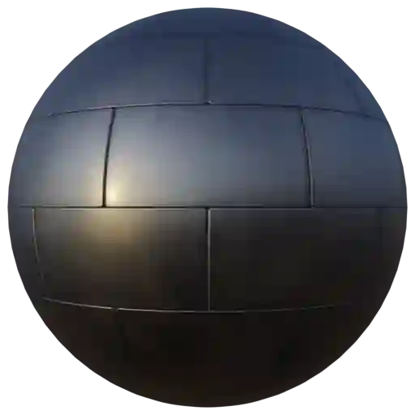

|

**This material is contained in the following Exapacks:**

    - XTRPbr_05k_Vol_001

    - XTRPbr_1k_Vol_001

    - XTRPbr_2k_Vol_003

    - XTRPbr_4k_Vol_005

    - XTRPbr_8k_Vol_015

------------------------------------------------------------------------------------------------------------------------

Black Metal Tiles 003
*********************

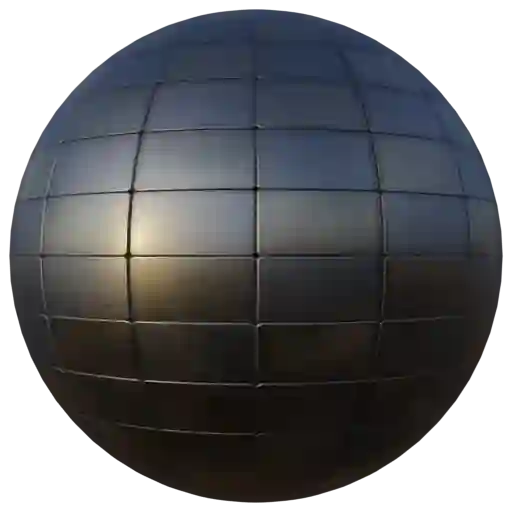

|

**This material is contained in the following Exapacks:**

    - XTRPbr_05k_Vol_001

    - XTRPbr_1k_Vol_001

    - XTRPbr_2k_Vol_003

    - XTRPbr_4k_Vol_005

    - XTRPbr_8k_Vol_015

------------------------------------------------------------------------------------------------------------------------

Black Metal Tiles 004
*********************

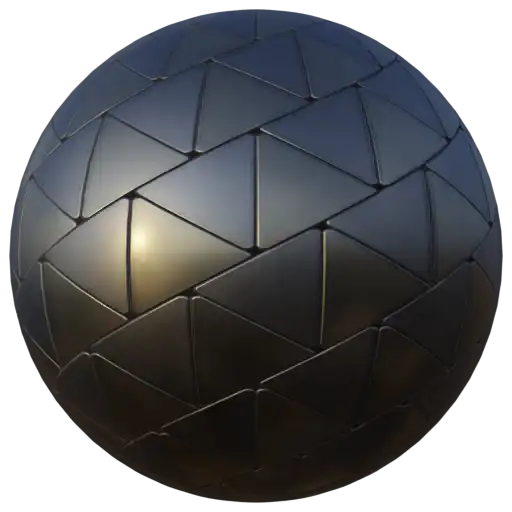

|

**This material is contained in the following Exapacks:**

    - XTRPbr_05k_Vol_001

    - XTRPbr_1k_Vol_001

    - XTRPbr_2k_Vol_003

    - XTRPbr_4k_Vol_005

    - XTRPbr_8k_Vol_015

------------------------------------------------------------------------------------------------------------------------

Brushed Metal Tiles 01
**********************

.. image:: _static/_images/material_list/metal_tiles/brushed_metal_tiles_01/brushed_metal_tiles_01.webp
    :width: 30%
    :align: center
    :alt: Brushed Metal Tiles 01

|

**This material is contained in the following Exapacks:**

    - XTRPbr_05k_Vol_001

    - XTRPbr_1k_Vol_001

    - XTRPbr_2k_Vol_003

    - XTRPbr_4k_Vol_005

------------------------------------------------------------------------------------------------------------------------

Brushed Metal Tiles 02
**********************

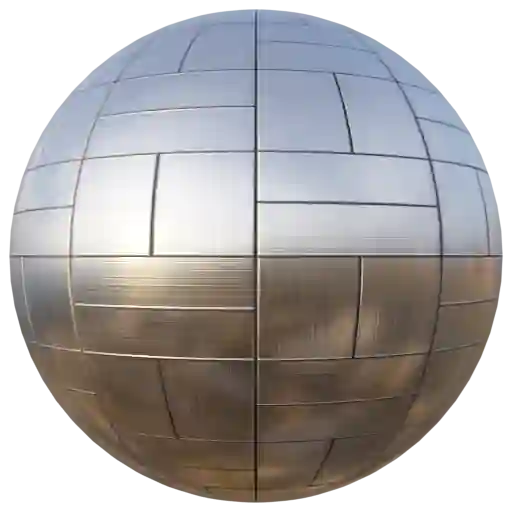

|

**This material is contained in the following Exapacks:**

    - XTRPbr_05k_Vol_001

    - XTRPbr_1k_Vol_001

    - XTRPbr_2k_Vol_003

    - XTRPbr_4k_Vol_005

------------------------------------------------------------------------------------------------------------------------

Brushed Metal Tiles 03
**********************

.. image:: _static/_images/material_list/metal_tiles/brushed_metal_tiles_03/brushed_metal_tiles_03.webp
    :width: 30%
    :align: center
    :alt: Brushed Metal Tiles 03

|

**This material is contained in the following Exapacks:**

    - XTRPbr_05k_Vol_001

    - XTRPbr_1k_Vol_001

    - XTRPbr_2k_Vol_003

    - XTRPbr_4k_Vol_005

------------------------------------------------------------------------------------------------------------------------

Chopper Tiles 001
*****************

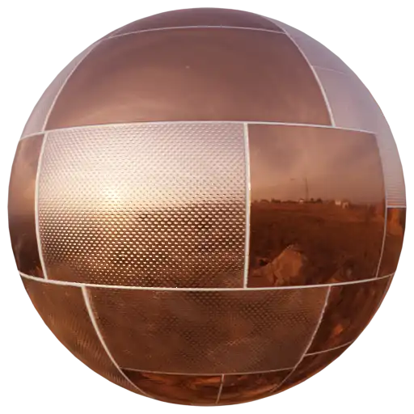

|

**This material is contained in the following Exapacks:**

    - XTRPbr_05k_Vol_001

    - XTRPbr_1k_Vol_001

    - XTRPbr_2k_Vol_003

    - XTRPbr_4k_Vol_005

------------------------------------------------------------------------------------------------------------------------

Faux Leather Tiles 01
*********************

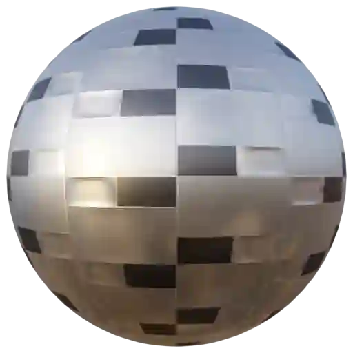

|

**This material is contained in the following Exapacks:**

    - XTRPbr_05k_Vol_001

    - XTRPbr_1k_Vol_001

    - XTRPbr_2k_Vol_003

    - XTRPbr_4k_Vol_005

------------------------------------------------------------------------------------------------------------------------

Golden Faux Leather Tiles 01
****************************

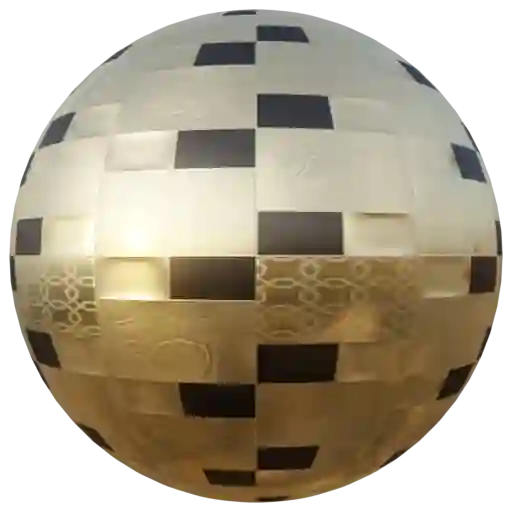

|

**This material is contained in the following Exapacks:**

    - XTRPbr_05k_Vol_001

    - XTRPbr_1k_Vol_001

    - XTRPbr_2k_Vol_003

    - XTRPbr_4k_Vol_005

------------------------------------------------------------------------------------------------------------------------

Golden Metal Tiles 001
**********************

|

**This material is contained in the following Exapacks:**

    - XTRPbr_05k_Vol_001

    - XTRPbr_1k_Vol_001

    - XTRPbr_2k_Vol_003

    - XTRPbr_4k_Vol_005

------------------------------------------------------------------------------------------------------------------------

Golden Metal Tiles 002
**********************

|

**This material is contained in the following Exapacks:**

    - XTRPbr_05k_Vol_001

    - XTRPbr_1k_Vol_001

    - XTRPbr_2k_Vol_003

    - XTRPbr_4k_Vol_005

------------------------------------------------------------------------------------------------------------------------

Golden Metal Tiles 003
**********************

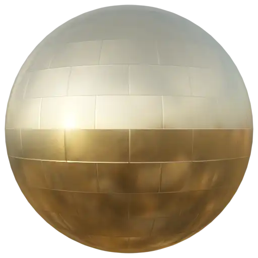

|

**This material is contained in the following Exapacks:**

    - XTRPbr_05k_Vol_001

    - XTRPbr_1k_Vol_001

    - XTRPbr_2k_Vol_003

    - XTRPbr_4k_Vol_005

------------------------------------------------------------------------------------------------------------------------

Metal Tiles 001
***************

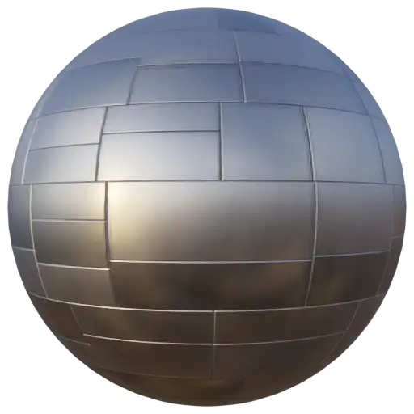

|

**This material is contained in the following Exapacks:**

    - XTRPbr_05k_Vol_001

    - XTRPbr_1k_Vol_001

    - XTRPbr_2k_Vol_003

    - XTRPbr_4k_Vol_005

    - XTRPbr_8k_Vol_015

------------------------------------------------------------------------------------------------------------------------

Metal Tiles 002
***************

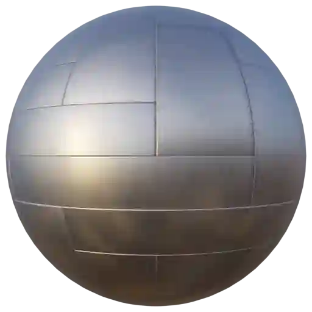

|

**This material is contained in the following Exapacks:**

    - XTRPbr_05k_Vol_001

    - XTRPbr_1k_Vol_001

    - XTRPbr_2k_Vol_003

    - XTRPbr_4k_Vol_005

    - XTRPbr_8k_Vol_015

------------------------------------------------------------------------------------------------------------------------

Metal Tiles 003
***************

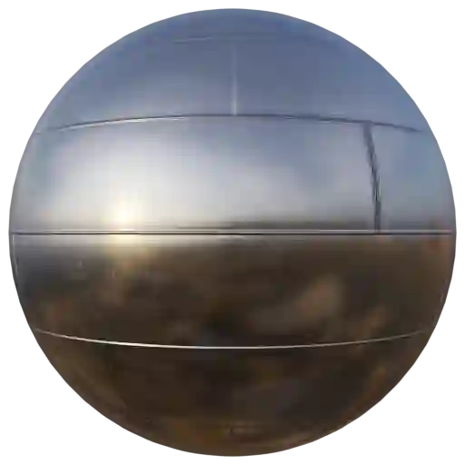

|

**This material is contained in the following Exapacks:**

    - XTRPbr_05k_Vol_001

    - XTRPbr_1k_Vol_001

    - XTRPbr_2k_Vol_003

    - XTRPbr_4k_Vol_005

------------------------------------------------------------------------------------------------------------------------

Metal Tiles 004
***************

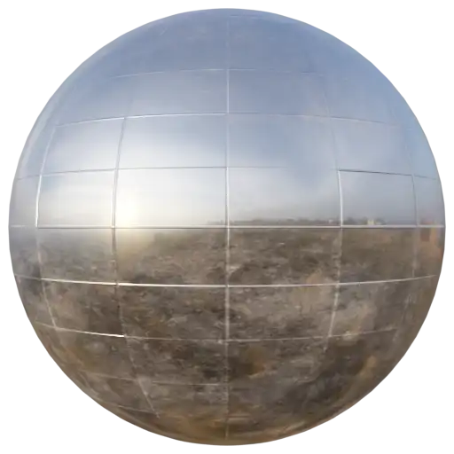

|

**This material is contained in the following Exapacks:**

    - XTRPbr_05k_Vol_001

    - XTRPbr_1k_Vol_001

    - XTRPbr_2k_Vol_003

    - XTRPbr_4k_Vol_005

------------------------------------------------------------------------------------------------------------------------

Thin Stainless Steel Tiles 01
*****************************

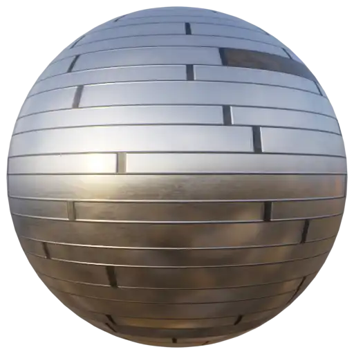

|

**This material is contained in the following Exapacks:**

    - XTRPbr_05k_Vol_001

    - XTRPbr_1k_Vol_001

    - XTRPbr_2k_Vol_003

    - XTRPbr_4k_Vol_005

------------------------------------------------------------------------------------------------------------------------

Metal - Worn Paint (Category)
-----------------------------

Blue Paint Metal 001
********************

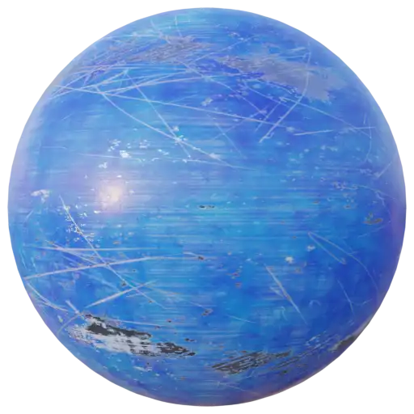

|

**This material is contained in the following Exapacks:**

    - XTRPbr_05k_Vol_001

    - XTRPbr_1k_Vol_001

    - XTRPbr_2k_Vol_003

    - XTRPbr_4k_Vol_005

------------------------------------------------------------------------------------------------------------------------

Blue Paint Metal 002
********************

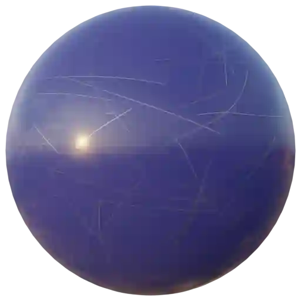

|

**This material is contained in the following Exapacks:**

    - XTRPbr_05k_Vol_001

    - XTRPbr_1k_Vol_001

    - XTRPbr_2k_Vol_003

    - XTRPbr_4k_Vol_005

------------------------------------------------------------------------------------------------------------------------

Blue Paint Metal 003
********************

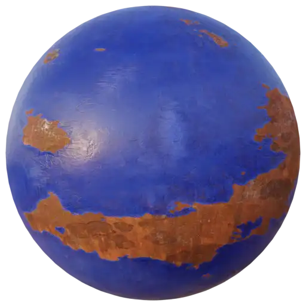

|

**This material is contained in the following Exapacks:**

    - XTRPbr_05k_Vol_001

    - XTRPbr_1k_Vol_001

    - XTRPbr_2k_Vol_003

    - XTRPbr_4k_Vol_005

    - XTRPbr_8k_Vol_015

------------------------------------------------------------------------------------------------------------------------

Blue Paint Metal 004
********************

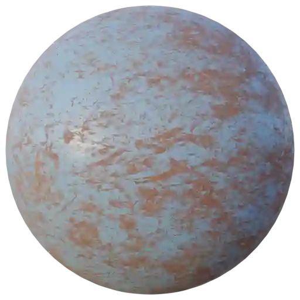

|

**This material is contained in the following Exapacks:**

    - XTRPbr_05k_Vol_001

    - XTRPbr_1k_Vol_001

    - XTRPbr_2k_Vol_003

    - XTRPbr_4k_Vol_005

------------------------------------------------------------------------------------------------------------------------

Blue Paint Metal 005
********************

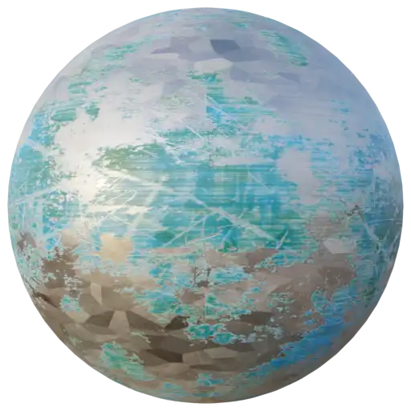

|

**This material is contained in the following Exapacks:**

    - XTRPbr_05k_Vol_001

    - XTRPbr_1k_Vol_001

    - XTRPbr_2k_Vol_003

    - XTRPbr_4k_Vol_005

------------------------------------------------------------------------------------------------------------------------

Green Paint Metal 001
*********************

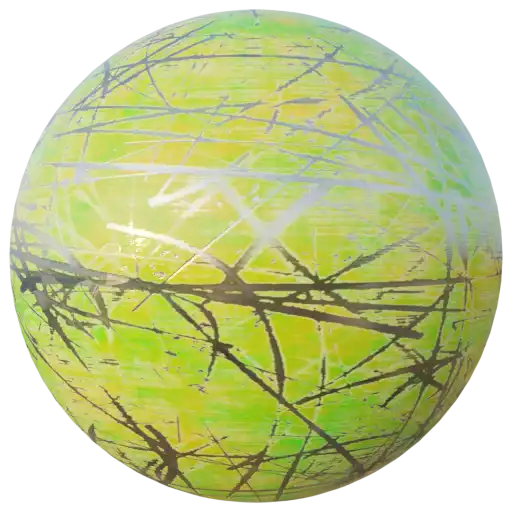

|

**This material is contained in the following Exapacks:**

    - XTRPbr_05k_Vol_001

    - XTRPbr_1k_Vol_001

    - XTRPbr_2k_Vol_003

    - XTRPbr_4k_Vol_005

------------------------------------------------------------------------------------------------------------------------

Green Paint Metal 002
*********************

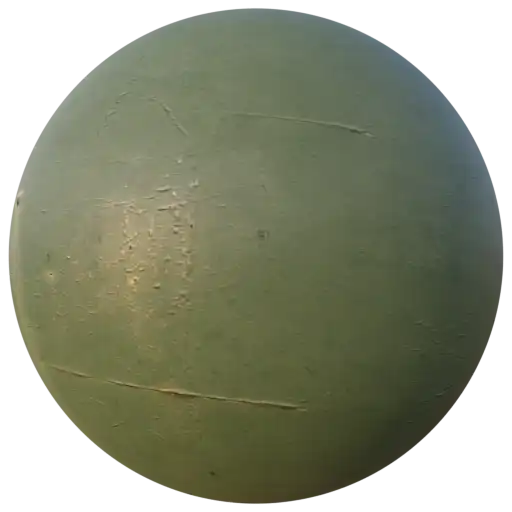

|

**This material is contained in the following Exapacks:**

    - XTRPbr_05k_Vol_001

    - XTRPbr_1k_Vol_001

    - XTRPbr_2k_Vol_003

    - XTRPbr_4k_Vol_005

    - XTRPbr_8k_Vol_015

------------------------------------------------------------------------------------------------------------------------

Green Paint Metal 003
*********************

|

**This material is contained in the following Exapacks:**

    - XTRPbr_05k_Vol_001

    - XTRPbr_1k_Vol_001

    - XTRPbr_2k_Vol_003

    - XTRPbr_4k_Vol_005

    - XTRPbr_8k_Vol_015

------------------------------------------------------------------------------------------------------------------------

Green Paint Metal 004
*********************

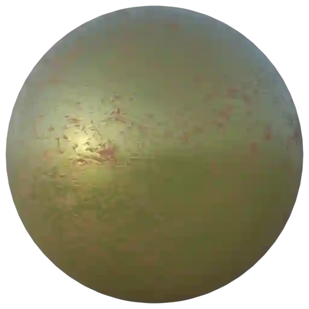

|

**This material is contained in the following Exapacks:**

    - XTRPbr_05k_Vol_001

    - XTRPbr_1k_Vol_001

    - XTRPbr_2k_Vol_003

    - XTRPbr_4k_Vol_005

------------------------------------------------------------------------------------------------------------------------

Green Paint Metal 005
*********************

.. image:: _static/_images/material_list/metal_worn_paint/green_paint_metal_005/green_paint_metal_005.webp
    :width: 30%
    :align: center
    :alt: Green Paint Metal 005

|

**This material is contained in the following Exapacks:**

    - XTRPbr_05k_Vol_001

    - XTRPbr_1k_Vol_001

    - XTRPbr_2k_Vol_003

    - XTRPbr_4k_Vol_005

------------------------------------------------------------------------------------------------------------------------

Green Paint Metal 006
*********************

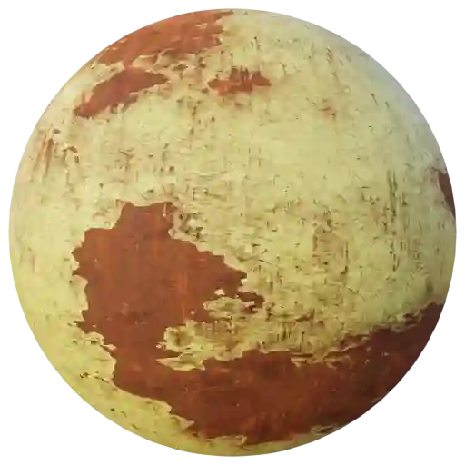

|

**This material is contained in the following Exapacks:**

    - XTRPbr_05k_Vol_001

    - XTRPbr_1k_Vol_001

    - XTRPbr_2k_Vol_003

    - XTRPbr_4k_Vol_005

    - XTRPbr_8k_Vol_015

------------------------------------------------------------------------------------------------------------------------

Grey Paint Metal 001
********************

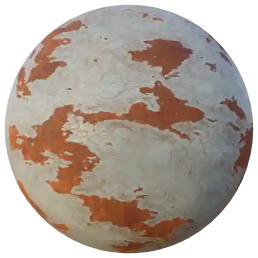

|

**This material is contained in the following Exapacks:**

    - XTRPbr_05k_Vol_001

    - XTRPbr_1k_Vol_001

    - XTRPbr_2k_Vol_003

    - XTRPbr_4k_Vol_005

    - XTRPbr_8k_Vol_015

------------------------------------------------------------------------------------------------------------------------

Grey Paint Metal 002
********************

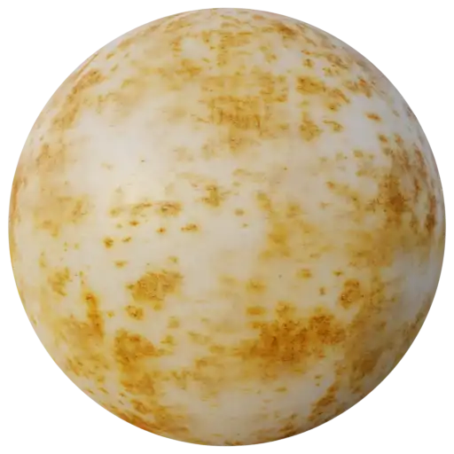

|

**This material is contained in the following Exapacks:**

    - XTRPbr_05k_Vol_001

    - XTRPbr_1k_Vol_001

    - XTRPbr_2k_Vol_003

    - XTRPbr_4k_Vol_005

    - XTRPbr_8k_Vol_015

------------------------------------------------------------------------------------------------------------------------

Orange Paint Metal 001
**********************

|

**This material is contained in the following Exapacks:**

    - XTRPbr_05k_Vol_001

    - XTRPbr_1k_Vol_001

    - XTRPbr_2k_Vol_003

    - XTRPbr_4k_Vol_005

    - XTRPbr_8k_Vol_015

------------------------------------------------------------------------------------------------------------------------

Red Paint Metal 001
*******************

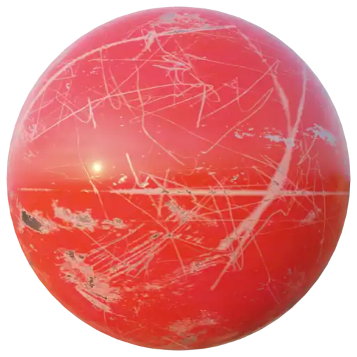

|

**This material is contained in the following Exapacks:**

    - XTRPbr_05k_Vol_001

    - XTRPbr_1k_Vol_001

    - XTRPbr_2k_Vol_003

    - XTRPbr_4k_Vol_005

------------------------------------------------------------------------------------------------------------------------

Sign Paint Metal 002
********************

.. image:: _static/_images/material_list/metal_worn_paint/sign_paint_metal_002/sign_paint_metal_002.webp
    :width: 30%
    :align: center
    :alt: Sign Paint Metal 002

|

**This material is contained in the following Exapacks:**

    - XTRPbr_05k_Vol_001

    - XTRPbr_1k_Vol_001

    - XTRPbr_2k_Vol_003

    - XTRPbr_4k_Vol_005

    - XTRPbr_8k_Vol_015

------------------------------------------------------------------------------------------------------------------------

Sign Paint Metal 003
********************

.. image:: _static/_images/material_list/metal_worn_paint/sign_paint_metal_003/sign_paint_metal_003.webp
    :width: 30%
    :align: center
    :alt: Sign Paint Metal 003

|

**This material is contained in the following Exapacks:**

    - XTRPbr_05k_Vol_001

    - XTRPbr_1k_Vol_001

    - XTRPbr_2k_Vol_003

    - XTRPbr_4k_Vol_005

    - XTRPbr_8k_Vol_015

------------------------------------------------------------------------------------------------------------------------

Sign Paint Metal 004
********************

|

**This material is contained in the following Exapacks:**

    - XTRPbr_05k_Vol_001

    - XTRPbr_1k_Vol_001

    - XTRPbr_2k_Vol_003

    - XTRPbr_4k_Vol_005

    - XTRPbr_8k_Vol_015

------------------------------------------------------------------------------------------------------------------------

Sign Paint Metal 005
********************

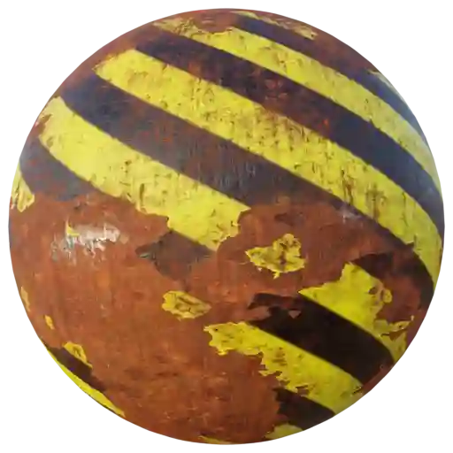

|

**This material is contained in the following Exapacks:**

    - XTRPbr_05k_Vol_001

    - XTRPbr_1k_Vol_001

    - XTRPbr_2k_Vol_003

    - XTRPbr_4k_Vol_005

    - XTRPbr_8k_Vol_004

    - XTRPbr_8k_Vol_015

------------------------------------------------------------------------------------------------------------------------

White Paint Metal 001
*********************

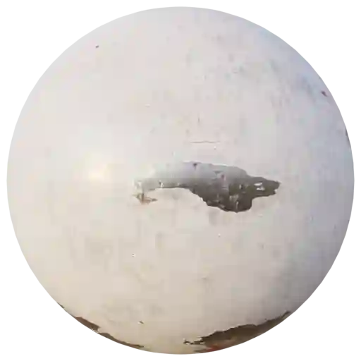

|

**This material is contained in the following Exapacks:**

    - XTRPbr_05k_Vol_001

    - XTRPbr_1k_Vol_001

    - XTRPbr_2k_Vol_003

    - XTRPbr_4k_Vol_005

    - XTRPbr_8k_Vol_004

------------------------------------------------------------------------------------------------------------------------

White Paint Metal 002
*********************

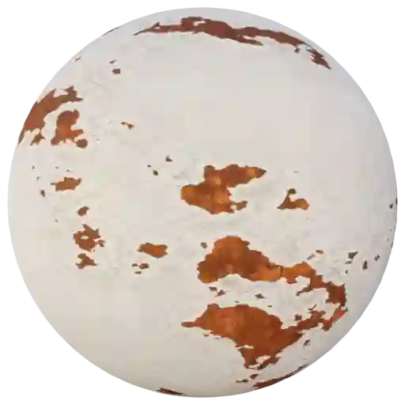

|

**This material is contained in the following Exapacks:**

    - XTRPbr_05k_Vol_001

    - XTRPbr_1k_Vol_001

    - XTRPbr_2k_Vol_003

    - XTRPbr_4k_Vol_005

    - XTRPbr_8k_Vol_004

------------------------------------------------------------------------------------------------------------------------

White Paint Metal 003
*********************

.. image:: _static/_images/material_list/metal_worn_paint/white_paint_metal_003/white_paint_metal_003.webp
    :width: 30%
    :align: center
    :alt: White Paint Metal 003

|

**This material is contained in the following Exapacks:**

    - XTRPbr_05k_Vol_001

    - XTRPbr_1k_Vol_001

    - XTRPbr_2k_Vol_003

    - XTRPbr_4k_Vol_005

    - XTRPbr_8k_Vol_004

------------------------------------------------------------------------------------------------------------------------

White Paint Metal 004
*********************

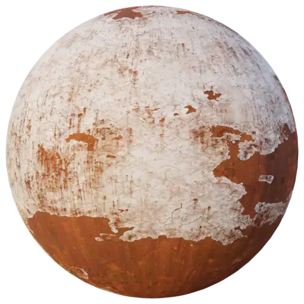

|

**This material is contained in the following Exapacks:**

    - XTRPbr_05k_Vol_001

    - XTRPbr_1k_Vol_001

    - XTRPbr_2k_Vol_003

    - XTRPbr_4k_Vol_005

    - XTRPbr_8k_Vol_004

------------------------------------------------------------------------------------------------------------------------

Yellow Paint Metal 001
**********************

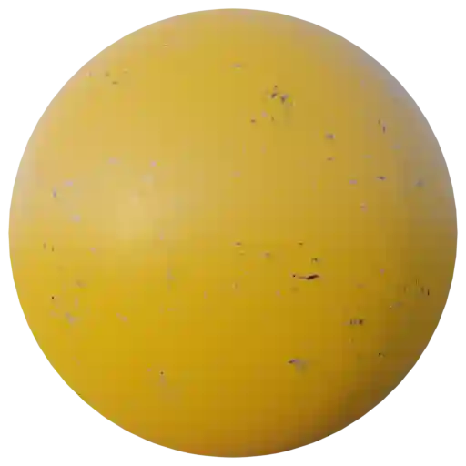

|

**This material is contained in the following Exapacks:**

    - XTRPbr_05k_Vol_001

    - XTRPbr_1k_Vol_001

    - XTRPbr_2k_Vol_003

    - XTRPbr_4k_Vol_005

------------------------------------------------------------------------------------------------------------------------

Yellow Paint Metal 002
**********************

.. image:: _static/_images/material_list/metal_worn_paint/yellow_paint_metal_002/yellow_paint_metal_002.webp
    :width: 30%
    :align: center
    :alt: Yellow Paint Metal 002

|

**This material is contained in the following Exapacks:**

    - XTRPbr_05k_Vol_001

    - XTRPbr_1k_Vol_001

    - XTRPbr_2k_Vol_003

    - XTRPbr_4k_Vol_005

------------------------------------------------------------------------------------------------------------------------

Yellow Paint Metal 003
**********************

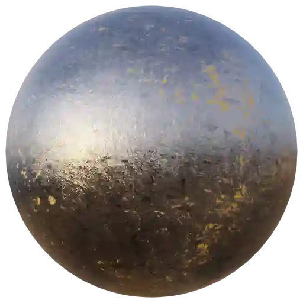

|

**This material is contained in the following Exapacks:**

    - XTRPbr_05k_Vol_001

    - XTRPbr_1k_Vol_001

    - XTRPbr_2k_Vol_003

    - XTRPbr_4k_Vol_005

------------------------------------------------------------------------------------------------------------------------

Yellow Paint Metal 004
**********************

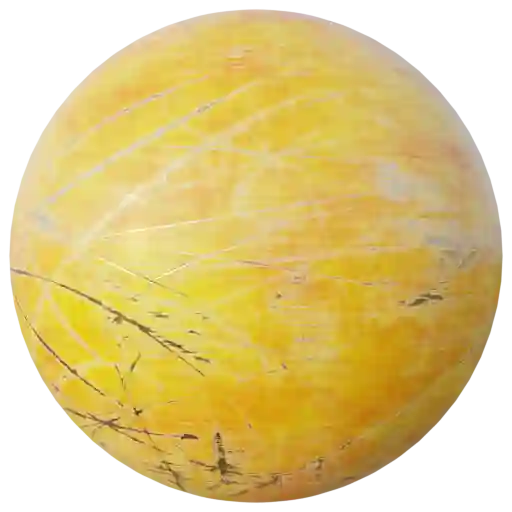

|

**This material is contained in the following Exapacks:**

    - XTRPbr_05k_Vol_001

    - XTRPbr_1k_Vol_001

    - XTRPbr_2k_Vol_003

    - XTRPbr_4k_Vol_005

------------------------------------------------------------------------------------------------------------------------

Yellow Paint Metal 005
**********************

.. image:: _static/_images/material_list/metal_worn_paint/yellow_paint_metal_005/yellow_paint_metal_005.webp
    :width: 30%
    :align: center
    :alt: Yellow Paint Metal 005

|

**This material is contained in the following Exapacks:**

    - XTRPbr_05k_Vol_001

    - XTRPbr_1k_Vol_001

    - XTRPbr_2k_Vol_003

    - XTRPbr_4k_Vol_005

------------------------------------------------------------------------------------------------------------------------

Paper & Cardboard (Category)
----------------------------

Book Pages 01
*************

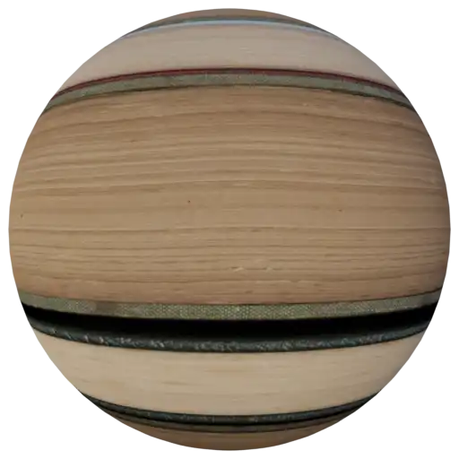

|

**This material is contained in the following Exapacks:**

    - XTRPbr_05k_Vol_001

    - XTRPbr_1k_Vol_001

    - XTRPbr_2k_Vol_003

    - XTRPbr_4k_Vol_005

------------------------------------------------------------------------------------------------------------------------

Cardboard 001
*************

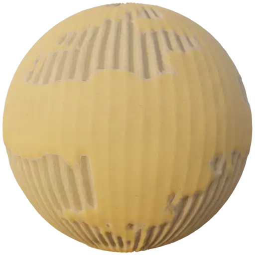

|

**This material is contained in the following Exapacks:**

    - XTRPbr_05k_Vol_001

    - XTRPbr_1k_Vol_001

    - XTRPbr_2k_Vol_003

    - XTRPbr_4k_Vol_005

    - XTRPbr_8k_Vol_004

------------------------------------------------------------------------------------------------------------------------

Cardboard 002
*************

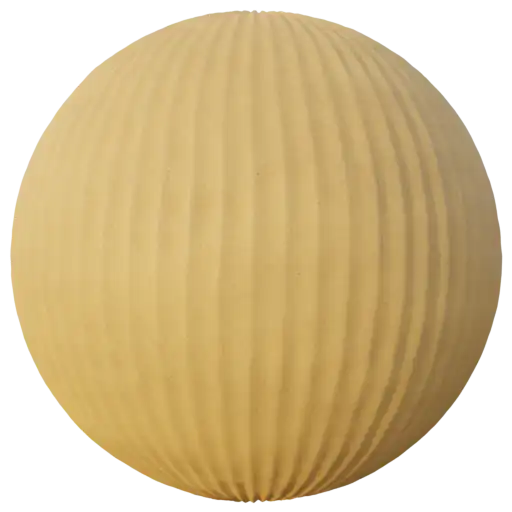

|

**This material is contained in the following Exapacks:**

    - XTRPbr_05k_Vol_001

    - XTRPbr_1k_Vol_001

    - XTRPbr_2k_Vol_003

    - XTRPbr_4k_Vol_005

    - XTRPbr_8k_Vol_004

------------------------------------------------------------------------------------------------------------------------

Cardboard 003
*************

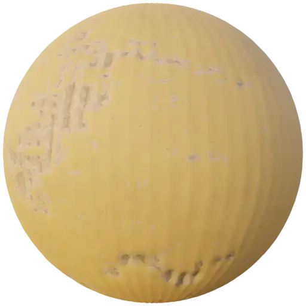

|

**This material is contained in the following Exapacks:**

    - XTRPbr_05k_Vol_001

    - XTRPbr_1k_Vol_001

    - XTRPbr_2k_Vol_003

    - XTRPbr_4k_Vol_005

    - XTRPbr_8k_Vol_004

------------------------------------------------------------------------------------------------------------------------

Cardboard 004
*************

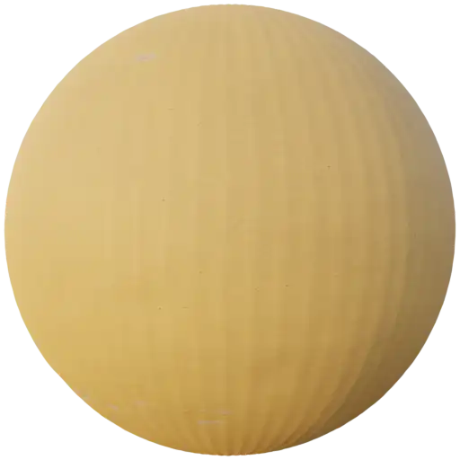

|

**This material is contained in the following Exapacks:**

    - XTRPbr_05k_Vol_001

    - XTRPbr_1k_Vol_001

    - XTRPbr_2k_Vol_003

    - XTRPbr_4k_Vol_005

    - XTRPbr_8k_Vol_004

------------------------------------------------------------------------------------------------------------------------

Paper 001
*********

|

**This material is contained in the following Exapacks:**

    - XTRPbr_05k_Vol_001

    - XTRPbr_1k_Vol_001

    - XTRPbr_2k_Vol_003

------------------------------------------------------------------------------------------------------------------------

Paper 002
*********

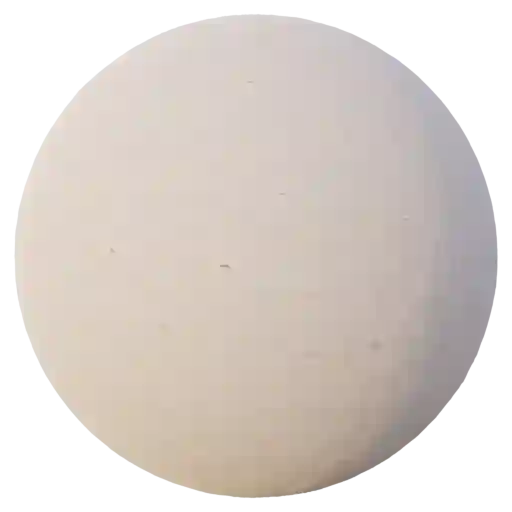

|

**This material is contained in the following Exapacks:**

    - XTRPbr_05k_Vol_001

    - XTRPbr_1k_Vol_001

    - XTRPbr_2k_Vol_003

    - XTRPbr_4k_Vol_005

------------------------------------------------------------------------------------------------------------------------

Paper 003
*********

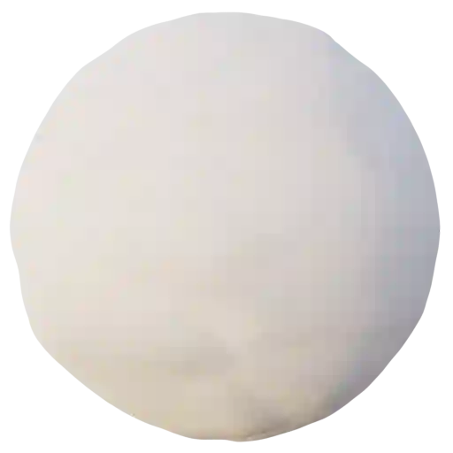

|

**This material is contained in the following Exapacks:**

    - XTRPbr_05k_Vol_001

    - XTRPbr_1k_Vol_001

    - XTRPbr_2k_Vol_003

    - XTRPbr_4k_Vol_005

    - XTRPbr_8k_Vol_004

------------------------------------------------------------------------------------------------------------------------

Parquet - Basketweave (Category)
--------------------------------

Basketweave Parquet 001
***********************

.. image:: _static/_images/material_list/parquet_basketweave/basketweave_parquet_001/basketweave_parquet_001.webp
    :width: 30%
    :align: center
    :alt: Basketweave Parquet 001

|

**This material is contained in the following Exapacks:**

    - XTRPbr_05k_Vol_001

    - XTRPbr_1k_Vol_001

    - XTRPbr_2k_Vol_003

    - XTRPbr_4k_Vol_005

    - XTRPbr_8k_Vol_004

------------------------------------------------------------------------------------------------------------------------

Basketweave Parquet 002
***********************

.. image:: _static/_images/material_list/parquet_basketweave/basketweave_parquet_002/basketweave_parquet_002.webp
    :width: 30%
    :align: center
    :alt: Basketweave Parquet 002

|

**This material is contained in the following Exapacks:**

    - XTRPbr_05k_Vol_001

    - XTRPbr_1k_Vol_001

    - XTRPbr_2k_Vol_003

    - XTRPbr_4k_Vol_005

    - XTRPbr_8k_Vol_004

------------------------------------------------------------------------------------------------------------------------

Basketweave Parquet 003
***********************

.. image:: _static/_images/material_list/parquet_basketweave/basketweave_parquet_003/basketweave_parquet_003.webp
    :width: 30%
    :align: center
    :alt: Basketweave Parquet 003

|

**This material is contained in the following Exapacks:**

    - XTRPbr_05k_Vol_001

    - XTRPbr_1k_Vol_001

    - XTRPbr_2k_Vol_003

    - XTRPbr_4k_Vol_005

    - XTRPbr_8k_Vol_004

------------------------------------------------------------------------------------------------------------------------

Basketweave Parquet 004
***********************

.. image:: _static/_images/material_list/parquet_basketweave/basketweave_parquet_004/basketweave_parquet_004.webp
    :width: 30%
    :align: center
    :alt: Basketweave Parquet 004

|

**This material is contained in the following Exapacks:**

    - XTRPbr_05k_Vol_001

    - XTRPbr_1k_Vol_001

    - XTRPbr_2k_Vol_003

    - XTRPbr_4k_Vol_005

------------------------------------------------------------------------------------------------------------------------

Basketweave Parquet 005
***********************

.. image:: _static/_images/material_list/parquet_basketweave/basketweave_parquet_005/basketweave_parquet_005.webp
    :width: 30%
    :align: center
    :alt: Basketweave Parquet 005

|

**This material is contained in the following Exapacks:**

    - XTRPbr_05k_Vol_001

    - XTRPbr_1k_Vol_001

    - XTRPbr_2k_Vol_003

    - XTRPbr_4k_Vol_005

    - XTRPbr_8k_Vol_004

------------------------------------------------------------------------------------------------------------------------

Basketweave Parquet 006
***********************

.. image:: _static/_images/material_list/parquet_basketweave/basketweave_parquet_006/basketweave_parquet_006.webp
    :width: 30%
    :align: center
    :alt: Basketweave Parquet 006

|

**This material is contained in the following Exapacks:**

    - XTRPbr_05k_Vol_001

    - XTRPbr_1k_Vol_001

    - XTRPbr_2k_Vol_003

    - XTRPbr_4k_Vol_005

    - XTRPbr_8k_Vol_004

------------------------------------------------------------------------------------------------------------------------

Basketweave Parquet 007
***********************

.. image:: _static/_images/material_list/parquet_basketweave/basketweave_parquet_007/basketweave_parquet_007.webp
    :width: 30%
    :align: center
    :alt: Basketweave Parquet 007

|

**This material is contained in the following Exapacks:**

    - XTRPbr_05k_Vol_001

    - XTRPbr_1k_Vol_001

    - XTRPbr_2k_Vol_003

    - XTRPbr_4k_Vol_005

    - XTRPbr_8k_Vol_004

------------------------------------------------------------------------------------------------------------------------

Basketweave Parquet 008
***********************

.. image:: _static/_images/material_list/parquet_basketweave/basketweave_parquet_008/basketweave_parquet_008.webp
    :width: 30%
    :align: center
    :alt: Basketweave Parquet 008

|

**This material is contained in the following Exapacks:**

    - XTRPbr_05k_Vol_001

    - XTRPbr_1k_Vol_001

    - XTRPbr_2k_Vol_003

    - XTRPbr_4k_Vol_005

    - XTRPbr_8k_Vol_004

------------------------------------------------------------------------------------------------------------------------

Basketweave Parquet 009
***********************

.. image:: _static/_images/material_list/parquet_basketweave/basketweave_parquet_009/basketweave_parquet_009.webp
    :width: 30%
    :align: center
    :alt: Basketweave Parquet 009

|

**This material is contained in the following Exapacks:**

    - XTRPbr_05k_Vol_001

    - XTRPbr_1k_Vol_001

    - XTRPbr_2k_Vol_003

    - XTRPbr_4k_Vol_005

    - XTRPbr_8k_Vol_004

------------------------------------------------------------------------------------------------------------------------

Basketweave Parquet 010
***********************

.. image:: _static/_images/material_list/parquet_basketweave/basketweave_parquet_010/basketweave_parquet_010.webp
    :width: 30%
    :align: center
    :alt: Basketweave Parquet 010

|

**This material is contained in the following Exapacks:**

    - XTRPbr_05k_Vol_001

    - XTRPbr_1k_Vol_001

    - XTRPbr_2k_Vol_003

    - XTRPbr_4k_Vol_005

    - XTRPbr_8k_Vol_004

------------------------------------------------------------------------------------------------------------------------

Basketweave Parquet 011
***********************

.. image:: _static/_images/material_list/parquet_basketweave/basketweave_parquet_011/basketweave_parquet_011.webp
    :width: 30%
    :align: center
    :alt: Basketweave Parquet 011

|

**This material is contained in the following Exapacks:**

    - XTRPbr_05k_Vol_001

    - XTRPbr_1k_Vol_001

    - XTRPbr_2k_Vol_003

    - XTRPbr_4k_Vol_005

    - XTRPbr_8k_Vol_004

------------------------------------------------------------------------------------------------------------------------

Basketweave Parquet 012
***********************

.. image:: _static/_images/material_list/parquet_basketweave/basketweave_parquet_012/basketweave_parquet_012.webp
    :width: 30%
    :align: center
    :alt: Basketweave Parquet 012

|

**This material is contained in the following Exapacks:**

    - XTRPbr_05k_Vol_001

    - XTRPbr_1k_Vol_001

    - XTRPbr_2k_Vol_003

    - XTRPbr_4k_Vol_005

    - XTRPbr_8k_Vol_004

------------------------------------------------------------------------------------------------------------------------

Basketweave Parquet 013
***********************

.. image:: _static/_images/material_list/parquet_basketweave/basketweave_parquet_013/basketweave_parquet_013.webp
    :width: 30%
    :align: center
    :alt: Basketweave Parquet 013

|

**This material is contained in the following Exapacks:**

    - XTRPbr_05k_Vol_001

    - XTRPbr_1k_Vol_001

    - XTRPbr_2k_Vol_003

    - XTRPbr_4k_Vol_005

    - XTRPbr_8k_Vol_004

------------------------------------------------------------------------------------------------------------------------

Parquet - Herringbone (Category)
--------------------------------

Herringbone Parquet 001
***********************

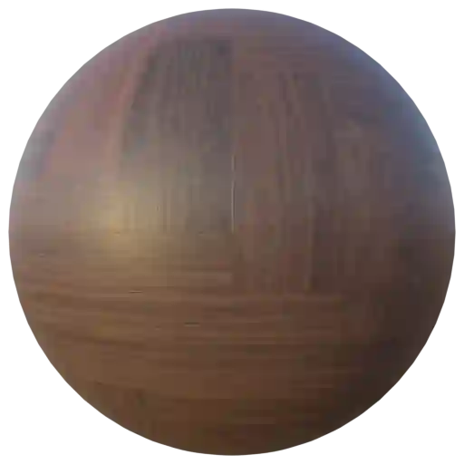

|

**This material is contained in the following Exapacks:**

    - XTRPbr_05k_Vol_001

    - XTRPbr_1k_Vol_001

    - XTRPbr_2k_Vol_003

    - XTRPbr_4k_Vol_005

------------------------------------------------------------------------------------------------------------------------

Herringbone Parquet 002
***********************

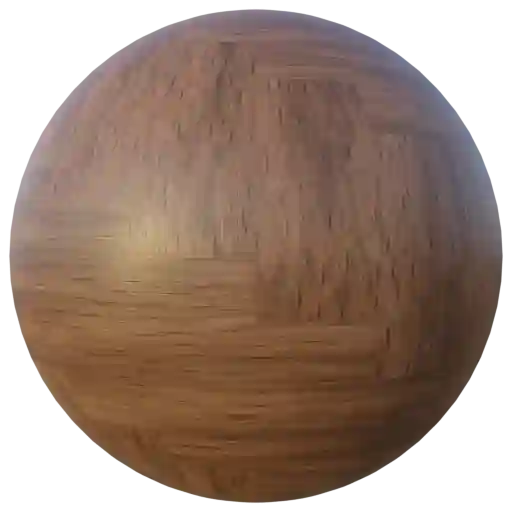

|

**This material is contained in the following Exapacks:**

    - XTRPbr_05k_Vol_001

    - XTRPbr_1k_Vol_001

    - XTRPbr_2k_Vol_003

    - XTRPbr_4k_Vol_005

    - XTRPbr_8k_Vol_004

------------------------------------------------------------------------------------------------------------------------

Herringbone Parquet 003
***********************

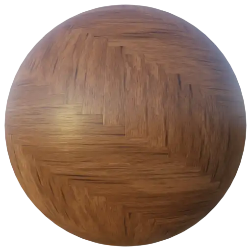

|

**This material is contained in the following Exapacks:**

    - XTRPbr_05k_Vol_001

    - XTRPbr_1k_Vol_001

    - XTRPbr_2k_Vol_003

    - XTRPbr_4k_Vol_005

    - XTRPbr_8k_Vol_004

------------------------------------------------------------------------------------------------------------------------

Herringbone Parquet 004
***********************

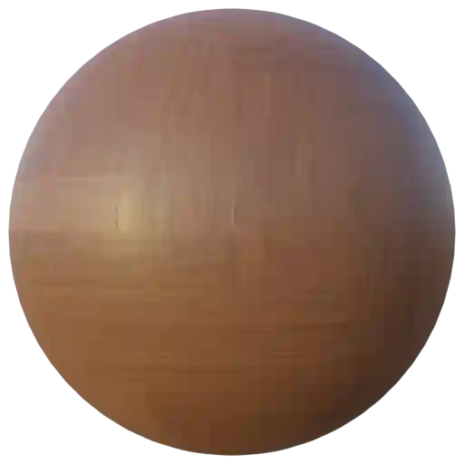

|

**This material is contained in the following Exapacks:**

    - XTRPbr_05k_Vol_001

    - XTRPbr_1k_Vol_001

    - XTRPbr_2k_Vol_003

    - XTRPbr_4k_Vol_005

------------------------------------------------------------------------------------------------------------------------

Herringbone Parquet 005
***********************

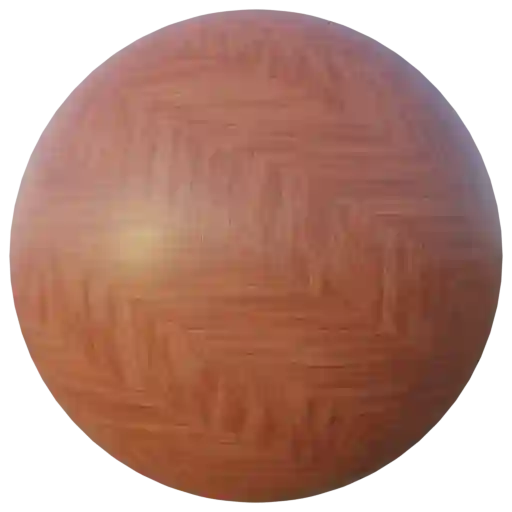

|

**This material is contained in the following Exapacks:**

    - XTRPbr_05k_Vol_001

    - XTRPbr_1k_Vol_001

    - XTRPbr_2k_Vol_003

    - XTRPbr_4k_Vol_005

    - XTRPbr_8k_Vol_004

------------------------------------------------------------------------------------------------------------------------

Herringbone Parquet 006
***********************

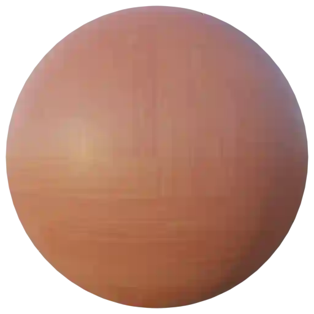

|

**This material is contained in the following Exapacks:**

    - XTRPbr_05k_Vol_001

    - XTRPbr_1k_Vol_001

    - XTRPbr_2k_Vol_003

    - XTRPbr_4k_Vol_005

------------------------------------------------------------------------------------------------------------------------

Herringbone Parquet 007
***********************

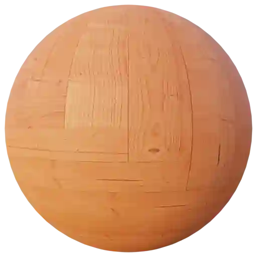

|

**This material is contained in the following Exapacks:**

    - XTRPbr_05k_Vol_001

    - XTRPbr_1k_Vol_001

    - XTRPbr_2k_Vol_003

    - XTRPbr_4k_Vol_005

    - XTRPbr_8k_Vol_004

------------------------------------------------------------------------------------------------------------------------

Herringbone Parquet 008
***********************

.. image:: _static/_images/material_list/parquet_herringbone/herringbone_parquet_008/herringbone_parquet_008.webp
    :width: 30%
    :align: center
    :alt: Herringbone Parquet 008

|

**This material is contained in the following Exapacks:**

    - XTRPbr_05k_Vol_001

    - XTRPbr_1k_Vol_001

    - XTRPbr_2k_Vol_003

    - XTRPbr_4k_Vol_005

    - XTRPbr_8k_Vol_004

------------------------------------------------------------------------------------------------------------------------

Herringbone Parquet 009
***********************

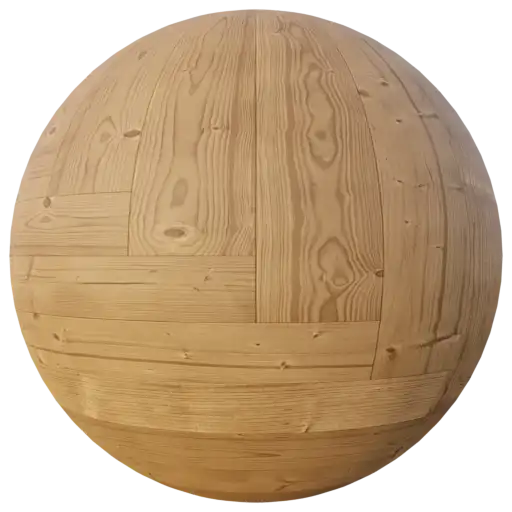

|

**This material is contained in the following Exapacks:**

    - XTRPbr_05k_Vol_001

    - XTRPbr_1k_Vol_001

    - XTRPbr_2k_Vol_003

    - XTRPbr_4k_Vol_005

    - XTRPbr_8k_Vol_004

------------------------------------------------------------------------------------------------------------------------

Herringbone Parquet 010
***********************

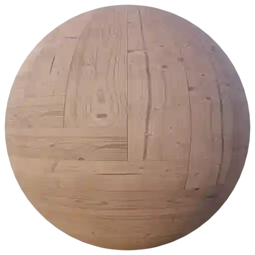

|

**This material is contained in the following Exapacks:**

    - XTRPbr_05k_Vol_001

    - XTRPbr_1k_Vol_001

    - XTRPbr_2k_Vol_003

    - XTRPbr_4k_Vol_005

    - XTRPbr_4k_Vol_009

    - XTRPbr_8k_Vol_004

------------------------------------------------------------------------------------------------------------------------

Herringbone Parquet 011
***********************

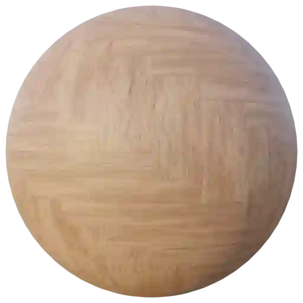

|

**This material is contained in the following Exapacks:**

    - XTRPbr_05k_Vol_001

    - XTRPbr_1k_Vol_001

    - XTRPbr_2k_Vol_003

    - XTRPbr_4k_Vol_009

    - XTRPbr_8k_Vol_004

------------------------------------------------------------------------------------------------------------------------

Herringbone Parquet 012
***********************

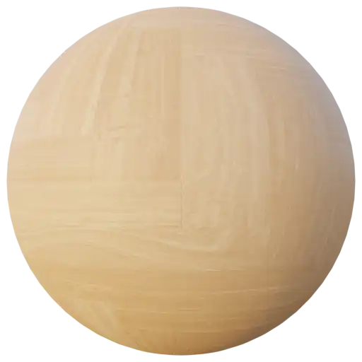

|

**This material is contained in the following Exapacks:**

    - XTRPbr_05k_Vol_001

    - XTRPbr_1k_Vol_001

    - XTRPbr_2k_Vol_003

    - XTRPbr_4k_Vol_009

------------------------------------------------------------------------------------------------------------------------

Herringbone Parquet 013
***********************

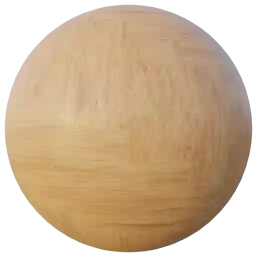

|

**This material is contained in the following Exapacks:**

    - XTRPbr_05k_Vol_001

    - XTRPbr_1k_Vol_001

    - XTRPbr_2k_Vol_003

    - XTRPbr_4k_Vol_009

    - XTRPbr_8k_Vol_004

------------------------------------------------------------------------------------------------------------------------

Herringbone Parquet 014
***********************

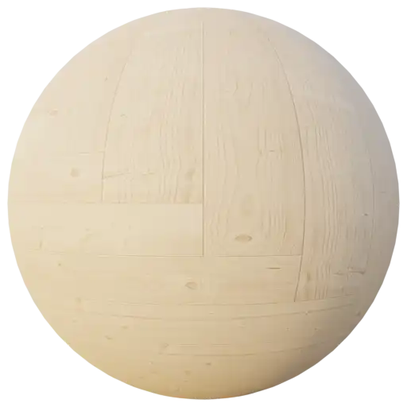

|

**This material is contained in the following Exapacks:**

    - XTRPbr_05k_Vol_001

    - XTRPbr_1k_Vol_001

    - XTRPbr_2k_Vol_003

    - XTRPbr_4k_Vol_009

    - XTRPbr_8k_Vol_004

------------------------------------------------------------------------------------------------------------------------

Herringbone Parquet 015
***********************

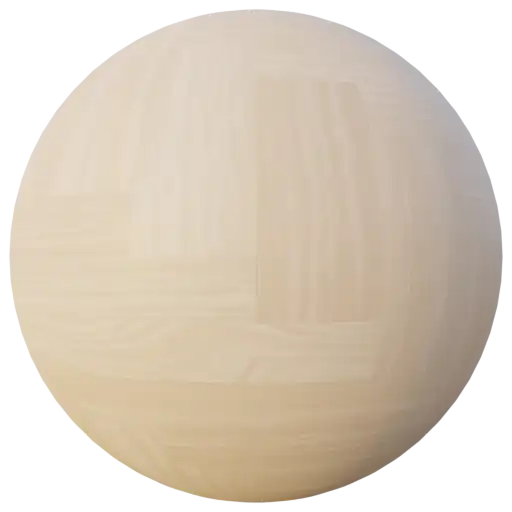

|

**This material is contained in the following Exapacks:**

    - XTRPbr_05k_Vol_001

    - XTRPbr_1k_Vol_001

    - XTRPbr_2k_Vol_003

    - XTRPbr_4k_Vol_009

------------------------------------------------------------------------------------------------------------------------

Herringbone Parquet 016
***********************

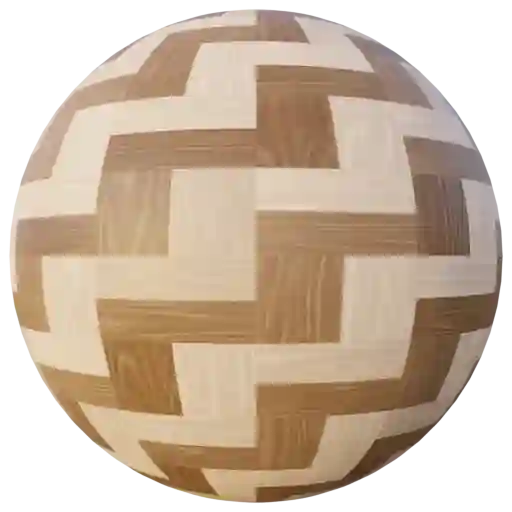

|

**This material is contained in the following Exapacks:**

    - XTRPbr_05k_Vol_001

    - XTRPbr_1k_Vol_001

    - XTRPbr_2k_Vol_003

    - XTRPbr_4k_Vol_009

    - XTRPbr_8k_Vol_004

------------------------------------------------------------------------------------------------------------------------

Parquet - Pattern Mix (Category)
--------------------------------

Parquet Pattern 001
*******************

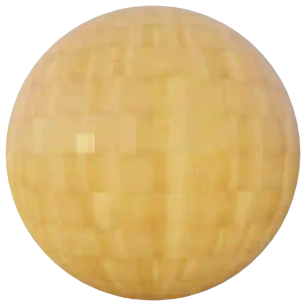

|

**This material is contained in the following Exapacks:**

    - XTRPbr_05k_Vol_001

    - XTRPbr_1k_Vol_001

    - XTRPbr_2k_Vol_003

    - XTRPbr_4k_Vol_009

    - XTRPbr_8k_Vol_004

------------------------------------------------------------------------------------------------------------------------

Parquet Pattern 002
*******************

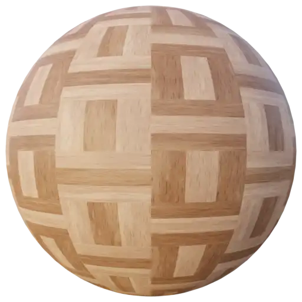

|

**This material is contained in the following Exapacks:**

    - XTRPbr_05k_Vol_001

    - XTRPbr_1k_Vol_001

    - XTRPbr_2k_Vol_003

    - XTRPbr_4k_Vol_009

    - XTRPbr_8k_Vol_004

------------------------------------------------------------------------------------------------------------------------

Parquet Pattern 003
*******************

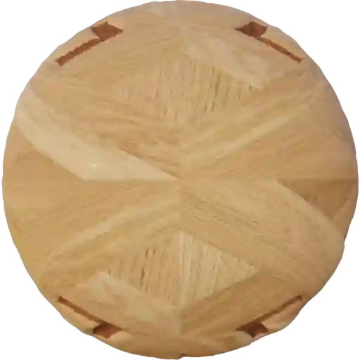

|

**This material is contained in the following Exapacks:**

    - XTRPbr_05k_Vol_001

    - XTRPbr_1k_Vol_001

    - XTRPbr_2k_Vol_003

    - XTRPbr_4k_Vol_009

------------------------------------------------------------------------------------------------------------------------

Parquet Pattern 004
*******************

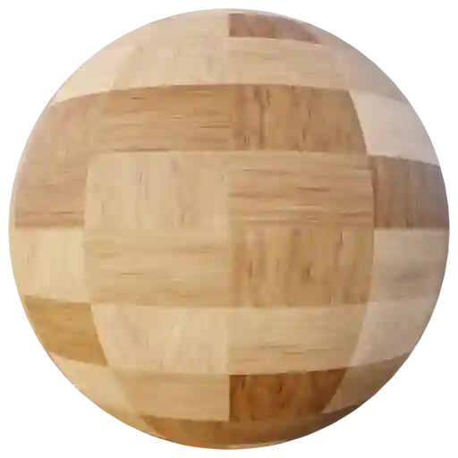

|

**This material is contained in the following Exapacks:**

    - XTRPbr_05k_Vol_001

    - XTRPbr_1k_Vol_001

    - XTRPbr_2k_Vol_003

    - XTRPbr_4k_Vol_009

    - XTRPbr_8k_Vol_004

------------------------------------------------------------------------------------------------------------------------

Parquet - Straight (Category)
-----------------------------

Dark Straight Parquet 001
*************************

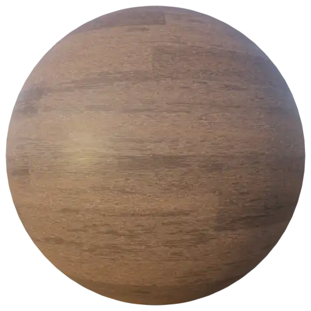

|

**This material is contained in the following Exapacks:**

    - XTRPbr_05k_Vol_001

    - XTRPbr_1k_Vol_001

    - XTRPbr_2k_Vol_003

    - XTRPbr_4k_Vol_009

------------------------------------------------------------------------------------------------------------------------

Dark Straight Parquet 002
*************************

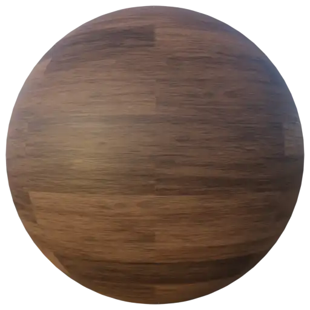

|

**This material is contained in the following Exapacks:**

    - XTRPbr_05k_Vol_001

    - XTRPbr_1k_Vol_001

    - XTRPbr_2k_Vol_003

    - XTRPbr_4k_Vol_009

------------------------------------------------------------------------------------------------------------------------

Dark Straight Parquet 003
*************************

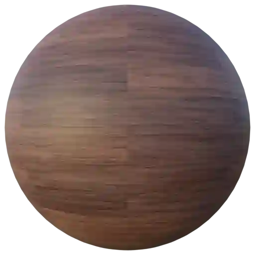

|

**This material is contained in the following Exapacks:**

    - XTRPbr_05k_Vol_001

    - XTRPbr_1k_Vol_001

    - XTRPbr_2k_Vol_003

    - XTRPbr_4k_Vol_009

------------------------------------------------------------------------------------------------------------------------

Dark Straight Parquet 004
*************************

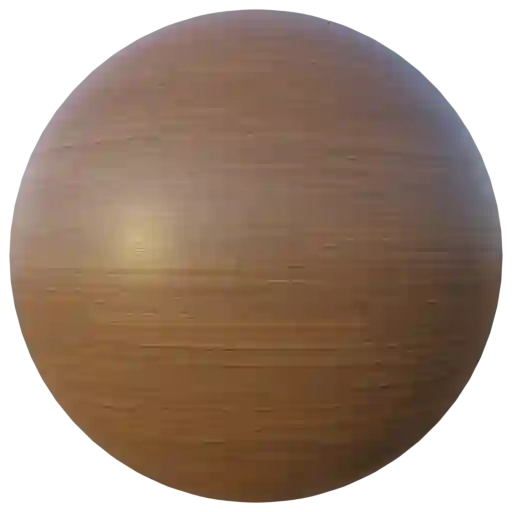

|

**This material is contained in the following Exapacks:**

    - XTRPbr_05k_Vol_001

    - XTRPbr_1k_Vol_001

    - XTRPbr_2k_Vol_003

    - XTRPbr_4k_Vol_009

------------------------------------------------------------------------------------------------------------------------

Dark Straight Parquet 005
*************************

.. image:: _static/_images/material_list/parquet_straight/dark_straight_parquet_005/dark_straight_parquet_005.webp
    :width: 30%
    :align: center
    :alt: Dark Straight Parquet 005

|

**This material is contained in the following Exapacks:**

    - XTRPbr_05k_Vol_001

    - XTRPbr_1k_Vol_001

    - XTRPbr_2k_Vol_003

    - XTRPbr_4k_Vol_009

------------------------------------------------------------------------------------------------------------------------

Dark Straight Parquet 006
*************************

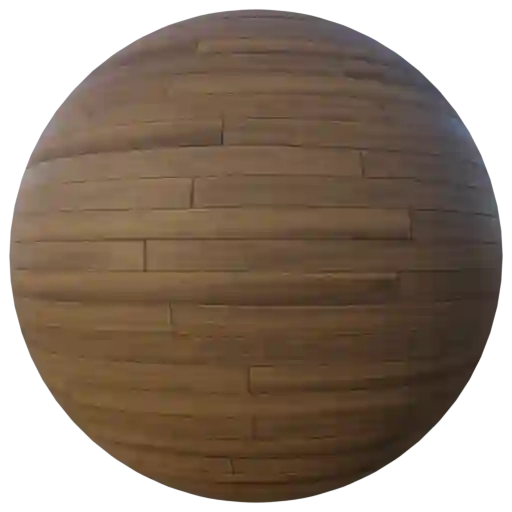

|

**This material is contained in the following Exapacks:**

    - XTRPbr_05k_Vol_001

    - XTRPbr_1k_Vol_001

    - XTRPbr_2k_Vol_003

    - XTRPbr_4k_Vol_009

------------------------------------------------------------------------------------------------------------------------

Dark Straight Parquet 007
*************************

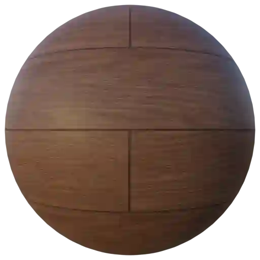

|

**This material is contained in the following Exapacks:**

    - XTRPbr_05k_Vol_001

    - XTRPbr_1k_Vol_001

    - XTRPbr_2k_Vol_003

    - XTRPbr_4k_Vol_009

    - XTRPbr_8k_Vol_004

------------------------------------------------------------------------------------------------------------------------

Dark Straight Parquet 008
*************************

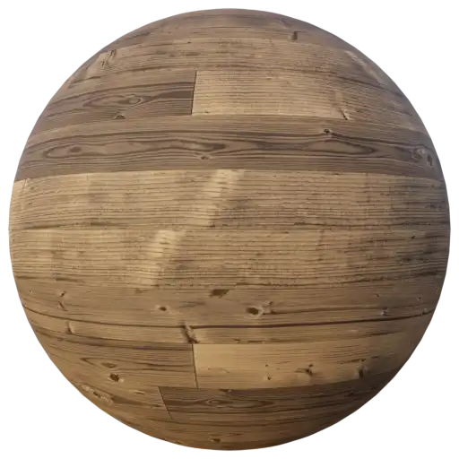

|

**This material is contained in the following Exapacks:**

    - XTRPbr_05k_Vol_001

    - XTRPbr_1k_Vol_001

    - XTRPbr_2k_Vol_003

    - XTRPbr_4k_Vol_009

    - XTRPbr_8k_Vol_004

------------------------------------------------------------------------------------------------------------------------

Dark Straight Parquet 009
*************************

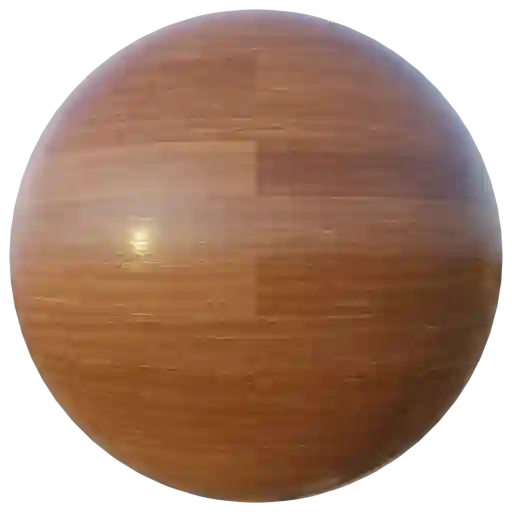

|

**This material is contained in the following Exapacks:**

    - XTRPbr_05k_Vol_001

    - XTRPbr_1k_Vol_001

    - XTRPbr_2k_Vol_003

    - XTRPbr_4k_Vol_009

------------------------------------------------------------------------------------------------------------------------

Dark Straight Parquet 010
*************************

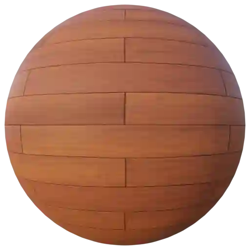

|

**This material is contained in the following Exapacks:**

    - XTRPbr_05k_Vol_001

    - XTRPbr_1k_Vol_001

    - XTRPbr_2k_Vol_003

    - XTRPbr_4k_Vol_009

------------------------------------------------------------------------------------------------------------------------

Dark Straight Parquet 011
*************************

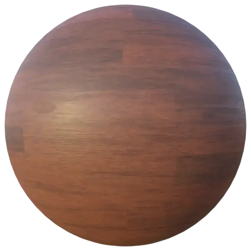

|

**This material is contained in the following Exapacks:**

    - XTRPbr_05k_Vol_001

    - XTRPbr_1k_Vol_001

    - XTRPbr_2k_Vol_003

    - XTRPbr_4k_Vol_009

------------------------------------------------------------------------------------------------------------------------

Dark Straight Parquet 012
*************************

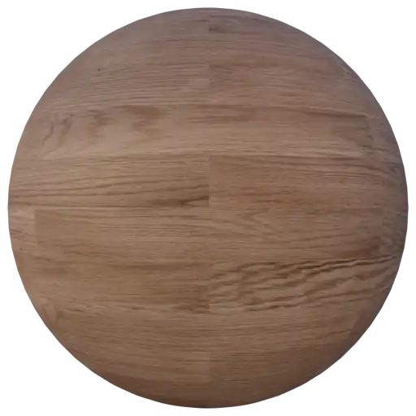

|

**This material is contained in the following Exapacks:**

    - XTRPbr_05k_Vol_001

    - XTRPbr_1k_Vol_001

    - XTRPbr_2k_Vol_003

    - XTRPbr_4k_Vol_009

    - XTRPbr_8k_Vol_004

------------------------------------------------------------------------------------------------------------------------

Dark Straight Parquet 013
*************************

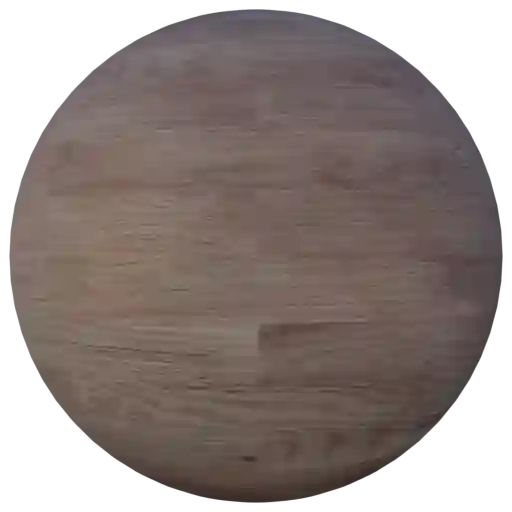

|

**This material is contained in the following Exapacks:**

    - XTRPbr_05k_Vol_001

    - XTRPbr_1k_Vol_001

    - XTRPbr_2k_Vol_003

    - XTRPbr_4k_Vol_009

    - XTRPbr_8k_Vol_004

------------------------------------------------------------------------------------------------------------------------

Light Straight Parquet 001
**************************

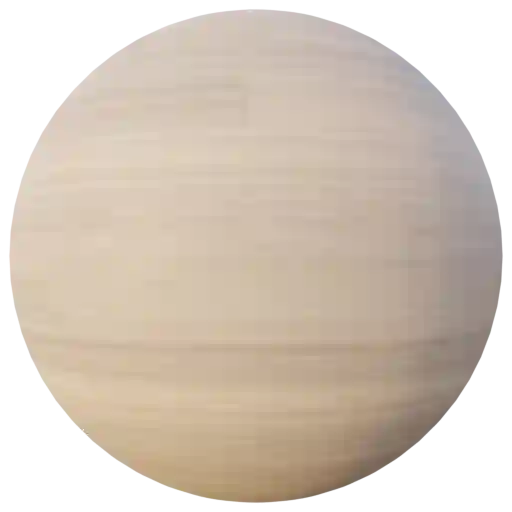

|

**This material is contained in the following Exapacks:**

    - XTRPbr_05k_Vol_001

    - XTRPbr_1k_Vol_001

    - XTRPbr_2k_Vol_003

    - XTRPbr_4k_Vol_009

------------------------------------------------------------------------------------------------------------------------

Light Straight Parquet 002
**************************

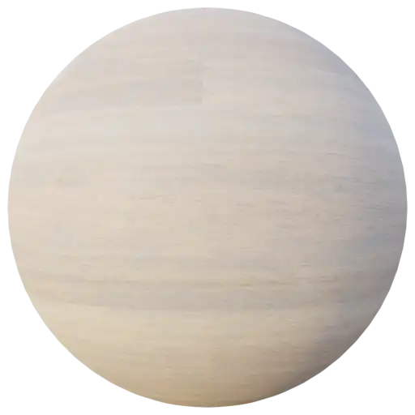

|

**This material is contained in the following Exapacks:**

    - XTRPbr_05k_Vol_001

    - XTRPbr_1k_Vol_001

    - XTRPbr_2k_Vol_003

    - XTRPbr_4k_Vol_009

------------------------------------------------------------------------------------------------------------------------

Light Straight Parquet 003
**************************

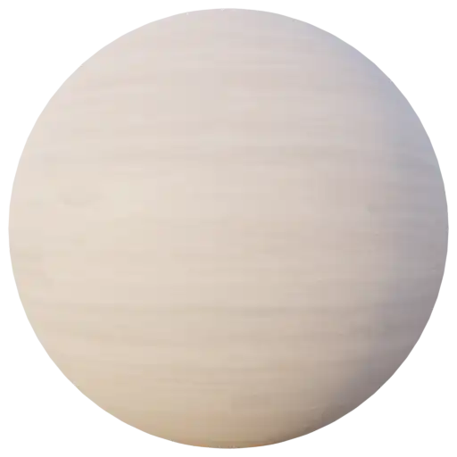

|

**This material is contained in the following Exapacks:**

    - XTRPbr_05k_Vol_001

    - XTRPbr_1k_Vol_001

    - XTRPbr_2k_Vol_003

    - XTRPbr_4k_Vol_009

------------------------------------------------------------------------------------------------------------------------

Light Straight Parquet 004
**************************

|

**This material is contained in the following Exapacks:**

    - XTRPbr_05k_Vol_001

    - XTRPbr_1k_Vol_001

    - XTRPbr_2k_Vol_003

    - XTRPbr_4k_Vol_009

------------------------------------------------------------------------------------------------------------------------

Light Straight Parquet 005
**************************

|

**This material is contained in the following Exapacks:**

    - XTRPbr_05k_Vol_001

    - XTRPbr_1k_Vol_001

    - XTRPbr_2k_Vol_003

    - XTRPbr_4k_Vol_009

------------------------------------------------------------------------------------------------------------------------

Light Straight Parquet 006
**************************

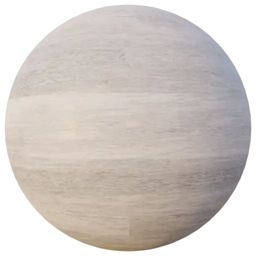

|

**This material is contained in the following Exapacks:**

    - XTRPbr_05k_Vol_001

    - XTRPbr_1k_Vol_001

    - XTRPbr_2k_Vol_003

    - XTRPbr_4k_Vol_009

------------------------------------------------------------------------------------------------------------------------

Light Straight Parquet 007
**************************

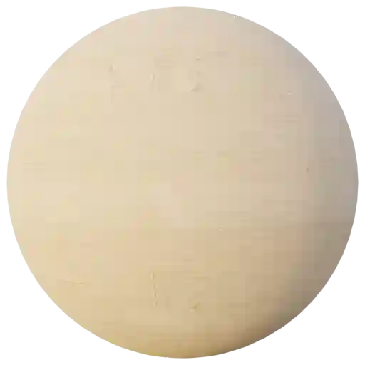

|

**This material is contained in the following Exapacks:**

    - XTRPbr_05k_Vol_001

    - XTRPbr_1k_Vol_001

    - XTRPbr_2k_Vol_003

    - XTRPbr_4k_Vol_009

    - XTRPbr_8k_Vol_004

------------------------------------------------------------------------------------------------------------------------

Light Straight Parquet 008
**************************

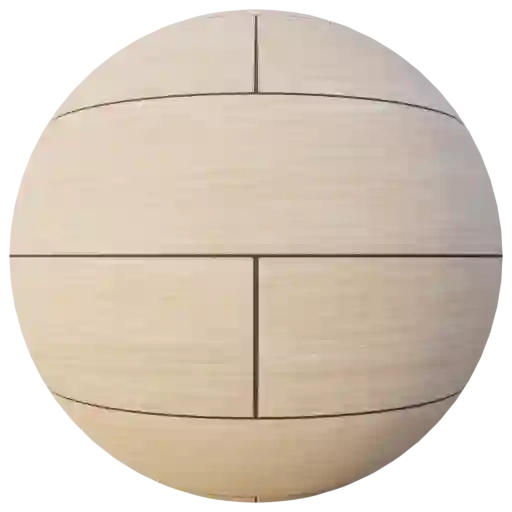

|

**This material is contained in the following Exapacks:**

    - XTRPbr_05k_Vol_001

    - XTRPbr_1k_Vol_001

    - XTRPbr_2k_Vol_003

    - XTRPbr_4k_Vol_009

    - XTRPbr_8k_Vol_004

------------------------------------------------------------------------------------------------------------------------

Light Straight Parquet 009
**************************

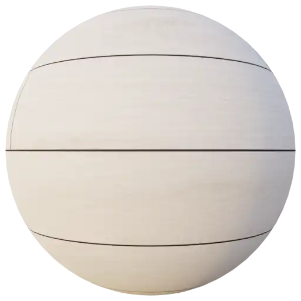

|

**This material is contained in the following Exapacks:**

    - XTRPbr_05k_Vol_001

    - XTRPbr_1k_Vol_001

    - XTRPbr_2k_Vol_003

    - XTRPbr_4k_Vol_009

    - XTRPbr_8k_Vol_004

------------------------------------------------------------------------------------------------------------------------

Light Straight Parquet 010
**************************

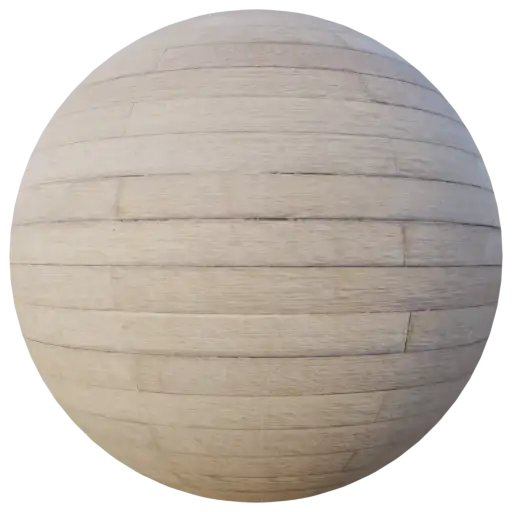

|

**This material is contained in the following Exapacks:**

    - XTRPbr_05k_Vol_001

    - XTRPbr_1k_Vol_001

    - XTRPbr_2k_Vol_003

    - XTRPbr_4k_Vol_009

    - XTRPbr_8k_Vol_004

------------------------------------------------------------------------------------------------------------------------

Light Straight Parquet 011
**************************

.. image:: _static/_images/material_list/parquet_straight/light_straight_parquet_011/light_straight_parquet_011.webp
    :width: 30%
    :align: center
    :alt: Light Straight Parquet 011

|

**This material is contained in the following Exapacks:**

    - XTRPbr_05k_Vol_001

    - XTRPbr_1k_Vol_001

    - XTRPbr_2k_Vol_003

    - XTRPbr_4k_Vol_009

    - XTRPbr_8k_Vol_004

------------------------------------------------------------------------------------------------------------------------

Light Straight Parquet 012
**************************

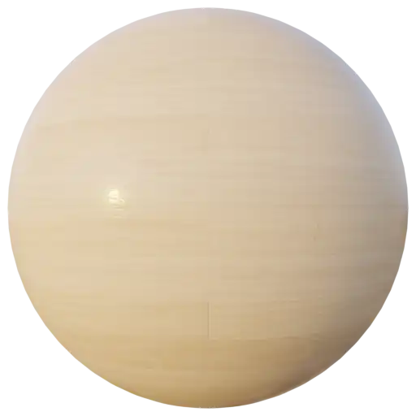

|

**This material is contained in the following Exapacks:**

    - XTRPbr_05k_Vol_001

    - XTRPbr_1k_Vol_001

    - XTRPbr_2k_Vol_003

    - XTRPbr_4k_Vol_009

------------------------------------------------------------------------------------------------------------------------

Light Straight Parquet 013
**************************

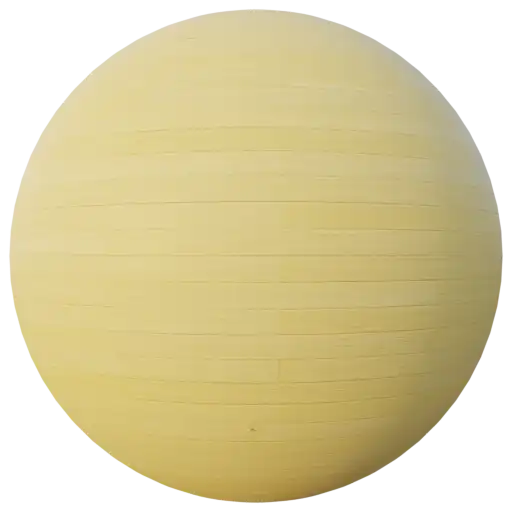

|

**This material is contained in the following Exapacks:**

    - XTRPbr_05k_Vol_001

    - XTRPbr_1k_Vol_001

    - XTRPbr_2k_Vol_003

    - XTRPbr_4k_Vol_009

    - XTRPbr_8k_Vol_004

------------------------------------------------------------------------------------------------------------------------

Light Straight Parquet 014
**************************

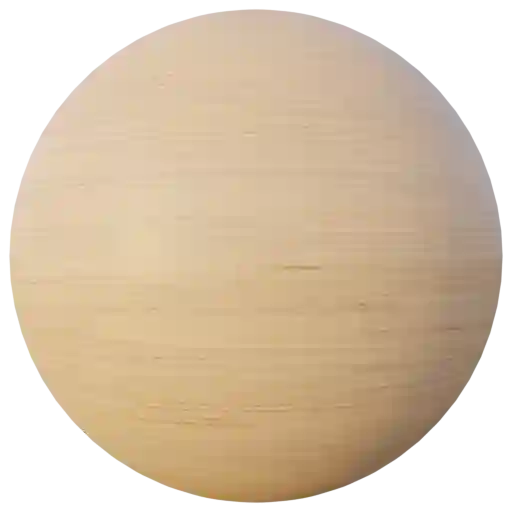

|

**This material is contained in the following Exapacks:**

    - XTRPbr_05k_Vol_001

    - XTRPbr_1k_Vol_001

    - XTRPbr_2k_Vol_003

    - XTRPbr_4k_Vol_009

------------------------------------------------------------------------------------------------------------------------

Light Straight Parquet 015
**************************

|

**This material is contained in the following Exapacks:**

    - XTRPbr_05k_Vol_001

    - XTRPbr_1k_Vol_001

    - XTRPbr_2k_Vol_003

    - XTRPbr_4k_Vol_009

------------------------------------------------------------------------------------------------------------------------

Light Straight Parquet 016
**************************

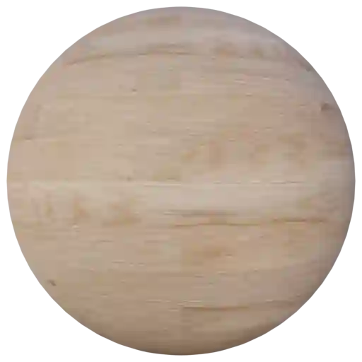

|

**This material is contained in the following Exapacks:**

    - XTRPbr_05k_Vol_001

    - XTRPbr_1k_Vol_001

    - XTRPbr_2k_Vol_003

    - XTRPbr_4k_Vol_009

    - XTRPbr_8k_Vol_004

------------------------------------------------------------------------------------------------------------------------

Straight Parquet 001
********************

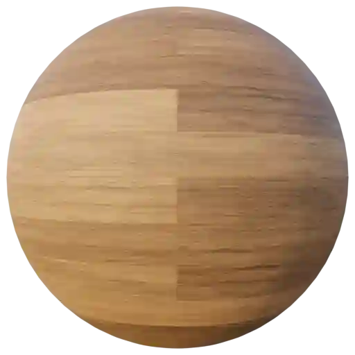

|

**This material is contained in the following Exapacks:**

    - XTRPbr_05k_Vol_001

    - XTRPbr_1k_Vol_001

    - XTRPbr_2k_Vol_003

    - XTRPbr_4k_Vol_009

------------------------------------------------------------------------------------------------------------------------

Straight Parquet 002
********************

.. image:: _static/_images/material_list/parquet_straight/straight_parquet_002/straight_parquet_002.webp
    :width: 30%
    :align: center
    :alt: Straight Parquet 002

|

**This material is contained in the following Exapacks:**

    - XTRPbr_05k_Vol_001

    - XTRPbr_1k_Vol_001

    - XTRPbr_2k_Vol_003

    - XTRPbr_4k_Vol_009

------------------------------------------------------------------------------------------------------------------------

Straight Parquet 003
********************

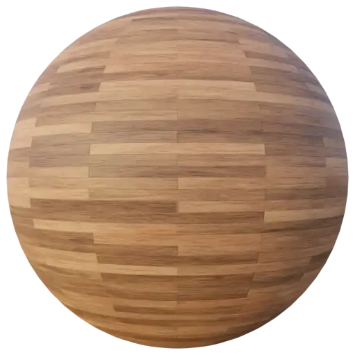

|

**This material is contained in the following Exapacks:**

    - XTRPbr_05k_Vol_001

    - XTRPbr_1k_Vol_001

    - XTRPbr_2k_Vol_003

    - XTRPbr_4k_Vol_009

------------------------------------------------------------------------------------------------------------------------

Straight Parquet 004
********************

|

**This material is contained in the following Exapacks:**

    - XTRPbr_05k_Vol_001

    - XTRPbr_1k_Vol_001

    - XTRPbr_2k_Vol_003

    - XTRPbr_4k_Vol_009

------------------------------------------------------------------------------------------------------------------------

Straight Parquet 005
********************

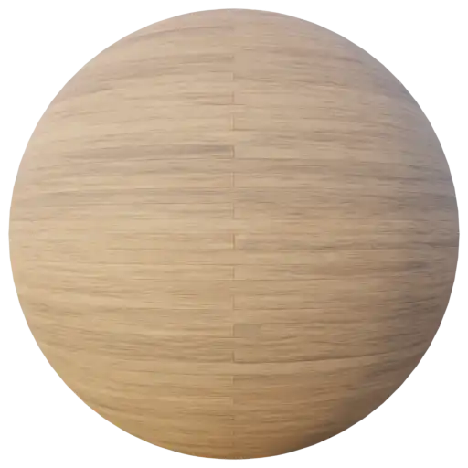

|

**This material is contained in the following Exapacks:**

    - XTRPbr_05k_Vol_001

    - XTRPbr_1k_Vol_001

    - XTRPbr_2k_Vol_003

    - XTRPbr_4k_Vol_009

------------------------------------------------------------------------------------------------------------------------

Straight Parquet 006
********************

|

**This material is contained in the following Exapacks:**

    - XTRPbr_05k_Vol_001

    - XTRPbr_1k_Vol_001

    - XTRPbr_2k_Vol_003

    - XTRPbr_4k_Vol_009

------------------------------------------------------------------------------------------------------------------------

Straight Parquet 007
********************

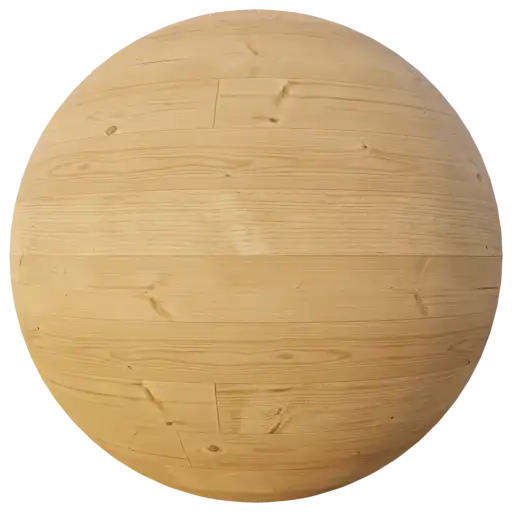

|

**This material is contained in the following Exapacks:**

    - XTRPbr_05k_Vol_001

    - XTRPbr_1k_Vol_001

    - XTRPbr_2k_Vol_003

    - XTRPbr_4k_Vol_009

    - XTRPbr_8k_Vol_004

    - XTRPbr_8k_Vol_014

------------------------------------------------------------------------------------------------------------------------

Straight Parquet 008
********************

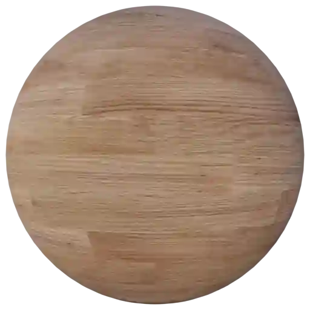

|

**This material is contained in the following Exapacks:**

    - XTRPbr_05k_Vol_001

    - XTRPbr_1k_Vol_001

    - XTRPbr_2k_Vol_003

    - XTRPbr_4k_Vol_009

    - XTRPbr_8k_Vol_014

------------------------------------------------------------------------------------------------------------------------

Straight Parquet 009
********************

.. image:: _static/_images/material_list/parquet_straight/straight_parquet_009/straight_parquet_009.webp
    :width: 30%
    :align: center
    :alt: Straight Parquet 009

|

**This material is contained in the following Exapacks:**

    - XTRPbr_05k_Vol_001

    - XTRPbr_1k_Vol_001

    - XTRPbr_2k_Vol_003

    - XTRPbr_4k_Vol_009

    - XTRPbr_8k_Vol_014

------------------------------------------------------------------------------------------------------------------------

Pavers - Grid (Category)
------------------------

Pavers Grid 001
***************

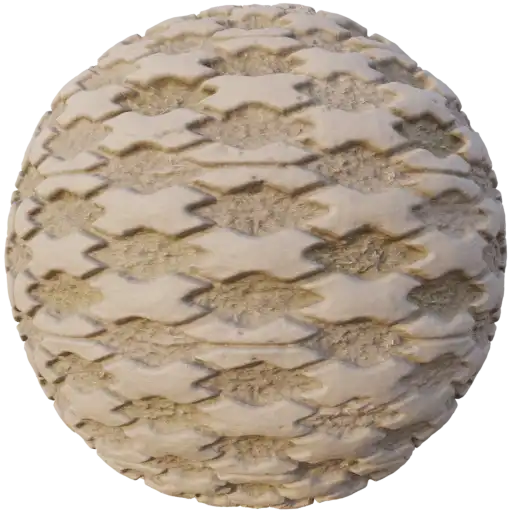

|

**This material is contained in the following Exapacks:**

    - XTRPbr_05k_Vol_001

    - XTRPbr_1k_Vol_001

    - XTRPbr_2k_Vol_003

    - XTRPbr_4k_Vol_009

    - XTRPbr_8k_Vol_014

------------------------------------------------------------------------------------------------------------------------

Pavers Grid 002
***************

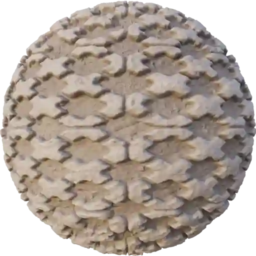

|

**This material is contained in the following Exapacks:**

    - XTRPbr_05k_Vol_001

    - XTRPbr_1k_Vol_001

    - XTRPbr_2k_Vol_003

    - XTRPbr_4k_Vol_009

    - XTRPbr_8k_Vol_014

------------------------------------------------------------------------------------------------------------------------

Pavers Grid 003
***************

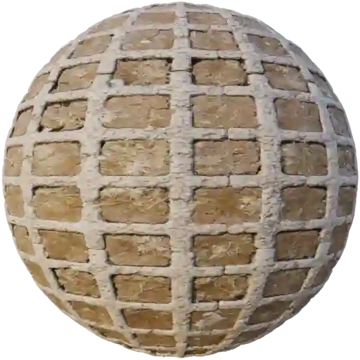

|

**This material is contained in the following Exapacks:**

    - XTRPbr_05k_Vol_001

    - XTRPbr_1k_Vol_001

    - XTRPbr_2k_Vol_003

    - XTRPbr_4k_Vol_009

    - XTRPbr_8k_Vol_014

------------------------------------------------------------------------------------------------------------------------

Pavers Grid 004
***************

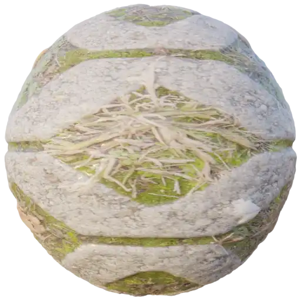

|

**This material is contained in the following Exapacks:**

    - XTRPbr_05k_Vol_001

    - XTRPbr_1k_Vol_001

    - XTRPbr_2k_Vol_003

------------------------------------------------------------------------------------------------------------------------

Pavers Grid 005
***************

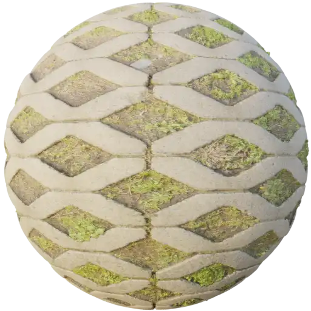

|

**This material is contained in the following Exapacks:**

    - XTRPbr_05k_Vol_001

    - XTRPbr_1k_Vol_001

    - XTRPbr_2k_Vol_003

    - XTRPbr_4k_Vol_009

    - XTRPbr_8k_Vol_014

------------------------------------------------------------------------------------------------------------------------

Pavers Grid 006
***************

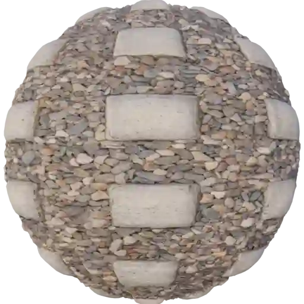

|

**This material is contained in the following Exapacks:**

    - XTRPbr_05k_Vol_001

    - XTRPbr_1k_Vol_001

    - XTRPbr_2k_Vol_003

------------------------------------------------------------------------------------------------------------------------

Pavers Grid 007
***************

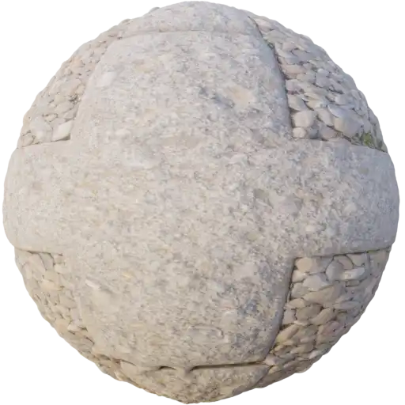

|

**This material is contained in the following Exapacks:**

    - XTRPbr_05k_Vol_001

    - XTRPbr_1k_Vol_001

    - XTRPbr_2k_Vol_003

------------------------------------------------------------------------------------------------------------------------

Pavers Grid 008
***************

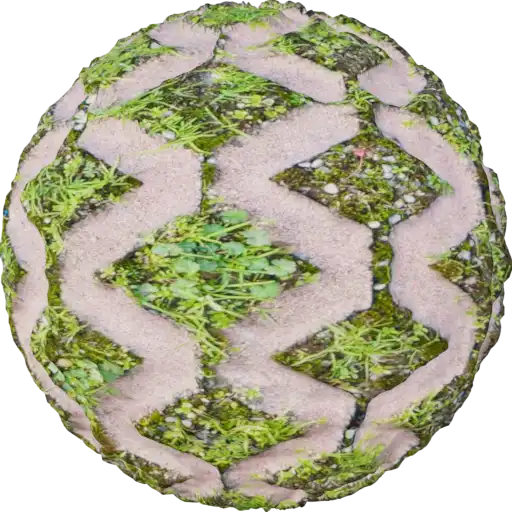

|

**This material is contained in the following Exapacks:**

    - XTRPbr_05k_Vol_001

    - XTRPbr_1k_Vol_001

    - XTRPbr_2k_Vol_003

    - XTRPbr_4k_Vol_009

------------------------------------------------------------------------------------------------------------------------

Pavers - Herringbone (Category)
-------------------------------

Herringbone Bricks Pavers 001
*****************************

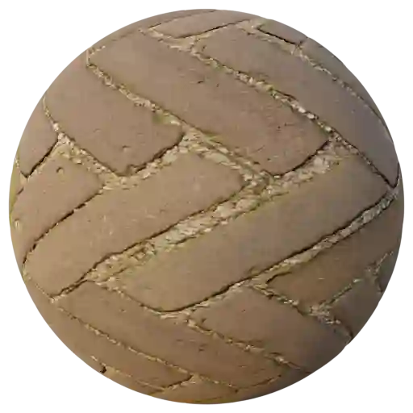

|

**This material is contained in the following Exapacks:**

    - XTRPbr_05k_Vol_001

    - XTRPbr_1k_Vol_001

    - XTRPbr_2k_Vol_003

    - XTRPbr_4k_Vol_009

    - XTRPbr_8k_Vol_014

------------------------------------------------------------------------------------------------------------------------

Herringbone Bricks Pavers 002
*****************************

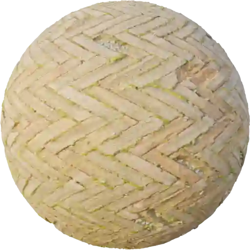

|

**This material is contained in the following Exapacks:**

    - XTRPbr_05k_Vol_001

    - XTRPbr_1k_Vol_001

    - XTRPbr_2k_Vol_003

    - XTRPbr_4k_Vol_009

    - XTRPbr_8k_Vol_014

------------------------------------------------------------------------------------------------------------------------

Herringbone Brown Pavers 001
****************************

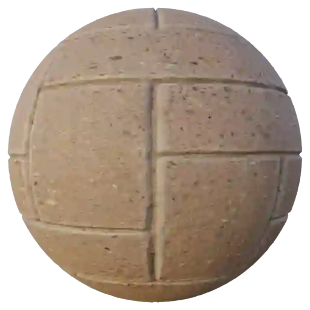

|

**This material is contained in the following Exapacks:**

    - XTRPbr_05k_Vol_001

    - XTRPbr_1k_Vol_001

    - XTRPbr_2k_Vol_003

    - XTRPbr_4k_Vol_009

------------------------------------------------------------------------------------------------------------------------

Herringbone Grey Pavers 001
***************************

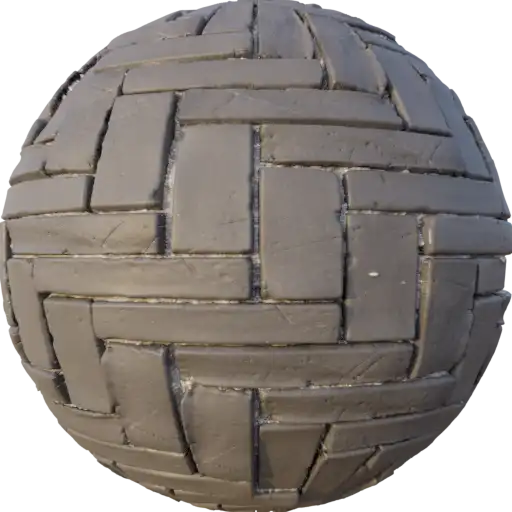

|

**This material is contained in the following Exapacks:**

    - XTRPbr_05k_Vol_001

    - XTRPbr_1k_Vol_001

    - XTRPbr_2k_Vol_003

    - XTRPbr_4k_Vol_009

    - XTRPbr_8k_Vol_014

------------------------------------------------------------------------------------------------------------------------

Herringbone Grey Pavers 002
***************************

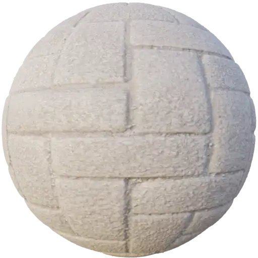

|

**This material is contained in the following Exapacks:**

    - XTRPbr_05k_Vol_001

    - XTRPbr_1k_Vol_001

    - XTRPbr_2k_Vol_003

    - XTRPbr_4k_Vol_009

    - XTRPbr_8k_Vol_014

------------------------------------------------------------------------------------------------------------------------

Herringbone Grey Pavers 003
***************************

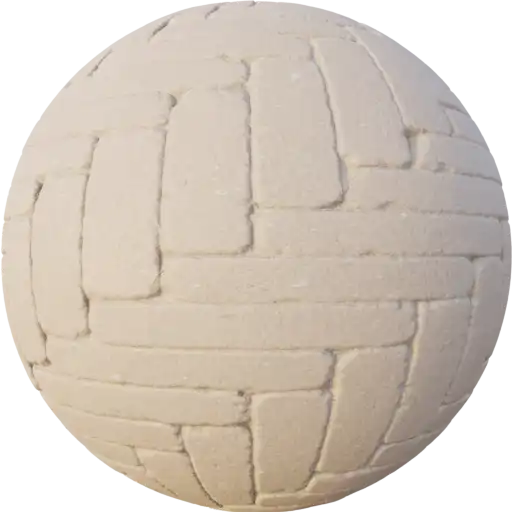

|

**This material is contained in the following Exapacks:**

    - XTRPbr_05k_Vol_001

    - XTRPbr_1k_Vol_001

    - XTRPbr_2k_Vol_003

    - XTRPbr_4k_Vol_009

    - XTRPbr_8k_Vol_014

------------------------------------------------------------------------------------------------------------------------

Herringbone Grey Pavers 004
***************************

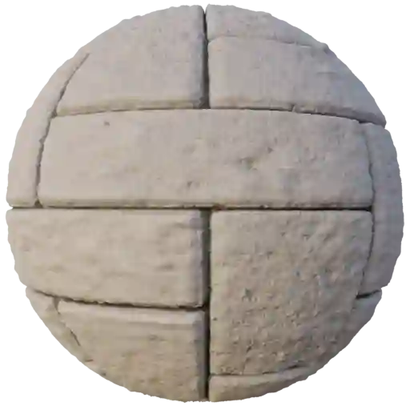

|

**This material is contained in the following Exapacks:**

    - XTRPbr_05k_Vol_001

    - XTRPbr_1k_Vol_001

    - XTRPbr_2k_Vol_003

    - XTRPbr_4k_Vol_009

------------------------------------------------------------------------------------------------------------------------

Herringbone Grey Pavers 005
***************************

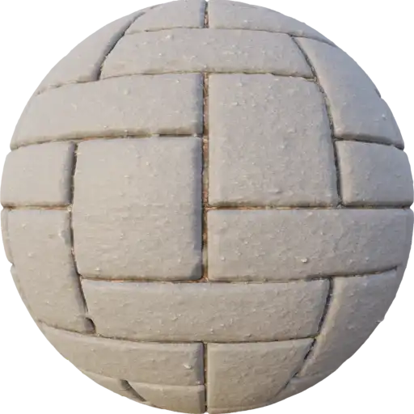

|

**This material is contained in the following Exapacks:**

    - XTRPbr_05k_Vol_001

    - XTRPbr_1k_Vol_001

    - XTRPbr_2k_Vol_003

    - XTRPbr_4k_Vol_009

    - XTRPbr_8k_Vol_014

------------------------------------------------------------------------------------------------------------------------

Herringbone Grey Pavers 006
***************************

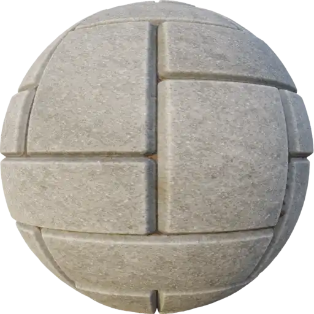

|

**This material is contained in the following Exapacks:**

    - XTRPbr_05k_Vol_001

    - XTRPbr_1k_Vol_001

    - XTRPbr_2k_Vol_003

    - XTRPbr_4k_Vol_009

    - XTRPbr_8k_Vol_014

------------------------------------------------------------------------------------------------------------------------

Herringbone Grey Pavers 007
***************************

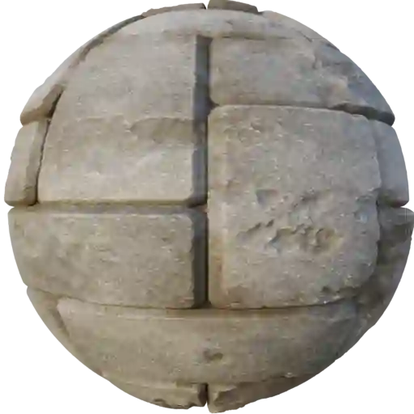

|

**This material is contained in the following Exapacks:**

    - XTRPbr_05k_Vol_001

    - XTRPbr_1k_Vol_001

    - XTRPbr_2k_Vol_003

    - XTRPbr_4k_Vol_009

    - XTRPbr_8k_Vol_014

------------------------------------------------------------------------------------------------------------------------

Herringbone Grey Pavers 010
***************************

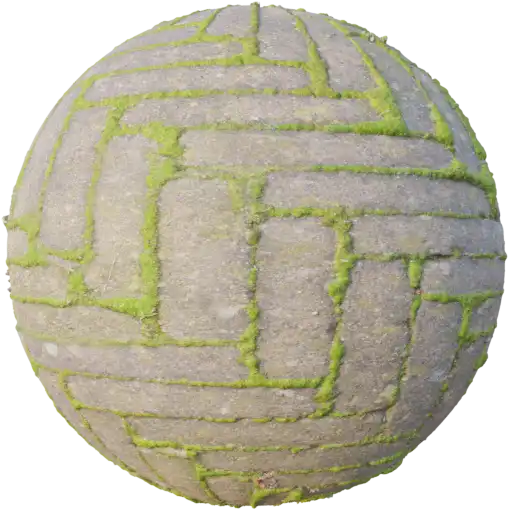

|

**This material is contained in the following Exapacks:**

    - XTRPbr_05k_Vol_001

    - XTRPbr_1k_Vol_001

    - XTRPbr_2k_Vol_003

    - XTRPbr_4k_Vol_009

    - XTRPbr_8k_Vol_014

------------------------------------------------------------------------------------------------------------------------

Herringbone Red Pavers 001
**************************

.. image:: _static/_images/material_list/pavers_herringbone/herringbone_red_pavers_001/herringbone_red_pavers_001.webp
    :width: 30%
    :align: center
    :alt: Herringbone Red Pavers 001

|

**This material is contained in the following Exapacks:**

    - XTRPbr_05k_Vol_001

    - XTRPbr_1k_Vol_001

    - XTRPbr_2k_Vol_003

    - XTRPbr_4k_Vol_009

    - XTRPbr_8k_Vol_014

------------------------------------------------------------------------------------------------------------------------

Herringbone Red Pavers 002
**************************

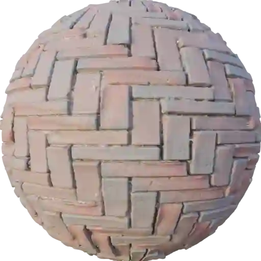

|

**This material is contained in the following Exapacks:**

    - XTRPbr_05k_Vol_001

    - XTRPbr_1k_Vol_001

    - XTRPbr_2k_Vol_003

    - XTRPbr_4k_Vol_009

    - XTRPbr_8k_Vol_014

------------------------------------------------------------------------------------------------------------------------

Herringbone Red Pavers 004
**************************

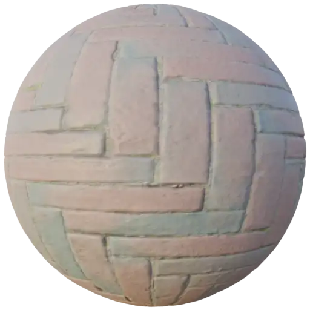

|

**This material is contained in the following Exapacks:**

    - XTRPbr_05k_Vol_001

    - XTRPbr_1k_Vol_001

    - XTRPbr_2k_Vol_003

    - XTRPbr_4k_Vol_009

    - XTRPbr_8k_Vol_014

------------------------------------------------------------------------------------------------------------------------

Herringbone Red Pavers 005
**************************

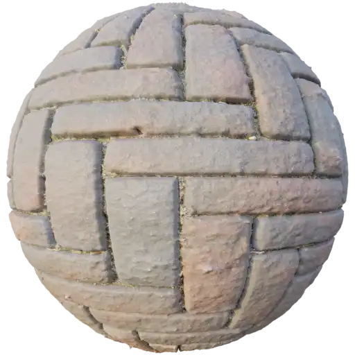

|

**This material is contained in the following Exapacks:**

    - XTRPbr_05k_Vol_001

    - XTRPbr_1k_Vol_001

    - XTRPbr_2k_Vol_003

    - XTRPbr_4k_Vol_009

    - XTRPbr_8k_Vol_014

------------------------------------------------------------------------------------------------------------------------

Herringbone Red Pavers 006
**************************

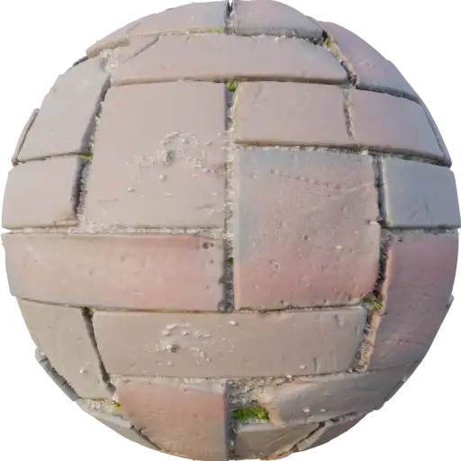

|

**This material is contained in the following Exapacks:**

    - XTRPbr_05k_Vol_001

    - XTRPbr_1k_Vol_001

    - XTRPbr_2k_Vol_003

    - XTRPbr_4k_Vol_009

    - XTRPbr_8k_Vol_014

------------------------------------------------------------------------------------------------------------------------

Herringbone Red Pavers 007
**************************

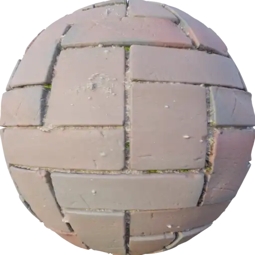

|

**This material is contained in the following Exapacks:**

    - XTRPbr_05k_Vol_001

    - XTRPbr_1k_Vol_001

    - XTRPbr_2k_Vol_003

    - XTRPbr_4k_Vol_009

    - XTRPbr_8k_Vol_014

------------------------------------------------------------------------------------------------------------------------

Herringbone Red Pavers 008
**************************

.. image:: _static/_images/material_list/pavers_herringbone/herringbone_red_pavers_008/herringbone_red_pavers_008.webp
    :width: 30%
    :align: center
    :alt: Herringbone Red Pavers 008

|

**This material is contained in the following Exapacks:**

    - XTRPbr_05k_Vol_001

    - XTRPbr_1k_Vol_001

    - XTRPbr_2k_Vol_003

    - XTRPbr_4k_Vol_009

------------------------------------------------------------------------------------------------------------------------

Herringbone Z_Zag Pavers 001
****************************

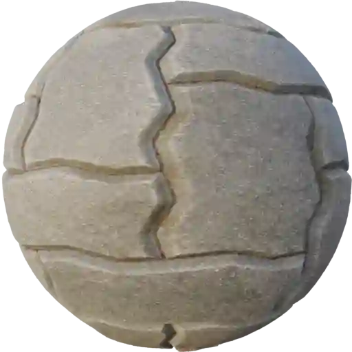

|

**This material is contained in the following Exapacks:**

    - XTRPbr_05k_Vol_001

    - XTRPbr_1k_Vol_001

    - XTRPbr_2k_Vol_003

    - XTRPbr_4k_Vol_009

    - XTRPbr_8k_Vol_014

------------------------------------------------------------------------------------------------------------------------

Herringbone Z_Zag Pavers 002
****************************

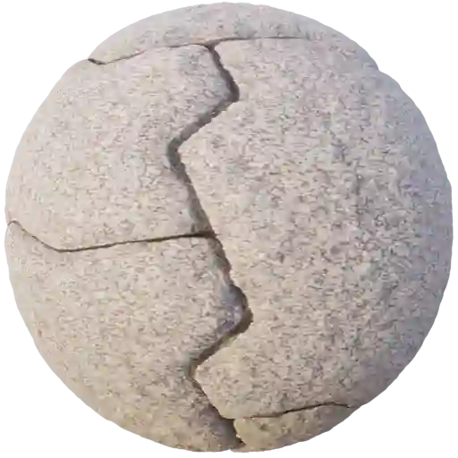

|

**This material is contained in the following Exapacks:**

    - XTRPbr_05k_Vol_001

    - XTRPbr_1k_Vol_001

    - XTRPbr_2k_Vol_003

------------------------------------------------------------------------------------------------------------------------

Herringbone Z_Zag Pavers 003
****************************

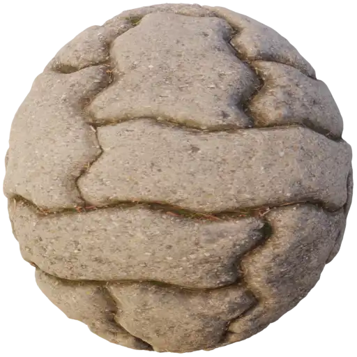

|

**This material is contained in the following Exapacks:**

    - XTRPbr_05k_Vol_001

    - XTRPbr_1k_Vol_001

    - XTRPbr_2k_Vol_003

    - XTRPbr_4k_Vol_009

------------------------------------------------------------------------------------------------------------------------

Herringbone Z_Zag Pavers 004
****************************

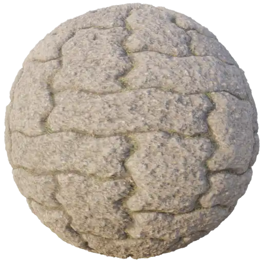

|

**This material is contained in the following Exapacks:**

    - XTRPbr_05k_Vol_001

    - XTRPbr_1k_Vol_001

    - XTRPbr_2k_Vol_003

    - XTRPbr_4k_Vol_009

------------------------------------------------------------------------------------------------------------------------

Pavers - Offset (Category)
--------------------------

I_Shape Grey Pavers 001
***********************

.. image:: _static/_images/material_list/pavers_offset/i_shape_grey_pavers_001/i_shape_grey_pavers_001.webp
    :width: 30%
    :align: center
    :alt: I_Shape Grey Pavers 001

|

**This material is contained in the following Exapacks:**

    - XTRPbr_05k_Vol_001

    - XTRPbr_1k_Vol_001

    - XTRPbr_2k_Vol_003

    - XTRPbr_4k_Vol_009

------------------------------------------------------------------------------------------------------------------------

I_Shape Grey Pavers 002
***********************

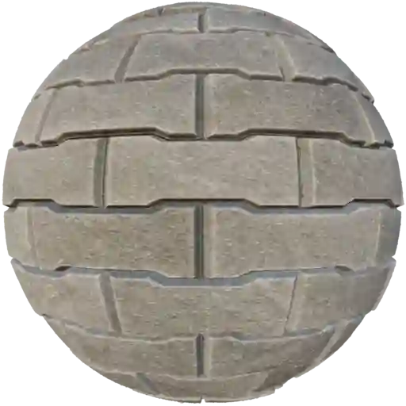

|

**This material is contained in the following Exapacks:**

    - XTRPbr_05k_Vol_001

    - XTRPbr_1k_Vol_001

    - XTRPbr_2k_Vol_003

    - XTRPbr_4k_Vol_009

    - XTRPbr_8k_Vol_014

------------------------------------------------------------------------------------------------------------------------

I_Shape Grey Pavers 003
***********************

.. image:: _static/_images/material_list/pavers_offset/i_shape_grey_pavers_003/i_shape_grey_pavers_003.webp
    :width: 30%
    :align: center
    :alt: I_Shape Grey Pavers 003

|

**This material is contained in the following Exapacks:**

    - XTRPbr_05k_Vol_001

    - XTRPbr_1k_Vol_001

    - XTRPbr_2k_Vol_003

------------------------------------------------------------------------------------------------------------------------

I_Shape Grey Pavers 004
***********************

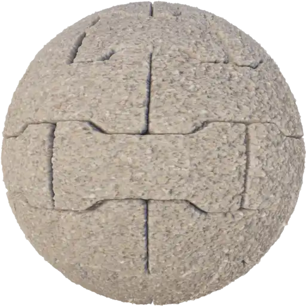

|

**This material is contained in the following Exapacks:**

    - XTRPbr_05k_Vol_001

    - XTRPbr_1k_Vol_001

    - XTRPbr_2k_Vol_003

------------------------------------------------------------------------------------------------------------------------

I_Shape Grey Pavers 005
***********************

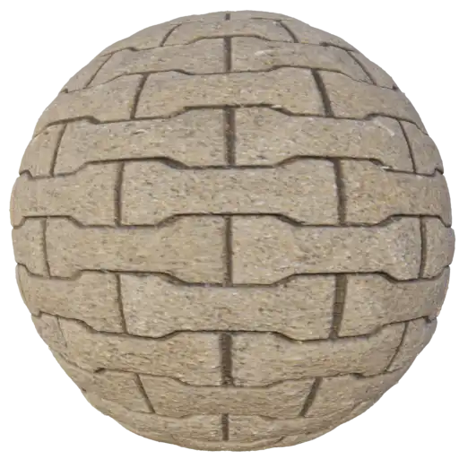

|

**This material is contained in the following Exapacks:**

    - XTRPbr_05k_Vol_001

    - XTRPbr_1k_Vol_001

    - XTRPbr_2k_Vol_003

    - XTRPbr_4k_Vol_009

    - XTRPbr_8k_Vol_014

------------------------------------------------------------------------------------------------------------------------

I_Shape Red Pavers 001
**********************

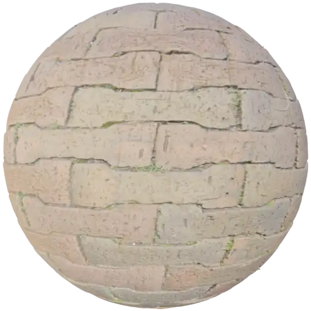

|

**This material is contained in the following Exapacks:**

    - XTRPbr_05k_Vol_001

    - XTRPbr_1k_Vol_001

    - XTRPbr_2k_Vol_003

    - XTRPbr_4k_Vol_009

    - XTRPbr_8k_Vol_014

------------------------------------------------------------------------------------------------------------------------

Offset Bricks Pavers 001
************************

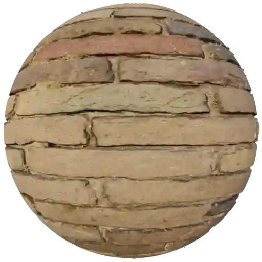

|

**This material is contained in the following Exapacks:**

    - XTRPbr_05k_Vol_001

    - XTRPbr_1k_Vol_001

    - XTRPbr_2k_Vol_003

    - XTRPbr_4k_Vol_009

    - XTRPbr_8k_Vol_014

------------------------------------------------------------------------------------------------------------------------

Offset Bricks Pavers 002
************************

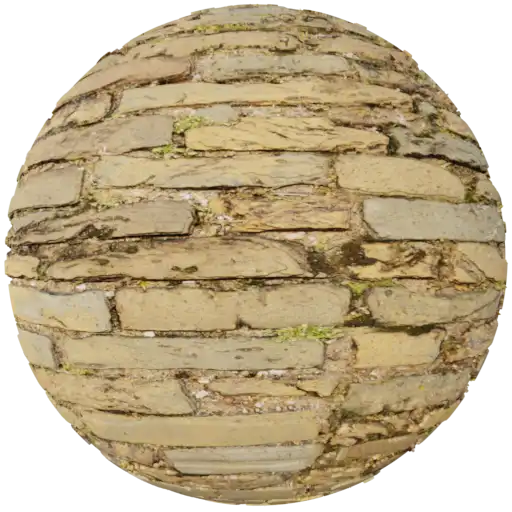

|

**This material is contained in the following Exapacks:**

    - XTRPbr_05k_Vol_001

    - XTRPbr_1k_Vol_001

    - XTRPbr_2k_Vol_003

    - XTRPbr_4k_Vol_009

    - XTRPbr_8k_Vol_014

------------------------------------------------------------------------------------------------------------------------

Offset Grey Pavers 001
**********************

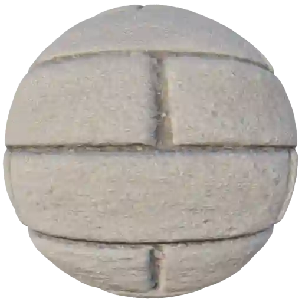

|

**This material is contained in the following Exapacks:**

    - XTRPbr_05k_Vol_001

    - XTRPbr_1k_Vol_001

    - XTRPbr_2k_Vol_003

    - XTRPbr_4k_Vol_009

    - XTRPbr_8k_Vol_014

------------------------------------------------------------------------------------------------------------------------

Offset Grey Pavers 002
**********************

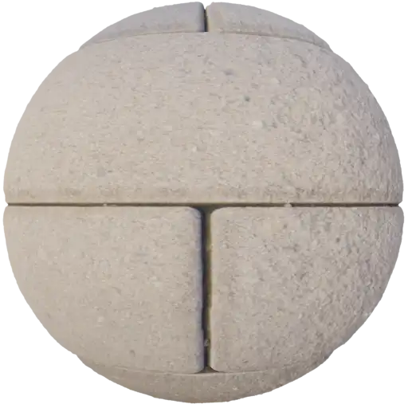

|

**This material is contained in the following Exapacks:**

    - XTRPbr_05k_Vol_001

    - XTRPbr_1k_Vol_001

    - XTRPbr_2k_Vol_003

------------------------------------------------------------------------------------------------------------------------

Offset Grey Pavers 003
**********************

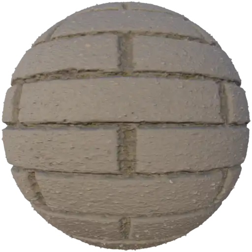

|

**This material is contained in the following Exapacks:**

    - XTRPbr_05k_Vol_001

    - XTRPbr_1k_Vol_001

    - XTRPbr_2k_Vol_003

    - XTRPbr_4k_Vol_009

    - XTRPbr_8k_Vol_014

------------------------------------------------------------------------------------------------------------------------

Offset Grey Pavers 004
**********************

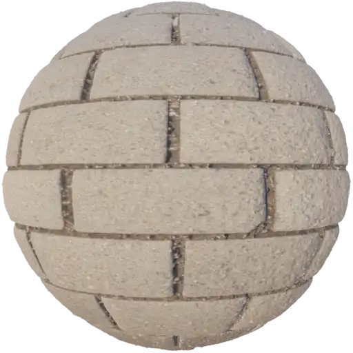

|

**This material is contained in the following Exapacks:**

    - XTRPbr_05k_Vol_001

    - XTRPbr_1k_Vol_001

    - XTRPbr_2k_Vol_003

    - XTRPbr_4k_Vol_009

------------------------------------------------------------------------------------------------------------------------

Offset Grey Pavers 005
**********************

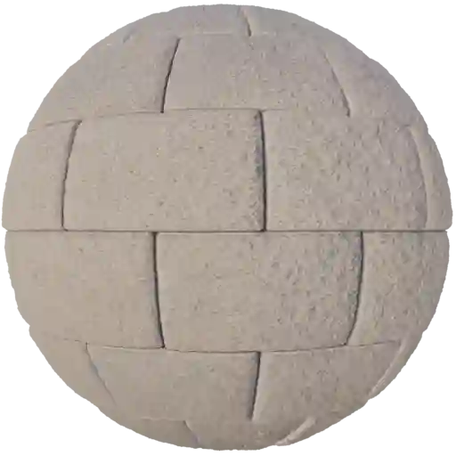

|

**This material is contained in the following Exapacks:**

    - XTRPbr_05k_Vol_001

    - XTRPbr_1k_Vol_001

    - XTRPbr_2k_Vol_003

------------------------------------------------------------------------------------------------------------------------

Offset Grey Pavers 006
**********************

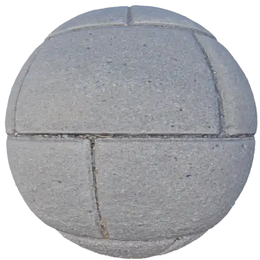

|

**This material is contained in the following Exapacks:**

    - XTRPbr_05k_Vol_001

    - XTRPbr_1k_Vol_001

    - XTRPbr_2k_Vol_003

    - XTRPbr_4k_Vol_009

    - XTRPbr_8k_Vol_014

------------------------------------------------------------------------------------------------------------------------

Offset Grey Pavers 007
**********************

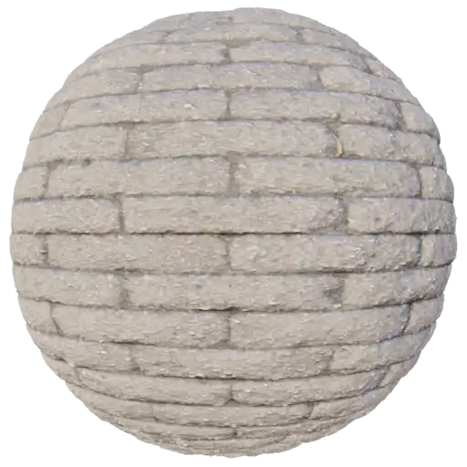

|

**This material is contained in the following Exapacks:**

    - XTRPbr_05k_Vol_001

    - XTRPbr_1k_Vol_001

    - XTRPbr_2k_Vol_003

    - XTRPbr_4k_Vol_009

    - XTRPbr_8k_Vol_014

    - XTRPbr_8k_Vol_024

------------------------------------------------------------------------------------------------------------------------

Offset Grey Pavers 008
**********************

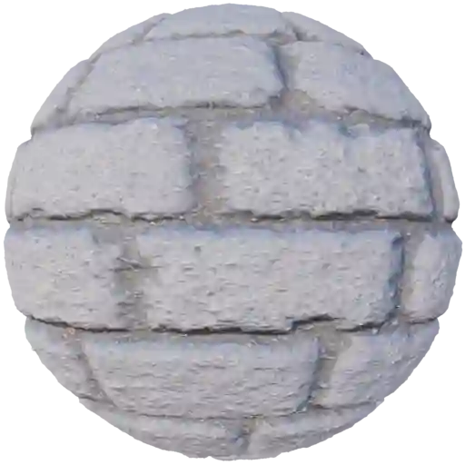

|

**This material is contained in the following Exapacks:**

    - XTRPbr_05k_Vol_001

    - XTRPbr_1k_Vol_001

    - XTRPbr_2k_Vol_003

    - XTRPbr_4k_Vol_009

    - XTRPbr_8k_Vol_024

------------------------------------------------------------------------------------------------------------------------

Offset Grey Pavers 009
**********************

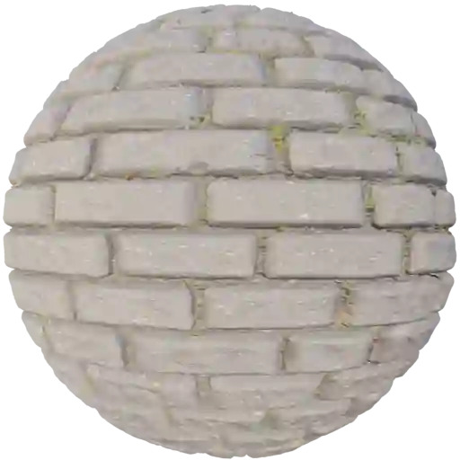

|

**This material is contained in the following Exapacks:**

    - XTRPbr_05k_Vol_001

    - XTRPbr_1k_Vol_001

    - XTRPbr_2k_Vol_003

    - XTRPbr_4k_Vol_009

    - XTRPbr_8k_Vol_024

------------------------------------------------------------------------------------------------------------------------

Offset Grey Pavers 010
**********************

.. image:: _static/_images/material_list/pavers_offset/offset_grey_pavers_010/offset_grey_pavers_010.webp
    :width: 30%
    :align: center
    :alt: Offset Grey Pavers 010

|

**This material is contained in the following Exapacks:**

    - XTRPbr_05k_Vol_001

    - XTRPbr_1k_Vol_001

    - XTRPbr_2k_Vol_003

    - XTRPbr_4k_Vol_009

    - XTRPbr_8k_Vol_024

------------------------------------------------------------------------------------------------------------------------

Offset Grey Pavers 011
**********************

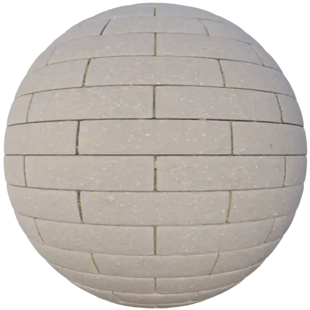

|

**This material is contained in the following Exapacks:**

    - XTRPbr_05k_Vol_001

    - XTRPbr_1k_Vol_001

    - XTRPbr_2k_Vol_003

    - XTRPbr_4k_Vol_009

    - XTRPbr_8k_Vol_024

------------------------------------------------------------------------------------------------------------------------

Offset Grey Pavers 012
**********************

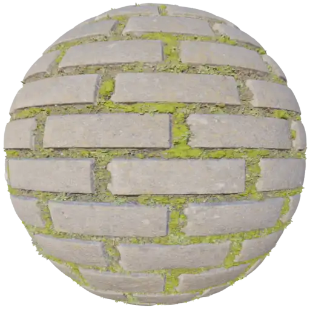

|

**This material is contained in the following Exapacks:**

    - XTRPbr_05k_Vol_001

    - XTRPbr_1k_Vol_001

    - XTRPbr_2k_Vol_003

    - XTRPbr_4k_Vol_009

    - XTRPbr_8k_Vol_024

------------------------------------------------------------------------------------------------------------------------

Offset Grey Pavers 013
**********************

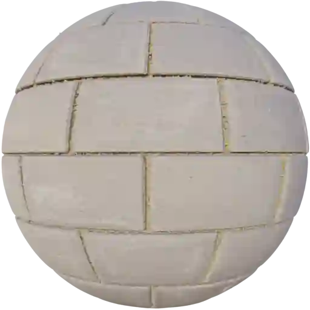

|

**This material is contained in the following Exapacks:**

    - XTRPbr_05k_Vol_001

    - XTRPbr_1k_Vol_001

    - XTRPbr_2k_Vol_003

    - XTRPbr_4k_Vol_009

    - XTRPbr_8k_Vol_024

------------------------------------------------------------------------------------------------------------------------

Offset Grey Pavers 014
**********************

.. image:: _static/_images/material_list/pavers_offset/offset_grey_pavers_014/offset_grey_pavers_014.webp
    :width: 30%
    :align: center
    :alt: Offset Grey Pavers 014

|

**This material is contained in the following Exapacks:**

    - XTRPbr_05k_Vol_001

    - XTRPbr_1k_Vol_001

    - XTRPbr_2k_Vol_003

    - XTRPbr_4k_Vol_009

    - XTRPbr_8k_Vol_024

------------------------------------------------------------------------------------------------------------------------

Offset Grey Pavers 015
**********************

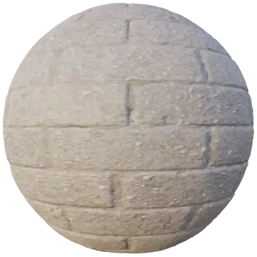

|

**This material is contained in the following Exapacks:**

    - XTRPbr_05k_Vol_001

    - XTRPbr_1k_Vol_001

    - XTRPbr_2k_Vol_003

    - XTRPbr_4k_Vol_009

    - XTRPbr_8k_Vol_024

------------------------------------------------------------------------------------------------------------------------

Offset Red Pavers 001
*********************

.. image:: _static/_images/material_list/pavers_offset/offset_red_pavers_001/offset_red_pavers_001.webp
    :width: 30%
    :align: center
    :alt: Offset Red Pavers 001

|

**This material is contained in the following Exapacks:**

    - XTRPbr_05k_Vol_001

    - XTRPbr_1k_Vol_001

    - XTRPbr_2k_Vol_003

    - XTRPbr_4k_Vol_009

    - XTRPbr_8k_Vol_024

------------------------------------------------------------------------------------------------------------------------

Offset Red Pavers 002
*********************

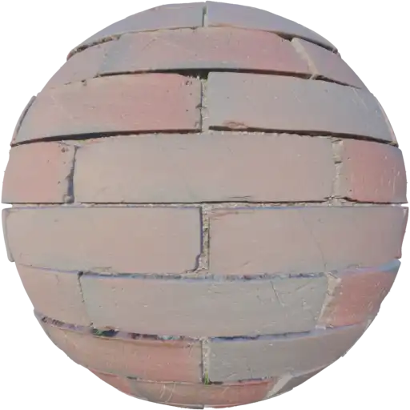

|

**This material is contained in the following Exapacks:**

    - XTRPbr_05k_Vol_001

    - XTRPbr_1k_Vol_001

    - XTRPbr_2k_Vol_003

    - XTRPbr_4k_Vol_009

    - XTRPbr_8k_Vol_024

------------------------------------------------------------------------------------------------------------------------

Offset Red Pavers 003
*********************

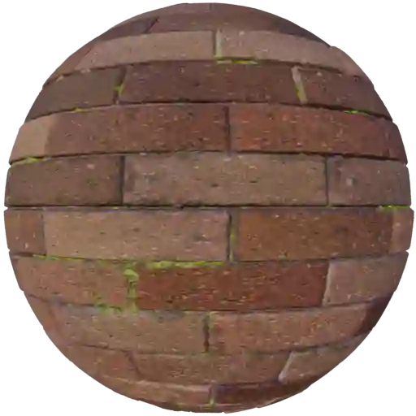

|

**This material is contained in the following Exapacks:**

    - XTRPbr_05k_Vol_001

    - XTRPbr_1k_Vol_001

    - XTRPbr_2k_Vol_003

    - XTRPbr_4k_Vol_009

    - XTRPbr_8k_Vol_024

------------------------------------------------------------------------------------------------------------------------

Offset Red Pavers 004
*********************

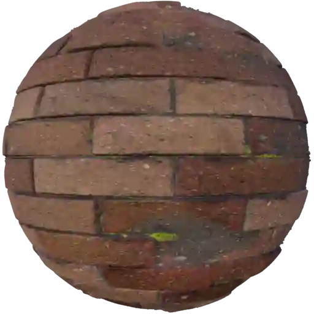

|

**This material is contained in the following Exapacks:**

    - XTRPbr_05k_Vol_001

    - XTRPbr_1k_Vol_001

    - XTRPbr_2k_Vol_003

    - XTRPbr_4k_Vol_009

    - XTRPbr_8k_Vol_024

------------------------------------------------------------------------------------------------------------------------

Offset Red Pavers 005
*********************

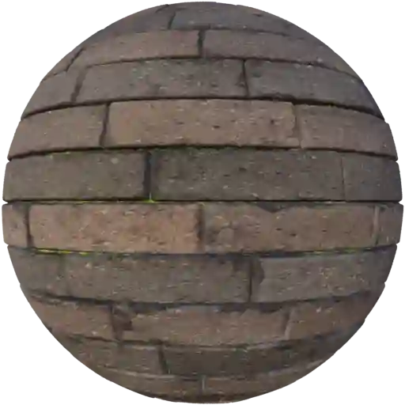

|

**This material is contained in the following Exapacks:**

    - XTRPbr_05k_Vol_001

    - XTRPbr_1k_Vol_001

    - XTRPbr_2k_Vol_003

    - XTRPbr_4k_Vol_009

    - XTRPbr_8k_Vol_024

------------------------------------------------------------------------------------------------------------------------

Offset Red Pavers 006
*********************

.. image:: _static/_images/material_list/pavers_offset/offset_red_pavers_006/offset_red_pavers_006.webp
    :width: 30%
    :align: center
    :alt: Offset Red Pavers 006

|

**This material is contained in the following Exapacks:**

    - XTRPbr_05k_Vol_001

    - XTRPbr_1k_Vol_001

    - XTRPbr_2k_Vol_003

    - XTRPbr_4k_Vol_009

    - XTRPbr_8k_Vol_024

------------------------------------------------------------------------------------------------------------------------

Offset Red Pavers 007
*********************

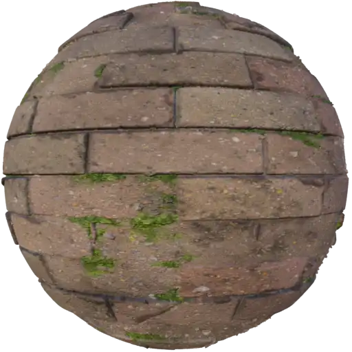

|

**This material is contained in the following Exapacks:**

    - XTRPbr_05k_Vol_001

    - XTRPbr_1k_Vol_001

    - XTRPbr_2k_Vol_003

    - XTRPbr_4k_Vol_009

    - XTRPbr_8k_Vol_024

------------------------------------------------------------------------------------------------------------------------

Offset Red Pavers 008
*********************

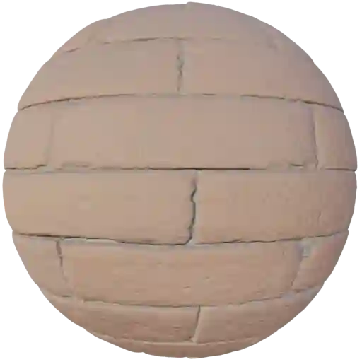

|

**This material is contained in the following Exapacks:**

    - XTRPbr_05k_Vol_001

    - XTRPbr_1k_Vol_001

    - XTRPbr_2k_Vol_003

    - XTRPbr_4k_Vol_009

    - XTRPbr_8k_Vol_024

------------------------------------------------------------------------------------------------------------------------

Offset Red Pavers 009
*********************

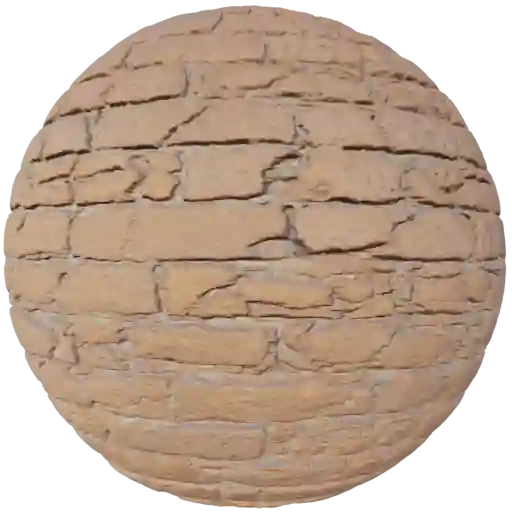

|

**This material is contained in the following Exapacks:**

    - XTRPbr_05k_Vol_001

    - XTRPbr_1k_Vol_001

    - XTRPbr_2k_Vol_003

    - XTRPbr_4k_Vol_009

    - XTRPbr_8k_Vol_024

------------------------------------------------------------------------------------------------------------------------

Offset Red Pavers 010
*********************

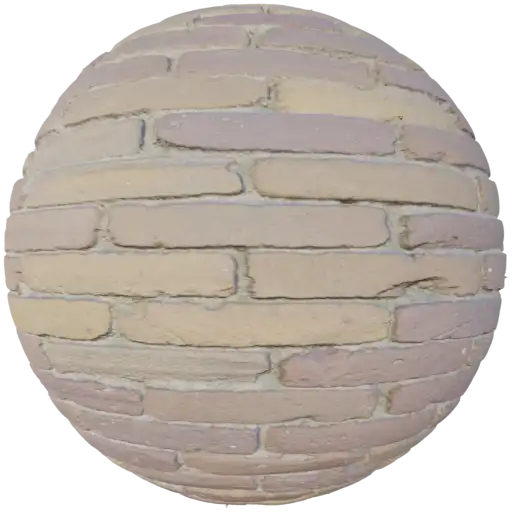

|

**This material is contained in the following Exapacks:**

    - XTRPbr_05k_Vol_001

    - XTRPbr_1k_Vol_001

    - XTRPbr_2k_Vol_003

    - XTRPbr_4k_Vol_009

    - XTRPbr_8k_Vol_024

------------------------------------------------------------------------------------------------------------------------

Offset Red Pavers 011
*********************

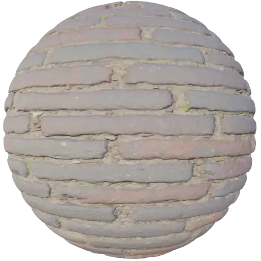

|

**This material is contained in the following Exapacks:**

    - XTRPbr_05k_Vol_001

    - XTRPbr_1k_Vol_001

    - XTRPbr_2k_Vol_002

    - XTRPbr_4k_Vol_009

    - XTRPbr_8k_Vol_024

------------------------------------------------------------------------------------------------------------------------

Offset Z_Zag Pavers 001
***********************

.. image:: _static/_images/material_list/pavers_offset/offset_z_zag_pavers_001/offset_z_zag_pavers_001.webp
    :width: 30%
    :align: center
    :alt: Offset Z_Zag Pavers 001

|

**This material is contained in the following Exapacks:**

    - XTRPbr_05k_Vol_001

    - XTRPbr_1k_Vol_001

    - XTRPbr_2k_Vol_002

    - XTRPbr_4k_Vol_009

    - XTRPbr_8k_Vol_024

------------------------------------------------------------------------------------------------------------------------

Pavers - Pattern Mix (Category)
-------------------------------

Basketweave Grey Pavers 001
***************************

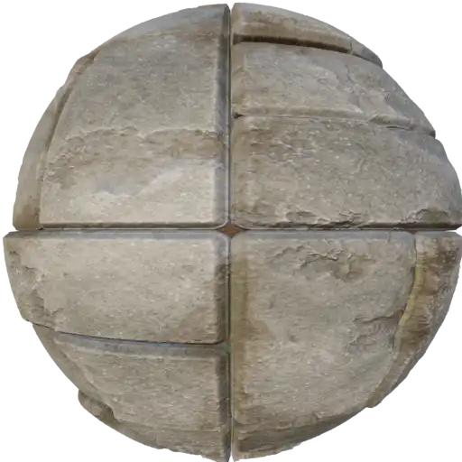

|

**This material is contained in the following Exapacks:**

    - XTRPbr_05k_Vol_001

    - XTRPbr_1k_Vol_001

    - XTRPbr_2k_Vol_002

    - XTRPbr_4k_Vol_009

    - XTRPbr_8k_Vol_024

------------------------------------------------------------------------------------------------------------------------

Basketweave Red Pavers 001
**************************

.. image:: _static/_images/material_list/pavers_pattern_mix/basketweave_red_pavers_001/basketweave_red_pavers_001.webp
    :width: 30%
    :align: center
    :alt: Basketweave Red Pavers 001

|

**This material is contained in the following Exapacks:**

    - XTRPbr_05k_Vol_001

    - XTRPbr_1k_Vol_001

    - XTRPbr_2k_Vol_002

    - XTRPbr_4k_Vol_009

    - XTRPbr_8k_Vol_024

------------------------------------------------------------------------------------------------------------------------

Basketweave Red Pavers 002
**************************

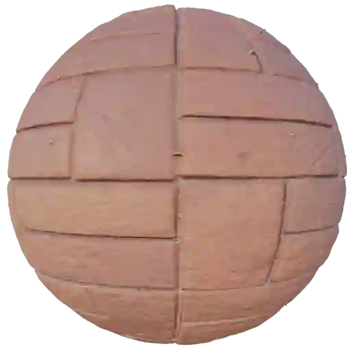

|

**This material is contained in the following Exapacks:**

    - XTRPbr_05k_Vol_001

    - XTRPbr_1k_Vol_001

    - XTRPbr_2k_Vol_002

    - XTRPbr_4k_Vol_009

    - XTRPbr_8k_Vol_024

------------------------------------------------------------------------------------------------------------------------

Basketweave Red Pavers 003
**************************

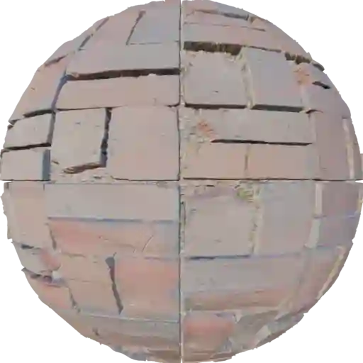

|

**This material is contained in the following Exapacks:**

    - XTRPbr_05k_Vol_001

    - XTRPbr_1k_Vol_001

    - XTRPbr_2k_Vol_002

    - XTRPbr_4k_Vol_009

    - XTRPbr_8k_Vol_024

------------------------------------------------------------------------------------------------------------------------

Basketweave Z_Zag Pavers 001
****************************

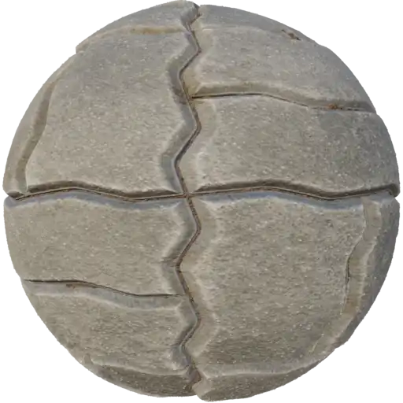

|

**This material is contained in the following Exapacks:**

    - XTRPbr_05k_Vol_001

    - XTRPbr_1k_Vol_001

    - XTRPbr_2k_Vol_002

    - XTRPbr_4k_Vol_009

    - XTRPbr_8k_Vol_024

------------------------------------------------------------------------------------------------------------------------

Basketweave Z_Zag Pavers 002
****************************

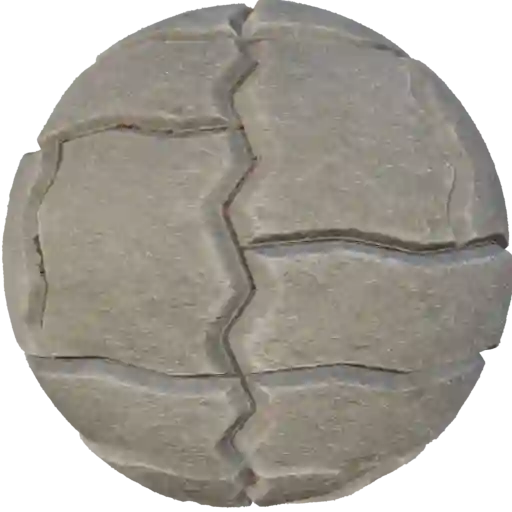

|

**This material is contained in the following Exapacks:**

    - XTRPbr_05k_Vol_001

    - XTRPbr_1k_Vol_001

    - XTRPbr_2k_Vol_002

    - XTRPbr_4k_Vol_009

    - XTRPbr_8k_Vol_024

------------------------------------------------------------------------------------------------------------------------

Hexagonal Black Pavers 001
**************************

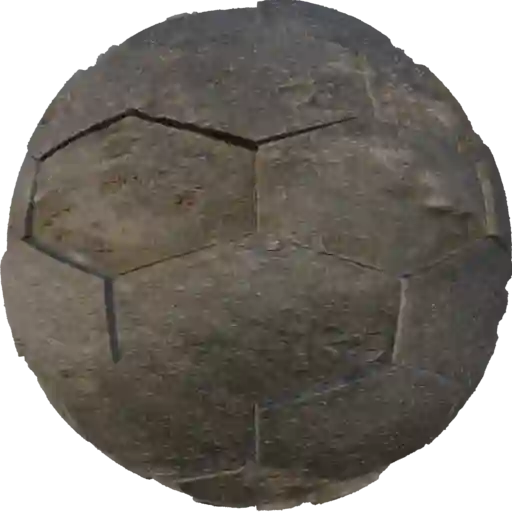

|

**This material is contained in the following Exapacks:**

    - XTRPbr_05k_Vol_001

    - XTRPbr_1k_Vol_001

    - XTRPbr_2k_Vol_002

    - XTRPbr_4k_Vol_009

    - XTRPbr_8k_Vol_018

    - XTRPbr_8k_Vol_024

------------------------------------------------------------------------------------------------------------------------

Hexagonal Grey Pavers 001
*************************

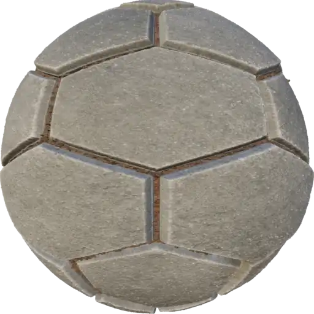

|

**This material is contained in the following Exapacks:**

    - XTRPbr_05k_Vol_001

    - XTRPbr_1k_Vol_001

    - XTRPbr_2k_Vol_002

    - XTRPbr_4k_Vol_009

    - XTRPbr_8k_Vol_018

------------------------------------------------------------------------------------------------------------------------

Octagonal Black Pavers 001
**************************

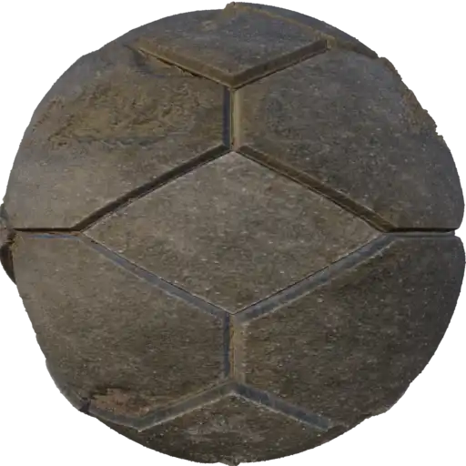

|

**This material is contained in the following Exapacks:**

    - XTRPbr_05k_Vol_001

    - XTRPbr_1k_Vol_001

    - XTRPbr_2k_Vol_002

    - XTRPbr_4k_Vol_009

    - XTRPbr_8k_Vol_018

------------------------------------------------------------------------------------------------------------------------

Octagonal Grey Pavers 001
*************************

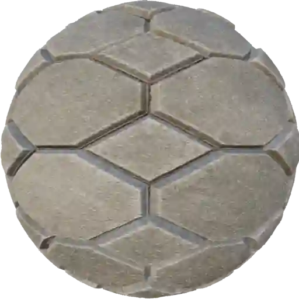

|

**This material is contained in the following Exapacks:**

    - XTRPbr_05k_Vol_001

    - XTRPbr_1k_Vol_001

    - XTRPbr_2k_Vol_002

    - XTRPbr_4k_Vol_009

    - XTRPbr_8k_Vol_018

------------------------------------------------------------------------------------------------------------------------

Paving Edge 001
***************

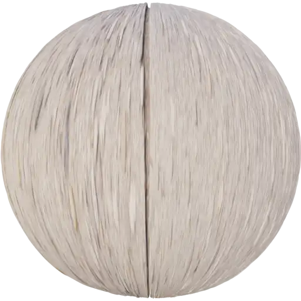

|

**This material is contained in the following Exapacks:**

    - XTRPbr_05k_Vol_001

    - XTRPbr_1k_Vol_001

    - XTRPbr_2k_Vol_002

    - XTRPbr_4k_Vol_009

    - XTRPbr_8k_Vol_018

------------------------------------------------------------------------------------------------------------------------

Random Grey Pavers 001
**********************

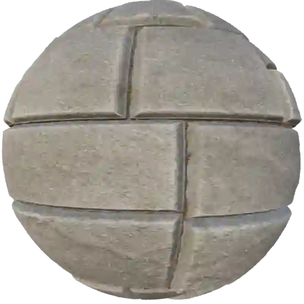

|

**This material is contained in the following Exapacks:**

    - XTRPbr_05k_Vol_001

    - XTRPbr_1k_Vol_001

    - XTRPbr_2k_Vol_002

    - XTRPbr_4k_Vol_009

    - XTRPbr_8k_Vol_018

------------------------------------------------------------------------------------------------------------------------

Random Red Pavers 001
*********************

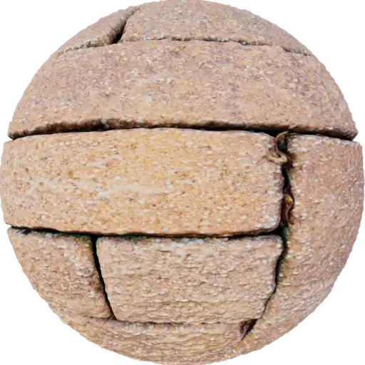

|

**This material is contained in the following Exapacks:**

    - XTRPbr_05k_Vol_001

    - XTRPbr_1k_Vol_001

    - XTRPbr_2k_Vol_002

    - XTRPbr_4k_Vol_009

------------------------------------------------------------------------------------------------------------------------

Pavers - Stone Cube (Category)
------------------------------

Cubes Cobblestone Paving 001
****************************

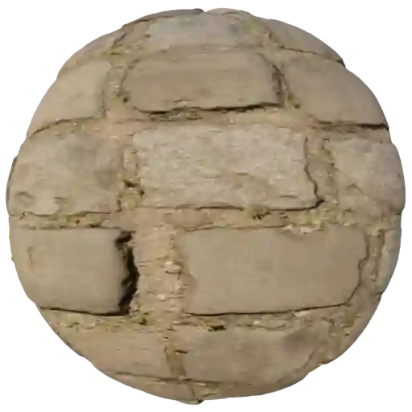

|

**This material is contained in the following Exapacks:**

    - XTRPbr_05k_Vol_001

    - XTRPbr_1k_Vol_001

    - XTRPbr_2k_Vol_002

    - XTRPbr_4k_Vol_009

    - XTRPbr_8k_Vol_018

------------------------------------------------------------------------------------------------------------------------

Cubes Cobblestone Paving 002
****************************

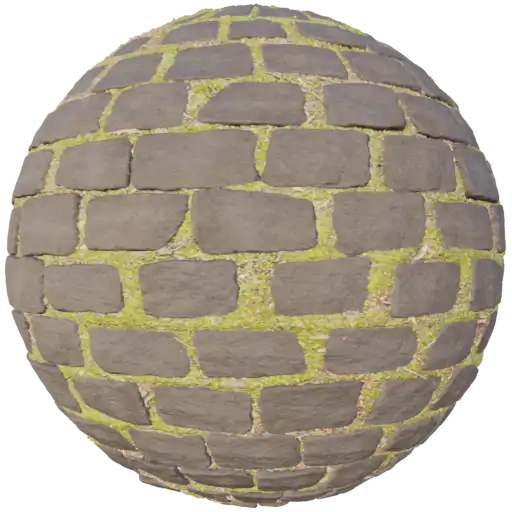

|

**This material is contained in the following Exapacks:**

    - XTRPbr_05k_Vol_001

    - XTRPbr_1k_Vol_001

    - XTRPbr_2k_Vol_002

    - XTRPbr_4k_Vol_009

    - XTRPbr_8k_Vol_018

------------------------------------------------------------------------------------------------------------------------

Cubes Cobblestone Paving 003
****************************

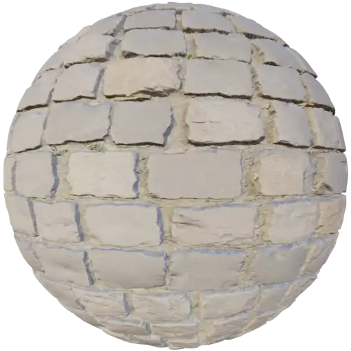

|

**This material is contained in the following Exapacks:**

    - XTRPbr_05k_Vol_001

    - XTRPbr_1k_Vol_001

    - XTRPbr_2k_Vol_002

    - XTRPbr_4k_Vol_009

    - XTRPbr_8k_Vol_018

------------------------------------------------------------------------------------------------------------------------

Cubes Cobblestone Paving 004
****************************

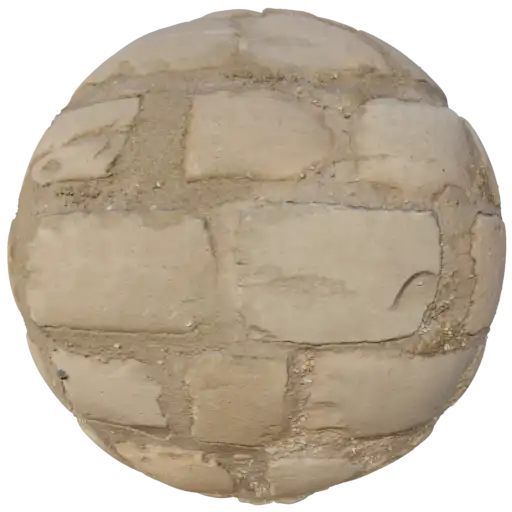

|

**This material is contained in the following Exapacks:**

    - XTRPbr_05k_Vol_001

    - XTRPbr_1k_Vol_001

    - XTRPbr_2k_Vol_002

    - XTRPbr_4k_Vol_009

    - XTRPbr_8k_Vol_018

------------------------------------------------------------------------------------------------------------------------

Cubes Cobblestone Paving 005
****************************

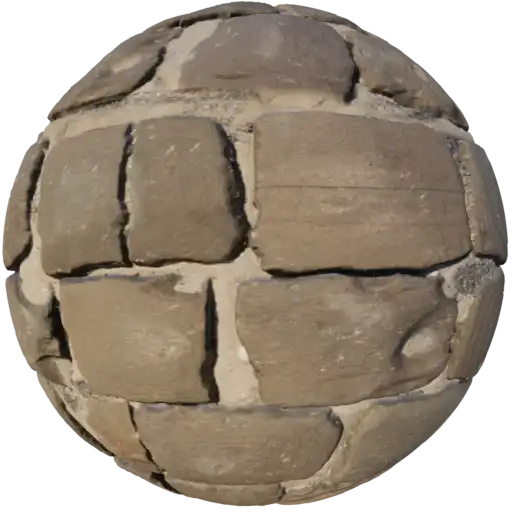

|

**This material is contained in the following Exapacks:**

    - XTRPbr_05k_Vol_001

    - XTRPbr_1k_Vol_001

    - XTRPbr_2k_Vol_002

    - XTRPbr_4k_Vol_009

    - XTRPbr_8k_Vol_018

------------------------------------------------------------------------------------------------------------------------

Cubes Cobblestone Paving 006
****************************

.. image:: _static/_images/material_list/pavers_stone_cube/cubes_cobblestone_paving_006/cubes_cobblestone_paving_006.webp
    :width: 30%
    :align: center
    :alt: Cubes Cobblestone Paving 006

|

**This material is contained in the following Exapacks:**

    - XTRPbr_05k_Vol_001

    - XTRPbr_1k_Vol_001

    - XTRPbr_2k_Vol_002

    - XTRPbr_4k_Vol_009

    - XTRPbr_8k_Vol_018

------------------------------------------------------------------------------------------------------------------------

Cubes Cobblestone Paving 007
****************************

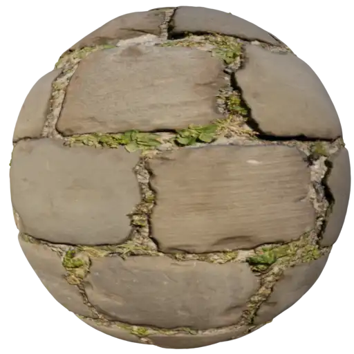

|

**This material is contained in the following Exapacks:**

    - XTRPbr_05k_Vol_001

    - XTRPbr_1k_Vol_001

    - XTRPbr_2k_Vol_002

    - XTRPbr_4k_Vol_009

    - XTRPbr_8k_Vol_018

------------------------------------------------------------------------------------------------------------------------

Cubes Cobblestone Paving 008
****************************

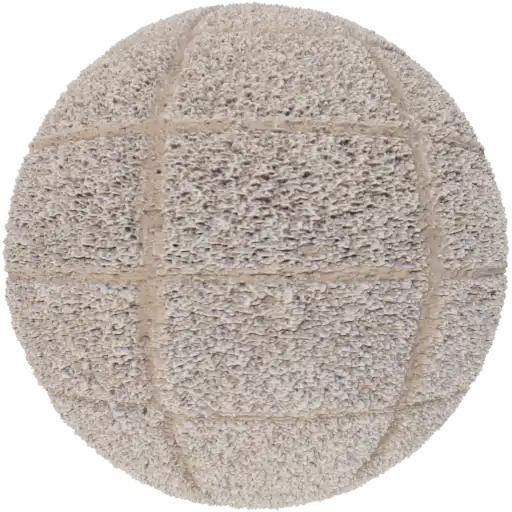

|

**This material is contained in the following Exapacks:**

    - XTRPbr_05k_Vol_001

    - XTRPbr_1k_Vol_001

    - XTRPbr_2k_Vol_002

    - XTRPbr_4k_Vol_009

------------------------------------------------------------------------------------------------------------------------

Cubes Cobblestone Paving 009
****************************

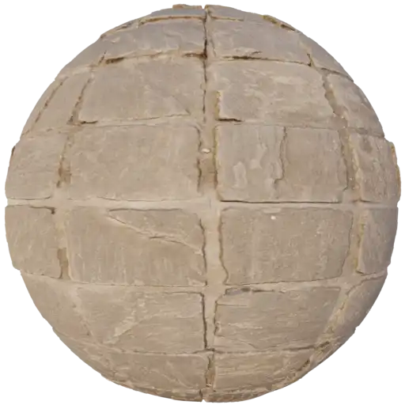

|

**This material is contained in the following Exapacks:**

    - XTRPbr_05k_Vol_001

    - XTRPbr_1k_Vol_001

    - XTRPbr_2k_Vol_002

    - XTRPbr_4k_Vol_009

    - XTRPbr_8k_Vol_018

------------------------------------------------------------------------------------------------------------------------

Cubes Cobblestone Paving 010
****************************

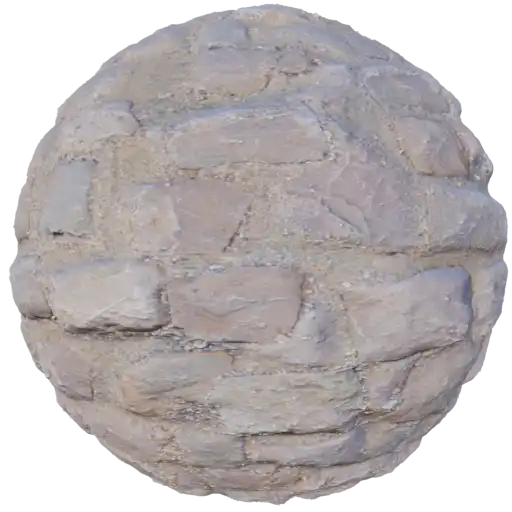

|

**This material is contained in the following Exapacks:**

    - XTRPbr_05k_Vol_001

    - XTRPbr_1k_Vol_001

    - XTRPbr_2k_Vol_002

    - XTRPbr_4k_Vol_009

    - XTRPbr_8k_Vol_018

------------------------------------------------------------------------------------------------------------------------

Cubes Cobblestone Paving 011
****************************

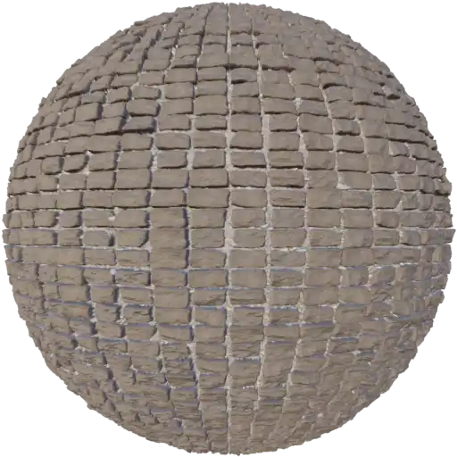

|

**This material is contained in the following Exapacks:**

    - XTRPbr_05k_Vol_001

    - XTRPbr_1k_Vol_001

    - XTRPbr_2k_Vol_002

    - XTRPbr_4k_Vol_009

    - XTRPbr_8k_Vol_018

------------------------------------------------------------------------------------------------------------------------

Cubes Cobblestone Paving 012
****************************

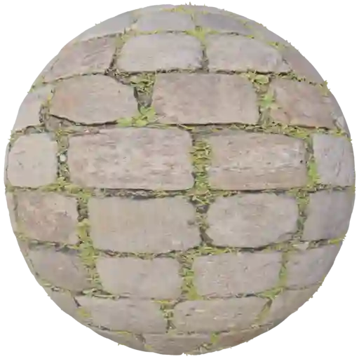

|

**This material is contained in the following Exapacks:**

    - XTRPbr_05k_Vol_001

    - XTRPbr_1k_Vol_001

    - XTRPbr_2k_Vol_002

    - XTRPbr_4k_Vol_009

    - XTRPbr_8k_Vol_018

------------------------------------------------------------------------------------------------------------------------

Cubes Cobblestone Paving 013
****************************

.. image:: _static/_images/material_list/pavers_stone_cube/cubes_cobblestone_paving_013/cubes_cobblestone_paving_013.webp
    :width: 30%
    :align: center
    :alt: Cubes Cobblestone Paving 013

|

**This material is contained in the following Exapacks:**

    - XTRPbr_05k_Vol_001

    - XTRPbr_1k_Vol_001

    - XTRPbr_2k_Vol_002

    - XTRPbr_4k_Vol_009

    - XTRPbr_8k_Vol_018

------------------------------------------------------------------------------------------------------------------------

Cubes Cobblestone Paving 014
****************************

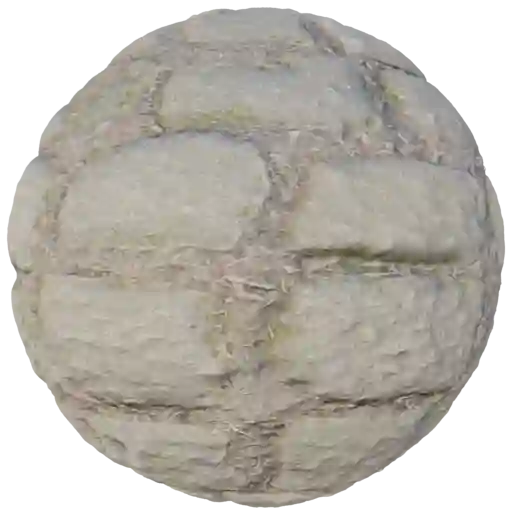

|

**This material is contained in the following Exapacks:**

    - XTRPbr_05k_Vol_001

    - XTRPbr_1k_Vol_001

    - XTRPbr_2k_Vol_002

    - XTRPbr_4k_Vol_009

    - XTRPbr_8k_Vol_018

------------------------------------------------------------------------------------------------------------------------

Cubes Cobblestone Paving 015
****************************

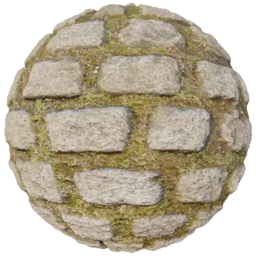

|

**This material is contained in the following Exapacks:**

    - XTRPbr_05k_Vol_001

    - XTRPbr_1k_Vol_001

    - XTRPbr_2k_Vol_002

    - XTRPbr_4k_Vol_009

    - XTRPbr_8k_Vol_018

------------------------------------------------------------------------------------------------------------------------

Cubes Cobblestone Paving 016
****************************

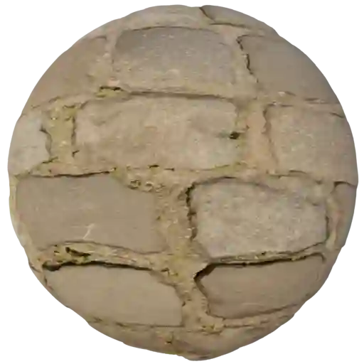

|

**This material is contained in the following Exapacks:**

    - XTRPbr_05k_Vol_001

    - XTRPbr_1k_Vol_001

    - XTRPbr_2k_Vol_002

    - XTRPbr_4k_Vol_009

    - XTRPbr_8k_Vol_018

------------------------------------------------------------------------------------------------------------------------

Cubes Cobblestone Paving 017
****************************

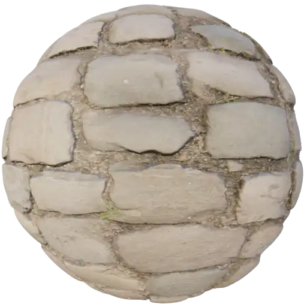

|

**This material is contained in the following Exapacks:**

    - XTRPbr_05k_Vol_001

    - XTRPbr_1k_Vol_001

    - XTRPbr_2k_Vol_002

    - XTRPbr_4k_Vol_009

    - XTRPbr_8k_Vol_018

------------------------------------------------------------------------------------------------------------------------

Cubes Cobblestone Paving 018
****************************

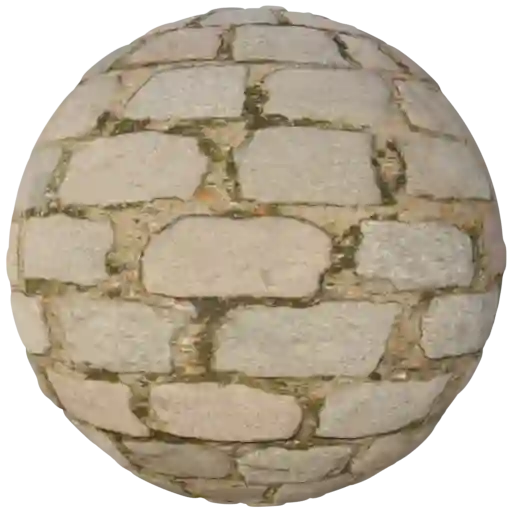

|

**This material is contained in the following Exapacks:**

    - XTRPbr_05k_Vol_001

    - XTRPbr_1k_Vol_001

    - XTRPbr_2k_Vol_002

    - XTRPbr_4k_Vol_009

    - XTRPbr_8k_Vol_018

------------------------------------------------------------------------------------------------------------------------

Cubes Cobblestone Paving 019
****************************

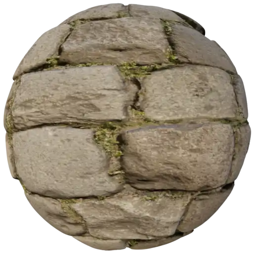

|

**This material is contained in the following Exapacks:**

    - XTRPbr_05k_Vol_001

    - XTRPbr_1k_Vol_001

    - XTRPbr_2k_Vol_002

    - XTRPbr_4k_Vol_009

    - XTRPbr_8k_Vol_018

------------------------------------------------------------------------------------------------------------------------

Cubes Cobblestone Paving 020
****************************

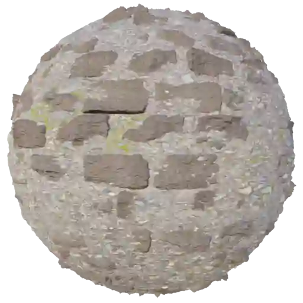

|

**This material is contained in the following Exapacks:**

    - XTRPbr_05k_Vol_001

    - XTRPbr_1k_Vol_001

    - XTRPbr_2k_Vol_002

    - XTRPbr_4k_Vol_009

    - XTRPbr_8k_Vol_018

------------------------------------------------------------------------------------------------------------------------

Fan Pattern Cbst Paving 001
***************************

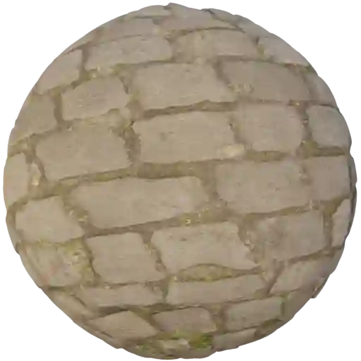

|

**This material is contained in the following Exapacks:**

    - XTRPbr_05k_Vol_001

    - XTRPbr_1k_Vol_001

    - XTRPbr_2k_Vol_002

    - XTRPbr_4k_Vol_009

    - XTRPbr_8k_Vol_018

------------------------------------------------------------------------------------------------------------------------

Fan Pattern Cbst Paving 002
***************************

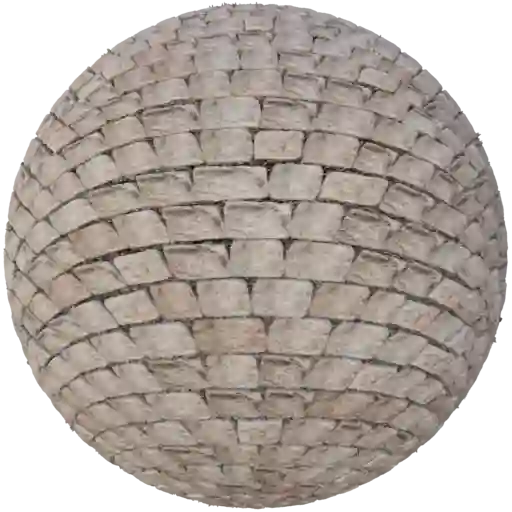

|

**This material is contained in the following Exapacks:**

    - XTRPbr_05k_Vol_001

    - XTRPbr_1k_Vol_001

    - XTRPbr_2k_Vol_002

    - XTRPbr_4k_Vol_009

    - XTRPbr_8k_Vol_018

------------------------------------------------------------------------------------------------------------------------

Fan Pattern Cbst Paving 003
***************************

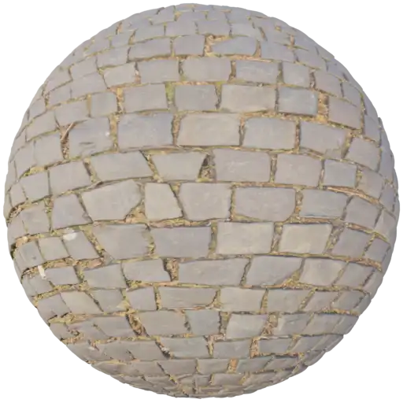

|

**This material is contained in the following Exapacks:**

    - XTRPbr_05k_Vol_001

    - XTRPbr_1k_Vol_001

    - XTRPbr_2k_Vol_002

    - XTRPbr_4k_Vol_009

    - XTRPbr_8k_Vol_018

------------------------------------------------------------------------------------------------------------------------

Fan Pattern Cbst Paving 004
***************************

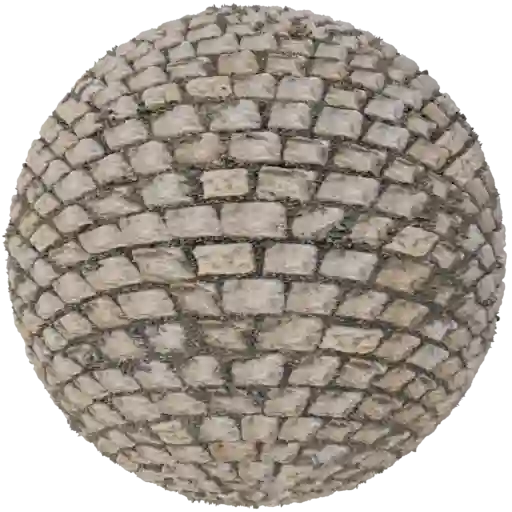

|

**This material is contained in the following Exapacks:**

    - XTRPbr_05k_Vol_001

    - XTRPbr_1k_Vol_001

    - XTRPbr_2k_Vol_002

    - XTRPbr_4k_Vol_009

    - XTRPbr_8k_Vol_018

------------------------------------------------------------------------------------------------------------------------

Fan Pattern Cbst Paving 005
***************************

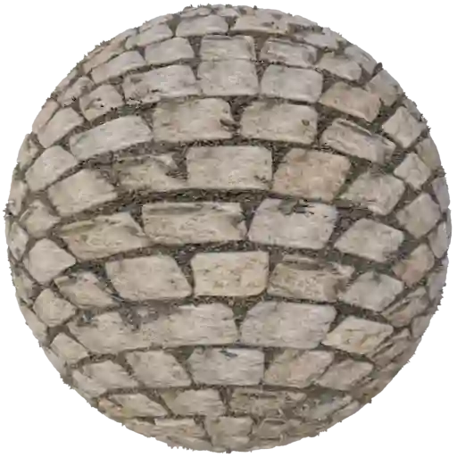

|

**This material is contained in the following Exapacks:**

    - XTRPbr_05k_Vol_001

    - XTRPbr_1k_Vol_001

    - XTRPbr_2k_Vol_002

    - XTRPbr_4k_Vol_009

    - XTRPbr_8k_Vol_018

------------------------------------------------------------------------------------------------------------------------

Fan Pattern Cbst Paving 006
***************************

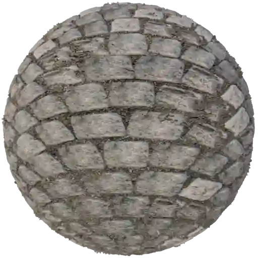

|

**This material is contained in the following Exapacks:**

    - XTRPbr_05k_Vol_001

    - XTRPbr_1k_Vol_001

    - XTRPbr_2k_Vol_002

    - XTRPbr_4k_Vol_009

    - XTRPbr_8k_Vol_018

------------------------------------------------------------------------------------------------------------------------

Fan Pattern Cbst Paving 007
***************************

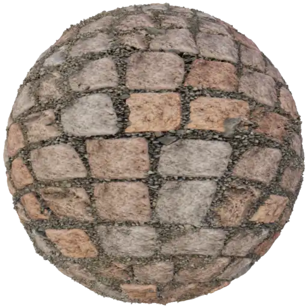

|

**This material is contained in the following Exapacks:**

    - XTRPbr_05k_Vol_001

    - XTRPbr_1k_Vol_001

    - XTRPbr_2k_Vol_002

    - XTRPbr_4k_Vol_009

    - XTRPbr_4k_Vol_010

    - XTRPbr_8k_Vol_018

------------------------------------------------------------------------------------------------------------------------

Pattern Cobblestone Paving 001
******************************

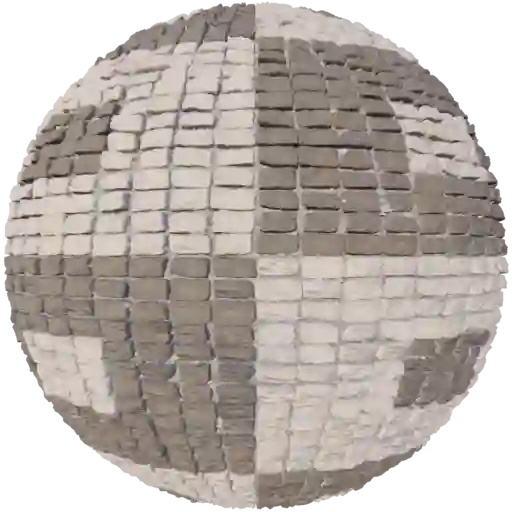

|

**This material is contained in the following Exapacks:**

    - XTRPbr_05k_Vol_001

    - XTRPbr_1k_Vol_001

    - XTRPbr_2k_Vol_002

    - XTRPbr_4k_Vol_010

    - XTRPbr_8k_Vol_012

    - XTRPbr_8k_Vol_018

------------------------------------------------------------------------------------------------------------------------

Pattern Cobblestone Paving 002
******************************

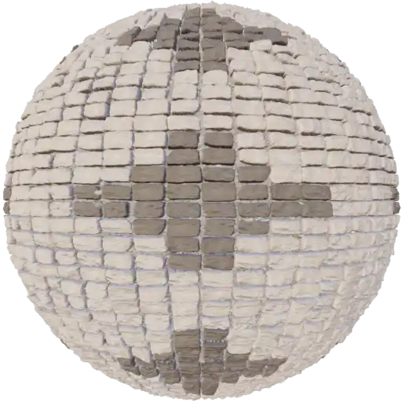

|

**This material is contained in the following Exapacks:**

    - XTRPbr_05k_Vol_001

    - XTRPbr_1k_Vol_001

    - XTRPbr_2k_Vol_002

    - XTRPbr_4k_Vol_010

    - XTRPbr_8k_Vol_012

------------------------------------------------------------------------------------------------------------------------

Pattern Cobblestone Paving 003
******************************

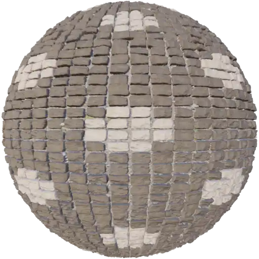

|

**This material is contained in the following Exapacks:**

    - XTRPbr_05k_Vol_001

    - XTRPbr_1k_Vol_001

    - XTRPbr_2k_Vol_002

    - XTRPbr_4k_Vol_010

    - XTRPbr_8k_Vol_012

------------------------------------------------------------------------------------------------------------------------

Pattern Cobblestone Paving 004
******************************

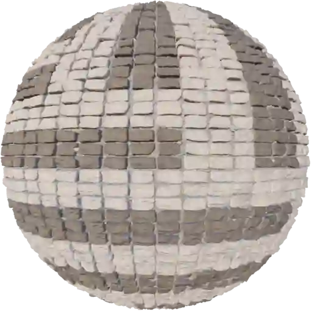

|

**This material is contained in the following Exapacks:**

    - XTRPbr_05k_Vol_001

    - XTRPbr_1k_Vol_001

    - XTRPbr_2k_Vol_002

    - XTRPbr_4k_Vol_010

    - XTRPbr_8k_Vol_012

------------------------------------------------------------------------------------------------------------------------

Pattern Cobblestone Paving 005
******************************

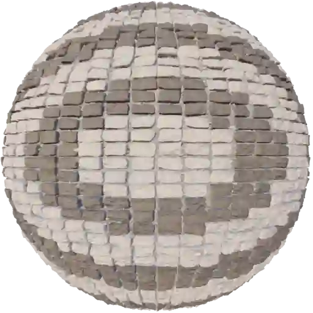

|

**This material is contained in the following Exapacks:**

    - XTRPbr_05k_Vol_001

    - XTRPbr_1k_Vol_001

    - XTRPbr_2k_Vol_002

    - XTRPbr_4k_Vol_010

    - XTRPbr_8k_Vol_012

------------------------------------------------------------------------------------------------------------------------

Pattern Cobblestone Paving 006
******************************

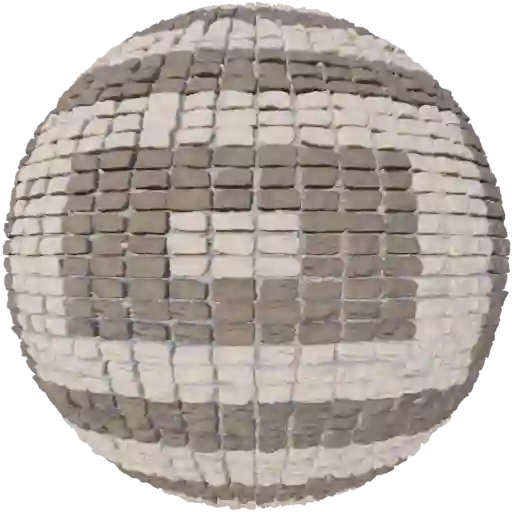

|

**This material is contained in the following Exapacks:**

    - XTRPbr_05k_Vol_001

    - XTRPbr_1k_Vol_001

    - XTRPbr_2k_Vol_002

    - XTRPbr_4k_Vol_010

    - XTRPbr_8k_Vol_012

------------------------------------------------------------------------------------------------------------------------

Pattern Cobblestone Paving 007
******************************

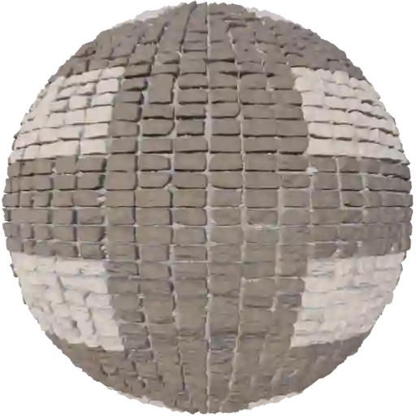

|

**This material is contained in the following Exapacks:**

    - XTRPbr_05k_Vol_001

    - XTRPbr_1k_Vol_001

    - XTRPbr_2k_Vol_002

    - XTRPbr_4k_Vol_010

    - XTRPbr_8k_Vol_012

------------------------------------------------------------------------------------------------------------------------

Pattern Cobblestone Paving 008
******************************

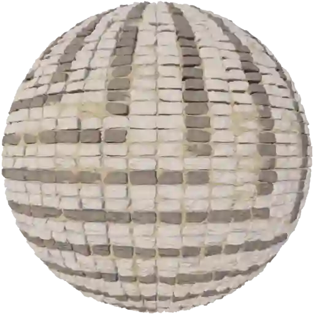

|

**This material is contained in the following Exapacks:**

    - XTRPbr_05k_Vol_001

    - XTRPbr_1k_Vol_001

    - XTRPbr_2k_Vol_002

    - XTRPbr_4k_Vol_010

    - XTRPbr_8k_Vol_012

------------------------------------------------------------------------------------------------------------------------

Pattern Cobblestone Paving 009
******************************

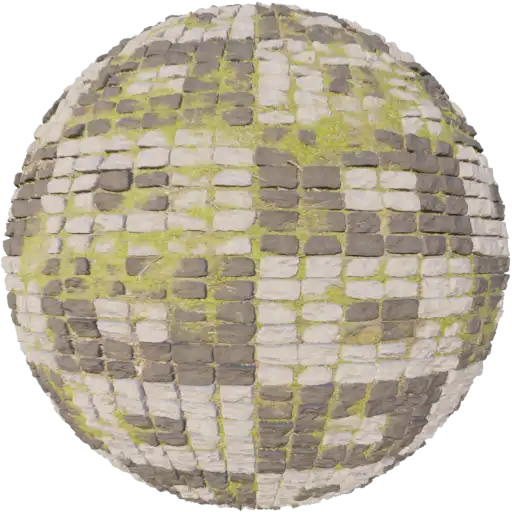

|

**This material is contained in the following Exapacks:**

    - XTRPbr_05k_Vol_001

    - XTRPbr_1k_Vol_001

    - XTRPbr_2k_Vol_002

    - XTRPbr_4k_Vol_010

    - XTRPbr_8k_Vol_012

------------------------------------------------------------------------------------------------------------------------

Pavers - Stones (Category)
--------------------------

Irregular Stone Pavers 001
**************************

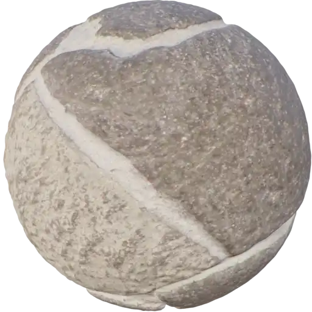

|

**This material is contained in the following Exapacks:**

    - XTRPbr_05k_Vol_001

    - XTRPbr_1k_Vol_001

    - XTRPbr_2k_Vol_002

    - XTRPbr_4k_Vol_010

------------------------------------------------------------------------------------------------------------------------

Irregular Stone Pavers 002
**************************

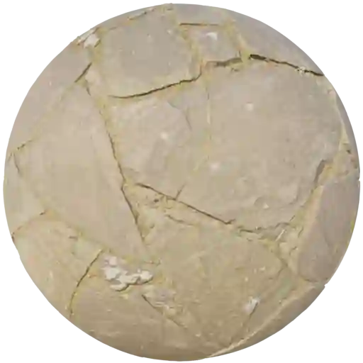

|

**This material is contained in the following Exapacks:**

    - XTRPbr_05k_Vol_001

    - XTRPbr_1k_Vol_001

    - XTRPbr_2k_Vol_002

    - XTRPbr_4k_Vol_010

    - XTRPbr_8k_Vol_012

------------------------------------------------------------------------------------------------------------------------

Irregular Stone Pavers 003
**************************

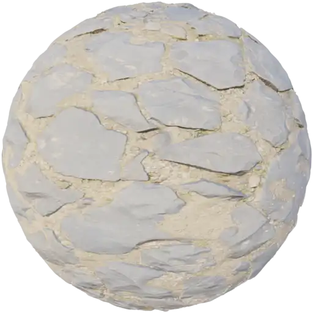

|

**This material is contained in the following Exapacks:**

    - XTRPbr_05k_Vol_001

    - XTRPbr_1k_Vol_001

    - XTRPbr_2k_Vol_002

    - XTRPbr_4k_Vol_010

    - XTRPbr_8k_Vol_012

------------------------------------------------------------------------------------------------------------------------

Irregular Stone Pavers 004
**************************

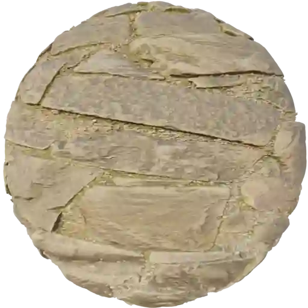

|

**This material is contained in the following Exapacks:**

    - XTRPbr_05k_Vol_001

    - XTRPbr_1k_Vol_001

    - XTRPbr_2k_Vol_002

    - XTRPbr_4k_Vol_010

    - XTRPbr_8k_Vol_012

------------------------------------------------------------------------------------------------------------------------

Irregular Stone Pavers 005
**************************

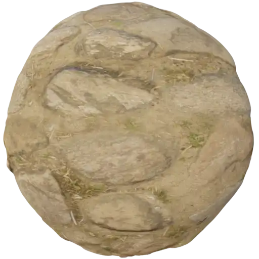

|

**This material is contained in the following Exapacks:**

    - XTRPbr_05k_Vol_001

    - XTRPbr_1k_Vol_001

    - XTRPbr_2k_Vol_002

    - XTRPbr_4k_Vol_010

    - XTRPbr_8k_Vol_012

------------------------------------------------------------------------------------------------------------------------

Irregular Stone Pavers 006
**************************

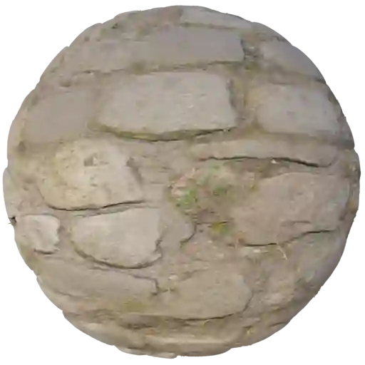

|

**This material is contained in the following Exapacks:**

    - XTRPbr_05k_Vol_001

    - XTRPbr_1k_Vol_001

    - XTRPbr_2k_Vol_002

    - XTRPbr_4k_Vol_010

    - XTRPbr_8k_Vol_012

------------------------------------------------------------------------------------------------------------------------

Irregular Stone Pavers 007
**************************

.. image:: _static/_images/material_list/pavers_stones/irregular_stone_pavers_007/irregular_stone_pavers_007.webp
    :width: 30%
    :align: center
    :alt: Irregular Stone Pavers 007

|

**This material is contained in the following Exapacks:**

    - XTRPbr_05k_Vol_001

    - XTRPbr_1k_Vol_001

    - XTRPbr_2k_Vol_002

    - XTRPbr_4k_Vol_010

    - XTRPbr_8k_Vol_012

------------------------------------------------------------------------------------------------------------------------

Offset Stone Pavers 001
***********************

.. image:: _static/_images/material_list/pavers_stones/offset_stone_pavers_001/offset_stone_pavers_001.webp
    :width: 30%
    :align: center
    :alt: Offset Stone Pavers 001

|

**This material is contained in the following Exapacks:**

    - XTRPbr_05k_Vol_001

    - XTRPbr_1k_Vol_001

    - XTRPbr_2k_Vol_002

------------------------------------------------------------------------------------------------------------------------

Offset Stone Pavers 002
***********************

.. image:: _static/_images/material_list/pavers_stones/offset_stone_pavers_002/offset_stone_pavers_002.webp
    :width: 30%
    :align: center
    :alt: Offset Stone Pavers 002

|

**This material is contained in the following Exapacks:**

    - XTRPbr_05k_Vol_001

    - XTRPbr_1k_Vol_001

    - XTRPbr_2k_Vol_002

    - XTRPbr_4k_Vol_010

    - XTRPbr_8k_Vol_012

------------------------------------------------------------------------------------------------------------------------

Offset Stone Pavers 003
***********************

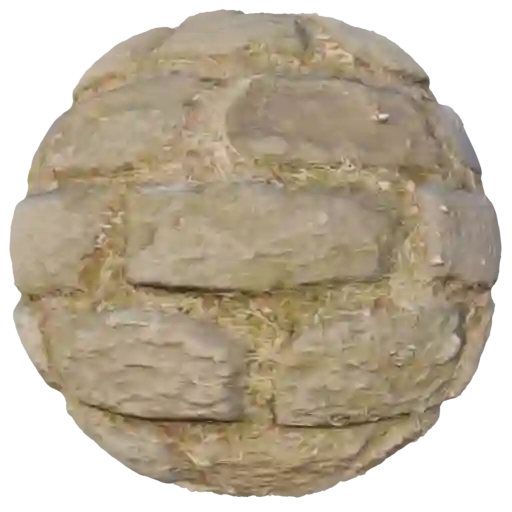

|

**This material is contained in the following Exapacks:**

    - XTRPbr_05k_Vol_001

    - XTRPbr_1k_Vol_001

    - XTRPbr_2k_Vol_002

    - XTRPbr_4k_Vol_010

    - XTRPbr_8k_Vol_012

------------------------------------------------------------------------------------------------------------------------

Offset Stone Pavers 004
***********************

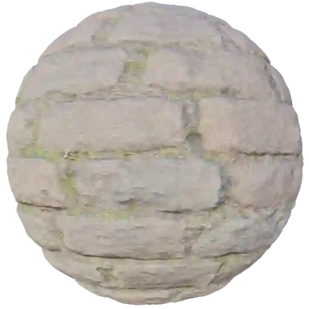

|

**This material is contained in the following Exapacks:**

    - XTRPbr_05k_Vol_001

    - XTRPbr_1k_Vol_001

    - XTRPbr_2k_Vol_002

    - XTRPbr_4k_Vol_010

    - XTRPbr_8k_Vol_012

------------------------------------------------------------------------------------------------------------------------

Offset Stone Pavers 005
***********************

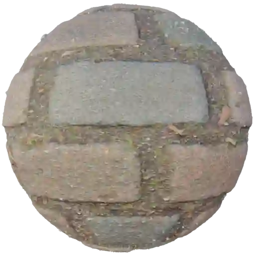

|

**This material is contained in the following Exapacks:**

    - XTRPbr_05k_Vol_001

    - XTRPbr_1k_Vol_001

    - XTRPbr_2k_Vol_002

    - XTRPbr_4k_Vol_010

    - XTRPbr_8k_Vol_012

------------------------------------------------------------------------------------------------------------------------

Offset Stone Pavers 006
***********************

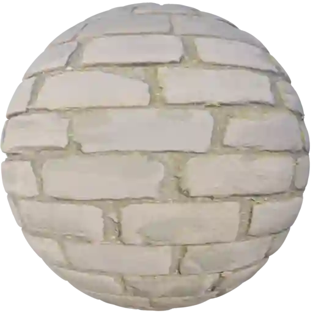

|

**This material is contained in the following Exapacks:**

    - XTRPbr_05k_Vol_001

    - XTRPbr_1k_Vol_001

    - XTRPbr_2k_Vol_002

    - XTRPbr_4k_Vol_010

    - XTRPbr_8k_Vol_012

------------------------------------------------------------------------------------------------------------------------

Offset Stone Pavers 007
***********************

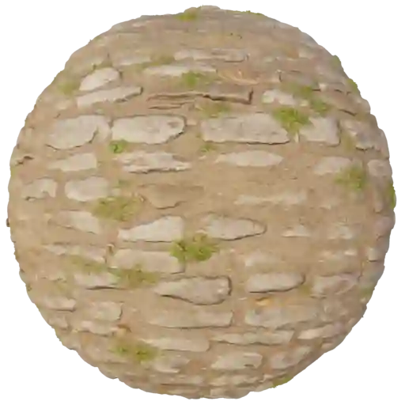

|

**This material is contained in the following Exapacks:**

    - XTRPbr_05k_Vol_001

    - XTRPbr_1k_Vol_001

    - XTRPbr_2k_Vol_002

    - XTRPbr_4k_Vol_010

    - XTRPbr_8k_Vol_012

------------------------------------------------------------------------------------------------------------------------

Offset Stone Pavers 008
***********************

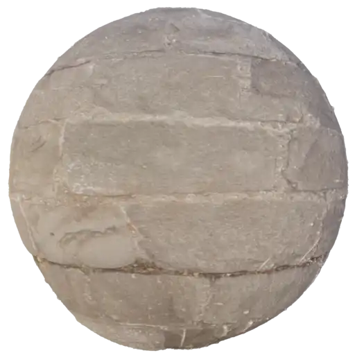

|

**This material is contained in the following Exapacks:**

    - XTRPbr_05k_Vol_001

    - XTRPbr_1k_Vol_001

    - XTRPbr_2k_Vol_002

    - XTRPbr_4k_Vol_010

------------------------------------------------------------------------------------------------------------------------

Offset Stone Pavers 009
***********************

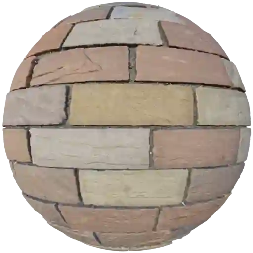

|

**This material is contained in the following Exapacks:**

    - XTRPbr_05k_Vol_001

    - XTRPbr_1k_Vol_001

    - XTRPbr_2k_Vol_002

    - XTRPbr_4k_Vol_010

    - XTRPbr_8k_Vol_012

------------------------------------------------------------------------------------------------------------------------

Offset Stone Pavers 010
***********************

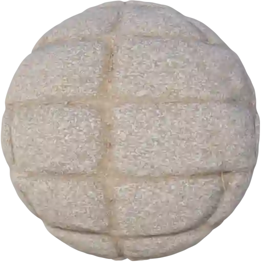

|

**This material is contained in the following Exapacks:**

    - XTRPbr_05k_Vol_001

    - XTRPbr_1k_Vol_001

    - XTRPbr_2k_Vol_002

    - XTRPbr_4k_Vol_010

------------------------------------------------------------------------------------------------------------------------

Offset Stone Pavers 011
***********************

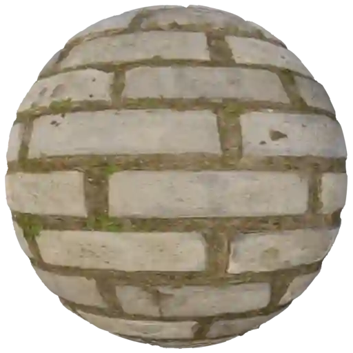

|

**This material is contained in the following Exapacks:**

    - XTRPbr_05k_Vol_001

    - XTRPbr_1k_Vol_001

    - XTRPbr_2k_Vol_002

    - XTRPbr_4k_Vol_010

    - XTRPbr_8k_Vol_012

------------------------------------------------------------------------------------------------------------------------

Offset Stone Pavers 012
***********************

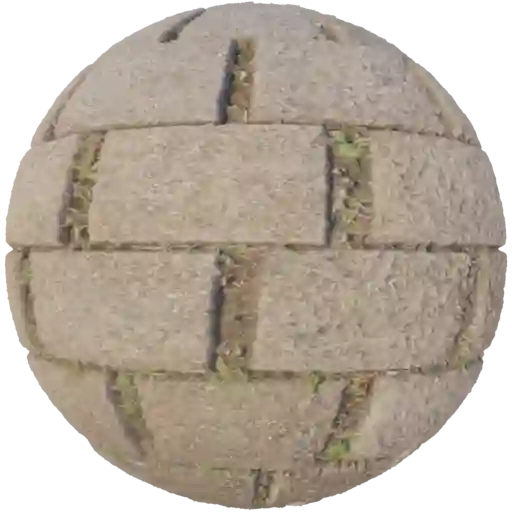

|

**This material is contained in the following Exapacks:**

    - XTRPbr_05k_Vol_001

    - XTRPbr_1k_Vol_001

    - XTRPbr_2k_Vol_002

    - XTRPbr_4k_Vol_010

------------------------------------------------------------------------------------------------------------------------

Offset Stone Pavers 013
***********************

.. image:: _static/_images/material_list/pavers_stones/offset_stone_pavers_013/offset_stone_pavers_013.webp
    :width: 30%
    :align: center
    :alt: Offset Stone Pavers 013

|

**This material is contained in the following Exapacks:**

    - XTRPbr_05k_Vol_001

    - XTRPbr_1k_Vol_001

    - XTRPbr_2k_Vol_002

    - XTRPbr_4k_Vol_010

    - XTRPbr_8k_Vol_012

------------------------------------------------------------------------------------------------------------------------

Offset Stone Pavers 014
***********************

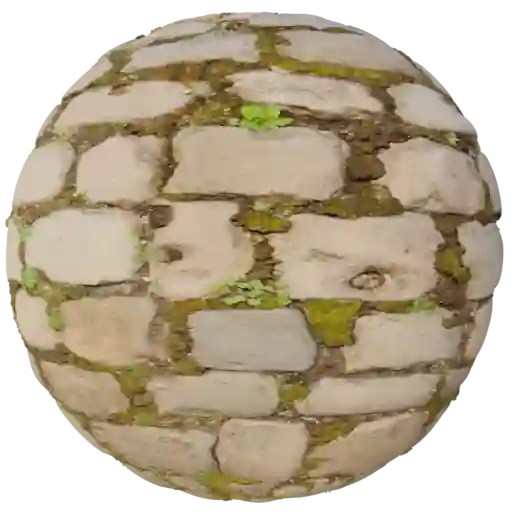

|

**This material is contained in the following Exapacks:**

    - XTRPbr_05k_Vol_001

    - XTRPbr_1k_Vol_001

    - XTRPbr_2k_Vol_002

    - XTRPbr_4k_Vol_010

    - XTRPbr_8k_Vol_012

------------------------------------------------------------------------------------------------------------------------

Offset Stone Pavers 016
***********************

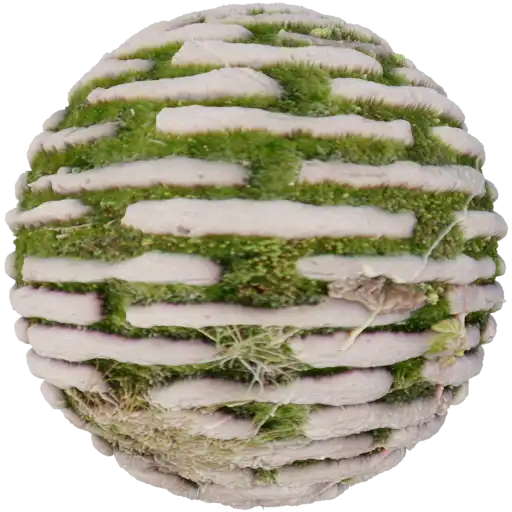

|

**This material is contained in the following Exapacks:**

    - XTRPbr_05k_Vol_001

    - XTRPbr_1k_Vol_001

    - XTRPbr_2k_Vol_002

------------------------------------------------------------------------------------------------------------------------

Rounded Stone Pavers 001
************************

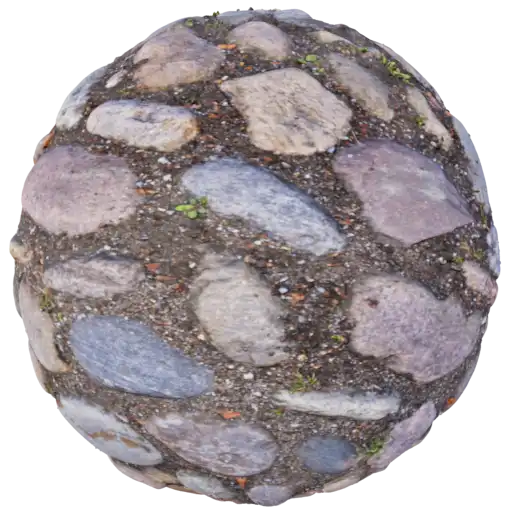

|

**This material is contained in the following Exapacks:**

    - XTRPbr_05k_Vol_001

    - XTRPbr_1k_Vol_001

    - XTRPbr_2k_Vol_002

    - XTRPbr_4k_Vol_010

    - XTRPbr_8k_Vol_012

------------------------------------------------------------------------------------------------------------------------

Rounded Stone Pavers 002
************************

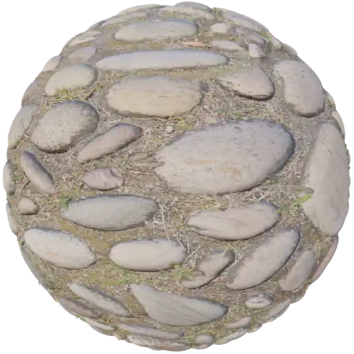

|

**This material is contained in the following Exapacks:**

    - XTRPbr_05k_Vol_001

    - XTRPbr_1k_Vol_001

    - XTRPbr_2k_Vol_002

    - XTRPbr_4k_Vol_010

    - XTRPbr_8k_Vol_012

------------------------------------------------------------------------------------------------------------------------

Pipe (Category)
---------------

Metal Pipe 001
**************

|

**This material is contained in the following Exapacks:**

    - XTRPbr_05k_Vol_001

    - XTRPbr_1k_Vol_001

    - XTRPbr_2k_Vol_002

    - XTRPbr_4k_Vol_010

    - XTRPbr_8k_Vol_012

------------------------------------------------------------------------------------------------------------------------

Metal Pipe 002
**************

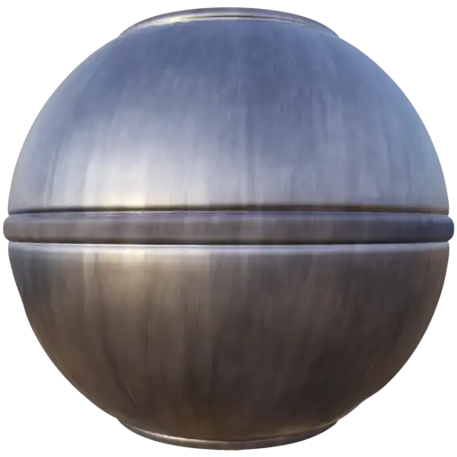

|

**This material is contained in the following Exapacks:**

    - XTRPbr_05k_Vol_001

    - XTRPbr_1k_Vol_001

    - XTRPbr_2k_Vol_002

    - XTRPbr_4k_Vol_010

    - XTRPbr_8k_Vol_012

------------------------------------------------------------------------------------------------------------------------

Metal Pipe 003
**************

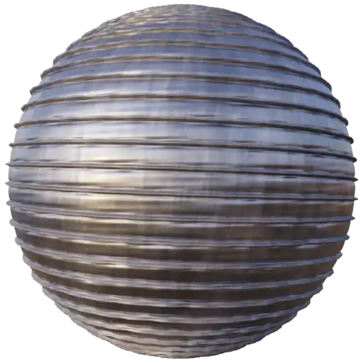

|

**This material is contained in the following Exapacks:**

    - XTRPbr_05k_Vol_001

    - XTRPbr_1k_Vol_001

    - XTRPbr_2k_Vol_002

    - XTRPbr_4k_Vol_010

    - XTRPbr_8k_Vol_012

------------------------------------------------------------------------------------------------------------------------

Metal Pipe 004
**************

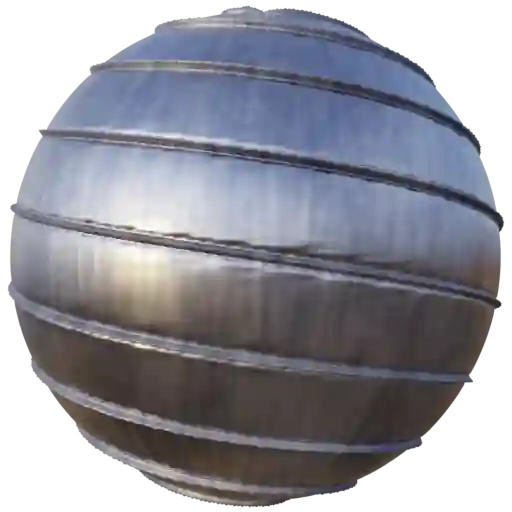

|

**This material is contained in the following Exapacks:**

    - XTRPbr_05k_Vol_001

    - XTRPbr_1k_Vol_001

    - XTRPbr_2k_Vol_002

    - XTRPbr_4k_Vol_010

    - XTRPbr_8k_Vol_012

------------------------------------------------------------------------------------------------------------------------

Plaster - Wall (Category)
-------------------------

Beige Plaster 001
*****************

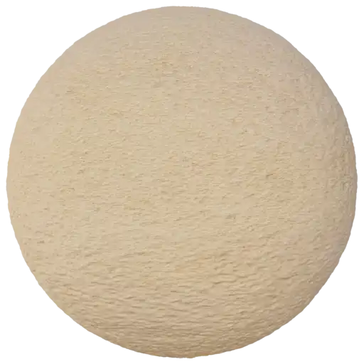

|

**This material is contained in the following Exapacks:**

    - XTRPbr_05k_Vol_001

    - XTRPbr_1k_Vol_001

    - XTRPbr_2k_Vol_002

    - XTRPbr_4k_Vol_010

------------------------------------------------------------------------------------------------------------------------

Beige Plaster 002
*****************

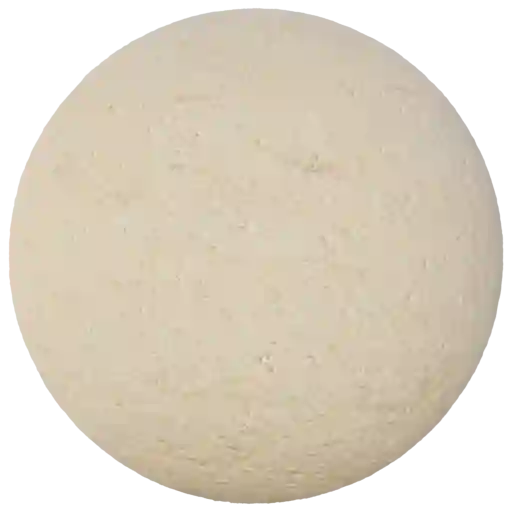

|

**This material is contained in the following Exapacks:**

    - XTRPbr_05k_Vol_001

    - XTRPbr_1k_Vol_001

    - XTRPbr_2k_Vol_002

    - XTRPbr_4k_Vol_010

------------------------------------------------------------------------------------------------------------------------

Beige Plaster 003
*****************

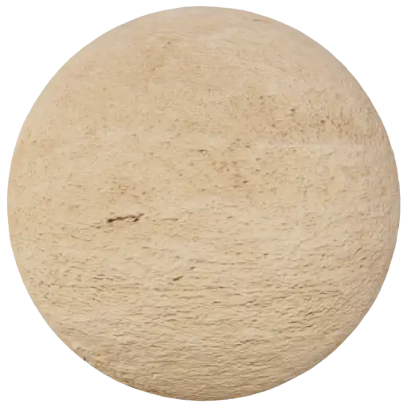

|

**This material is contained in the following Exapacks:**

    - XTRPbr_05k_Vol_001

    - XTRPbr_1k_Vol_001

    - XTRPbr_2k_Vol_002

    - XTRPbr_4k_Vol_010

------------------------------------------------------------------------------------------------------------------------

Beige Plaster 004
*****************

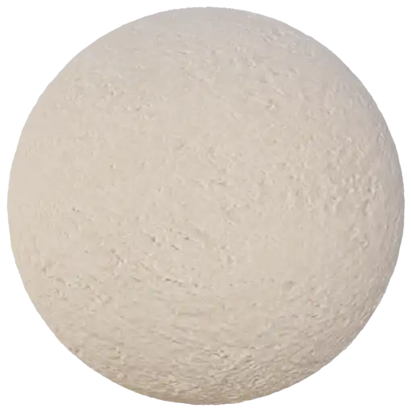

|

**This material is contained in the following Exapacks:**

    - XTRPbr_05k_Vol_001

    - XTRPbr_1k_Vol_001

    - XTRPbr_2k_Vol_002

    - XTRPbr_4k_Vol_010

------------------------------------------------------------------------------------------------------------------------

Blue Plaster 001
****************

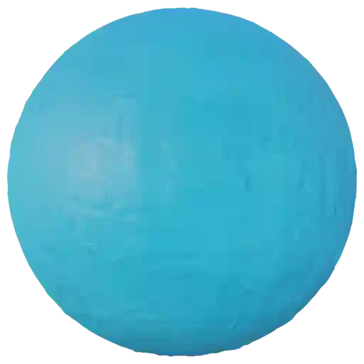

|

**This material is contained in the following Exapacks:**

    - XTRPbr_05k_Vol_001

    - XTRPbr_1k_Vol_001

    - XTRPbr_2k_Vol_002

    - XTRPbr_4k_Vol_010

    - XTRPbr_8k_Vol_012

------------------------------------------------------------------------------------------------------------------------

Blue Plaster 002
****************

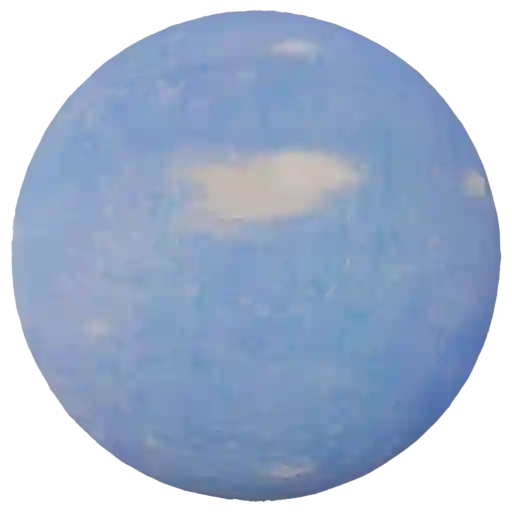

|

**This material is contained in the following Exapacks:**

    - XTRPbr_05k_Vol_001

    - XTRPbr_1k_Vol_001

    - XTRPbr_2k_Vol_002

    - XTRPbr_4k_Vol_010

    - XTRPbr_8k_Vol_012

------------------------------------------------------------------------------------------------------------------------

Brown Plaster 001
*****************

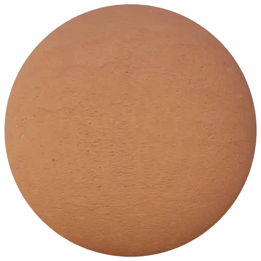

|

**This material is contained in the following Exapacks:**

    - XTRPbr_05k_Vol_001

    - XTRPbr_1k_Vol_001

    - XTRPbr_2k_Vol_002

    - XTRPbr_4k_Vol_010

------------------------------------------------------------------------------------------------------------------------

Concrete Plaster 001
********************

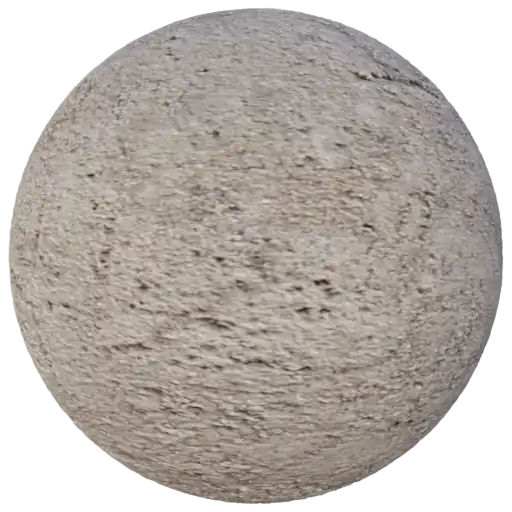

|

**This material is contained in the following Exapacks:**

    - XTRPbr_05k_Vol_001

    - XTRPbr_1k_Vol_001

    - XTRPbr_2k_Vol_002

    - XTRPbr_4k_Vol_010

------------------------------------------------------------------------------------------------------------------------

Concrete Plaster 002
********************

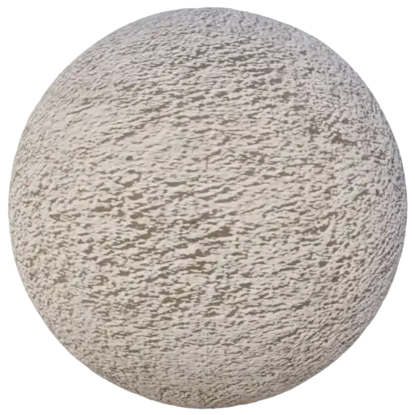

|

**This material is contained in the following Exapacks:**

    - XTRPbr_05k_Vol_001

    - XTRPbr_1k_Vol_001

    - XTRPbr_2k_Vol_002

    - XTRPbr_4k_Vol_010

------------------------------------------------------------------------------------------------------------------------

Concrete Plaster 003
********************

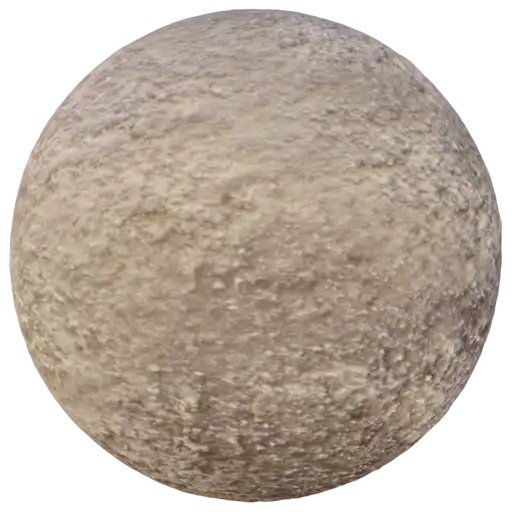

|

**This material is contained in the following Exapacks:**

    - XTRPbr_05k_Vol_001

    - XTRPbr_1k_Vol_001

    - XTRPbr_2k_Vol_002

------------------------------------------------------------------------------------------------------------------------

Green Plaster 001
*****************

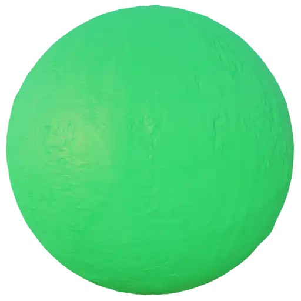

|

**This material is contained in the following Exapacks:**

    - XTRPbr_05k_Vol_001

    - XTRPbr_1k_Vol_001

    - XTRPbr_2k_Vol_002

    - XTRPbr_4k_Vol_010

    - XTRPbr_8k_Vol_012

------------------------------------------------------------------------------------------------------------------------

Green Plaster 002
*****************

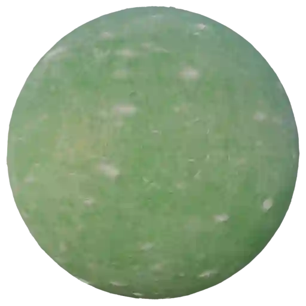

|

**This material is contained in the following Exapacks:**

    - XTRPbr_05k_Vol_001

    - XTRPbr_1k_Vol_001

    - XTRPbr_2k_Vol_002

    - XTRPbr_4k_Vol_010

    - XTRPbr_8k_Vol_012

    - XTRPbr_8k_Vol_026

------------------------------------------------------------------------------------------------------------------------

Green Plaster 003
*****************

|

**This material is contained in the following Exapacks:**

    - XTRPbr_05k_Vol_001

    - XTRPbr_1k_Vol_001

    - XTRPbr_2k_Vol_002

    - XTRPbr_4k_Vol_010

    - XTRPbr_8k_Vol_026

------------------------------------------------------------------------------------------------------------------------

Grey Plaster 001
****************

.. image:: _static/_images/material_list/plaster_wall/grey_plaster_001/grey_plaster_001.webp
    :width: 30%
    :align: center
    :alt: Grey Plaster 001

|

**This material is contained in the following Exapacks:**

    - XTRPbr_05k_Vol_001

    - XTRPbr_1k_Vol_001

    - XTRPbr_2k_Vol_002

    - XTRPbr_4k_Vol_010

    - XTRPbr_8k_Vol_026

------------------------------------------------------------------------------------------------------------------------

Grey Plaster 002
****************

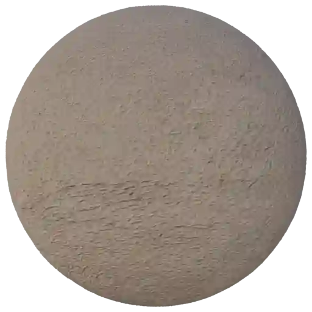

|

**This material is contained in the following Exapacks:**

    - XTRPbr_05k_Vol_001

    - XTRPbr_1k_Vol_001

    - XTRPbr_2k_Vol_002

    - XTRPbr_4k_Vol_010

------------------------------------------------------------------------------------------------------------------------

Grey Plaster 003
****************

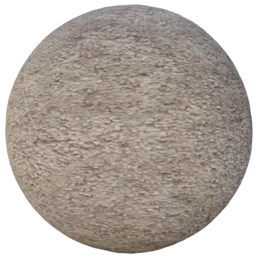

|

**This material is contained in the following Exapacks:**

    - XTRPbr_05k_Vol_001

    - XTRPbr_1k_Vol_001

    - XTRPbr_2k_Vol_002

    - XTRPbr_4k_Vol_010

------------------------------------------------------------------------------------------------------------------------

Grey Plaster 004
****************

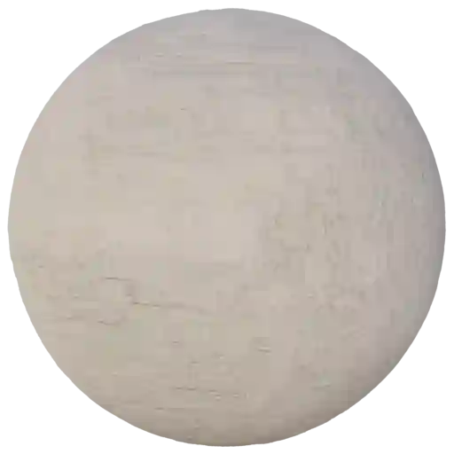

|

**This material is contained in the following Exapacks:**

    - XTRPbr_05k_Vol_001

    - XTRPbr_1k_Vol_001

    - XTRPbr_2k_Vol_002

    - XTRPbr_4k_Vol_010

    - XTRPbr_8k_Vol_026

------------------------------------------------------------------------------------------------------------------------

Grey Plaster 005
****************

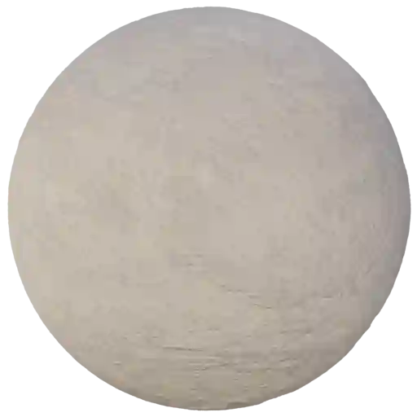

|

**This material is contained in the following Exapacks:**

    - XTRPbr_05k_Vol_001

    - XTRPbr_1k_Vol_001

    - XTRPbr_2k_Vol_002

    - XTRPbr_4k_Vol_010

    - XTRPbr_8k_Vol_026

------------------------------------------------------------------------------------------------------------------------

Grey Plaster 006
****************

.. image:: _static/_images/material_list/plaster_wall/grey_plaster_006/grey_plaster_006.webp
    :width: 30%
    :align: center
    :alt: Grey Plaster 006

|

**This material is contained in the following Exapacks:**

    - XTRPbr_05k_Vol_001

    - XTRPbr_1k_Vol_001

    - XTRPbr_2k_Vol_002

    - XTRPbr_4k_Vol_010

    - XTRPbr_8k_Vol_026

------------------------------------------------------------------------------------------------------------------------

Grey Plaster 007
****************

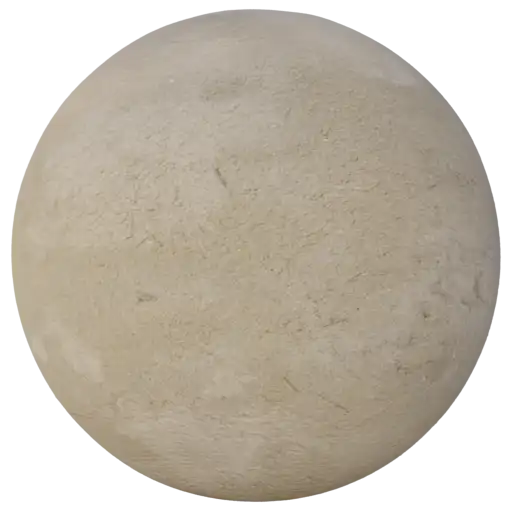

|

**This material is contained in the following Exapacks:**

    - XTRPbr_05k_Vol_001

    - XTRPbr_1k_Vol_001

    - XTRPbr_2k_Vol_002

    - XTRPbr_4k_Vol_010

    - XTRPbr_8k_Vol_026

------------------------------------------------------------------------------------------------------------------------

Orange Plaster 001
******************

|

**This material is contained in the following Exapacks:**

    - XTRPbr_05k_Vol_001

    - XTRPbr_1k_Vol_001

    - XTRPbr_2k_Vol_002

    - XTRPbr_4k_Vol_010

    - XTRPbr_8k_Vol_026

------------------------------------------------------------------------------------------------------------------------

Pink Plaster 001
****************

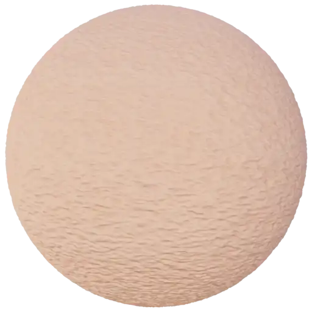

|

**This material is contained in the following Exapacks:**

    - XTRPbr_05k_Vol_001

    - XTRPbr_1k_Vol_001

    - XTRPbr_2k_Vol_002

    - XTRPbr_4k_Vol_010

------------------------------------------------------------------------------------------------------------------------

Pink Plaster 002
****************

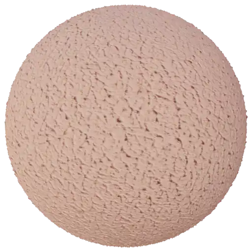

|

**This material is contained in the following Exapacks:**

    - XTRPbr_05k_Vol_001

    - XTRPbr_1k_Vol_001

    - XTRPbr_2k_Vol_002

    - XTRPbr_4k_Vol_010

------------------------------------------------------------------------------------------------------------------------

Pink Plaster 003
****************

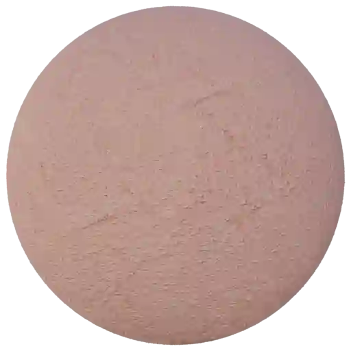

|

**This material is contained in the following Exapacks:**

    - XTRPbr_05k_Vol_001

    - XTRPbr_1k_Vol_001

    - XTRPbr_2k_Vol_002

    - XTRPbr_4k_Vol_010

------------------------------------------------------------------------------------------------------------------------

Red Plaster 001
***************

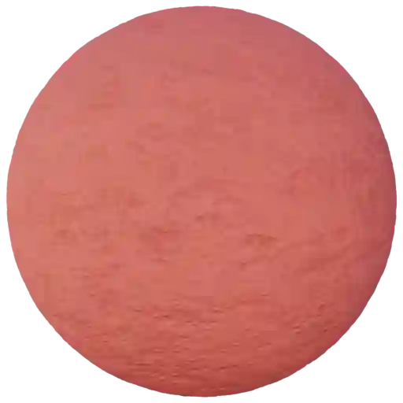

|

**This material is contained in the following Exapacks:**

    - XTRPbr_05k_Vol_001

    - XTRPbr_1k_Vol_001

    - XTRPbr_2k_Vol_002

    - XTRPbr_4k_Vol_010

------------------------------------------------------------------------------------------------------------------------

Red Plaster 002
***************

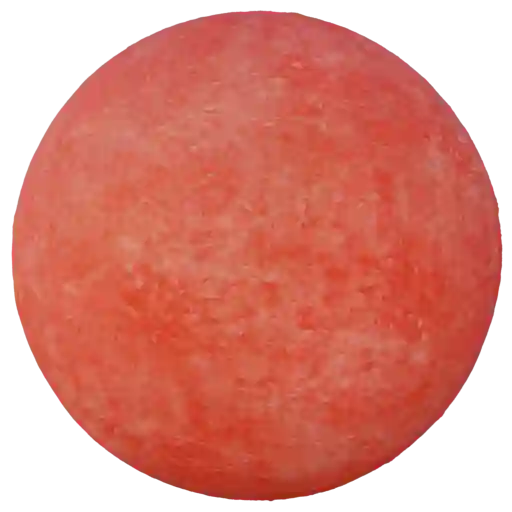

|

**This material is contained in the following Exapacks:**

    - XTRPbr_05k_Vol_001

    - XTRPbr_1k_Vol_001

    - XTRPbr_2k_Vol_002

    - XTRPbr_4k_Vol_010

    - XTRPbr_8k_Vol_026

------------------------------------------------------------------------------------------------------------------------

White Plaster 001
*****************

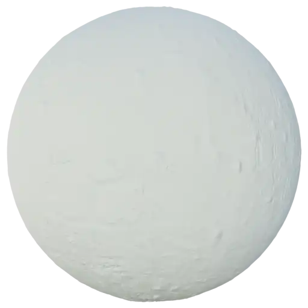

|

**This material is contained in the following Exapacks:**

    - XTRPbr_05k_Vol_001

    - XTRPbr_1k_Vol_001

    - XTRPbr_2k_Vol_002

    - XTRPbr_4k_Vol_010

    - XTRPbr_8k_Vol_026

------------------------------------------------------------------------------------------------------------------------

White Plaster 002
*****************

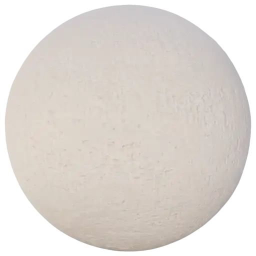

|

**This material is contained in the following Exapacks:**

    - XTRPbr_05k_Vol_001

    - XTRPbr_1k_Vol_001

    - XTRPbr_2k_Vol_002

    - XTRPbr_4k_Vol_010

    - XTRPbr_8k_Vol_026

------------------------------------------------------------------------------------------------------------------------

White Plaster 003
*****************

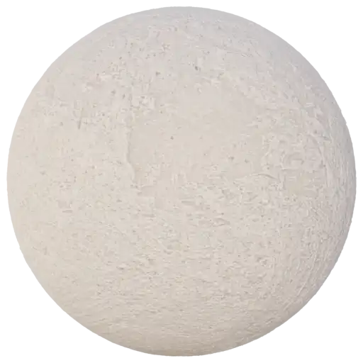

|

**This material is contained in the following Exapacks:**

    - XTRPbr_05k_Vol_001

    - XTRPbr_1k_Vol_001

    - XTRPbr_2k_Vol_002

    - XTRPbr_4k_Vol_010

    - XTRPbr_8k_Vol_026

------------------------------------------------------------------------------------------------------------------------

White Plaster 004
*****************

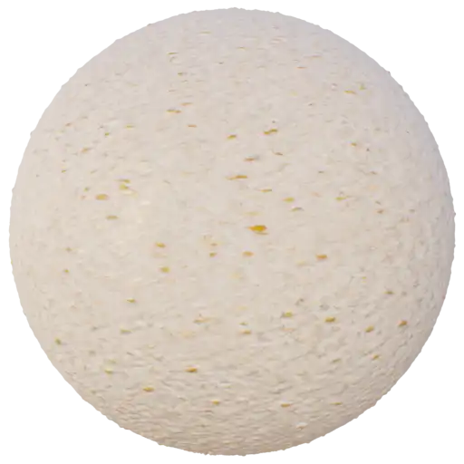

|

**This material is contained in the following Exapacks:**

    - XTRPbr_05k_Vol_001

    - XTRPbr_1k_Vol_001

    - XTRPbr_2k_Vol_002

    - XTRPbr_4k_Vol_010

------------------------------------------------------------------------------------------------------------------------

White Plaster 005
*****************

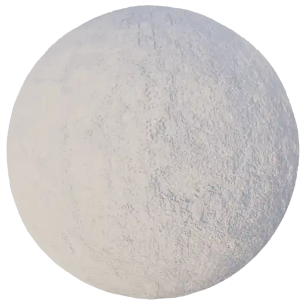

|

**This material is contained in the following Exapacks:**

    - XTRPbr_05k_Vol_001

    - XTRPbr_1k_Vol_001

    - XTRPbr_2k_Vol_002

    - XTRPbr_4k_Vol_010

------------------------------------------------------------------------------------------------------------------------

White Plaster 006
*****************

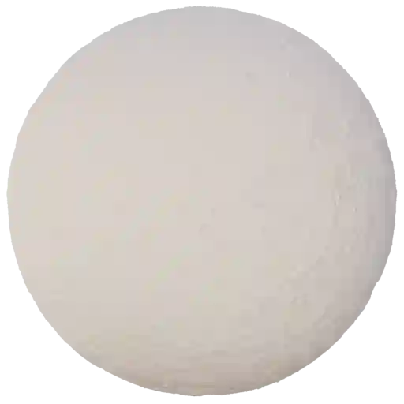

|

**This material is contained in the following Exapacks:**

    - XTRPbr_05k_Vol_001

    - XTRPbr_1k_Vol_001

    - XTRPbr_2k_Vol_002

    - XTRPbr_4k_Vol_010

------------------------------------------------------------------------------------------------------------------------

White Plaster 007
*****************

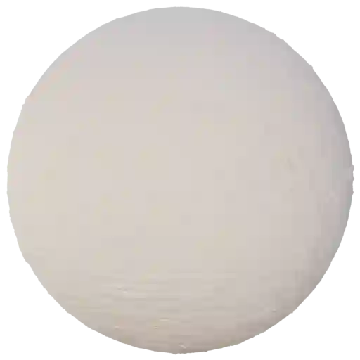

|

**This material is contained in the following Exapacks:**

    - XTRPbr_05k_Vol_001

    - XTRPbr_1k_Vol_001

    - XTRPbr_2k_Vol_002

    - XTRPbr_4k_Vol_010

------------------------------------------------------------------------------------------------------------------------

White Plaster 008
*****************

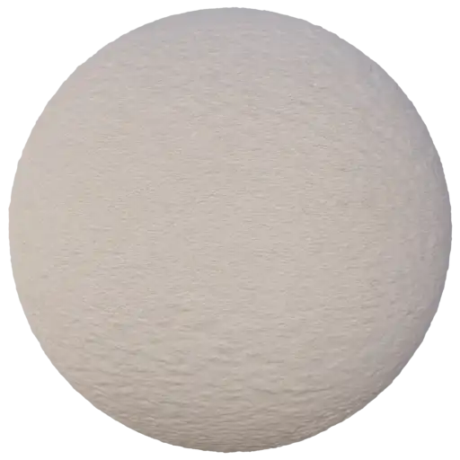

|

**This material is contained in the following Exapacks:**

    - XTRPbr_05k_Vol_001

    - XTRPbr_1k_Vol_001

    - XTRPbr_2k_Vol_002

    - XTRPbr_4k_Vol_010

------------------------------------------------------------------------------------------------------------------------

White Plaster 009
*****************

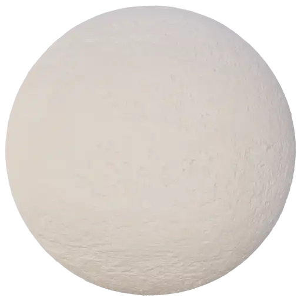

|

**This material is contained in the following Exapacks:**

    - XTRPbr_05k_Vol_001

    - XTRPbr_1k_Vol_001

    - XTRPbr_2k_Vol_002

    - XTRPbr_4k_Vol_010

    - XTRPbr_8k_Vol_026

------------------------------------------------------------------------------------------------------------------------

Yellow Plaster 001
******************

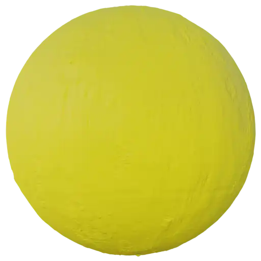

|

**This material is contained in the following Exapacks:**

    - XTRPbr_05k_Vol_001

    - XTRPbr_1k_Vol_001

    - XTRPbr_2k_Vol_002

    - XTRPbr_4k_Vol_010

    - XTRPbr_8k_Vol_026

------------------------------------------------------------------------------------------------------------------------

Yellow Plaster 002
******************

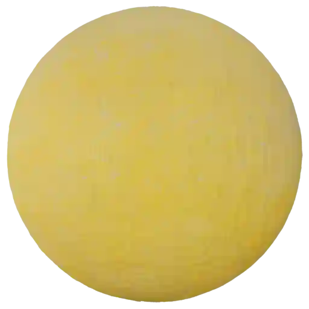

|

**This material is contained in the following Exapacks:**

    - XTRPbr_05k_Vol_001

    - XTRPbr_1k_Vol_001

    - XTRPbr_2k_Vol_002

    - XTRPbr_4k_Vol_010

    - XTRPbr_8k_Vol_026

------------------------------------------------------------------------------------------------------------------------

Yellow Plaster 003
******************

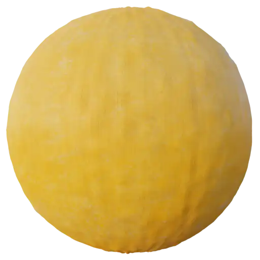

|

**This material is contained in the following Exapacks:**

    - XTRPbr_05k_Vol_001

    - XTRPbr_1k_Vol_001

    - XTRPbr_2k_Vol_002

    - XTRPbr_4k_Vol_010

    - XTRPbr_8k_Vol_026

------------------------------------------------------------------------------------------------------------------------

Plaster - Worn (Category)
-------------------------

Worn Plaster 001
****************

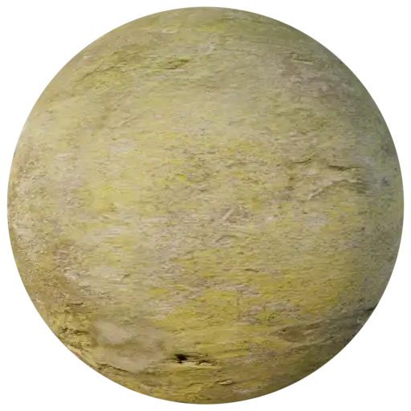

|

**This material is contained in the following Exapacks:**

    - XTRPbr_05k_Vol_001

    - XTRPbr_1k_Vol_001

    - XTRPbr_2k_Vol_002

    - XTRPbr_4k_Vol_010

    - XTRPbr_8k_Vol_026

------------------------------------------------------------------------------------------------------------------------

Worn Plaster 002
****************

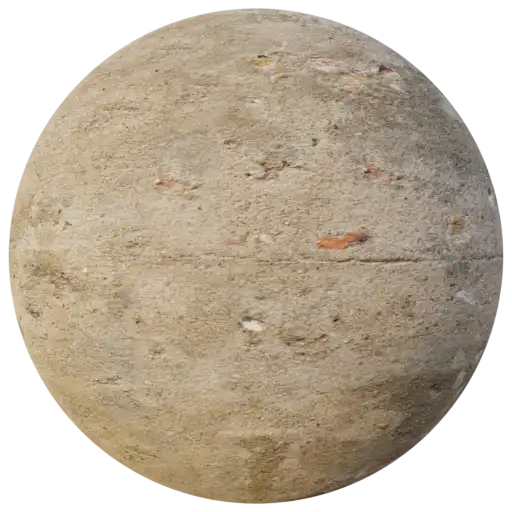

|

**This material is contained in the following Exapacks:**

    - XTRPbr_05k_Vol_001

    - XTRPbr_1k_Vol_001

    - XTRPbr_2k_Vol_002

    - XTRPbr_4k_Vol_010

    - XTRPbr_8k_Vol_026

------------------------------------------------------------------------------------------------------------------------

Worn Plaster 003
****************

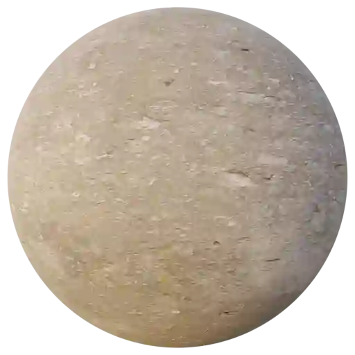

|

**This material is contained in the following Exapacks:**

    - XTRPbr_05k_Vol_001

    - XTRPbr_1k_Vol_001

    - XTRPbr_2k_Vol_002

    - XTRPbr_4k_Vol_010

    - XTRPbr_8k_Vol_026

------------------------------------------------------------------------------------------------------------------------

Worn Plaster 004
****************

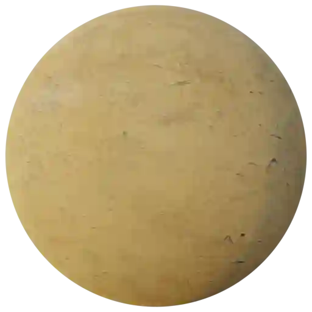

|

**This material is contained in the following Exapacks:**

    - XTRPbr_05k_Vol_001

    - XTRPbr_1k_Vol_001

    - XTRPbr_2k_Vol_002

    - XTRPbr_4k_Vol_010

    - XTRPbr_8k_Vol_026

------------------------------------------------------------------------------------------------------------------------

Worn Plaster 005
****************

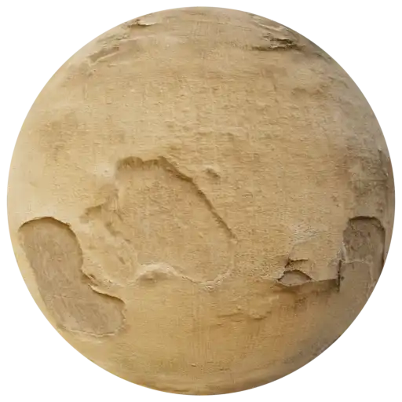

|

**This material is contained in the following Exapacks:**

    - XTRPbr_05k_Vol_001

    - XTRPbr_1k_Vol_001

    - XTRPbr_2k_Vol_002

    - XTRPbr_4k_Vol_010

    - XTRPbr_8k_Vol_026

------------------------------------------------------------------------------------------------------------------------

Worn Plaster 006
****************

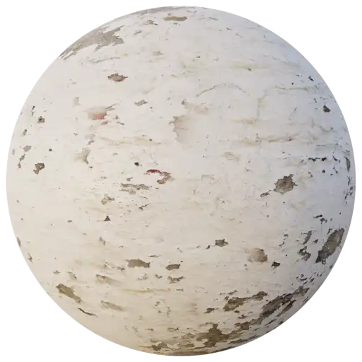

|

**This material is contained in the following Exapacks:**

    - XTRPbr_05k_Vol_001

    - XTRPbr_1k_Vol_001

    - XTRPbr_2k_Vol_002

    - XTRPbr_4k_Vol_010

    - XTRPbr_8k_Vol_026

------------------------------------------------------------------------------------------------------------------------

Worn Plaster 007
****************

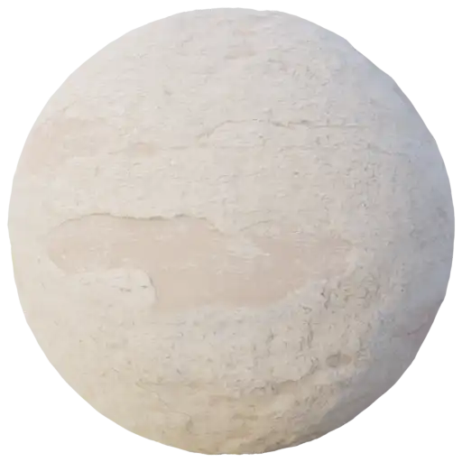

|

**This material is contained in the following Exapacks:**

    - XTRPbr_05k_Vol_001

    - XTRPbr_1k_Vol_001

    - XTRPbr_2k_Vol_002

    - XTRPbr_4k_Vol_010

    - XTRPbr_8k_Vol_026

------------------------------------------------------------------------------------------------------------------------

Worn Plaster 008
****************

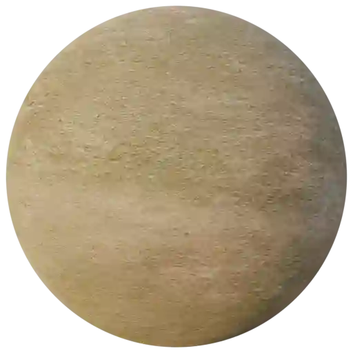

|

**This material is contained in the following Exapacks:**

    - XTRPbr_05k_Vol_001

    - XTRPbr_1k_Vol_001

    - XTRPbr_2k_Vol_002

    - XTRPbr_4k_Vol_010

    - XTRPbr_8k_Vol_026

------------------------------------------------------------------------------------------------------------------------

Worn Plaster 009
****************

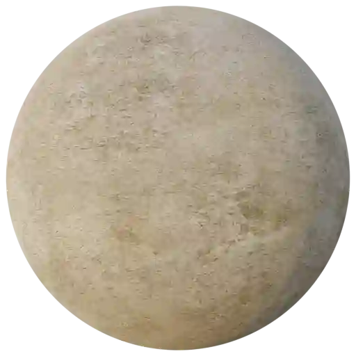

|

**This material is contained in the following Exapacks:**

    - XTRPbr_05k_Vol_001

    - XTRPbr_1k_Vol_001

    - XTRPbr_2k_Vol_002

    - XTRPbr_4k_Vol_010

    - XTRPbr_8k_Vol_026

------------------------------------------------------------------------------------------------------------------------

Worn Plaster 010
****************

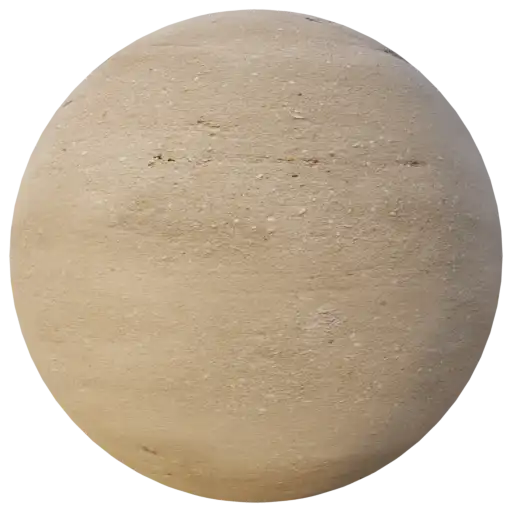

|

**This material is contained in the following Exapacks:**

    - XTRPbr_05k_Vol_001

    - XTRPbr_1k_Vol_001

    - XTRPbr_2k_Vol_002

    - XTRPbr_4k_Vol_010

    - XTRPbr_8k_Vol_026

------------------------------------------------------------------------------------------------------------------------

Worn Plaster 011
****************

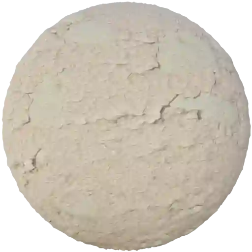

|

**This material is contained in the following Exapacks:**

    - XTRPbr_05k_Vol_001

    - XTRPbr_1k_Vol_001

    - XTRPbr_2k_Vol_002

    - XTRPbr_4k_Vol_010

------------------------------------------------------------------------------------------------------------------------

Worn Plaster 012
****************

.. image:: _static/_images/material_list/plaster_worn/worn_plaster_012/worn_plaster_012.webp
    :width: 30%
    :align: center
    :alt: Worn Plaster 012

|

**This material is contained in the following Exapacks:**

    - XTRPbr_05k_Vol_001

    - XTRPbr_1k_Vol_001

    - XTRPbr_2k_Vol_002

    - XTRPbr_4k_Vol_010

    - XTRPbr_8k_Vol_026

------------------------------------------------------------------------------------------------------------------------

Worn Plaster 013
****************

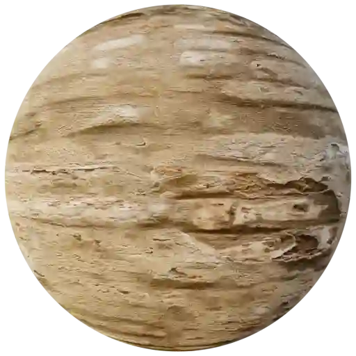

|

**This material is contained in the following Exapacks:**

    - XTRPbr_05k_Vol_001

    - XTRPbr_1k_Vol_001

    - XTRPbr_2k_Vol_002

    - XTRPbr_4k_Vol_010

    - XTRPbr_8k_Vol_026

------------------------------------------------------------------------------------------------------------------------

Worn Plaster 014
****************

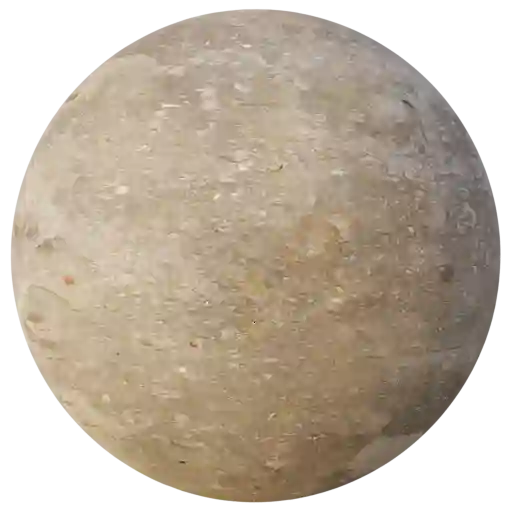

|

**This material is contained in the following Exapacks:**

    - XTRPbr_05k_Vol_001

    - XTRPbr_1k_Vol_001

    - XTRPbr_2k_Vol_002

    - XTRPbr_4k_Vol_010

    - XTRPbr_8k_Vol_026

------------------------------------------------------------------------------------------------------------------------

Worn Plaster 015
****************

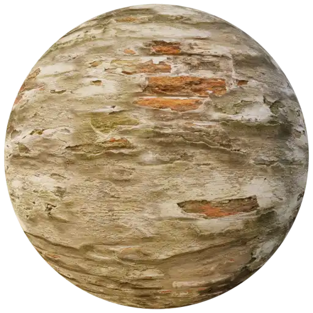

|

**This material is contained in the following Exapacks:**

    - XTRPbr_05k_Vol_001

    - XTRPbr_1k_Vol_001

    - XTRPbr_2k_Vol_002

    - XTRPbr_4k_Vol_010

    - XTRPbr_8k_Vol_026

------------------------------------------------------------------------------------------------------------------------

Worn Plaster 018
****************

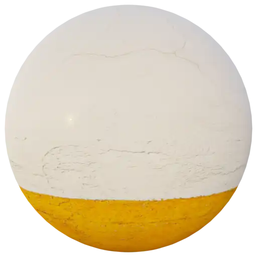

|

**This material is contained in the following Exapacks:**

    - XTRPbr_05k_Vol_001

    - XTRPbr_1k_Vol_001

    - XTRPbr_2k_Vol_002

    - XTRPbr_4k_Vol_010

------------------------------------------------------------------------------------------------------------------------

Worn Plaster Bricks 002
***********************

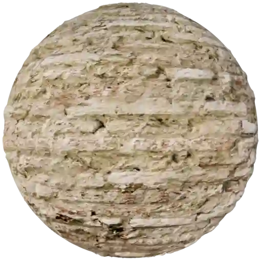

|

**This material is contained in the following Exapacks:**

    - XTRPbr_05k_Vol_001

    - XTRPbr_1k_Vol_001

    - XTRPbr_2k_Vol_002

    - XTRPbr_4k_Vol_010

    - XTRPbr_8k_Vol_026

------------------------------------------------------------------------------------------------------------------------

Plastic (Category)
------------------

Beige Plastic 001
*****************

.. image:: _static/_images/material_list/plastic/beige_plastic_001/beige_plastic_001.webp
    :width: 30%
    :align: center
    :alt: Beige Plastic 001

|

**This material is contained in the following Exapacks:**

    - XTRPbr_05k_Vol_001

    - XTRPbr_1k_Vol_001

    - XTRPbr_2k_Vol_002

    - XTRPbr_4k_Vol_010

------------------------------------------------------------------------------------------------------------------------

Black Plastic 001
*****************

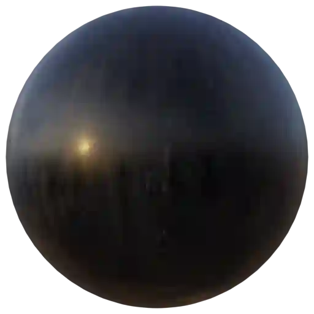

|

**This material is contained in the following Exapacks:**

    - XTRPbr_05k_Vol_001

    - XTRPbr_1k_Vol_001

    - XTRPbr_2k_Vol_002

    - XTRPbr_4k_Vol_010

    - XTRPbr_8k_Vol_026

------------------------------------------------------------------------------------------------------------------------

Blue Plastic 001
****************

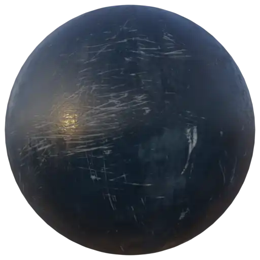

|

**This material is contained in the following Exapacks:**

    - XTRPbr_05k_Vol_001

    - XTRPbr_1k_Vol_001

    - XTRPbr_2k_Vol_002

    - XTRPbr_4k_Vol_010

------------------------------------------------------------------------------------------------------------------------

Blue Plastic 002
****************

|

**This material is contained in the following Exapacks:**

    - XTRPbr_05k_Vol_001

    - XTRPbr_1k_Vol_001

    - XTRPbr_2k_Vol_002

    - XTRPbr_4k_Vol_010

    - XTRPbr_8k_Vol_026

------------------------------------------------------------------------------------------------------------------------

Brown Plastic 001
*****************

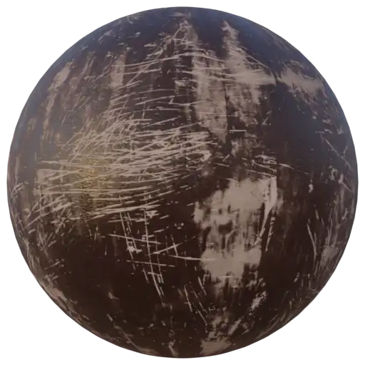

|

**This material is contained in the following Exapacks:**

    - XTRPbr_05k_Vol_001

    - XTRPbr_1k_Vol_001

    - XTRPbr_2k_Vol_002

    - XTRPbr_4k_Vol_010

------------------------------------------------------------------------------------------------------------------------

Brown Plastic 002
*****************

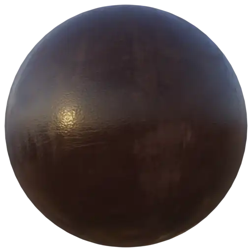

|

**This material is contained in the following Exapacks:**

    - XTRPbr_05k_Vol_001

    - XTRPbr_1k_Vol_001

    - XTRPbr_2k_Vol_002

    - XTRPbr_4k_Vol_010

------------------------------------------------------------------------------------------------------------------------

Green Plastic 001
*****************

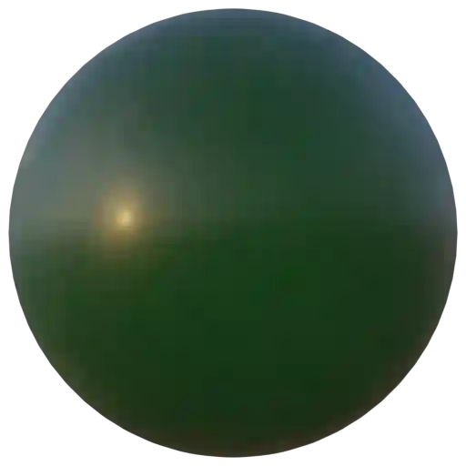

|

**This material is contained in the following Exapacks:**

    - XTRPbr_05k_Vol_001

    - XTRPbr_1k_Vol_001

    - XTRPbr_2k_Vol_002

    - XTRPbr_4k_Vol_010

    - XTRPbr_8k_Vol_026

------------------------------------------------------------------------------------------------------------------------

Grey Plastic 001
****************

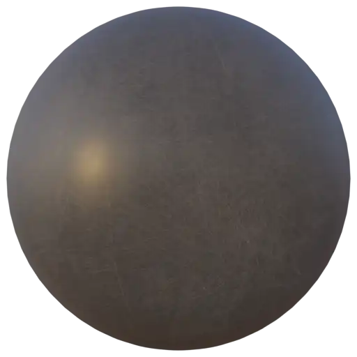

|

**This material is contained in the following Exapacks:**

    - XTRPbr_05k_Vol_001

    - XTRPbr_1k_Vol_001

    - XTRPbr_2k_Vol_002

    - XTRPbr_4k_Vol_010

    - XTRPbr_8k_Vol_029

------------------------------------------------------------------------------------------------------------------------

Grey Plastic 002
****************

.. image:: _static/_images/material_list/plastic/grey_plastic_002/grey_plastic_002.webp
    :width: 30%
    :align: center
    :alt: Grey Plastic 002

|

**This material is contained in the following Exapacks:**

    - XTRPbr_05k_Vol_001

    - XTRPbr_1k_Vol_001

    - XTRPbr_2k_Vol_002

    - XTRPbr_4k_Vol_010

------------------------------------------------------------------------------------------------------------------------

Orange Plastic 001
******************

|

**This material is contained in the following Exapacks:**

    - XTRPbr_05k_Vol_001

    - XTRPbr_1k_Vol_001

    - XTRPbr_2k_Vol_002

    - XTRPbr_4k_Vol_010

    - XTRPbr_8k_Vol_029

------------------------------------------------------------------------------------------------------------------------

White Plastic 001
*****************

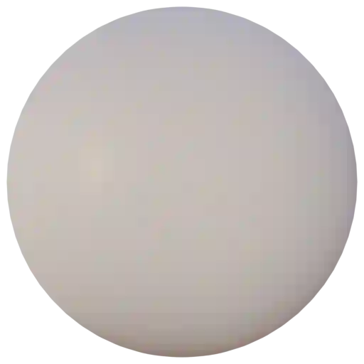

|

**This material is contained in the following Exapacks:**

    - XTRPbr_05k_Vol_001

    - XTRPbr_1k_Vol_001

    - XTRPbr_2k_Vol_002

    - XTRPbr_4k_Vol_010

    - XTRPbr_8k_Vol_029

------------------------------------------------------------------------------------------------------------------------

Procedural (Category)
---------------------

Blend Mix 001
*************

|

**This material is contained in the following Exapacks:**

    - XTRPbr_Procedural_Vol_001

------------------------------------------------------------------------------------------------------------------------

Chess 001
*********

.. image:: _static/_images/material_list/procedural/chess_001/chess_001.webp
    :width: 30%
    :align: center
    :alt: Chess 001

|

**This material is contained in the following Exapacks:**

    - XTRPbr_Procedural_Vol_001

------------------------------------------------------------------------------------------------------------------------

Plasma 001
**********

|

**This material is contained in the following Exapacks:**

    - XTRPbr_Procedural_Vol_001

------------------------------------------------------------------------------------------------------------------------

Wireframe 001
*************

.. image:: _static/_images/material_list/procedural/wireframe_001/wireframe_001.webp
    :width: 30%
    :align: center
    :alt: Wireframe 001

|

**This material is contained in the following Exapacks:**

    - XTRPbr_Procedural_Vol_001

------------------------------------------------------------------------------------------------------------------------

Rock - Solid (Category)
-----------------------

Black Rock 001
**************

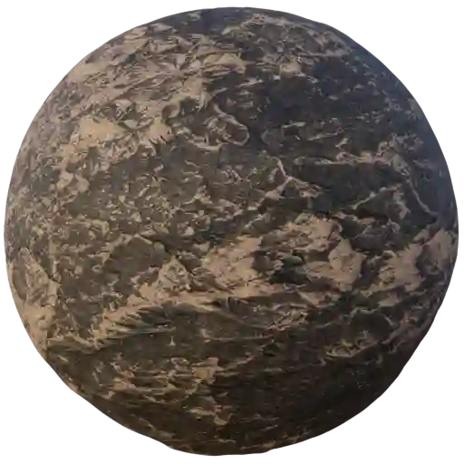

|

**This material is contained in the following Exapacks:**

    - XTRPbr_05k_Vol_001

    - XTRPbr_1k_Vol_001

    - XTRPbr_2k_Vol_002

    - XTRPbr_4k_Vol_010

    - XTRPbr_8k_Vol_029

------------------------------------------------------------------------------------------------------------------------

Black Rock 002
**************

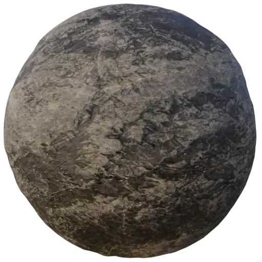

|

**This material is contained in the following Exapacks:**

    - XTRPbr_05k_Vol_001

    - XTRPbr_1k_Vol_001

    - XTRPbr_2k_Vol_002

    - XTRPbr_4k_Vol_010

    - XTRPbr_8k_Vol_029

------------------------------------------------------------------------------------------------------------------------

Blue Rock 001
*************

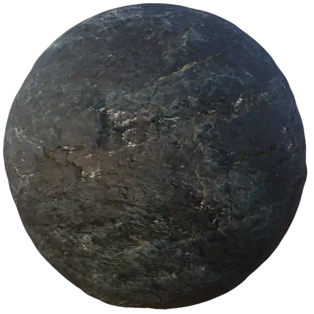

|

**This material is contained in the following Exapacks:**

    - XTRPbr_05k_Vol_001

    - XTRPbr_1k_Vol_001

    - XTRPbr_2k_Vol_002

    - XTRPbr_4k_Vol_010

    - XTRPbr_8k_Vol_029

------------------------------------------------------------------------------------------------------------------------

Brown Rock 001
**************

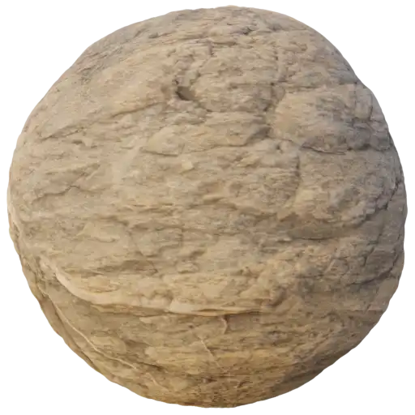

|

**This material is contained in the following Exapacks:**

    - XTRPbr_05k_Vol_001

    - XTRPbr_1k_Vol_001

    - XTRPbr_2k_Vol_002

------------------------------------------------------------------------------------------------------------------------

Brown Rock 002
**************

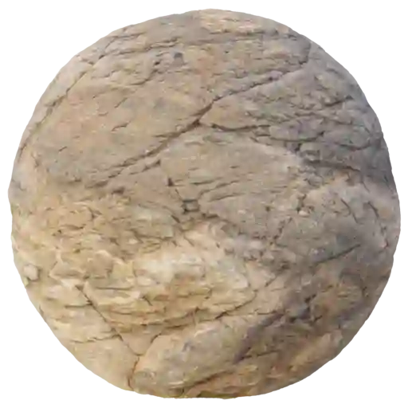

|

**This material is contained in the following Exapacks:**

    - XTRPbr_05k_Vol_001

    - XTRPbr_1k_Vol_001

    - XTRPbr_2k_Vol_002

------------------------------------------------------------------------------------------------------------------------

Brown Rock 003
**************

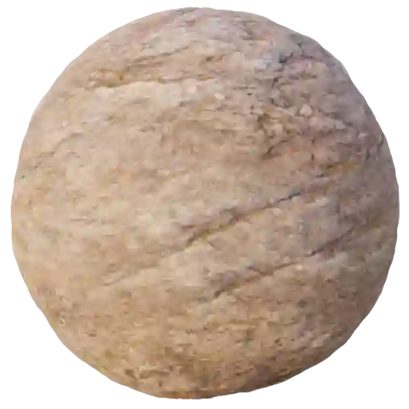

|

**This material is contained in the following Exapacks:**

    - XTRPbr_05k_Vol_001

    - XTRPbr_1k_Vol_001

    - XTRPbr_2k_Vol_002

------------------------------------------------------------------------------------------------------------------------

Brown Rock 004
**************

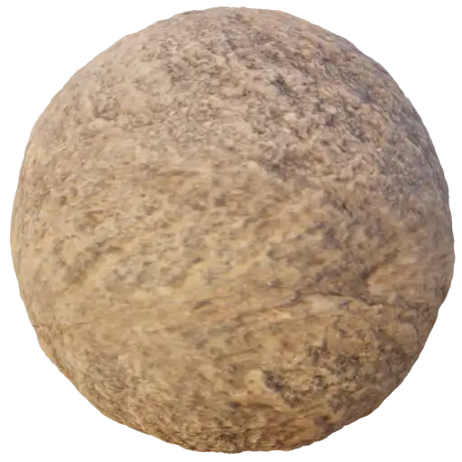

|

**This material is contained in the following Exapacks:**

    - XTRPbr_05k_Vol_001

    - XTRPbr_1k_Vol_001

    - XTRPbr_2k_Vol_002

------------------------------------------------------------------------------------------------------------------------

Brown Rock 005
**************

.. image:: _static/_images/material_list/rock_solid/brown_rock_005/brown_rock_005.webp
    :width: 30%
    :align: center
    :alt: Brown Rock 005

|

**This material is contained in the following Exapacks:**

    - XTRPbr_05k_Vol_001

    - XTRPbr_1k_Vol_001

    - XTRPbr_2k_Vol_002

------------------------------------------------------------------------------------------------------------------------

Brown Rock 006
**************

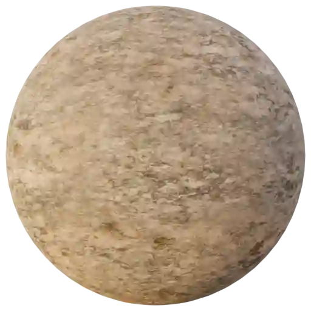

|

**This material is contained in the following Exapacks:**

    - XTRPbr_05k_Vol_001

    - XTRPbr_1k_Vol_001

    - XTRPbr_2k_Vol_002

    - XTRPbr_4k_Vol_010

    - XTRPbr_8k_Vol_029

------------------------------------------------------------------------------------------------------------------------

Brown Rock 007
**************

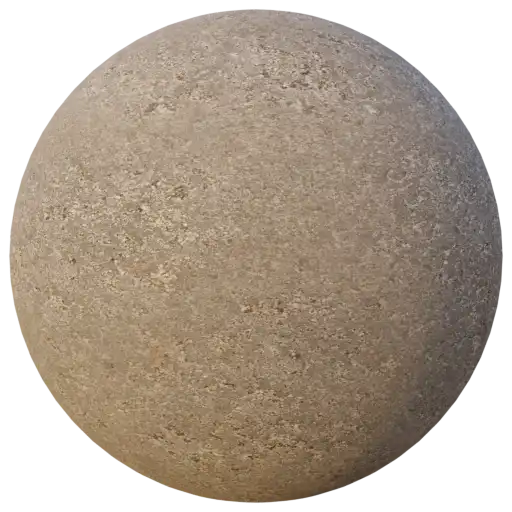

|

**This material is contained in the following Exapacks:**

    - XTRPbr_05k_Vol_001

    - XTRPbr_1k_Vol_001

    - XTRPbr_2k_Vol_002

    - XTRPbr_4k_Vol_010

    - XTRPbr_8k_Vol_029

------------------------------------------------------------------------------------------------------------------------

Brown Rock 008
**************

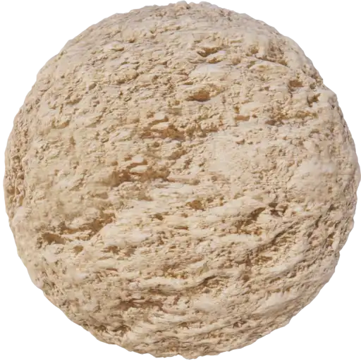

|

**This material is contained in the following Exapacks:**

    - XTRPbr_05k_Vol_001

    - XTRPbr_1k_Vol_001

    - XTRPbr_2k_Vol_002

    - XTRPbr_4k_Vol_010

------------------------------------------------------------------------------------------------------------------------

Brown Rock 009
**************

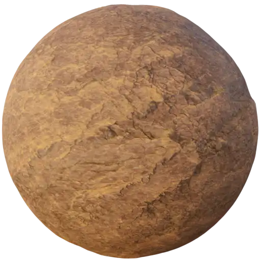

|

**This material is contained in the following Exapacks:**

    - XTRPbr_05k_Vol_001

    - XTRPbr_1k_Vol_001

    - XTRPbr_2k_Vol_002

    - XTRPbr_4k_Vol_010

    - XTRPbr_8k_Vol_029

------------------------------------------------------------------------------------------------------------------------

Brown Rock 010
**************

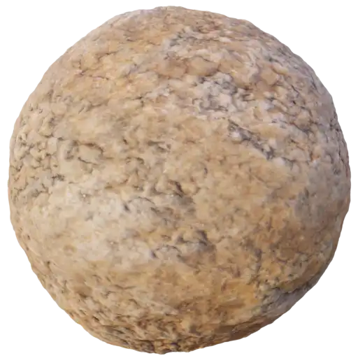

|

**This material is contained in the following Exapacks:**

    - XTRPbr_05k_Vol_001

    - XTRPbr_1k_Vol_001

    - XTRPbr_2k_Vol_002

------------------------------------------------------------------------------------------------------------------------

Brown Rock 011
**************

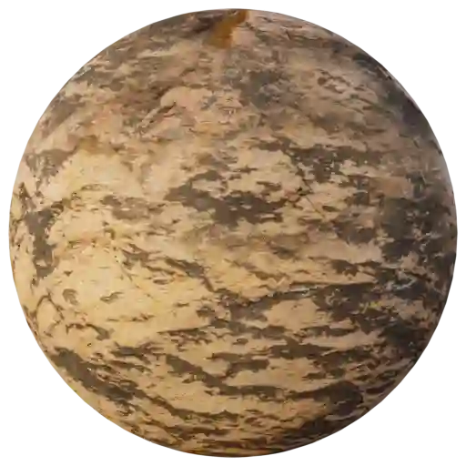

|

**This material is contained in the following Exapacks:**

    - XTRPbr_05k_Vol_001

    - XTRPbr_1k_Vol_001

    - XTRPbr_2k_Vol_002

    - XTRPbr_4k_Vol_010

    - XTRPbr_8k_Vol_029

------------------------------------------------------------------------------------------------------------------------

Brown Rock 012
**************

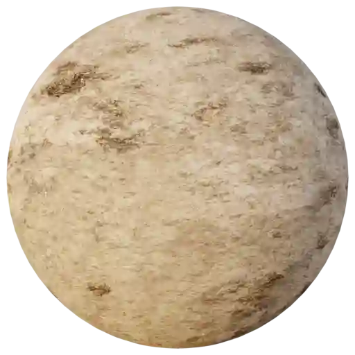

|

**This material is contained in the following Exapacks:**

    - XTRPbr_05k_Vol_001

    - XTRPbr_1k_Vol_001

    - XTRPbr_2k_Vol_002

    - XTRPbr_4k_Vol_010

    - XTRPbr_8k_Vol_029

------------------------------------------------------------------------------------------------------------------------

Brown Rock 013
**************

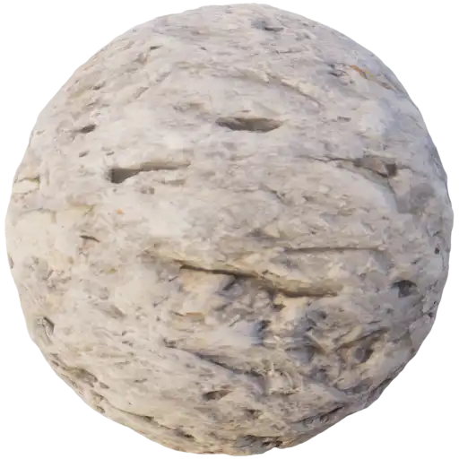

|

**This material is contained in the following Exapacks:**

    - XTRPbr_05k_Vol_001

    - XTRPbr_1k_Vol_001

    - XTRPbr_2k_Vol_002

------------------------------------------------------------------------------------------------------------------------

Brown Rock 014
**************

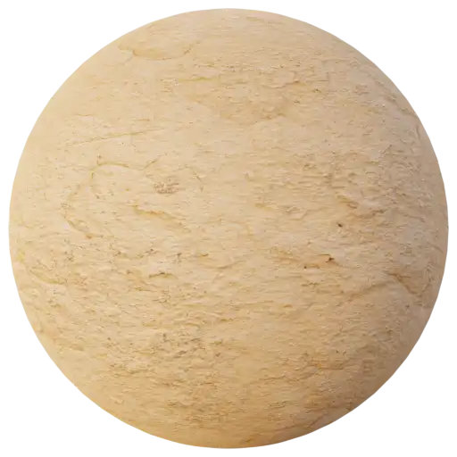

|

**This material is contained in the following Exapacks:**

    - XTRPbr_05k_Vol_001

    - XTRPbr_1k_Vol_001

    - XTRPbr_2k_Vol_002

    - XTRPbr_4k_Vol_010

    - XTRPbr_8k_Vol_029

------------------------------------------------------------------------------------------------------------------------

Brown Rock 015
**************

.. image:: _static/_images/material_list/rock_solid/brown_rock_015/brown_rock_015.webp
    :width: 30%
    :align: center
    :alt: Brown Rock 015

|

**This material is contained in the following Exapacks:**

    - XTRPbr_05k_Vol_001

    - XTRPbr_1k_Vol_001

    - XTRPbr_2k_Vol_002

------------------------------------------------------------------------------------------------------------------------

Brown Rock 016
**************

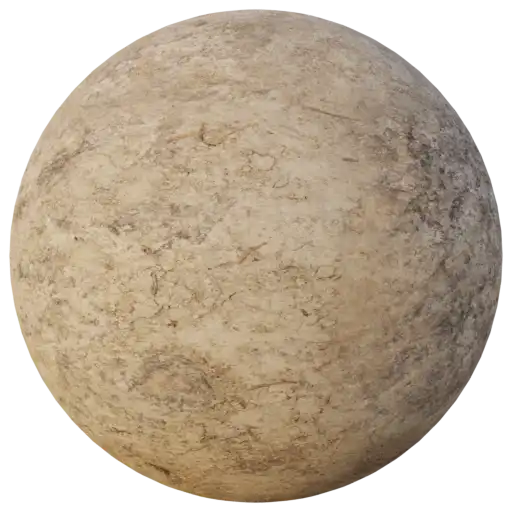

|

**This material is contained in the following Exapacks:**

    - XTRPbr_05k_Vol_001

    - XTRPbr_1k_Vol_001

    - XTRPbr_2k_Vol_002

    - XTRPbr_4k_Vol_010

    - XTRPbr_8k_Vol_029

------------------------------------------------------------------------------------------------------------------------

Brown Rock 017
**************

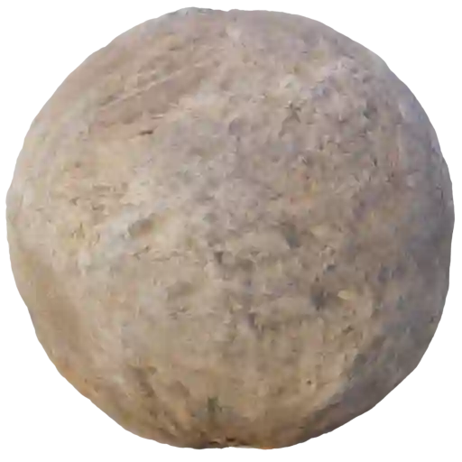

|

**This material is contained in the following Exapacks:**

    - XTRPbr_05k_Vol_001

    - XTRPbr_1k_Vol_001

    - XTRPbr_2k_Vol_002

------------------------------------------------------------------------------------------------------------------------

Brown Rock 018
**************

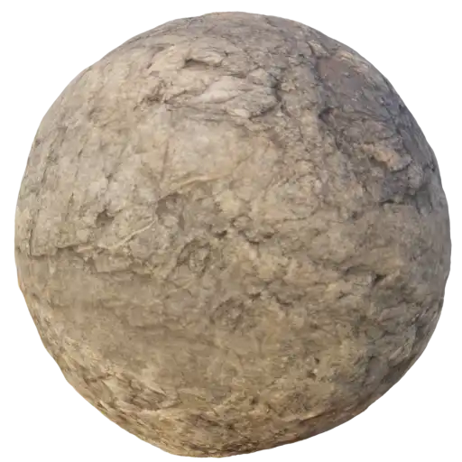

|

**This material is contained in the following Exapacks:**

    - XTRPbr_05k_Vol_001

    - XTRPbr_1k_Vol_001

    - XTRPbr_2k_Vol_002

------------------------------------------------------------------------------------------------------------------------

Brown Rock 019
**************

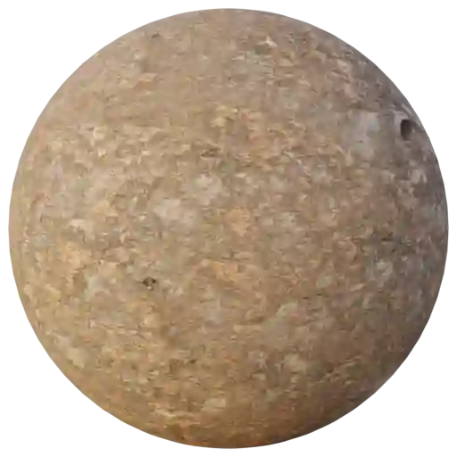

|

**This material is contained in the following Exapacks:**

    - XTRPbr_05k_Vol_001

    - XTRPbr_1k_Vol_001

    - XTRPbr_2k_Vol_002

    - XTRPbr_4k_Vol_010

    - XTRPbr_8k_Vol_029

------------------------------------------------------------------------------------------------------------------------

Brown Rock 020
**************

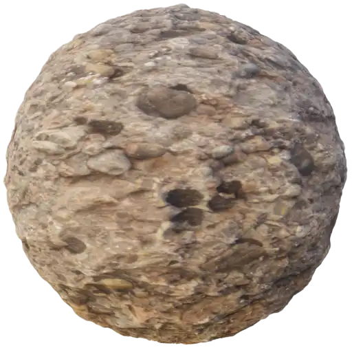

|

**This material is contained in the following Exapacks:**

    - XTRPbr_05k_Vol_001

    - XTRPbr_1k_Vol_001

    - XTRPbr_2k_Vol_002

------------------------------------------------------------------------------------------------------------------------

Brown Rock 021
**************

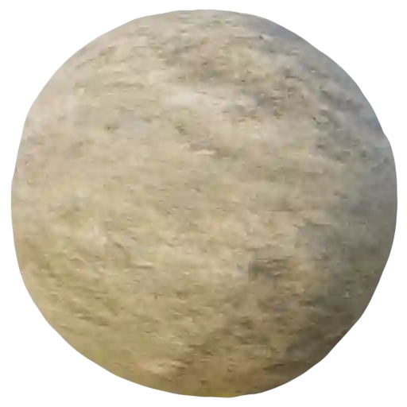

|

**This material is contained in the following Exapacks:**

    - XTRPbr_05k_Vol_001

    - XTRPbr_1k_Vol_001

    - XTRPbr_2k_Vol_002

    - XTRPbr_4k_Vol_010

------------------------------------------------------------------------------------------------------------------------

Brown Rock 022
**************

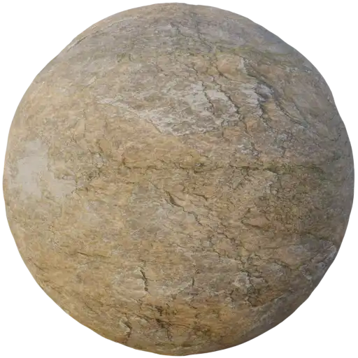

|

**This material is contained in the following Exapacks:**

    - XTRPbr_05k_Vol_001

    - XTRPbr_1k_Vol_001

    - XTRPbr_2k_Vol_002

    - XTRPbr_4k_Vol_010

    - XTRPbr_8k_Vol_029

------------------------------------------------------------------------------------------------------------------------

Green Rock 001
**************

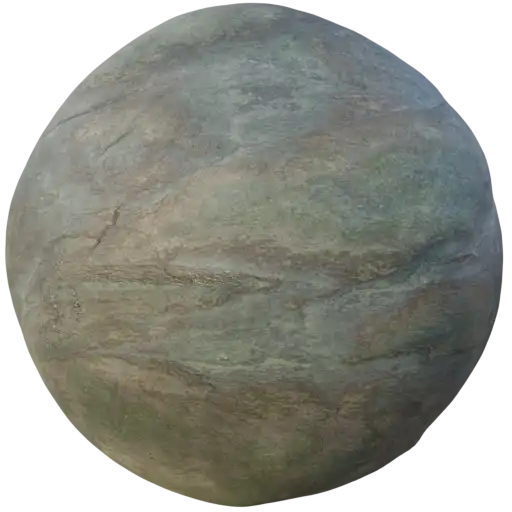

|

**This material is contained in the following Exapacks:**

    - XTRPbr_05k_Vol_001

    - XTRPbr_1k_Vol_001

    - XTRPbr_2k_Vol_002

    - XTRPbr_4k_Vol_010

    - XTRPbr_8k_Vol_029

------------------------------------------------------------------------------------------------------------------------

Grey Rock 001
*************

.. image:: _static/_images/material_list/rock_solid/grey_rock_001/grey_rock_001.webp
    :width: 30%
    :align: center
    :alt: Grey Rock 001

|

**This material is contained in the following Exapacks:**

    - XTRPbr_05k_Vol_001

    - XTRPbr_1k_Vol_001

    - XTRPbr_2k_Vol_002

    - XTRPbr_4k_Vol_010

    - XTRPbr_8k_Vol_029

------------------------------------------------------------------------------------------------------------------------

Grey Rock 002
*************

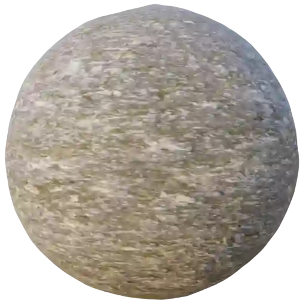

|

**This material is contained in the following Exapacks:**

    - XTRPbr_05k_Vol_001

    - XTRPbr_1k_Vol_001

    - XTRPbr_2k_Vol_002

    - XTRPbr_4k_Vol_010

------------------------------------------------------------------------------------------------------------------------

Grey Rock 003
*************

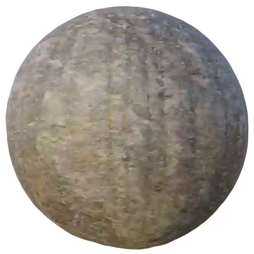

|

**This material is contained in the following Exapacks:**

    - XTRPbr_05k_Vol_001

    - XTRPbr_1k_Vol_001

    - XTRPbr_2k_Vol_002

    - XTRPbr_4k_Vol_010

    - XTRPbr_8k_Vol_029

------------------------------------------------------------------------------------------------------------------------

Grey Rock 004
*************

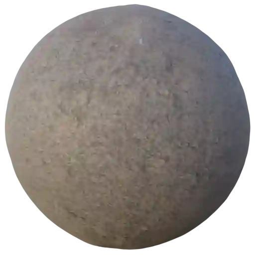

|

**This material is contained in the following Exapacks:**

    - XTRPbr_05k_Vol_001

    - XTRPbr_1k_Vol_001

    - XTRPbr_2k_Vol_002

    - XTRPbr_4k_Vol_010

------------------------------------------------------------------------------------------------------------------------

Grey Rock 005
*************

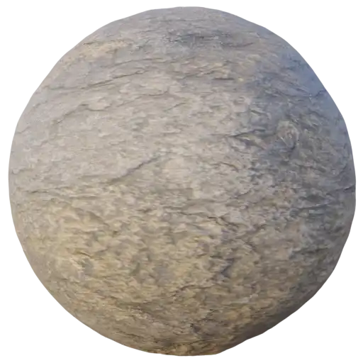

|

**This material is contained in the following Exapacks:**

    - XTRPbr_05k_Vol_001

    - XTRPbr_1k_Vol_001

    - XTRPbr_2k_Vol_002

    - XTRPbr_4k_Vol_010

    - XTRPbr_8k_Vol_029

------------------------------------------------------------------------------------------------------------------------

Grey Rock 006
*************

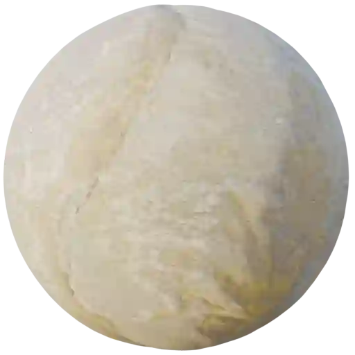

|

**This material is contained in the following Exapacks:**

    - XTRPbr_05k_Vol_001

    - XTRPbr_1k_Vol_001

    - XTRPbr_2k_Vol_002

    - XTRPbr_4k_Vol_010

    - XTRPbr_8k_Vol_029

------------------------------------------------------------------------------------------------------------------------

Grey Rock 007
*************

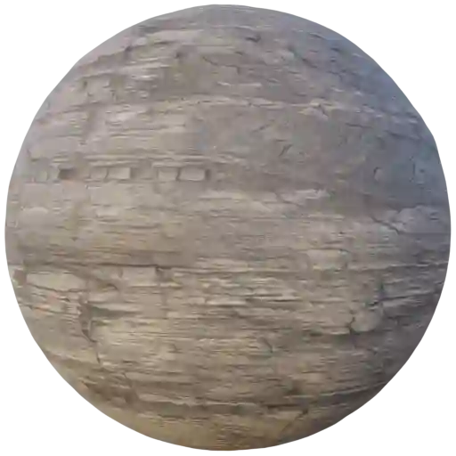

|

**This material is contained in the following Exapacks:**

    - XTRPbr_05k_Vol_001

    - XTRPbr_1k_Vol_001

    - XTRPbr_2k_Vol_002

    - XTRPbr_4k_Vol_010

    - XTRPbr_8k_Vol_029

------------------------------------------------------------------------------------------------------------------------

Grey Rock 008
*************

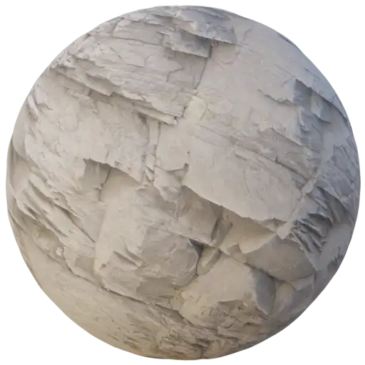

|

**This material is contained in the following Exapacks:**

    - XTRPbr_05k_Vol_001

    - XTRPbr_1k_Vol_001

    - XTRPbr_2k_Vol_002

    - XTRPbr_4k_Vol_010

    - XTRPbr_8k_Vol_029

------------------------------------------------------------------------------------------------------------------------

Grey Rock 009
*************

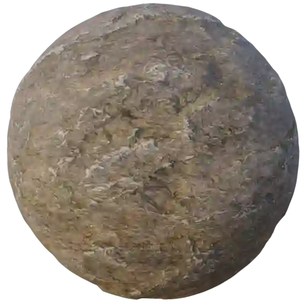

|

**This material is contained in the following Exapacks:**

    - XTRPbr_05k_Vol_001

    - XTRPbr_1k_Vol_001

    - XTRPbr_2k_Vol_002

    - XTRPbr_4k_Vol_010

    - XTRPbr_8k_Vol_029

------------------------------------------------------------------------------------------------------------------------

Grey Rock 010
*************

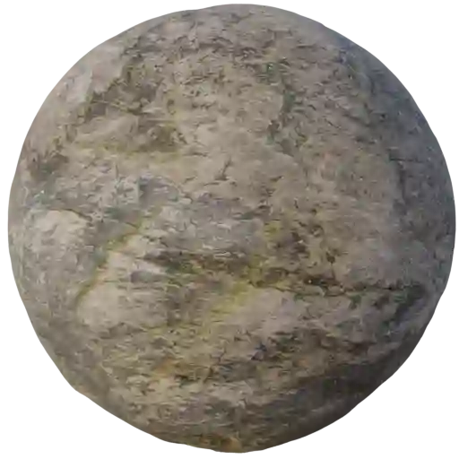

|

**This material is contained in the following Exapacks:**

    - XTRPbr_05k_Vol_001

    - XTRPbr_1k_Vol_001

    - XTRPbr_2k_Vol_002

    - XTRPbr_4k_Vol_010

    - XTRPbr_8k_Vol_029

------------------------------------------------------------------------------------------------------------------------

Grey Rock 011
*************

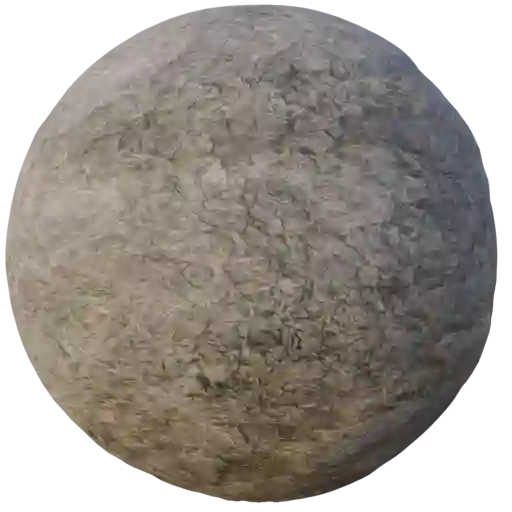

|

**This material is contained in the following Exapacks:**

    - XTRPbr_05k_Vol_001

    - XTRPbr_1k_Vol_001

    - XTRPbr_2k_Vol_002

    - XTRPbr_4k_Vol_010

    - XTRPbr_8k_Vol_029

------------------------------------------------------------------------------------------------------------------------

Grey Rock 012
*************

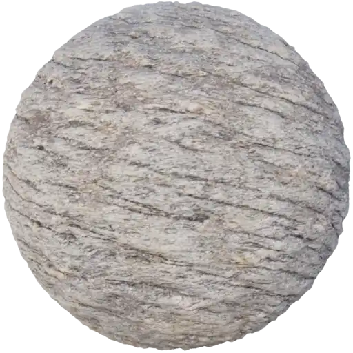

|

**This material is contained in the following Exapacks:**

    - XTRPbr_05k_Vol_001

    - XTRPbr_1k_Vol_001

    - XTRPbr_2k_Vol_002

    - XTRPbr_4k_Vol_010

------------------------------------------------------------------------------------------------------------------------

Grey Rock 013
*************

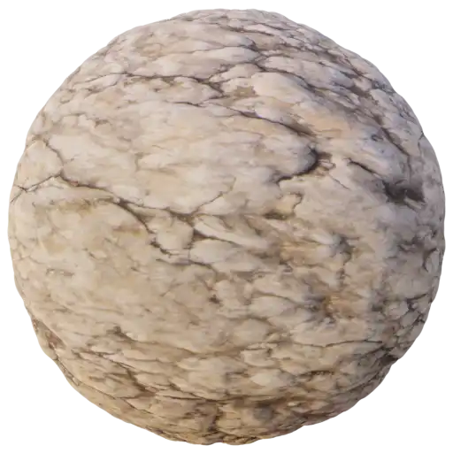

|

**This material is contained in the following Exapacks:**

    - XTRPbr_05k_Vol_001

    - XTRPbr_1k_Vol_001

    - XTRPbr_2k_Vol_002

------------------------------------------------------------------------------------------------------------------------

Grey Rock 014
*************

.. image:: _static/_images/material_list/rock_solid/grey_rock_014/grey_rock_014.webp
    :width: 30%
    :align: center
    :alt: Grey Rock 014

|

**This material is contained in the following Exapacks:**

    - XTRPbr_05k_Vol_001

    - XTRPbr_1k_Vol_001

    - XTRPbr_2k_Vol_002

    - XTRPbr_4k_Vol_010

    - XTRPbr_8k_Vol_029

------------------------------------------------------------------------------------------------------------------------

Grey Rock 015
*************

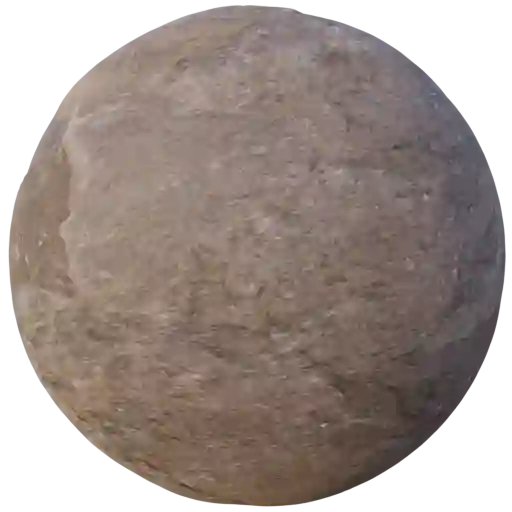

|

**This material is contained in the following Exapacks:**

    - XTRPbr_05k_Vol_001

    - XTRPbr_1k_Vol_001

    - XTRPbr_2k_Vol_002

    - XTRPbr_4k_Vol_010

    - XTRPbr_8k_Vol_029

------------------------------------------------------------------------------------------------------------------------

Grey Rock 016
*************

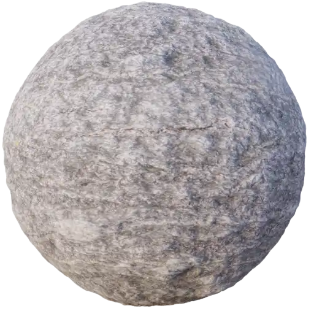

|

**This material is contained in the following Exapacks:**

    - XTRPbr_05k_Vol_001

    - XTRPbr_1k_Vol_001

    - XTRPbr_2k_Vol_002

------------------------------------------------------------------------------------------------------------------------

Grey Rock 017
*************

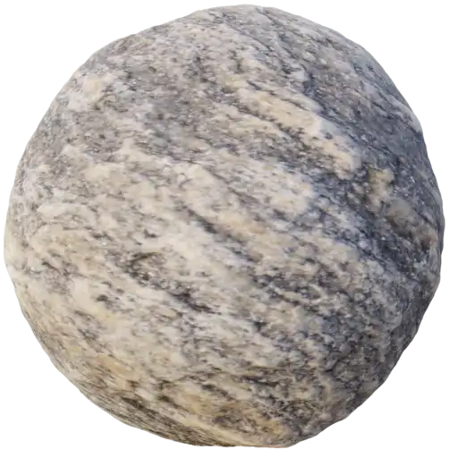

|

**This material is contained in the following Exapacks:**

    - XTRPbr_05k_Vol_001

    - XTRPbr_1k_Vol_001

    - XTRPbr_2k_Vol_002

------------------------------------------------------------------------------------------------------------------------

Grey Rock 018
*************

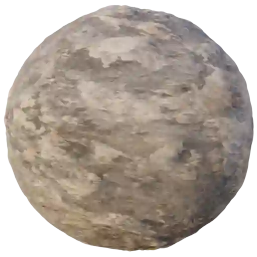

|

**This material is contained in the following Exapacks:**

    - XTRPbr_05k_Vol_001

    - XTRPbr_1k_Vol_001

    - XTRPbr_2k_Vol_002

------------------------------------------------------------------------------------------------------------------------

Grey Rock 019
*************

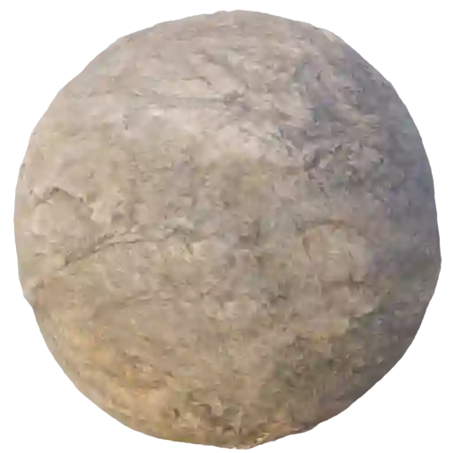

|

**This material is contained in the following Exapacks:**

    - XTRPbr_05k_Vol_001

    - XTRPbr_1k_Vol_001

    - XTRPbr_2k_Vol_002

------------------------------------------------------------------------------------------------------------------------

Grey Rock 020
*************

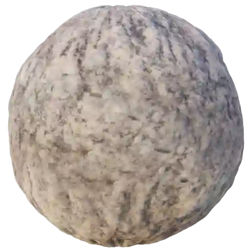

|

**This material is contained in the following Exapacks:**

    - XTRPbr_05k_Vol_001

    - XTRPbr_1k_Vol_001

    - XTRPbr_2k_Vol_002

------------------------------------------------------------------------------------------------------------------------

Mossy Rock 001
**************

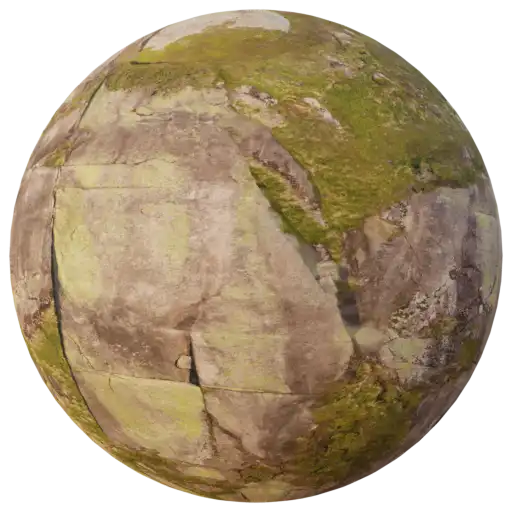

|

**This material is contained in the following Exapacks:**

    - XTRPbr_05k_Vol_001

    - XTRPbr_1k_Vol_001

    - XTRPbr_2k_Vol_002

    - XTRPbr_4k_Vol_004

    - XTRPbr_4k_Vol_010

    - XTRPbr_8k_Vol_029

------------------------------------------------------------------------------------------------------------------------

Mossy Rock 002
**************

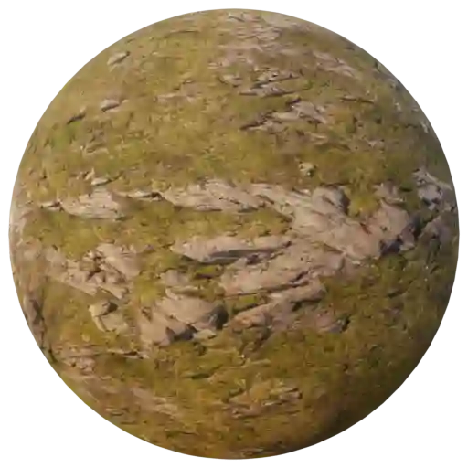

|

**This material is contained in the following Exapacks:**

    - XTRPbr_05k_Vol_001

    - XTRPbr_1k_Vol_001

    - XTRPbr_2k_Vol_002

    - XTRPbr_4k_Vol_004

    - XTRPbr_8k_Vol_029

------------------------------------------------------------------------------------------------------------------------

Mossy Rock 003
**************

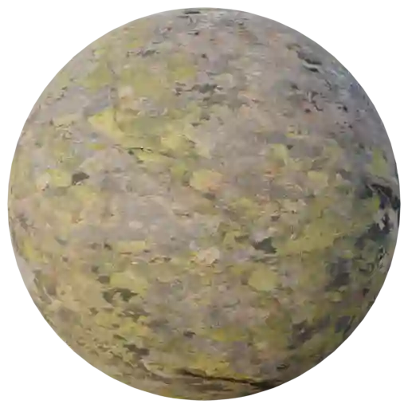

|

**This material is contained in the following Exapacks:**

    - XTRPbr_05k_Vol_001

    - XTRPbr_1k_Vol_001

    - XTRPbr_2k_Vol_002

    - XTRPbr_4k_Vol_004

    - XTRPbr_8k_Vol_009

    - XTRPbr_8k_Vol_029

------------------------------------------------------------------------------------------------------------------------

Mossy Rock 004
**************

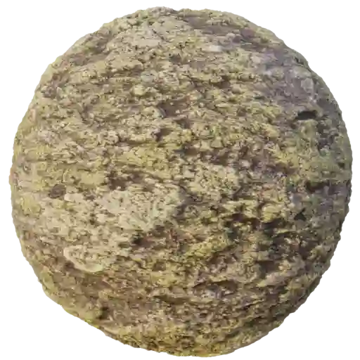

|

**This material is contained in the following Exapacks:**

    - XTRPbr_05k_Vol_001

    - XTRPbr_1k_Vol_001

    - XTRPbr_2k_Vol_002

------------------------------------------------------------------------------------------------------------------------

Mossy Rock 005
**************

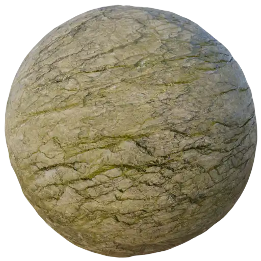

|

**This material is contained in the following Exapacks:**

    - XTRPbr_05k_Vol_001

    - XTRPbr_1k_Vol_001

    - XTRPbr_2k_Vol_002

    - XTRPbr_4k_Vol_004

    - XTRPbr_8k_Vol_009

------------------------------------------------------------------------------------------------------------------------

Mossy Rock 006
**************

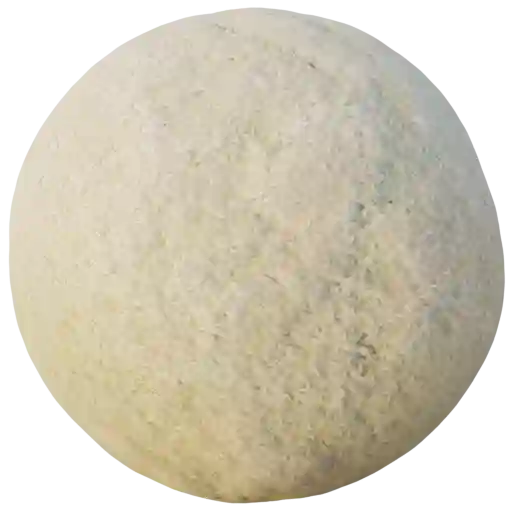

|

**This material is contained in the following Exapacks:**

    - XTRPbr_05k_Vol_001

    - XTRPbr_1k_Vol_001

    - XTRPbr_2k_Vol_002

    - XTRPbr_4k_Vol_004

    - XTRPbr_8k_Vol_009

------------------------------------------------------------------------------------------------------------------------

Mossy Rock 007
**************

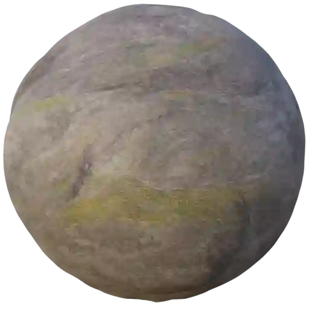

|

**This material is contained in the following Exapacks:**

    - XTRPbr_05k_Vol_001

    - XTRPbr_1k_Vol_001

    - XTRPbr_2k_Vol_002

    - XTRPbr_4k_Vol_004

    - XTRPbr_8k_Vol_009

------------------------------------------------------------------------------------------------------------------------

Mossy Rock 008
**************

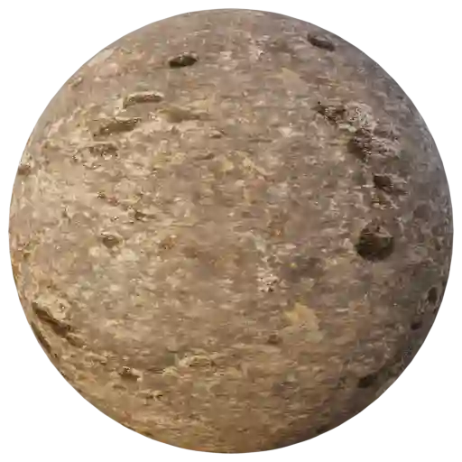

|

**This material is contained in the following Exapacks:**

    - XTRPbr_05k_Vol_001

    - XTRPbr_1k_Vol_001

    - XTRPbr_2k_Vol_002

    - XTRPbr_4k_Vol_004

    - XTRPbr_8k_Vol_009

------------------------------------------------------------------------------------------------------------------------

Mossy Rock 009
**************

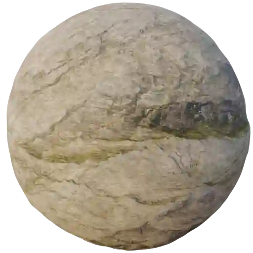

|

**This material is contained in the following Exapacks:**

    - XTRPbr_05k_Vol_001

    - XTRPbr_1k_Vol_001

    - XTRPbr_2k_Vol_002

    - XTRPbr_4k_Vol_004

    - XTRPbr_8k_Vol_009

------------------------------------------------------------------------------------------------------------------------

Mossy Rock 010
**************

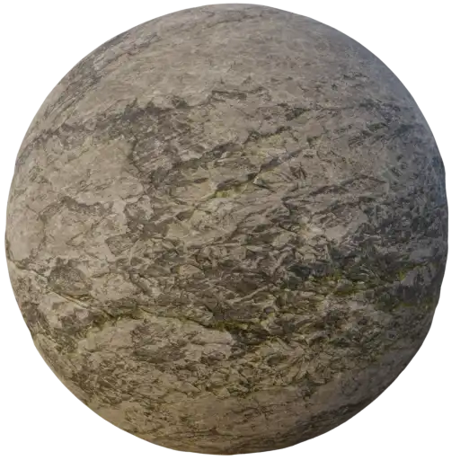

|

**This material is contained in the following Exapacks:**

    - XTRPbr_05k_Vol_001

    - XTRPbr_1k_Vol_001

    - XTRPbr_2k_Vol_002

    - XTRPbr_4k_Vol_004

    - XTRPbr_8k_Vol_009

------------------------------------------------------------------------------------------------------------------------

Mossy Rock 011
**************

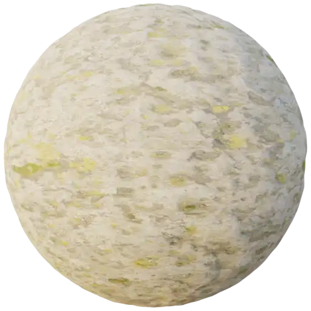

|

**This material is contained in the following Exapacks:**

    - XTRPbr_05k_Vol_001

    - XTRPbr_1k_Vol_001

    - XTRPbr_2k_Vol_002

    - XTRPbr_4k_Vol_004

    - XTRPbr_8k_Vol_009

------------------------------------------------------------------------------------------------------------------------

Seaside Rocks 001
*****************

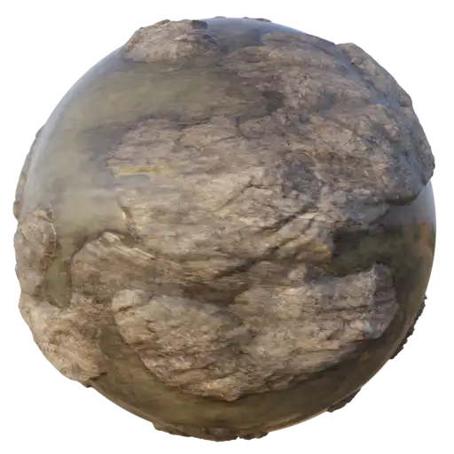

|

**This material is contained in the following Exapacks:**

    - XTRPbr_05k_Vol_001

    - XTRPbr_1k_Vol_001

    - XTRPbr_2k_Vol_002

    - XTRPbr_4k_Vol_004

------------------------------------------------------------------------------------------------------------------------

Seaside Rocks 002
*****************

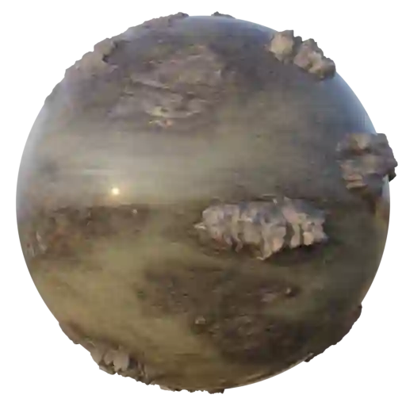

|

**This material is contained in the following Exapacks:**

    - XTRPbr_05k_Vol_001

    - XTRPbr_1k_Vol_001

    - XTRPbr_2k_Vol_002

    - XTRPbr_4k_Vol_004

------------------------------------------------------------------------------------------------------------------------

White Rock 001
**************

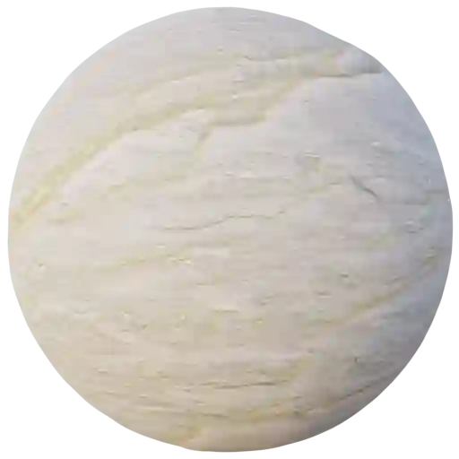

|

**This material is contained in the following Exapacks:**

    - XTRPbr_05k_Vol_001

    - XTRPbr_1k_Vol_001

    - XTRPbr_2k_Vol_002

    - XTRPbr_4k_Vol_004

    - XTRPbr_8k_Vol_009

------------------------------------------------------------------------------------------------------------------------

White Rock 002
**************

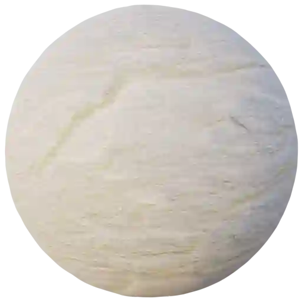

|

**This material is contained in the following Exapacks:**

    - XTRPbr_05k_Vol_001

    - XTRPbr_1k_Vol_001

    - XTRPbr_2k_Vol_002

    - XTRPbr_4k_Vol_004

    - XTRPbr_8k_Vol_009

------------------------------------------------------------------------------------------------------------------------

White Rock 003
**************

.. image:: _static/_images/material_list/rock_solid/white_rock_003/white_rock_003.webp
    :width: 30%
    :align: center
    :alt: White Rock 003

|

**This material is contained in the following Exapacks:**

    - XTRPbr_05k_Vol_001

    - XTRPbr_1k_Vol_001

    - XTRPbr_2k_Vol_002

    - XTRPbr_4k_Vol_004

    - XTRPbr_8k_Vol_009

------------------------------------------------------------------------------------------------------------------------

White Rock 004
**************

.. image:: _static/_images/material_list/rock_solid/white_rock_004/white_rock_004.webp
    :width: 30%
    :align: center
    :alt: White Rock 004

|

**This material is contained in the following Exapacks:**

    - XTRPbr_05k_Vol_001

    - XTRPbr_1k_Vol_001

    - XTRPbr_2k_Vol_002

    - XTRPbr_4k_Vol_004

    - XTRPbr_8k_Vol_009

------------------------------------------------------------------------------------------------------------------------

White Rock 005
**************

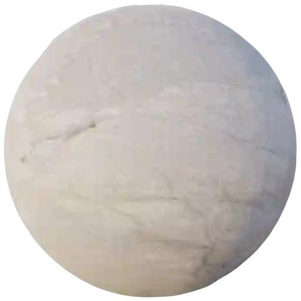

|

**This material is contained in the following Exapacks:**

    - XTRPbr_05k_Vol_001

    - XTRPbr_1k_Vol_001

    - XTRPbr_2k_Vol_002

    - XTRPbr_4k_Vol_004

    - XTRPbr_8k_Vol_009

------------------------------------------------------------------------------------------------------------------------

Roof (Category)
---------------

Canadian Red Roof 001
*********************

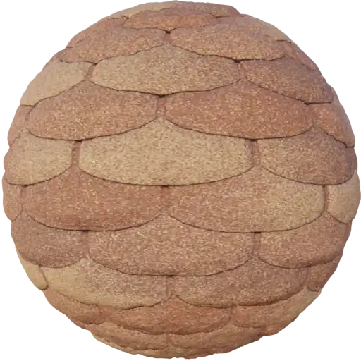

|

**This material is contained in the following Exapacks:**

    - XTRPbr_05k_Vol_001

    - XTRPbr_1k_Vol_001

    - XTRPbr_2k_Vol_002

    - XTRPbr_4k_Vol_004

------------------------------------------------------------------------------------------------------------------------

Clay Roof 001
*************

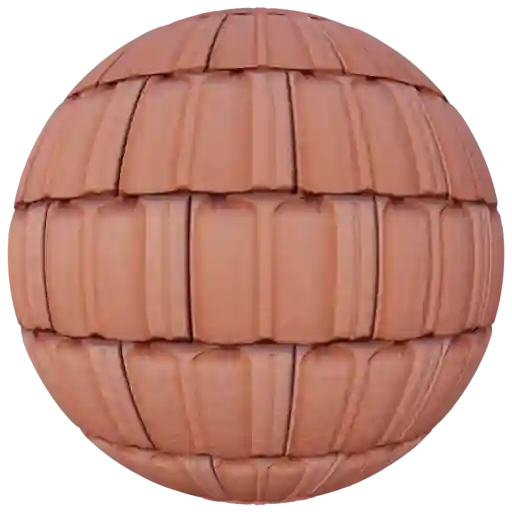

|

**This material is contained in the following Exapacks:**

    - XTRPbr_05k_Vol_001

    - XTRPbr_1k_Vol_001

    - XTRPbr_2k_Vol_002

    - XTRPbr_4k_Vol_004

------------------------------------------------------------------------------------------------------------------------

Clay Roof 002
*************

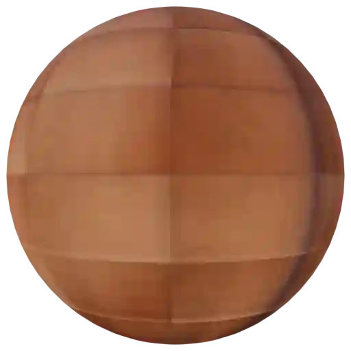

|

**This material is contained in the following Exapacks:**

    - XTRPbr_05k_Vol_001

    - XTRPbr_1k_Vol_001

    - XTRPbr_2k_Vol_002

    - XTRPbr_4k_Vol_004

    - XTRPbr_8k_Vol_009

------------------------------------------------------------------------------------------------------------------------

Concrete Roof 001
*****************

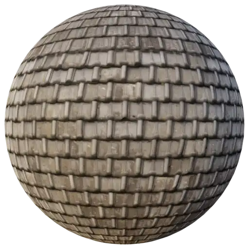

|

**This material is contained in the following Exapacks:**

    - XTRPbr_05k_Vol_001

    - XTRPbr_1k_Vol_001

    - XTRPbr_2k_Vol_002

    - XTRPbr_4k_Vol_004

    - XTRPbr_8k_Vol_009

------------------------------------------------------------------------------------------------------------------------

Metal Roof 001
**************

.. image:: _static/_images/material_list/roof/metal_roof_001/metal_roof_001.webp
    :width: 30%
    :align: center
    :alt: Metal Roof 001

|

**This material is contained in the following Exapacks:**

    - XTRPbr_05k_Vol_001

    - XTRPbr_1k_Vol_001

    - XTRPbr_2k_Vol_002

    - XTRPbr_4k_Vol_004

------------------------------------------------------------------------------------------------------------------------

Old Clay Roof 001
*****************

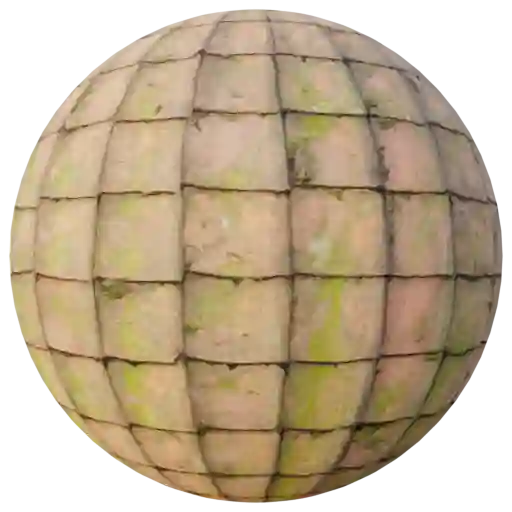

|

**This material is contained in the following Exapacks:**

    - XTRPbr_05k_Vol_001

    - XTRPbr_1k_Vol_001

    - XTRPbr_2k_Vol_002

    - XTRPbr_4k_Vol_004

    - XTRPbr_8k_Vol_009

------------------------------------------------------------------------------------------------------------------------

Old Clay Roof 002
*****************

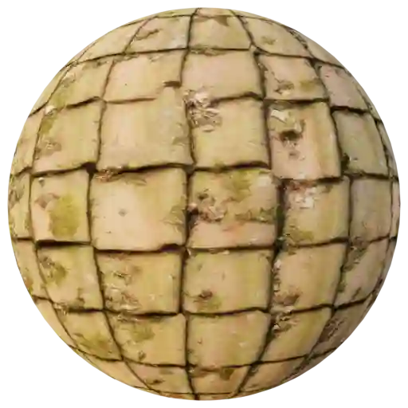

|

**This material is contained in the following Exapacks:**

    - XTRPbr_05k_Vol_001

    - XTRPbr_1k_Vol_001

    - XTRPbr_2k_Vol_002

    - XTRPbr_4k_Vol_004

    - XTRPbr_8k_Vol_009

------------------------------------------------------------------------------------------------------------------------

Old Clay Roof 003
*****************

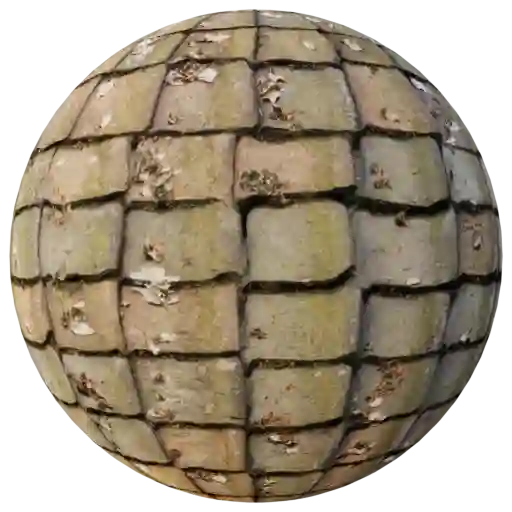

|

**This material is contained in the following Exapacks:**

    - XTRPbr_05k_Vol_001

    - XTRPbr_1k_Vol_001

    - XTRPbr_2k_Vol_002

    - XTRPbr_4k_Vol_004

    - XTRPbr_8k_Vol_009

------------------------------------------------------------------------------------------------------------------------

Old Clay Roof 004
*****************

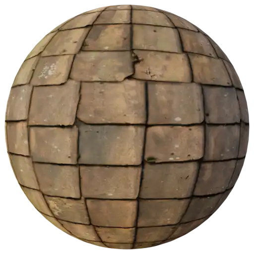

|

**This material is contained in the following Exapacks:**

    - XTRPbr_05k_Vol_001

    - XTRPbr_1k_Vol_001

    - XTRPbr_2k_Vol_002

    - XTRPbr_4k_Vol_004

    - XTRPbr_8k_Vol_009

------------------------------------------------------------------------------------------------------------------------

Old Clay Roof 005
*****************

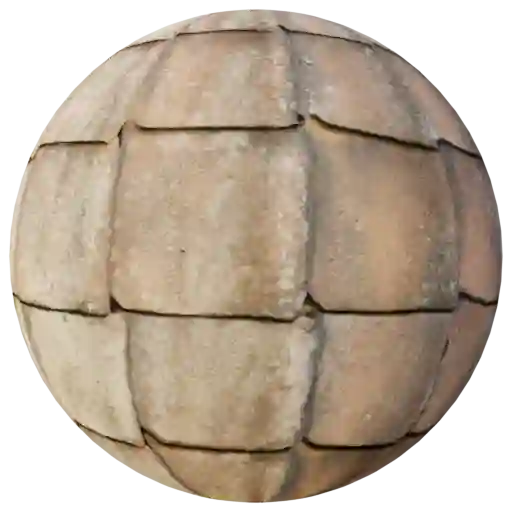

|

**This material is contained in the following Exapacks:**

    - XTRPbr_05k_Vol_001

    - XTRPbr_1k_Vol_001

    - XTRPbr_2k_Vol_002

    - XTRPbr_4k_Vol_004

    - XTRPbr_8k_Vol_009

------------------------------------------------------------------------------------------------------------------------

Old Concrete Roof 001
*********************

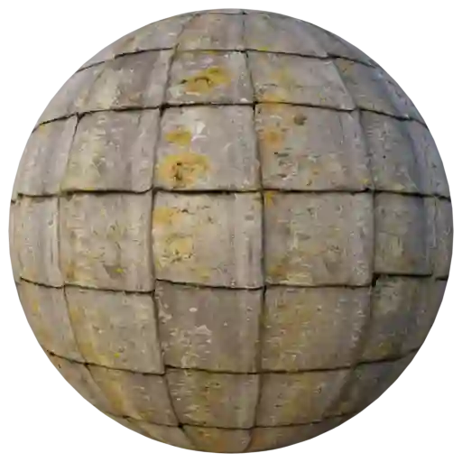

|

**This material is contained in the following Exapacks:**

    - XTRPbr_05k_Vol_001

    - XTRPbr_1k_Vol_001

    - XTRPbr_2k_Vol_002

    - XTRPbr_4k_Vol_004

    - XTRPbr_8k_Vol_009

------------------------------------------------------------------------------------------------------------------------

Slate Roof 001
**************

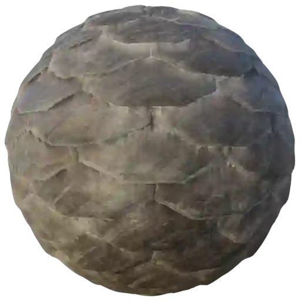

|

**This material is contained in the following Exapacks:**

    - XTRPbr_05k_Vol_001

    - XTRPbr_1k_Vol_001

    - XTRPbr_2k_Vol_002

    - XTRPbr_4k_Vol_004

    - XTRPbr_8k_Vol_009

------------------------------------------------------------------------------------------------------------------------

Slate Roof 002
**************

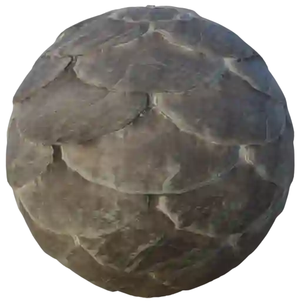

|

**This material is contained in the following Exapacks:**

    - XTRPbr_05k_Vol_001

    - XTRPbr_1k_Vol_001

    - XTRPbr_2k_Vol_002

    - XTRPbr_4k_Vol_004

    - XTRPbr_8k_Vol_009

------------------------------------------------------------------------------------------------------------------------

Slate Roof 003
**************

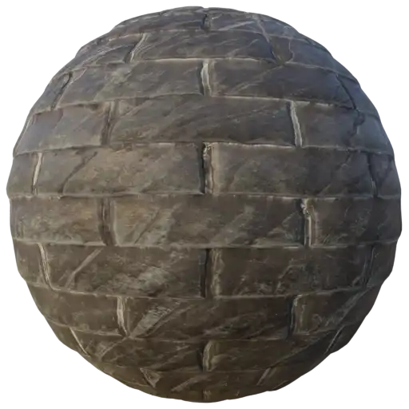

|

**This material is contained in the following Exapacks:**

    - XTRPbr_05k_Vol_001

    - XTRPbr_1k_Vol_001

    - XTRPbr_2k_Vol_002

    - XTRPbr_4k_Vol_004

    - XTRPbr_8k_Vol_009

------------------------------------------------------------------------------------------------------------------------

Slate Roof 004
**************

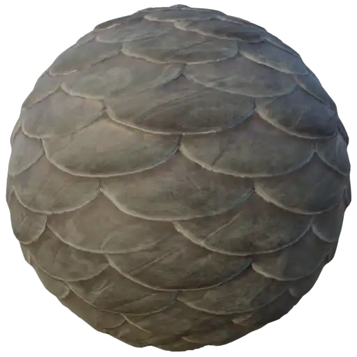

|

**This material is contained in the following Exapacks:**

    - XTRPbr_05k_Vol_001

    - XTRPbr_1k_Vol_001

    - XTRPbr_2k_Vol_002

    - XTRPbr_4k_Vol_004

    - XTRPbr_8k_Vol_009

------------------------------------------------------------------------------------------------------------------------

Slate Roof 005
**************

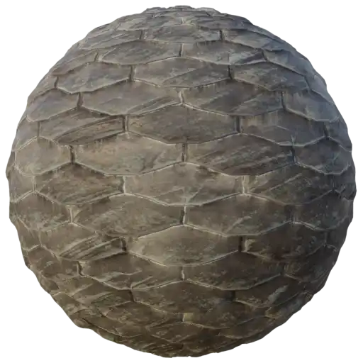

|

**This material is contained in the following Exapacks:**

    - XTRPbr_05k_Vol_001

    - XTRPbr_1k_Vol_001

    - XTRPbr_2k_Vol_002

    - XTRPbr_4k_Vol_004

    - XTRPbr_8k_Vol_009

------------------------------------------------------------------------------------------------------------------------

Slate Roof 006
**************

.. image:: _static/_images/material_list/roof/slate_roof_006/slate_roof_006.webp
    :width: 30%
    :align: center
    :alt: Slate Roof 006

|

**This material is contained in the following Exapacks:**

    - XTRPbr_05k_Vol_001

    - XTRPbr_1k_Vol_001

    - XTRPbr_2k_Vol_002

    - XTRPbr_4k_Vol_004

    - XTRPbr_8k_Vol_009

------------------------------------------------------------------------------------------------------------------------

Slate Roof 007
**************

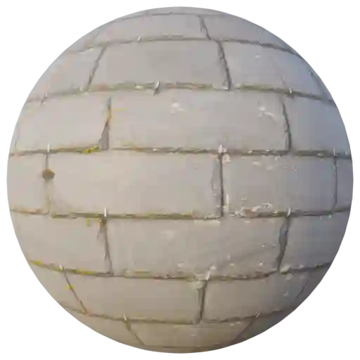

|

**This material is contained in the following Exapacks:**

    - XTRPbr_05k_Vol_001

    - XTRPbr_1k_Vol_001

    - XTRPbr_2k_Vol_002

    - XTRPbr_4k_Vol_004

    - XTRPbr_8k_Vol_009

------------------------------------------------------------------------------------------------------------------------

Slate Roof 008
**************

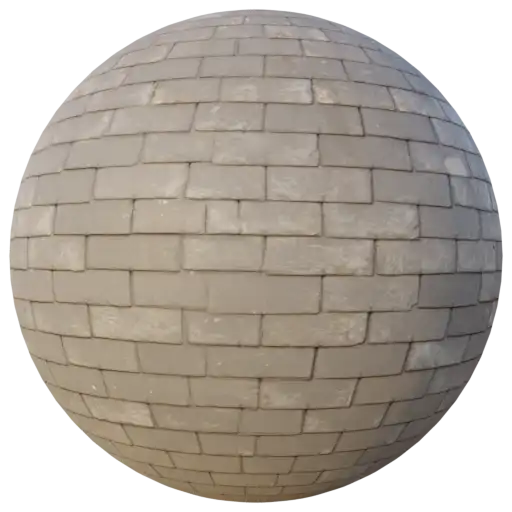

|

**This material is contained in the following Exapacks:**

    - XTRPbr_05k_Vol_001

    - XTRPbr_1k_Vol_001

    - XTRPbr_2k_Vol_002

    - XTRPbr_4k_Vol_004

    - XTRPbr_8k_Vol_009

------------------------------------------------------------------------------------------------------------------------

Thatching Roof 001
******************

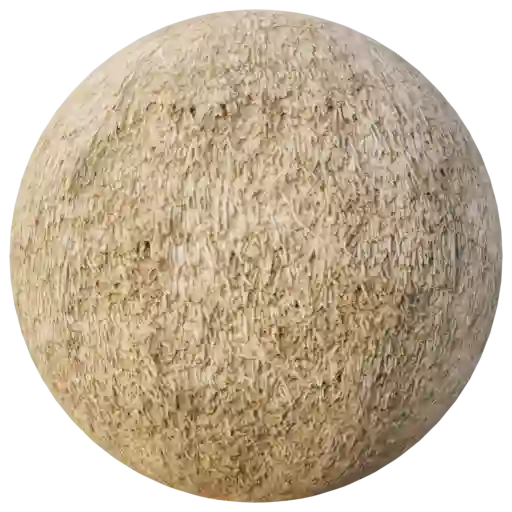

|

**This material is contained in the following Exapacks:**

    - XTRPbr_05k_Vol_001

    - XTRPbr_1k_Vol_001

    - XTRPbr_2k_Vol_002

    - XTRPbr_4k_Vol_004

    - XTRPbr_8k_Vol_009

------------------------------------------------------------------------------------------------------------------------

Thatching Roof 002
******************

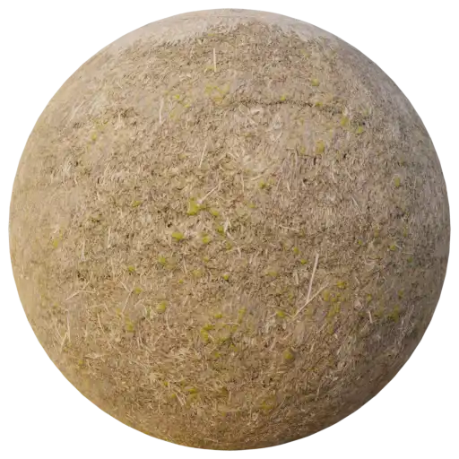

|

**This material is contained in the following Exapacks:**

    - XTRPbr_05k_Vol_001

    - XTRPbr_1k_Vol_001

    - XTRPbr_2k_Vol_002

    - XTRPbr_4k_Vol_004

    - XTRPbr_8k_Vol_009

------------------------------------------------------------------------------------------------------------------------

Thatching Roof 003
******************

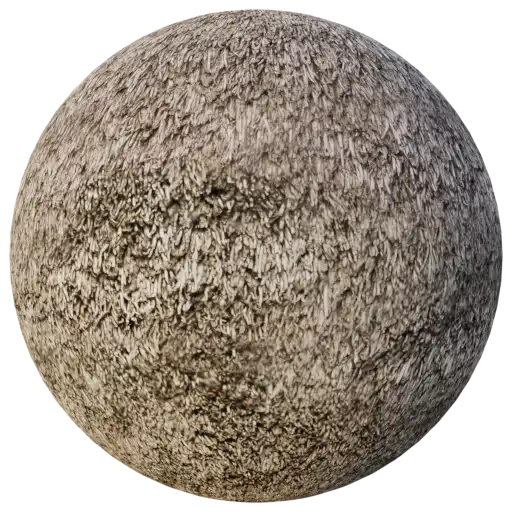

|

**This material is contained in the following Exapacks:**

    - XTRPbr_05k_Vol_001

    - XTRPbr_1k_Vol_001

    - XTRPbr_2k_Vol_002

    - XTRPbr_4k_Vol_004

    - XTRPbr_8k_Vol_009

------------------------------------------------------------------------------------------------------------------------

Wood Slats Roof 001
*******************

.. image:: _static/_images/material_list/roof/wood_slats_roof_001/wood_slats_roof_001.webp
    :width: 30%
    :align: center
    :alt: Wood Slats Roof 001

|

**This material is contained in the following Exapacks:**

    - XTRPbr_05k_Vol_001

    - XTRPbr_1k_Vol_001

    - XTRPbr_2k_Vol_002

    - XTRPbr_4k_Vol_004

    - XTRPbr_8k_Vol_009

------------------------------------------------------------------------------------------------------------------------

Ropes (Category)
----------------

Rope 001
********

.. image:: _static/_images/material_list/ropes/rope_001/rope_001.webp
    :width: 30%
    :align: center
    :alt: Rope 001

|

**This material is contained in the following Exapacks:**

    - XTRPbr_05k_Vol_001

    - XTRPbr_1k_Vol_001

    - XTRPbr_2k_Vol_002

    - XTRPbr_4k_Vol_004

    - XTRPbr_8k_Vol_009

------------------------------------------------------------------------------------------------------------------------

Rope 002
********

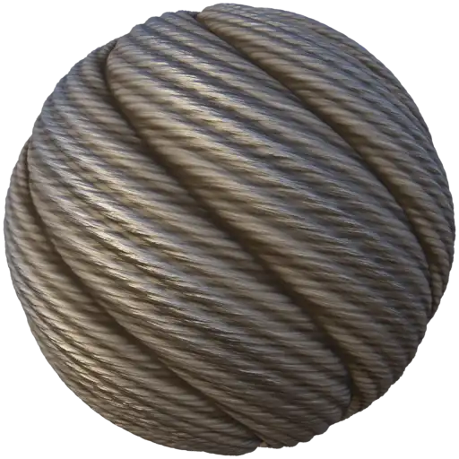

|

**This material is contained in the following Exapacks:**

    - XTRPbr_05k_Vol_001

    - XTRPbr_1k_Vol_001

    - XTRPbr_2k_Vol_002

    - XTRPbr_4k_Vol_004

    - XTRPbr_8k_Vol_009

------------------------------------------------------------------------------------------------------------------------

Rope 003
********

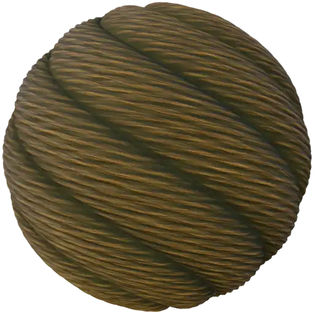

|

**This material is contained in the following Exapacks:**

    - XTRPbr_05k_Vol_001

    - XTRPbr_1k_Vol_001

    - XTRPbr_2k_Vol_002

    - XTRPbr_4k_Vol_004

    - XTRPbr_8k_Vol_009

------------------------------------------------------------------------------------------------------------------------

Sign (Category)
---------------

Sign Danger Orange 001
**********************

.. image:: _static/_images/material_list/sign/sign_danger_orange_001/sign_danger_orange_001.webp
    :width: 30%
    :align: center
    :alt: Sign Danger Orange 001

|

**This material is contained in the following Exapacks:**

    - XTRPbr_05k_Vol_001

    - XTRPbr_1k_Vol_001

    - XTRPbr_2k_Vol_002

    - XTRPbr_4k_Vol_004

    - XTRPbr_8k_Vol_009

------------------------------------------------------------------------------------------------------------------------

Sign Danger Orange 002
**********************

.. image:: _static/_images/material_list/sign/sign_danger_orange_002/sign_danger_orange_002.webp
    :width: 30%
    :align: center
    :alt: Sign Danger Orange 002

|

**This material is contained in the following Exapacks:**

    - XTRPbr_05k_Vol_001

    - XTRPbr_1k_Vol_001

    - XTRPbr_2k_Vol_002

    - XTRPbr_4k_Vol_004

    - XTRPbr_8k_Vol_006

    - XTRPbr_8k_Vol_009

------------------------------------------------------------------------------------------------------------------------

Sign Danger Orange 003
**********************

.. image:: _static/_images/material_list/sign/sign_danger_orange_003/sign_danger_orange_003.webp
    :width: 30%
    :align: center
    :alt: Sign Danger Orange 003

|

**This material is contained in the following Exapacks:**

    - XTRPbr_05k_Vol_001

    - XTRPbr_1k_Vol_001

    - XTRPbr_2k_Vol_002

    - XTRPbr_4k_Vol_004

    - XTRPbr_8k_Vol_006

------------------------------------------------------------------------------------------------------------------------

Sign Danger Red 001
*******************

.. image:: _static/_images/material_list/sign/sign_danger_red_001/sign_danger_red_001.webp
    :width: 30%
    :align: center
    :alt: Sign Danger Red 001

|

**This material is contained in the following Exapacks:**

    - XTRPbr_05k_Vol_001

    - XTRPbr_1k_Vol_001

    - XTRPbr_2k_Vol_002

    - XTRPbr_4k_Vol_004

    - XTRPbr_8k_Vol_006

------------------------------------------------------------------------------------------------------------------------

Sign Danger Red 002
*******************

.. image:: _static/_images/material_list/sign/sign_danger_red_002/sign_danger_red_002.webp
    :width: 30%
    :align: center
    :alt: Sign Danger Red 002

|

**This material is contained in the following Exapacks:**

    - XTRPbr_05k_Vol_001

    - XTRPbr_1k_Vol_001

    - XTRPbr_2k_Vol_002

    - XTRPbr_4k_Vol_004

    - XTRPbr_8k_Vol_006

------------------------------------------------------------------------------------------------------------------------

Sign Danger Yellow 001
**********************

.. image:: _static/_images/material_list/sign/sign_danger_yellow_001/sign_danger_yellow_001.webp
    :width: 30%
    :align: center
    :alt: Sign Danger Yellow 001

|

**This material is contained in the following Exapacks:**

    - XTRPbr_05k_Vol_001

    - XTRPbr_1k_Vol_001

    - XTRPbr_2k_Vol_002

    - XTRPbr_4k_Vol_004

    - XTRPbr_8k_Vol_006

------------------------------------------------------------------------------------------------------------------------

Sign Danger Yellow 002
**********************

.. image:: _static/_images/material_list/sign/sign_danger_yellow_002/sign_danger_yellow_002.webp
    :width: 30%
    :align: center
    :alt: Sign Danger Yellow 002

|

**This material is contained in the following Exapacks:**

    - XTRPbr_05k_Vol_001

    - XTRPbr_1k_Vol_001

    - XTRPbr_2k_Vol_002

    - XTRPbr_4k_Vol_004

    - XTRPbr_8k_Vol_006

------------------------------------------------------------------------------------------------------------------------

Sign Danger Yellow 003
**********************

.. image:: _static/_images/material_list/sign/sign_danger_yellow_003/sign_danger_yellow_003.webp
    :width: 30%
    :align: center
    :alt: Sign Danger Yellow 003

|

**This material is contained in the following Exapacks:**

    - XTRPbr_05k_Vol_001

    - XTRPbr_1k_Vol_001

    - XTRPbr_2k_Vol_002

    - XTRPbr_4k_Vol_004

    - XTRPbr_8k_Vol_006

------------------------------------------------------------------------------------------------------------------------

Sign Danger Yellow 004
**********************

.. image:: _static/_images/material_list/sign/sign_danger_yellow_004/sign_danger_yellow_004.webp
    :width: 30%
    :align: center
    :alt: Sign Danger Yellow 004

|

**This material is contained in the following Exapacks:**

    - XTRPbr_05k_Vol_001

    - XTRPbr_1k_Vol_001

    - XTRPbr_2k_Vol_002

    - XTRPbr_4k_Vol_004

    - XTRPbr_8k_Vol_006

------------------------------------------------------------------------------------------------------------------------

Sign Danger Yellow 005
**********************

.. image:: _static/_images/material_list/sign/sign_danger_yellow_005/sign_danger_yellow_005.webp
    :width: 30%
    :align: center
    :alt: Sign Danger Yellow 005

|

**This material is contained in the following Exapacks:**

    - XTRPbr_05k_Vol_001

    - XTRPbr_1k_Vol_001

    - XTRPbr_2k_Vol_002

    - XTRPbr_4k_Vol_004

    - XTRPbr_8k_Vol_006

------------------------------------------------------------------------------------------------------------------------

Sign Danger Yellow 006
**********************

.. image:: _static/_images/material_list/sign/sign_danger_yellow_006/sign_danger_yellow_006.webp
    :width: 30%
    :align: center
    :alt: Sign Danger Yellow 006

|

**This material is contained in the following Exapacks:**

    - XTRPbr_05k_Vol_001

    - XTRPbr_1k_Vol_001

    - XTRPbr_2k_Vol_002

    - XTRPbr_4k_Vol_004

    - XTRPbr_8k_Vol_006

------------------------------------------------------------------------------------------------------------------------

Sign Danger Yellow 007
**********************

.. image:: _static/_images/material_list/sign/sign_danger_yellow_007/sign_danger_yellow_007.webp
    :width: 30%
    :align: center
    :alt: Sign Danger Yellow 007

|

**This material is contained in the following Exapacks:**

    - XTRPbr_05k_Vol_001

    - XTRPbr_1k_Vol_001

    - XTRPbr_2k_Vol_002

    - XTRPbr_4k_Vol_004

    - XTRPbr_8k_Vol_006

------------------------------------------------------------------------------------------------------------------------

Sign Danger Yellow 008
**********************

.. image:: _static/_images/material_list/sign/sign_danger_yellow_008/sign_danger_yellow_008.webp
    :width: 30%
    :align: center
    :alt: Sign Danger Yellow 008

|

**This material is contained in the following Exapacks:**

    - XTRPbr_05k_Vol_001

    - XTRPbr_1k_Vol_001

    - XTRPbr_2k_Vol_002

    - XTRPbr_4k_Vol_004

    - XTRPbr_8k_Vol_006

------------------------------------------------------------------------------------------------------------------------

Sign Danger Yellow 009
**********************

.. image:: _static/_images/material_list/sign/sign_danger_yellow_009/sign_danger_yellow_009.webp
    :width: 30%
    :align: center
    :alt: Sign Danger Yellow 009

|

**This material is contained in the following Exapacks:**

    - XTRPbr_05k_Vol_001

    - XTRPbr_1k_Vol_001

    - XTRPbr_2k_Vol_002

    - XTRPbr_4k_Vol_004

    - XTRPbr_8k_Vol_006

------------------------------------------------------------------------------------------------------------------------

Sign Danger Yellow 010
**********************

.. image:: _static/_images/material_list/sign/sign_danger_yellow_010/sign_danger_yellow_010.webp
    :width: 30%
    :align: center
    :alt: Sign Danger Yellow 010

|

**This material is contained in the following Exapacks:**

    - XTRPbr_05k_Vol_001

    - XTRPbr_1k_Vol_001

    - XTRPbr_2k_Vol_002

    - XTRPbr_4k_Vol_004

    - XTRPbr_8k_Vol_006

------------------------------------------------------------------------------------------------------------------------

Sign Danger Yellow 011
**********************

.. image:: _static/_images/material_list/sign/sign_danger_yellow_011/sign_danger_yellow_011.webp
    :width: 30%
    :align: center
    :alt: Sign Danger Yellow 011

|

**This material is contained in the following Exapacks:**

    - XTRPbr_05k_Vol_001

    - XTRPbr_1k_Vol_001

    - XTRPbr_2k_Vol_002

    - XTRPbr_4k_Vol_004

    - XTRPbr_8k_Vol_006

------------------------------------------------------------------------------------------------------------------------

Sign Danger Yellow 012
**********************

.. image:: _static/_images/material_list/sign/sign_danger_yellow_012/sign_danger_yellow_012.webp
    :width: 30%
    :align: center
    :alt: Sign Danger Yellow 012

|

**This material is contained in the following Exapacks:**

    - XTRPbr_05k_Vol_001

    - XTRPbr_1k_Vol_001

    - XTRPbr_2k_Vol_002

    - XTRPbr_4k_Vol_004

    - XTRPbr_8k_Vol_006

------------------------------------------------------------------------------------------------------------------------

Sign Danger Yellow 013
**********************

.. image:: _static/_images/material_list/sign/sign_danger_yellow_013/sign_danger_yellow_013.webp
    :width: 30%
    :align: center
    :alt: Sign Danger Yellow 013

|

**This material is contained in the following Exapacks:**

    - XTRPbr_05k_Vol_001

    - XTRPbr_1k_Vol_001

    - XTRPbr_2k_Vol_002

    - XTRPbr_4k_Vol_004

    - XTRPbr_8k_Vol_006

------------------------------------------------------------------------------------------------------------------------

Sign Danger Yellow 014
**********************

.. image:: _static/_images/material_list/sign/sign_danger_yellow_014/sign_danger_yellow_014.webp
    :width: 30%
    :align: center
    :alt: Sign Danger Yellow 014

|

**This material is contained in the following Exapacks:**

    - XTRPbr_05k_Vol_001

    - XTRPbr_1k_Vol_001

    - XTRPbr_2k_Vol_002

    - XTRPbr_4k_Vol_004

    - XTRPbr_8k_Vol_006

------------------------------------------------------------------------------------------------------------------------

Sign Danger Yellow 015
**********************

.. image:: _static/_images/material_list/sign/sign_danger_yellow_015/sign_danger_yellow_015.webp
    :width: 30%
    :align: center
    :alt: Sign Danger Yellow 015

|

**This material is contained in the following Exapacks:**

    - XTRPbr_05k_Vol_001

    - XTRPbr_1k_Vol_001

    - XTRPbr_2k_Vol_002

    - XTRPbr_4k_Vol_004

    - XTRPbr_8k_Vol_006

------------------------------------------------------------------------------------------------------------------------

Sign Danger Yellow 016
**********************

.. image:: _static/_images/material_list/sign/sign_danger_yellow_016/sign_danger_yellow_016.webp
    :width: 30%
    :align: center
    :alt: Sign Danger Yellow 016

|

**This material is contained in the following Exapacks:**

    - XTRPbr_05k_Vol_001

    - XTRPbr_1k_Vol_001

    - XTRPbr_2k_Vol_002

    - XTRPbr_4k_Vol_004

    - XTRPbr_8k_Vol_006

------------------------------------------------------------------------------------------------------------------------

Sign Danger Yellow 017
**********************

.. image:: _static/_images/material_list/sign/sign_danger_yellow_017/sign_danger_yellow_017.webp
    :width: 30%
    :align: center
    :alt: Sign Danger Yellow 017

|

**This material is contained in the following Exapacks:**

    - XTRPbr_05k_Vol_001

    - XTRPbr_1k_Vol_001

    - XTRPbr_2k_Vol_002

    - XTRPbr_4k_Vol_004

    - XTRPbr_8k_Vol_006

------------------------------------------------------------------------------------------------------------------------

Sign Danger Yellow 018
**********************

.. image:: _static/_images/material_list/sign/sign_danger_yellow_018/sign_danger_yellow_018.webp
    :width: 30%
    :align: center
    :alt: Sign Danger Yellow 018

|

**This material is contained in the following Exapacks:**

    - XTRPbr_05k_Vol_001

    - XTRPbr_1k_Vol_001

    - XTRPbr_2k_Vol_002

    - XTRPbr_4k_Vol_004

    - XTRPbr_8k_Vol_006

------------------------------------------------------------------------------------------------------------------------

Sign Danger Yellow 019
**********************

.. image:: _static/_images/material_list/sign/sign_danger_yellow_019/sign_danger_yellow_019.webp
    :width: 30%
    :align: center
    :alt: Sign Danger Yellow 019

|

**This material is contained in the following Exapacks:**

    - XTRPbr_05k_Vol_001

    - XTRPbr_1k_Vol_001

    - XTRPbr_2k_Vol_002

    - XTRPbr_4k_Vol_004

    - XTRPbr_8k_Vol_006

------------------------------------------------------------------------------------------------------------------------

Sign Danger Yellow 020
**********************

.. image:: _static/_images/material_list/sign/sign_danger_yellow_020/sign_danger_yellow_020.webp
    :width: 30%
    :align: center
    :alt: Sign Danger Yellow 020

|

**This material is contained in the following Exapacks:**

    - XTRPbr_05k_Vol_001

    - XTRPbr_1k_Vol_001

    - XTRPbr_2k_Vol_002

    - XTRPbr_4k_Vol_004

    - XTRPbr_8k_Vol_006

------------------------------------------------------------------------------------------------------------------------

Tape Danger 001
***************

.. image:: _static/_images/material_list/sign/tape_danger_001/tape_danger_001.webp
    :width: 30%
    :align: center
    :alt: Tape Danger 001

|

**This material is contained in the following Exapacks:**

    - XTRPbr_05k_Vol_001

    - XTRPbr_1k_Vol_001

    - XTRPbr_2k_Vol_002

    - XTRPbr_4k_Vol_004

------------------------------------------------------------------------------------------------------------------------

Tape Danger 002
***************

.. image:: _static/_images/material_list/sign/tape_danger_002/tape_danger_002.webp
    :width: 30%
    :align: center
    :alt: Tape Danger 002

|

**This material is contained in the following Exapacks:**

    - XTRPbr_05k_Vol_001

    - XTRPbr_1k_Vol_001

    - XTRPbr_2k_Vol_002

    - XTRPbr_4k_Vol_004

------------------------------------------------------------------------------------------------------------------------

Tape Danger 003
***************

.. image:: _static/_images/material_list/sign/tape_danger_003/tape_danger_003.webp
    :width: 30%
    :align: center
    :alt: Tape Danger 003

|

**This material is contained in the following Exapacks:**

    - XTRPbr_05k_Vol_001

    - XTRPbr_1k_Vol_001

    - XTRPbr_2k_Vol_002

    - XTRPbr_4k_Vol_004

------------------------------------------------------------------------------------------------------------------------

Sponge (Category)
-----------------

Sponge 001
**********

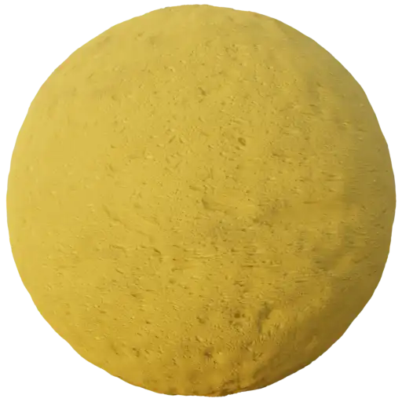

|

**This material is contained in the following Exapacks:**

    - XTRPbr_05k_Vol_001

    - XTRPbr_1k_Vol_001

    - XTRPbr_2k_Vol_002

    - XTRPbr_4k_Vol_004

    - XTRPbr_8k_Vol_006

------------------------------------------------------------------------------------------------------------------------

Sponge 002
**********

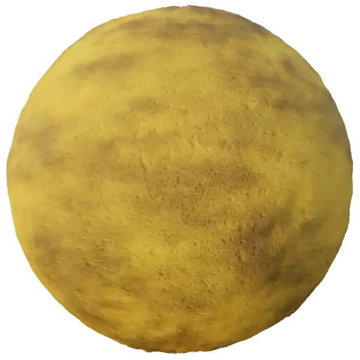

|

**This material is contained in the following Exapacks:**

    - XTRPbr_05k_Vol_001

    - XTRPbr_1k_Vol_001

    - XTRPbr_2k_Vol_002

    - XTRPbr_4k_Vol_004

    - XTRPbr_8k_Vol_006

------------------------------------------------------------------------------------------------------------------------

Sponge 003
**********

|

**This material is contained in the following Exapacks:**

    - XTRPbr_05k_Vol_001

    - XTRPbr_1k_Vol_001

    - XTRPbr_2k_Vol_002

    - XTRPbr_4k_Vol_004

    - XTRPbr_8k_Vol_006

------------------------------------------------------------------------------------------------------------------------

Stone - Granite (Category)
--------------------------

Granite Blue 001
****************

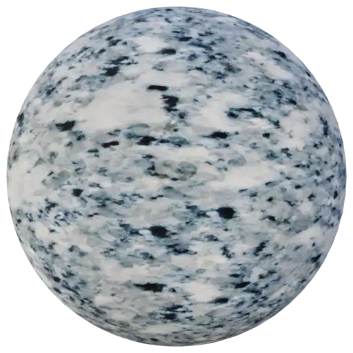

|

**This material is contained in the following Exapacks:**

    - XTRPbr_05k_Vol_001

    - XTRPbr_1k_Vol_001

    - XTRPbr_2k_Vol_002

    - XTRPbr_4k_Vol_004

------------------------------------------------------------------------------------------------------------------------

Granite Red 001
***************

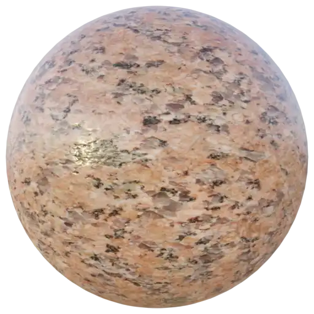

|

**This material is contained in the following Exapacks:**

    - XTRPbr_05k_Vol_001

    - XTRPbr_1k_Vol_001

    - XTRPbr_2k_Vol_002

    - XTRPbr_4k_Vol_004

------------------------------------------------------------------------------------------------------------------------

Granite White 001
*****************

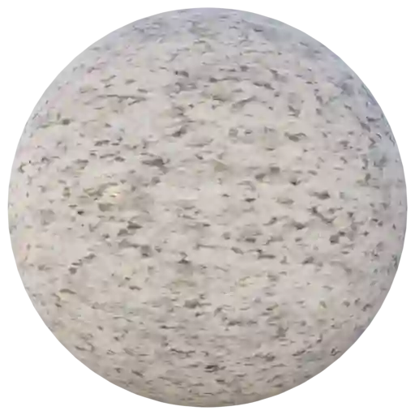

|

**This material is contained in the following Exapacks:**

    - XTRPbr_05k_Vol_001

    - XTRPbr_1k_Vol_001

    - XTRPbr_2k_Vol_002

    - XTRPbr_4k_Vol_004

------------------------------------------------------------------------------------------------------------------------

Stone - Marble (Category)
-------------------------

Marble Black 001
****************

.. image:: _static/_images/material_list/stone_marble/marble_black_001/marble_black_001.webp
    :width: 30%
    :align: center
    :alt: Marble Black 001

|

**This material is contained in the following Exapacks:**

    - XTRPbr_05k_Vol_001

    - XTRPbr_1k_Vol_001

    - XTRPbr_2k_Vol_002

    - XTRPbr_4k_Vol_004

    - XTRPbr_8k_Vol_006

------------------------------------------------------------------------------------------------------------------------

Marble Black 002
****************

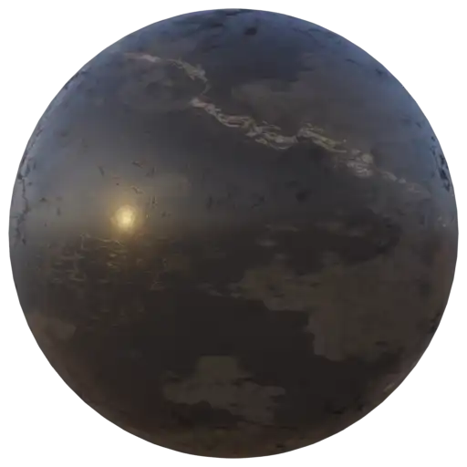

|

**This material is contained in the following Exapacks:**

    - XTRPbr_05k_Vol_001

    - XTRPbr_1k_Vol_001

    - XTRPbr_2k_Vol_002

    - XTRPbr_4k_Vol_004

    - XTRPbr_8k_Vol_006

------------------------------------------------------------------------------------------------------------------------

Marble Black 003
****************

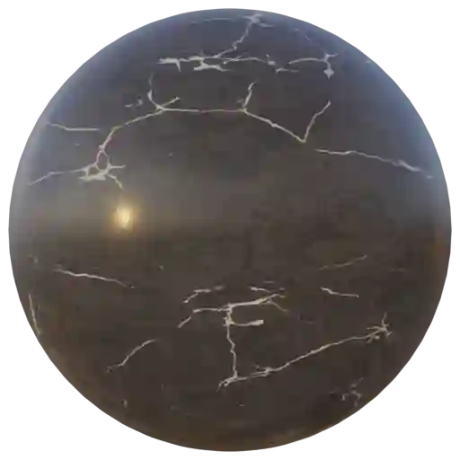

|

**This material is contained in the following Exapacks:**

    - XTRPbr_05k_Vol_001

    - XTRPbr_1k_Vol_001

    - XTRPbr_2k_Vol_002

    - XTRPbr_4k_Vol_004

------------------------------------------------------------------------------------------------------------------------

Marble Black 004
****************

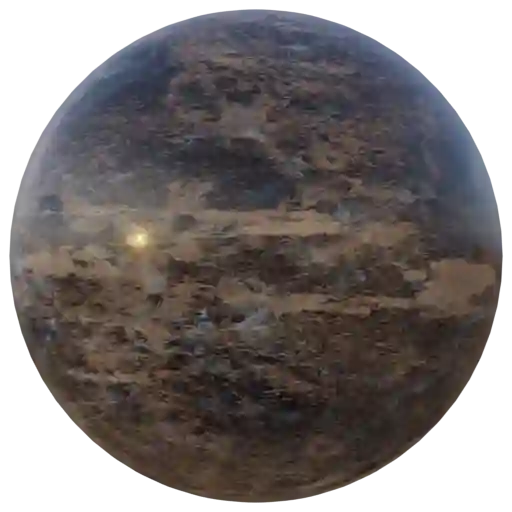

|

**This material is contained in the following Exapacks:**

    - XTRPbr_05k_Vol_001

    - XTRPbr_1k_Vol_001

    - XTRPbr_2k_Vol_002

    - XTRPbr_4k_Vol_004

    - XTRPbr_8k_Vol_006

------------------------------------------------------------------------------------------------------------------------

Marble Brown 001
****************

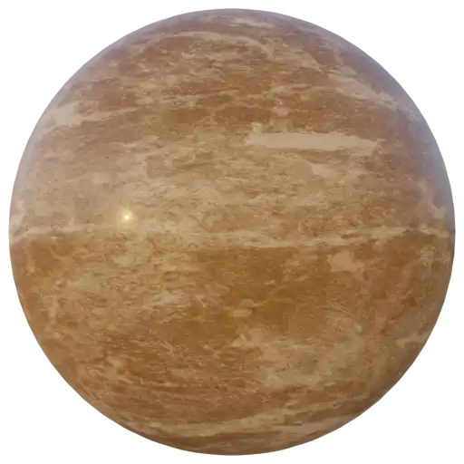

|

**This material is contained in the following Exapacks:**

    - XTRPbr_05k_Vol_001

    - XTRPbr_1k_Vol_001

    - XTRPbr_2k_Vol_002

    - XTRPbr_4k_Vol_004

    - XTRPbr_8k_Vol_006

------------------------------------------------------------------------------------------------------------------------

Marble Brown 002
****************

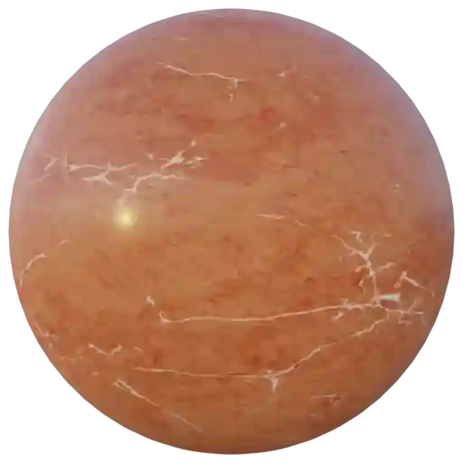

|

**This material is contained in the following Exapacks:**

    - XTRPbr_05k_Vol_001

    - XTRPbr_1k_Vol_001

    - XTRPbr_2k_Vol_002

    - XTRPbr_4k_Vol_004

------------------------------------------------------------------------------------------------------------------------

Marble Brown 003
****************

|

**This material is contained in the following Exapacks:**

    - XTRPbr_05k_Vol_001

    - XTRPbr_1k_Vol_001

    - XTRPbr_2k_Vol_002

    - XTRPbr_4k_Vol_004

    - XTRPbr_8k_Vol_006

------------------------------------------------------------------------------------------------------------------------

Marble Brown 004
****************

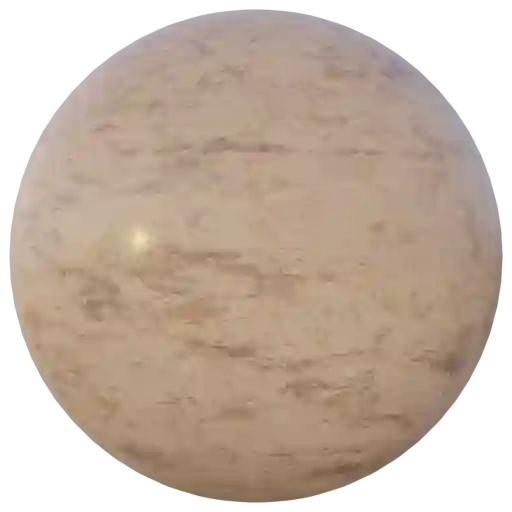

|

**This material is contained in the following Exapacks:**

    - XTRPbr_05k_Vol_001

    - XTRPbr_1k_Vol_001

    - XTRPbr_2k_Vol_002

    - XTRPbr_4k_Vol_004

    - XTRPbr_8k_Vol_006

------------------------------------------------------------------------------------------------------------------------

Marble Brown 005
****************

|

**This material is contained in the following Exapacks:**

    - XTRPbr_05k_Vol_001

    - XTRPbr_1k_Vol_001

    - XTRPbr_2k_Vol_002

    - XTRPbr_4k_Vol_004

    - XTRPbr_8k_Vol_006

------------------------------------------------------------------------------------------------------------------------

Marble Green 001
****************

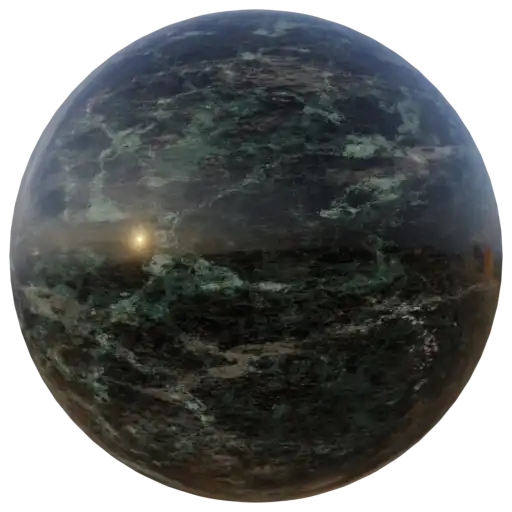

|

**This material is contained in the following Exapacks:**

    - XTRPbr_05k_Vol_001

    - XTRPbr_1k_Vol_001

    - XTRPbr_2k_Vol_002

    - XTRPbr_4k_Vol_004

    - XTRPbr_8k_Vol_006

------------------------------------------------------------------------------------------------------------------------

Marble Green 002
****************

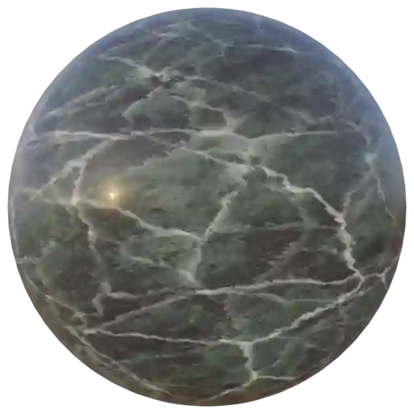

|

**This material is contained in the following Exapacks:**

    - XTRPbr_05k_Vol_001

    - XTRPbr_1k_Vol_001

    - XTRPbr_2k_Vol_002

    - XTRPbr_4k_Vol_004

------------------------------------------------------------------------------------------------------------------------

Marble Green 003
****************

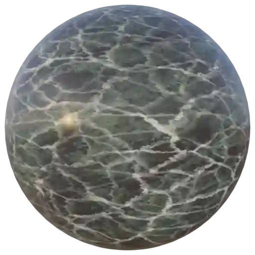

|

**This material is contained in the following Exapacks:**

    - XTRPbr_05k_Vol_001

    - XTRPbr_1k_Vol_001

    - XTRPbr_2k_Vol_002

    - XTRPbr_4k_Vol_004

------------------------------------------------------------------------------------------------------------------------

Marble Green 004
****************

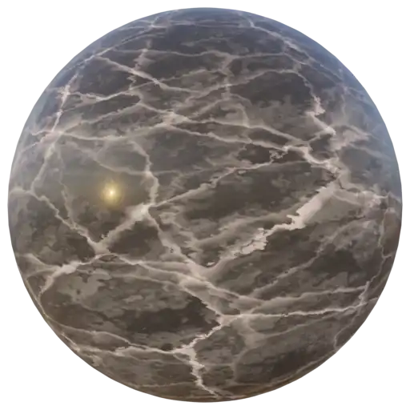

|

**This material is contained in the following Exapacks:**

    - XTRPbr_05k_Vol_001

    - XTRPbr_1k_Vol_001

    - XTRPbr_2k_Vol_002

    - XTRPbr_4k_Vol_004

------------------------------------------------------------------------------------------------------------------------

Marble Green 005
****************

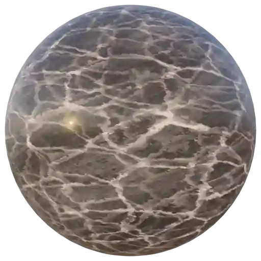

|

**This material is contained in the following Exapacks:**

    - XTRPbr_05k_Vol_001

    - XTRPbr_1k_Vol_001

    - XTRPbr_2k_Vol_002

    - XTRPbr_4k_Vol_004

------------------------------------------------------------------------------------------------------------------------

Marble White 001
****************

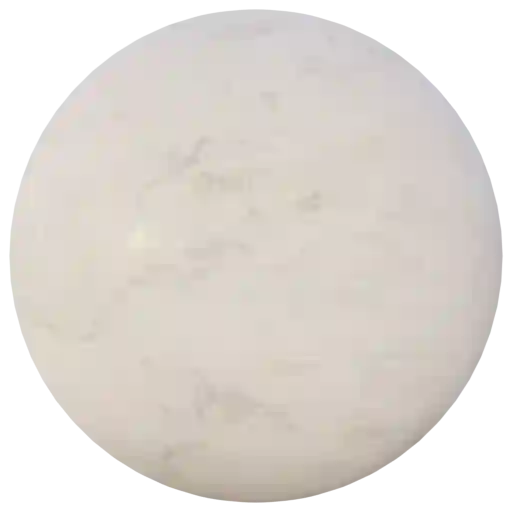

|

**This material is contained in the following Exapacks:**

    - XTRPbr_05k_Vol_001

    - XTRPbr_1k_Vol_001

    - XTRPbr_2k_Vol_002

    - XTRPbr_4k_Vol_004

    - XTRPbr_8k_Vol_006

------------------------------------------------------------------------------------------------------------------------

Marble White 002
****************

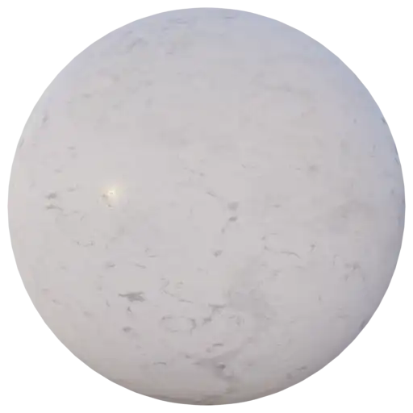

|

**This material is contained in the following Exapacks:**

    - XTRPbr_05k_Vol_001

    - XTRPbr_1k_Vol_001

    - XTRPbr_2k_Vol_002

    - XTRPbr_4k_Vol_004

    - XTRPbr_8k_Vol_006

------------------------------------------------------------------------------------------------------------------------

Marble White 003
****************

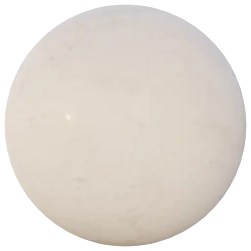

|

**This material is contained in the following Exapacks:**

    - XTRPbr_05k_Vol_001

    - XTRPbr_1k_Vol_001

    - XTRPbr_2k_Vol_002

    - XTRPbr_4k_Vol_004

    - XTRPbr_8k_Vol_006

------------------------------------------------------------------------------------------------------------------------

Marble White 004
****************

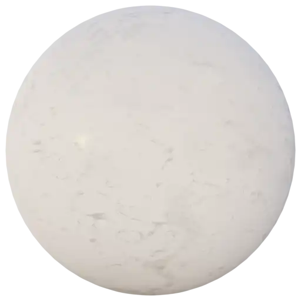

|

**This material is contained in the following Exapacks:**

    - XTRPbr_05k_Vol_001

    - XTRPbr_1k_Vol_001

    - XTRPbr_2k_Vol_002

    - XTRPbr_4k_Vol_004

    - XTRPbr_8k_Vol_006

------------------------------------------------------------------------------------------------------------------------

Marble White 005
****************

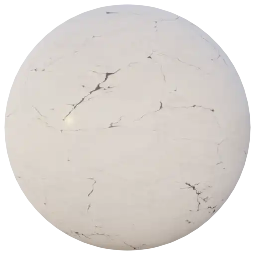

|

**This material is contained in the following Exapacks:**

    - XTRPbr_05k_Vol_001

    - XTRPbr_1k_Vol_001

    - XTRPbr_2k_Vol_002

    - XTRPbr_4k_Vol_004

------------------------------------------------------------------------------------------------------------------------

Marble White 006
****************

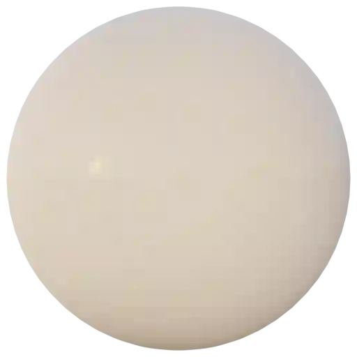

|

**This material is contained in the following Exapacks:**

    - XTRPbr_05k_Vol_001

    - XTRPbr_1k_Vol_001

    - XTRPbr_2k_Vol_002

    - XTRPbr_4k_Vol_004

    - XTRPbr_8k_Vol_006

------------------------------------------------------------------------------------------------------------------------

Marble White 007
****************

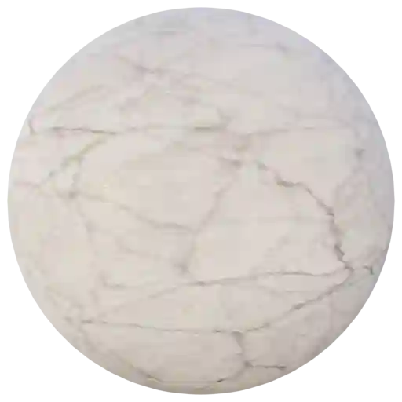

|

**This material is contained in the following Exapacks:**

    - XTRPbr_05k_Vol_001

    - XTRPbr_1k_Vol_001

    - XTRPbr_2k_Vol_002

    - XTRPbr_4k_Vol_004

------------------------------------------------------------------------------------------------------------------------

Marble White 008
****************

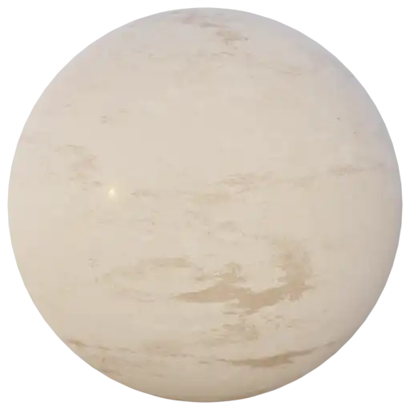

|

**This material is contained in the following Exapacks:**

    - XTRPbr_05k_Vol_001

    - XTRPbr_1k_Vol_001

    - XTRPbr_2k_Vol_002

    - XTRPbr_4k_Vol_004

    - XTRPbr_8k_Vol_006

------------------------------------------------------------------------------------------------------------------------

Marble White 009
****************

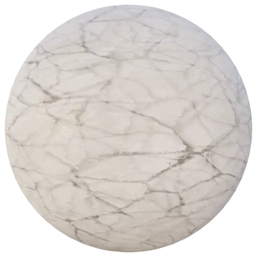

|

**This material is contained in the following Exapacks:**

    - XTRPbr_05k_Vol_001

    - XTRPbr_1k_Vol_001

    - XTRPbr_2k_Vol_002

    - XTRPbr_4k_Vol_004

------------------------------------------------------------------------------------------------------------------------

Marble White 010
****************

|

**This material is contained in the following Exapacks:**

    - XTRPbr_05k_Vol_001

    - XTRPbr_1k_Vol_001

    - XTRPbr_2k_Vol_002

    - XTRPbr_4k_Vol_004

    - XTRPbr_8k_Vol_006

------------------------------------------------------------------------------------------------------------------------

Surface Imperfections (Category)
--------------------------------

Dirt 001
********

.. image:: _static/_images/material_list/surface_imperfections/dirt_001/dirt_001.webp
    :width: 30%
    :align: center
    :alt: Dirt 001

|

**This material is contained in the following Exapacks:**

    - XTRPbr_05k_Vol_001

    - XTRPbr_1k_Vol_001

    - XTRPbr_2k_Vol_002

    - XTRPbr_4k_Vol_004

------------------------------------------------------------------------------------------------------------------------

Dirt 002
********

.. image:: _static/_images/material_list/surface_imperfections/dirt_002/dirt_002.webp
    :width: 30%
    :align: center
    :alt: Dirt 002

|

**This material is contained in the following Exapacks:**

    - XTRPbr_05k_Vol_001

    - XTRPbr_1k_Vol_001

    - XTRPbr_2k_Vol_002

    - XTRPbr_4k_Vol_004

------------------------------------------------------------------------------------------------------------------------

Dirt 003
********

.. image:: _static/_images/material_list/surface_imperfections/dirt_003/dirt_003.webp
    :width: 30%
    :align: center
    :alt: Dirt 003

|

**This material is contained in the following Exapacks:**

    - XTRPbr_05k_Vol_001

    - XTRPbr_1k_Vol_001

    - XTRPbr_2k_Vol_002

    - XTRPbr_4k_Vol_004

------------------------------------------------------------------------------------------------------------------------

Dirt 004
********

.. image:: _static/_images/material_list/surface_imperfections/dirt_004/dirt_004.webp
    :width: 30%
    :align: center
    :alt: Dirt 004

|

**This material is contained in the following Exapacks:**

    - XTRPbr_05k_Vol_001

    - XTRPbr_1k_Vol_001

    - XTRPbr_2k_Vol_002

    - XTRPbr_4k_Vol_004

------------------------------------------------------------------------------------------------------------------------

Dirt 005
********

.. image:: _static/_images/material_list/surface_imperfections/dirt_005/dirt_005.webp
    :width: 30%
    :align: center
    :alt: Dirt 005

|

**This material is contained in the following Exapacks:**

    - XTRPbr_05k_Vol_001

    - XTRPbr_1k_Vol_001

    - XTRPbr_2k_Vol_002

    - XTRPbr_4k_Vol_004

------------------------------------------------------------------------------------------------------------------------

Dirt 006
********

.. image:: _static/_images/material_list/surface_imperfections/dirt_006/dirt_006.webp
    :width: 30%
    :align: center
    :alt: Dirt 006

|

**This material is contained in the following Exapacks:**

    - XTRPbr_05k_Vol_001

    - XTRPbr_1k_Vol_001

    - XTRPbr_2k_Vol_002

    - XTRPbr_4k_Vol_004

------------------------------------------------------------------------------------------------------------------------

Dirt 007
********

.. image:: _static/_images/material_list/surface_imperfections/dirt_007/dirt_007.webp
    :width: 30%
    :align: center
    :alt: Dirt 007

|

**This material is contained in the following Exapacks:**

    - XTRPbr_05k_Vol_001

    - XTRPbr_1k_Vol_001

    - XTRPbr_2k_Vol_002

    - XTRPbr_4k_Vol_004

------------------------------------------------------------------------------------------------------------------------

Dripping Paint 001
******************

.. image:: _static/_images/material_list/surface_imperfections/dripping_paint_001/dripping_paint_001.webp
    :width: 30%
    :align: center
    :alt: Dripping Paint 001

|

**This material is contained in the following Exapacks:**

    - XTRPbr_05k_Vol_001

    - XTRPbr_1k_Vol_001

    - XTRPbr_2k_Vol_002

    - XTRPbr_4k_Vol_004

    - XTRPbr_8k_Vol_006

------------------------------------------------------------------------------------------------------------------------

Dust Wipes 01
*************

.. image:: _static/_images/material_list/surface_imperfections/dust_wipes_01/dust_wipes_01.webp
    :width: 30%
    :align: center
    :alt: Dust Wipes 01

|

**This material is contained in the following Exapacks:**

    - XTRPbr_05k_Vol_001

    - XTRPbr_1k_Vol_001

    - XTRPbr_2k_Vol_002

------------------------------------------------------------------------------------------------------------------------

Fingerprints 001
****************

.. image:: _static/_images/material_list/surface_imperfections/fingerprints_001/fingerprints_001.webp
    :width: 30%
    :align: center
    :alt: Fingerprints 001

|

**This material is contained in the following Exapacks:**

    - XTRPbr_05k_Vol_001

    - XTRPbr_1k_Vol_001

    - XTRPbr_2k_Vol_002

    - XTRPbr_4k_Vol_004

------------------------------------------------------------------------------------------------------------------------

Fingerprints 002
****************

.. image:: _static/_images/material_list/surface_imperfections/fingerprints_002/fingerprints_002.webp
    :width: 30%
    :align: center
    :alt: Fingerprints 002

|

**This material is contained in the following Exapacks:**

    - XTRPbr_05k_Vol_001

    - XTRPbr_1k_Vol_001

    - XTRPbr_2k_Vol_002

    - XTRPbr_4k_Vol_004

------------------------------------------------------------------------------------------------------------------------

Fingerprints 003
****************

.. image:: _static/_images/material_list/surface_imperfections/fingerprints_003/fingerprints_003.webp
    :width: 30%
    :align: center
    :alt: Fingerprints 003

|

**This material is contained in the following Exapacks:**

    - XTRPbr_05k_Vol_001

    - XTRPbr_1k_Vol_001

    - XTRPbr_2k_Vol_002

    - XTRPbr_4k_Vol_004

------------------------------------------------------------------------------------------------------------------------

Fingerprints 004
****************

.. image:: _static/_images/material_list/surface_imperfections/fingerprints_004/fingerprints_004.webp
    :width: 30%
    :align: center
    :alt: Fingerprints 004

|

**This material is contained in the following Exapacks:**

    - XTRPbr_05k_Vol_001

    - XTRPbr_1k_Vol_001

    - XTRPbr_2k_Vol_002

    - XTRPbr_4k_Vol_004

    - XTRPbr_8k_Vol_006

------------------------------------------------------------------------------------------------------------------------

Fingerprints 005
****************

.. image:: _static/_images/material_list/surface_imperfections/fingerprints_005/fingerprints_005.webp
    :width: 30%
    :align: center
    :alt: Fingerprints 005

|

**This material is contained in the following Exapacks:**

    - XTRPbr_05k_Vol_001

    - XTRPbr_1k_Vol_001

    - XTRPbr_2k_Vol_002

    - XTRPbr_4k_Vol_004

    - XTRPbr_8k_Vol_006

------------------------------------------------------------------------------------------------------------------------

Fingerprints 006
****************

.. image:: _static/_images/material_list/surface_imperfections/fingerprints_006/fingerprints_006.webp
    :width: 30%
    :align: center
    :alt: Fingerprints 006

|

**This material is contained in the following Exapacks:**

    - XTRPbr_05k_Vol_001

    - XTRPbr_1k_Vol_001

    - XTRPbr_2k_Vol_002

    - XTRPbr_4k_Vol_004

    - XTRPbr_8k_Vol_006

------------------------------------------------------------------------------------------------------------------------

Fingerprints 007
****************

.. image:: _static/_images/material_list/surface_imperfections/fingerprints_007/fingerprints_007.webp
    :width: 30%
    :align: center
    :alt: Fingerprints 007

|

**This material is contained in the following Exapacks:**

    - XTRPbr_05k_Vol_001

    - XTRPbr_1k_Vol_001

    - XTRPbr_2k_Vol_002

    - XTRPbr_4k_Vol_004

    - XTRPbr_8k_Vol_006

------------------------------------------------------------------------------------------------------------------------

Fingerprints 008
****************

.. image:: _static/_images/material_list/surface_imperfections/fingerprints_008/fingerprints_008.webp
    :width: 30%
    :align: center
    :alt: Fingerprints 008

|

**This material is contained in the following Exapacks:**

    - XTRPbr_05k_Vol_001

    - XTRPbr_1k_Vol_001

    - XTRPbr_2k_Vol_002

    - XTRPbr_4k_Vol_004

    - XTRPbr_8k_Vol_006

------------------------------------------------------------------------------------------------------------------------

Fingerprints 009
****************

.. image:: _static/_images/material_list/surface_imperfections/fingerprints_009/fingerprints_009.webp
    :width: 30%
    :align: center
    :alt: Fingerprints 009

|

**This material is contained in the following Exapacks:**

    - XTRPbr_05k_Vol_001

    - XTRPbr_1k_Vol_001

    - XTRPbr_2k_Vol_002

------------------------------------------------------------------------------------------------------------------------

Fingerprints 010
****************

.. image:: _static/_images/material_list/surface_imperfections/fingerprints_010/fingerprints_010.webp
    :width: 30%
    :align: center
    :alt: Fingerprints 010

|

**This material is contained in the following Exapacks:**

    - XTRPbr_05k_Vol_001

    - XTRPbr_1k_Vol_001

    - XTRPbr_2k_Vol_002

------------------------------------------------------------------------------------------------------------------------

Fingerprints 011
****************

.. image:: _static/_images/material_list/surface_imperfections/fingerprints_011/fingerprints_011.webp
    :width: 30%
    :align: center
    :alt: Fingerprints 011

|

**This material is contained in the following Exapacks:**

    - XTRPbr_05k_Vol_001

    - XTRPbr_1k_Vol_001

    - XTRPbr_2k_Vol_002

------------------------------------------------------------------------------------------------------------------------

Fingerprints 012
****************

.. image:: _static/_images/material_list/surface_imperfections/fingerprints_012/fingerprints_012.webp
    :width: 30%
    :align: center
    :alt: Fingerprints 012

|

**This material is contained in the following Exapacks:**

    - XTRPbr_05k_Vol_001

    - XTRPbr_1k_Vol_001

    - XTRPbr_2k_Vol_002

------------------------------------------------------------------------------------------------------------------------

Fingerprints 013
****************

.. image:: _static/_images/material_list/surface_imperfections/fingerprints_013/fingerprints_013.webp
    :width: 30%
    :align: center
    :alt: Fingerprints 013

|

**This material is contained in the following Exapacks:**

    - XTRPbr_05k_Vol_001

    - XTRPbr_1k_Vol_001

    - XTRPbr_2k_Vol_002

------------------------------------------------------------------------------------------------------------------------

Fingerprints 014
****************

.. image:: _static/_images/material_list/surface_imperfections/fingerprints_014/fingerprints_014.webp
    :width: 30%
    :align: center
    :alt: Fingerprints 014

|

**This material is contained in the following Exapacks:**

    - XTRPbr_05k_Vol_001

    - XTRPbr_1k_Vol_001

    - XTRPbr_2k_Vol_002

------------------------------------------------------------------------------------------------------------------------

Fingerprints 015
****************

.. image:: _static/_images/material_list/surface_imperfections/fingerprints_015/fingerprints_015.webp
    :width: 30%
    :align: center
    :alt: Fingerprints 015

|

**This material is contained in the following Exapacks:**

    - XTRPbr_05k_Vol_001

    - XTRPbr_1k_Vol_001

    - XTRPbr_2k_Vol_002

------------------------------------------------------------------------------------------------------------------------

Footsteps 001
*************

.. image:: _static/_images/material_list/surface_imperfections/footsteps_001/footsteps_001.webp
    :width: 30%
    :align: center
    :alt: Footsteps 001

|

**This material is contained in the following Exapacks:**

    - XTRPbr_05k_Vol_001

    - XTRPbr_1k_Vol_001

    - XTRPbr_2k_Vol_002

    - XTRPbr_4k_Vol_004

    - XTRPbr_8k_Vol_006

------------------------------------------------------------------------------------------------------------------------

Handprint 001
*************

.. image:: _static/_images/material_list/surface_imperfections/handprint_001/handprint_001.webp
    :width: 30%
    :align: center
    :alt: Handprint 001

|

**This material is contained in the following Exapacks:**

    - XTRPbr_05k_Vol_001

    - XTRPbr_1k_Vol_001

    - XTRPbr_2k_Vol_002

------------------------------------------------------------------------------------------------------------------------

Handprint 002
*************

.. image:: _static/_images/material_list/surface_imperfections/handprint_002/handprint_002.webp
    :width: 30%
    :align: center
    :alt: Handprint 002

|

**This material is contained in the following Exapacks:**

    - XTRPbr_05k_Vol_001

    - XTRPbr_1k_Vol_001

    - XTRPbr_2k_Vol_002

    - XTRPbr_4k_Vol_004

------------------------------------------------------------------------------------------------------------------------

Imperfections 001
*****************

.. image:: _static/_images/material_list/surface_imperfections/imperfections_001/imperfections_001.webp
    :width: 30%
    :align: center
    :alt: Imperfections 001

|

**This material is contained in the following Exapacks:**

    - XTRPbr_05k_Vol_001

    - XTRPbr_1k_Vol_001

    - XTRPbr_2k_Vol_002

    - XTRPbr_4k_Vol_004

------------------------------------------------------------------------------------------------------------------------

Imperfections 002
*****************

.. image:: _static/_images/material_list/surface_imperfections/imperfections_002/imperfections_002.webp
    :width: 30%
    :align: center
    :alt: Imperfections 002

|

**This material is contained in the following Exapacks:**

    - XTRPbr_05k_Vol_001

    - XTRPbr_1k_Vol_001

    - XTRPbr_2k_Vol_002

    - XTRPbr_4k_Vol_004

------------------------------------------------------------------------------------------------------------------------

Imperfections 003
*****************

.. image:: _static/_images/material_list/surface_imperfections/imperfections_003/imperfections_003.webp
    :width: 30%
    :align: center
    :alt: Imperfections 003

|

**This material is contained in the following Exapacks:**

    - XTRPbr_05k_Vol_001

    - XTRPbr_1k_Vol_001

    - XTRPbr_2k_Vol_002

    - XTRPbr_4k_Vol_004

------------------------------------------------------------------------------------------------------------------------

Imperfections 004
*****************

.. image:: _static/_images/material_list/surface_imperfections/imperfections_004/imperfections_004.webp
    :width: 30%
    :align: center
    :alt: Imperfections 004

|

**This material is contained in the following Exapacks:**

    - XTRPbr_05k_Vol_001

    - XTRPbr_1k_Vol_001

    - XTRPbr_2k_Vol_002

    - XTRPbr_4k_Vol_004

------------------------------------------------------------------------------------------------------------------------

Imperfections 005
*****************

.. image:: _static/_images/material_list/surface_imperfections/imperfections_005/imperfections_005.webp
    :width: 30%
    :align: center
    :alt: Imperfections 005

|

**This material is contained in the following Exapacks:**

    - XTRPbr_05k_Vol_001

    - XTRPbr_1k_Vol_001

    - XTRPbr_2k_Vol_002

    - XTRPbr_4k_Vol_004

------------------------------------------------------------------------------------------------------------------------

Imperfections 006
*****************

.. image:: _static/_images/material_list/surface_imperfections/imperfections_006/imperfections_006.webp
    :width: 30%
    :align: center
    :alt: Imperfections 006

|

**This material is contained in the following Exapacks:**

    - XTRPbr_05k_Vol_001

    - XTRPbr_1k_Vol_001

    - XTRPbr_2k_Vol_002

    - XTRPbr_4k_Vol_004

------------------------------------------------------------------------------------------------------------------------

Imperfections 007
*****************

.. image:: _static/_images/material_list/surface_imperfections/imperfections_007/imperfections_007.webp
    :width: 30%
    :align: center
    :alt: Imperfections 007

|

**This material is contained in the following Exapacks:**

    - XTRPbr_05k_Vol_001

    - XTRPbr_1k_Vol_001

    - XTRPbr_2k_Vol_002

    - XTRPbr_4k_Vol_004

------------------------------------------------------------------------------------------------------------------------

Imperfections 008
*****************

.. image:: _static/_images/material_list/surface_imperfections/imperfections_008/imperfections_008.webp
    :width: 30%
    :align: center
    :alt: Imperfections 008

|

**This material is contained in the following Exapacks:**

    - XTRPbr_05k_Vol_001

    - XTRPbr_1k_Vol_001

    - XTRPbr_2k_Vol_002

    - XTRPbr_4k_Vol_004

------------------------------------------------------------------------------------------------------------------------

Imperfections 009
*****************

.. image:: _static/_images/material_list/surface_imperfections/imperfections_009/imperfections_009.webp
    :width: 30%
    :align: center
    :alt: Imperfections 009

|

**This material is contained in the following Exapacks:**

    - XTRPbr_05k_Vol_001

    - XTRPbr_1k_Vol_001

    - XTRPbr_2k_Vol_002

    - XTRPbr_4k_Vol_004

------------------------------------------------------------------------------------------------------------------------

Imperfections 010
*****************

.. image:: _static/_images/material_list/surface_imperfections/imperfections_010/imperfections_010.webp
    :width: 30%
    :align: center
    :alt: Imperfections 010

|

**This material is contained in the following Exapacks:**

    - XTRPbr_05k_Vol_001

    - XTRPbr_1k_Vol_001

    - XTRPbr_2k_Vol_002

    - XTRPbr_4k_Vol_004

------------------------------------------------------------------------------------------------------------------------

Liquid Stains 001
*****************

.. image:: _static/_images/material_list/surface_imperfections/liquid_stains_001/liquid_stains_001.webp
    :width: 30%
    :align: center
    :alt: Liquid Stains 001

|

**This material is contained in the following Exapacks:**

    - XTRPbr_05k_Vol_001

    - XTRPbr_1k_Vol_001

    - XTRPbr_2k_Vol_002

    - XTRPbr_4k_Vol_004

------------------------------------------------------------------------------------------------------------------------

Liquid Stains 002
*****************

.. image:: _static/_images/material_list/surface_imperfections/liquid_stains_002/liquid_stains_002.webp
    :width: 30%
    :align: center
    :alt: Liquid Stains 002

|

**This material is contained in the following Exapacks:**

    - XTRPbr_05k_Vol_001

    - XTRPbr_1k_Vol_001

    - XTRPbr_2k_Vol_002

    - XTRPbr_4k_Vol_004

------------------------------------------------------------------------------------------------------------------------

Liquid Stains 003
*****************

.. image:: _static/_images/material_list/surface_imperfections/liquid_stains_003/liquid_stains_003.webp
    :width: 30%
    :align: center
    :alt: Liquid Stains 003

|

**This material is contained in the following Exapacks:**

    - XTRPbr_05k_Vol_001

    - XTRPbr_1k_Vol_001

    - XTRPbr_2k_Vol_002

    - XTRPbr_4k_Vol_004

------------------------------------------------------------------------------------------------------------------------

Round Stains 001
****************

.. image:: _static/_images/material_list/surface_imperfections/round_stains_001/round_stains_001.webp
    :width: 30%
    :align: center
    :alt: Round Stains 001

|

**This material is contained in the following Exapacks:**

    - XTRPbr_05k_Vol_001

    - XTRPbr_1k_Vol_001

    - XTRPbr_2k_Vol_002

    - XTRPbr_4k_Vol_004

    - XTRPbr_8k_Vol_006

------------------------------------------------------------------------------------------------------------------------

Round Stains 002
****************

.. image:: _static/_images/material_list/surface_imperfections/round_stains_002/round_stains_002.webp
    :width: 30%
    :align: center
    :alt: Round Stains 002

|

**This material is contained in the following Exapacks:**

    - XTRPbr_05k_Vol_001

    - XTRPbr_1k_Vol_001

    - XTRPbr_2k_Vol_002

    - XTRPbr_4k_Vol_004

    - XTRPbr_8k_Vol_006

------------------------------------------------------------------------------------------------------------------------

Round Stains 003
****************

.. image:: _static/_images/material_list/surface_imperfections/round_stains_003/round_stains_003.webp
    :width: 30%
    :align: center
    :alt: Round Stains 003

|

**This material is contained in the following Exapacks:**

    - XTRPbr_05k_Vol_001

    - XTRPbr_1k_Vol_001

    - XTRPbr_2k_Vol_002

    - XTRPbr_4k_Vol_004

    - XTRPbr_8k_Vol_006

------------------------------------------------------------------------------------------------------------------------

Scratches 001
*************

.. image:: _static/_images/material_list/surface_imperfections/scratches_001/scratches_001.webp
    :width: 30%
    :align: center
    :alt: Scratches 001

|

**This material is contained in the following Exapacks:**

    - XTRPbr_05k_Vol_001

    - XTRPbr_1k_Vol_001

    - XTRPbr_2k_Vol_002

    - XTRPbr_4k_Vol_004

------------------------------------------------------------------------------------------------------------------------

Scratches 002
*************

.. image:: _static/_images/material_list/surface_imperfections/scratches_002/scratches_002.webp
    :width: 30%
    :align: center
    :alt: Scratches 002

|

**This material is contained in the following Exapacks:**

    - XTRPbr_05k_Vol_001

    - XTRPbr_1k_Vol_001

    - XTRPbr_2k_Vol_002

    - XTRPbr_4k_Vol_004

------------------------------------------------------------------------------------------------------------------------

Scratches 003
*************

.. image:: _static/_images/material_list/surface_imperfections/scratches_003/scratches_003.webp
    :width: 30%
    :align: center
    :alt: Scratches 003

|

**This material is contained in the following Exapacks:**

    - XTRPbr_05k_Vol_001

    - XTRPbr_1k_Vol_001

    - XTRPbr_2k_Vol_002

    - XTRPbr_4k_Vol_004

------------------------------------------------------------------------------------------------------------------------

Scratches 004
*************

.. image:: _static/_images/material_list/surface_imperfections/scratches_004/scratches_004.webp
    :width: 30%
    :align: center
    :alt: Scratches 004

|

**This material is contained in the following Exapacks:**

    - XTRPbr_05k_Vol_001

    - XTRPbr_1k_Vol_001

    - XTRPbr_2k_Vol_002

    - XTRPbr_4k_Vol_004

------------------------------------------------------------------------------------------------------------------------

Scratches 005
*************

.. image:: _static/_images/material_list/surface_imperfections/scratches_005/scratches_005.webp
    :width: 30%
    :align: center
    :alt: Scratches 005

|

**This material is contained in the following Exapacks:**

    - XTRPbr_05k_Vol_001

    - XTRPbr_1k_Vol_001

    - XTRPbr_2k_Vol_002

    - XTRPbr_4k_Vol_004

------------------------------------------------------------------------------------------------------------------------

Scratches 006
*************

.. image:: _static/_images/material_list/surface_imperfections/scratches_006/scratches_006.webp
    :width: 30%
    :align: center
    :alt: Scratches 006

|

**This material is contained in the following Exapacks:**

    - XTRPbr_05k_Vol_001

    - XTRPbr_1k_Vol_001

    - XTRPbr_2k_Vol_002

    - XTRPbr_4k_Vol_004

------------------------------------------------------------------------------------------------------------------------

Scratches 007
*************

.. image:: _static/_images/material_list/surface_imperfections/scratches_007/scratches_007.webp
    :width: 30%
    :align: center
    :alt: Scratches 007

|

**This material is contained in the following Exapacks:**

    - XTRPbr_05k_Vol_001

    - XTRPbr_1k_Vol_001

    - XTRPbr_2k_Vol_002

    - XTRPbr_4k_Vol_004

------------------------------------------------------------------------------------------------------------------------

Smear 001
*********

.. image:: _static/_images/material_list/surface_imperfections/smear_001/smear_001.webp
    :width: 30%
    :align: center
    :alt: Smear 001

|

**This material is contained in the following Exapacks:**

    - XTRPbr_05k_Vol_001

    - XTRPbr_1k_Vol_001

    - XTRPbr_2k_Vol_002

    - XTRPbr_4k_Vol_004

    - XTRPbr_8k_Vol_006

------------------------------------------------------------------------------------------------------------------------

Smear 002
*********

.. image:: _static/_images/material_list/surface_imperfections/smear_002/smear_002.webp
    :width: 30%
    :align: center
    :alt: Smear 002

|

**This material is contained in the following Exapacks:**

    - XTRPbr_05k_Vol_001

    - XTRPbr_1k_Vol_001

    - XTRPbr_2k_Vol_002

    - XTRPbr_4k_Vol_004

    - XTRPbr_8k_Vol_006

------------------------------------------------------------------------------------------------------------------------

Smear 003
*********

.. image:: _static/_images/material_list/surface_imperfections/smear_003/smear_003.webp
    :width: 30%
    :align: center
    :alt: Smear 003

|

**This material is contained in the following Exapacks:**

    - XTRPbr_05k_Vol_001

    - XTRPbr_1k_Vol_001

    - XTRPbr_2k_Vol_002

    - XTRPbr_4k_Vol_004

------------------------------------------------------------------------------------------------------------------------

Smear 004
*********

.. image:: _static/_images/material_list/surface_imperfections/smear_004/smear_004.webp
    :width: 30%
    :align: center
    :alt: Smear 004

|

**This material is contained in the following Exapacks:**

    - XTRPbr_05k_Vol_001

    - XTRPbr_1k_Vol_001

    - XTRPbr_2k_Vol_002

    - XTRPbr_4k_Vol_004

    - XTRPbr_8k_Vol_006

------------------------------------------------------------------------------------------------------------------------

Smear 005
*********

.. image:: _static/_images/material_list/surface_imperfections/smear_005/smear_005.webp
    :width: 30%
    :align: center
    :alt: Smear 005

|

**This material is contained in the following Exapacks:**

    - XTRPbr_05k_Vol_001

    - XTRPbr_1k_Vol_001

    - XTRPbr_2k_Vol_002

    - XTRPbr_4k_Vol_004

    - XTRPbr_8k_Vol_006

------------------------------------------------------------------------------------------------------------------------

Smear 006
*********

.. image:: _static/_images/material_list/surface_imperfections/smear_006/smear_006.webp
    :width: 30%
    :align: center
    :alt: Smear 006

|

**This material is contained in the following Exapacks:**

    - XTRPbr_05k_Vol_001

    - XTRPbr_1k_Vol_001

    - XTRPbr_2k_Vol_002

    - XTRPbr_4k_Vol_004

    - XTRPbr_8k_Vol_006

------------------------------------------------------------------------------------------------------------------------

Smear 007
*********

.. image:: _static/_images/material_list/surface_imperfections/smear_007/smear_007.webp
    :width: 30%
    :align: center
    :alt: Smear 007

|

**This material is contained in the following Exapacks:**

    - XTRPbr_05k_Vol_001

    - XTRPbr_1k_Vol_001

    - XTRPbr_2k_Vol_002

    - XTRPbr_4k_Vol_004

------------------------------------------------------------------------------------------------------------------------

Water Droplets 001
******************

.. image:: _static/_images/material_list/surface_imperfections/water_droplets_001/water_droplets_001.webp
    :width: 30%
    :align: center
    :alt: Water Droplets 001

|

**This material is contained in the following Exapacks:**

    - XTRPbr_05k_Vol_001

    - XTRPbr_1k_Vol_001

    - XTRPbr_2k_Vol_002

    - XTRPbr_4k_Vol_004

------------------------------------------------------------------------------------------------------------------------

Water Droplets 002
******************

.. image:: _static/_images/material_list/surface_imperfections/water_droplets_002/water_droplets_002.webp
    :width: 30%
    :align: center
    :alt: Water Droplets 002

|

**This material is contained in the following Exapacks:**

    - XTRPbr_05k_Vol_001

    - XTRPbr_1k_Vol_001

    - XTRPbr_2k_Vol_002

    - XTRPbr_4k_Vol_004

------------------------------------------------------------------------------------------------------------------------

Water Droplets 003
******************

.. image:: _static/_images/material_list/surface_imperfections/water_droplets_003/water_droplets_003.webp
    :width: 30%
    :align: center
    :alt: Water Droplets 003

|

**This material is contained in the following Exapacks:**

    - XTRPbr_05k_Vol_001

    - XTRPbr_1k_Vol_001

    - XTRPbr_2k_Vol_002

    - XTRPbr_4k_Vol_004

------------------------------------------------------------------------------------------------------------------------

Terrazzo (Category)
-------------------

Terrazzo 001
************

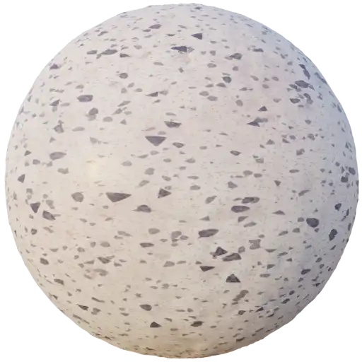

|

**This material is contained in the following Exapacks:**

    - XTRPbr_05k_Vol_001

    - XTRPbr_1k_Vol_001

    - XTRPbr_2k_Vol_002

    - XTRPbr_4k_Vol_004

    - XTRPbr_8k_Vol_003

------------------------------------------------------------------------------------------------------------------------

Terrazzo 002
************

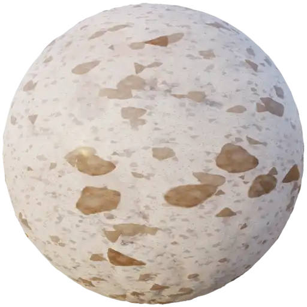

|

**This material is contained in the following Exapacks:**

    - XTRPbr_05k_Vol_001

    - XTRPbr_1k_Vol_001

    - XTRPbr_2k_Vol_002

    - XTRPbr_4k_Vol_004

    - XTRPbr_8k_Vol_003

------------------------------------------------------------------------------------------------------------------------

Terrazzo 003
************

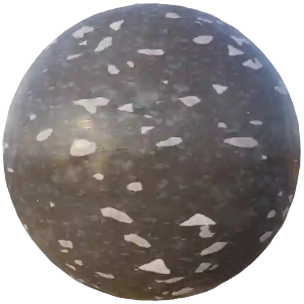

|

**This material is contained in the following Exapacks:**

    - XTRPbr_05k_Vol_001

    - XTRPbr_1k_Vol_001

    - XTRPbr_2k_Vol_002

    - XTRPbr_4k_Vol_004

    - XTRPbr_8k_Vol_003

------------------------------------------------------------------------------------------------------------------------

Terrazzo 004
************

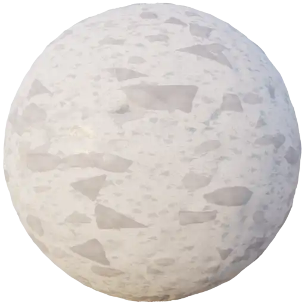

|

**This material is contained in the following Exapacks:**

    - XTRPbr_05k_Vol_001

    - XTRPbr_1k_Vol_001

    - XTRPbr_2k_Vol_002

    - XTRPbr_4k_Vol_004

    - XTRPbr_8k_Vol_003

------------------------------------------------------------------------------------------------------------------------

Terrazzo 005
************

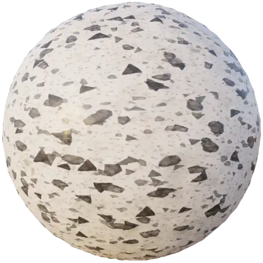

|

**This material is contained in the following Exapacks:**

    - XTRPbr_05k_Vol_001

    - XTRPbr_1k_Vol_001

    - XTRPbr_2k_Vol_002

    - XTRPbr_4k_Vol_004

    - XTRPbr_8k_Vol_003

------------------------------------------------------------------------------------------------------------------------

Terrazzo 006
************

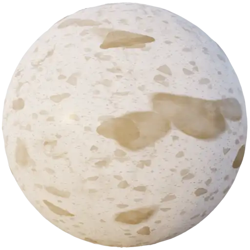

|

**This material is contained in the following Exapacks:**

    - XTRPbr_05k_Vol_001

    - XTRPbr_1k_Vol_001

    - XTRPbr_2k_Vol_002

    - XTRPbr_4k_Vol_004

    - XTRPbr_8k_Vol_003

------------------------------------------------------------------------------------------------------------------------

Terrazzo 007
************

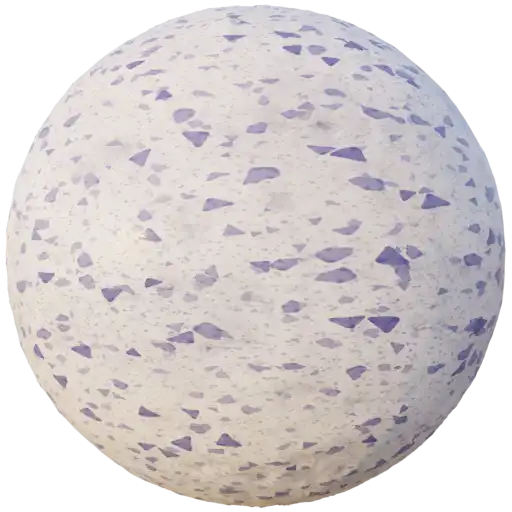

|

**This material is contained in the following Exapacks:**

    - XTRPbr_05k_Vol_001

    - XTRPbr_1k_Vol_001

    - XTRPbr_2k_Vol_002

    - XTRPbr_4k_Vol_004

    - XTRPbr_8k_Vol_003

------------------------------------------------------------------------------------------------------------------------

Terrazzo 008
************

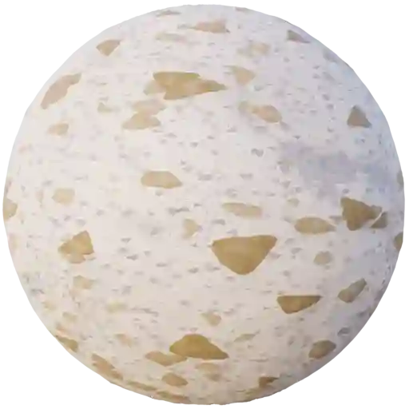

|

**This material is contained in the following Exapacks:**

    - XTRPbr_05k_Vol_001

    - XTRPbr_1k_Vol_001

    - XTRPbr_2k_Vol_002

    - XTRPbr_4k_Vol_004

    - XTRPbr_8k_Vol_003

------------------------------------------------------------------------------------------------------------------------

Tiles - Exterior (Category)
---------------------------

Concrete Fake Tiles 001
***********************

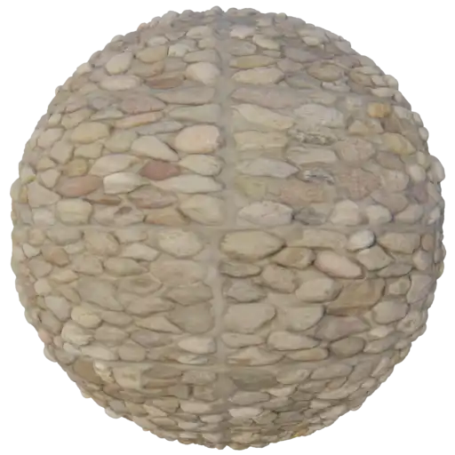

|

**This material is contained in the following Exapacks:**

    - XTRPbr_05k_Vol_001

    - XTRPbr_1k_Vol_001

    - XTRPbr_2k_Vol_002

    - XTRPbr_4k_Vol_004

    - XTRPbr_8k_Vol_003

------------------------------------------------------------------------------------------------------------------------

Concrete Grey Tiles 001
***********************

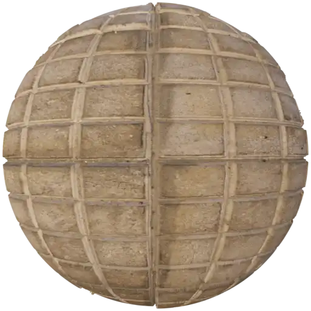

|

**This material is contained in the following Exapacks:**

    - XTRPbr_05k_Vol_001

    - XTRPbr_1k_Vol_001

    - XTRPbr_2k_Vol_002

    - XTRPbr_4k_Vol_004

    - XTRPbr_8k_Vol_003

------------------------------------------------------------------------------------------------------------------------

Concrete Grey Tiles 002
***********************

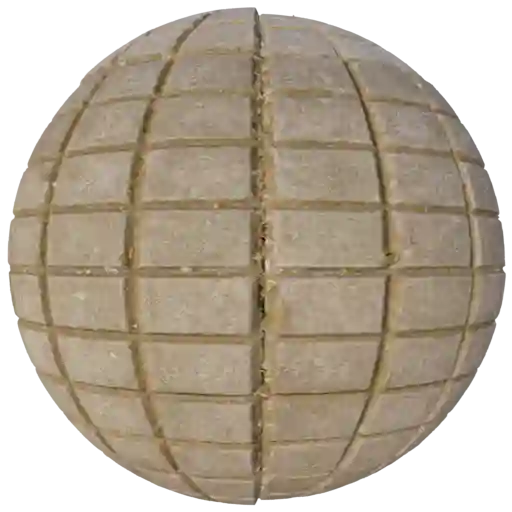

|

**This material is contained in the following Exapacks:**

    - XTRPbr_05k_Vol_001

    - XTRPbr_1k_Vol_001

    - XTRPbr_2k_Vol_002

    - XTRPbr_4k_Vol_004

    - XTRPbr_8k_Vol_003

------------------------------------------------------------------------------------------------------------------------

Concrete Grey Tiles 003
***********************

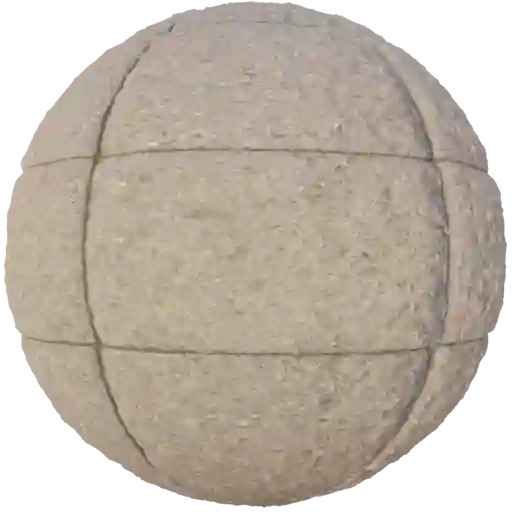

|

**This material is contained in the following Exapacks:**

    - XTRPbr_05k_Vol_001

    - XTRPbr_1k_Vol_001

    - XTRPbr_2k_Vol_002

    - XTRPbr_4k_Vol_004

------------------------------------------------------------------------------------------------------------------------

Concrete Grey Tiles 004
***********************

.. image:: _static/_images/material_list/tiles_exterior/concrete_grey_tiles_004/concrete_grey_tiles_004.webp
    :width: 30%
    :align: center
    :alt: Concrete Grey Tiles 004

|

**This material is contained in the following Exapacks:**

    - XTRPbr_05k_Vol_001

    - XTRPbr_1k_Vol_001

    - XTRPbr_2k_Vol_002

    - XTRPbr_4k_Vol_004

    - XTRPbr_8k_Vol_003

------------------------------------------------------------------------------------------------------------------------

Concrete Grey Tiles 005
***********************

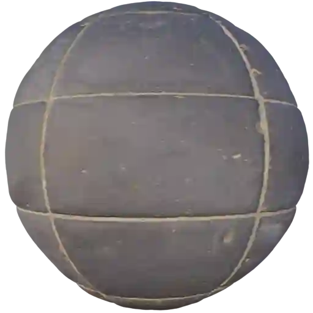

|

**This material is contained in the following Exapacks:**

    - XTRPbr_05k_Vol_001

    - XTRPbr_1k_Vol_001

    - XTRPbr_2k_Vol_002

    - XTRPbr_4k_Vol_004

    - XTRPbr_8k_Vol_003

------------------------------------------------------------------------------------------------------------------------

Offset Concrete Tiles 001
*************************

.. image:: _static/_images/material_list/tiles_exterior/offset_concrete_tiles_001/offset_concrete_tiles_001.webp
    :width: 30%
    :align: center
    :alt: Offset Concrete Tiles 001

|

**This material is contained in the following Exapacks:**

    - XTRPbr_05k_Vol_001

    - XTRPbr_1k_Vol_001

    - XTRPbr_2k_Vol_002

    - XTRPbr_4k_Vol_004

    - XTRPbr_8k_Vol_003

------------------------------------------------------------------------------------------------------------------------

Offset Concrete Tiles 002
*************************

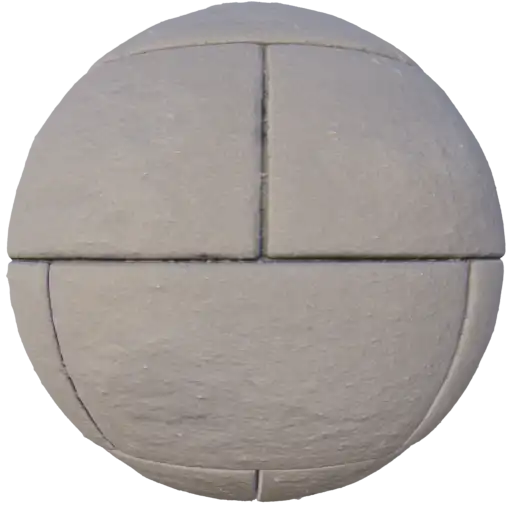

|

**This material is contained in the following Exapacks:**

    - XTRPbr_05k_Vol_001

    - XTRPbr_1k_Vol_001

    - XTRPbr_2k_Vol_002

    - XTRPbr_4k_Vol_004

    - XTRPbr_8k_Vol_003

------------------------------------------------------------------------------------------------------------------------

Offset Stone Grey Tiles 001
***************************

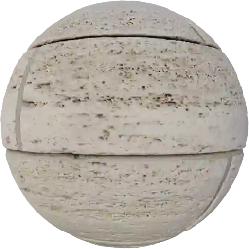

|

**This material is contained in the following Exapacks:**

    - XTRPbr_05k_Vol_001

    - XTRPbr_1k_Vol_001

    - XTRPbr_2k_Vol_002

    - XTRPbr_4k_Vol_004

------------------------------------------------------------------------------------------------------------------------

Offset Stone Grey Tiles 002
***************************

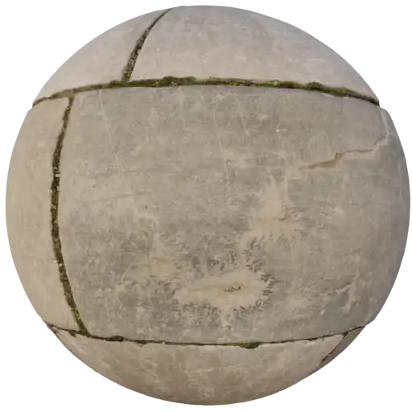

|

**This material is contained in the following Exapacks:**

    - XTRPbr_05k_Vol_001

    - XTRPbr_1k_Vol_001

    - XTRPbr_2k_Vol_002

    - XTRPbr_4k_Vol_004

    - XTRPbr_8k_Vol_003

------------------------------------------------------------------------------------------------------------------------

Offset Stone Grey Tiles 003
***************************

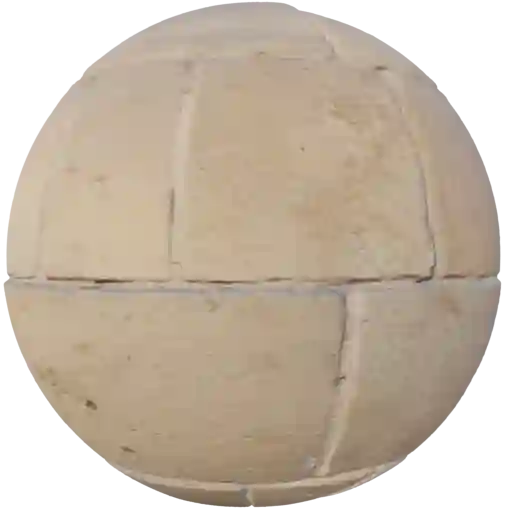

|

**This material is contained in the following Exapacks:**

    - XTRPbr_05k_Vol_001

    - XTRPbr_1k_Vol_001

    - XTRPbr_2k_Vol_002

    - XTRPbr_4k_Vol_004

    - XTRPbr_8k_Vol_003

------------------------------------------------------------------------------------------------------------------------

Offset Stone Red Tiles 001
**************************

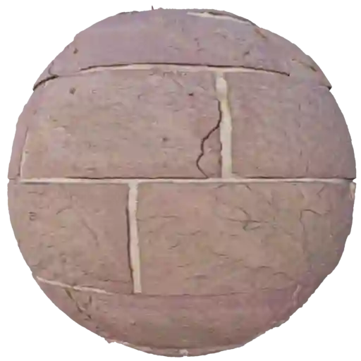

|

**This material is contained in the following Exapacks:**

    - XTRPbr_05k_Vol_001

    - XTRPbr_1k_Vol_001

    - XTRPbr_2k_Vol_002

    - XTRPbr_4k_Vol_004

    - XTRPbr_8k_Vol_003

------------------------------------------------------------------------------------------------------------------------

Rectangular Stone Tiles 001
***************************

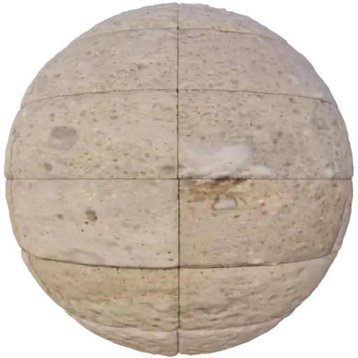

|

**This material is contained in the following Exapacks:**

    - XTRPbr_05k_Vol_001

    - XTRPbr_1k_Vol_001

    - XTRPbr_2k_Vol_002

    - XTRPbr_4k_Vol_004

------------------------------------------------------------------------------------------------------------------------

Rectangular Stone Tiles 002
***************************

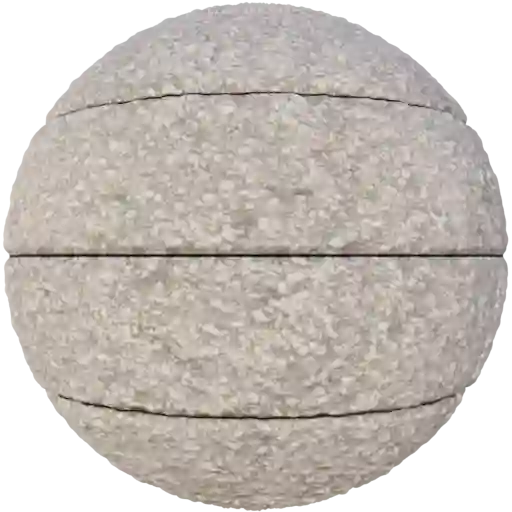

|

**This material is contained in the following Exapacks:**

    - XTRPbr_05k_Vol_001

    - XTRPbr_1k_Vol_001

    - XTRPbr_2k_Vol_002

    - XTRPbr_4k_Vol_004

------------------------------------------------------------------------------------------------------------------------

Square Concrete Tiles 001
*************************

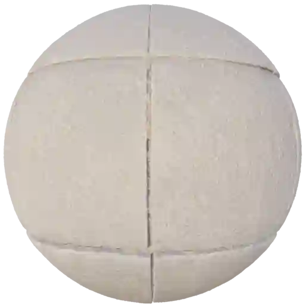

|

**This material is contained in the following Exapacks:**

    - XTRPbr_05k_Vol_001

    - XTRPbr_1k_Vol_001

    - XTRPbr_2k_Vol_002

    - XTRPbr_4k_Vol_004

    - XTRPbr_8k_Vol_003

------------------------------------------------------------------------------------------------------------------------

Square Stone Grey Tiles 001
***************************

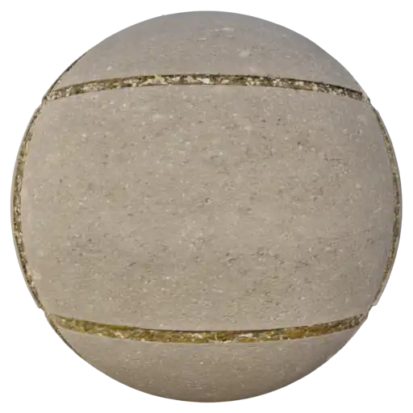

|

**This material is contained in the following Exapacks:**

    - XTRPbr_05k_Vol_001

    - XTRPbr_1k_Vol_001

    - XTRPbr_2k_Vol_002

    - XTRPbr_4k_Vol_004

    - XTRPbr_8k_Vol_003

------------------------------------------------------------------------------------------------------------------------

Square Stone Grey Tiles 002
***************************

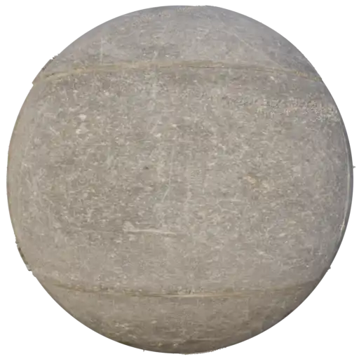

|

**This material is contained in the following Exapacks:**

    - XTRPbr_05k_Vol_001

    - XTRPbr_1k_Vol_001

    - XTRPbr_2k_Vol_002

    - XTRPbr_4k_Vol_004

    - XTRPbr_8k_Vol_003

------------------------------------------------------------------------------------------------------------------------

Square Stone Grey Tiles 003
***************************

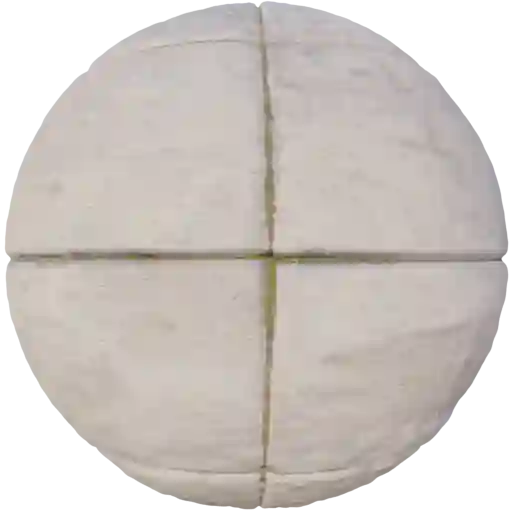

|

**This material is contained in the following Exapacks:**

    - XTRPbr_05k_Vol_001

    - XTRPbr_1k_Vol_001

    - XTRPbr_2k_Vol_002

    - XTRPbr_4k_Vol_004

------------------------------------------------------------------------------------------------------------------------

Square Stone Grey Tiles 005
***************************

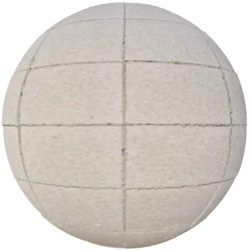

|

**This material is contained in the following Exapacks:**

    - XTRPbr_05k_Vol_001

    - XTRPbr_1k_Vol_001

    - XTRPbr_2k_Vol_002

    - XTRPbr_4k_Vol_004

    - XTRPbr_8k_Vol_003

------------------------------------------------------------------------------------------------------------------------

Square Stone Grey Tiles 008
***************************

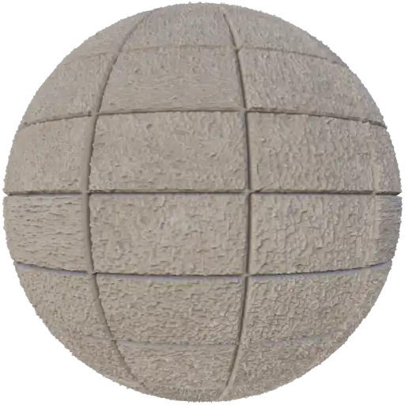

|

**This material is contained in the following Exapacks:**

    - XTRPbr_05k_Vol_001

    - XTRPbr_1k_Vol_001

    - XTRPbr_2k_Vol_002

    - XTRPbr_4k_Vol_004

------------------------------------------------------------------------------------------------------------------------

Square Stone Red Tiles 001
**************************

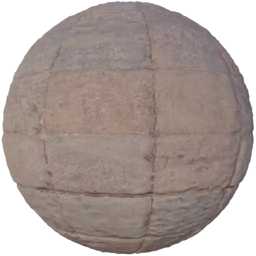

|

**This material is contained in the following Exapacks:**

    - XTRPbr_05k_Vol_001

    - XTRPbr_1k_Vol_001

    - XTRPbr_2k_Vol_002

    - XTRPbr_4k_Vol_004

------------------------------------------------------------------------------------------------------------------------

Tactile White Tiles 01
**********************

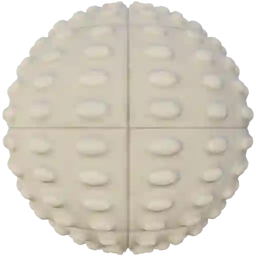

|

**This material is contained in the following Exapacks:**

    - XTRPbr_05k_Vol_001

    - XTRPbr_1k_Vol_001

    - XTRPbr_2k_Vol_002

    - XTRPbr_4k_Vol_004

    - XTRPbr_8k_Vol_003

------------------------------------------------------------------------------------------------------------------------

Tactile Yellow Tiles 01
***********************

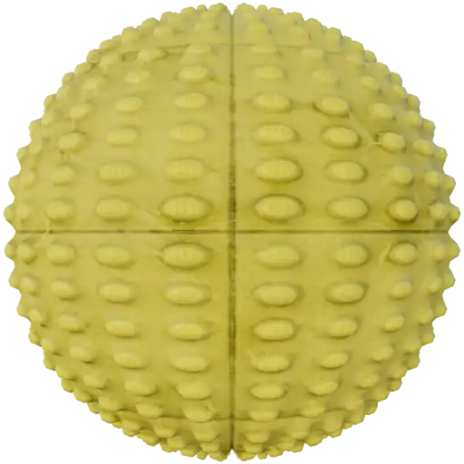

|

**This material is contained in the following Exapacks:**

    - XTRPbr_05k_Vol_001

    - XTRPbr_1k_Vol_001

    - XTRPbr_2k_Vol_002

    - XTRPbr_4k_Vol_004

    - XTRPbr_8k_Vol_003

------------------------------------------------------------------------------------------------------------------------

Tactile Yellow Tiles 02
***********************

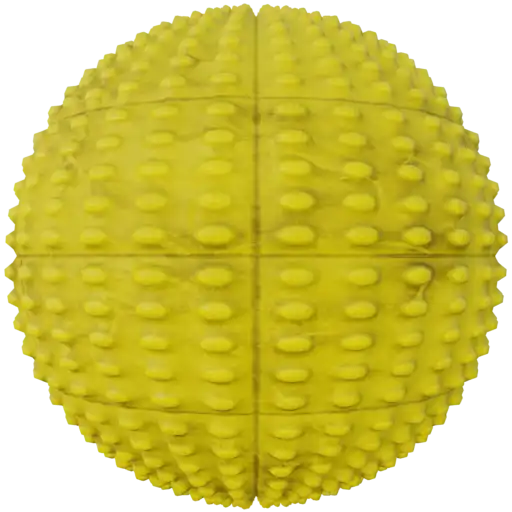

|

**This material is contained in the following Exapacks:**

    - XTRPbr_05k_Vol_001

    - XTRPbr_1k_Vol_001

    - XTRPbr_2k_Vol_002

    - XTRPbr_4k_Vol_004

    - XTRPbr_8k_Vol_003

------------------------------------------------------------------------------------------------------------------------

Tiles - Grid (Category)
-----------------------

Diamond Beige 001
*****************

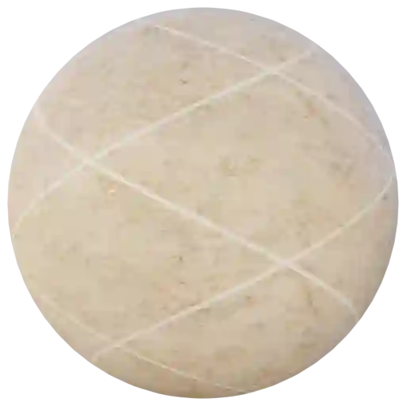

|

**This material is contained in the following Exapacks:**

    - XTRPbr_05k_Vol_001

    - XTRPbr_1k_Vol_001

    - XTRPbr_2k_Vol_002

    - XTRPbr_4k_Vol_004

------------------------------------------------------------------------------------------------------------------------

Diamond Mc 001
**************

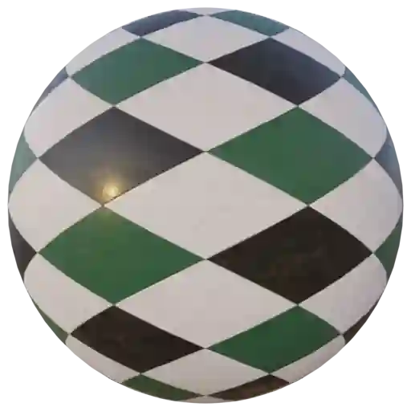

|

**This material is contained in the following Exapacks:**

    - XTRPbr_05k_Vol_001

    - XTRPbr_1k_Vol_001

    - XTRPbr_2k_Vol_002

    - XTRPbr_4k_Vol_004

    - XTRPbr_8k_Vol_003

------------------------------------------------------------------------------------------------------------------------

Rectangular Beige Grid Tiles 001
********************************

.. image:: _static/_images/material_list/tiles_grid/rectangular_beige_grid_tiles_001/rectangular_beige_grid_tiles_001.webp
    :width: 30%
    :align: center
    :alt: Rectangular Beige Grid Tiles 001

|

**This material is contained in the following Exapacks:**

    - XTRPbr_05k_Vol_001

    - XTRPbr_1k_Vol_001

    - XTRPbr_2k_Vol_002

    - XTRPbr_4k_Vol_004

    - XTRPbr_8k_Vol_003

------------------------------------------------------------------------------------------------------------------------

Rectangular Black Tiles 001
***************************

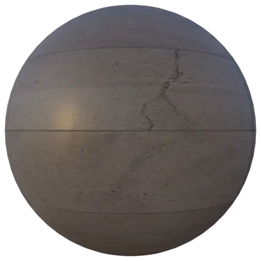

|

**This material is contained in the following Exapacks:**

    - XTRPbr_05k_Vol_001

    - XTRPbr_1k_Vol_001

    - XTRPbr_2k_Vol_002

    - XTRPbr_4k_Vol_004

    - XTRPbr_8k_Vol_003

------------------------------------------------------------------------------------------------------------------------

Rectangular Black Tiles 002
***************************

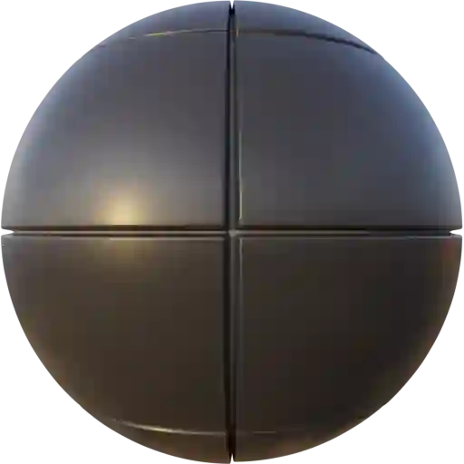

|

**This material is contained in the following Exapacks:**

    - XTRPbr_05k_Vol_001

    - XTRPbr_1k_Vol_001

    - XTRPbr_2k_Vol_002

    - XTRPbr_4k_Vol_004

------------------------------------------------------------------------------------------------------------------------

Rectangular Blue Grid Tiles 001
*******************************

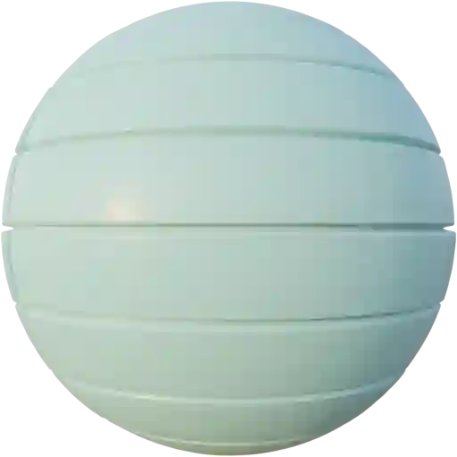

|

**This material is contained in the following Exapacks:**

    - XTRPbr_05k_Vol_001

    - XTRPbr_1k_Vol_001

    - XTRPbr_2k_Vol_002

    - XTRPbr_4k_Vol_004

------------------------------------------------------------------------------------------------------------------------

Rectangular Grey Tiles 001
**************************

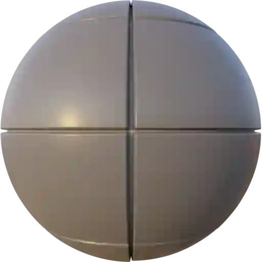

|

**This material is contained in the following Exapacks:**

    - XTRPbr_05k_Vol_001

    - XTRPbr_1k_Vol_001

    - XTRPbr_2k_Vol_002

    - XTRPbr_4k_Vol_004

------------------------------------------------------------------------------------------------------------------------

Rectangular Grey Tiles 002
**************************

.. image:: _static/_images/material_list/tiles_grid/rectangular_grey_tiles_002/rectangular_grey_tiles_002.webp
    :width: 30%
    :align: center
    :alt: Rectangular Grey Tiles 002

|

**This material is contained in the following Exapacks:**

    - XTRPbr_05k_Vol_001

    - XTRPbr_1k_Vol_001

    - XTRPbr_2k_Vol_002

    - XTRPbr_4k_Vol_004

------------------------------------------------------------------------------------------------------------------------

Rectangular Grey Tiles 003
**************************

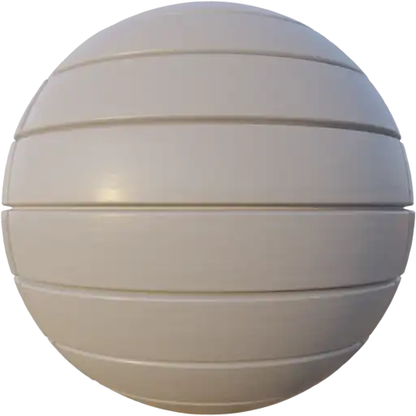

|

**This material is contained in the following Exapacks:**

    - XTRPbr_05k_Vol_001

    - XTRPbr_1k_Vol_001

    - XTRPbr_2k_Vol_002

    - XTRPbr_4k_Vol_004

------------------------------------------------------------------------------------------------------------------------

Rectangular White Grid Tiles 001
********************************

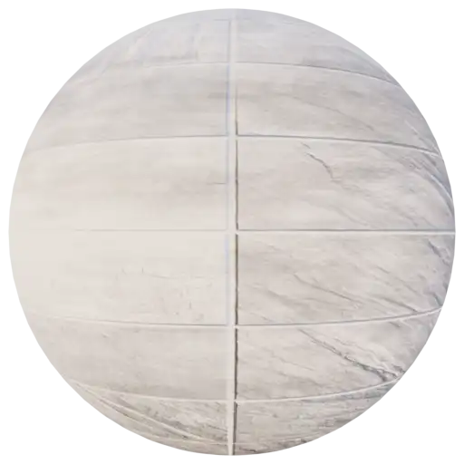

|

**This material is contained in the following Exapacks:**

    - XTRPbr_05k_Vol_001

    - XTRPbr_1k_Vol_001

    - XTRPbr_2k_Vol_002

    - XTRPbr_4k_Vol_004

    - XTRPbr_8k_Vol_003

------------------------------------------------------------------------------------------------------------------------

Rectangular White Grid Tiles 002
********************************

.. image:: _static/_images/material_list/tiles_grid/rectangular_white_grid_tiles_002/rectangular_white_grid_tiles_002.webp
    :width: 30%
    :align: center
    :alt: Rectangular White Grid Tiles 002

|

**This material is contained in the following Exapacks:**

    - XTRPbr_05k_Vol_001

    - XTRPbr_1k_Vol_001

    - XTRPbr_2k_Vol_002

    - XTRPbr_4k_Vol_004

------------------------------------------------------------------------------------------------------------------------

Rectangular White Grid Tiles 003
********************************

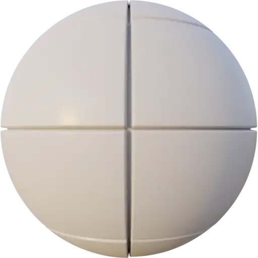

|

**This material is contained in the following Exapacks:**

    - XTRPbr_05k_Vol_001

    - XTRPbr_1k_Vol_001

    - XTRPbr_2k_Vol_002

    - XTRPbr_4k_Vol_004

------------------------------------------------------------------------------------------------------------------------

Rectangular White Grid Tiles 004
********************************

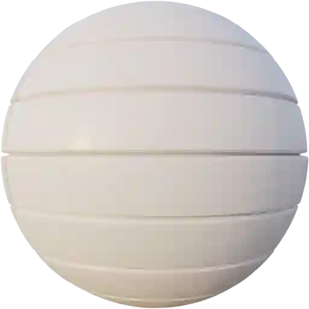

|

**This material is contained in the following Exapacks:**

    - XTRPbr_05k_Vol_001

    - XTRPbr_1k_Vol_001

    - XTRPbr_2k_Vol_002

    - XTRPbr_4k_Vol_004

------------------------------------------------------------------------------------------------------------------------

Rectangular White Grid Tiles 005
********************************

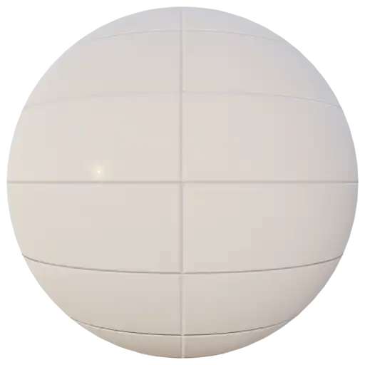

|

**This material is contained in the following Exapacks:**

    - XTRPbr_05k_Vol_001

    - XTRPbr_1k_Vol_001

    - XTRPbr_2k_Vol_002

    - XTRPbr_4k_Vol_004

------------------------------------------------------------------------------------------------------------------------

Square Beige Grid Tiles 001
***************************

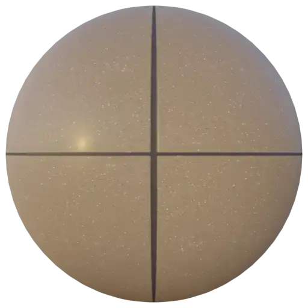

|

**This material is contained in the following Exapacks:**

    - XTRPbr_05k_Vol_001

    - XTRPbr_1k_Vol_001

    - XTRPbr_2k_Vol_002

    - XTRPbr_4k_Vol_004

------------------------------------------------------------------------------------------------------------------------

Square Beige Grid Tiles 002
***************************

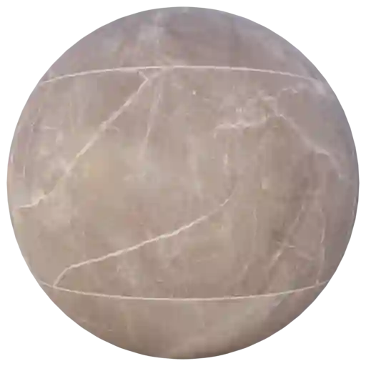

|

**This material is contained in the following Exapacks:**

    - XTRPbr_05k_Vol_001

    - XTRPbr_1k_Vol_001

    - XTRPbr_2k_Vol_002

    - XTRPbr_4k_Vol_004

------------------------------------------------------------------------------------------------------------------------

Square Beige Grid Tiles 003
***************************

.. image:: _static/_images/material_list/tiles_grid/square_beige_grid_tiles_003/square_beige_grid_tiles_003.webp
    :width: 30%
    :align: center
    :alt: Square Beige Grid Tiles 003

|

**This material is contained in the following Exapacks:**

    - XTRPbr_05k_Vol_001

    - XTRPbr_1k_Vol_001

    - XTRPbr_2k_Vol_002

    - XTRPbr_4k_Vol_004

    - XTRPbr_8k_Vol_003

------------------------------------------------------------------------------------------------------------------------

Square Beige Grid Tiles 004
***************************

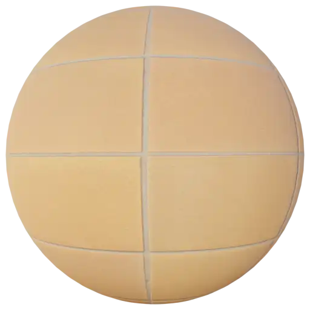

|

**This material is contained in the following Exapacks:**

    - XTRPbr_05k_Vol_001

    - XTRPbr_1k_Vol_001

    - XTRPbr_2k_Vol_002

    - XTRPbr_4k_Vol_004

    - XTRPbr_8k_Vol_003

------------------------------------------------------------------------------------------------------------------------

Square Beige Grid Tiles 005
***************************

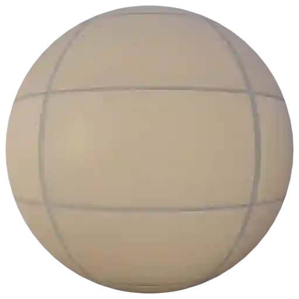

|

**This material is contained in the following Exapacks:**

    - XTRPbr_05k_Vol_001

    - XTRPbr_1k_Vol_001

    - XTRPbr_2k_Vol_002

    - XTRPbr_4k_Vol_004

------------------------------------------------------------------------------------------------------------------------

Square Beige Grid Tiles 006
***************************

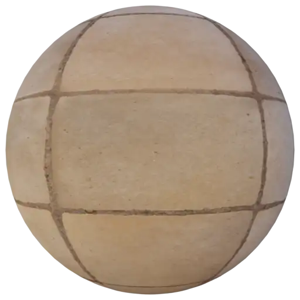

|

**This material is contained in the following Exapacks:**

    - XTRPbr_05k_Vol_001

    - XTRPbr_1k_Vol_001

    - XTRPbr_2k_Vol_002

    - XTRPbr_4k_Vol_004

    - XTRPbr_8k_Vol_003

------------------------------------------------------------------------------------------------------------------------

Square Beige Grid Tiles 007
***************************

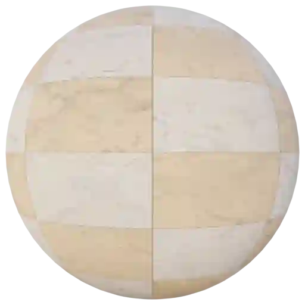

|

**This material is contained in the following Exapacks:**

    - XTRPbr_05k_Vol_001

    - XTRPbr_1k_Vol_001

    - XTRPbr_2k_Vol_002

    - XTRPbr_4k_Vol_004

    - XTRPbr_8k_Vol_003

------------------------------------------------------------------------------------------------------------------------

Square Beige Grid Tiles 008
***************************

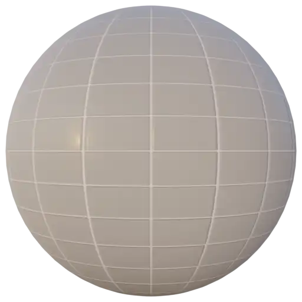

|

**This material is contained in the following Exapacks:**

    - XTRPbr_05k_Vol_001

    - XTRPbr_1k_Vol_001

    - XTRPbr_2k_Vol_002

    - XTRPbr_4k_Vol_004

------------------------------------------------------------------------------------------------------------------------

Square Black Grid Tiles 001
***************************

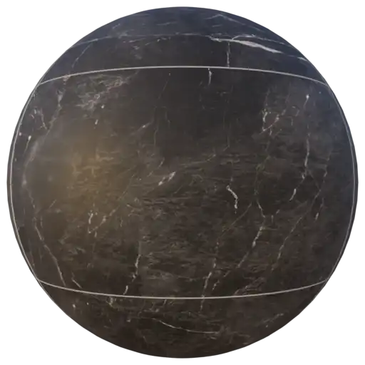

|

**This material is contained in the following Exapacks:**

    - XTRPbr_05k_Vol_001

    - XTRPbr_1k_Vol_001

    - XTRPbr_2k_Vol_002

    - XTRPbr_4k_Vol_004

    - XTRPbr_8k_Vol_003

------------------------------------------------------------------------------------------------------------------------

Square Black Grid Tiles 002
***************************

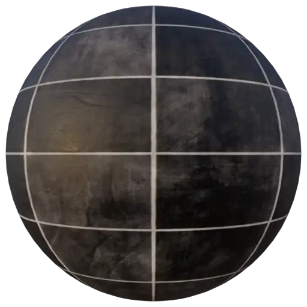

|

**This material is contained in the following Exapacks:**

    - XTRPbr_05k_Vol_001

    - XTRPbr_1k_Vol_001

    - XTRPbr_2k_Vol_002

    - XTRPbr_4k_Vol_004

    - XTRPbr_8k_Vol_003

------------------------------------------------------------------------------------------------------------------------

Square Blue Grid Tiles 001
**************************

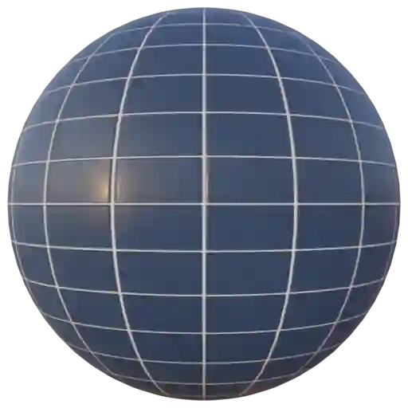

|

**This material is contained in the following Exapacks:**

    - XTRPbr_05k_Vol_001

    - XTRPbr_1k_Vol_001

    - XTRPbr_2k_Vol_002

    - XTRPbr_4k_Vol_004

------------------------------------------------------------------------------------------------------------------------

Square Blue Grid Tiles 002
**************************

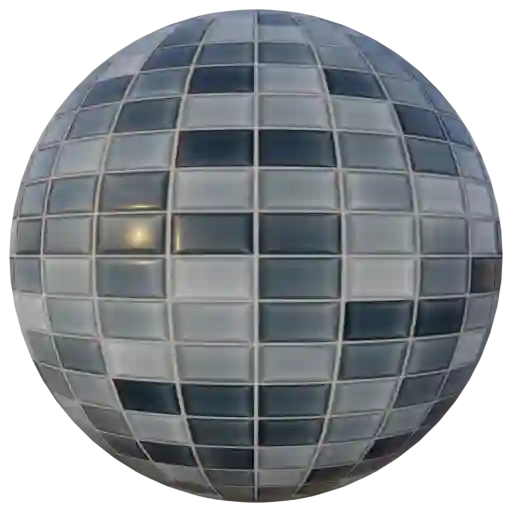

|

**This material is contained in the following Exapacks:**

    - XTRPbr_05k_Vol_001

    - XTRPbr_1k_Vol_001

    - XTRPbr_2k_Vol_002

    - XTRPbr_4k_Vol_004

    - XTRPbr_8k_Vol_003

------------------------------------------------------------------------------------------------------------------------

Square Blue Grid Tiles 003
**************************

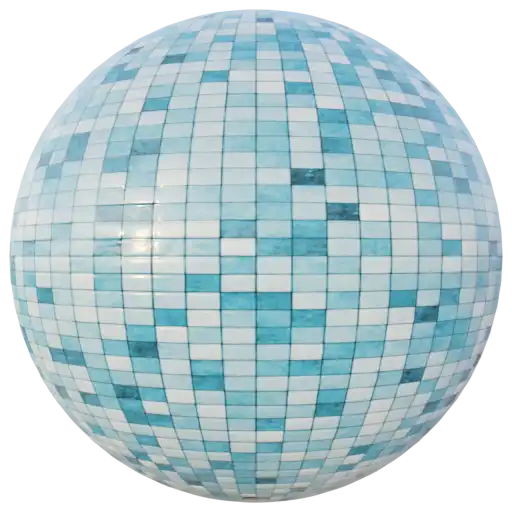

|

**This material is contained in the following Exapacks:**

    - XTRPbr_05k_Vol_001

    - XTRPbr_1k_Vol_001

    - XTRPbr_2k_Vol_002

    - XTRPbr_4k_Vol_004

------------------------------------------------------------------------------------------------------------------------

Square Blue Grid Tiles 004
**************************

|

**This material is contained in the following Exapacks:**

    - XTRPbr_05k_Vol_001

    - XTRPbr_1k_Vol_001

    - XTRPbr_2k_Vol_002

    - XTRPbr_4k_Vol_004

------------------------------------------------------------------------------------------------------------------------

Square Blue Grid Tiles 005
**************************

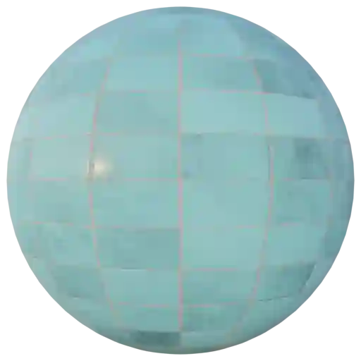

|

**This material is contained in the following Exapacks:**

    - XTRPbr_05k_Vol_001

    - XTRPbr_1k_Vol_001

    - XTRPbr_2k_Vol_002

    - XTRPbr_4k_Vol_002

    - XTRPbr_4k_Vol_004

    - XTRPbr_8k_Vol_003

------------------------------------------------------------------------------------------------------------------------

Square Brown Grid Tiles 001
***************************

.. image:: _static/_images/material_list/tiles_grid/square_brown_grid_tiles_001/square_brown_grid_tiles_001.webp
    :width: 30%
    :align: center
    :alt: Square Brown Grid Tiles 001

|

**This material is contained in the following Exapacks:**

    - XTRPbr_05k_Vol_001

    - XTRPbr_1k_Vol_001

    - XTRPbr_2k_Vol_002

    - XTRPbr_4k_Vol_002

------------------------------------------------------------------------------------------------------------------------

Square Brown Grid Tiles 002
***************************

|

**This material is contained in the following Exapacks:**

    - XTRPbr_05k_Vol_001

    - XTRPbr_1k_Vol_001

    - XTRPbr_2k_Vol_002

    - XTRPbr_4k_Vol_002

    - XTRPbr_8k_Vol_003

------------------------------------------------------------------------------------------------------------------------

Square Bw Grid Tiles 001
************************

.. image:: _static/_images/material_list/tiles_grid/square_bw_grid_tiles_001/square_bw_grid_tiles_001.webp
    :width: 30%
    :align: center
    :alt: Square Bw Grid Tiles 001

|

**This material is contained in the following Exapacks:**

    - XTRPbr_05k_Vol_001

    - XTRPbr_1k_Vol_001

    - XTRPbr_2k_Vol_002

    - XTRPbr_4k_Vol_002

------------------------------------------------------------------------------------------------------------------------

Square Bw Grid Tiles 002
************************

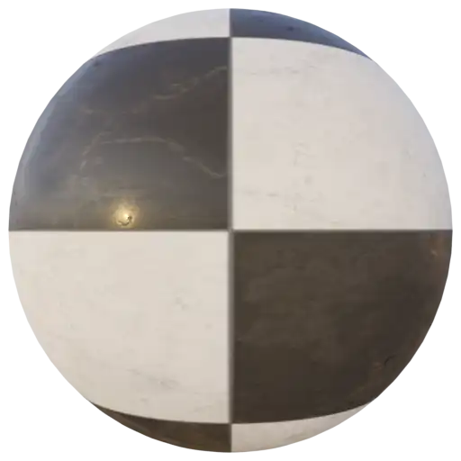

|

**This material is contained in the following Exapacks:**

    - XTRPbr_05k_Vol_001

    - XTRPbr_1k_Vol_001

    - XTRPbr_2k_Vol_002

    - XTRPbr_4k_Vol_002

    - XTRPbr_8k_Vol_011

------------------------------------------------------------------------------------------------------------------------

Square Bw Grid Tiles 003
************************

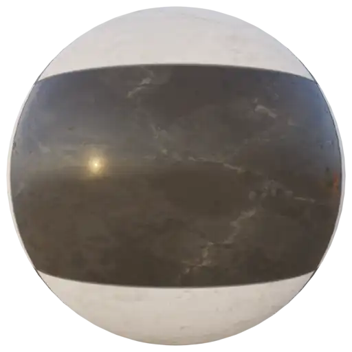

|

**This material is contained in the following Exapacks:**

    - XTRPbr_05k_Vol_001

    - XTRPbr_1k_Vol_001

    - XTRPbr_2k_Vol_002

    - XTRPbr_4k_Vol_002

    - XTRPbr_8k_Vol_011

------------------------------------------------------------------------------------------------------------------------

Square Bw Grid Tiles 004
************************

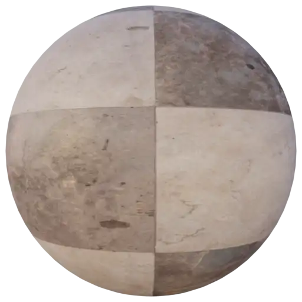

|

**This material is contained in the following Exapacks:**

    - XTRPbr_05k_Vol_001

    - XTRPbr_1k_Vol_001

    - XTRPbr_2k_Vol_002

    - XTRPbr_4k_Vol_002

    - XTRPbr_8k_Vol_011

------------------------------------------------------------------------------------------------------------------------

Square Bw Grid Tiles 005
************************

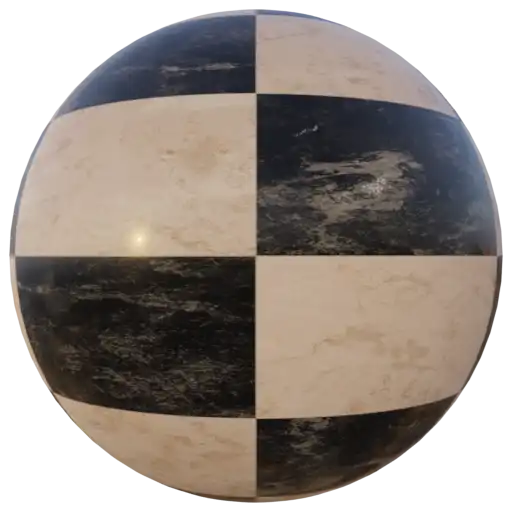

|

**This material is contained in the following Exapacks:**

    - XTRPbr_05k_Vol_001

    - XTRPbr_1k_Vol_001

    - XTRPbr_2k_Vol_002

    - XTRPbr_4k_Vol_002

    - XTRPbr_8k_Vol_011

------------------------------------------------------------------------------------------------------------------------

Square Bw Grid Tiles 006
************************

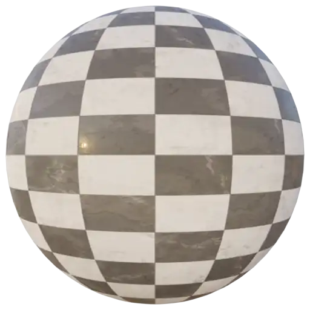

|

**This material is contained in the following Exapacks:**

    - XTRPbr_05k_Vol_001

    - XTRPbr_1k_Vol_001

    - XTRPbr_2k_Vol_002

    - XTRPbr_4k_Vol_002

    - XTRPbr_8k_Vol_011

------------------------------------------------------------------------------------------------------------------------

Square Cyan Grid Tiles 001
**************************

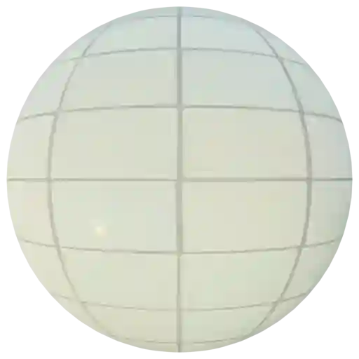

|

**This material is contained in the following Exapacks:**

    - XTRPbr_05k_Vol_001

    - XTRPbr_1k_Vol_001

    - XTRPbr_2k_Vol_002

    - XTRPbr_4k_Vol_002

------------------------------------------------------------------------------------------------------------------------

Square Green Grid Tiles 001
***************************

|

**This material is contained in the following Exapacks:**

    - XTRPbr_05k_Vol_001

    - XTRPbr_1k_Vol_001

    - XTRPbr_2k_Vol_002

    - XTRPbr_4k_Vol_002

    - XTRPbr_8k_Vol_011

------------------------------------------------------------------------------------------------------------------------

Square Green Grid Tiles 002
***************************

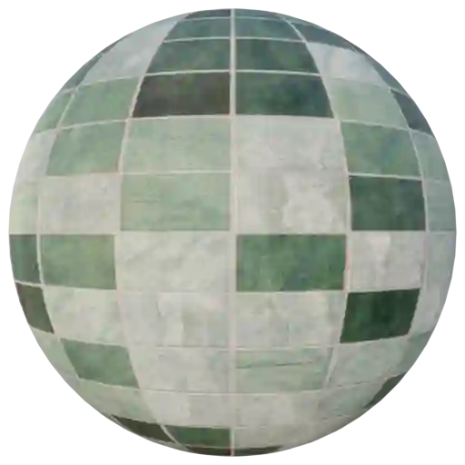

|

**This material is contained in the following Exapacks:**

    - XTRPbr_05k_Vol_001

    - XTRPbr_1k_Vol_001

    - XTRPbr_2k_Vol_002

    - XTRPbr_4k_Vol_002

    - XTRPbr_8k_Vol_011

------------------------------------------------------------------------------------------------------------------------

Square Green Grid Tiles 003
***************************

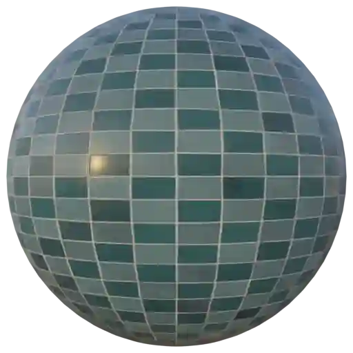

|

**This material is contained in the following Exapacks:**

    - XTRPbr_05k_Vol_001

    - XTRPbr_1k_Vol_001

    - XTRPbr_2k_Vol_002

    - XTRPbr_4k_Vol_002

    - XTRPbr_8k_Vol_011

------------------------------------------------------------------------------------------------------------------------

Square Green Grid Tiles 004
***************************

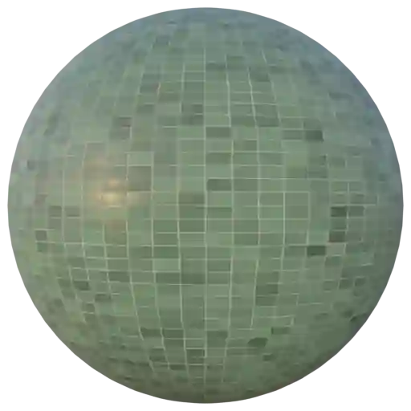

|

**This material is contained in the following Exapacks:**

    - XTRPbr_05k_Vol_001

    - XTRPbr_1k_Vol_001

    - XTRPbr_2k_Vol_002

    - XTRPbr_4k_Vol_002

    - XTRPbr_8k_Vol_011

------------------------------------------------------------------------------------------------------------------------

Square Grey Grid Tiles 001
**************************

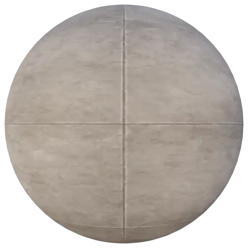

|

**This material is contained in the following Exapacks:**

    - XTRPbr_05k_Vol_001

    - XTRPbr_1k_Vol_001

    - XTRPbr_2k_Vol_002

    - XTRPbr_4k_Vol_002

------------------------------------------------------------------------------------------------------------------------

Square Grey Grid Tiles 002
**************************

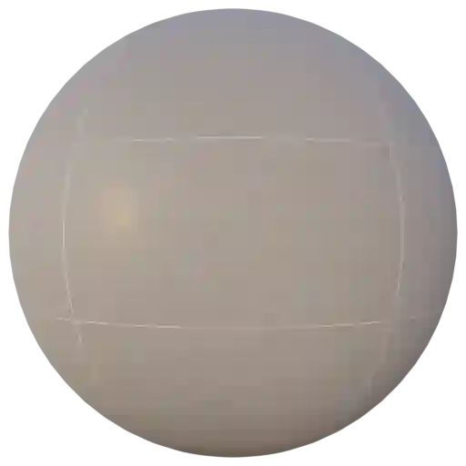

|

**This material is contained in the following Exapacks:**

    - XTRPbr_05k_Vol_001

    - XTRPbr_1k_Vol_001

    - XTRPbr_2k_Vol_002

    - XTRPbr_4k_Vol_002

------------------------------------------------------------------------------------------------------------------------

Square Grey Grid Tiles 003
**************************

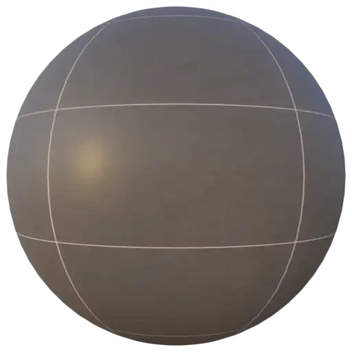

|

**This material is contained in the following Exapacks:**

    - XTRPbr_05k_Vol_001

    - XTRPbr_1k_Vol_001

    - XTRPbr_2k_Vol_002

    - XTRPbr_4k_Vol_002

------------------------------------------------------------------------------------------------------------------------

Square Grey Grid Tiles 004
**************************

.. image:: _static/_images/material_list/tiles_grid/square_grey_grid_tiles_004/square_grey_grid_tiles_004.webp
    :width: 30%
    :align: center
    :alt: Square Grey Grid Tiles 004

|

**This material is contained in the following Exapacks:**

    - XTRPbr_05k_Vol_001

    - XTRPbr_1k_Vol_001

    - XTRPbr_2k_Vol_002

    - XTRPbr_4k_Vol_002

    - XTRPbr_8k_Vol_011

------------------------------------------------------------------------------------------------------------------------

Square Grey Grid Tiles 005
**************************

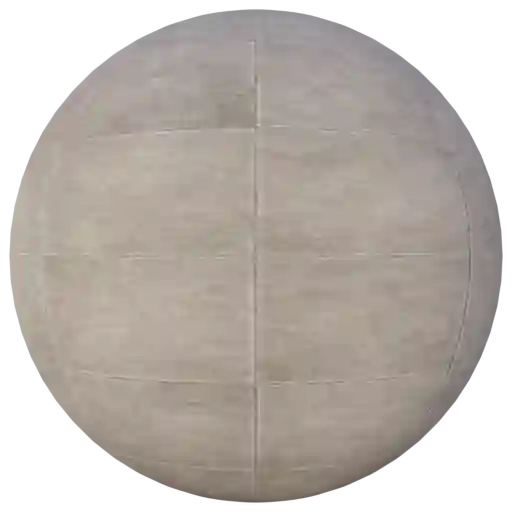

|

**This material is contained in the following Exapacks:**

    - XTRPbr_05k_Vol_001

    - XTRPbr_1k_Vol_001

    - XTRPbr_2k_Vol_002

    - XTRPbr_4k_Vol_002

------------------------------------------------------------------------------------------------------------------------

Square Grey Grid Tiles 006
**************************

|

**This material is contained in the following Exapacks:**

    - XTRPbr_05k_Vol_001

    - XTRPbr_1k_Vol_001

    - XTRPbr_2k_Vol_002

    - XTRPbr_4k_Vol_002

------------------------------------------------------------------------------------------------------------------------

Square White Grid Tiles 001
***************************

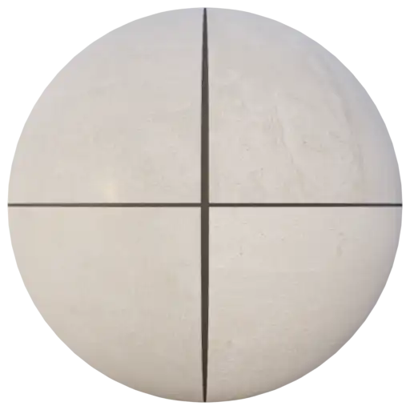

|

**This material is contained in the following Exapacks:**

    - XTRPbr_05k_Vol_001

    - XTRPbr_1k_Vol_001

    - XTRPbr_2k_Vol_002

    - XTRPbr_4k_Vol_002

------------------------------------------------------------------------------------------------------------------------

Square White Grid Tiles 002
***************************

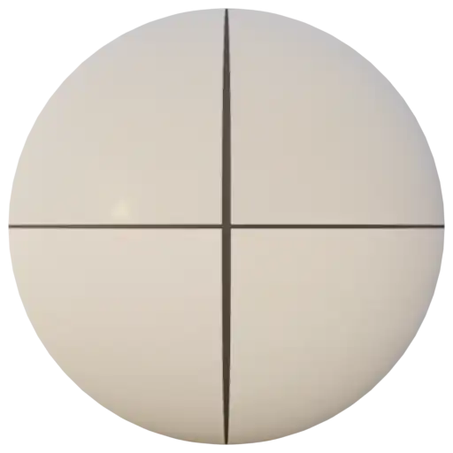

|

**This material is contained in the following Exapacks:**

    - XTRPbr_05k_Vol_001

    - XTRPbr_1k_Vol_001

    - XTRPbr_2k_Vol_002

    - XTRPbr_4k_Vol_002

------------------------------------------------------------------------------------------------------------------------

Square White Grid Tiles 003
***************************

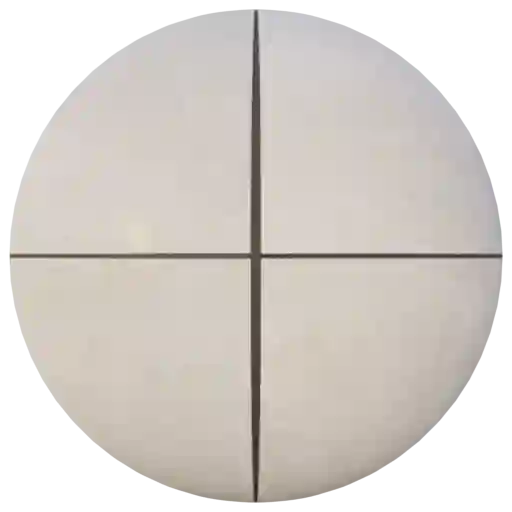

|

**This material is contained in the following Exapacks:**

    - XTRPbr_05k_Vol_001

    - XTRPbr_1k_Vol_001

    - XTRPbr_2k_Vol_002

    - XTRPbr_4k_Vol_002

------------------------------------------------------------------------------------------------------------------------

Square White Grid Tiles 004
***************************

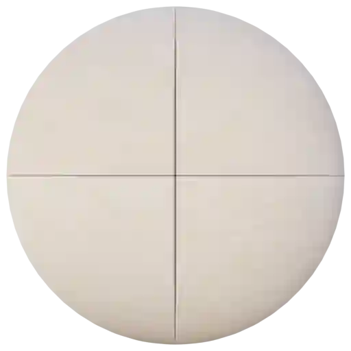

|

**This material is contained in the following Exapacks:**

    - XTRPbr_05k_Vol_001

    - XTRPbr_1k_Vol_001

    - XTRPbr_2k_Vol_002

    - XTRPbr_4k_Vol_002

    - XTRPbr_8k_Vol_011

------------------------------------------------------------------------------------------------------------------------

Square White Grid Tiles 005
***************************

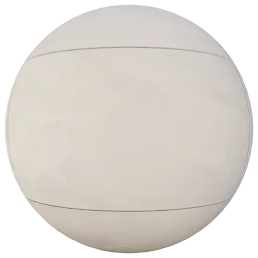

|

**This material is contained in the following Exapacks:**

    - XTRPbr_05k_Vol_001

    - XTRPbr_1k_Vol_001

    - XTRPbr_2k_Vol_002

    - XTRPbr_4k_Vol_002

    - XTRPbr_8k_Vol_011

------------------------------------------------------------------------------------------------------------------------

Square White Grid Tiles 006
***************************

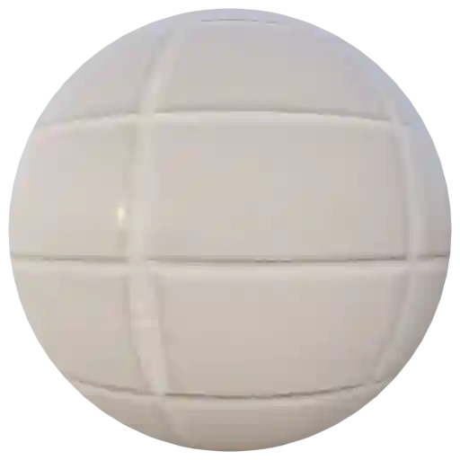

|

**This material is contained in the following Exapacks:**

    - XTRPbr_05k_Vol_001

    - XTRPbr_1k_Vol_001

    - XTRPbr_2k_Vol_002

    - XTRPbr_4k_Vol_002

------------------------------------------------------------------------------------------------------------------------

Square White Grid Tiles 007
***************************

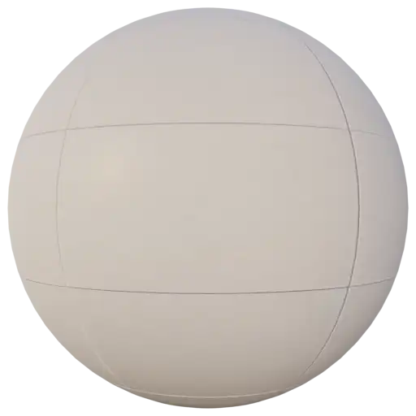

|

**This material is contained in the following Exapacks:**

    - XTRPbr_05k_Vol_001

    - XTRPbr_1k_Vol_001

    - XTRPbr_2k_Vol_002

    - XTRPbr_4k_Vol_002

------------------------------------------------------------------------------------------------------------------------

Square White Grid Tiles 008
***************************

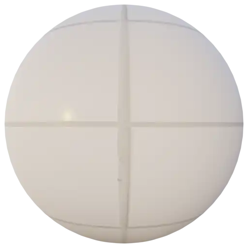

|

**This material is contained in the following Exapacks:**

    - XTRPbr_05k_Vol_001

    - XTRPbr_1k_Vol_001

    - XTRPbr_2k_Vol_002

    - XTRPbr_4k_Vol_002

    - XTRPbr_8k_Vol_011

------------------------------------------------------------------------------------------------------------------------

Square White Grid Tiles 009
***************************

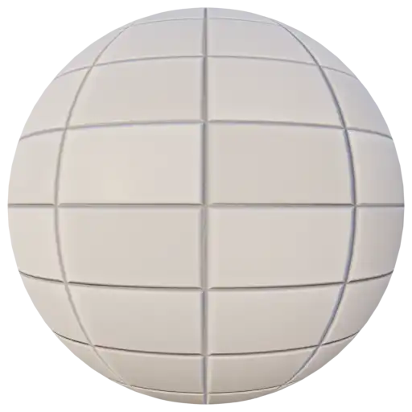

|

**This material is contained in the following Exapacks:**

    - XTRPbr_05k_Vol_001

    - XTRPbr_1k_Vol_001

    - XTRPbr_2k_Vol_002

    - XTRPbr_4k_Vol_002

    - XTRPbr_8k_Vol_011

------------------------------------------------------------------------------------------------------------------------

Terrazzo Blue Tiles 001
***********************

|

**This material is contained in the following Exapacks:**

    - XTRPbr_05k_Vol_001

    - XTRPbr_1k_Vol_001

    - XTRPbr_2k_Vol_002

    - XTRPbr_4k_Vol_002

    - XTRPbr_8k_Vol_011

------------------------------------------------------------------------------------------------------------------------

Terrazzo Green Tiles 001
************************

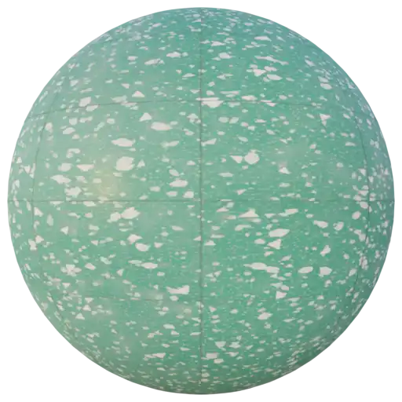

|

**This material is contained in the following Exapacks:**

    - XTRPbr_05k_Vol_001

    - XTRPbr_1k_Vol_001

    - XTRPbr_2k_Vol_002

    - XTRPbr_4k_Vol_002

    - XTRPbr_8k_Vol_011

------------------------------------------------------------------------------------------------------------------------

Terrazzo Grey Tiles 001
***********************

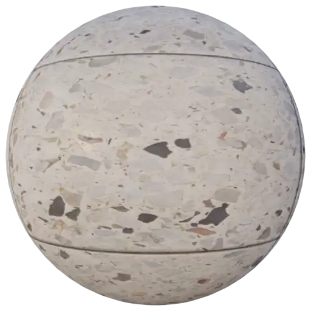

|

**This material is contained in the following Exapacks:**

    - XTRPbr_05k_Vol_001

    - XTRPbr_1k_Vol_001

    - XTRPbr_2k_Vol_002

    - XTRPbr_4k_Vol_002

    - XTRPbr_8k_Vol_011

------------------------------------------------------------------------------------------------------------------------

Terrazzo White Tiles 001
************************

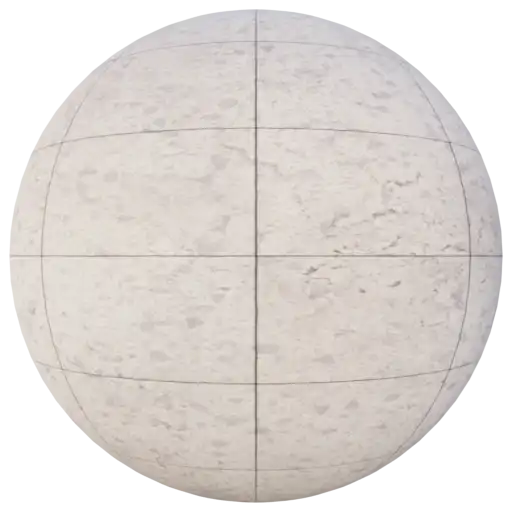

|

**This material is contained in the following Exapacks:**

    - XTRPbr_05k_Vol_001

    - XTRPbr_1k_Vol_001

    - XTRPbr_2k_Vol_002

    - XTRPbr_4k_Vol_002

    - XTRPbr_8k_Vol_011

------------------------------------------------------------------------------------------------------------------------

Terrazzo White Tiles 002
************************

.. image:: _static/_images/material_list/tiles_grid/terrazzo_white_tiles_002/terrazzo_white_tiles_002.webp
    :width: 30%
    :align: center
    :alt: Terrazzo White Tiles 002

|

**This material is contained in the following Exapacks:**

    - XTRPbr_05k_Vol_001

    - XTRPbr_1k_Vol_001

    - XTRPbr_2k_Vol_002

    - XTRPbr_4k_Vol_002

    - XTRPbr_8k_Vol_011

------------------------------------------------------------------------------------------------------------------------

Terrazzo Yellow Tiles 001
*************************

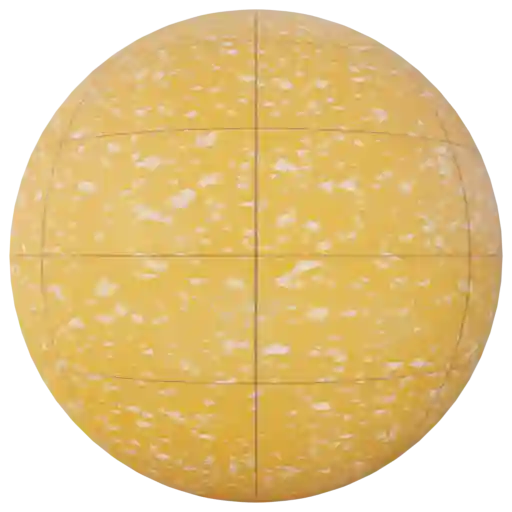

|

**This material is contained in the following Exapacks:**

    - XTRPbr_05k_Vol_001

    - XTRPbr_1k_Vol_001

    - XTRPbr_2k_Vol_002

    - XTRPbr_4k_Vol_002

    - XTRPbr_8k_Vol_011

------------------------------------------------------------------------------------------------------------------------

Tiles - Herringbone (Category)
------------------------------

Herringbone Black Tiles 001
***************************

.. image:: _static/_images/material_list/tiles_herringbone/herringbone_black_tiles_001/herringbone_black_tiles_001.webp
    :width: 30%
    :align: center
    :alt: Herringbone Black Tiles 001

|

**This material is contained in the following Exapacks:**

    - XTRPbr_05k_Vol_001

    - XTRPbr_1k_Vol_001

    - XTRPbr_2k_Vol_002

    - XTRPbr_4k_Vol_002

------------------------------------------------------------------------------------------------------------------------

Herringbone Blue Tiles 001
**************************

.. image:: _static/_images/material_list/tiles_herringbone/herringbone_blue_tiles_001/herringbone_blue_tiles_001.webp
    :width: 30%
    :align: center
    :alt: Herringbone Blue Tiles 001

|

**This material is contained in the following Exapacks:**

    - XTRPbr_05k_Vol_001

    - XTRPbr_1k_Vol_001

    - XTRPbr_2k_Vol_002

    - XTRPbr_4k_Vol_002

------------------------------------------------------------------------------------------------------------------------

Herringbone Marble Tiles 001
****************************

.. image:: _static/_images/material_list/tiles_herringbone/herringbone_marble_tiles_001/herringbone_marble_tiles_001.webp
    :width: 30%
    :align: center
    :alt: Herringbone Marble Tiles 001

|

**This material is contained in the following Exapacks:**

    - XTRPbr_05k_Vol_001

    - XTRPbr_1k_Vol_001

    - XTRPbr_2k_Vol_002

    - XTRPbr_4k_Vol_002

------------------------------------------------------------------------------------------------------------------------

Herringbone White Tiles 001
***************************

.. image:: _static/_images/material_list/tiles_herringbone/herringbone_white_tiles_001/herringbone_white_tiles_001.webp
    :width: 30%
    :align: center
    :alt: Herringbone White Tiles 001

|

**This material is contained in the following Exapacks:**

    - XTRPbr_05k_Vol_001

    - XTRPbr_1k_Vol_001

    - XTRPbr_2k_Vol_002

    - XTRPbr_4k_Vol_002

------------------------------------------------------------------------------------------------------------------------

Tiles - Hexagonal (Category)
----------------------------

Hexagonal Brown Tiles 001
*************************

.. image:: _static/_images/material_list/tiles_hexagonal/hexagonal_brown_tiles_001/hexagonal_brown_tiles_001.webp
    :width: 30%
    :align: center
    :alt: Hexagonal Brown Tiles 001

|

**This material is contained in the following Exapacks:**

    - XTRPbr_05k_Vol_001

    - XTRPbr_1k_Vol_001

    - XTRPbr_2k_Vol_002

    - XTRPbr_4k_Vol_002

    - XTRPbr_8k_Vol_011

------------------------------------------------------------------------------------------------------------------------

Hexagonal Brown Tiles 002
*************************

.. image:: _static/_images/material_list/tiles_hexagonal/hexagonal_brown_tiles_002/hexagonal_brown_tiles_002.webp
    :width: 30%
    :align: center
    :alt: Hexagonal Brown Tiles 002

|

**This material is contained in the following Exapacks:**

    - XTRPbr_05k_Vol_001

    - XTRPbr_1k_Vol_001

    - XTRPbr_2k_Vol_002

    - XTRPbr_4k_Vol_002

    - XTRPbr_8k_Vol_011

------------------------------------------------------------------------------------------------------------------------

Hexagonal Brown Tiles 003
*************************

.. image:: _static/_images/material_list/tiles_hexagonal/hexagonal_brown_tiles_003/hexagonal_brown_tiles_003.webp
    :width: 30%
    :align: center
    :alt: Hexagonal Brown Tiles 003

|

**This material is contained in the following Exapacks:**

    - XTRPbr_05k_Vol_001

    - XTRPbr_1k_Vol_001

    - XTRPbr_2k_Vol_002

    - XTRPbr_4k_Vol_002

    - XTRPbr_8k_Vol_011

------------------------------------------------------------------------------------------------------------------------

Hexagonal Brown Tiles 004
*************************

.. image:: _static/_images/material_list/tiles_hexagonal/hexagonal_brown_tiles_004/hexagonal_brown_tiles_004.webp
    :width: 30%
    :align: center
    :alt: Hexagonal Brown Tiles 004

|

**This material is contained in the following Exapacks:**

    - XTRPbr_05k_Vol_001

    - XTRPbr_1k_Vol_001

    - XTRPbr_2k_Vol_002

    - XTRPbr_4k_Vol_002

    - XTRPbr_8k_Vol_011

------------------------------------------------------------------------------------------------------------------------

Hexagonal Brown Tiles 005
*************************

.. image:: _static/_images/material_list/tiles_hexagonal/hexagonal_brown_tiles_005/hexagonal_brown_tiles_005.webp
    :width: 30%
    :align: center
    :alt: Hexagonal Brown Tiles 005

|

**This material is contained in the following Exapacks:**

    - XTRPbr_05k_Vol_001

    - XTRPbr_1k_Vol_001

    - XTRPbr_2k_Vol_002

    - XTRPbr_4k_Vol_002

------------------------------------------------------------------------------------------------------------------------

Hexagonal Green Tiles 001
*************************

.. image:: _static/_images/material_list/tiles_hexagonal/hexagonal_green_tiles_001/hexagonal_green_tiles_001.webp
    :width: 30%
    :align: center
    :alt: Hexagonal Green Tiles 001

|

**This material is contained in the following Exapacks:**

    - XTRPbr_05k_Vol_001

    - XTRPbr_1k_Vol_001

    - XTRPbr_2k_Vol_002

    - XTRPbr_4k_Vol_002

------------------------------------------------------------------------------------------------------------------------

Hexagonal Green Tiles 002
*************************

.. image:: _static/_images/material_list/tiles_hexagonal/hexagonal_green_tiles_002/hexagonal_green_tiles_002.webp
    :width: 30%
    :align: center
    :alt: Hexagonal Green Tiles 002

|

**This material is contained in the following Exapacks:**

    - XTRPbr_05k_Vol_001

    - XTRPbr_1k_Vol_001

    - XTRPbr_2k_Vol_002

    - XTRPbr_4k_Vol_002

    - XTRPbr_8k_Vol_011

------------------------------------------------------------------------------------------------------------------------

Hexagonal Green Tiles 003
*************************

.. image:: _static/_images/material_list/tiles_hexagonal/hexagonal_green_tiles_003/hexagonal_green_tiles_003.webp
    :width: 30%
    :align: center
    :alt: Hexagonal Green Tiles 003

|

**This material is contained in the following Exapacks:**

    - XTRPbr_05k_Vol_001

    - XTRPbr_1k_Vol_001

    - XTRPbr_2k_Vol_002

    - XTRPbr_4k_Vol_002

    - XTRPbr_8k_Vol_011

------------------------------------------------------------------------------------------------------------------------

Hexagonal Green Tiles 004
*************************

.. image:: _static/_images/material_list/tiles_hexagonal/hexagonal_green_tiles_004/hexagonal_green_tiles_004.webp
    :width: 30%
    :align: center
    :alt: Hexagonal Green Tiles 004

|

**This material is contained in the following Exapacks:**

    - XTRPbr_05k_Vol_001

    - XTRPbr_1k_Vol_001

    - XTRPbr_2k_Vol_002

    - XTRPbr_4k_Vol_002

    - XTRPbr_8k_Vol_011

------------------------------------------------------------------------------------------------------------------------

Hexagonal Green Tiles 005
*************************

.. image:: _static/_images/material_list/tiles_hexagonal/hexagonal_green_tiles_005/hexagonal_green_tiles_005.webp
    :width: 30%
    :align: center
    :alt: Hexagonal Green Tiles 005

|

**This material is contained in the following Exapacks:**

    - XTRPbr_05k_Vol_001

    - XTRPbr_1k_Vol_001

    - XTRPbr_2k_Vol_002

    - XTRPbr_4k_Vol_002

    - XTRPbr_8k_Vol_011

------------------------------------------------------------------------------------------------------------------------

Hexagonal White Tiles 001
*************************

.. image:: _static/_images/material_list/tiles_hexagonal/hexagonal_white_tiles_001/hexagonal_white_tiles_001.webp
    :width: 30%
    :align: center
    :alt: Hexagonal White Tiles 001

|

**This material is contained in the following Exapacks:**

    - XTRPbr_05k_Vol_001

    - XTRPbr_1k_Vol_001

    - XTRPbr_2k_Vol_002

    - XTRPbr_4k_Vol_002

    - XTRPbr_8k_Vol_011

------------------------------------------------------------------------------------------------------------------------

Hexagonal White Tiles 002
*************************

.. image:: _static/_images/material_list/tiles_hexagonal/hexagonal_white_tiles_002/hexagonal_white_tiles_002.webp
    :width: 30%
    :align: center
    :alt: Hexagonal White Tiles 002

|

**This material is contained in the following Exapacks:**

    - XTRPbr_05k_Vol_001

    - XTRPbr_1k_Vol_001

    - XTRPbr_2k_Vol_002

    - XTRPbr_4k_Vol_002

------------------------------------------------------------------------------------------------------------------------

Hexagonal White Tiles 003
*************************

.. image:: _static/_images/material_list/tiles_hexagonal/hexagonal_white_tiles_003/hexagonal_white_tiles_003.webp
    :width: 30%
    :align: center
    :alt: Hexagonal White Tiles 003

|

**This material is contained in the following Exapacks:**

    - XTRPbr_05k_Vol_001

    - XTRPbr_1k_Vol_001

    - XTRPbr_2k_Vol_002

    - XTRPbr_4k_Vol_002

------------------------------------------------------------------------------------------------------------------------

Tiles - Mix (Category)
----------------------

Circle Small Tiles 001
**********************

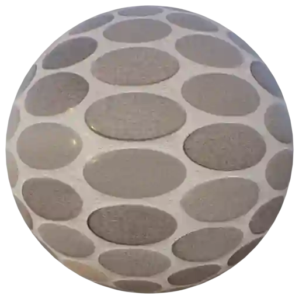

|

**This material is contained in the following Exapacks:**

    - XTRPbr_05k_Vol_001

    - XTRPbr_1k_Vol_001

    - XTRPbr_2k_Vol_002

    - XTRPbr_4k_Vol_002

------------------------------------------------------------------------------------------------------------------------

Deco Tiles 001
**************

|

**This material is contained in the following Exapacks:**

    - XTRPbr_05k_Vol_001

    - XTRPbr_1k_Vol_001

    - XTRPbr_2k_Vol_002

    - XTRPbr_4k_Vol_002

------------------------------------------------------------------------------------------------------------------------

Deco Tiles 002
**************

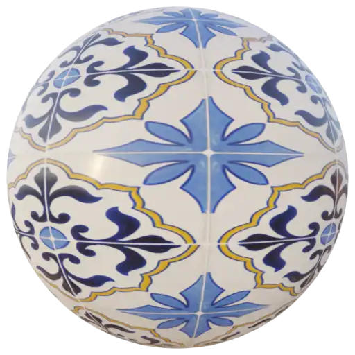

|

**This material is contained in the following Exapacks:**

    - XTRPbr_05k_Vol_001

    - XTRPbr_1k_Vol_001

    - XTRPbr_2k_Vol_002

    - XTRPbr_4k_Vol_002

------------------------------------------------------------------------------------------------------------------------

Deco Tiles 003
**************

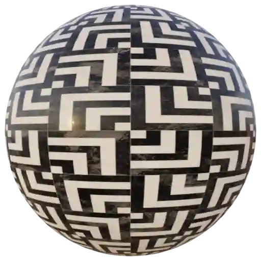

|

**This material is contained in the following Exapacks:**

    - XTRPbr_05k_Vol_001

    - XTRPbr_1k_Vol_001

    - XTRPbr_2k_Vol_002

    - XTRPbr_4k_Vol_002

    - XTRPbr_8k_Vol_011

------------------------------------------------------------------------------------------------------------------------

Deco Tiles 004
**************

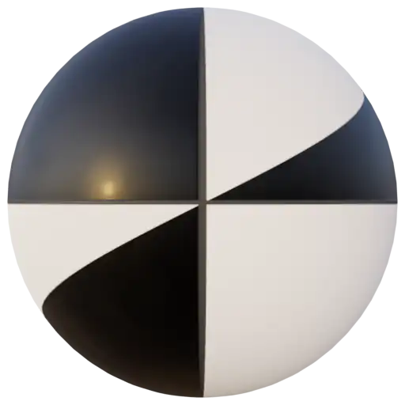

|

**This material is contained in the following Exapacks:**

    - XTRPbr_05k_Vol_001

    - XTRPbr_1k_Vol_001

    - XTRPbr_2k_Vol_002

    - XTRPbr_4k_Vol_002

------------------------------------------------------------------------------------------------------------------------

Deco Tiles 005
**************

.. image:: _static/_images/material_list/tiles_mix/deco_tiles_005/deco_tiles_005.webp
    :width: 30%
    :align: center
    :alt: Deco Tiles 005

|

**This material is contained in the following Exapacks:**

    - XTRPbr_05k_Vol_001

    - XTRPbr_1k_Vol_001

    - XTRPbr_2k_Vol_002

    - XTRPbr_4k_Vol_002

------------------------------------------------------------------------------------------------------------------------

Decorative Beige Tiles 001
**************************

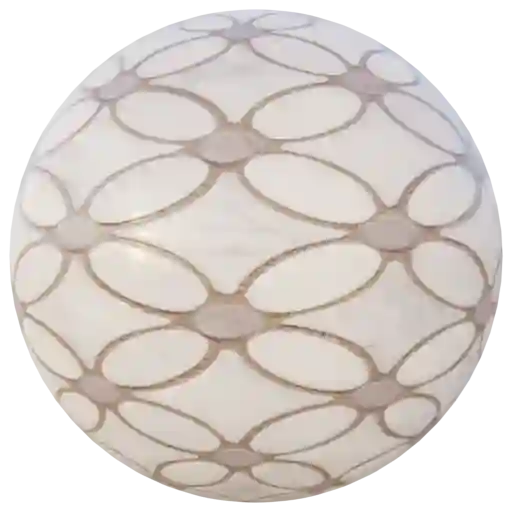

|

**This material is contained in the following Exapacks:**

    - XTRPbr_05k_Vol_001

    - XTRPbr_1k_Vol_001

    - XTRPbr_2k_Vol_002

    - XTRPbr_4k_Vol_002

------------------------------------------------------------------------------------------------------------------------

Decorative Beige Tiles 002
**************************

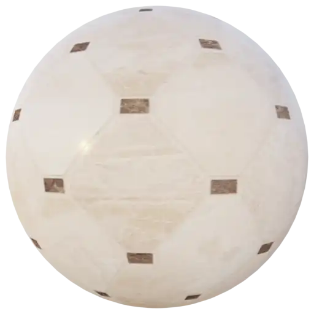

|

**This material is contained in the following Exapacks:**

    - XTRPbr_05k_Vol_001

    - XTRPbr_1k_Vol_001

    - XTRPbr_2k_Vol_002

    - XTRPbr_4k_Vol_002

------------------------------------------------------------------------------------------------------------------------

Decorative Beige Tiles 003
**************************

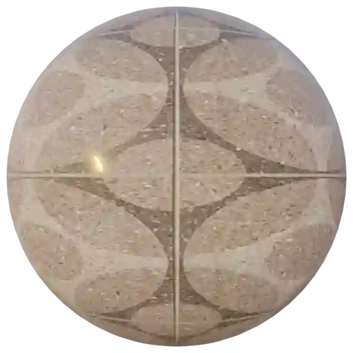

|

**This material is contained in the following Exapacks:**

    - XTRPbr_05k_Vol_001

    - XTRPbr_1k_Vol_001

    - XTRPbr_2k_Vol_002

    - XTRPbr_4k_Vol_002

------------------------------------------------------------------------------------------------------------------------

Decorative Beige Tiles 004
**************************

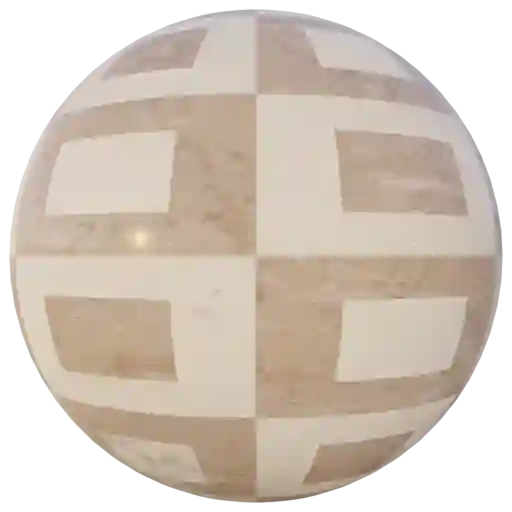

|

**This material is contained in the following Exapacks:**

    - XTRPbr_05k_Vol_001

    - XTRPbr_1k_Vol_001

    - XTRPbr_2k_Vol_002

    - XTRPbr_4k_Vol_002

    - XTRPbr_8k_Vol_011

------------------------------------------------------------------------------------------------------------------------

Decorative Green Tiles 001
**************************

.. image:: _static/_images/material_list/tiles_mix/decorative_green_tiles_001/decorative_green_tiles_001.webp
    :width: 30%
    :align: center
    :alt: Decorative Green Tiles 001

|

**This material is contained in the following Exapacks:**

    - XTRPbr_05k_Vol_001

    - XTRPbr_1k_Vol_001

    - XTRPbr_2k_Vol_002

    - XTRPbr_4k_Vol_002

------------------------------------------------------------------------------------------------------------------------

Decorative Green Tiles 002
**************************

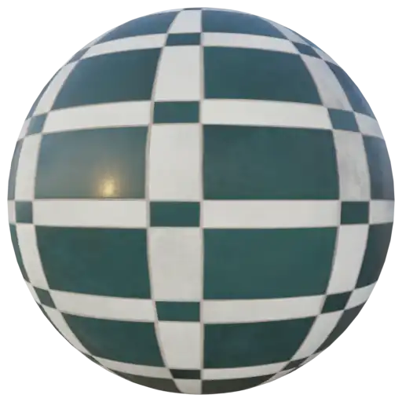

|

**This material is contained in the following Exapacks:**

    - XTRPbr_05k_Vol_001

    - XTRPbr_1k_Vol_001

    - XTRPbr_2k_Vol_002

    - XTRPbr_4k_Vol_002

    - XTRPbr_8k_Vol_011

------------------------------------------------------------------------------------------------------------------------

Double Bw Tiles 001
*******************

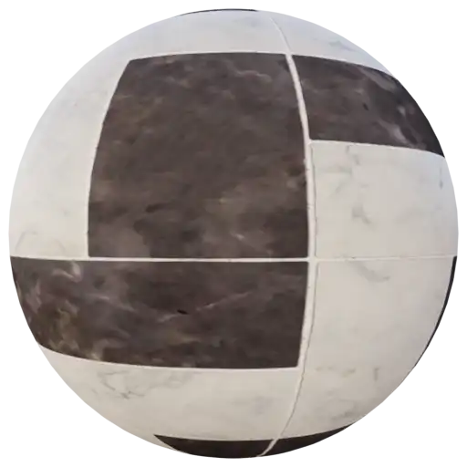

|

**This material is contained in the following Exapacks:**

    - XTRPbr_05k_Vol_001

    - XTRPbr_1k_Vol_001

    - XTRPbr_2k_Vol_002

    - XTRPbr_4k_Vol_002

------------------------------------------------------------------------------------------------------------------------

Double Green Tiles 001
**********************

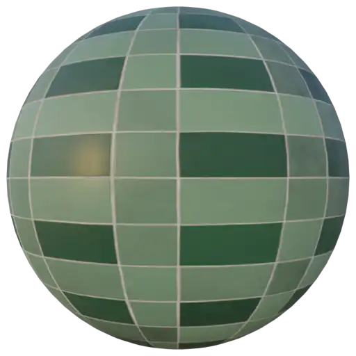

|

**This material is contained in the following Exapacks:**

    - XTRPbr_05k_Vol_001

    - XTRPbr_1k_Vol_001

    - XTRPbr_2k_Vol_002

    - XTRPbr_4k_Vol_002

    - XTRPbr_8k_Vol_011

------------------------------------------------------------------------------------------------------------------------

Double Green Tiles 002
**********************

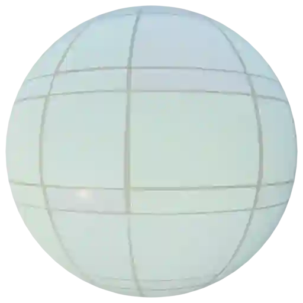

|

**This material is contained in the following Exapacks:**

    - XTRPbr_05k_Vol_001

    - XTRPbr_1k_Vol_001

    - XTRPbr_2k_Vol_002

    - XTRPbr_4k_Vol_002

------------------------------------------------------------------------------------------------------------------------

Double White Tiles 001
**********************

.. image:: _static/_images/material_list/tiles_mix/double_white_tiles_001/double_white_tiles_001.webp
    :width: 30%
    :align: center
    :alt: Double White Tiles 001

|

**This material is contained in the following Exapacks:**

    - XTRPbr_05k_Vol_001

    - XTRPbr_1k_Vol_001

    - XTRPbr_2k_Vol_002

    - XTRPbr_4k_Vol_002

    - XTRPbr_8k_Vol_011

------------------------------------------------------------------------------------------------------------------------

Marble Deco Bw 001
******************

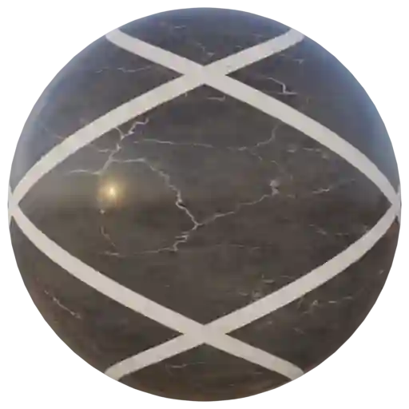

|

**This material is contained in the following Exapacks:**

    - XTRPbr_05k_Vol_001

    - XTRPbr_1k_Vol_001

    - XTRPbr_2k_Vol_002

    - XTRPbr_4k_Vol_002

------------------------------------------------------------------------------------------------------------------------

Marble Deco Bw 002
******************

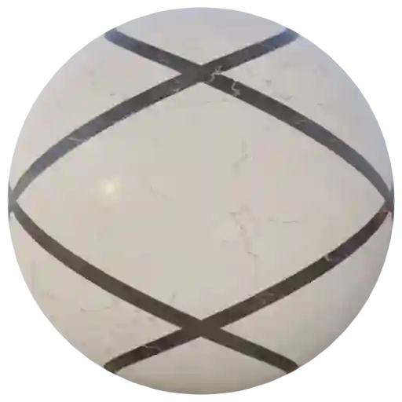

|

**This material is contained in the following Exapacks:**

    - XTRPbr_05k_Vol_001

    - XTRPbr_1k_Vol_001

    - XTRPbr_2k_Vol_002

    - XTRPbr_4k_Vol_002

------------------------------------------------------------------------------------------------------------------------

Marble Deco Green 001
*********************

.. image:: _static/_images/material_list/tiles_mix/marble_deco_green_001/marble_deco_green_001.webp
    :width: 30%
    :align: center
    :alt: Marble Deco Green 001

|

**This material is contained in the following Exapacks:**

    - XTRPbr_05k_Vol_001

    - XTRPbr_1k_Vol_001

    - XTRPbr_2k_Vol_002

    - XTRPbr_4k_Vol_002

    - XTRPbr_8k_Vol_011

------------------------------------------------------------------------------------------------------------------------

Marble Deco Green 002
*********************

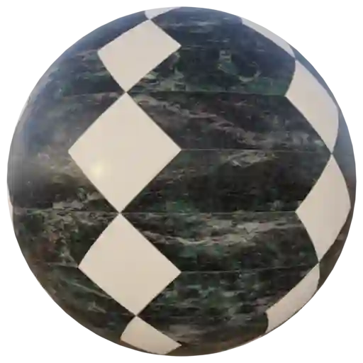

|

**This material is contained in the following Exapacks:**

    - XTRPbr_05k_Vol_001

    - XTRPbr_1k_Vol_001

    - XTRPbr_2k_Vol_002

    - XTRPbr_4k_Vol_002

    - XTRPbr_8k_Vol_011

------------------------------------------------------------------------------------------------------------------------

Marble Deco Green 003
*********************

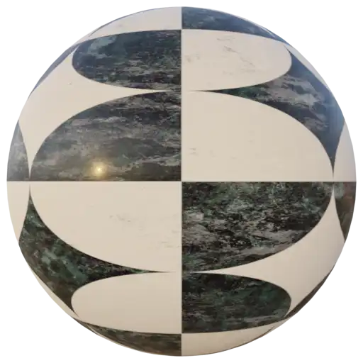

|

**This material is contained in the following Exapacks:**

    - XTRPbr_05k_Vol_001

    - XTRPbr_1k_Vol_001

    - XTRPbr_2k_Vol_002

    - XTRPbr_4k_Vol_002

    - XTRPbr_8k_Vol_011

------------------------------------------------------------------------------------------------------------------------

Marble Deco Green 004
*********************

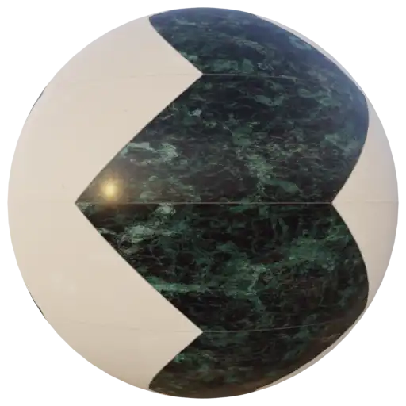

|

**This material is contained in the following Exapacks:**

    - XTRPbr_05k_Vol_001

    - XTRPbr_1k_Vol_001

    - XTRPbr_2k_Vol_002

    - XTRPbr_4k_Vol_002

    - XTRPbr_8k_Vol_011

------------------------------------------------------------------------------------------------------------------------

Pinwheel Tiles Black 001
************************

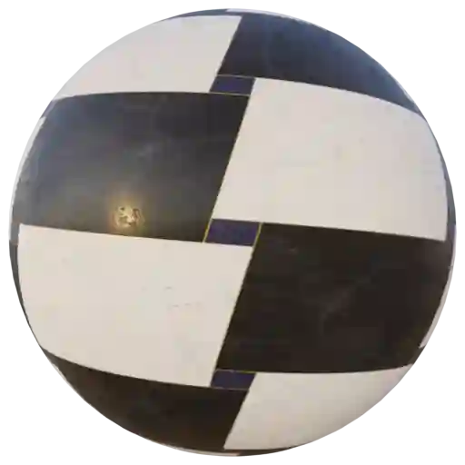

|

**This material is contained in the following Exapacks:**

    - XTRPbr_05k_Vol_001

    - XTRPbr_1k_Vol_001

    - XTRPbr_2k_Vol_002

    - XTRPbr_4k_Vol_002

    - XTRPbr_8k_Vol_011

------------------------------------------------------------------------------------------------------------------------

Pinwheel Tiles Black 002
************************

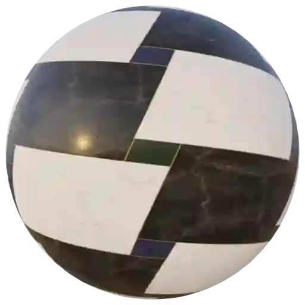

|

**This material is contained in the following Exapacks:**

    - XTRPbr_05k_Vol_001

    - XTRPbr_1k_Vol_001

    - XTRPbr_2k_Vol_002

    - XTRPbr_4k_Vol_002

    - XTRPbr_8k_Vol_011

------------------------------------------------------------------------------------------------------------------------

Pinwheel Tiles Black 003
************************

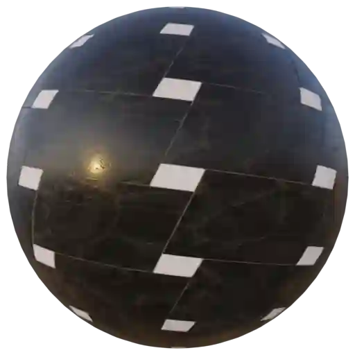

|

**This material is contained in the following Exapacks:**

    - XTRPbr_05k_Vol_001

    - XTRPbr_1k_Vol_001

    - XTRPbr_2k_Vol_002

    - XTRPbr_4k_Vol_002

    - XTRPbr_8k_Vol_011

------------------------------------------------------------------------------------------------------------------------

Pinwheel Tiles Black 004
************************

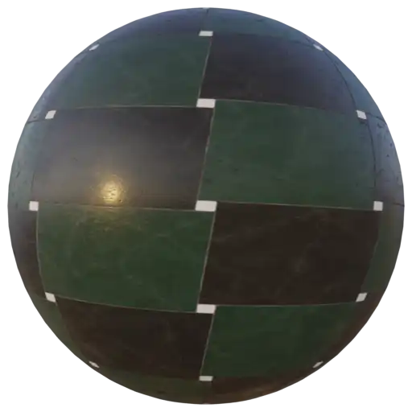

|

**This material is contained in the following Exapacks:**

    - XTRPbr_05k_Vol_001

    - XTRPbr_1k_Vol_001

    - XTRPbr_2k_Vol_002

    - XTRPbr_4k_Vol_002

    - XTRPbr_8k_Vol_011

------------------------------------------------------------------------------------------------------------------------

Pinwheel Tiles White 001
************************

.. image:: _static/_images/material_list/tiles_mix/pinwheel_tiles_white_001/pinwheel_tiles_white_001.webp
    :width: 30%
    :align: center
    :alt: Pinwheel Tiles White 001

|

**This material is contained in the following Exapacks:**

    - XTRPbr_05k_Vol_001

    - XTRPbr_1k_Vol_001

    - XTRPbr_2k_Vol_002

    - XTRPbr_4k_Vol_002

    - XTRPbr_8k_Vol_011

------------------------------------------------------------------------------------------------------------------------

Pinwheel Tiles White 002
************************

.. image:: _static/_images/material_list/tiles_mix/pinwheel_tiles_white_002/pinwheel_tiles_white_002.webp
    :width: 30%
    :align: center
    :alt: Pinwheel Tiles White 002

|

**This material is contained in the following Exapacks:**

    - XTRPbr_05k_Vol_001

    - XTRPbr_1k_Vol_001

    - XTRPbr_2k_Vol_002

    - XTRPbr_4k_Vol_002

    - XTRPbr_8k_Vol_011

------------------------------------------------------------------------------------------------------------------------

Pinwheel Tiles White 003
************************

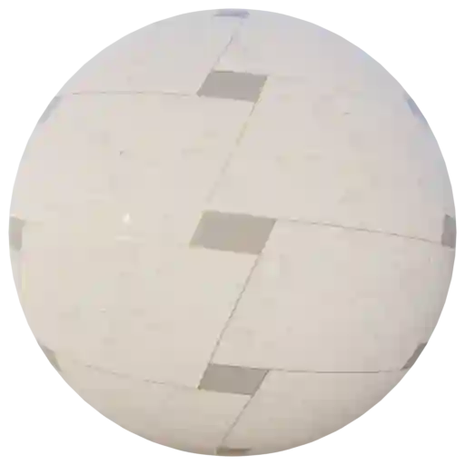

|

**This material is contained in the following Exapacks:**

    - XTRPbr_05k_Vol_001

    - XTRPbr_1k_Vol_001

    - XTRPbr_2k_Vol_002

    - XTRPbr_4k_Vol_002

    - XTRPbr_8k_Vol_005

    - XTRPbr_8k_Vol_011

------------------------------------------------------------------------------------------------------------------------

Tiles - Offset (Category)
-------------------------

Offset Beige Tiles 001
**********************

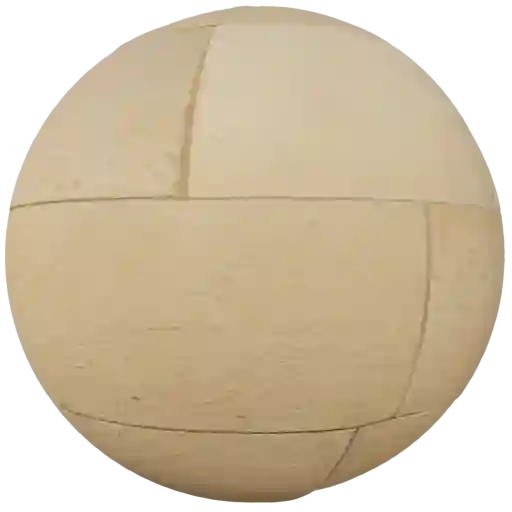

|

**This material is contained in the following Exapacks:**

    - XTRPbr_05k_Vol_001

    - XTRPbr_1k_Vol_001

    - XTRPbr_2k_Vol_002

    - XTRPbr_4k_Vol_002

    - XTRPbr_8k_Vol_005

------------------------------------------------------------------------------------------------------------------------

Offset Beige Tiles 002
**********************

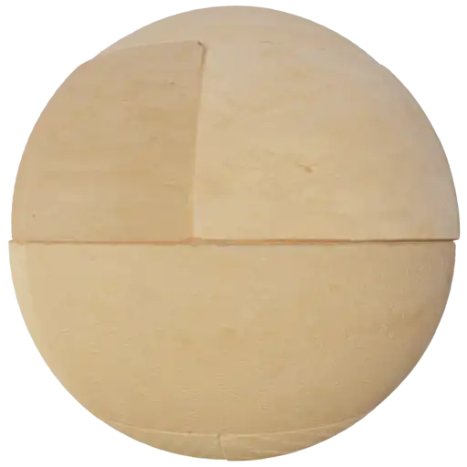

|

**This material is contained in the following Exapacks:**

    - XTRPbr_05k_Vol_001

    - XTRPbr_1k_Vol_001

    - XTRPbr_2k_Vol_002

    - XTRPbr_4k_Vol_002

    - XTRPbr_8k_Vol_005

------------------------------------------------------------------------------------------------------------------------

Offset Beige Tiles 003
**********************

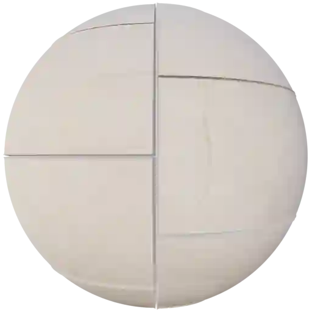

|

**This material is contained in the following Exapacks:**

    - XTRPbr_05k_Vol_001

    - XTRPbr_1k_Vol_001

    - XTRPbr_2k_Vol_002

    - XTRPbr_4k_Vol_002

------------------------------------------------------------------------------------------------------------------------

Offset Black Tiles 001
**********************

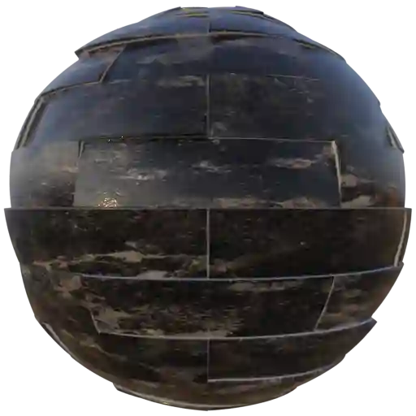

|

**This material is contained in the following Exapacks:**

    - XTRPbr_05k_Vol_001

    - XTRPbr_1k_Vol_001

    - XTRPbr_2k_Vol_002

    - XTRPbr_4k_Vol_002

    - XTRPbr_8k_Vol_005

------------------------------------------------------------------------------------------------------------------------

Offset Brown Tiles 001
**********************

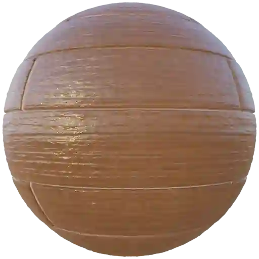

|

**This material is contained in the following Exapacks:**

    - XTRPbr_05k_Vol_001

    - XTRPbr_1k_Vol_001

    - XTRPbr_2k_Vol_002

    - XTRPbr_4k_Vol_002

------------------------------------------------------------------------------------------------------------------------

Offset Green Tiles 001
**********************

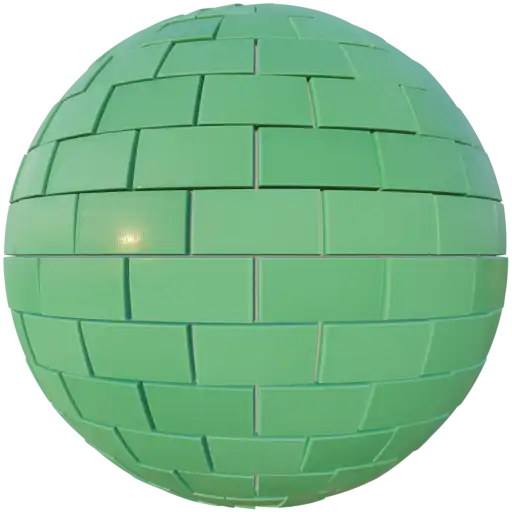

|

**This material is contained in the following Exapacks:**

    - XTRPbr_05k_Vol_001

    - XTRPbr_1k_Vol_001

    - XTRPbr_2k_Vol_002

    - XTRPbr_4k_Vol_002

    - XTRPbr_8k_Vol_005

------------------------------------------------------------------------------------------------------------------------

Offset Grey Tiles 001
*********************

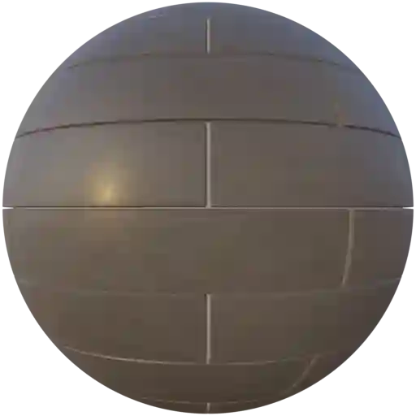

|

**This material is contained in the following Exapacks:**

    - XTRPbr_05k_Vol_001

    - XTRPbr_1k_Vol_001

    - XTRPbr_2k_Vol_002

    - XTRPbr_4k_Vol_002

------------------------------------------------------------------------------------------------------------------------

Offset Grey Tiles 002
*********************

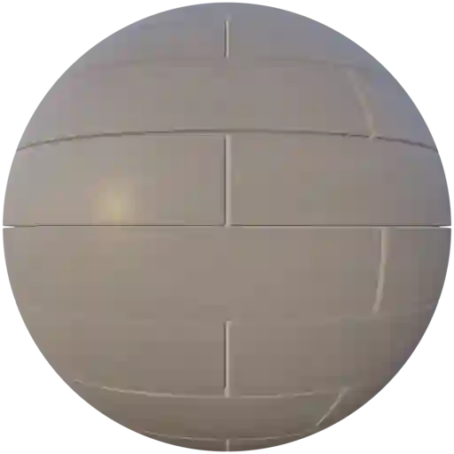

|

**This material is contained in the following Exapacks:**

    - XTRPbr_05k_Vol_001

    - XTRPbr_1k_Vol_001

    - XTRPbr_2k_Vol_002

    - XTRPbr_4k_Vol_002

------------------------------------------------------------------------------------------------------------------------

Offset Pink Tiles 001
*********************

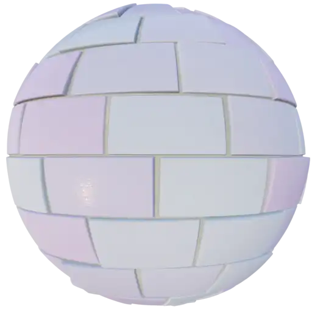

|

**This material is contained in the following Exapacks:**

    - XTRPbr_05k_Vol_001

    - XTRPbr_1k_Vol_001

    - XTRPbr_2k_Vol_002

    - XTRPbr_4k_Vol_002

------------------------------------------------------------------------------------------------------------------------

Offset White Tiles 001
**********************

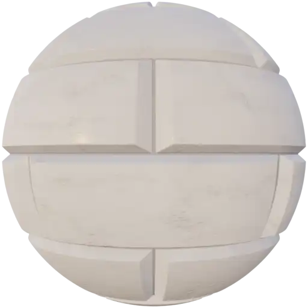

|

**This material is contained in the following Exapacks:**

    - XTRPbr_05k_Vol_001

    - XTRPbr_1k_Vol_001

    - XTRPbr_2k_Vol_002

    - XTRPbr_4k_Vol_002

------------------------------------------------------------------------------------------------------------------------

Offset White Tiles 002
**********************

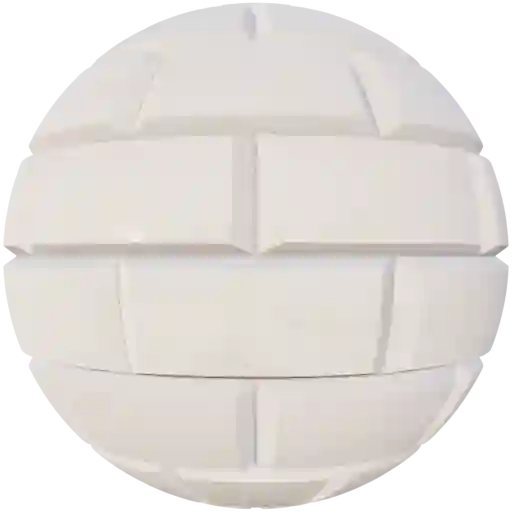

|

**This material is contained in the following Exapacks:**

    - XTRPbr_05k_Vol_001

    - XTRPbr_1k_Vol_001

    - XTRPbr_2k_Vol_002

    - XTRPbr_4k_Vol_002

------------------------------------------------------------------------------------------------------------------------

Offset White Tiles 003
**********************

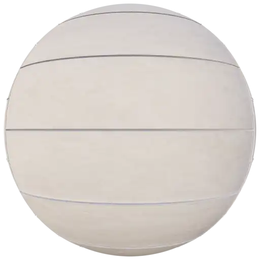

|

**This material is contained in the following Exapacks:**

    - XTRPbr_05k_Vol_001

    - XTRPbr_1k_Vol_001

    - XTRPbr_2k_Vol_002

    - XTRPbr_4k_Vol_002

------------------------------------------------------------------------------------------------------------------------

Offset White Tiles 004
**********************

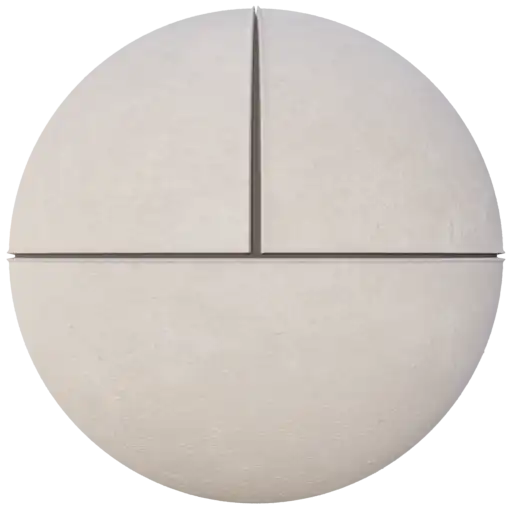

|

**This material is contained in the following Exapacks:**

    - XTRPbr_05k_Vol_001

    - XTRPbr_1k_Vol_001

    - XTRPbr_2k_Vol_002

    - XTRPbr_4k_Vol_002

    - XTRPbr_8k_Vol_005

------------------------------------------------------------------------------------------------------------------------

Offset White Tiles 005
**********************

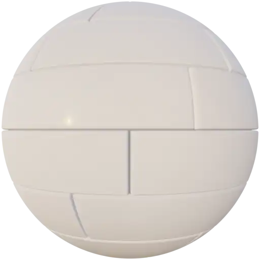

|

**This material is contained in the following Exapacks:**

    - XTRPbr_05k_Vol_001

    - XTRPbr_1k_Vol_001

    - XTRPbr_2k_Vol_002

    - XTRPbr_4k_Vol_002

------------------------------------------------------------------------------------------------------------------------

Offset White Tiles 006
**********************

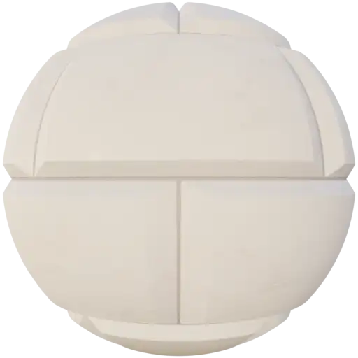

|

**This material is contained in the following Exapacks:**

    - XTRPbr_05k_Vol_001

    - XTRPbr_1k_Vol_001

    - XTRPbr_2k_Vol_002

    - XTRPbr_4k_Vol_002

------------------------------------------------------------------------------------------------------------------------

Subway Blue Tiles 001
*********************

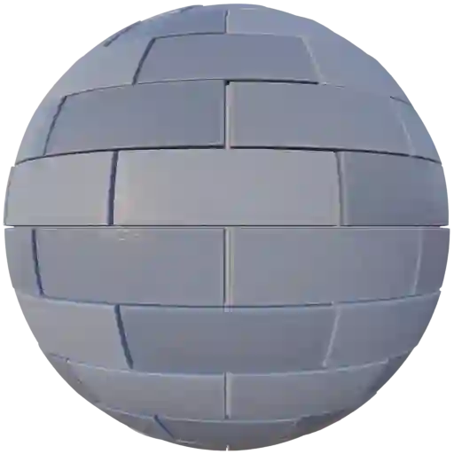

|

**This material is contained in the following Exapacks:**

    - XTRPbr_05k_Vol_001

    - XTRPbr_1k_Vol_001

    - XTRPbr_2k_Vol_002

    - XTRPbr_4k_Vol_002

    - XTRPbr_8k_Vol_005

------------------------------------------------------------------------------------------------------------------------

Subway Green Tiles 001
**********************

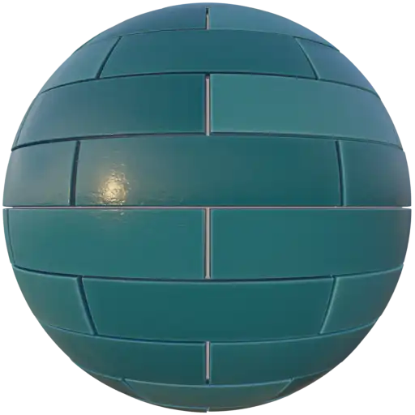

|

**This material is contained in the following Exapacks:**

    - XTRPbr_05k_Vol_001

    - XTRPbr_1k_Vol_001

    - XTRPbr_2k_Vol_002

    - XTRPbr_4k_Vol_002

    - XTRPbr_8k_Vol_005

------------------------------------------------------------------------------------------------------------------------

Subway Green Tiles 002
**********************

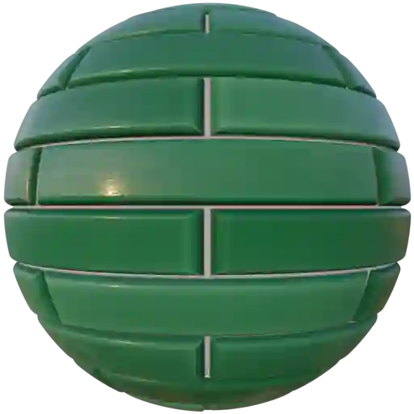

|

**This material is contained in the following Exapacks:**

    - XTRPbr_05k_Vol_001

    - XTRPbr_1k_Vol_001

    - XTRPbr_2k_Vol_002

    - XTRPbr_4k_Vol_002

    - XTRPbr_8k_Vol_005

------------------------------------------------------------------------------------------------------------------------

Subway Green Tiles 003
**********************

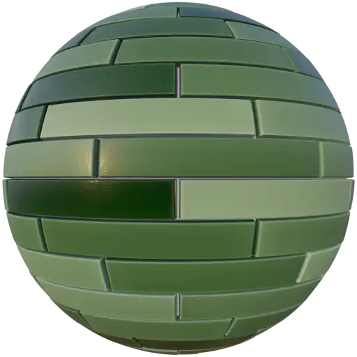

|

**This material is contained in the following Exapacks:**

    - XTRPbr_05k_Vol_001

    - XTRPbr_1k_Vol_001

    - XTRPbr_2k_Vol_002

    - XTRPbr_4k_Vol_002

    - XTRPbr_8k_Vol_005

------------------------------------------------------------------------------------------------------------------------

Subway Red Tiles 001
********************

|

**This material is contained in the following Exapacks:**

    - XTRPbr_05k_Vol_001

    - XTRPbr_1k_Vol_001

    - XTRPbr_2k_Vol_002

    - XTRPbr_4k_Vol_002

    - XTRPbr_8k_Vol_005

------------------------------------------------------------------------------------------------------------------------

Subway White Tiles 001
**********************

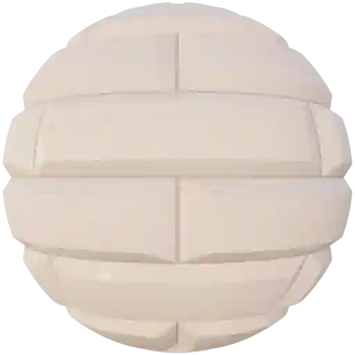

|

**This material is contained in the following Exapacks:**

    - XTRPbr_05k_Vol_001

    - XTRPbr_1k_Vol_001

    - XTRPbr_2k_Vol_002

    - XTRPbr_4k_Vol_002

------------------------------------------------------------------------------------------------------------------------

Subway White Tiles 002
**********************

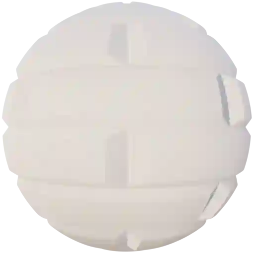

|

**This material is contained in the following Exapacks:**

    - XTRPbr_05k_Vol_001

    - XTRPbr_1k_Vol_001

    - XTRPbr_2k_Vol_002

    - XTRPbr_4k_Vol_002

------------------------------------------------------------------------------------------------------------------------

Subway Yellow Tiles 001
***********************

|

**This material is contained in the following Exapacks:**

    - XTRPbr_05k_Vol_001

    - XTRPbr_1k_Vol_001

    - XTRPbr_2k_Vol_002

    - XTRPbr_4k_Vol_002

    - XTRPbr_8k_Vol_005

------------------------------------------------------------------------------------------------------------------------

Tiles - Pattern Mix (Category)
------------------------------

Random Beige Tiles 001
**********************

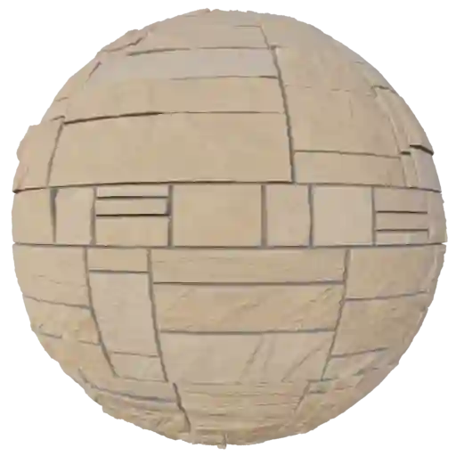

|

**This material is contained in the following Exapacks:**

    - XTRPbr_05k_Vol_001

    - XTRPbr_1k_Vol_001

    - XTRPbr_2k_Vol_002

    - XTRPbr_4k_Vol_002

    - XTRPbr_8k_Vol_005

------------------------------------------------------------------------------------------------------------------------

Random Beige Tiles 002
**********************

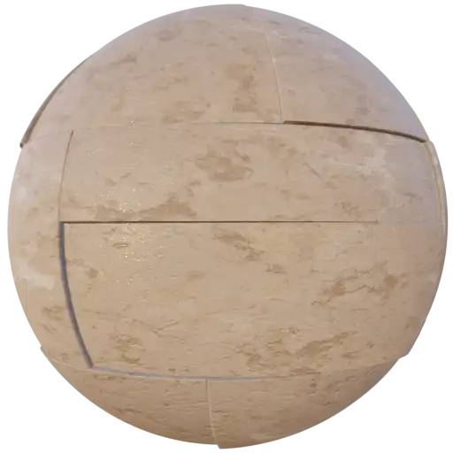

|

**This material is contained in the following Exapacks:**

    - XTRPbr_05k_Vol_001

    - XTRPbr_1k_Vol_001

    - XTRPbr_2k_Vol_002

    - XTRPbr_4k_Vol_002

    - XTRPbr_8k_Vol_005

------------------------------------------------------------------------------------------------------------------------

Random Beige Tiles 003
**********************

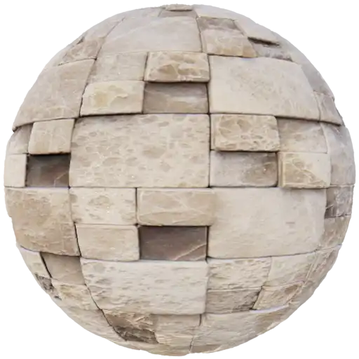

|

**This material is contained in the following Exapacks:**

    - XTRPbr_05k_Vol_001

    - XTRPbr_1k_Vol_001

    - XTRPbr_2k_Vol_002

    - XTRPbr_4k_Vol_002

------------------------------------------------------------------------------------------------------------------------

Random Black Tiles 001
**********************

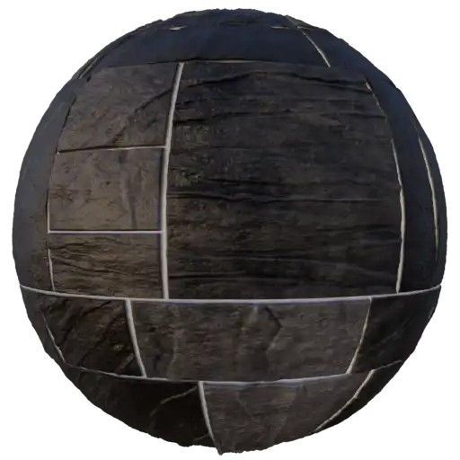

|

**This material is contained in the following Exapacks:**

    - XTRPbr_05k_Vol_001

    - XTRPbr_1k_Vol_001

    - XTRPbr_2k_Vol_002

    - XTRPbr_4k_Vol_002

    - XTRPbr_8k_Vol_005

------------------------------------------------------------------------------------------------------------------------

Random Blue Tiles 001
*********************

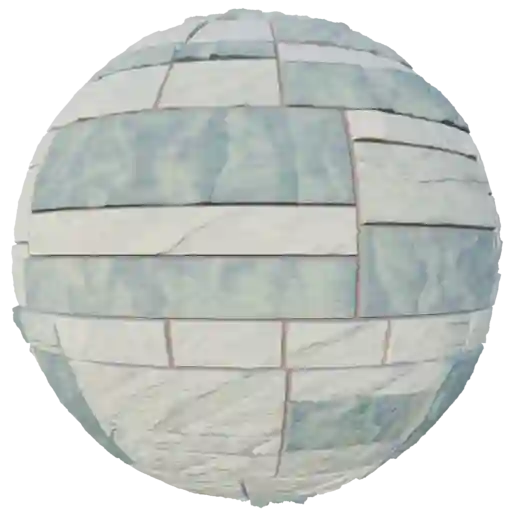

|

**This material is contained in the following Exapacks:**

    - XTRPbr_05k_Vol_001

    - XTRPbr_1k_Vol_001

    - XTRPbr_2k_Vol_002

    - XTRPbr_4k_Vol_002

    - XTRPbr_8k_Vol_005

------------------------------------------------------------------------------------------------------------------------

Random Blue Tiles 002
*********************

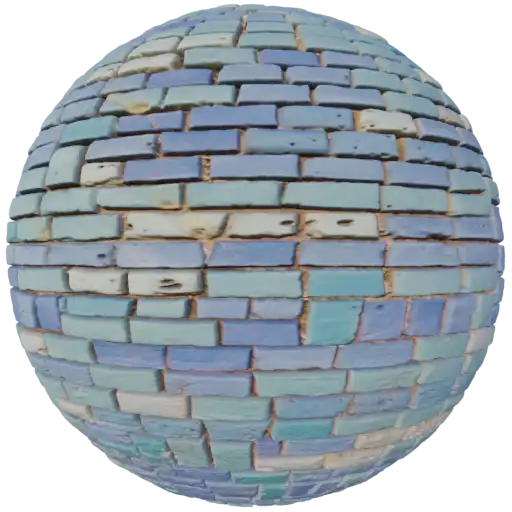

|

**This material is contained in the following Exapacks:**

    - XTRPbr_05k_Vol_001

    - XTRPbr_1k_Vol_001

    - XTRPbr_2k_Vol_002

    - XTRPbr_4k_Vol_002

------------------------------------------------------------------------------------------------------------------------

Random Brown Tiles 001
**********************

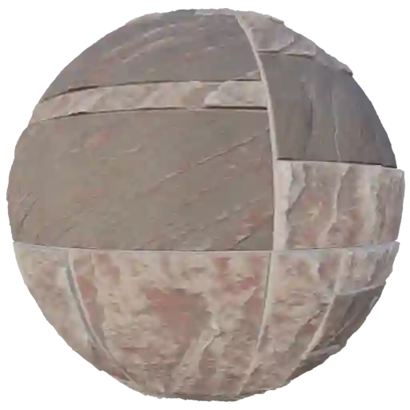

|

**This material is contained in the following Exapacks:**

    - XTRPbr_05k_Vol_001

    - XTRPbr_1k_Vol_001

    - XTRPbr_2k_Vol_002

    - XTRPbr_4k_Vol_002

    - XTRPbr_8k_Vol_005

------------------------------------------------------------------------------------------------------------------------

Random Green Tiles 001
**********************

.. image:: _static/_images/material_list/tiles_pattern_mix/random_green_tiles_001/random_green_tiles_001.webp
    :width: 30%
    :align: center
    :alt: Random Green Tiles 001

|

**This material is contained in the following Exapacks:**

    - XTRPbr_05k_Vol_001

    - XTRPbr_1k_Vol_001

    - XTRPbr_2k_Vol_002

    - XTRPbr_4k_Vol_002

    - XTRPbr_8k_Vol_005

------------------------------------------------------------------------------------------------------------------------

Random Grey Tiles 001
*********************

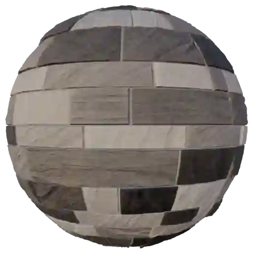

|

**This material is contained in the following Exapacks:**

    - XTRPbr_05k_Vol_001

    - XTRPbr_1k_Vol_001

    - XTRPbr_2k_Vol_002

    - XTRPbr_4k_Vol_002

    - XTRPbr_8k_Vol_005

------------------------------------------------------------------------------------------------------------------------

Random Red Tiles 001
********************

.. image:: _static/_images/material_list/tiles_pattern_mix/random_red_tiles_001/random_red_tiles_001.webp
    :width: 30%
    :align: center
    :alt: Random Red Tiles 001

|

**This material is contained in the following Exapacks:**

    - XTRPbr_05k_Vol_001

    - XTRPbr_1k_Vol_001

    - XTRPbr_2k_Vol_002

    - XTRPbr_4k_Vol_002

    - XTRPbr_8k_Vol_005

------------------------------------------------------------------------------------------------------------------------

Tiles - Various (Category)
--------------------------

Azure 3D Cube Tiles 01
**********************

.. image:: _static/_images/material_list/tiles_various/azure_3d_cube_tiles_01/azure_3d_cube_tiles_01.webp
    :width: 30%
    :align: center
    :alt: Azure 3D Cube Tiles 01

|

**This material is contained in the following Exapacks:**

    - XTRPbr_05k_Vol_001

    - XTRPbr_1k_Vol_001

    - XTRPbr_2k_Vol_002

    - XTRPbr_4k_Vol_002

------------------------------------------------------------------------------------------------------------------------

Azure 3D Cube Tiles 02
**********************

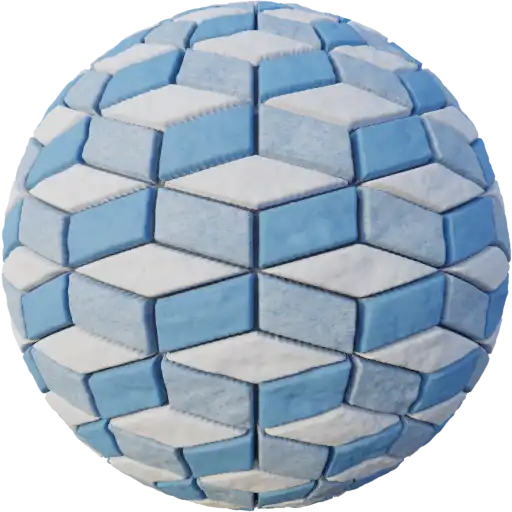

|

**This material is contained in the following Exapacks:**

    - XTRPbr_05k_Vol_001

    - XTRPbr_1k_Vol_001

    - XTRPbr_2k_Vol_002

    - XTRPbr_4k_Vol_002

------------------------------------------------------------------------------------------------------------------------

Azure Basketweave Tiles 01
**************************

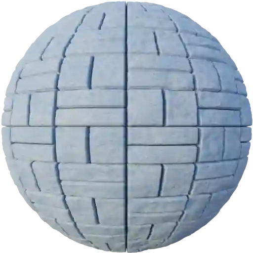

|

**This material is contained in the following Exapacks:**

    - XTRPbr_05k_Vol_001

    - XTRPbr_1k_Vol_001

    - XTRPbr_2k_Vol_002

    - XTRPbr_4k_Vol_002

------------------------------------------------------------------------------------------------------------------------

Azure Basketweave Tiles 02
**************************

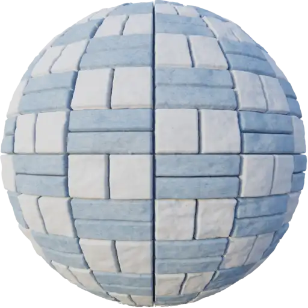

|

**This material is contained in the following Exapacks:**

    - XTRPbr_05k_Vol_001

    - XTRPbr_1k_Vol_001

    - XTRPbr_2k_Vol_002

    - XTRPbr_4k_Vol_002

------------------------------------------------------------------------------------------------------------------------

Azure Basketweave Tiles 03
**************************

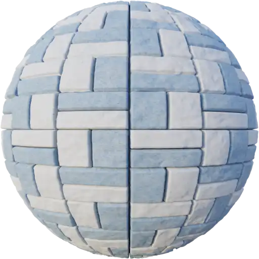

|

**This material is contained in the following Exapacks:**

    - XTRPbr_05k_Vol_001

    - XTRPbr_1k_Vol_001

    - XTRPbr_2k_Vol_002

    - XTRPbr_4k_Vol_002

------------------------------------------------------------------------------------------------------------------------

Azure Chevron Tiles 01
**********************

.. image:: _static/_images/material_list/tiles_various/azure_chevron_tiles_01/azure_chevron_tiles_01.webp
    :width: 30%
    :align: center
    :alt: Azure Chevron Tiles 01

|

**This material is contained in the following Exapacks:**

    - XTRPbr_05k_Vol_001

    - XTRPbr_1k_Vol_001

    - XTRPbr_2k_Vol_002

    - XTRPbr_4k_Vol_002

------------------------------------------------------------------------------------------------------------------------

Azure Square Tiles 01
*********************

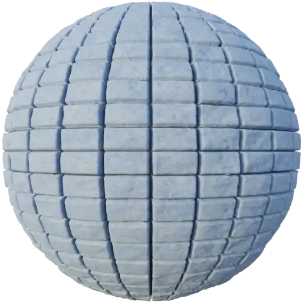

|

**This material is contained in the following Exapacks:**

    - XTRPbr_05k_Vol_001

    - XTRPbr_1k_Vol_001

    - XTRPbr_2k_Vol_002

    - XTRPbr_4k_Vol_002

------------------------------------------------------------------------------------------------------------------------

Azure Square Tiles 02
*********************

|

**This material is contained in the following Exapacks:**

    - XTRPbr_05k_Vol_001

    - XTRPbr_1k_Vol_001

    - XTRPbr_2k_Vol_002

    - XTRPbr_4k_Vol_002

------------------------------------------------------------------------------------------------------------------------

Azure Square Tiles 03
*********************

.. image:: _static/_images/material_list/tiles_various/azure_square_tiles_03/azure_square_tiles_03.webp
    :width: 30%
    :align: center
    :alt: Azure Square Tiles 03

|

**This material is contained in the following Exapacks:**

    - XTRPbr_05k_Vol_001

    - XTRPbr_1k_Vol_001

    - XTRPbr_2k_Vol_002

    - XTRPbr_4k_Vol_002

------------------------------------------------------------------------------------------------------------------------

Azure Square Tiles 04
*********************

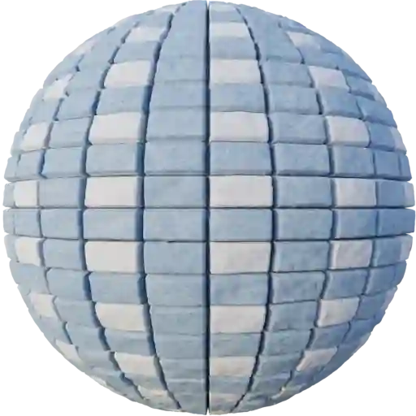

|

**This material is contained in the following Exapacks:**

    - XTRPbr_05k_Vol_001

    - XTRPbr_1k_Vol_001

    - XTRPbr_2k_Vol_002

    - XTRPbr_4k_Vol_002

------------------------------------------------------------------------------------------------------------------------

Azure Square Tiles 05
*********************

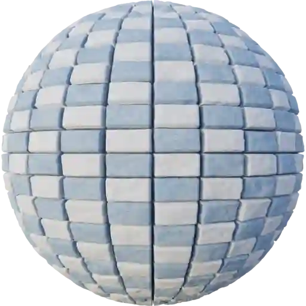

|

**This material is contained in the following Exapacks:**

    - XTRPbr_05k_Vol_001

    - XTRPbr_1k_Vol_001

    - XTRPbr_2k_Vol_002

    - XTRPbr_4k_Vol_002

------------------------------------------------------------------------------------------------------------------------

Azure Stepping Stone Tiles 01
*****************************

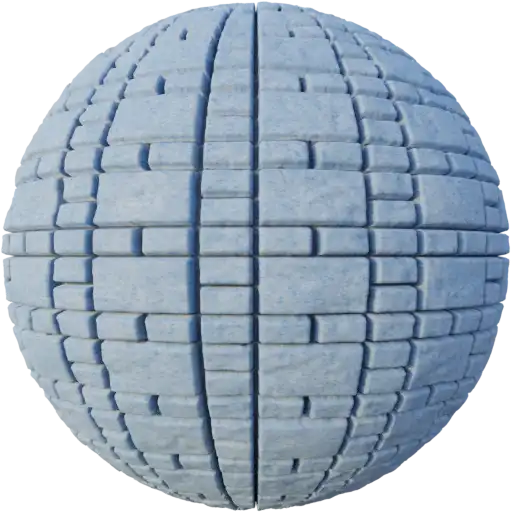

|

**This material is contained in the following Exapacks:**

    - XTRPbr_05k_Vol_001

    - XTRPbr_1k_Vol_001

    - XTRPbr_2k_Vol_002

    - XTRPbr_4k_Vol_002

------------------------------------------------------------------------------------------------------------------------

Azure Stepping Stone Tiles 02
*****************************

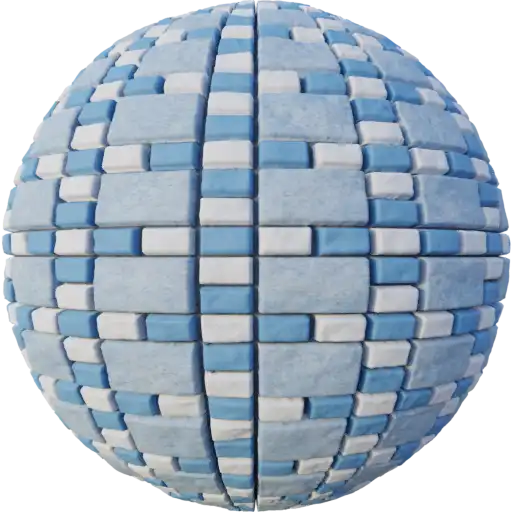

|

**This material is contained in the following Exapacks:**

    - XTRPbr_05k_Vol_001

    - XTRPbr_1k_Vol_001

    - XTRPbr_2k_Vol_002

    - XTRPbr_4k_Vol_002

------------------------------------------------------------------------------------------------------------------------

Azure Stepping Stone Tiles 03
*****************************

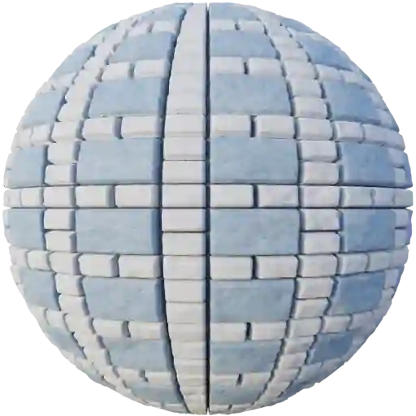

|

**This material is contained in the following Exapacks:**

    - XTRPbr_05k_Vol_001

    - XTRPbr_1k_Vol_001

    - XTRPbr_2k_Vol_002

    - XTRPbr_4k_Vol_002

------------------------------------------------------------------------------------------------------------------------

Azure Stepping Stone Tiles 04
*****************************

.. image:: _static/_images/material_list/tiles_various/azure_stepping_stone_tiles_04/azure_stepping_stone_tiles_04.webp
    :width: 30%
    :align: center
    :alt: Azure Stepping Stone Tiles 04

|

**This material is contained in the following Exapacks:**

    - XTRPbr_05k_Vol_001

    - XTRPbr_1k_Vol_001

    - XTRPbr_2k_Vol_002

    - XTRPbr_4k_Vol_002

------------------------------------------------------------------------------------------------------------------------

Azure Stepping Stone Tiles 05
*****************************

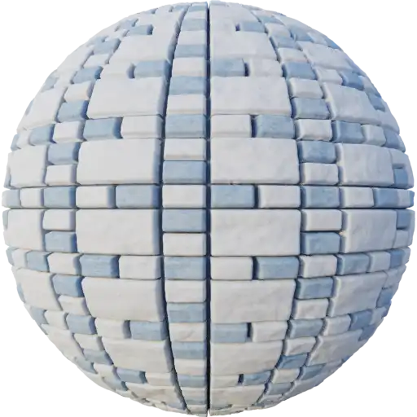

|

**This material is contained in the following Exapacks:**

    - XTRPbr_05k_Vol_001

    - XTRPbr_1k_Vol_001

    - XTRPbr_2k_Vol_002

    - XTRPbr_4k_Vol_002

------------------------------------------------------------------------------------------------------------------------

Azure Stepping Stone Tiles 06
*****************************

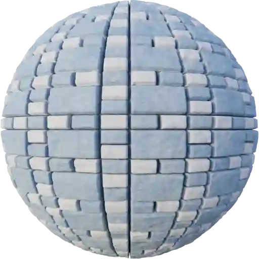

|

**This material is contained in the following Exapacks:**

    - XTRPbr_05k_Vol_001

    - XTRPbr_1k_Vol_001

    - XTRPbr_2k_Vol_002

    - XTRPbr_4k_Vol_002

------------------------------------------------------------------------------------------------------------------------

Azure Windmill Tiles 01
***********************

.. image:: _static/_images/material_list/tiles_various/azure_windmill_tiles_01/azure_windmill_tiles_01.webp
    :width: 30%
    :align: center
    :alt: Azure Windmill Tiles 01

|

**This material is contained in the following Exapacks:**

    - XTRPbr_05k_Vol_001

    - XTRPbr_1k_Vol_001

    - XTRPbr_2k_Vol_002

    - XTRPbr_4k_Vol_002

------------------------------------------------------------------------------------------------------------------------

Azure Windmill Tiles 02
***********************

|

**This material is contained in the following Exapacks:**

    - XTRPbr_05k_Vol_001

    - XTRPbr_1k_Vol_001

    - XTRPbr_2k_Vol_002

    - XTRPbr_4k_Vol_002

------------------------------------------------------------------------------------------------------------------------

Azure Windmill Tiles 03
***********************

.. image:: _static/_images/material_list/tiles_various/azure_windmill_tiles_03/azure_windmill_tiles_03.webp
    :width: 30%
    :align: center
    :alt: Azure Windmill Tiles 03

|

**This material is contained in the following Exapacks:**

    - XTRPbr_05k_Vol_001

    - XTRPbr_1k_Vol_001

    - XTRPbr_2k_Vol_002

    - XTRPbr_4k_Vol_002

------------------------------------------------------------------------------------------------------------------------

Azure Windmill Tiles 04
***********************

|

**This material is contained in the following Exapacks:**

    - XTRPbr_05k_Vol_001

    - XTRPbr_1k_Vol_001

    - XTRPbr_2k_Vol_002

    - XTRPbr_4k_Vol_002

------------------------------------------------------------------------------------------------------------------------

Azure Windmill Tiles 05
***********************

.. image:: _static/_images/material_list/tiles_various/azure_windmill_tiles_05/azure_windmill_tiles_05.webp
    :width: 30%
    :align: center
    :alt: Azure Windmill Tiles 05

|

**This material is contained in the following Exapacks:**

    - XTRPbr_05k_Vol_001

    - XTRPbr_1k_Vol_001

    - XTRPbr_2k_Vol_002

    - XTRPbr_4k_Vol_002

------------------------------------------------------------------------------------------------------------------------

Azure Windmill Tiles 06
***********************

|

**This material is contained in the following Exapacks:**

    - XTRPbr_05k_Vol_001

    - XTRPbr_1k_Vol_001

    - XTRPbr_2k_Vol_002

    - XTRPbr_4k_Vol_002

------------------------------------------------------------------------------------------------------------------------

Azure Windmill Tiles 07
***********************

|

**This material is contained in the following Exapacks:**

    - XTRPbr_05k_Vol_001

    - XTRPbr_1k_Vol_001

    - XTRPbr_2k_Vol_002

    - XTRPbr_4k_Vol_002

------------------------------------------------------------------------------------------------------------------------

Azure Windmill Tiles 08
***********************

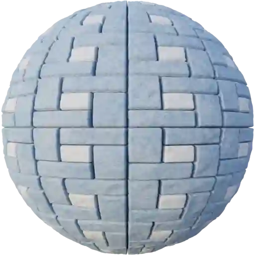

|

**This material is contained in the following Exapacks:**

    - XTRPbr_05k_Vol_001

    - XTRPbr_1k_Vol_001

    - XTRPbr_2k_Vol_002

    - XTRPbr_4k_Vol_002

------------------------------------------------------------------------------------------------------------------------

Azure Windmill Tiles 09
***********************

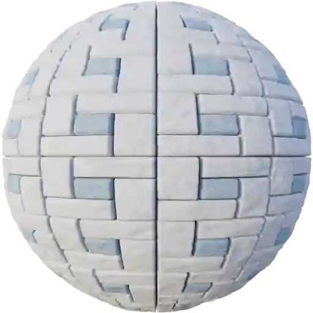

|

**This material is contained in the following Exapacks:**

    - XTRPbr_05k_Vol_001

    - XTRPbr_1k_Vol_001

    - XTRPbr_2k_Vol_002

    - XTRPbr_4k_Vol_002

------------------------------------------------------------------------------------------------------------------------

Black Tiles 01
**************

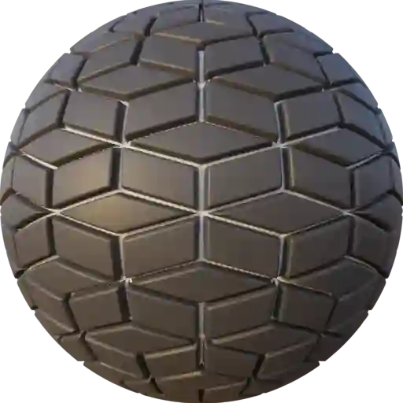

|

**This material is contained in the following Exapacks:**

    - XTRPbr_05k_Vol_001

    - XTRPbr_1k_Vol_001

    - XTRPbr_2k_Vol_002

    - XTRPbr_4k_Vol_002

------------------------------------------------------------------------------------------------------------------------

Black Tiles 02
**************

|

**This material is contained in the following Exapacks:**

    - XTRPbr_05k_Vol_001

    - XTRPbr_1k_Vol_001

    - XTRPbr_2k_Vol_002

    - XTRPbr_4k_Vol_002

------------------------------------------------------------------------------------------------------------------------

Black Tiles 03
**************

|

**This material is contained in the following Exapacks:**

    - XTRPbr_05k_Vol_001

    - XTRPbr_1k_Vol_001

    - XTRPbr_2k_Vol_002

    - XTRPbr_4k_Vol_002

------------------------------------------------------------------------------------------------------------------------

Black Tiles 04
**************

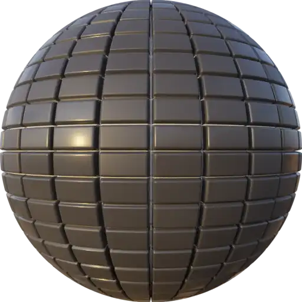

|

**This material is contained in the following Exapacks:**

    - XTRPbr_05k_Vol_001

    - XTRPbr_1k_Vol_001

    - XTRPbr_2k_Vol_002

    - XTRPbr_4k_Vol_002

------------------------------------------------------------------------------------------------------------------------

Black Tiles 05
**************

|

**This material is contained in the following Exapacks:**

    - XTRPbr_05k_Vol_001

    - XTRPbr_1k_Vol_001

    - XTRPbr_2k_Vol_002

    - XTRPbr_4k_Vol_002

------------------------------------------------------------------------------------------------------------------------

Black Tiles 06
**************

.. image:: _static/_images/material_list/tiles_various/black_tiles_06/black_tiles_06.webp
    :width: 30%
    :align: center
    :alt: Black Tiles 06

|

**This material is contained in the following Exapacks:**

    - XTRPbr_05k_Vol_001

    - XTRPbr_1k_Vol_001

    - XTRPbr_2k_Vol_002

    - XTRPbr_4k_Vol_002

------------------------------------------------------------------------------------------------------------------------

Dark Ocean Tiles 01
*******************

.. image:: _static/_images/material_list/tiles_various/dark_ocean_tiles_01/dark_ocean_tiles_01.webp
    :width: 30%
    :align: center
    :alt: Dark Ocean Tiles 01

|

**This material is contained in the following Exapacks:**

    - XTRPbr_05k_Vol_001

    - XTRPbr_1k_Vol_001

    - XTRPbr_2k_Vol_002

    - XTRPbr_4k_Vol_002

------------------------------------------------------------------------------------------------------------------------

Dark Ocean Tiles 02
*******************

|

**This material is contained in the following Exapacks:**

    - XTRPbr_05k_Vol_001

    - XTRPbr_1k_Vol_001

    - XTRPbr_2k_Vol_002

    - XTRPbr_4k_Vol_002

------------------------------------------------------------------------------------------------------------------------

Dark Ocean Tiles 03
*******************

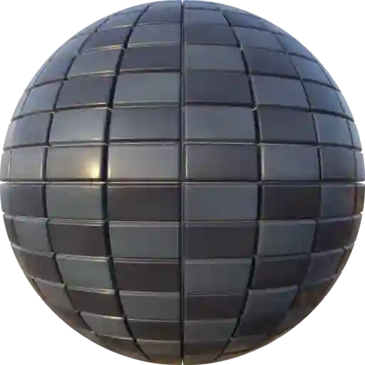

|

**This material is contained in the following Exapacks:**

    - XTRPbr_05k_Vol_001

    - XTRPbr_1k_Vol_001

    - XTRPbr_2k_Vol_002

    - XTRPbr_4k_Vol_002

------------------------------------------------------------------------------------------------------------------------

Dark Ocean Tiles 04
*******************

|

**This material is contained in the following Exapacks:**

    - XTRPbr_05k_Vol_001

    - XTRPbr_1k_Vol_001

    - XTRPbr_2k_Vol_002

    - XTRPbr_4k_Vol_002

------------------------------------------------------------------------------------------------------------------------

Dark Ocean Tiles 05
*******************

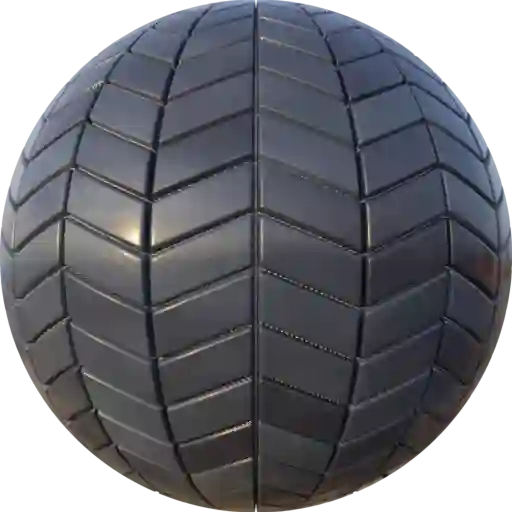

|

**This material is contained in the following Exapacks:**

    - XTRPbr_05k_Vol_001

    - XTRPbr_1k_Vol_001

    - XTRPbr_2k_Vol_002

    - XTRPbr_4k_Vol_002

------------------------------------------------------------------------------------------------------------------------

Dark Ocean Tiles 06
*******************

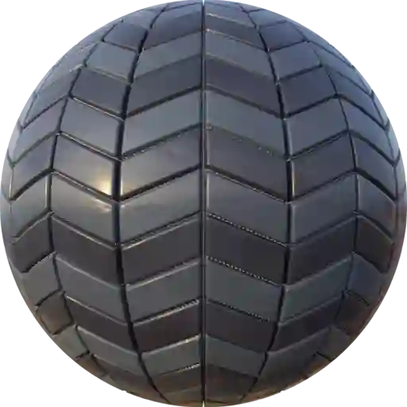

|

**This material is contained in the following Exapacks:**

    - XTRPbr_05k_Vol_001

    - XTRPbr_1k_Vol_001

    - XTRPbr_2k_Vol_002

    - XTRPbr_4k_Vol_002

------------------------------------------------------------------------------------------------------------------------

Dark Ocean Tiles 07
*******************

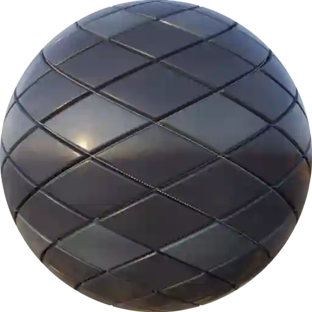

|

**This material is contained in the following Exapacks:**

    - XTRPbr_05k_Vol_001

    - XTRPbr_1k_Vol_001

    - XTRPbr_2k_Vol_002

    - XTRPbr_4k_Vol_002

------------------------------------------------------------------------------------------------------------------------

White Tiles 01
**************

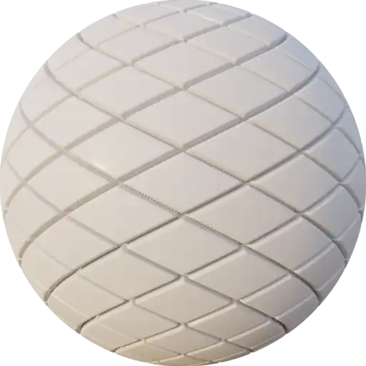

|

**This material is contained in the following Exapacks:**

    - XTRPbr_05k_Vol_001

    - XTRPbr_1k_Vol_001

    - XTRPbr_2k_Vol_002

    - XTRPbr_4k_Vol_002

------------------------------------------------------------------------------------------------------------------------

White Tiles 02
**************

|

**This material is contained in the following Exapacks:**

    - XTRPbr_05k_Vol_001

    - XTRPbr_1k_Vol_001

    - XTRPbr_2k_Vol_002

    - XTRPbr_4k_Vol_002

------------------------------------------------------------------------------------------------------------------------

White Tiles 03
**************

|

**This material is contained in the following Exapacks:**

    - XTRPbr_05k_Vol_001

    - XTRPbr_1k_Vol_001

    - XTRPbr_2k_Vol_002

    - XTRPbr_4k_Vol_002

------------------------------------------------------------------------------------------------------------------------

White Tiles 04
**************

|

**This material is contained in the following Exapacks:**

    - XTRPbr_05k_Vol_001

    - XTRPbr_1k_Vol_001

    - XTRPbr_2k_Vol_002

    - XTRPbr_4k_Vol_002

------------------------------------------------------------------------------------------------------------------------

White Tiles 05
**************

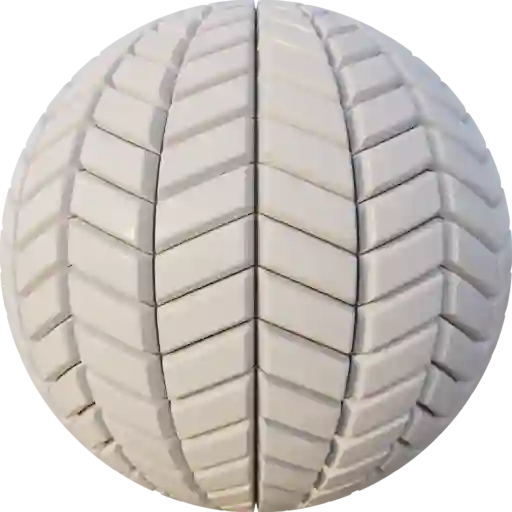

|

**This material is contained in the following Exapacks:**

    - XTRPbr_05k_Vol_001

    - XTRPbr_1k_Vol_001

    - XTRPbr_2k_Vol_002

    - XTRPbr_4k_Vol_002

------------------------------------------------------------------------------------------------------------------------

White Tiles 06
**************

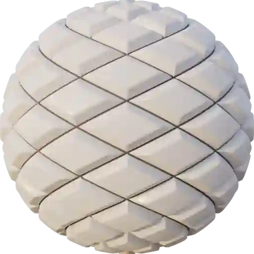

|

**This material is contained in the following Exapacks:**

    - XTRPbr_05k_Vol_001

    - XTRPbr_1k_Vol_001

    - XTRPbr_2k_Vol_002

    - XTRPbr_4k_Vol_002

------------------------------------------------------------------------------------------------------------------------

White Tiles 07
**************

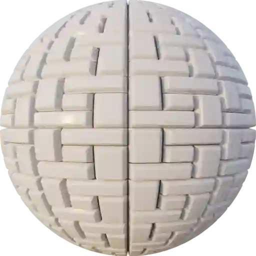

|

**This material is contained in the following Exapacks:**

    - XTRPbr_05k_Vol_001

    - XTRPbr_1k_Vol_001

    - XTRPbr_2k_Vol_002

    - XTRPbr_4k_Vol_002

------------------------------------------------------------------------------------------------------------------------

White Tiles 08
**************

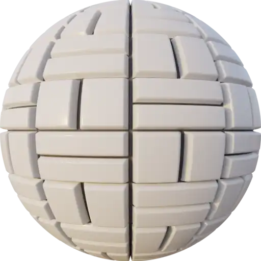

|

**This material is contained in the following Exapacks:**

    - XTRPbr_05k_Vol_001

    - XTRPbr_1k_Vol_001

    - XTRPbr_2k_Vol_002

    - XTRPbr_4k_Vol_002

------------------------------------------------------------------------------------------------------------------------

White Tiles 09
**************

|

**This material is contained in the following Exapacks:**

    - XTRPbr_05k_Vol_001

    - XTRPbr_1k_Vol_001

    - XTRPbr_2k_Vol_002

    - XTRPbr_4k_Vol_002

------------------------------------------------------------------------------------------------------------------------

Tools (Category)
----------------

Holdout
*******

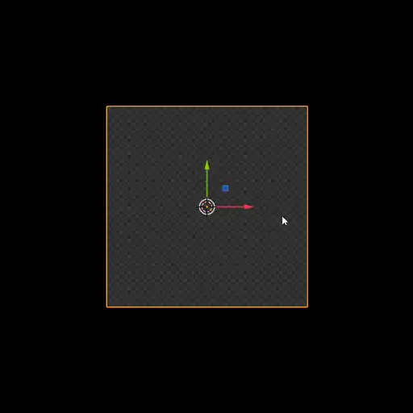

|

**This material is contained in the following Exapacks:**

    - XTRPbr_Procedural_Vol_001

------------------------------------------------------------------------------------------------------------------------

Transparent
***********

|

**This material is contained in the following Exapacks:**

    - XTRPbr_Procedural_Vol_001

------------------------------------------------------------------------------------------------------------------------

Walls - Stones (Category)
-------------------------

Cobblestone Wall 001
********************

.. image:: _static/_images/material_list/walls_stones/cobblestone_wall_001/cobblestone_wall_001.webp
    :width: 30%
    :align: center
    :alt: Cobblestone Wall 001

|

**This material is contained in the following Exapacks:**

    - XTRPbr_05k_Vol_001

    - XTRPbr_1k_Vol_001

    - XTRPbr_2k_Vol_002

------------------------------------------------------------------------------------------------------------------------

Cobblestone Wall 002
********************

.. image:: _static/_images/material_list/walls_stones/cobblestone_wall_002/cobblestone_wall_002.webp
    :width: 30%
    :align: center
    :alt: Cobblestone Wall 002

|

**This material is contained in the following Exapacks:**

    - XTRPbr_05k_Vol_001

    - XTRPbr_1k_Vol_001

    - XTRPbr_2k_Vol_002

------------------------------------------------------------------------------------------------------------------------

Cobblestone Wall 003
********************

.. image:: _static/_images/material_list/walls_stones/cobblestone_wall_003/cobblestone_wall_003.webp
    :width: 30%
    :align: center
    :alt: Cobblestone Wall 003

|

**This material is contained in the following Exapacks:**

    - XTRPbr_05k_Vol_001

    - XTRPbr_1k_Vol_001

    - XTRPbr_2k_Vol_002

------------------------------------------------------------------------------------------------------------------------

Cobblestone Wall 004
********************

.. image:: _static/_images/material_list/walls_stones/cobblestone_wall_004/cobblestone_wall_004.webp
    :width: 30%
    :align: center
    :alt: Cobblestone Wall 004

|

**This material is contained in the following Exapacks:**

    - XTRPbr_05k_Vol_001

    - XTRPbr_1k_Vol_001

    - XTRPbr_2k_Vol_002

    - XTRPbr_4k_Vol_002

    - XTRPbr_8k_Vol_005

------------------------------------------------------------------------------------------------------------------------

Defense Wall 01
***************

.. image:: _static/_images/material_list/walls_stones/defense_wall_01/defense_wall_01.webp
    :width: 30%
    :align: center
    :alt: Defense Wall 01

|

**This material is contained in the following Exapacks:**

    - XTRPbr_05k_Vol_001

    - XTRPbr_1k_Vol_001

    - XTRPbr_2k_Vol_002

    - XTRPbr_4k_Vol_002

    - XTRPbr_8k_Vol_005

------------------------------------------------------------------------------------------------------------------------

Dry Stone Wall 001
******************

.. image:: _static/_images/material_list/walls_stones/dry_stone_wall_001/dry_stone_wall_001.webp
    :width: 30%
    :align: center
    :alt: Dry Stone Wall 001

|

**This material is contained in the following Exapacks:**

    - XTRPbr_05k_Vol_001

    - XTRPbr_1k_Vol_001

    - XTRPbr_2k_Vol_002

    - XTRPbr_4k_Vol_002

------------------------------------------------------------------------------------------------------------------------

Flagstone Wall 001
******************

.. image:: _static/_images/material_list/walls_stones/flagstone_wall_001/flagstone_wall_001.webp
    :width: 30%
    :align: center
    :alt: Flagstone Wall 001

|

**This material is contained in the following Exapacks:**

    - XTRPbr_05k_Vol_001

    - XTRPbr_1k_Vol_001

    - XTRPbr_2k_Vol_002

    - XTRPbr_4k_Vol_002

------------------------------------------------------------------------------------------------------------------------

Medieval Blocks 001
*******************

.. image:: _static/_images/material_list/walls_stones/medieval_blocks_001/medieval_blocks_001.webp
    :width: 30%
    :align: center
    :alt: Medieval Blocks 001

|

**This material is contained in the following Exapacks:**

    - XTRPbr_05k_Vol_001

    - XTRPbr_1k_Vol_001

    - XTRPbr_2k_Vol_002

    - XTRPbr_4k_Vol_002

    - XTRPbr_8k_Vol_005

------------------------------------------------------------------------------------------------------------------------

Medieval Blocks 002
*******************

.. image:: _static/_images/material_list/walls_stones/medieval_blocks_002/medieval_blocks_002.webp
    :width: 30%
    :align: center
    :alt: Medieval Blocks 002

|

**This material is contained in the following Exapacks:**

    - XTRPbr_05k_Vol_001

    - XTRPbr_1k_Vol_001

    - XTRPbr_2k_Vol_002

    - XTRPbr_4k_Vol_002

    - XTRPbr_8k_Vol_005

------------------------------------------------------------------------------------------------------------------------

Medieval Blocks 003
*******************

.. image:: _static/_images/material_list/walls_stones/medieval_blocks_003/medieval_blocks_003.webp
    :width: 30%
    :align: center
    :alt: Medieval Blocks 003

|

**This material is contained in the following Exapacks:**

    - XTRPbr_05k_Vol_001

    - XTRPbr_1k_Vol_001

    - XTRPbr_2k_Vol_002

    - XTRPbr_4k_Vol_002

    - XTRPbr_8k_Vol_005

------------------------------------------------------------------------------------------------------------------------

Medieval Blocks 004
*******************

.. image:: _static/_images/material_list/walls_stones/medieval_blocks_004/medieval_blocks_004.webp
    :width: 30%
    :align: center
    :alt: Medieval Blocks 004

|

**This material is contained in the following Exapacks:**

    - XTRPbr_05k_Vol_001

    - XTRPbr_1k_Vol_001

    - XTRPbr_2k_Vol_002

    - XTRPbr_4k_Vol_002

    - XTRPbr_8k_Vol_005

------------------------------------------------------------------------------------------------------------------------

Medieval Wall 001
*****************

.. image:: _static/_images/material_list/walls_stones/medieval_wall_001/medieval_wall_001.webp
    :width: 30%
    :align: center
    :alt: Medieval Wall 001

|

**This material is contained in the following Exapacks:**

    - XTRPbr_05k_Vol_001

    - XTRPbr_1k_Vol_001

    - XTRPbr_2k_Vol_002

    - XTRPbr_4k_Vol_002

    - XTRPbr_8k_Vol_005

------------------------------------------------------------------------------------------------------------------------

Sandstone Blocks 001
********************

.. image:: _static/_images/material_list/walls_stones/sandstone_blocks_001/sandstone_blocks_001.webp
    :width: 30%
    :align: center
    :alt: Sandstone Blocks 001

|

**This material is contained in the following Exapacks:**

    - XTRPbr_05k_Vol_001

    - XTRPbr_1k_Vol_001

    - XTRPbr_2k_Vol_002

    - XTRPbr_4k_Vol_002

    - XTRPbr_8k_Vol_005

------------------------------------------------------------------------------------------------------------------------

Sandstone Blocks 002
********************

.. image:: _static/_images/material_list/walls_stones/sandstone_blocks_002/sandstone_blocks_002.webp
    :width: 30%
    :align: center
    :alt: Sandstone Blocks 002

|

**This material is contained in the following Exapacks:**

    - XTRPbr_05k_Vol_001

    - XTRPbr_1k_Vol_001

    - XTRPbr_2k_Vol_002

    - XTRPbr_4k_Vol_002

    - XTRPbr_8k_Vol_005

------------------------------------------------------------------------------------------------------------------------

Sandstone Blocks 003
********************

.. image:: _static/_images/material_list/walls_stones/sandstone_blocks_003/sandstone_blocks_003.webp
    :width: 30%
    :align: center
    :alt: Sandstone Blocks 003

|

**This material is contained in the following Exapacks:**

    - XTRPbr_05k_Vol_001

    - XTRPbr_1k_Vol_001

    - XTRPbr_2k_Vol_002

    - XTRPbr_4k_Vol_002

    - XTRPbr_8k_Vol_005

------------------------------------------------------------------------------------------------------------------------

Sandstone Blocks 004
********************

.. image:: _static/_images/material_list/walls_stones/sandstone_blocks_004/sandstone_blocks_004.webp
    :width: 30%
    :align: center
    :alt: Sandstone Blocks 004

|

**This material is contained in the following Exapacks:**

    - XTRPbr_05k_Vol_001

    - XTRPbr_1k_Vol_001

    - XTRPbr_2k_Vol_002

    - XTRPbr_4k_Vol_002

    - XTRPbr_8k_Vol_005

------------------------------------------------------------------------------------------------------------------------

Sandstone Blocks 005
********************

.. image:: _static/_images/material_list/walls_stones/sandstone_blocks_005/sandstone_blocks_005.webp
    :width: 30%
    :align: center
    :alt: Sandstone Blocks 005

|

**This material is contained in the following Exapacks:**

    - XTRPbr_05k_Vol_001

    - XTRPbr_1k_Vol_001

    - XTRPbr_2k_Vol_002

    - XTRPbr_4k_Vol_002

------------------------------------------------------------------------------------------------------------------------

Sandstone Blocks 006
********************

.. image:: _static/_images/material_list/walls_stones/sandstone_blocks_006/sandstone_blocks_006.webp
    :width: 30%
    :align: center
    :alt: Sandstone Blocks 006

|

**This material is contained in the following Exapacks:**

    - XTRPbr_05k_Vol_001

    - XTRPbr_1k_Vol_001

    - XTRPbr_2k_Vol_002

    - XTRPbr_4k_Vol_002

    - XTRPbr_8k_Vol_005

------------------------------------------------------------------------------------------------------------------------

Sandstone Blocks 007
********************

.. image:: _static/_images/material_list/walls_stones/sandstone_blocks_007/sandstone_blocks_007.webp
    :width: 30%
    :align: center
    :alt: Sandstone Blocks 007

|

**This material is contained in the following Exapacks:**

    - XTRPbr_05k_Vol_001

    - XTRPbr_1k_Vol_001

    - XTRPbr_2k_Vol_002

    - XTRPbr_4k_Vol_002

    - XTRPbr_8k_Vol_005

------------------------------------------------------------------------------------------------------------------------

Sandstone Blocks 008
********************

.. image:: _static/_images/material_list/walls_stones/sandstone_blocks_008/sandstone_blocks_008.webp
    :width: 30%
    :align: center
    :alt: Sandstone Blocks 008

|

**This material is contained in the following Exapacks:**

    - XTRPbr_05k_Vol_001

    - XTRPbr_1k_Vol_001

    - XTRPbr_2k_Vol_002

    - XTRPbr_4k_Vol_002

    - XTRPbr_8k_Vol_005

------------------------------------------------------------------------------------------------------------------------

Wall Stone 001
**************

.. image:: _static/_images/material_list/walls_stones/wall_stone_001/wall_stone_001.webp
    :width: 30%
    :align: center
    :alt: Wall Stone 001

|

**This material is contained in the following Exapacks:**

    - XTRPbr_05k_Vol_001

    - XTRPbr_1k_Vol_001

    - XTRPbr_2k_Vol_002

    - XTRPbr_4k_Vol_002

------------------------------------------------------------------------------------------------------------------------

Wall Stone 002
**************

.. image:: _static/_images/material_list/walls_stones/wall_stone_002/wall_stone_002.webp
    :width: 30%
    :align: center
    :alt: Wall Stone 002

|

**This material is contained in the following Exapacks:**

    - XTRPbr_05k_Vol_001

    - XTRPbr_1k_Vol_001

    - XTRPbr_2k_Vol_002

    - XTRPbr_4k_Vol_002

------------------------------------------------------------------------------------------------------------------------

Wall Stone 003
**************

.. image:: _static/_images/material_list/walls_stones/wall_stone_003/wall_stone_003.webp
    :width: 30%
    :align: center
    :alt: Wall Stone 003

|

**This material is contained in the following Exapacks:**

    - XTRPbr_05k_Vol_001

    - XTRPbr_1k_Vol_001

    - XTRPbr_2k_Vol_002

------------------------------------------------------------------------------------------------------------------------

Wall Stone 004
**************

.. image:: _static/_images/material_list/walls_stones/wall_stone_004/wall_stone_004.webp
    :width: 30%
    :align: center
    :alt: Wall Stone 004

|

**This material is contained in the following Exapacks:**

    - XTRPbr_05k_Vol_001

    - XTRPbr_1k_Vol_001

    - XTRPbr_2k_Vol_002

    - XTRPbr_4k_Vol_002

    - XTRPbr_8k_Vol_005

------------------------------------------------------------------------------------------------------------------------

Wall Stone 005
**************

.. image:: _static/_images/material_list/walls_stones/wall_stone_005/wall_stone_005.webp
    :width: 30%
    :align: center
    :alt: Wall Stone 005

|

**This material is contained in the following Exapacks:**

    - XTRPbr_05k_Vol_001

    - XTRPbr_1k_Vol_001

    - XTRPbr_2k_Vol_002

    - XTRPbr_4k_Vol_002

    - XTRPbr_8k_Vol_005

------------------------------------------------------------------------------------------------------------------------

Wall Stone 006
**************

.. image:: _static/_images/material_list/walls_stones/wall_stone_006/wall_stone_006.webp
    :width: 30%
    :align: center
    :alt: Wall Stone 006

|

**This material is contained in the following Exapacks:**

    - XTRPbr_05k_Vol_001

    - XTRPbr_1k_Vol_001

    - XTRPbr_2k_Vol_002

    - XTRPbr_4k_Vol_002

    - XTRPbr_8k_Vol_005

------------------------------------------------------------------------------------------------------------------------

Wall Stone 007
**************

.. image:: _static/_images/material_list/walls_stones/wall_stone_007/wall_stone_007.webp
    :width: 30%
    :align: center
    :alt: Wall Stone 007

|

**This material is contained in the following Exapacks:**

    - XTRPbr_05k_Vol_001

    - XTRPbr_1k_Vol_001

    - XTRPbr_2k_Vol_002

------------------------------------------------------------------------------------------------------------------------

Wall Stone 008
**************

.. image:: _static/_images/material_list/walls_stones/wall_stone_008/wall_stone_008.webp
    :width: 30%
    :align: center
    :alt: Wall Stone 008

|

**This material is contained in the following Exapacks:**

    - XTRPbr_05k_Vol_001

    - XTRPbr_1k_Vol_001

    - XTRPbr_2k_Vol_002

------------------------------------------------------------------------------------------------------------------------

Wall Stone 009
**************

.. image:: _static/_images/material_list/walls_stones/wall_stone_009/wall_stone_009.webp
    :width: 30%
    :align: center
    :alt: Wall Stone 009

|

**This material is contained in the following Exapacks:**

    - XTRPbr_05k_Vol_001

    - XTRPbr_1k_Vol_001

    - XTRPbr_2k_Vol_002

------------------------------------------------------------------------------------------------------------------------

Wall Stone 010
**************

.. image:: _static/_images/material_list/walls_stones/wall_stone_010/wall_stone_010.webp
    :width: 30%
    :align: center
    :alt: Wall Stone 010

|

**This material is contained in the following Exapacks:**

    - XTRPbr_05k_Vol_001

    - XTRPbr_1k_Vol_001

    - XTRPbr_2k_Vol_002

    - XTRPbr_4k_Vol_002

------------------------------------------------------------------------------------------------------------------------

Wall Stone 011
**************

.. image:: _static/_images/material_list/walls_stones/wall_stone_011/wall_stone_011.webp
    :width: 30%
    :align: center
    :alt: Wall Stone 011

|

**This material is contained in the following Exapacks:**

    - XTRPbr_05k_Vol_001

    - XTRPbr_1k_Vol_001

    - XTRPbr_2k_Vol_002

    - XTRPbr_4k_Vol_002

    - XTRPbr_8k_Vol_005

------------------------------------------------------------------------------------------------------------------------

Wood - Bark (Category)
----------------------

Bark 001
********

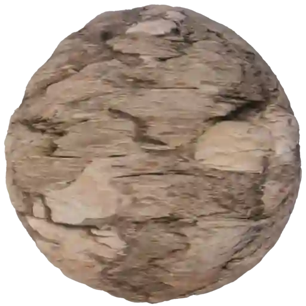

|

**This material is contained in the following Exapacks:**

    - XTRPbr_05k_Vol_001

    - XTRPbr_1k_Vol_001

    - XTRPbr_2k_Vol_002

    - XTRPbr_4k_Vol_002

------------------------------------------------------------------------------------------------------------------------

Bark 002
********

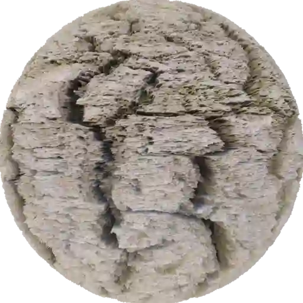

|

**This material is contained in the following Exapacks:**

    - XTRPbr_05k_Vol_001

    - XTRPbr_1k_Vol_001

    - XTRPbr_2k_Vol_002

    - XTRPbr_4k_Vol_002

------------------------------------------------------------------------------------------------------------------------

Bark 003
********

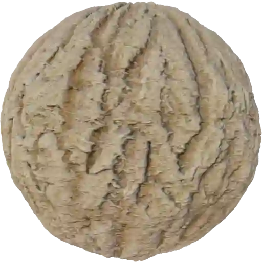

|

**This material is contained in the following Exapacks:**

    - XTRPbr_05k_Vol_001

    - XTRPbr_1k_Vol_001

    - XTRPbr_2k_Vol_002

    - XTRPbr_4k_Vol_002

    - XTRPbr_8k_Vol_005

------------------------------------------------------------------------------------------------------------------------

Bark 004
********

.. image:: _static/_images/material_list/wood_bark/bark_004/bark_004.webp
    :width: 30%
    :align: center
    :alt: Bark 004

|

**This material is contained in the following Exapacks:**

    - XTRPbr_05k_Vol_001

    - XTRPbr_1k_Vol_001

    - XTRPbr_2k_Vol_002

    - XTRPbr_4k_Vol_002

    - XTRPbr_8k_Vol_005

------------------------------------------------------------------------------------------------------------------------

Bark 005
********

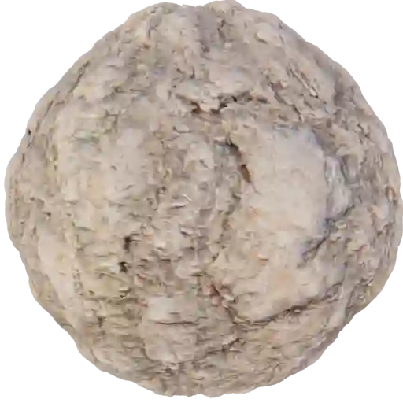

|

**This material is contained in the following Exapacks:**

    - XTRPbr_05k_Vol_001

    - XTRPbr_1k_Vol_001

    - XTRPbr_2k_Vol_002

    - XTRPbr_4k_Vol_002

    - XTRPbr_8k_Vol_005

------------------------------------------------------------------------------------------------------------------------

Bark 006
********

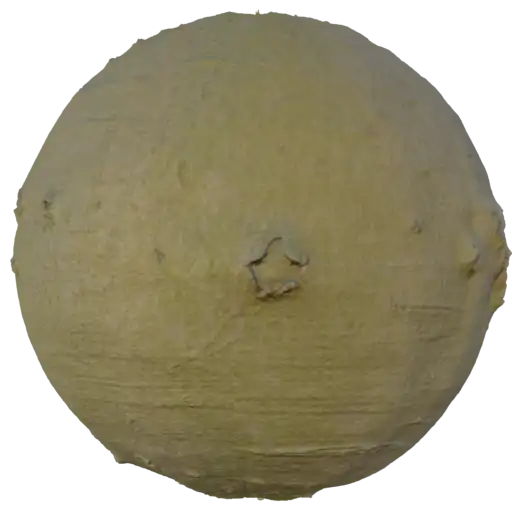

|

**This material is contained in the following Exapacks:**

    - XTRPbr_05k_Vol_001

    - XTRPbr_1k_Vol_001

    - XTRPbr_2k_Vol_002

    - XTRPbr_4k_Vol_002

    - XTRPbr_8k_Vol_005

------------------------------------------------------------------------------------------------------------------------

Bark 007
********

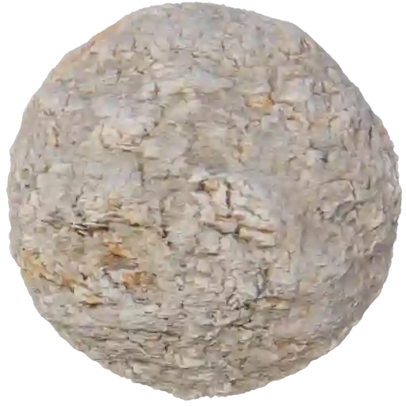

|

**This material is contained in the following Exapacks:**

    - XTRPbr_05k_Vol_001

    - XTRPbr_1k_Vol_001

    - XTRPbr_2k_Vol_002

    - XTRPbr_4k_Vol_002

    - XTRPbr_8k_Vol_005

------------------------------------------------------------------------------------------------------------------------

Bark 008
********

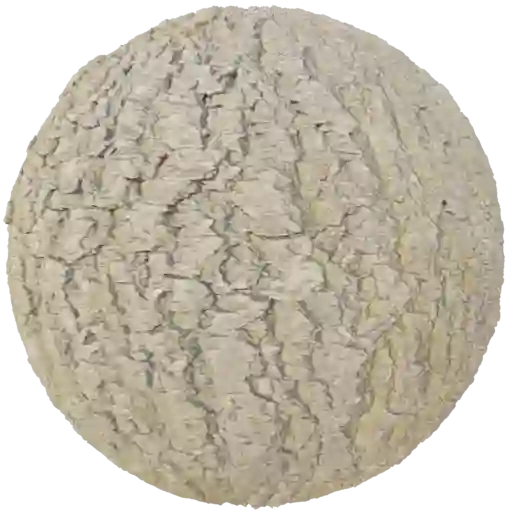

|

**This material is contained in the following Exapacks:**

    - XTRPbr_05k_Vol_001

    - XTRPbr_1k_Vol_001

    - XTRPbr_2k_Vol_002

    - XTRPbr_4k_Vol_002

    - XTRPbr_8k_Vol_019

------------------------------------------------------------------------------------------------------------------------

Bark 009
********

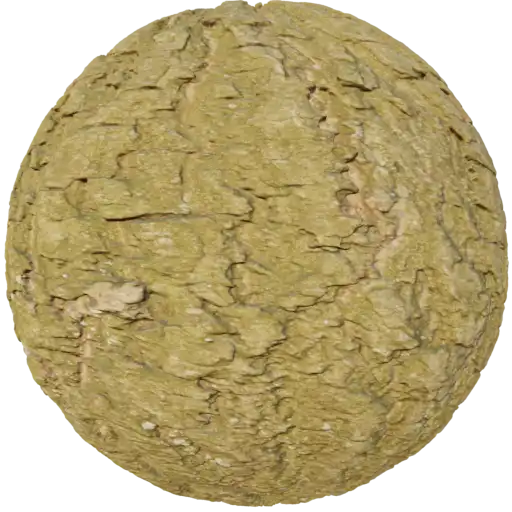

|

**This material is contained in the following Exapacks:**

    - XTRPbr_05k_Vol_001

    - XTRPbr_1k_Vol_001

    - XTRPbr_2k_Vol_002

    - XTRPbr_4k_Vol_002

    - XTRPbr_8k_Vol_019

------------------------------------------------------------------------------------------------------------------------

Bark 010
********

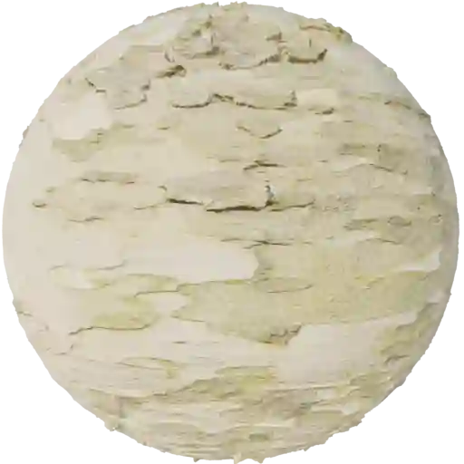

|

**This material is contained in the following Exapacks:**

    - XTRPbr_05k_Vol_001

    - XTRPbr_1k_Vol_001

    - XTRPbr_2k_Vol_002

    - XTRPbr_4k_Vol_002

    - XTRPbr_8k_Vol_019

------------------------------------------------------------------------------------------------------------------------

Bark 011
********

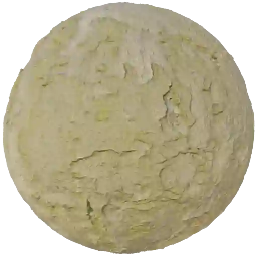

|

**This material is contained in the following Exapacks:**

    - XTRPbr_05k_Vol_001

    - XTRPbr_1k_Vol_001

    - XTRPbr_2k_Vol_002

    - XTRPbr_4k_Vol_002

    - XTRPbr_8k_Vol_019

------------------------------------------------------------------------------------------------------------------------

Bark 012
********

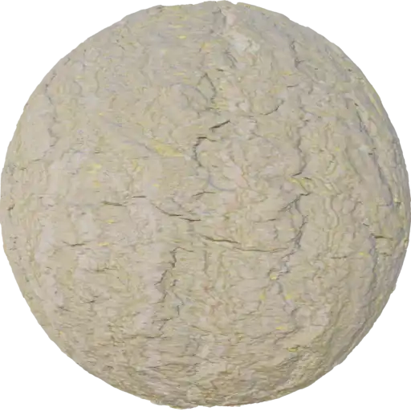

|

**This material is contained in the following Exapacks:**

    - XTRPbr_05k_Vol_001

    - XTRPbr_1k_Vol_001

    - XTRPbr_2k_Vol_002

    - XTRPbr_4k_Vol_002

    - XTRPbr_8k_Vol_019

------------------------------------------------------------------------------------------------------------------------

Bark 013
********

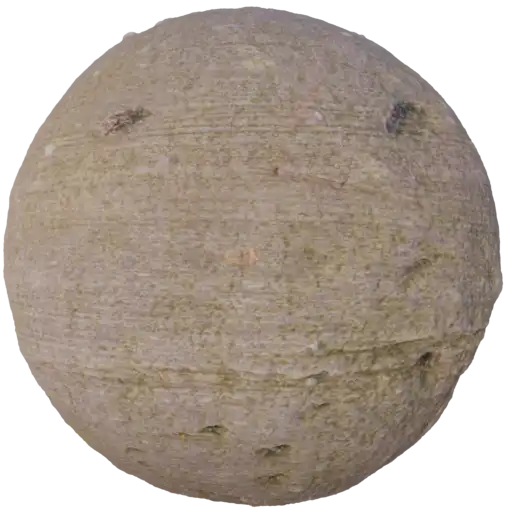

|

**This material is contained in the following Exapacks:**

    - XTRPbr_05k_Vol_001

    - XTRPbr_1k_Vol_001

    - XTRPbr_2k_Vol_002

    - XTRPbr_4k_Vol_002

------------------------------------------------------------------------------------------------------------------------

Bark 014
********

.. image:: _static/_images/material_list/wood_bark/bark_014/bark_014.webp
    :width: 30%
    :align: center
    :alt: Bark 014

|

**This material is contained in the following Exapacks:**

    - XTRPbr_05k_Vol_001

    - XTRPbr_1k_Vol_001

    - XTRPbr_2k_Vol_002

    - XTRPbr_4k_Vol_002

------------------------------------------------------------------------------------------------------------------------

Bark 015
********

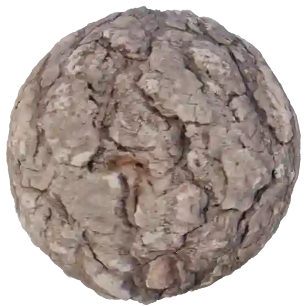

|

**This material is contained in the following Exapacks:**

    - XTRPbr_05k_Vol_001

    - XTRPbr_1k_Vol_001

    - XTRPbr_2k_Vol_002

------------------------------------------------------------------------------------------------------------------------

Bark 016
********

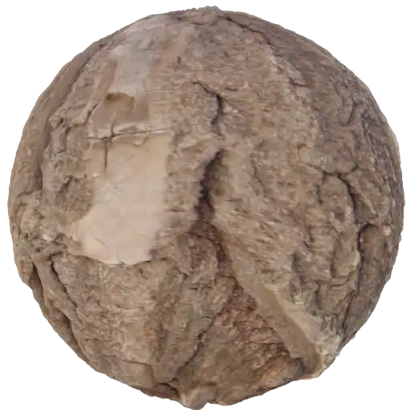

|

**This material is contained in the following Exapacks:**

    - XTRPbr_05k_Vol_001

    - XTRPbr_1k_Vol_001

    - XTRPbr_2k_Vol_002

    - XTRPbr_4k_Vol_002

------------------------------------------------------------------------------------------------------------------------

Bark 017
********

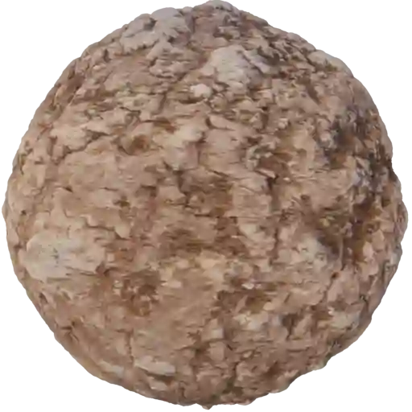

|

**This material is contained in the following Exapacks:**

    - XTRPbr_05k_Vol_001

    - XTRPbr_1k_Vol_001

    - XTRPbr_2k_Vol_002

------------------------------------------------------------------------------------------------------------------------

Bark 018
********

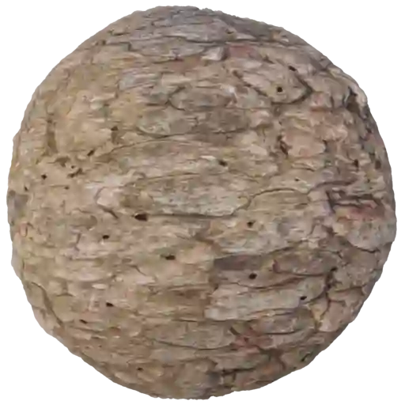

|

**This material is contained in the following Exapacks:**

    - XTRPbr_05k_Vol_001

    - XTRPbr_1k_Vol_001

    - XTRPbr_2k_Vol_002

------------------------------------------------------------------------------------------------------------------------

Bark 019
********

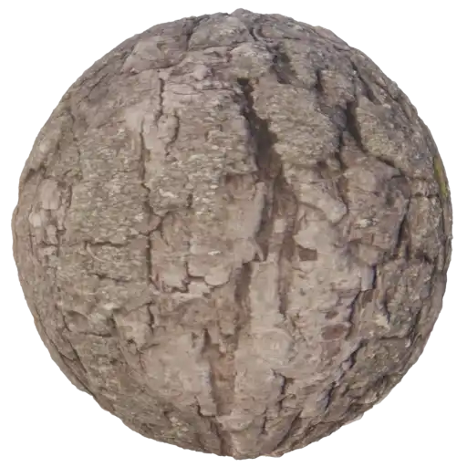

|

**This material is contained in the following Exapacks:**

    - XTRPbr_05k_Vol_001

    - XTRPbr_1k_Vol_001

    - XTRPbr_2k_Vol_002

------------------------------------------------------------------------------------------------------------------------

Bark 020
********

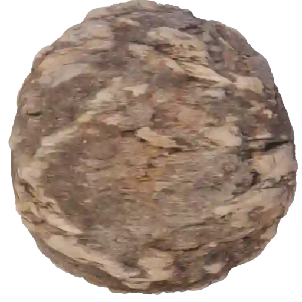

|

**This material is contained in the following Exapacks:**

    - XTRPbr_05k_Vol_001

    - XTRPbr_1k_Vol_001

    - XTRPbr_2k_Vol_002

    - XTRPbr_4k_Vol_002

------------------------------------------------------------------------------------------------------------------------

Bark 021
********

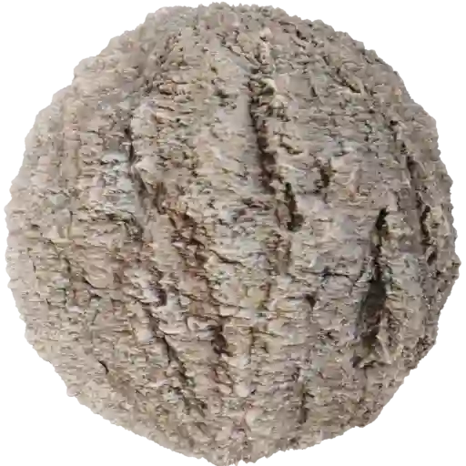

|

**This material is contained in the following Exapacks:**

    - XTRPbr_05k_Vol_001

    - XTRPbr_1k_Vol_001

    - XTRPbr_2k_Vol_002

    - XTRPbr_4k_Vol_002

------------------------------------------------------------------------------------------------------------------------

Bark 022
********

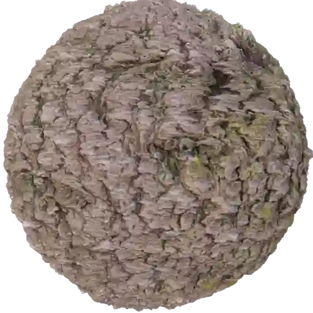

|

**This material is contained in the following Exapacks:**

    - XTRPbr_05k_Vol_001

    - XTRPbr_1k_Vol_001

    - XTRPbr_2k_Vol_002

    - XTRPbr_4k_Vol_002

------------------------------------------------------------------------------------------------------------------------

Bark 023
********

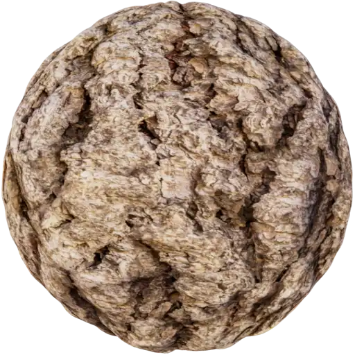

|

**This material is contained in the following Exapacks:**

    - XTRPbr_05k_Vol_001

    - XTRPbr_1k_Vol_001

    - XTRPbr_2k_Vol_002

    - XTRPbr_4k_Vol_002

------------------------------------------------------------------------------------------------------------------------

Bark 024
********

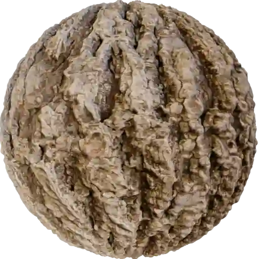

|

**This material is contained in the following Exapacks:**

    - XTRPbr_05k_Vol_001

    - XTRPbr_1k_Vol_001

    - XTRPbr_2k_Vol_002

    - XTRPbr_4k_Vol_002

------------------------------------------------------------------------------------------------------------------------

Bark 025
********

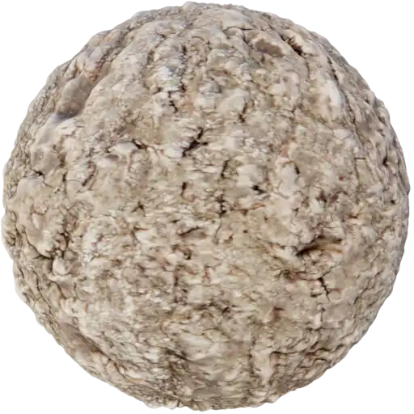

|

**This material is contained in the following Exapacks:**

    - XTRPbr_05k_Vol_001

    - XTRPbr_1k_Vol_001

    - XTRPbr_2k_Vol_002

    - XTRPbr_4k_Vol_002

------------------------------------------------------------------------------------------------------------------------

Bark 026
********

.. image:: _static/_images/material_list/wood_bark/bark_026/bark_026.webp
    :width: 30%
    :align: center
    :alt: Bark 026

|

**This material is contained in the following Exapacks:**

    - XTRPbr_05k_Vol_001

    - XTRPbr_1k_Vol_001

    - XTRPbr_2k_Vol_002

    - XTRPbr_4k_Vol_002

------------------------------------------------------------------------------------------------------------------------

Bark 027
********

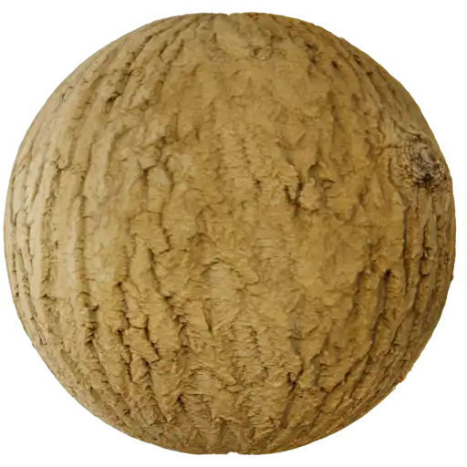

|

**This material is contained in the following Exapacks:**

    - XTRPbr_05k_Vol_001

    - XTRPbr_1k_Vol_001

    - XTRPbr_2k_Vol_002

    - XTRPbr_4k_Vol_002

    - XTRPbr_8k_Vol_019

------------------------------------------------------------------------------------------------------------------------

Bark 028
********

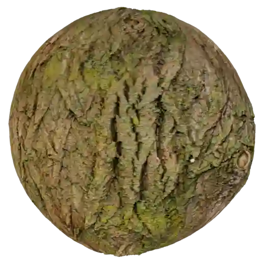

|

**This material is contained in the following Exapacks:**

    - XTRPbr_05k_Vol_001

    - XTRPbr_1k_Vol_001

    - XTRPbr_2k_Vol_002

    - XTRPbr_2k_Vol_004

    - XTRPbr_4k_Vol_002

    - XTRPbr_8k_Vol_019

------------------------------------------------------------------------------------------------------------------------

Bark 029
********

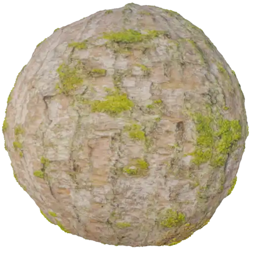

|

**This material is contained in the following Exapacks:**

    - XTRPbr_05k_Vol_001

    - XTRPbr_1k_Vol_001

    - XTRPbr_2k_Vol_004

    - XTRPbr_4k_Vol_002

------------------------------------------------------------------------------------------------------------------------

Bark 030
********

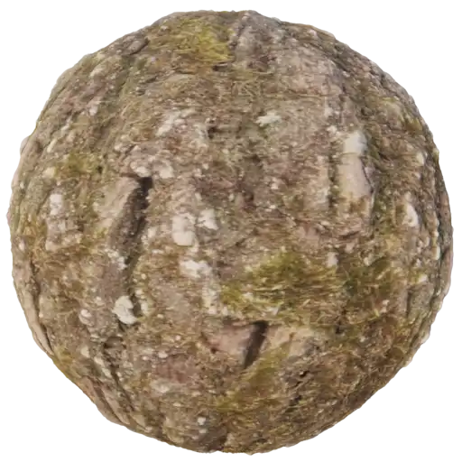

|

**This material is contained in the following Exapacks:**

    - XTRPbr_05k_Vol_001

    - XTRPbr_1k_Vol_001

    - XTRPbr_2k_Vol_004

    - XTRPbr_4k_Vol_002

------------------------------------------------------------------------------------------------------------------------

Bark 031
********

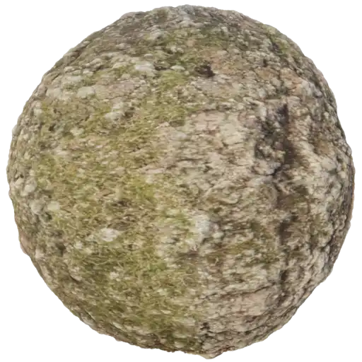

|

**This material is contained in the following Exapacks:**

    - XTRPbr_05k_Vol_001

    - XTRPbr_1k_Vol_001

    - XTRPbr_2k_Vol_004

    - XTRPbr_4k_Vol_002

------------------------------------------------------------------------------------------------------------------------

Bark 032
********

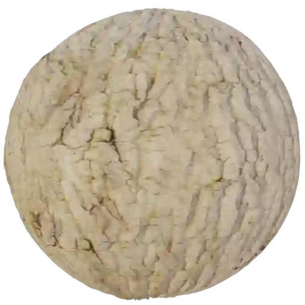

|

**This material is contained in the following Exapacks:**

    - XTRPbr_05k_Vol_001

    - XTRPbr_1k_Vol_001

    - XTRPbr_2k_Vol_004

    - XTRPbr_4k_Vol_002

    - XTRPbr_8k_Vol_019

------------------------------------------------------------------------------------------------------------------------

Wood - Derived (Category)
-------------------------

Chipboards 001
**************

.. image:: _static/_images/material_list/wood_derived/chipboards_001/chipboards_001.webp
    :width: 30%
    :align: center
    :alt: Chipboards 001

|

**This material is contained in the following Exapacks:**

    - XTRPbr_05k_Vol_001

    - XTRPbr_1k_Vol_001

    - XTRPbr_2k_Vol_004

    - XTRPbr_4k_Vol_002

    - XTRPbr_8k_Vol_019

------------------------------------------------------------------------------------------------------------------------

Chipboards 002
**************

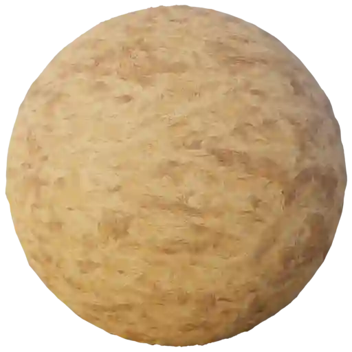

|

**This material is contained in the following Exapacks:**

    - XTRPbr_05k_Vol_001

    - XTRPbr_1k_Vol_001

    - XTRPbr_2k_Vol_004

    - XTRPbr_4k_Vol_002

    - XTRPbr_8k_Vol_019

------------------------------------------------------------------------------------------------------------------------

Chipboards 003
**************

.. image:: _static/_images/material_list/wood_derived/chipboards_003/chipboards_003.webp
    :width: 30%
    :align: center
    :alt: Chipboards 003

|

**This material is contained in the following Exapacks:**

    - XTRPbr_05k_Vol_001

    - XTRPbr_1k_Vol_001

    - XTRPbr_2k_Vol_004

    - XTRPbr_4k_Vol_002

    - XTRPbr_8k_Vol_019

------------------------------------------------------------------------------------------------------------------------

Chipboards 004
**************

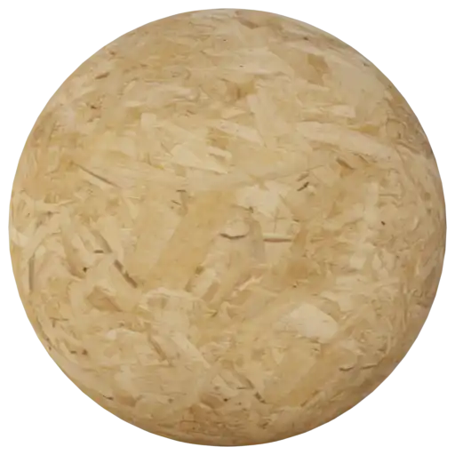

|

**This material is contained in the following Exapacks:**

    - XTRPbr_05k_Vol_001

    - XTRPbr_1k_Vol_001

    - XTRPbr_2k_Vol_004

    - XTRPbr_4k_Vol_002

------------------------------------------------------------------------------------------------------------------------

Cork 01
*******

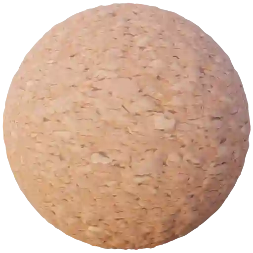

|

**This material is contained in the following Exapacks:**

    - XTRPbr_05k_Vol_001

    - XTRPbr_1k_Vol_001

    - XTRPbr_2k_Vol_004

    - XTRPbr_4k_Vol_002

------------------------------------------------------------------------------------------------------------------------

Wood Chips 01
*************

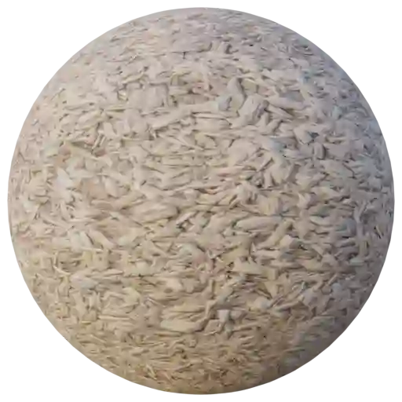

|

**This material is contained in the following Exapacks:**

    - XTRPbr_05k_Vol_001

    - XTRPbr_1k_Vol_001

    - XTRPbr_2k_Vol_004

    - XTRPbr_4k_Vol_002

    - XTRPbr_4k_Vol_011

    - XTRPbr_8k_Vol_019

------------------------------------------------------------------------------------------------------------------------

Wood Chips 02
*************

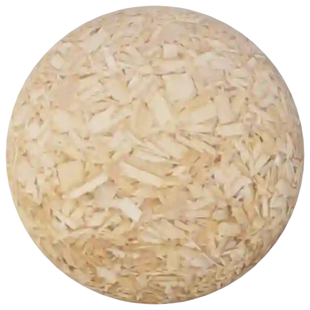

|

**This material is contained in the following Exapacks:**

    - XTRPbr_05k_Vol_001

    - XTRPbr_1k_Vol_001

    - XTRPbr_2k_Vol_004

    - XTRPbr_4k_Vol_011

    - XTRPbr_8k_Vol_019

------------------------------------------------------------------------------------------------------------------------

Wood - Painted (Category)
-------------------------

Black Paint Wood 01
*******************

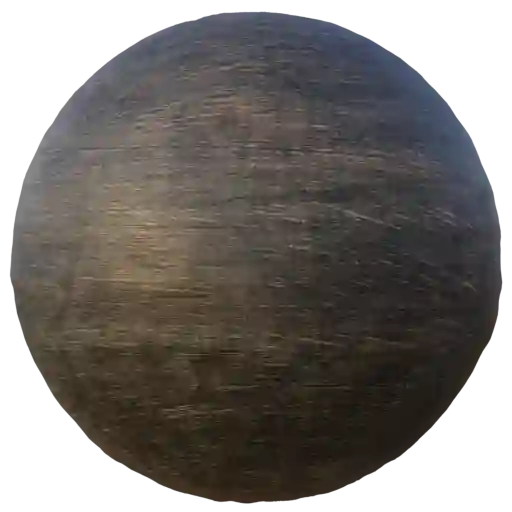

|

**This material is contained in the following Exapacks:**

    - XTRPbr_05k_Vol_001

    - XTRPbr_1k_Vol_001

    - XTRPbr_2k_Vol_004

    - XTRPbr_4k_Vol_011

    - XTRPbr_8k_Vol_019

------------------------------------------------------------------------------------------------------------------------

Blue Paint Wood 01
******************

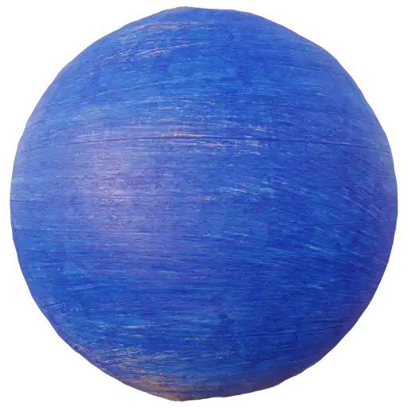

|

**This material is contained in the following Exapacks:**

    - XTRPbr_05k_Vol_001

    - XTRPbr_1k_Vol_001

    - XTRPbr_2k_Vol_004

    - XTRPbr_4k_Vol_011

    - XTRPbr_8k_Vol_019

------------------------------------------------------------------------------------------------------------------------

Green Paint Wood 01
*******************

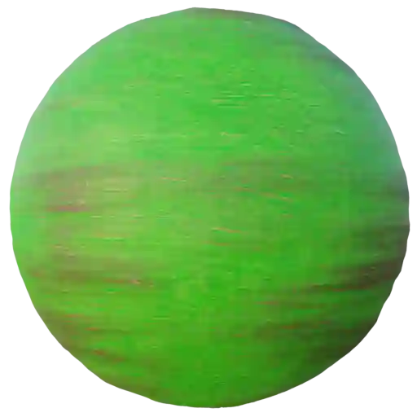

|

**This material is contained in the following Exapacks:**

    - XTRPbr_05k_Vol_001

    - XTRPbr_1k_Vol_001

    - XTRPbr_2k_Vol_004

    - XTRPbr_4k_Vol_011

    - XTRPbr_8k_Vol_019

------------------------------------------------------------------------------------------------------------------------

Red Paint Wood 01
*****************

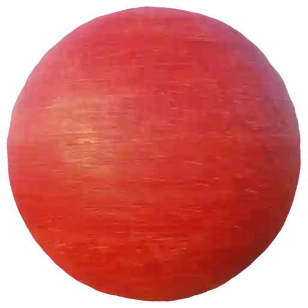

|

**This material is contained in the following Exapacks:**

    - XTRPbr_05k_Vol_001

    - XTRPbr_1k_Vol_001

    - XTRPbr_2k_Vol_004

    - XTRPbr_4k_Vol_011

    - XTRPbr_8k_Vol_019

------------------------------------------------------------------------------------------------------------------------

Yellow Paint Wood 01
********************

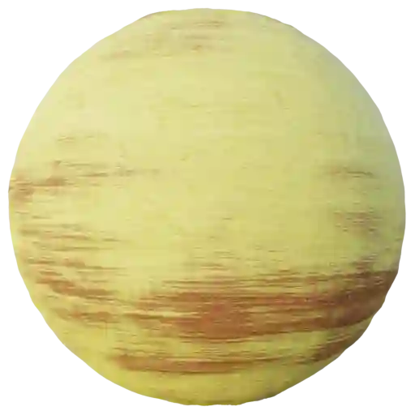

|

**This material is contained in the following Exapacks:**

    - XTRPbr_05k_Vol_001

    - XTRPbr_1k_Vol_001

    - XTRPbr_2k_Vol_004

    - XTRPbr_4k_Vol_011

    - XTRPbr_8k_Vol_019

------------------------------------------------------------------------------------------------------------------------

Wood - Plain (Category)
-----------------------

Wood Plain 001
**************

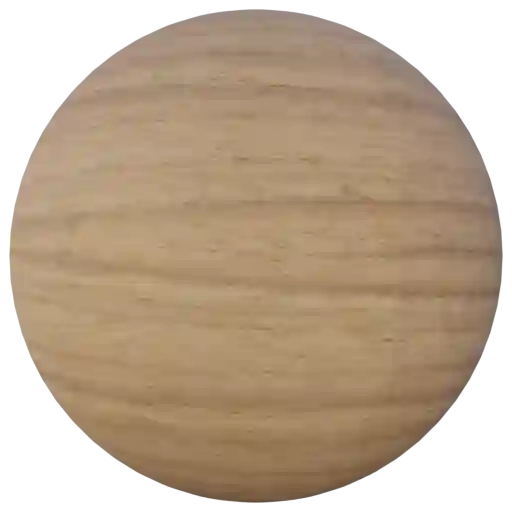

|

**This material is contained in the following Exapacks:**

    - XTRPbr_05k_Vol_001

    - XTRPbr_1k_Vol_001

    - XTRPbr_2k_Vol_004

    - XTRPbr_4k_Vol_011

------------------------------------------------------------------------------------------------------------------------

Wood Plain 002
**************

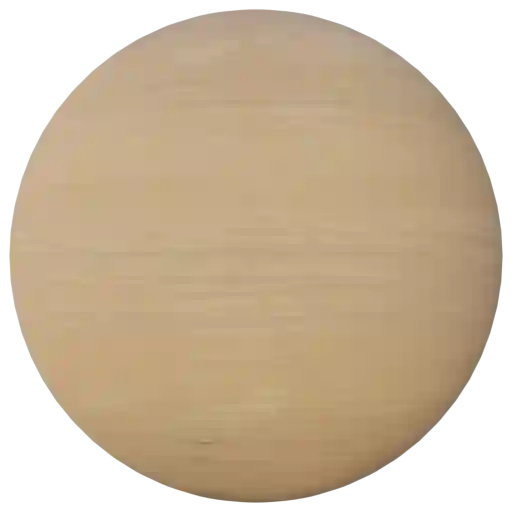

|

**This material is contained in the following Exapacks:**

    - XTRPbr_05k_Vol_001

    - XTRPbr_1k_Vol_001

    - XTRPbr_2k_Vol_004

    - XTRPbr_4k_Vol_011

    - XTRPbr_8k_Vol_019

------------------------------------------------------------------------------------------------------------------------

Wood Plain 003
**************

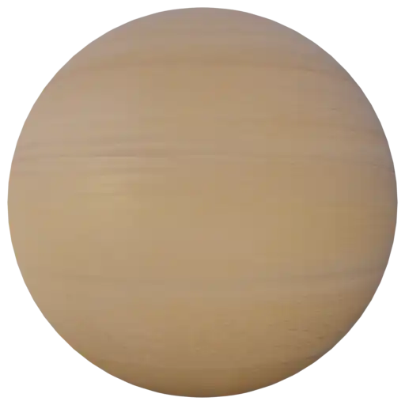

|

**This material is contained in the following Exapacks:**

    - XTRPbr_05k_Vol_001

    - XTRPbr_1k_Vol_001

    - XTRPbr_2k_Vol_004

    - XTRPbr_4k_Vol_011

    - XTRPbr_8k_Vol_019

------------------------------------------------------------------------------------------------------------------------

Wood Plain 004
**************

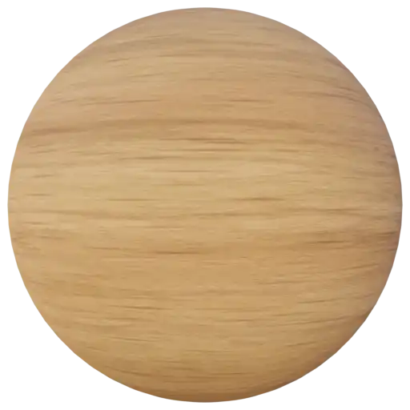

|

**This material is contained in the following Exapacks:**

    - XTRPbr_05k_Vol_001

    - XTRPbr_1k_Vol_001

    - XTRPbr_2k_Vol_004

    - XTRPbr_4k_Vol_011

------------------------------------------------------------------------------------------------------------------------

Wood Plain 005
**************

|

**This material is contained in the following Exapacks:**

    - XTRPbr_05k_Vol_001

    - XTRPbr_1k_Vol_001

    - XTRPbr_2k_Vol_004

    - XTRPbr_4k_Vol_011

------------------------------------------------------------------------------------------------------------------------

Wood Plain 006
**************

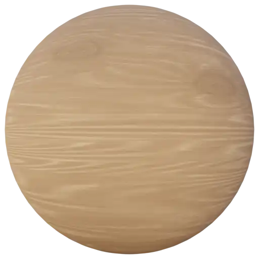

|

**This material is contained in the following Exapacks:**

    - XTRPbr_05k_Vol_001

    - XTRPbr_1k_Vol_001

    - XTRPbr_2k_Vol_004

    - XTRPbr_4k_Vol_011

    - XTRPbr_8k_Vol_019

------------------------------------------------------------------------------------------------------------------------

Wood Plain 007
**************

|

**This material is contained in the following Exapacks:**

    - XTRPbr_05k_Vol_001

    - XTRPbr_1k_Vol_001

    - XTRPbr_2k_Vol_004

    - XTRPbr_4k_Vol_011

    - XTRPbr_8k_Vol_019

------------------------------------------------------------------------------------------------------------------------

Wood Plain 008
**************

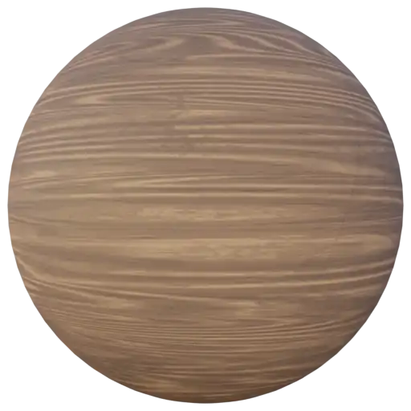

|

**This material is contained in the following Exapacks:**

    - XTRPbr_05k_Vol_001

    - XTRPbr_1k_Vol_001

    - XTRPbr_2k_Vol_004

    - XTRPbr_4k_Vol_011

    - XTRPbr_8k_Vol_019

------------------------------------------------------------------------------------------------------------------------

Wood Plain 009
**************

|

**This material is contained in the following Exapacks:**

    - XTRPbr_05k_Vol_001

    - XTRPbr_1k_Vol_001

    - XTRPbr_2k_Vol_004

    - XTRPbr_4k_Vol_011

    - XTRPbr_8k_Vol_019

------------------------------------------------------------------------------------------------------------------------

Wood Plain 010
**************

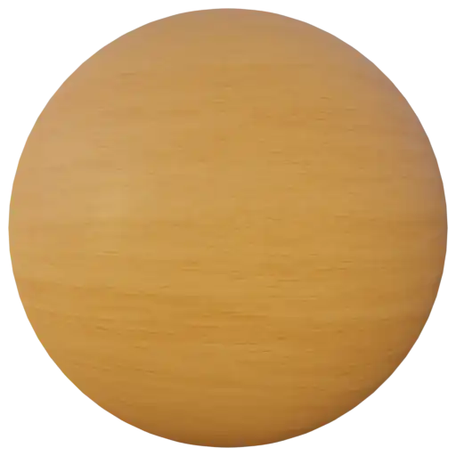

|

**This material is contained in the following Exapacks:**

    - XTRPbr_05k_Vol_001

    - XTRPbr_1k_Vol_001

    - XTRPbr_2k_Vol_004

    - XTRPbr_4k_Vol_011

    - XTRPbr_8k_Vol_019

------------------------------------------------------------------------------------------------------------------------

Wood Plain 011
**************

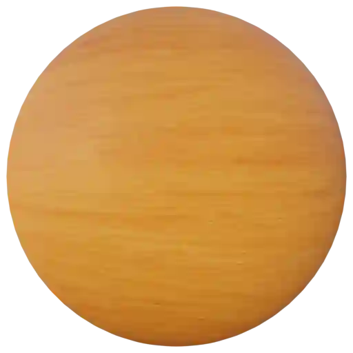

|

**This material is contained in the following Exapacks:**

    - XTRPbr_05k_Vol_001

    - XTRPbr_1k_Vol_001

    - XTRPbr_2k_Vol_004

    - XTRPbr_4k_Vol_011

    - XTRPbr_8k_Vol_019

------------------------------------------------------------------------------------------------------------------------

Wood Plain 012
**************

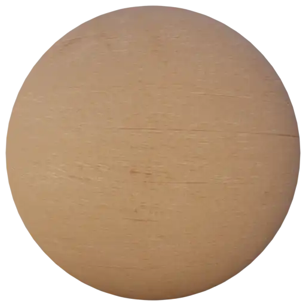

|

**This material is contained in the following Exapacks:**

    - XTRPbr_05k_Vol_001

    - XTRPbr_1k_Vol_001

    - XTRPbr_2k_Vol_004

    - XTRPbr_4k_Vol_011

    - XTRPbr_8k_Vol_019

------------------------------------------------------------------------------------------------------------------------

Wood Plain 013
**************

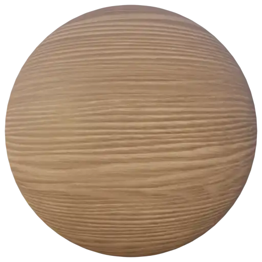

|

**This material is contained in the following Exapacks:**

    - XTRPbr_05k_Vol_001

    - XTRPbr_1k_Vol_001

    - XTRPbr_2k_Vol_004

    - XTRPbr_4k_Vol_011

    - XTRPbr_8k_Vol_019

------------------------------------------------------------------------------------------------------------------------

Wood Plain 014
**************

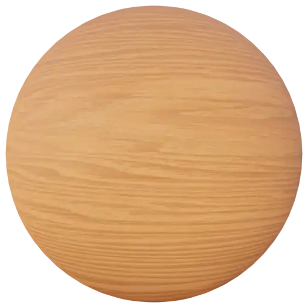

|

**This material is contained in the following Exapacks:**

    - XTRPbr_05k_Vol_001

    - XTRPbr_1k_Vol_001

    - XTRPbr_2k_Vol_004

    - XTRPbr_4k_Vol_011

    - XTRPbr_8k_Vol_019

------------------------------------------------------------------------------------------------------------------------

Wood Plain 015
**************

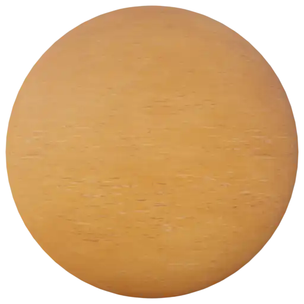

|

**This material is contained in the following Exapacks:**

    - XTRPbr_05k_Vol_001

    - XTRPbr_1k_Vol_001

    - XTRPbr_2k_Vol_004

    - XTRPbr_4k_Vol_011

    - XTRPbr_8k_Vol_019

------------------------------------------------------------------------------------------------------------------------

Wood Plain 016
**************

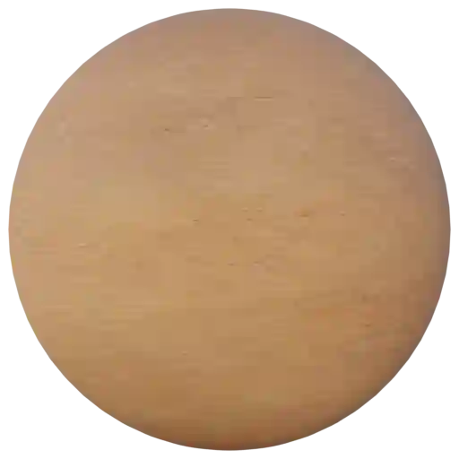

|

**This material is contained in the following Exapacks:**

    - XTRPbr_05k_Vol_001

    - XTRPbr_1k_Vol_001

    - XTRPbr_2k_Vol_004

    - XTRPbr_4k_Vol_011

    - XTRPbr_8k_Vol_019

------------------------------------------------------------------------------------------------------------------------

Wood Plain 017
**************

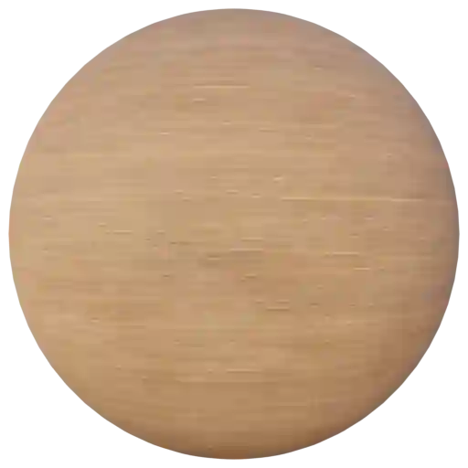

|

**This material is contained in the following Exapacks:**

    - XTRPbr_05k_Vol_001

    - XTRPbr_1k_Vol_001

    - XTRPbr_2k_Vol_004

    - XTRPbr_4k_Vol_011

    - XTRPbr_8k_Vol_019

------------------------------------------------------------------------------------------------------------------------

Wood Plain 018
**************

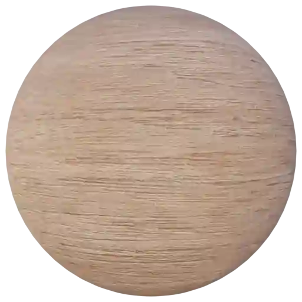

|

**This material is contained in the following Exapacks:**

    - XTRPbr_05k_Vol_001

    - XTRPbr_1k_Vol_001

    - XTRPbr_2k_Vol_004

    - XTRPbr_4k_Vol_011

    - XTRPbr_8k_Vol_019

------------------------------------------------------------------------------------------------------------------------

Wood Plain 019
**************

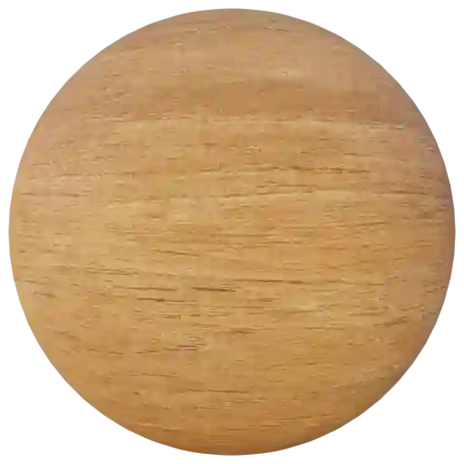

|

**This material is contained in the following Exapacks:**

    - XTRPbr_05k_Vol_001

    - XTRPbr_1k_Vol_001

    - XTRPbr_2k_Vol_004

    - XTRPbr_4k_Vol_011

    - XTRPbr_8k_Vol_019

------------------------------------------------------------------------------------------------------------------------

Wood Plain 020
**************

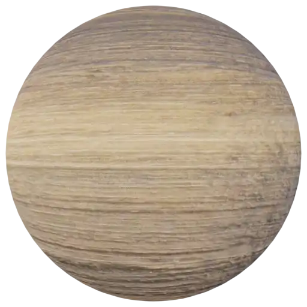

|

**This material is contained in the following Exapacks:**

    - XTRPbr_05k_Vol_001

    - XTRPbr_1k_Vol_001

    - XTRPbr_2k_Vol_004

------------------------------------------------------------------------------------------------------------------------

Wood Plain 021
**************

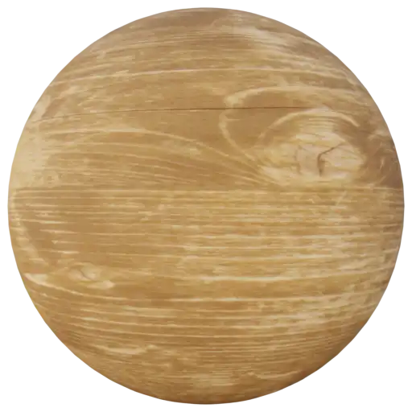

|

**This material is contained in the following Exapacks:**

    - XTRPbr_05k_Vol_001

    - XTRPbr_1k_Vol_001

    - XTRPbr_2k_Vol_004

------------------------------------------------------------------------------------------------------------------------

Wood Plain 022
**************

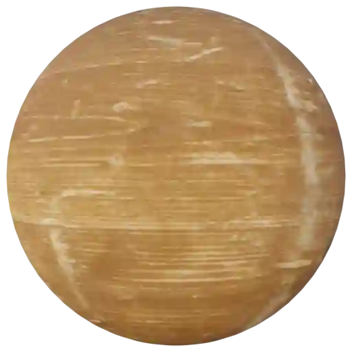

|

**This material is contained in the following Exapacks:**

    - XTRPbr_05k_Vol_001

    - XTRPbr_1k_Vol_001

    - XTRPbr_2k_Vol_004

------------------------------------------------------------------------------------------------------------------------

Wood Plain 023
**************

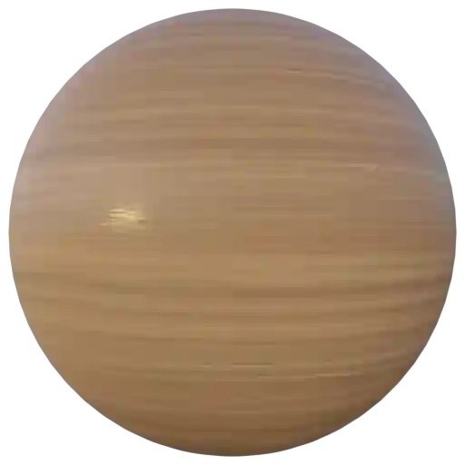

|

**This material is contained in the following Exapacks:**

    - XTRPbr_05k_Vol_001

    - XTRPbr_1k_Vol_001

    - XTRPbr_2k_Vol_004

    - XTRPbr_4k_Vol_011

------------------------------------------------------------------------------------------------------------------------

Wood Plain 024
**************

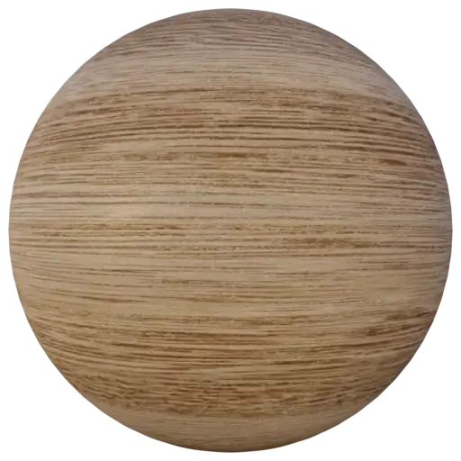

|

**This material is contained in the following Exapacks:**

    - XTRPbr_05k_Vol_001

    - XTRPbr_1k_Vol_001

    - XTRPbr_2k_Vol_004

    - XTRPbr_4k_Vol_011

    - XTRPbr_8k_Vol_019

------------------------------------------------------------------------------------------------------------------------

Wood Plain 025
**************

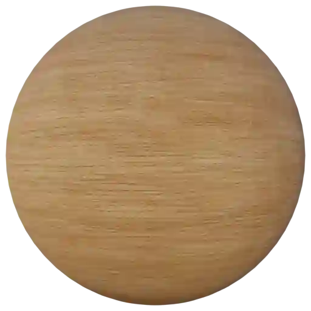

|

**This material is contained in the following Exapacks:**

    - XTRPbr_05k_Vol_001

    - XTRPbr_1k_Vol_001

    - XTRPbr_2k_Vol_004

    - XTRPbr_4k_Vol_011

    - XTRPbr_8k_Vol_019

------------------------------------------------------------------------------------------------------------------------

Wood - Plain Dark (Category)
----------------------------

Wood Plain Dark 001
*******************

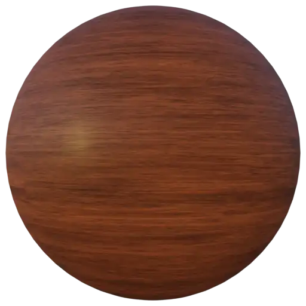

|

**This material is contained in the following Exapacks:**

    - XTRPbr_05k_Vol_001

    - XTRPbr_1k_Vol_001

    - XTRPbr_2k_Vol_004

    - XTRPbr_4k_Vol_011

------------------------------------------------------------------------------------------------------------------------

Wood Plain Dark 002
*******************

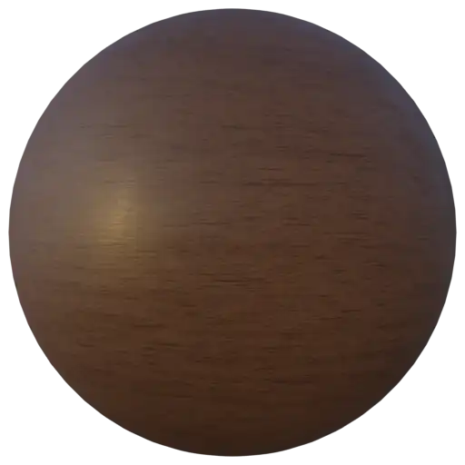

|

**This material is contained in the following Exapacks:**

    - XTRPbr_05k_Vol_001

    - XTRPbr_1k_Vol_001

    - XTRPbr_2k_Vol_004

    - XTRPbr_4k_Vol_011

    - XTRPbr_8k_Vol_019

------------------------------------------------------------------------------------------------------------------------

Wood Plain Dark 003
*******************

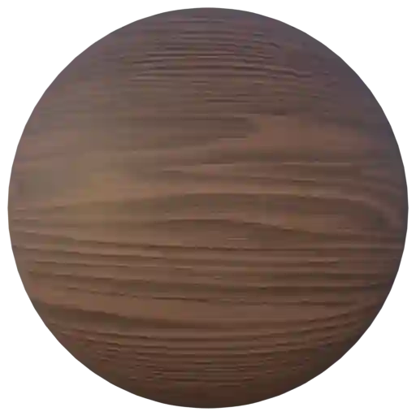

|

**This material is contained in the following Exapacks:**

    - XTRPbr_05k_Vol_001

    - XTRPbr_1k_Vol_001

    - XTRPbr_2k_Vol_004

    - XTRPbr_4k_Vol_011

    - XTRPbr_8k_Vol_019

------------------------------------------------------------------------------------------------------------------------

Wood Plain Dark 004
*******************

|

**This material is contained in the following Exapacks:**

    - XTRPbr_05k_Vol_001

    - XTRPbr_1k_Vol_001

    - XTRPbr_2k_Vol_004

    - XTRPbr_4k_Vol_011

------------------------------------------------------------------------------------------------------------------------

Wood Plain Dark 005
*******************

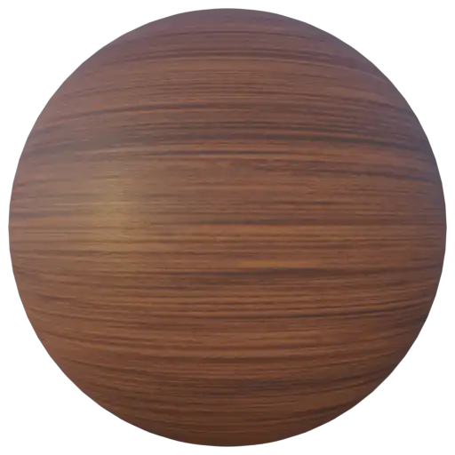

|

**This material is contained in the following Exapacks:**

    - XTRPbr_05k_Vol_001

    - XTRPbr_1k_Vol_001

    - XTRPbr_2k_Vol_004

    - XTRPbr_4k_Vol_011

------------------------------------------------------------------------------------------------------------------------

Wood Plain Dark 006
*******************

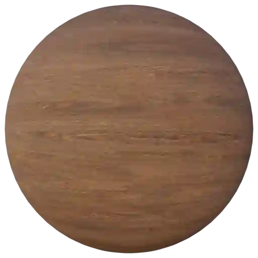

|

**This material is contained in the following Exapacks:**

    - XTRPbr_05k_Vol_001

    - XTRPbr_1k_Vol_001

    - XTRPbr_2k_Vol_004

    - XTRPbr_4k_Vol_011

------------------------------------------------------------------------------------------------------------------------

Wood Plain Dark 007
*******************

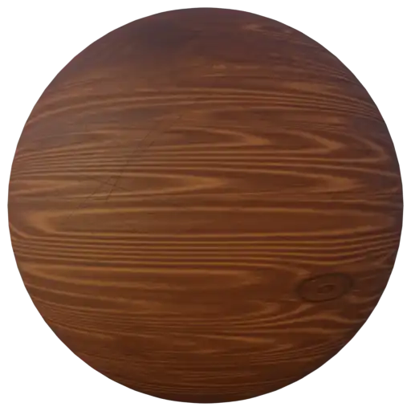

|

**This material is contained in the following Exapacks:**

    - XTRPbr_05k_Vol_001

    - XTRPbr_1k_Vol_001

    - XTRPbr_2k_Vol_004

    - XTRPbr_4k_Vol_011

    - XTRPbr_8k_Vol_019

------------------------------------------------------------------------------------------------------------------------

Wood Plain Dark 008
*******************

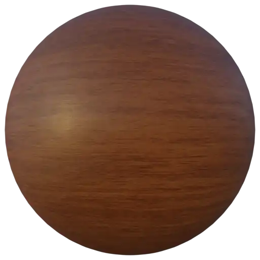

|

**This material is contained in the following Exapacks:**

    - XTRPbr_05k_Vol_001

    - XTRPbr_1k_Vol_001

    - XTRPbr_2k_Vol_004

    - XTRPbr_4k_Vol_011

    - XTRPbr_8k_Vol_019

------------------------------------------------------------------------------------------------------------------------

Wood Plain Dark 009
*******************

.. image:: _static/_images/material_list/wood_plain_dark/wood_plain_dark_009/wood_plain_dark_009.webp
    :width: 30%
    :align: center
    :alt: Wood Plain Dark 009

|

**This material is contained in the following Exapacks:**

    - XTRPbr_05k_Vol_001

    - XTRPbr_1k_Vol_001

    - XTRPbr_2k_Vol_004

    - XTRPbr_4k_Vol_011

------------------------------------------------------------------------------------------------------------------------

Wood Plain Dark 010
*******************

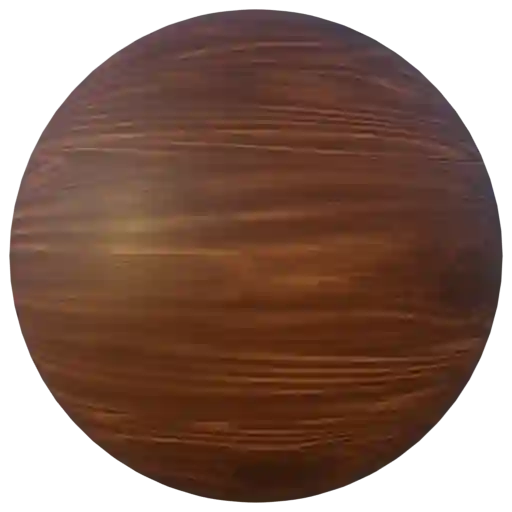

|

**This material is contained in the following Exapacks:**

    - XTRPbr_05k_Vol_001

    - XTRPbr_1k_Vol_001

    - XTRPbr_2k_Vol_004

    - XTRPbr_4k_Vol_011

    - XTRPbr_8k_Vol_019

------------------------------------------------------------------------------------------------------------------------

Wood Plain Dark 011
*******************

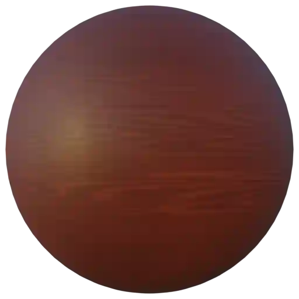

|

**This material is contained in the following Exapacks:**

    - XTRPbr_05k_Vol_001

    - XTRPbr_1k_Vol_001

    - XTRPbr_2k_Vol_004

    - XTRPbr_4k_Vol_011

    - XTRPbr_8k_Vol_019

------------------------------------------------------------------------------------------------------------------------

Wood Plain Dark 012
*******************

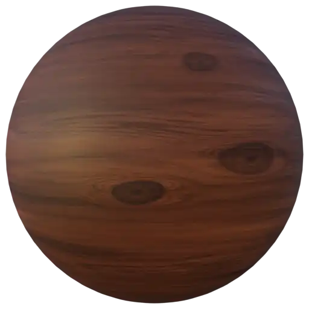

|

**This material is contained in the following Exapacks:**

    - XTRPbr_05k_Vol_001

    - XTRPbr_1k_Vol_001

    - XTRPbr_2k_Vol_004

    - XTRPbr_4k_Vol_011

------------------------------------------------------------------------------------------------------------------------

Wood Plain Dark 013
*******************

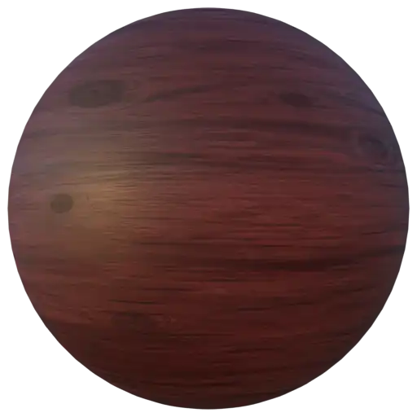

|

**This material is contained in the following Exapacks:**

    - XTRPbr_05k_Vol_001

    - XTRPbr_1k_Vol_001

    - XTRPbr_2k_Vol_004

    - XTRPbr_4k_Vol_011

------------------------------------------------------------------------------------------------------------------------

Wood Plain Dark 014
*******************

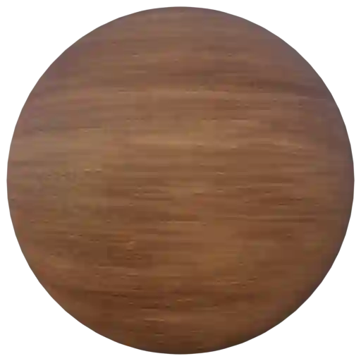

|

**This material is contained in the following Exapacks:**

    - XTRPbr_05k_Vol_001

    - XTRPbr_1k_Vol_001

    - XTRPbr_2k_Vol_004

    - XTRPbr_4k_Vol_011

    - XTRPbr_8k_Vol_019

------------------------------------------------------------------------------------------------------------------------

Wood Plain Dark 015
*******************

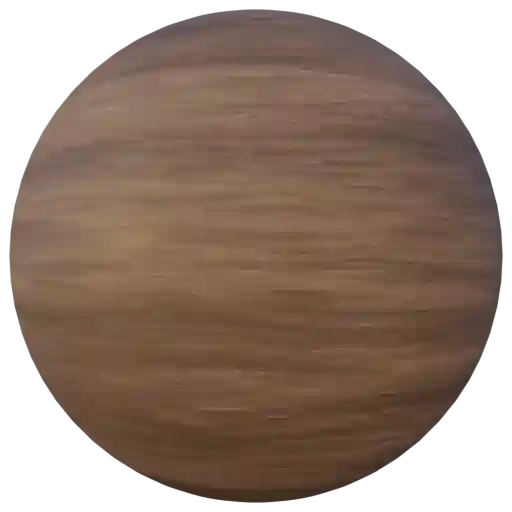

|

**This material is contained in the following Exapacks:**

    - XTRPbr_05k_Vol_001

    - XTRPbr_1k_Vol_001

    - XTRPbr_2k_Vol_004

    - XTRPbr_4k_Vol_011

------------------------------------------------------------------------------------------------------------------------

Wood Plain Dark 016
*******************

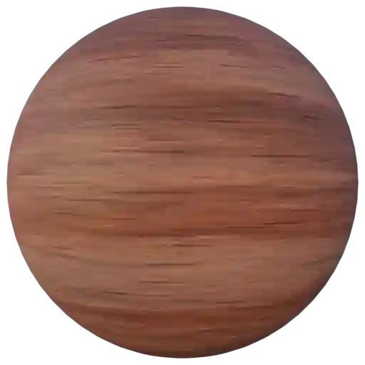

|

**This material is contained in the following Exapacks:**

    - XTRPbr_05k_Vol_001

    - XTRPbr_1k_Vol_001

    - XTRPbr_2k_Vol_004

    - XTRPbr_4k_Vol_011

------------------------------------------------------------------------------------------------------------------------

Wood Plain Dark 017
*******************

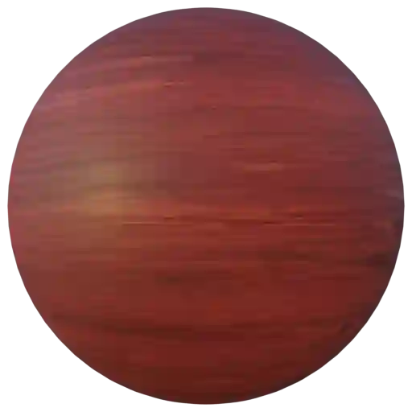

|

**This material is contained in the following Exapacks:**

    - XTRPbr_05k_Vol_001

    - XTRPbr_1k_Vol_001

    - XTRPbr_2k_Vol_004

    - XTRPbr_4k_Vol_011

------------------------------------------------------------------------------------------------------------------------

Wood Plain Dark 018
*******************

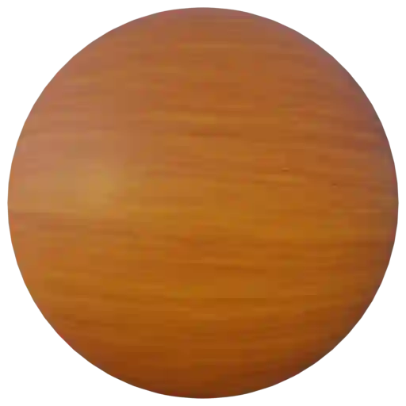

|

**This material is contained in the following Exapacks:**

    - XTRPbr_05k_Vol_001

    - XTRPbr_1k_Vol_001

    - XTRPbr_2k_Vol_004

    - XTRPbr_4k_Vol_011

    - XTRPbr_8k_Vol_019

------------------------------------------------------------------------------------------------------------------------

Wood Plain Dark 019
*******************

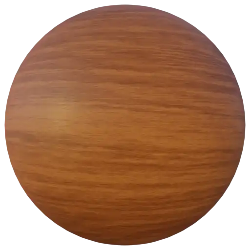

|

**This material is contained in the following Exapacks:**

    - XTRPbr_05k_Vol_001

    - XTRPbr_1k_Vol_001

    - XTRPbr_2k_Vol_004

    - XTRPbr_4k_Vol_011

    - XTRPbr_8k_Vol_019

------------------------------------------------------------------------------------------------------------------------

Wood Plain Dark 020
*******************

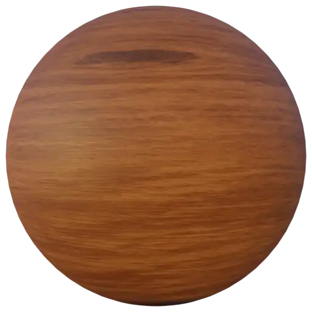

|

**This material is contained in the following Exapacks:**

    - XTRPbr_05k_Vol_001

    - XTRPbr_1k_Vol_001

    - XTRPbr_2k_Vol_004

    - XTRPbr_4k_Vol_011

    - XTRPbr_8k_Vol_019

------------------------------------------------------------------------------------------------------------------------

Wood Plain Dark 021
*******************

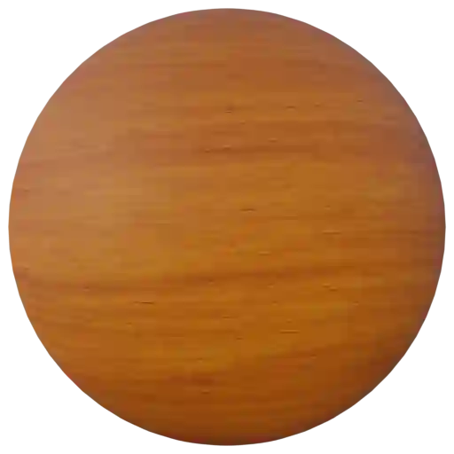

|

**This material is contained in the following Exapacks:**

    - XTRPbr_05k_Vol_001

    - XTRPbr_1k_Vol_001

    - XTRPbr_2k_Vol_004

    - XTRPbr_4k_Vol_011

    - XTRPbr_8k_Vol_019

------------------------------------------------------------------------------------------------------------------------

Wood Plain Dark 022
*******************

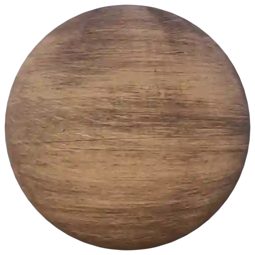

|

**This material is contained in the following Exapacks:**

    - XTRPbr_05k_Vol_001

    - XTRPbr_1k_Vol_001

    - XTRPbr_2k_Vol_004

    - XTRPbr_4k_Vol_011

    - XTRPbr_8k_Vol_019

------------------------------------------------------------------------------------------------------------------------

Wood Plain Dark 023
*******************

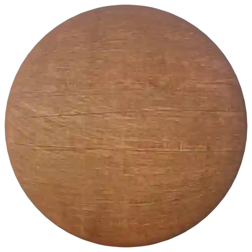

|

**This material is contained in the following Exapacks:**

    - XTRPbr_05k_Vol_001

    - XTRPbr_1k_Vol_001

    - XTRPbr_2k_Vol_004

    - XTRPbr_4k_Vol_011

    - XTRPbr_8k_Vol_010

------------------------------------------------------------------------------------------------------------------------

Wood Plain Dark 024
*******************

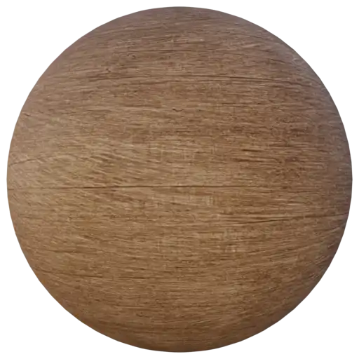

|

**This material is contained in the following Exapacks:**

    - XTRPbr_05k_Vol_001

    - XTRPbr_1k_Vol_001

    - XTRPbr_2k_Vol_004

    - XTRPbr_4k_Vol_011

    - XTRPbr_8k_Vol_010

------------------------------------------------------------------------------------------------------------------------

Wood Plain Dark 025
*******************

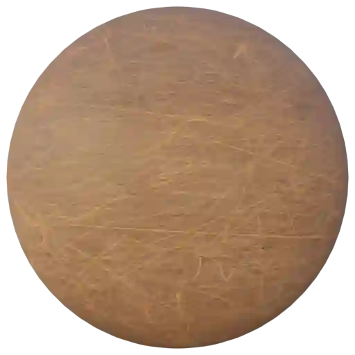

|

**This material is contained in the following Exapacks:**

    - XTRPbr_05k_Vol_001

    - XTRPbr_1k_Vol_001

    - XTRPbr_2k_Vol_004

    - XTRPbr_4k_Vol_011

    - XTRPbr_8k_Vol_010

------------------------------------------------------------------------------------------------------------------------

Wood Plain Dark 026
*******************

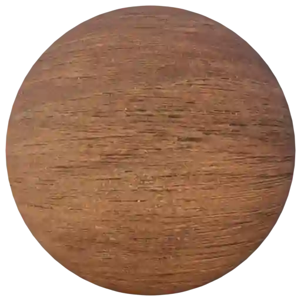

|

**This material is contained in the following Exapacks:**

    - XTRPbr_05k_Vol_001

    - XTRPbr_1k_Vol_001

    - XTRPbr_2k_Vol_004

    - XTRPbr_4k_Vol_011

    - XTRPbr_8k_Vol_010

------------------------------------------------------------------------------------------------------------------------

Wood Plain Dark 027
*******************

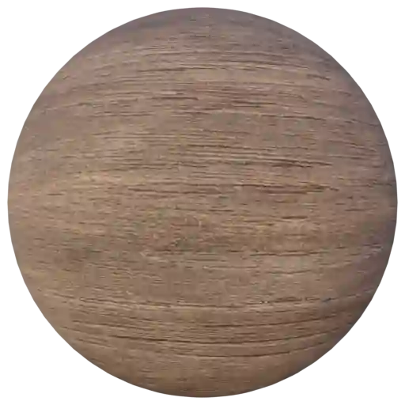

|

**This material is contained in the following Exapacks:**

    - XTRPbr_05k_Vol_001

    - XTRPbr_1k_Vol_001

    - XTRPbr_2k_Vol_004

    - XTRPbr_4k_Vol_011

    - XTRPbr_8k_Vol_010

------------------------------------------------------------------------------------------------------------------------

Wood Plain Dark 028
*******************

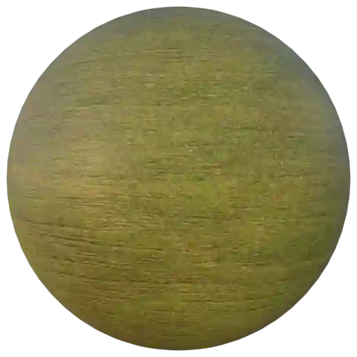

|

**This material is contained in the following Exapacks:**

    - XTRPbr_05k_Vol_001

    - XTRPbr_1k_Vol_001

    - XTRPbr_2k_Vol_004

    - XTRPbr_4k_Vol_011

    - XTRPbr_8k_Vol_010

------------------------------------------------------------------------------------------------------------------------

Wood Plain Dark 029
*******************

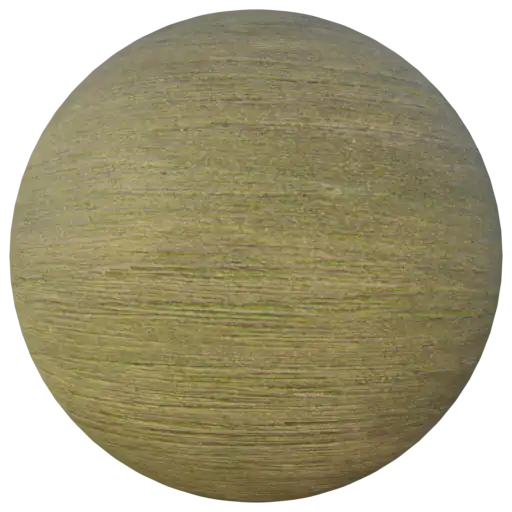

|

**This material is contained in the following Exapacks:**

    - XTRPbr_05k_Vol_001

    - XTRPbr_1k_Vol_001

    - XTRPbr_2k_Vol_004

    - XTRPbr_4k_Vol_011

    - XTRPbr_8k_Vol_010

------------------------------------------------------------------------------------------------------------------------

Wood Plain Dark 030
*******************

|

**This material is contained in the following Exapacks:**

    - XTRPbr_05k_Vol_001

    - XTRPbr_1k_Vol_001

    - XTRPbr_2k_Vol_004

    - XTRPbr_4k_Vol_011

------------------------------------------------------------------------------------------------------------------------

Wood Plain Dark 031
*******************

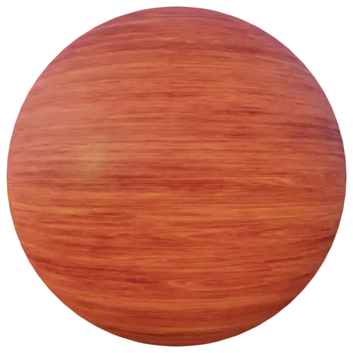

|

**This material is contained in the following Exapacks:**

    - XTRPbr_05k_Vol_001

    - XTRPbr_1k_Vol_001

    - XTRPbr_2k_Vol_004

    - XTRPbr_4k_Vol_011

------------------------------------------------------------------------------------------------------------------------

Wood - Plain Light (Category)
-----------------------------

Wood Plain Light 001
********************

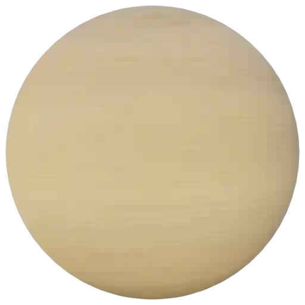

|

**This material is contained in the following Exapacks:**

    - XTRPbr_05k_Vol_001

    - XTRPbr_1k_Vol_001

    - XTRPbr_2k_Vol_004

    - XTRPbr_4k_Vol_011

------------------------------------------------------------------------------------------------------------------------

Wood Plain Light 002
********************

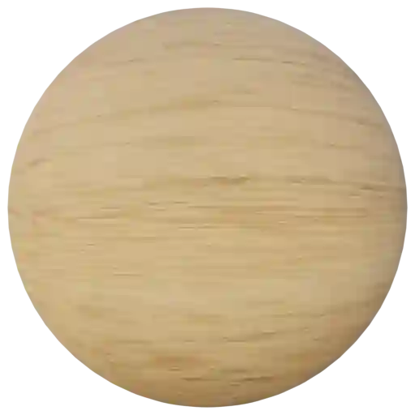

|

**This material is contained in the following Exapacks:**

    - XTRPbr_05k_Vol_001

    - XTRPbr_1k_Vol_001

    - XTRPbr_2k_Vol_004

    - XTRPbr_4k_Vol_011

    - XTRPbr_8k_Vol_010

------------------------------------------------------------------------------------------------------------------------

Wood Plain Light 003
********************

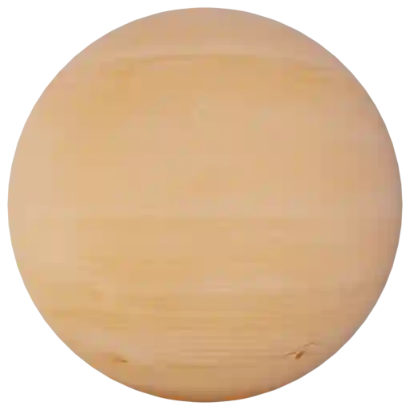

|

**This material is contained in the following Exapacks:**

    - XTRPbr_05k_Vol_001

    - XTRPbr_1k_Vol_001

    - XTRPbr_2k_Vol_004

    - XTRPbr_4k_Vol_011

    - XTRPbr_8k_Vol_010

------------------------------------------------------------------------------------------------------------------------

Wood Plain Light 004
********************

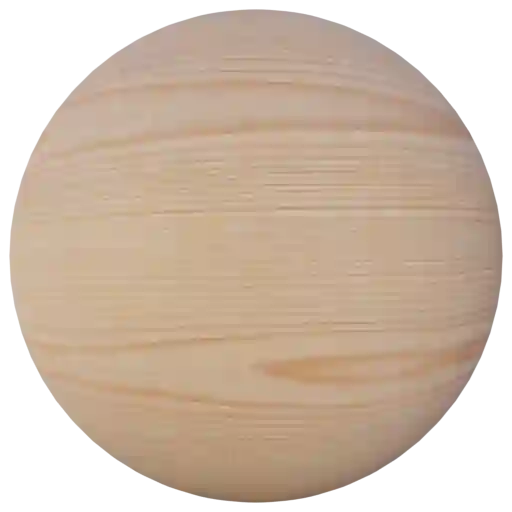

|

**This material is contained in the following Exapacks:**

    - XTRPbr_05k_Vol_001

    - XTRPbr_1k_Vol_001

    - XTRPbr_2k_Vol_004

    - XTRPbr_4k_Vol_011

    - XTRPbr_8k_Vol_010

------------------------------------------------------------------------------------------------------------------------

Wood Plain Light 005
********************

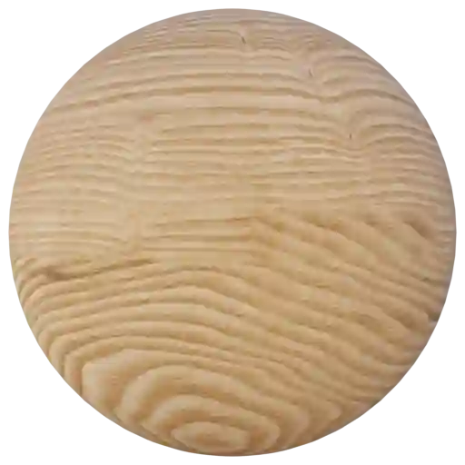

|

**This material is contained in the following Exapacks:**

    - XTRPbr_05k_Vol_001

    - XTRPbr_1k_Vol_001

    - XTRPbr_2k_Vol_004

    - XTRPbr_4k_Vol_011

    - XTRPbr_8k_Vol_010

------------------------------------------------------------------------------------------------------------------------

Wood Plain Light 006
********************

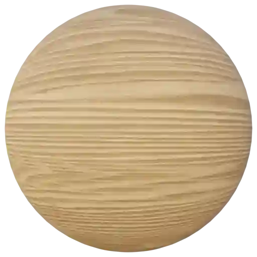

|

**This material is contained in the following Exapacks:**

    - XTRPbr_05k_Vol_001

    - XTRPbr_1k_Vol_001

    - XTRPbr_2k_Vol_004

    - XTRPbr_4k_Vol_011

    - XTRPbr_8k_Vol_010

------------------------------------------------------------------------------------------------------------------------

Wood Plain Light 007
********************

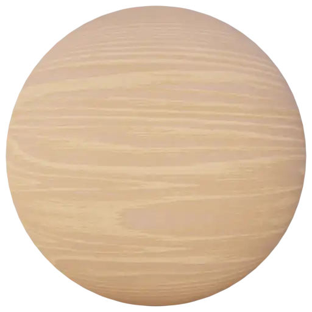

|

**This material is contained in the following Exapacks:**

    - XTRPbr_05k_Vol_001

    - XTRPbr_1k_Vol_001

    - XTRPbr_2k_Vol_004

    - XTRPbr_4k_Vol_011

    - XTRPbr_8k_Vol_010

------------------------------------------------------------------------------------------------------------------------

Wood Plain Light 008
********************

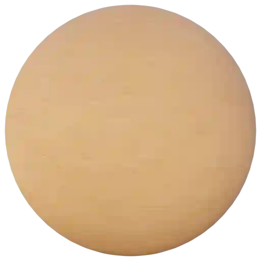

|

**This material is contained in the following Exapacks:**

    - XTRPbr_05k_Vol_001

    - XTRPbr_1k_Vol_001

    - XTRPbr_2k_Vol_004

    - XTRPbr_4k_Vol_011

    - XTRPbr_8k_Vol_010

------------------------------------------------------------------------------------------------------------------------

Wood Plain Light 009
********************

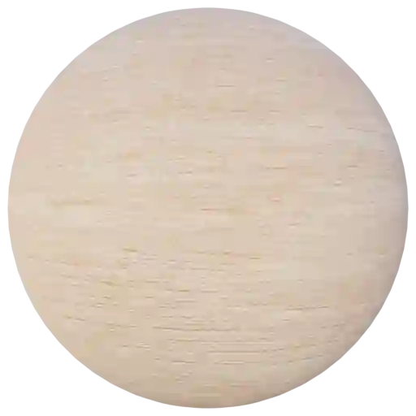

|

**This material is contained in the following Exapacks:**

    - XTRPbr_05k_Vol_001

    - XTRPbr_1k_Vol_001

    - XTRPbr_2k_Vol_004

    - XTRPbr_4k_Vol_011

    - XTRPbr_8k_Vol_010

------------------------------------------------------------------------------------------------------------------------

Wood Plain Light 010
********************

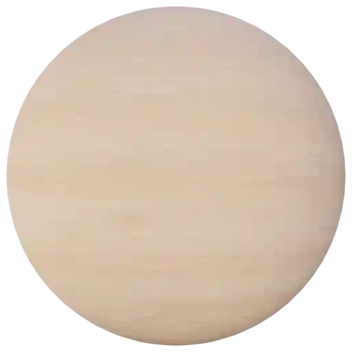

|

**This material is contained in the following Exapacks:**

    - XTRPbr_05k_Vol_001

    - XTRPbr_1k_Vol_001

    - XTRPbr_2k_Vol_004

    - XTRPbr_4k_Vol_011

------------------------------------------------------------------------------------------------------------------------

Wood Plain Light 011
********************

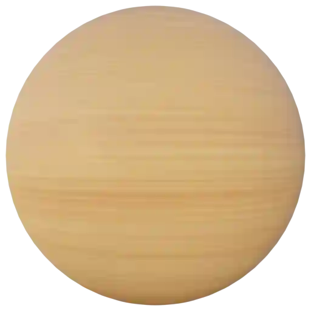

|

**This material is contained in the following Exapacks:**

    - XTRPbr_05k_Vol_001

    - XTRPbr_1k_Vol_001

    - XTRPbr_2k_Vol_004

    - XTRPbr_4k_Vol_011

------------------------------------------------------------------------------------------------------------------------

Wood Plain Light 012
********************

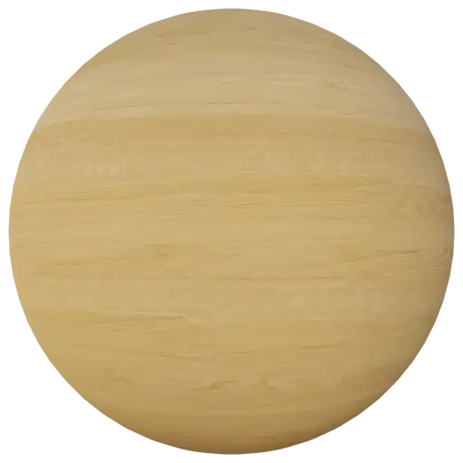

|

**This material is contained in the following Exapacks:**

    - XTRPbr_05k_Vol_001

    - XTRPbr_1k_Vol_001

    - XTRPbr_2k_Vol_004

    - XTRPbr_4k_Vol_011

------------------------------------------------------------------------------------------------------------------------

Wood Plain Light 013
********************

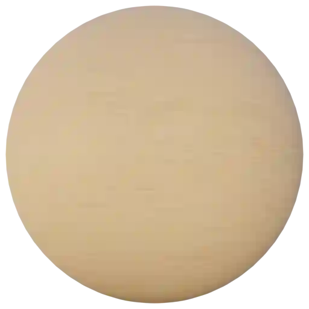

|

**This material is contained in the following Exapacks:**

    - XTRPbr_05k_Vol_001

    - XTRPbr_1k_Vol_001

    - XTRPbr_2k_Vol_004

    - XTRPbr_4k_Vol_011

    - XTRPbr_8k_Vol_010

------------------------------------------------------------------------------------------------------------------------

Wood Plain Light 014
********************

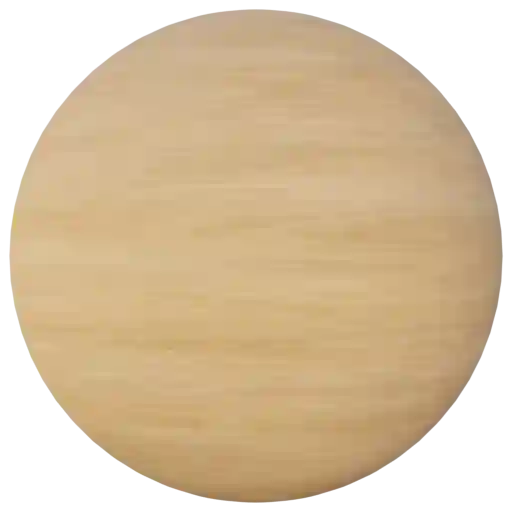

|

**This material is contained in the following Exapacks:**

    - XTRPbr_05k_Vol_001

    - XTRPbr_1k_Vol_001

    - XTRPbr_2k_Vol_004

    - XTRPbr_4k_Vol_011

------------------------------------------------------------------------------------------------------------------------

Wood Plain Light 015
********************

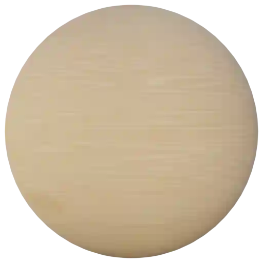

|

**This material is contained in the following Exapacks:**

    - XTRPbr_05k_Vol_001

    - XTRPbr_1k_Vol_001

    - XTRPbr_2k_Vol_004

    - XTRPbr_4k_Vol_011

    - XTRPbr_8k_Vol_010

------------------------------------------------------------------------------------------------------------------------

Wood Plain Light 016
********************

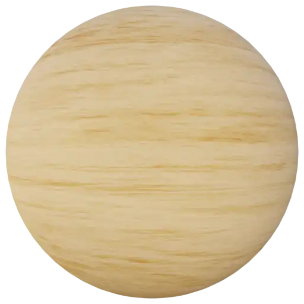

|

**This material is contained in the following Exapacks:**

    - XTRPbr_05k_Vol_001

    - XTRPbr_1k_Vol_001

    - XTRPbr_2k_Vol_004

    - XTRPbr_4k_Vol_011

    - XTRPbr_8k_Vol_010

------------------------------------------------------------------------------------------------------------------------

Wood Plain Light 017
********************

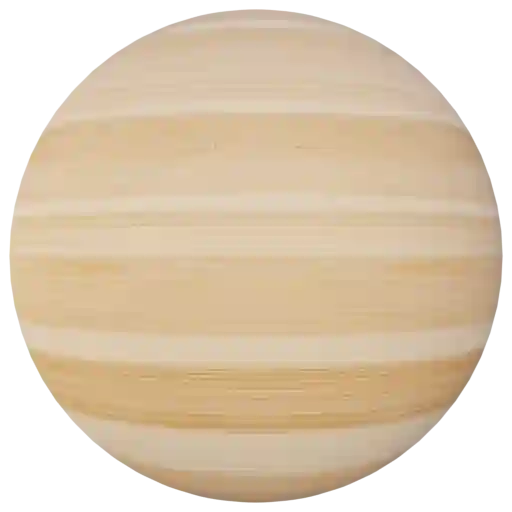

|

**This material is contained in the following Exapacks:**

    - XTRPbr_05k_Vol_001

    - XTRPbr_1k_Vol_001

    - XTRPbr_2k_Vol_004

    - XTRPbr_4k_Vol_011

------------------------------------------------------------------------------------------------------------------------

Wood Plain Light 018
********************

.. image:: _static/_images/material_list/wood_plain_light/wood_plain_light_018/wood_plain_light_018.webp
    :width: 30%
    :align: center
    :alt: Wood Plain Light 018

|

**This material is contained in the following Exapacks:**

    - XTRPbr_05k_Vol_001

    - XTRPbr_1k_Vol_001

    - XTRPbr_2k_Vol_004

    - XTRPbr_4k_Vol_011

    - XTRPbr_8k_Vol_010

------------------------------------------------------------------------------------------------------------------------

Wood Plain Light 019
********************

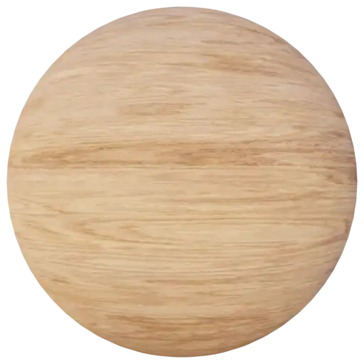

|

**This material is contained in the following Exapacks:**

    - XTRPbr_05k_Vol_001

    - XTRPbr_1k_Vol_001

    - XTRPbr_2k_Vol_004

    - XTRPbr_4k_Vol_011

------------------------------------------------------------------------------------------------------------------------

Wood - Planks (Category)
------------------------

Wood Planks Beige 001
*********************

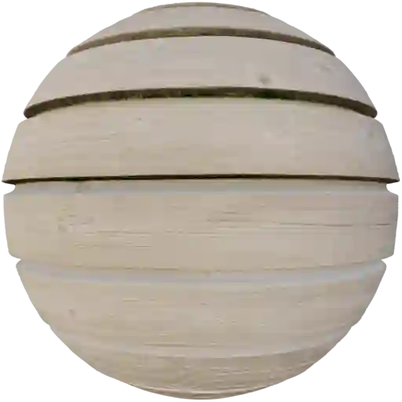

|

**This material is contained in the following Exapacks:**

    - XTRPbr_05k_Vol_001

    - XTRPbr_1k_Vol_001

    - XTRPbr_2k_Vol_004

    - XTRPbr_4k_Vol_011

    - XTRPbr_8k_Vol_010

------------------------------------------------------------------------------------------------------------------------

Wood Planks Beige 002
*********************

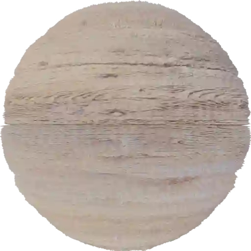

|

**This material is contained in the following Exapacks:**

    - XTRPbr_05k_Vol_001

    - XTRPbr_1k_Vol_001

    - XTRPbr_2k_Vol_004

    - XTRPbr_4k_Vol_011

    - XTRPbr_8k_Vol_010

------------------------------------------------------------------------------------------------------------------------

Wood Planks Beige 003
*********************

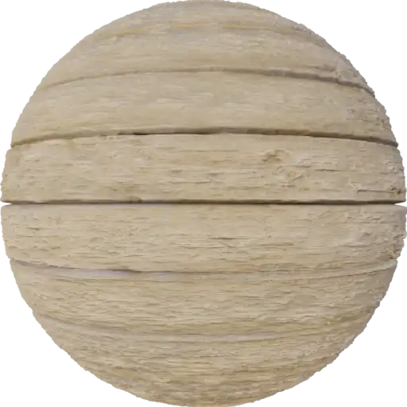

|

**This material is contained in the following Exapacks:**

    - XTRPbr_05k_Vol_001

    - XTRPbr_1k_Vol_001

    - XTRPbr_2k_Vol_004

    - XTRPbr_4k_Vol_011

    - XTRPbr_8k_Vol_010

------------------------------------------------------------------------------------------------------------------------

Wood Planks Beige 004
*********************

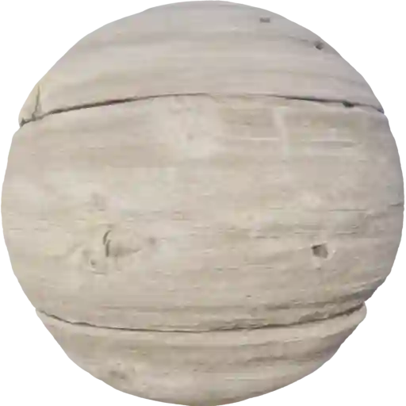

|

**This material is contained in the following Exapacks:**

    - XTRPbr_05k_Vol_001

    - XTRPbr_1k_Vol_001

    - XTRPbr_2k_Vol_004

------------------------------------------------------------------------------------------------------------------------

Wood Planks Beige 005
*********************

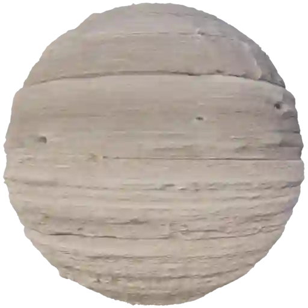

|

**This material is contained in the following Exapacks:**

    - XTRPbr_05k_Vol_001

    - XTRPbr_1k_Vol_001

    - XTRPbr_2k_Vol_004

    - XTRPbr_4k_Vol_011

------------------------------------------------------------------------------------------------------------------------

Wood Planks Beige 006
*********************

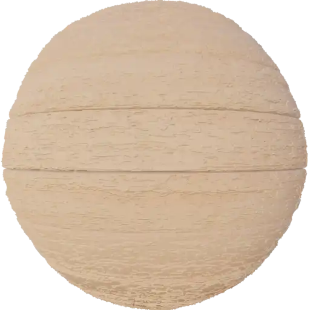

|

**This material is contained in the following Exapacks:**

    - XTRPbr_05k_Vol_001

    - XTRPbr_1k_Vol_001

    - XTRPbr_2k_Vol_004

    - XTRPbr_4k_Vol_011

------------------------------------------------------------------------------------------------------------------------

Wood Planks Beige 007
*********************

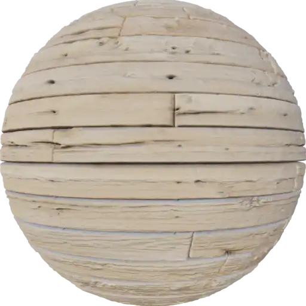

|

**This material is contained in the following Exapacks:**

    - XTRPbr_05k_Vol_001

    - XTRPbr_1k_Vol_001

    - XTRPbr_2k_Vol_004

    - XTRPbr_4k_Vol_011

------------------------------------------------------------------------------------------------------------------------

Wood Planks Beige 008
*********************

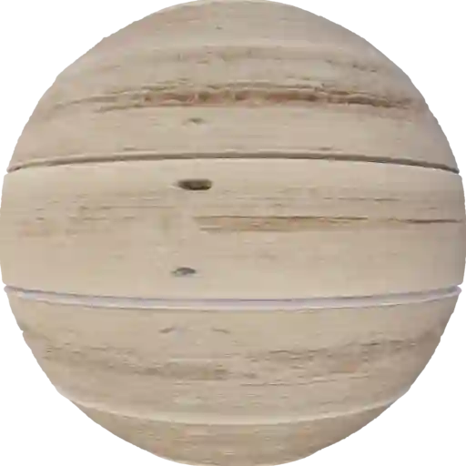

|

**This material is contained in the following Exapacks:**

    - XTRPbr_05k_Vol_001

    - XTRPbr_1k_Vol_001

    - XTRPbr_2k_Vol_004

    - XTRPbr_4k_Vol_011

    - XTRPbr_8k_Vol_010

------------------------------------------------------------------------------------------------------------------------

Wood Planks Beige 009
*********************

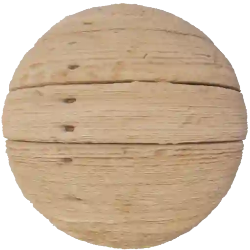

|

**This material is contained in the following Exapacks:**

    - XTRPbr_05k_Vol_001

    - XTRPbr_1k_Vol_001

    - XTRPbr_2k_Vol_004

    - XTRPbr_4k_Vol_011

------------------------------------------------------------------------------------------------------------------------

Wood Planks Beige 010
*********************

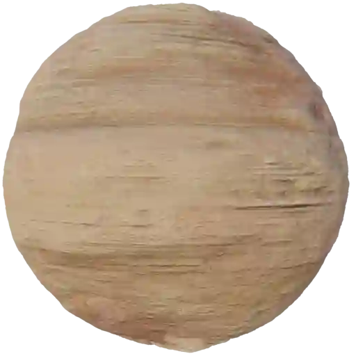

|

**This material is contained in the following Exapacks:**

    - XTRPbr_05k_Vol_001

    - XTRPbr_1k_Vol_001

    - XTRPbr_2k_Vol_004

    - XTRPbr_4k_Vol_011

    - XTRPbr_8k_Vol_010

------------------------------------------------------------------------------------------------------------------------

Wood Planks Beige 011
*********************

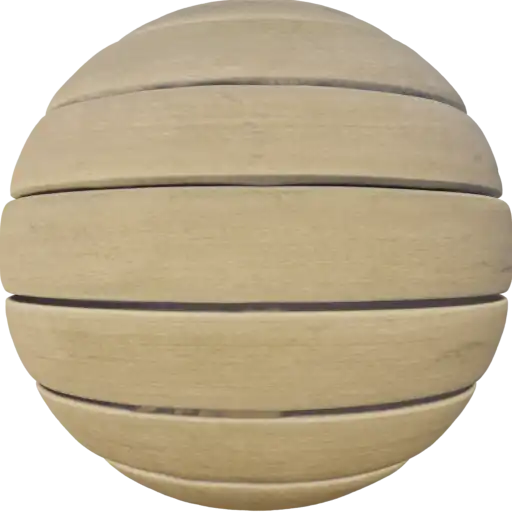

|

**This material is contained in the following Exapacks:**

    - XTRPbr_05k_Vol_001

    - XTRPbr_1k_Vol_001

    - XTRPbr_2k_Vol_004

    - XTRPbr_4k_Vol_011

    - XTRPbr_8k_Vol_010

------------------------------------------------------------------------------------------------------------------------

Wood Planks Beige 012
*********************

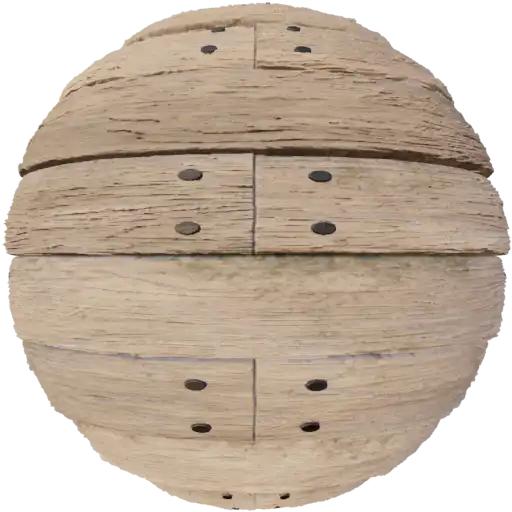

|

**This material is contained in the following Exapacks:**

    - XTRPbr_05k_Vol_001

    - XTRPbr_1k_Vol_001

    - XTRPbr_2k_Vol_004

    - XTRPbr_4k_Vol_011

    - XTRPbr_8k_Vol_010

------------------------------------------------------------------------------------------------------------------------

Wood Planks Beige 013
*********************

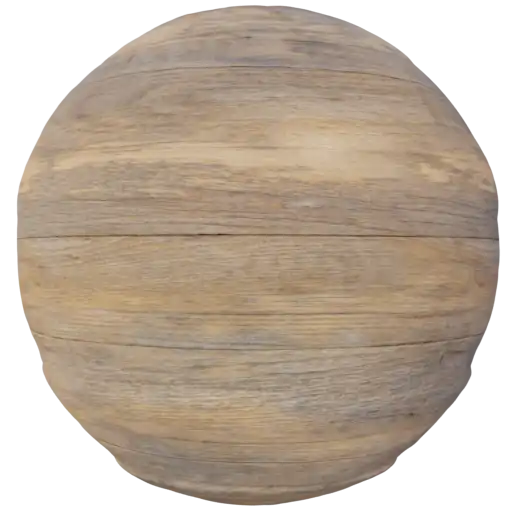

|

**This material is contained in the following Exapacks:**

    - XTRPbr_05k_Vol_001

    - XTRPbr_1k_Vol_001

    - XTRPbr_2k_Vol_004

    - XTRPbr_4k_Vol_011

    - XTRPbr_8k_Vol_010

------------------------------------------------------------------------------------------------------------------------

Wood Planks Brown 001
*********************

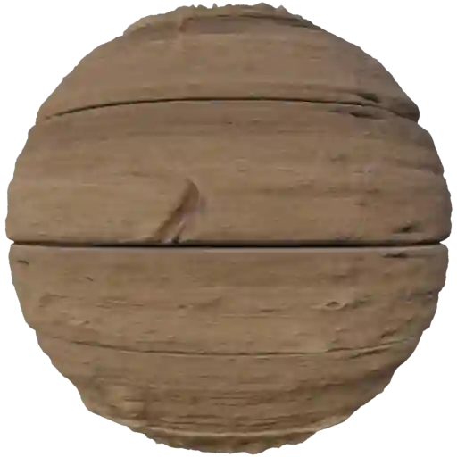

|

**This material is contained in the following Exapacks:**

    - XTRPbr_05k_Vol_001

    - XTRPbr_1k_Vol_001

    - XTRPbr_2k_Vol_004

    - XTRPbr_4k_Vol_011

------------------------------------------------------------------------------------------------------------------------

Wood Planks Brown 002
*********************

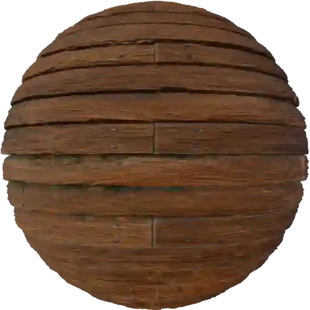

|

**This material is contained in the following Exapacks:**

    - XTRPbr_05k_Vol_001

    - XTRPbr_1k_Vol_001

    - XTRPbr_2k_Vol_004

    - XTRPbr_4k_Vol_011

    - XTRPbr_8k_Vol_010

------------------------------------------------------------------------------------------------------------------------

Wood Planks Brown 003
*********************

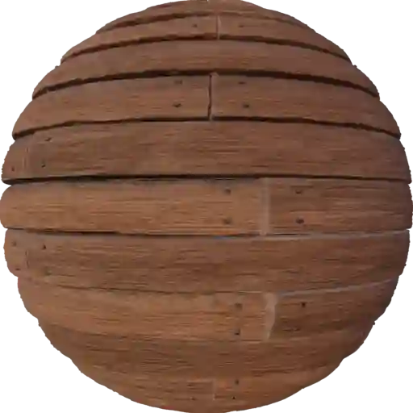

|

**This material is contained in the following Exapacks:**

    - XTRPbr_05k_Vol_001

    - XTRPbr_1k_Vol_001

    - XTRPbr_2k_Vol_004

    - XTRPbr_4k_Vol_011

    - XTRPbr_8k_Vol_010

------------------------------------------------------------------------------------------------------------------------

Wood Planks Brown 004
*********************

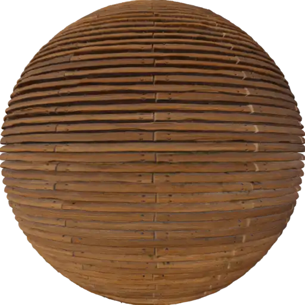

|

**This material is contained in the following Exapacks:**

    - XTRPbr_05k_Vol_001

    - XTRPbr_1k_Vol_001

    - XTRPbr_2k_Vol_004

    - XTRPbr_4k_Vol_011

    - XTRPbr_8k_Vol_010

------------------------------------------------------------------------------------------------------------------------

Wood Planks Brown 005
*********************

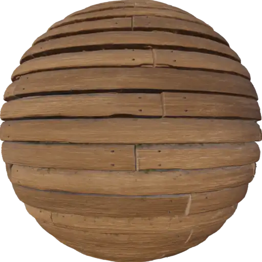

|

**This material is contained in the following Exapacks:**

    - XTRPbr_05k_Vol_001

    - XTRPbr_1k_Vol_001

    - XTRPbr_2k_Vol_004

    - XTRPbr_4k_Vol_011

    - XTRPbr_8k_Vol_010

------------------------------------------------------------------------------------------------------------------------

Wood Planks Brown 006
*********************

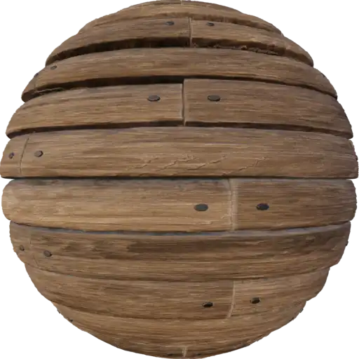

|

**This material is contained in the following Exapacks:**

    - XTRPbr_05k_Vol_001

    - XTRPbr_1k_Vol_001

    - XTRPbr_2k_Vol_004

    - XTRPbr_4k_Vol_011

    - XTRPbr_8k_Vol_010

------------------------------------------------------------------------------------------------------------------------

Wood Planks Brown 007
*********************

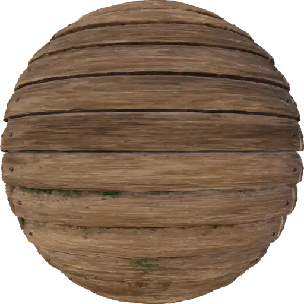

|

**This material is contained in the following Exapacks:**

    - XTRPbr_05k_Vol_001

    - XTRPbr_1k_Vol_001

    - XTRPbr_2k_Vol_004

    - XTRPbr_4k_Vol_011

    - XTRPbr_8k_Vol_010

------------------------------------------------------------------------------------------------------------------------

Wood Planks Brown 008
*********************

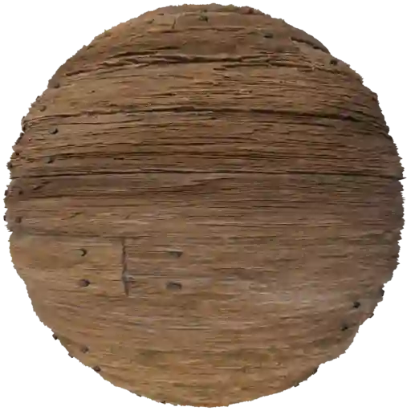

|

**This material is contained in the following Exapacks:**

    - XTRPbr_05k_Vol_001

    - XTRPbr_1k_Vol_001

    - XTRPbr_2k_Vol_004

    - XTRPbr_4k_Vol_011

    - XTRPbr_8k_Vol_010

------------------------------------------------------------------------------------------------------------------------

Wood Planks Brown 009
*********************

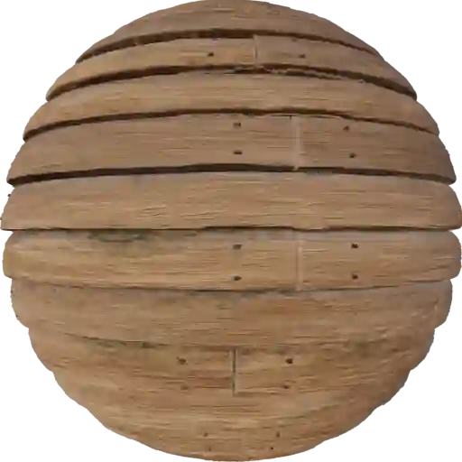

|

**This material is contained in the following Exapacks:**

    - XTRPbr_05k_Vol_001

    - XTRPbr_1k_Vol_001

    - XTRPbr_2k_Vol_004

    - XTRPbr_4k_Vol_011

    - XTRPbr_8k_Vol_010

------------------------------------------------------------------------------------------------------------------------

Wood Planks Brown 010
*********************

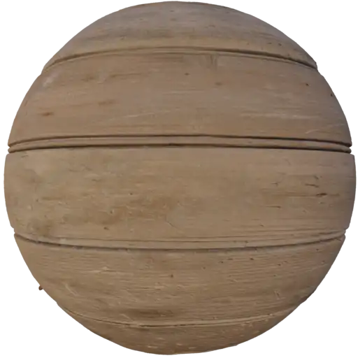

|

**This material is contained in the following Exapacks:**

    - XTRPbr_05k_Vol_001

    - XTRPbr_1k_Vol_001

    - XTRPbr_2k_Vol_004

    - XTRPbr_4k_Vol_011

    - XTRPbr_8k_Vol_010

------------------------------------------------------------------------------------------------------------------------

Wood Planks Brown 011
*********************

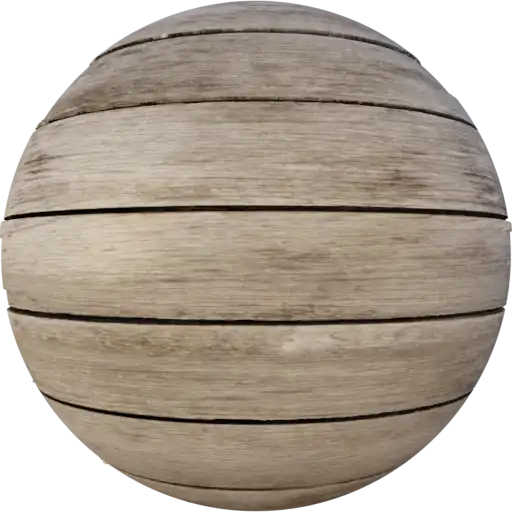

|

**This material is contained in the following Exapacks:**

    - XTRPbr_05k_Vol_001

    - XTRPbr_1k_Vol_001

    - XTRPbr_2k_Vol_004

    - XTRPbr_4k_Vol_011

    - XTRPbr_8k_Vol_010

------------------------------------------------------------------------------------------------------------------------

Wood Planks Brown 012
*********************

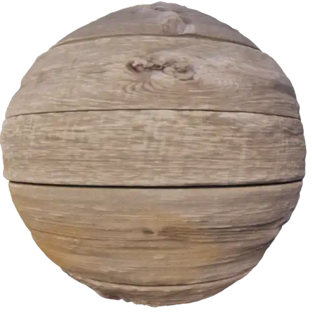

|

**This material is contained in the following Exapacks:**

    - XTRPbr_05k_Vol_001

    - XTRPbr_1k_Vol_001

    - XTRPbr_2k_Vol_004

------------------------------------------------------------------------------------------------------------------------

Wood Planks Green 001
*********************

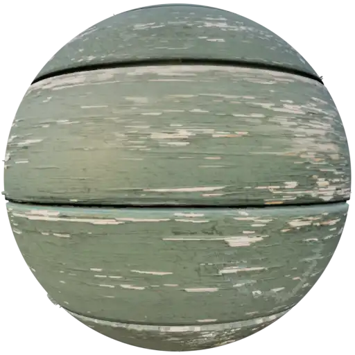

|

**This material is contained in the following Exapacks:**

    - XTRPbr_05k_Vol_001

    - XTRPbr_1k_Vol_001

    - XTRPbr_2k_Vol_004

    - XTRPbr_4k_Vol_011

    - XTRPbr_8k_Vol_010

------------------------------------------------------------------------------------------------------------------------

Wood Planks Green 002
*********************

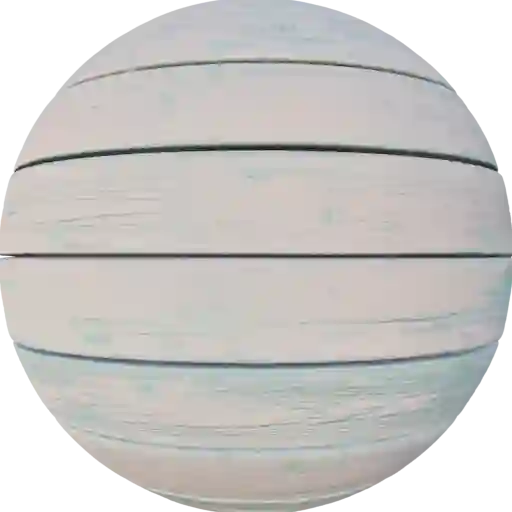

|

**This material is contained in the following Exapacks:**

    - XTRPbr_05k_Vol_001

    - XTRPbr_1k_Vol_001

    - XTRPbr_2k_Vol_004

    - XTRPbr_4k_Vol_011

    - XTRPbr_8k_Vol_010

------------------------------------------------------------------------------------------------------------------------

Wood Planks Green 003
*********************

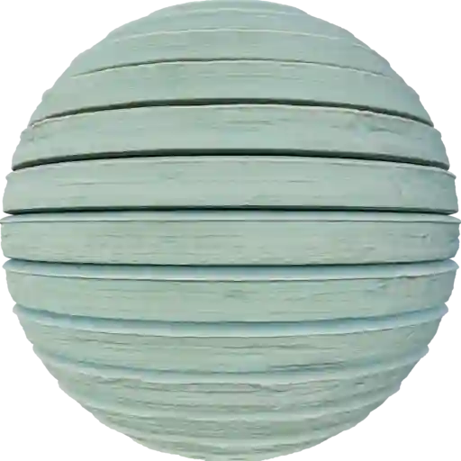

|

**This material is contained in the following Exapacks:**

    - XTRPbr_05k_Vol_001

    - XTRPbr_1k_Vol_001

    - XTRPbr_2k_Vol_004

    - XTRPbr_4k_Vol_011

------------------------------------------------------------------------------------------------------------------------

Wood Planks Green 004
*********************

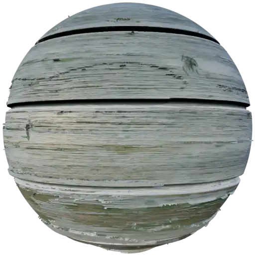

|

**This material is contained in the following Exapacks:**

    - XTRPbr_05k_Vol_001

    - XTRPbr_1k_Vol_001

    - XTRPbr_2k_Vol_004

    - XTRPbr_4k_Vol_011

    - XTRPbr_8k_Vol_010

------------------------------------------------------------------------------------------------------------------------

Wood Planks Grey 001
********************

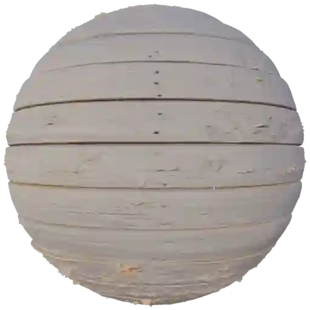

|

**This material is contained in the following Exapacks:**

    - XTRPbr_05k_Vol_001

    - XTRPbr_1k_Vol_001

    - XTRPbr_2k_Vol_004

    - XTRPbr_4k_Vol_011

------------------------------------------------------------------------------------------------------------------------

Wood Planks Medieval 001
************************

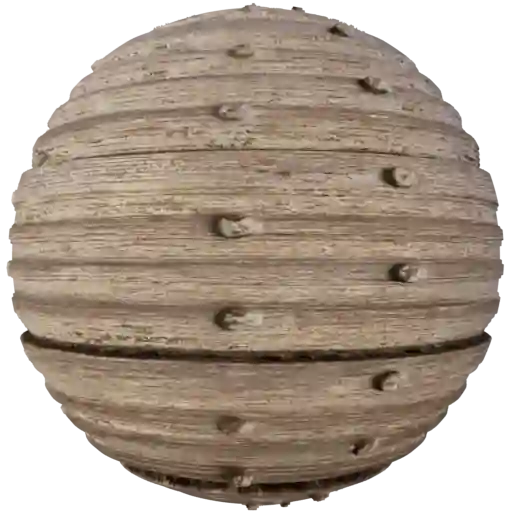

|

**This material is contained in the following Exapacks:**

    - XTRPbr_05k_Vol_001

    - XTRPbr_1k_Vol_001

    - XTRPbr_2k_Vol_004

    - XTRPbr_4k_Vol_011

    - XTRPbr_8k_Vol_010

------------------------------------------------------------------------------------------------------------------------

Wood Planks Moss 001
********************

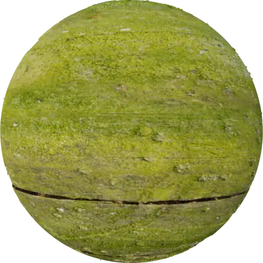

|

**This material is contained in the following Exapacks:**

    - XTRPbr_05k_Vol_001

    - XTRPbr_1k_Vol_001

    - XTRPbr_2k_Vol_004

    - XTRPbr_4k_Vol_011

    - XTRPbr_8k_Vol_010

------------------------------------------------------------------------------------------------------------------------

Wood Planks Moss 002
********************

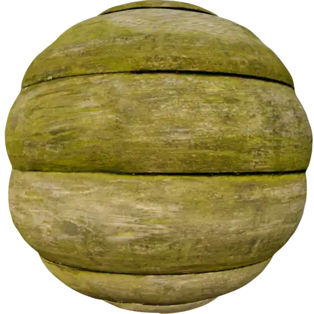

|

**This material is contained in the following Exapacks:**

    - XTRPbr_05k_Vol_001

    - XTRPbr_1k_Vol_001

    - XTRPbr_2k_Vol_004

    - XTRPbr_4k_Vol_011

    - XTRPbr_8k_Vol_010

------------------------------------------------------------------------------------------------------------------------

Wood Planks Moss 003
********************

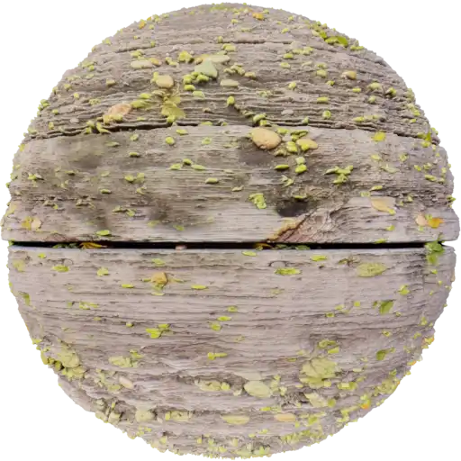

|

**This material is contained in the following Exapacks:**

    - XTRPbr_05k_Vol_001

    - XTRPbr_1k_Vol_001

    - XTRPbr_2k_Vol_004

    - XTRPbr_4k_Vol_011

------------------------------------------------------------------------------------------------------------------------

Wood Planks Moss 004
********************

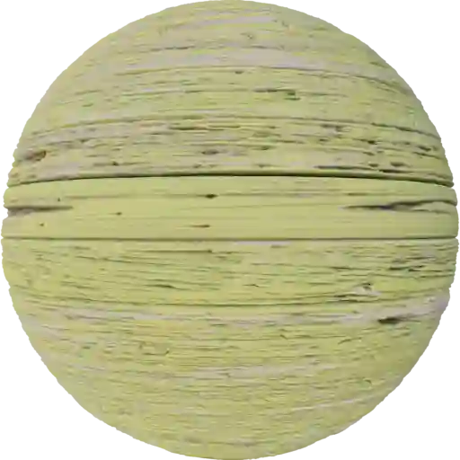

|

**This material is contained in the following Exapacks:**

    - XTRPbr_05k_Vol_001

    - XTRPbr_1k_Vol_001

    - XTRPbr_2k_Vol_004

    - XTRPbr_4k_Vol_011

------------------------------------------------------------------------------------------------------------------------

Wood Planks Red 001
*******************

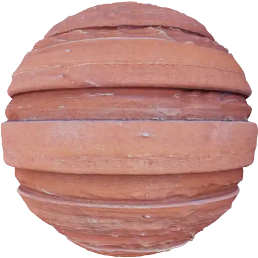

|

**This material is contained in the following Exapacks:**

    - XTRPbr_05k_Vol_001

    - XTRPbr_1k_Vol_001

    - XTRPbr_2k_Vol_004

    - XTRPbr_4k_Vol_011

------------------------------------------------------------------------------------------------------------------------

Wood Planks Red 002
*******************

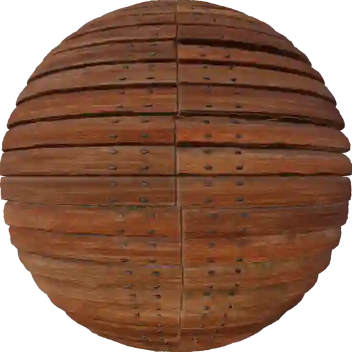

|

**This material is contained in the following Exapacks:**

    - XTRPbr_05k_Vol_001

    - XTRPbr_1k_Vol_001

    - XTRPbr_2k_Vol_004

    - XTRPbr_4k_Vol_011

    - XTRPbr_8k_Vol_010

------------------------------------------------------------------------------------------------------------------------

Wood Planks Red 003
*******************

.. image:: _static/_images/material_list/wood_planks/wood_planks_red_003/wood_planks_red_003.webp
    :width: 30%
    :align: center
    :alt: Wood Planks Red 003

|

**This material is contained in the following Exapacks:**

    - XTRPbr_05k_Vol_001

    - XTRPbr_1k_Vol_001

    - XTRPbr_2k_Vol_004

------------------------------------------------------------------------------------------------------------------------

Wood Planks Red 004
*******************

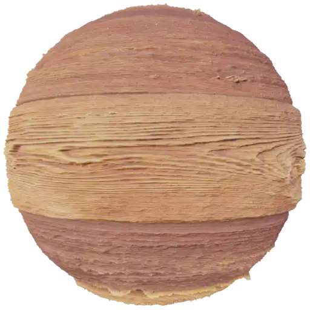

|

**This material is contained in the following Exapacks:**

    - XTRPbr_05k_Vol_001

    - XTRPbr_1k_Vol_001

    - XTRPbr_2k_Vol_004

------------------------------------------------------------------------------------------------------------------------

Wood Planks Red 005
*******************

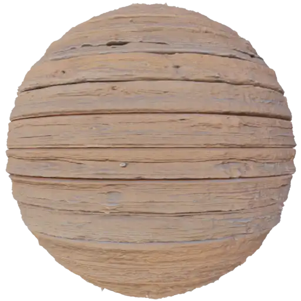

|

**This material is contained in the following Exapacks:**

    - XTRPbr_05k_Vol_001

    - XTRPbr_1k_Vol_001

    - XTRPbr_2k_Vol_004

    - XTRPbr_4k_Vol_011

    - XTRPbr_8k_Vol_010

    - XTRPbr_8k_Vol_031

------------------------------------------------------------------------------------------------------------------------

Wood Planks Walkway 001
***********************

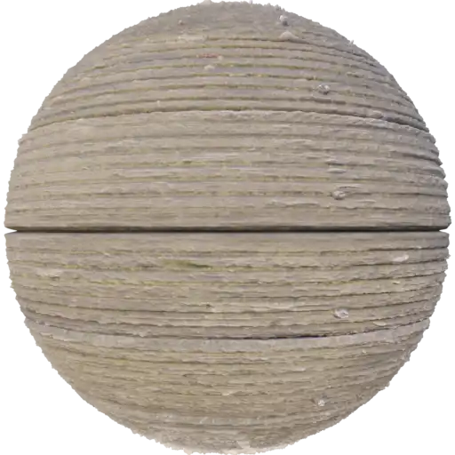

|

**This material is contained in the following Exapacks:**

    - XTRPbr_05k_Vol_001

    - XTRPbr_1k_Vol_001

    - XTRPbr_2k_Vol_004

    - XTRPbr_4k_Vol_011

    - XTRPbr_8k_Vol_031

------------------------------------------------------------------------------------------------------------------------

Wood Planks Yellow 001
**********************

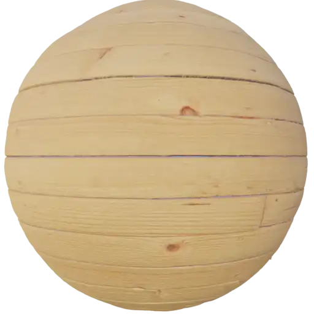

|

**This material is contained in the following Exapacks:**

    - XTRPbr_05k_Vol_001

    - XTRPbr_1k_Vol_001

    - XTRPbr_2k_Vol_004

    - XTRPbr_4k_Vol_011

    - XTRPbr_8k_Vol_031

------------------------------------------------------------------------------------------------------------------------

Wood Planks Yellow 002
**********************

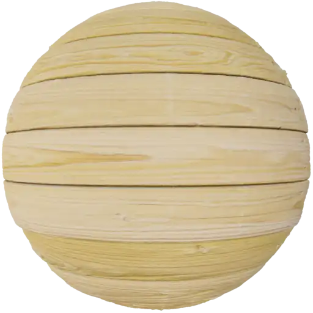

|

**This material is contained in the following Exapacks:**

    - XTRPbr_05k_Vol_001

    - XTRPbr_1k_Vol_001

    - XTRPbr_2k_Vol_004

    - XTRPbr_4k_Vol_011

    - XTRPbr_8k_Vol_031

------------------------------------------------------------------------------------------------------------------------

Wood - Raw (Category)
---------------------

Wood Rustic 001
***************

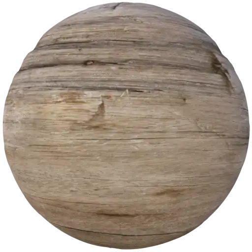

|

**This material is contained in the following Exapacks:**

    - XTRPbr_05k_Vol_001

    - XTRPbr_1k_Vol_001

    - XTRPbr_2k_Vol_004

    - XTRPbr_4k_Vol_011

    - XTRPbr_8k_Vol_031

------------------------------------------------------------------------------------------------------------------------

Wood Rustic 002
***************

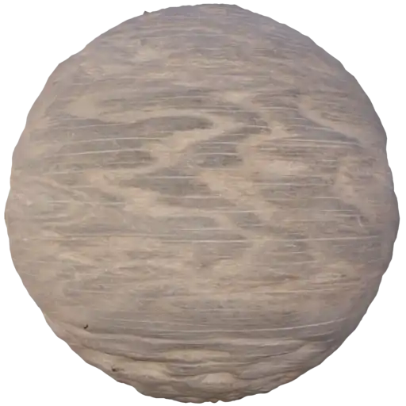

|

**This material is contained in the following Exapacks:**

    - XTRPbr_05k_Vol_001

    - XTRPbr_1k_Vol_001

    - XTRPbr_2k_Vol_004

    - XTRPbr_4k_Vol_011

    - XTRPbr_8k_Vol_031

------------------------------------------------------------------------------------------------------------------------

Wood Rustic 003
***************

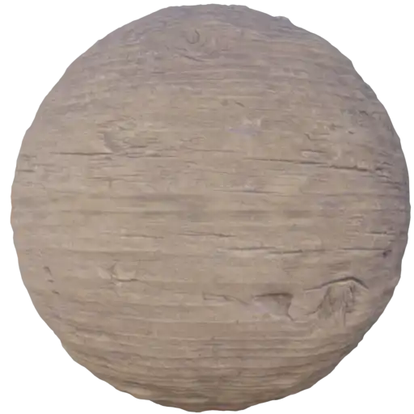

|

**This material is contained in the following Exapacks:**

    - XTRPbr_05k_Vol_001

    - XTRPbr_1k_Vol_001

    - XTRPbr_2k_Vol_004

    - XTRPbr_4k_Vol_011

    - XTRPbr_8k_Vol_031

------------------------------------------------------------------------------------------------------------------------

Wood Rustic 004
***************

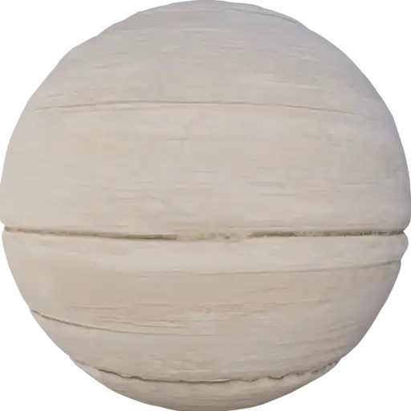

|

**This material is contained in the following Exapacks:**

    - XTRPbr_05k_Vol_001

    - XTRPbr_1k_Vol_001

    - XTRPbr_2k_Vol_004

    - XTRPbr_4k_Vol_011

    - XTRPbr_8k_Vol_031

------------------------------------------------------------------------------------------------------------------------

Wood - Timber (Category)
------------------------

Stacked Wood 01
***************

.. image:: _static/_images/material_list/wood_timber/stacked_wood_01/stacked_wood_01.webp
    :width: 30%
    :align: center
    :alt: Stacked Wood 01

|

**This material is contained in the following Exapacks:**

    - XTRPbr_05k_Vol_001

    - XTRPbr_1k_Vol_001

    - XTRPbr_2k_Vol_004

------------------------------------------------------------------------------------------------------------------------

Trunk Cut 001
*************

.. image:: _static/_images/material_list/wood_timber/trunk_cut_001/trunk_cut_001.webp
    :width: 30%
    :align: center
    :alt: Trunk Cut 001

|

**This material is contained in the following Exapacks:**

    - XTRPbr_05k_Vol_001

    - XTRPbr_1k_Vol_001

    - XTRPbr_2k_Vol_004

------------------------------------------------------------------------------------------------------------------------

Trunk Cut 002
*************

.. image:: _static/_images/material_list/wood_timber/trunk_cut_002/trunk_cut_002.webp
    :width: 30%
    :align: center
    :alt: Trunk Cut 002

|

**This material is contained in the following Exapacks:**

    - XTRPbr_05k_Vol_001

    - XTRPbr_1k_Vol_001

    - XTRPbr_2k_Vol_004

------------------------------------------------------------------------------------------------------------------------

Trunk Cut 003
*************

.. image:: _static/_images/material_list/wood_timber/trunk_cut_003/trunk_cut_003.webp
    :width: 30%
    :align: center
    :alt: Trunk Cut 003

|

**This material is contained in the following Exapacks:**

    - XTRPbr_05k_Vol_001

    - XTRPbr_1k_Vol_001

    - XTRPbr_2k_Vol_004

------------------------------------------------------------------------------------------------------------------------

Trunk Cut 004
*************

.. image:: _static/_images/material_list/wood_timber/trunk_cut_004/trunk_cut_004.webp
    :width: 30%
    :align: center
    :alt: Trunk Cut 004

|

**This material is contained in the following Exapacks:**

    - XTRPbr_05k_Vol_001

    - XTRPbr_1k_Vol_001

    - XTRPbr_2k_Vol_004

------------------------------------------------------------------------------------------------------------------------

Trunk Cut 005
*************

.. image:: _static/_images/material_list/wood_timber/trunk_cut_005/trunk_cut_005.webp
    :width: 30%
    :align: center
    :alt: Trunk Cut 005

|

**This material is contained in the following Exapacks:**

    - XTRPbr_05k_Vol_001

    - XTRPbr_1k_Vol_001

    - XTRPbr_2k_Vol_004

------------------------------------------------------------------------------------------------------------------------

Trunk Cut 006
*************

.. image:: _static/_images/material_list/wood_timber/trunk_cut_006/trunk_cut_006.webp
    :width: 30%
    :align: center
    :alt: Trunk Cut 006

|

**This material is contained in the following Exapacks:**

    - XTRPbr_05k_Vol_001

    - XTRPbr_1k_Vol_001

    - XTRPbr_2k_Vol_004

------------------------------------------------------------------------------------------------------------------------

Trunk Cut 007
*************

.. image:: _static/_images/material_list/wood_timber/trunk_cut_007/trunk_cut_007.webp
    :width: 30%
    :align: center
    :alt: Trunk Cut 007

|

**This material is contained in the following Exapacks:**

    - XTRPbr_05k_Vol_001

    - XTRPbr_1k_Vol_001

    - XTRPbr_2k_Vol_004

------------------------------------------------------------------------------------------------------------------------

Trunk Cut 008
*************

.. image:: _static/_images/material_list/wood_timber/trunk_cut_008/trunk_cut_008.webp
    :width: 30%
    :align: center
    :alt: Trunk Cut 008

|

**This material is contained in the following Exapacks:**

    - XTRPbr_05k_Vol_001

    - XTRPbr_1k_Vol_001

    - XTRPbr_2k_Vol_004

------------------------------------------------------------------------------------------------------------------------

Trunk Cut 009
*************

.. image:: _static/_images/material_list/wood_timber/trunk_cut_009/trunk_cut_009.webp
    :width: 30%
    :align: center
    :alt: Trunk Cut 009

|

**This material is contained in the following Exapacks:**

    - XTRPbr_05k_Vol_001

    - XTRPbr_1k_Vol_001

    - XTRPbr_2k_Vol_004

------------------------------------------------------------------------------------------------------------------------

Trunk Cut 010
*************

.. image:: _static/_images/material_list/wood_timber/trunk_cut_010/trunk_cut_010.webp
    :width: 30%
    :align: center
    :alt: Trunk Cut 010

|

**This material is contained in the following Exapacks:**

    - XTRPbr_05k_Vol_001

    - XTRPbr_1k_Vol_001

    - XTRPbr_2k_Vol_004

------------------------------------------------------------------------------------------------------------------------

Trunk Cut 011
*************

.. image:: _static/_images/material_list/wood_timber/trunk_cut_011/trunk_cut_011.webp
    :width: 30%
    :align: center
    :alt: Trunk Cut 011

|

**This material is contained in the following Exapacks:**

    - XTRPbr_05k_Vol_001

    - XTRPbr_1k_Vol_001

    - XTRPbr_2k_Vol_004

------------------------------------------------------------------------------------------------------------------------

Trunk Cut 012
*************

.. image:: _static/_images/material_list/wood_timber/trunk_cut_012/trunk_cut_012.webp
    :width: 30%
    :align: center
    :alt: Trunk Cut 012

|

**This material is contained in the following Exapacks:**

    - XTRPbr_05k_Vol_001

    - XTRPbr_1k_Vol_001

    - XTRPbr_2k_Vol_004

    - XTRPbr_4k_Vol_011

    - XTRPbr_8k_Vol_031

------------------------------------------------------------------------------------------------------------------------

Wood - Wall (Category)
----------------------

Bamboo Wall 001
***************

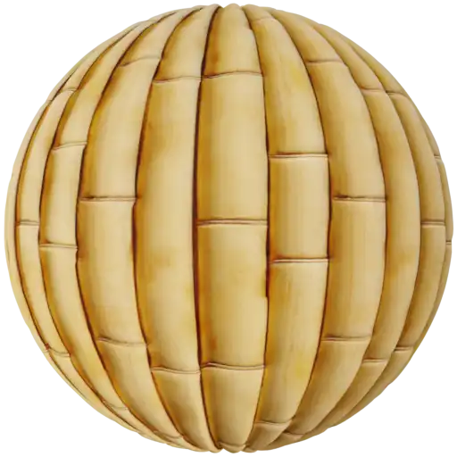

|

**This material is contained in the following Exapacks:**

    - XTRPbr_05k_Vol_001

    - XTRPbr_1k_Vol_001

    - XTRPbr_2k_Vol_004

    - XTRPbr_4k_Vol_011

------------------------------------------------------------------------------------------------------------------------

Beam Wooden Wall 001
********************

|

**This material is contained in the following Exapacks:**

    - XTRPbr_05k_Vol_001

    - XTRPbr_1k_Vol_001

    - XTRPbr_2k_Vol_004

    - XTRPbr_4k_Vol_011

    - XTRPbr_8k_Vol_031

------------------------------------------------------------------------------------------------------------------------

Wood Shingle Siding 001
***********************

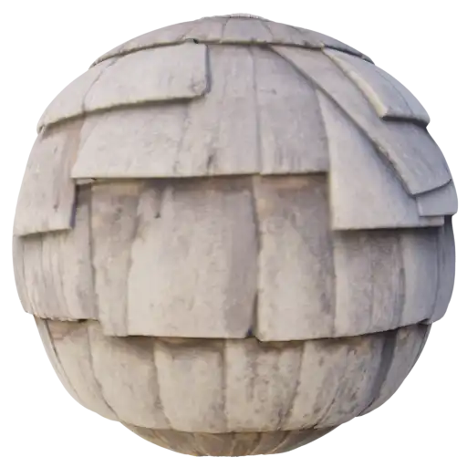

|

**This material is contained in the following Exapacks:**

    - XTRPbr_05k_Vol_001

    - XTRPbr_1k_Vol_001

    - XTRPbr_2k_Vol_004

------------------------------------------------------------------------------------------------------------------------

Wood Shingle Siding 002
***********************

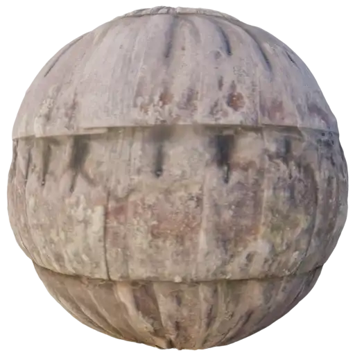

|

**This material is contained in the following Exapacks:**

    - XTRPbr_05k_Vol_001

    - XTRPbr_1k_Vol_001

    - XTRPbr_2k_Vol_004

------------------------------------------------------------------------------------------------------------------------

Wood Shingle Siding 003
***********************

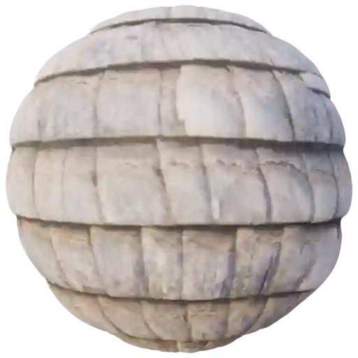

|

**This material is contained in the following Exapacks:**

    - XTRPbr_05k_Vol_001

    - XTRPbr_1k_Vol_001

    - XTRPbr_2k_Vol_004

------------------------------------------------------------------------------------------------------------------------

Wood Shingle Siding 004
***********************

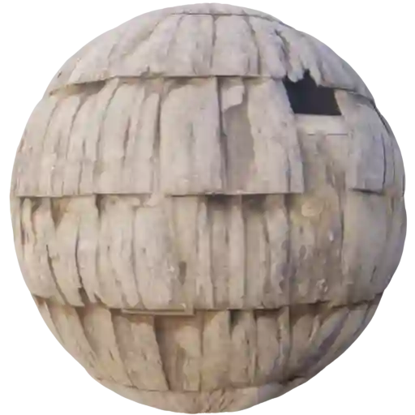

|

**This material is contained in the following Exapacks:**

    - XTRPbr_05k_Vol_001

    - XTRPbr_1k_Vol_001

    - XTRPbr_2k_Vol_004

------------------------------------------------------------------------------------------------------------------------

Wood Siding 001
***************

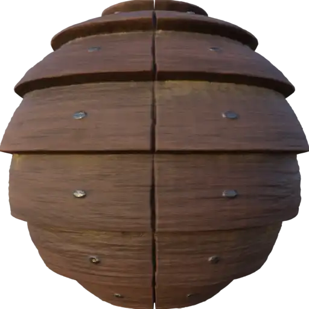

|

**This material is contained in the following Exapacks:**

    - XTRPbr_05k_Vol_001

    - XTRPbr_1k_Vol_001

    - XTRPbr_2k_Vol_004

    - XTRPbr_4k_Vol_011

    - XTRPbr_8k_Vol_031

------------------------------------------------------------------------------------------------------------------------

Wood Siding 002
***************

.. image:: _static/_images/material_list/wood_wall/wood_siding_002/wood_siding_002.webp
    :width: 30%
    :align: center
    :alt: Wood Siding 002

|

**This material is contained in the following Exapacks:**

    - XTRPbr_05k_Vol_001

    - XTRPbr_1k_Vol_001

    - XTRPbr_2k_Vol_004

    - XTRPbr_4k_Vol_011

    - XTRPbr_8k_Vol_031

------------------------------------------------------------------------------------------------------------------------

Wood Siding 003
***************

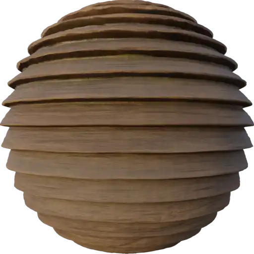

|

**This material is contained in the following Exapacks:**

    - XTRPbr_05k_Vol_001

    - XTRPbr_1k_Vol_001

    - XTRPbr_2k_Vol_004

    - XTRPbr_4k_Vol_011

    - XTRPbr_8k_Vol_031

------------------------------------------------------------------------------------------------------------------------

Wood Siding 004
***************

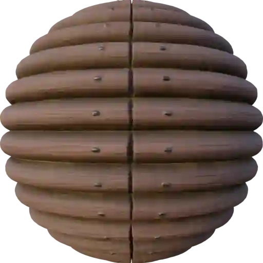

|

**This material is contained in the following Exapacks:**

    - XTRPbr_05k_Vol_001

    - XTRPbr_1k_Vol_001

    - XTRPbr_2k_Vol_004

    - XTRPbr_4k_Vol_011

    - XTRPbr_8k_Vol_031

------------------------------------------------------------------------------------------------------------------------

Wood Siding 005
***************

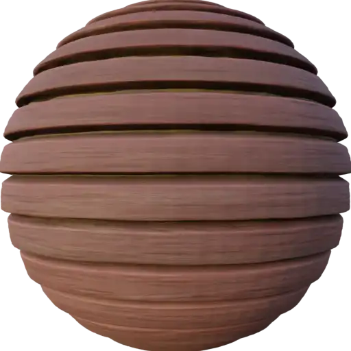

|

**This material is contained in the following Exapacks:**

    - XTRPbr_05k_Vol_001

    - XTRPbr_1k_Vol_001

    - XTRPbr_2k_Vol_004

    - XTRPbr_4k_Vol_011

    - XTRPbr_8k_Vol_031

------------------------------------------------------------------------------------------------------------------------

Wood Siding 006
***************

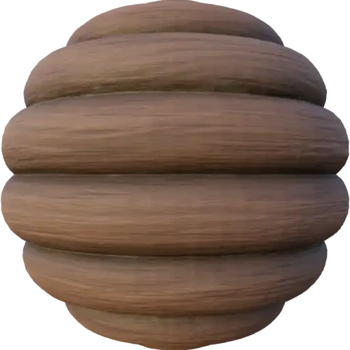

|

**This material is contained in the following Exapacks:**

    - XTRPbr_05k_Vol_001

    - XTRPbr_1k_Vol_001

    - XTRPbr_2k_Vol_004

    - XTRPbr_4k_Vol_011

    - XTRPbr_8k_Vol_031

------------------------------------------------------------------------------------------------------------------------

Wood Siding 007
***************

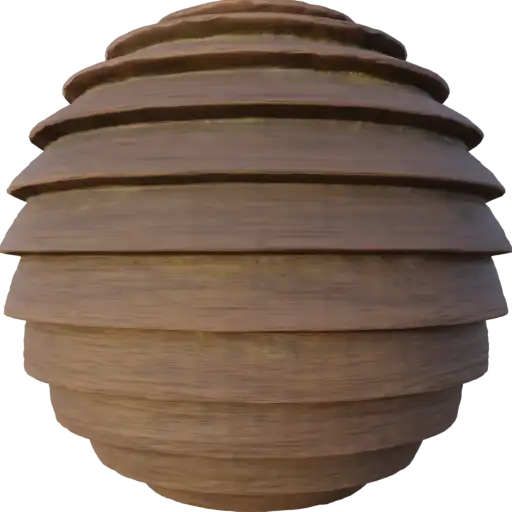

|

**This material is contained in the following Exapacks:**

    - XTRPbr_05k_Vol_001

    - XTRPbr_1k_Vol_001

    - XTRPbr_2k_Vol_004

    - XTRPbr_4k_Vol_011

    - XTRPbr_8k_Vol_031

------------------------------------------------------------------------------------------------------------------------

Wood Siding 008
***************

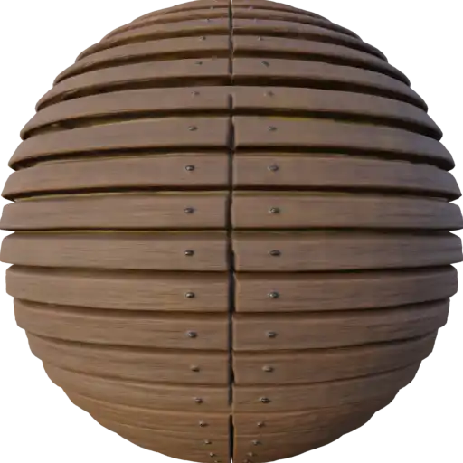

|

**This material is contained in the following Exapacks:**

    - XTRPbr_05k_Vol_001

    - XTRPbr_1k_Vol_001

    - XTRPbr_2k_Vol_004

    - XTRPbr_4k_Vol_011

    - XTRPbr_8k_Vol_031

------------------------------------------------------------------------------------------------------------------------

Wood Siding 009
***************

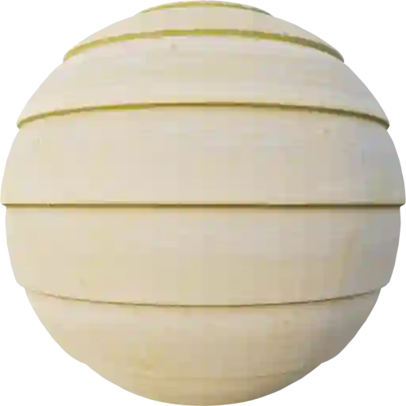

|

**This material is contained in the following Exapacks:**

    - XTRPbr_05k_Vol_001

    - XTRPbr_1k_Vol_001

    - XTRPbr_2k_Vol_004

    - XTRPbr_4k_Vol_011

    - XTRPbr_8k_Vol_031

------------------------------------------------------------------------------------------------------------------------

Wood Siding 010
***************

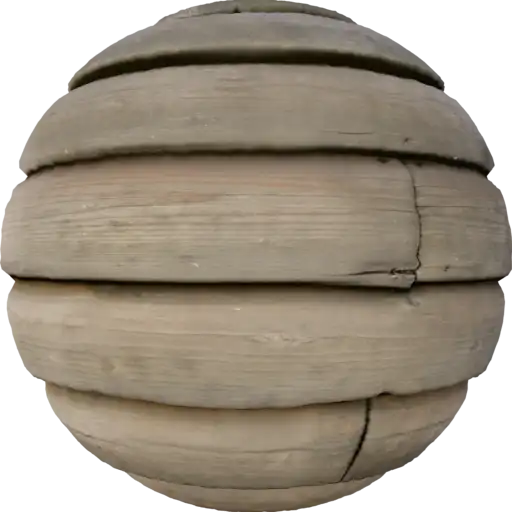

|

**This material is contained in the following Exapacks:**

    - XTRPbr_05k_Vol_001

    - XTRPbr_1k_Vol_001

    - XTRPbr_2k_Vol_004

    - XTRPbr_4k_Vol_011

    - XTRPbr_8k_Vol_031

------------------------------------------------------------------------------------------------------------------------

Wood Siding 011
***************

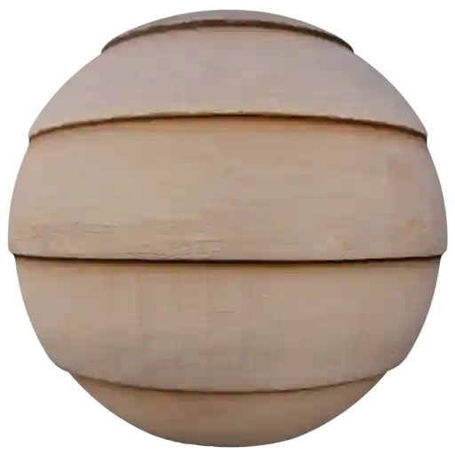

|

**This material is contained in the following Exapacks:**

    - XTRPbr_05k_Vol_001

    - XTRPbr_1k_Vol_001

    - XTRPbr_2k_Vol_004

    - XTRPbr_4k_Vol_011

    - XTRPbr_8k_Vol_031

------------------------------------------------------------------------------------------------------------------------

Wood Siding 012
***************

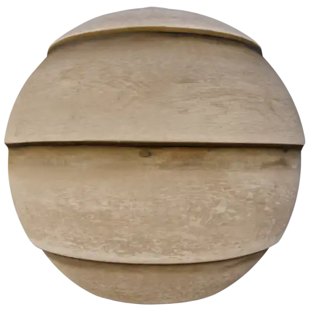

|

**This material is contained in the following Exapacks:**

    - XTRPbr_05k_Vol_001

    - XTRPbr_1k_Vol_001

    - XTRPbr_2k_Vol_004

    - XTRPbr_4k_Vol_011

    - XTRPbr_8k_Vol_031

------------------------------------------------------------------------------------------------------------------------

Wood Siding 013
***************

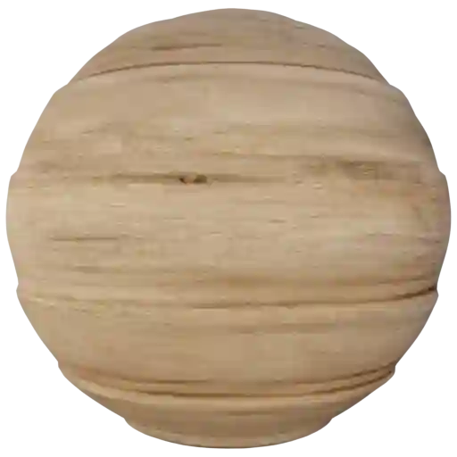

|

**This material is contained in the following Exapacks:**

    - XTRPbr_05k_Vol_001

    - XTRPbr_1k_Vol_001

    - XTRPbr_2k_Vol_004

    - XTRPbr_4k_Vol_011

    - XTRPbr_8k_Vol_031

------------------------------------------------------------------------------------------------------------------------

Wood Siding 014
***************

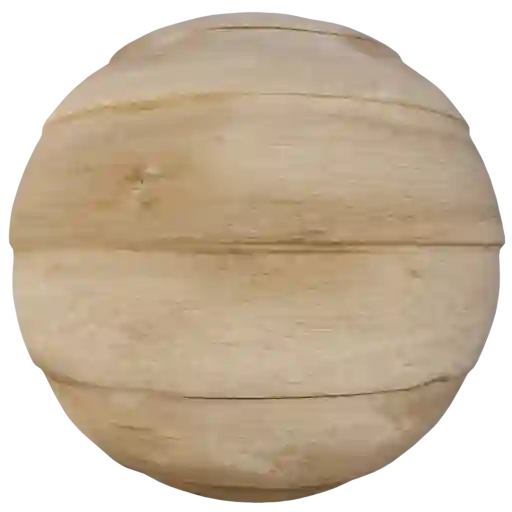

|

**This material is contained in the following Exapacks:**

    - XTRPbr_05k_Vol_001

    - XTRPbr_1k_Vol_001

    - XTRPbr_2k_Vol_004

    - XTRPbr_4k_Vol_011

    - XTRPbr_8k_Vol_031
