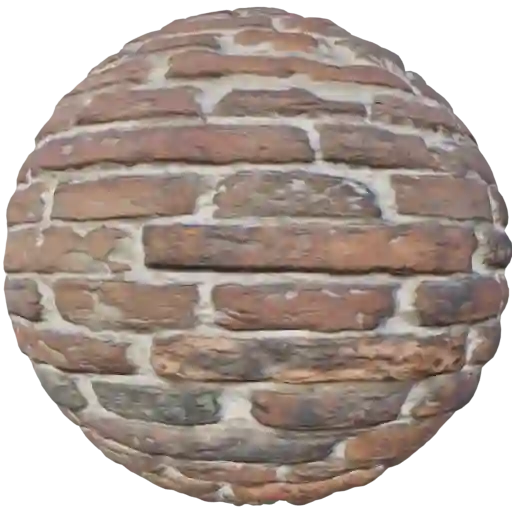
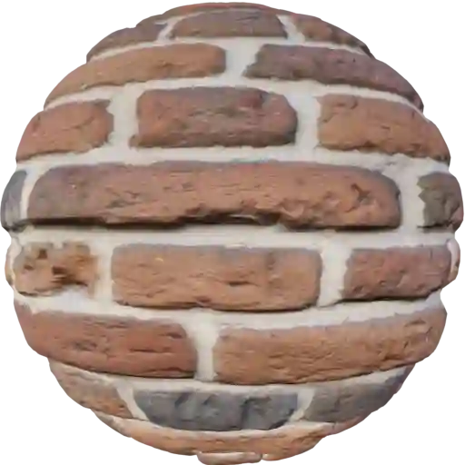
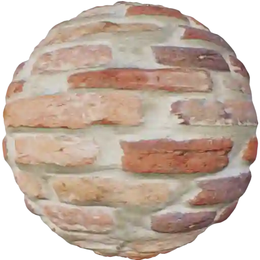
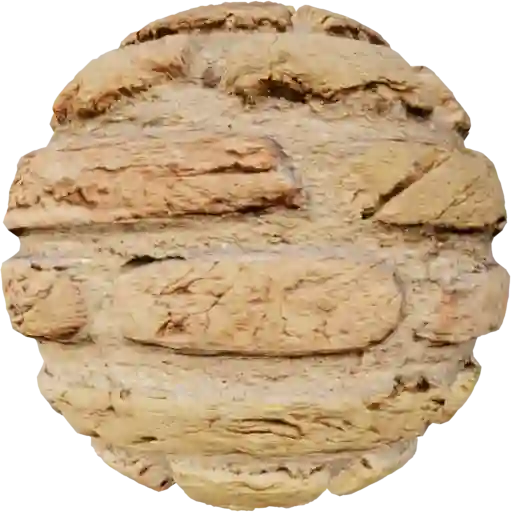

Bricks - Worn (Category)
------------------------

Bricks And Plaster 001
**********************

.. image:: ../_static/_images/material_list/bricks_worn/bricks_and_plaster_001/bricks_and_plaster_001.webp
    :width: 30%
    :align: center
    :alt: Bricks And Plaster 001

|

**This material is contained in the following Exapacks:**

    - XTRPbr_05k_Vol_001
    - XTRPbr_1k_Vol_001
    - XTRPbr_2k_Vol_001
    - XTRPbr_4k_Vol_008
    - XTRPbr_8k_Vol_023

Red Worn Bricks 001
*******************

.. image:: ../_static/_images/material_list/bricks_worn/red_worn_bricks_001/red_worn_bricks_001.webp
    :width: 30%
    :align: center
    :alt: Red Worn Bricks 001

|

**This material is contained in the following Exapacks:**

    - XTRPbr_05k_Vol_001
    - XTRPbr_1k_Vol_001
    - XTRPbr_2k_Vol_001
    - XTRPbr_4k_Vol_003
    - XTRPbr_4k_Vol_008
    - XTRPbr_8k_Vol_023

Red Worn Bricks 002
*******************

.. image:: ../_static/_images/material_list/bricks_worn/red_worn_bricks_002/red_worn_bricks_002.webp
    :width: 30%
    :align: center
    :alt: Red Worn Bricks 002

|

**This material is contained in the following Exapacks:**

    - XTRPbr_05k_Vol_001
    - XTRPbr_1k_Vol_001
    - XTRPbr_2k_Vol_001
    - XTRPbr_4k_Vol_003
    - XTRPbr_8k_Vol_023

Red Worn Bricks 003
*******************

|

**This material is contained in the following Exapacks:**

    - XTRPbr_05k_Vol_001
    - XTRPbr_1k_Vol_001
    - XTRPbr_2k_Vol_001
    - XTRPbr_4k_Vol_003
    - XTRPbr_8k_Vol_013
    - XTRPbr_8k_Vol_023

Red Worn Bricks 004
*******************

.. image:: ../_static/_images/material_list/bricks_worn/red_worn_bricks_004/red_worn_bricks_004.webp
    :width: 30%
    :align: center
    :alt: Red Worn Bricks 004

|

**This material is contained in the following Exapacks:**

    - XTRPbr_05k_Vol_001
    - XTRPbr_1k_Vol_001
    - XTRPbr_2k_Vol_001
    - XTRPbr_4k_Vol_003
    - XTRPbr_8k_Vol_013

Red Worn Bricks 005
*******************

.. image:: ../_static/_images/material_list/bricks_worn/red_worn_bricks_005/red_worn_bricks_005.webp
    :width: 30%
    :align: center
    :alt: Red Worn Bricks 005

|

**This material is contained in the following Exapacks:**

    - XTRPbr_05k_Vol_001
    - XTRPbr_1k_Vol_001
    - XTRPbr_2k_Vol_001
    - XTRPbr_4k_Vol_003

Red Worn Bricks 006
*******************

.. image:: ../_static/_images/material_list/bricks_worn/red_worn_bricks_006/red_worn_bricks_006.webp
    :width: 30%
    :align: center
    :alt: Red Worn Bricks 006

|

**This material is contained in the following Exapacks:**

    - XTRPbr_05k_Vol_001
    - XTRPbr_1k_Vol_001
    - XTRPbr_2k_Vol_001
    - XTRPbr_4k_Vol_003
    - XTRPbr_8k_Vol_013

Red Worn Bricks 007
*******************

.. image:: ../_static/_images/material_list/bricks_worn/red_worn_bricks_007/red_worn_bricks_007.webp
    :width: 30%
    :align: center
    :alt: Red Worn Bricks 007

|

**This material is contained in the following Exapacks:**

    - XTRPbr_05k_Vol_001
    - XTRPbr_1k_Vol_001
    - XTRPbr_2k_Vol_001
    - XTRPbr_4k_Vol_003
    - XTRPbr_8k_Vol_013

Red Worn Bricks 008
*******************

|

**This material is contained in the following Exapacks:**

    - XTRPbr_05k_Vol_001
    - XTRPbr_1k_Vol_001
    - XTRPbr_2k_Vol_001
    - XTRPbr_4k_Vol_003
    - XTRPbr_8k_Vol_013

Red Worn Bricks 009
*******************

.. image:: ../_static/_images/material_list/bricks_worn/red_worn_bricks_009/red_worn_bricks_009.webp
    :width: 30%
    :align: center
    :alt: Red Worn Bricks 009

|

**This material is contained in the following Exapacks:**

    - XTRPbr_05k_Vol_001
    - XTRPbr_1k_Vol_001
    - XTRPbr_2k_Vol_001
    - XTRPbr_4k_Vol_003
    - XTRPbr_8k_Vol_013

Red Worn Bricks 010
*******************

.. image:: ../_static/_images/material_list/bricks_worn/red_worn_bricks_010/red_worn_bricks_010.webp
    :width: 30%
    :align: center
    :alt: Red Worn Bricks 010

|

**This material is contained in the following Exapacks:**

    - XTRPbr_05k_Vol_001
    - XTRPbr_1k_Vol_001
    - XTRPbr_2k_Vol_001
    - XTRPbr_4k_Vol_003
    - XTRPbr_8k_Vol_013

Red Worn Bricks 011
*******************

|

**This material is contained in the following Exapacks:**

    - XTRPbr_05k_Vol_001
    - XTRPbr_1k_Vol_001
    - XTRPbr_2k_Vol_001
    - XTRPbr_4k_Vol_003

Red Worn Bricks 012
*******************

.. image:: ../_static/_images/material_list/bricks_worn/red_worn_bricks_012/red_worn_bricks_012.webp
    :width: 30%
    :align: center
    :alt: Red Worn Bricks 012

|

**This material is contained in the following Exapacks:**

    - XTRPbr_05k_Vol_001
    - XTRPbr_1k_Vol_001
    - XTRPbr_2k_Vol_001
    - XTRPbr_4k_Vol_003
    - XTRPbr_8k_Vol_013

Red Worn Bricks 013
*******************

|

**This material is contained in the following Exapacks:**

    - XTRPbr_05k_Vol_001
    - XTRPbr_1k_Vol_001
    - XTRPbr_2k_Vol_001
    - XTRPbr_4k_Vol_003
    - XTRPbr_8k_Vol_013

Red Worn Bricks 014
*******************

|

**This material is contained in the following Exapacks:**

    - XTRPbr_05k_Vol_001
    - XTRPbr_1k_Vol_001
    - XTRPbr_2k_Vol_001
    - XTRPbr_4k_Vol_003

Red Worn Bricks 015
*******************

.. image:: ../_static/_images/material_list/bricks_worn/red_worn_bricks_015/red_worn_bricks_015.webp
    :width: 30%
    :align: center
    :alt: Red Worn Bricks 015

|

**This material is contained in the following Exapacks:**

    - XTRPbr_05k_Vol_001
    - XTRPbr_1k_Vol_001
    - XTRPbr_2k_Vol_001
    - XTRPbr_4k_Vol_003
    - XTRPbr_8k_Vol_013

Red Worn Bricks 016
*******************

.. image:: ../_static/_images/material_list/bricks_worn/red_worn_bricks_016/red_worn_bricks_016.webp
    :width: 30%
    :align: center
    :alt: Red Worn Bricks 016

|

**This material is contained in the following Exapacks:**

    - XTRPbr_05k_Vol_001
    - XTRPbr_1k_Vol_001
    - XTRPbr_2k_Vol_001
    - XTRPbr_4k_Vol_003
    - XTRPbr_8k_Vol_013

Red Worn Bricks 017
*******************

|

**This material is contained in the following Exapacks:**

    - XTRPbr_05k_Vol_001
    - XTRPbr_1k_Vol_001
    - XTRPbr_2k_Vol_001
    - XTRPbr_4k_Vol_003
    - XTRPbr_8k_Vol_013

Red Worn Bricks 018
*******************

.. image:: ../_static/_images/material_list/bricks_worn/red_worn_bricks_018/red_worn_bricks_018.webp
    :width: 30%
    :align: center
    :alt: Red Worn Bricks 018

|

**This material is contained in the following Exapacks:**

    - XTRPbr_05k_Vol_001
    - XTRPbr_1k_Vol_001
    - XTRPbr_2k_Vol_001

Red Worn Bricks 019
*******************

.. image:: ../_static/_images/material_list/bricks_worn/red_worn_bricks_019/red_worn_bricks_019.webp
    :width: 30%
    :align: center
    :alt: Red Worn Bricks 019

|

**This material is contained in the following Exapacks:**

    - XTRPbr_05k_Vol_001
    - XTRPbr_1k_Vol_001
    - XTRPbr_2k_Vol_001
    - XTRPbr_4k_Vol_003
    - XTRPbr_8k_Vol_013

Red Worn Bricks 020
*******************

.. image:: ../_static/_images/material_list/bricks_worn/red_worn_bricks_020/red_worn_bricks_020.webp
    :width: 30%
    :align: center
    :alt: Red Worn Bricks 020

|

**This material is contained in the following Exapacks:**

    - XTRPbr_05k_Vol_001
    - XTRPbr_1k_Vol_001
    - XTRPbr_2k_Vol_001
    - XTRPbr_4k_Vol_003
    - XTRPbr_8k_Vol_013

Yellow Worn Bricks 001
**********************

.. image:: ../_static/_images/material_list/bricks_worn/yellow_worn_bricks_001/yellow_worn_bricks_001.webp
    :width: 30%
    :align: center
    :alt: Yellow Worn Bricks 001

|

**This material is contained in the following Exapacks:**

    - XTRPbr_05k_Vol_001
    - XTRPbr_1k_Vol_001
    - XTRPbr_2k_Vol_001
    - XTRPbr_4k_Vol_003
    - XTRPbr_8k_Vol_013

Yellow Worn Bricks 002
**********************

|

**This material is contained in the following Exapacks:**

    - XTRPbr_05k_Vol_001
    - XTRPbr_1k_Vol_001
    - XTRPbr_2k_Vol_001
    - XTRPbr_4k_Vol_003

