Concrete - Smooth (Category)
----------------------------

Concrete 001
************

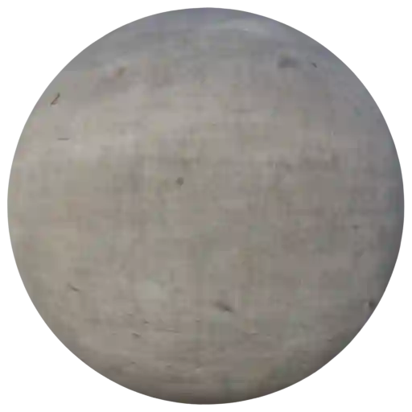

|

**This material is contained in the following Exapacks:**

    - XTRPbr_05k_Vol_001
    - XTRPbr_1k_Vol_001
    - XTRPbr_2k_Vol_001
    - XTRPbr_4k_Vol_003
    - XTRPbr_8k_Vol_017

Concrete 002
************

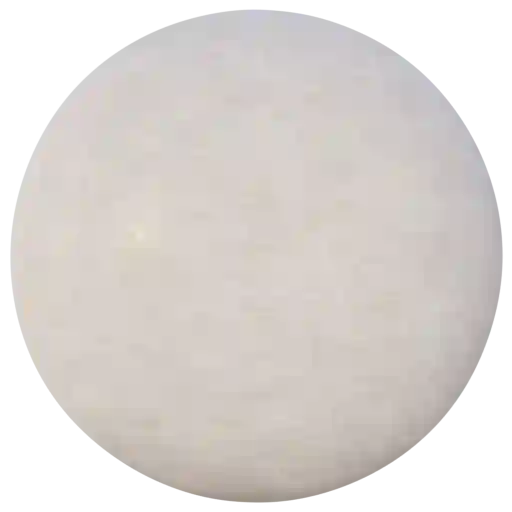

|

**This material is contained in the following Exapacks:**

    - XTRPbr_05k_Vol_001
    - XTRPbr_1k_Vol_001
    - XTRPbr_2k_Vol_001
    - XTRPbr_4k_Vol_003

Concrete 003
************

.. image:: ../_static/_images/material_list/concrete_smooth/concrete_003/concrete_003.webp
    :width: 30%
    :align: center
    :alt: Concrete 003

|

**This material is contained in the following Exapacks:**

    - XTRPbr_05k_Vol_001
    - XTRPbr_1k_Vol_001
    - XTRPbr_2k_Vol_001
    - XTRPbr_4k_Vol_003
    - XTRPbr_8k_Vol_017

Concrete 004
************

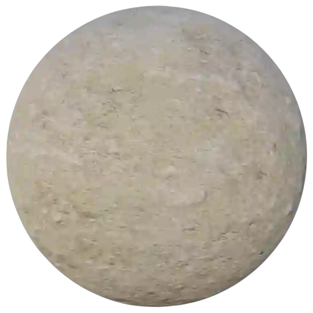

|

**This material is contained in the following Exapacks:**

    - XTRPbr_05k_Vol_001
    - XTRPbr_1k_Vol_001
    - XTRPbr_2k_Vol_001
    - XTRPbr_4k_Vol_003
    - XTRPbr_8k_Vol_017

Concrete 005
************

.. image:: ../_static/_images/material_list/concrete_smooth/concrete_005/concrete_005.webp
    :width: 30%
    :align: center
    :alt: Concrete 005

|

**This material is contained in the following Exapacks:**

    - XTRPbr_05k_Vol_001
    - XTRPbr_1k_Vol_001
    - XTRPbr_2k_Vol_001
    - XTRPbr_4k_Vol_003
    - XTRPbr_8k_Vol_017

Concrete 006
************

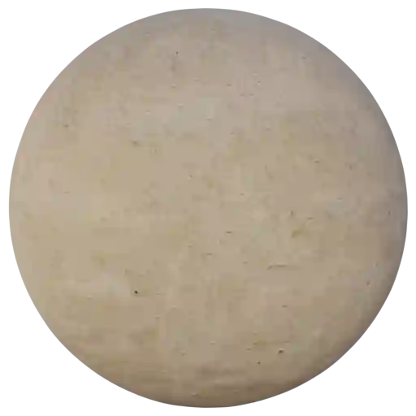

|

**This material is contained in the following Exapacks:**

    - XTRPbr_05k_Vol_001
    - XTRPbr_1k_Vol_001
    - XTRPbr_2k_Vol_001
    - XTRPbr_4k_Vol_003
    - XTRPbr_8k_Vol_017

Concrete 007
************

.. image:: ../_static/_images/material_list/concrete_smooth/concrete_007/concrete_007.webp
    :width: 30%
    :align: center
    :alt: Concrete 007

|

**This material is contained in the following Exapacks:**

    - XTRPbr_05k_Vol_001
    - XTRPbr_1k_Vol_001
    - XTRPbr_2k_Vol_001
    - XTRPbr_4k_Vol_003
    - XTRPbr_8k_Vol_017

Concrete 008
************

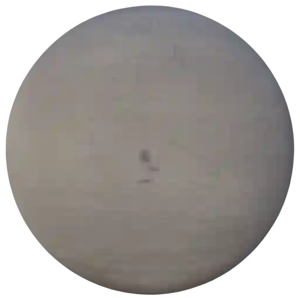

|

**This material is contained in the following Exapacks:**

    - XTRPbr_05k_Vol_001
    - XTRPbr_1k_Vol_001
    - XTRPbr_2k_Vol_001
    - XTRPbr_4k_Vol_003
    - XTRPbr_8k_Vol_017

Concrete 009
************

.. image:: ../_static/_images/material_list/concrete_smooth/concrete_009/concrete_009.webp
    :width: 30%
    :align: center
    :alt: Concrete 009

|

**This material is contained in the following Exapacks:**

    - XTRPbr_05k_Vol_001
    - XTRPbr_1k_Vol_001
    - XTRPbr_2k_Vol_001
    - XTRPbr_4k_Vol_003
    - XTRPbr_8k_Vol_017

Concrete 010
************

.. image:: ../_static/_images/material_list/concrete_smooth/concrete_010/concrete_010.webp
    :width: 30%
    :align: center
    :alt: Concrete 010

|

**This material is contained in the following Exapacks:**

    - XTRPbr_05k_Vol_001
    - XTRPbr_1k_Vol_001
    - XTRPbr_2k_Vol_001
    - XTRPbr_4k_Vol_003
    - XTRPbr_8k_Vol_017

Concrete 011
************

.. image:: ../_static/_images/material_list/concrete_smooth/concrete_011/concrete_011.webp
    :width: 30%
    :align: center
    :alt: Concrete 011

|

**This material is contained in the following Exapacks:**

    - XTRPbr_05k_Vol_001
    - XTRPbr_1k_Vol_001
    - XTRPbr_2k_Vol_001
    - XTRPbr_4k_Vol_003
    - XTRPbr_8k_Vol_001

Concrete 012
************

.. image:: ../_static/_images/material_list/concrete_smooth/concrete_012/concrete_012.webp
    :width: 30%
    :align: center
    :alt: Concrete 012

|

**This material is contained in the following Exapacks:**

    - XTRPbr_05k_Vol_001
    - XTRPbr_1k_Vol_001
    - XTRPbr_2k_Vol_001
    - XTRPbr_4k_Vol_003
    - XTRPbr_8k_Vol_001

Concrete 013
************

.. image:: ../_static/_images/material_list/concrete_smooth/concrete_013/concrete_013.webp
    :width: 30%
    :align: center
    :alt: Concrete 013

|

**This material is contained in the following Exapacks:**

    - XTRPbr_05k_Vol_001
    - XTRPbr_1k_Vol_001
    - XTRPbr_2k_Vol_001
    - XTRPbr_4k_Vol_003
    - XTRPbr_8k_Vol_001

Concrete 014
************

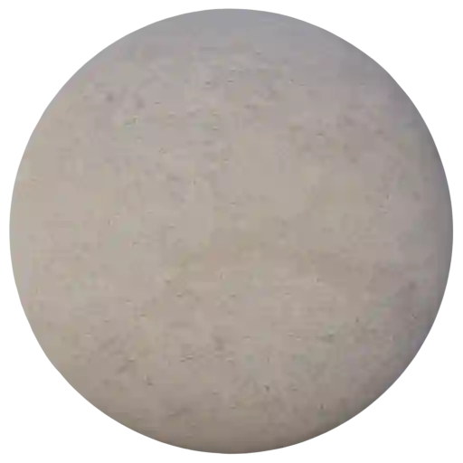

|

**This material is contained in the following Exapacks:**

    - XTRPbr_05k_Vol_001
    - XTRPbr_1k_Vol_001
    - XTRPbr_2k_Vol_001
    - XTRPbr_4k_Vol_003
    - XTRPbr_8k_Vol_001

Concrete 015
************

.. image:: ../_static/_images/material_list/concrete_smooth/concrete_015/concrete_015.webp
    :width: 30%
    :align: center
    :alt: Concrete 015

|

**This material is contained in the following Exapacks:**

    - XTRPbr_05k_Vol_001
    - XTRPbr_1k_Vol_001
    - XTRPbr_2k_Vol_001
    - XTRPbr_4k_Vol_003
    - XTRPbr_8k_Vol_001

Concrete 016
************

.. image:: ../_static/_images/material_list/concrete_smooth/concrete_016/concrete_016.webp
    :width: 30%
    :align: center
    :alt: Concrete 016

|

**This material is contained in the following Exapacks:**

    - XTRPbr_05k_Vol_001
    - XTRPbr_1k_Vol_001
    - XTRPbr_2k_Vol_001
    - XTRPbr_4k_Vol_003
    - XTRPbr_8k_Vol_001

Concrete 017
************

.. image:: ../_static/_images/material_list/concrete_smooth/concrete_017/concrete_017.webp
    :width: 30%
    :align: center
    :alt: Concrete 017

|

**This material is contained in the following Exapacks:**

    - XTRPbr_05k_Vol_001
    - XTRPbr_1k_Vol_001
    - XTRPbr_2k_Vol_001
    - XTRPbr_4k_Vol_003

Concrete 018
************

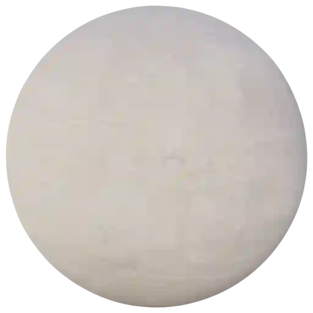

|

**This material is contained in the following Exapacks:**

    - XTRPbr_05k_Vol_001
    - XTRPbr_1k_Vol_001
    - XTRPbr_2k_Vol_001
    - XTRPbr_4k_Vol_003
    - XTRPbr_8k_Vol_001

Concrete 019
************

.. image:: ../_static/_images/material_list/concrete_smooth/concrete_019/concrete_019.webp
    :width: 30%
    :align: center
    :alt: Concrete 019

|

**This material is contained in the following Exapacks:**

    - XTRPbr_05k_Vol_001
    - XTRPbr_1k_Vol_001
    - XTRPbr_2k_Vol_001

Concrete 020
************

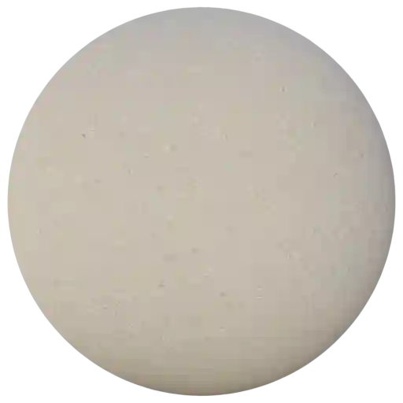

|

**This material is contained in the following Exapacks:**

    - XTRPbr_05k_Vol_001
    - XTRPbr_1k_Vol_001
    - XTRPbr_2k_Vol_001
    - XTRPbr_4k_Vol_003

Concrete 021
************

.. image:: ../_static/_images/material_list/concrete_smooth/concrete_021/concrete_021.webp
    :width: 30%
    :align: center
    :alt: Concrete 021

|

**This material is contained in the following Exapacks:**

    - XTRPbr_05k_Vol_001
    - XTRPbr_1k_Vol_001
    - XTRPbr_2k_Vol_001
    - XTRPbr_4k_Vol_003

Concrete 022
************

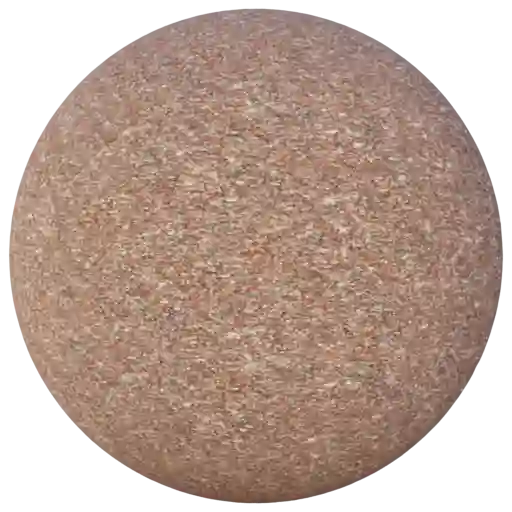

|

**This material is contained in the following Exapacks:**

    - XTRPbr_05k_Vol_001
    - XTRPbr_1k_Vol_001
    - XTRPbr_2k_Vol_001
    - XTRPbr_4k_Vol_003

Concrete 023
************

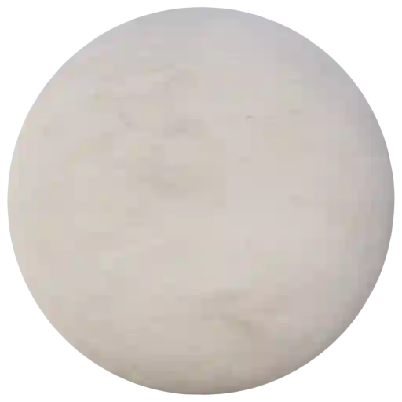

|

**This material is contained in the following Exapacks:**

    - XTRPbr_05k_Vol_001
    - XTRPbr_1k_Vol_001
    - XTRPbr_2k_Vol_001
    - XTRPbr_4k_Vol_003

Concrete 024
************

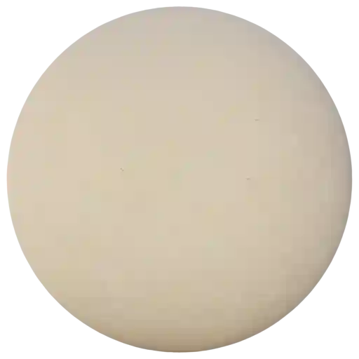

|

**This material is contained in the following Exapacks:**

    - XTRPbr_05k_Vol_001
    - XTRPbr_1k_Vol_001
    - XTRPbr_2k_Vol_001
    - XTRPbr_4k_Vol_003

Concrete 025
************

.. image:: ../_static/_images/material_list/concrete_smooth/concrete_025/concrete_025.webp
    :width: 30%
    :align: center
    :alt: Concrete 025

|

**This material is contained in the following Exapacks:**

    - XTRPbr_05k_Vol_001
    - XTRPbr_1k_Vol_001
    - XTRPbr_2k_Vol_001
    - XTRPbr_4k_Vol_003

Concrete Grunge Wall 01
***********************

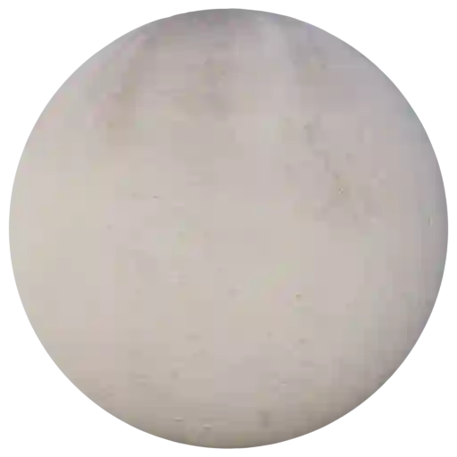

|

**This material is contained in the following Exapacks:**

    - XTRPbr_05k_Vol_001
    - XTRPbr_1k_Vol_001
    - XTRPbr_2k_Vol_001

