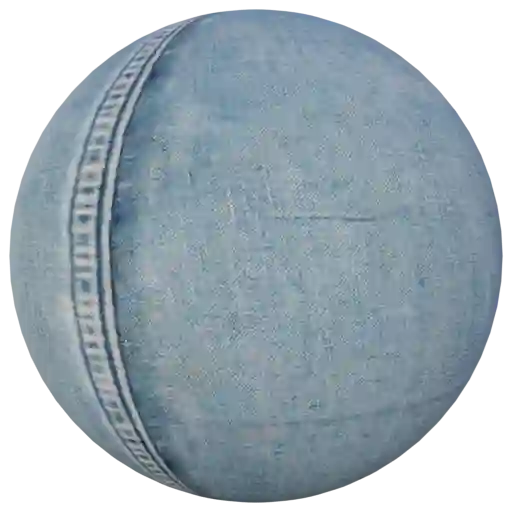

Fabric - Jeans (Category)
-------------------------

Jeans 001
*********

.. image:: ../_static/_images/material_list/fabric_jeans/jeans_001/jeans_001.webp
    :width: 30%
    :align: center
    :alt: Jeans 001

|

**This material is contained in the following Exapacks:**

    - XTRPbr_05k_Vol_001
    - XTRPbr_1k_Vol_001
    - XTRPbr_2k_Vol_001

Jeans 002
*********

.. image:: ../_static/_images/material_list/fabric_jeans/jeans_002/jeans_002.webp
    :width: 30%
    :align: center
    :alt: Jeans 002

|

**This material is contained in the following Exapacks:**

    - XTRPbr_05k_Vol_001
    - XTRPbr_1k_Vol_001
    - XTRPbr_2k_Vol_001
    - XTRPbr_4k_Vol_001

Jeans 003
*********

.. image:: ../_static/_images/material_list/fabric_jeans/jeans_003/jeans_003.webp
    :width: 30%
    :align: center
    :alt: Jeans 003

|

**This material is contained in the following Exapacks:**

    - XTRPbr_05k_Vol_001
    - XTRPbr_1k_Vol_001
    - XTRPbr_2k_Vol_001
    - XTRPbr_4k_Vol_001

Jeans 004
*********

.. image:: ../_static/_images/material_list/fabric_jeans/jeans_004/jeans_004.webp
    :width: 30%
    :align: center
    :alt: Jeans 004

|

**This material is contained in the following Exapacks:**

    - XTRPbr_05k_Vol_001
    - XTRPbr_1k_Vol_001
    - XTRPbr_2k_Vol_001
    - XTRPbr_4k_Vol_001

Jeans 005
*********

.. image:: ../_static/_images/material_list/fabric_jeans/jeans_005/jeans_005.webp
    :width: 30%
    :align: center
    :alt: Jeans 005

|

**This material is contained in the following Exapacks:**

    - XTRPbr_05k_Vol_001
    - XTRPbr_1k_Vol_001
    - XTRPbr_2k_Vol_001
    - XTRPbr_4k_Vol_001

Jeans 006
*********

.. image:: ../_static/_images/material_list/fabric_jeans/jeans_006/jeans_006.webp
    :width: 30%
    :align: center
    :alt: Jeans 006

|

**This material is contained in the following Exapacks:**

    - XTRPbr_05k_Vol_001
    - XTRPbr_1k_Vol_001
    - XTRPbr_2k_Vol_001

Jeans 007
*********

.. image:: ../_static/_images/material_list/fabric_jeans/jeans_007/jeans_007.webp
    :width: 30%
    :align: center
    :alt: Jeans 007

|

**This material is contained in the following Exapacks:**

    - XTRPbr_05k_Vol_001
    - XTRPbr_1k_Vol_001
    - XTRPbr_2k_Vol_001

Jeans 008
*********

.. image:: ../_static/_images/material_list/fabric_jeans/jeans_008/jeans_008.webp
    :width: 30%
    :align: center
    :alt: Jeans 008

|

**This material is contained in the following Exapacks:**

    - XTRPbr_05k_Vol_001
    - XTRPbr_1k_Vol_001
    - XTRPbr_2k_Vol_001

Jeans 009
*********

.. image:: ../_static/_images/material_list/fabric_jeans/jeans_009/jeans_009.webp
    :width: 30%
    :align: center
    :alt: Jeans 009

|

**This material is contained in the following Exapacks:**

    - XTRPbr_05k_Vol_001
    - XTRPbr_1k_Vol_001
    - XTRPbr_2k_Vol_001
    - XTRPbr_4k_Vol_001
    - XTRPbr_8k_Vol_020

Jeans 010
*********

|

**This material is contained in the following Exapacks:**

    - XTRPbr_05k_Vol_001
    - XTRPbr_1k_Vol_001
    - XTRPbr_2k_Vol_001
    - XTRPbr_4k_Vol_001
    - XTRPbr_8k_Vol_020

