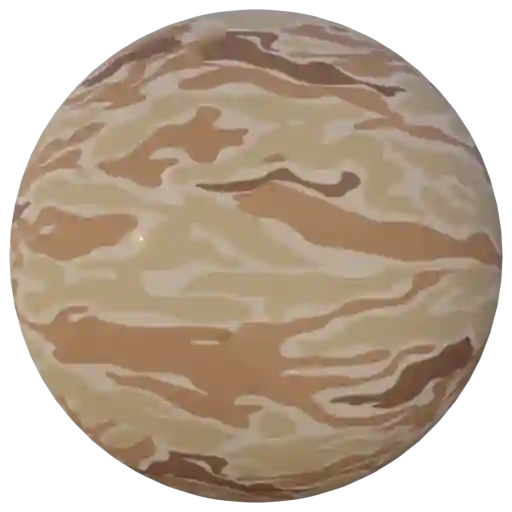
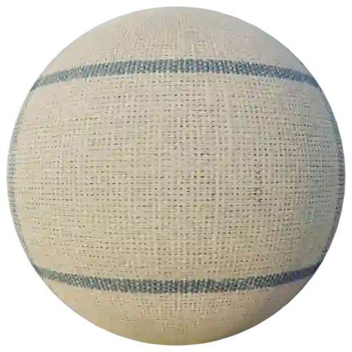
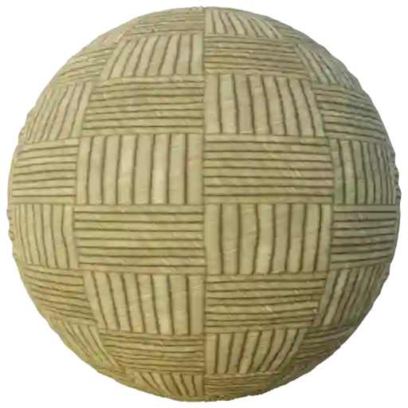
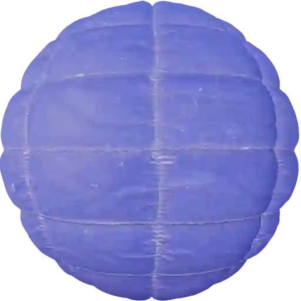
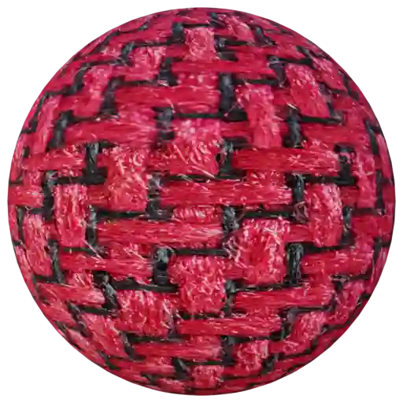

Fabric - Pattern (Category)
---------------------------

Camouflage 001
**************

.. image:: ../_static/_images/material_list/fabric_pattern/camouflage_001/camouflage_001.webp
    :width: 30%
    :align: center
    :alt: Camouflage 001

|

**This material is contained in the following Exapacks:**

    - XTRPbr_05k_Vol_001
    - XTRPbr_1k_Vol_001
    - XTRPbr_2k_Vol_001
    - XTRPbr_4k_Vol_001

Camouflage 002
**************

|

**This material is contained in the following Exapacks:**

    - XTRPbr_05k_Vol_001
    - XTRPbr_1k_Vol_001
    - XTRPbr_2k_Vol_001
    - XTRPbr_4k_Vol_001

Fabric Checkered 001
********************

.. image:: ../_static/_images/material_list/fabric_pattern/fabric_checkered_001/fabric_checkered_001.webp
    :width: 30%
    :align: center
    :alt: Fabric Checkered 001

|

**This material is contained in the following Exapacks:**

    - XTRPbr_05k_Vol_001
    - XTRPbr_1k_Vol_001
    - XTRPbr_2k_Vol_001
    - XTRPbr_4k_Vol_001
    - XTRPbr_8k_Vol_020

Fabric Checkered 002
********************

.. image:: ../_static/_images/material_list/fabric_pattern/fabric_checkered_002/fabric_checkered_002.webp
    :width: 30%
    :align: center
    :alt: Fabric Checkered 002

|

**This material is contained in the following Exapacks:**

    - XTRPbr_05k_Vol_001
    - XTRPbr_1k_Vol_001
    - XTRPbr_2k_Vol_001
    - XTRPbr_4k_Vol_001
    - XTRPbr_8k_Vol_020

Fabric Checkered 003
********************

.. image:: ../_static/_images/material_list/fabric_pattern/fabric_checkered_003/fabric_checkered_003.webp
    :width: 30%
    :align: center
    :alt: Fabric Checkered 003

|

**This material is contained in the following Exapacks:**

    - XTRPbr_05k_Vol_001
    - XTRPbr_1k_Vol_001
    - XTRPbr_2k_Vol_001
    - XTRPbr_4k_Vol_001
    - XTRPbr_8k_Vol_020

Fabric Pattern 001
******************

|

**This material is contained in the following Exapacks:**

    - XTRPbr_05k_Vol_001
    - XTRPbr_1k_Vol_001
    - XTRPbr_2k_Vol_001
    - XTRPbr_4k_Vol_001
    - XTRPbr_8k_Vol_020

Fabric Pattern 002
******************

.. image:: ../_static/_images/material_list/fabric_pattern/fabric_pattern_002/fabric_pattern_002.webp
    :width: 30%
    :align: center
    :alt: Fabric Pattern 002

|

**This material is contained in the following Exapacks:**

    - XTRPbr_05k_Vol_001
    - XTRPbr_1k_Vol_001
    - XTRPbr_2k_Vol_001
    - XTRPbr_4k_Vol_001
    - XTRPbr_8k_Vol_020

Fabric Pattern 003
******************

.. image:: ../_static/_images/material_list/fabric_pattern/fabric_pattern_003/fabric_pattern_003.webp
    :width: 30%
    :align: center
    :alt: Fabric Pattern 003

|

**This material is contained in the following Exapacks:**

    - XTRPbr_05k_Vol_001
    - XTRPbr_1k_Vol_001
    - XTRPbr_2k_Vol_001
    - XTRPbr_4k_Vol_001
    - XTRPbr_8k_Vol_020

Fabric007
*********

.. image:: ../_static/_images/material_list/fabric_pattern/fabric007/fabric007.webp
    :width: 30%
    :align: center
    :alt: Fabric007

|

**This material is contained in the following Exapacks:**

    - XTRPbr_05k_Vol_001
    - XTRPbr_1k_Vol_001
    - XTRPbr_2k_Vol_001
    - XTRPbr_4k_Vol_001

Fabric008
*********

.. image:: ../_static/_images/material_list/fabric_pattern/fabric008/fabric008.webp
    :width: 30%
    :align: center
    :alt: Fabric008

|

**This material is contained in the following Exapacks:**

    - XTRPbr_05k_Vol_001
    - XTRPbr_1k_Vol_001
    - XTRPbr_2k_Vol_001
    - XTRPbr_4k_Vol_001

Fabric009
*********

.. image:: ../_static/_images/material_list/fabric_pattern/fabric009/fabric009.webp
    :width: 30%
    :align: center
    :alt: Fabric009

|

**This material is contained in the following Exapacks:**

    - XTRPbr_05k_Vol_001
    - XTRPbr_1k_Vol_001
    - XTRPbr_2k_Vol_001
    - XTRPbr_4k_Vol_001

Fabric024
*********

.. image:: ../_static/_images/material_list/fabric_pattern/fabric024/fabric024.webp
    :width: 30%
    :align: center
    :alt: Fabric024

|

**This material is contained in the following Exapacks:**

    - XTRPbr_05k_Vol_001
    - XTRPbr_1k_Vol_001
    - XTRPbr_2k_Vol_001
    - XTRPbr_4k_Vol_001
    - XTRPbr_8k_Vol_020

Fabric025
*********

.. image:: ../_static/_images/material_list/fabric_pattern/fabric025/fabric025.webp
    :width: 30%
    :align: center
    :alt: Fabric025

|

**This material is contained in the following Exapacks:**

    - XTRPbr_05k_Vol_001
    - XTRPbr_1k_Vol_001
    - XTRPbr_2k_Vol_001
    - XTRPbr_4k_Vol_001
    - XTRPbr_8k_Vol_020

Fabric027
*********

|

**This material is contained in the following Exapacks:**

    - XTRPbr_05k_Vol_001
    - XTRPbr_1k_Vol_001
    - XTRPbr_2k_Vol_001
    - XTRPbr_4k_Vol_001
    - XTRPbr_8k_Vol_020

Fabric046
*********

|

**This material is contained in the following Exapacks:**

    - XTRPbr_05k_Vol_001
    - XTRPbr_1k_Vol_001
    - XTRPbr_2k_Vol_001
    - XTRPbr_4k_Vol_001
    - XTRPbr_4k_Vol_006
    - XTRPbr_8k_Vol_020

Fabric047
*********

.. image:: ../_static/_images/material_list/fabric_pattern/fabric047/fabric047.webp
    :width: 30%
    :align: center
    :alt: Fabric047

|

**This material is contained in the following Exapacks:**

    - XTRPbr_05k_Vol_001
    - XTRPbr_1k_Vol_001
    - XTRPbr_2k_Vol_001
    - XTRPbr_4k_Vol_006
    - XTRPbr_8k_Vol_020

Fabric048
*********

.. image:: ../_static/_images/material_list/fabric_pattern/fabric048/fabric048.webp
    :width: 30%
    :align: center
    :alt: Fabric048

|

**This material is contained in the following Exapacks:**

    - XTRPbr_05k_Vol_001
    - XTRPbr_1k_Vol_001
    - XTRPbr_2k_Vol_001
    - XTRPbr_4k_Vol_006
    - XTRPbr_8k_Vol_002
    - XTRPbr_8k_Vol_020

Fabric049
*********

.. image:: ../_static/_images/material_list/fabric_pattern/fabric049/fabric049.webp
    :width: 30%
    :align: center
    :alt: Fabric049

|

**This material is contained in the following Exapacks:**

    - XTRPbr_05k_Vol_001
    - XTRPbr_1k_Vol_001
    - XTRPbr_2k_Vol_001
    - XTRPbr_4k_Vol_006
    - XTRPbr_8k_Vol_002

Fabric_Plastic
**************

|

**This material is contained in the following Exapacks:**

    - XTRPbr_05k_Vol_001
    - XTRPbr_1k_Vol_001
    - XTRPbr_2k_Vol_001
    - XTRPbr_4k_Vol_006

