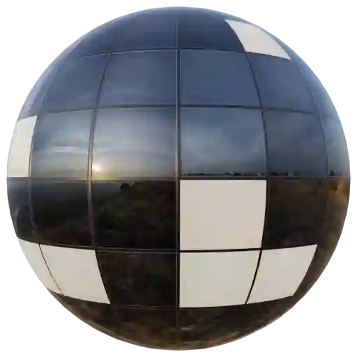
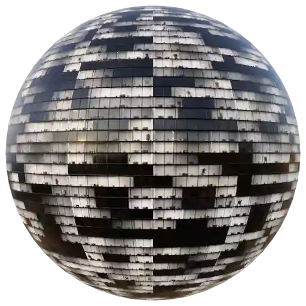
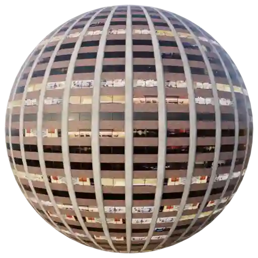
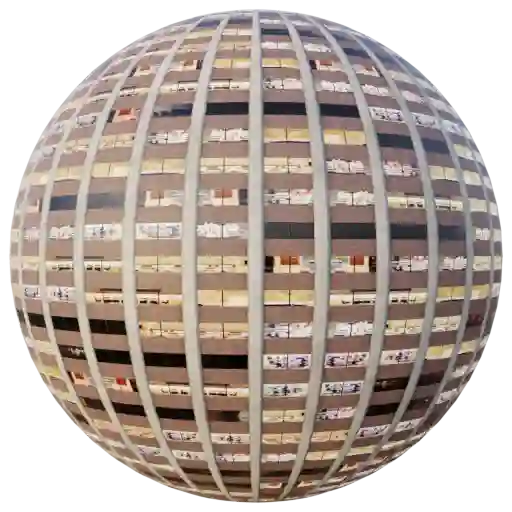

Facade (Category)
-----------------

Windows Facade 001
******************

.. image:: ../_static/_images/material_list/facade/windows_facade_001/windows_facade_001.webp
    :width: 30%
    :align: center
    :alt: Windows Facade 001

|

**This material is contained in the following Exapacks:**

    - XTRPbr_05k_Vol_001
    - XTRPbr_1k_Vol_001
    - XTRPbr_2k_Vol_001
    - XTRPbr_4k_Vol_006

Windows Facade 002
******************

|

**This material is contained in the following Exapacks:**

    - XTRPbr_05k_Vol_001
    - XTRPbr_1k_Vol_001
    - XTRPbr_2k_Vol_001
    - XTRPbr_4k_Vol_006

Windows Facade 003
******************

.. image:: ../_static/_images/material_list/facade/windows_facade_003/windows_facade_003.webp
    :width: 30%
    :align: center
    :alt: Windows Facade 003

|

**This material is contained in the following Exapacks:**

    - XTRPbr_05k_Vol_001
    - XTRPbr_1k_Vol_001
    - XTRPbr_2k_Vol_001
    - XTRPbr_4k_Vol_006

Windows Facade 004
******************

.. image:: ../_static/_images/material_list/facade/windows_facade_004/windows_facade_004.webp
    :width: 30%
    :align: center
    :alt: Windows Facade 004

|

**This material is contained in the following Exapacks:**

    - XTRPbr_05k_Vol_001
    - XTRPbr_1k_Vol_001
    - XTRPbr_2k_Vol_001
    - XTRPbr_4k_Vol_006

Windows Facade 005
******************

.. image:: ../_static/_images/material_list/facade/windows_facade_005/windows_facade_005.webp
    :width: 30%
    :align: center
    :alt: Windows Facade 005

|

**This material is contained in the following Exapacks:**

    - XTRPbr_05k_Vol_001
    - XTRPbr_1k_Vol_001
    - XTRPbr_2k_Vol_001
    - XTRPbr_4k_Vol_006

Windows Facade 006
******************

.. image:: ../_static/_images/material_list/facade/windows_facade_006/windows_facade_006.webp
    :width: 30%
    :align: center
    :alt: Windows Facade 006

|

**This material is contained in the following Exapacks:**

    - XTRPbr_05k_Vol_001
    - XTRPbr_1k_Vol_001
    - XTRPbr_2k_Vol_001
    - XTRPbr_4k_Vol_006

Windows Facade 007
******************

.. image:: ../_static/_images/material_list/facade/windows_facade_007/windows_facade_007.webp
    :width: 30%
    :align: center
    :alt: Windows Facade 007

|

**This material is contained in the following Exapacks:**

    - XTRPbr_05k_Vol_001
    - XTRPbr_1k_Vol_001
    - XTRPbr_2k_Vol_001
    - XTRPbr_4k_Vol_006
    - XTRPbr_8k_Vol_002

Windows Facade 008
******************

.. image:: ../_static/_images/material_list/facade/windows_facade_008/windows_facade_008.webp
    :width: 30%
    :align: center
    :alt: Windows Facade 008

|

**This material is contained in the following Exapacks:**

    - XTRPbr_05k_Vol_001
    - XTRPbr_1k_Vol_001
    - XTRPbr_2k_Vol_001
    - XTRPbr_4k_Vol_006
    - XTRPbr_8k_Vol_002

Windows Facade 009
******************

.. image:: ../_static/_images/material_list/facade/windows_facade_009/windows_facade_009.webp
    :width: 30%
    :align: center
    :alt: Windows Facade 009

|

**This material is contained in the following Exapacks:**

    - XTRPbr_05k_Vol_001
    - XTRPbr_1k_Vol_001
    - XTRPbr_2k_Vol_001
    - XTRPbr_4k_Vol_006
    - XTRPbr_8k_Vol_002

Windows Facade 010
******************

|

**This material is contained in the following Exapacks:**

    - XTRPbr_05k_Vol_001
    - XTRPbr_1k_Vol_001
    - XTRPbr_2k_Vol_001
    - XTRPbr_4k_Vol_006
    - XTRPbr_8k_Vol_002

Windows Facade 011
******************

.. image:: ../_static/_images/material_list/facade/windows_facade_011/windows_facade_011.webp
    :width: 30%
    :align: center
    :alt: Windows Facade 011

|

**This material is contained in the following Exapacks:**

    - XTRPbr_05k_Vol_001
    - XTRPbr_1k_Vol_001
    - XTRPbr_2k_Vol_001
    - XTRPbr_4k_Vol_006
    - XTRPbr_8k_Vol_002

Windows Facade 012
******************

|

**This material is contained in the following Exapacks:**

    - XTRPbr_05k_Vol_001
    - XTRPbr_1k_Vol_001
    - XTRPbr_2k_Vol_001
    - XTRPbr_4k_Vol_006
    - XTRPbr_8k_Vol_002

Windows Facade 013
******************

|

**This material is contained in the following Exapacks:**

    - XTRPbr_05k_Vol_001
    - XTRPbr_1k_Vol_001
    - XTRPbr_2k_Vol_001
    - XTRPbr_4k_Vol_006
    - XTRPbr_8k_Vol_002

Windows Facade 014
******************

.. image:: ../_static/_images/material_list/facade/windows_facade_014/windows_facade_014.webp
    :width: 30%
    :align: center
    :alt: Windows Facade 014

|

**This material is contained in the following Exapacks:**

    - XTRPbr_05k_Vol_001
    - XTRPbr_1k_Vol_001
    - XTRPbr_2k_Vol_001
    - XTRPbr_4k_Vol_006
    - XTRPbr_8k_Vol_002

Windows Facade 015
******************

.. image:: ../_static/_images/material_list/facade/windows_facade_015/windows_facade_015.webp
    :width: 30%
    :align: center
    :alt: Windows Facade 015

|

**This material is contained in the following Exapacks:**

    - XTRPbr_05k_Vol_001
    - XTRPbr_1k_Vol_001
    - XTRPbr_2k_Vol_001
    - XTRPbr_4k_Vol_006
    - XTRPbr_8k_Vol_002

Windows Facade 016
******************

.. image:: ../_static/_images/material_list/facade/windows_facade_016/windows_facade_016.webp
    :width: 30%
    :align: center
    :alt: Windows Facade 016

|

**This material is contained in the following Exapacks:**

    - XTRPbr_05k_Vol_001
    - XTRPbr_1k_Vol_001
    - XTRPbr_2k_Vol_001
    - XTRPbr_4k_Vol_006
    - XTRPbr_8k_Vol_002

Windows Facade 017
******************

|

**This material is contained in the following Exapacks:**

    - XTRPbr_05k_Vol_001
    - XTRPbr_1k_Vol_001
    - XTRPbr_2k_Vol_001
    - XTRPbr_4k_Vol_006
    - XTRPbr_8k_Vol_002

