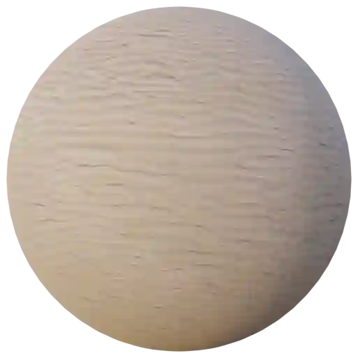
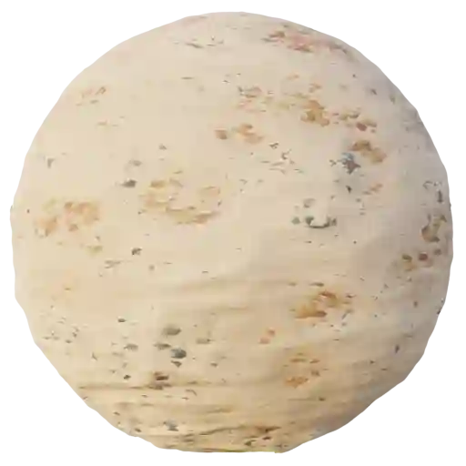

Ground - Sandy (Category)
-------------------------

Sand Coarse 001
***************

.. image:: ../_static/_images/material_list/ground_sandy/sand_coarse_001/sand_coarse_001.webp
    :width: 30%
    :align: center
    :alt: Sand Coarse 001

|

**This material is contained in the following Exapacks:**

    - XTRPbr_05k_Vol_001
    - XTRPbr_1k_Vol_001
    - XTRPbr_2k_Vol_003
    - XTRPbr_4k_Vol_006

Sand Coarse 002
***************

.. image:: ../_static/_images/material_list/ground_sandy/sand_coarse_002/sand_coarse_002.webp
    :width: 30%
    :align: center
    :alt: Sand Coarse 002

|

**This material is contained in the following Exapacks:**

    - XTRPbr_05k_Vol_001
    - XTRPbr_1k_Vol_001
    - XTRPbr_2k_Vol_003
    - XTRPbr_4k_Vol_006
    - XTRPbr_8k_Vol_027

Sand Coarse 003
***************

.. image:: ../_static/_images/material_list/ground_sandy/sand_coarse_003/sand_coarse_003.webp
    :width: 30%
    :align: center
    :alt: Sand Coarse 003

|

**This material is contained in the following Exapacks:**

    - XTRPbr_05k_Vol_001
    - XTRPbr_1k_Vol_001
    - XTRPbr_2k_Vol_003
    - XTRPbr_4k_Vol_006
    - XTRPbr_8k_Vol_027

Sand Coarse 004
***************

.. image:: ../_static/_images/material_list/ground_sandy/sand_coarse_004/sand_coarse_004.webp
    :width: 30%
    :align: center
    :alt: Sand Coarse 004

|

**This material is contained in the following Exapacks:**

    - XTRPbr_05k_Vol_001
    - XTRPbr_1k_Vol_001
    - XTRPbr_2k_Vol_003

Sand Fine 001
*************

|

**This material is contained in the following Exapacks:**

    - XTRPbr_05k_Vol_001
    - XTRPbr_1k_Vol_001
    - XTRPbr_2k_Vol_003
    - XTRPbr_4k_Vol_006
    - XTRPbr_8k_Vol_027

Sand Fine 002
*************

.. image:: ../_static/_images/material_list/ground_sandy/sand_fine_002/sand_fine_002.webp
    :width: 30%
    :align: center
    :alt: Sand Fine 002

|

**This material is contained in the following Exapacks:**

    - XTRPbr_05k_Vol_001
    - XTRPbr_1k_Vol_001
    - XTRPbr_2k_Vol_003
    - XTRPbr_4k_Vol_006
    - XTRPbr_8k_Vol_027

Sand Fine 003
*************

.. image:: ../_static/_images/material_list/ground_sandy/sand_fine_003/sand_fine_003.webp
    :width: 30%
    :align: center
    :alt: Sand Fine 003

|

**This material is contained in the following Exapacks:**

    - XTRPbr_05k_Vol_001
    - XTRPbr_1k_Vol_001
    - XTRPbr_2k_Vol_003
    - XTRPbr_4k_Vol_006
    - XTRPbr_8k_Vol_027

Sand Fine 004
*************

.. image:: ../_static/_images/material_list/ground_sandy/sand_fine_004/sand_fine_004.webp
    :width: 30%
    :align: center
    :alt: Sand Fine 004

|

**This material is contained in the following Exapacks:**

    - XTRPbr_05k_Vol_001
    - XTRPbr_1k_Vol_001
    - XTRPbr_2k_Vol_003
    - XTRPbr_4k_Vol_006
    - XTRPbr_8k_Vol_027

Sand Fine 005
*************

.. image:: ../_static/_images/material_list/ground_sandy/sand_fine_005/sand_fine_005.webp
    :width: 30%
    :align: center
    :alt: Sand Fine 005

|

**This material is contained in the following Exapacks:**

    - XTRPbr_05k_Vol_001
    - XTRPbr_1k_Vol_001
    - XTRPbr_2k_Vol_003
    - XTRPbr_4k_Vol_006
    - XTRPbr_8k_Vol_027

Sand Fine 006
*************

|

**This material is contained in the following Exapacks:**

    - XTRPbr_05k_Vol_001
    - XTRPbr_1k_Vol_001
    - XTRPbr_2k_Vol_003
    - XTRPbr_4k_Vol_006
    - XTRPbr_8k_Vol_027

Sand Fine 007
*************

.. image:: ../_static/_images/material_list/ground_sandy/sand_fine_007/sand_fine_007.webp
    :width: 30%
    :align: center
    :alt: Sand Fine 007

|

**This material is contained in the following Exapacks:**

    - XTRPbr_05k_Vol_001
    - XTRPbr_1k_Vol_001
    - XTRPbr_2k_Vol_003
    - XTRPbr_4k_Vol_006
    - XTRPbr_8k_Vol_027

