Ground - Soil (Category)
------------------------

Burned Soil 01
**************

.. image:: ../_static/_images/material_list/ground_soil/burned_soil_01/burned_soil_01.webp
    :width: 30%
    :align: center
    :alt: Burned Soil 01

|

**This material is contained in the following Exapacks:**

    - XTRPbr_05k_Vol_001
    - XTRPbr_1k_Vol_001
    - XTRPbr_2k_Vol_003
    - XTRPbr_4k_Vol_006
    - XTRPbr_8k_Vol_027

Dry Soil 001
************

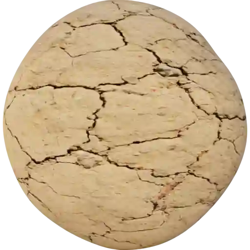

|

**This material is contained in the following Exapacks:**

    - XTRPbr_05k_Vol_001
    - XTRPbr_1k_Vol_001
    - XTRPbr_2k_Vol_003
    - XTRPbr_4k_Vol_006

Dry Soil 002
************

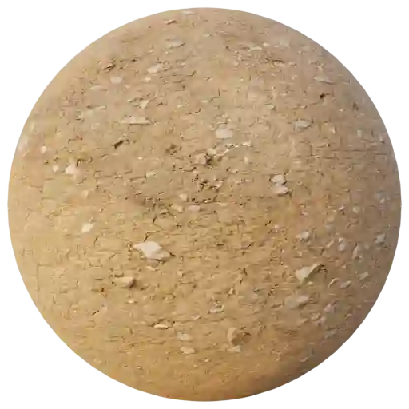

|

**This material is contained in the following Exapacks:**

    - XTRPbr_05k_Vol_001
    - XTRPbr_1k_Vol_001
    - XTRPbr_2k_Vol_003
    - XTRPbr_4k_Vol_006
    - XTRPbr_8k_Vol_027

Dry Soil 003
************

.. image:: ../_static/_images/material_list/ground_soil/dry_soil_003/dry_soil_003.webp
    :width: 30%
    :align: center
    :alt: Dry Soil 003

|

**This material is contained in the following Exapacks:**

    - XTRPbr_05k_Vol_001
    - XTRPbr_1k_Vol_001
    - XTRPbr_2k_Vol_003
    - XTRPbr_4k_Vol_006
    - XTRPbr_8k_Vol_027

Dry Soil 004
************

.. image:: ../_static/_images/material_list/ground_soil/dry_soil_004/dry_soil_004.webp
    :width: 30%
    :align: center
    :alt: Dry Soil 004

|

**This material is contained in the following Exapacks:**

    - XTRPbr_05k_Vol_001
    - XTRPbr_1k_Vol_001
    - XTRPbr_2k_Vol_003
    - XTRPbr_4k_Vol_006
    - XTRPbr_8k_Vol_027

Dry Soil 005
************

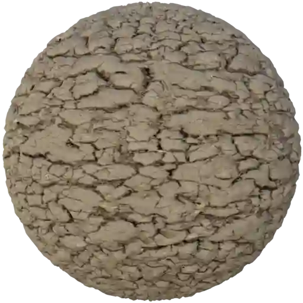

|

**This material is contained in the following Exapacks:**

    - XTRPbr_05k_Vol_001
    - XTRPbr_1k_Vol_001
    - XTRPbr_2k_Vol_003
    - XTRPbr_4k_Vol_006

Dry Soil 006
************

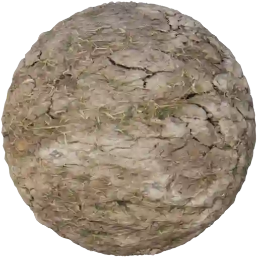

|

**This material is contained in the following Exapacks:**

    - XTRPbr_05k_Vol_001
    - XTRPbr_1k_Vol_001
    - XTRPbr_2k_Vol_003
    - XTRPbr_4k_Vol_006

Soil 001
********

.. image:: ../_static/_images/material_list/ground_soil/soil_001/soil_001.webp
    :width: 30%
    :align: center
    :alt: Soil 001

|

**This material is contained in the following Exapacks:**

    - XTRPbr_05k_Vol_001
    - XTRPbr_1k_Vol_001
    - XTRPbr_2k_Vol_003
    - XTRPbr_4k_Vol_006
    - XTRPbr_8k_Vol_028

Soil 002
********

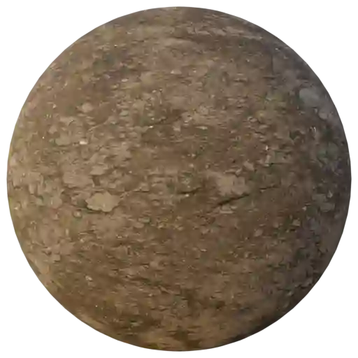

|

**This material is contained in the following Exapacks:**

    - XTRPbr_05k_Vol_001
    - XTRPbr_1k_Vol_001
    - XTRPbr_2k_Vol_003
    - XTRPbr_4k_Vol_006
    - XTRPbr_8k_Vol_028

Soil 003
********

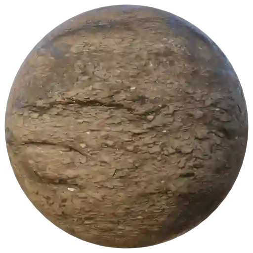

|

**This material is contained in the following Exapacks:**

    - XTRPbr_05k_Vol_001
    - XTRPbr_1k_Vol_001
    - XTRPbr_2k_Vol_003
    - XTRPbr_4k_Vol_006
    - XTRPbr_8k_Vol_028

Soil 004
********

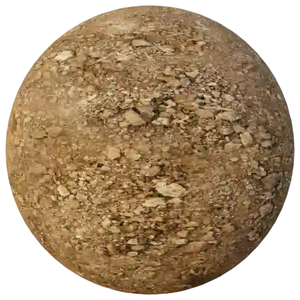

|

**This material is contained in the following Exapacks:**

    - XTRPbr_05k_Vol_001
    - XTRPbr_1k_Vol_001
    - XTRPbr_2k_Vol_003
    - XTRPbr_4k_Vol_006
    - XTRPbr_8k_Vol_028

Soil 005
********

.. image:: ../_static/_images/material_list/ground_soil/soil_005/soil_005.webp
    :width: 30%
    :align: center
    :alt: Soil 005

|

**This material is contained in the following Exapacks:**

    - XTRPbr_05k_Vol_001
    - XTRPbr_1k_Vol_001
    - XTRPbr_2k_Vol_003
    - XTRPbr_4k_Vol_006

Soil 006
********

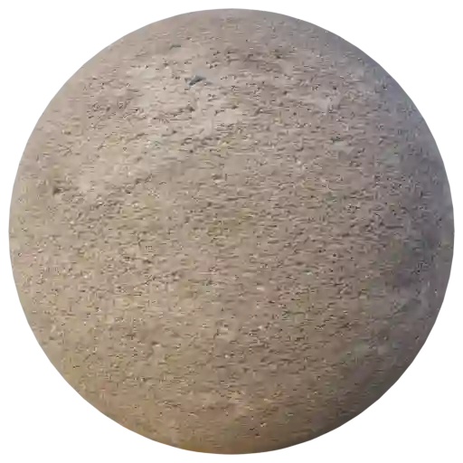

|

**This material is contained in the following Exapacks:**

    - XTRPbr_05k_Vol_001
    - XTRPbr_1k_Vol_001
    - XTRPbr_2k_Vol_003
    - XTRPbr_4k_Vol_006
    - XTRPbr_8k_Vol_028

Soil 007
********

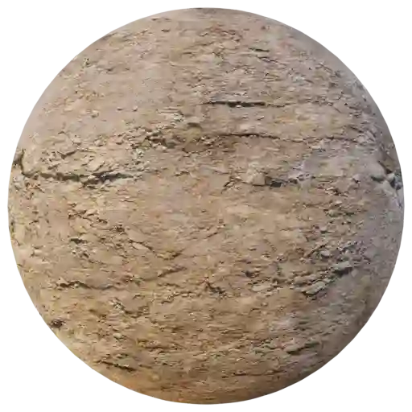

|

**This material is contained in the following Exapacks:**

    - XTRPbr_05k_Vol_001
    - XTRPbr_1k_Vol_001
    - XTRPbr_2k_Vol_003
    - XTRPbr_4k_Vol_006
    - XTRPbr_8k_Vol_028

Soil 008
********

.. image:: ../_static/_images/material_list/ground_soil/soil_008/soil_008.webp
    :width: 30%
    :align: center
    :alt: Soil 008

|

**This material is contained in the following Exapacks:**

    - XTRPbr_05k_Vol_001
    - XTRPbr_1k_Vol_001
    - XTRPbr_2k_Vol_003
    - XTRPbr_4k_Vol_006
    - XTRPbr_8k_Vol_028

Soil 009
********

.. image:: ../_static/_images/material_list/ground_soil/soil_009/soil_009.webp
    :width: 30%
    :align: center
    :alt: Soil 009

|

**This material is contained in the following Exapacks:**

    - XTRPbr_05k_Vol_001
    - XTRPbr_1k_Vol_001
    - XTRPbr_2k_Vol_003
    - XTRPbr_4k_Vol_006
    - XTRPbr_8k_Vol_028

Soil 010
********

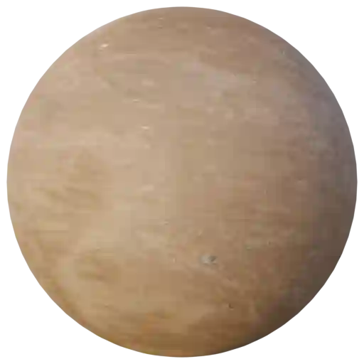

|

**This material is contained in the following Exapacks:**

    - XTRPbr_05k_Vol_001
    - XTRPbr_1k_Vol_001
    - XTRPbr_2k_Vol_003
    - XTRPbr_4k_Vol_006
    - XTRPbr_8k_Vol_028

Soil 011
********

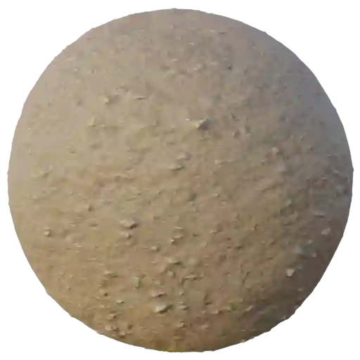

|

**This material is contained in the following Exapacks:**

    - XTRPbr_05k_Vol_001
    - XTRPbr_1k_Vol_001
    - XTRPbr_2k_Vol_003
    - XTRPbr_4k_Vol_006
    - XTRPbr_8k_Vol_028

Soil 012
********

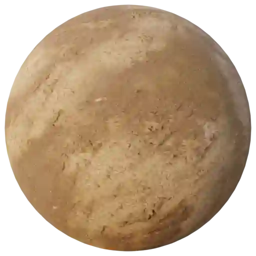

|

**This material is contained in the following Exapacks:**

    - XTRPbr_05k_Vol_001
    - XTRPbr_1k_Vol_001
    - XTRPbr_2k_Vol_003
    - XTRPbr_4k_Vol_006
    - XTRPbr_8k_Vol_028

Soil 013
********

.. image:: ../_static/_images/material_list/ground_soil/soil_013/soil_013.webp
    :width: 30%
    :align: center
    :alt: Soil 013

|

**This material is contained in the following Exapacks:**

    - XTRPbr_05k_Vol_001
    - XTRPbr_1k_Vol_001
    - XTRPbr_2k_Vol_003
    - XTRPbr_4k_Vol_006
    - XTRPbr_8k_Vol_028

Soil 014
********

.. image:: ../_static/_images/material_list/ground_soil/soil_014/soil_014.webp
    :width: 30%
    :align: center
    :alt: Soil 014

|

**This material is contained in the following Exapacks:**

    - XTRPbr_05k_Vol_001
    - XTRPbr_1k_Vol_001
    - XTRPbr_2k_Vol_003
    - XTRPbr_4k_Vol_006
    - XTRPbr_8k_Vol_028

Soil 015
********

.. image:: ../_static/_images/material_list/ground_soil/soil_015/soil_015.webp
    :width: 30%
    :align: center
    :alt: Soil 015

|

**This material is contained in the following Exapacks:**

    - XTRPbr_05k_Vol_001
    - XTRPbr_1k_Vol_001
    - XTRPbr_2k_Vol_003
    - XTRPbr_4k_Vol_006
    - XTRPbr_8k_Vol_028

Soil 016
********

.. image:: ../_static/_images/material_list/ground_soil/soil_016/soil_016.webp
    :width: 30%
    :align: center
    :alt: Soil 016

|

**This material is contained in the following Exapacks:**

    - XTRPbr_05k_Vol_001
    - XTRPbr_1k_Vol_001
    - XTRPbr_2k_Vol_003
    - XTRPbr_4k_Vol_006
    - XTRPbr_8k_Vol_028

Soil 017
********

.. image:: ../_static/_images/material_list/ground_soil/soil_017/soil_017.webp
    :width: 30%
    :align: center
    :alt: Soil 017

|

**This material is contained in the following Exapacks:**

    - XTRPbr_05k_Vol_001
    - XTRPbr_1k_Vol_001
    - XTRPbr_2k_Vol_003
    - XTRPbr_4k_Vol_006
    - XTRPbr_8k_Vol_028

Soil 018
********

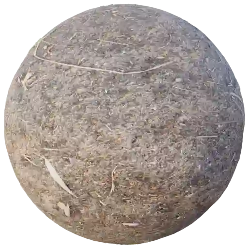

|

**This material is contained in the following Exapacks:**

    - XTRPbr_05k_Vol_001
    - XTRPbr_1k_Vol_001
    - XTRPbr_2k_Vol_003
    - XTRPbr_4k_Vol_006
    - XTRPbr_8k_Vol_028

Soil 019
********

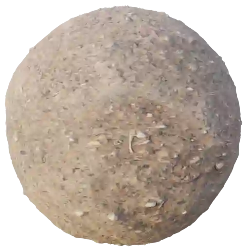

|

**This material is contained in the following Exapacks:**

    - XTRPbr_05k_Vol_001
    - XTRPbr_1k_Vol_001
    - XTRPbr_2k_Vol_003

Soil 020
********

.. image:: ../_static/_images/material_list/ground_soil/soil_020/soil_020.webp
    :width: 30%
    :align: center
    :alt: Soil 020

|

**This material is contained in the following Exapacks:**

    - XTRPbr_05k_Vol_001
    - XTRPbr_1k_Vol_001
    - XTRPbr_2k_Vol_003
    - XTRPbr_4k_Vol_006
    - XTRPbr_8k_Vol_028

Wood Snips Ground 01
********************

.. image:: ../_static/_images/material_list/ground_soil/wood_snips_ground_01/wood_snips_ground_01.webp
    :width: 30%
    :align: center
    :alt: Wood Snips Ground 01

|

**This material is contained in the following Exapacks:**

    - XTRPbr_05k_Vol_001
    - XTRPbr_1k_Vol_001
    - XTRPbr_2k_Vol_003
    - XTRPbr_4k_Vol_006
    - XTRPbr_8k_Vol_028

