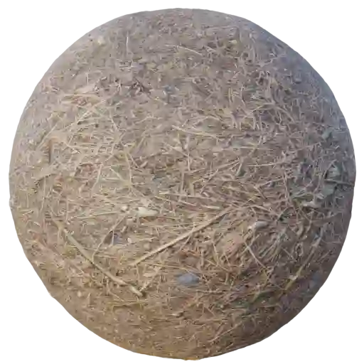
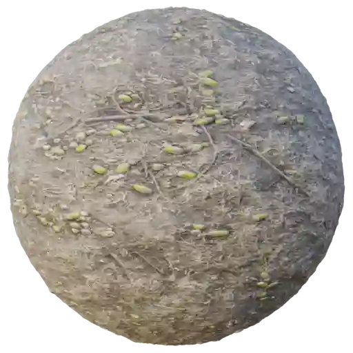
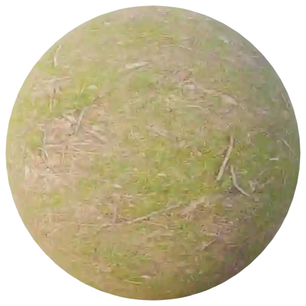

Ground - Undergrowth (Category)
-------------------------------

Ground Undergrowth 001
**********************

.. image:: ../_static/_images/material_list/ground_undergrowth/ground_undergrowth_001/ground_undergrowth_001.webp
    :width: 30%
    :align: center
    :alt: Ground Undergrowth 001

|

**This material is contained in the following Exapacks:**

    - XTRPbr_05k_Vol_001
    - XTRPbr_1k_Vol_001
    - XTRPbr_2k_Vol_003
    - XTRPbr_4k_Vol_007

Ground Undergrowth 002
**********************

.. image:: ../_static/_images/material_list/ground_undergrowth/ground_undergrowth_002/ground_undergrowth_002.webp
    :width: 30%
    :align: center
    :alt: Ground Undergrowth 002

|

**This material is contained in the following Exapacks:**

    - XTRPbr_05k_Vol_001
    - XTRPbr_1k_Vol_001
    - XTRPbr_2k_Vol_003
    - XTRPbr_4k_Vol_007
    - XTRPbr_8k_Vol_025

Ground Undergrowth 003
**********************

.. image:: ../_static/_images/material_list/ground_undergrowth/ground_undergrowth_003/ground_undergrowth_003.webp
    :width: 30%
    :align: center
    :alt: Ground Undergrowth 003

|

**This material is contained in the following Exapacks:**

    - XTRPbr_05k_Vol_001
    - XTRPbr_1k_Vol_001
    - XTRPbr_2k_Vol_003
    - XTRPbr_4k_Vol_007
    - XTRPbr_8k_Vol_025

Ground Undergrowth 004
**********************

.. image:: ../_static/_images/material_list/ground_undergrowth/ground_undergrowth_004/ground_undergrowth_004.webp
    :width: 30%
    :align: center
    :alt: Ground Undergrowth 004

|

**This material is contained in the following Exapacks:**

    - XTRPbr_05k_Vol_001
    - XTRPbr_1k_Vol_001
    - XTRPbr_2k_Vol_003
    - XTRPbr_4k_Vol_007
    - XTRPbr_8k_Vol_025

Ground Undergrowth 005
**********************

|

**This material is contained in the following Exapacks:**

    - XTRPbr_05k_Vol_001
    - XTRPbr_1k_Vol_001
    - XTRPbr_2k_Vol_003
    - XTRPbr_4k_Vol_007
    - XTRPbr_8k_Vol_025

Ground Undergrowth 006
**********************

.. image:: ../_static/_images/material_list/ground_undergrowth/ground_undergrowth_006/ground_undergrowth_006.webp
    :width: 30%
    :align: center
    :alt: Ground Undergrowth 006

|

**This material is contained in the following Exapacks:**

    - XTRPbr_05k_Vol_001
    - XTRPbr_1k_Vol_001
    - XTRPbr_2k_Vol_003
    - XTRPbr_4k_Vol_007

Ground Undergrowth 007
**********************

|

**This material is contained in the following Exapacks:**

    - XTRPbr_05k_Vol_001
    - XTRPbr_1k_Vol_001
    - XTRPbr_2k_Vol_003
    - XTRPbr_4k_Vol_007
    - XTRPbr_8k_Vol_025

Ground Undergrowth 008
**********************

.. image:: ../_static/_images/material_list/ground_undergrowth/ground_undergrowth_008/ground_undergrowth_008.webp
    :width: 30%
    :align: center
    :alt: Ground Undergrowth 008

|

**This material is contained in the following Exapacks:**

    - XTRPbr_05k_Vol_001
    - XTRPbr_1k_Vol_001
    - XTRPbr_2k_Vol_003
    - XTRPbr_4k_Vol_007
    - XTRPbr_8k_Vol_025

Ground Undergrowth 009
**********************

.. image:: ../_static/_images/material_list/ground_undergrowth/ground_undergrowth_009/ground_undergrowth_009.webp
    :width: 30%
    :align: center
    :alt: Ground Undergrowth 009

|

**This material is contained in the following Exapacks:**

    - XTRPbr_05k_Vol_001
    - XTRPbr_1k_Vol_001
    - XTRPbr_2k_Vol_003
    - XTRPbr_4k_Vol_007
    - XTRPbr_8k_Vol_025

Ground Undergrowth 010
**********************

.. image:: ../_static/_images/material_list/ground_undergrowth/ground_undergrowth_010/ground_undergrowth_010.webp
    :width: 30%
    :align: center
    :alt: Ground Undergrowth 010

|

**This material is contained in the following Exapacks:**

    - XTRPbr_05k_Vol_001
    - XTRPbr_1k_Vol_001
    - XTRPbr_2k_Vol_003
    - XTRPbr_4k_Vol_007

Ground Undergrowth 011
**********************

.. image:: ../_static/_images/material_list/ground_undergrowth/ground_undergrowth_011/ground_undergrowth_011.webp
    :width: 30%
    :align: center
    :alt: Ground Undergrowth 011

|

**This material is contained in the following Exapacks:**

    - XTRPbr_05k_Vol_001
    - XTRPbr_1k_Vol_001
    - XTRPbr_2k_Vol_003
    - XTRPbr_4k_Vol_007
    - XTRPbr_8k_Vol_025

Ground Undergrowth 012
**********************

.. image:: ../_static/_images/material_list/ground_undergrowth/ground_undergrowth_012/ground_undergrowth_012.webp
    :width: 30%
    :align: center
    :alt: Ground Undergrowth 012

|

**This material is contained in the following Exapacks:**

    - XTRPbr_05k_Vol_001
    - XTRPbr_1k_Vol_001
    - XTRPbr_2k_Vol_003
    - XTRPbr_4k_Vol_007
    - XTRPbr_8k_Vol_025

Ground Undergrowth 013
**********************

|

**This material is contained in the following Exapacks:**

    - XTRPbr_05k_Vol_001
    - XTRPbr_1k_Vol_001
    - XTRPbr_2k_Vol_003
    - XTRPbr_4k_Vol_007
    - XTRPbr_8k_Vol_022
    - XTRPbr_8k_Vol_025

Ground Undergrowth 014
**********************

.. image:: ../_static/_images/material_list/ground_undergrowth/ground_undergrowth_014/ground_undergrowth_014.webp
    :width: 30%
    :align: center
    :alt: Ground Undergrowth 014

|

**This material is contained in the following Exapacks:**

    - XTRPbr_05k_Vol_001
    - XTRPbr_1k_Vol_001
    - XTRPbr_2k_Vol_003
    - XTRPbr_4k_Vol_007
    - XTRPbr_8k_Vol_022

Ground Undergrowth 015
**********************

|

**This material is contained in the following Exapacks:**

    - XTRPbr_05k_Vol_001
    - XTRPbr_1k_Vol_001
    - XTRPbr_2k_Vol_003
    - XTRPbr_4k_Vol_007
    - XTRPbr_8k_Vol_022

Ground Undergrowth 016
**********************

.. image:: ../_static/_images/material_list/ground_undergrowth/ground_undergrowth_016/ground_undergrowth_016.webp
    :width: 30%
    :align: center
    :alt: Ground Undergrowth 016

|

**This material is contained in the following Exapacks:**

    - XTRPbr_05k_Vol_001
    - XTRPbr_1k_Vol_001
    - XTRPbr_2k_Vol_003
    - XTRPbr_4k_Vol_007
    - XTRPbr_8k_Vol_022

Ground Undergrowth 017
**********************

.. image:: ../_static/_images/material_list/ground_undergrowth/ground_undergrowth_017/ground_undergrowth_017.webp
    :width: 30%
    :align: center
    :alt: Ground Undergrowth 017

|

**This material is contained in the following Exapacks:**

    - XTRPbr_05k_Vol_001
    - XTRPbr_1k_Vol_001
    - XTRPbr_2k_Vol_003
    - XTRPbr_4k_Vol_007
    - XTRPbr_8k_Vol_022

Ground Undergrowth 018
**********************

.. image:: ../_static/_images/material_list/ground_undergrowth/ground_undergrowth_018/ground_undergrowth_018.webp
    :width: 30%
    :align: center
    :alt: Ground Undergrowth 018

|

**This material is contained in the following Exapacks:**

    - XTRPbr_05k_Vol_001
    - XTRPbr_1k_Vol_001
    - XTRPbr_2k_Vol_003
    - XTRPbr_4k_Vol_007
    - XTRPbr_8k_Vol_022

Ground Undergrowth 019
**********************

.. image:: ../_static/_images/material_list/ground_undergrowth/ground_undergrowth_019/ground_undergrowth_019.webp
    :width: 30%
    :align: center
    :alt: Ground Undergrowth 019

|

**This material is contained in the following Exapacks:**

    - XTRPbr_05k_Vol_001
    - XTRPbr_1k_Vol_001
    - XTRPbr_2k_Vol_003
    - XTRPbr_4k_Vol_007
    - XTRPbr_8k_Vol_022

Ground Undergrowth 020
**********************

|

**This material is contained in the following Exapacks:**

    - XTRPbr_05k_Vol_001
    - XTRPbr_1k_Vol_001
    - XTRPbr_2k_Vol_003
    - XTRPbr_4k_Vol_007
    - XTRPbr_8k_Vol_022

Ground Undergrowth 021
**********************

.. image:: ../_static/_images/material_list/ground_undergrowth/ground_undergrowth_021/ground_undergrowth_021.webp
    :width: 30%
    :align: center
    :alt: Ground Undergrowth 021

|

**This material is contained in the following Exapacks:**

    - XTRPbr_05k_Vol_001
    - XTRPbr_1k_Vol_001
    - XTRPbr_2k_Vol_003
    - XTRPbr_4k_Vol_007
    - XTRPbr_8k_Vol_022

