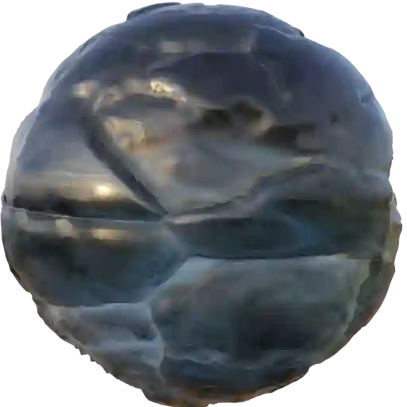
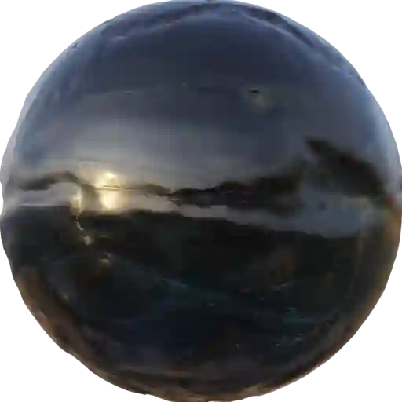

Ice (Category)
--------------

Ice001
******

|

**This material is contained in the following Exapacks:**

    - XTRPbr_05k_Vol_001
    - XTRPbr_1k_Vol_001
    - XTRPbr_2k_Vol_003
    - XTRPbr_4k_Vol_007

Ice002
******

.. image:: ../_static/_images/material_list/ice/ice002/ice002.webp
    :width: 30%
    :align: center
    :alt: Ice002

|

**This material is contained in the following Exapacks:**

    - XTRPbr_05k_Vol_001
    - XTRPbr_1k_Vol_001
    - XTRPbr_2k_Vol_003
    - XTRPbr_4k_Vol_007

Ice003
******

|

**This material is contained in the following Exapacks:**

    - XTRPbr_05k_Vol_001
    - XTRPbr_1k_Vol_001
    - XTRPbr_2k_Vol_003
    - XTRPbr_4k_Vol_007

Ice004
******

.. image:: ../_static/_images/material_list/ice/ice004/ice004.webp
    :width: 30%
    :align: center
    :alt: Ice004

|

**This material is contained in the following Exapacks:**

    - XTRPbr_05k_Vol_001
    - XTRPbr_1k_Vol_001
    - XTRPbr_2k_Vol_003
    - XTRPbr_4k_Vol_007

