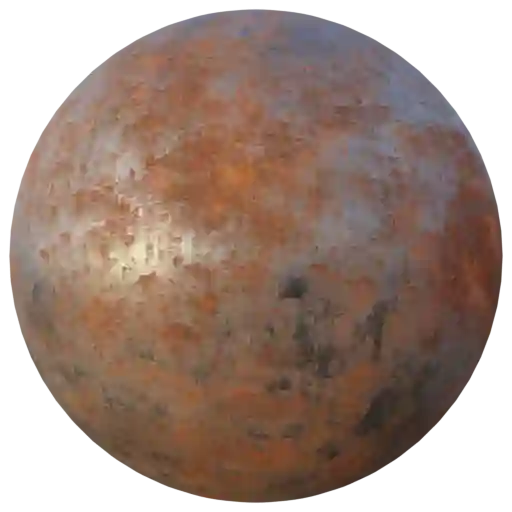
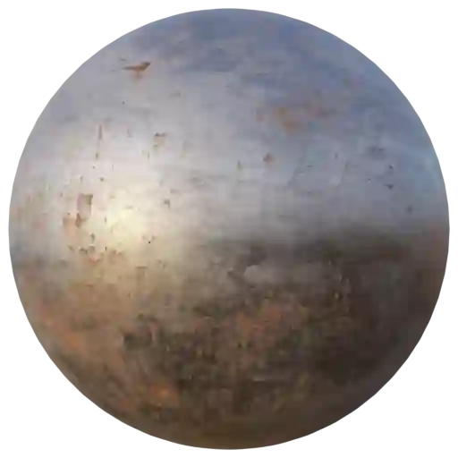
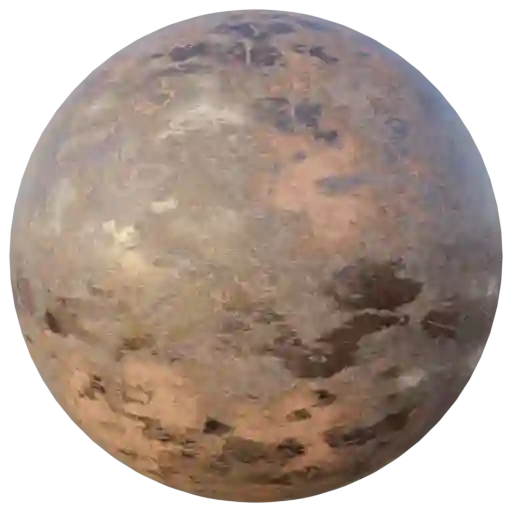

Metal - Rusty (Category)
------------------------

Metal Rusty 001
***************

.. image:: ../_static/_images/material_list/metal_rusty/metal_rusty_001/metal_rusty_001.webp
    :width: 30%
    :align: center
    :alt: Metal Rusty 001

|

**This material is contained in the following Exapacks:**

    - XTRPbr_05k_Vol_001
    - XTRPbr_1k_Vol_001
    - XTRPbr_2k_Vol_003
    - XTRPbr_4k_Vol_005
    - XTRPbr_8k_Vol_007

Metal Rusty 002
***************

.. image:: ../_static/_images/material_list/metal_rusty/metal_rusty_002/metal_rusty_002.webp
    :width: 30%
    :align: center
    :alt: Metal Rusty 002

|

**This material is contained in the following Exapacks:**

    - XTRPbr_05k_Vol_001
    - XTRPbr_1k_Vol_001
    - XTRPbr_2k_Vol_003
    - XTRPbr_4k_Vol_005
    - XTRPbr_8k_Vol_007

Metal Rusty 003
***************

|

**This material is contained in the following Exapacks:**

    - XTRPbr_05k_Vol_001
    - XTRPbr_1k_Vol_001
    - XTRPbr_2k_Vol_003
    - XTRPbr_4k_Vol_005
    - XTRPbr_8k_Vol_007

Metal Rusty 004
***************

.. image:: ../_static/_images/material_list/metal_rusty/metal_rusty_004/metal_rusty_004.webp
    :width: 30%
    :align: center
    :alt: Metal Rusty 004

|

**This material is contained in the following Exapacks:**

    - XTRPbr_05k_Vol_001
    - XTRPbr_1k_Vol_001
    - XTRPbr_2k_Vol_003
    - XTRPbr_4k_Vol_005
    - XTRPbr_8k_Vol_007
    - XTRPbr_8k_Vol_015

Metal Rusty 005
***************

.. image:: ../_static/_images/material_list/metal_rusty/metal_rusty_005/metal_rusty_005.webp
    :width: 30%
    :align: center
    :alt: Metal Rusty 005

|

**This material is contained in the following Exapacks:**

    - XTRPbr_05k_Vol_001
    - XTRPbr_1k_Vol_001
    - XTRPbr_2k_Vol_003
    - XTRPbr_4k_Vol_005
    - XTRPbr_8k_Vol_015

Metal Rusty 006
***************

.. image:: ../_static/_images/material_list/metal_rusty/metal_rusty_006/metal_rusty_006.webp
    :width: 30%
    :align: center
    :alt: Metal Rusty 006

|

**This material is contained in the following Exapacks:**

    - XTRPbr_05k_Vol_001
    - XTRPbr_1k_Vol_001
    - XTRPbr_2k_Vol_003
    - XTRPbr_4k_Vol_005

Metal Rusty 007
***************

.. image:: ../_static/_images/material_list/metal_rusty/metal_rusty_007/metal_rusty_007.webp
    :width: 30%
    :align: center
    :alt: Metal Rusty 007

|

**This material is contained in the following Exapacks:**

    - XTRPbr_05k_Vol_001
    - XTRPbr_1k_Vol_001
    - XTRPbr_2k_Vol_003
    - XTRPbr_4k_Vol_005
    - XTRPbr_8k_Vol_015

Metal Rusty 008
***************

|

**This material is contained in the following Exapacks:**

    - XTRPbr_05k_Vol_001
    - XTRPbr_1k_Vol_001
    - XTRPbr_2k_Vol_003
    - XTRPbr_4k_Vol_005
    - XTRPbr_8k_Vol_015

Metal Rusty 009
***************

|

**This material is contained in the following Exapacks:**

    - XTRPbr_05k_Vol_001
    - XTRPbr_1k_Vol_001
    - XTRPbr_2k_Vol_003
    - XTRPbr_4k_Vol_005
    - XTRPbr_8k_Vol_015

Rust 001
********

.. image:: ../_static/_images/material_list/metal_rusty/rust_001/rust_001.webp
    :width: 30%
    :align: center
    :alt: Rust 001

|

**This material is contained in the following Exapacks:**

    - XTRPbr_05k_Vol_001
    - XTRPbr_1k_Vol_001
    - XTRPbr_2k_Vol_003
    - XTRPbr_4k_Vol_005
    - XTRPbr_8k_Vol_015

Rust 002
********

.. image:: ../_static/_images/material_list/metal_rusty/rust_002/rust_002.webp
    :width: 30%
    :align: center
    :alt: Rust 002

|

**This material is contained in the following Exapacks:**

    - XTRPbr_05k_Vol_001
    - XTRPbr_1k_Vol_001
    - XTRPbr_2k_Vol_003
    - XTRPbr_4k_Vol_005
    - XTRPbr_8k_Vol_015

Rust 003
********

.. image:: ../_static/_images/material_list/metal_rusty/rust_003/rust_003.webp
    :width: 30%
    :align: center
    :alt: Rust 003

|

**This material is contained in the following Exapacks:**

    - XTRPbr_05k_Vol_001
    - XTRPbr_1k_Vol_001
    - XTRPbr_2k_Vol_003
    - XTRPbr_4k_Vol_005
    - XTRPbr_8k_Vol_015

Rust 004
********

.. image:: ../_static/_images/material_list/metal_rusty/rust_004/rust_004.webp
    :width: 30%
    :align: center
    :alt: Rust 004

|

**This material is contained in the following Exapacks:**

    - XTRPbr_05k_Vol_001
    - XTRPbr_1k_Vol_001
    - XTRPbr_2k_Vol_003
    - XTRPbr_4k_Vol_005
    - XTRPbr_8k_Vol_015

Rust 005
********

|

**This material is contained in the following Exapacks:**

    - XTRPbr_05k_Vol_001
    - XTRPbr_1k_Vol_001
    - XTRPbr_2k_Vol_003
    - XTRPbr_4k_Vol_005
    - XTRPbr_8k_Vol_015

Shutter Rusty 01
****************

.. image:: ../_static/_images/material_list/metal_rusty/shutter_rusty_01/shutter_rusty_01.webp
    :width: 30%
    :align: center
    :alt: Shutter Rusty 01

|

**This material is contained in the following Exapacks:**

    - XTRPbr_05k_Vol_001
    - XTRPbr_1k_Vol_001
    - XTRPbr_2k_Vol_003
    - XTRPbr_4k_Vol_005
    - XTRPbr_8k_Vol_015

