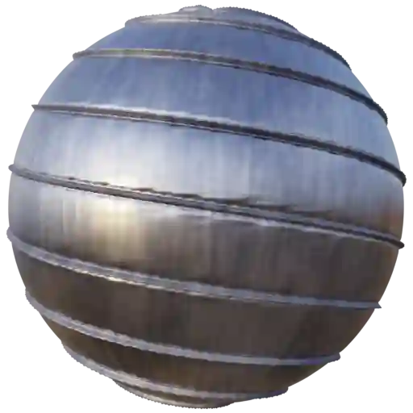

Pipe (Category)
---------------

Metal Pipe 001
**************

.. image:: ../_static/_images/material_list/pipe/metal_pipe_001/metal_pipe_001.webp
    :width: 30%
    :align: center
    :alt: Metal Pipe 001

|

**This material is contained in the following Exapacks:**

    - XTRPbr_05k_Vol_001
    - XTRPbr_1k_Vol_001
    - XTRPbr_2k_Vol_002
    - XTRPbr_4k_Vol_010
    - XTRPbr_8k_Vol_012

Metal Pipe 002
**************

.. image:: ../_static/_images/material_list/pipe/metal_pipe_002/metal_pipe_002.webp
    :width: 30%
    :align: center
    :alt: Metal Pipe 002

|

**This material is contained in the following Exapacks:**

    - XTRPbr_05k_Vol_001
    - XTRPbr_1k_Vol_001
    - XTRPbr_2k_Vol_002
    - XTRPbr_4k_Vol_010
    - XTRPbr_8k_Vol_012

Metal Pipe 003
**************

.. image:: ../_static/_images/material_list/pipe/metal_pipe_003/metal_pipe_003.webp
    :width: 30%
    :align: center
    :alt: Metal Pipe 003

|

**This material is contained in the following Exapacks:**

    - XTRPbr_05k_Vol_001
    - XTRPbr_1k_Vol_001
    - XTRPbr_2k_Vol_002
    - XTRPbr_4k_Vol_010
    - XTRPbr_8k_Vol_012

Metal Pipe 004
**************

|

**This material is contained in the following Exapacks:**

    - XTRPbr_05k_Vol_001
    - XTRPbr_1k_Vol_001
    - XTRPbr_2k_Vol_002
    - XTRPbr_4k_Vol_010
    - XTRPbr_8k_Vol_012

