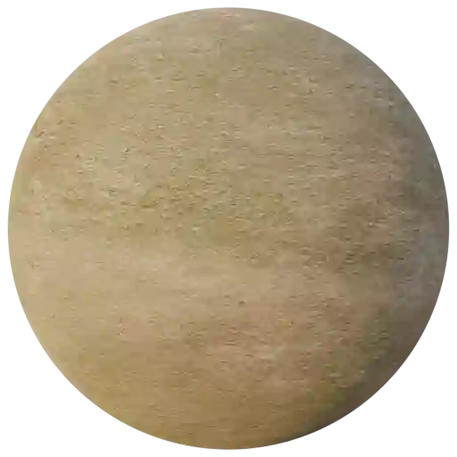
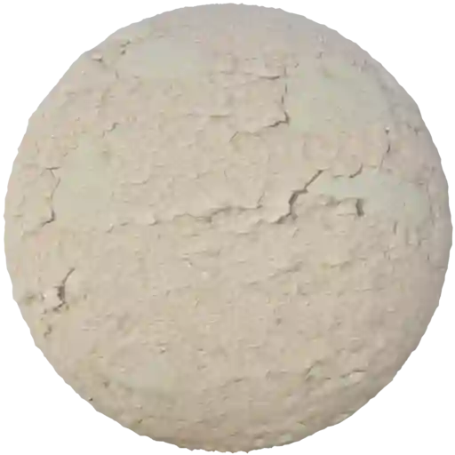
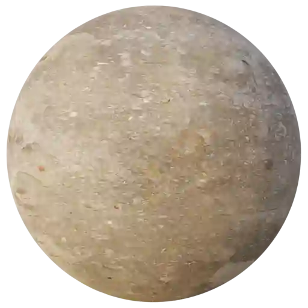

Plaster - Worn (Category)
-------------------------

Worn Plaster 001
****************

.. image:: ../_static/_images/material_list/plaster_worn/worn_plaster_001/worn_plaster_001.webp
    :width: 30%
    :align: center
    :alt: Worn Plaster 001

|

**This material is contained in the following Exapacks:**

    - XTRPbr_05k_Vol_001
    - XTRPbr_1k_Vol_001
    - XTRPbr_2k_Vol_002
    - XTRPbr_4k_Vol_010
    - XTRPbr_8k_Vol_026

Worn Plaster 002
****************

.. image:: ../_static/_images/material_list/plaster_worn/worn_plaster_002/worn_plaster_002.webp
    :width: 30%
    :align: center
    :alt: Worn Plaster 002

|

**This material is contained in the following Exapacks:**

    - XTRPbr_05k_Vol_001
    - XTRPbr_1k_Vol_001
    - XTRPbr_2k_Vol_002
    - XTRPbr_4k_Vol_010
    - XTRPbr_8k_Vol_026

Worn Plaster 003
****************

.. image:: ../_static/_images/material_list/plaster_worn/worn_plaster_003/worn_plaster_003.webp
    :width: 30%
    :align: center
    :alt: Worn Plaster 003

|

**This material is contained in the following Exapacks:**

    - XTRPbr_05k_Vol_001
    - XTRPbr_1k_Vol_001
    - XTRPbr_2k_Vol_002
    - XTRPbr_4k_Vol_010
    - XTRPbr_8k_Vol_026

Worn Plaster 004
****************

.. image:: ../_static/_images/material_list/plaster_worn/worn_plaster_004/worn_plaster_004.webp
    :width: 30%
    :align: center
    :alt: Worn Plaster 004

|

**This material is contained in the following Exapacks:**

    - XTRPbr_05k_Vol_001
    - XTRPbr_1k_Vol_001
    - XTRPbr_2k_Vol_002
    - XTRPbr_4k_Vol_010
    - XTRPbr_8k_Vol_026

Worn Plaster 005
****************

.. image:: ../_static/_images/material_list/plaster_worn/worn_plaster_005/worn_plaster_005.webp
    :width: 30%
    :align: center
    :alt: Worn Plaster 005

|

**This material is contained in the following Exapacks:**

    - XTRPbr_05k_Vol_001
    - XTRPbr_1k_Vol_001
    - XTRPbr_2k_Vol_002
    - XTRPbr_4k_Vol_010
    - XTRPbr_8k_Vol_026

Worn Plaster 006
****************

.. image:: ../_static/_images/material_list/plaster_worn/worn_plaster_006/worn_plaster_006.webp
    :width: 30%
    :align: center
    :alt: Worn Plaster 006

|

**This material is contained in the following Exapacks:**

    - XTRPbr_05k_Vol_001
    - XTRPbr_1k_Vol_001
    - XTRPbr_2k_Vol_002
    - XTRPbr_4k_Vol_010
    - XTRPbr_8k_Vol_026

Worn Plaster 007
****************

.. image:: ../_static/_images/material_list/plaster_worn/worn_plaster_007/worn_plaster_007.webp
    :width: 30%
    :align: center
    :alt: Worn Plaster 007

|

**This material is contained in the following Exapacks:**

    - XTRPbr_05k_Vol_001
    - XTRPbr_1k_Vol_001
    - XTRPbr_2k_Vol_002
    - XTRPbr_4k_Vol_010
    - XTRPbr_8k_Vol_026

Worn Plaster 008
****************

|

**This material is contained in the following Exapacks:**

    - XTRPbr_05k_Vol_001
    - XTRPbr_1k_Vol_001
    - XTRPbr_2k_Vol_002
    - XTRPbr_4k_Vol_010
    - XTRPbr_8k_Vol_026

Worn Plaster 009
****************

|

**This material is contained in the following Exapacks:**

    - XTRPbr_05k_Vol_001
    - XTRPbr_1k_Vol_001
    - XTRPbr_2k_Vol_002
    - XTRPbr_4k_Vol_010
    - XTRPbr_8k_Vol_026

Worn Plaster 010
****************

.. image:: ../_static/_images/material_list/plaster_worn/worn_plaster_010/worn_plaster_010.webp
    :width: 30%
    :align: center
    :alt: Worn Plaster 010

|

**This material is contained in the following Exapacks:**

    - XTRPbr_05k_Vol_001
    - XTRPbr_1k_Vol_001
    - XTRPbr_2k_Vol_002
    - XTRPbr_4k_Vol_010
    - XTRPbr_8k_Vol_026

Worn Plaster 011
****************

|

**This material is contained in the following Exapacks:**

    - XTRPbr_05k_Vol_001
    - XTRPbr_1k_Vol_001
    - XTRPbr_2k_Vol_002
    - XTRPbr_4k_Vol_010

Worn Plaster 012
****************

.. image:: ../_static/_images/material_list/plaster_worn/worn_plaster_012/worn_plaster_012.webp
    :width: 30%
    :align: center
    :alt: Worn Plaster 012

|

**This material is contained in the following Exapacks:**

    - XTRPbr_05k_Vol_001
    - XTRPbr_1k_Vol_001
    - XTRPbr_2k_Vol_002
    - XTRPbr_4k_Vol_010
    - XTRPbr_8k_Vol_026

Worn Plaster 013
****************

.. image:: ../_static/_images/material_list/plaster_worn/worn_plaster_013/worn_plaster_013.webp
    :width: 30%
    :align: center
    :alt: Worn Plaster 013

|

**This material is contained in the following Exapacks:**

    - XTRPbr_05k_Vol_001
    - XTRPbr_1k_Vol_001
    - XTRPbr_2k_Vol_002
    - XTRPbr_4k_Vol_010
    - XTRPbr_8k_Vol_026

Worn Plaster 014
****************

|

**This material is contained in the following Exapacks:**

    - XTRPbr_05k_Vol_001
    - XTRPbr_1k_Vol_001
    - XTRPbr_2k_Vol_002
    - XTRPbr_4k_Vol_010
    - XTRPbr_8k_Vol_026

Worn Plaster 015
****************

.. image:: ../_static/_images/material_list/plaster_worn/worn_plaster_015/worn_plaster_015.webp
    :width: 30%
    :align: center
    :alt: Worn Plaster 015

|

**This material is contained in the following Exapacks:**

    - XTRPbr_05k_Vol_001
    - XTRPbr_1k_Vol_001
    - XTRPbr_2k_Vol_002
    - XTRPbr_4k_Vol_010
    - XTRPbr_8k_Vol_026

Worn Plaster 018
****************

.. image:: ../_static/_images/material_list/plaster_worn/worn_plaster_018/worn_plaster_018.webp
    :width: 30%
    :align: center
    :alt: Worn Plaster 018

|

**This material is contained in the following Exapacks:**

    - XTRPbr_05k_Vol_001
    - XTRPbr_1k_Vol_001
    - XTRPbr_2k_Vol_002
    - XTRPbr_4k_Vol_010

Worn Plaster Bricks 002
***********************

.. image:: ../_static/_images/material_list/plaster_worn/worn_plaster_bricks_002/worn_plaster_bricks_002.webp
    :width: 30%
    :align: center
    :alt: Worn Plaster Bricks 002

|

**This material is contained in the following Exapacks:**

    - XTRPbr_05k_Vol_001
    - XTRPbr_1k_Vol_001
    - XTRPbr_2k_Vol_002
    - XTRPbr_4k_Vol_010
    - XTRPbr_8k_Vol_026

