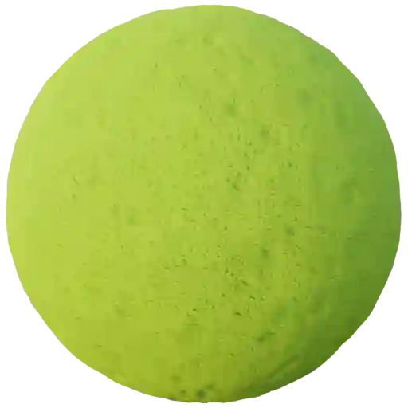

Sponge (Category)
-----------------

Sponge 001
**********

.. image:: ../_static/_images/material_list/sponge/sponge_001/sponge_001.webp
    :width: 30%
    :align: center
    :alt: Sponge 001

|

**This material is contained in the following Exapacks:**

    - XTRPbr_05k_Vol_001
    - XTRPbr_1k_Vol_001
    - XTRPbr_2k_Vol_002
    - XTRPbr_4k_Vol_004
    - XTRPbr_8k_Vol_006

Sponge 002
**********

.. image:: ../_static/_images/material_list/sponge/sponge_002/sponge_002.webp
    :width: 30%
    :align: center
    :alt: Sponge 002

|

**This material is contained in the following Exapacks:**

    - XTRPbr_05k_Vol_001
    - XTRPbr_1k_Vol_001
    - XTRPbr_2k_Vol_002
    - XTRPbr_4k_Vol_004
    - XTRPbr_8k_Vol_006

Sponge 003
**********

|

**This material is contained in the following Exapacks:**

    - XTRPbr_05k_Vol_001
    - XTRPbr_1k_Vol_001
    - XTRPbr_2k_Vol_002
    - XTRPbr_4k_Vol_004
    - XTRPbr_8k_Vol_006

