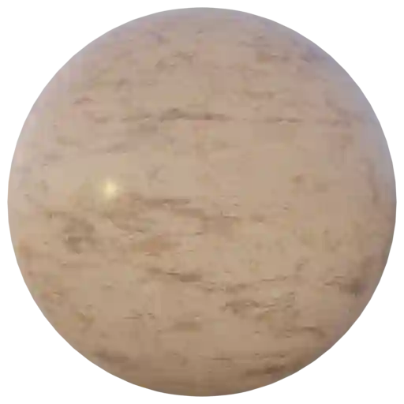
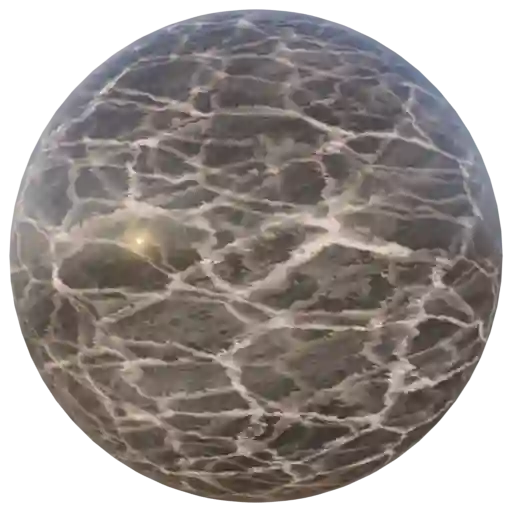
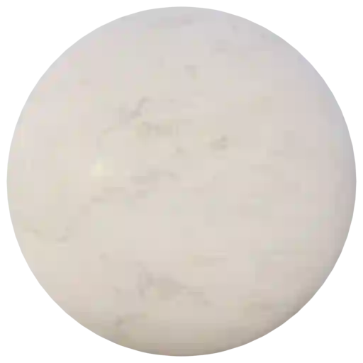
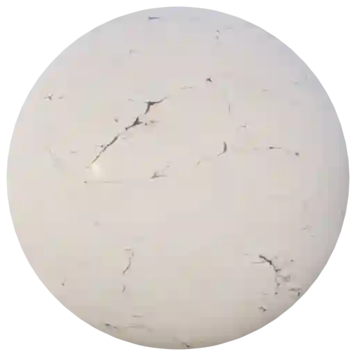
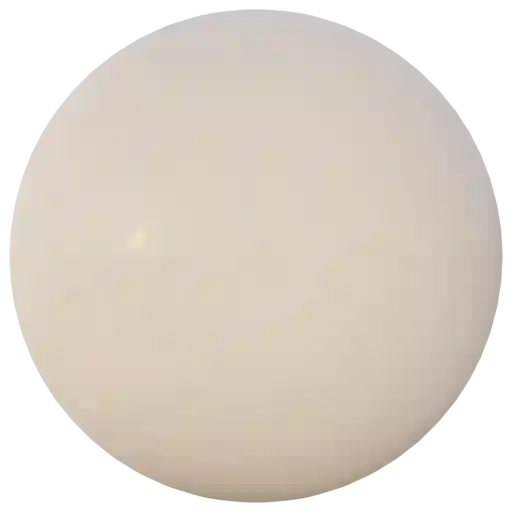
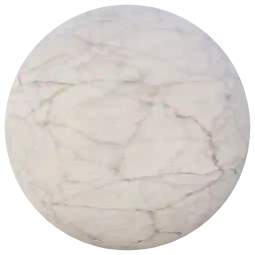

Stone - Marble (Category)
-------------------------

Marble Black 001
****************

.. image:: ../_static/_images/material_list/stone_marble/marble_black_001/marble_black_001.webp
    :width: 30%
    :align: center
    :alt: Marble Black 001

|

**This material is contained in the following Exapacks:**

    - XTRPbr_05k_Vol_001
    - XTRPbr_1k_Vol_001
    - XTRPbr_2k_Vol_002
    - XTRPbr_4k_Vol_004
    - XTRPbr_8k_Vol_006

Marble Black 002
****************

|

**This material is contained in the following Exapacks:**

    - XTRPbr_05k_Vol_001
    - XTRPbr_1k_Vol_001
    - XTRPbr_2k_Vol_002
    - XTRPbr_4k_Vol_004
    - XTRPbr_8k_Vol_006

Marble Black 003
****************

.. image:: ../_static/_images/material_list/stone_marble/marble_black_003/marble_black_003.webp
    :width: 30%
    :align: center
    :alt: Marble Black 003

|

**This material is contained in the following Exapacks:**

    - XTRPbr_05k_Vol_001
    - XTRPbr_1k_Vol_001
    - XTRPbr_2k_Vol_002
    - XTRPbr_4k_Vol_004

Marble Black 004
****************

.. image:: ../_static/_images/material_list/stone_marble/marble_black_004/marble_black_004.webp
    :width: 30%
    :align: center
    :alt: Marble Black 004

|

**This material is contained in the following Exapacks:**

    - XTRPbr_05k_Vol_001
    - XTRPbr_1k_Vol_001
    - XTRPbr_2k_Vol_002
    - XTRPbr_4k_Vol_004
    - XTRPbr_8k_Vol_006

Marble Brown 001
****************

.. image:: ../_static/_images/material_list/stone_marble/marble_brown_001/marble_brown_001.webp
    :width: 30%
    :align: center
    :alt: Marble Brown 001

|

**This material is contained in the following Exapacks:**

    - XTRPbr_05k_Vol_001
    - XTRPbr_1k_Vol_001
    - XTRPbr_2k_Vol_002
    - XTRPbr_4k_Vol_004
    - XTRPbr_8k_Vol_006

Marble Brown 002
****************

.. image:: ../_static/_images/material_list/stone_marble/marble_brown_002/marble_brown_002.webp
    :width: 30%
    :align: center
    :alt: Marble Brown 002

|

**This material is contained in the following Exapacks:**

    - XTRPbr_05k_Vol_001
    - XTRPbr_1k_Vol_001
    - XTRPbr_2k_Vol_002
    - XTRPbr_4k_Vol_004

Marble Brown 003
****************

.. image:: ../_static/_images/material_list/stone_marble/marble_brown_003/marble_brown_003.webp
    :width: 30%
    :align: center
    :alt: Marble Brown 003

|

**This material is contained in the following Exapacks:**

    - XTRPbr_05k_Vol_001
    - XTRPbr_1k_Vol_001
    - XTRPbr_2k_Vol_002
    - XTRPbr_4k_Vol_004
    - XTRPbr_8k_Vol_006

Marble Brown 004
****************

|

**This material is contained in the following Exapacks:**

    - XTRPbr_05k_Vol_001
    - XTRPbr_1k_Vol_001
    - XTRPbr_2k_Vol_002
    - XTRPbr_4k_Vol_004
    - XTRPbr_8k_Vol_006

Marble Brown 005
****************

.. image:: ../_static/_images/material_list/stone_marble/marble_brown_005/marble_brown_005.webp
    :width: 30%
    :align: center
    :alt: Marble Brown 005

|

**This material is contained in the following Exapacks:**

    - XTRPbr_05k_Vol_001
    - XTRPbr_1k_Vol_001
    - XTRPbr_2k_Vol_002
    - XTRPbr_4k_Vol_004
    - XTRPbr_8k_Vol_006

Marble Green 001
****************

.. image:: ../_static/_images/material_list/stone_marble/marble_green_001/marble_green_001.webp
    :width: 30%
    :align: center
    :alt: Marble Green 001

|

**This material is contained in the following Exapacks:**

    - XTRPbr_05k_Vol_001
    - XTRPbr_1k_Vol_001
    - XTRPbr_2k_Vol_002
    - XTRPbr_4k_Vol_004
    - XTRPbr_8k_Vol_006

Marble Green 002
****************

.. image:: ../_static/_images/material_list/stone_marble/marble_green_002/marble_green_002.webp
    :width: 30%
    :align: center
    :alt: Marble Green 002

|

**This material is contained in the following Exapacks:**

    - XTRPbr_05k_Vol_001
    - XTRPbr_1k_Vol_001
    - XTRPbr_2k_Vol_002
    - XTRPbr_4k_Vol_004

Marble Green 003
****************

.. image:: ../_static/_images/material_list/stone_marble/marble_green_003/marble_green_003.webp
    :width: 30%
    :align: center
    :alt: Marble Green 003

|

**This material is contained in the following Exapacks:**

    - XTRPbr_05k_Vol_001
    - XTRPbr_1k_Vol_001
    - XTRPbr_2k_Vol_002
    - XTRPbr_4k_Vol_004

Marble Green 004
****************

.. image:: ../_static/_images/material_list/stone_marble/marble_green_004/marble_green_004.webp
    :width: 30%
    :align: center
    :alt: Marble Green 004

|

**This material is contained in the following Exapacks:**

    - XTRPbr_05k_Vol_001
    - XTRPbr_1k_Vol_001
    - XTRPbr_2k_Vol_002
    - XTRPbr_4k_Vol_004

Marble Green 005
****************

|

**This material is contained in the following Exapacks:**

    - XTRPbr_05k_Vol_001
    - XTRPbr_1k_Vol_001
    - XTRPbr_2k_Vol_002
    - XTRPbr_4k_Vol_004

Marble White 001
****************

|

**This material is contained in the following Exapacks:**

    - XTRPbr_05k_Vol_001
    - XTRPbr_1k_Vol_001
    - XTRPbr_2k_Vol_002
    - XTRPbr_4k_Vol_004
    - XTRPbr_8k_Vol_006

Marble White 002
****************

.. image:: ../_static/_images/material_list/stone_marble/marble_white_002/marble_white_002.webp
    :width: 30%
    :align: center
    :alt: Marble White 002

|

**This material is contained in the following Exapacks:**

    - XTRPbr_05k_Vol_001
    - XTRPbr_1k_Vol_001
    - XTRPbr_2k_Vol_002
    - XTRPbr_4k_Vol_004
    - XTRPbr_8k_Vol_006

Marble White 003
****************

.. image:: ../_static/_images/material_list/stone_marble/marble_white_003/marble_white_003.webp
    :width: 30%
    :align: center
    :alt: Marble White 003

|

**This material is contained in the following Exapacks:**

    - XTRPbr_05k_Vol_001
    - XTRPbr_1k_Vol_001
    - XTRPbr_2k_Vol_002
    - XTRPbr_4k_Vol_004
    - XTRPbr_8k_Vol_006

Marble White 004
****************

.. image:: ../_static/_images/material_list/stone_marble/marble_white_004/marble_white_004.webp
    :width: 30%
    :align: center
    :alt: Marble White 004

|

**This material is contained in the following Exapacks:**

    - XTRPbr_05k_Vol_001
    - XTRPbr_1k_Vol_001
    - XTRPbr_2k_Vol_002
    - XTRPbr_4k_Vol_004
    - XTRPbr_8k_Vol_006

Marble White 005
****************

|

**This material is contained in the following Exapacks:**

    - XTRPbr_05k_Vol_001
    - XTRPbr_1k_Vol_001
    - XTRPbr_2k_Vol_002
    - XTRPbr_4k_Vol_004

Marble White 006
****************

|

**This material is contained in the following Exapacks:**

    - XTRPbr_05k_Vol_001
    - XTRPbr_1k_Vol_001
    - XTRPbr_2k_Vol_002
    - XTRPbr_4k_Vol_004
    - XTRPbr_8k_Vol_006

Marble White 007
****************

|

**This material is contained in the following Exapacks:**

    - XTRPbr_05k_Vol_001
    - XTRPbr_1k_Vol_001
    - XTRPbr_2k_Vol_002
    - XTRPbr_4k_Vol_004

Marble White 008
****************

.. image:: ../_static/_images/material_list/stone_marble/marble_white_008/marble_white_008.webp
    :width: 30%
    :align: center
    :alt: Marble White 008

|

**This material is contained in the following Exapacks:**

    - XTRPbr_05k_Vol_001
    - XTRPbr_1k_Vol_001
    - XTRPbr_2k_Vol_002
    - XTRPbr_4k_Vol_004
    - XTRPbr_8k_Vol_006

Marble White 009
****************

.. image:: ../_static/_images/material_list/stone_marble/marble_white_009/marble_white_009.webp
    :width: 30%
    :align: center
    :alt: Marble White 009

|

**This material is contained in the following Exapacks:**

    - XTRPbr_05k_Vol_001
    - XTRPbr_1k_Vol_001
    - XTRPbr_2k_Vol_002
    - XTRPbr_4k_Vol_004

Marble White 010
****************

|

**This material is contained in the following Exapacks:**

    - XTRPbr_05k_Vol_001
    - XTRPbr_1k_Vol_001
    - XTRPbr_2k_Vol_002
    - XTRPbr_4k_Vol_004
    - XTRPbr_8k_Vol_006

