Surface Imperfections (Category)
--------------------------------

Dirt 001
********

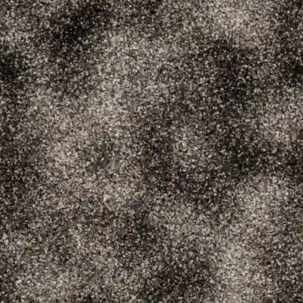

|

**This material is contained in the following Exapacks:**

    - XTRPbr_05k_Vol_001
    - XTRPbr_1k_Vol_001
    - XTRPbr_2k_Vol_002
    - XTRPbr_4k_Vol_004

Dirt 002
********

.. image:: ../_static/_images/material_list/surface_imperfections/dirt_002/dirt_002.webp
    :width: 30%
    :align: center
    :alt: Dirt 002

|

**This material is contained in the following Exapacks:**

    - XTRPbr_05k_Vol_001
    - XTRPbr_1k_Vol_001
    - XTRPbr_2k_Vol_002
    - XTRPbr_4k_Vol_004

Dirt 003
********

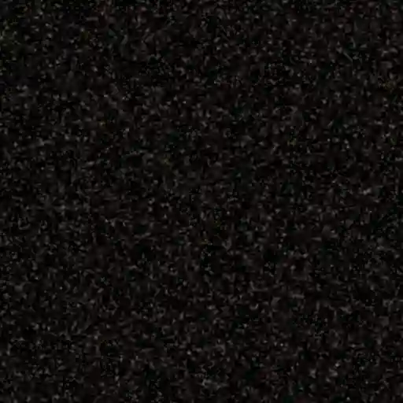

|

**This material is contained in the following Exapacks:**

    - XTRPbr_05k_Vol_001
    - XTRPbr_1k_Vol_001
    - XTRPbr_2k_Vol_002
    - XTRPbr_4k_Vol_004

Dirt 004
********

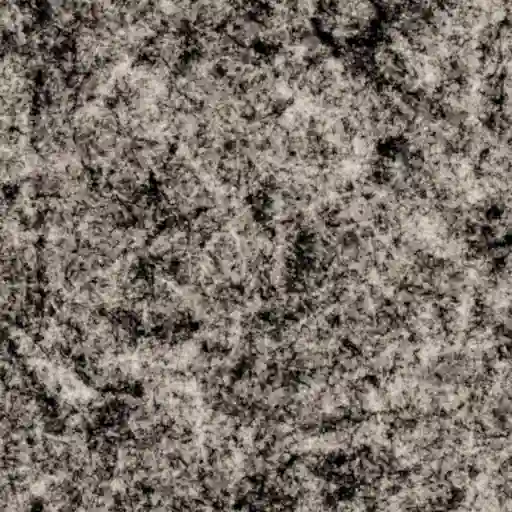

|

**This material is contained in the following Exapacks:**

    - XTRPbr_05k_Vol_001
    - XTRPbr_1k_Vol_001
    - XTRPbr_2k_Vol_002
    - XTRPbr_4k_Vol_004

Dirt 005
********

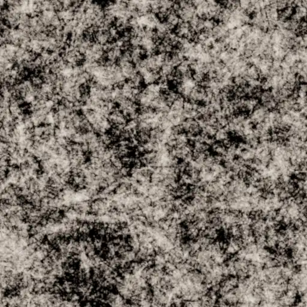

|

**This material is contained in the following Exapacks:**

    - XTRPbr_05k_Vol_001
    - XTRPbr_1k_Vol_001
    - XTRPbr_2k_Vol_002
    - XTRPbr_4k_Vol_004

Dirt 006
********

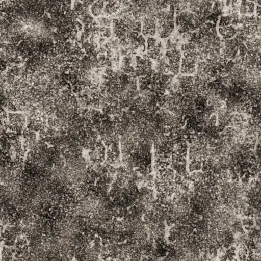

|

**This material is contained in the following Exapacks:**

    - XTRPbr_05k_Vol_001
    - XTRPbr_1k_Vol_001
    - XTRPbr_2k_Vol_002
    - XTRPbr_4k_Vol_004

Dirt 007
********

.. image:: ../_static/_images/material_list/surface_imperfections/dirt_007/dirt_007.webp
    :width: 30%
    :align: center
    :alt: Dirt 007

|

**This material is contained in the following Exapacks:**

    - XTRPbr_05k_Vol_001
    - XTRPbr_1k_Vol_001
    - XTRPbr_2k_Vol_002
    - XTRPbr_4k_Vol_004

Dripping Paint 001
******************

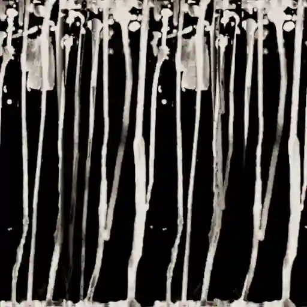

|

**This material is contained in the following Exapacks:**

    - XTRPbr_05k_Vol_001
    - XTRPbr_1k_Vol_001
    - XTRPbr_2k_Vol_002
    - XTRPbr_4k_Vol_004
    - XTRPbr_8k_Vol_006

Dust Wipes 01
*************

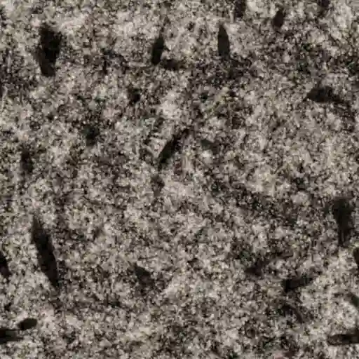

|

**This material is contained in the following Exapacks:**

    - XTRPbr_05k_Vol_001
    - XTRPbr_1k_Vol_001
    - XTRPbr_2k_Vol_002

Fingerprints 001
****************

.. image:: ../_static/_images/material_list/surface_imperfections/fingerprints_001/fingerprints_001.webp
    :width: 30%
    :align: center
    :alt: Fingerprints 001

|

**This material is contained in the following Exapacks:**

    - XTRPbr_05k_Vol_001
    - XTRPbr_1k_Vol_001
    - XTRPbr_2k_Vol_002
    - XTRPbr_4k_Vol_004

Fingerprints 002
****************

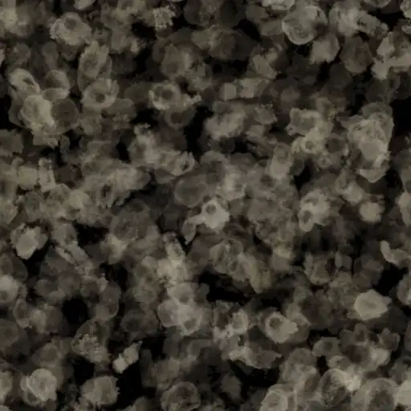

|

**This material is contained in the following Exapacks:**

    - XTRPbr_05k_Vol_001
    - XTRPbr_1k_Vol_001
    - XTRPbr_2k_Vol_002
    - XTRPbr_4k_Vol_004

Fingerprints 003
****************

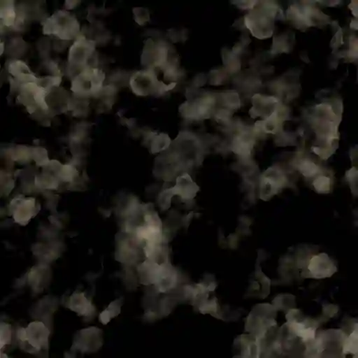

|

**This material is contained in the following Exapacks:**

    - XTRPbr_05k_Vol_001
    - XTRPbr_1k_Vol_001
    - XTRPbr_2k_Vol_002
    - XTRPbr_4k_Vol_004

Fingerprints 004
****************

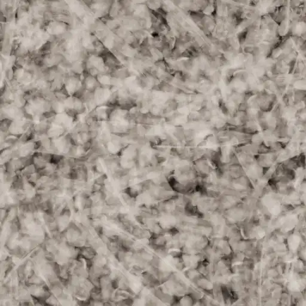

|

**This material is contained in the following Exapacks:**

    - XTRPbr_05k_Vol_001
    - XTRPbr_1k_Vol_001
    - XTRPbr_2k_Vol_002
    - XTRPbr_4k_Vol_004
    - XTRPbr_8k_Vol_006

Fingerprints 005
****************

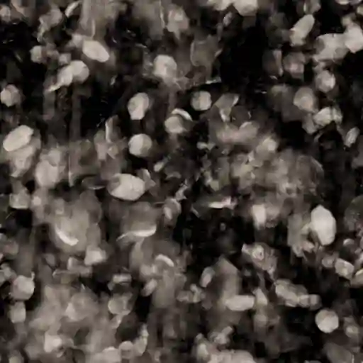

|

**This material is contained in the following Exapacks:**

    - XTRPbr_05k_Vol_001
    - XTRPbr_1k_Vol_001
    - XTRPbr_2k_Vol_002
    - XTRPbr_4k_Vol_004
    - XTRPbr_8k_Vol_006

Fingerprints 006
****************

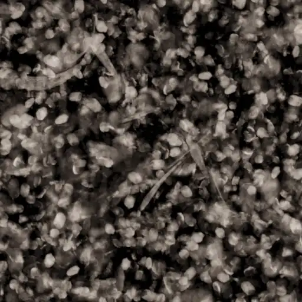

|

**This material is contained in the following Exapacks:**

    - XTRPbr_05k_Vol_001
    - XTRPbr_1k_Vol_001
    - XTRPbr_2k_Vol_002
    - XTRPbr_4k_Vol_004
    - XTRPbr_8k_Vol_006

Fingerprints 007
****************

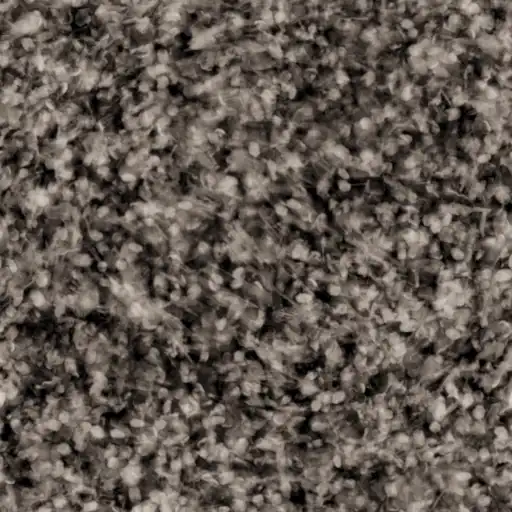

|

**This material is contained in the following Exapacks:**

    - XTRPbr_05k_Vol_001
    - XTRPbr_1k_Vol_001
    - XTRPbr_2k_Vol_002
    - XTRPbr_4k_Vol_004
    - XTRPbr_8k_Vol_006

Fingerprints 008
****************

.. image:: ../_static/_images/material_list/surface_imperfections/fingerprints_008/fingerprints_008.webp
    :width: 30%
    :align: center
    :alt: Fingerprints 008

|

**This material is contained in the following Exapacks:**

    - XTRPbr_05k_Vol_001
    - XTRPbr_1k_Vol_001
    - XTRPbr_2k_Vol_002
    - XTRPbr_4k_Vol_004
    - XTRPbr_8k_Vol_006

Fingerprints 009
****************

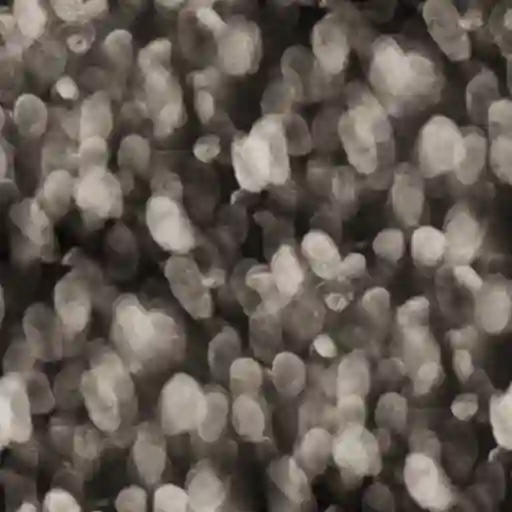

|

**This material is contained in the following Exapacks:**

    - XTRPbr_05k_Vol_001
    - XTRPbr_1k_Vol_001
    - XTRPbr_2k_Vol_002

Fingerprints 010
****************

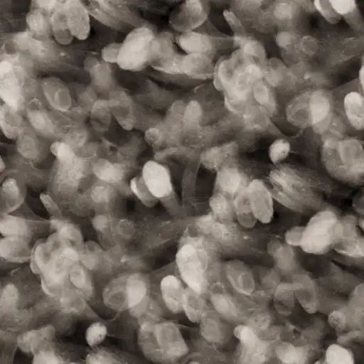

|

**This material is contained in the following Exapacks:**

    - XTRPbr_05k_Vol_001
    - XTRPbr_1k_Vol_001
    - XTRPbr_2k_Vol_002

Fingerprints 011
****************

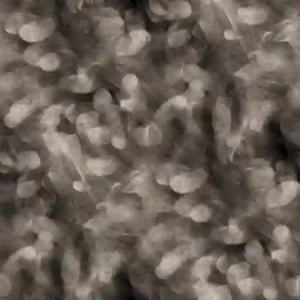

|

**This material is contained in the following Exapacks:**

    - XTRPbr_05k_Vol_001
    - XTRPbr_1k_Vol_001
    - XTRPbr_2k_Vol_002

Fingerprints 012
****************

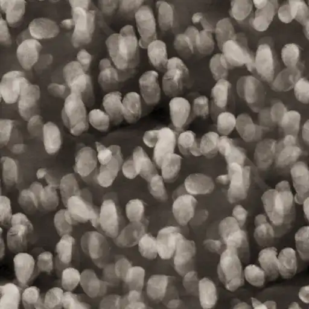

|

**This material is contained in the following Exapacks:**

    - XTRPbr_05k_Vol_001
    - XTRPbr_1k_Vol_001
    - XTRPbr_2k_Vol_002

Fingerprints 013
****************

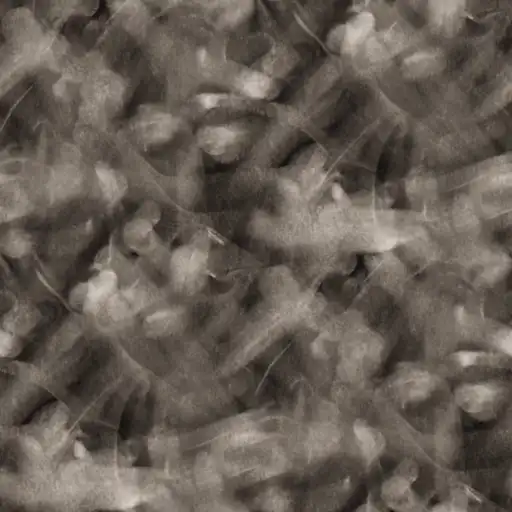

|

**This material is contained in the following Exapacks:**

    - XTRPbr_05k_Vol_001
    - XTRPbr_1k_Vol_001
    - XTRPbr_2k_Vol_002

Fingerprints 014
****************

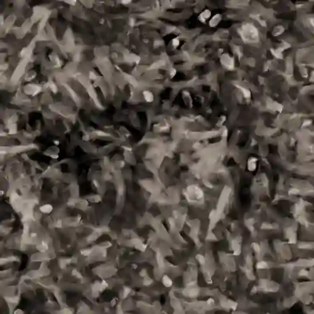

|

**This material is contained in the following Exapacks:**

    - XTRPbr_05k_Vol_001
    - XTRPbr_1k_Vol_001
    - XTRPbr_2k_Vol_002

Fingerprints 015
****************

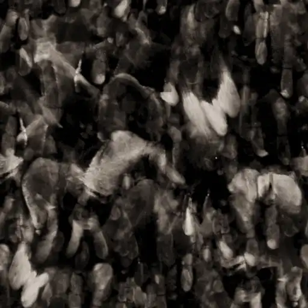

|

**This material is contained in the following Exapacks:**

    - XTRPbr_05k_Vol_001
    - XTRPbr_1k_Vol_001
    - XTRPbr_2k_Vol_002

Footsteps 001
*************

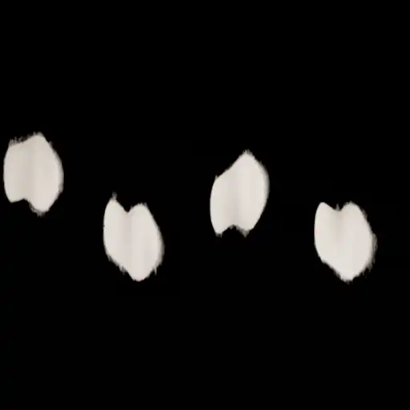

|

**This material is contained in the following Exapacks:**

    - XTRPbr_05k_Vol_001
    - XTRPbr_1k_Vol_001
    - XTRPbr_2k_Vol_002
    - XTRPbr_4k_Vol_004
    - XTRPbr_8k_Vol_006

Handprint 001
*************

|

**This material is contained in the following Exapacks:**

    - XTRPbr_05k_Vol_001
    - XTRPbr_1k_Vol_001
    - XTRPbr_2k_Vol_002

Handprint 002
*************

|

**This material is contained in the following Exapacks:**

    - XTRPbr_05k_Vol_001
    - XTRPbr_1k_Vol_001
    - XTRPbr_2k_Vol_002
    - XTRPbr_4k_Vol_004

Imperfections 001
*****************

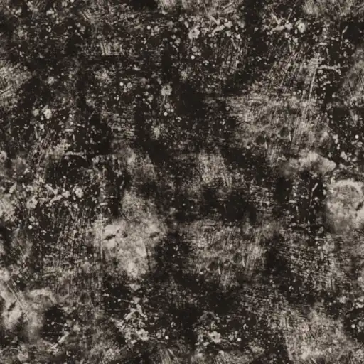

|

**This material is contained in the following Exapacks:**

    - XTRPbr_05k_Vol_001
    - XTRPbr_1k_Vol_001
    - XTRPbr_2k_Vol_002
    - XTRPbr_4k_Vol_004

Imperfections 002
*****************

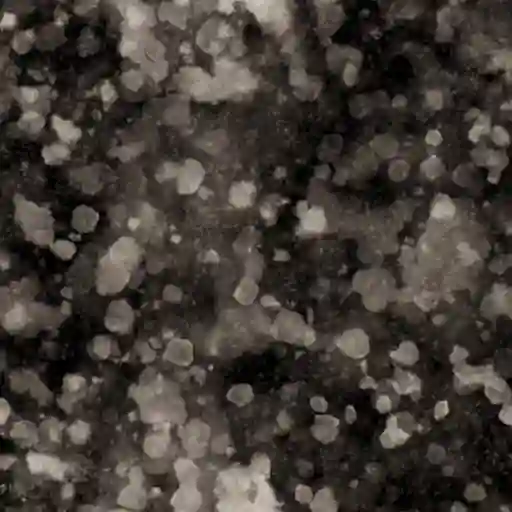

|

**This material is contained in the following Exapacks:**

    - XTRPbr_05k_Vol_001
    - XTRPbr_1k_Vol_001
    - XTRPbr_2k_Vol_002
    - XTRPbr_4k_Vol_004

Imperfections 003
*****************

.. image:: ../_static/_images/material_list/surface_imperfections/imperfections_003/imperfections_003.webp
    :width: 30%
    :align: center
    :alt: Imperfections 003

|

**This material is contained in the following Exapacks:**

    - XTRPbr_05k_Vol_001
    - XTRPbr_1k_Vol_001
    - XTRPbr_2k_Vol_002
    - XTRPbr_4k_Vol_004

Imperfections 004
*****************

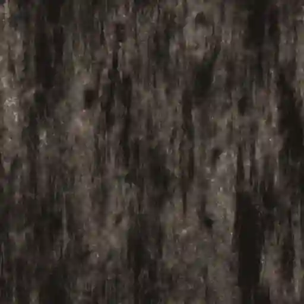

|

**This material is contained in the following Exapacks:**

    - XTRPbr_05k_Vol_001
    - XTRPbr_1k_Vol_001
    - XTRPbr_2k_Vol_002
    - XTRPbr_4k_Vol_004

Imperfections 005
*****************

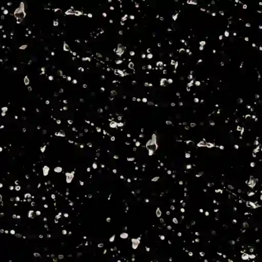

|

**This material is contained in the following Exapacks:**

    - XTRPbr_05k_Vol_001
    - XTRPbr_1k_Vol_001
    - XTRPbr_2k_Vol_002
    - XTRPbr_4k_Vol_004

Imperfections 006
*****************

.. image:: ../_static/_images/material_list/surface_imperfections/imperfections_006/imperfections_006.webp
    :width: 30%
    :align: center
    :alt: Imperfections 006

|

**This material is contained in the following Exapacks:**

    - XTRPbr_05k_Vol_001
    - XTRPbr_1k_Vol_001
    - XTRPbr_2k_Vol_002
    - XTRPbr_4k_Vol_004

Imperfections 007
*****************

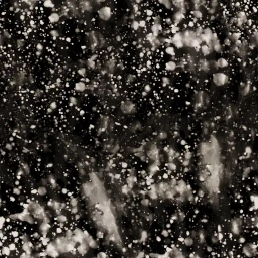

|

**This material is contained in the following Exapacks:**

    - XTRPbr_05k_Vol_001
    - XTRPbr_1k_Vol_001
    - XTRPbr_2k_Vol_002
    - XTRPbr_4k_Vol_004

Imperfections 008
*****************

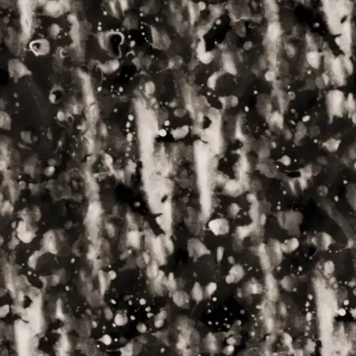

|

**This material is contained in the following Exapacks:**

    - XTRPbr_05k_Vol_001
    - XTRPbr_1k_Vol_001
    - XTRPbr_2k_Vol_002
    - XTRPbr_4k_Vol_004

Imperfections 009
*****************

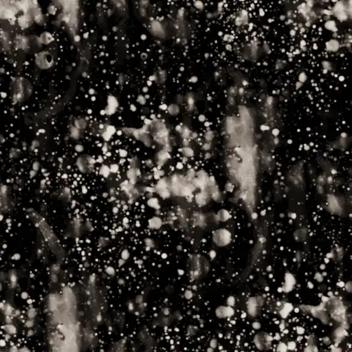

|

**This material is contained in the following Exapacks:**

    - XTRPbr_05k_Vol_001
    - XTRPbr_1k_Vol_001
    - XTRPbr_2k_Vol_002
    - XTRPbr_4k_Vol_004

Imperfections 010
*****************

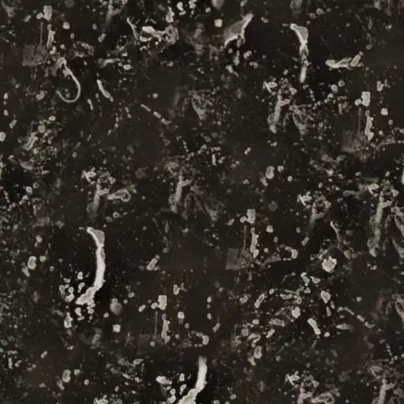

|

**This material is contained in the following Exapacks:**

    - XTRPbr_05k_Vol_001
    - XTRPbr_1k_Vol_001
    - XTRPbr_2k_Vol_002
    - XTRPbr_4k_Vol_004

Liquid Stains 001
*****************

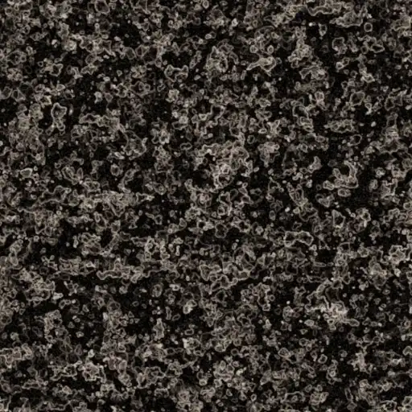

|

**This material is contained in the following Exapacks:**

    - XTRPbr_05k_Vol_001
    - XTRPbr_1k_Vol_001
    - XTRPbr_2k_Vol_002
    - XTRPbr_4k_Vol_004

Liquid Stains 002
*****************

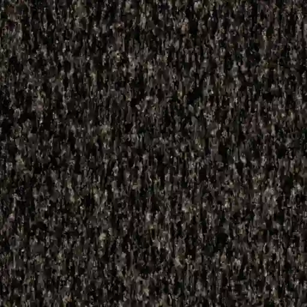

|

**This material is contained in the following Exapacks:**

    - XTRPbr_05k_Vol_001
    - XTRPbr_1k_Vol_001
    - XTRPbr_2k_Vol_002
    - XTRPbr_4k_Vol_004

Liquid Stains 003
*****************

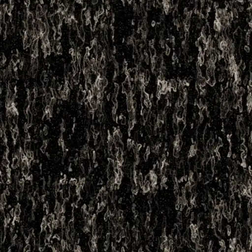

|

**This material is contained in the following Exapacks:**

    - XTRPbr_05k_Vol_001
    - XTRPbr_1k_Vol_001
    - XTRPbr_2k_Vol_002
    - XTRPbr_4k_Vol_004

Round Stains 001
****************

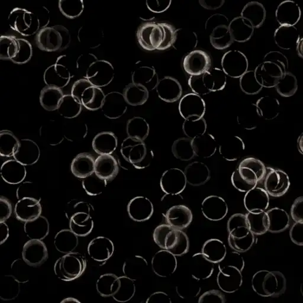

|

**This material is contained in the following Exapacks:**

    - XTRPbr_05k_Vol_001
    - XTRPbr_1k_Vol_001
    - XTRPbr_2k_Vol_002
    - XTRPbr_4k_Vol_004
    - XTRPbr_8k_Vol_006

Round Stains 002
****************

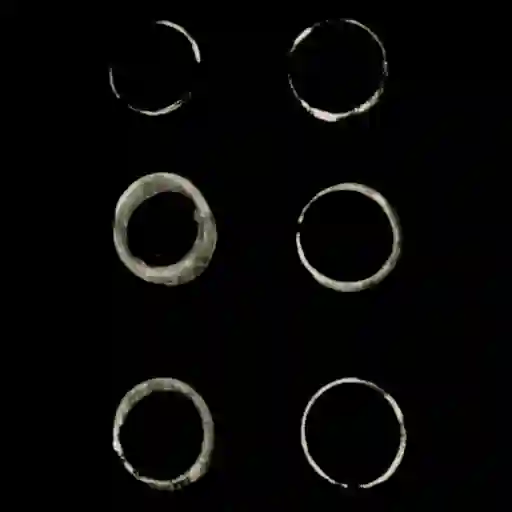

|

**This material is contained in the following Exapacks:**

    - XTRPbr_05k_Vol_001
    - XTRPbr_1k_Vol_001
    - XTRPbr_2k_Vol_002
    - XTRPbr_4k_Vol_004
    - XTRPbr_8k_Vol_006

Round Stains 003
****************

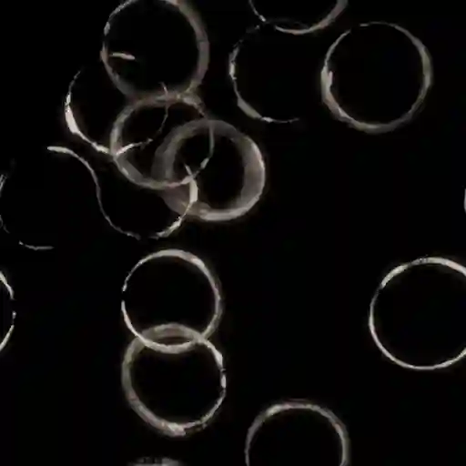

|

**This material is contained in the following Exapacks:**

    - XTRPbr_05k_Vol_001
    - XTRPbr_1k_Vol_001
    - XTRPbr_2k_Vol_002
    - XTRPbr_4k_Vol_004
    - XTRPbr_8k_Vol_006

Scratches 001
*************

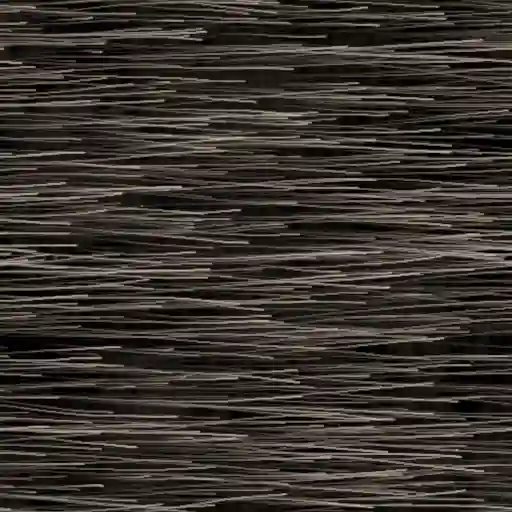

|

**This material is contained in the following Exapacks:**

    - XTRPbr_05k_Vol_001
    - XTRPbr_1k_Vol_001
    - XTRPbr_2k_Vol_002
    - XTRPbr_4k_Vol_004

Scratches 002
*************

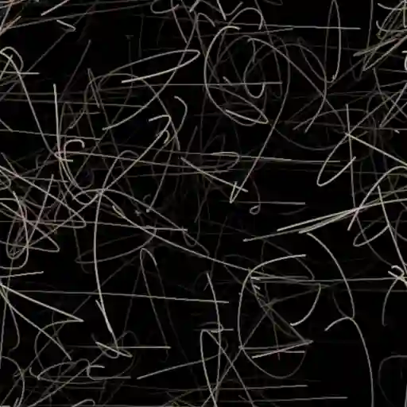

|

**This material is contained in the following Exapacks:**

    - XTRPbr_05k_Vol_001
    - XTRPbr_1k_Vol_001
    - XTRPbr_2k_Vol_002
    - XTRPbr_4k_Vol_004

Scratches 003
*************

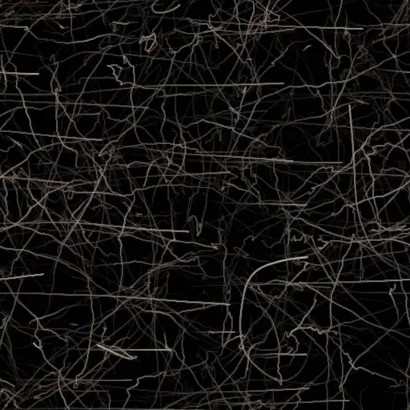

|

**This material is contained in the following Exapacks:**

    - XTRPbr_05k_Vol_001
    - XTRPbr_1k_Vol_001
    - XTRPbr_2k_Vol_002
    - XTRPbr_4k_Vol_004

Scratches 004
*************

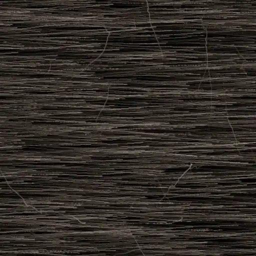

|

**This material is contained in the following Exapacks:**

    - XTRPbr_05k_Vol_001
    - XTRPbr_1k_Vol_001
    - XTRPbr_2k_Vol_002
    - XTRPbr_4k_Vol_004

Scratches 005
*************

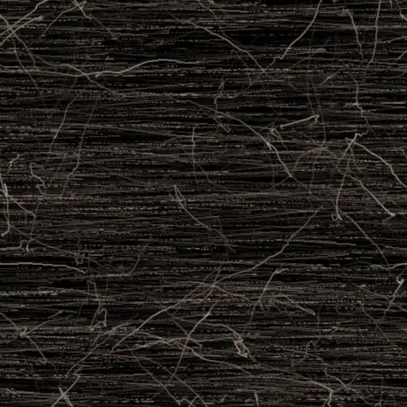

|

**This material is contained in the following Exapacks:**

    - XTRPbr_05k_Vol_001
    - XTRPbr_1k_Vol_001
    - XTRPbr_2k_Vol_002
    - XTRPbr_4k_Vol_004

Scratches 006
*************

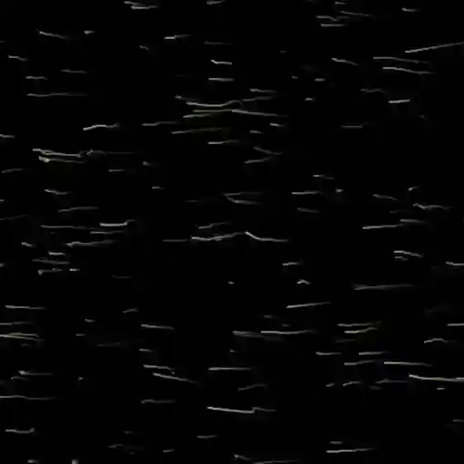

|

**This material is contained in the following Exapacks:**

    - XTRPbr_05k_Vol_001
    - XTRPbr_1k_Vol_001
    - XTRPbr_2k_Vol_002
    - XTRPbr_4k_Vol_004

Scratches 007
*************

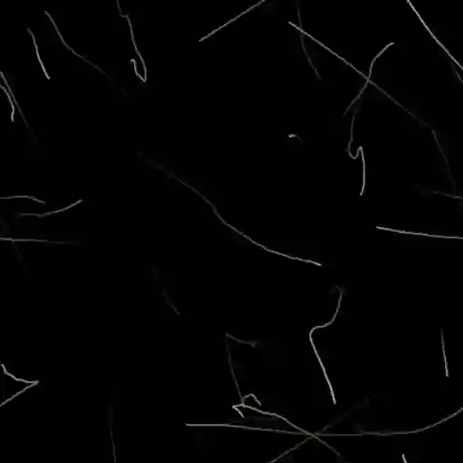

|

**This material is contained in the following Exapacks:**

    - XTRPbr_05k_Vol_001
    - XTRPbr_1k_Vol_001
    - XTRPbr_2k_Vol_002
    - XTRPbr_4k_Vol_004

Smear 001
*********

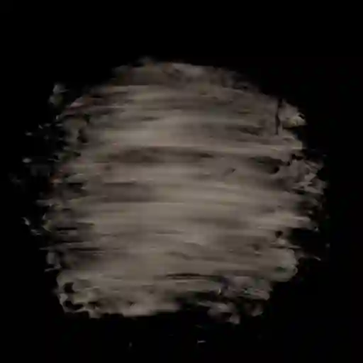

|

**This material is contained in the following Exapacks:**

    - XTRPbr_05k_Vol_001
    - XTRPbr_1k_Vol_001
    - XTRPbr_2k_Vol_002
    - XTRPbr_4k_Vol_004
    - XTRPbr_8k_Vol_006

Smear 002
*********

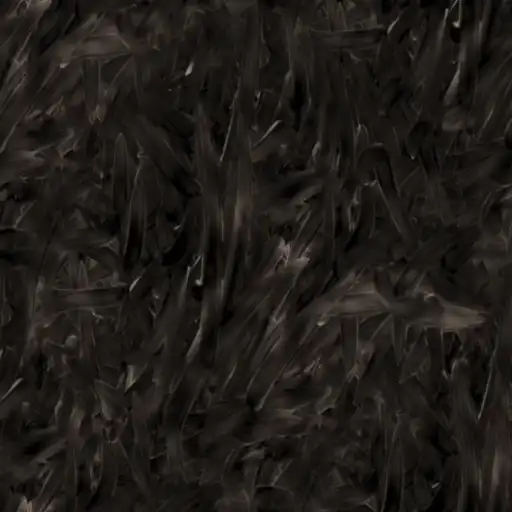

|

**This material is contained in the following Exapacks:**

    - XTRPbr_05k_Vol_001
    - XTRPbr_1k_Vol_001
    - XTRPbr_2k_Vol_002
    - XTRPbr_4k_Vol_004
    - XTRPbr_8k_Vol_006

Smear 003
*********

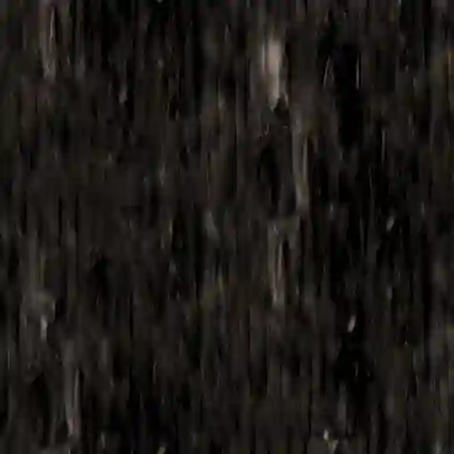

|

**This material is contained in the following Exapacks:**

    - XTRPbr_05k_Vol_001
    - XTRPbr_1k_Vol_001
    - XTRPbr_2k_Vol_002
    - XTRPbr_4k_Vol_004

Smear 004
*********

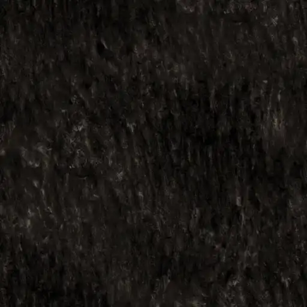

|

**This material is contained in the following Exapacks:**

    - XTRPbr_05k_Vol_001
    - XTRPbr_1k_Vol_001
    - XTRPbr_2k_Vol_002
    - XTRPbr_4k_Vol_004
    - XTRPbr_8k_Vol_006

Smear 005
*********

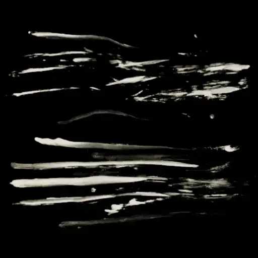

|

**This material is contained in the following Exapacks:**

    - XTRPbr_05k_Vol_001
    - XTRPbr_1k_Vol_001
    - XTRPbr_2k_Vol_002
    - XTRPbr_4k_Vol_004
    - XTRPbr_8k_Vol_006

Smear 006
*********

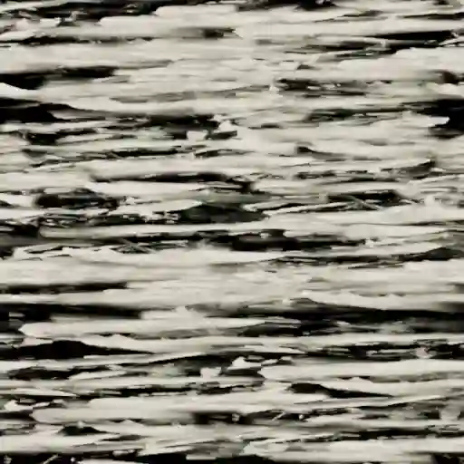

|

**This material is contained in the following Exapacks:**

    - XTRPbr_05k_Vol_001
    - XTRPbr_1k_Vol_001
    - XTRPbr_2k_Vol_002
    - XTRPbr_4k_Vol_004
    - XTRPbr_8k_Vol_006

Smear 007
*********

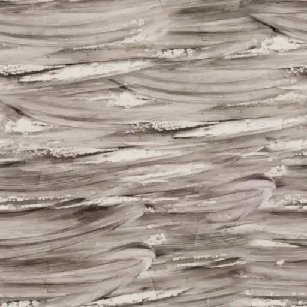

|

**This material is contained in the following Exapacks:**

    - XTRPbr_05k_Vol_001
    - XTRPbr_1k_Vol_001
    - XTRPbr_2k_Vol_002
    - XTRPbr_4k_Vol_004

Water Droplets 001
******************

.. image:: ../_static/_images/material_list/surface_imperfections/water_droplets_001/water_droplets_001.webp
    :width: 30%
    :align: center
    :alt: Water Droplets 001

|

**This material is contained in the following Exapacks:**

    - XTRPbr_05k_Vol_001
    - XTRPbr_1k_Vol_001
    - XTRPbr_2k_Vol_002
    - XTRPbr_4k_Vol_004

Water Droplets 002
******************

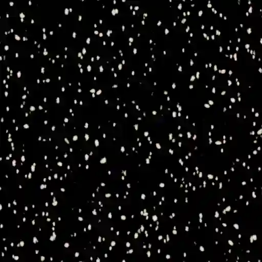

|

**This material is contained in the following Exapacks:**

    - XTRPbr_05k_Vol_001
    - XTRPbr_1k_Vol_001
    - XTRPbr_2k_Vol_002
    - XTRPbr_4k_Vol_004

Water Droplets 003
******************

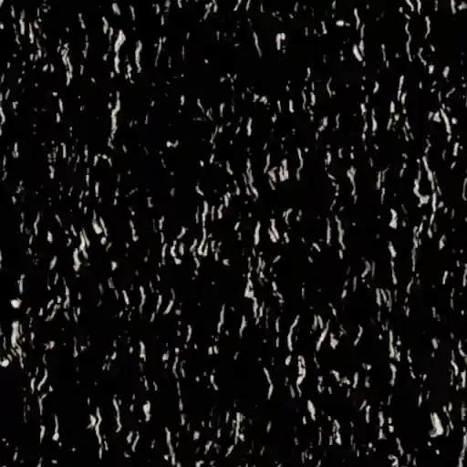

|

**This material is contained in the following Exapacks:**

    - XTRPbr_05k_Vol_001
    - XTRPbr_1k_Vol_001
    - XTRPbr_2k_Vol_002
    - XTRPbr_4k_Vol_004

