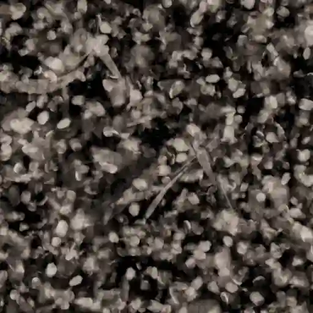
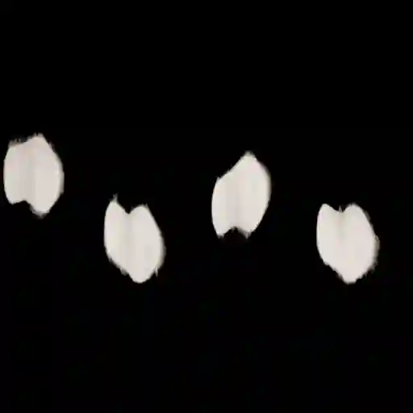
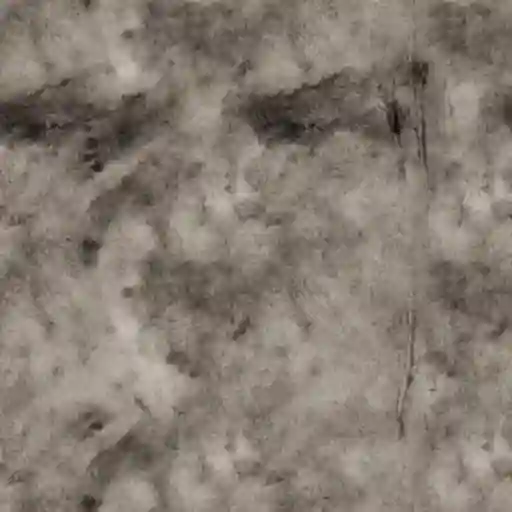
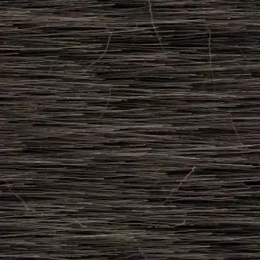
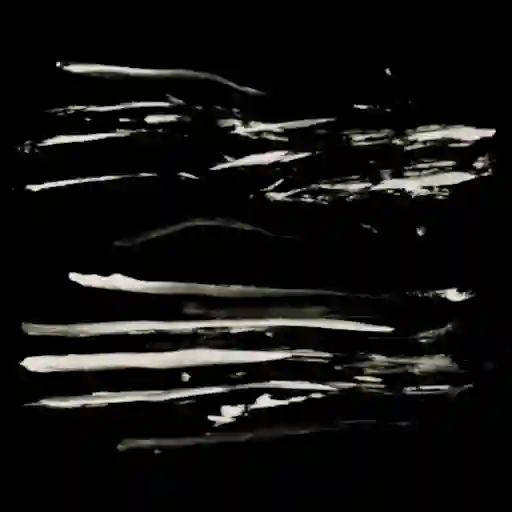

Surface Imperfections (Category)
--------------------------------

Dirt 001
********

.. image:: ../_static/_images/material_list/surface_imperfections/dirt_001/dirt_001.webp
    :width: 30%
    :align: center
    :alt: Dirt 001

|

**This material is contained in the following Exapacks:**

    - XTRPbr_05k_Vol_001
    - XTRPbr_1k_Vol_001
    - XTRPbr_2k_Vol_002
    - XTRPbr_4k_Vol_004

Dirt 002
********

.. image:: ../_static/_images/material_list/surface_imperfections/dirt_002/dirt_002.webp
    :width: 30%
    :align: center
    :alt: Dirt 002

|

**This material is contained in the following Exapacks:**

    - XTRPbr_05k_Vol_001
    - XTRPbr_1k_Vol_001
    - XTRPbr_2k_Vol_002
    - XTRPbr_4k_Vol_004

Dirt 003
********

.. image:: ../_static/_images/material_list/surface_imperfections/dirt_003/dirt_003.webp
    :width: 30%
    :align: center
    :alt: Dirt 003

|

**This material is contained in the following Exapacks:**

    - XTRPbr_05k_Vol_001
    - XTRPbr_1k_Vol_001
    - XTRPbr_2k_Vol_002
    - XTRPbr_4k_Vol_004

Dirt 004
********

.. image:: ../_static/_images/material_list/surface_imperfections/dirt_004/dirt_004.webp
    :width: 30%
    :align: center
    :alt: Dirt 004

|

**This material is contained in the following Exapacks:**

    - XTRPbr_05k_Vol_001
    - XTRPbr_1k_Vol_001
    - XTRPbr_2k_Vol_002
    - XTRPbr_4k_Vol_004

Dirt 005
********

.. image:: ../_static/_images/material_list/surface_imperfections/dirt_005/dirt_005.webp
    :width: 30%
    :align: center
    :alt: Dirt 005

|

**This material is contained in the following Exapacks:**

    - XTRPbr_05k_Vol_001
    - XTRPbr_1k_Vol_001
    - XTRPbr_2k_Vol_002
    - XTRPbr_4k_Vol_004

Dirt 006
********

.. image:: ../_static/_images/material_list/surface_imperfections/dirt_006/dirt_006.webp
    :width: 30%
    :align: center
    :alt: Dirt 006

|

**This material is contained in the following Exapacks:**

    - XTRPbr_05k_Vol_001
    - XTRPbr_1k_Vol_001
    - XTRPbr_2k_Vol_002
    - XTRPbr_4k_Vol_004

Dirt 007
********

.. image:: ../_static/_images/material_list/surface_imperfections/dirt_007/dirt_007.webp
    :width: 30%
    :align: center
    :alt: Dirt 007

|

**This material is contained in the following Exapacks:**

    - XTRPbr_05k_Vol_001
    - XTRPbr_1k_Vol_001
    - XTRPbr_2k_Vol_002
    - XTRPbr_4k_Vol_004

Dripping Paint 001
******************

|

**This material is contained in the following Exapacks:**

    - XTRPbr_05k_Vol_001
    - XTRPbr_1k_Vol_001
    - XTRPbr_2k_Vol_002
    - XTRPbr_4k_Vol_004
    - XTRPbr_8k_Vol_006

Dust Wipes 01
*************

.. image:: ../_static/_images/material_list/surface_imperfections/dust_wipes_01/dust_wipes_01.webp
    :width: 30%
    :align: center
    :alt: Dust Wipes 01

|

**This material is contained in the following Exapacks:**

    - XTRPbr_05k_Vol_001
    - XTRPbr_1k_Vol_001
    - XTRPbr_2k_Vol_002

Fingerprints 001
****************

.. image:: ../_static/_images/material_list/surface_imperfections/fingerprints_001/fingerprints_001.webp
    :width: 30%
    :align: center
    :alt: Fingerprints 001

|

**This material is contained in the following Exapacks:**

    - XTRPbr_05k_Vol_001
    - XTRPbr_1k_Vol_001
    - XTRPbr_2k_Vol_002
    - XTRPbr_4k_Vol_004

Fingerprints 002
****************

.. image:: ../_static/_images/material_list/surface_imperfections/fingerprints_002/fingerprints_002.webp
    :width: 30%
    :align: center
    :alt: Fingerprints 002

|

**This material is contained in the following Exapacks:**

    - XTRPbr_05k_Vol_001
    - XTRPbr_1k_Vol_001
    - XTRPbr_2k_Vol_002
    - XTRPbr_4k_Vol_004

Fingerprints 003
****************

.. image:: ../_static/_images/material_list/surface_imperfections/fingerprints_003/fingerprints_003.webp
    :width: 30%
    :align: center
    :alt: Fingerprints 003

|

**This material is contained in the following Exapacks:**

    - XTRPbr_05k_Vol_001
    - XTRPbr_1k_Vol_001
    - XTRPbr_2k_Vol_002
    - XTRPbr_4k_Vol_004

Fingerprints 004
****************

.. image:: ../_static/_images/material_list/surface_imperfections/fingerprints_004/fingerprints_004.webp
    :width: 30%
    :align: center
    :alt: Fingerprints 004

|

**This material is contained in the following Exapacks:**

    - XTRPbr_05k_Vol_001
    - XTRPbr_1k_Vol_001
    - XTRPbr_2k_Vol_002
    - XTRPbr_4k_Vol_004
    - XTRPbr_8k_Vol_006

Fingerprints 005
****************

.. image:: ../_static/_images/material_list/surface_imperfections/fingerprints_005/fingerprints_005.webp
    :width: 30%
    :align: center
    :alt: Fingerprints 005

|

**This material is contained in the following Exapacks:**

    - XTRPbr_05k_Vol_001
    - XTRPbr_1k_Vol_001
    - XTRPbr_2k_Vol_002
    - XTRPbr_4k_Vol_004
    - XTRPbr_8k_Vol_006

Fingerprints 006
****************

|

**This material is contained in the following Exapacks:**

    - XTRPbr_05k_Vol_001
    - XTRPbr_1k_Vol_001
    - XTRPbr_2k_Vol_002
    - XTRPbr_4k_Vol_004
    - XTRPbr_8k_Vol_006

Fingerprints 007
****************

.. image:: ../_static/_images/material_list/surface_imperfections/fingerprints_007/fingerprints_007.webp
    :width: 30%
    :align: center
    :alt: Fingerprints 007

|

**This material is contained in the following Exapacks:**

    - XTRPbr_05k_Vol_001
    - XTRPbr_1k_Vol_001
    - XTRPbr_2k_Vol_002
    - XTRPbr_4k_Vol_004
    - XTRPbr_8k_Vol_006

Fingerprints 008
****************

.. image:: ../_static/_images/material_list/surface_imperfections/fingerprints_008/fingerprints_008.webp
    :width: 30%
    :align: center
    :alt: Fingerprints 008

|

**This material is contained in the following Exapacks:**

    - XTRPbr_05k_Vol_001
    - XTRPbr_1k_Vol_001
    - XTRPbr_2k_Vol_002
    - XTRPbr_4k_Vol_004
    - XTRPbr_8k_Vol_006

Fingerprints 009
****************

.. image:: ../_static/_images/material_list/surface_imperfections/fingerprints_009/fingerprints_009.webp
    :width: 30%
    :align: center
    :alt: Fingerprints 009

|

**This material is contained in the following Exapacks:**

    - XTRPbr_05k_Vol_001
    - XTRPbr_1k_Vol_001
    - XTRPbr_2k_Vol_002

Fingerprints 010
****************

.. image:: ../_static/_images/material_list/surface_imperfections/fingerprints_010/fingerprints_010.webp
    :width: 30%
    :align: center
    :alt: Fingerprints 010

|

**This material is contained in the following Exapacks:**

    - XTRPbr_05k_Vol_001
    - XTRPbr_1k_Vol_001
    - XTRPbr_2k_Vol_002

Fingerprints 011
****************

.. image:: ../_static/_images/material_list/surface_imperfections/fingerprints_011/fingerprints_011.webp
    :width: 30%
    :align: center
    :alt: Fingerprints 011

|

**This material is contained in the following Exapacks:**

    - XTRPbr_05k_Vol_001
    - XTRPbr_1k_Vol_001
    - XTRPbr_2k_Vol_002

Fingerprints 012
****************

.. image:: ../_static/_images/material_list/surface_imperfections/fingerprints_012/fingerprints_012.webp
    :width: 30%
    :align: center
    :alt: Fingerprints 012

|

**This material is contained in the following Exapacks:**

    - XTRPbr_05k_Vol_001
    - XTRPbr_1k_Vol_001
    - XTRPbr_2k_Vol_002

Fingerprints 013
****************

.. image:: ../_static/_images/material_list/surface_imperfections/fingerprints_013/fingerprints_013.webp
    :width: 30%
    :align: center
    :alt: Fingerprints 013

|

**This material is contained in the following Exapacks:**

    - XTRPbr_05k_Vol_001
    - XTRPbr_1k_Vol_001
    - XTRPbr_2k_Vol_002

Fingerprints 014
****************

.. image:: ../_static/_images/material_list/surface_imperfections/fingerprints_014/fingerprints_014.webp
    :width: 30%
    :align: center
    :alt: Fingerprints 014

|

**This material is contained in the following Exapacks:**

    - XTRPbr_05k_Vol_001
    - XTRPbr_1k_Vol_001
    - XTRPbr_2k_Vol_002

Fingerprints 015
****************

.. image:: ../_static/_images/material_list/surface_imperfections/fingerprints_015/fingerprints_015.webp
    :width: 30%
    :align: center
    :alt: Fingerprints 015

|

**This material is contained in the following Exapacks:**

    - XTRPbr_05k_Vol_001
    - XTRPbr_1k_Vol_001
    - XTRPbr_2k_Vol_002

Footsteps 001
*************

|

**This material is contained in the following Exapacks:**

    - XTRPbr_05k_Vol_001
    - XTRPbr_1k_Vol_001
    - XTRPbr_2k_Vol_002
    - XTRPbr_4k_Vol_004
    - XTRPbr_8k_Vol_006

Handprint 001
*************

.. image:: ../_static/_images/material_list/surface_imperfections/handprint_001/handprint_001.webp
    :width: 30%
    :align: center
    :alt: Handprint 001

|

**This material is contained in the following Exapacks:**

    - XTRPbr_05k_Vol_001
    - XTRPbr_1k_Vol_001
    - XTRPbr_2k_Vol_002

Handprint 002
*************

|

**This material is contained in the following Exapacks:**

    - XTRPbr_05k_Vol_001
    - XTRPbr_1k_Vol_001
    - XTRPbr_2k_Vol_002
    - XTRPbr_4k_Vol_004

Imperfections 001
*****************

.. image:: ../_static/_images/material_list/surface_imperfections/imperfections_001/imperfections_001.webp
    :width: 30%
    :align: center
    :alt: Imperfections 001

|

**This material is contained in the following Exapacks:**

    - XTRPbr_05k_Vol_001
    - XTRPbr_1k_Vol_001
    - XTRPbr_2k_Vol_002
    - XTRPbr_4k_Vol_004

Imperfections 002
*****************

.. image:: ../_static/_images/material_list/surface_imperfections/imperfections_002/imperfections_002.webp
    :width: 30%
    :align: center
    :alt: Imperfections 002

|

**This material is contained in the following Exapacks:**

    - XTRPbr_05k_Vol_001
    - XTRPbr_1k_Vol_001
    - XTRPbr_2k_Vol_002
    - XTRPbr_4k_Vol_004

Imperfections 003
*****************

.. image:: ../_static/_images/material_list/surface_imperfections/imperfections_003/imperfections_003.webp
    :width: 30%
    :align: center
    :alt: Imperfections 003

|

**This material is contained in the following Exapacks:**

    - XTRPbr_05k_Vol_001
    - XTRPbr_1k_Vol_001
    - XTRPbr_2k_Vol_002
    - XTRPbr_4k_Vol_004

Imperfections 004
*****************

.. image:: ../_static/_images/material_list/surface_imperfections/imperfections_004/imperfections_004.webp
    :width: 30%
    :align: center
    :alt: Imperfections 004

|

**This material is contained in the following Exapacks:**

    - XTRPbr_05k_Vol_001
    - XTRPbr_1k_Vol_001
    - XTRPbr_2k_Vol_002
    - XTRPbr_4k_Vol_004

Imperfections 005
*****************

.. image:: ../_static/_images/material_list/surface_imperfections/imperfections_005/imperfections_005.webp
    :width: 30%
    :align: center
    :alt: Imperfections 005

|

**This material is contained in the following Exapacks:**

    - XTRPbr_05k_Vol_001
    - XTRPbr_1k_Vol_001
    - XTRPbr_2k_Vol_002
    - XTRPbr_4k_Vol_004

Imperfections 006
*****************

|

**This material is contained in the following Exapacks:**

    - XTRPbr_05k_Vol_001
    - XTRPbr_1k_Vol_001
    - XTRPbr_2k_Vol_002
    - XTRPbr_4k_Vol_004

Imperfections 007
*****************

.. image:: ../_static/_images/material_list/surface_imperfections/imperfections_007/imperfections_007.webp
    :width: 30%
    :align: center
    :alt: Imperfections 007

|

**This material is contained in the following Exapacks:**

    - XTRPbr_05k_Vol_001
    - XTRPbr_1k_Vol_001
    - XTRPbr_2k_Vol_002
    - XTRPbr_4k_Vol_004

Imperfections 008
*****************

.. image:: ../_static/_images/material_list/surface_imperfections/imperfections_008/imperfections_008.webp
    :width: 30%
    :align: center
    :alt: Imperfections 008

|

**This material is contained in the following Exapacks:**

    - XTRPbr_05k_Vol_001
    - XTRPbr_1k_Vol_001
    - XTRPbr_2k_Vol_002
    - XTRPbr_4k_Vol_004

Imperfections 009
*****************

.. image:: ../_static/_images/material_list/surface_imperfections/imperfections_009/imperfections_009.webp
    :width: 30%
    :align: center
    :alt: Imperfections 009

|

**This material is contained in the following Exapacks:**

    - XTRPbr_05k_Vol_001
    - XTRPbr_1k_Vol_001
    - XTRPbr_2k_Vol_002
    - XTRPbr_4k_Vol_004

Imperfections 010
*****************

.. image:: ../_static/_images/material_list/surface_imperfections/imperfections_010/imperfections_010.webp
    :width: 30%
    :align: center
    :alt: Imperfections 010

|

**This material is contained in the following Exapacks:**

    - XTRPbr_05k_Vol_001
    - XTRPbr_1k_Vol_001
    - XTRPbr_2k_Vol_002
    - XTRPbr_4k_Vol_004

Liquid Stains 001
*****************

.. image:: ../_static/_images/material_list/surface_imperfections/liquid_stains_001/liquid_stains_001.webp
    :width: 30%
    :align: center
    :alt: Liquid Stains 001

|

**This material is contained in the following Exapacks:**

    - XTRPbr_05k_Vol_001
    - XTRPbr_1k_Vol_001
    - XTRPbr_2k_Vol_002
    - XTRPbr_4k_Vol_004

Liquid Stains 002
*****************

|

**This material is contained in the following Exapacks:**

    - XTRPbr_05k_Vol_001
    - XTRPbr_1k_Vol_001
    - XTRPbr_2k_Vol_002
    - XTRPbr_4k_Vol_004

Liquid Stains 003
*****************

.. image:: ../_static/_images/material_list/surface_imperfections/liquid_stains_003/liquid_stains_003.webp
    :width: 30%
    :align: center
    :alt: Liquid Stains 003

|

**This material is contained in the following Exapacks:**

    - XTRPbr_05k_Vol_001
    - XTRPbr_1k_Vol_001
    - XTRPbr_2k_Vol_002
    - XTRPbr_4k_Vol_004

Round Stains 001
****************

.. image:: ../_static/_images/material_list/surface_imperfections/round_stains_001/round_stains_001.webp
    :width: 30%
    :align: center
    :alt: Round Stains 001

|

**This material is contained in the following Exapacks:**

    - XTRPbr_05k_Vol_001
    - XTRPbr_1k_Vol_001
    - XTRPbr_2k_Vol_002
    - XTRPbr_4k_Vol_004
    - XTRPbr_8k_Vol_006

Round Stains 002
****************

.. image:: ../_static/_images/material_list/surface_imperfections/round_stains_002/round_stains_002.webp
    :width: 30%
    :align: center
    :alt: Round Stains 002

|

**This material is contained in the following Exapacks:**

    - XTRPbr_05k_Vol_001
    - XTRPbr_1k_Vol_001
    - XTRPbr_2k_Vol_002
    - XTRPbr_4k_Vol_004
    - XTRPbr_8k_Vol_006

Round Stains 003
****************

.. image:: ../_static/_images/material_list/surface_imperfections/round_stains_003/round_stains_003.webp
    :width: 30%
    :align: center
    :alt: Round Stains 003

|

**This material is contained in the following Exapacks:**

    - XTRPbr_05k_Vol_001
    - XTRPbr_1k_Vol_001
    - XTRPbr_2k_Vol_002
    - XTRPbr_4k_Vol_004
    - XTRPbr_8k_Vol_006

Scratches 001
*************

.. image:: ../_static/_images/material_list/surface_imperfections/scratches_001/scratches_001.webp
    :width: 30%
    :align: center
    :alt: Scratches 001

|

**This material is contained in the following Exapacks:**

    - XTRPbr_05k_Vol_001
    - XTRPbr_1k_Vol_001
    - XTRPbr_2k_Vol_002
    - XTRPbr_4k_Vol_004

Scratches 002
*************

.. image:: ../_static/_images/material_list/surface_imperfections/scratches_002/scratches_002.webp
    :width: 30%
    :align: center
    :alt: Scratches 002

|

**This material is contained in the following Exapacks:**

    - XTRPbr_05k_Vol_001
    - XTRPbr_1k_Vol_001
    - XTRPbr_2k_Vol_002
    - XTRPbr_4k_Vol_004

Scratches 003
*************

.. image:: ../_static/_images/material_list/surface_imperfections/scratches_003/scratches_003.webp
    :width: 30%
    :align: center
    :alt: Scratches 003

|

**This material is contained in the following Exapacks:**

    - XTRPbr_05k_Vol_001
    - XTRPbr_1k_Vol_001
    - XTRPbr_2k_Vol_002
    - XTRPbr_4k_Vol_004

Scratches 004
*************

|

**This material is contained in the following Exapacks:**

    - XTRPbr_05k_Vol_001
    - XTRPbr_1k_Vol_001
    - XTRPbr_2k_Vol_002
    - XTRPbr_4k_Vol_004

Scratches 005
*************

.. image:: ../_static/_images/material_list/surface_imperfections/scratches_005/scratches_005.webp
    :width: 30%
    :align: center
    :alt: Scratches 005

|

**This material is contained in the following Exapacks:**

    - XTRPbr_05k_Vol_001
    - XTRPbr_1k_Vol_001
    - XTRPbr_2k_Vol_002
    - XTRPbr_4k_Vol_004

Scratches 006
*************

|

**This material is contained in the following Exapacks:**

    - XTRPbr_05k_Vol_001
    - XTRPbr_1k_Vol_001
    - XTRPbr_2k_Vol_002
    - XTRPbr_4k_Vol_004

Scratches 007
*************

.. image:: ../_static/_images/material_list/surface_imperfections/scratches_007/scratches_007.webp
    :width: 30%
    :align: center
    :alt: Scratches 007

|

**This material is contained in the following Exapacks:**

    - XTRPbr_05k_Vol_001
    - XTRPbr_1k_Vol_001
    - XTRPbr_2k_Vol_002
    - XTRPbr_4k_Vol_004

Smear 001
*********

.. image:: ../_static/_images/material_list/surface_imperfections/smear_001/smear_001.webp
    :width: 30%
    :align: center
    :alt: Smear 001

|

**This material is contained in the following Exapacks:**

    - XTRPbr_05k_Vol_001
    - XTRPbr_1k_Vol_001
    - XTRPbr_2k_Vol_002
    - XTRPbr_4k_Vol_004
    - XTRPbr_8k_Vol_006

Smear 002
*********

.. image:: ../_static/_images/material_list/surface_imperfections/smear_002/smear_002.webp
    :width: 30%
    :align: center
    :alt: Smear 002

|

**This material is contained in the following Exapacks:**

    - XTRPbr_05k_Vol_001
    - XTRPbr_1k_Vol_001
    - XTRPbr_2k_Vol_002
    - XTRPbr_4k_Vol_004
    - XTRPbr_8k_Vol_006

Smear 003
*********

.. image:: ../_static/_images/material_list/surface_imperfections/smear_003/smear_003.webp
    :width: 30%
    :align: center
    :alt: Smear 003

|

**This material is contained in the following Exapacks:**

    - XTRPbr_05k_Vol_001
    - XTRPbr_1k_Vol_001
    - XTRPbr_2k_Vol_002
    - XTRPbr_4k_Vol_004

Smear 004
*********

.. image:: ../_static/_images/material_list/surface_imperfections/smear_004/smear_004.webp
    :width: 30%
    :align: center
    :alt: Smear 004

|

**This material is contained in the following Exapacks:**

    - XTRPbr_05k_Vol_001
    - XTRPbr_1k_Vol_001
    - XTRPbr_2k_Vol_002
    - XTRPbr_4k_Vol_004
    - XTRPbr_8k_Vol_006

Smear 005
*********

|

**This material is contained in the following Exapacks:**

    - XTRPbr_05k_Vol_001
    - XTRPbr_1k_Vol_001
    - XTRPbr_2k_Vol_002
    - XTRPbr_4k_Vol_004
    - XTRPbr_8k_Vol_006

Smear 006
*********

.. image:: ../_static/_images/material_list/surface_imperfections/smear_006/smear_006.webp
    :width: 30%
    :align: center
    :alt: Smear 006

|

**This material is contained in the following Exapacks:**

    - XTRPbr_05k_Vol_001
    - XTRPbr_1k_Vol_001
    - XTRPbr_2k_Vol_002
    - XTRPbr_4k_Vol_004
    - XTRPbr_8k_Vol_006

Smear 007
*********

.. image:: ../_static/_images/material_list/surface_imperfections/smear_007/smear_007.webp
    :width: 30%
    :align: center
    :alt: Smear 007

|

**This material is contained in the following Exapacks:**

    - XTRPbr_05k_Vol_001
    - XTRPbr_1k_Vol_001
    - XTRPbr_2k_Vol_002
    - XTRPbr_4k_Vol_004

Water Droplets 001
******************

.. image:: ../_static/_images/material_list/surface_imperfections/water_droplets_001/water_droplets_001.webp
    :width: 30%
    :align: center
    :alt: Water Droplets 001

|

**This material is contained in the following Exapacks:**

    - XTRPbr_05k_Vol_001
    - XTRPbr_1k_Vol_001
    - XTRPbr_2k_Vol_002
    - XTRPbr_4k_Vol_004

Water Droplets 002
******************

.. image:: ../_static/_images/material_list/surface_imperfections/water_droplets_002/water_droplets_002.webp
    :width: 30%
    :align: center
    :alt: Water Droplets 002

|

**This material is contained in the following Exapacks:**

    - XTRPbr_05k_Vol_001
    - XTRPbr_1k_Vol_001
    - XTRPbr_2k_Vol_002
    - XTRPbr_4k_Vol_004

Water Droplets 003
******************

.. image:: ../_static/_images/material_list/surface_imperfections/water_droplets_003/water_droplets_003.webp
    :width: 30%
    :align: center
    :alt: Water Droplets 003

|

**This material is contained in the following Exapacks:**

    - XTRPbr_05k_Vol_001
    - XTRPbr_1k_Vol_001
    - XTRPbr_2k_Vol_002
    - XTRPbr_4k_Vol_004

