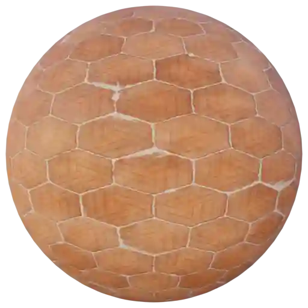
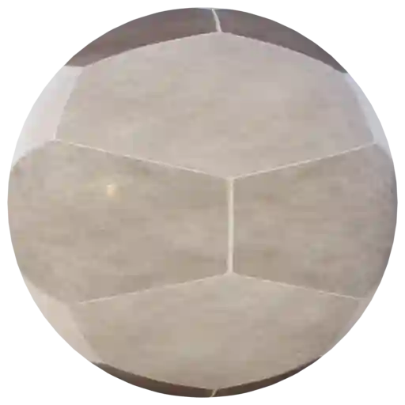
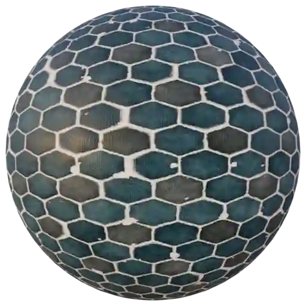
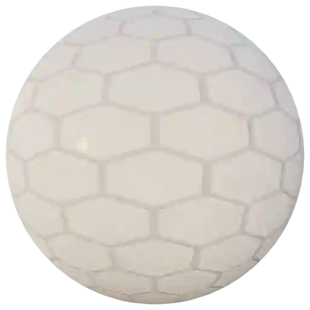

Tiles - Hexagonal (Category)
----------------------------

Hexagonal Brown Tiles 001
*************************

.. image:: ../_static/_images/material_list/tiles_hexagonal/hexagonal_brown_tiles_001/hexagonal_brown_tiles_001.webp
    :width: 30%
    :align: center
    :alt: Hexagonal Brown Tiles 001

|

**This material is contained in the following Exapacks:**

    - XTRPbr_05k_Vol_001
    - XTRPbr_1k_Vol_001
    - XTRPbr_2k_Vol_002
    - XTRPbr_4k_Vol_002
    - XTRPbr_8k_Vol_011

Hexagonal Brown Tiles 002
*************************

.. image:: ../_static/_images/material_list/tiles_hexagonal/hexagonal_brown_tiles_002/hexagonal_brown_tiles_002.webp
    :width: 30%
    :align: center
    :alt: Hexagonal Brown Tiles 002

|

**This material is contained in the following Exapacks:**

    - XTRPbr_05k_Vol_001
    - XTRPbr_1k_Vol_001
    - XTRPbr_2k_Vol_002
    - XTRPbr_4k_Vol_002
    - XTRPbr_8k_Vol_011

Hexagonal Brown Tiles 003
*************************

.. image:: ../_static/_images/material_list/tiles_hexagonal/hexagonal_brown_tiles_003/hexagonal_brown_tiles_003.webp
    :width: 30%
    :align: center
    :alt: Hexagonal Brown Tiles 003

|

**This material is contained in the following Exapacks:**

    - XTRPbr_05k_Vol_001
    - XTRPbr_1k_Vol_001
    - XTRPbr_2k_Vol_002
    - XTRPbr_4k_Vol_002
    - XTRPbr_8k_Vol_011

Hexagonal Brown Tiles 004
*************************

|

**This material is contained in the following Exapacks:**

    - XTRPbr_05k_Vol_001
    - XTRPbr_1k_Vol_001
    - XTRPbr_2k_Vol_002
    - XTRPbr_4k_Vol_002
    - XTRPbr_8k_Vol_011

Hexagonal Brown Tiles 005
*************************

|

**This material is contained in the following Exapacks:**

    - XTRPbr_05k_Vol_001
    - XTRPbr_1k_Vol_001
    - XTRPbr_2k_Vol_002
    - XTRPbr_4k_Vol_002

Hexagonal Green Tiles 001
*************************

|

**This material is contained in the following Exapacks:**

    - XTRPbr_05k_Vol_001
    - XTRPbr_1k_Vol_001
    - XTRPbr_2k_Vol_002
    - XTRPbr_4k_Vol_002

Hexagonal Green Tiles 002
*************************

|

**This material is contained in the following Exapacks:**

    - XTRPbr_05k_Vol_001
    - XTRPbr_1k_Vol_001
    - XTRPbr_2k_Vol_002
    - XTRPbr_4k_Vol_002
    - XTRPbr_8k_Vol_011

Hexagonal Green Tiles 003
*************************

.. image:: ../_static/_images/material_list/tiles_hexagonal/hexagonal_green_tiles_003/hexagonal_green_tiles_003.webp
    :width: 30%
    :align: center
    :alt: Hexagonal Green Tiles 003

|

**This material is contained in the following Exapacks:**

    - XTRPbr_05k_Vol_001
    - XTRPbr_1k_Vol_001
    - XTRPbr_2k_Vol_002
    - XTRPbr_4k_Vol_002
    - XTRPbr_8k_Vol_011

Hexagonal Green Tiles 004
*************************

.. image:: ../_static/_images/material_list/tiles_hexagonal/hexagonal_green_tiles_004/hexagonal_green_tiles_004.webp
    :width: 30%
    :align: center
    :alt: Hexagonal Green Tiles 004

|

**This material is contained in the following Exapacks:**

    - XTRPbr_05k_Vol_001
    - XTRPbr_1k_Vol_001
    - XTRPbr_2k_Vol_002
    - XTRPbr_4k_Vol_002
    - XTRPbr_8k_Vol_011

Hexagonal Green Tiles 005
*************************

.. image:: ../_static/_images/material_list/tiles_hexagonal/hexagonal_green_tiles_005/hexagonal_green_tiles_005.webp
    :width: 30%
    :align: center
    :alt: Hexagonal Green Tiles 005

|

**This material is contained in the following Exapacks:**

    - XTRPbr_05k_Vol_001
    - XTRPbr_1k_Vol_001
    - XTRPbr_2k_Vol_002
    - XTRPbr_4k_Vol_002
    - XTRPbr_8k_Vol_011

Hexagonal White Tiles 001
*************************

|

**This material is contained in the following Exapacks:**

    - XTRPbr_05k_Vol_001
    - XTRPbr_1k_Vol_001
    - XTRPbr_2k_Vol_002
    - XTRPbr_4k_Vol_002
    - XTRPbr_8k_Vol_011

Hexagonal White Tiles 002
*************************

|

**This material is contained in the following Exapacks:**

    - XTRPbr_05k_Vol_001
    - XTRPbr_1k_Vol_001
    - XTRPbr_2k_Vol_002
    - XTRPbr_4k_Vol_002

Hexagonal White Tiles 003
*************************

.. image:: ../_static/_images/material_list/tiles_hexagonal/hexagonal_white_tiles_003/hexagonal_white_tiles_003.webp
    :width: 30%
    :align: center
    :alt: Hexagonal White Tiles 003

|

**This material is contained in the following Exapacks:**

    - XTRPbr_05k_Vol_001
    - XTRPbr_1k_Vol_001
    - XTRPbr_2k_Vol_002
    - XTRPbr_4k_Vol_002

