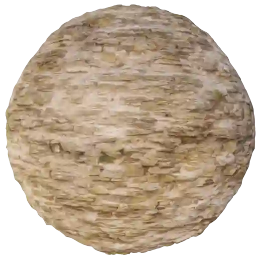
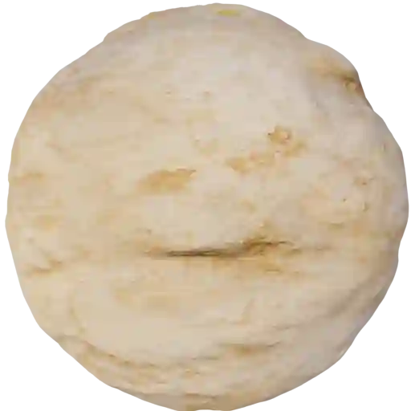
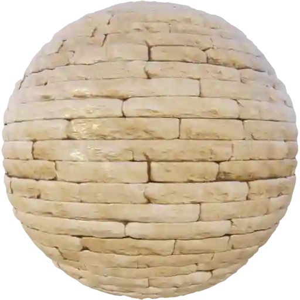
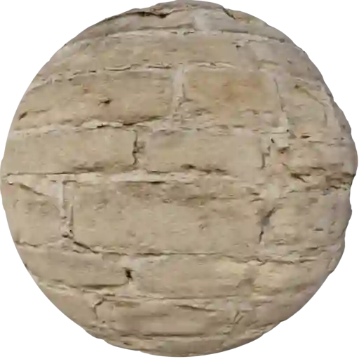

Walls - Stones (Category)
-------------------------

Cobblestone Wall 001
********************

|

**This material is contained in the following Exapacks:**

    - XTRPbr_05k_Vol_001
    - XTRPbr_1k_Vol_001
    - XTRPbr_2k_Vol_002

Cobblestone Wall 002
********************

.. image:: ../_static/_images/material_list/walls_stones/cobblestone_wall_002/cobblestone_wall_002.webp
    :width: 30%
    :align: center
    :alt: Cobblestone Wall 002

|

**This material is contained in the following Exapacks:**

    - XTRPbr_05k_Vol_001
    - XTRPbr_1k_Vol_001
    - XTRPbr_2k_Vol_002

Cobblestone Wall 003
********************

.. image:: ../_static/_images/material_list/walls_stones/cobblestone_wall_003/cobblestone_wall_003.webp
    :width: 30%
    :align: center
    :alt: Cobblestone Wall 003

|

**This material is contained in the following Exapacks:**

    - XTRPbr_05k_Vol_001
    - XTRPbr_1k_Vol_001
    - XTRPbr_2k_Vol_002

Cobblestone Wall 004
********************

.. image:: ../_static/_images/material_list/walls_stones/cobblestone_wall_004/cobblestone_wall_004.webp
    :width: 30%
    :align: center
    :alt: Cobblestone Wall 004

|

**This material is contained in the following Exapacks:**

    - XTRPbr_05k_Vol_001
    - XTRPbr_1k_Vol_001
    - XTRPbr_2k_Vol_002
    - XTRPbr_4k_Vol_002
    - XTRPbr_8k_Vol_005

Defense Wall 01
***************

|

**This material is contained in the following Exapacks:**

    - XTRPbr_05k_Vol_001
    - XTRPbr_1k_Vol_001
    - XTRPbr_2k_Vol_002
    - XTRPbr_4k_Vol_002
    - XTRPbr_8k_Vol_005

Dry Stone Wall 001
******************

.. image:: ../_static/_images/material_list/walls_stones/dry_stone_wall_001/dry_stone_wall_001.webp
    :width: 30%
    :align: center
    :alt: Dry Stone Wall 001

|

**This material is contained in the following Exapacks:**

    - XTRPbr_05k_Vol_001
    - XTRPbr_1k_Vol_001
    - XTRPbr_2k_Vol_002
    - XTRPbr_4k_Vol_002

Flagstone Wall 001
******************

.. image:: ../_static/_images/material_list/walls_stones/flagstone_wall_001/flagstone_wall_001.webp
    :width: 30%
    :align: center
    :alt: Flagstone Wall 001

|

**This material is contained in the following Exapacks:**

    - XTRPbr_05k_Vol_001
    - XTRPbr_1k_Vol_001
    - XTRPbr_2k_Vol_002
    - XTRPbr_4k_Vol_002

Medieval Blocks 001
*******************

.. image:: ../_static/_images/material_list/walls_stones/medieval_blocks_001/medieval_blocks_001.webp
    :width: 30%
    :align: center
    :alt: Medieval Blocks 001

|

**This material is contained in the following Exapacks:**

    - XTRPbr_05k_Vol_001
    - XTRPbr_1k_Vol_001
    - XTRPbr_2k_Vol_002
    - XTRPbr_4k_Vol_002
    - XTRPbr_8k_Vol_005

Medieval Blocks 002
*******************

|

**This material is contained in the following Exapacks:**

    - XTRPbr_05k_Vol_001
    - XTRPbr_1k_Vol_001
    - XTRPbr_2k_Vol_002
    - XTRPbr_4k_Vol_002
    - XTRPbr_8k_Vol_005

Medieval Blocks 003
*******************

.. image:: ../_static/_images/material_list/walls_stones/medieval_blocks_003/medieval_blocks_003.webp
    :width: 30%
    :align: center
    :alt: Medieval Blocks 003

|

**This material is contained in the following Exapacks:**

    - XTRPbr_05k_Vol_001
    - XTRPbr_1k_Vol_001
    - XTRPbr_2k_Vol_002
    - XTRPbr_4k_Vol_002
    - XTRPbr_8k_Vol_005

Medieval Blocks 004
*******************

.. image:: ../_static/_images/material_list/walls_stones/medieval_blocks_004/medieval_blocks_004.webp
    :width: 30%
    :align: center
    :alt: Medieval Blocks 004

|

**This material is contained in the following Exapacks:**

    - XTRPbr_05k_Vol_001
    - XTRPbr_1k_Vol_001
    - XTRPbr_2k_Vol_002
    - XTRPbr_4k_Vol_002
    - XTRPbr_8k_Vol_005

Medieval Wall 001
*****************

|

**This material is contained in the following Exapacks:**

    - XTRPbr_05k_Vol_001
    - XTRPbr_1k_Vol_001
    - XTRPbr_2k_Vol_002
    - XTRPbr_4k_Vol_002
    - XTRPbr_8k_Vol_005

Sandstone Blocks 001
********************

.. image:: ../_static/_images/material_list/walls_stones/sandstone_blocks_001/sandstone_blocks_001.webp
    :width: 30%
    :align: center
    :alt: Sandstone Blocks 001

|

**This material is contained in the following Exapacks:**

    - XTRPbr_05k_Vol_001
    - XTRPbr_1k_Vol_001
    - XTRPbr_2k_Vol_002
    - XTRPbr_4k_Vol_002
    - XTRPbr_8k_Vol_005

Sandstone Blocks 002
********************

.. image:: ../_static/_images/material_list/walls_stones/sandstone_blocks_002/sandstone_blocks_002.webp
    :width: 30%
    :align: center
    :alt: Sandstone Blocks 002

|

**This material is contained in the following Exapacks:**

    - XTRPbr_05k_Vol_001
    - XTRPbr_1k_Vol_001
    - XTRPbr_2k_Vol_002
    - XTRPbr_4k_Vol_002
    - XTRPbr_8k_Vol_005

Sandstone Blocks 003
********************

.. image:: ../_static/_images/material_list/walls_stones/sandstone_blocks_003/sandstone_blocks_003.webp
    :width: 30%
    :align: center
    :alt: Sandstone Blocks 003

|

**This material is contained in the following Exapacks:**

    - XTRPbr_05k_Vol_001
    - XTRPbr_1k_Vol_001
    - XTRPbr_2k_Vol_002
    - XTRPbr_4k_Vol_002
    - XTRPbr_8k_Vol_005

Sandstone Blocks 004
********************

.. image:: ../_static/_images/material_list/walls_stones/sandstone_blocks_004/sandstone_blocks_004.webp
    :width: 30%
    :align: center
    :alt: Sandstone Blocks 004

|

**This material is contained in the following Exapacks:**

    - XTRPbr_05k_Vol_001
    - XTRPbr_1k_Vol_001
    - XTRPbr_2k_Vol_002
    - XTRPbr_4k_Vol_002
    - XTRPbr_8k_Vol_005

Sandstone Blocks 005
********************

|

**This material is contained in the following Exapacks:**

    - XTRPbr_05k_Vol_001
    - XTRPbr_1k_Vol_001
    - XTRPbr_2k_Vol_002
    - XTRPbr_4k_Vol_002

Sandstone Blocks 006
********************

.. image:: ../_static/_images/material_list/walls_stones/sandstone_blocks_006/sandstone_blocks_006.webp
    :width: 30%
    :align: center
    :alt: Sandstone Blocks 006

|

**This material is contained in the following Exapacks:**

    - XTRPbr_05k_Vol_001
    - XTRPbr_1k_Vol_001
    - XTRPbr_2k_Vol_002
    - XTRPbr_4k_Vol_002
    - XTRPbr_8k_Vol_005

Sandstone Blocks 007
********************

|

**This material is contained in the following Exapacks:**

    - XTRPbr_05k_Vol_001
    - XTRPbr_1k_Vol_001
    - XTRPbr_2k_Vol_002
    - XTRPbr_4k_Vol_002
    - XTRPbr_8k_Vol_005

Sandstone Blocks 008
********************

.. image:: ../_static/_images/material_list/walls_stones/sandstone_blocks_008/sandstone_blocks_008.webp
    :width: 30%
    :align: center
    :alt: Sandstone Blocks 008

|

**This material is contained in the following Exapacks:**

    - XTRPbr_05k_Vol_001
    - XTRPbr_1k_Vol_001
    - XTRPbr_2k_Vol_002
    - XTRPbr_4k_Vol_002
    - XTRPbr_8k_Vol_005

Wall Stone 001
**************

.. image:: ../_static/_images/material_list/walls_stones/wall_stone_001/wall_stone_001.webp
    :width: 30%
    :align: center
    :alt: Wall Stone 001

|

**This material is contained in the following Exapacks:**

    - XTRPbr_05k_Vol_001
    - XTRPbr_1k_Vol_001
    - XTRPbr_2k_Vol_002
    - XTRPbr_4k_Vol_002

Wall Stone 002
**************

.. image:: ../_static/_images/material_list/walls_stones/wall_stone_002/wall_stone_002.webp
    :width: 30%
    :align: center
    :alt: Wall Stone 002

|

**This material is contained in the following Exapacks:**

    - XTRPbr_05k_Vol_001
    - XTRPbr_1k_Vol_001
    - XTRPbr_2k_Vol_002
    - XTRPbr_4k_Vol_002

Wall Stone 003
**************

.. image:: ../_static/_images/material_list/walls_stones/wall_stone_003/wall_stone_003.webp
    :width: 30%
    :align: center
    :alt: Wall Stone 003

|

**This material is contained in the following Exapacks:**

    - XTRPbr_05k_Vol_001
    - XTRPbr_1k_Vol_001
    - XTRPbr_2k_Vol_002

Wall Stone 004
**************

|

**This material is contained in the following Exapacks:**

    - XTRPbr_05k_Vol_001
    - XTRPbr_1k_Vol_001
    - XTRPbr_2k_Vol_002
    - XTRPbr_4k_Vol_002
    - XTRPbr_8k_Vol_005

Wall Stone 005
**************

|

**This material is contained in the following Exapacks:**

    - XTRPbr_05k_Vol_001
    - XTRPbr_1k_Vol_001
    - XTRPbr_2k_Vol_002
    - XTRPbr_4k_Vol_002
    - XTRPbr_8k_Vol_005

Wall Stone 006
**************

.. image:: ../_static/_images/material_list/walls_stones/wall_stone_006/wall_stone_006.webp
    :width: 30%
    :align: center
    :alt: Wall Stone 006

|

**This material is contained in the following Exapacks:**

    - XTRPbr_05k_Vol_001
    - XTRPbr_1k_Vol_001
    - XTRPbr_2k_Vol_002
    - XTRPbr_4k_Vol_002
    - XTRPbr_8k_Vol_005

Wall Stone 007
**************

.. image:: ../_static/_images/material_list/walls_stones/wall_stone_007/wall_stone_007.webp
    :width: 30%
    :align: center
    :alt: Wall Stone 007

|

**This material is contained in the following Exapacks:**

    - XTRPbr_05k_Vol_001
    - XTRPbr_1k_Vol_001
    - XTRPbr_2k_Vol_002

Wall Stone 008
**************

.. image:: ../_static/_images/material_list/walls_stones/wall_stone_008/wall_stone_008.webp
    :width: 30%
    :align: center
    :alt: Wall Stone 008

|

**This material is contained in the following Exapacks:**

    - XTRPbr_05k_Vol_001
    - XTRPbr_1k_Vol_001
    - XTRPbr_2k_Vol_002

Wall Stone 009
**************

.. image:: ../_static/_images/material_list/walls_stones/wall_stone_009/wall_stone_009.webp
    :width: 30%
    :align: center
    :alt: Wall Stone 009

|

**This material is contained in the following Exapacks:**

    - XTRPbr_05k_Vol_001
    - XTRPbr_1k_Vol_001
    - XTRPbr_2k_Vol_002

Wall Stone 010
**************

.. image:: ../_static/_images/material_list/walls_stones/wall_stone_010/wall_stone_010.webp
    :width: 30%
    :align: center
    :alt: Wall Stone 010

|

**This material is contained in the following Exapacks:**

    - XTRPbr_05k_Vol_001
    - XTRPbr_1k_Vol_001
    - XTRPbr_2k_Vol_002
    - XTRPbr_4k_Vol_002

Wall Stone 011
**************

.. image:: ../_static/_images/material_list/walls_stones/wall_stone_011/wall_stone_011.webp
    :width: 30%
    :align: center
    :alt: Wall Stone 011

|

**This material is contained in the following Exapacks:**

    - XTRPbr_05k_Vol_001
    - XTRPbr_1k_Vol_001
    - XTRPbr_2k_Vol_002
    - XTRPbr_4k_Vol_002
    - XTRPbr_8k_Vol_005

