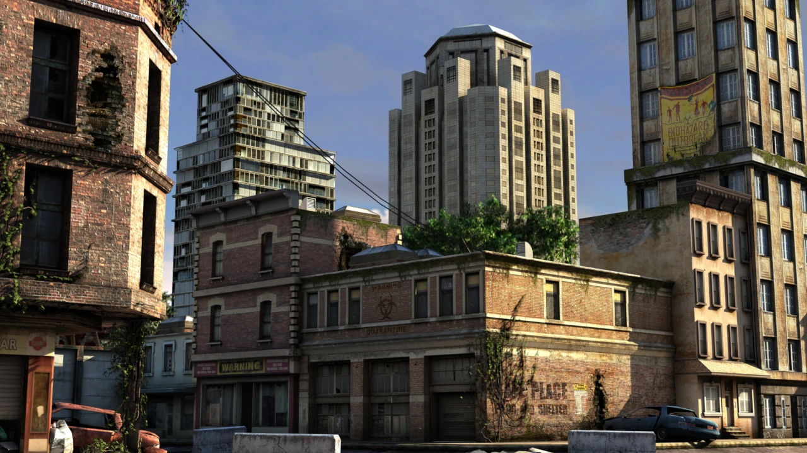

Material Override
===================

This tool is very similar to **Shader Overlay** described here: :ref:`shader_overlay` but it differs for its speed,
because it uses the **Geometry Nodes** system to replace the materials of the selected objects.

Here an example of **Material Override** Panel in full functionality once activated:

.. image:: _static/_images/material_override/mo_material_override_panel.webp
    :align: center
    :width: 400
    :alt: Material Override Panel

|

.. tip::
        You can select multiple objects at the same time, if these objects have more than one material, Material Override
        will find all the materials contained in it, and will replace them with the selected material.
        This is useful for you want to apply a single material even procedural to all selected objects.

Example of use
---------------

In the following images we see an example of a Material Override applied to all objects in the scene

**Basic scene, without material override:**

|

**Scene with material override (Blueprint 002):**

|

**Scene with material override (Wood Plain 011):**

.. image:: _static/_images/material_override/mo_example_scene_03.webp
    :align: center
    :width: 800
    :alt: Mo Example Scene 03

|

.. admonition:: Credits CC-BY
    :class: credits

    Model: **Apocalyptic City** Author: **ruslans3d** from Sketchfab:
    `Link <https://sketchfab.com/3d-models/apocalyptic-city-a0c8f318ed6f4075a97c2e55b1272495>`_

