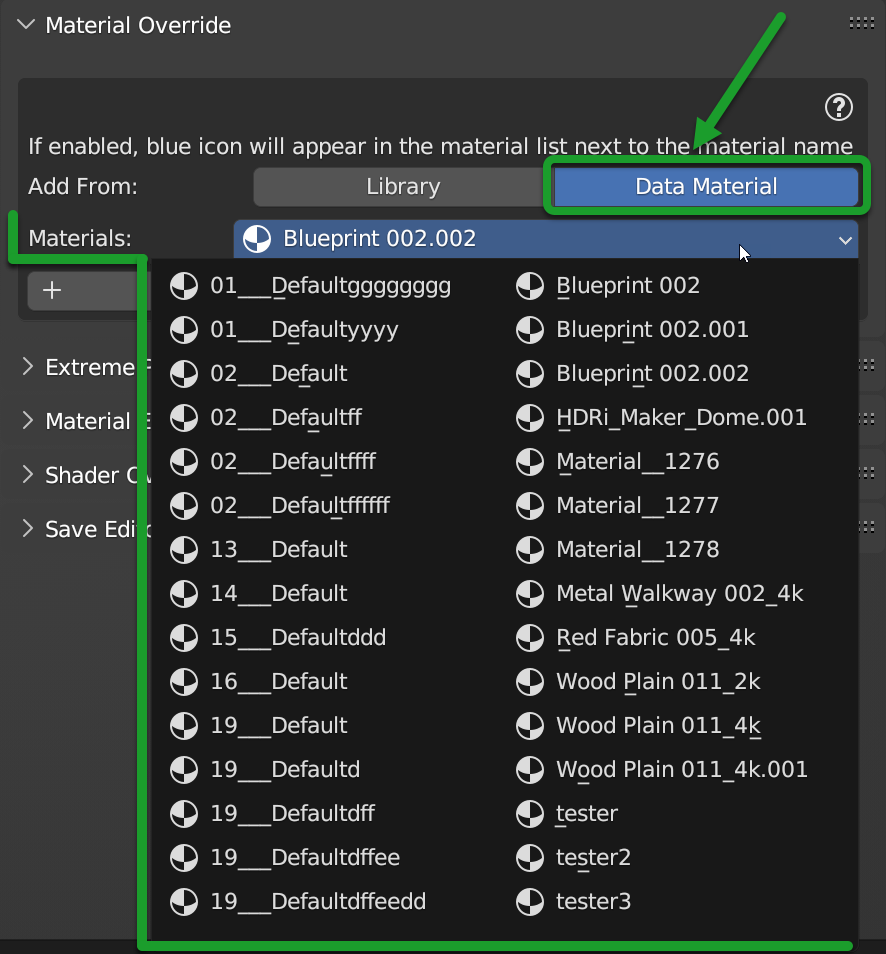

Material Override
===================

This tool is very similar to **Shader Overlay** described here: :ref:`shader_overlay` but it differs for its speed,
because it uses the **Geometry Nodes** system to replace the materials of the selected objects.

Here an example of **Material Override** Panel in full functionality once activated:

|

.. tip::
        You can select multiple objects at the same time, if these objects have more than one material, Material Override
        will find all the materials contained in it, and will replace them with the selected material.
        This is useful for you want to apply a single material even procedural to all selected objects.

------------------------------------------------------------------------------------------------------------------------

Example of use
---------------

In the following images we see an example of a Material Override applied to all objects in the scene

**Basic scene, without material override:**

.. image:: _static/_images/material_override/mo_example_scene_01.webp
    :align: center
    :width: 800
    :alt: Mo Example Scene 01

|

**Scene with material override (Blueprint 002):**

.. image:: _static/_images/material_override/mo_example_scene_02.webp
    :align: center
    :width: 800
    :alt: Mo Example Scene 02

|

**Scene with material override (Wood Plain 011):**

.. image:: _static/_images/material_override/mo_example_scene_03.webp
    :align: center
    :width: 800
    :alt: Mo Example Scene 03

|

.. admonition:: Credits CC-BY
    :class: credits

    Model: **Apocalyptic City** Author: **ruslans3d** from Sketchfab:
    `Link <https://sketchfab.com/3d-models/apocalyptic-city-a0c8f318ed6f4075a97c2e55b1272495>`_

.. tip::
        Any material in the Extreme PBR library or in the Project, or imported with :ref:`shader_maker`, can be used as
        Material Override.

------------------------------------------------------------------------------------------------------------------------

Material Override Tools
--------------------------

In this section we will see the main tools of the Material Override panel

Add From (Library)
*********************

.. image:: _static/_images/material_override/mo_add_from_library.webp
    :align: center
    :width: 400
    :alt: Mo Add From Library

|

In this situation, no Material Override has been applied. **Add From** is used to choose where you want to take the
material to apply as a shader overlay.

Add From Library allows you to add the Material Override directly from the Extreme PBR library, just select
the material you want to apply, from the Extreme PBR library then from the :ref:`mp_material_browser` , and press the button
**Add**, explained later here: :ref:`mo_add_override`

------------------------------------------------------------------------------------------------------------------------

Add From (Data Material)
*************************

By selecting **Add From Data Material** you will have the list of materials present in the current Blender project
and you can choose the material you want to apply as Material Override from that list. Once you have selected the material
you want to apply, press the **Add** button, explained later here: :ref:`mo_add_override`

------------------------------------------------------------------------------------------------------------------------

.. _mo_add_override:

Add Override
**************

|

The Add button adds to the selected objects the Material Override that you have chosen from the **Add From** menu.
If the Material Override is already present on the selected objects, the Add button replace the previous Shader Overlay
with the new one.

.. important::
        This button adds to all the materials of the selected objects the material chosen as Material Override
        so if you have selected 10 objects and each of these has 3 materials, the material chosen as Material Override
        will be added to all 30 materials.

------------------------------------------------------------------------------------------------------------------------

Remove Override
*****************

.. image:: _static/_images/material_override/mo_remove_override.webp
    :align: center
    :width: 400
    :alt: Mo Remove Override

|

The Remove button removes the Material Override from the selected objects.

.. important::
        This button removes the Material Override from all the materials of the selected objects,
        so if you have selected 10 objects and each of these has 3 materials, the Material Override
        will be removed from all 30 materials.

------------------------------------------------------------------------------------------------------------------------

Mat Settings Button
********************

Very useful in Eevee Render!

.. image:: _static/_images/material_override/mo_mat_settings_button.webp
    :align: center
    :width: 600
    :alt: Mo Mat Settings Button

|

.. note::
        This button is visible only if you have already applied a Material Override

Mat Settings Button gives you access to the settings of the material you have applied as Material Override, this is useful
to change the parameters on all materials

