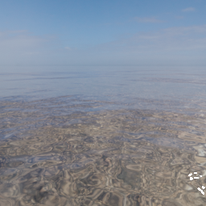
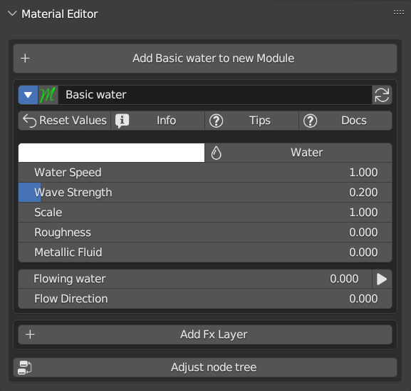
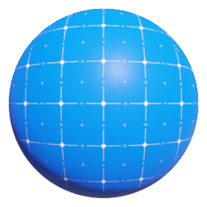
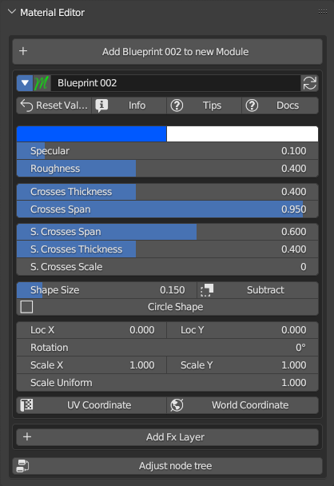
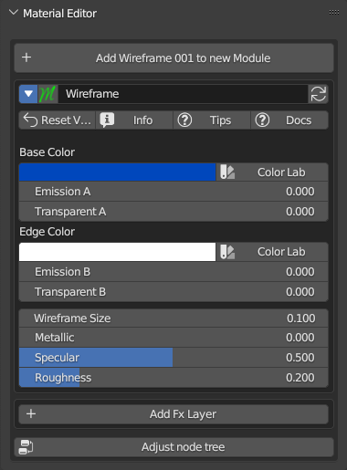
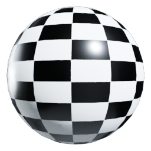

.. _materials:

=================
Materials
=================

In this section are described the non standard materials present in Extreme PBR, that is the materials with an interface
built specifically for such material.

------------------------------------------------------------------------------------------------------------------------

Glass (Node Group)
------------------

.. image:: _static/_images/materials/glass.png
    :align: center
    :width: 200
    :alt: Glass

|

|

Inputs:

1. **Glass Color  (Rgba)**
***************************

 - Change the color of the glass (All white for a neutral glass)

2. **IOR  (Value)**
********************

 - Change the index of IOR, which is the refractive index. Consult the refractive indices of various materials online.

3. **Mirror Fx  (Value)**
**************************

 - Adds a further Reflection effect to the Glass, taking advantage of the metallic map. This is a trick, for best results it should be used with caution.

4. **Dirty Roughness  (Value)**
********************************

 - Increases the dirty effect to the glass according to the texture that has been assigned. See the Texture Manager section to change image textures

5. **Scale Uniform  (Value)**
******************************

 - Scale the size of the Dirty Roughness map. The scaling effect is seen only if a value other than 0 has been set in the Dirty Roughness property

------------------------------------------------------------------------------------------------------------------------

Basic water (Node Group)
------------------------

|

|

This material allows you to simulate the effect of animated water, it works once you start the Blender timeline

Inputs:

1. **RGB  (Rgba)**
*******************

 - Water Color

2. **Water / Fluid  (Button)**
*******************************

 - Water to fluid switch

3. **Water Speed  (Value)**
****************************

 - Set the speed of the waves

4. **Wave Strength  (Value)**
******************************

 - General height of all waves (Simulated with a bump)

5. **Scale  (Value)**
**********************

 - Change the size of the waves

6. **Roughness  (Value)**
**************************

 - Roughness, it might come in handy, if you use the Metallic Fluid parameter or Fluid Button

7. **Metallic Fluid  (Value)**
*******************************

 - It makes water look like a metallic fluid, such as mercury

8. **Flowing water  (Value)**
******************************

 - Simulates a moving watercourse, to choose the direction of the watercourse use the "Rotation" parameter

9. **Reverse  (Button)**
*************************

 - Reverse the water flow

10. **Flow Direction  (Value)**
********************************

 - Adjusts the overall rotation of the waves. Useful when the water is animated in one direction

------------------------------------------------------------------------------------------------------------------------

Rubber tires (Node Group)
-------------------------

.. image:: _static/_images/materials/rubber_tires_basic_001.png
    :align: center
    :width: 200
    :alt: Rubber Tires Basic 001

|

|

Inputs:

1. **Color  (Rgba)**
*********************

 - Change the color of the tire rubber

2. **Scale Uniform  (Value)**
******************************

 - Scale the Roughness (Only if it is different from the value 0)

3. **Roughness  (Value)**
**************************

 - Adjusts the intensity of the roughness, which is the one that simulates the difference between smooth and slightly rough areas on the tire rubber

4. **Specular  (Value)**
*************************

 - Adjust the reflection on the tire rubber

------------------------------------------------------------------------------------------------------------------------

Car Paint.001 (Node Group)
--------------------------

.. image:: _static/_images/materials/car_paint_001.png
    :align: center
    :width: 200
    :alt: Car Paint 001

|

|

Inputs:

1. **Facing Color  (Rgba)**
****************************

 - Main Color

2. **Grazing Color  (Rgba)**
*****************************

 - Grazing color, Use Facing Blend to distribute the color

3. **Facing Blend   (Value)**
******************************

 - Weight that blends from the first to the second shader as the surface goes from facing the viewer to viewing it at a grazing angle

4. **Metallized  (Value)**
***************************

 - Mix between non-metallic and metallic. It will also simulate the metallic flakes within the paint. To change the flakes, use the values below

5. **Flakes Size  (Value)**
****************************

 - Size of the metallic flakes inside the paint

6. **Flakes Strength  (Value)**
********************************

 - Simulates the maximum slope of the metallic flakes. The higher the strength, the more the flakes will deflect the light.

7. **Specular  (Value)**
*************************

 - Amount of dielectric specular reflection. Specifies facing (along normal) reflectivity in the most common 0 - 8% range. (To give a more real effect, use clearcoat)

8. **Specular Tint  (Value)**
******************************

 - Tints the facing specular reflection using the base color, while glancing reflection remains white.

9. **Roughness  (Value)**
**************************

 - Adjust the roughness of the car paint. Useful for creating a matt effect on the bodywork.

10. **Clearcoat  (Value)**
***************************

 - Transparent finish

11. **Clearcoat Roughness  (Value)**
*************************************

 - Transparent finish roughness

12. **Orange Peal  (Value)**
*****************************

 - Transparent finish orange peal strength

13. **Orange Size  (Value)**
*****************************

 - Transparent finish orange peal, size

------------------------------------------------------------------------------------------------------------------------

BluePrint 001 (Node Group)
------------------------------

This material is useful for creating an Engineering situation

|

|

Inputs:

1. **Emission A  (Value)**
***************************

 - Base color emissivity

2. **Base Color  (Rgba)**
**************************

 - Base Color

3. **Line Color  (Rgba)**
**************************

 - Color of the lines

4. **Emission B  (Value)**
***************************

 - Lines color emissivity

5. **Small Square Line  (Value)**
**********************************

 - Line size of the smallest squares.

6. **Big Square Line  (Value)**
********************************

 - Line size of the largest squares.

7. **Metallic  (Value)**
*************************

 - Metallic material intensity, attention, if the diffused color is completely black (RGB 0,0,0) no metallic effect can be displayed, move the color towards dark gray to obtain the desired effect.

8. **Specular  (Value)**
*************************

 - Amount of dielectric specular reflection. Specifies facing (along normal) reflectivity in the most common 0 - 8% range.

9. **Roughness  (Value)**
**************************

 - Specifies microfacet roughness of the surface for diffuse and specular reflection.

10. **Bump   (Value)**
***********************

 - Strength of the bump mapping effect, interpolating between no bump mapping and full bump mapping.

11. **Distance  (Value)**
**************************

 - Multiplier for the height value to control the overall distance for bump mapping.

12. **Invert  (Button)**
*************************

 - Invert the map to the negative

13. **Transparent  (Value)**
*****************************

 - Set the transparency. Attention, in Eevee or in preview mode,transparency needs to be activated via the button on the right, otherwise the transparency will not work.

14. **Transparent Invert  (Button)**
*************************************

 - Invert Transparent, From Base color to Line color

15. **Rotation  (Value)**
**************************

 - The amount of rotation along Z axis

16. **lx  (Value)**
********************

 - Move the texture to the X axis

17. **ly  (Value)**
********************

 - Move the texture to the Y axis

18. **Scale  (Value)**
***********************

 - Scale the texture to the X-Y-Z axes

19. **World Coordinate  (Button)**
***********************************

 - If active, the coordinates of the material will be based on the coordinates of the world, and no longer the object.

------------------------------------------------------------------------------------------------------------------------

Blueprint 002 (Node Group)
--------------------------

|

|

This material is useful for making project presentations. You can adjust the properties to modify the grid and create a customizable grid

Inputs:

1. **Main Color  (Rgba)**
**************************

 - Adjust the main color

2. **Grid Color  (Rgba)**
**************************

 - Adjust the grid color

3. **Specular  (Value)**
*************************

 - Amount of dielectric specular reflection. Specifies facing (along normal) reflectivity in the most common 0 - 8% range

4. **Roughness  (Value)**
**************************

 - Specifies microfacet roughness of the surface for diffuse and specular reflection

5. **Crosses Thickness  (Value)**
**********************************

 - Adjust the Thickness of the large grid

6. **Crosses Span  (Value)**
*****************************

 - Adjust the Span of the large grid

7. **S. Crosses Span  (Value)**
********************************

 - Adjust the Span of the large grid

8. **S. Crosses Thickness  (Value)**
*************************************

 - Adjust the Thickness of the large grid

9. **S. Crosses Scale  (Int)**
*******************************

 - Adjusts the scale of the small grid

10. **Shape Size  (Value)**
****************************

 - Adjusts the size of the shape at the intersection of the large grid

11. **Subtract  (Button)**
***************************

 - If active, Subtract the Shape from the grid (If not active, it will be added to the grid)

12. **Circle Shape  (Button)**
*******************************

 - If activated, the shape will be a circle, otherwise it will be a quadrate

13. **Loc X  (Value)**
***********************

 - Adjusts the position of the entire grid on the X axis

14. **Loc Y  (Value)**
***********************

 - Adjusts the position of the entire grid on the Y axis

15. **Rotation  (Value)**
**************************

 - Adjust the Rotation of the entire grid

16. **Scale X  (Value)**
*************************

 - Adjust the Scale of the whole grid on the X axis

17. **Scale Y  (Value)**
*************************

 - Adjust the Scale of the whole grid on the Y axis

18. **Scale Uniform  (Value)**
*******************************

 - Scales all material uniformly

19. **UV Coordinate  (Button)**
********************************

 - Projects the texture onto the object's UV mapping

20. **World Coordinate  (Button)**
***********************************

 - Projects the texture on world coordinates

------------------------------------------------------------------------------------------------------------------------

Transparent (Node Group)
------------------------

|

.. image:: _static/_images/materials/ng_transparent.webp
    :align: center
    :width: 400
    :alt: Ng Transparent

|

Inputs:

1. **Transparent Strength  (Value)**
*************************************

 - Adjust the transparency of the transparent material. Remember that if you are in Eevee you must set the type of transparency with the button next to this property

------------------------------------------------------------------------------------------------------------------------

Wireframe (Node Group)
----------------------

This material traces the edges of objects with a color of your choice. The size of the border color varies according to the size / scale of the object and the parameters chosen.

.. image:: _static/_images/materials/wireframe_001.png
    :align: center
    :width: 200
    :alt: Wireframe

|

|

Inputs:

1. **Base Color  (Rgba)**
**************************

 - Main color

2. **Emission A  (Value)**
***************************

 - Sets the intensity of the light emitted. If 0, no light emitted. Limitations in Eevee: The emitted light will have no effect on surrounding objects, this only works in Cycles.

3. **Transparent A  (Value)**
******************************

 - Transparency of the main color

4. **Edge Color  (Rgba)**
**************************

 - Color of the lines on the edges

5. **Emission B  (Value)**
***************************

 - Sets the intensity of the light emitted. If 0, no light emitted. Limitations in Eevee: The emitted light will have no effect on surrounding objects, this only works in Cycles.

6. **Transparent B  (Value)**
******************************

 - Transparency of the edges color

7. **Wireframe Size  (Value)**
*******************************

 - Size of the lines tracing the edges

8. **Metallic  (Value)**
*************************

 - Metallic material intensity, attention, if the diffused color is completely black (RGB 0,0,0) no metallic effect can be displayed, move the color towards dark gray to obtain the desired effect.

9. **Specular  (Value)**
*************************

 - Amount of dielectric specular reflection. Specifies facing (along normal) reflectivity in the most common 0 - 8% range.

10. **Roughness  (Value)**
***************************

 - Specifies microfacet roughness of the surface for diffuse and specular reflection.

------------------------------------------------------------------------------------------------------------------------

Plasma (Node Group)
-------------------

This material simulates a plasma effect, it is useful for creating a sci-fi effect.

|

.. image:: _static/_images/materials/ng_plasma.webp
    :align: center
    :width: 400
    :alt: Ng Plasma

|

Inputs:

1. **Color  (Rgba)**
*********************

 - Diffuse color of the plasma

2. **From Min  (Value)**
*************************

 - The lower bound of the range to remap from.

3. **From Max  (Value)**
*************************

 - The higher bound of the range to remap from.

4. **Transparent   (Value)**
*****************************

 - Transparency mix on all the material. If 0, no transparency

5. **Emission Strength  (Value)**
**********************************

 - Plasma Emissivity Note: In Eevee the material will not light up the scene, it will only work in Cycles

6. **Animation Speed  (Value)**
********************************

 - Velocity of the plasma waves, if 0, no animation.

7. **Reverse  (Button)**
*************************

 - Play the animation in reverse

8. **Detail  (Value)**
***********************

 - Amount of distortion noise detail

9. **Detail Scale  (Value)**
*****************************

 - Scale of distortion noise

10. **Detail Roughness  (Value)**
**********************************

 - Blend between a smoother noise pattern, and rougher with sharper peaks

11. **Distortion  (Value)**
****************************

 - Amount of distortion of the wave

12. **rx  (Value)**
********************

 - Rotate on the x axis

13. **ry  (Value)**
********************

 - Rotate on the y axis

14. **rz  (Value)**
********************

 - Rotate on the z axis

15. **Scale  (Value)**
***********************

 - Uniform scale

------------------------------------------------------------------------------------------------------------------------

Chess (Node Group)
------------------

A simple material that generates a chessboard that can be randomized. Follow the tips, to understand the use.

|

.. image:: _static/_images/materials/ng_chess.webp
    :align: center
    :width: 400
    :alt: Ng Chess

|

Inputs:

1. **Randomness  (Value)**
***************************

 - Randomize the size and position of the squares

2. **Shrink Squares  (Value)**
*******************************

 - Expands or contracts the size of the squares

3. **Color A  (Rgba)**
***********************

 - Color A of the Squares

4. **Color B  (Rgba)**
***********************

 - Color B of the Squares

5. **Emission A  (Value)**
***************************

 - It emits light from the squares with color A

6. **Emission B  (Value)**
***************************

 - It emits light from the squares with color B

7. **Transp 1  (Value)**
*************************

 - Transparency of color A

8. **Transp 2  (Value)**
*************************

 - Transparency of color B

9. **Metallic  (Value)**
*************************

 - Metallic material intensity, attention, if the diffused color is completely black (RGB 0,0,0) no metallic effect can be displayed, move the color towards dark gray to obtain the desired effect.

10. **Specular  (Value)**
**************************

 - Amount of dielectric specular reflection. Specifies facing (along normal) reflectivity in the most common 0 - 8% range.

11. **Roughness  (Value)**
***************************

 - Specifies microfacet roughness of the surface for diffuse and specular reflection.

12. **Rotation  (Value)**
**************************

 - Rotate the direction of the chessboard

13. **LocX  (Value)**
**********************

 - Move the texture to the X axis

14. **LocY  (Value)**
**********************

 - Move the texture to the Y axis

15. **ScaleX  (Value)**
************************

 - Scale the texture to the X axis

16. **ScaleY  (Value)**
************************

 - Scale the texture to the Y axis

17. **Scale Uniform  (Value)**
*******************************

 - Scale the texture to the X-Y-Z axes

------------------------------------------------------------------------------------------------------------------------

Blend (Node Group)
------------------

|

|

Inputs:

1. **Color A-B  (Rgba)**
*************************

 - Color A

2. **Color B  (Rgba)**
***********************

 - Color B

3. **Emission A  (Value)**
***************************

 - Emission Color A

4. **Emission B  (Value)**
***************************

 - Emission Color B

5. **Transparent A  (Value)**
******************************

 - Transparent Color A

6. **Transparent B  (Value)**
******************************

 - Transparent Color B

7. **Metallic A  (Value)**
***************************

 - Metallic Color A

8. **Metallic B  (Value)**
***************************

 - Metallic Color B

9. **Specular A  (Value)**
***************************

 - Specular Color A

10. **Specular B  (Value)**
****************************

 - Specular Color B

11. **Roughness A  (Value)**
*****************************

 - Roughness Color A

12. **Roughness B  (Value)**
*****************************

 - Roughness Color B

13. **Glass A  (Value)**
*************************

 - Transmission Color A

14. **Glass B  (Value)**
*************************

 - Transmission Color B

15. **IOR  (Value)**
*********************

 - Index of refraction for transmission.

16. **Blend  (Value)**
***********************

 - Blend between Color A and Color B, this also has an effect on the basis of the point of view, color A is always facing the center of the object, and color B at the outline. For correct use, use the "Smart Shade Smooth" button

17. **Sharp  (Value)**
***********************

 - Mix Between a smooth blend and a clear deadlift Between color A and color B

18. **Noise  (Value)**
***********************

 - Mix between 0 noise and 1, this adds noise to the Blend.

19. **Scale  (Value)**
***********************

 - Scale the Noise

20. **Distortion  (Value)**
****************************

 - Distortion of  the noise

21. **Animation  (Value)**
***************************

 - Noise animation 0 = No animation

22. **Backface Transparent  (Button)**
***************************************

 - Makes the back faces transparent

