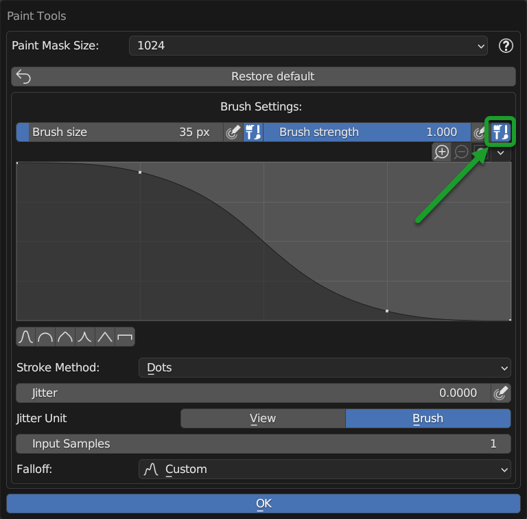
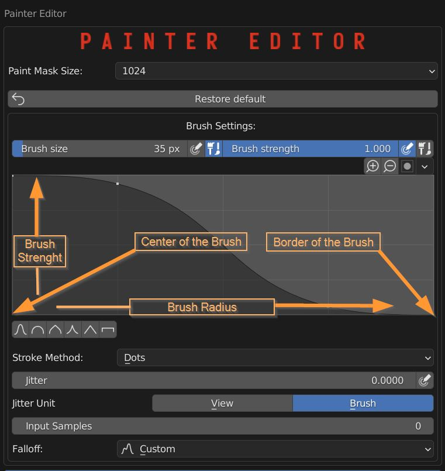
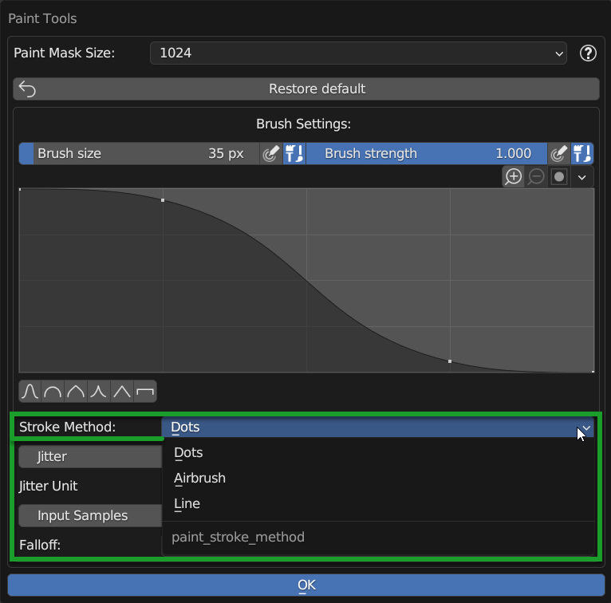

.. _paint_tools_panel:

Paint Tools
===================

. The Paint Tools Panel can be called up by pressing the button described here:
    - :ref:`tp_texture_paint_tools_button`

|

.. note::
        Only if there are at least 2 Nexus modules or more you can access the Paint Tools Panel.

.. admonition:: Video Tutorial
    :class: youtube

    **Here you can find a video tutorial about texture paint:** :ref:`texture_paint_video_tutorial`

------------------------------------------------------------------------------------------------------------------------

Introduction
------------------

The paint tools panel contains some useful tools for modifying the brush, the tools are already present in Blender
but I decided to concentrate the most useful ones in a single panel, this to facilitate use and understanding.

------------------------------------------------------------------------------------------------------------------------

Paint Tools Panel
------------------

Here is a list of the properties and buttons that make up the panel.

------------------------------------------------------------------------------------------------------------------------

Paint Maks Size
******************

.. image:: _static/_images/paint_tools/pt_paint_mask_size.webp
    :align: center
    :width: 500
    :alt: Paint Mask Size

|

The Paint Mask Size Property allows you to modify the size of the paint mask, the higher the resolution of the paint
mask texture and the more detailed the painting will be, as there will be more pixels available for painting.

- **Minimum resolution** 256x256 px
- **Maximum resolution** 8192x8192 px

------------------------------------------------------------------------------------------------------------------------

Restore Default
******************

|

This button allows you to restore the brush settings to their default values. Useful if you have modified something and
want to bring everything back as before.

------------------------------------------------------------------------------------------------------------------------

Brush Size
******************

.. image:: _static/_images/paint_tools/pt_brush_size.webp
    :align: center
    :width: 500
    :alt: Brush Size

|

Brush Size Slider allows you to modify the size of the brush, the higher the value the larger the brush will be.

------------------------------------------------------------------------------------------------------------------------

Brush Size Pressure
*********************

.. image:: _static/_images/paint_tools/pt_brush_size_pressure.webp
    :align: center
    :width: 500
    :alt: Brush Size Pressure

|

If active, the value of the brush size will be modified according to the pressure exerted on the graphics tablet.

.. note::
    This option is only available if you have a graphics tablet or a device that supports pressure sensitivity.

------------------------------------------------------------------------------------------------------------------------

Use Unified Radius
*********************

.. image:: _static/_images/paint_tools/pt_use_unified_radius.webp
    :align: center
    :width: 500
    :alt: Use Unified Radius

|

If active, the brush size will be the same for all the brushes, if disabled each brush will have its own size.

------------------------------------------------------------------------------------------------------------------------

Brush Strength
******************

|

Brush Strength Slider allows you to modify the strength of the brush, the higher the value the stronger the brush will be.

------------------------------------------------------------------------------------------------------------------------

Strength Pressure
*************************

|

If active, the value of the brush strength will be modified according to the pressure exerted on the graphics tablet.

.. note::
    This option is only available if you have a graphics tablet or a device that supports pressure sensitivity.

------------------------------------------------------------------------------------------------------------------------

Use Unified Strength
**********************

|

If active, the brush strength will be the same for all the brushes, if disabled each brush will have its own strength.

------------------------------------------------------------------------------------------------------------------------

Zoom In/Out
******************

.. image:: _static/_images/paint_tools/pt_zoom_in_out.webp
    :align: center
    :width: 500
    :alt: Zoom In/Out

|

These buttons allow you to zoom in or out the curve editor.

------------------------------------------------------------------------------------------------------------------------

Curve Editor
******************

|

In the curve editor X represent the brush radius, from the center to the border, while Y represent strength

------------------------------------------------------------------------------------------------------------------------

Set Brush Shape
******************

.. image:: _static/_images/paint_tools/pt_set_brush_shape.webp
    :align: center
    :width: 500
    :alt: Set Brush Shape

|

These Buttons allow you to set a preset for the brush shape, you will see the difference in the Curve Editor described
above.

------------------------------------------------------------------------------------------------------------------------

Stroke Method
******************

|

**Stroke Method** Menu allows you to choose the type of stroke you want to use, you can choose between:

- **Dots:** The brush will be a series of dots, useful for creating a pointillist effect.
- **Airbrush:** The brush will be an airbrush, useful for creating a soft effect.
- **Line:** The brush will be a line, useful for creating a linear effect.

------------------------------------------------------------------------------------------------------------------------

Jitter
******************

|

**Jitter** Slider allows you to modify the jitter of the brush, the higher the value the more the brush will be jittery.

------------------------------------------------------------------------------------------------------------------------

Jitter Pressure
******************

|

If active, the value of the brush jitter will be modified according to the pressure exerted on the graphics tablet.

.. note::
    This option is only available if you have a graphics tablet or a device that supports pressure sensitivity.

------------------------------------------------------------------------------------------------------------------------

Input Samples
******************

.. image:: _static/_images/paint_tools/pt_input_samples.webp
    :align: center
    :width: 500
    :alt: Input Samples

|

**Input Samples** Slider allows you to modify the number of samples of the brush, the higher the value the more the
brush will be detailed.

------------------------------------------------------------------------------------------------------------------------

Falloff
******************

.. image:: _static/_images/paint_tools/pt_falloff.webp
    :align: center
    :width: 500
    :alt: Falloff

|

The Falloff menu allows you to choose between some types of falloff, you can choose between:

- **Custom**
- **Smooth**
- **Smoother**
- **Sphere**
- **Root**
- **Sharp**
- **Linear**
- **Sharper**
- **Inverse Square**
- **Constant**

