Preferences
====================

To go to the preferences, you can go in 2 ways:

  * Easier directly from the addon (If installed and enabled)

    .. image:: _static/_images/preferences/open_preferences_from_extreme_pbr.png
        :align: center
        :width: 200
        :alt: Preferences dropdown

  * From Blender:

    .. image:: _static/_images/installation/preferences_dropdown_01.jpg
        :align: center
        :width: 400
        :alt: Preferences dropdown

    Search into Addon tab, the "Extreme PBR" addon:

    .. image:: _static/_images/installation/installation_interface_step_01.png
        :align: center
        :width: 400
        :alt: Installation interface step 01

Library Management
------------------

“Library Management”, allows you to link or change paths to Extreme PBR libraries.
You can also add expansion libraries later. If you want to delight in creating libraries to sell, your customer will find the “Add Library” button useful, you can add many libraries, without limit.

.. Note:: To work, Extreme PBR needs to have linked (Installed) the main library, and the user library (Even if empty)

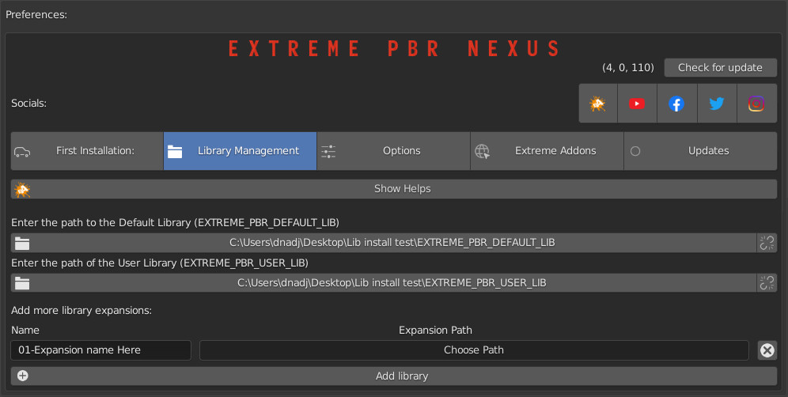

Options
-------

Click the Options tab to customize the Extreme PBR panel.

.. image:: _static/_images/preferences/options_tab_preferences_01.jpg
        :align: center
        :width: 800
        :alt: Options tab preferences 01

Check For Updates
*******************

Sets how often the addon should check for new updates.

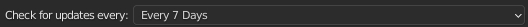

Show name label in preview button
**********************************

If enabled, the name of the material will be displayed in the preview popup

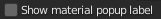

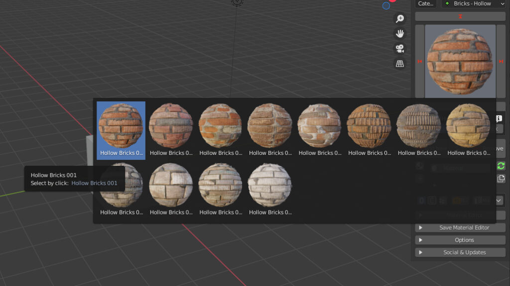

Icon Preview Dimension
************************

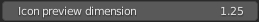

Choose the previews icons dimension.
Tips: Correct size = 1

Icon Popup Size
****************

Choose the popup icons dimension. Tips: Correct size = 1

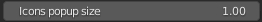

Show hidden sockets
*********************

Show hidden sockets on Shader

If enable: the unused sockets will be hidden

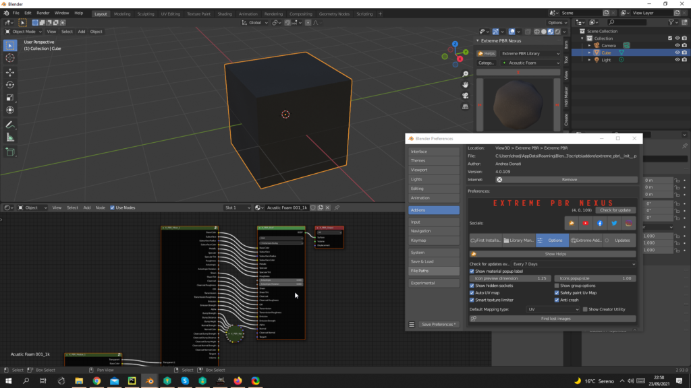

Show group options
*******************

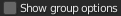

If enabled, it will show the node groups options, as in this example:

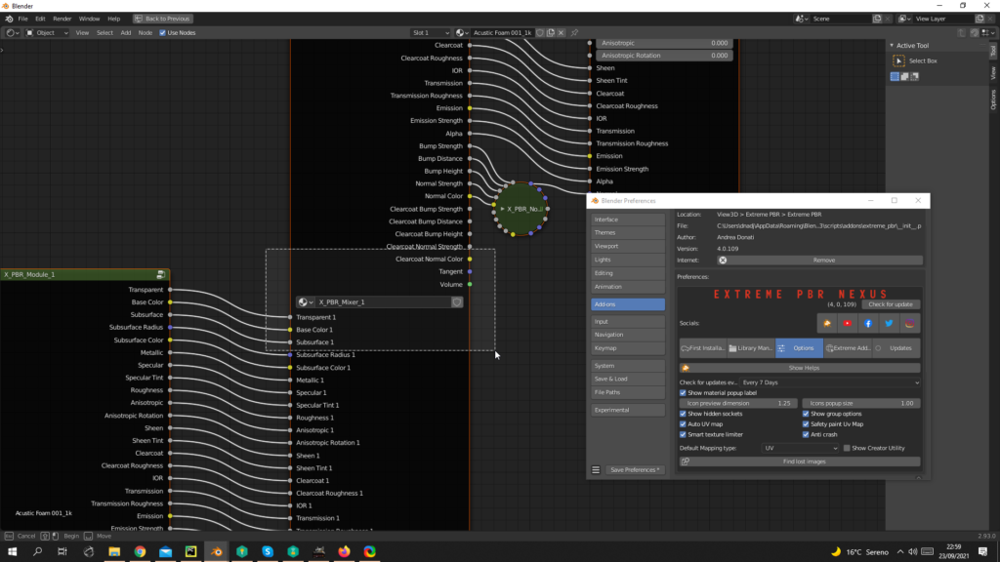

Auto Uv Map
************

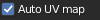

If the object does not have a Uv Mapping once the material has been added, a default UV mapping will automatically be added.
(it is advisable to leave this button active so as to avoid wasting time). Objects that have a UV mapping will not be automatically bypassed

Safety Paint Uv Map
*********************

.. image:: _static/_images/preferences/safety_paint_uv_map.jpg
        :align: center
        :width: 200
        :alt: Safety Paint Uv Map

Prevents the uv layer of the texture paint from being selected if you are not in Texture Paint Mode

Smart Texture Limiter
***********************

.. image:: _static/_images/preferences/smart_texture_limiter_01.jpg
        :align: center
        :width: 200
        :alt: Smart Texture Limiter

Due to the maximum texture limit of 24 for Eevee, this feature (Enable by default) attempts to limit the use of textures
when a material has many Shaders and Fx layers. Cons: Some maps may be disabled, starting from the Fx Layers Modules, then moving on to the Modules

Anti Crash
************

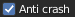

One some computers, there is an abnormal crash when adding a material. The bug has been reported to the Blender Foundation,
until the cause is understood, keep this active if you encounter any abnormal crashes applying the materials.

Default Mapping Type
**********************

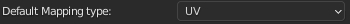

Choose the UV Map mode.

Show Creator Utility
**********************

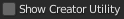

Show in the Shader Editor, a panel for material and library creators. If you are not a material creator, please do not use this as it may damage the main library.

Findo Lost Images
*******************

.. image:: _static/_images/preferences/find_lost_images_01.jpg
        :align: center
        :width: 200
        :alt: Find Lost Images

This is used to search for any lost images, in case Blender appears with "Pink" materials, this means that the textures
to which the material refers have not been found.
The cause may be that the files have been moved or renamed.

This button opens a popup where to enter a path where to perform the automatic search for lost images.

Update Library Register
*************************

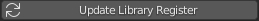

This is used to search and update the library register, in case of Extreme PBR update, or addition of new libraries.

Update
---------

.. Important:: To use the functions in this menu, you must be logged in with your profile in the “Extreme Addons” Tab menu

**In this Tab menu, you will be able to update the libraries and addon**

- Update core:
    - Update the addon directly, without having to do the classic Blender manual procedure.

- Update Library:
    - If you want to check if there are new materials to install, first press this button, your library will automatically update if there is any new material online.

- Essential/1k/2k/4k/8k/All:
    - They are the same buttons present in Step 5 (Go a few pages up to see)

.. image:: _static/_images/preferences/update_tab_01.jpg
        :align: center
        :width: 800
        :alt: Update Library

