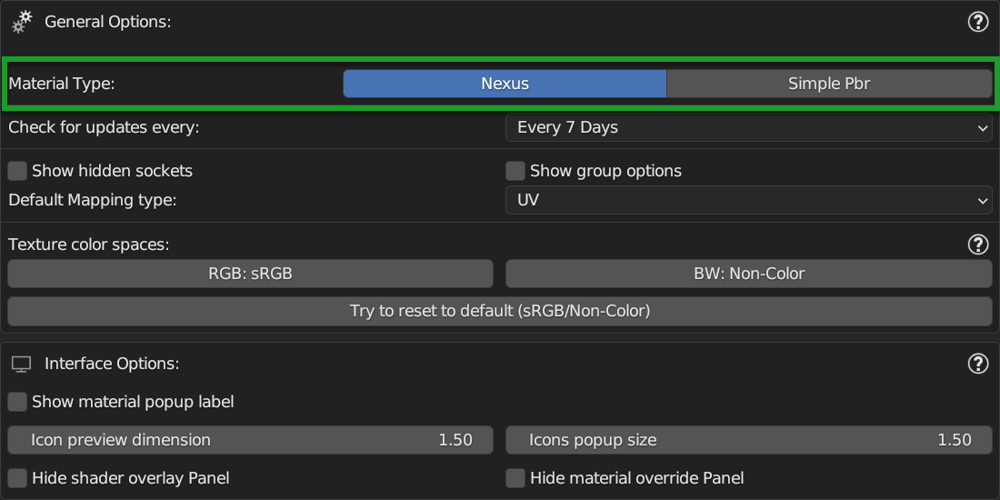
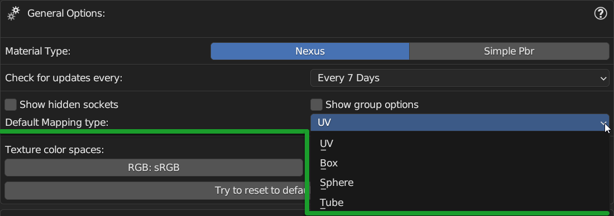
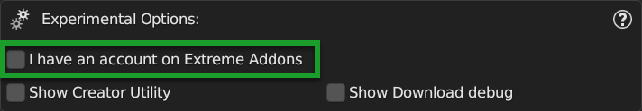

======================
Preferences
======================

In order to access the preferences there are several ways:

- **By Extreme PBR (If already installed and operational)**

From the Extreme PBR panel, click on the ``Options`` button, this will open the preferences in the **Options** tab.

.. image:: _static/_images/preferences/pr_panel_button.webp
    :align: center
    :width: 800
    :alt: Preferences Panel Button

|

- **By Blender Preferences**

From Blender's main menu, select ``Edit`` and then ``Preferences``, this will open Blender's preferences window.
Go to ``Add-ons`` and search for ``Extreme PBR`` and click on the checkbox to activate it (If it's not already active).

.. image:: _static/_images/preferences/pr_edit_preferences.webp
    :align: center
    :width: 800
    :alt: Blender Preferences Button

------------------------------------------------------------------------------------------------------------------------

Options
======================

Le Opzioni sono suddivise in diverse aree di interesse:

- **General Options:** Ref: :ref:`pr_general_options`
- **Interface Options** Ref: :ref:`pr_interface_options`
- **Fix Options** Ref: :ref:`pr_fix_options`
- **Experimental Options** Ref: :ref:`pr_experimental_options`

.. image:: _static/_images/preferences/pr_options_example.webp
    :align: center
    :width: 800
    :alt: Preferences Options Example

------------------------------------------------------------------------------------------------------------------------

.. _pr_general_options:

General Options
----------------------

.. image:: _static/_images/preferences/pr_general_options.webp
    :align: center
    :width: 600
    :alt: Preferences General Options

|

Bellow are explained the various properties

------------------------------------------------------------------------------------------------------------------------

.. _pr_op_material_type:

Material Type
**********************

|

This selector allows you to choose which type of setting to use when creating a material:

- **Nexus:**
    - This type of setting allows you to create materials in Nexus mode, this means that you will have access to
      the **Texture Paint**, described here: :ref:`texture_paint` and to the creation of **Fx Layers**, described here: :ref:`fx_layer` and to all
      its **Dynamic Mask** described here: :ref:`fx_dynamic_mask`

- **Simple PBR:**
    - This type of material setting allows you to create simple materials, so that you have "Light" materials
      for your project, the render will be much faster, but you will not have access to the functions of the **Nexus**
      materials. **Simple PBR** example is here: :ref:`me_simple_pbr_type`

------------------------------------------------------------------------------------------------------------------------

Check For updates Every
****************************

.. image:: _static/_images/preferences/pr_op_check_for_updates_every.webp
    :align: center
    :width: 600
    :alt: Preferences Check For updates Every

|

This property allows you to choose how often Extreme PBR should check for updates.

.. important::
        I strongly advise you not to leave **Never** as a value, as Extreme PBR is constantly evolving and
        there may be important updates to fix bugs or add new features, so
        if you leave **Never** you will not see the new update alerts.
        you can always refer to **Check For Updates** described here: TODO: Put reference to Check For Updates button

------------------------------------------------------------------------------------------------------------------------

Show Hidden Sockets
************************

Show Hidden Sockets allows you to show or hide the sockets of the Extreme PBR Nexus nodes, by default the unused sockets
are hidden for a matter of node interface cleaning.

.. image:: _static/_images/preferences/pt_op_show_hidden_sockets.webp
    :align: center
    :width: 600
    :alt: Preferences Show Hidden Sockets

|

Here is an example of what happens to the nodes when you activate or deactivate this **Show Hidden Sockets**:

.. image:: _static/_images/preferences/pr_op_show_hidden_sockets_example.webp
    :align: center
    :width: 800
    :alt: Preferences Show Hidden Sockets Example

------------------------------------------------------------------------------------------------------------------------

Show Group Options
************************

Show Group Options allows you to show or hide the options of the Extreme PBR Nexus nodes, by default the options are
hidden for a matter of node interface cleaning.

.. image:: _static/_images/preferences/pt_op_show_group_options.webp
    :align: center
    :width: 600
    :alt: Preferences Show Group Options

|

Here is an example of what happens to the nodes when you activate or deactivate this **Show Group Options**:

.. image:: _static/_images/preferences/pt_op_show_group_options_example.webp
    :align: center
    :width: 800
    :alt: Preferences Show Group Options Example

------------------------------------------------------------------------------------------------------------------------

Default Mapping Type
************************

Default Mapping Type allows you to choose the default mapping type for the textures, by default the mapping type is
**UV**

|

In order to see better what it is, refer to: :ref:`mapping_editor_panel`

.. tip::
        You can always modify each Texture Image material individually at a later time.
        My suggestion if you have little experience is to leave UV as the default for now.

------------------------------------------------------------------------------------------------------------------------

.. _pr_op_texture_color_space:

Texture Color Space
************************

Texture Color Space allows you to choose the default color space for the textures, by default the color space is **sRGB**
but this also allows you to choose other color spaces if you are using different ACES configurations.

Once you have chosen the color space, this will be applied to all the textures that will be created by Extreme PBR and also
to those already applied.

.. image:: _static/_images/preferences/pr_op_texture_colorspace_section.webp
    :align: center
    :width: 600
    :alt: Preferences Texture Color Space Section

|

.. hint::
        if your **ACES** list is very long, you can search by name, and the list will narrow down so as not to be confused.
        This tool was designed specifically for those who use ACES configurations other than the default one.

RGB
^^^^

Rgb Color Space allows you to change the color space of all textures to RGB (Type diffuse, emission, etc ...)

|

.. important::
        This function will change the color spaces only of the materials applied with Extreme PBR, no material coming
        from other sources will be modified, nor those created manually.
        In addition, only nodes of type **Image Texture** will be identified

BW
^^^^

BW Color Space allows you to change the color space of all textures to BW (Type normal, roughness, etc ...)

.. image:: _static/_images/preferences/pt_op_texture_color_space_bw.webp
    :align: center
    :width: 600
    :alt: Preferences Texture Color Space

|

.. important::
        This function will change the color spaces only of the materials applied with Extreme PBR, no material coming
        from other sources will be modified, nor those created manually.
        In addition, only nodes of type **Image Texture** will be identified

|

Try to reset to default
^^^^^^^^^^^^^^^^^^^^^^^^^^^^^^^^

.. image:: _static/_images/preferences/pt_op_texture_color_space_reset.webp
    :align: center
    :width: 600
    :alt: Preferences Texture Color Space

|

This button, if pressed, will try to reset the color spaces of all textures to the default ones, **sRGB** and **Non-Color**,
and also in the buttons **RGB** and **BW** :ref:`pr_op_texture_color_space`

------------------------------------------------------------------------------------------------------------------------

.. _pr_interface_options:

Interface Options
----------------------

From this section you can modify some settings of the Extreme PBR interface.

.. image:: _static/_images/preferences/pr_op_interface_options_panel.webp
    :align: center
    :width: 600
    :alt: Preferences Interface Options

|

Show material popup label
****************************

This option allows you to show or hide the preview material labels in the material browser popup.
Reference here to the material Browser: :ref:`mp_material_browser`

.. image:: _static/_images/preferences/pr_op_show_material_popup_label.webp
    :align: center
    :width: 600
    :alt: Preferences Show Material Popup Label

|

**Show material popup label On**

.. image:: _static/_images/preferences/pr_op_popup_label_example_on.webp
    :align: center
    :width: 800
    :alt: Preferences Show Material Popup Label Example On

|

**Show material popup label Off**

.. image:: _static/_images/preferences/pr_op_popup_label_example_off.webp
    :align: center
    :width: 800
    :alt: Preferences Show Material Popup Label Example Off

------------------------------------------------------------------------------------------------------------------------

Icon Preview Dimension
****************************

This option allows you to change the size of the material preview icons in the Material Browser, reference here to the
material Browser: :ref:`mp_material_browser`

.. image:: _static/_images/preferences/pr_op_icon_preview_dimension.webp
    :align: center
    :width: 600
    :alt: Preferences Icon Preview Dimension

|

.. |1_0| image:: _static/_images/preferences/pr_op_icon_preview_dimension_1_0.webp
        :align: top
        :width: 800
        :alt: Preferences Icon Preview Dimension 1.0

.. |1_7| image:: _static/_images/preferences/pr_op_icon_preview_dimension_1_7.webp
        :align: top
        :width: 800
        :alt: Preferences Icon Preview Dimension 1.7

In this example the left panel can be much smaller.

+----------------------------------+----------------------------------+
| **Icon Preview Dimension 1.0**   | **Icon Preview Dimension 1.7**   |
+==================================+==================================+
| |1_0|                            | |1_7|                            |
+----------------------------------+----------------------------------+

------------------------------------------------------------------------------------------------------------------------

Icons Popup Size
****************************

This option allows you to choose the size of the icons of the material preview popup, reference here to the
material Browser: :ref:`mp_material_browser_popup`

|

Example with **Icons Popup Size 1.0**

.. image:: _static/_images/preferences/pr_op_preview_popup_size_1_0.webp
    :align: center
    :width: 800
    :alt: Preferences Icons Popup Size 1.0

|

Example with **Icons Popup Size 2.0**

.. image:: _static/_images/preferences/pr_op_preview_popup_size_2_0.webp
    :align: center
    :width: 800
    :alt: Preferences Icons Popup Size 1.7

------------------------------------------------------------------------------------------------------------------------

.. _pr_hide_shader_overlay_panel:

Hide Shader Overlay Panel
****************************

This panel can be hidden if you want to have a less small addon interface.

Reference: :ref:`shader_overlay`

.. image:: _static/_images/preferences/pr_op_hide_shader_overlay_panel.webp
    :align: center
    :width: 600
    :alt: Preferences Hide Shader Overlay Panel

------------------------------------------------------------------------------------------------------------------------

.. _pr_hide_material_override_panel:

Hide Material Override Panel
****************************

This panel can be hidden if you want to have a less small addon interface.

Reference: :ref:`material_override`

.. image:: _static/_images/preferences/pr_op_hide_material_override_panel.webp
    :align: center
    :width: 600
    :alt: Preferences Hide Material Override Panel

------------------------------------------------------------------------------------------------------------------------

.. _pr_fix_options:

Fix Options
----------------------

In this section of the options, there are some tools dedicated to the Fix of some problems that may arise.

.. image:: _static/_images/preferences/pr_op_fix_panel.webp
    :align: center
    :width: 600
    :alt: Preferences Fix Options

------------------------------------------------------------------------------------------------------------------------

Anti Crash
****************************

Anti Crash options, by default is activated, and it is used to avoid some anomalous crashes during the application of the
material that occur on some compute and on others not.

|

What it basically does is to set the rendering engine to Eevee if you are in Cycles preview mode.
I realize it's quite annoying, but it's the only way I've found to avoid these crashes.

.. tip::
        I invite you to try to disable it and see if the problem persists, otherwise you can leave it disabled.

------------------------------------------------------------------------------------------------------------------------

Find Lost Images
****************************

In the event that the image files to which the materials referred, have been moved (In the best case)
This button opens a file browser where you can roughly indicate the folder that may contain sub folders
with missing images inside. If the images are found, they are automatically reconnected to the materials.

.. image:: _static/_images/preferences/pr_op_find_lost_images.webp
    :align: center
    :width: 600
    :alt: Preferences Find Lost Images

|

.. attention::
        This operation could take a long time, depending on various factors: number of materials with lost images,
        number of folders to analyze and speed of the Hard Disk. Normally an SSD is much faster than an HDD and there
        will be much less time to complete the operation.

------------------------------------------------------------------------------------------------------------------------

Purge ExtremeAddons Cache
****************************

Purge ExtremeAddons Cache allows you to delete the Json files contained in the ExtremeAddon folder where they are stored
the access data for downloading materials and the paths of the libraries, in addition it deletes all the Json files that are
have been downloaded in the addon, for example the json file with the keys that point to the documentation, or the json files
that contain the data of the list of updates of the addon.
This could be useful if those files are damaged in some cases.

|

.. attention::
        Avoid if not strictly necessary to use this function, as the addon will have to download the json files that have been deleted again,
        and this if you are not connected to the internet will prevent you from using some functions of the addon.

------------------------------------------------------------------------------------------------------------------------

Reload All Mixers
****************************

This button allows you to reload all the mixers in case some involuntary modification has been made even just
to one of the Extreme PBR mixers present in the materials.

This analyzes all the materials and if it finds even just 1 mixer in the material, it replaces it with a default mixer, fixing
some situations that may have been created unintentionally.

|

.. note::
        This button analyzes and searches only the materials of type **Nexus** which are those where the mixer from 1
        to 4 channels is present, so all the materials that do not contain the mixer will be bypassed.

------------------------------------------------------------------------------------------------------------------------

Adjust All Material Node Tree
********************************

- **Useful in case there are strangely black materials or with colors that do not correspond to those they should have**

This button is useful to check and if necessary adjust all the materials present in the scene (Only the materials created
with Extreme PBR) Below is an example of what this button does:

|

- **Analyze incompatible nodes**
    It can happen that by switching from one version to another, some Blender nodes are incompatible with the previous version
    or vice versa, this button analyzes all the materials and tries to find the "Unknown" nodes and replaces them with a node
    compatible.

- **Reconnect the disconnected nodes**
    It could happen that involuntarily (Or for some bug of abnormal stop during the creation of the material) some
    nodes have been disconnected or not connected, this button analyzes all the materials and tries to find the disconnected nodes
    and reconnects them. Especially useful with Nexus nodes that are very complex.

.. seealso::
        In order to set Extreme PBR with Nexus type materials, refer here: :ref:`pr_op_material_type`
        To take a look at the difference between Nexus nodes and Simple PBR nodes, refer here: :ref:`me_material_nexus_type`

------------------------------------------------------------------------------------------------------------------------

Regenerate All Previews And Icon
************************************

**Use Case:**
It happened that during an Alpha version of Blender, when the Icon Images were loaded into the addon, for some
strange reason, it seemed that they were damaged, I am not yet very clear about the reason, in any case this has been inserted
specifically to regenerate all the icons and previews of the materials, so as to have a correct and functioning preview.

|

.. important::
    If you are experiencing problems only with a few icons contained in the Extreme PBR material preview, described here: :ref:`mp_material_browser`
    it will be sufficient to use the :ref:`mp_reload_preview_icons` button to reload only the icons contained in the
    selected category.

------------------------------------------------------------------------------------------------------------------------

.. _pr_experimental_options:

Experimental Options
----------------------

In this section you will find some experimental options.

------------------------------------------------------------------------------------------------------------------------

.. _pr_op_i_have_an_account_on_extreme_addons:

I Have an Account on Extreme Addons
************************************

By activating this checkbox, the addon will be set up so that it can download the materials directly from the site and have
access to the **Extreme Addons** TAB described here: TODO: Put reference to the extreme addons tab

|

.. note::
        With the advent of **file.exapack** we have also made the library files available directly on the sites
        where you will purchase the addon. So a new installation system (Already tested on Extreme PBR, another of our addons)
        is available by default. If you want to change and go back to the classic one, activate this option.

.. important::
        For all users who have an account on Extreme-Addons.com it is recommended to activate this option.

------------------------------------------------------------------------------------------------------------------------

Show creator utility
****************************

By activating this checkbox, you will activate an interface created specifically to create libraries for Extreme PBR.
This is a very powerful tool, but it requires attention. TODO link to the documentation of the creator utility

|

.. attention::
        If you are not sure what you are doing, I recommend that you leave this option disabled, as you could
        damage the **Default Library** library of Extreme PBR.
        If you have doubts, contact me. TODO: reference to my contacts

------------------------------------------------------------------------------------------------------------------------

Show Download Debug
****************************

This checkbox is the one I use to check that the library downloads work correctly, if activated
it will show in the library download interface, some additional messages that can be useful to understand
any problems.

|

.. tip::
        I suggest you leave the option disabled so as not to create confusion. If you really want to activate it, do it only
        if you are sure of what you are doing.

------------------------------------------------------------------------------------------------------------------------

Help
======================

From this **Help** section you can access some useful sections contained in the documentation.

.. image:: _static/_images/preferences/pr_help_example.webp
    :align: center
    :width: 600
    :alt: Preferences Help Example

|

Help Buttons
----------------------

- **Documentation:** Open the documentation in the browser, at the home page :ref:`main_index`
- **Tutorial Playlist:**  Open the tutorial playlist in the browser, at the Playlist page :ref:`video_tutorials`
- **How to report a bug:** Open the documentation in the browser, at the page :ref:`guidelines_for_bugreport`
- **Report a bug:** This button opens the default browser to Github where you can report a bug (Only if you have a Github account)
- **System to Clipboard:** Copia le informazioni utili da inserire nel report del bug, semplicemente, una volta premuto, potrai
    incollare le informazioni anche in una mail da inviarmi.
- **System to Clipboard:** Copy the useful information to be included in the bug report, simply, once pressed, you can
    paste the information into an email to send me. (CTRL + V to paste)
- **FAQs:** Open the documentation in the browser, at the page :ref:`faqs`
- **TroubleShooting:** Open the documentation in the browser, at the page :ref:`troubleshooting`

------------------------------------------------------------------------------------------------------------------------

Top Addons
======================

From this section you can access a list of Addons that I recommend you take a look at, if you are a 3D artist
addon creator and would like to be included in this list, contact me. TODO: reference to my contacts

------------------------------------------------------------------------------------------------------------------------

.. _pr_libraries:

Libraries
======================

From this section you can indicate the paths of the libraries you want to use, and you can also add new ones.

.. image:: _static/_images/preferences/pr_library_management_panel.webp
    :align: center
    :width: 600
    :alt: Preferences Libraries Panel

|

.. note::
        If you are installing the addon for the first time, refer to this guide and do not dwell on this section
        at the moment. TODO: reference to the installation guide

------------------------------------------------------------------------------------------------------------------------

Libraries Assignments
----------------------

In this section you have the possibility to Assign / Change / Remove the paths of the libraries, or add the expansions,
type **Cyber Holograms** link `Here: <https://blendermarket.com/products/cyber-holograms-blender-materials>`_

Choose Default Library
****************************

By this button you can assign the default library only if you have already installed it previously, you will have to indicate
the path to the folder with the name of the library, normally it is: **EXTREME_PBR_DEFAULT_LIB** the button will open a file browser
to search for the folder path.

|

.. note::
        If you have never installed or want to reinstall the libraries, refer to this guide: TODO: reference to the installation guide

------------------------------------------------------------------------------------------------------------------------

Unlink Library
****************************

By this button that will be visible only if a path is linked, it can be removed.

------------------------------------------------------------------------------------------------------------------------

Choose User Library
****************************

By this button you can assign the user library only if you have already installed it previously, you will have to indicate
the path to the folder with the name of the library, normally it is: **EXTREME_PBR_USER_LIB** the button will open a file browser
to search for the folder path.

.. note::
        The user library is a library that is empty at the beginning, so it will be useful if you want to save your materials,
        Here is the section on saving materials: TODO: reference to the save material section: :ref:`save_editor`

.. image:: _static/_images/preferences/pr_assign_user_library_button.webp
    :align: center
    :width: 600
    :alt: Preferences Assign User Library Button

------------------------------------------------------------------------------------------------------------------------

.. _pr_make_user_library:

Make User Library
****************************

If you don't have a User Library, and the Default Library is already linked, this button creates the folder **EXTREME_PBR_USER_LIB**
in the same path that contains the Default Library, this to avoid having the libraries in different paths.

Example of path:

.. code-block::

    Your Path
    |
    +--EXTREME_PBR_DEFAULT_LIB
    +--EXTREME_PBR_USER_LIB <--- This folder will be created by the button

.. image:: _static/_images/preferences/pr_make_user_library.webp
    :align: center
    :width: 600
    :alt: Preferences Make User Library

|

.. note::
        This button will appear only if the **Default Library** is correctly linked

------------------------------------------------------------------------------------------------------------------------

Expansion Name
****************************

Once you have added a new expansion, through the button :ref:`pr_add_library_button` you can rename the name as you like
believe the name, this will serve you to be able to identify the library in the list of libraries of the main panel
of Extreme PBR. The library will be displayed in :ref:`mp_library_selector`

------------------------------------------------------------------------------------------------------------------------

Expansion Path
****************************

Once you have added a new expansion, through the button :ref:`pr_add_library_button` you can indicate the path where the
library is located, this will serve you to be able to identify the library in the list of libraries of the main panel
of Extreme PBR. The library will be displayed in :ref:`mp_library_selector`

------------------------------------------------------------------------------------------------------------------------

Remove Expansion
****************************

By this button you can remove the expansion on the same line.

.. image:: _static/_images/preferences/pr_remove_expansion.webp
    :align: center
    :width: 600
    :alt: Preferences Remove Expansion

------------------------------------------------------------------------------------------------------------------------

.. _pr_add_library_button:

Add Library (Expansion)
****************************

By this button, you will add a slot for a new library, it will default to the name **Expansion Name Here**
this to suggest to change the name in the text field.

.. image:: _static/_images/preferences/pr_add_library.webp
    :align: center
    :width: 600
    :alt: Preferences Add Library

|

.. note::
        If you add an invalid or non-existent path, the library will not be shown in the :ref:`mp_library_selector`

