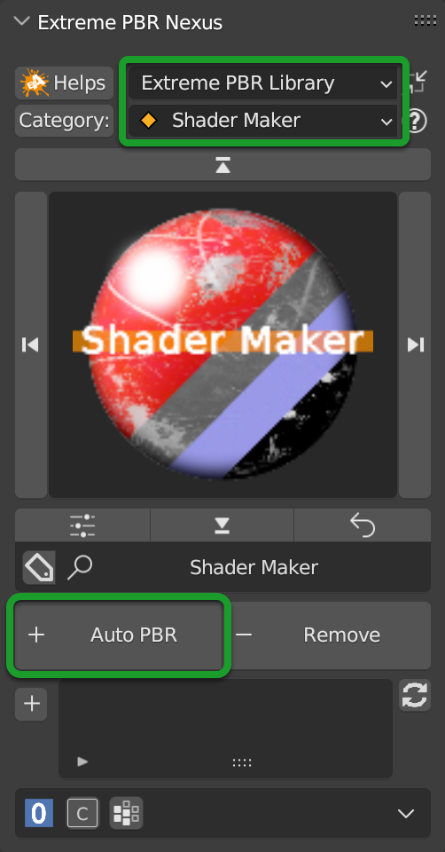
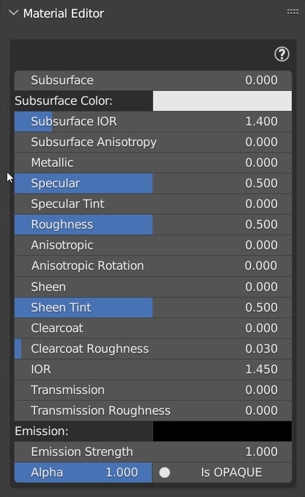
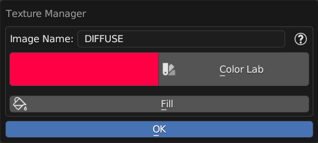

.. _shader_maker_category:

========================
Shader Maker Category
========================

This special category contains some useful tools to create and import shaders.

.. |sm_painter_icon| image:: _static/_images/shader_maker/sm_painter_icon.webp
                        :width: 200
                        :alt: Shader Maker Icon

+--------------------+-------------------+-------------------+
| |shader_maker_icon| |sm_painter_icon|   |video_maker_icon| |
+--------------------+-------------------+-------------------+

.. _shader_maker:

Shader Maker
========================

.. admonition:: Video Tutorial
    :class: youtube

        You can find the video tutorial about Shader Maker here :ref:`tutorial_shader_maker`

This tool of Extreme PBR allows you to create a material on the fly if you have the textures on your computer
this tool recognizes the names of the textures (Maps) based on the suffix or prefix if it exists, so it is able to place
in the right way the maps, this tool is very useful to create materials quickly and easily.

|

List of map nomenclatures that this tool recognizes:

- **Diffuse**: _diffuse_xtm, _albedo, _basecolor, _base_color, _diffuse, _color, _diff, _dif, _col, diffuse
- **Emission**: _emission_xtm, _emission, _emissive, _emiss, _emis, _emi
- **Occlusion**: _occlusion_xtm, _ambient_occlusion, _ambientocclusion, _occlusion, _ao,  ao
- **Subsurface**: _sss_xtm, _subsurface, _sss, _scattering, _scatter
- **Subsurface Strength**: _sss_strength_xtm
- **Metal**: _metal_xtm, _metalness, _metal, _metallic,  metal ,  metallic
- **Specular**: _specular, _reflection, _mirror, _reflective, _reflex, _spec,  specular
- **Roughness**: _roughness_xtm, _roughness, _glossy, _rough, _gloss, _rgh,  roughness
- **Transmission**: _transmission_xtm, _transmission, _glass
- **Mask**: _mask_xtm
- **Alpha**: _alpha_xtm, _transparent, _alpha
- **Normal**: _normal_xtm, _normal_map, _normal, _norm, _nrm,  normal
- **Bump**: _bump_xtm, _bump_map, _bumpmap, _bump,  bump ,  height
- **Displace**: _displace_xtm, _displace, _height, _disp,  displace

------------------------------------------------------------------------------------------------------------------------

Auto PBR
------------------------

|

To add a material with Auto PBR, you must select the Shader Maker category and the Shader Maker,
Then you will have a situation like in the image above-

When you are in this special category, the whole addon understands and behaves differently, now for example, the
**Add New** button described here: :ref:`mp_add_new`, becomes, **Auto PBR** and when you press it a window will open
File Browser, where you can select the Files you want to use for the material, based on the convention described
here is also supported the selection of multiple image files, so you can select all the maps you need for the
material.

You can also choose only 1 file (For example: diffuse) even if it does not have a convention, and then add the others
maps via **Texture Manager** Also described here :ref:`texture_manager_panel`

------------------------------------------------------------------------------------------------------------------------

Material Editor (Nexus)
**************************

Here is the Nexus Panel if you have chosen the **Nexus** setting from the Extreme PBR options menu :ref:`pr_op_material_type`

Having applied the material via Shader Maker (Auto PBR button) now you can edit the material via
Material Editor panel, below you will find the description of the material editor :ref:`module_material_panel`

.. image:: _static/_images/shader_maker/sm_material_editor.webp
    :align: center
    :width: 400
    :alt: Shader Maker Material Editor

------------------------------------------------------------------------------------------------------------------------

Material Editor (Simple PBR)
*******************************

Here is the Simple PBR Panel if you have chosen the **Simple PBR** setting from the Extreme PBR options menu :ref:`pr_op_material_type`

Having applied the material via Shader Maker (Auto PBR button) now you can edit the material via
Material Editor panel, below you will find the description of the material editor :ref:`me_simple_pbr_type`

|

------------------------------------------------------------------------------------------------------------------------

.. _shader_maker_video:

Shader Maker Video
========================

|

Shader Maker Video allows you to apply a video as a material and easily control it from the panel.

.. image:: _static/_images/shader_maker/sm_shader_maker_video_panel_example.webp
    :align: center
    :width: 400
    :alt: Shader Maker Video Panel Example

|

.. note::
        To add this type of Material, just press **Add New** Ref: :ref:`add_remove_buttons` a material with a demo video will be added
        that you can replace with your video.

For the properties described below, refer here, they are common to most of the Extreme PBR materials:

- **Transparent:** :ref:`me_transparent`

- **Transparent Mode:** :ref:`me_transparent_mode`

- **Specular:** :ref:`me_specular`

- **Roughness:** :ref:`me_roughness`

- **Emission:** :ref:`me_emission`

- **Exposure, Contrast, Saturation:** :ref:`tm_adjust_color_properties`

- **Location XYZ:** :ref:`me_vector_location`

- **Rotation XYZ:** :ref:`me_vector_rotation`

- **Scale XYZ:** :ref:`me_vector_scale`

- **Scale Uniform:** :ref:`me_vector_scale_uniform`

------------------------------------------------------------------------------------------------------------------------

Texture Manager Button
------------------------

.. image:: _static/_images/shader_maker/sm_video_texture_manager_button.webp
    :align: center
    :width: 800
    :alt: Shader Maker Video Texture Manager Button

|

Reference here to analyze the Texture Manager panel :ref:`texture_manager_video`

------------------------------------------------------------------------------------------------------------------------

.. _sm_smart_video_start:

Smart Video Start
------------------------

.. image:: _static/_images/shader_maker/sm_smart_video_start.webp
    :align: center
    :width: 400
    :alt: Shader Maker Video Smart Video Start

|

Automatically sets the video to start at frame 0 of the sequencer, all the video will be played, in full loop

------------------------------------------------------------------------------------------------------------------------

Play Animation
------------------------

.. image:: _static/_images/shader_maker/sm_play_animation.webp
    :align: center
    :width: 400
    :alt: Shader Maker Video Play Animation

|

Play Animation button starts the Blender Timeline so that the video starts playing

------------------------------------------------------------------------------------------------------------------------

.. _sm_scene_start_stop:

Scene Start/Stop
------------------------

|

Scene Start, Scene Stop, allows you to set the start frame of the Timeline and the end frame of the Timeline on the fly,
without having to open the Blender timeline.

------------------------------------------------------------------------------------------------------------------------

Jump to Start/End
------------------------

|

These 2 buttons allow you to jump to the initial or final frame of the video, in practice, these 2 buttons move
the Blender timeline to the initial or final frame of the video (Those also set in the :ref:`sm_scene_start_stop` section)

------------------------------------------------------------------------------------------------------------------------

Timeline
------------------------

.. image:: _static/_images/shader_maker/sm_timeline.webp
    :align: center
    :width: 400
    :alt: Shader Maker Video Timeline

|

Timeline Slider, is the representation of where the Blender timeline reader is, in practice through this
slider you can move the Blender Timeline without having to open the Blender Timeline.

.. note::
        If in Play it will be updated every time you pass the mouse over the panel

------------------------------------------------------------------------------------------------------------------------

Video Start/Stop
------------------------

.. image:: _static/_images/shader_maker/sm_video_start_stop.webp
    :align: center
    :width: 400
    :alt: Shader Maker Video Video Start/Stop

|

By these 2 buttons, you can set where the video should start and where it should end.
You can start the video at any frame the important thing is that the Start frame is less than the End frame and vice versa.

------------------------------------------------------------------------------------------------------------------------

Video Loop
------------------------

|

This button allows you to set the video to loop or not, if the video is set to loop, it will start again from the
beginning when it reaches the end frame.

------------------------------------------------------------------------------------------------------------------------

Preview Animated
------------------------

|

This button allows you to preview the video in the viewport, usually this is activated when you press the button described here
:ref:`sm_smart_video_start`

------------------------------------------------------------------------------------------------------------------------

Cathode Fx
------------------------

.. image:: _static/_images/shader_maker/sm_cathode_fx.webp
    :align: center
    :width: 400
    :alt: Shader Maker Video Cathode Fx

|

Cathode Fx allows you to adjust the Cathode effect, Here is an example with the effect at maximum:

.. image:: _static/_images/shader_maker/sm_cathode_fx_example_01.webp
    :align: center
    :width: 800
    :alt: Shader Maker Video Cathode Fx Example 01

------------------------------------------------------------------------------------------------------------------------

Scale Cathode Fx
------------------------

|

Scale cathode fx allows you to adjust the size of the cathode effect, here is an example with a big scale:

.. image:: _static/_images/shader_maker/sm_scale_cathode_fx_example_01.webp
    :align: center
    :width: 800
    :alt: Shader Maker Video Scale Cathode Fx Example 01

------------------------------------------------------------------------------------------------------------------------

Painter
========================

.. image:: _static/_images/shader_maker/sm_painter_icon.webp
    :align: center
    :width: 200
    :alt: Shader Maker Painter

|

Painter Tool, allows you to paint on images, it differs from the Texture paint described here :ref:`texture_paint`
because the **Texture Paint** paints on a mask, while the Painter, paints directly on an image.

.. tip::
        To access the Painter, you must be in the Default Library Of Extreme PBR, in the Shader Maker category,
        and select the **Painter** material from the :ref:`mp_material_browser` and apply it to the object you want to paint.

------------------------------------------------------------------------------------------------------------------------

Painter Panel
------------------------

Once the material has been added, the **Material Editor** panel will look like this:

|

Bellow the properties and operators shared with other Extreme PBR materials:

- **Show / Hide Group:** :ref:`show_hide_group`

- **Search Module/Fx:** :ref:`search_module`

- **Module/Fx Name:** :ref:`module_name`

- **Replace Module/Fx:** :ref:`replace_module`

- **Reset Value:** :ref:`module_reset_values`

- **Tips:** :ref:`module_tips`

- **Paint Tools:** :ref:`paint_tools_panel`

- **Re-Project:**  (Only in Paint Mode) :ref:`re_project`

------------------------------------------------------------------------------------------------------------------------

Maps Size
**************************

|

Maps Size property allows you to set different resolution sizes for maps, in practice if you set
1024, all maps will be rendered at 1024x1024, if you set 2048, all maps will be rendered at 2048x2048 and so on.

------------------------------------------------------------------------------------------------------------------------

Stop Paint
**************************

|

Stop Paint Button, simply stops painting mode.

.. note::
        This button will only appear if you are in Paint mode

------------------------------------------------------------------------------------------------------------------------

Mute/Un-Mute Map
**************************

.. image:: _static/_images/shader_maker/smp_mute_unmute_map.webp
    :align: center
    :width: 800
    :alt: Shader Maker Painter Mute/Un-Mute Map

|

In this Example, all maps are in mute, except the Diffuse map, This is the default situation when
you apply the Painter material.

So the Mute/Un-Mute Map buttons, allow you to disable or enable maps, in this way you can
save system resources.

------------------------------------------------------------------------------------------------------------------------

.. _smp_texture_manager_button:

Texture Manager Button
**************************

.. image:: _static/_images/shader_maker/smp_texture_manager_button.webp
    :align: center
    :width: 800
    :alt: Shader Maker Painter Texture Manager Button

|

This button gives you access to the Texture Manager panel, which in this type of material has the function of managing
the color of the painting and the fill bucket.

------------------------------------------------------------------------------------------------------------------------

.. _smp_texture_manager_panel_rgb:

Texture Manager Panel RGB
******************************

|

Once you press the :ref:`smp_texture_manager_button` button, the Texture Manager panel will open.
In the following paragraphs you will find the description of the panel properties.

.. note::
        In order to paint the maps in Black and White type Specular, Roughness, Metal, Etc ... refer here: :ref:`smp_texture_manager_panel_bw`

------------------------------------------------------------------------------------------------------------------------

Image Name
##########################

|

This text box will show the name of the image you are editing, in addition you can edit the name
of the image you are painting, so as to make the image with the name you like best, very useful in case
you are painting some materials using the Painter, because by default the names of the maps will always be the same,
but with increasing numerical order (.001, .002, .003, etc.)

------------------------------------------------------------------------------------------------------------------------

.. _smp_brush_color:

Brush Color
##########################

|

This property allows you to change the color of the brush, in practice when you paint, the color that
will appear on the texture will be the one you set here.

This color can also be set from the **Color Lab** described here :ref:`color_lab`

------------------------------------------------------------------------------------------------------------------------

Fill
########

|

This button allows you to fill the map with the color you have chosen in the **Brush Color** :ref:`smp_brush_color`

------------------------------------------------------------------------------------------------------------------------

.. _smp_texture_manager_panel_bw:

Texture Manager Panel BW
******************************

.. image:: _static/_images/shader_maker/smp_texture_manager_panel_bw.webp
    :align: center
    :width: 400
    :alt: Shader Maker Painter Texture Manager Panel BW

|

This panel differs from the RGB Type in that the textures of type Specular, Roughness, Metal, Etc ...
are in Black and White, so here, you will not choose the color, but the shade of gray, everything will be managed by the
Strength Slider, where 0.0 will be Black and 1.0 will be White, consequently, painting at 0.0 will work as if you were
deleting.

.. note::
        In order to paint the maps in RGB type Diffuse, Emission, Etc ... refer here: :ref:`smp_texture_manager_panel_rgb`

