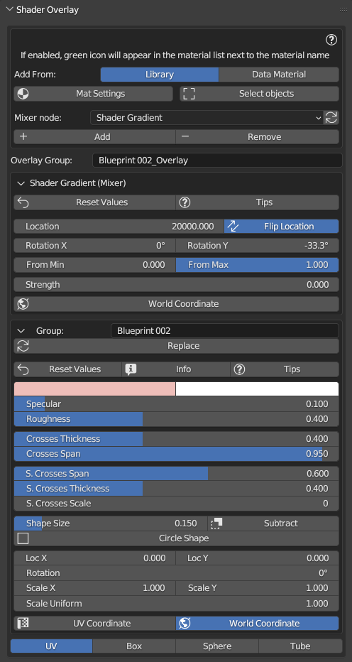
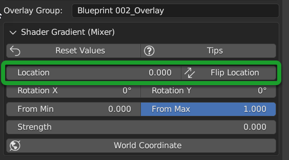
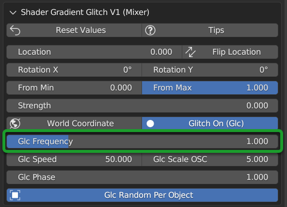

.. _shader_overlay:

Shader Overlay
==================

.. admonition:: Video Tutorial
    :class: youtube

    Here you can find a video tutorial that shows you how to use Shader Overlay: :ref:`shader_overlay_video_tutorial`

.. tip::
        Any material can be applied as Shader Overlay, even materials already present in the scene and that are not
        part of the Extreme PBR library.

Shader overlay is a very useful tool to mix all selected objects (If they have any base material)
with a material of your choice from the Extreme PBR library or even importing a material via Shader Maker, you can find
the Shader Maker You can find the Shader Maker chapter here: :ref:`shader_maker`

Shader Overlay allows you to make animations of the Overlay material through the mixer, so that you can see the coverage of the materials
underlying in an animated way.

Here an example in 3 separate moments of a scene where the Shader Overlay has been applied to all objects:

**Model Without Shader Overlay:**

.. image:: _static/_images/shader_overlay/mars_one_scene_01.webp
    :align: center
    :width: 800
    :alt: Shader Overlay Example 01

|

**Model with shader overlay adjusted about halfway through the field with tilt:**

.. image:: _static/_images/shader_overlay/mars_one_scene_02.webp
    :align: center
    :width: 800
    :alt: Shader Overlay Example 02

|

**Model completely covered by the shader overlay:**

|

.. admonition:: Credits CC-BY
    :class: credits

    Model: **"Mars One" Mission - Base** by **admone** from Sketchfab:
    `Link <https://sketchfab.com/3d-models/mars-one-mission-base-83ced347037f47aba8473147d65df074>`_

------------------------------------------------------------------------------------------------------------------------

Shader Overlay Panel
----------------------

Here's what it looks like the Shader Overlay panel looks in the fullness of its functionality, in the example the
Procedural material **Blueprint 002** has been applied so you will see the sliders to control the parameters of the
material mentioned.

------------------------------------------------------------------------------------------------------------------------

Add From Library
~~~~~~~~~~~~~~~~~~

.. image:: _static/_images/shader_overlay/so_add_from.webp
    :align: center
    :width: 600
    :alt: Shader Overlay Add From

|

In this situation, no shader overlay has been applied. **Add From** is used to choose where you want to take the
material to apply as a shader overlay.

Add From Library allows you to add the shader overlay directly from the Extreme PBR library, just select
the material you want to apply, from the Extreme PBR library then from the :ref:`mp_material_browser` , and press the button
**Add**, explained later here: :ref:`so_add`

------------------------------------------------------------------------------------------------------------------------

Add from Data Material
~~~~~~~~~~~~~~~~~~~~~~~~~~

.. image:: _static/_images/shader_overlay/so_add_from_data_material.webp
    :align: center
    :width: 600
    :alt: Shader Overlay Add From Data Material

|

By selecting **Add From Data Material** you will have the list of materials present in the current Blender project
and you can choose the material you want to apply as Shader Overlay from that list. Once you have selected the material
you want to apply, press the **Add** button, explained later here: :ref:`so_add`

------------------------------------------------------------------------------------------------------------------------

Mixer Node
~~~~~~~~~~~~~~~~~~

|

From the Mixer Node menu you can choose the type of Node you want to use to mix the Shader Overlay with the underlying one.
the nodes will allow you to adjust the settings.

The nodes available are described below:

- **Shader Gradient** :ref:`so_shader_gradient`
- **Shader Gradient Glitch V2** :ref:`so_shader_gradient_glitch_v2`

------------------------------------------------------------------------------------------------------------------------

Replace Mixer Node
*********************

Once you have added the Shader Overlay, you can change the type of Node to use for the Mixer, by clicking on the button
Replace Mixer:

------------------------------------------------------------------------------------------------------------------------

.. _so_add:

Add
~~~~~~~

.. image:: _static/_images/shader_overlay/so_add.webp
    :align: center
    :width: 600
    :alt: Shader Overlay Add

|

The Add button adds to the selected objects the Shader Overlay that you have chosen from the **Add From** menu.
If the Shader Overlay is already present on the selected objects, the Add button replace the previous Shader Overlay
with the new one.

.. important::
        This button adds to all the materials of the selected objects the material chosen as Shader Overlay,
        so if you have selected 10 objects and each of these has 3 materials, the material chosen as Shader Overlay
        will be added to all 30 materials.

------------------------------------------------------------------------------------------------------------------------

.. _so_remove:

Remove
~~~~~~~~~

.. image:: _static/_images/shader_overlay/so_remove.webp
    :align: center
    :width: 600
    :alt: Shader Overlay Remove

|

The Remove button removes the Shader Overlay from the selected objects.

.. important::
        This button removes the Shader Overlay from all the materials of the selected objects,
        so if you have selected 10 objects and each of these has 3 materials, the Shader Overlay
        will be removed from all 30 materials.

------------------------------------------------------------------------------------------------------------------------

Overlay group (Name)
~~~~~~~~~~~~~~~~~~~~~~~~~~

.. image:: _static/_images/shader_overlay/so_overlay_group_name.webp
    :align: center
    :width: 600
    :alt: Shader Overlay Overlay group (Name)

|

Once you have applied any Shader Overlay, a group will be created with the name of the chosen material and a suffix
**"_Overlay"**, from this text box you can view the name, and also modify it, by clicking in the text field
and writing the name you prefer.

This group will be the group that will contain the Shader Overlay material, and the mixer node that will allow you to mix the material
this group is the one that allows you to modify the Shader Overlay for all the materials to which it has been applied.

------------------------------------------------------------------------------------------------------------------------

.. _so_shader_gradient:

Shader Gradient
~~~~~~~~~~~~~~~~~~

.. image:: _static/_images/shader_overlay/so_shader_gradient.webp
    :align: center
    :width: 600
    :alt: Shader Overlay Shader Gradient

|

The Shader Gradient Mixer Node allows you to mix the material with a detachment effect with the underlying material/s.

------------------------------------------------------------------------------------------------------------------------

.. _so_mg_hide_show:

Hide / Show
**************

|

Hide/Show button allows you to hide or show the properties of the chosen mixer for the Shader Overlay.

------------------------------------------------------------------------------------------------------------------------

.. _so_mg_reset_values:

Reset Values
****************

|

This button resets all the values of the Mixer Node to the Default state.

------------------------------------------------------------------------------------------------------------------------

.. _so_mg_tips:

Tips
********

|

This button will show the Tips related to the properties of the Mixer Node, additional buttons will be shown that
once clicked, will show a popup window with the description of the selected property.

In order to hide, press the Tips button again.

------------------------------------------------------------------------------------------------------------------------

.. _so_mg_location:

Location
************

|

Location, allows you to adjust the position of the Shader Overlay material relative to the underlying material.

.. _so_mg_flip_location:

Flip Location
****************

If you activate the Flip Location, the position of the Shader Overlay material is inverted with respect to the set position.

------------------------------------------------------------------------------------------------------------------------

.. _so_mg_rotation_x_y:

Rotation X/Y
**************

.. image:: _static/_images/shader_overlay/so_mg_rotation_xy.webp
    :align: center
    :width: 600
    :alt: Shader Overlay Rotation X/Y

|

These 2 sliders allow you to rotate the detachment of the Shader Overlay material with respect to the underlying material.
This allows you to tilt the Shader Overlay material, so that you can create animations of coverage or
discovery of the underlying material, with various animations.

------------------------------------------------------------------------------------------------------------------------

.. _so_mg_from_min_max:

From Min/Max
****************

|

These 2 sliders allow you to adjust and therefore fade less the detachment of the Shader Overlay material with respect
to the underlying material.

------------------------------------------------------------------------------------------------------------------------

.. _so_mg_strength:

Strength
************

|

Strength Slider property allows you to modify the strength of the Shader Overlay material above the underlying material,

- By default the value is 0.0, so it is a basic right blend.
- If you set -1.0 the Shader Overlay material will be completely disappeared.
- If you set 1.0 the Shader Overlay material will be completely visible on the entire underlying material
  (It will be completely covered excluding the Location value).

------------------------------------------------------------------------------------------------------------------------

.. _so_mg_world_coordinate:

World Coordinate
******************

.. image:: _static/_images/shader_overlay/so_mg_world_coordinate.webp
    :align: center
    :width: 600
    :alt: Shader Overlay World Coordinate

|

If Active, the mixer will use the world coordinates for the positioning of the Shader Overlay material,
this is very useful for leveling the Shader Overlay material on all selected objects, so that the material
Shader Overlay is always at the same height on all objects to which it has been applied.

------------------------------------------------------------------------------------------------------------------------

.. _so_shader_gradient_glitch_v2:

Shader Gradient Glitch V2
~~~~~~~~~~~~~~~~~~~~~~~~~~~~~~~

.. image:: _static/_images/shader_overlay/so_shader_gradient_glitch_v2.webp
    :align: center
    :width: 600
    :alt: Shader Overlay Shader Gradient Glitch V2

|

The Shader Gradient Glitch V2 mixer shares many of the properties of the Shader Gradient mixer,
below are the references to the properties that are the same as the Shader Gradient Mixer:

**Hide / Show** :ref:`so_mg_hide_show`
**Reset Values** :ref:`so_mg_reset_values`
**Tips** :ref:`so_mg_tips`
**Location** :ref:`so_mg_location`
**Flip Location** :ref:`so_mg_flip_location`
**Rotation X/Y** :ref:`so_mg_rotation_x_y`
**From Min/Max** :ref:`so_mg_from_min_max`
**Strength** :ref:`so_mg_strength`
**World Coordinate** :ref:`so_mg_world_coordinate`

------------------------------------------------------------------------------------------------------------------------

Glitch On/Off
***************

.. image:: _static/_images/shader_overlay/so_sgg_glitch_on.webp
    :align: center
    :width: 600
    :alt: Shader Overlay Glitch On/Off

|

Glitch On/Off gives you the possibility to activate and deactivate the glitch effect of the Shader Overlay material.
Once activated, new properties will be shown to control the glitch effect.

------------------------------------------------------------------------------------------------------------------------

GLC Frequency
****************

|

GLC (Glitch) Frequency allows you to adjust the frequency of the glitch effect.

------------------------------------------------------------------------------------------------------------------------

GLC Speed
***********

.. image:: _static/_images/shader_overlay/so_sgg_glc_speed.webp
    :align: center
    :width: 600
    :alt: Shader Overlay GLC Speed

|

GLC (Glitch) Speed allows you to adjust the speed of the glitch effect, the higher the value, the faster the glitch effect.

------------------------------------------------------------------------------------------------------------------------

GLC Scale Osc
***************

.. image:: _static/_images/shader_overlay/so_sgg_glc_scale_osc.webp
    :align: center
    :width: 600
    :alt: Shader Overlay GLC Scale Osc

|

GLC (Glich) Scale Osc allows you to adjust the scale Oscillator of the glitch effect. The oscillator is the one that generates
the glitch animation.

------------------------------------------------------------------------------------------------------------------------

GLC Phase
************

.. image:: _static/_images/shader_overlay/so_sgg_glc_phase.webp
    :align: center
    :width: 600
    :alt: Shader Overlay GLC Phase

|

GLC (Glitch) Phase allows you to adjust the phase of the glitch effect. This allows you to shift the glitch oscillator,
in case you have applied more Shader Overlay **DIFFERENT** on objects, and you want to de-synchronize the glitch oscillator.

This is useful to avoid an annoying glitch synchronization effect.

.. note::
        If you have applied the same Shader Overlay on different objects, and you want to de-synchronize, just use
        the button :ref:`glc_random_per_object`

------------------------------------------------------------------------------------------------------------------------

.. _glc_random_per_object:

GLC Random Per Object
************************

.. image:: _static/_images/shader_overlay/so_sgg_glc_random_per_object.webp
    :align: center
    :width: 600
    :alt: Shader Overlay GLC Random Per Object

|

This button, if activated, makes the glitch effect on the objects to which it has been applied **the same Shader Overlay**
randomly, this allows you to de-synchronize the glitch effect, if you want to apply the same Shader Overlay
to multiple objects.

.. tip::
        To apply the same Shader Overlay to multiple objects, select the objects of interest and press the button
        **Add** in the :ref:`so_add` section

------------------------------------------------------------------------------------------------------------------------

Material Layout
~~~~~~~~~~~~~~~~~~~~~~~~~~~~~~~

|

In this area of the Shader Overlay interface, the materials that have been added as Shader Overlay are shown,
and for each material the name, the type of Mixer Node used, and the buttons to modify the material are shown.

.. important::
        Any material can be applied as Shader Overlay, but only materials from the Extreme PBR libraries will be shown
        in an orderly manner with the properties exposed as per example.
        If the properties of the material are not present, it will still be possible to use it as Shader Overlay.

------------------------------------------------------------------------------------------------------------------------

Replace
*********

.. image:: _static/_images/shader_overlay/so_replace.webp
    :align: center
    :width: 600
    :alt: Shader Overlay Replace

