.. _texture_manager_panel:

Texture Manager Panel
=========================

.. seealso::
    In order to access the Texture Manager panel, refer to the :ref:`texture_manager_button` chapter

The texture manager panel is used to access the texture management features of the current material,
please note, the material must be created with Nexus setting :ref:`pr_op_material_type`

Here's how the texture manager looks, in an example from the diffuse property:

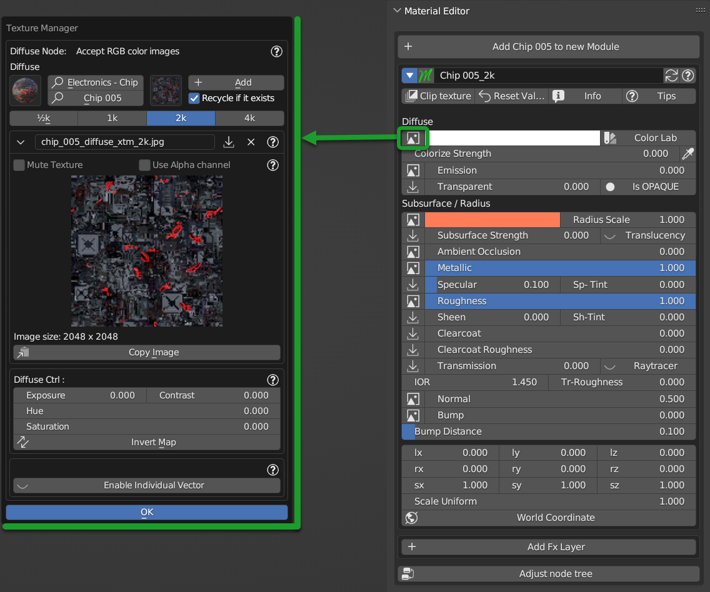

.. note::
        The texture manager can be of 3 types, for 3 types of Texture Map: **RGB Map**, **Black and White** and **Normal Map**

.. tip::
        The Texture Manager panel is very interesting, as it allows you to access all the materials present in the library
        of Extreme PBR and therefore to change the texture on the fly on the current material. This allows you to change
        also the roughness maps or any other map, so you can edit the maps of a material
        and customize the situation at will.

|

All the buttons indicated below are those of the texture manager of each property:

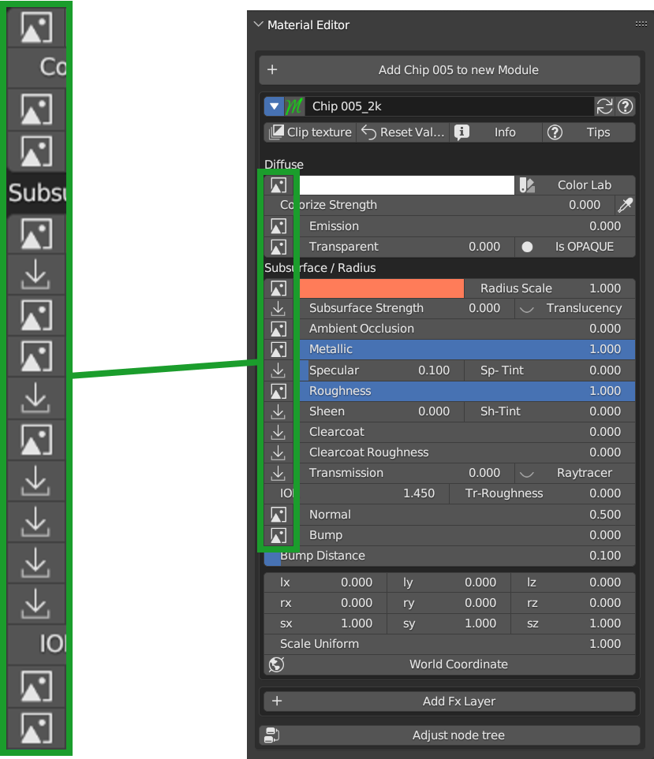

|

.. note::
        The buttons that do not have the square icon with Image (That is, those with the import arrow icon) are the buttons that
        indicate that the map is not present, therefore no map has been applied for that property.
        **Not all properties require a map, so not all properties have a square button with an image.**

------------------------------------------------------------------------------------------------------------------------

.. _texture_manager_rgb:

Texture Manager RGB
-------------------------

This is the Texture Manger panel to manage RGB type textures:

------------------------------------------------------------------------------------------------------------------------

.. _tm_material_browser:

Material Browser
*****************

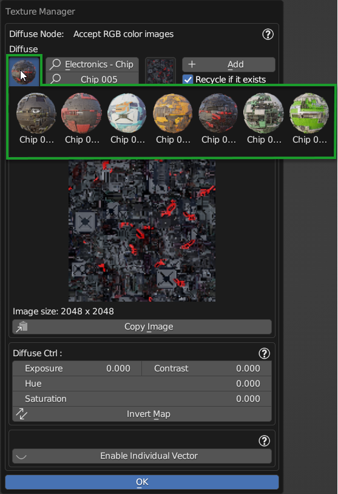

|

From Material Browser you can choose the material present in the selected category and then access its textures, if present
in the chosen material.

------------------------------------------------------------------------------------------------------------------------

.. _tm_search_category:

Search Category
*****************

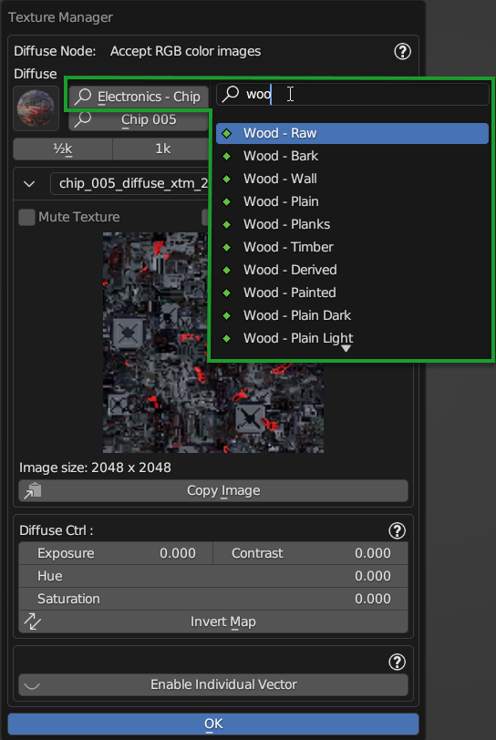

|

By clicking on the category search button, you can choose the category of materials from which to choose the material.
You can enter the name to search for the material you are interested in.

------------------------------------------------------------------------------------------------------------------------

.. _tm_search_material:

Search Material
*****************

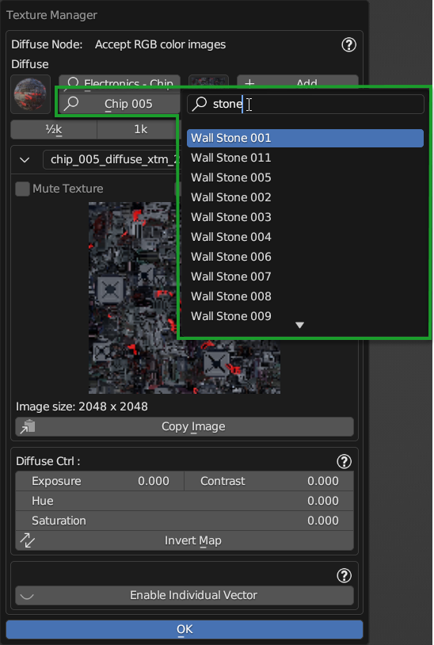

|

By clicking on the Search Material button you can search for the material you are interested in, entering the name of the
material to search for. Once identified, it will be shown in the preview :ref:`tm_material_browser` and you can access its textures.

------------------------------------------------------------------------------------------------------------------------

.. _tm_texture_browser:

Texture Browser
*****************

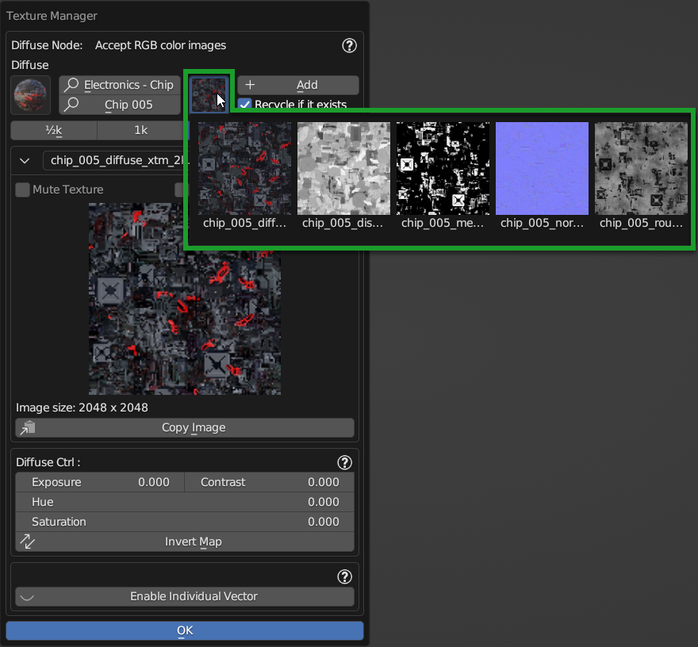

|

By clicking on Texture Browser you will have access to the preview of all the textures present in the material selected in the :ref:`tm_material_browser`.
You can import and replace the current texture with the one selected via the **Add** button explained below.

------------------------------------------------------------------------------------------------------------------------

.. _tm_add:

Add
*****************

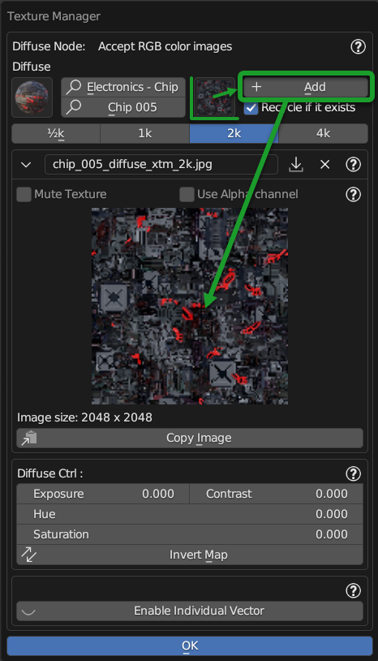

|

The Add button allows you, once you have chosen the texture to apply (or replace) to apply it to the current property
in this case the **Diffuse**.
The texture applied will be shown in the preview of the texture used.

------------------------------------------------------------------------------------------------------------------------

.. _tm_recycle_if_exists:

Recycle if Exists
*****************

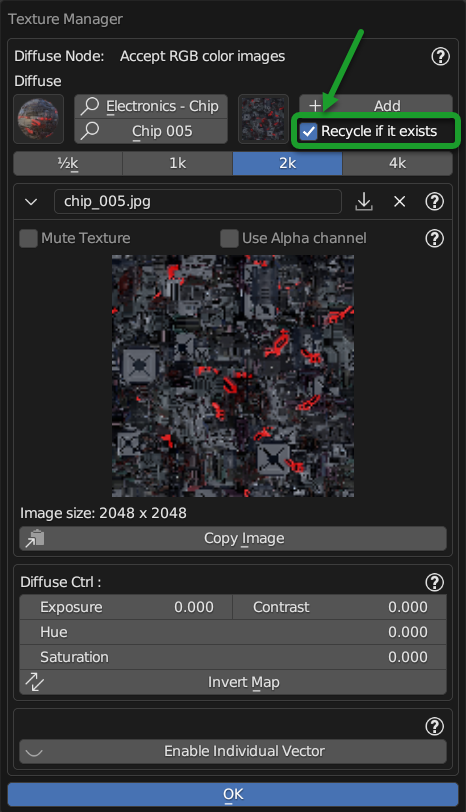

|

If active, at the moment you apply a texture from the **Texture Browser** and this texture is already present in the scene,
the texture already present in the scene will be applied, otherwise the texture chosen from the **Texture Browser** will be applied.

I recommend leaving this option active in order to avoid having duplicate textures in the scene.

------------------------------------------------------------------------------------------------------------------------

.. _tm_texture_resolution:

Texture resolution
*******************

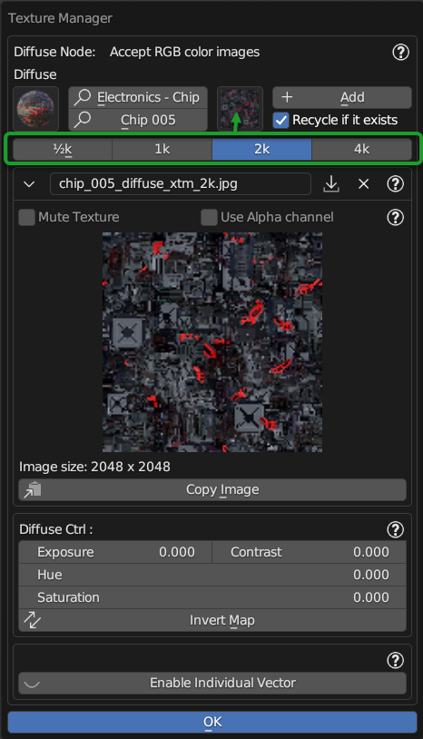

|

By the resolution selector, you can choose which resolution to use for the selected texture.

.. note::
        This will only take effect by applying the texture, it will not affect the texture already in use.

------------------------------------------------------------------------------------------------------------------------

.. _tm_search_data_images:

Search Data Images
*******************

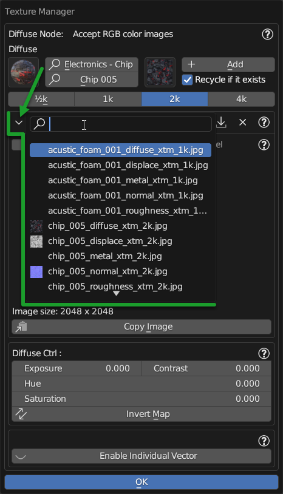

|

By clicking on the **Search Data Images** button you can search for the images present in the scene, that is in the **bpy.data.images**
of the current project. It allows you to view and search among all the images you are using in the project.
This is useful for reusing images already present in the project and not having to search for them every time, so as to
have the project cleaner and less heavy.

------------------------------------------------------------------------------------------------------------------------

.. _tm_texture_name:

Texture Name
*******************

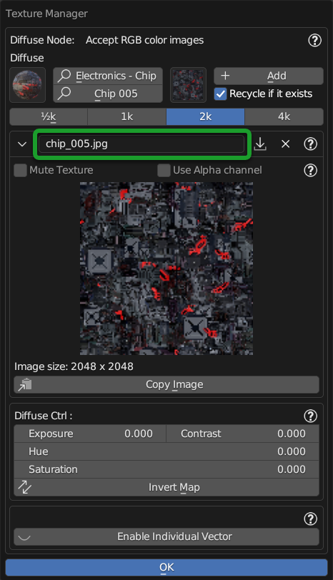

|

By this text box, you can view the name of the current Texture Image and also edit it if necessary,
simply by clicking on it and typing the new name.

------------------------------------------------------------------------------------------------------------------------

.. _tm_import_image_texture:

Import Image Texture
*************************

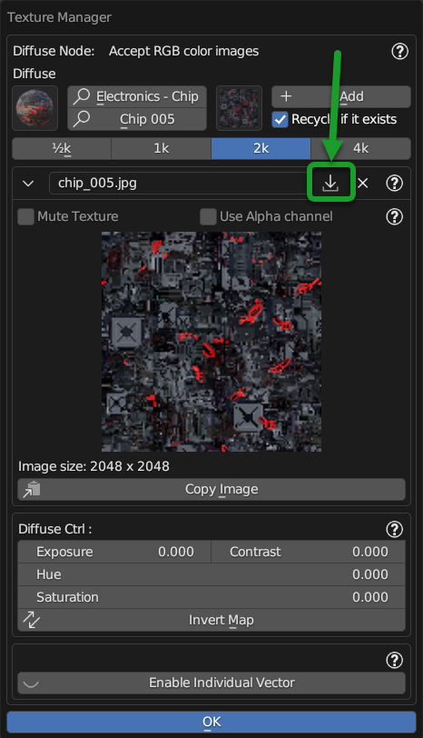

|

By pressing this button a file browser will open, from which you can load the image to use as a texture, one
once selected and imported, the current texture (if present) will be replaced with the one just imported.

------------------------------------------------------------------------------------------------------------------------

.. _tm_remove_texture:

Remove Texture
*******************

|

By pressing the Remove Texture button, the current texture will be removed, so no texture will be used for the current map.

Once the texture has been removed, the panel will be shown approximately in this way, with an image icon preview:

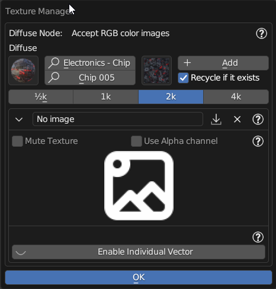

------------------------------------------------------------------------------------------------------------------------

.. _tm_mute_texture:

Mute texture
*******************

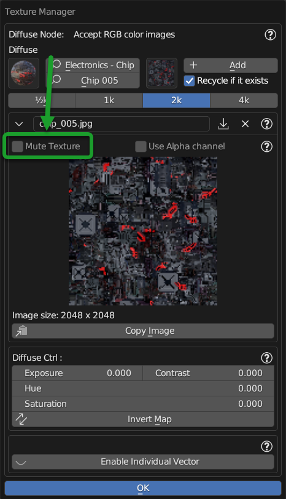

|

This checkbox allows you to hide the texture from the current material.

.. tip::
        This can be useful if your material exceeds the number of 24 Textures, which is a Blender limit
        some texture map you can mute them in order to save space for other textures.

------------------------------------------------------------------------------------------------------------------------

.. _tm_use_alpha_channel:

Use Alpha Channel
*******************

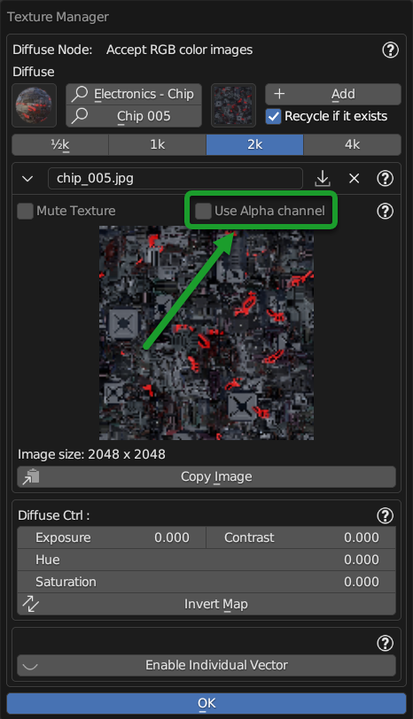

|

If active, and if the texture is of type for example PNG in which an alpha channel is present (Used as a rule for transparencies)
this will be used for the transparency of the texture.

.. tip::
        Extreme PBR materials have a special Alpha map, so they do not need this option, but it is still
        important if you have imported a texture with an alpha channel and want to use it for transparency.

.. note::
        This button is only present in the **Diffuse** properties in the different texture managers you will not find
        this button.

------------------------------------------------------------------------------------------------------------------------

.. _tm_copy_paste_texture:

Copy Paste Texture
*******************

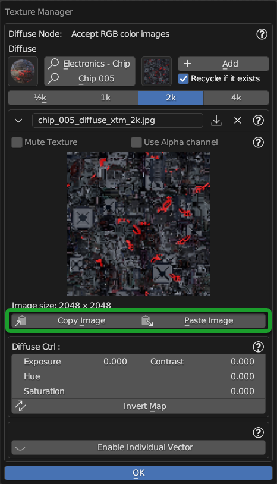

|

These 2 buttons allow you to Copy the image currently used in the material and paste it into another material.
The texture will be copied to the clipboard.

------------------------------------------------------------------------------------------------------------------------

.. _tm_adjust_color_properties:

Adjust color properties
************************

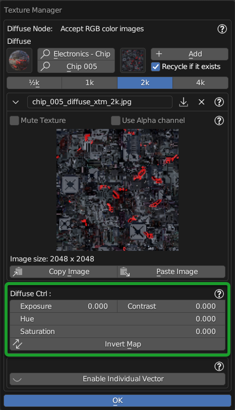

|

By this properties you can adjust the color of the texture, so you can edit it as you like.

- **Exposure** - Adjusts the exposure of the texture, so you can make it brighter or darker.
- **Contrast** - Adjusts the contrast of the texture, so you can make it more contrasted or less contrasted.
- **Hue** - Adjusts the hue of the texture, so you can make it more red or more blue. (If the map has few colors, it may not have a marked effect)
- **Saturation** - Adjusts the saturation of the texture, so you can make it more or less colorful.
- **Invert Map** - Inverts the texture, that is, makes it negative.

------------------------------------------------------------------------------------------------------------------------

.. _tm_enable_individual_vector:

Enable Individual Vector
******************************

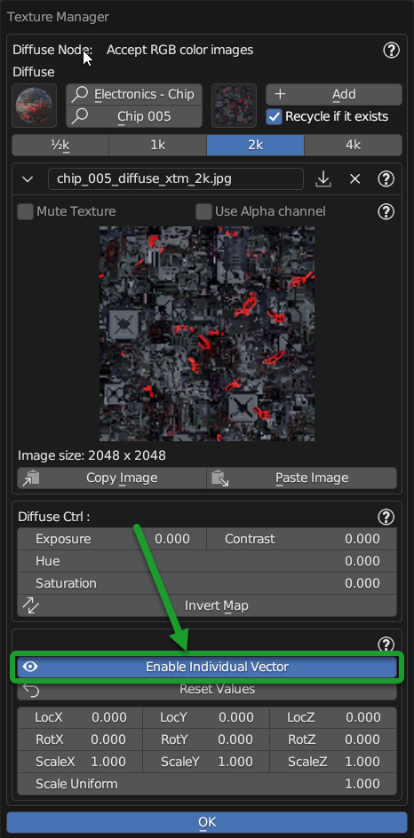

|

This button activates / deactivates the node before the image texture, so that you can modify the texture vector
independently of the others present in the current material.

------------------------------------------------------------------------------------------------------------------------

.. _tm_reset_values:

Reset Values
******************************

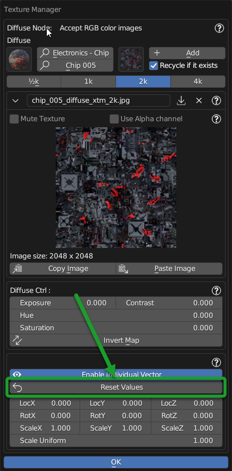

|

This button resets the values of the individual vector to the default values.

------------------------------------------------------------------------------------------------------------------------

.. _tm_individual_vectors:

Individual Vectors
******************************

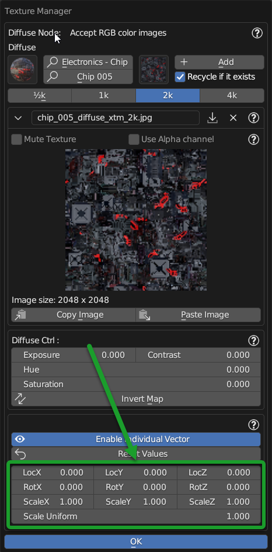

|

These properties behave exactly like those described here:

- :ref:`me_vector_location`
- :ref:`me_vector_rotation`
- :ref:`me_vector_scale`
- :ref:`me_vector_scale_uniform`

These properties are linked only to the current texture, and not to the other maps of the material.

------------------------------------------------------------------------------------------------------------------------

Texture Manager Non-Color
---------------------------------

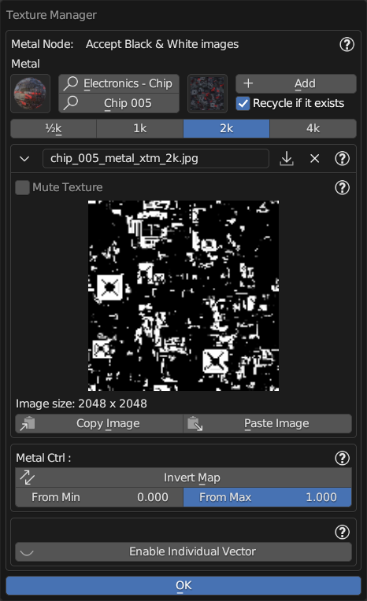

|

This version of the texture manager differs from the others, as it is used for Black and White textures,
that is, maps like:

- **Transparent**
- **Roughness**
- **Metallic**
- **Ambient Occlusion**
- **Bump/Displace**
- **Specular**
- **Etc...**

So all Black and White type maps.

Here are the properties of this panel that are identical to those of the classic Texture Manager panel:

- :ref:`tm_material_browser`
- :ref:`tm_search_category`
- :ref:`tm_search_material`
- :ref:`tm_texture_browser`
- :ref:`tm_add`
- :ref:`tm_recycle_if_exists`
- :ref:`tm_texture_resolution`
- :ref:`tm_search_data_images`
- :ref:`tm_texture_name`
- :ref:`tm_import_image_texture`
- :ref:`tm_remove_texture`
- :ref:`tm_mute_texture`
- :ref:`tm_copy_paste_texture`

------------------------------------------------------------------------------------------------------------------------

.. tm_invert_map:

Invert Map
*******************

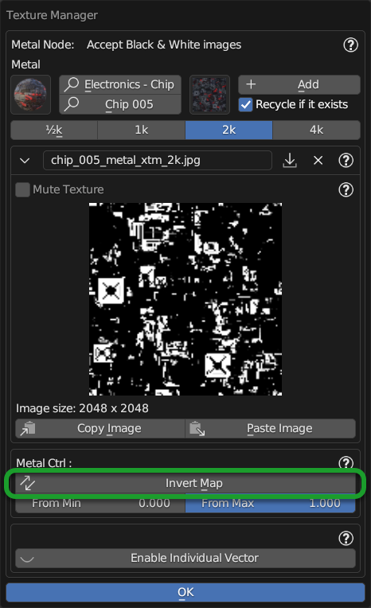

|

Invert map button, allows you to invert the texture, that is, make it negative. The effect of this map is inverted.
For example, if a Metal map, once the metallic part becomes non-metallic and vice versa.

------------------------------------------------------------------------------------------------------------------------

.. _tm_from_min_from_max:

From Min From Max
*******************

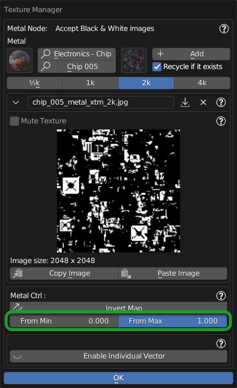

|

These 2 sliders allow you to adjust the minimum and maximum value of the texture, so you can adjust it
as you prefer, and make the effect of the texture more or less marked and strong, especially in the detachment between White and Black,
which are in fact the colors of the map that decide where the effect is present (White) and where it is not present (Black)

------------------------------------------------------------------------------------------------------------------------

Texture Manager Normal
---------------------------------

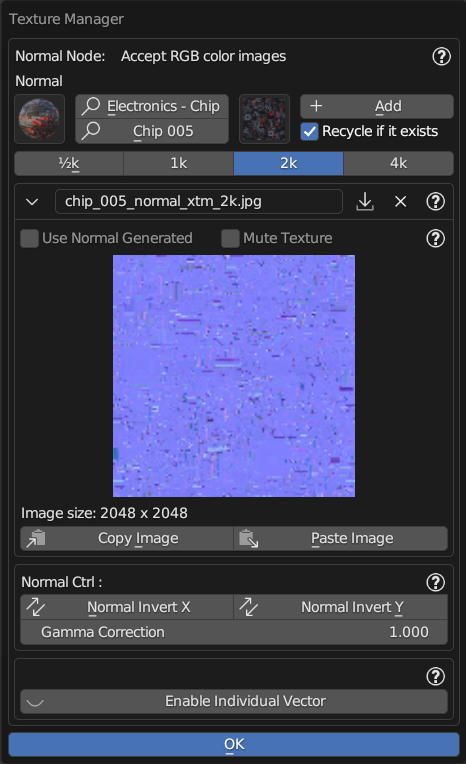

|

This panel is almost identical to the previous Texture Manager, but is used for Normal maps, so it has some more properties
in addition to these:

- :ref:`tm_material_browser`
- :ref:`tm_search_category`
- :ref:`tm_search_material`
- :ref:`tm_texture_browser`
- :ref:`tm_add`
- :ref:`tm_recycle_if_exists`
- :ref:`tm_texture_resolution`
- :ref:`tm_search_data_images`
- :ref:`tm_texture_name`
- :ref:`tm_import_image_texture`
- :ref:`tm_remove_texture`
- :ref:`tm_mute_texture`
- :ref:`tm_copy_paste_texture`

------------------------------------------------------------------------------------------------------------------------

.. _tm_use_normal_generated:

Use Normal Generated
*************************

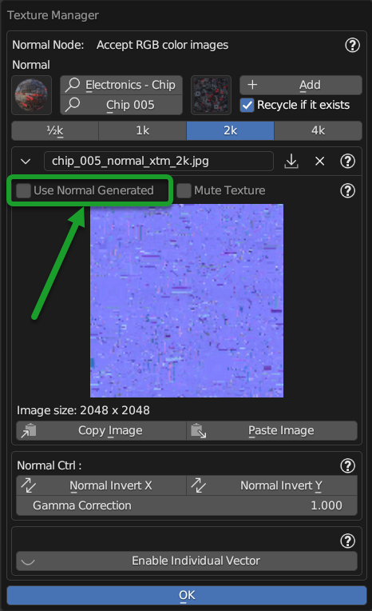

|

Use Normal Generated button allows you to generate, through the appropriate nodes present in the material, to generate a Normal map from the
maps present in the material.

.. hint::
    This is useful if for example you are using a material that does not contain a Normal Map, or you have imported a material
    that only has the diffuse map. The effect obtained will still be good, even if not perfect.

Generated From
#####################

Once activated, you can also choose which map to use from the dropdown menu, the maps present in the material will be shown,
the one selected will be used to generate the Normal map.

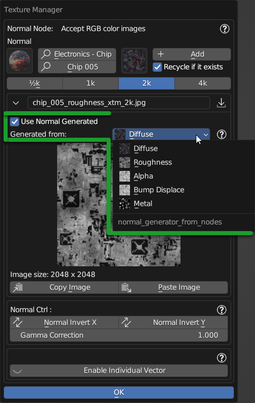

------------------------------------------------------------------------------------------------------------------------

Normal Invert X/Y
*******************

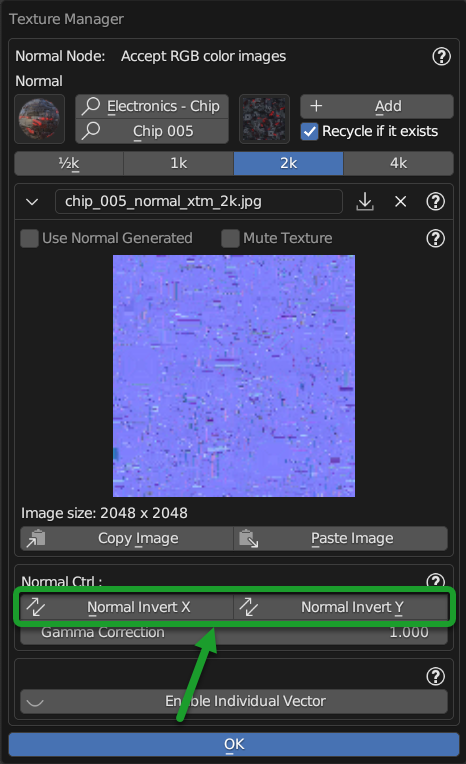

|

These 2 buttons allow you to invert the X and Y axes of the Normal map, this is useful if the Normal map is created for
game environments, where the axes are reversed compared to Blender.

.. important::
        All the maps present in Extreme PBR default library, are all aligned with the right direction X and Y, so it is not necessary
        use these buttons, unless you import maps from other material packages where some axes are reversed.

.. tip::
        If you want to invert the Normal map, so that the relief effect is reversed, activate both buttons

------------------------------------------------------------------------------------------------------------------------

Gamma Correction
*******************

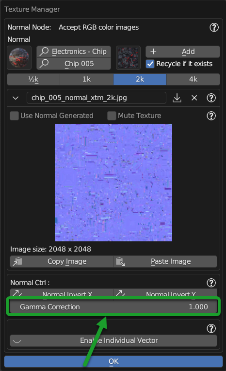

|

Gamma Correction, allows you to adjust the Gamma value of the Normal map, this is useful if the Normal map is too strong or too weak,
in this way you can adjust it as you prefer and make it the best.

------------------------------------------------------------------------------------------------------------------------

.. _texture_manager_video:

Texture Manager Video
---------------------------------

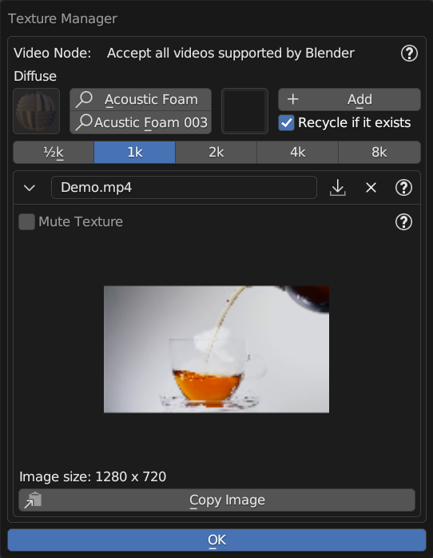

|

This Texture Manager panel version is used for Video textures, so it has no particular functions because if you are using the Shader Maker Video,
all the necessary properties are already present in the **Material Editor** panel described here: :ref:`shader_maker_video`

- :ref:`tm_material_browser`
- :ref:`tm_search_category`
- :ref:`tm_search_material`
- :ref:`tm_texture_browser`
- :ref:`tm_add`
- :ref:`tm_recycle_if_exists`
- :ref:`tm_texture_resolution`
- :ref:`tm_search_data_images`
- :ref:`tm_texture_name`
- :ref:`tm_import_image_texture`
- :ref:`tm_remove_texture`
- :ref:`tm_mute_texture`
- :ref:`tm_copy_paste_texture`

