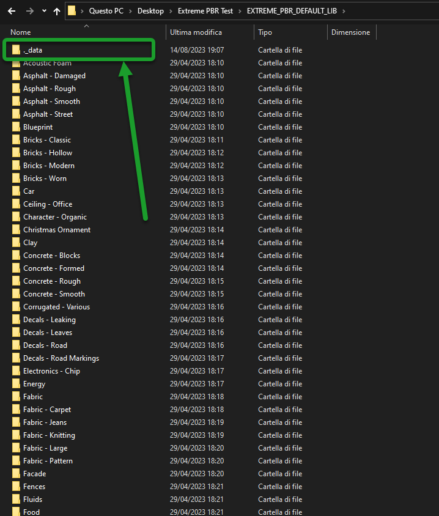

.. _troubleshooting:

Troubleshooting
===============

In this section there are some tips to solve known problems.
This section will be updated over time based on the major problems encountered by users.
Problems related to Extreme PBR bugs are usually solved. Here are some of the most common problems.
Question and answer

I do not receive mail from BlenderMarket
-----------------------------------------

Make sure you consented to receive emails from creators in your Blender Market account preferences:
https://blendermarket.com/account/privacy-center/consents

------------------------------------------------------------------------------------------------------------------------

Find Options Menu
------------------

To go to the Extreme PBR options, you have to go to the addon preferences. But to make this process easier there is
a button directly in the Extreme PBR interface:

------------------------------------------------------------------------------------------------------------------------

Relink Libraries
-----------------

If for some reason, for example:

- You moved the Extreme PBR libraries to another folder
- You copied the Extreme PBR libraries to another computer

You have to indicate the paths of the Extreme PBR libraries which are usually 2 folders called respectively:

- **EXTREME_PBR_DEFAULT_LIB** (Extreme PBR default library)
- **EXTREME_PBR_USER_LIB** (Extreme PBR User Library, which could also be empty, since it is the one where you can
  save your personal libraries)

So go to ``edit--> Preferences--> Addons--> Extreme PBR --> Libraries``

Now indicate the paths to the folders mentioned above.

.. seealso::
    Here is the link to the page that refers to the libraries section: :ref:`pr_libraries`

------------------------------------------------------------------------------------------------------------------------

Pink Materials
-----------------

It may happen that there are files that referred to the material that have been moved, so the material
no longer has a reference image.

Here's how to do it: :ref:`pr_op_fix_materials`

------------------------------------------------------------------------------------------------------------------------

Black Materials
----------------

In this case there may be a problem when creating a file in a newer version of Blender, and then after saving the project
it is opened in a previous version of Blender.

Sometimes Blender updates its nodes, so it may be that the nodes are no longer retro compatible with the previous version.
To solve this I have provided a function that tries to replace the "Unknown" nodes

You can find it in the Extreme PBR Options menu in this paragraph: :ref:`pr_op_adjust_all_material_node_tree`

------------------------------------------------------------------------------------------------------------------------

Moving libraries to another computer
------------------------------------

To move the libraries to another computer, just copy the "EXTREME_PBR_DEFAULT_LIB" and "EXTREME_PBR_USER_LIB" folders

If once connected the libraries from the "Libraries" menu in Extreme PBR preferences the addon does not work,
it could be that in the folders mentioned above, the "._data" folders are missing, so make sure they are inside each library.

|

- **To Show the hidden folders in Windows:**

    1. Open File Explorer from the application bar.
    2. Select View > Options > Modify folder and search options.
    3. Select the View tab and in Advanced settings, select Show hidden folders, files and drives and OK.

- **To Show the hidden folders in Mac:**

    1. Access the folder where you think there are hidden files.
    2. Step 2: Press the keys "Command + Shift + (.)"

    Or:

    1. In Finder, open up your Macintosh HD folder
    2. Press Command+Shift+Dot
    3. Your hidden files will become visible. Repeat step 2 to hide them again!

- **To Show the hidden folders in Linux:**

    Press the menu button in the top-right corner of the window and select Show Hidden Files, or press Ctrl+H.

------------------------------------------------------------------------------------------------------------------------

.. _troubleshooting_auto_pack_resources:

Why if I export the project to another computer I can no longer see the materials?
****************************************************************************************

This is quite normal, by default blender does not package images in .blend files, to do this you have to go to

- File > External Data > Automatically Pack Resources

Then save the project, and finally you can move it to any other computer. It will contain all the images you used.

Pay attention to this, because your .blend files after these operations will contain all the image files present
in your project is present an image of 100MB (For example) your .blend file will become 100MB more.

.. image:: _static/_images/troubleshooting/auto_pack_resources_01.png
    :align: center
    :width: 600
    :alt: Auto Pack Resources 01

------------------------------------------------------------------------------------------------------------------------

What has changed from 4.0.X series to 4.1.X series?
-----------------------------------------------------

The new features and changes described here: :ref:`updates_log`

The important change that occurs in the new Extreme PBR 4.1.x series is the fact that now the libraries are in .exapack
format, this is a format for distributing the files of the library (Just like in HDRi Maker) that allows you to install
the libraries in a simple and fast way.

.. important::

        The change of course towards the distribution of libraries in .exapack format took place for 2 substantial reasons:

        - Some users found that having to register for free on Extreme-Addons.com to be able to download the libraries
          was a nuisance (And I understand it)

        - In some parts of the world, the server speed for downloading libraries was slow (In any case
          on request I have already provided the libraries several times via an alternative download. This was the most annoying
          of the problems and I understand how annoying it was to contact me for this.

        So for this reason I decided to keep the download service active for those who wanted to continue using it
        but substantially I'm trying to move towards the .exapack format.

        **My consideration:**

            I apologize for the server speed inconvenience, but I really did my best to solve the problem
            with those who are managing the site for me at the moment.

        **With this distribution system you will no longer need to download the libraries from Extreme-Addons.com and
        consequently there is no need to register on it**

If you want to continue using the extreme-addons service

- you just have to go to the addon options and click on **I have an Extreme Addon account** from the addon oprions
  here is how to do it: :ref:`pr_op_i_have_an_account_on_extreme_addons`

------------------------------------------------------------------------------------------------------------------------

Fix Materials of Extreme PBR created with the version of Blender 3.x.x in Blender 4.x.x or vice versa
------------------------------------------------------------------------------------------------------------------------

|

Between versions 3.x.x and 4.x.x of Blender the Principled BSDF node of Blender has changed, there are 2 ways to solve
this problem, Extreme PBR will automatically recognize the version in use and will convert the materials in order to
make them compatible with the version of Blender you are using.

- **Solution 1:**

    - Select the object that contains the material, if the nodes present are not compatible select the material and press
      the **Convert Module System** button this button will convert all the materials present in the project to the system
      of nodes necessary to work correctly in the version you are using of Blender.

    .. image:: _static/_images/troubleshooting/convert_module_system_button_01.webp
        :align: center
        :width: 400
        :alt: Convert Module System Button 01

- **Solution 2:**

    - Go to the Extreme PBR Options menu and press the **Adjust all material node tree** button this button will convert
      all the materials present in the project to the node system necessary to work correctly in the version you are using
      of Blender. Here is the reference to the indicated button :ref:`pr_op_adjust_all_material_node_tree`

    .. image:: _static/_images/troubleshooting/open_options_02.webp
        :align: center
        :width: 400
        :alt: Open Options 02

