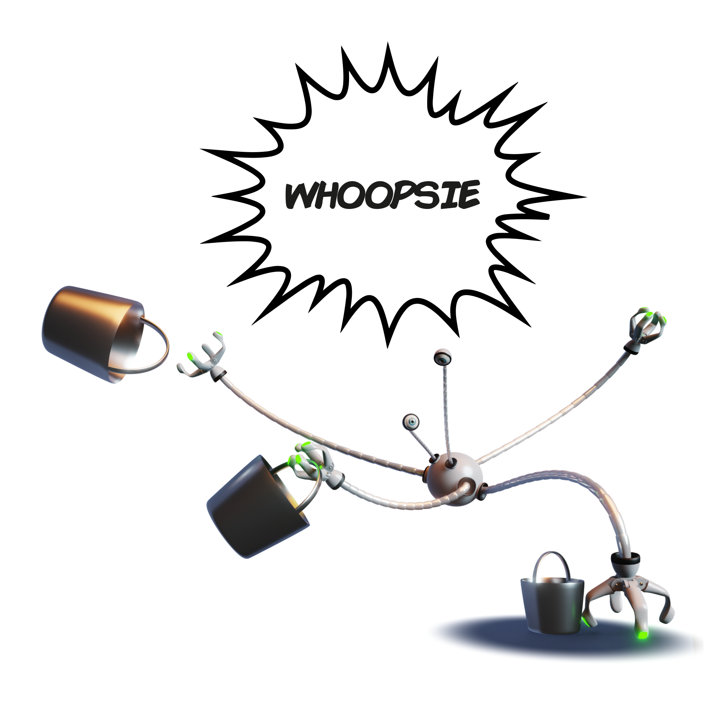
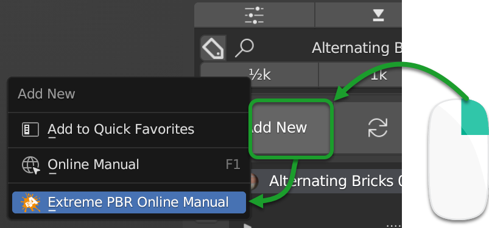

Undocumented
==================

**Message only if you got here through this "Online Manual" menu:**

|

Some buttons cannot be documented yet, but we are working on it. For now if you don't find the documentation
related to a particular button, make sure to look for the question mark (?) button present in all the panels
of Extreme PBR, this will take you to the section with the buttons and their explanations.

I tried to document all the buttons, maybe some are not yet available in documentation, make sure in case
you got here, from which section of Extreme PBR you clicked the button, all the panels have an icon in the shape of
question mark, by clicking on it the documentation related to that panel opens and you will probably find what you are
looking for.

|

.. note::
    If you got here through the documentation page, don't worry about this message, it's just for those who got here
    through the "Online Manual" menu of Extreme PBR 😊

Andrew_D

